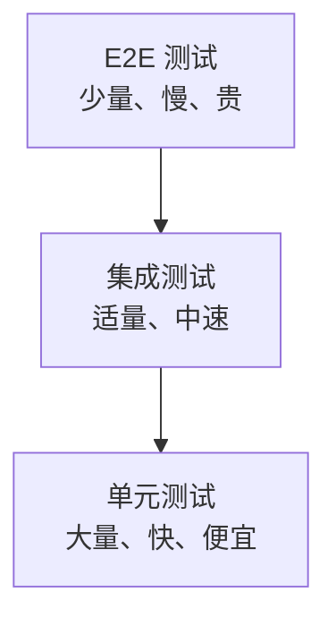

## 1. 测试金字塔

### 1.1 经典金字塔



### 1.2 各层对比

| 层级     | 范围     | 速度 | 成本 | 数量 |
| -------- | -------- | ---- | ---- | ---- |
| 单元测试 | 函数/类  | 毫秒 | 低   | 多   |
| 集成测试 | 模块间   | 秒   | 中   | 适量 |
| 系统测试 | 整体系统 | 分钟 | 高   | 少   |
| 验收测试 | 业务场景 | 分钟 | 高   | 少   |

## 2. 单元测试

### 2.1 定义

对软件中最小可测试单元（函数、方法、类）进行验证。

### 2.2 特点

| 特点   | 描述             |
| ------ | ---------------- |
| 隔离性 | 与外部依赖隔离   |
| 快速   | 毫秒级执行       |
| 自动化 | CI/CD 集成       |
| 可重复 | 任何环境结果一致 |

### 2.3 AAA 模式

```python
def test_user_creation():
    # Arrange（准备）
    user_data = {"name": "Alice", "email": "alice@example.com"}

    # Act（执行）
    user = create_user(user_data)

    # Assert（断言）
    assert user.name == "Alice"
    assert user.email == "alice@example.com"
```

### 2.4 Mock 与 Stub

| 技术 | 描述         | 用途               |
| ---- | ------------ | ------------------ |
| Stub | 返回固定值   | 替换外部依赖       |
| Mock | 验证交互行为 | 验证方法是否被调用 |
| Spy  | 记录调用     | 部分模拟           |
| Fake | 简化实现     | 内存数据库         |

```python
from unittest.mock import Mock, patch

# Stub
db = Mock()
db.get_user.return_value = {"id": 1, "name": "Alice"}

# Mock
email_service = Mock()
create_user(data, email_service)
email_service.send_welcome.assert_called_once_with("alice@example.com")
```

## 3. 集成测试

### 3.1 定义

验证模块间的接口和交互是否正确。

### 3.2 集成策略

| 策略     | 描述               | 优缺点         |
| -------- | ------------------ | -------------- |
| 大爆炸   | 一次性集成所有模块 | 简单但定位困难 |
| 自顶向下 | 从上层模块开始     | 需要 Stub      |
| 自底向上 | 从底层模块开始     | 需要 Driver    |
| 三明治   | 上下同时进行       | 综合方案       |
| 增量式   | 逐步添加模块       | 定位容易       |

### 3.3 集成测试类型

| 类型       | 描述           |
| ---------- | -------------- |
| 组件集成   | 模块间接口测试 |
| 系统集成   | 子系统间测试   |
| API 集成   | 接口契约测试   |
| 数据库集成 | 数据层交互测试 |

### 3.4 示例

```python
import pytest
from httpx import AsyncClient
from app.main import app

@pytest.mark.asyncio
async def test_user_api_integration():
    async with AsyncClient(app=app, base_url="http://test") as client:
        # 创建用户
        response = await client.post("/api/users", json={
            "name": "Alice",
            "email": "alice@example.com"
        })
        assert response.status_code == 201
        user_id = response.json()["id"]

        # 查询用户
        response = await client.get(f"/api/users/{user_id}")
        assert response.status_code == 200
        assert response.json()["name"] == "Alice"
```

## 4. 系统测试

### 4.1 定义

对完整系统进行端到端测试，验证是否满足需求规格。

### 4.2 测试类型

| 类型       | 描述               |
| ---------- | ------------------ |
| 功能测试   | 验证功能需求       |
| 非功能测试 | 性能、安全、兼容性 |
| 端到端测试 | 完整业务流程       |

### 4.3 端到端测试示例

```javascript
// Playwright E2E 测试
import { test, expect } from '@playwright/test';

test('user can login and view dashboard', async ({ page }) => {
  await page.goto('/login');
  await page.fill('[name="email"]', 'user@example.com');
  await page.fill('[name="password"]', 'password123');
  await page.click('button[type="submit"]');

  await expect(page).toHaveURL('/dashboard');
  await expect(page.locator('h1')).toContainText('Welcome');
});
```

## 5. 验收测试

### 5.1 定义

由用户或客户验证软件是否满足业务需求。

### 5.2 类型

| 类型       | 描述                 | 执行者   |
| ---------- | -------------------- | -------- |
| Alpha 测试 | 开发环境中的用户测试 | 内部用户 |
| Beta 测试  | 生产环境中的用户测试 | 外部用户 |
| UAT        | 用户验收测试         | 业务用户 |
| 合同验收   | 合同要求验证         | 客户代表 |

### 5.3 验收准则

```gherkin
Feature: 用户登录
  Scenario: 成功登录
    Given 用户在登录页面
    When 输入正确的用户名和密码
    Then 跳转到首页
    And 显示欢迎消息

  Scenario: 密码错误
    Given 用户在登录页面
    When 输入错误的密码
    Then 显示错误提示
    And 仍在登录页面
```

## 6. 测试层级选择

| 场景     | 推荐层级          |
| -------- | ----------------- |
| 日常开发 | 单元测试为主      |
| API 开发 | 单元+集成测试     |
| Web 应用 | 单元+集成+E2E     |
| 微服务   | 契约测试+集成测试 |
| 关键业务 | 全层级覆盖        |

## 参考文献

ISTQB 官方资源：https://www.istqb.org/
Testing Library：https://testing-library.com/
Playwright：https://playwright.dev/
Martin Fowler 测试专题：https://martinfowler.com/testing/

## 延伸阅读

测试分层与用例设计，见 036-software-testing 模块文档。
CI 集成测试，见 031-devops 模块。
代码质量与评审，见 037-software-engineering 模块。
尚硅谷 Bilibili 空间（https://space.bilibili.com/302417610 ）提供测试课程。

## 深度专题扩展

以下专题从不同角度深入本文主题，供有进阶需求的读者研读。每个专题独立成节，内容相互补充。

### 13.1 测试替身与依赖隔离

替身类型：dummy、stub、spy、mock、fake；按意图选择。
mock 验证交互（调用次数/参数），stub 返回数据；过度验证交互导致脆测试。
依赖注入与端口适配器（hexagonal）提升可测性。
Testcontainers 起真实依赖（数据库/消息）兼顾真实与隔离。

### 13.2 测试金字塔落地

单元：纯函数与领域逻辑，毫秒级。
集成：Repository/API/外部服务，秒级。
E2E：关键用户旅程，分钟级；冒烟集在发布前。
度量与治理：失败分类、flake 治理、覆盖率趋势看板。
