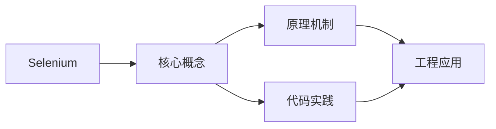
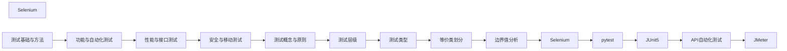

## 1. 学习目标（Bloom 分类）

本节按照布鲁姆教育目标分类学组织学习路径。本文主题为《Selenium》，属于 软件测试 模块，读者可以根据自身阶段选择阅读深度。

记忆层面：能够准确复述本文的核心概念、术语与基本语法或操作步骤，并能够在提问或检索时快速定位对应知识点。能够说出 软件测试 的核心概念、常用命令与流程。

理解层面：能够用自己的语言解释核心原理与工作机制，说明概念之间的因果关系，而不是机械记忆结论。能够解释 软件测试 的工作原理与设计动机。

应用层面：能够在真实项目或练习场景中运用本文知识解决具体问题，写出正确且可维护的实现。能够独立完成 软件测试 的标准操作。

分析层面：能够拆解复杂问题，比较本文主题与相邻概念的异同，识别边界条件与例外情况。能够分析 软件测试 使用中的异常与边界。

评价层面：能够根据约束条件（性能、可读性、安全、成本）评价不同方案的优劣，做出有依据的技术决策。能够评价 软件测试 相关工具与方案。

创造层面：能够把本文知识与其他模块知识组合，设计出新的解决方案或可复用的工程模式。能够把 软件测试 融入团队工作流。

通过本节学习，读者应当能够把《Selenium》纳入自己的知识网络，并与 软件测试 模块的其他主题（测试分层、用例设计、自动化、质量度量）建立关联。

## 2. 历史动机与发展脉络

《Selenium》是 软件测试 领域的重要主题。要真正理解它，需要先了解它解决的问题与演进过程。

软件测试伴随软件工程诞生：1979 年 Myers 定义“测试是为了发现错误而执行程序”；现代测试是质量内建活动，而非发布前关卡。
测试金字塔：单元测试（多、快、稳）-> 集成测试 -> E2E（少、慢、脆）；比例指导投入。
现代实践：TDD（测试驱动开发）、BDD（行为驱动）、测试左移（开发期）、可测试性设计。

回到本文主题：Selenium 的提出与成熟，正是上述技术背景下的必然产物。早期实现往往以简单可用为目标，随着工程规模扩大，社区逐渐沉淀出标准做法与最佳实践；理解这一脉络，可以帮助读者判断“为什么文档中的推荐写法是现在这个样子”，也能在遇到历史遗留代码时准确识别其设计年代与取舍。


## 3. 形式化定义与核心概念精讲

本节把《Selenium》涉及的核心概念以“定义 + 讲解”的形式展开。读者应把定义当作工具，把讲解当作理解路径；两者结合才能形成可迁移的知识。

用例设计：等价类划分、边界值、判定表、场景法、错误推测；覆盖（语句/分支/路径）。
测试分层：单元（函数/类）、集成（模块间）、系统（端到端）、验收（需求）；回归防退化。
自动化：测试框架（JUnit/pytest/Jest/Playwright）、fixture、断言、mock；CI 集成。

### 3.1 原文章节逐一精讲

原文档把主题拆分为 22 个小节，下面按顺序给出每一节的导读讲解，随后保留原文细节供精读。

#### 原文精读（完整保留）

# Selenium 自动化测试

> **符号约定**：`< >` 必填参数 | `[ ]` 可选参数

---

#### 1. Selenium 概述

##### 1.1 组件

| 组件      | 描述             |
| --------- | ---------------- |
| WebDriver | 浏览器自动化 API |
| IDE       | 录制回放插件     |
| Grid      | 分布式测试执行   |

##### 1.2 WebDriver 架构

```
测试代码 → WebDriver API → Browser Driver → 浏览器
```

#### 2. 环境搭建

##### 2.1 Python + Selenium

```bash
pip install selenium
pip install pytest
```

##### 2.2 基础示例

```python
from selenium import webdriver
from selenium.webdriver.common.by import By

driver = webdriver.Chrome()
driver.get("https://example.com")

# 查找元素
element = driver.find_element(By.ID, "username")
element.send_keys("admin")

# 点击
driver.find_element(By.CSS_SELECTOR, "button[type='submit']").click()

# 断言
assert "Dashboard" in driver.title

driver.quit()
```

#### 3. 元素定位

##### 3.1 定位策略

| 策略    | By 常量              | 示例                                                 |
| ------- | -------------------- | ---------------------------------------------------- |
| ID      | By.ID                | `find_element(By.ID, "login-btn")`                   |
| Name    | By.NAME              | `find_element(By.NAME, "email")`                     |
| Class   | By.CLASS_NAME        | `find_element(By.CLASS_NAME, "btn-primary")`         |
| CSS     | By.CSS_SELECTOR      | `find_element(By.CSS_SELECTOR, "#login .btn")`       |
| XPath   | By.XPATH             | `find_element(By.XPATH, "//button[@type='submit']")` |
| Tag     | By.TAG_NAME          | `find_element(By.TAG_NAME, "input")`                 |
| Link    | By.LINK_TEXT         | `find_element(By.LINK_TEXT, "Login")`                |
| Partial | By.PARTIAL_LINK_TEXT | `find_element(By.PARTIAL_LINK_TEXT, "Log")`          |

##### 3.2 推荐优先级

```
ID > CSS Selector > XPath > 其他
```

#### 4. 等待机制

##### 4.1 显式等待

```python
from selenium.webdriver.support.ui import WebDriverWait
from selenium.webdriver.support import expected_conditions as EC

# 等待元素可见
element = WebDriverWait(driver, 10).until(
    EC.visibility_of_element_located((By.ID, "result"))
)

# 等待元素可点击
element = WebDriverWait(driver, 10).until(
    EC.element_to_be_clickable((By.CSS_SELECTOR, ".submit-btn"))
)
```

##### 4.2 常用 Expected Conditions

| 条件                            | 描述           |
| ------------------------------- | -------------- |
| `visibility_of_element_located` | 元素可见       |
| `element_to_be_clickable`       | 元素可点击     |
| `presence_of_element_located`   | 元素存在于 DOM |
| `text_to_be_present_in_element` | 文本出现       |
| `title_contains`                | 标题包含       |
| `url_contains`                  | URL 包含       |

##### 4.3 隐式等待

```python
driver.implicitly_wait(10)  # 全局等待 10 秒
```

> 注意：不要混用显式和隐式等待。

#### 5. Page Object 模式

##### 5.1 页面对象

```python
# pages/login_page.py
from selenium.webdriver.common.by import By

class LoginPage:
    def __init__(self, driver):
        self.driver = driver
        self.username_input = (By.ID, "username")
        self.password_input = (By.ID, "password")
        self.login_button = (By.CSS_SELECTOR, "button[type='submit']")

    def login(self, username, password):
        self.driver.find_element(*self.username_input).send_keys(username)
        self.driver.find_element(*self.password_input).send_keys(password)
        self.driver.find_element(*self.login_button).click()
```

##### 5.2 测试用例

```python
# tests/test_login.py
import pytest
from selenium import webdriver
from pages.login_page import LoginPage

class TestLogin:
    @pytest.fixture
    def driver(self):
        driver = webdriver.Chrome()
        driver.get("https://example.com/login")
        yield driver
        driver.quit()

    def test_successful_login(self, driver):
        login_page = LoginPage(driver)
        login_page.login("admin", "password123")
        assert "Dashboard" in driver.title

    def test_invalid_password(self, driver):
        login_page = LoginPage(driver)
        login_page.login("admin", "wrong")
        assert "Invalid credentials" in driver.page_source
```

#### 6. 高级操作

##### 6.1 多窗口

```python
# 切换到新窗口
driver.switch_to.window(driver.window_handles[-1])

# 切换回主窗口
driver.switch_to.window(driver.window_handles[0])
```

##### 6.2 iframe

```python
driver.switch_to.frame("iframe-id")
# 操作 iframe 内元素
driver.switch_to.default_content()
```

##### 6.3 下拉选择

```python
from selenium.webdriver.support.select import Select

select = Select(driver.find_element(By.ID, "country"))
select.select_by_visible_text("China")
select.select_by_value("CN")
select.select_by_index(0)
```

##### 6.4 截图

```python
driver.save_screenshot("screenshot.png")
element.screenshot("element.png")
```

#### 7. 最佳实践

| 实践        | 描述                 |
| ----------- | -------------------- |
| Page Object | 封装页面元素和操作   |
| 显式等待    | 避免硬编码 sleep     |
| 数据驱动    | 分离测试数据         |
| 截图失败    | 失败时自动截图       |
| 并行执行    | Grid/多线程          |
| CI 集成     | Headless 模式        |
| 优先 CSS    | CSS 选择器优于 XPath |
#### WebDriver 初始化

**换行写法：初始化浏览器驱动**
`from selenium import webdriver`
`driver = webdriver.<Browser>()`

```python
# 初始化各浏览器驱动
from selenium import webdriver

driver = webdriver.Chrome()         # Chrome 浏览器
driver = webdriver.Firefox()        # Firefox 浏览器
driver = webdriver.Edge()           # Edge 浏览器
driver.get("https://example.com")
driver.quit()
```

---

#### Options 配置

**换行写法：配置浏览器选项**
`options = webdriver.<Browser>Options()`
`options.add_argument("<参数>")`
`driver = webdriver.<Browser>(options=options)`

```python
# 无头模式与窗口配置
from selenium import webdriver

options = webdriver.ChromeOptions()
options.add_argument("--headless")
options.add_argument("--window-size=1920,1080")
options.add_argument("--disable-gpu")
driver = webdriver.Chrome(options=options)
```

---

#### 元素定位

**基本写法：定位页面元素**
`driver.find_element(By.<方式>, "<值>")`
`driver.find_elements(By.<方式>, "<值>")`

```python
# Selenium 4 元素定位方式
from selenium.webdriver.common.by import By

driver.find_element(By.ID, "username")
driver.find_element(By.NAME, "password")
driver.find_element(By.CLASS_NAME, "btn-primary")
driver.find_element(By.TAG_NAME, "input")
driver.find_element(By.CSS_SELECTOR, "div.container > p")
driver.find_element(By.XPATH, "//div[@id='main']")
```

---

#### 元素交互

**基本写法：与元素交互**
`<element>.send_keys(<文本>)`
`<element>.click()`
`<element>.clear()`

```python
# 输入文本、点击与清空
search = driver.find_element(By.NAME, "q")
search.clear()
search.send_keys("Selenium")
search.send_keys(Keys.RETURN)
driver.find_element(By.CSS_SELECTOR, "button[type=submit]").click()
```

---

#### Keys 键盘操作

**基本写法：模拟键盘按键**
`<element>.send_keys(Keys.<KEY>)`

```python
# 模拟键盘按键
from selenium.webdriver.common.keys import Keys

search.send_keys(Keys.ENTER)
search.send_keys(Keys.TAB)
search.send_keys(Keys.CONTROL, "a")
```

---

#### ActionChains 鼠标操作

**换行写法：复杂鼠标交互**
`actions = ActionChains(driver)`
`actions.<操作>().perform()`

```python
# 鼠标悬停、右键、双击、拖拽
from selenium.webdriver.common.action_chains import ActionChains

actions = ActionChains(driver)
actions.move_to_element(menu).perform()         # 悬停
actions.context_click(element).perform()        # 右键
actions.double_click(element).perform()         # 双击
actions.drag_and_drop(src, dst).perform()       # 拖拽
```

---

#### 等待机制

**换行写法：显式等待**
`from selenium.webdriver.support.ui import WebDriverWait`
`from selenium.webdriver.support import expected_conditions as EC`
`element = WebDriverWait(driver, <秒>).until(EC.<条件>((By.<方式>, "<值>")))`

```python
# 显式等待元素出现
from selenium.webdriver.support.ui import WebDriverWait
from selenium.webdriver.support import expected_conditions as EC
from selenium.webdriver.common.by import By

element = WebDriverWait(driver, 10).until(
    EC.presence_of_element_located((By.ID, "result"))
)
```

---

#### expected_conditions 常用条件

**基本写法：常用等待条件**
`EC.presence_of_element_located(<定位器>)`
`EC.visibility_of_element_located(<定位器>)`
`EC.element_to_be_clickable(<定位器>)`
`EC.title_contains("<文本>")`

```python
# 常用 EC 条件
EC.presence_of_element_located((By.ID, "x"))
EC.visibility_of_element_located((By.ID, "x"))
EC.element_to_be_clickable((By.ID, "x"))
EC.title_contains("首页")
EC.text_to_be_present_in_element((By.ID, "x"), "hello")
```

---

#### 隐式等待

**基本写法：全局隐式等待**
`driver.implicitly_wait(<秒>)`

```python
# 设置全局元素查找超时
driver.implicitly_wait(10)
```

---

#### 页面信息

**基本写法：获取页面信息**
`driver.title`
`driver.current_url`
`driver.page_source`

```python
# 获取页面标题、URL、源码
assert "首页" in driver.title
assert driver.current_url.endswith("/home")
html = driver.page_source
```

---

#### 元素属性

**基本写法：获取元素属性**
`<element>.text`
`<element>.get_attribute("<属性名>")`
`<element>.is_displayed()`
`<element>.is_enabled()`

```python
# 获取元素文本与属性
element = driver.find_element(By.ID, "msg")
text = element.text
href = element.get_attribute("href")
visible = element.is_displayed()
enabled = element.is_enabled()
```

---

#### 窗口与标签页

**基本写法：管理浏览器窗口与标签页**
`driver.switch_to.window(<句柄>)`
`driver.window_handles`
`driver.switch_to.frame(<frame>)`

```python
# 切换窗口与 iframe
driver.switch_to.window(driver.window_handles[1])
driver.switch_to.default_content()
driver.switch_to.frame("frame-name")
driver.switch_to.parent_frame()
```

---

#### Alert 弹窗处理

**基本写法：处理 JS 弹窗**
`alert = driver.switch_to.alert`
`alert.accept()` | `alert.dismiss()` | `alert.send_keys("<文本>")`

```python
# 接受、取消、输入 alert 弹窗
alert = driver.switch_to.alert
alert_text = alert.text
alert.send_keys("input")
alert.accept()
alert.dismiss()
```

---

#### 截图

**基本写法：保存页面截图**
`driver.save_screenshot("<文件路径>")`
`<element>.screenshot("<文件路径>")`

```python
# 页面截图与元素截图
driver.save_screenshot("page.png")
element = driver.find_element(By.ID, "logo")
element.screenshot("logo.png")
```

---

#### pytest 集成

**换行写法：pytest 与 Selenium 集成**
`@pytest.fixture`
`def driver():`
`    driver = webdriver.Chrome()`
`    yield driver`
`    driver.quit()`

```python
# 使用 fixture 管理 WebDriver 生命周期
import pytest
from selenium import webdriver

@pytest.fixture
def driver():
    options = webdriver.ChromeOptions()
    driver = webdriver.Chrome(options=options)
    yield driver
    driver.quit()

def test_title(driver):
    driver.get("https://example.com")
    assert "Example" in driver.title
```


### 3.2 概念关系图

下面用 Mermaid 图表达本文核心概念之间的关系，帮助读者建立整体图景：



图中展示的是本文知识的结构化关系：核心概念是入口，原理机制解释“为什么”，代码实践演示“怎么做”，工程应用回答“何时用”。读者学习时可以把每个小节的内容挂接到对应节点上。

## 4. 理论推导与原理解析

本节深入《Selenium》背后的原理。理论部分不求面面俱到，而是聚焦“能解释现象、能指导实践”的关键推导。

用例设计：等价类划分、边界值、判定表、场景法、错误推测；覆盖（语句/分支/路径）。
测试分层：单元（函数/类）、集成（模块间）、系统（端到端）、验收（需求）；回归防退化。
自动化：测试框架（JUnit/pytest/Jest/Playwright）、fixture、断言、mock；CI 集成。
质量度量：缺陷密度、测试覆盖率、MTTF；覆盖率是手段不是目标。

需要强调的是，理论推导与工程实践之间存在翻译层：理论给出的是理想化模型与边界条件，工程代码则必须处理真实环境中的例外。读者在学习时应先掌握理论的“标准情形”，再通过陷阱章节了解“非标准情形”。

## 5. 代码示例与逐行讲解

本节把原文中的代码示例系统整理，并为每个示例补充用途说明与讲解。读者不应只浏览代码，而应逐段对照讲解理解设计意图。

### 5.1 示例：1.2 WebDriver 架构

该示例来自原文《1.2 WebDriver 架构》小节，用于演示Selenium相关操作。阅读时请先看代码结构，再看其后的讲解。

```text
测试代码 → WebDriver API → Browser Driver → 浏览器
```

讲解：这段代码演示了本节核心知识点。代码中的关键操作可以归纳为三步：准备（定义或初始化）、执行（核心逻辑）、收尾（释放资源或返回结果）。实际项目中，这三步往往被封装为函数或类，以提升复用性与可测试性。

关键点分析：

该示例共 1 行有效代码，结构以数据或配置为主。阅读时应关注：数据字段的含义、配置项的作用，以及它们与运行行为的对应关系。

进阶思考路径：先尝试修改参数观察行为变化，再把示例中的模式迁移到自己的项目中；每次修改都记录预期与实测差异，这是把示例转化为能力的最快方式。

### 5.2 示例：2.1 Python + Selenium

该示例来自原文《2.1 Python + Selenium》小节，用于演示Selenium相关操作。阅读时请先看代码结构，再看其后的讲解。

```bash
pip install selenium
pip install pytest
```

讲解：这段代码演示了本节核心知识点。代码中的关键操作可以归纳为三步：准备（定义或初始化）、执行（核心逻辑）、收尾（释放资源或返回结果）。实际项目中，这三步往往被封装为函数或类，以提升复用性与可测试性。

关键点分析：

该示例共 2 行有效代码，结构以数据或配置为主。阅读时应关注：数据字段的含义、配置项的作用，以及它们与运行行为的对应关系。

进阶思考路径：先尝试修改参数观察行为变化，再把示例中的模式迁移到自己的项目中；每次修改都记录预期与实测差异，这是把示例转化为能力的最快方式。

### 5.3 示例：2.2 基础示例

该示例来自原文《2.2 基础示例》小节，用于演示Selenium相关操作。阅读时请先看代码结构，再看其后的讲解。

```python
from selenium import webdriver
from selenium.webdriver.common.by import By

driver = webdriver.Chrome()
driver.get("https://example.com")

# 查找元素
element = driver.find_element(By.ID, "username")
element.send_keys("admin")

# 点击
driver.find_element(By.CSS_SELECTOR, "button[type='submit']").click()

# 断言
assert "Dashboard" in driver.title

driver.quit()
```

讲解：这段代码演示了本节核心知识点。代码中的关键操作可以归纳为三步：准备（定义或初始化）、执行（核心逻辑）、收尾（释放资源或返回结果）。实际项目中，这三步往往被封装为函数或类，以提升复用性与可测试性。

关键点分析：

该示例共 12 行有效代码，包含 3 类关键结构（import、from、SELECT）。其中：

- 入口与初始化部分负责建立上下文，对应实际项目中的启动或装配逻辑；
- 核心逻辑部分体现本文主题的主要操作，是阅读时最需要对照讲解理解的部分；
- 输出或返回部分把结果交给调用方，注意其类型与边界条件。

进阶思考路径：先尝试修改参数观察行为变化，再把示例中的模式迁移到自己的项目中；每次修改都记录预期与实测差异，这是把示例转化为能力的最快方式。

### 5.4 示例：3.2 推荐优先级

该示例来自原文《3.2 推荐优先级》小节，用于演示Selenium相关操作。阅读时请先看代码结构，再看其后的讲解。

```text
ID > CSS Selector > XPath > 其他
```

讲解：这段代码演示了本节核心知识点。代码中的关键操作可以归纳为三步：准备（定义或初始化）、执行（核心逻辑）、收尾（释放资源或返回结果）。实际项目中，这三步往往被封装为函数或类，以提升复用性与可测试性。

关键点分析：

该示例共 1 行有效代码，结构以数据或配置为主。阅读时应关注：数据字段的含义、配置项的作用，以及它们与运行行为的对应关系。

进阶思考路径：先尝试修改参数观察行为变化，再把示例中的模式迁移到自己的项目中；每次修改都记录预期与实测差异，这是把示例转化为能力的最快方式。

### 5.5 示例：4.1 显式等待

该示例来自原文《4.1 显式等待》小节，用于演示Selenium相关操作。阅读时请先看代码结构，再看其后的讲解。

```python
from selenium.webdriver.support.ui import WebDriverWait
from selenium.webdriver.support import expected_conditions as EC

# 等待元素可见
element = WebDriverWait(driver, 10).until(
    EC.visibility_of_element_located((By.ID, "result"))
)

# 等待元素可点击
element = WebDriverWait(driver, 10).until(
    EC.element_to_be_clickable((By.CSS_SELECTOR, ".submit-btn"))
)
```

讲解：这段代码演示了本节核心知识点。代码中的关键操作可以归纳为三步：准备（定义或初始化）、执行（核心逻辑）、收尾（释放资源或返回结果）。实际项目中，这三步往往被封装为函数或类，以提升复用性与可测试性。

关键点分析：

该示例共 10 行有效代码，包含 3 类关键结构（import、from、SELECT）。其中：

- 入口与初始化部分负责建立上下文，对应实际项目中的启动或装配逻辑；
- 核心逻辑部分体现本文主题的主要操作，是阅读时最需要对照讲解理解的部分；
- 输出或返回部分把结果交给调用方，注意其类型与边界条件。

进阶思考路径：先尝试修改参数观察行为变化，再把示例中的模式迁移到自己的项目中；每次修改都记录预期与实测差异，这是把示例转化为能力的最快方式。

### 5.6 示例：4.3 隐式等待

该示例来自原文《4.3 隐式等待》小节，用于演示Selenium相关操作。阅读时请先看代码结构，再看其后的讲解。

```python
driver.implicitly_wait(10)  # 全局等待 10 秒
```

讲解：这段代码演示了本节核心知识点。代码中的关键操作可以归纳为三步：准备（定义或初始化）、执行（核心逻辑）、收尾（释放资源或返回结果）。实际项目中，这三步往往被封装为函数或类，以提升复用性与可测试性。

关键点分析：

该示例共 1 行有效代码，结构以数据或配置为主。阅读时应关注：数据字段的含义、配置项的作用，以及它们与运行行为的对应关系。

进阶思考路径：先尝试修改参数观察行为变化，再把示例中的模式迁移到自己的项目中；每次修改都记录预期与实测差异，这是把示例转化为能力的最快方式。

### 5.7 示例：5.1 页面对象

该示例来自原文《5.1 页面对象》小节，用于演示Selenium相关操作。阅读时请先看代码结构，再看其后的讲解。

```python
# pages/login_page.py
from selenium.webdriver.common.by import By

class LoginPage:
    def __init__(self, driver):
        self.driver = driver
        self.username_input = (By.ID, "username")
        self.password_input = (By.ID, "password")
        self.login_button = (By.CSS_SELECTOR, "button[type='submit']")

    def login(self, username, password):
        self.driver.find_element(*self.username_input).send_keys(username)
        self.driver.find_element(*self.password_input).send_keys(password)
        self.driver.find_element(*self.login_button).click()
```

讲解：这段代码演示了本节核心知识点。代码中的关键操作可以归纳为三步：准备（定义或初始化）、执行（核心逻辑）、收尾（释放资源或返回结果）。实际项目中，这三步往往被封装为函数或类，以提升复用性与可测试性。

关键点分析：

该示例共 12 行有效代码，包含 5 类关键结构（class、def、import、from、SELECT）。其中：

- 入口与初始化部分负责建立上下文，对应实际项目中的启动或装配逻辑；
- 核心逻辑部分体现本文主题的主要操作，是阅读时最需要对照讲解理解的部分；
- 输出或返回部分把结果交给调用方，注意其类型与边界条件。

进阶思考路径：先尝试修改参数观察行为变化，再把示例中的模式迁移到自己的项目中；每次修改都记录预期与实测差异，这是把示例转化为能力的最快方式。

### 5.8 示例：5.2 测试用例

该示例来自原文《5.2 测试用例》小节，用于演示Selenium相关操作。阅读时请先看代码结构，再看其后的讲解。

```python
# tests/test_login.py
import pytest
from selenium import webdriver
from pages.login_page import LoginPage

class TestLogin:
    @pytest.fixture
    def driver(self):
        driver = webdriver.Chrome()
        driver.get("https://example.com/login")
        yield driver
        driver.quit()

    def test_successful_login(self, driver):
        login_page = LoginPage(driver)
        login_page.login("admin", "password123")
        assert "Dashboard" in driver.title

    def test_invalid_password(self, driver):
        login_page = LoginPage(driver)
        login_page.login("admin", "wrong")
        assert "Invalid credentials" in driver.page_source
```

讲解：这段代码演示了本节核心知识点。代码中的关键操作可以归纳为三步：准备（定义或初始化）、执行（核心逻辑）、收尾（释放资源或返回结果）。实际项目中，这三步往往被封装为函数或类，以提升复用性与可测试性。

关键点分析：

该示例共 19 行有效代码，包含 4 类关键结构（class、def、import、from）。其中：

- 入口与初始化部分负责建立上下文，对应实际项目中的启动或装配逻辑；
- 核心逻辑部分体现本文主题的主要操作，是阅读时最需要对照讲解理解的部分；
- 输出或返回部分把结果交给调用方，注意其类型与边界条件。

进阶思考路径：先尝试修改参数观察行为变化，再把示例中的模式迁移到自己的项目中；每次修改都记录预期与实测差异，这是把示例转化为能力的最快方式。

### 5.9 示例：6.1 多窗口

该示例来自原文《6.1 多窗口》小节，用于演示Selenium相关操作。阅读时请先看代码结构，再看其后的讲解。

```python
# 切换到新窗口
driver.switch_to.window(driver.window_handles[-1])

# 切换回主窗口
driver.switch_to.window(driver.window_handles[0])
```

讲解：这段代码演示了本节核心知识点。代码中的关键操作可以归纳为三步：准备（定义或初始化）、执行（核心逻辑）、收尾（释放资源或返回结果）。实际项目中，这三步往往被封装为函数或类，以提升复用性与可测试性。

关键点分析：

该示例共 4 行有效代码，结构以数据或配置为主。阅读时应关注：数据字段的含义、配置项的作用，以及它们与运行行为的对应关系。

进阶思考路径：先尝试修改参数观察行为变化，再把示例中的模式迁移到自己的项目中；每次修改都记录预期与实测差异，这是把示例转化为能力的最快方式。

### 5.10 示例：6.2 iframe

该示例来自原文《6.2 iframe》小节，用于演示Selenium相关操作。阅读时请先看代码结构，再看其后的讲解。

```python
driver.switch_to.frame("iframe-id")
# 操作 iframe 内元素
driver.switch_to.default_content()
```

讲解：这段代码演示了本节核心知识点。代码中的关键操作可以归纳为三步：准备（定义或初始化）、执行（核心逻辑）、收尾（释放资源或返回结果）。实际项目中，这三步往往被封装为函数或类，以提升复用性与可测试性。

关键点分析：

该示例共 3 行有效代码，结构以数据或配置为主。阅读时应关注：数据字段的含义、配置项的作用，以及它们与运行行为的对应关系。

进阶思考路径：先尝试修改参数观察行为变化，再把示例中的模式迁移到自己的项目中；每次修改都记录预期与实测差异，这是把示例转化为能力的最快方式。

### 5.11 示例：6.3 下拉选择

该示例来自原文《6.3 下拉选择》小节，用于演示Selenium相关操作。阅读时请先看代码结构，再看其后的讲解。

```python
from selenium.webdriver.support.select import Select

select = Select(driver.find_element(By.ID, "country"))
select.select_by_visible_text("China")
select.select_by_value("CN")
select.select_by_index(0)
```

讲解：这段代码演示了本节核心知识点。代码中的关键操作可以归纳为三步：准备（定义或初始化）、执行（核心逻辑）、收尾（释放资源或返回结果）。实际项目中，这三步往往被封装为函数或类，以提升复用性与可测试性。

关键点分析：

该示例共 5 行有效代码，包含 2 类关键结构（import、from）。其中：

- 入口与初始化部分负责建立上下文，对应实际项目中的启动或装配逻辑；
- 核心逻辑部分体现本文主题的主要操作，是阅读时最需要对照讲解理解的部分；
- 输出或返回部分把结果交给调用方，注意其类型与边界条件。

进阶思考路径：先尝试修改参数观察行为变化，再把示例中的模式迁移到自己的项目中；每次修改都记录预期与实测差异，这是把示例转化为能力的最快方式。

### 5.12 示例：6.4 截图

该示例来自原文《6.4 截图》小节，用于演示Selenium相关操作。阅读时请先看代码结构，再看其后的讲解。

```python
driver.save_screenshot("screenshot.png")
element.screenshot("element.png")
```

讲解：这段代码演示了本节核心知识点。代码中的关键操作可以归纳为三步：准备（定义或初始化）、执行（核心逻辑）、收尾（释放资源或返回结果）。实际项目中，这三步往往被封装为函数或类，以提升复用性与可测试性。

关键点分析：

该示例共 2 行有效代码，结构以数据或配置为主。阅读时应关注：数据字段的含义、配置项的作用，以及它们与运行行为的对应关系。

进阶思考路径：先尝试修改参数观察行为变化，再把示例中的模式迁移到自己的项目中；每次修改都记录预期与实测差异，这是把示例转化为能力的最快方式。

### 5.13 示例：WebDriver 初始化

该示例来自原文《WebDriver 初始化》小节，用于演示Selenium相关操作。阅读时请先看代码结构，再看其后的讲解。

```python
# 初始化各浏览器驱动
from selenium import webdriver

driver = webdriver.Chrome()         # Chrome 浏览器
driver = webdriver.Firefox()        # Firefox 浏览器
driver = webdriver.Edge()           # Edge 浏览器
driver.get("https://example.com")
driver.quit()
```

讲解：这段代码演示了本节核心知识点。代码中的关键操作可以归纳为三步：准备（定义或初始化）、执行（核心逻辑）、收尾（释放资源或返回结果）。实际项目中，这三步往往被封装为函数或类，以提升复用性与可测试性。

关键点分析：

该示例共 7 行有效代码，包含 2 类关键结构（import、from）。其中：

- 入口与初始化部分负责建立上下文，对应实际项目中的启动或装配逻辑；
- 核心逻辑部分体现本文主题的主要操作，是阅读时最需要对照讲解理解的部分；
- 输出或返回部分把结果交给调用方，注意其类型与边界条件。

进阶思考路径：先尝试修改参数观察行为变化，再把示例中的模式迁移到自己的项目中；每次修改都记录预期与实测差异，这是把示例转化为能力的最快方式。

### 5.14 示例：Options 配置

该示例来自原文《Options 配置》小节，用于演示Selenium相关操作。阅读时请先看代码结构，再看其后的讲解。

```python
# 无头模式与窗口配置
from selenium import webdriver

options = webdriver.ChromeOptions()
options.add_argument("--headless")
options.add_argument("--window-size=1920,1080")
options.add_argument("--disable-gpu")
driver = webdriver.Chrome(options=options)
```

讲解：这段代码演示了本节核心知识点。代码中的关键操作可以归纳为三步：准备（定义或初始化）、执行（核心逻辑）、收尾（释放资源或返回结果）。实际项目中，这三步往往被封装为函数或类，以提升复用性与可测试性。

关键点分析：

该示例共 7 行有效代码，包含 2 类关键结构（import、from）。其中：

- 入口与初始化部分负责建立上下文，对应实际项目中的启动或装配逻辑；
- 核心逻辑部分体现本文主题的主要操作，是阅读时最需要对照讲解理解的部分；
- 输出或返回部分把结果交给调用方，注意其类型与边界条件。

进阶思考路径：先尝试修改参数观察行为变化，再把示例中的模式迁移到自己的项目中；每次修改都记录预期与实测差异，这是把示例转化为能力的最快方式。

### 5.15 示例：元素定位

该示例来自原文《元素定位》小节，用于演示Selenium相关操作。阅读时请先看代码结构，再看其后的讲解。

```python
# Selenium 4 元素定位方式
from selenium.webdriver.common.by import By

driver.find_element(By.ID, "username")
driver.find_element(By.NAME, "password")
driver.find_element(By.CLASS_NAME, "btn-primary")
driver.find_element(By.TAG_NAME, "input")
driver.find_element(By.CSS_SELECTOR, "div.container > p")
driver.find_element(By.XPATH, "//div[@id='main']")
```

讲解：这段代码演示了本节核心知识点。代码中的关键操作可以归纳为三步：准备（定义或初始化）、执行（核心逻辑）、收尾（释放资源或返回结果）。实际项目中，这三步往往被封装为函数或类，以提升复用性与可测试性。

关键点分析：

该示例共 8 行有效代码，包含 3 类关键结构（import、from、SELECT）。其中：

- 入口与初始化部分负责建立上下文，对应实际项目中的启动或装配逻辑；
- 核心逻辑部分体现本文主题的主要操作，是阅读时最需要对照讲解理解的部分；
- 输出或返回部分把结果交给调用方，注意其类型与边界条件。

进阶思考路径：先尝试修改参数观察行为变化，再把示例中的模式迁移到自己的项目中；每次修改都记录预期与实测差异，这是把示例转化为能力的最快方式。

### 5.16 示例：元素交互

该示例来自原文《元素交互》小节，用于演示Selenium相关操作。阅读时请先看代码结构，再看其后的讲解。

```python
# 输入文本、点击与清空
search = driver.find_element(By.NAME, "q")
search.clear()
search.send_keys("Selenium")
search.send_keys(Keys.RETURN)
driver.find_element(By.CSS_SELECTOR, "button[type=submit]").click()
```

讲解：这段代码演示了本节核心知识点。代码中的关键操作可以归纳为三步：准备（定义或初始化）、执行（核心逻辑）、收尾（释放资源或返回结果）。实际项目中，这三步往往被封装为函数或类，以提升复用性与可测试性。

关键点分析：

该示例共 6 行有效代码，包含 1 类关键结构（SELECT）。其中：

- 入口与初始化部分负责建立上下文，对应实际项目中的启动或装配逻辑；
- 核心逻辑部分体现本文主题的主要操作，是阅读时最需要对照讲解理解的部分；
- 输出或返回部分把结果交给调用方，注意其类型与边界条件。

进阶思考路径：先尝试修改参数观察行为变化，再把示例中的模式迁移到自己的项目中；每次修改都记录预期与实测差异，这是把示例转化为能力的最快方式。

### 5.17 示例：Keys 键盘操作

该示例来自原文《Keys 键盘操作》小节，用于演示Selenium相关操作。阅读时请先看代码结构，再看其后的讲解。

```python
# 模拟键盘按键
from selenium.webdriver.common.keys import Keys

search.send_keys(Keys.ENTER)
search.send_keys(Keys.TAB)
search.send_keys(Keys.CONTROL, "a")
```

讲解：这段代码演示了本节核心知识点。代码中的关键操作可以归纳为三步：准备（定义或初始化）、执行（核心逻辑）、收尾（释放资源或返回结果）。实际项目中，这三步往往被封装为函数或类，以提升复用性与可测试性。

关键点分析：

该示例共 5 行有效代码，包含 2 类关键结构（import、from）。其中：

- 入口与初始化部分负责建立上下文，对应实际项目中的启动或装配逻辑；
- 核心逻辑部分体现本文主题的主要操作，是阅读时最需要对照讲解理解的部分；
- 输出或返回部分把结果交给调用方，注意其类型与边界条件。

进阶思考路径：先尝试修改参数观察行为变化，再把示例中的模式迁移到自己的项目中；每次修改都记录预期与实测差异，这是把示例转化为能力的最快方式。

### 5.18 示例：ActionChains 鼠标操作

该示例来自原文《ActionChains 鼠标操作》小节，用于演示Selenium相关操作。阅读时请先看代码结构，再看其后的讲解。

```python
# 鼠标悬停、右键、双击、拖拽
from selenium.webdriver.common.action_chains import ActionChains

actions = ActionChains(driver)
actions.move_to_element(menu).perform()         # 悬停
actions.context_click(element).perform()        # 右键
actions.double_click(element).perform()         # 双击
actions.drag_and_drop(src, dst).perform()       # 拖拽
```

讲解：这段代码演示了本节核心知识点。代码中的关键操作可以归纳为三步：准备（定义或初始化）、执行（核心逻辑）、收尾（释放资源或返回结果）。实际项目中，这三步往往被封装为函数或类，以提升复用性与可测试性。

关键点分析：

该示例共 7 行有效代码，包含 2 类关键结构（import、from）。其中：

- 入口与初始化部分负责建立上下文，对应实际项目中的启动或装配逻辑；
- 核心逻辑部分体现本文主题的主要操作，是阅读时最需要对照讲解理解的部分；
- 输出或返回部分把结果交给调用方，注意其类型与边界条件。

进阶思考路径：先尝试修改参数观察行为变化，再把示例中的模式迁移到自己的项目中；每次修改都记录预期与实测差异，这是把示例转化为能力的最快方式。

### 5.19 示例：等待机制

该示例来自原文《等待机制》小节，用于演示Selenium相关操作。阅读时请先看代码结构，再看其后的讲解。

```python
# 显式等待元素出现
from selenium.webdriver.support.ui import WebDriverWait
from selenium.webdriver.support import expected_conditions as EC
from selenium.webdriver.common.by import By

element = WebDriverWait(driver, 10).until(
    EC.presence_of_element_located((By.ID, "result"))
)
```

讲解：这段代码演示了本节核心知识点。代码中的关键操作可以归纳为三步：准备（定义或初始化）、执行（核心逻辑）、收尾（释放资源或返回结果）。实际项目中，这三步往往被封装为函数或类，以提升复用性与可测试性。

关键点分析：

该示例共 7 行有效代码，包含 2 类关键结构（import、from）。其中：

- 入口与初始化部分负责建立上下文，对应实际项目中的启动或装配逻辑；
- 核心逻辑部分体现本文主题的主要操作，是阅读时最需要对照讲解理解的部分；
- 输出或返回部分把结果交给调用方，注意其类型与边界条件。

进阶思考路径：先尝试修改参数观察行为变化，再把示例中的模式迁移到自己的项目中；每次修改都记录预期与实测差异，这是把示例转化为能力的最快方式。

### 5.20 示例：expected_conditions 常用条件

该示例来自原文《expected_conditions 常用条件》小节，用于演示Selenium相关操作。阅读时请先看代码结构，再看其后的讲解。

```python
# 常用 EC 条件
EC.presence_of_element_located((By.ID, "x"))
EC.visibility_of_element_located((By.ID, "x"))
EC.element_to_be_clickable((By.ID, "x"))
EC.title_contains("首页")
EC.text_to_be_present_in_element((By.ID, "x"), "hello")
```

讲解：这段代码演示了本节核心知识点。代码中的关键操作可以归纳为三步：准备（定义或初始化）、执行（核心逻辑）、收尾（释放资源或返回结果）。实际项目中，这三步往往被封装为函数或类，以提升复用性与可测试性。

关键点分析：

该示例共 6 行有效代码，结构以数据或配置为主。阅读时应关注：数据字段的含义、配置项的作用，以及它们与运行行为的对应关系。

进阶思考路径：先尝试修改参数观察行为变化，再把示例中的模式迁移到自己的项目中；每次修改都记录预期与实测差异，这是把示例转化为能力的最快方式。

### 5.21 示例：隐式等待

该示例来自原文《隐式等待》小节，用于演示Selenium相关操作。阅读时请先看代码结构，再看其后的讲解。

```python
# 设置全局元素查找超时
driver.implicitly_wait(10)
```

讲解：这段代码演示了本节核心知识点。代码中的关键操作可以归纳为三步：准备（定义或初始化）、执行（核心逻辑）、收尾（释放资源或返回结果）。实际项目中，这三步往往被封装为函数或类，以提升复用性与可测试性。

关键点分析：

该示例共 2 行有效代码，结构以数据或配置为主。阅读时应关注：数据字段的含义、配置项的作用，以及它们与运行行为的对应关系。

进阶思考路径：先尝试修改参数观察行为变化，再把示例中的模式迁移到自己的项目中；每次修改都记录预期与实测差异，这是把示例转化为能力的最快方式。

### 5.22 示例：页面信息

该示例来自原文《页面信息》小节，用于演示Selenium相关操作。阅读时请先看代码结构，再看其后的讲解。

```python
# 获取页面标题、URL、源码
assert "首页" in driver.title
assert driver.current_url.endswith("/home")
html = driver.page_source
```

讲解：这段代码演示了本节核心知识点。代码中的关键操作可以归纳为三步：准备（定义或初始化）、执行（核心逻辑）、收尾（释放资源或返回结果）。实际项目中，这三步往往被封装为函数或类，以提升复用性与可测试性。

关键点分析：

该示例共 4 行有效代码，结构以数据或配置为主。阅读时应关注：数据字段的含义、配置项的作用，以及它们与运行行为的对应关系。

进阶思考路径：先尝试修改参数观察行为变化，再把示例中的模式迁移到自己的项目中；每次修改都记录预期与实测差异，这是把示例转化为能力的最快方式。

### 5.23 示例：元素属性

该示例来自原文《元素属性》小节，用于演示Selenium相关操作。阅读时请先看代码结构，再看其后的讲解。

```python
# 获取元素文本与属性
element = driver.find_element(By.ID, "msg")
text = element.text
href = element.get_attribute("href")
visible = element.is_displayed()
enabled = element.is_enabled()
```

讲解：这段代码演示了本节核心知识点。代码中的关键操作可以归纳为三步：准备（定义或初始化）、执行（核心逻辑）、收尾（释放资源或返回结果）。实际项目中，这三步往往被封装为函数或类，以提升复用性与可测试性。

关键点分析：

该示例共 6 行有效代码，结构以数据或配置为主。阅读时应关注：数据字段的含义、配置项的作用，以及它们与运行行为的对应关系。

进阶思考路径：先尝试修改参数观察行为变化，再把示例中的模式迁移到自己的项目中；每次修改都记录预期与实测差异，这是把示例转化为能力的最快方式。

### 5.24 示例：窗口与标签页

该示例来自原文《窗口与标签页》小节，用于演示Selenium相关操作。阅读时请先看代码结构，再看其后的讲解。

```python
# 切换窗口与 iframe
driver.switch_to.window(driver.window_handles[1])
driver.switch_to.default_content()
driver.switch_to.frame("frame-name")
driver.switch_to.parent_frame()
```

讲解：这段代码演示了本节核心知识点。代码中的关键操作可以归纳为三步：准备（定义或初始化）、执行（核心逻辑）、收尾（释放资源或返回结果）。实际项目中，这三步往往被封装为函数或类，以提升复用性与可测试性。

关键点分析：

该示例共 5 行有效代码，结构以数据或配置为主。阅读时应关注：数据字段的含义、配置项的作用，以及它们与运行行为的对应关系。

进阶思考路径：先尝试修改参数观察行为变化，再把示例中的模式迁移到自己的项目中；每次修改都记录预期与实测差异，这是把示例转化为能力的最快方式。

### 5.25 示例：Alert 弹窗处理

该示例来自原文《Alert 弹窗处理》小节，用于演示Selenium相关操作。阅读时请先看代码结构，再看其后的讲解。

```python
# 接受、取消、输入 alert 弹窗
alert = driver.switch_to.alert
alert_text = alert.text
alert.send_keys("input")
alert.accept()
alert.dismiss()
```

讲解：这段代码演示了本节核心知识点。代码中的关键操作可以归纳为三步：准备（定义或初始化）、执行（核心逻辑）、收尾（释放资源或返回结果）。实际项目中，这三步往往被封装为函数或类，以提升复用性与可测试性。

关键点分析：

该示例共 6 行有效代码，结构以数据或配置为主。阅读时应关注：数据字段的含义、配置项的作用，以及它们与运行行为的对应关系。

进阶思考路径：先尝试修改参数观察行为变化，再把示例中的模式迁移到自己的项目中；每次修改都记录预期与实测差异，这是把示例转化为能力的最快方式。

### 5.26 示例：截图

该示例来自原文《截图》小节，用于演示Selenium相关操作。阅读时请先看代码结构，再看其后的讲解。

```python
# 页面截图与元素截图
driver.save_screenshot("page.png")
element = driver.find_element(By.ID, "logo")
element.screenshot("logo.png")
```

讲解：这段代码演示了本节核心知识点。代码中的关键操作可以归纳为三步：准备（定义或初始化）、执行（核心逻辑）、收尾（释放资源或返回结果）。实际项目中，这三步往往被封装为函数或类，以提升复用性与可测试性。

关键点分析：

该示例共 4 行有效代码，结构以数据或配置为主。阅读时应关注：数据字段的含义、配置项的作用，以及它们与运行行为的对应关系。

进阶思考路径：先尝试修改参数观察行为变化，再把示例中的模式迁移到自己的项目中；每次修改都记录预期与实测差异，这是把示例转化为能力的最快方式。

### 5.27 示例：pytest 集成

该示例来自原文《pytest 集成》小节，用于演示Selenium相关操作。阅读时请先看代码结构，再看其后的讲解。

```python
# 使用 fixture 管理 WebDriver 生命周期
import pytest
from selenium import webdriver

@pytest.fixture
def driver():
    options = webdriver.ChromeOptions()
    driver = webdriver.Chrome(options=options)
    yield driver
    driver.quit()

def test_title(driver):
    driver.get("https://example.com")
    assert "Example" in driver.title
```

讲解：这段代码演示了本节核心知识点。代码中的关键操作可以归纳为三步：准备（定义或初始化）、执行（核心逻辑）、收尾（释放资源或返回结果）。实际项目中，这三步往往被封装为函数或类，以提升复用性与可测试性。

关键点分析：

该示例共 12 行有效代码，包含 3 类关键结构（def、import、from）。其中：

- 入口与初始化部分负责建立上下文，对应实际项目中的启动或装配逻辑；
- 核心逻辑部分体现本文主题的主要操作，是阅读时最需要对照讲解理解的部分；
- 输出或返回部分把结果交给调用方，注意其类型与边界条件。

进阶思考路径：先尝试修改参数观察行为变化，再把示例中的模式迁移到自己的项目中；每次修改都记录预期与实测差异，这是把示例转化为能力的最快方式。


综合以上示例，可以总结出本主题的代码实践要点：第一，先定义清晰的输入输出契约；第二，核心逻辑保持单一职责；第三，错误处理与边界条件不可省略；第四，命名与注释表达意图而非复述代码。

## 6. 对比分析

对比是理解《Selenium》定位的最快路径。下面从多个维度与相邻方案进行对比。

单元与 E2E：单元快稳定位准，E2E 验用户旅程；互补。
TDD 与先写实现：TDD 红绿重构约束设计；按团队成熟度选择。
手工与自动化：探索性测试仍需人工，重复回归交给自动化。

对比的目的不是分出绝对优劣，而是建立选择依据：不同约束条件下，最优解不同。读者应把每个对比维度转化为决策检查清单。

## 7. 常见陷阱与最佳实践

本节整理该主题的高频错误与推荐做法。每个陷阱先描述现象，再解释原因，最后给出最佳实践。

### 7.1 只测 happy path

边界与异常漏测。等价类 + 边界 + 异常路径。

深入讲解：该问题之所以被归类为“常见陷阱”，是因为它在初学者的代码中反复出现，而且往往不在第一时间暴露——错误通常隐藏在特定数据或特定时序下。

从成因上看，只测 happy path 一般源于对 软件测试 某个机制的理解偏差：要么误用了默认行为，要么忽略了边界条件，要么把其他语言的思维惯性带了过来。

从影响上看，只测 happy path 轻则产生错误结果，重则导致资源泄漏、数据损坏或安全事故；这也是为什么工程评审中会把它列为检查项。

从修复策略上看，处理只测 happy path的正确顺序是：先复现（构造最小用例），再定位（确认机制层面的根因），最后修复并补充回归测试。跳过复现直接改代码，往往治标不治本。

### 7.2 过度 mock

测的是假实现。mock 边界 API，集成测真实组件。

深入讲解：该问题之所以被归类为“常见陷阱”，是因为它在初学者的代码中反复出现，而且往往不在第一时间暴露——错误通常隐藏在特定数据或特定时序下。

从成因上看，过度 mock 一般源于对 软件测试 某个机制的理解偏差：要么误用了默认行为，要么忽略了边界条件，要么把其他语言的思维惯性带了过来。

从影响上看，过度 mock 轻则产生错误结果，重则导致资源泄漏、数据损坏或安全事故；这也是为什么工程评审中会把它列为检查项。

从修复策略上看，处理过度 mock的正确顺序是：先复现（构造最小用例），再定位（确认机制层面的根因），最后修复并补充回归测试。跳过复现直接改代码，往往治标不治本。

### 7.3 测试不稳定

偶发失败失去信任。隔离外部依赖与随机性。

深入讲解：该问题之所以被归类为“常见陷阱”，是因为它在初学者的代码中反复出现，而且往往不在第一时间暴露——错误通常隐藏在特定数据或特定时序下。

从成因上看，测试不稳定 一般源于对 软件测试 某个机制的理解偏差：要么误用了默认行为，要么忽略了边界条件，要么把其他语言的思维惯性带了过来。

从影响上看，测试不稳定 轻则产生错误结果，重则导致资源泄漏、数据损坏或安全事故；这也是为什么工程评审中会把它列为检查项。

从修复策略上看，处理测试不稳定的正确顺序是：先复现（构造最小用例），再定位（确认机制层面的根因），最后修复并补充回归测试。跳过复现直接改代码，往往治标不治本。

### 7.4 断言缺失

只跑不验。每个测试至少一个有效断言。

深入讲解：该问题之所以被归类为“常见陷阱”，是因为它在初学者的代码中反复出现，而且往往不在第一时间暴露——错误通常隐藏在特定数据或特定时序下。

从成因上看，断言缺失 一般源于对 软件测试 某个机制的理解偏差：要么误用了默认行为，要么忽略了边界条件，要么把其他语言的思维惯性带了过来。

从影响上看，断言缺失 轻则产生错误结果，重则导致资源泄漏、数据损坏或安全事故；这也是为什么工程评审中会把它列为检查项。

从修复策略上看，处理断言缺失的正确顺序是：先复现（构造最小用例），再定位（确认机制层面的根因），最后修复并补充回归测试。跳过复现直接改代码，往往治标不治本。

### 7.5 测试耦合实现

重构就碎。测行为而非内部。

深入讲解：该问题之所以被归类为“常见陷阱”，是因为它在初学者的代码中反复出现，而且往往不在第一时间暴露——错误通常隐藏在特定数据或特定时序下。

从成因上看，测试耦合实现 一般源于对 软件测试 某个机制的理解偏差：要么误用了默认行为，要么忽略了边界条件，要么把其他语言的思维惯性带了过来。

从影响上看，测试耦合实现 轻则产生错误结果，重则导致资源泄漏、数据损坏或安全事故；这也是为什么工程评审中会把它列为检查项。

从修复策略上看，处理测试耦合实现的正确顺序是：先复现（构造最小用例），再定位（确认机制层面的根因），最后修复并补充回归测试。跳过复现直接改代码，往往治标不治本。

### 7.6 覆盖率虚荣

盲目追 100%。关注关键路径覆盖。

深入讲解：该问题之所以被归类为“常见陷阱”，是因为它在初学者的代码中反复出现，而且往往不在第一时间暴露——错误通常隐藏在特定数据或特定时序下。

从成因上看，覆盖率虚荣 一般源于对 软件测试 某个机制的理解偏差：要么误用了默认行为，要么忽略了边界条件，要么把其他语言的思维惯性带了过来。

从影响上看，覆盖率虚荣 轻则产生错误结果，重则导致资源泄漏、数据损坏或安全事故；这也是为什么工程评审中会把它列为检查项。

从修复策略上看，处理覆盖率虚荣的正确顺序是：先复现（构造最小用例），再定位（确认机制层面的根因），最后修复并补充回归测试。跳过复现直接改代码，往往治标不治本。

### 7.7 E2E 过多

慢且脆。金字塔平衡。

深入讲解：该问题之所以被归类为“常见陷阱”，是因为它在初学者的代码中反复出现，而且往往不在第一时间暴露——错误通常隐藏在特定数据或特定时序下。

从成因上看，E2E 过多 一般源于对 软件测试 某个机制的理解偏差：要么误用了默认行为，要么忽略了边界条件，要么把其他语言的思维惯性带了过来。

从影响上看，E2E 过多 轻则产生错误结果，重则导致资源泄漏、数据损坏或安全事故；这也是为什么工程评审中会把它列为检查项。

从修复策略上看，处理E2E 过多的正确顺序是：先复现（构造最小用例），再定位（确认机制层面的根因），最后修复并补充回归测试。跳过复现直接改代码，往往治标不治本。

### 7.8 无回归策略

发布前不回归。CI 全量 + 定向回归。

深入讲解：该问题之所以被归类为“常见陷阱”，是因为它在初学者的代码中反复出现，而且往往不在第一时间暴露——错误通常隐藏在特定数据或特定时序下。

从成因上看，无回归策略 一般源于对 软件测试 某个机制的理解偏差：要么误用了默认行为，要么忽略了边界条件，要么把其他语言的思维惯性带了过来。

从影响上看，无回归策略 轻则产生错误结果，重则导致资源泄漏、数据损坏或安全事故；这也是为什么工程评审中会把它列为检查项。

从修复策略上看，处理无回归策略的正确顺序是：先复现（构造最小用例），再定位（确认机制层面的根因），最后修复并补充回归测试。跳过复现直接改代码，往往治标不治本。

### 7.0 最佳实践总览

1. 测试命名：should_xxx_when_yyy 表达行为。
2. AAA 结构：Arrange（准备）、Act（执行）、Assert（断言）。
3. 每层测试语言与数据独立，避免共享状态。
4. CI 门禁：单元 + 集成必过，E2E 抽样。

把这些最佳实践固化为团队规范与代码评审检查项，是避免同类问题反复出现的关键。

## 8. 工程实践

本节把《Selenium》放入真实工程场景，给出可复用的模式与组织方法。

测试金字塔落地：Jest/Vitest 单元、Testcontainers 集成、Playwright E2E。
覆盖率报告（lcov）+ 变异测试（Stryker）提升有效性。
质量门禁：PR 必跑、主干保护、失败阻断发布。

### 8.1 工程实践的原则拆解

以上工程实践可以归纳为四条原则。第一，配置与代码分离：软件测试 项目中环境差异应通过配置注入，而不是散落在代码分支中；这保证同一份代码可以在开发、测试、生产环境一致运行。

第二，接口稳定优先：对外接口（函数签名、协议、数据格式）一旦被消费方依赖，变更成本极高；设计时应预留扩展点并保持向后兼容。

第三，可观测性内置：日志、指标与追踪应该在功能开发时同步设计，而不是故障发生后补救；没有观测手段的模块等于黑盒。

第四，变更可回滚：任何发布都应有对应的回滚方案；数据库迁移、配置变更与代码发布一样需要版本管理与逆向路径。

### 8.2 实践落地的检查清单

- [ ] 测试金字塔落地：对照本节描述，检查当前项目是否已经落实；未落实的项列入技术债并排期处理。
- [ ] 实践 2：对照本节描述，检查当前项目是否已经落实；未落实的项列入技术债并排期处理。
- [ ] 质量门禁：对照本节描述，检查当前项目是否已经落实；未落实的项列入技术债并排期处理。

工程实践的共性原则：配置与代码分离、接口稳定优先、可观测性内置、变更可回滚。这些原则适用于本主题的所有实现。

## 9. 案例研究

本节通过一个完整案例把《Selenium》的知识串起来。案例按“需求分析、方案设计、实现、验证”四步展开。

需求：为订单模块建立测试体系。
方案：服务层单测 + API 集成 + 下单 E2E。
要点：金额精度断言、并发场景、失败重试。
验证：覆盖率与缺陷逃逸趋势、CI 稳定性。

### 9.1 案例的扩展讨论

把案例中的方案放大到真实规模，需要额外考虑三个问题：

第一，规模：当数据量或并发量上升一个数量级时，原方案中的数据结构、缓存策略与任务调度是否仍然成立？通常需要引入分层与异步。

第二，团队：多人协作时，模块边界、接口契约与代码所有权必须明确；案例中的实现应拆分为可独立测试的单元，并配合文档说明设计意图。

第三，演进：上线后的需求变化不可避免；方案设计时应预留扩展点（配置化、插件化、事件化），并定期用真实指标验证假设。


案例研究的学习方法：先独立阅读需求，尝试在脑中形成方案，再对照实现与讲解，最后思考“如果约束变化（数据量、并发、团队规模），方案应如何调整”。

## 10. 知识要点总结与深入讲解

本节以讲解形式汇总全文要点，替代传统的习题与自测，读者不需要答题，只需跟随解释建立完整的认知框架。

关于《Selenium》的核心结论：

测试是质量内建：越早发现，修复成本越低。
金字塔与用例设计方法是基本功。
自动化测试是团队效率与信心的基础。

原文档各小节的要点回顾：

- 1. Selenium 概述：该小节围绕Selenium展开具体细节，阅读时应关注其与核心结论的对应关系；每个小节都是核心结论在某一个侧面的展开。
- 2. 环境搭建：该小节围绕Selenium展开具体细节，阅读时应关注其与核心结论的对应关系；每个小节都是核心结论在某一个侧面的展开。
- 3. 元素定位：该小节围绕Selenium展开具体细节，阅读时应关注其与核心结论的对应关系；每个小节都是核心结论在某一个侧面的展开。
- 4. 等待机制：该小节围绕Selenium展开具体细节，阅读时应关注其与核心结论的对应关系；每个小节都是核心结论在某一个侧面的展开。
- 5. Page Object 模式：该小节围绕Selenium展开具体细节，阅读时应关注其与核心结论的对应关系；每个小节都是核心结论在某一个侧面的展开。
- 6. 高级操作：该小节围绕Selenium展开具体细节，阅读时应关注其与核心结论的对应关系；每个小节都是核心结论在某一个侧面的展开。
- 7. 最佳实践：该小节围绕Selenium展开具体细节，阅读时应关注其与核心结论的对应关系；每个小节都是核心结论在某一个侧面的展开。
- WebDriver 初始化：该小节围绕Selenium展开具体细节，阅读时应关注其与核心结论的对应关系；每个小节都是核心结论在某一个侧面的展开。
- Options 配置：该小节围绕Selenium展开具体细节，阅读时应关注其与核心结论的对应关系；每个小节都是核心结论在某一个侧面的展开。
- 元素定位：该小节围绕Selenium展开具体细节，阅读时应关注其与核心结论的对应关系；每个小节都是核心结论在某一个侧面的展开。
- 元素交互：该小节围绕Selenium展开具体细节，阅读时应关注其与核心结论的对应关系；每个小节都是核心结论在某一个侧面的展开。
- Keys 键盘操作：该小节围绕Selenium展开具体细节，阅读时应关注其与核心结论的对应关系；每个小节都是核心结论在某一个侧面的展开。
- ActionChains 鼠标操作：该小节围绕Selenium展开具体细节，阅读时应关注其与核心结论的对应关系；每个小节都是核心结论在某一个侧面的展开。
- 等待机制：该小节围绕Selenium展开具体细节，阅读时应关注其与核心结论的对应关系；每个小节都是核心结论在某一个侧面的展开。
- expected_conditions 常用条件：该小节围绕Selenium展开具体细节，阅读时应关注其与核心结论的对应关系；每个小节都是核心结论在某一个侧面的展开。
- 隐式等待：该小节围绕Selenium展开具体细节，阅读时应关注其与核心结论的对应关系；每个小节都是核心结论在某一个侧面的展开。
- 页面信息：该小节围绕Selenium展开具体细节，阅读时应关注其与核心结论的对应关系；每个小节都是核心结论在某一个侧面的展开。
- 元素属性：该小节围绕Selenium展开具体细节，阅读时应关注其与核心结论的对应关系；每个小节都是核心结论在某一个侧面的展开。
- 窗口与标签页：该小节围绕Selenium展开具体细节，阅读时应关注其与核心结论的对应关系；每个小节都是核心结论在某一个侧面的展开。
- Alert 弹窗处理：该小节围绕Selenium展开具体细节，阅读时应关注其与核心结论的对应关系；每个小节都是核心结论在某一个侧面的展开。
- 截图：该小节围绕Selenium展开具体细节，阅读时应关注其与核心结论的对应关系；每个小节都是核心结论在某一个侧面的展开。
- pytest 集成：该小节围绕Selenium展开具体细节，阅读时应关注其与核心结论的对应关系；每个小节都是核心结论在某一个侧面的展开。

把以上要点与第 3-9 节的内容对照复习，即可完成对本文主题的闭环学习。

## 11. 参考文献


ISTQB 官方资源：https://www.istqb.org/
Testing Library：https://testing-library.com/
Playwright：https://playwright.dev/
Martin Fowler 测试专题：https://martinfowler.com/testing/

## 12. 延伸阅读


测试分层与用例设计，见 036-software-testing 模块文档。
CI 集成测试，见 031-devops 模块。
代码质量与评审，见 037-software-engineering 模块。
尚硅谷 Bilibili 空间（https://space.bilibili.com/302417610 ）提供测试课程。

## 14. 模块知识图谱与学习路径

本文属于 软件测试 模块。为了把《Selenium》放入完整的知识网络，下面列出本模块的全部主题并给出相互关联的导读。学习时建议按模块内顺序推进，并在每个文档中留意交叉引用。



上图为模块主题的推荐学习顺序示意图（仅展示前若干主题）。各主题之间存在三类关联：

第一，前置依赖关系：早期主题是后期主题的基础，例如环境与语法先行、进阶主题随后；

第二，横向并列关系：同一层级主题从不同角度覆盖模块能力，学习顺序可以按兴趣调整；

第三，工程组合关系：多个主题在真实项目中组合使用，例如配置、性能与安全主题往往出现在同一系统的不同层面。

### 14.1 模块主题速查表

| 文档 | 主题 | 与本文的关联 |
| --- | --- | --- |
| 测试基础与方法 | 001-TestBasicsMethod | 本文的前置基础 |
| 功能与自动化测试 | 002-FunctionalAndAutomatedTest | 本文的并列主题 |
| 性能与接口测试 | 003-PerformanceInterfaceTest | 本文的性能延伸 |
| 安全与移动测试 | 004-SecurityAndMobileTest | 本文的安全延伸 |
| 测试概念与原则 | 005-TestConceptPrinciple | 本文的并列主题 |
| 测试层级 | 006-TestLevels | 本文的并列主题 |
| 测试类型 | 007-TestType | 本文的并列主题 |
| 等价类划分 | 008-EquivalenceClassPartition | 本文的并列主题 |
| 边界值分析 | 009-BoundaryValueAnalysis | 本文的并列主题 |
| Selenium | 010-Selenium | 本文自身 |
| pytest | 011-Pytest | 本文的并列主题 |
| JUnit5 | 012-JUnit5 | 本文的并列主题 |
| API自动化测试 | 013-APIAutomationTest | 本文的并列主题 |
| JMeter | 014-JMeter | 本文的并列主题 |
| 白盒测试覆盖度 | 015-WhiteBoxTestCoverage | 本文的并列主题 |
| 自动化测试框架对比 | 016-AutomationTestFrameworkComparison | 本文的并列主题 |
| API自动化测试详解 | 017-APIAutomationTestDetailed | 本文的并列主题 |
| 压力测试与稳定性测试 | 018-StressAndStabilityTest | 本文的并列主题 |
| 安全测试 | 019-SecurityTesting | 本文的安全延伸 |
| 测试双 | 020-TestDouble | 本文的并列主题 |
| TDD与BDD | 021-TDDBDD | 本文的并列主题 |
| CI-CD测试门禁 | 022-CICDTest | 本文的并列主题 |
| Jest 基础 API | 023-JestBasics | 本文的前置基础 |
| Jest Mock 模拟 | 024-JestMock | 本文的并列主题 |
| Jest 异步测试 | 025-JestAsync | 本文的并列主题 |
| Jest 配置与快照 | 026-JestConfig | 本文的并列主题 |
| Mockito 模拟 | 027-Mockito | 本文的并列主题 |
| E2E 端到端测试 | 028-E2ETest | 本文的并列主题 |
| 断言库 | 029-AssertionLibrary | 本文的并列主题 |

速查表的作用是让读者快速判断：哪些文档应在阅读本文前掌握（前置基础），哪些文档应在阅读本文后继续（延伸主题）。本模块的交叉引用体系即以此表为基础。

## 15. 术语表

下表整理《Selenium》及 软件测试 模块中出现的高频术语，给出简明释义。术语按字母序或逻辑序排列，供查阅。

| 术语 | 释义 |
| --- | --- |
| 用例设计 | 等价类划分、边界值、判定表、场景法、错误推测；覆盖（语句/分支/路径）。 |
| 测试分层 | 单元（函数/类）、集成（模块间）、系统（端到端）、验收（需求）；回归防退化。 |
| 自动化 | 测试框架（JUnit/pytest/Jest/Playwright）、fixture、断言、mock；CI 集成。 |
| 质量度量 | 缺陷密度、测试覆盖率、MTTF；覆盖率是手段不是目标。 |
| 只测 happy path（易错点） | 参见常见陷阱章节的详细讲解 |
| 过度 mock（易错点） | 参见常见陷阱章节的详细讲解 |
| 测试不稳定（易错点） | 参见常见陷阱章节的详细讲解 |
| 断言缺失（易错点） | 参见常见陷阱章节的详细讲解 |
| 测试耦合实现（易错点） | 参见常见陷阱章节的详细讲解 |
| 覆盖率虚荣（易错点） | 参见常见陷阱章节的详细讲解 |

术语表与正文配合使用：先通读正文，遇到模糊术语回查本表；长期使用后术语会自然进入工作记忆。
