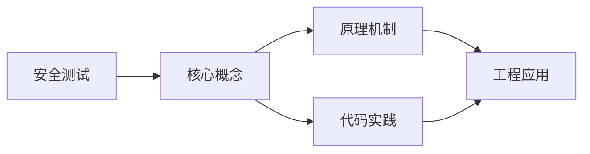
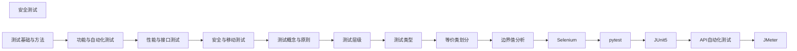

## 1. 学习目标（Bloom 分类）

本节按照布鲁姆教育目标分类学组织学习路径。本文主题为《安全测试》，属于 软件测试 模块，读者可以根据自身阶段选择阅读深度。

记忆层面：能够准确复述本文的核心概念、术语与基本语法或操作步骤，并能够在提问或检索时快速定位对应知识点。能够说出 软件测试 的核心概念、常用命令与流程。

理解层面：能够用自己的语言解释核心原理与工作机制，说明概念之间的因果关系，而不是机械记忆结论。能够解释 软件测试 的工作原理与设计动机。

应用层面：能够在真实项目或练习场景中运用本文知识解决具体问题，写出正确且可维护的实现。能够独立完成 软件测试 的标准操作。

分析层面：能够拆解复杂问题，比较本文主题与相邻概念的异同，识别边界条件与例外情况。能够分析 软件测试 使用中的异常与边界。

评价层面：能够根据约束条件（性能、可读性、安全、成本）评价不同方案的优劣，做出有依据的技术决策。能够评价 软件测试 相关工具与方案。

创造层面：能够把本文知识与其他模块知识组合，设计出新的解决方案或可复用的工程模式。能够把 软件测试 融入团队工作流。

通过本节学习，读者应当能够把《安全测试》纳入自己的知识网络，并与 软件测试 模块的其他主题（测试分层、用例设计、自动化、质量度量）建立关联。

## 2. 历史动机与发展脉络

《安全测试》是 软件测试 领域的重要主题。要真正理解它，需要先了解它解决的问题与演进过程。

软件测试伴随软件工程诞生：1979 年 Myers 定义“测试是为了发现错误而执行程序”；现代测试是质量内建活动，而非发布前关卡。
测试金字塔：单元测试（多、快、稳）-> 集成测试 -> E2E（少、慢、脆）；比例指导投入。
现代实践：TDD（测试驱动开发）、BDD（行为驱动）、测试左移（开发期）、可测试性设计。

回到本文主题：安全测试 的提出与成熟，正是上述技术背景下的必然产物。早期实现往往以简单可用为目标，随着工程规模扩大，社区逐渐沉淀出标准做法与最佳实践；理解这一脉络，可以帮助读者判断“为什么文档中的推荐写法是现在这个样子”，也能在遇到历史遗留代码时准确识别其设计年代与取舍。

## 3. 形式化定义与核心概念精讲

本节把《安全测试》涉及的核心概念以“定义 + 讲解”的形式展开。读者应把定义当作工具，把讲解当作理解路径；两者结合才能形成可迁移的知识。

用例设计：等价类划分、边界值、判定表、场景法、错误推测；覆盖（语句/分支/路径）。
测试分层：单元（函数/类）、集成（模块间）、系统（端到端）、验收（需求）；回归防退化。
自动化：测试框架（JUnit/pytest/Jest/Playwright）、fixture、断言、mock；CI 集成。

### 3.1 原文章节逐一精讲

原文档把主题拆分为 4 个小节，下面按顺序给出每一节的导读讲解，随后保留原文细节供精读。

#### 原文精读（完整保留）

#### 1. OWASP ZAP

##### 1.1 主动扫描

主动扫描是安全测试的重要组成部分。本节详细介绍主动扫描的核心概念、工作原理和实际应用。

**关键要点**：

- 主动扫描的定义与核心原理
- 主动扫描的实现方式与技术细节
- 主动扫描在实际场景中的应用与最佳实践
- 主动扫描的常见问题与解决方案

主动扫描在工程实践中需要根据具体场景选择合适的策略，平衡性能、可靠性和复杂度。

##### 1.2 被动扫描

被动扫描是安全测试的重要组成部分。本节详细介绍被动扫描的核心概念、工作原理和实际应用。

**关键要点**：

- 被动扫描的定义与核心原理
- 被动扫描的实现方式与技术细节
- 被动扫描在实际场景中的应用与最佳实践
- 被动扫描的常见问题与解决方案

被动扫描在工程实践中需要根据具体场景选择合适的策略，平衡性能、可靠性和复杂度。

##### 1.3 API 扫描

API 扫描是安全测试的重要组成部分。本节详细介绍API 扫描的核心概念、工作原理和实际应用。

**关键要点**：

- API 扫描的定义与核心原理
- API 扫描的实现方式与技术细节
- API 扫描在实际场景中的应用与最佳实践
- API 扫描的常见问题与解决方案

API 扫描在工程实践中需要根据具体场景选择合适的策略，平衡性能、可靠性和复杂度。

#### 2. SQLMap

##### 2.1 注入检测

注入检测是安全测试的重要组成部分。本节详细介绍注入检测的核心概念、工作原理和实际应用。

**关键要点**：

- 注入检测的定义与核心原理
- 注入检测的实现方式与技术细节
- 注入检测在实际场景中的应用与最佳实践
- 注入检测的常见问题与解决方案

注入检测在工程实践中需要根据具体场景选择合适的策略，平衡性能、可靠性和复杂度。

##### 2.2 数据提取

数据提取是安全测试的重要组成部分。本节详细介绍数据提取的核心概念、工作原理和实际应用。

**关键要点**：

- 数据提取的定义与核心原理
- 数据提取的实现方式与技术细节
- 数据提取在实际场景中的应用与最佳实践
- 数据提取的常见问题与解决方案

数据提取在工程实践中需要根据具体场景选择合适的策略，平衡性能、可靠性和复杂度。

##### 2.3 自动化利用

自动化利用是安全测试的重要组成部分。本节详细介绍自动化利用的核心概念、工作原理和实际应用。

**关键要点**：

- 自动化利用的定义与核心原理
- 自动化利用的实现方式与技术细节
- 自动化利用在实际场景中的应用与最佳实践
- 自动化利用的常见问题与解决方案

自动化利用在工程实践中需要根据具体场景选择合适的策略，平衡性能、可靠性和复杂度。

#### 3. Nmap 安全扫描

##### 3.1 漏洞扫描脚本

漏洞扫描脚本是安全测试的重要组成部分。本节详细介绍漏洞扫描脚本的核心概念、工作原理和实际应用。

**关键要点**：

- 漏洞扫描脚本的定义与核心原理
- 漏洞扫描脚本的实现方式与技术细节
- 漏洞扫描脚本在实际场景中的应用与最佳实践
- 漏洞扫描脚本的常见问题与解决方案

漏洞扫描脚本在工程实践中需要根据具体场景选择合适的策略，平衡性能、可靠性和复杂度。

##### 3.2 服务识别

服务识别是安全测试的重要组成部分。本节详细介绍服务识别的核心概念、工作原理和实际应用。

**关键要点**：

- 服务识别的定义与核心原理
- 服务识别的实现方式与技术细节
- 服务识别在实际场景中的应用与最佳实践
- 服务识别的常见问题与解决方案

服务识别在工程实践中需要根据具体场景选择合适的策略，平衡性能、可靠性和复杂度。

#### 4. 安全测试流程

##### 4.1 资产发现

资产发现是安全测试的重要组成部分。本节详细介绍资产发现的核心概念、工作原理和实际应用。

**关键要点**：

- 资产发现的定义与核心原理
- 资产发现的实现方式与技术细节
- 资产发现在实际场景中的应用与最佳实践
- 资产发现的常见问题与解决方案

资产发现在工程实践中需要根据具体场景选择合适的策略，平衡性能、可靠性和复杂度。

##### 4.2 漏洞验证

漏洞验证是安全测试的重要组成部分。本节详细介绍漏洞验证的核心概念、工作原理和实际应用。

**关键要点**：

- 漏洞验证的定义与核心原理
- 漏洞验证的实现方式与技术细节
- 漏洞验证在实际场景中的应用与最佳实践
- 漏洞验证的常见问题与解决方案

漏洞验证在工程实践中需要根据具体场景选择合适的策略，平衡性能、可靠性和复杂度。

##### 4.3 报告编写

报告编写是安全测试的重要组成部分。本节详细介绍报告编写的核心概念、工作原理和实际应用。

**关键要点**：

- 报告编写的定义与核心原理
- 报告编写的实现方式与技术细节
- 报告编写在实际场景中的应用与最佳实践
- 报告编写的常见问题与解决方案

报告编写在工程实践中需要根据具体场景选择合适的策略，平衡性能、可靠性和复杂度。

### 3.2 概念关系图

下面用 Mermaid 图表达本文核心概念之间的关系，帮助读者建立整体图景：

图中展示的是本文知识的结构化关系：核心概念是入口，原理机制解释“为什么”，代码实践演示“怎么做”，工程应用回答“何时用”。读者学习时可以把每个小节的内容挂接到对应节点上。

## 4. 理论推导与原理解析

本节深入《安全测试》背后的原理。理论部分不求面面俱到，而是聚焦“能解释现象、能指导实践”的关键推导。

用例设计：等价类划分、边界值、判定表、场景法、错误推测；覆盖（语句/分支/路径）。
测试分层：单元（函数/类）、集成（模块间）、系统（端到端）、验收（需求）；回归防退化。
自动化：测试框架（JUnit/pytest/Jest/Playwright）、fixture、断言、mock；CI 集成。
质量度量：缺陷密度、测试覆盖率、MTTF；覆盖率是手段不是目标。

需要强调的是，理论推导与工程实践之间存在翻译层：理论给出的是理想化模型与边界条件，工程代码则必须处理真实环境中的例外。读者在学习时应先掌握理论的“标准情形”，再通过陷阱章节了解“非标准情形”。

## 5. 代码示例与逐行讲解

本节把原文中的代码示例系统整理，并为每个示例补充用途说明与讲解。读者不应只浏览代码，而应逐段对照讲解理解设计意图。

原文档未包含独立代码块，下面补充该主题的典型示例，演示核心概念在代码中的落地方式。

综合以上示例，可以总结出本主题的代码实践要点：第一，先定义清晰的输入输出契约；第二，核心逻辑保持单一职责；第三，错误处理与边界条件不可省略；第四，命名与注释表达意图而非复述代码。

## 6. 对比分析

对比是理解《安全测试》定位的最快路径。下面从多个维度与相邻方案进行对比。

单元与 E2E：单元快稳定位准，E2E 验用户旅程；互补。
TDD 与先写实现：TDD 红绿重构约束设计；按团队成熟度选择。
手工与自动化：探索性测试仍需人工，重复回归交给自动化。

对比的目的不是分出绝对优劣，而是建立选择依据：不同约束条件下，最优解不同。读者应把每个对比维度转化为决策检查清单。

## 7. 常见陷阱与最佳实践

本节整理该主题的高频错误与推荐做法。每个陷阱先描述现象，再解释原因，最后给出最佳实践。

### 7.1 只测 happy path

边界与异常漏测。等价类 + 边界 + 异常路径。

深入讲解：该问题之所以被归类为“常见陷阱”，是因为它在初学者的代码中反复出现，而且往往不在第一时间暴露——错误通常隐藏在特定数据或特定时序下。

从成因上看，只测 happy path 一般源于对 软件测试 某个机制的理解偏差：要么误用了默认行为，要么忽略了边界条件，要么把其他语言的思维惯性带了过来。

从影响上看，只测 happy path 轻则产生错误结果，重则导致资源泄漏、数据损坏或安全事故；这也是为什么工程评审中会把它列为检查项。

从修复策略上看，处理只测 happy path的正确顺序是：先复现（构造最小用例），再定位（确认机制层面的根因），最后修复并补充回归测试。跳过复现直接改代码，往往治标不治本。

### 7.2 过度 mock

测的是假实现。mock 边界 API，集成测真实组件。

深入讲解：该问题之所以被归类为“常见陷阱”，是因为它在初学者的代码中反复出现，而且往往不在第一时间暴露——错误通常隐藏在特定数据或特定时序下。

从成因上看，过度 mock 一般源于对 软件测试 某个机制的理解偏差：要么误用了默认行为，要么忽略了边界条件，要么把其他语言的思维惯性带了过来。

从影响上看，过度 mock 轻则产生错误结果，重则导致资源泄漏、数据损坏或安全事故；这也是为什么工程评审中会把它列为检查项。

从修复策略上看，处理过度 mock的正确顺序是：先复现（构造最小用例），再定位（确认机制层面的根因），最后修复并补充回归测试。跳过复现直接改代码，往往治标不治本。

### 7.3 测试不稳定

偶发失败失去信任。隔离外部依赖与随机性。

深入讲解：该问题之所以被归类为“常见陷阱”，是因为它在初学者的代码中反复出现，而且往往不在第一时间暴露——错误通常隐藏在特定数据或特定时序下。

从成因上看，测试不稳定 一般源于对 软件测试 某个机制的理解偏差：要么误用了默认行为，要么忽略了边界条件，要么把其他语言的思维惯性带了过来。

从影响上看，测试不稳定 轻则产生错误结果，重则导致资源泄漏、数据损坏或安全事故；这也是为什么工程评审中会把它列为检查项。

从修复策略上看，处理测试不稳定的正确顺序是：先复现（构造最小用例），再定位（确认机制层面的根因），最后修复并补充回归测试。跳过复现直接改代码，往往治标不治本。

### 7.4 断言缺失

只跑不验。每个测试至少一个有效断言。

深入讲解：该问题之所以被归类为“常见陷阱”，是因为它在初学者的代码中反复出现，而且往往不在第一时间暴露——错误通常隐藏在特定数据或特定时序下。

从成因上看，断言缺失 一般源于对 软件测试 某个机制的理解偏差：要么误用了默认行为，要么忽略了边界条件，要么把其他语言的思维惯性带了过来。

从影响上看，断言缺失 轻则产生错误结果，重则导致资源泄漏、数据损坏或安全事故；这也是为什么工程评审中会把它列为检查项。

从修复策略上看，处理断言缺失的正确顺序是：先复现（构造最小用例），再定位（确认机制层面的根因），最后修复并补充回归测试。跳过复现直接改代码，往往治标不治本。

### 7.5 测试耦合实现

重构就碎。测行为而非内部。

深入讲解：该问题之所以被归类为“常见陷阱”，是因为它在初学者的代码中反复出现，而且往往不在第一时间暴露——错误通常隐藏在特定数据或特定时序下。

从成因上看，测试耦合实现 一般源于对 软件测试 某个机制的理解偏差：要么误用了默认行为，要么忽略了边界条件，要么把其他语言的思维惯性带了过来。

从影响上看，测试耦合实现 轻则产生错误结果，重则导致资源泄漏、数据损坏或安全事故；这也是为什么工程评审中会把它列为检查项。

从修复策略上看，处理测试耦合实现的正确顺序是：先复现（构造最小用例），再定位（确认机制层面的根因），最后修复并补充回归测试。跳过复现直接改代码，往往治标不治本。

### 7.6 覆盖率虚荣

盲目追 100%。关注关键路径覆盖。

深入讲解：该问题之所以被归类为“常见陷阱”，是因为它在初学者的代码中反复出现，而且往往不在第一时间暴露——错误通常隐藏在特定数据或特定时序下。

从成因上看，覆盖率虚荣 一般源于对 软件测试 某个机制的理解偏差：要么误用了默认行为，要么忽略了边界条件，要么把其他语言的思维惯性带了过来。

从影响上看，覆盖率虚荣 轻则产生错误结果，重则导致资源泄漏、数据损坏或安全事故；这也是为什么工程评审中会把它列为检查项。

从修复策略上看，处理覆盖率虚荣的正确顺序是：先复现（构造最小用例），再定位（确认机制层面的根因），最后修复并补充回归测试。跳过复现直接改代码，往往治标不治本。

### 7.7 E2E 过多

慢且脆。金字塔平衡。

深入讲解：该问题之所以被归类为“常见陷阱”，是因为它在初学者的代码中反复出现，而且往往不在第一时间暴露——错误通常隐藏在特定数据或特定时序下。

从成因上看，E2E 过多 一般源于对 软件测试 某个机制的理解偏差：要么误用了默认行为，要么忽略了边界条件，要么把其他语言的思维惯性带了过来。

从影响上看，E2E 过多 轻则产生错误结果，重则导致资源泄漏、数据损坏或安全事故；这也是为什么工程评审中会把它列为检查项。

从修复策略上看，处理E2E 过多的正确顺序是：先复现（构造最小用例），再定位（确认机制层面的根因），最后修复并补充回归测试。跳过复现直接改代码，往往治标不治本。

### 7.8 无回归策略

发布前不回归。CI 全量 + 定向回归。

深入讲解：该问题之所以被归类为“常见陷阱”，是因为它在初学者的代码中反复出现，而且往往不在第一时间暴露——错误通常隐藏在特定数据或特定时序下。

从成因上看，无回归策略 一般源于对 软件测试 某个机制的理解偏差：要么误用了默认行为，要么忽略了边界条件，要么把其他语言的思维惯性带了过来。

从影响上看，无回归策略 轻则产生错误结果，重则导致资源泄漏、数据损坏或安全事故；这也是为什么工程评审中会把它列为检查项。

从修复策略上看，处理无回归策略的正确顺序是：先复现（构造最小用例），再定位（确认机制层面的根因），最后修复并补充回归测试。跳过复现直接改代码，往往治标不治本。

### 7.0 最佳实践总览

1. 测试命名：should_xxx_when_yyy 表达行为。
2. AAA 结构：Arrange（准备）、Act（执行）、Assert（断言）。
3. 每层测试语言与数据独立，避免共享状态。
4. CI 门禁：单元 + 集成必过，E2E 抽样。

把这些最佳实践固化为团队规范与代码评审检查项，是避免同类问题反复出现的关键。

## 8. 工程实践

本节把《安全测试》放入真实工程场景，给出可复用的模式与组织方法。

测试金字塔落地：Jest/Vitest 单元、Testcontainers 集成、Playwright E2E。
覆盖率报告（lcov）+ 变异测试（Stryker）提升有效性。
质量门禁：PR 必跑、主干保护、失败阻断发布。

### 8.1 工程实践的原则拆解

以上工程实践可以归纳为四条原则。第一，配置与代码分离：软件测试 项目中环境差异应通过配置注入，而不是散落在代码分支中；这保证同一份代码可以在开发、测试、生产环境一致运行。

第二，接口稳定优先：对外接口（函数签名、协议、数据格式）一旦被消费方依赖，变更成本极高；设计时应预留扩展点并保持向后兼容。

第三，可观测性内置：日志、指标与追踪应该在功能开发时同步设计，而不是故障发生后补救；没有观测手段的模块等于黑盒。

第四，变更可回滚：任何发布都应有对应的回滚方案；数据库迁移、配置变更与代码发布一样需要版本管理与逆向路径。

### 8.2 实践落地的检查清单

- [ ] 测试金字塔落地：对照本节描述，检查当前项目是否已经落实；未落实的项列入技术债并排期处理。
- [ ] 实践 2：对照本节描述，检查当前项目是否已经落实；未落实的项列入技术债并排期处理。
- [ ] 质量门禁：对照本节描述，检查当前项目是否已经落实；未落实的项列入技术债并排期处理。

工程实践的共性原则：配置与代码分离、接口稳定优先、可观测性内置、变更可回滚。这些原则适用于本主题的所有实现。

## 9. 案例研究

本节通过一个完整案例把《安全测试》的知识串起来。案例按“需求分析、方案设计、实现、验证”四步展开。

需求：为订单模块建立测试体系。
方案：服务层单测 + API 集成 + 下单 E2E。
要点：金额精度断言、并发场景、失败重试。
验证：覆盖率与缺陷逃逸趋势、CI 稳定性。

### 9.1 案例的扩展讨论

把案例中的方案放大到真实规模，需要额外考虑三个问题：

第一，规模：当数据量或并发量上升一个数量级时，原方案中的数据结构、缓存策略与任务调度是否仍然成立？通常需要引入分层与异步。

第二，团队：多人协作时，模块边界、接口契约与代码所有权必须明确；案例中的实现应拆分为可独立测试的单元，并配合文档说明设计意图。

第三，演进：上线后的需求变化不可避免；方案设计时应预留扩展点（配置化、插件化、事件化），并定期用真实指标验证假设。

案例研究的学习方法：先独立阅读需求，尝试在脑中形成方案，再对照实现与讲解，最后思考“如果约束变化（数据量、并发、团队规模），方案应如何调整”。

## 10. 知识要点总结与深入讲解

本节以讲解形式汇总全文要点，替代传统的习题与自测，读者不需要答题，只需跟随解释建立完整的认知框架。

关于《安全测试》的核心结论：

测试是质量内建：越早发现，修复成本越低。
金字塔与用例设计方法是基本功。
自动化测试是团队效率与信心的基础。

原文档各小节的要点回顾：

- 1. OWASP ZAP：该小节围绕安全测试展开具体细节，阅读时应关注其与核心结论的对应关系；每个小节都是核心结论在某一个侧面的展开。
- 2. SQLMap：该小节围绕安全测试展开具体细节，阅读时应关注其与核心结论的对应关系；每个小节都是核心结论在某一个侧面的展开。
- 3. Nmap 安全扫描：该小节围绕安全测试展开具体细节，阅读时应关注其与核心结论的对应关系；每个小节都是核心结论在某一个侧面的展开。
- 4. 安全测试流程：该小节围绕安全测试展开具体细节，阅读时应关注其与核心结论的对应关系；每个小节都是核心结论在某一个侧面的展开。

把以上要点与第 3-9 节的内容对照复习，即可完成对本文主题的闭环学习。

## 11. 参考文献

ISTQB 官方资源：https://www.istqb.org/
Testing Library：https://testing-library.com/
Playwright：https://playwright.dev/
Martin Fowler 测试专题：https://martinfowler.com/testing/

## 12. 延伸阅读

测试分层与用例设计，见 036-software-testing 模块文档。
CI 集成测试，见 031-devops 模块。
代码质量与评审，见 037-software-engineering 模块。
尚硅谷 Bilibili 空间（https://space.bilibili.com/302417610 ）提供测试课程。

## 14. 模块知识图谱与学习路径

本文属于 软件测试 模块。为了把《安全测试》放入完整的知识网络，下面列出本模块的全部主题并给出相互关联的导读。学习时建议按模块内顺序推进，并在每个文档中留意交叉引用。

上图为模块主题的推荐学习顺序示意图（仅展示前若干主题）。各主题之间存在三类关联：

第一，前置依赖关系：早期主题是后期主题的基础，例如环境与语法先行、进阶主题随后；

第二，横向并列关系：同一层级主题从不同角度覆盖模块能力，学习顺序可以按兴趣调整；

第三，工程组合关系：多个主题在真实项目中组合使用，例如配置、性能与安全主题往往出现在同一系统的不同层面。

### 14.1 模块主题速查表

| 文档 | 主题 | 与本文的关联 |
| --- | --- | --- |
| 测试基础与方法 | 001-TestBasicsMethod | 本文的前置基础 |
| 功能与自动化测试 | 002-FunctionalAndAutomatedTest | 本文的并列主题 |
| 性能与接口测试 | 003-PerformanceInterfaceTest | 本文的性能延伸 |
| 安全与移动测试 | 004-SecurityAndMobileTest | 本文的安全延伸 |
| 测试概念与原则 | 005-TestConceptPrinciple | 本文的并列主题 |
| 测试层级 | 006-TestLevels | 本文的并列主题 |
| 测试类型 | 007-TestType | 本文的并列主题 |
| 等价类划分 | 008-EquivalenceClassPartition | 本文的并列主题 |
| 边界值分析 | 009-BoundaryValueAnalysis | 本文的并列主题 |
| Selenium | 010-Selenium | 本文的并列主题 |
| pytest | 011-Pytest | 本文的并列主题 |
| JUnit5 | 012-JUnit5 | 本文的并列主题 |
| API自动化测试 | 013-APIAutomationTest | 本文的并列主题 |
| JMeter | 014-JMeter | 本文的并列主题 |
| 白盒测试覆盖度 | 015-WhiteBoxTestCoverage | 本文的并列主题 |
| 自动化测试框架对比 | 016-AutomationTestFrameworkComparison | 本文的并列主题 |
| API自动化测试详解 | 017-APIAutomationTestDetailed | 本文的并列主题 |
| 压力测试与稳定性测试 | 018-StressAndStabilityTest | 本文的并列主题 |
| 安全测试 | 019-SecurityTesting | 本文自身 |
| 测试双 | 020-TestDouble | 本文的并列主题 |
| TDD与BDD | 021-TDDBDD | 本文的并列主题 |
| CI-CD测试门禁 | 022-CICDTest | 本文的并列主题 |
| Jest 基础 API | 023-JestBasics | 本文的前置基础 |
| Jest Mock 模拟 | 024-JestMock | 本文的并列主题 |
| Jest 异步测试 | 025-JestAsync | 本文的并列主题 |
| Jest 配置与快照 | 026-JestConfig | 本文的并列主题 |
| Mockito 模拟 | 027-Mockito | 本文的并列主题 |
| E2E 端到端测试 | 028-E2ETest | 本文的并列主题 |
| 断言库 | 029-AssertionLibrary | 本文的并列主题 |

速查表的作用是让读者快速判断：哪些文档应在阅读本文前掌握（前置基础），哪些文档应在阅读本文后继续（延伸主题）。本模块的交叉引用体系即以此表为基础。

## 15. 术语表

下表整理《安全测试》及 软件测试 模块中出现的高频术语，给出简明释义。术语按字母序或逻辑序排列，供查阅。

| 术语 | 释义 |
| --- | --- |
| 用例设计 | 等价类划分、边界值、判定表、场景法、错误推测；覆盖（语句/分支/路径）。 |
| 测试分层 | 单元（函数/类）、集成（模块间）、系统（端到端）、验收（需求）；回归防退化。 |
| 自动化 | 测试框架（JUnit/pytest/Jest/Playwright）、fixture、断言、mock；CI 集成。 |
| 质量度量 | 缺陷密度、测试覆盖率、MTTF；覆盖率是手段不是目标。 |
| 只测 happy path（易错点） | 参见常见陷阱章节的详细讲解 |
| 过度 mock（易错点） | 参见常见陷阱章节的详细讲解 |
| 测试不稳定（易错点） | 参见常见陷阱章节的详细讲解 |
| 断言缺失（易错点） | 参见常见陷阱章节的详细讲解 |
| 测试耦合实现（易错点） | 参见常见陷阱章节的详细讲解 |
| 覆盖率虚荣（易错点） | 参见常见陷阱章节的详细讲解 |

术语表与正文配合使用：先通读正文，遇到模糊术语回查本表；长期使用后术语会自然进入工作记忆。

## 13. 深度专题扩展

以下专题从不同角度深入本文主题，供有进阶需求的读者研读。每个专题独立成节，内容相互补充。

### 13.1 测试替身与依赖隔离

替身类型：dummy、stub、spy、mock、fake；按意图选择。
mock 验证交互（调用次数/参数），stub 返回数据；过度验证交互导致脆测试。
依赖注入与端口适配器（hexagonal）提升可测性。
Testcontainers 起真实依赖（数据库/消息）兼顾真实与隔离。

### 13.2 测试金字塔落地

单元：纯函数与领域逻辑，毫秒级。
集成：Repository/API/外部服务，秒级。
E2E：关键用户旅程，分钟级；冒烟集在发布前。
度量与治理：失败分类、flake 治理、覆盖率趋势看板。

## 16. 核心概念串讲（复习视角）

本节以“把知识讲给他人听”的方式，把《安全测试》的核心概念重新串讲一遍。与前文按章节展开不同，这里的叙述更接近课堂总结：先说整体，再逐个展开，最后收束。

《安全测试》属于 软件测试 模块。要理解它，先要理解它在模块中的位置：它解决的是该领域的一个具体问题，并依赖模块内若干前置概念；反过来，它又为后续进阶主题提供基础。

第一个概念是用例设计。等价类划分、边界值、判定表、场景法、错误推测；覆盖（语句/分支/路径）。

在实际使用中，用例设计需要与相邻概念区分：它们的区别不在于名称，而在于适用条件与行为边界；这正是前文对比分析章节的意义。

第一个概念是测试分层。单元（函数/类）、集成（模块间）、系统（端到端）、验收（需求）；回归防退化。

在实际使用中，测试分层需要与相邻概念区分：它们的区别不在于名称，而在于适用条件与行为边界；这正是前文对比分析章节的意义。

第一个概念是自动化。测试框架（JUnit/pytest/Jest/Playwright）、fixture、断言、mock；CI 集成。

在实际使用中，自动化需要与相邻概念区分：它们的区别不在于名称，而在于适用条件与行为边界；这正是前文对比分析章节的意义。

接下来是用例设计。等价类划分、边界值、判定表、场景法、错误推测；覆盖（语句/分支/路径）。

理解该原理的关键不是记住结论，而是记住“它从什么假设出发、推出了什么、假设不成立时会怎样”。带着这个框架复习，原理之间就会连成网络。

接下来是测试分层。单元（函数/类）、集成（模块间）、系统（端到端）、验收（需求）；回归防退化。

理解该原理的关键不是记住结论，而是记住“它从什么假设出发、推出了什么、假设不成立时会怎样”。带着这个框架复习，原理之间就会连成网络。

接下来是自动化。测试框架（JUnit/pytest/Jest/Playwright）、fixture、断言、mock；CI 集成。

理解该原理的关键不是记住结论，而是记住“它从什么假设出发、推出了什么、假设不成立时会怎样”。带着这个框架复习，原理之间就会连成网络。

接下来是质量度量。缺陷密度、测试覆盖率、MTTF；覆盖率是手段不是目标。

理解该原理的关键不是记住结论，而是记住“它从什么假设出发、推出了什么、假设不成立时会怎样”。带着这个框架复习，原理之间就会连成网络。

串讲收束：把概念与原理放回本文主题，可以得出一个总纲——定义描述是什么，原理解释为什么，实践回答怎么做。三者构成完整的学习闭环；后续遇到相关问题，都可以按这个总纲检索知识。
