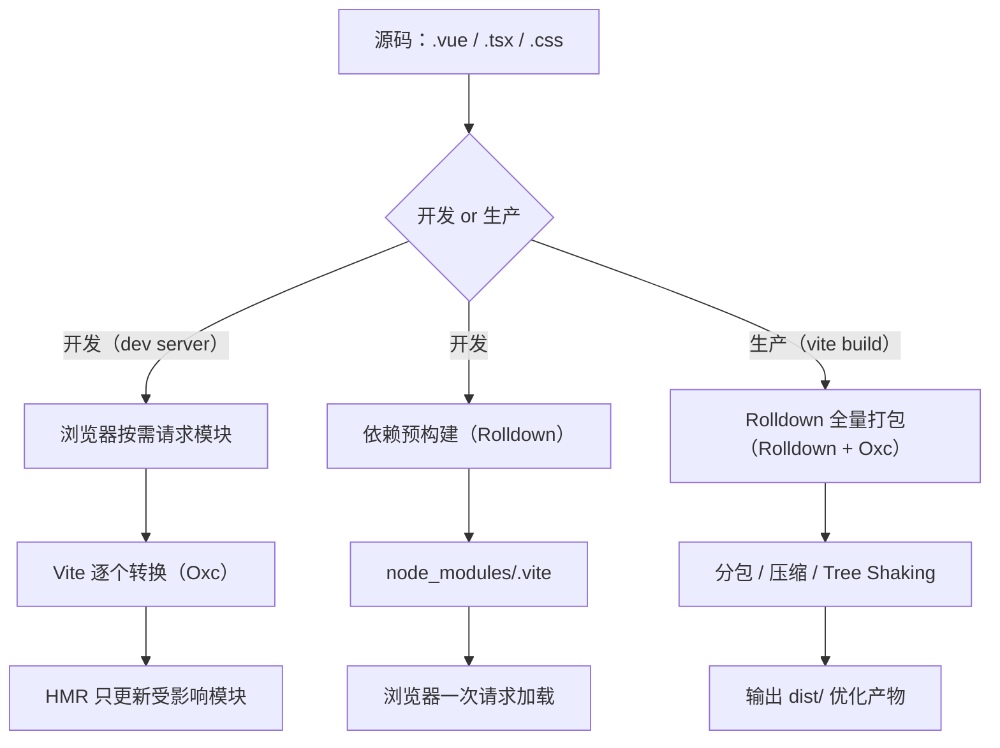
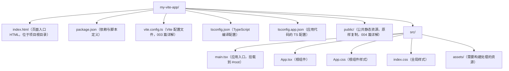
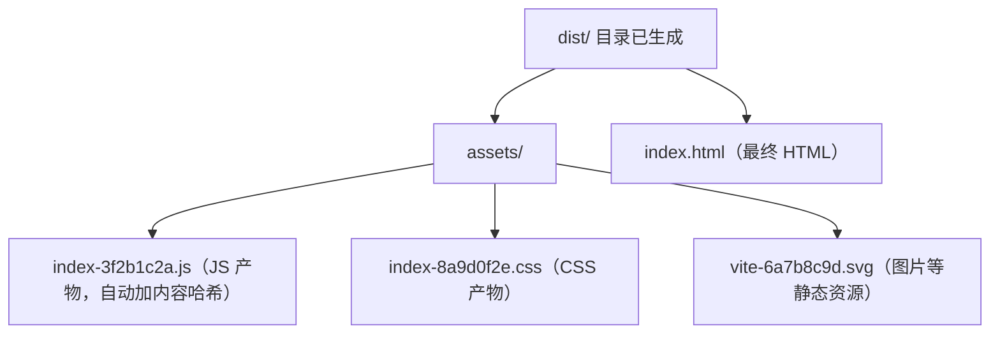
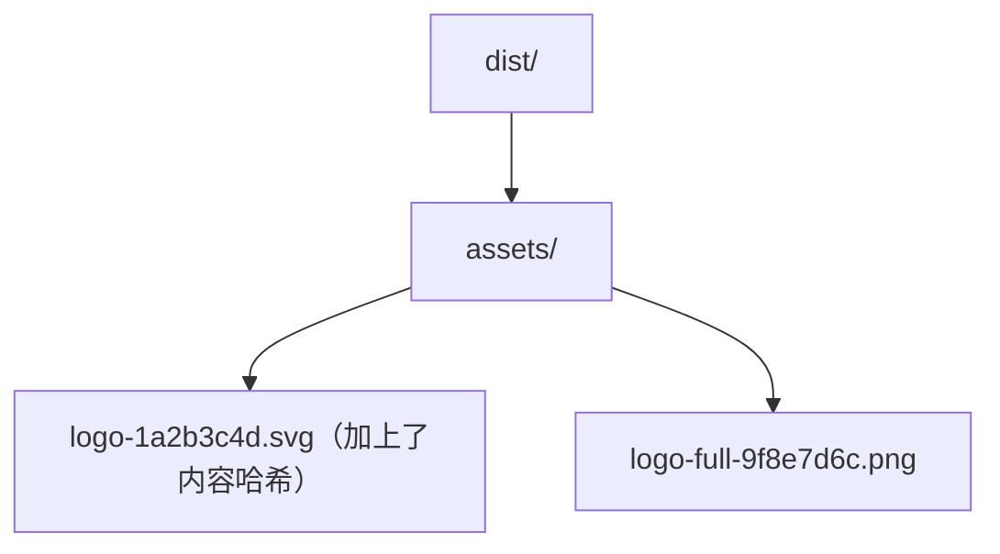
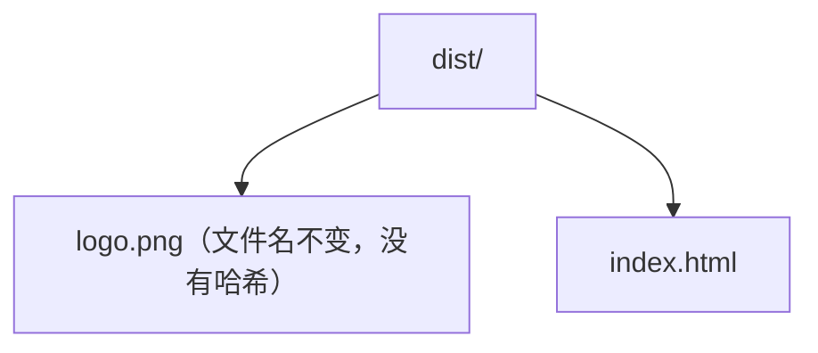
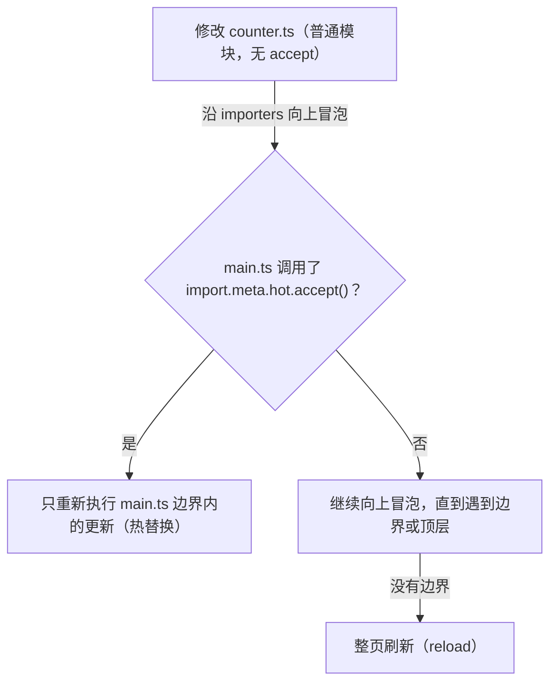

<!-- ============ 文档分隔线：044-vite/001-ViteOverview.md ============ -->

> 本节为增量补充，帮助你选择 Vite 版本。

- Vite：8.x 为当前主线，依赖优化与打包已切换到 Rolldown 引擎；配套测试框架为 Vitest 3+。
- 新项目 `npm create vite@latest` 默认安装 8.x；框架模板（Vue/React/Svelte）由官方维护。
- 注意：Vite 要求 Node.js 20.19+/22.12+，推荐直接使用 Node 22 LTS。


## 1. 从一个生活类比说起：快递分拣中心

先想象一个快递分拣中心。假设你从网上买了 10 件商品，分拣中心有两种处理方式：

- **方式 A（一次性打包）**：分拣员把所有包裹全部拆开，重新按收货地址装进一辆大货车，全部装完才发车。如果这时你又加购了 1 件商品，不好意思，整车要卸下来重新装。
- **方式 B（随到随发）**：每辆货车按目的地排队，哪个方向的包裹凑够了就先发；新加购的商品，只要送往同一条线路，直接补进下一班车，不影响已经发走的车。

传统打包器（如 webpack）开发时就像**方式 A**：不管页面是否需要，先把整个项目的所有文件打包成一个巨大的 bundle，浏览器一次性下载；你改一行代码，它就要把相关模块重新编译一遍，项目越大等待越久——这就是著名的"webpack 打包太慢"痛点。

Vite（法语"快"的意思，读作 /viːt/）就像**方式 B**：浏览器按需向开发服务器请求模块，服务器只处理"当前请求的那一个文件"，改一行代码只更新一个模块。本文就从这条思路出发，带你理解 Vite 为什么快、它内部做了什么。

## 2. 真实的痛点故事：等一次编译要喝几杯咖啡

时间回到 2018-2020 年，前端工程化处于 webpack 主导的时代。一个中型项目（几百个页面模块、几十个 npm 依赖）的日常是这样的：

1. 早上到公司，运行 `npm run dev`，盯着终端等 **30 秒到 3 分钟**的冷启动；
2. 每次保存代码，触发热更新，又要等 **3-10 秒**（改到公共模块甚至触发全量重编译）；
3. 项目超过 10 万行后，打包器单线程执行 JavaScript，速度肉眼可见地变慢。

这背后是打包器的固有缺陷：**开发阶段不该打包**。开发时我们只需要"浏览器能跑的代码"，而不是"最优化压缩的产物"。把"编译"和"打包"这两个本来可以分开的动作强行合并，就产生了大量无效等待。

Vite 的解法是一句话：**开发时让浏览器自己按需加载模块，服务器只做"翻译"**。这正是浏览器原生 ES Modules（ESM）带来的能力。

## 3. Vite 是什么

Vite 是由 Vue 作者尤雨溪（Evan You）于 2020 年发布并开源的下一代前端构建工具，2021 年起成为 Vue 官方推荐，随后被 React、Svelte、Astro 等生态广泛采用。它由两大部分组成：

| 组成 | 负责什么 | 关键能力 |
| --- | --- | --- |
| 开发服务器（dev server） | 本地开发阶段 | 冷启动快、HMR 毫秒级、按需编译 |
| 构建器（bundler） | 生产构建阶段 | 打包、代码分割、压缩、生成优化产物 |

两条管线分开设计，各司其职，这就是 Vite 的核心架构思想。理解"开发与生产是两套不同逻辑"，是理解 Vite 一切行为的总钥匙。

## 4. 原理一：原生 ESM 与按需编译

### 4.1 直观理解

ES Modules 是 JavaScript 官方规定的模块标准。浏览器原生支持它：在 HTML 中写 `<script type="module">`，浏览器就会按 `import` 语句**自动、按需地**去网络上下载每一个模块文件，不需要任何打包器参与。

```html
<!-- index.html：浏览器原生支持的模块加载方式 -->
<script type="module" src="/src/main.js"></script>
```

```js
// main.js 被浏览器下载后，它 import 谁，浏览器就去下载谁
import { renderHeader } from './components/Header.js'
import { renderFooter } from './components/Footer.js'

renderHeader()
renderFooter()
```

### 4.2 原理

传统打包器在开发阶段会把所有源码打包成一个 bundle，浏览器拿到的是"成品大礼包"；Vite 反其道而行，开发阶段**不做打包**，浏览器直接请求哪个文件，Vite 才转换哪个文件：

```text
传统方式：所有源码 -> 打包成一个 bundle -> 浏览器下载 -> 执行
Vite 方式：浏览器按需请求每个模块 -> Vite 逐个转换 -> 浏览器执行
```

这样做的好处是：**冷启动速度与项目规模几乎无关**。项目从 10 个模块涨到 1000 个模块，首次启动依然是"浏览器发起第一个请求"那点时间，因为 Vite 不需要预先知道全部代码。

### 4.3 局限与补齐

浏览器原生只能识别标准的 `.js` 文件，那 `.ts`、`.tsx`、`.vue` 怎么办？Vite 的 dev server 会拦截这些请求，在返回前把它们"翻译"成浏览器可执行的 JavaScript：

```text
浏览器请求 /src/App.tsx
    -> Vite 服务器拦截
    -> 用 Oxc 转译器把 TypeScript 转成 JavaScript
    -> 返回给浏览器执行
```

这个"翻译"是**单文件级别**的，只处理当前请求的文件，因此速度极快。Vite 8 中这个转译器是 Oxc（Rust 编写的编译器工具链），官方宣称 HMR 更新反映到浏览器的时间小于 50ms。

## 5. 原理二：依赖预构建

### 5.1 直观理解

浏览器能加载 ESM，但它加载不了 `import { useState } from 'react'` 这种**裸模块导入**（没有路径的导入）——浏览器不知道该去哪里找 `react`。另外，`node_modules` 里大量第三方包是 CommonJS 格式（`require` 写法），浏览器根本不认识；还有的包由成百上千个小文件组成，如果原样加载，浏览器要发起几百次请求，性能灾难。

### 5.2 原理

Vite 在 dev server 启动时会扫描依赖，把 `node_modules` 中的第三方包**预先合并**成少数几个 ESM 文件，缓存在 `node_modules/.vite` 目录（Vite 8 中这一步骤由 Rolldown 执行）：

```text
依赖预构建的两大收益：
1. 兼容性：CommonJS / UMD 格式的依赖转为浏览器可识别的 ESM
2. 性能：把数百个小模块合并为一个大文件，浏览器一次请求即可加载
```

依赖被重写为合法 URL 供浏览器加载：

```text
import { useState } from 'react'
        ↓ 重写为
import { useState } from '/node_modules/.vite/deps/react.js?v=3f2ebd01'
```

注意：预构建**只针对依赖**（`node_modules`），你自己的源码依然按需转换。若修改依赖版本或 Vite 版本导致缓存失效，删除 `node_modules/.vite` 目录后重启即可重建；也可以直接用 `vite --force` 强制重新预构建。

## 6. 原理三：模块热替换（HMR）

### 6.1 直观理解

没有 HMR 的开发是这样的：改一行 CSS，浏览器整页刷新，页面回到顶部，登录状态丢失，又要重新点一遍操作。HMR（Hot Module Replacement，模块热替换）让"只替换改动的那一个模块"，页面其他部分原封不动。

### 6.2 原理

Vite 内部维护一张**模块依赖图**（module graph）。当你保存文件时：

```text
1. 文件系统监听到变更
2. 找到变更文件对应的模块，以及依赖它的所有模块（上游）
3. 只把"受影响模块"的最新代码通过 WebSocket 推送给浏览器
4. 浏览器执行替换，不动其他模块
```

在开发环境，dev server 与浏览器之间建立了一条 WebSocket 长连接，这就是 HMR 能"秒级"生效的通信基础。框架级 HMR（如 React Fast Refresh、Vue SFC 热更新）由官方插件接入，脚手架模板已预先配置，无需手动设置。

## 7. 原理四：生产构建——从 Rollup 到 Rolldown

### 7.1 为什么生产环境要"打包"

开发时按需加载是为了"快"；但上线后，几百个模块意味着几百次网络请求，用户要等很久。生产构建要做的是**反过来**：把源码合并、压缩、分包，形成少量、体积小、可缓存的产物文件。这需要完整的模块图分析、Tree Shaking（摇树优化，删除未用代码）、代码分割等重型能力。

### 7.2 双引擎时代的遗产与 Vite 8 的统一

Vite 长期采用"双引擎"设计：

| 阶段 | 引擎 | 语言 | 职责 |
| --- | --- | --- | --- |
| 开发（预构建 + 转译） | esbuild | Go | 依赖预打包、TS/JSX 转换 |
| 生产（打包优化） | Rollup | JavaScript | 打包、分包、Tree Shaking |

双引擎方案让 Vite 快速成长，但也带来代价：两套转换管线、两套插件系统、行为不一致的边缘案例越积越多。

**2026 年 3 月 12 日发布的 Vite 8 终结了双引擎时代**：改用 **Rolldown**（VoidZero 团队用 Rust 编写的打包器）作为唯一打包引擎，配合 **Oxc**（Rust 编译器）做 JavaScript/TypeScript 转换。官方基准测试显示，一个 19,000 模块的项目，生产构建从 Rollup 的 40.1 秒降到 Rolldown 的 1.61 秒（约 25 倍）；实际公司案例中 Linear 的构建从 46 秒降到 6 秒。由于 Rolldown 兼容 Rollup 插件 API，绝大多数现有 Vite 插件无需修改即可工作。

```text
Vite 7 及之前：
  开发：esbuild（依赖预打包 + TS/JSX 转换）
  生产：Rollup（打包 + 代码分割 + Tree Shaking）
  问题：两套插件系统、两套转换规则、行为偶有差异

Vite 8：
  开发 + 生产：Rolldown（统一打包）+ Oxc（解析/转译/压缩）
  收益：一条流水线、一套插件 API、行为一致性
```

## 8. 一张图看懂 Vite 的完整工作流程



## 9. 常见错误与对策表

新手在使用 Vite 时最容易遇到以下问题：

| 序号 | 报错/现象 | 原因 | 解决办法 |
| --- | --- | --- | --- |
| 1 | 开发正常，`vite build` 却报错 | 依赖使用了浏览器不支持的新语法，而生产构建默认目标较新但不支持该语法；或 dev/build 两套管线行为差异 | 查看报错定位到具体依赖；通过 `build.target` 调整目标，或用 `@vitejs/plugin-legacy` 处理旧浏览器 |
| 2 | 裸导入报错：`Failed to resolve import "lodash"` | 依赖未安装，或 import 路径写错 | 执行 `pnpm add lodash`，检查包名拼写 |
| 3 | 修改 `vite.config.ts` 后配置不生效 | 部分插件、配置需要重启 dev server | 重启 `pnpm dev`；Vite 会自动重启大部分配置变更，但新增插件时建议手动重启 |
| 4 | HMR 不生效，保存后整页刷新 | 模块未声明接受更新；或修改了 vite 配置/新增了插件 | 检查是否为 HMR 边界场景；重启 dev server 后重试 |
| 5 | 部署后资源 404 | `base` 配置与部署路径不匹配（部署在子路径却用了默认 `/`） | 设置 `base: '/子路径/'`，参见 004 篇 |
| 6 | 环境变量拿到 undefined | 变量未加 `VITE_` 前缀，或用了动态访问 `import.meta.env[key]` | 变量加 `VITE_` 前缀；使用完整字面量写法 `import.meta.env.VITE_X` |

## 11. 一句话记忆

Vite 的"快"来自三个设计：**开发时用浏览器原生 ESM 按需加载，依赖交给预构建合并，生产时用 Rolldown 全量优化——把"开发体验"和"生产质量"两条管线彻底分开**。

<!-- ============ 文档分隔线：044-vite/002-QuickStart.md ============ -->

## 1. 写在前面：像第一次开火做饭一样开始

想象你第一次进厨房做饭。你不需要先成为大厨，只需要按步骤来：开火（点火）、热锅（预热）、下食材（倒入代码）、起锅（产出结果）。做饭最怕的不是"不会做"，而是**在错误的环节做错误的事**——比如菜还没熟就关火，或者油锅还没热就下菜。

跑通一个 Vite 项目也是如此。本文是一篇**操作向导**，不追求一次讲透所有原理，而是带你按 7 个步骤亲手跑通"创建项目 → 启动开发 → 修改页面 → 生产构建 → 本地预览"的完整流程。跟着做一遍，比读十遍理论有用。阅读本文前建议先通读 001 篇《Vite 构建工具概述》，了解基本概念；本系列采用 Vite 8（2026 年 3 月发布的最新大版本）。

## 2. 第 0 步：检查灶台——环境准备

做饭前要先确认炉子能点火。动手之前，请先确认环境满足两个条件：

| 环境项 | 要求 | 说明 |
| --- | --- | --- |
| Node.js | 20.19+ 或 22.12+ | Vite 8 要求较新的 Node 版本，用 `node -v` 检查 |
| 包管理器 | pnpm 9+ / npm 10+ / yarn 4+ | 本文统一使用 pnpm |

在终端中依次执行检查命令：

```bash
node -v        # 应输出 v20.19.0 或更高（如 v22.x）
pnpm -v        # 应输出 9.x 或更高；若提示不存在，先安装 Node 后执行 corepack enable
```

如果 `pnpm` 不可用（常见于 Windows 环境），安装 Node.js 之后执行一次 `corepack enable` 即可启用 Node 内置的 pnpm。

## 3. 第 1 步：点火——创建项目

使用官方脚手架 `create-vite`，一行命令即可创建项目。有两种方式：

```bash
# 方式一：交互式创建（推荐新手）
# 会依次提示输入项目名、选择框架与 TypeScript 选项
pnpm create vite my-vite-app

# 方式二：直接指定模板，跳过交互
pnpm create vite my-vite-app --template react-ts
```

官方支持的模板预设（create-vite 9.x）：

| JavaScript | TypeScript | 说明 |
| --- | --- | --- |
| vanilla | vanilla-ts | 纯原生 JavaScript/TypeScript，无框架 |
| vue | vue-ts | Vue 3 框架 |
| react / react-compiler | react-ts / react-compiler-ts | React 框架（compiler 为开启 React Compiler 的变体） |
| preact | preact-ts | 轻量级 React 兼容框架 |
| lit | lit-ts | Lit Web Components |
| svelte | svelte-ts | Svelte 框架 |
| solid | solid-ts | Solid 框架 |
| qwik | qwik-ts | Qwik 框架 |

讲解：`pnpm create vite` 会拉取官方模板代码到 `my-vite-app` 目录。如果希望在当前目录就地创建，可以用 `.` 作为项目名（`pnpm create vite .`）。本文以下操作以 `react-ts` 模板为例，但你完全可以选择 `vanilla` 或 `vue-ts`——核心步骤完全一致。

## 4. 第 2 步：热锅——安装依赖

进入项目并安装依赖：

```bash
cd my-vite-app
pnpm install
```

讲解：脚手架只生成项目骨架（源码 + 配置文件），第三方依赖需要单独安装。执行 `pnpm install` 后，终端会输出依赖解析与安装进度，完成后项目即可运行。此时可以打开编辑器（如 VS Code / Trae IDE）把项目目录加进来，方便后续编辑。

## 5. 第 3 步：认识厨房布局——项目目录结构

以 `react-ts` 模板为例，核心文件如下：



请特别注意：**`index.html` 位于项目根目录，而不是 `src` 内**。这是 Vite 与传统脚手架（如 Create React App）的重要差异。`index.html` 是整个应用的入口，其中通过 `<script type="module">` 引用源码入口：

```html
<!-- index.html（模板默认内容节选） -->
<!doctype html>
<html lang="zh-CN">
  <body>
    <div id="root"></div>
    <!-- type="module" 告诉浏览器：这是 ES 模块，按模块规范加载 -->
    <script type="module" src="/src/main.tsx"></script>
  </body>
</html>
```

讲解：`type="module"` 让浏览器以原生 ES Module 方式加载脚本。`src/main.tsx` 中再通过 `import` 递归引用其他模块，浏览器按需发起请求，Vite 的开发服务器会拦截并即时转换这些请求（原理详见 001 篇第 4 节）。

## 6. 第 4 步：下食材——启动开发服务器

```bash
pnpm dev
```

启动成功后，终端会输出类似下面的信息：

```text
  VITE v8.x.x  ready in 300 ms

  Local:   http://localhost:5173/
  Network: http://192.168.1.5:5173/
```

在浏览器打开 `http://localhost:5173/`，你会看到模板默认页面。此时做两件事：

1. **观察终端**：访问时终端会打印请求日志（如 `→ /src/main.tsx`），这就是"浏览器按需请求、Vite 逐个转换"的现场；
2. **观察端口**：如果 5173 被占用，Vite 会自动改用 5174、5175……无需手动处理。

```bash
# 其他常用启动选项
pnpm dev --port 3000     # 指定端口
pnpm dev --open          # 启动后自动打开浏览器
pnpm dev --host          # 允许局域网其他设备通过 IP 访问
```

## 7. 第 5 步：调口味——修改第一个页面

打开 `src/App.tsx`，替换为以下内容（JS 项目则对应编辑 `src/App.js`）：

```tsx
// src/App.tsx
import './App.css'

function App() {
  return (
    <div className="card">
      <h1>Hello Vite</h1>
      <p>保存文件后，浏览器会自动热更新，无需手动刷新。</p>
    </div>
  )
}

export default App
```

保存文件，然后观察浏览器：页面内容**即时更新**，且输入框内容、滚动位置等页面状态不会丢失——这正是 Vite 的 HMR（模块热替换）特性，其原理见 001 篇第 6 节，深入内容见 006 篇。

再做一个实验：把 `<h1>` 的文本改回来，再改一下 `src/App.css` 中的背景色，体会"改代码 → 保存 → 页面秒变"的开发节奏。

## 8. 第 6 步：起锅——生产构建

开发模式追求"快"，生产模式追求"优"。当你的应用开发完成准备上线时，执行：

```bash
pnpm build
```

构建完成后，终端会输出产物清单与体积报告：



讲解：`pnpm build` 调用 Rolldown（Vite 8 的统一打包引擎）对全部源码做打包、代码分割、压缩与 Tree Shaking，输出到 `dist/` 目录。文件名中的哈希基于内容生成——内容不变文件名不变，配合服务器缓存即可实现"内容更新后用户自动加载新版本"。

## 9. 第 7 步：试菜——本地预览构建产物

```bash
pnpm preview
```

讲解：`preview` 启动一个静态文件服务器（默认端口 4173）来模拟生产环境，专门用于**检查 build 产物是否正确**——资源路径、分包结果、CDN 部署效果等。它能帮你避免"本地正常、上线 404"的经典事故。它与 `dev` 的本质区别：dev 提供的是源码转换服务，preview 提供的是 `dist/` 的静态托管。

## 10. 三个核心命令总览

脚手架在 `package.json` 中预置了脚本，全部围绕三个命令展开：

```json
{
  "scripts": {
    "dev": "vite",
    "build": "vite build",
    "preview": "vite preview"
  }
}
```

| 命令 | 对应脚本 | 作用 | 端口 | 产物 |
| --- | --- | --- | --- | --- |
| `pnpm dev` | `vite` | 启动开发服务器（按需编译 + HMR） | 5173 | 无（内存中运行） |
| `pnpm build` | `vite build` | 生产构建（打包、压缩、优化） | 无 | `dist/` 目录 |
| `pnpm preview` | `vite preview` | 本地预览构建产物 | 4173 | 读取 `dist/` |

三者关系可以用一句话概括：**开发用 dev，上线前 build，验证产物用 preview**。这是 Vite 项目日常开发的黄金三步。

## 11. 为什么快：一次看懂 ESM 与依赖预构建

（详见 001 篇第 4-5 节，这里只做操作视角的速览。）

- **按需编译**：浏览器原生 ESM 支持让 dev server 只需转换"当前请求的文件"，冷启动与项目规模无关；
- **依赖预构建**：`node_modules` 中的依赖在启动时被 Rolldown 预合并为 ESM 并缓存到 `node_modules/.vite`，浏览器一次请求即可加载；
- **HMR**：只推送被修改模块的新代码，改动秒级生效。

排查问题时可以记住两个"重来"命令：

```bash
pnpm dev --force     # 强制重新预构建依赖（解决依赖缓存异常）
rm -rf node_modules/.vite   # Windows 下用 Remove-Item -Recurse -Force
pnpm dev             # 删除缓存目录后重启，效果同上
```

## 12. 常见错误与对策表

| 序号 | 报错/现象 | 原因 | 解决办法 |
| --- | --- | --- | --- |
| 1 | `'pnpm' 不是内部或外部命令` | pnpm 未启用（Windows 常见） | 安装 Node.js 后执行 `corepack enable` |
| 2 | 提示 Node 版本过低，创建或启动失败 | Node 版本低于 20.19+ / 22.12+ | 升级 Node 到受支持版本（建议 LTS 22.x） |
| 3 | 端口被占用 | 5173 已被其他进程使用 | 无需处理，Vite 会自动顺延端口；或 `pnpm dev --port 3000` 指定 |
| 4 | 编辑器报"找不到模块 react" | 依赖未安装或编辑器未重新加载 | 确认 `pnpm install` 成功；重启编辑器让 TS 服务重新加载 |
| 5 | 页面打不开 `http://localhost:5173/` | dev server 未启动成功，或浏览器代理设置异常 | 查看终端输出确认 `ready`；检查代理软件是否拦截 localhost |
| 6 | build 产物部署后白屏/404 | `base` 未按部署路径配置 | 在 `vite.config.ts` 设置 `base: '/子路径/'`，见 004 篇 |
| 7 | 模板默认内容太多 | 脚手架自带演示页面与 logo | 按需删除 `src` 下不需要的文件与 `public/vite.svg`，保持目录干净 |

## 14. 一句话记忆

**创建项目、安装依赖、`pnpm dev` 开发、`pnpm build` 上线、`pnpm preview` 验货——Vite 项目的日常就是这"三令五步"，而它的快来自浏览器原生 ESM 的按需加载**。

<!-- ============ 文档分隔线：044-vite/003-ConfigFile.md ============ -->

## 1. 从汽车仪表盘与方向盘说起

想象你买了一辆新车。出厂时它就能开（这相当于 Vite 的"零配置开箱即用"），但你要真正舒适地驾驶，需要做三件事：

1. **看懂仪表盘**：速度表、油量表、故障灯——这些数据告诉你车当前的状态（对应 Vite 的启动日志、构建报告）；
2. **调整座椅和后视镜**：每个人的身高坐姿不同（对应端口、别名、代理等个性化设置）；
3. **设定行车电脑**：经济模式/运动模式的切换（对应开发环境与生产环境的差异化配置）。

如果什么都不调（不配），车能开，但未必顺心；如果调得乱七八糟（配错），可能比不配更糟；只有理解每一项的作用再动手（配好），才算真正掌控了这辆车。**vite.config.ts 就是这辆车的方向盘与仪表盘的集合**——它决定 Vite 在"哪个端口启动、如何解析路径、用哪些插件、构建产物长什么样"。

本文采用**对比驱动**的写法：每一节都用"不配 vs 配 vs 配好"三档来展示，让你不仅知道"怎么配"，更知道"为什么要配"。

## 2. 配置文件是什么

Vite 的几乎所有行为（端口、别名、插件、构建选项）都可以通过项目根目录下的配置文件控制。Vite 会自动加载以下位置之一的文件（按优先级从高到低）：

| 文件名 | 说明 |
| --- | --- |
| `vite.config.ts` | 推荐，TypeScript 编写，带完整类型提示 |
| `vite.config.mjs` | 纯 ESM 的 JS 配置 |
| `vite.config.js` | 普通 JS 配置（须为 ESM 或 CJS） |

官方推荐一律使用 `vite.config.ts`：配置文件本身就是 TS 文件，编辑器能给出全量选项的补全与校验，这是 Vite 开箱即用的开发者体验。

```bash
# 也可以显式指定配置文件位置（多项目共享配置时常用）
vite --config my-config.ts
```

讲解：配置文件的查找规则是"从进程当前工作目录向上查找"，通常放在项目根目录。修改配置文件后 Vite 会自动重启 dev server，无需手动操作（少数插件注册类变更除外，见第 8 节错误表）。

## 3. 第一组对比：不配 vs 配 vs 配好（defineConfig）

### 不配

```ts
// 不创建 vite.config.ts：Vite 以默认配置运行
// 默认端口 5173、默认根目录、默认构建输出 dist/
```

### 配（基础版）

```ts
// vite.config.ts
import { defineConfig } from 'vite'

export default defineConfig({
  root: '.',          // 项目根目录（默认值就是当前目录）
  base: '/',          // 公共基础路径（部署到子路径时修改，见 004 篇）
  plugins: [],        // 插件列表
})
```

### 配好（进阶版）

`defineConfig` 的实质是一个**透传函数**——它不改变对象内容，只是让 TypeScript 推断出配置对象的类型，从而获得补全与报错能力。它还支持接收**函数**，按环境返回不同配置：

```ts
import { defineConfig } from 'vite'

export default defineConfig(({ command, mode }) => {
  // command: 'serve'（pnpm dev）| 'build'（pnpm build）
  // mode: 'development' | 'production'，或自定义模式
  const isBuild = command === 'build'
  return {
    define: {
      // 把"是否构建"注入为全局常量，源码中可直接使用
      __BUILD__: JSON.stringify(isBuild),
    },
  }
})
```

讲解：函数形式适合"开发与构建行为差异较大"的项目。`command` 区分 dev/build，`mode` 对应环境变量模式（见第 7 节），两者是最常用的两个入参。记住一个原则：**配置要放在离它职责最近的地方**——全局行为用顶层选项，开发专属行为放 `server`，构建专属行为放 `build`。

## 4. plugins：给汽车加装设备

### 不配

```ts
export default defineConfig({
  // 不配插件：Vite 只处理原生能力（TS 转译、CSS、静态资源）
})
```

### 配（框架必须）

```ts
// vite.config.ts
import { defineConfig } from 'vite'
import react from '@vitejs/plugin-react'   // React 官方插件
import vue from '@vitejs/plugin-vue'       // Vue 官方插件（二选一）

export default defineConfig({
  plugins: [react()],
})
```

### 配好（按需叠加）

```ts
// vite.config.ts
import { defineConfig } from 'vite'
import react from '@vitejs/plugin-react'
import { visualizer } from 'rollup-plugin-visualizer' // 构建体积分析

export default defineConfig({
  plugins: [
    react(),
    // 体积分析插件：构建后生成 dist/stats.html，可视化每个 chunk 的体积
    visualizer({ open: true }),
  ],
})
```

讲解：插件的常见用途——`@vitejs/plugin-react`（React Fast Refresh 热刷新）、`@vitejs/plugin-vue`（Vue 单文件组件支持）、`@vitejs/plugin-legacy`（旧浏览器兼容，转换语法并注入 polyfill）、`visualizer`（产物体积可视化）。Vite 8 中 `@vitejs/plugin-react` 已基于 Oxc 实现（不再依赖 Babel，依赖体积从约 45MB 降至约 8MB）。寻找更多插件可以浏览官方插件目录 registry.vite.dev。

## 5. resolve：路径解析的"导航系统"

### 不配

```ts
// 不配别名：所有相对路径 import，层级深了会出现 ../../../../ 地狱
import Header from '../../../../components/Header'
```

### 配（基础版：路径别名）

```ts
// vite.config.ts
import { defineConfig } from 'vite'
import path from 'node:path'

export default defineConfig({
  resolve: {
    alias: {
      // '@' 指向 src 目录，从此告别相对路径
      '@': path.resolve(__dirname, 'src'),
      '@components': path.resolve(__dirname, 'src/components'),
    },
  },
})
```

### 配好（Vite 8 原生 tsconfig paths + 双端同步）

Vite 8 新增了**原生 tsconfig 路径解析**：不再需要安装 `vite-tsconfig-paths` 插件，直接在配置中开启即可自动读取 `tsconfig.json` 的 `paths`：

```ts
// vite.config.ts
import { defineConfig } from 'vite'

export default defineConfig({
  resolve: {
    // 开启后自动解析 tsconfig.json 中的 paths（Vite 8 新特性）
    // 注意：有轻微性能开销，官方默认关闭，按需开启
    tsconfigPaths: true,
  },
})
```

**关键联动**：无论用哪种方式，都要保证 Vite 与 TypeScript"两套机制同步"。Vite 的别名影响运行与构建，不影响类型检查；`tsconfig.json` 的 `paths` 影响类型检查。二者缺一不可：

```json
{
  "compilerOptions": {
    "baseUrl": ".",
    "paths": {
      "@/*": ["src/*"],
      "@components/*": ["src/components/*"]
    }
  }
}
```

讲解：`resolve.alias` 的值使用**文件系统绝对路径**（相对路径不会按预期工作）。别名生效后，`import Header from '@/components/Header'` 等价于相对路径引入。`tsconfig.json` 的 `paths` 与 Vite 的 `alias` 是两套独立机制，修改任一处都要记得同步另一处——这是初学者最常见的报错来源之一。

## 6. server：开发服务器的"行车电脑"

### 不配

```ts
// 不配 server：端口 5173、仅本机可访问、跨域请求直接失败
```

### 配（基础版：端口与自动打开）

```ts
// vite.config.ts
export default defineConfig({
  server: {
    port: 3000,     // 指定开发端口（被占用时仍会自动顺延）
    open: true,     // 启动后自动打开浏览器
  },
})
```

### 配好（代理解决跨域 + 局域网访问）

```ts
// vite.config.ts
export default defineConfig({
  server: {
    port: 3000,
    open: true,
    host: true,     // 监听所有网卡，允许局域网设备访问
    proxy: {
      // 开发环境代理：解决前端调后端接口的跨域问题
      // 浏览器请求 /api/xxx -> 转发到 http://localhost:8080/xxx
      '/api': {
        target: 'http://localhost:8080',  // 后端服务地址
        changeOrigin: true,               // 修改请求头中的 Origin
        rewrite: (path) => path.replace(/^\/api/, ''), // 去掉 /api 前缀
      },
    },
  },
})
```

讲解：代理是开发期跨域的官方解法——浏览器同源策略会拦截 `http://localhost:3000` 页面直连 `http://localhost:8080` 的接口，而通过 Vite 代理，浏览器只请求同源的 `/api/xxx`，由 Vite 在服务端转发，绕开同源限制。Vite 8 还新增 `server.forwardConsole`：把浏览器控制台日志转发到终端（对使用 AI 编程助手时自动开启，方便在终端看到客户端报错）。注意：代理只在开发环境生效，生产环境需由 nginx 等反向代理配置。

## 7. 环境变量与模式：多套配置一键切换

### 不配

```ts
// 不配环境变量：所有环境共用一份配置，无法区分开发/测试/生产
```

### 配（.env 系列文件）

在项目根目录创建 `.env` 系列文件，Vite 启动时自动加载：

```bash
# .env                # 所有环境都生效
VITE_APP_TITLE=FANDEX
VITE_API_BASE=/api

# .env.development    # 仅 dev 生效（mode 为 development）
VITE_DEBUG=true

# .env.production     # 仅 build 生效（mode 为 production）
VITE_APP_TITLE=FANDEX-Prod
```

### 配好（代码中使用 + 类型声明 + 配置读取）

```ts
// 任意源码文件
const apiBase = import.meta.env.VITE_API_BASE   // 自定义变量
const isProd = import.meta.env.PROD             // 内置：是否生产环境
const isDev = import.meta.env.DEV               // 内置：是否开发环境
const mode = import.meta.env.MODE               // 内置：当前模式名
```

讲解：只有以 `VITE_` 前缀开头的变量会暴露给客户端代码，其余变量只在配置文件中可见。这是刻意设计的安全边界——**密钥、Token 等敏感信息绝不能放进 VITE_ 变量**，否则会原样出现在最终产物中。`import.meta.env` 由 Vite 在编译时**静态替换**为实际值，因此必须使用完整字面量写法（不能写成 `import.meta.env[key]` 动态取值，那样无法被替换）。

为自定义变量补充类型提示（新建 `src/vite-env.d.ts`）：

```ts
/// <reference types="vite/client" />

interface ImportMetaEnv {
  readonly VITE_APP_TITLE: string
  readonly VITE_API_BASE: string
}

interface ImportMeta {
  readonly env: ImportMetaEnv
}
```

若**配置文件本身**（如代理目标、CDN 地址）也需要读取环境变量，用 `loadEnv` 手动加载：

```ts
// vite.config.ts
import { defineConfig, loadEnv } from 'vite'

export default defineConfig(({ mode }) => {
  // 从项目根目录加载 .env 系列文件（含 .env.[mode] 覆盖基础文件）
  const env = loadEnv(mode, process.cwd(), '')
  return {
    server: {
      proxy: {
        // 代理目标从环境变量读取，实现"一套配置、多环境切换"
        '/api': {
          target: env.VITE_API_BASE,
          changeOrigin: true,
        },
      },
    },
  }
})
```

自定义模式构建"测试环境"产物：

```bash
# 构建时使用 .env.staging（需提前创建该文件）
vite build --mode staging
```

讲解：`--mode staging` 会加载 `.env.staging` 与 `.env`（基础文件始终加载），同时 `import.meta.env.MODE` 变为 `'staging'`。多环境部署（dev / staging / prod）通常用这种方式管理。

## 8. 常见错误与对策表

| 序号 | 报错/现象 | 原因 | 解决办法 |
| --- | --- | --- | --- |
| 1 | 编辑器报"找不到模块 '@/xxx'" | Vite 的 `alias` 与 `tsconfig.json` 的 `paths` 未同步 | 同时配置两处；Vite 8 可直接用 `resolve.tsconfigPaths: true` 统一管理 |
| 2 | 改了 `.env` 不生效 | 环境变量在 dev server 启动时读取 | 修改 `.env` 后重启 `pnpm dev` |
| 3 | `import.meta.env.VITE_X` 拿到 undefined | 变量未加 `VITE_` 前缀，或用动态访问 `import.meta.env[key]` | 变量加前缀；使用完整字面量写法 |
| 4 | 配置修改后行为未变化 | 某些插件注册类变更需要手动重启 | 重启 `pnpm dev`（加 `--force` 可顺带重置依赖缓存） |
| 5 | 局域网手机访问不了开发页面 | `host` 未开启或防火墙拦截 | `server.host: true` 后检查防火墙放行端口 |
| 6 | 生产环境接口请求仍报跨域 | `server.proxy` 只在开发环境生效 | 生产环境在 nginx/网关配置反向代理 |
| 7 | 自定义变量在代码中无类型提示 | 未在 `vite-env.d.ts` 声明 | 按第 7 节方式补充 `ImportMetaEnv` 接口 |

## 10. 一句话记忆

**vite.config.ts 是 Vite 的方向盘：`defineConfig` 拿类型提示，`plugins` 装能力，`resolve` 管寻路，`server` 管开发，`build` 管产物，`VITE_` 前缀管环境——所有配置都遵循"默认可用、按需调整、两套机制同步"**。

<!-- ============ 文档分隔线：044-vite/004-StaticAssets.md ============ -->

## 1. 从仓库货架管理说起

想象你是一家电商公司的仓库管理员。仓库里有两种货架：

- **A 类货架（加工区）**：商品进来后要重新贴标、称重、打包，贴上新的批次编号，再发往门店。好处是每件商品都有唯一追踪码，门店退货时能精确知道是哪一批货。
- **B 类货架（整存区）**：一些商品原箱不动、原样摆放，门店要什么就直接按原箱号取走。好处是省事，但无法做精细化的批次管理。

Vite 里的静态资源（图片、字体、SVG、JSON 等）也分两种存放方式，对应这两类货架：

| 货架 | 对应 Vite 位置 | 处理方式 |
| --- | --- | --- |
| A 类（加工区） | `src/` 下任意位置，用 `import` 引入 | 参与构建：加内容哈希、可压缩、可内联、可被插件处理 |
| B 类（整存区） | `public/` 目录 | 原样复制，不做任何加工 |

本文采用**场景驱动**的写法：跟随"一个 Logo 从设计师交付到网站上线"的完整旅程，把两条路径、各种特殊后缀、字体与 favicon、部署路径（base）全部串起来。跟着走一遍，你就能彻底搞懂"图片该放哪、路径该怎么写"。

## 2. 场景开幕：设计师交付了一个 Logo

设计师发来两个文件：

```text
logo.svg        # 网站的 Logo 图标
logo-full.png   # 首页横幅大图（约 2MB）
```

现在你是前端工程师，要把它们放进网站。请记住两条黄金法则，贯穿全文：

```text
法则一：凡是由代码引用的资源（组件里用、CSS 背景图用）——放 src/，用 import 引入
法则二：凡是不被代码引用、需要保持原名的资源（favicon、robots.txt）——放 public/
```

## 3. 场景一：把 Logo 交给"加工区"（import 引入）

把两个文件放进 `src/assets/`，然后在代码中引入：

```ts
// src/components/Header.tsx
import logo from '../assets/logo.svg'
import logoFull from '../assets/logo-full.png'

// import 返回的是"处理后的 URL 字符串"
console.log(logo)      // 开发时：/src/assets/logo.svg
console.log(logoFull)  // 开发时：/src/assets/logo-full.png
```

```tsx
// 在 React 组件中直接用作 img 的 src
import logo from '../assets/logo.svg'

export function Header() {
  return (
    <header>
      
    </header>
  )
}
```

生产构建时，这两个文件会怎样？看 `pnpm build` 的输出：



讲解：`import` 引入的静态资源会**参与构建**：自动追加内容哈希（内容不变文件名不变，配合服务器 `Cache-Control: immutable` 可实现永久缓存；内容一改，哈希变化，浏览器自动加载新文件），小于阈值（默认 4096 字节，约 4KB）的还会被**内联为 base64** 直接嵌入代码，减少一次网络请求。Vite 自动识别常见类型：图片（png/jpg/gif/svg/webp/avif）、字体（woff/woff2/eot/ttf/otf）、媒体（mp4/webm/ogg/mp3/wav）以及 JSON。

CSS 中的 `url()` 引用走同样的管线：

```css
/* src/components/Hero.css */
.hero {
  /* 相对路径，构建时同样加哈希、可内联 */
  background-image: url('../assets/bg.svg');
  background-size: cover;
}
```

## 4. 场景二：误入"整存区"（public 目录）

假如你把 Logo 放进了 `public/` 目录：

```text
public/
└── logo.png        # 放进了 public
```

那么它构建后会**原样复制**到产物根目录，不做任何处理：



引用方式必须是**根绝对路径**（以 `/` 开头，不能是相对路径）：

```html
<!-- index.html 或任何代码中 -->

```

```ts
// JS 中也用绝对路径字符串，不能 import（public 中的文件不支持 import）
const img = document.createElement('img')
img.src = '/logo.png'
```

### public 目录适合放什么

| 场景 | 示例 | 为什么 |
| --- | --- | --- |
| 不需要加工的文件 | `robots.txt`、`favicon.ico`、`site.webmanifest` | 原样提供，无需哈希 |
| 必须保持原名的文件 | 第三方要求固定路径的脚本/验证文件 | 文件名不能变 |
| 不想走 import 管线的文件 | 少数历史遗留资源 | 直接取 URL |

官方文档的建议是：**除非特别需要 public 提供的保证（原名、不被引用、直接取 URL），否则优先使用 import 引入资源**——因为加工区能拿到哈希缓存、内联、按需加载等全部优化能力。若项目需要改 public 目录名，可用 `publicDir` 配置：

```ts
// vite.config.ts
export default defineConfig({
  publicDir: 'static',   // 把 public 目录改名为 static
})
```

## 5. 场景三：Logo 需要用"特殊工艺"加工（特殊后缀）

Vite 提供几个"加工工艺"后缀，用 `?` 附加在导入路径后，精准控制单个文件的处理方式：

```ts
// ?url：强制按 URL 处理（不参与其他转换）
// 适合导入 Vite 不认识的自定义格式，或 Web Worker 脚本
import workletUrl from './border-worklet.js?url'

// ?inline：强制转成 base64 字符串内联进代码
// 适合小体积、高频使用的资源，减少请求数
import tinyIcon from './icon.svg?inline'

// ?no-inline：强制不内联（即使小于 4KB 也生成独立文件）
import bigSvg from './bg.svg?no-inline'

// ?raw：把文件内容读成原始字符串
// 适合 GLSL 着色器、HTML 片段等文本资源
import shaderCode from './shader.glsl?raw'

// ?worker：把脚本作为 Web Worker 导入（构建时会单独分包）
import Worker from './data-processor.js?worker'
const worker = new Worker()
```

讲解：默认规则是"小于 4KB 内联、大于 4KB 生成文件"，可通过 `build.assetsInlineLimit` 调整阈值；`?inline` / `?no-inline` 则是在单文件层面**覆盖**默认规则，优先级最高。`?url` 常用于 Houdini Paint Worklet、Web Worker 等必须拿到真实文件地址的场景。

```ts
// vite.config.ts：调整内联阈值（单位：字节）
export default defineConfig({
  build: {
    assetsInlineLimit: 8192,   // 小于 8KB 的资源内联为 base64
  },
})
```

## 6. 场景四：Logo 是动态拼接的（动态路径）

当图片路径无法静态写死（比如图标名由变量决定）时，`import` 就无能为力了。用原生 `new URL(url, import.meta.url)` 方案：

```ts
// 动态生成图片 URL（此模式 Vite 会自动处理生产构建）
function getIconUrl(name: string) {
  // import.meta.url 是当前模块的 URL，new URL 基于它解析相对路径
  return new URL(`./icons/${name}.png`, import.meta.url).href
}

// 使用：getIconUrl('home') -> /src/icons/home.png（开发时）
```

讲解：`import.meta.url` 是 ESM 的原生功能，暴露当前模块的 URL；与原生 `URL` 构造器结合即可用相对路径解析静态资源。开发时浏览器原生支持这段代码，Vite 无需处理；生产构建时 Vite 会扫描并生成对应资源。注意：此模式不支持"子目录外的任意路径"（如 `../` 向上穿越或完全动态的任意文件），路径需可被静态分析。

另一种批量场景用 `import.meta.glob`（例如目录下所有多语言文件、所有路由组件）：

```ts
// 批量导入 src/pages 下所有 .ts 模块（懒加载）
const modules = import.meta.glob('./pages/*.ts')

// 遍历执行（modules[path] 是返回 Promise 的加载函数）
for (const path in modules) {
  modules[path]().then((mod) => {
    console.log('已加载', path, mod.default)
  })
}

// 需要同步导入时加 eager: true
const syncModules = import.meta.glob('./locales/*.json', { eager: true })
```

## 7. 场景五：Logo 的兄弟——SVG 图标库与字体

### SVG 的三种玩法

| 方式 | 代码 | 适用场景 |
| --- | --- | --- |
| import 引入 | `import icon from './icon.svg'` | 常规图标，构建时哈希 + 内联 |
| `?inline` 内联 | `import icon from './icon.svg?inline'` | 高频小图标，避免请求 |
| 直接写进组件 | `<svg>...</svg>` | 需要改颜色/动画的图标 |

讲解：SVG 是文本格式，天然适合内联。如果图标需要跟随主题色变化（如 hover 变色），"直接写在组件里的 JSX SVG"是最灵活的方式（可继承 CSS 颜色）；静态图标用 import 即可。注意：在 JS 中手动拼接 SVG 的 `url()` 背景图时，变量要加双引号：`background: url("${imgUrl}")`。

### 字体加载

字体推荐使用 woff2 格式（体积最小、兼容现代浏览器），放 `src/assets/fonts/` 并通过 CSS `@font-face` 引入：

```css
/* src/styles/fonts.css */
@font-face {
  font-family: 'FANDEX-Font';
  /* Vite 自动处理 url()，构建时加哈希并输出到 assets/ */
  src: url('../assets/fonts/fandex-regular.woff2') format('woff2');
  font-weight: 400;
  font-display: swap;   /* 字体加载期间先用系统字体占位，避免白屏 */
}

body {
  font-family: 'FANDEX-Font', system-ui, sans-serif;
}
```

```ts
// 入口引入字体样式
import './styles/fonts.css'
```

讲解：`font-display: swap` 是字体体验的关键——字体未下载完成时先用后备字体渲染文本，下载完成后无缝切换，避免"文字不可见"的白屏期。中文站点的字体文件通常较大，建议使用字体子集化（按用到的字符裁剪）或 CDN 托管。

## 8. 场景六：favicon 与 index.html 的静态资源

favicon（浏览器标签页小图标）通常不需要构建处理，放在 `public/` 并用绝对路径引用：

```text
public/
└── favicon.svg
```

```html
<!-- index.html -->
<!doctype html>
<html lang="zh-CN">
  <head>
    <link rel="icon" type="image/svg+xml" href="/favicon.svg" />
    <title>FANDEX 编程学习平台</title>
  </head>
</html>
```

讲解：favicon、`robots.txt`、`manifest.webmanifest` 这类"与代码无关、必须保持原名"的文件，正是 public 目录的标准用法。`index.html` 本身位于项目根目录，是构建的 HTML 入口，其中的资源引用（`<script>`、`<link>`、``）都会被 Vite 扫描处理。

## 9. 场景七：上线部署——base 与资源路径

Logo 终于要上线了。此时出现最后一个关键问题：**网站部署在什么路径？** 这由 `base` 配置决定，它控制所有资源引用的公共前缀：

```ts
// vite.config.ts
export default defineConfig({
  // 部署到域名根路径（默认值）
  base: '/',
  // 部署到 https://example.com/fandex/ 子路径
  // base: '/fandex/',
  // 部署到 CDN（资源全部走 CDN 域名）
  // base: 'https://cdn.example.com/fandex/',
})
```

| 部署场景 | base 取值 | 产物中资源路径 |
| --- | --- | --- |
| 域名根路径 | `/` | `/assets/app-xxx.js` |
| 子路径 | `/fandex/` | `/fandex/assets/app-xxx.js` |
| CDN 绝对地址 | `https://cdn.xxx.com/fandex/` | `https://cdn.xxx.com/fandex/assets/...` |

讲解：`base` 必须是绝对路径或完整 URL，且**以 `/` 结尾**。import 引入的资源会自动拼接 base；`public/` 中的文件按绝对路径（`/favicon.svg`）引用时，Vite 构建时也会自动拼上 base。**不要**在源码里手动拼接 base 前缀，否则会双写前缀（如 `/fandex/fandex/assets/...`）。子路径部署是最常见的 404 事故来源：部署在 `/repo-name/` 下却用默认 `base: '/'`，资源全部 404。

## 10. 常见错误与对策表

| 序号 | 报错/现象 | 原因 | 解决办法 |
| --- | --- | --- | --- |
| 1 | `Cannot find module './assets/logo.png'` 或类型报错 | TypeScript 不识别图片导入类型 | 确认 `src/vite-env.d.ts` 中包含 `/// <reference types="vite/client" />` |
| 2 | 尝试 import `public/` 中的文件报错 | public 目录不支持 import | 移到 `src/assets/` 用 import；或继续用绝对路径 `/xxx.png` 引用 |
| 3 | 部署后资源全部 404 | `base` 与部署路径不匹配（子路径部署未配 base） | 设置 `base: '/子路径/'`，重新构建 |
| 4 | public 文件路径变成双前缀（如 `/fandex/fandex/xxx`） | 源码手动拼接了 base 前缀 | public 文件用 `/xxx.png` 引用即可，Vite 自动拼接 base |
| 5 | 大图（如 2MB 横幅）拖慢首屏 | 资源过大未做压缩/懒加载 | 图片走 `src/assets` + import 后用插件压缩，或转 WebP/AVIF、用 CDN |
| 6 | 动态拼接路径拿不到图片 | 字符串变量路径无法被静态分析 | 改用 `new URL(name, import.meta.url)` 或 `import.meta.glob` |
| 7 | 字体加载导致文字闪烁/白屏 | 未设置 `font-display` | `@font-face` 加 `font-display: swap`，并考虑字体子集化 |

## 12. 一句话记忆

**图片字体走 `src/` 的 import（有哈希、可内联、可优化），`favicon`、`robots.txt` 这类"不加工、要原名"的走 `public/`，部署子路径就设 `base`——资源路径问题的答案，永远在这三句话里**。

<!-- ============ 文档分隔线：044-vite/005-CSSPreprocessors.md ============ -->

## 1. 从中央厨房的食材加工流水线说起

想象一家连锁餐厅的中央厨房。你点了一份"番茄牛腩套餐"，后厨的加工流水线是这样的：

```text
采购验收 -> 切配间（预处理）-> 炒制间（主加工）-> 摆盘间（质检装盘）-> 出餐窗口（送达）
```

CSS 在 Vite 里的旅程惊人地相似。一段 **Sass 源码**要变成浏览器里真正生效的样式，同样要经过一条**处理流水线**：

```text
第 1 站：入口登记   —— JS 中 import './style.scss'，Vite 发现并登记这个样式模块
第 2 站：切配预处理 —— Sass/LESS 编译器把 .scss/.less 编译成标准 CSS（变量、嵌套被展开）
第 3 站：炒制加工   —— PostCSS 后处理（自动加 -webkit- 等厂商前缀）
第 4 站：质检装盘   —— CSS Modules 类名局部化 / 压缩混淆
第 5 站：出餐送达   —— 开发时注入 <style> 标签；生产时抽取成独立 .css 文件按需加载
```

本文采用**流程驱动**的写法：顺着这条流水线一站一站走，把 Vite 的样式方案（预处理器、PostCSS、CSS Modules、Lightning CSS、Tailwind）全部串成一条清晰的链路。每站你都会看到：这一站解决什么问题、需要什么配置、出了错怎么排查。

## 2. 第 1 站：入口登记——CSS 如何进入构建

### 2.1 在 JS 中 import CSS

Vite 对 CSS 的处理几乎零配置：在 JS/TS 中 `import './style.css'` 即可。

```ts
// src/main.ts
import './style.css'    // 引入后样式自动生效
```

```css
/* src/style.css */
body {
  margin: 0;
  font-family: system-ui, sans-serif;
}
```

讲解：Vite 会解析 CSS 中的 `@import` 与 `url()` 引用——`url()` 指向的图片、字体等资源会走 004 篇介绍的静态资源管线（加哈希、可内联）；`@import` 引入的其他 CSS 文件会被内联合并。Vite 同时把 CSS 与 JS 的依赖关系绑定：某个 CSS 仅被特定 chunk 使用时，它会跟随该 chunk 一起拆分，实现"只有访问对应页面才下载它的样式"。

### 2.2 三种进入方式对比

| 方式 | 写法 | 适用场景 |
| --- | --- | --- |
| JS import | `import './style.css'` | 组件级样式，最常用 |
| HTML link | `<link rel="stylesheet" href="/src/style.css">` | 少数全局样式，index.html 中直接引用 |
| CSS @import | `@import './base.css'` | 样式文件之间的组织 |

## 3. 第 2 站：切配预处理——Sass / LESS 编译

### 3.1 为什么需要预处理器

原生 CSS 没有变量、没有嵌套、没有函数。写大型项目的样式时，你会陷入"同一个颜色复制十遍"、"选择器层层嵌套写到手酸"的困境。Sass（SCSS 语法）和 LESS 等预处理器解决了这些问题：

```scss
// styles/main.scss：变量 + 嵌套 + 混合（mixin）
$primary: #4f46e5;          // 主题色变量
$radius: 8px;

.card {
  color: $primary;
  border-radius: $radius;

  // 嵌套写法：生成 .card:hover
  &:hover {
    opacity: 0.8;
  }

  // 嵌套生成 .card .title
  .title {
    font-size: 18px;
  }
}
```

### 3.2 接入：只需安装编译器

Vite 本身不做预处理器编译，但内置了对它们的**识别**——只要装了对应编译器，写代码时无需任何配置：

```bash
# SCSS / Sass（推荐现代 sass-embedded，编译更快）
pnpm add -D sass
# LESS
pnpm add -D less
```

安装后直接使用：

```ts
// main.ts：直接 import .scss 文件，Vite 自动调用编译器
import './styles/main.scss'
```

讲解：Vite 8 使用**现代 Sass API**编译 SCSS（官方建议优先安装 `sass-embedded` 以获得更快的原生编译速度）。注意 Sass 的语法演进：`@use` / `@forward` 是官方推荐的模块化语法，旧的 `@import` 已进入弃用流程——新项目请从第一天就用 `@use`。

### 3.3 共享变量：additionalData

多个组件都要用同一套 SCSS 变量时，手动在每个文件顶部 `@use` 一遍太繁琐。用 `additionalData` 全局自动注入：

```ts
// vite.config.ts
export default defineConfig({
  css: {
    preprocessorOptions: {
      scss: {
        // 每个 scss 文件编译前自动注入这两行（可同时注入 mixin 等）
        additionalData: `@use "/src/styles/variables" as *;`,
      },
    },
  },
})
```

```scss
// src/styles/_variables.scss（下划线开头 = 私有 partial 文件，不会被单独编译）
$primary: #4f46e5;
$gap: 16px;
```

讲解：使用 `@use` 时，被注入的变量建议用 `!default` 定义（允许被覆盖）；`additionalData` 只注入到项目源码，不会污染第三方库的样式。注意：注入的内容会拼接在**每个** SCSS 文件开头，如果其中有编译错误，所有组件样式都会报错——因此注入的内容要精简，只放真正全局通用的部分。

## 4. 第 3 站：炒制加工——PostCSS 后处理

### 4.1 PostCSS 是什么

PostCSS 是一个"CSS 后处理生态"：先用插件把 CSS 解析成语法树，然后由各种插件做转换（加厂商前缀、支持未来语法、代码检查等）。它是"加工环节"，工作在预处理器输出标准 CSS 之后。

### 4.2 自动加厂商前缀

```bash
pnpm add -D autoprefixer
```

```js
// postcss.config.js（项目根目录）
export default {
  plugins: {
    // 自动添加浏览器厂商前缀（-webkit-、-moz- 等）
    autoprefixer: {},
  },
}
```

```json
// package.json：声明目标浏览器（browserslist）
{
  "browserslist": ["defaults", "not dead"]
}
```

讲解：Vite 会自动读取项目根目录的 PostCSS 配置并应用。autoprefixer 依据 `browserslist`（可写在 package.json 或 `.browserslistrc`）中声明的目标浏览器，决定为哪些属性加前缀——比如你的代码写 `display: flex`，遇到需要兼容的旧浏览器时会自动补出 `display: -webkit-box` 等写法。如果你在 `vite.config.ts` 里同时配置了 `css.postcss`，则以此为准（两种方式二选一，不要重复配置）。

## 5. 第 4 站：质检装盘——CSS Modules 局部作用域

### 5.1 问题：CSS 的全局污染

CSS 中所有选择器默认是**全局**的。两个组件各自写了 `.title { color: red }` 和 `.title { color: blue }`，后加载的会覆盖先加载的——样式冲突是大型项目最常见的样式事故。

### 5.2 CSS Modules：自动局部化

CSS Modules 让每个类名在构建时自动变成**带哈希的唯一名字**：

```css
/* src/components/Button.module.css */
.btn {
  padding: 8px 16px;
  background: #4f46e5;
  color: #fff;
}

.active {
  opacity: 0.6;
}
```

```tsx
// src/components/Button.tsx
import styles from './Button.module.css'

export function Button({ active }: { active: boolean }) {
  return (
    <button className={`${styles.btn} ${active ? styles.active : ''}`}>
      Click
    </button>
  )
}
```

```text
构建后 styles.btn 被替换成类似 _btn_1x3f2 的唯一类名
两个组件各自的 .title 互不干扰
```

讲解：约定规则是**文件名以 `.module.css`（或 `.module.scss`）结尾**即启用 CSS Modules。`.module.css` 之外的普通 `.css` 仍是全局样式（适合 normalize.css 等全局重置）。CSS Modules 让"组件样式"与"全局样式"的边界一目了然：

| 文件命名 | 作用域 | 用途 |
| --- | --- | --- |
| `.module.css` / `.module.scss` | 局部（类名自动哈希） | 组件私有样式 |
| 普通 `.css` / `.scss` | 全局 | 全局重置、主题变量、第三方库样式 |

### 5.3 自定义命名规则

```ts
// vite.config.ts
export default defineConfig({
  css: {
    modules: {
      // 开发环境建议用可读命名，便于调试定位
      generateScopedName: '[name]__[local]__[hash:base64:5]',
    },
  },
})
```

讲解：生产构建默认采用短哈希类名（压缩体积）；开发环境配成 `[name]__[local]` 形式更易调试。CSS Modules 还支持 `composes` 组合复用（如 `.btn-danger { composes: btn }`），此处不再展开。

## 6. 第 5 站：出餐送达——压缩与按需加载

### 6.1 开发环境：注入式

开发时，Vite 把 CSS 通过 `<style>` 标签注入页面，修改样式后 HMR 毫秒级生效，无需刷新。

### 6.2 生产环境：抽取与压缩

生产构建时，Vite 默认行为：

```text
1. 所有 CSS 抽取为独立 .css 文件（默认开启 CSS 代码分割）
2. 每个异步 chunk（动态 import 的模块）使用的 CSS 独立成文件，随 chunk 按需加载
3. 压缩混淆（Vite 8 中 CSS 压缩默认由 Lightning CSS 承担，且配合新默认构建目标自动做语法降级）
```

```ts
// 路由懒加载组件：其样式自动独立成 chunk 并按需加载
const Dashboard = lazy(() => import('./pages/Dashboard'))
```

这意味着"只访问首页的用户不会下载管理页的样式"。

### 6.3 关闭分割的场景

```ts
// vite.config.ts
export default defineConfig({
  build: {
    cssCodeSplit: false,   // 关闭 CSS 分割，全部合并为一个文件
  },
})
```

讲解：小项目或整页风格统一时可关闭分割、减少请求数；大型应用建议保留默认，配合路由懒加载实现样式按需。若需要更激进的压缩/降级，可显式启用 Lightning CSS 转换器：

```ts
// vite.config.ts
import { defineConfig } from 'vite'

export default defineConfig({
  css: {
    transformer: 'lightningcss',   // 显式启用 Lightning CSS（需安装 lightningcss）
  },
})
```

```bash
pnpm add -D lightningcss
```

讲解：Lightning CSS（Rust 编写）比传统 JS 实现的 CSS 处理快约 100 倍，能同时完成压缩、语法降级、CSS Modules。Vite 8 中它是生产构建 CSS 压缩的默认承担者（详见本模块 009 篇）。

## 7. 综合案例：Tailwind CSS 的接入流程

把第 2-6 站串起来，看 Tailwind CSS v4 如何接入。v4 是"原生 CSS 优先、零配置"的版本，官方提供 Vite 插件：

```bash
pnpm add tailwindcss @tailwindcss/vite
```

```ts
// vite.config.ts
import { defineConfig } from 'vite'
import tailwindcss from '@tailwindcss/vite'

export default defineConfig({
  plugins: [tailwindcss()],
})
```

```css
/* src/index.css：唯一的 Tailwind 入口 */
@import "tailwindcss";
```

```ts
// main.ts 中引入
import './index.css'
```

讲解：v4 通过 Vite 插件直接工作，不再需要 `tailwind.config.js` 与 PostCSS 配置。对比 v3 的接入方式（`pnpm add -D tailwindcss postcss autoprefixer` + 初始化配置 + PostCSS 插件），v4 的流水线更短：`import "tailwindcss"` 一条指令就把整个工具链接入了 Vite。若项目仍是 v3，注意两种接入方式不可混用。

一条流水线走完，回顾 Tailwind 在这条链中的位置：**入口在 JS import，加工在 Vite 插件（扫描源码生成用到的工具类），输出在生产构建压缩**——它同样服从第 1-6 站的流程框架。

## 8. 常见错误与对策表

| 序号 | 报错/现象 | 原因 | 解决办法 |
| --- | --- | --- | --- |
| 1 | `SassError: Undefined variable` | `additionalData` 注入路径错误，或变量未用 `!default` | 检查注入的 `@use` 路径（是否加 `/`、文件名是否带下划线前缀）；被覆盖的变量用 `!default` 定义 |
| 2 | 预处理器安装后仍报"找不到 sass" | 新增依赖后 dev server 未重启 | 重启 `pnpm dev`（依赖变更后 dev server 需重启才会识别） |
| 3 | 厂商前缀未生效 | 未安装 autoprefixer，或未声明 browserslist | `pnpm add -D autoprefixer`，并在 package.json 配置 `browserslist` |
| 4 | CSS Modules 类名全部失效/冲突 | 文件未以 `.module.css` 结尾（被当成全局样式） | 检查文件名命名；组件中 `import styles from './xxx.module.css'` |
| 5 | Tailwind 工具类不生效 | v4 未注册 `@tailwindcss/vite` 插件，或入口 CSS 未 `@import "tailwindcss"` | 检查 vite.config.ts 插件与入口 CSS；区分 v3/v4 接入方式 |
| 6 | 动态 import 页面的样式没生效 | `cssCodeSplit` 关闭后异步 chunk 的样式被合并但加载顺序异常 | 按需确认是否真的需要关闭分割；大项目保持默认开启 |
| 7 | 全局样式污染组件 | 全局 `.css` 中的选择器与组件类名重名 | 组件样式一律走 `.module.css`；全局样式用前缀约定（如 `.fx-`）隔离 |

## 10. 一句话记忆

**CSS 在 Vite 中就是一条五站流水线：import 入口登记 -> 预处理器编译 -> PostCSS 加工 -> CSS Modules 装盘 -> 压缩按需送达——你只需记住"装编译器就能用、`.module.css` 管局部、生产自动分割"三个要点**。

<!-- ============ 文档分隔线：044-vite/006-DevServerHMR.md ============ -->

## 0. 一个类比：餐厅后厨的"尝菜"

想象你开了一家餐厅。客人点了一桌菜，如果每次厨师调整一道菜的咸淡，都要把**整桌菜**重新端出去，客人的体验会非常糟糕。真正的大厨是**在后厨先尝一口**：哪道菜咸了，只回锅重做那一道，其他菜原封不动，客人正在进行的交谈也不被打断。

Vite 开发服务器里的 HMR（Hot Module Replacement，模块热替换）干的正是这件事：

- **你写的代码 = 后厨的菜**
- **浏览器里的页面 = 客人的餐桌**
- **HMR = 后厨尝菜**：哪一行代码改了，只把"那一道菜"（那一个模块）端回后厨重做，再送回去
- **整页刷新 = 把整桌菜撤掉重上**：页面状态（输入框内容、滚动位置、弹窗）全部丢失

如果你给手机换过电池，对这个概念会更有体感：换电池是"模块级替换"，手机不需要重启；而"整页刷新"相当于关机再开机。Vite 的目标，就是让你在开发时永远只"换电池"，不"关机重启"。

## 1. 初体验：改一行代码，页面瞬间更新

先不聊原理，动手体验一次。用 002 篇的方式创建一个 Vite 项目并启动：

```bash
# 创建项目（以 vanilla-ts 模板为例）
pnpm create vite my-hmr-demo --template vanilla-ts
cd my-hmr-demo
pnpm install
pnpm dev
```

浏览器打开 `http://localhost:5173`，然后修改 `src/main.ts` 中的任意一行文本，保存。你会看到：

```text
终端输出：
[vite] hmr update /src/main.ts
页面表现：内容立即变化，页面没有闪烁、没有重新加载
```

此时打开浏览器开发者工具的 Network 面板，切到 WS（WebSocket）标签，可以看到一条条类似下面的消息：

```json
{ "type": "update", "updates": [{ "type": "js-update", "path": "/src/main.ts" }] }
```

这就是 HMR 的全部"魔法"入口：**文件一保存，一条 WebSocket 消息就从服务器推到了浏览器**。接下来我们一层层拆开，看看消息发出前后到底发生了什么。

## 2. 认识 dev server：不只是"起个本地服务"

### 2.1 传统静态服务器 vs Vite dev server

用 `python -m http.server` 或 `http-server` 也能打开一个网页，但那是"纯静态"服务：文件是什么样就发什么样，不经过任何加工。Vite 的 dev server 是"智能加工厂"：

```text
浏览器请求 /src/main.ts
        ↓
Vite dev server 收到请求
        ↓
按需转换（TS -> JS、JSX -> JS、处理 import 路径）
        ↓
返回浏览器可直接执行的 ESM 代码
```

关键点：Vite 开发环境**不打包**，浏览器直接以原生 ES Module 的方式按需请求每个文件。这正是它冷启动快的原因——不需要像 Webpack 那样先把整个项目的依赖图构建一遍。

### 2.2 依赖预构建

dev server 启动时，Vite 会做一件重要的事：把 `node_modules` 里的依赖（如 React、Vue）用 esbuild/Rolldown 预构建成 ESM，存放在 `node_modules/.vite/deps`。这样浏览器请求第三方库时，得到的是转换好、扁平化的 ESM，而不是层层嵌套的 CommonJS，加载速度大幅提升。

```text
pnpm dev 启动时的输出：
  vite v8.x.x ready in 320 ms
  Local:   http://localhost:5173/
  Network: http://192.168.1.100:5173/
```

### 2.3 冷启动与按需加载

Vite 只转换"浏览器当前真正请求到的文件"。项目有 1000 个文件，但你只打开了首页，那就只转换首页涉及的几十个文件。这就是"按需加载"：加载多少，转换多少。

## 3. server 配置总览

dev server 的行为全部通过 `vite.config.ts` 的 `server` 块配置：

```ts
// vite.config.ts
import { defineConfig } from 'vite'

export default defineConfig({
  server: {
    port: 5173,           // 指定端口，被占用时自动加 1
    strictPort: false,    // true 时端口被占用直接报错，不再自动换端口
    host: 'localhost',    // 监听地址，见第 4 节
    open: true,           // 启动后自动打开浏览器
    cors: true,           // 允许跨域访问开发资源
    https: false,         // 需要 https 时配置证书对象
    proxy: {},            // 开发期请求代理，见第 5 节
    forwardConsole: 'js', // 浏览器日志转发到终端，见第 8 节
  },
})
```

| 选项 | 默认值 | 说明 |
| --- | --- | --- |
| `port` | `5173` | 开发服务器端口，被占用时自动 +1 |
| `strictPort` | `false` | 端口被占用时是否直接报错退出 |
| `host` | `localhost` | 监听的主机名或 IP，见第 4 节 |
| `open` | `false` | 启动后自动用默认浏览器打开页面 |
| `cors` | `true` | 允许跨域请求开发资源 |
| `proxy` | 无 | 请求代理配置，见第 5 节 |
| `forwardConsole` | `'js'` | 浏览器 console 日志转发到终端，见第 8 节 |

注意：`vite preview`（预览构建产物）使用独立的 `preview` 配置块，语法与 `server` 相同但互不影响，例如 `preview.port` 默认 4173。

## 4. host 与端口：让局域网也能访问

`host` 决定 dev server 监听在哪张网卡上，直接影响"别人能不能访问到你的开发页面"：

```bash
# 仅本机可访问（默认）
pnpm dev --host localhost

# 暴露到局域网，手机/同事可访问
pnpm dev --host 0.0.0.0

# 监听全部网卡，并自动打开浏览器
pnpm dev --host 0.0.0.0 --open
```

讲解：默认 `localhost` 下，同一局域网的手机访问 `http://你的IP:5173` 会失败。改成 `0.0.0.0` 后，Vite 终端会输出 `Network: http://192.168.x.x:5173/`，其他设备即可访问。

两个常见的附加问题：

- **HTTPS**：浏览器对局域网 HTTP 环境下的敏感 API（摄像头、麦克风、蓝牙）有限制。可用 `server.https` 配置自签证书，或使用 `@vitejs/plugin-basic-ssl` 插件一键开启。
- **Node 代理**：公司网络环境下 HMR 的 WebSocket 连接可能被拦截，可配置 `server.hmr` 的相关选项解决（见第 9 节错误表）。

## 5. 代理 proxy：解决开发跨域

前后端分离开发时，前端在 `5173` 端口，后端接口在 `8080` 端口，浏览器直接请求必然遇到跨域。推荐方案是**开发代理**而不是去改后端的 CORS：

```ts
// vite.config.ts
export default defineConfig({
  server: {
    proxy: {
      // 前端请求 /api/xxx -> 转发到 http://localhost:8080/xxx
      '/api': {
        target: 'http://localhost:8080',
        changeOrigin: true,
        rewrite: (path) => path.replace(/^\/api/, ''),
      },
      // 简写形式：无 rewrite 需求时直接写目标地址
      '/socket': 'ws://localhost:3000',
    },
  },
})
```

讲解：

- `/api` 开头的请求由 dev server 转发到目标地址，**浏览器看到的仍是同源请求**（页面和接口都来自 5173），从而绕过跨域。
- `changeOrigin: true` 会把请求头中的 `Host` 改为目标地址——后端按 Host 做鉴权或路由时需要开启。
- `rewrite` 用于路径改写：去掉 `/api` 前缀、添加前缀、替换路径片段都行。
- 代理基于 http-proxy 实现，天然支持 WebSocket（`ws://` 协议）。

| 场景 | 配置要点 |
| --- | --- |
| 转发 REST API | `target` + `changeOrigin` + `rewrite` |
| 转发 WebSocket（如 HMR、聊天） | `target` 用 `ws://` 协议 |
| 转发到 HTTPS 后端 | `target` 填 https 地址 + `secure: false`（自签证书时） |
| 仅开发环境生效 | 放在 `server.proxy` 中，构建产物不受影响 |

## 6. HMR 原理：从"尝菜"到"换菜"

### 6.1 三个关键角色

HMR 能成立，靠的是三个角色各司其职：

```text
1. 文件监听器（chokidar）
   监听磁盘上的文件变化，一保存就触发

2. 模块图（ModuleGraph）
   记录"谁 import 了谁"的依赖关系，决定影响范围

3. WebSocket 通道
   服务器与浏览器之间的"对讲机"，负责推送更新消息
```

### 6.2 模块图：谁依赖谁

服务器内部维护着一张"模块关系网"。Vite 用 `ModuleGraph` 数据结构保存四类映射：

```text
urlToModuleMap      按请求 URL 找模块（如 "/src/main.ts?v=123"）
idToModuleMap       按解析后的模块 ID 找模块（绝对路径）
fileToModulesMap    按文件路径找模块（一个文件可能产生多个模块，如 .module.css）
etagToModuleMap     按 ETag 找模块（用于协商缓存，避免重复转换）
```

每个模块节点（ModuleNode）记录两条方向的边：

```text
importedModules  指向"这个模块 import 了谁"（向下依赖）
importers        指向"谁 import 了这个模块"（向上引用）
```

这两条边是 HMR 的核心。**文件变化时，Vite 沿着 `importers` 向上走**，寻找"愿意接受热更新"的边界；找到就只更新边界之下的模块，找不到就整页刷新。由于只向上走有限的层数，HMR 的耗时取决于模块深度（O(深度)）而不是项目总模块数（O(总数)），所以项目再大也能保持即时。

### 6.3 热替换 vs 整页刷新：accept 边界

"能不能热替换"取决于模块是否声明了"我接受热更新"。Vite 内部用 `isSelfAccepting`（模块自己调用了 `import.meta.hot.accept()`）和 `acceptedHmrDeps`（声明接受了哪些依赖的更新）两个标记来判断：



各类型模块的默认更新方式：

| 模块类型 | 更新方式 | 原因 |
| --- | --- | --- |
| CSS / SCSS | 样式热替换，不刷新 | 浏览器直接替换 `<link>` 标签 |
| React / Vue 组件 | 组件级热更新，状态保留 | 框架插件提供 Fast Refresh |
| 普通 JS 模块（无 accept） | 递归更新依赖它的模块，必要时整页刷新 | 没有声明更新边界 |

### 6.4 完整更新流程

把以上串起来，一次保存动作的完整链路是：

```text
1. 你保存文件
2. chokidar 监听到文件变化
3. 服务器在 ModuleGraph 中定位受影响的模块并使其失效
4. 服务器沿 importers 向上寻找 accept 边界，计算出"更新范围"
5. 服务器通过 WebSocket 推送 { type: 'update', updates: [...] } 消息
6. 浏览器端 @vite/client 收到消息
7. 浏览器用 import() 以 "原路径?t=时间戳" 重新拉取模块（时间戳用于绕过浏览器缓存）
8. 执行对应模块的更新逻辑（React Fast Refresh / Vue 重渲染 / 你的 accept 回调）
9. 页面其余部分原封不动
```

注意第 7 步：浏览器重新加载模块时在 URL 后面加了时间戳参数（如 `main.ts?t=1785700000000`），这是为了防止浏览器缓存机制拦截到旧版本代码。

## 7. HMR API：import.meta.hot

框架项目里，React/Vue 插件的 HMR 是开箱即用的。但如果你在写工具函数、状态库、原生 JS 模块，想让它们也"热起来"，就需要手动接入 HMR API。

### 7.1 核心 API 一览

| API | 作用 |
| --- | --- |
| `import.meta.hot.accept(deps?, cb)` | 接受自身或指定依赖的热更新，声明"热更新边界" |
| `import.meta.hot.dispose(cb)` | 模块被替换前清理副作用（定时器、事件监听、全局变量） |
| `import.meta.hot.prune(cb)` | 模块从页面中消失（不再被任何模块引用）时清理副作用 |
| `import.meta.hot.invalidate(msg?)` | 使当前模块失效，强制走整页刷新 |
| `import.meta.hot.data` | 跨热更新保存数据的容器，状态在替换前后共享 |

### 7.2 完整示例一：可热更新的计数器

```ts
// counter.ts
// 需求：页面上的计数器在热更新后继续累加，而不是从 0 开始
let count = 0

// 从上一次热更新的 data 中恢复状态（首次加载时没有）
if (import.meta.hot && import.meta.hot.data.count !== undefined) {
  count = import.meta.hot.data.count
}

export function inc() {
  return ++count
}
export function getCount() {
  return count
}

// 声明：本模块接受热更新
if (import.meta.hot) {
  // 模块被替换前执行：把当前状态存进 data，留给新模块
  import.meta.hot.dispose(() => {
    import.meta.hot.data.count = count
  })

  // 新模块加载完成后的回调（可选，用于触发页面重新渲染）
  import.meta.hot.accept((newModule) => {
    if (newModule) {
      console.log('counter.ts 已热更新，当前计数：', newModule.getCount())
    }
  })
}
```

讲解：`dispose` 里保存状态，`accept` 回调里重新渲染——这是手写 HMR 的标准套路。`import.meta.hot.data` 在旧模块与新模块之间共享同一个对象，所以状态能"接力"。

### 7.3 完整示例二：清理定时器防泄漏

```ts
// timer.ts
// 需求：热更新时旧的定时器必须清掉，否则会出现多个定时器叠加
let seconds = 0

const timer = setInterval(() => {
  seconds++
  console.log(`已运行 ${seconds} 秒`)
}, 1000)

if (import.meta.hot) {
  // 每次热更新前清理旧定时器，防止内存泄漏和重复输出
  import.meta.hot.dispose(() => {
    clearInterval(timer)
    console.log('旧定时器已清理')
  })
}
```

### 7.4 三个容易踩的规则

1. **`accept()` 必须是字面量调用**。Vite 通过静态分析源码判断模块是否可热更新，`import.meta.hot.accept (`（带空格）或把调用包进函数再导出，都可能不被识别。
2. **`hot.data` 不能被重新赋值**。`import.meta.hot.data = {}` 是无效的，应修改其属性：`import.meta.hot.data.count = 1`。
3. **生产环境没有 `import.meta.hot`**。所有 HMR 代码必须包在 `if (import.meta.hot)` 里，这样生产构建时能被 tree-shaking 整段删掉。

## 8. forwardConsole：日志转发

Vite 8 新增的 `server.forwardConsole`（默认 `'js'`）会把**浏览器控制台日志转发到终端**，开发调试时不用在浏览器和终端之间来回切换：

```ts
// vite.config.ts
export default defineConfig({
  server: {
    // 'js' | 'all' | 'none'
    // js：转发 console.log/warn/error 等 JS 日志（默认）
    // all：额外转发网络请求等浏览器日志
    // none：关闭转发
    forwardConsole: 'all',
  },
})
```

典型场景：移动端真机调试、iframe 内日志、SSR 场景——这些情况下 DevTools 不方便打开，日志直接看终端最省事。觉得刷屏就设成 `'none'`。

## 9. 常见错误与对策表

| 现象 / 报错信息 | 常见原因 | 解决办法 |
| --- | --- | --- |
| 修改 `vite.config.ts` 或新增插件后 HMR 失灵 | 配置文件与插件列表变更不会触发 HMR，需重启 | 手动重启 dev server：`pnpm dev` |
| 热更新变成了整页刷新（页面闪一下） | 修改的模块没有 accept 边界，冒泡到了顶层 | 给模块加 `import.meta.hot.accept()`，或用框架插件（React/Vue） |
| React 组件热更新后 state 丢失 | 缺少 `@vitejs/plugin-react`，无法获得 Fast Refresh | 安装并注册 `@vitejs/plugin-react` |
| 网络面板 WS 一直报错、页面不更新 | 代理配置把 HMR 的 WebSocket 请求拦走了 | 代理中为 HMR 路径放行，或配置 `server.hmr` 的端口/协议 |
| `Failed to connect websocket` 或公司网络下 HMR 失效 | 内网拦截了 WebSocket 长连接 | 配置 `server.hmr: { protocol: 'wss' }` 等，或改用 `--host` 直连 |
| 修改普通 `.ts` 工具模块后状态初始化了 | 模块自身的顶层副作用在热更新时重新执行 | 用 `hot.data` 保存状态、`hot.dispose` 清理旧副作用 |
| 端口被占用且 `strictPort: true` | 端口冲突 | 换端口，或 `lsof -i:5173` 查占用进程后处理 |
| 代理不生效、接口 404 | 请求没走代理前缀，或 `rewrite` 误删了路径 | 确认请求路径以 `/api` 开头，检查 `rewrite` 正则 |

## 11. 一句话记忆

HMR 就是"后厨尝菜"：保存文件后，Vite 沿着模块图向上找到 accept 边界，只把改动的模块通过 WebSocket 换掉，页面状态原封不动——把整页刷新留给实在热不起来的模块。

<!-- ============ 文档分隔线：044-vite/007-BuildSplit.md ============ -->

## 0. 一个类比：搬家打包与快递分装

假设你要搬家，把所有家当堆进**一个**巨大的行李箱，然后整个搬走。后果是什么？路上每开一段就要翻箱倒柜找东西；到了新家，哪怕只想用一把勺子，也得先把整个行李箱翻个底朝天。

聪明的搬家方式是这样的：

- **常用的小件**（证件、钥匙、充电器）随身带着——对应"首屏只加载必需代码"
- **大型家电**（冰箱、洗衣机）单独包装、单独运输——对应"大依赖拆成独立 chunk"
- **不常穿的换季衣服**先寄存在仓库，需要时再取——对应"路由懒加载，用到了才请求"
- **搬家公司还提供"打包清单"**，告诉你每箱装了什么——对应"产物分析工具"

网页加载的道理完全一样：把全部代码塞进一个文件，用户打开页面就要下载几 MB 的 JS，首屏等得心焦；拆成多个文件按需加载，用户只下载当前页面需要的部分。这就是**代码分割（Code Splitting）**。本文用一个真实事故开场，带你完整走一遍 Vite 生产构建与代码分割的优化链路。

## 1. 事故现场：首屏加载 5 秒

某电商后台项目上线后，用户反馈"打开页面要转 5 秒的圈"。排查过程如下：

```text
第一步：看 Network 面板
  index-abc123.js     2.1 MB   下载耗时 2.8s（4G 网络）
  chunk-xyz789.js     800 KB
  vendor-qwe456.js    1.5 MB    ← 注意：第三方库竟然有 1.5 MB！

第二步：看终端构建输出
  dist/assets/index-abc123.js  2,850.42 kB │ gzip: 820.11 kB
  (!) Some chunks are larger than 500 kB after minification.
```

两个关键线索：

1. **所有路由的代码都打进了同一个文件**——用户打开登录页，却下载了整个后台的所有页面代码。
2. **第三方库全部混在一起**——图表库、UI 库、工具库打包成一个巨型 vendor 文件，只要升级其中任意一个库，整个 vendor 都要重新下载，浏览器缓存形同虚设。

这就是典型的分包失败案例。接下来的内容，就是教你一步步解决这类问题。

## 2. 生产构建做了什么

`vite build` 把开发产物转换成可上线的优化版本。Vite 8 中整条流程由 **Rolldown** 统一完成（开发与生产同一套管线，详见 009 篇）。一次构建的执行链：

```text
vite build 的执行链：
1. 入口分析：从 index.html 追踪所有模块
2. 转换与解析：TS/JSX 转 JS、处理 import 图
3. tree-shaking：删除未使用的代码
4. 代码分割：按动态 import 边界与 manualChunks 拆分 chunk
5. 压缩：JS/CSS 压缩 + 文件内容哈希
6. 输出到 dist/（默认）
```

讲解：开发环境（dev）不打包、按需转换；生产构建则相反——完整打包、深度优化。Vite 8 中两者由同一个打包器承担，"本地能跑、上线就挂"的差异问题从架构上被大幅消除（009 篇详述）。

先看一个最简单的构建示例：

```bash
# 执行生产构建
pnpm build

# 典型输出
vite v8.x.x building for production...
42 modules transformed.
dist/index.html                  0.45 kB
dist/assets/index-Bh7kRCDa.js    85.14 kB │ gzip: 26.32 kB
```

文件名的 `Bh7kRCDa` 是**内容哈希**：文件内容变化，哈希就变化，文件名随之变化。这是浏览器缓存策略的基础——内容没变，文件名不变，浏览器继续用缓存；内容变了，新文件名迫使浏览器下载新版本。

## 3. 问题一：整包太大——动态 import 按路由拆分

### 3.1 动态 import 是什么

`import()` 是 JavaScript 原生的动态导入语法，也是 Vite 代码分割的"天然边界"。只要代码里出现 `import()`，构建时就会自动拆出一个独立 chunk，按需加载：

```ts
// 静态导入：无论用不用，都会被打进主包
import UserPage from './pages/UserPage'

// 动态导入：构建时自动拆出独立 chunk，用到了才下载
const UserPage = () => import('./pages/UserPage')
```

### 3.2 路由级懒加载

实际项目中最常见的用法是"一个路由一个 chunk"：

```ts
// React + React Router 写法
import { lazy, Suspense } from 'react'

// 每个 lazy() 对应一个独立 chunk
const HomePage = lazy(() => import('./pages/HomePage'))
const DashboardPage = lazy(() => import('./pages/DashboardPage'))
const SettingsPage = lazy(() => import('./pages/SettingsPage'))

// 用 Suspense 包裹，加载 chunk 时显示 fallback
function App() {
  return (
    <Suspense fallback={<div>页面加载中...</div>}>
      {/* 路由切换时按需加载对应 chunk */}
    </Suspense>
  )
}
```

```ts
// Vue Router 写法：component 使用函数形式即可
const routes = [
  { path: '/', component: () => import('../views/Home.vue') },
  { path: '/dashboard', component: () => import('../views/Dashboard.vue') },
  { path: '/settings', component: () => import('../views/Settings.vue') },
]
```

效果：构建后 `dist/assets/` 下出现 `HomePage-xxx.js`、`DashboardPage-xxx.js` 等多个文件，用户访问 `/` 时只下载 Home 页面的 chunk。

### 3.3 组件级懒加载

大组件（如富文本编辑器、大图表）也可以单独懒加载，而不必等到路由级别：

```ts
// 仅在用户点击"编辑"时才加载编辑器（约 400KB）
const onClickEdit = async () => {
  const { Editor } = await import('../components/Editor')
  setEditorReady(Editor)
}
```

### 3.4 注意事项

- **不要滥用**：把 20 行的简单组件也拆出去，只会制造大量小文件，增加 HTTP 请求数，得不偿失。一般"路由级 + 超大第三方依赖"是拆分重点。
- **`import()` 里尽量用静态路径**：`import(\`./locales/${lang}.json\`)` 这种带变量的写法，打包器只能把该目录下所有文件都作为候选拆出，容易失控。

## 4. 问题二：第三方库混在一起——manualChunks 手动分组

动态 import 解决"按需加载"，`manualChunks` 解决"缓存复用"。目标：把变更频率接近的代码放在同一个 chunk 里，某个库升级只重下对应 chunk。

### 4.1 对象形式（简单分组）

```ts
// vite.config.ts
import { defineConfig } from 'vite'

export default defineConfig({
  build: {
    rollupOptions: {
      output: {
        manualChunks: {
          // 将 echarts 及其子依赖合并为独立 chunk
          charts: ['echarts', 'echarts-gl'],
          // 将 UI 库单独拆出
          ui: ['antd', '@ant-design/icons'],
          // 框架与路由单独拆出
          framework: ['react', 'react-dom', 'react-router-dom'],
        },
      },
    },
  },
})
```

对象形式的缺点：若某个库实际未被引入，会生成**空的 chunk**。

### 4.2 函数形式（推荐，更灵活）

```ts
// vite.config.ts
import { defineConfig } from 'vite'

export default defineConfig({
  build: {
    rollupOptions: {
      output: {
        // 函数形式：根据模块 ID 动态决定归属
        manualChunks(id) {
          // 只处理 node_modules 里的第三方依赖
          if (id.includes('node_modules')) {
            // 图表库体积大且很少变更，单独成包
            if (id.includes('echarts') || id.includes('d3')) return 'charts'
            // 框架代码极少变更，单独成包
            if (id.includes('react') || id.includes('react-dom')) return 'react-vendor'
            // UI 组件库按需引入，中等变更频率
            if (id.includes('antd') || id.includes('@arco-design')) return 'ui'
            // 其余依赖统一放进 vendor
            return 'vendor'
          }
        },
      },
    },
  },
})
```

讲解：函数形式的判断顺序很重要——把"变更频率低、体积大"的库放在最前面匹配。分包粒度太粗（全塞 vendor）缓存命中率低；太细（每个库一包）又会制造几十个文件。业界经验：**框架 1 包、UI 库 1 包、大图表库 1 包、其余 vendor 1 包**是比较稳妥的起点。

配置名仍是 `rollupOptions`：在 Vite 8 中它作为 Rolldown 的兼容入口保留，保持插件与配置的兼容性（009 篇会讲 `rolldownOptions` 与迁移）。

### 4.3 分包后的实际收益

以第 1 节事故项目为例，分四步整改：

```text
整改前：
  index.js  2.85 MB（全部页面 + 全部第三方库混在一起）

整改后：
  react-vendor.js  180 kB   ← 极少变更，长期缓存
  ui.js            320 kB
  charts.js        1.1 MB   ← 只在用到图表的页面按需加载
  vendor.js        260 kB
  index.js         95 kB    ← 首屏主包
  HomePage.js      60 kB    ← 路由 chunk，按需加载
  Dashboard.js     85 kB
```

首屏从"下载 2.85 MB"降到"下载约 1 MB 以内"，且之后每次发布，只要依赖没变，vendor 全部走缓存。

## 5. build 配置核心项

```ts
// vite.config.ts
import { defineConfig } from 'vite'

export default defineConfig({
  build: {
    outDir: 'dist',            // 输出目录（相对项目根）
    assetsDir: 'assets',       // 静态资源子目录
    sourcemap: false,          // 是否生成 sourcemap，调试用 'hidden'
    minify: true,              // 是否压缩 JS
    target: 'baseline-widely-available', // 编译目标浏览器
    cssCodeSplit: true,        // CSS 代码分割
    assetsInlineLimit: 4096,   // 小于 4KB 的资源内联为 base64
    chunkSizeWarningLimit: 500, // chunk 超过 500KB 时警告
    emptyOutDir: true,         // 构建前清空 outDir
  },
})
```

| 选项 | 说明 |
| --- | --- |
| `outDir` | 构建产物目录，构建前自动清空（默认 `emptyOutDir: true`） |
| `sourcemap` | `true` 生成 .map 文件；`'hidden'` 生成但不写注释（避免源码映射暴露给用户）；`'inline'` 内联到 JS 里（会让文件显著变大） |
| `target` | 目标浏览器语法。Vite 8 默认 `'baseline-widely-available'`（2026 年起的主流浏览器基线，Chrome 111 / Edge 111 / Firefox 114 / Safari 16.4 起） |
| `minify` | 是否压缩 JS。Vite 8 中由 Rolldown 基于 Oxc 原生执行，不再依赖单独压缩器 |
| `chunkSizeWarningLimit` | 单个 chunk 超过该体积（KB）时输出警告。默认 500，这是提醒而非错误 |
| `emptyOutDir` | 构建前是否清空输出目录。注意：`outDir` 位于项目根目录之外时默认为 false，需显式开启 |

## 6. tree-shaking：消除无用代码

tree-shaking（摇树）依赖 ES Module 的静态结构——`import`/`export` 在编译期即可确定，构建时删除"被引入但从未使用"的代码：

```ts
// utils.ts
export function used() { return 'ok' }
export function unused() { return 'dead code' }   // 会被删除

// main.ts
import { used } from './utils'
console.log(used())
```

构建后，`unused` 函数不会出现在产物里。为保证 tree-shaking 效果，请做到：

1. **使用 ESM 语法**（`import`/`export`），避免 `require()` 等 CommonJS 写法。
2. **避免模块顶层产生副作用**。`console.log('loaded')` 这种顶层语句会让打包器认为模块有副作用而保留整段代码；`package.json` 里可配置 `"sideEffects": false` 声明包内无副作用。
3. **第三方库选择提供 ESM 产物的版本**。lodash 全量引入会拖进整个库，改用 `lodash-es`（ESM 版）才能被正确摇树；`import { debounce } from 'lodash'` 在部分库上仍会引入整库。
4. **避免 barrel 文件副作用**：`index.ts` 统一导出（barrel）里若有副作用导入，整个 barrel 都可能被保留。

Rolldown 在 Vite 8 中默认启用更强的死代码消除与常量内联，同等代码下产物往往比旧版更小。

## 7. 资源压缩

| 产物类型 | 压缩方式 | 说明 |
| --- | --- | --- |
| JS | Rolldown 内置压缩（Oxc Minifier 实现） | 无需额外依赖 |
| CSS | Lightning CSS 压缩 | 默认启用，无需配置 |
| 图片/字体 | 不压缩（原样复制） | 需用图片优化插件 |
| HTML | 极简压缩 | 保留必要结构 |

讲解：Vite 8 不再依赖 esbuild 压缩 JS、也不需要 cssnano——分别被 Rolldown（Oxc）与 Lightning CSS 取代。图片压缩不是 Vite 内置能力，可选用 `vite-plugin-imagemin` 或构建前用工具处理。另外，生产环境默认移除 `console.log` 与 `debugger`（Vite 8 由 Rolldown 相关选项控制），确认符合团队约定。

## 8. 分析产物体积

### 8.1 终端报告

```bash
pnpm build
```

终端会按 chunk 列出体积与 gzip 体积，一眼看出"哪个 chunk 超了 500KB 警告线"。

### 8.2 可视化分析

终端报告只到 chunk 级别，想看"chunk 里哪个依赖占了多少"要用可视化插件：

```bash
pnpm add -D rollup-plugin-visualizer
```

```ts
// vite.config.ts
import { defineConfig } from 'vite'
import { visualizer } from 'rollup-plugin-visualizer'

export default defineConfig({
  plugins: [visualizer({ open: true })],  // 构建后自动打开分析页面
})
```

```bash
pnpm build   # 构建完成后自动打开 treemap 分析页
```

visualizer 生成交互式 treemap（矩形面积图）：每个矩形的大小代表体积占比，鼠标悬停能看到具体依赖。定位"某个库怎么占了 500KB"这类问题，这是必备工具。

### 8.3 体积预算意识

业界经验值：**移动端首屏 JS（gzip 后）200KB 左右是"表现良好"的上限**。500KB 压缩前的 chunk，gzip 后大约 150KB，已经接近红线。建议在 CI 中加体积检查（如 `size-limit`），防止体积悄悄膨胀。

## 9. 常见错误与对策表

| 现象 / 报错信息 | 常见原因 | 解决办法 |
| --- | --- | --- |
| 构建输出 `Some chunks are larger than 500 kB` | 主包混入了大依赖且未分割 | 用动态 import 拆路由、`manualChunks` 拆第三方库 |
| 构建成功但上线 404 | `base` 配置与部署子路径不一致 | 部署在子路径时配置 `base: '/子路径/'`，见 004 篇 |
| tree-shaking 失效、产物里仍有死代码 | 依赖是 CommonJS 或模块有顶层副作用 | 改用 ESM 版库（如 lodash-es），配置 `sideEffects` |
| 动态 import 不生效、仍打进主包 | 误用了静态 import 或变量路径 | 用 `const Page = () => import('./Page')` 写法，路径写静态 |
| vendor chunk 反复变哈希、缓存失效 | 手动分组粒度不合理，业务代码混入 vendor | 按"框架/UI/大库/其余"分层分组 |
| manualChunks 生成空 chunk | 对象形式声明了未被引用的库 | 改用函数形式，按 `id.includes(...)` 动态判断 |
| 产物里残留 `console.log` / `debugger` | 生产压缩配置未移除 | 确认构建压缩开启（默认移除），或按团队约定配置 |
| sourcemap 泄露源码 | `sourcemap: 'inline'` 或 `true` 直接上线 | 线上用 `'hidden'`，或只用于灰度/内网 |

## 11. 一句话记忆

代码分割就是"搬家分装"：动态 import 让每个路由按需加载，manualChunks 让变更频率相近的依赖共享缓存——用户只下载当下需要的，浏览器只重新下载变了的。

<!-- ============ 文档分隔线：044-vite/008-PluginSystem.md ============ -->

## 0. 一个类比：乐高插口与手机应用商店

想象你有一套乐高积木。底座上预留了一排**标准插口**——不管插上轮胎、门板还是火箭筒，插口形状都一样，插上即用。如果有人发明了新的乐高零件，只要接口符合标准，你的底座就能直接兼容，不需要改造底座本身。

Vite 就是那个"底座"，插件（Plugin）就是插口上的"零件"：

```text
Vite 底座（核心能力）：
  模块解析、转换调度、HMR、构建编排

插上去的零件（插件提供的能力）：
  React/Vue 支持、路径别名、代码检查、产物分析、PWA、旧浏览器兼容...
```

再用手机应用商店理解：手机系统本身只提供打电话、发短信等基础能力，你要用地图、支付、游戏，去"应用商店"（插件生态）下载安装即可。Vite 的哲学完全相同——**核心保持精简，能力通过插件扩展**。Vite 8 中 Rolldown 完全兼容 Rollup 插件 API，绝大部分现有插件开箱即用（详见 009 篇），插件生态的"插口标准"从未改变过。

## 1. 插件是什么

### 1.1 一个插件就是一个对象

在 Vite 中，插件本质上是一个**带有名字和若干钩子函数的对象**：

```ts
// 最简单的插件
const myPlugin = {
  name: 'my-plugin',        // 插件名（必须唯一）
  transform(code, id) {     // 钩子：转换模块源码
    return { code, map: null }
  },
}
```

插件通过"钩子"（hook）介入构建流程的特定时机——**在构建管线的特定时刻，执行你写的特定代码**。Vite 核心自身只负责调度：什么时候调用哪个钩子，由 Vite 决定；钩子里面干什么，由插件决定。

### 1.2 Vite 里其实全是插件

你可能想不到：Vite 内置的能力（CSS 处理、静态资源、HTML 转换、依赖预构建）本身就是 30 多个内置插件组成的。打开 Vite 源码的 `packages/vite/src/node/plugins/` 目录就能看到。理解这一点很重要：**你和官方插件作者用的是同一套 API**，没有"内功与外功"之分。

官方框架插件是最好的人门教材：`@vitejs/plugin-react`、`@vitejs/plugin-vue` 都用纯 JS 编写、开源可读，安装到项目后直接去 `node_modules` 里读源码，比看任何教程都直观。

## 2. 常用插件一览

| 插件 | 用途 |
| --- | --- |
| `@vitejs/plugin-react` | React JSX 转换 + Fast Refresh（Vite 8 起底层由 Babel 切换为 Oxc） |
| `@vitejs/plugin-vue` | Vue 单文件组件（SFC）支持 |
| `@vitejs/plugin-legacy` | 旧浏览器兼容（语法降级 + polyfill） |
| `@tailwindcss/vite` | Tailwind CSS 集成（见 005 篇） |
| `vite-plugin-pwa` | PWA 支持（Service Worker 等） |
| `vite-plugin-inspect` | 插件调试：可视化查看每个模块被哪些插件处理过 |
| `unplugin-auto-import` | 自动按需引入 API（写代码不 import 也能用） |
| `rollup-plugin-visualizer` | 产物体积可视化分析（见 007 篇） |

插件分两类：

- **官方插件**：vitejs 组织维护（`@vitejs/*`），随核心迭代、质量有保障。
- **社区插件**：unplugin 系列、第三方作者维护。命名约定：Vite 专属插件用 `vite-plugin-` 前缀，框架专属用 `vite-plugin-vue-`、`vite-plugin-react-` 等；纯 Rolldown 插件用 `rolldown-plugin-` 前缀。

检索插件推荐官方目录 **https://registry.vite.dev/**（Vite 8 起提供，每日同步 npm 数据），可按 Vite/Rolldown/Rollup 分类检索，也能看到插件的流行度与兼容状态。

安装与注册示例：

```bash
pnpm add -D @vitejs/plugin-legacy
```

```ts
// vite.config.ts
import { defineConfig } from 'vite'
import legacy from '@vitejs/plugin-legacy'

export default defineConfig({
  plugins: [
    legacy({
      targets: ['defaults', 'not IE 11'],
    }),
  ],
})
```

## 3. 钩子机制：插口上的触点

### 3.1 钩子按阶段划分

一个模块从"被 import"到"写入产物"，会依次经过这些钩子：

```text
解析阶段：resolveId（解析模块 ID） -> load（加载模块源码）
转换阶段：transform（转换源码）
输出阶段：buildEnd / generateBundle / writeBundle（生成产物）

另有一类生命周期钩子：
  config / configResolved（配置处理）
  configureServer（dev server 启动）
  handleHotUpdate（文件变更触发 HMR 时）
```

### 3.2 核心钩子速查表

| 钩子 | 触发时机 | 典型用途 |
| --- | --- | --- |
| `config` | 读取用户配置后、合并前 | 修改/追加配置项 |
| `configResolved` | 配置最终确定后 | 读取最终配置，决定插件行为（如区分 dev/build） |
| `configureServer` | dev server 启动时 | 注入中间件、添加自定义接口 |
| `transformIndexHtml` | 处理 index.html 时 | 注入脚本、修改 HTML 标签 |
| `resolveId` | 解析 import 路径时 | 自定义模块解析、虚拟模块注册 |
| `load` | 加载模块内容时 | 返回虚拟模块源码 |
| `transform` | 每个模块转换时 | 编译、改写源码 |
| `handleHotUpdate` | 文件变更触发 HMR 时 | 自定义 HMR 边界与更新逻辑 |
| `buildEnd` | 构建分析完成后 | 记录构建元数据、统计耗时 |
| `generateBundle` | 产物生成阶段 | 修改/删除产物文件 |
| `writeBundle` | 产物写入磁盘后 | 产物落盘后的收尾工作 |

### 3.3 钩子的执行顺序

```text
按模块请求顺序：resolveId -> load -> transform
按构建流程顺序：config -> buildStart -> (每个模块走上面的三件套) -> buildEnd -> generateBundle -> writeBundle
```

关键规则：**多个插件都实现了同一个钩子时，按 `plugins` 数组顺序依次调用**；同一个钩子的返回值会作为后续插件的输入。所以插件顺序错了，行为就可能错。

Vite 独有钩子（`config`、`configureServer`、`handleHotUpdate` 等）只在 Vite 环境生效；Rolldown 在 Vite 8 中实现了同样的钩子，因此开发与构建走同一套插件管线（009 篇详述）。

## 4. 插件顺序与执行时机

### 4.1 enforce：控制全局顺序

默认情况下，用户插件按数组顺序执行，Vite 内置插件在用户插件之后。想调整位置，用 `enforce`：

```text
pre（最先） -> 用户默认顺序 -> post（最后） -> Vite 内置插件

典型用法：
  别名/路径解析类插件用 pre（要先于其他插件解析路径）
  产物修改类插件用 post（要在最后操作产物）
```

```ts
// vite.config.ts
export default defineConfig({
  plugins: [
    { name: 'a', enforce: 'pre', ... },   // 最先执行
    { name: 'b', ... },                    // 按数组顺序
    { name: 'c', enforce: 'post', ... },   // 最后执行
  ],
})
```

### 4.2 apply：按环境生效

有的插件只在开发或构建时需要：

```ts
// 只在 dev server 环境生效
{ name: 'dev-only', apply: 'serve', ... }
// 只在生产构建生效
{ name: 'build-only', apply: 'build', ... }
```

`apply` 还可以传函数：`apply: (config, env) => env.mode === 'staging'`，实现按模式生效。

## 5. 编写第一个插件：虚拟模块

目标是实现一个"加载虚拟模块"的插件：业务代码 `import data from 'virtual:demo'` 时，返回插件生成的 JSON 数据。这个模式广泛用于：自动生成路由、注入构建版本号、注入运行时配置。

```ts
// plugins/virtual-demo.ts
import type { Plugin } from 'vite'

export function virtualDemo(): Plugin {
  const virtualModuleId = 'virtual:demo'
  const resolvedId = '\0' + virtualModuleId  // \0 前缀避免与其他插件冲突

  return {
    name: 'virtual-demo',
    // 解析阶段：把虚拟模块 ID 解析为唯一标识
    resolveId(id) {
      if (id === virtualModuleId) return resolvedId
    },
    // 加载阶段：返回模块源码
    load(id) {
      if (id === resolvedId) {
        return `export const data = ${JSON.stringify({ hello: 'vite' })}`
      }
    },
  }
}
```

```ts
// 业务代码中使用
import { data } from 'virtual:demo'
console.log(data.hello)  // 'vite'
```

```ts
// vite.config.ts 中注册
import { defineConfig } from 'vite'
import { virtualDemo } from './plugins/virtual-demo'

export default defineConfig({
  plugins: [virtualDemo()],
})
```

讲解：

- `\0` 前缀是 Rollup/Rolldown 约定的"不可见 ID"标记，防止虚拟模块被真实文件系统解析命中——业务代码里绝不能出现 `\0` 开头的路径。
- `resolveId` 返回 `\0` 开头的 ID 后，`load` 拿到的入参就是加了 `\0` 的 ID，靠它区分"这是虚拟模块"。
- 虚拟模块不依赖磁盘文件，内容完全由插件在运行时生成——这是它强大的原因。

## 6. transform 钩子：转换源码

`transform` 是最常用的钩子，负责"改写代码"。示例：给每个 TS/JS 文件注入一行版权注释。

```ts
// plugins/console-demo.ts
import type { Plugin } from 'vite'

export function consoleDemo(): Plugin {
  return {
    name: 'console-demo',
    // 仅处理 .ts/.js 文件，其他文件直接返回 null 跳过
    transform(code, id) {
      if (!id.endsWith('.ts') && !id.endsWith('.js')) return null
      // 演示：给每个文件头部注入一行注释
      const banner = '/* transformed by console-demo */\n'
      return {
        code: banner + code,
        map: null,   // sourcemap 由后续插件/构建器生成
      }
    },
  }
}
```

讲解：

- `transform` 返回 `{ code, map }` 对象或直接返回字符串；不需要修改时返回 `null`（或 `undefined`）。
- 返回值会**依次传给下一个插件的 transform**，形成一条转换链：`插件A.transform -> 插件B.transform -> ... -> 构建器`。
- 钩子内尽量避免高成本操作。Vite 8 中 Rolldown 提供 **hook filters**（钩子过滤）：插件声明 `transformFilter: { id: { include: [/\.ts$/] } }` 后，不匹配的文件直接跳过 JS 桥接层，插件再多也不拖慢构建（详见 009 篇）。

### transform 钩子进阶：改写 import 语句

一个真实场景：把 `import { debounce } from 'lodash'` 自动改写为 `import { debounce } from 'lodash-es'`（lodash 的 ESM 版本，可被 tree-shaking，见 007 篇）：

```ts
import type { Plugin } from 'vite'

export function lodashEsm(): Plugin {
  return {
    name: 'lodash-esm',
    transform(code, id) {
      // 只处理源码文件，不处理 node_modules
      if (id.includes('node_modules')) return null
      // 替换 import 来源
      return code.replace(
        /from\s+['"]lodash['"]/g,
        "from 'lodash-es'",
      )
    },
  }
}
```

## 7. 插件与构建配置的配合

### 7.1 插件可以直接返回配置

插件返回的对象中可以声明 `build`、`resolve` 等字段，Vite 会把它们合并进最终配置——这让插件能做到"安装即用，零手动配置"：

```ts
// 插件内部返回配置
function myPlugin(): Plugin {
  return {
    name: 'my-plugin',
    config() {
      return {
        resolve: {
          alias: { '@': '/src' },   // 插件帮忙配置好别名
        },
      }
    },
  }
}
```

### 7.2 configResolved：读取最终配置

有时插件需要"知道最终配置是什么"再决定行为：

```ts
import type { Plugin } from 'vite'

export function demoPlugin(): Plugin {
  let isBuild = false
  return {
    name: 'demo',
    configResolved(config) {
      // 拿到合并后的最终配置
      isBuild = config.command === 'build'
    },
    transform(code, id) {
      if (!isBuild) return null  // 仅生产构建时转换
    },
  }
}
```

## 8. 调试插件：vite-plugin-inspect

写插件最头疼的是"不知道我的钩子到底有没有被调用、改成了什么样"。官方推荐 `vite-plugin-inspect`：

```bash
pnpm add -D vite-plugin-inspect
```

```ts
// vite.config.ts
import { defineConfig } from 'vite'
import inspect from 'vite-plugin-inspect'

export default defineConfig({
  plugins: [inspect()],
})
```

启动 `pnpm dev` 后访问 `http://localhost:5173/__inspect/`，可以看到：

```text
每个模块被哪些插件处理过
每个插件的 transform 前后代码对比（diff 视图）
虚拟模块的内容
构建/开发两条管线的完整处理链
```

这是学习钩子机制的最佳可视化工具——改一行插件代码，刷新页面就能看到效果。

## 9. 常见错误与对策表

| 现象 / 报错信息 | 常见原因 | 解决办法 |
| --- | --- | --- |
| 插件完全没生效 | 忘记注册：只安装了包，没加进 `plugins` 数组 | 在 `vite.config.ts` 的 `plugins` 中注册插件 |
| 插件在 build 时失效 | 钩子只在 dev 生效，或没有设置 `apply: 'build'` | 区分 Vite 独有钩子与通用钩子，按需设置 `apply` |
| 转换结果不对 / 被后面的插件覆盖 | `plugins` 数组顺序不对 | 调整顺序，或用 `enforce: 'pre' / 'post'` 控制时机 |
| 虚拟模块在业务代码里报"模块找不到" | `resolveId` 返回的不是带 `\0` 的 ID，或 `load` 没匹配 | 确认 `resolveId` 返回 `'\0' + id`，`load` 用同一 ID 匹配 |
| `\0` 前缀的 ID 出现在报错信息里 | 虚拟模块 ID 泄漏到业务代码或错误信息 | 虚拟模块仅内部使用，`load` 返回真实源码后对外不可见 |
| 改了插件代码不生效 | dev server 未重启（配置与插件列表变更不触发 HMR） | 重启 `pnpm dev` |
| transform 返回格式错误 | 返回了 `{ code }` 但缺 `map`，或直接返回了 `undefined` | 返回 `{ code, map }` 对象；不需要处理时显式返回 `null` |
| 与 Rolldown 不兼容的冷门插件报错 | 极少数依赖 Rollup 内部 API 的插件 | 升级插件到最新版；仍异常则查官方兼容性说明（009 篇有迁移指引） |

## 11. 一句话记忆

Vite 插件就是"乐高插口上的零件"：核心留好标准钩子（resolveId、load、transform、buildEnd...），插件在特定时机插上自己的代码——理解"何时插、插在哪、返回什么"，就掌握了 Vite 一半的架构。

<!-- ============ 文档分隔线：044-vite/009-Vite8Rolldown.md ============ -->

## 0. 一个类比：给跑车换发动机

想象一辆老跑车，装配了两台发动机：日常市区代步用一台"省油小引擎"，上了赛道又换另一台"暴力大引擎"。问题来了——两套引擎的调校逻辑不同，市区开得顺的车，上赛道却可能熄火；你在市区验证过的所有行为，上赛道都要重新适应。

Vite 的旧架构正是这样一辆"双引擎跑车"：开发时用 esbuild 快速编译，生产构建时换用 Rollup。两个引擎各自强大，但"开发正常、上线报错"的诡异问题总在引擎切换处冒出来。而 Vite 8 干的事，就是**换上一台全新的统一发动机——Rolldown**：市区、赛道都用它，行为一致，而且更快。

本文按时间线带你走一遍 Vite 的演进史，重点理解 Rolldown 这台"新发动机"的来龙去脉。

## 1. 时间线：Vite 4 -> 5 -> 6 -> 7 -> 8

先给一个宏观时间线（均为正式发布时间，数据来源见文末参考链接）：

| 版本 | 发布时间 | 关键变化 |
| --- | --- | --- |
| Vite 4 | 2022 年 12 月 | 基于 Rollup 3，升级 esbuild，引入 SWC 实验支持 |
| Vite 5 | 2023 年 11 月 | 基于 Rollup 4，性能与体积优化，移除部分废弃 API |
| Vite 6 | 2024 年 11 月 | 引入 **Environment API**（多环境构建基础）、依赖预构建默认启用 |
| Vite 7 | 2025 年 6 月 | 性能优化、API 精简、为 Rolldown 迁移铺路，提供 `rolldown-vite` 实验包 |
| **Vite 8** | **2026 年 3 月 12 日** | **Rolldown 成为唯一打包器**（取代 esbuild + Rollup），单引擎时代开启 |
| Vite 8.1 | 2026 年 6 月 23 日 | 实验性 **Bundled Dev Mode**、Chunk Import Map、Wasm ESM 等 |

讲解：Vite 从 4 到 7 是"量变"（性能与体验持续打磨），Vite 8 是"质变"——官方博客称之为 **"自 Vite 2 以来最重大的架构变更"**（The most significant architectural change since Vite 2）。发布时 Vite 周下载量已达 6500 万次，是生态覆盖面最广的前端构建工具。

## 2. 双引擎时代的困境

### 2.1 为什么当初要"两台引擎"

Vite 诞生初期做了一个务实的选择：

```text
开发（dev）：
  esbuild —— 极快的依赖预构建与 TS/JSX 转换，让开发体验"瞬间"

生产（build）：
  Rollup —— 成熟稳定的打包、代码分割、tree-shaking，插件生态丰富
```

这个策略让 Vite 得以快速崛起——不必从零造解析器和打包器，把精力集中在开发体验上。

### 2.2 双引擎的代价

但两套引擎意味着**两套转换管线、两套插件系统**，以及越来越多让它们"对齐"的胶水代码：

```text
问题 1：行为不一致
  模块解析规则、CJS 互操作、代码分割边界在两套引擎中各有差异，
  "本地能跑，上线就挂"的根源就在引擎切换处。

问题 2：插件体系割裂
  一个插件往往要为 dev（esbuild 侧）和 build（Rollup 侧）分别适配。

问题 3：维护成本爆炸
  一个流水线修好的对齐问题，随时可能在另一条流水线上引入新差异。
  Vite 团队在官方博客直言："这不是一个可持续的长期方案。"
```

## 3. Vite 8：Rolldown 统一天下

### 3.1 核心变化一句话

**开发与生产统一使用基于 Rust 的 Rolldown 作为唯一打包器**：

```text
Vite 8 之前的双引擎：
  开发：esbuild（预构建、TS/JSX 转换）
  生产：Rollup（打包、代码分割、tree-shaking）
  痛点：两套转换管线、两套插件系统、dev/prod 行为不一致

Vite 8 的单引擎：
  开发 + 生产：Rolldown（Rust 编写，兼容 Rollup/Vite 插件 API）
  收益：行为一致、构建更快、插件生态不变
```

### 3.2 性能数据（官方博客与 VoidZero 公布的真实案例）

| 团队 | 效果 |
| --- | --- |
| Linear | 生产构建从 46 秒降至 6 秒（约 8 倍提速） |
| Ramp | 构建时间减少 57% |
| Beehiiv | 构建时间减少 64% |
| Mercedes-Benz.io | 构建时间减少最多 38% |

讲解：基准测试中 Rolldown 比 Rollup **快 10-30 倍**（项目越大差距越明显），与 esbuild 处于同一性能水平。典型中型 Vue/React 项目（50-100 个组件）构建时间从 8-12 秒降到 1-3 秒。收益来自两点：Rust 原生执行（解析、转换、压缩全在原生层完成）和模块级持久化缓存（增量构建时无需重复处理未变化模块）。

## 4. Rolldown：Rust 打包器

### 4.1 与 Rollup / esbuild 的关系

| 对比维度 | Rollup（旧生产引擎） | esbuild（旧开发引擎） | Rolldown（Vite 8） |
| --- | --- | --- | --- |
| 语言 | JavaScript | Go | Rust |
| 打包能力 | 完整 | 有限 | 完整 |
| 插件 API | 完整 | 不兼容 Rollup | 完全兼容 Rollup/Vite 插件 API |
| 性能 | 基线 | 快 | 比 Rollup 快 10-30 倍，追平 esbuild |

Rolldown 的设计目标就是**集两家之长**：esbuild 的速度 + Rollup 的插件 API。Vite 官方对其定位的三大关键词是：性能（Performance）、兼容（Compatibility）、高级特性（Advanced features）。

### 4.2 Rolldown 自己的时间线

| 时间 | 里程碑 |
| --- | --- |
| 2024 年 4 月 | 首个公开版本 0.10.1 |
| 2024 年 12 月 | 1.0.0-beta.1，圈定 1.0 功能范围 |
| 2025 年 5 月 | 发布 `rolldown-vite` 技术预览包，供早期用户测试 |
| 2025 年 12 月 | Vite 8 beta 发布，Rolldown 成为默认打包器 |
| 2026 年 1 月 | Rolldown 1.0 RC，API 稳定性确认 |
| **2026 年 3 月** | **Vite 8 稳定版发布**，所有 Vite 用户底层都是 Rolldown |
| **2026 年 5 月** | **Rolldown 1.0 稳定版发布**，正式达到生产就绪 |
| 2026 年 7 月 | Rolldown 1.2.x 持续迭代 |

讲解：注意顺序——Vite 8 稳定版（2026 年 3 月）先于 Rolldown 1.0（2026 年 5 月）发布，说明 Vite 团队对 Rolldown 的可靠性有足够信心。Rolldown 1.0 采用语义化版本管理：`^1.0.0` 的 API 已锁定，选项名、类型与插件钩子签名向后兼容，升级无需改代码。

### 4.3 三层架构

```text
第一层：Rust 核心
  模块图构建、依赖解析、代码生成、tree-shaking 全部用 Rust 实现

第二层：Oxc 编译器基础设施
  解析（Parser）、转换（Transformer）、压缩（Minifier）复用 Oxc

第三层：napi-rs 桥接层
  在 Node.js 中加载 Rust 原生模块，保持与 JS 生态的无缝衔接
```

Framer、PLAID 等公司已在生产环境使用 Rolldown。

## 5. Oxc 与 Lightning CSS：配套换装的零件

### 5.1 Oxc：统一的语言基础设施

Vite 8 中，TS/JSX 转换与 JS 压缩从 esbuild 切换到了 **Oxc**（Rust 编写的 JS/TS 工具链）：

```text
Oxc 生态全家桶：
  Oxc Parser      解析 JS/TS/JSX
  Oxc Transformer 转换 TS/JSX -> JS（替代 esbuild 的转换）
  Oxc Minifier    代码压缩（替代 terser/esbuild 压缩）
  Rolldown        打包（构建在 Oxc 之上）
  Oxlint          代码检查（ESLint 生态的 Rust 替代）
```

对 Vite 用户最直接的感受：**Vite 8 不再内置 esbuild**，转换与压缩由 Rolldown 内部基于 Oxc 完成，功能等价但更快。配套的还有 `@vitejs/plugin-react` 升级到 v6，React 项目的转换引擎从 Babel 切换到 Oxc——Babel 不再是必要依赖。

### 5.2 Lightning CSS：CSS 管线的 Rust 化

```text
Vite 8 CSS 管线：
  预处理器（sass/less）-> PostCSS 插件 -> Lightning CSS（压缩 + 降级 + 前缀）
```

讲解：以前需要额外安装 cssnano 压缩 CSS，Vite 8 内置的 Lightning CSS 已覆盖"压缩、autoprefixer（前缀）、语法降级"等能力，多数项目不再需要单独配置。Vite 8 比 Vite 7 安装体积大约增加 15MB（Lightning CSS 约占 10MB、Rolldown 约占 5MB）——用空间换时间，官方认为这笔账值得。

## 6. Bundled Dev Mode 与其它新特性

### 6.1 Bundled Dev Mode（实验性，Vite 8.1）

Vite 以"不打包的开发服务器"闻名，但应用规模极大时（数千上万个模块），浏览器逐个请求模块的开销会拖慢启动与整页刷新。Vite 8.1 提供实验性的 **Bundled Dev Mode**（此前称 Full Bundle Mode），让开发环境也可以像生产一样打包输出：

```text
无打包 dev：浏览器按需请求每个模块（中小项目最优）
Bundled Dev：一次性打包再服务（大型应用启动/刷新更快，HMR 依然即时）
```

官方基准数据（应用含约 1 万个 React 组件时）：

| 指标 | 提升幅度 |
| --- | --- |
| 启动速度 | 约 15 倍 |
| 整页刷新 | 约 10 倍 |
| 网络请求数 | 减少到约 1/10 |
| HMR | 保持即时 |

实测中 Linear 团队冷启动渲染快 3 倍、整页刷新快约 40%。该模式目前在 Vite 8.1 中为实验性特性（侧重浏览器端与基础插件），大型单体应用可尝鲜，使用大量第三方插件的项目建议等待生态适配。

### 6.2 其它值得关注的新特性

```text
1. TypeScript 路径别名原生支持
   不再需要 vite-tsconfig-paths 插件，配置 resolve.tsconfigPaths 即可读取 tsconfig 的 paths

2. 装饰器元数据支持
   NestJS 等依赖 emitDecoratorMetadata 的框架无需再折腾 Babel/SWC 配置

3. 内置 Vite Devtools
   浏览器扩展形态，可查看模块依赖图、转换结果、触发依赖预构建、分析产物 chunk

4. 浏览器日志转发（forwardConsole）
   浏览器 console 日志转发到终端（006 篇第 8 节）

5. Chunk Import Map（实验性）
   用导入映射提升 chunk 缓存效率，缓解"改一行代码哈希级联变化"问题

6. Wasm ESM 支持
   .wasm?init 导入支持在 SSR 环境中使用
```

## 7. 对插件生态的影响

Rolldown 以"Rollup 插件兼容"为第一设计目标，迁移成本极低：

```text
绝大多数现有 Vite/Rollup 插件在 Vite 8 中开箱即用，无需改动
```

三个值得了解的生态新特性：

```text
1. Hook Filters（钩子过滤）
   插件声明 id/code/moduleType 过滤器后，不匹配的文件不再进入 JS 桥接层
   ——插件再多，构建时间也不线性增长

2. 内置 Rust 插件
   replace（变量替换）等高频场景提供 Rust 原生实现（replacePlugin），
   配置更简单、性能更好；esmExternalRequirePlugin 等也一并内置

3. registry.vite.dev 官方插件目录
   每日同步 npm 数据，可检索 Vite/Rolldown/Rollup 三类插件
```

讲解：Hook Filters 是 Rolldown 给插件作者的"性能福利"——过去每个插件要对每个模块执行一次 JS 调用，现在过滤器直接在 Rust 层拦截，不匹配的直接跳过。对普通使用者而言：升级到 Vite 8 后插件照常工作，但建议把常用插件同步升级到最新版本以获得原生性能收益。

## 8. 升级迁移指南

### 8.1 从 Vite 7 升级到 Vite 8

总体平滑，三步走：

```bash
# 1. 升级核心与框架插件
pnpm add -D vite@latest @vitejs/plugin-react@latest
# 或 Vue 项目
pnpm add -D vite@latest @vitejs/plugin-vue@latest
```

```text
2. 检查要点（官方迁移指南）：
   - Node.js 版本：需要 20.19+ 或 22.12+
   - 配置文件 vite.config.ts 通常无需改动（rollupOptions 等保持兼容，
     迁移到 rolldownOptions 更佳，旧写法暂时保留并给出弃用提示）
   - 确认浏览器目标：默认从 Vite 7 的 Chrome 107 等提升到
     'baseline-widely-available'（Chrome 111 / Edge 111 / Firefox 114 / Safari 16.4）
   - 删除或替换依赖 esbuild 专属行为的代码（Vite 8 不再内置 esbuild）
   - 第三方插件升级到最新版
```

```text
3. 曾使用 rolldown-vite 过渡包的用户：
   把依赖从 rolldown-vite 换回 vite 即可
```

讲解：Vite 8 无需任何 opt-in 标记，Rolldown 即为默认打包器。配置层面 `rollupOptions`、插件钩子等沿用 Rollup 语义。升级后建议对比产物体积与行为——Rolldown 默认启用更激进的死代码消除与常量内联，产物通常更小；若某个边界行为与旧版本不同，可在官方迁移指南中确认是否已知变更。

### 8.2 未来方向（官方预告的实验方向）

```text
- 原生 AST 操作：MagicString 等操作直接在 Rust 层完成
- Environment API 稳定化：为 Node / Edge / Browser 多环境构建提供统一接口
- Module Federation 支持：Rolldown 解锁的新能力方向
```

## 9. 常见错误与对策表

| 现象 / 报错信息 | 常见原因 | 解决办法 |
| --- | --- | --- |
| 升级后提示 Node 版本过低 | Vite 8 要求 Node.js 20.19+ 或 22.12+ | 升级 Node 到满足要求的版本 |
| 依赖 esbuild 专属 API 的代码报错 | Vite 8 不再内置 esbuild | 移除 esbuild 专属写法，改用 Rolldown/Oxc 等价能力 |
| 升级后插件报不兼容错误 | 插件未适配 Rolldown | 升级插件到最新版；冷门插件查官方兼容性说明或 registry.vite.dev |
| 产物行为与旧版略有差异 | Rolldown 的 tree-shaking/常量内联更激进 | 在官方迁移指南确认是否已知变更，必要时显式配置 |
| 自定义浏览器 target 失效 | Vite 8 默认 target 提升为 baseline-widely-available | 显式配置 `build.target` 覆盖默认值 |
| 升级后首次构建较慢 | 模块级持久化缓存未建立 | 属正常现象，第二次构建即开始享受缓存收益 |
| `rollupOptions` 出现弃用提示 | 旧配置名仍在兼容期内 | 迁移到 `rolldownOptions`（或 `worker.rolldownOptions`） |

## 11. 一句话记忆

Vite 8 给跑车换了一台统一发动机：Rust 写的 Rolldown 同时接管开发与生产，双引擎时代"本地能跑、上线就挂"的顽疾从架构上根除——更快、更一致、插件生态照常运转。

<!-- ============ 文档分隔线：044-vite/010-ViteEnvModes.md ============ -->

# 环境变量与模式

> 本篇为占位文档：主题已规划进学习路径，正文内容待补全。

**计划覆盖要点**：

- env 文件与加载顺序
- import.meta.env 与 VITE_ 前缀
- development/production 模式
- 自定义 mode
- 敏感变量安全边界

<!-- ============ 文档分隔线：044-vite/011-ViteSSR.md ============ -->

# 服务端渲染 SSR

> 本篇为占位文档：主题已规划进学习路径，正文内容待补全。

**计划覆盖要点**：

- SSR 架构与双入口
- 最小 server 实现
- 客户端水合
- 框架方案对比
- 部署差异

<!-- ============ 文档分隔线：044-vite/012-ViteVitestTesting.md ============ -->

# Vitest 测试集成

> 本篇为占位文档：主题已规划进学习路径，正文内容待补全。

**计划覆盖要点**：

- Vitest 安装与配置
- 断言与异步测试
- mock 与 jsdom 环境
- 覆盖率报告
- 与 Jest 迁移对比
