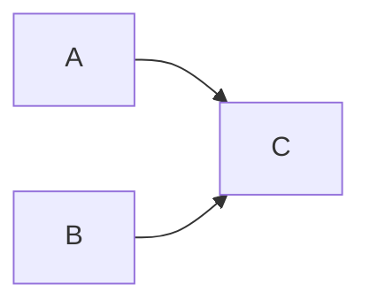

<!-- ============ 文档分隔线：045-pnpm-monorepo/001-PnpmMonorepoOverview.md ============ -->

> 本节为增量补充，帮助你选择 pnpm 版本。

- pnpm：11.x 为当前稳定版（本仓库使用的 11.15.1），支持目录锁（Catalogs）、Turborepo 任务编排与 Changesets 发布。
- 安装方式：`corepack enable pnpm` 或独立安装脚本；建议通过 packageManager 字段固定版本。
- Monorepo 场景：pnpm workspaces + Turborepo + Changesets 是当前企业主流组合。


## 1. 从"一个仓库装下所有项目"说起

### 1.1 多仓库的烦恼

想象一个公司有三个项目：Web 前端、后台管理系统、一套共享的 UI 组件库。最"自然"的做法是开三个 Git 仓库，各管各的：

```
repo-web/       # Web 前端
repo-admin/     # 后台管理
repo-ui/        # 共享 UI 组件库
```

刚开始一切正常。慢慢地，问题来了：

- 你在 UI 组件库里修了一个 bug，Web 和 Admin 都要用。于是你改完 UI 库 → 发版本 → 等 Web 升级依赖 → 再改 Admin——**一次改动，三套流程**。
- Web 和 Admin 各自声明了不同版本的 React，修一个样式要在两个项目里各改一遍。
- 新人入职想跑通整个产品，要 clone 三个仓库、装三份依赖、开三个终端——**"上手成本"高到劝退**。

### 1.2 Monorepo 的解法

**Monorepo（单仓库多包）**：把所有应用、共享库、工具链放进**同一个 Git 仓库**，用一个包管理器统一管理。

```
fandex-monorepo/
  apps/
    web/          # Web 前端
    admin/        # 后台管理
  packages/
    ui/           # 共享 UI 组件库
  pnpm-workspace.yaml
  package.json
```

Monorepo 带来的四个核心收益：

**收益一：原子提交。** 改 UI 库 + 升级 Web/Admin 的引用，可以**一次提交**完成。跨包的修改永远保持同步，不会出现"UI 库改了，引用它的项目还在用旧版"的撕裂状态。

**收益二：统一依赖。** 所有包共享一份 lockfile（`pnpm-lock.yaml`），React、TypeScript 的版本全仓库统一，杜绝"这个项目 React 18、那个项目 React 19"的漂移。

**收益三：代码复用无成本。** 共享包通过 `workspace:*` 协议直接引用本地源码（详见 004 篇），改完立刻生效，**不需要发布到 npm 就能联调**。

**收益四：统一 CI。** 一次流水线就能构建/测试所有相关包，配合任务缓存（详见 006 篇），CI 速度反而比多仓库更快。

### 1.3 代价是什么

Monorepo 不是银弹，它把"仓库管理"的复杂度转移到了"工具链管理"：

- 需要 workspace 管理（pnpm/yarn workspaces）
- 需要任务编排（turbo/nx），否则全量构建越来越慢
- 需要版本管理纪律（changesets），否则发版混乱

**所以**：2-3 个强关联项目用 Monorepo 非常合适；如果是几十个互不相关的项目硬塞进一个仓库，反而会互相拖累。**Monorepo 的核心是"它们确实需要一起演进"。**

### 1.4 为什么是 pnpm

Node 生态的包管理器有 npm、yarn、pnpm 三个主流选择。pnpm 之所以是 Monorepo 的事实标准，靠的是三套机制（详见 002 篇）：

| 机制 | 解决的问题 |
| :--- | :--- |
| 内容寻址存储 | 磁盘空间浪费（多项目重复安装） |
| 符号链接 node_modules | 幽灵依赖（项目用了没声明的包） |
| workspace 原生支持 | 多包统一管理（安装、过滤、拓扑） |

## 2. pnpm 的核心机制速览

### 2.1 内容寻址存储（Content-Addressable Store）

pnpm 把所有依赖包的内容存在一个**全局 store** 中，按内容哈希寻址。同一个版本的包，无论被多少项目引用，磁盘上只有一份；项目安装时通过**硬链接**把 store 中的文件链接到自己的 node_modules。

```bash
pnpm store path        # 查看全局 store 路径
pnpm store status      # 检查 store 与项目的链接状态
pnpm store prune       # 清理未被任何项目引用的孤儿包
```

### 2.2 严格依赖隔离

传统 npm 把依赖"扁平提升"到根 node_modules，导致项目可以 import **自己没有声明过的包**——这叫**幽灵依赖**。本地开发时"恰好能跑"，一旦某层依赖被移除或版本变化，干净环境（CI）突然报错，非常难排查。

pnpm 的 node_modules 是"符号链接 + 虚拟存储"结构：**只有 package.json 中显式声明的依赖对项目可见**，间接依赖藏在 `.pnpm` 深处，从结构上杜绝幽灵依赖。

```text
node_modules/
  .pnpm/              # 虚拟存储：所有真实包按版本存放
  my-app -> .pnpm/my-app@1.0.0/node_modules/my-app   # 直接依赖符号链接
```

### 2.3 workspace 协议

包之间通过 `workspace:*` 引用本地兄弟包：

```json
{
  "name": "@fandex/web",
  "dependencies": {
    "@fandex/utils": "workspace:*"
  }
}
```

开发时解析到**本地源码目录**（改完即生效），发布时自动替换为真实版本号（如 `1.2.3`）。这是 Monorepo 代码复用的"基础设施"。

## 3. 工程结构：一个真实 Monorepo 的样子

FANDEX 本身就是一个典型的 pnpm Monorepo：

```text
FANDEX/
  app-web/               # Web 应用（Astro + React）
  app-desktop/           # 桌面应用（Tauri + Expo）
  app-android/           # Android 应用（Expo）
  shd-shared/            # 共享层（tokens、utils、assets）
  tls-tools/             # 工具链（ID 分配、清单生成）
  thd-third-party/       # 第三方组件封装
  dcs-docs/              # 文档目录
  pnpm-workspace.yaml    # workspace 配置
  package.json
```

`pnpm-workspace.yaml` 声明哪些目录是"包"：

```yaml
packages:
  - 'app-*'
  - 'shd-shared'
  - 'shd-shared/*'
  - 'tls-tools'
  - 'thd-third-party/*'
```

**结构设计原则**：可部署的应用（app-*）与可复用的库（shd-shared、thd-third-party）分开；工具链单独（tls-tools）；glob 模式保证新增目录自动纳入管理。

## 4. catalog：依赖版本的"单一事实来源"

Monorepo 最头疼的问题之一是**版本漂移**：A 包用 `react@^18`，B 包用 `react@^19`。catalog 让版本定义集中到一处：

```yaml
# pnpm-workspace.yaml
catalog:
  react: ^19.0.0
  typescript: ^5.7.0
  vite: ^6.0.0
```

各包通过 `catalog:` 协议引用（详见 005 篇）：

```json
{
  "dependencies": {
    "react": "catalog:"
  }
}
```

升级版本只需改 `pnpm-workspace.yaml` 一处，全仓库同步。配合 `catalogMode: strict` 还能从工具层面**强制**所有包只能使用 catalog 中定义的版本。

## 5. 常用命令速查

```bash
pnpm install                     # 安装全部 workspace 依赖
pnpm install --frozen-lockfile   # CI：严格按 lockfile 安装
pnpm --filter @fandex/web dev    # 只操作指定包（-F 简写）
pnpm -r build                    # 递归构建所有包
pnpm -r --topological build      # 按依赖拓扑顺序构建（先依赖后应用）
pnpm -F @fandex/web add lodash   # 给指定包添加依赖
pnpm why react                   # 查看某个依赖的来源与版本
pnpm store prune                 # 清理全局 store 孤儿包
```

**三个最容易混淆的命令**：

| 命令 | 作用 | 什么时候用 |
| :--- | :--- | :--- |
| `pnpm -r <cmd>` | 对所有包执行 | 全量操作 |
| `pnpm -F <pkg> <cmd>` | 只对指定包执行 | 定向操作 |
| `pnpm -r --topological <cmd>` | 按依赖顺序执行 | 构建（先依赖后应用） |

## 6. 任务编排：pnpm 的边界与 turbo 的补位

### 6.1 pnpm 原生能力的边界

`pnpm -r --topological build` 能按依赖顺序构建，但它**不知道构建产物是什么、能不能复用**——每次改动都会全量重跑所有包的任务。包的数量超过 10 个后，CI 时间会线性膨胀。

### 6.2 Turborepo：缓存 + 依赖图编排

Turborepo 在 pnpm 之上增加两层能力（详见 006 篇）：

- **任务依赖图**：`dependsOn: ["^build"]` 声明"先构建依赖包"
- **哈希缓存**：按输入文件内容计算指纹，未变更的包直接复用缓存（`FULL TURBO`）

```json
{
  "tasks": {
    "build": { "dependsOn": ["^build"], "outputs": ["dist/**"] },
    "test":  { "dependsOn": ["build"], "outputs": [] }
  }
}
```

### 6.3 怎么选

- **小型 Monorepo（<10 包）**：pnpm 原生脚本足够，无需 turbo
- **中型以上（10+ 包）或 CI 变慢**：引入 Turborepo，收益明显
- 二者完全兼容：turbo 内部仍然调用各包的 package.json scripts

## 7. 版本管理与发布：changesets

Monorepo 发版和单仓库完全不同——改一个共享包可能牵动多个包。手工维护版本号极易出错：漏改依赖引用、CHANGELOG 缺失、版本冲突。

**Changesets**（详见 007 篇）把发版拆成两个环节：

1. **开发期**：每个 PR 附带一个"变更集文件"（记录改了哪个包、什么级别 major/minor/patch）
2. **发版期**：CI 统一计算各包新版本、生成 CHANGELOG、按拓扑顺序发布到 npm

```bash
pnpm changeset add        # 记录变更（交互式选择包与级别）
pnpm changeset version    # 更新版本号与 CHANGELOG
pnpm changeset publish    # 发布到 npm
```

**关键认知**：发版是"自动化的"而不是"手工的"。人的判断力应该花在"这次变更是什么级别"上，而不是"版本号改成几"上。

## 8. CI 最佳实践

Monorepo 的 CI 配置有几个关键点：

```yaml
# GitHub Actions 片段
steps:
  - uses: pnpm/action-setup@v4
    with:
      version: 11
  - uses: actions/setup-node@v4
    with:
      node-version: 22
      cache: pnpm          # 缓存 pnpm store，安装秒级
  - run: pnpm install --frozen-lockfile   # 严格按 lockfile
  - run: turbo run lint test build --affected  # 只构建变更相关
```

| 实践 | 为什么 |
| :--- | :--- |
| `--frozen-lockfile` | 保证 CI 与本地依赖完全一致，防止"本地能跑 CI 挂" |
| `cache: pnpm` | 缓存全局 store，安装从分钟级降到秒级 |
| `--affected` | 只跑变更涉及的包，未变更的命中 turbo 缓存 |
| pnpm 版本固定（action-setup） | 团队与 CI 使用同一 pnpm 版本，避免行为差异 |

## 9. 常见陷阱

**陷阱一：幽灵依赖。** 代码 import 了未声明的包，本地能跑、干净环境失败。→ 用 pnpm 的严格隔离，谁使用谁声明。

**陷阱二：构建顺序错误。** 应用先于依赖构建，找不到共享包产物。→ 用 `--topological` 或 turbo 的 `dependsOn: ["^build"]`。

**陷阱三：忽略 lockfile 提交。** 团队环境不一致，依赖解析结果不同。→ `pnpm-lock.yaml` 必须入库。

**陷阱四：版本漂移。** 各包直接写不同版本的同一依赖。→ 用 catalog + `catalogMode: strict`。

**陷阱五：循环依赖。** 包间互相引用，拓扑构建死循环。→ 重新设计分层，抽取共同依赖下沉。

**陷阱六：大仓库 CI 慢。** 全量任务重复跑。→ 用 turbo 缓存与 `--affected` 模式。

## 10. 小结

pnpm + Monorepo 是现代前端工程化的主流组合，它的价值可以浓缩成四句话：

1. **一个仓库管理所有包**（workspace）——原子提交、统一依赖、零成本复用
2. **底层机制保证正确**（内容寻址存储 + 严格隔离）——省磁盘、杜绝幽灵依赖
3. **catalog 统一版本**——版本漂移从工具层面被消灭
4. **turbo 加速 + changesets 自动化发版**——大规模仓库的 CI 保持在分钟级

**学习建议**：不要一次性掌握所有工具。先跑通"workspace + `workspace:*` + 基本命令"的最小闭环，再逐步引入 catalog → turbo → changesets。工程化是渐进式推进的（见 039-engineering-practices《工程实践概述》）。

<!-- ============ 文档分隔线：045-pnpm-monorepo/002-PnpmCore.md ============ -->

## 1. 从"图书馆的藏书方式"说起

### 1.1 一个存储的类比

想象一个大型图书馆。它有两种存书方式：

**方式 A（每个阅览室各买一套）**：每个阅览室都买一套《百科全书》。好处是每个阅览室都能独立查书，但代价是：10 个阅览室就要买 10 套书，浪费空间，而且同一本书被重复购买。

**方式 B（中央书库 + 检索架）**：书只买一份，存在中央书库。每个阅览室只放一个"检索架"，架子上是一张张"卡片"，指向书库里那本唯一的书。读者通过卡片找到书——空间省了 90%，而且书的内容只有一份，永远不会"版本不一致"。

**npm 就是方式 A**：每个项目把依赖完整复制一份到自己的 node_modules，10 个项目装同一个 lodash，磁盘上就有 10 份 lodash。

**pnpm 就是方式 B**：所有依赖包存在一个**全局 store**（中央书库），项目里的 node_modules 只是"符号链接"（检索卡片），指向 store 中的真实文件。

### 1.2 pnpm 是什么

**pnpm** 是 Node.js 生态的包管理器，与 npm、yarn 同类，但它通过三套核心机制，从根源上解决了传统包管理器的两大痛点：

| 痛点 | 传统 npm 的表现 | pnpm 的解法 |
| :--- | :--- | :--- |
| 磁盘浪费 | 每个项目各存一份依赖 | 内容寻址存储 + 硬链接复用 |
| 幽灵依赖 | 项目能 import 未声明的包 | 符号链接 + 严格依赖隔离 |

当前 pnpm 11.x 要求 Node.js 22+，本身为纯 ESM 实现。它的优势不只是"安装快"，而是**整体安装模型更正确**：每个项目只声明并访问自己真正依赖的包。

### 1.3 与 npm 的定位差异

| 维度 | npm / yarn | pnpm |
| :--- | :--- | :--- |
| 磁盘占用 | 每项目各存一份，多项目重复 | 全局 store 只存一份，硬链接复用 |
| node_modules 结构 | 扁平提升 | 符号链接 + .pnpm 虚拟存储 |
| 幽灵依赖 | 普遍存在 | 结构上杜绝 |
| 适合场景 | 单包项目 | 单包与 Monorepo 均适合 |

## 2. 内容寻址存储（Content-Addressable Store）

### 2.1 工作原理

pnpm 将下载的依赖包内容存入一个**全局 store**，目录按**内容哈希**命名。关键特性：

- 同一个版本的包，无论被多少项目引用，store 中只有一份
- 项目安装时通过**硬链接**把 store 中的文件链接到自己的 node_modules
- 硬链接不复制内容，只是"多个路径指向同一份物理数据"

```bash
# 查看 store 路径与使用情况
pnpm store path
pnpm store status

# 清理 store 中未被任何项目引用的孤儿包
pnpm store prune
```

**一个直观的数字**：10 个项目都安装 lodash，npm 占用 10 份空间；pnpm 只占 1 份，其余 9 份是近乎零成本的硬链接。

### 2.2 硬链接与版本共存

硬链接（hard link）让多个路径指向同一份物理数据，不复制内容。10 个项目都装 lodash，磁盘上只有一份 lodash 数据。

pnpm 11 还有两个升级：

- 将原来的"每包一个 JSON 索引"升级为**单个 SQLite 数据库**（store v11），安装时更少的系统调用，速度更快
- 同一个包的不同版本可以并存于 store（`lodash@4.17.21`、`lodash@5.0.0` 各自独立），互不干扰

### 2.3 store 的共享前提

**硬链接有前提：store 与项目必须位于同一磁盘分区。** 跨盘符的项目无法硬链接，pnpm 会退回复制（copy）模式，此时节省磁盘的效果打折扣。

**实践建议**：

- Windows 上把 store 与工作目录放在同一盘符
- 或通过配置统一存放 store：

```yaml
# pnpm-workspace.yaml
store-dir: .pnpm-store
```

## 3. 符号链接 node_modules

### 3.1 三层结构

pnpm 的 node_modules 不再是扁平目录，而是由"**直接依赖符号链接 + .pnpm 虚拟存储**"组成：

```text
my-project/
  node_modules/
    .pnpm/                      # 虚拟存储：所有真实包文件按版本存放
      lodash@4.17.21/
      react@19.0.0/
    react -> .pnpm/react@19.0.0/node_modules/react   # 直接依赖符号链接
    lodash -> .pnpm/lodash@4.17.21/node_modules/lodash
```

**结构解读**：

- node_modules 顶层只有 **package.json 中显式声明的直接依赖**（通过符号链接指向 .pnpm 内的真实文件）
- 间接依赖（比如 lodash 依赖的某工具库）藏在 `.pnpm` 深处，**对项目代码不可见**

### 3.2 版本共存

同一个包的不同版本可以并存于 .pnpm：`react@18.0.0` 与 `react@19.0.0` 各自独立目录，互不干扰。这在 npm 扁平结构下需要复杂的提升策略才能勉强实现，pnpm 从结构上天然支持。

## 4. 严格依赖隔离：幽灵依赖的终结

### 4.1 什么是幽灵依赖

npm 把依赖**扁平提升**到根 node_modules，导致项目可以 import **自己没有声明的包**——这就是**幽灵依赖（Phantom Dependency）**。

```js
// 危险写法：react 并未声明在 package.json 中，却因提升而可见
import { useState } from 'react';
```

**为什么危险**：

- 本地开发时它"恰好能跑"（因为某层依赖把 react 提升到了顶层）
- 一旦那层依赖被移除或版本变化，项目在干净环境（CI）中突然报错
- 错误出现得非常晚、非常随机，极难排查

**pnpm 下的表现**：这种写法直接报 "module not found"——因为顶层符号链接只暴露声明的依赖。错误在**安装后立即暴露**，而不是留到生产环境。

### 4.2 严格模式对比

pnpm 默认即严格隔离。若想恢复 npm 的扁平行为，可配置 `shamefully-hoist`，但会同时恢复幽灵依赖问题：

```yaml
# pnpm-workspace.yaml（不推荐）
shamefully-hoist: true
```

**结论**：正常工程请保持默认严格模式。`shamefully-hoist` 仅用于迁移过渡或某些极端兼容场景。

## 5. 性能与安全优势

pnpm 的优势可以归纳为四点：

**第一，安装快。** store 命中后无需重新下载，硬链接本地完成，速度接近秒级。配合 CI 缓存（`cache: pnpm`），安装从分钟级降到秒级。

**第二，磁盘省。** 多项目共享 store，node_modules 体积大幅小于 npm。

**第三，构建快。** 严格的依赖声明让打包器（webpack、Vite）能更准确地分析模块图；配合只读的符号链接，可减少文件监听开销。

**第四，安全。** pnpm 11 默认开启供应链保护：

- `minimumReleaseAge` 默认 1440（新发布不足 1 天的包不解析）
- `blockExoticSubdeps` 默认开启
- 两者共同降低被投毒包攻击的风险

## 6. 配置体系：pnpm 11 的配置变化

### 6.1 配置拆分为两类

pnpm 11 将配置拆分为：

| 配置位置 | 放什么 |
| :--- | :--- |
| `.npmrc` | 仅 registry 与认证相关配置 |
| `pnpm-workspace.yaml`（项目级） | 其余 pnpm 设置 |
| 全局 `config.yaml`（用户级） | 用户级设置 |
| 环境变量 | 统一使用 `pnpm_config_` 前缀 |

```ini
# .npmrc：仅放 registry 与认证
registry=https://registry.npmjs.org/
//registry.npmjs.org/:_authToken=${PNPM_AUTH_TOKEN}
```

**要点**：`${...}` 语法引用环境变量，避免把 token 硬编码进文件；token 通常通过 CI 的 secrets 注入。

### 6.2 常用设置示例

```yaml
# pnpm-workspace.yaml 中的 pnpm 设置
store-dir: .pnpm-store
virtual-store-dir: node_modules/.pnpm

allowBuilds:
  electron: true      # 白名单：允许执行 postinstall
  esbuild: false      # 黑名单：禁止执行
```

**要点**：pnpm 11 用 `allowBuilds` 白名单/黑名单统一管理依赖的构建脚本执行（替代旧版 `onlyBuiltDependencies` 等多项配置），只放行信任的包执行 postinstall——这是防止"恶意依赖安装时执行攻击脚本"的关键防线。

## 7. 实战验证：亲手感受 pnpm 的机制

### 7.1 实验一：磁盘占用对比

```bash
# 用 npm 安装一个包
mkdir demo-npm && cd demo-npm && npm init -y && npm i lodash
du -sh node_modules

# 用 pnpm 安装同一个包
mkdir ../demo-pnpm && cd ../demo-pnpm && pnpm init && pnpm i lodash
du -sh node_modules

# 对比两个目录大小（pnpm 通常小得多）
```

### 7.2 实验二：观察幽灵依赖

```bash
# 在 npm 项目里：import 一个未声明的依赖（某层依赖提供的），能跑
cd demo-npm
node -e "require('some-transitive-dep')"  # 可能成功（幽灵依赖）

# 在 pnpm 项目里：同样的操作
cd ../demo-pnpm
node -e "require('some-transitive-dep')"  # 报 module not found
```

### 7.3 实验三：查看 store

```bash
pnpm store path     # 看全局 store 在哪
pnpm store status   # 看 store 与项目的链接状态
```

## 8. 常见误区

### 误区一：pnpm 只是"更快"的 npm

**真相**：快只是副产品。pnpm 的真正价值是**更正确的依赖模型**（严格隔离 + 内容寻址），它改变了 node_modules 的结构，从根源上消灭幽灵依赖。

### 误区二：幽灵依赖只是"小问题"

**真相**：幽灵依赖是"定时炸弹"——本地永远发现不了，只在干净环境（CI/同事机器/生产）引爆，而且报错信息毫无提示。它是 Node 项目最诡异的故障来源之一。

### 误区三：硬链接会"共享文件导致修改互相影响"

**真相**：npm 的依赖包在安装后是只读的（不可变），硬链接不会造成修改污染。如果你手动改了 node_modules 里的文件，那本来就不该改。

### 误区四：`shamefully-hoist` 是正常配置

**真相**：它是"模拟 npm"的兼容开关，会重新引入幽灵依赖。除了迁移过渡，正常工程不应使用。

<!-- ============ 文档分隔线：045-pnpm-monorepo/003-WorkspaceSetup.md ============ -->

## 1. 从"一个家几个房间"说起

### 1.1 工作空间是什么

想象一栋房子（一个 Git 仓库），里面有多个房间（多个包/项目）。每个房间功能不同：客厅接待访客（Web 应用）、书房办公（后台管理）、储藏室放杂物（工具库）。

**工作空间（workspace）就是"把这栋房子统一管理起来"的机制**：水电（依赖）统一接入、公共区域（共享代码）共用、整体规划（统一版本）。

在 pnpm 中，工作空间是**多包管理能力**：在同一个仓库里管理多个相互独立的包，这些包共享一份 `pnpm-lock.yaml`，依赖统一安装、统一解析。它是 Monorepo 工程模式的基石。

### 1.2 没有 workspace 时的问题

没有 workspace 时，每个子项目各自 `npm install`：

- 会产生 N 份重复的 node_modules（磁盘浪费）
- 每个项目单独管理依赖版本（版本漂移）
- 项目之间无法直接引用本地代码（只能发版或复制）

有了 workspace，pnpm 一次 `pnpm install` 即可为全部包生成依赖，并通过符号链接让包之间互相引用（详见 004 篇）。

### 1.3 最小工作空间的三个文件

一个 pnpm workspace 至少包含：

| 文件 | 作用 |
| :--- | :--- |
| `pnpm-workspace.yaml` | 声明哪些目录是包 |
| 根 `package.json` | 公共脚本与元数据 |
| `pnpm-lock.yaml` | 由 pnpm 自动生成，锁定依赖树（**必须提交**） |

## 2. 动手：从零搭建一个 workspace

### 2.1 初始化

```bash
# 1. 创建项目目录并进入
mkdir my-monorepo && cd my-monorepo

# 2. 创建根 package.json（-w 表示 workspace root）
pnpm init -w
```

生成的根 `package.json` 长这样：

```json
{
  "name": "my-monorepo",
  "version": "1.0.0",
  "private": true
}
```

### 2.2 创建 pnpm-workspace.yaml

```yaml
# pnpm-workspace.yaml
packages:
  - 'apps/*'          # 所有应用：apps/web、apps/docs
  - 'packages/*'      # 所有共享库：packages/utils、packages/ui
  - 'tools/*'         # 工具链
  - '!apps/legacy'    # 感叹号排除不需要纳入的目录
```

### 2.3 创建两个包

```bash
# 创建应用目录
mkdir -p apps/web
cd apps/web
pnpm init        # 生成 web 的 package.json
cd ../..

# 创建共享库目录
mkdir -p packages/utils
cd packages/utils
pnpm init
cd ../..
```

### 2.4 安装全部依赖

```bash
# 回到根目录，一次安装所有包
cd my-monorepo
pnpm install
```

此时你会发现：

- 生成了 `pnpm-lock.yaml`（整个工作空间的依赖锁）
- 所有包的依赖被统一管理
- 各包可以通过 `workspace:*` 协议互相引用（见 004 篇）

## 3. pnpm-workspace.yaml 详解

### 3.1 packages 模式

`packages` 字段用 glob 模式声明工作空间包含哪些目录：

```yaml
packages:
  - 'apps/*'          # 所有应用：apps/web、apps/docs
  - 'packages/*'      # 所有共享库：packages/utils、packages/ui
  - 'tools/*'         # 工具链
  - '!apps/legacy'    # 感叹号排除不需要纳入的目录
```

**glob 模式规则**：

| 写法 | 含义 |
| :--- | :--- |
| `*` | 匹配一层目录（apps/web） |
| `**` | 递归匹配多层（packages/**） |
| `!` | 排除指定目录 |

每个匹配到的目录都必须包含一个 `package.json`，否则 pnpm 会报错（告诉你是哪个目录缺 package.json）。

### 3.2 FANDEX 风格示例

```yaml
packages:
  - 'app-*'           # FANDEX 风格：app-web、app-desktop 等前缀匹配
  - 'shd-shared'      # 单目录
  - 'shd-shared/*'
  - 'thd-third-party/*'
```

**注意**：`shd-shared` 与 `shd-shared/*` 同时出现，表示共享层自身的 package.json 及其子包都纳入工作空间——这样可以精确控制"哪些目录算包"。

## 4. 根 package.json 的职责

### 4.1 关键字段

```json
{
  "name": "fandex-monorepo",
  "private": true,
  "packageManager": "pnpm@11.0.0",
  "engines": {
    "node": ">=22"
  },
  "scripts": {
    "build": "pnpm -r --topological build",
    "dev:web": "pnpm --filter @fandex/web dev"
  }
}
```

| 字段 | 作用 |
| :--- | :--- |
| `private: true` | 防止根包被误发布到 npm |
| `packageManager` | 配合 Corepack 固定 pnpm 版本，保证团队与 CI 使用同一版本 |
| `engines.node` | 声明 Node 最低版本 |
| `scripts` | 公共命令入口（新人只记根命令即可） |

### 4.2 根目录不要放业务依赖

根 package.json **只放工程级依赖**（构建、lint、类型检查等开发工具），业务依赖应归属到具体包。

**为什么**：根目录的依赖会暴露给所有包（提升），滥用会导致依赖职责混乱——"这个包到底依赖什么"变得说不清。好习惯：**根目录只放"整个仓库级"的工具，业务依赖进各自的包**。

## 5. 安装命令 pnpm install

### 5.1 首次安装与增量安装

```bash
pnpm install            # 安装所有包的依赖，生成/更新 pnpm-lock.yaml
pnpm install -w         # 给根包安装开发依赖（-w 表示 workspace root）
```

`-w`（--workspace-root）把依赖加到根 package.json；不带参数时 pnpm 会读取全部包的依赖一次性安装。

### 5.2 冻结安装（CI 必用）

```bash
# CI 或生产环境：严格按照 lockfile 安装，任何偏差直接报错
pnpm install --frozen-lockfile
```

`--frozen-lockfile` 不修改 pnpm-lock.yaml，若 lockfile 与 package.json 不一致则安装失败。

**为什么 CI 必须用**：保证团队与线上环境依赖完全一致，防止"本地能跑、CI 挂"的幽灵依赖问题（见 002 篇）。

### 5.3 pnpm-lock.yaml 必须入库

pnpm-lock.yaml 记录了整个工作空间解析后的**精确依赖树**，是"可复现安装"的唯一依据：

- 它应提交到 Git，**不要加入 .gitignore**
- 合并冲突时可运行 `pnpm install` 自动修复（lockfile 冲突通常可直接重新生成局部差异）

## 6. 常用脚本与过滤

### 6.1 递归执行：-r

```bash
pnpm -r build               # 对所有包执行 build
pnpm -r --topological build # 按依赖拓扑顺序：先依赖后应用
pnpm -r --parallel lint     # 并行执行互不依赖的 lint
```

| 选项 | 作用 |
| :--- | :--- |
| `-r` | 递归到所有包执行 |
| `--topological` | 按依赖拓扑排序（先构建被依赖的包） |
| `--parallel` | 忽略拓扑关系并行执行（适合 lint 等无依赖任务） |

**为什么需要 `--topological`**：如果应用先构建，而它依赖的共享库还没构建，应用就会因为找不到依赖产物而失败。拓扑排序保证"先依赖后应用"。

### 6.2 按包过滤：--filter / -F

```bash
pnpm -F @fandex/web dev          # 只运行 web 包的 dev
pnpm -F @fandex/utils add lodash # 给 utils 包添加依赖
pnpm -F @fandex/web --filter "…{@fandex/utils}…" test  # 连同依赖一起
```

**花括号过滤语法**：

| 写法 | 含义 |
| :--- | :--- |
| `@{包}…` | 该包及其所有依赖 |
| `…{包}` | 所有依赖该包的包 |
| `@{包}…{包2}` | 两个方向都包含 |

### 6.3 常用命令速查

| 命令 | 作用 |
| ---- | ---- |
| `pnpm -r build` | 所有包构建 |
| `pnpm -F <pkg> dev` | 单包开发 |
| `pnpm why <dep>` | 查看某个依赖的来源与版本 |
| `pnpm list -r` | 列出所有包及依赖 |
| `pnpm update` | 更新 lockfile 中的依赖版本 |
| `pnpm remove <dep> -F <pkg>` | 移除指定包依赖 |

## 7. 常见问题与陷阱

**陷阱一：目录没有 package.json。** pnpm 报"目录 X 在 workspace 中，但缺少 package.json"。→ 检查 pnpm-workspace.yaml 的 glob 是否匹配了不该匹配的目录。

**陷阱二：root 加依赖忘了 -w。** `pnpm add typescript`（在根目录）会把依赖加到某个包的 package.json 而不是根。→ 根目录加依赖必须 `pnpm add -w`。

**陷阱三：lockfile 冲突。** 多人同时改 package.json 导致 pnpm-lock.yaml 冲突。→ 不要手改 lockfile，直接运行 `pnpm install` 自动修复。

**陷阱四：`--frozen-lockfile` 报错。** CI 上报"lockfile 与 package.json 不一致"。→ 说明有人改了 package.json 没重新 install，本地先执行 `pnpm install` 提交新的 lockfile。

**陷阱五：glob 模式写错。** `apps/*` 只匹配一层，`apps/**` 匹配多层。→ 根据目录深度选择合适的写法。

<!-- ============ 文档分隔线：045-pnpm-monorepo/004-WorkspaceProtocol.md ============ -->

## 1. 从"指路"说起：为什么需要 workspace 协议

### 1.1 一个联调场景

假设 `@fandex/web`（应用）要使用 `@fandex/utils`（同仓库的共享库）。你第一反应是写：

```json
{
  "dependencies": {
    "@fandex/utils": "^1.0.0"
  }
}
```

**问题来了**：pnpm 看到 `^1.0.0`，会去 npm registry 查找 `@fandex/utils@^1.0.0`。如果这个包从未发布，安装直接失败；即便发布过，版本也可能与本地源码不同步——你改了 utils 的代码，web 引用的却是 registry 上的旧版。

**我们需要的是**："web 引用仓库里那个 utils，而不是 registry 上的 utils"。这就是 `workspace:` 协议存在的意义。

### 1.2 什么是 workspace 协议

**`workspace:` 是 pnpm（以及 yarn berry）在 package.json 中声明"依赖本仓库内另一个包"的专用协议**。它让包之间的引用在开发时解析到**本地源码目录**，而不是去 npm registry 下载。

## 2. 协议形式与语义

| 形式 | 语义 | 开发时解析 | 发布时转换 |
| ---- | ---- | ---- | ---- |
| `workspace:*` | 任意本地版本 | 本地包 | 替换为当前精确版本号，如 1.2.3 |
| `workspace:^` | 兼容范围内最新 | 本地包 | 替换为 `^1.2.3` |
| `workspace:~` | 补丁范围内最新 | 本地包 | 替换为 `~1.2.3` |

```json
{
  "dependencies": {
    "@fandex/utils": "workspace:*",
    "@fandex/tokens": "workspace:^"
  }
}
```

**三种形式的异同**：

- **开发阶段**：三者行为一致，都解析到本地包
- **发布之后**：`workspace:*` 变成精确版本 `1.2.3`；`workspace:^` 变成 `^1.2.3`（允许小版本升级）；`workspace:~` 变成 `~1.2.3`（只允许补丁升级）
- **最常用**：`workspace:*`，表示"只要本地有这个包就用它"

## 3. 本地包引用实战

### 3.1 添加内部依赖

```bash
# 语法：pnpm add <包名> --filter <目标包>
pnpm add @fandex/utils --filter @fandex/web
```

pnpm 检测到 `@fandex/utils` 是工作空间内的包，会自动写入 `workspace:*`，并把 node_modules 中对应目录符号链接到本地源码，改动即时生效。

### 3.2 引用共享包代码

```text
packages/
  utils/                 # @fandex/utils，导出工具函数
    package.json
    src/index.ts
  web/                   # @fandex/web，引用 utils
    package.json
    src/main.ts
```

```ts
// packages/web/src/main.ts：直接 import 共享包源码
import { formatId } from '@fandex/utils';
```

**要点**：

- 无需构建 utils 即可被 web 引用——只要构建工具（Vite、tsc）能解析符号链接到源码即可
- 若共享包需要先编译（如发布 CommonJS），则需要 `--topological build` 保证依赖先构建

### 3.3 peerDependencies 场景

库类包（被他人安装的包）用 workspace 协议引用兄弟包时，更推荐放在 `peerDependencies` 中，避免打包进自己的产物，由使用者提供实现：

```json
{
  "peerDependencies": {
    "react": "^19.0.0"
  },
  "devDependencies": {
    "react": "workspace:*"
  }
}
```

**解读**：peer 依赖声明"我要求对方环境里有 react"；devDependencies 中的 workspace 引用用于本地开发测试。

## 4. 发布时版本转换

运行 `pnpm publish` 或 `pnpm pack` 时，pnpm 会把 package.json 中的 `workspace:` 协议替换为实际版本：

```json
// 发布前（仓库内）
"@fandex/utils": "workspace:*"
```

```json
// 发布后（registry 上的产物）
"@fandex/utils": "1.2.3"
```

**这套机制的价值**：

- **开发时**：用本地（改完即生效）
- **发布后**：用真实版本（消费者可正常安装）
- **转换只发生在发布产物中，仓库内文件不会被改写**
- 消费者用 npm/yarn/pnpm 都能正常解析（因为是标准语义化版本）

## 5. 内部依赖与幽灵依赖

工作空间包之间同样遵循严格隔离（见 002 篇）：web 引用 utils，但 **utils 依赖的 lodash 对 web 不可见**。web 若直接 import lodash，必须在自己的 package.json 中显式声明：

```bash
# 正确做法：谁使用谁声明
pnpm add lodash --filter @fandex/web
```

**关键认知**：包间依赖是"代码依赖"与"依赖关系"两层。

- 即便 utils 被链接到 web 的 node_modules（代码依赖成立）
- utils 的依赖树也不会向 web 暴露（依赖关系不成立）
- 保持每个包依赖自包含，是避免 Monorepo 幽灵依赖的关键

## 6. 常见问题与陷阱

### 6.1 循环依赖

**现象**：A 依赖 B、B 依赖 A，拓扑构建无法排序。

**解决**：重新分层，抽取共同依赖到更底层的 C：



### 6.2 误用 file: 协议

```json
// 错误：file: 是复制/链接目录的快照语义
"@fandex/utils": "file:../utils"
```

**问题**：

- `file:` 发布时不会转换版本
- 会破坏符号链接结构（按目录快照处理）

**正确做法**：内部引用一律使用 `workspace:`。

### 6.3 版本不一致告警

多个包声明了不同版本的同一共享包：

```bash
# 排查来源
pnpm why <包名>
```

再用 catalog 统一（见 005 篇）。

### 6.4 共享包改了不生效

**现象**：改了 utils 源码，web 里没反应。

**可能原因**：

- web 的构建工具没有解析符号链接到源码（需要配置 alias）
- 共享包需要先构建（tsc 输出 dist），web 引用的是 dist 而非 src
- 缓存未清除

**排查**：先确认 web 的 import 路径指向哪里（源码 or dist），再检查构建配置。

<!-- ============ 文档分隔线：045-pnpm-monorepo/005-CatalogManagement.md ============ -->

## 1. 从"公司统一采购"说起

### 1.1 版本漂移的烦恼

想象一家公司有多个部门（多个包），每个部门自己采购办公用品（依赖）。

**没有统一采购时**：A 部门买了"Windows 10"的电脑、B 部门买了"Windows 11"、C 部门还在用"Windows 7"。运维（你）想统一系统，得一个个部门去沟通、升级——而且升级了 A 部门，B 部门可能不兼容。

**这就是版本漂移**：Monorepo 中多个包使用同一依赖时，若各自手写版本，容易出现一个包用 `react@^18.3.0`、另一个用 `react@^19.0.0` 的局面。

### 1.2 catalog 的解法

**catalog（依赖目录）是 pnpm 的工作空间特性**：把常用依赖的版本范围**集中定义**在 `pnpm-workspace.yaml` 中，各包通过 `catalog:` 协议引用。它是依赖版本的"**单一事实来源**"。

- 所有包指向同一份版本定义
- 升级时只需改一处（pnpm-workspace.yaml）
- 全工作空间同步生效

## 2. catalog 的配置与引用

### 2.1 定义默认 catalog

```yaml
# pnpm-workspace.yaml
packages:
  - 'apps/*'
  - 'packages/*'

catalog:
  react: ^19.0.0
  typescript: ^5.7.0
  vite: ^6.0.0
```

**要点**：

- 顶层 `catalog` 字段定义的是名为 `default` 的目录
- 版本范围使用语义化版本写法，与 package.json 中直接书写完全等价

### 2.2 通过 catalog: 协议引用

```json
// packages/web/package.json
{
  "name": "@fandex/web",
  "dependencies": {
    "react": "catalog:",
    "react-dom": "catalog:"
  },
  "devDependencies": {
    "typescript": "catalog:"
  }
}
```

**要点**：

- `catalog:` 是 `catalog:default` 的简写，pnpm 解析时等价于写上 `^19.0.0`
- `catalog:` 协议可用于 dependencies、devDependencies、peerDependencies、optionalDependencies 以及 pnpm-workspace.yaml 的 overrides

### 2.3 具名 catalog（catalogs）

当不同包需要不同版本的同一依赖（如迁移期共存）时，可用复数 `catalogs` 定义具名目录：

```yaml
catalog:
  react: ^16.14.0

catalogs:
  react17:
    react: ^17.0.2
  react18:
    react: ^18.2.0
```

```json
{
  "dependencies": {
    "react": "catalog:react18"
  }
}
```

**要点**：`catalog:react18` 显式指定使用名为 react18 的目录。默认目录与具名目录可以共存；迁移完成后再逐步收敛到单一版本。

## 3. catalogMode：严格模式

`catalogMode` 控制执行 `pnpm add` 时依赖如何写入默认目录，pnpm 11 中默认值为 `manual`：

| 模式 | 行为 | 适用场景 |
| ---- | ---- | ---- |
| manual（默认） | pnpm add 正常写入版本范围，不自动维护 catalog | 起步阶段、习惯手写 catalog |
| strict | 只允许使用 catalog 中已定义的依赖版本，超出范围直接报错 | 强约束团队统一版本 |
| prefer | 优先使用 catalog 中版本；不存在时回退为普通版本范围 | 渐进迁移 |

```yaml
# pnpm-workspace.yaml
catalog:
  react: ^19.0.0
  typescript: ^5.7.0

catalogMode: strict
```

**strict 模式的价值**：如果某个包 `pnpm add` 了 catalog 中不存在的依赖（或不在目录版本范围内），安装直接失败——**从工具层面杜绝版本漂移**。`prefer` 适合从零散版本向 catalog 迁移的过渡期。

### 3.1 手动添加目录条目

strict 模式下添加新依赖时，先手动在 catalog 中登记版本，再在各包中用 `catalog:` 引用：

```bash
# 给指定包添加 catalog 中已存在的依赖
pnpm add react --filter @fandex/web
# 全部更新到 catalog 定义的最新范围
pnpm -r update
```

**要点**：`pnpm update` 会按 catalog 中的范围更新 lockfile；版本范围的变更只需改 pnpm-workspace.yaml 一处，再执行一次 update 即可让整个工作空间同步。

## 4. 在 overrides 中使用 catalog

```yaml
# pnpm-workspace.yaml
overrides:
  lodash: catalog:
  react: catalog:react18
```

**要点**：overrides 强制统一依赖树中某包的解析版本，常用于修复安全漏洞或处理依赖冲突；catalog 协议让 overrides 与包声明保持同一版本来源。

## 5. 发布时的版本转换

与 `workspace:` 协议类似，`pnpm publish` 或 `pnpm pack` 时，`catalog:` 协议会被替换为 catalog 中定义的版本范围：

```json
// 发布前
"react": "catalog:react18"
// 发布后
"react": "^18.2.0"
```

**要点**：转换保证消费者从 registry 安装时拿到的是标准版本范围，与其他包管理器完全兼容。仓库内文件不受影响。

## 6. 最佳实践

**第一**，框架级依赖（react、vue、typescript、vite）优先进默认 catalog，确保全工作空间一致。

**第二**，严格模式下新依赖先进 catalog 再引用，避免绕过统一版本管理。

**第三**，迁移旧项目时用 `prefer` 模式过渡，逐步收敛，再切回 `manual` 或 `strict`。

**第四**，catalog 与 workspace 协议搭配使用，分工明确：

| 引用对象 | 用什么协议 |
| :--- | :--- |
| 内部包引用（兄弟包） | `workspace:*` |
| 外部依赖版本（npm 包） | `catalog:` |

## 7. 常见误区

**误区一：catalog 会强制所有包用完全相同的版本。** → catalog 定义的是"版本范围"（如 `^19.0.0`），同一范围解析出的具体版本一致；需要强制锁定时用 strict 模式。

**误区二：升级版本要改每个包。** → 只需改 `pnpm-workspace.yaml` 中的 catalog 一处，然后 `pnpm -r update`。

**误区三：catalog 只能放 dependencies。** → 它可以用于 dependencies、devDependencies、peerDependencies、overrides 等所有依赖位置。

**误区四：用了 catalog 就不需要 workspace 协议了。** → 两者分工不同：catalog 管"外部依赖版本"，workspace 管"内部包引用"，配合使用才完整。

<!-- ============ 文档分隔线：045-pnpm-monorepo/006-TurborepoTasks.md ============ -->

## 1. 从"流水线工人"说起

### 1.1 一个工厂的困境

想象一个汽车工厂有多个车间（包）：发动机车间、车身车间、总装车间。总装依赖发动机和车身。

**没有智能调度时**：每次生产，所有车间都从头干一遍——哪怕发动机这个月根本没改过，也要重新生产一次。订单越多，等待越久，成本越高。

**pnpm 的 `-r --topological build` 就像"知道先总装后发动机的顺序"**：它能按依赖顺序构建，但不知道"发动机没改过、不用重新生产"——每次改动都会全量重跑所有包的任务。

**Turborepo 就是在 pnpm 之上加了"智能调度"**：

1. 知道任务的依赖关系（先发动机再总装）
2. 知道哪些车间"没改过、可以直接用上次的成品"（缓存）

### 1.2 为什么需要任务编排

随着包数量增长，CI 时间线性膨胀。pnpm 只管"安装依赖、按拓扑跑脚本"，**不知道构建产物是什么、是否可以被复用**。Turborepo 接管"跑什么、先跑谁、能否跳过"的决策，pnpm 仍负责依赖安装，二者分工互补。

## 2. 安装与初始化

```bash
pnpm add -D turbo -w
npx turbo init
```

**要点**：

- turbo 作为根包的 devDependencies 安装（`-w` 写到根 package.json）
- `turbo init` 生成最小化的 turbo.json

## 3. tasks 配置

turbo.json 中的 `tasks` 字段（Turbo 2.x 语法，旧版为 pipeline）声明每个任务的行为：

```json
{
  "$schema": "https://turbo.build/schema.json",
  "tasks": {
    "build": {
      "dependsOn": ["^build"],
      "outputs": ["dist/**"]
    },
    "test": {
      "dependsOn": ["build"],
      "outputs": []
    },
    "lint": {
      "outputs": []
    },
    "dev": {
      "cache": false,
      "persistent": true
    }
  }
}
```

**字段解读**：

| 字段 | 含义 | 示例 |
| :--- | :--- | :--- |
| `dependsOn` | 该任务依赖的其他任务 | `["^build"]` 先构建依赖包 |
| `outputs` | 任务产生的文件（用于缓存恢复） | `["dist/**"]` |
| `cache` | 是否缓存（dev 长驻进程不缓存） | `false` |
| `persistent` | 标记为不退出任务（长驻） | `true` |

### 3.1 dependsOn 规则

| 写法 | 含义 |
| ---- | ---- |
| `dependsOn: []` | 无依赖，可并行 |
| `dependsOn: ["^build"]` | 先执行所有被依赖包（依赖我的）的 build |
| `dependsOn: ["build"]` | 先执行本包自己的 build |
| `dependsOn: ["^build", "lint"]` | 组合：先依赖包 build，再本包 lint |

**`^` 前缀的含义**：`^build` 中的 `^` 代表"依赖关系方向"——"所有依赖我的包的 build"（即我的上游依赖先构建）。

## 4. 缓存机制

### 4.1 本地缓存

turbo 以"任务输入指纹"决定是否命中缓存：**指纹包括源码文件内容、依赖版本、环境变量、turbo.json 配置等**。命中时直接从缓存目录恢复 `outputs` 声明的内容，跳过执行：

```bash
turbo run build         # 未变更的包显示 FULL TURBO，毫秒级完成
turbo run build --force # 强制全部重跑，忽略缓存
```

**直观体验**：第二次运行同一任务时，未改动的包直接命中缓存（输出 `FULL TURBO`），只有真正变更的包才执行——CI 提速可达数量级。

### 4.2 远程缓存

远程缓存把缓存产物上传到共享存储（Vercel Remote Caching、自建服务或任意支持该协议的对象存储），让 CI 与本地共享缓存：

```bash
turbo login            # 登录 Vercel 账号
turbo link             # 关联远程缓存
```

**价值**：团队每个成员的本地缓存互不共享；远程缓存让"CI 构建过的包，本地直接复用"成为可能。注意：远程缓存仅缓存构建产物，不涉及源码上传。

### 4.3 inputs 精确控制

```json
{
  "tasks": {
    "build": {
      "inputs": ["src/**", "tsconfig.json", "package.json"],
      "outputs": ["dist/**"]
    }
  }
}
```

**要点**：`inputs` 限定参与指纹计算的路径——例如 README 改动不影响 build 指纹。精确的 inputs 能提高缓存命中率，避免无效重跑。

## 5. 常用命令

```bash
turbo run build            # 运行所有包的 build（等效 turbo build）
turbo build test lint      # 一次运行多个任务
turbo run build --filter=@fandex/web   # 只跑指定包及其依赖的任务
turbo run build --affected # 只跑相对 base 分支有变更的包
turbo run dev --parallel   # 并行启动多个 dev 进程
turbo run build --dry      # 预览执行计划，不真正执行
```

**重点命令**：

- `--affected`：结合 Git 比较（默认 `--base` 指向 main）圈定变更范围，是 CI 按变更集构建的核心
- `--dry`：打印计划图，便于调试依赖关系

## 6. 与 pnpm 原生能力对比

| 能力 | pnpm -r | Turborepo |
| ---- | ---- | ---- |
| 依赖拓扑排序 | 支持 | 支持且更细粒度 |
| 任务缓存 | 无 | 本地 + 远程 |
| 并行调度 | 支持 | 支持 |
| 增量构建 | 无 | 缓存跳过 |
| 产物声明 | 无 | outputs |

**选择建议**：

- **小型 Monorepo（<10 包）**：pnpm 原生脚本足够，无需 turbo
- **超过 10 个包或 CI 变慢**：引入 Turborepo，收益明显
- 二者完全兼容：turbo 内部仍调用各包的 package.json scripts

## 7. 常见误区

**误区一：turbo 是 pnpm 的替代品。** → turbo 不管理依赖（那是 pnpm 的活），它只做"任务编排与缓存"，二者互补。

**误区二：缓存会导致"用了旧代码"。** → turbo 的指纹包含源码内容哈希，源码变了指纹就变、缓存自动失效。缓存只在"输入完全一致"时命中。

**误区三：`outputs` 可以不写。** → 不声明 outputs，缓存就无法恢复产物，turbo 只能"跳过执行但无法恢复文件"——缓存效果大打折扣。构建任务必须声明 outputs。

**误区四：dev 任务也应该缓存。** → dev 是长驻进程（persistent），不产生可复用产物，`cache: false` 是正确配置。

<!-- ============ 文档分隔线：045-pnpm-monorepo/007-ChangesetsRelease.md ============ -->

## 1. 从"图书再版"说起

### 1.1 一个出版社的困境

想象一家出版社（Monorepo）出版多本图书（包）。每次再版（发版），编辑（你）都要手工做一堆事：

- 每本书的版本号要改（漏改一本，旧版就还在卖）
- 每本书的"改版说明"（CHANGELOG）要写（漏写读者就不知道改了什么）
- 书 A 的内容引用了书 B，B 改版后 A 的引用也要同步更新（漏改就引用了不存在的版本）

**手工管理多包版本号的三个痛点**：漏改某个依赖该包的版本引用、CHANGELOG 缺失、版本号冲突。

### 1.2 changesets 的解法

**changesets 是 Monorepo 版本管理与发布的社区标准方案**。它把"发版"拆成两个环节：

1. **开发期**：开发者在 PR 中记录变更意图（changeset）——"我改了哪个包、什么级别的变更"
2. **发版期**：统一计算各包的新版本并生成 CHANGELOG——自动、可追溯

它与 `workspace:` 协议发布转换（见 004 篇）天然配合，形成从代码合并到 npm 上线的完整闭环。

## 2. 安装与配置

```bash
pnpm add -D @changesets/cli -w
pnpm changeset init
```

`init` 生成 `.changeset/config.json` 与 README。config.json 是发布行为的唯一配置入口：

```json
// .changeset/config.json
{
  "$schema": "https://unpkg.com/@changesets/config@3.0.0/schema.json",
  "changelog": "@changesets/cli/changelog",
  "commit": false,
  "fixed": [],
  "linked": [],
  "access": "public",
  "baseBranch": "main",
  "updateInternalDependencies": "patch",
  "ignore": []
}
```

**关键字段**：

| 字段 | 含义 |
| :--- | :--- |
| `access: "public"` | 发布公开包（私有 scope 包需配合 npm 组织账号） |
| `baseBranch` | 主分支名，用于计算变更范围 |
| `updateInternalDependencies` | 内部依赖的 workspace 引用随版本变更同步更新的级别 |
| `fixed` / `linked` | 必须同版本发布的包组配置（谨慎使用） |

## 3. 记录变更：changeset add

### 3.1 交互式创建

```bash
pnpm changeset
# 或
pnpm changeset add
```

进入交互式界面：选择本次变更涉及哪些包 → 选择 bump 级别（major/minor/patch）→ 填写变更说明。完成后在 `.changeset/` 目录生成一个随机命名的 markdown 文件。

### 3.2 changeset 文件结构

```markdown
---
'@fandex/utils': minor
'@fandex/web': patch
---

新增 ID 格式化工具函数，修复 web 端日期显示问题。
```

- **frontmatter**：`包名: 级别` 声明各包的版本提升类型
- **正文**：变更说明，会被写入 CHANGELOG
- **互不冲突**：多个 PR 各带一个 changeset 文件

### 3.3 bump 级别选择（SemVer）

| 级别 | 触发条件 | 版本变化 |
| ---- | ---- | ---- |
| major | 破坏性变更（API 不兼容） | 1.0.0 → 2.0.0 |
| minor | 新增功能，向后兼容 | 1.0.0 → 1.1.0 |
| patch | 修复 bug，向后兼容 | 1.0.0 → 1.0.1 |

**关键**：遵循语义化版本（SemVer）。不破坏兼容的新特性用 minor，bug 修复用 patch；**破坏性 API 变更必须 major**——这是对使用者的承诺。

## 4. 版本管理：changeset version

发版时执行：

```bash
pnpm changeset version
```

**它做什么**：

1. 消费所有待处理的 changeset 文件
2. 更新各包 package.json 版本号
3. 生成/追加 CHANGELOG.md
4. 移除已处理的 changeset 文件
5. 如果包 A 被包 B 以 `workspace:*` 引用，B 的依赖版本引用会同步更新

```bash
git add .
git commit -m "chore: version packages"
```

**注意**：version 只是修改版本元数据，**不会发布**；版本变更应作为一个独立 commit 提交，通常由 CI 自动完成。

## 5. 发布：changeset publish

```bash
pnpm changeset publish
```

按依赖拓扑顺序对"版本号高于 registry 中已有版本"的包执行 `pnpm publish`。发布时 pnpm 会把 `workspace:*` 转换为真实版本号（见 004 篇），消费者可正常安装。

### 5.1 发布前置条件

```json
// 各包 package.json 中补充发布元信息
{
  "name": "@fandex/utils",
  "version": "1.2.3",
  "publishConfig": {
    "access": "public"
  }
}
```

- 私有 scope（`@fandex/*`）发布到 npm 默认私有，需在 `publishConfig` 中声明 `access: "public"`
- 需确认登录状态：pnpm 11 已原生实现登录/发布流程，不再依赖 npm CLI

## 6. CI 自动化：完整发布流水线

标准的发布流水线分为两个 Job：

### 6.1 PR 检查

PR 中必须包含 changeset（或标记为 no-release）；合并后触发版本 Job：

```yaml
# .github/workflows/release.yml 片段
name: Release
on:
  push:
    branches: [main]
jobs:
  release:
    runs-on: ubuntu-latest
    steps:
      - uses: actions/checkout@v4
      - uses: pnpm/action-setup@v4
        with:
          version: 11
      - uses: changesets/action@v1
        with:
          version: pnpm changeset version
          publish: pnpm changeset publish
        env:
          GITHUB_TOKEN: ${{ secrets.GITHUB_TOKEN }}
          NPM_TOKEN: ${{ secrets.NPM_TOKEN }}
```

**工作流**：changesets/action 检测 main 上存在待处理 changeset 时 → 先执行 version（创建"版本发布"PR 或直接提交）→ 随后执行 publish 发布到 npm → 自动创建 GitHub Release。

## 7. 最佳实践

**第一**，每个 PR 都应附带 changeset；不涉及发版的改动（如文档）可运行 `pnpm changeset add --empty` 生成空 changeset 跳过发布。

**第二**，`fixed` 与 `linked` 配置用于"必须同版本发布"的包组（fixed 强制同版本、linked 仅同步 bump），谨慎使用。

**第三**，发布 tag：`changeset version` 默认不打 Git tag，可在 CI 中 `pnpm changeset tag` 补打，便于回滚定位。

**第四**，把"是否需要发版"当成设计决策：每个 PR 合并前想清楚"这次变更影响哪些包、什么级别"——人的判断力花在级别上，版本号计算交给工具。

## 8. 常见误区

**误区一：changesets 是"发版工具"而已。** → 它更是"变更记录系统"——让每次变更的影响可追溯、可审计，这是 Monorepo 协作的根基。

**误区二：忘记加 changeset 没关系。** → 没加 changeset 的变更不会被发版，改的东西永远进不了 npm——CI 应当强制检查。

**误区三：patch 也能包含新功能。** → 语义化版本的核心承诺：patch 只修 bug。塞入新功能会破坏使用者的版本预期。

**误区四：发布后发现问题只能回滚版本。** → 正确做法是发一个**修复版本**（如 1.2.4），而不是撤回已发布的 1.2.3（npm 不允许同版本覆盖）。

<!-- ============ 文档分隔线：045-pnpm-monorepo/008-MonorepoPractice.md ============ -->

## 1. 从"完整搬进新家"说起

前 7 篇文档分别讲解了 Monorepo 的各个零件：核心机制（002）、工作空间（003）、内部依赖（004）、版本统一（005）、任务编排（006）、发版（007）。本篇把它们**组装成一个完整的工程**——就像把散落的家具搬进新家，布置成可居住的状态。

## 2. 目录结构设计

### 2.1 通用布局：apps 与 packages

成熟的 Monorepo 通常按"**可部署物**"与"**可复用物**"划分目录：

```text
my-monorepo/
  apps/                    # 可部署的应用
    web/                   # Web 应用
    docs/                  # 文档站
  packages/                # 可复用的共享库
    ui/                    # UI 组件库
    utils/                 # 工具函数
    config/                # 共享配置（eslint、tsconfig）
  tools/                   # 内部工具脚本
  pnpm-workspace.yaml
  turbo.json
  package.json
  .changeset/
```

**设计原则**：

| 目录 | 放什么 | 是否发布 |
| :--- | :--- | :--- |
| `apps` | 最终运行的产物（应用、站点） | 通常 private 不发布 |
| `packages` | 被应用引用的共享库 | 独立发布（可发布到 npm） |
| `tools` | 内部工具脚本 | 私有 |

**依赖方向**：apps 依赖 packages，packages 之间尽量单向。这个约定让依赖关系清晰可预测。

### 2.2 工作空间声明

```yaml
# pnpm-workspace.yaml
packages:
  - 'apps/*'
  - 'packages/*'
  - 'tools/*'
```

**要点**：glob 覆盖全部子目录；新增目录（如 apps/mobile）无需改配置，自动纳入工作空间。

## 3. 共享包示例

### 3.1 共享工具包

```json
// packages/utils/package.json
{
  "name": "@fandex/utils",
  "version": "1.2.3",
  "main": "dist/index.js",
  "types": "dist/index.d.ts",
  "scripts": {
    "build": "tsc -p tsconfig.json"
  }
}
```

```ts
// packages/utils/src/format.ts
export function formatId(id: string): string {
  return id.toUpperCase();
}
```

**要点**：

- 共享包声明 `main`/`types` 指向构建产物，消费方在编译后 import
- 共享包统一用 `@scope/` 命名空间前缀，便于识别与 scope 级权限管理

### 3.2 应用引用共享包

```json
// apps/web/package.json
{
  "name": "@fandex/web",
  "dependencies": {
    "@fandex/utils": "workspace:*"
  },
  "scripts": {
    "build": "vite build"
  }
}
```

**要点**：`workspace:*` 保证开发时解析到本地源码（004 篇），发布时自动转换。**共享包改动无需发布即可被应用联调**——这是 Monorepo 的核心价值。

## 4. 根脚本与开发体验

```json
// 根 package.json
{
  "private": true,
  "scripts": {
    "build": "turbo run build",
    "dev": "turbo run dev --parallel",
    "lint": "turbo run lint",
    "test": "turbo run test",
    "changeset": "changeset",
    "release": "changeset version && changeset publish"
  }
}
```

**要点**：

- 根脚本用 turbo 统一下发到各包
- `turbo run dev --parallel` 一次启动所有应用开发服务器
- **新人只需记住三个命令**：`pnpm install`、`pnpm dev`、`pnpm build`

## 5. CI 优化

### 5.1 安装与构建

```yaml
# .github/workflows/ci.yml 核心片段
steps:
  - uses: pnpm/action-setup@v4
    with:
      version: 11
  - uses: actions/setup-node@v4
    with:
      node-version: 22
      cache: pnpm
  - run: pnpm install --frozen-lockfile
  - run: turbo run lint test build --affected
```

**四层优化**：

| 配置 | 效果 |
| :--- | :--- |
| `cache: pnpm` | 缓存 pnpm store，安装秒级 |
| `--frozen-lockfile` | 保证可复现安装 |
| `--affected` | 只构建本次变更涉及的包 |
| turbo 缓存 | 未变更包直接命中缓存（006 篇） |

### 5.2 远程缓存接入

```yaml
env:
  TURBO_TOKEN: ${{ secrets.TURBO_TOKEN }}
  TURBO_TEAM: ${{ secrets.TURBO_TEAM }}
  TURBO_REMOTE_CACHE_ONLY: "true"
```

**要点**：配置远程缓存后，CI 与本地共享构建产物；`TURBO_REMOTE_CACHE_ONLY` 让 CI 只读不写，避免多 Job 并发写冲突。

### 5.3 发布流水线

发布 Job 独立于 CI：CI 保证质量，发布 Job（changesets/action）负责版本计算与 npm 发布（007 篇），互不阻塞。

## 6. 完整工作流：从代码到上线

把全流程串起来，一个典型的需求从开发到上线是这样的：

```
1. 开发者新建分支，修改共享包（packages/utils）
2. 提交 changeset（pnpm changeset）："utils: minor"
3. 打开 PR → CI 跑 lint/test/build --affected
4. 代码审查通过 → 合并到 main
5. CI 的 Release Job 检测到 changeset：
   → pnpm changeset version（更新版本+CHANGELOG）
   → pnpm changeset publish（发布到 npm）
   → 自动创建 GitHub Release
6. 引用 utils 的 apps 下次构建时用上新版本
```

## 7. 常见问题与解决

| 问题 | 现象 | 解决 |
| ---- | ---- | ---- |
| 幽灵依赖 | 本地能跑、干净环境报 module not found | 保持严格隔离，谁使用谁声明，禁用 shamefully-hoist |
| 构建顺序错误 | 应用先构建找不到共享包产物 | 用 turbo dependsOn 或 pnpm --topological |
| 循环依赖 | 拓扑构建死循环 | 抽取共同部分下沉，重构包分层 |
| 版本漂移 | 多包 react 版本不一致 | 用 catalog + catalogMode: strict（005 篇） |
| lockfile 冲突 | 合并后 pnpm-lock.yaml 冲突 | 重新执行 pnpm install 自动修复，勿手改 |
| peer 依赖缺失 | 库类包运行时报找不到 react | 声明 peerDependencies，devDependencies 提供测试版本 |
| CI 全量重跑 | 小改动触发全仓构建 | turbo --affected + 远程缓存 |

### 7.1 依赖分析工具

```bash
pnpm why react          # 查看 react 被谁依赖、什么版本
pnpm list -r --depth 1  # 查看各包直接依赖
pnpm outdated -r        # 查看可升级的依赖
```

**版本排查三连**：配合 catalog 统一升级，多数版本问题在安装阶段就能被 pnpm 发现。
