<!-- ============ 文档分隔线：037-software-engineering/001-SoftwareEngineeringOverview.md ============ -->


## 1. 从"盖一座桥"说起

### 1.1 为什么软件需要"工程"

想象你被要求"盖一座桥"。你不会直接拉来钢筋水泥就开工，而是会经历一整套流程：

- **先问清楚**：桥要承受多少车流？跨多宽的河？（需求分析）
- **再画图纸**：桥用什么结构？桥墩在哪？（设计）
- **然后施工**：按图纸一步步建（编码实现）
- **最后验收**：检测承重、通车试验（测试验证）
- **长期维护**：定期检查、修补裂缝（运维演进）

**为什么盖桥必须这么严谨？** 因为桥是"大工程"：设计错了可能塌，返工成本极高，而且关系到人的安全。

**软件工程（Software Engineering）就是"软件世界的造桥方法论"**：把软件的开发、运行和维护，当作一个**系统化、规范化、可度量**的工程过程来管理，而不是"一个人拍脑袋写代码"。

### 1.2 软件工程的定义

> **软件工程是将系统化、规范化、可度量的方法应用于软件的开发、运行和维护的学科。（IEEE 定义）**

拆解三个关键词：

| 关键词 | 含义 | 反例 |
| :--- | :--- | :--- |
| 系统化 | 有完整的流程和方法 | 想到哪写到哪 |
| 规范化 | 有标准和规范约束 | 每人一套风格 |
| 可度量 | 有数据衡量质量 | 凭感觉说"差不多了" |

## 2. 软件危机：软件工程诞生的原因

### 2.1 1968 年的"软件危机"

1968 年，北大西洋公约组织（NATO）召开了一次著名的会议，首次提出"**软件危机**"概念。当时的背景是：计算机硬件突飞猛进，但软件开发却乱象丛生——项目大面积超期超预算、软件质量低劣、维护困难。

**软件危机的典型表现**：

| 表现 | 具体场景 |
| :--- | :--- |
| 项目超期超预算 | 计划 6 个月交付，结果做了 2 年，预算翻倍 |
| 软件质量低 | 上线就崩、频繁出 bug，用户投诉不断 |
| 维护困难 | 代码没人敢动，改一行崩三处 |
| 需求变更频繁 | 需求一变，之前的工作全部推倒 |
| 团队协作困难 | 多个人改同一模块，冲突不断 |

### 2.2 危机的根源

软件危机不是"程序员不努力"，而是**软件本身的特性**决定的：

- **软件是抽象的**：看不见摸不着，需求很难一次说清楚
- **软件是复杂的**：一个系统有成千上万个逻辑分支，任何一处出错都可能引发连锁反应
- **软件是可变的**：业务环境在变，需求一直在变
- **软件是人写的**：人容易犯错，且沟通成本极高

**软件工程的价值**，就是通过流程、规范、度量，把这些"不可控"的因素变成"可控"的。

## 3. 软件生命周期：软件的"一生"

### 3.1 六个主要阶段

软件的开发不是"一次写完就完事"，而是一个持续演进的过程，称为**软件生命周期（SDLC, Software Development Life Cycle）**：

```
需求分析 → 系统设计 → 编码实现 → 测试验证 → 部署运维 → 维护演进
```

| 阶段 | 产出物 | 关键活动 |
| :--- | :--- | :--- |
| 需求分析 | 需求规格说明书 | 需求获取、分析、验证 |
| 系统设计 | 设计文档 | 架构设计、详细设计 |
| 编码实现 | 源代码 | 编码、代码审查 |
| 测试验证 | 测试报告 | 单元测试、集成测试、系统测试 |
| 部署运维 | 运行系统 | 部署、监控、运维 |
| 维护演进 | 新版本 | 缺陷修复、功能增强 |

### 3.2 开发模型：不同场景选不同"节奏"

生命周期的具体执行方式，有几种经典模型：

| 模型 | 特点 | 适用场景 |
| :--- | :--- | :--- |
| 瀑布模型 | 线性顺序，一个阶段完成才进入下一阶段 | 需求明确的小项目 |
| V 模型 | 测试活动与开发阶段对应 | 安全关键系统（航空航天、医疗） |
| 增量模型 | 分批交付，每次交付一部分功能 | 大型系统 |
| 螺旋模型 | 风险驱动，每轮迭代都做风险评估 | 高风险项目 |
| 敏捷模型 | 短周期迭代，快速响应变化 | 需求变化频繁（互联网产品） |

**关键认知**：没有"最好的模型"，只有"最适合当前项目"的模型。需求稳定的项目用瀑布高效；需求多变的互联网产品用敏捷。

## 4. 软件质量属性：好软件的标准

### 4.1 ISO 25010 质量模型

"软件好不好"不能只凭感觉，业界有标准化的质量模型。ISO 25010 是当前最权威的软件质量模型，它定义了 8 大质量特性：

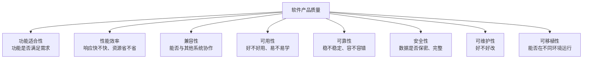

**理解要点**：

- **功能适合性**：系统做对了该做的事（功能正确、完整）
- **性能效率**：系统做得快、省资源（响应时间、吞吐量）
- **可靠性**：系统不轻易出故障（可用性、容错性）
- **可维护性**：系统好改（模块化、可分析、可修改）

**一个实用问题**：你的项目在 8 个维度上，哪些是强项、哪些是短板？质量属性之间常常冲突（如性能 vs 可维护性），需要明确优先级（详见 038-software-architecture《质量属性》）。

## 5. 软件工程原则

### 5.1 六大核心原则

| 原则 | 含义 | 反例 |
| :--- | :--- | :--- |
| DRY | Don't Repeat Yourself，消除重复 | 同一逻辑复制粘贴 5 份 |
| KISS | Keep It Simple，保持简单 | 为了"炫技"引入复杂架构 |
| YAGNI | You Aren't Gonna Need It，不做过度设计 | 为不存在的需求设计抽象层 |
| 关注点分离 | 每个模块只关注一个职责 | 一个类什么功能都做 |
| 信息隐藏 | 模块内部实现对外不可见 | 直接暴露内部数据结构 |
| 最少知识 | 最小化模块间的依赖 | 一个对象到处引用其他对象 |

**用一句话记住**：**简单、清晰、可维护**——DRY 减少重复、KISS 保持简单、YAGNI 不做多余、关注点分离让职责清晰。

### 5.2 工程化实践

原则要落地，需要配套的工程实践：

| 实践 | 说明 |
| :--- | :--- |
| 版本控制 | Git 管理代码变更，可追溯可回滚 |
| 持续集成 | 自动化构建和测试，让"红了马上知道" |
| 代码审查 | 同行评审保证质量（见 039-engineering-practices《代码审查清单》） |
| 自动化测试 | 测试金字塔覆盖（单元/集成/E2E） |
| 文档驱动 | 设计文档与代码同步维护 |

## 6. 软件工程 vs 编程

初学者常混淆"编程"和"软件工程"。两者有本质区别：

| 维度 | 编程 | 软件工程 |
| :--- | :--- | :--- |
| 关注点 | 让代码跑起来 | 让系统长期健康 |
| 时间尺度 | 一次开发 | 整个生命周期 |
| 团队 | 个人 | 多人协作 |
| 度量 | 功能是否实现 | 质量、成本、进度 |
| 类比 | 一个人做一顿饭 | 经营一家餐厅 |

**编程能力是基础，软件工程是进阶**。一个人能写代码，不等于能交付一个"长期健康运行的系统"——后者需要工程思维。

## 7. 常见误区

**误区一：软件工程 = 写文档。** → 文档只是手段，工程的核心是"用流程、规范、度量控制风险"。

**误区二：瀑布已经过时了。** → 瀑布没有过时，它适合需求明确的项目；敏捷适合需求多变的项目。选错模型才过时。

**误区三：软件工程是"大公司"才需要的。** → 越是小团队越容易陷入"代码越写越乱"的困境。软件工程的最小实践（版本控制、测试、代码审查）任何团队都需要。

**误区四：质量 = 功能多。** → 功能多≠质量好。一个功能少但稳定、易维护、安全的系统，比功能多但频繁崩溃的系统质量更高。


<!-- ============ 文档分隔线：037-software-engineering/002-AgileDevelopment.md ============ -->


## 1. 从"做菜 vs 外卖"说起

### 1.1 两种做事的风格

想象你要给朋友做一顿饭：

**方式 A（传统/瀑布式）**：先花一周研究菜谱、列食材清单、规划流程，然后一次性把所有菜做出来端上桌。如果朋友中途说"不想吃辣了"——之前的规划全废。

**方式 B（敏捷式）**：先快速做一道简单的菜让朋友尝尝，朋友说"有点咸"→ 你调整 → 再做一道 → 再反馈 → 逐步调整，直到朋友满意。

**敏捷开发（Agile）就是方式 B**：不追求"一次性交付完美产品"，而是**短周期迭代、快速交付、持续响应变化**——先做一个最小可用版本，收集反馈，再逐步完善。

### 1.2 敏捷的诞生

2001 年，17 位软件工程专家聚在一起，发表了著名的**敏捷宣言（Agile Manifesto）**，针对当时"文档驱动、流程繁重"的瀑布式开发，提出了一种更轻量、更贴近现实的方法论。

## 2. 敏捷宣言与原则

### 2.1 四大价值观

| 价值 | 优先于 |
| :--- | :--- |
| 个体和互动 | 流程和工具 |
| 可工作的软件 | 详尽的文档 |
| 客户合作 | 合同谈判 |
| 响应变化 | 遵循计划 |

**注意**：敏捷宣言不是说"不要文档、不要计划"，而是说"当两者冲突时，**更看重左边**"。文档仍然要写，但"能工作的软件"比"详尽的文档"更有价值。

### 2.2 十二原则（核心摘要）

1. 最高优先级是**尽早持续交付**有价值的软件
2. **欢迎需求变化**，即使开发后期（变化是机会不是麻烦）
3. 频繁交付可工作的软件（周期越短越好）
4. 业务人员与开发者**每日协作**
5. 以积极的人为核心，提供所需环境和信任
6. **面对面沟通**是最有效的信息传递方式
7. 可工作的软件是**进度的首要度量**
8. 可持续的开发节奏（不要透支团队）
9. 持续关注**技术卓越和良好设计**
10. 简洁——最大化未完成工作量的艺术（少做不必要的事）
11. 最好的架构、需求和设计出自**自组织团队**
12. 团队定期**反思和调整**（持续改进）

## 3. Scrum 框架：最流行的敏捷实践

Scrum 是敏捷的**具体实现**，它定义了清晰的角色、事件和工件。可以这样理解：敏捷是"理念"，Scrum 是"执行 Scrum 的具体规则"。

### 3.1 三个角色

| 角色 | 职责 | 关注点 |
| :--- | :--- | :--- |
| Product Owner（产品负责人） | 管理 Product Backlog，定义需求优先级 | 做正确的事（what） |
| Scrum Master（敏捷教练） | 移除障碍，确保 Scrum 实践 | 正确地做事（how） |
| Development Team（开发团队） | 自组织完成 Sprint 目标 | 高效地做事（do） |

**要点**：Scrum Master 不是"项目经理"，他不命令团队做什么，而是"清除障碍"——让团队能专注工作。开发团队"自组织"：自己决定如何完成 Sprint 目标。

### 3.2 五个事件

以两周的 Sprint（冲刺）为例：

| 事件 | 时长（2周 Sprint） | 参与者 | 目的 |
| :--- | :--- | :--- | :--- |
| Sprint | 2周 | 全员 | 交付增量 |
| Sprint Planning | 4小时 | 全员 | 规划 Sprint 目标 |
| Daily Standup | 15分钟 | 开发团队 | 同步进度和障碍 |
| Sprint Review | 2小时 | 全员+利益相关者 | 展示成果 |
| Sprint Retrospective | 1.5小时 | 全员 | 改进流程 |

**关键事件解读**：

- **Sprint Planning**：Sprint 开始前，团队从 Backlog 挑选本次要做的需求，并确定 Sprint 目标
- **Daily Standup（每日站会）**：每天 15 分钟，只回答三个问题——"昨天做了什么？今天做什么？有什么障碍？"（站着开，保证简短）
- **Sprint Review**：Sprint 结束时，向利益相关者演示"做出来了什么"
- **Sprint Retrospective（回顾）**：最重要的事件——团队反思"哪些做得好、哪些要改进"，并制定具体改进动作

### 3.3 三个工件

| 工件 | 说明 | 负责人 |
| :--- | :--- | :--- |
| Product Backlog | 所有需求的有序列表（按优先级） | Product Owner |
| Sprint Backlog | 当前 Sprint 的任务（从 Backlog 挑选） | Development Team |
| Increment | 可交付的产品增量（每个 Sprint 的产出） | Development Team |

**产品待办列表（Product Backlog）**是整个产品"要做的事"的清单，按优先级排序，Product Owner 负责维护。Sprint 开始时，团队从列表顶部挑选本次要做的条目。

### 3.4 Sprint 流程

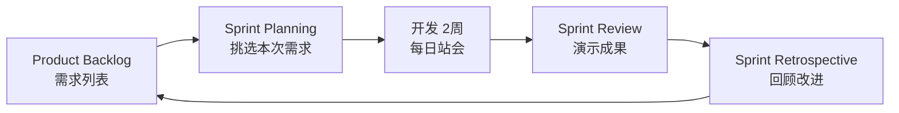

## 4. Kanban 方法：可视化流动

Kanban（看板）是另一种敏捷实践，它不强制固定周期，更强调**可视化与流动效率**。

### 4.1 六大核心原则

1. **可视化工作流**：看板展示所有工作项（Backlog → To Do → In Progress → Review → Done）
2. **限制 WIP（Work In Progress）**：限制每列在制品数量（防止同时做太多事）
3. **管理流动**：优化工作项从左到右的流动
4. **显式策略**：明确"完成"的定义（DoD）
5. **反馈环**：定期评审和改进
6. **协作改进**：团队共同优化流程

### 4.2 Kanban 看板示例

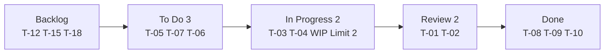

**WIP 限制的意义**：In Progress 列最多 2 个任务。当列满时，团队必须先"完成一个"才能"开始下一个"——这防止了"同时开工 10 件事、一件都没完成"的低效状态。

### 4.3 Scrum vs Kanban

| 维度 | Scrum | Kanban |
| :--- | :--- | :--- |
| 迭代周期 | 固定 Sprint | 无固定周期 |
| 变更 | Sprint 内不变 | 随时可变 |
| WIP 限制 | Sprint 容量 | 每列 WIP 限制 |
| 角色 | PO/SM/Team | 无规定角色 |
| 度量 | 速度（Velocity） | Lead Time / Cycle Time |
| 适用 | 产品开发 | 运维/支持 |

**怎么选**：做产品（有明确版本节奏）用 Scrum；做运维/支持（持续小批量任务）用 Kanban。两者也可以混用（Scrumban）。

## 5. Backlog 管理：需求的载体

### 5.1 用户故事

Backlog 里的需求通常写成**用户故事**：

```
作为 [角色]，我希望 [功能]，以便 [业务价值]
```

```text
作为 注册用户，
我希望 能够重置密码，
以便 我忘记密码时可以重新访问账户
```

**INVEST 原则**：好故事应该满足：

| 原则 | 含义 |
| :--- | :--- |
| Independent | 故事之间尽量独立 |
| Negotiable | 故事是可协商的 |
| Valuable | 对用户或业务有价值 |
| Estimable | 可以估算工作量 |
| Small | 足够小，一个 Sprint 内完成 |
| Testable | 可以验证是否完成 |

### 5.2 验收标准

故事只有配上**验收标准（Acceptance Criteria）**才是完整的：

```text
验收标准:
1. 用户点击"忘记密码"链接
2. 输入注册邮箱
3. 系统发送重置链接到邮箱
4. 链接30分钟内有效
5. 重置密码需满足复杂度要求
```

**没有验收标准的故事 = 没定义"什么叫做完"**，团队会陷入"做好了没有"的争论。

### 5.3 故事估算

| 方法 | 说明 |
| :--- | :--- |
| 故事点 | 相对复杂度估算（斐波那契数列：1,2,3,5,8,13） |
| T恤尺码 | S/M/L/XL 粗粒度估算 |
| 理想天数 | 假设无干扰的完成天数 |

**规划扑克**：团队成员同时出牌（亮出估算点数），差异大时讨论——让"估算差异"暴露认知偏差。

### 5.4 优先级排序

| 方法 | 说明 |
| :--- | :--- |
| MoSCoW | Must（必须有）/ Should（应该有）/ Could（可以有）/ Won't（不要） |
| WSJF | 加权最短作业优先（价值/时长） |
| 价值/成本比 | ROI 排序 |
| Kano 模型 | 基本需求/期望需求/兴奋需求 |

## 6. 敏捷度量：用数据说话

### 6.1 速度（Velocity）

$$\text{Velocity} = \sum_{i \in \text{Sprint}} \text{StoryPoints}_i$$

每个 Sprint 完成的故事点总和。**速度用于规划**：团队知道"平均每 Sprint 能完成多少点"，就能预测下个 Sprint 能接多少需求。

**注意**：速度不是考核工具！不同团队的速度不可比较（故事点本来就是相对的）。比"绝对速度"更重要的是"速度的稳定性"。

### 6.2 燃尽图（Burndown Chart）

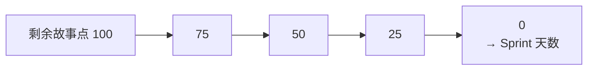

横轴是 Sprint 天数，纵轴是剩余故事点。理想线是从 100 直线降到 0；实际线如果偏离，说明进度有问题（偏离太快 = 任务过多；偏离太慢 = 可能没做实事）。

### 6.3 Lead Time vs Cycle Time

| 指标 | 定义 | 含义 |
| :--- | :--- | :--- |
| Lead Time | 需求提出到交付 | 客户感知的响应时间 |
| Cycle Time | 开始工作到完成 | 团队的执行效率 |

**理解**：Lead Time 包含"等待时间"（需求排队等开发），Cycle Time 只算"实际干活时间"。缩短 Lead Time 往往比缩短 Cycle Time 更关键（因为等待时间占比更大）。

## 7. 敏捷落地：常见失败模式

### 7.1 仪式化敏捷（Agile Theater）

**症状**：开了所有会、走了所有流程，但只是"看起来敏捷"——每日站会变成"向领导汇报"，回顾会开完没有改进动作。

**对策**：会议的目的是**沟通与改进**，不是"走流程"。每个会议都要有产出（站会产生障碍清单，回顾会产生改进动作）。

### 7.2 需求仍大爆炸

**症状**：说好"小步迭代"，但每个 Sprint 仍然塞进大量需求，团队加班赶工。

**对策**：遵守"Small"原则——一个 Sprint 只做"能完成"的事，宁可少做也要做透。

### 7.3 缺乏自组织

**症状**：团队习惯被命令，Scrum Master 变成"包工头"，成员不主动。

**对策**：自组织需要时间和信任。先让团队自己决定"如何完成目标"，逐步培养自主性。

### 7.4 回顾会流于形式

**症状**：每次回顾都说"没什么问题"，改进动作从不落实。

**对策**：回顾会必须产出"可执行的改进动作"（哪怕只有一个），并跟踪落实——"改进闭环"是敏捷持续进步的动力（详见 039-engineering-practices《事故复盘方法论》）。


<!-- ============ 文档分隔线：037-software-engineering/003-RequirementAnalysisMethod.md ============ -->


## 1. 从"点外卖却收到一本书"说起

### 1.1 一个需求失败的经典场景

想象你在外卖 App 上点了一份"黄焖鸡米饭"，结果骑手送来了一本书。你当然会愤怒。但更糟的是，如果这是一个软件项目——**你想要的和你理解的，从一开始就是两回事**。

现实中这样的例子比比皆是：

- 产品经理说"做个推荐功能"，开发做成了"按销量排序"——因为"推荐"没定义清楚
- 用户说"登录要简单"，开发做成"手机号+验证码"——但用户想要的是"微信一键登录"
- 需求文档写了"支持多语言"，开发做了"中英文切换"——但产品要的是"自动识别用户语言"

**这些问题的共同根源**：需求没有被"搞清楚、写明白、对齐验证"——这正是**需求工程（Requirement Engineering）**要解决的核心问题。

### 1.2 什么是需求工程

> **需求工程是系统地获取、分析、记录、验证需求的过程——确保"我们建造的是正确的系统"（做正确的事），而不仅仅是"正确地建造系统"（正确地做事）。**

需求工程做不好，后面的设计、编码、测试都是"在错误的地基上盖楼"——返工成本成倍放大。

## 2. 需求层次：从"为什么"到"怎么做"

### 2.1 三个层次

```
业务需求 → 用户需求 → 系统需求
(为什么)    (做什么)    (怎么做)
```

| 层次 | 来源 | 示例 |
| :--- | :--- | :--- |
| 业务需求 | 利益相关者 | 提升用户留存率 20% |
| 用户需求 | 最终用户 | 用户能快速找到所需商品 |
| 系统需求 | 开发团队 | 搜索响应时间 < 200ms |

**理解**：

- **业务需求**回答"为什么做"——业务目标（留存率、收入、效率）
- **用户需求**回答"用户要做什么"——用户视角的功能描述
- **系统需求**回答"系统要怎么做"——技术视角的可实现描述

**需求工程师的职责**：把"业务需求"翻译成"用户需求"，再和开发团队一起翻译成"系统需求"。每一层翻译都可能失真，所以每层都要验证。

### 2.2 功能需求 vs 非功能需求

| 类型 | 说明 | 示例 |
| :--- | :--- | :--- |
| 功能需求 | 系统应该做什么 | 用户可以创建订单 |
| 非功能需求 | 系统应该做到什么程度 | 订单创建响应时间 < 500ms |

**非功能需求（FURPS+ 分类）**：

| 类别 | 说明 | 示例 |
| :--- | :--- | :--- |
| Functionality | 功能性 | 功能完整性 |
| Usability | 可用性 | 学习曲线、操作步骤 |
| Reliability | 可靠性 | MTBF、容错能力 |
| Performance | 性能 | 响应时间、吞吐量 |
| Supportability | 可支持性 | 可维护性、可扩展性 |

**初学者最容易忽略非功能需求**。功能需求好定义（"能下单"），非功能需求（"下单要快""系统要稳定"）常常没人写——直到上线后才发现性能不达标、可用性不满足。

## 3. 需求获取：怎么把"想要"挖出来

### 3.1 六种获取技术

| 方法 | 适用场景 | 优点 | 缺点 |
| :--- | :--- | :--- | :--- |
| 访谈 | 深入了解需求 | 信息丰富 | 耗时 |
| 问卷调查 | 大范围收集 | 覆盖面广 | 深度不够 |
| 观察 | 了解实际工作流 | 真实场景 | 可能影响行为 |
| 原型 | 需求不明确 | 直观反馈 | 成本较高 |
| 文档分析 | 现有系统改造 | 基于事实 | 可能过时 |
| 焦点小组 | 收集多方意见 | 多角度 | 组织难度大 |

### 3.2 需求获取流程

```
1. 识别利益相关者（谁关心这个系统？）
2. 确定获取策略（用什么方法？）
3. 执行获取活动（去问、去观察、去试）
4. 整理和记录需求（写下来）
5. 验证需求完整性（够了吗？准吗？）
```

**关键技巧**：需求获取最怕"用户说的不是心里想的"。常用追问技巧：

- "为什么需要这个功能？"（挖业务价值，而不是直接实现）
- "如果不做这个功能，会发生什么？"（判断真实优先级）
- "这个功能谁会用它？什么时候用？"（明确场景）

## 4. 用户故事：敏捷世界的需求载体

### 4.1 标准格式

```
作为 [角色]，
我希望 [功能]，
以便 [业务价值]
```

**三个要素**：

- **角色**：谁在使用（用户、管理员、运营）
- **功能**：要做什么
- **价值**：为什么做（这是最容易漏掉、也最重要的）

```text
作为 注册用户，
我希望 能够收藏喜欢的文章，
以便 下次可以快速找到它们
```

### 4.2 INVEST 原则

好的用户故事应该满足：

| 原则 | 含义 |
| :--- | :--- |
| Independent | 故事之间尽量独立 |
| Negotiable | 故事是可协商的 |
| Valuable | 对用户或业务有价值 |
| Estimable | 可以估算工作量 |
| Small | 足够小，一个 Sprint 内完成 |
| Testable | 可以验证是否完成 |

### 4.3 用户故事拆分

大故事（史诗 Epic）需要拆成可执行的小故事：

| 拆分模式 | 说明 | 示例 |
| :--- | :--- | :--- |
| 按工作流步骤 | 拆分流程中的步骤 | 搜索 → 筛选 → 下单 |
| 按数据变体 | 拆分不同数据类型 | 国内支付 → 国际支付 |
| 按操作 | 拆分 CRUD 操作 | 创建订单 → 查看订单 |
| 按业务规则 | 拆分不同规则 | 普通用户 → VIP 用户 |
| 按界面 | 拆分不同界面 | 移动端 → 桌面端 |

## 5. 用例图：需求的图形化表达

### 5.1 用例图元素

用例图（Use Case Diagram）用图形描述"谁（参与者）能用系统做什么（用例）"：

| 元素 | 符号 | 说明 |
| :--- | :--- | :--- |
| 参与者 | 小人 | 与系统交互的外部实体 |
| 用例 | 椭圆 | 系统提供的功能 |
| 系统边界 | 矩形 | 系统范围 |
| 关联 | 实线 | 参与者与用例的关系 |
| 包含 | «include» | 必然执行的行为 |
| 扩展 | «extend» | 条件执行的行为 |
| 泛化 | 空心箭头 | 一般到特殊 |

### 5.2 用例描述模板

用例图只画"框架"，真正的内容在**用例描述**里：

```text
用例名称: 用户登录
参与者: 注册用户
前置条件: 用户已注册
主流程:
  1. 用户输入用户名和密码
  2. 系统验证凭据
  3. 系统创建会话
  4. 系统跳转到首页
备选流程:
  2a. 凭据无效: 提示错误，允许重试
  2b. 账户锁定: 提示联系管理员
后置条件: 用户已登录
```

**用例描述的威力**：它强迫你写清楚"主流程 + 备选流程"——备选流程（异常路径）往往是被遗忘需求的重灾区。

## 6. 需求管理：需求是会变的

### 6.1 需求变更控制

需求不是"一次定死"的，但变更必须受控：

```
变更请求 → 影响分析 → 变更评审 → 批准/拒绝 → 实施 → 验证
```

| 步骤 | 关键活动 |
| :--- | :--- |
| 变更请求 | 记录变更内容和原因 |
| 影响分析 | 评估对进度、成本、质量的影响 |
| 变更评审 | CCB（变更控制委员会）决策 |
| 实施 | 修改需求和设计 |
| 验证 | 确认变更正确实施 |

**关键认知**：需求变更不可怕，可怕的是**"无记录、无评估"的随意变更**。受控的变更是"管理"，不受控的变更是"灾难"。

### 6.2 需求追踪矩阵

需求追踪矩阵（RTM）把需求与设计、代码、测试关联起来，保证"每个需求都有落实、都有验证"：

| 需求ID | 需求描述 | 设计文档 | 代码模块 | 测试用例 | 状态 |
| :--- | :--- | :--- | :--- | :--- | :--- |
| REQ-01 | 用户登录 | HLD-3.1 | auth.py | TC-01~03 | 完成 |
| REQ-02 | 密码重置 | HLD-3.2 | reset.py | TC-04~06 | 开发中 |

**RTM 的价值**：上线前检查矩阵——有没有"设计里没有、代码里没有、测试里没有"的需求？有没有"代码里实现了、但需求里没有"的功能（过度开发）？

### 6.3 需求验证

| 方法 | 说明 |
| :--- | :--- |
| 需求评审 | 同行评审需求文档 |
| 原型验证 | 用原型确认需求理解 |
| 验收测试 | 用户确认需求满足 |
| 需求基线 | 确认的需求版本冻结 |

## 7. 常见误区

**误区一：需求 = 用户说的原话。** → 用户说的往往是"解决方案"，不是"真实需求"。要追问"为什么"，找到背后的业务价值。

**误区二：需求文档越详细越好。** → 文档要"准确"和"可验证"，不是"厚"。一本没人读的 200 页需求文档，不如 10 页清晰的对齐文档。

**误区三：需求分析是"分析阶段"的事，做完就完了。** → 需求贯穿整个生命周期（敏捷里尤其如此）。需求会变，管理好变化比"一次定死"更重要。

**误区四：只定义功能需求，忽略非功能需求。** → 性能、安全、可用性这些"看不见"的需求，恰恰是上线后最容易出问题的。


<!-- ============ 文档分隔线：037-software-engineering/004-UMLGraphDetailed.md ============ -->


## 1. 从"建筑施工图"说起

### 1.1 为什么需要"图"

想象盖一栋大楼。施工队不会靠"口头描述"干活，而是看**建筑施工图**——每根梁在哪、每堵墙多厚、管线怎么走，都画得清清楚楚。图纸让"想法"变成"可执行的规范"。

**UML（Unified Modeling Language，统一建模语言）就是软件的"建筑施工图"**：用一套标准化的图形，描述软件的**结构**（类、对象、组件）和**行为**（流程、状态、交互），让团队对"系统长什么样、怎么运作"达成一致认知。

### 1.2 UML 的两种图

UML 定义了 14 种图，分为两大类：

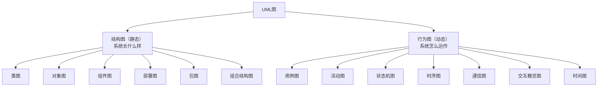

**核心认知**：不需要掌握全部 14 种。日常开发最常用的只有 **5 种**：类图（结构）、时序图（交互）、活动图（流程）、状态机图（状态）、用例图（需求）。本篇重点讲这 5 种。

## 2. 类图：系统的"骨架"

类图是**最常用、最重要**的 UML 图，描述系统的类、类的属性和方法、以及类之间的关系。它是面向对象设计的"主图"。

### 2.1 类的表示

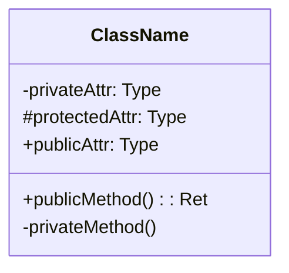

**符号含义**：

| 符号 | 可见性 |
| :--- | :--- |
| `+` | public（公开） |
| `-` | private（私有） |
| `#` | protected（受保护） |

### 2.2 类间关系（重点）

类之间的关系是类图的核心。六种关系按"强度"排列：

| 关系 | 符号 | 含义 | 示例 |
| :--- | :--- | :--- | :--- |
| 依赖 | - - → | A 使用 B（临时使用） | 方法参数 |
| 关联 | ——→ | A 知道 B（长期引用） | 成员变量 |
| 聚合 | ◇——→ | A 包含 B（弱拥有，B 可独立存在） | 部门-员工 |
| 组合 | ◆——→ | A 拥有 B（强拥有，B 随 A 消亡） | 人-心脏 |
| 泛化 | ——▷ | A 继承 B | 子类-父类 |
| 实现 | - -▷ | A 实现 B 接口 | 实现类-接口 |

**关系强度**：依赖 < 关联 < 聚合 < 组合 < 泛化/实现

**最容易混淆的是聚合 vs 组合**：

- **聚合**（弱拥有）：部门没了，员工还在（员工属于公司，但可以跳槽）——用空心菱形
- **组合**（强拥有）：人没了，心脏也没了（部件不能独立存在）——用实心菱形

**判断技巧**：问"如果整体消失了，部分还能存在吗？"能 → 聚合；不能 → 组合。

### 2.3 多重性

| 标记 | 含义 |
| :--- | :--- |
| 1 | 恰好一个 |
| 0..1 | 零或一个 |
| * | 任意多个 |
| 1..* | 一个或多个 |
| 0..* | 零或多个 |

**示例**：订单类图中，`Order 1 ── * OrderItem` 表示"一个订单包含多个订单项"。

## 3. 时序图：系统的"对话记录"

时序图描述**对象之间按时间顺序的消息交互**——就像一段"对话记录"，看出"谁先调谁、谁等谁、结果如何"。

### 3.1 基本元素

| 元素 | 说明 |
| :--- | :--- |
| 参与者 | 交互的对象 |
| 生命线 | 虚线，表示对象存在时间 |
| 激活条 | 矩形条，表示对象正在执行 |
| 同步消息 | 实心箭头，等待返回 |
| 异步消息 | 开放箭头，不等待 |
| 返回消息 | 虚线箭头 |
| 自调用 | 消息指向自身 |

### 3.2 一个登录时序图示例

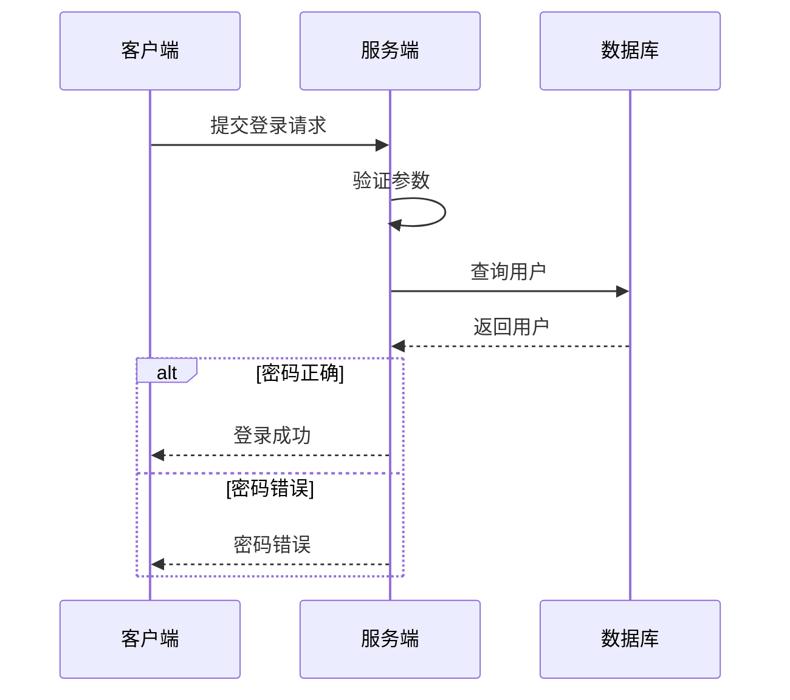

### 3.3 组合片段

时序图可以表达复杂逻辑：

| 操作符 | 含义 |
| :--- | :--- |
| alt | 条件分支（if-else） |
| opt | 可选执行（if） |
| loop | 循环 |
| par | 并行执行 |
| critical | 临界区 |
| break | 中断 |

## 4. 活动图：系统的"流程图"

活动图描述**业务流程或算法逻辑**——类似流程图，但更规范。

### 4.1 基本元素

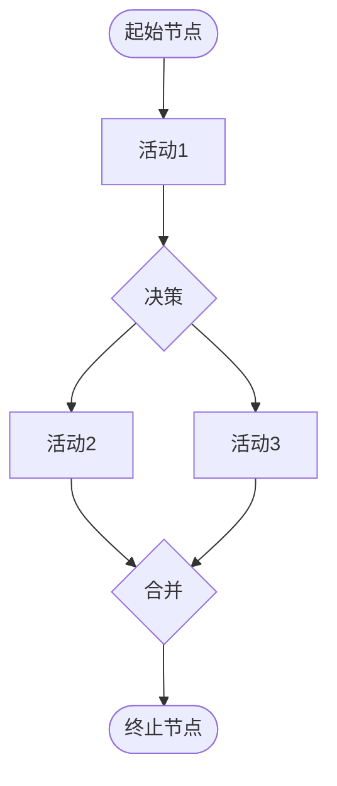

| 元素 | 说明 |
| :--- | :--- |
| 起始节点 | 实心圆 |
| 终止节点 | 实心圆加外圈 |
| 活动节点 | 圆角矩形 |
| 决策节点 | 菱形 |
| 合并节点 | 菱形 |
| 分叉/汇合 | 粗横线（并行） |
| 泳道 | 分区表示职责 |

### 4.2 泳道活动图

泳道（Swimlane）把活动按"执行者"分区，展示"谁负责哪一步"：

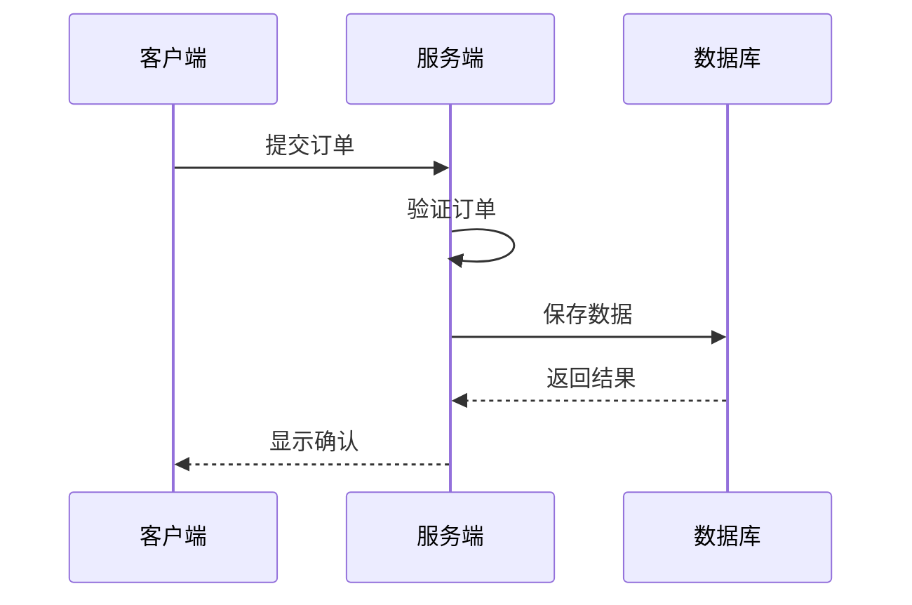

**泳道的价值**：一眼看出"职责分布"——哪里是客户端的活、哪里是服务端的活、哪里是数据库的活。这对接口设计（谁该提供什么）很有帮助。

## 5. 状态机图：系统的"状态变化"

状态机图描述**对象的状态变化**——特别适合订单、审批、流程类系统。

### 5.1 基本元素

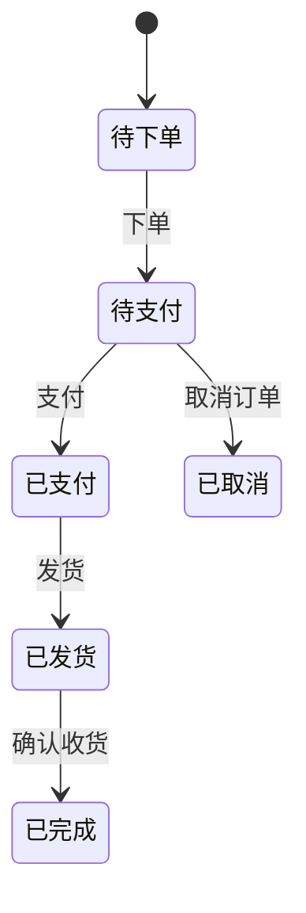

### 5.2 状态转换表

状态机图也可以用表格表达（状态转换表），两者等价：

| 当前状态 | 事件 | 动作 | 目标状态 |
| :--- | :--- | :--- | :--- |
| 待下单 | 下单 | 创建订单 | 待支付 |
| 待支付 | 支付 | 处理支付 | 已支付 |
| 待支付 | 取消 | 释放库存 | 已取消 |
| 已支付 | 发货 | 更新物流 | 已发货 |
| 已发货 | 确认收货 | 完成订单 | 已完成 |

**状态机图的实战价值**：开发前画好状态图，能提前发现"非法状态转换"（如"已取消 → 已发货"就不应该存在），避免上线后出 bug。

## 6. 其他常用 UML 图

### 6.1 组件图

展示系统的**组件及其依赖关系**（架构层面）：

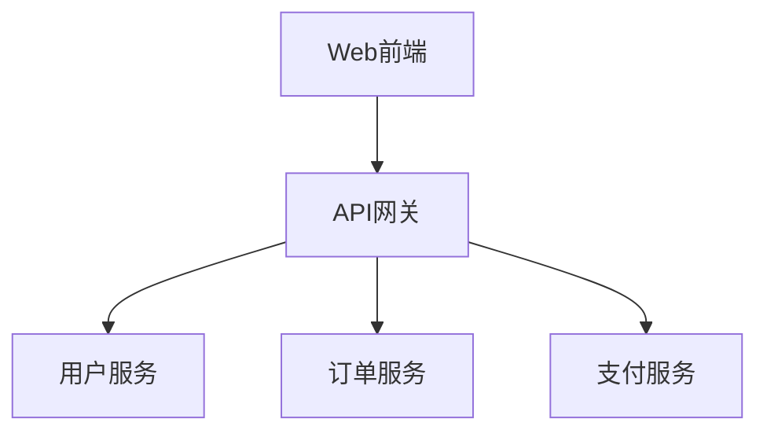

### 6.2 部署图

展示**硬件节点和软件部署**（运维层面）：

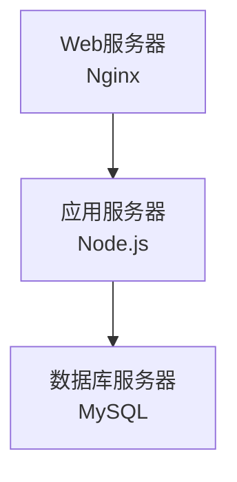

### 6.3 用例图

展示"谁（参与者）能用系统做什么（用例）"（需求层面，见《需求分析方法》）：

## 7. 实践建议：怎么用好 UML

**UML 不是"画得越全越好"，而是"在合适的时候画合适的图"**：

| 场景 | 推荐图 |
| :--- | :--- |
| 需求讨论 | 用例图、活动图 |
| 设计阶段 | 类图、时序图 |
| 状态复杂系统 | 状态机图 |
| 架构评审 | 组件图、部署图 |

**工具推荐**：

- **Mermaid**（本文档所用）：Markdown 内嵌，版本可控（文档即代码）
- PlantUML：文本描述 UML，自动生成图
- draw.io / StarUML：可视化拖拽

**核心原则**：**图的价值在于沟通，不在于美观**。一张"画得很丑但大家看懂了的图"，远胜"画得很漂亮但没人看得懂的图"。

## 8. 常见误区

**误区一：要把 14 种 UML 图全部掌握。** → 日常开发 5 种够用（类图、时序图、活动图、状态机图、用例图），其余用到再学。

**误区二：UML 图是"画完就扔"的文档。** → 图是"活文档"，要随代码一起维护（文档即代码）。过期的图比没有更糟。

**误区三：聚合和组合分不清没关系。** → 这是类图最常见的考点和实战点。记住"整体消失，部分还能存在吗"——能是聚合，不能是组合。

**误区四：UML 是"设计阶段"的专属。** → UML 可以用于任意阶段的沟通——需求讨论（用例图）、代码走读（类图）、故障排查（时序图）。


<!-- ============ 文档分隔线：037-software-engineering/005-DesignPatternDetailed.md ============ -->


## 1. 从"盖房子的预制件"说起

### 1.1 设计模式是什么

想象盖房子。没有预制件时，每一堵墙、每一扇窗都要现场设计、现场浇筑；有了标准化的预制件（门窗、楼梯、梁柱的标准做法），工程师不用每次"发明"怎么搭，直接套用成熟方案即可。

**设计模式（Design Pattern）就是软件设计的"预制件"**：它是**经过验证的、可复用的解决方案**，针对"反复出现的软件设计问题"。

**权威定义**（GoF《设计模式》）：设计模式是对**特定场景下反复出现的问题**的**可复用解决方案**的描述。

### 1.2 三个关键词

| 关键词 | 含义 |
| :--- | :--- |
| 特定场景 | 模式不是万能的，只解决特定问题 |
| 反复出现 | 是"常见问题"的总结，不是一次性的灵感 |
| 可复用 | 可以在不同项目中重复使用 |

**重要认知**：设计模式不是"代码模板"（不是抄一段代码），而是"**解决问题的思路**"——它描述的是"类之间如何组织、对象之间如何协作"，具体实现可以千变万化。

## 2. 三大分类与设计原则

### 2.1 三大分类

GoF 把 23 种设计模式分为三类：

| 类型 | 数量 | 关注点 | 类比 |
| :--- | :--- | :--- | :--- |
| 创建型 | 5 | 对象创建机制 | 怎么"造"东西 |
| 结构型 | 7 | 对象组合方式 | 怎么"组装"东西 |
| 行为型 | 11 | 对象间通信 | 怎么"协作" |

### 2.2 六大设计原则（理解模式的前提）

设计模式是这些原则的具体实现。**先理解原则，再看模式就"顺理成章"**：

| 原则 | 说明 | 通俗理解 |
| :--- | :--- | :--- |
| 单一职责（SRP） | 一个类只有一个变化原因 | 一个人只做一件事 |
| 开闭原则（OCP） | 对扩展开放，对修改关闭 | 加新功能不改旧代码 |
| 里氏替换（LSP） | 子类可以替换父类 | 能替换而不出问题 |
| 接口隔离（ISP） | 接口应该小而专 | 接口不要"大而全" |
| 依赖倒置（DIP） | 依赖抽象而非具体 | 面向接口编程 |
| 迪米特法则 | 最少知识原则 | 不要和陌生人说话 |

## 3. 创建型模式：怎么"造"对象

### 3.1 单例模式（Singleton）

**问题**：某些对象（配置、连接池、日志）全局只需要一个实例。

**解决**：确保一个类只有一个实例，并提供一个全局访问点。

```java
// 双重检查锁
public class Singleton {
    private static volatile Singleton instance;
    private Singleton() {}
    public static Singleton getInstance() {
        if (instance == null) {
            synchronized (Singleton.class) {
                if (instance == null) {
                    instance = new Singleton();
                }
            }
        }
        return instance;
    }
}
```

**要点**：构造器私有（外部不能 new）、getInstance 提供全局访问、双重检查锁保证并发安全。

**注意**：单例有争议（全局状态难测试）。现代框架（Spring）默认单例但由容器管理，比手写单例更优雅。

### 3.2 工厂方法模式（Factory Method）

**问题**：创建对象时，具体类型可能变化——不想在代码里写死 `new ConcreteProduct()`。

**解决**：定义创建对象的接口，让子类决定实例化哪个类。

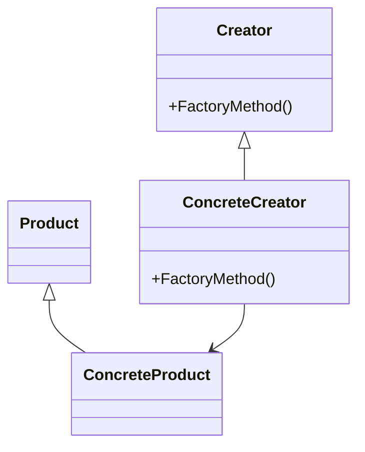

**场景**：日志系统要支持"文件日志/数据库日志/控制台日志"——用工厂方法，客户端只依赖 `Logger` 接口，新增日志类型不改客户端。

### 3.3 抽象工厂模式（Abstract Factory）

**问题**：需要创建"一组相关对象"，且这一组对象要保持风格一致。

**解决**：提供一个创建"一组对象"的接口。

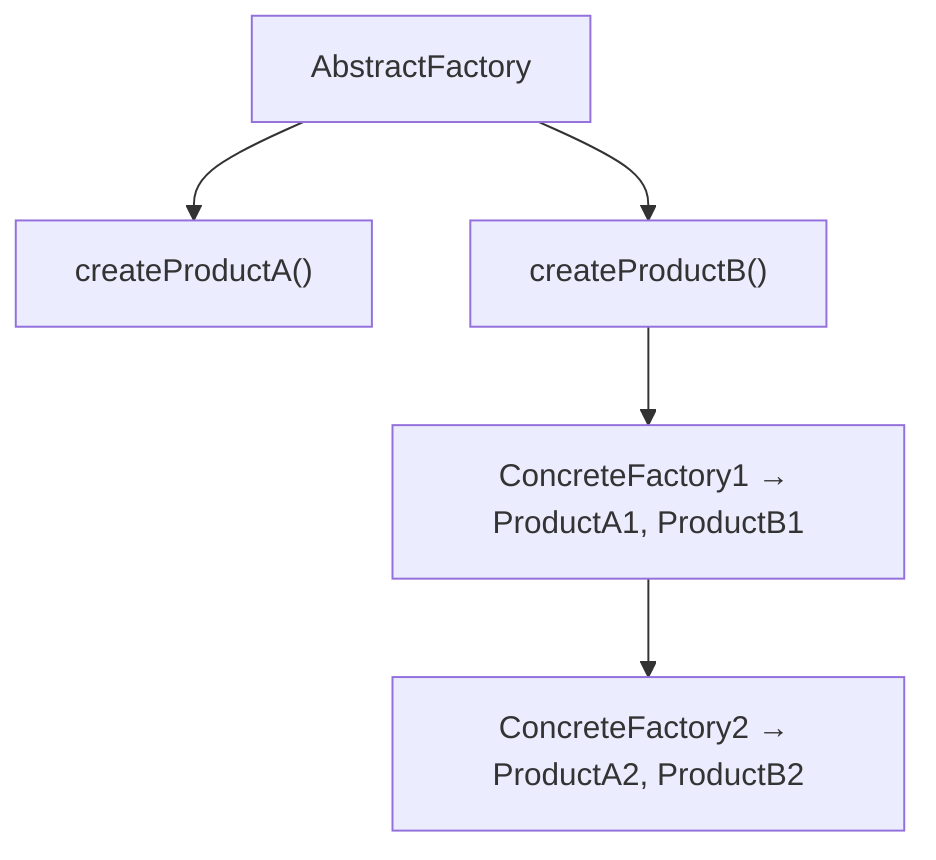

**场景**：UI 主题系统——"暗色主题"工厂创建暗色按钮+暗色输入框，"亮色主题"工厂创建亮色组件。保证"同一主题的组件风格一致"。

### 3.4 建造者模式（Builder）

**问题**：创建"有大量可选参数"的复杂对象时，构造函数参数太多、可读性差。

**解决**：分步骤构建对象。

```java
User user = User.builder()
    .name("张三")
    .age(25)
    .email("zhangsan@example.com")
    .build();
```

**场景**：配置对象、DTO 等"可选字段很多"的对象。Lombok 的 `@Builder` 就是此模式的实现。

### 3.5 原型模式（Prototype）

**问题**：创建"与已有对象相同"的对象时，直接 new 可能很贵（大对象、深拷贝）。

**解决**：通过克隆已有对象来创建新对象。

```java
public class Prototype implements Cloneable {
    public Prototype clone() {
        return (Prototype) super.clone();
    }
}
```

**场景**：游戏中的大量 NPC、文档模板复制。注意深拷贝与浅拷贝的区别。

## 4. 结构型模式：怎么"组装"对象

### 4.1 适配器模式（Adapter）

**问题**：两个类的接口不兼容（"插头不匹配"）。

**解决**：加一个适配器，把"不匹配的接口"转换为"客户期望的接口"。

```
Client → [Target接口] ← [Adapter] → [Adaptee]
```

**场景**：对接第三方 SDK、旧系统接口——用一个 Adapter 翻译接口，不改业务代码（这就是 DDD 里的防腐层思想，见 038-software-architecture《领域驱动设计》）。

### 4.2 装饰器模式（Decorator）

**问题**：想动态地给对象添加功能，而不是改类本身。

**解决**：用"包装"的方式一层层叠加功能。

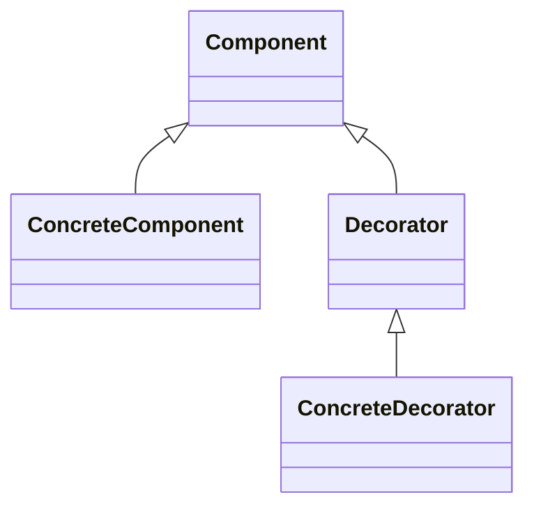

```java
InputStream in = new FileInputStream("file.txt");
in = new BufferedInputStream(in);    // 装饰：缓冲
in = new GZIPInputStream(in);         // 装饰：解压
```

**场景**：Java IO 流（缓冲、压缩、加密层层包装）、日志（加时间戳、加级别过滤）。**装饰器是"叠加功能"最优雅的方式**——比继承子类组合更灵活。

### 4.3 代理模式（Proxy）

**问题**：想控制对对象的访问（延迟加载、权限控制、远程访问）。

**解决**：用一个代理对象控制对真实对象的访问。

| 代理类型 | 说明 |
| :--- | :--- |
| 虚拟代理 | 延迟创建开销大的对象 |
| 远程代理 | 为远程对象提供本地代表 |
| 保护代理 | 控制访问权限 |
| 智能引用 | 添加额外操作（引用计数） |

**场景**：图片懒加载（虚拟代理）、RPC 客户端（远程代理）、Spring AOP（动态代理）。

### 4.4 其他结构型模式

| 模式 | 意图 |
| :--- | :--- |
| 外观（Facade） | 为子系统提供统一接口（"门面"） |
| 桥接（Bridge） | 分离抽象与实现 |
| 组合（Composite） | 树形结构统一处理（文件系统） |
| 享元（Flyweight） | 共享对象减少内存（字符串池） |

## 5. 行为型模式：对象怎么"协作"

### 5.1 观察者模式（Observer）

**问题**：一个对象变化了，多个对象要响应（一对多依赖）。

**解决**：定义一对多的依赖，主题变化时自动通知所有观察者。

```mermaid
flowchart TD
    S[Subject<br/>attach(observer)<br/>detach(observer)<br/>notify()]
    S -->|Observer.update()| O1[ConcreteObserver1]
    S -->|Observer.update()| O2[ConcreteObserver2]
```

**场景**：消息通知、事件监听、发布订阅系统（这就是事件驱动架构的雏形，见 038-software-architecture《事件驱动架构》）。

### 5.2 策略模式（Strategy）

**问题**：算法（排序、计费、认证方式）可以替换，且不想用一堆 if/else。

**解决**：定义算法族，封装后使它们可以互换。

```java
interface SortStrategy {
    void sort(int[] array);
}

class QuickSort implements SortStrategy { ... }
class MergeSort implements SortStrategy { ... }

class Sorter {
    private SortStrategy strategy;
    public void setStrategy(SortStrategy s) { this.strategy = s; }
    public void sort(int[] arr) { strategy.sort(arr); }
}
```

**场景**：运费计算（不同地区不同算法）、支付方式（微信/支付宝/银行卡）——**用策略替代 if/else 是消除重复 switch 的经典手法**（见《代码重构》）。

### 5.3 模板方法模式（Template Method）

**问题**：一个算法的"骨架"固定，但其中某些步骤实现不同。

**解决**：在父类定义算法骨架，子类实现具体步骤。

```java
abstract class DataProcessor {
    public final void process() {  // 模板方法
        readData();
        transformData();
        writeData();
    }
    protected abstract void readData();
    protected abstract void transformData();
    protected void writeData() { /* 默认实现 */ }
}
```

**场景**：数据处理流程（读→转换→写）、Spring 的 `JdbcTemplate`、`HttpServlet` 的 doGet/doPost。

### 5.4 其他行为型模式

| 模式 | 意图 |
| :--- | :--- |
| 命令（Command） | 将请求封装为对象（支持撤销/排队） |
| 迭代器（Iterator） | 顺序访问集合元素 |
| 中介者（Mediator） | 集中管理对象间交互（聊天室） |
| 备忘录（Memento） | 保存和恢复对象状态（存档） |
| 状态（State） | 允许对象在状态改变时改变行为 |
| 职责链（Chain of Responsibility） | 沿链传递请求（中间件） |
| 访问者（Visitor） | 在不改变类的前提下添加操作 |
| 解释器（Interpreter） | 定义语言的文法及解释器 |

## 6. 模式选择指南

**遇到问题时怎么选模式**？按"问题类型"查找：

| 问题 | 推荐模式 |
| :--- | :--- |
| 需要唯一实例 | 单例 |
| 创建对象逻辑复杂 | 工厂方法/抽象工厂 |
| 分步构建复杂对象 | 建造者 |
| 接口不兼容 | 适配器 |
| 动态添加功能 | 装饰器 |
| 一对多依赖 | 观察者 |
| 算法可替换 | 策略 |
| 算法骨架固定 | 模板方法 |
| 请求需要排队/撤销 | 命令 |
| 状态驱动的行为 | 状态 |

## 7. 常见误区

**误区一：设计模式 = 代码模板，背下来就能用。** → 模式是"解决问题的思路"，不是"可以抄的代码"。理解"解决什么问题、为什么这样设计"，比背代码重要得多。

**误区二：用得越多越好。** → 恰恰相反！**过度使用设计模式是"过度设计"**（违背 YAGNI）。能用简单代码解决的，就不要硬套模式。

**误区三：23 种模式都要掌握。** → 日常开发 80% 的场景只用 5-6 个模式（单例、工厂、策略、观察者、装饰器、模板方法）。先把常用的用熟，其他的用到再学。

**误区四：设计模式是"Java 的事"。** → 模式是语言无关的。JavaScript（回调即策略）、Python（装饰器语法糖）等语言同样适用——只是实现方式不同。

**误区五：设计模式能解决所有设计问题。** → 模式解决"局部设计问题"（类与对象组织）；系统级的架构问题（微服务、分层）用"架构模式"解决（见 038-software-architecture）。


<!-- ============ 文档分隔线：037-software-engineering/006-Refactoring.md ============ -->


## 1. 从"整理房间"说起

### 1.1 为什么代码需要"整理"

想象你的房间：一开始很整洁，但随着时间推移，东西越堆越多——衣服乱放、书散各处、杂物堆积。房间还能用（你还能找到东西），但找东西越来越慢，你越来越不想待在里面。

**代码也一样**。刚写完时结构清晰，但随着功能迭代、需求变更、多人协作，代码会逐渐"变乱"——重复的片段、过长的函数、混乱的命名。代码还能跑（功能正常），但**改起来越来越难、越来越容易出错**。

**重构（Refactoring）就是"整理房间"**：在不改变代码功能的前提下，调整代码内部结构，让它更清晰、更易维护。**就像整理房间不改变"你有哪些东西"，只改变"东西怎么摆放"。**

### 1.2 重构的定义

> **重构是在不改变代码外在行为的前提下，对代码内部结构进行调整，使其更易理解和修改。（Martin Fowler）**

**两个关键约束**：

1. **不改变外在行为**：功能不变，测试应该全部通过
2. **改善内部结构**：更易读、更易改、更易扩展

**重构 ≠ 重写**：重构是小步调整（一次改一处），重写是推倒重来。重构是"低成本持续改善"，重写是"高成本冒险"。

## 2. 重构的时机：什么时候该重构

### 2.1 四个经典时机

| 时机 | 说明 |
| :--- | :--- |
| 三次法则 | 第三次做类似的事时重构（第一次就做，第二次复制，第三次提取） |
| 添加功能时 | 先重构使添加更容易（"先打扫房间再放新家具"） |
| 修复 Bug 时 | 让代码更易理解，从而找到 bug 根源 |
| Code Review 时 | 团队共同改进（见 039-engineering-practices《代码审查清单》） |

### 2.2 重构与测试

**重构的安全保障是测试**。没有测试的重构 = 蒙眼开车：

```
重构循环:
1. 确保有测试覆盖（先建安全网）
2. 小步重构（一次只做一种手法）
3. 每步后运行测试
4. 测试通过则继续，失败则回退
```

**铁律**：重构前必须确认测试存在且通过。如果代码没有测试，先补测试，再重构。

## 3. 代码坏味道：怎么发现"该重构了"

"坏味道（Code Smell）"是代码需要重构的信号——它不一定是 bug，但预示着"将来会出问题"。以下是 13 种最常见坏味道（源自 Martin Fowler《重构》一书）：

| 坏味道 | 症状 | 重构手法 |
| :--- | :--- | :--- |
| 重复代码 | 相同/相似代码多处出现 | 提取方法、上移方法 |
| 过长方法 | 方法超过 20 行 | 提取方法、以查询替代临时变量 |
| 过大类 | 类承担过多职责 | 提取类、提取子类 |
| 过长参数列表 | 参数超过 4 个 | 引入参数对象、保持对象完整 |
| 发散式变化 | 一个类因多种原因变化 | 提取类 |
| 霰弹式修改 | 一个变化需改多个类 | 移动方法/字段、内联类 |
| 依恋情结 | 方法过度使用其他类数据 | 移动方法、提取方法 |
| 数据泥团 | 多个字段总是一起出现 | 提取类 |
| 基本类型偏执 | 用基本类型代替小对象 | 引入参数对象、以对象替代数据值 |
| switch 语句 | 重复的 switch/case | 以多态替代条件表达式 |
| 临时字段 | 某些字段只在特定情况下使用 | 提取类 |
| 消息链 | a.b().c().d() | 隐藏委托、提取方法 |
| 中间人 | 类只是委托给其他类 | 移除中间人、内联方法 |

**最常见的三种**（新手最先要掌握的）：

1. **重复代码**：同一个逻辑写了多遍 → 改一处漏一处
2. **过长方法**：一个方法几百行 → 读不懂、难测试
3. **过长参数列表**：参数一大串 → 容易传错、难扩展

## 4. 常用重构手法

### 4.1 提取方法（Extract Method）——最常用的手法

把一段代码提取成独立方法，让方法名表达意图：

```java
// 重构前：printOwing 做了三件事
void printOwing() {
    // 打印横幅
    System.out.println("***********");
    System.out.println("** Owing **");
    System.out.println("***********");
    // 计算并打印金额
    double outstanding = 0.0;
    for (Order o : orders) {
        outstanding += o.getAmount();
    }
    System.out.println("name: " + name);
    System.out.println("amount: " + outstanding);
}

// 重构后：每个方法只做一件事
void printOwing() {
    printBanner();
    double outstanding = getOutstanding();
    printDetails(outstanding);
}
```

**核心标准**：一个方法应该"只做一件事"。如果一段代码能用一个名字概括（"打印横幅"），它就应该是一个独立方法。

### 4.2 以查询替代临时变量（Replace Temp with Query）

把临时变量变成方法，避免重复计算、提高可读性：

```java
// 重构前
double getPrice() {
    double basePrice = quantity * itemPrice;
    if (basePrice > 1000) {
        return basePrice * 0.95;
    }
    return basePrice * 0.98;
}

// 重构后
double getPrice() {
    if (basePrice() > 1000) {
        return basePrice() * 0.95;
    }
    return basePrice() * 0.98;
}
double basePrice() { return quantity * itemPrice; }
```

### 4.3 以多态替代条件表达式（Replace Conditional with Polymorphism）

用"多态"替代复杂的 switch/case 或 if/else：

```java
// 重构前：switch 处理不同类型
double getSpeed() {
    switch (type) {
        case EUROPEAN: return getBaseSpeed();
        case AFRICAN: return getBaseSpeed() - getLoadFactor() * numberOfCoconuts;
        case NORWEGIAN_BLUE: return isNailed ? 0 : getBaseSpeed(voltage);
    }
}

// 重构后：每种鸟是一个子类，自己实现 getSpeed
abstract class Bird {
    abstract double getSpeed();
}
class EuropeanBird extends Bird {
    double getSpeed() { return getBaseSpeed(); }
}
class AfricanBird extends Bird {
    double getSpeed() { return getBaseSpeed() - getLoadFactor() * numberOfCoconuts; }
}
```

**为什么这样更好**：新增一种鸟时，只需新增一个子类，不需要修改现有代码（符合"开闭原则"）。

### 4.4 其他常用手法

| 手法 | 说明 |
| :--- | :--- |
| 重命名方法/变量 | 使名称表达意图（最便宜的重构） |
| 内联方法 | 方法体比方法名更清晰时 |
| 移动方法 | 将方法移到更合适的类 |
| 提取接口 | 从类中提取公共接口 |
| 以工厂方法替代构造函数 | 更灵活的对象创建 |
| 封装字段 | 将 public 字段改为 private + getter/setter |
| 分解条件表达式 | 提取条件判断为独立方法 |

## 5. 重构安全策略

### 5.1 小步重构

```
每次只做一种重构 → 运行测试 → 确认通过 → 下一步
```

**为什么必须小步**：一次只改一处，如果测试失败，能立刻知道是"哪一步"引入的问题。大步重构（一次改 10 处）失败时，无法定位错误来源。

### 5.2 重构检查清单

| 检查项 | 说明 |
| :--- | :--- |
| 测试覆盖 | 重构前确保有测试 |
| 行为不变 | 重构不改变外部行为 |
| 版本控制 | 每步重构单独提交 |
| 持续集成 | 每步后 CI 通过 |
| 代码审查 | 重构后进行 Review |

### 5.3 借助工具

现代 IDE（VS Code、IntelliJ）内置了大量重构工具：

- **自动重命名**：改一个变量名，所有引用同步更新
- **提取方法**：选中代码 → 自动提取为方法
- **提取变量**：把魔法数字/表达式提取为命名常量

**用工具的重构，比手改安全得多**——工具保证"所有引用都更新"，手改容易漏。

## 6. 常见误区

**误区一：重构 = 重写。** → 重构是小步调整、行为不变；重写是推倒重来。重构风险低、可持续；重写风险高、要谨慎。

**误区二：没有测试也能重构。** → 重构没有测试保护就像"蒙眼开车"。先补测试，再重构。

**误区三：重构是"代码不干净"的人才需要的。** → 任何代码都会随着迭代"变臭"。重构是日常活动（如同扫地），不是"惩罚"。

**误区四：重构会浪费时间、拖慢进度。** → 恰恰相反：代码越乱，后面改功能越慢。**重构是"投资"，短期的"慢"换长期的"快"。** 马丁·福勒的名言：如果领导说"没时间重构"，那是在说"没时间把代码保持干净"。

**误区五：重构一定要用设计模式。** → 重构的核心是"让代码清晰"，不是"套模式"。为重构而引入设计模式（过度设计）违背了 YAGNI 原则。


<!-- ============ 文档分隔线：037-software-engineering/007-SoftwareTestMethod.md ============ -->


## 1. 从"质检"说起：为什么需要测试

### 1.1 一个工厂的类比

想象一家工厂生产手机。没有质检流程会怎样？

- 零件组装后直接发货 → 有缺陷的手机到了用户手里 → 退货、投诉、品牌受损
- 更糟的是，质检人员**完全靠手感**（"这个看起来不错"）→ 今天标准松、明天标准严 → 质量不可控

**软件测试就是软件的"质检体系"**：用系统化的方法验证"软件是否符合预期"，在缺陷到达用户之前发现它。

### 1.2 测试的核心价值

| 价值 | 说明 |
| :--- | :--- |
| 发现缺陷 | 在用户遇到问题之前发现问题 |
| 保障质量 | 确保功能正确、稳定、安全 |
| 支持重构 | 有测试保护，改代码才敢动手（见《代码重构》） |
| 建立信心 | 发布前知道"东西是好的" |

**关键认知**：测试的目的不是"证明没有 bug"（这不可能），而是"在可接受的成本内，把缺陷风险降到可接受的水平"。

## 2. 测试金字塔：测试的"配比艺术"

### 2.1 金字塔模型

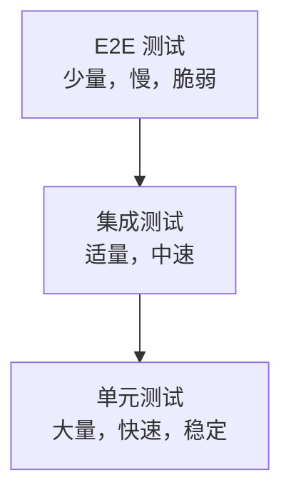

| 层级 | 数量 | 速度 | 范围 | 目的 |
| :--- | :--- | :--- | :--- | :--- |
| 单元测试 | 70% | 毫秒 | 单个函数/类 | 验证逻辑正确性 |
| 集成测试 | 20% | 秒 | 模块交互 | 验证组件协作 |
| E2E 测试 | 10% | 分钟 | 完整流程 | 验证用户场景 |

### 2.2 为什么是"金字塔"形状

**越往上的测试越贵、越慢、越脆弱**：

- **单元测试**：只测一个函数，毫秒级，稳定（一个函数变了其他测试不受影响）
- **E2E 测试**：启动整个系统、走完整流程，分钟级，脆弱（任何一环变化都可能挂）

**正确策略**：大部分测试放在底层（单元测试），只有少量关键场景用 E2E 测试。**如果你 70% 的测试是 E2E（倒金字塔），每次改动都会"挂一片"——测试变成负担而不是保护。**

## 3. 测试类型

### 3.1 按范围分类

| 类型 | 说明 | 示例 |
| :--- | :--- | :--- |
| 单元测试 | 测试最小可测试单元 | 函数、方法 |
| 集成测试 | 测试模块间交互 | API 调用、数据库操作 |
| 系统测试 | 测试完整系统 | 端到端流程 |
| 验收测试 | 用户确认需求满足 | UAT |

### 3.2 按目的分类

| 类型 | 说明 |
| :--- | :--- |
| 功能测试 | 验证功能是否正确 |
| 性能测试 | 验证响应时间和吞吐量 |
| 安全测试 | 验证安全漏洞 |
| 兼容性测试 | 验证不同环境下的表现 |
| 回归测试 | 验证修改未引入新缺陷 |

**回归测试特别重要**：每次修改代码后，跑一遍回归测试，确认"没把原来好的功能改坏"。

### 3.3 按方法分类

| 类型 | 说明 | 特点 |
| :--- | :--- | :--- |
| 白盒测试 | 基于代码结构 | 路径覆盖、条件覆盖 |
| 黑盒测试 | 基于功能规格 | 等价类、边界值 |
| 灰盒测试 | 部分了解内部结构 | 结合黑白盒 |

**白盒**：能看到代码，测"代码的每一条路径"；**黑盒**：只看功能规格，测"输入输出是否符合预期"。

## 4. TDD（测试驱动开发）：测试先行

### 4.1 红-绿-重构循环

TDD 的核心是**"先写测试，再写代码"**：

```
1.  红：写一个失败的测试（先定义"什么算对"）
2.  绿：写最少的代码使测试通过（只求通过）
3.  重构：优化代码，保持测试通过
4. 重复1-3（加新功能 → 加新测试）
```

### 4.2 TDD 示例

```python
# 第1步：红 - 写失败测试（add 还不存在）
def test_add():
    assert add(2, 3) == 5  # NameError: add未定义

# 第2步：绿 - 最少代码通过
def add(a, b):
    return a + b

# 第3步：重构 - 优化（此处已足够简洁）

# 继续添加测试（每次加一个）
def test_add_negative():
    assert add(-1, 1) == 0

def test_add_zero():
    assert add(0, 0) == 0
```

### 4.3 TDD 的价值与原则

| 原则 | 说明 |
| :--- | :--- |
| 测试先行 | 先写测试再写代码 |
| 小步前进 | 每次只添加一个测试 |
| 最少代码 | 只写让测试通过的最少代码 |
| 持续重构 | 每次通过后立即重构 |

**TDD 的核心价值**：写代码之前先想清楚"什么算对"（测试就是需求的可执行规格）；测试驱动设计（为了让代码可测，你会自然地设计出更清晰的接口）。

**注意**：TDD 不是万能的。它适合"逻辑明确、可独立测试"的代码；对 UI、复杂集成场景，TDD 收益有限。

## 5. BDD（行为驱动开发）：让业务参与

### 5.1 BDD 与 TDD 的区别

| 维度 | TDD | BDD |
| :--- | :--- | :--- |
| 关注点 | 代码正确性 | 业务行为 |
| 语言 | 编程语言 | 自然语言 |
| 参与者 | 开发者 | 开发者 + QA + 业务 |
| 规格形式 | 测试函数 | 场景描述 |

**BDD 解决 TDD 的痛点**：TDD 的测试是开发者写的，业务看不懂；BDD 用"自然语言描述业务场景"，让**业务人员也能参与定义"什么算对"**。

### 5.2 Gherkin 语法

```gherkin
Feature: 用户登录
  作为注册用户
  我希望登录系统
  以便访问我的账户

  Scenario: 成功登录
    Given 用户在登录页面
    And 用户输入正确的用户名和密码
    When 用户点击登录按钮
    Then 用户跳转到首页
    And 显示欢迎消息

  Scenario: 密码错误
    Given 用户在登录页面
    And 用户输入正确的用户名和错误的密码
    When 用户点击登录按钮
    Then 显示"密码错误"提示
    And 用户仍在登录页面
```

**关键词**：Given（前置条件）、When（动作）、Then（结果）——像写故事一样描述业务场景。

### 5.3 BDD 工具

| 语言 | 工具 |
| :--- | :--- |
| Java | Cucumber-JVM |
| Python | Behave |
| JavaScript | Cucumber.js |
| .NET | SpecFlow |

## 6. 测试覆盖率与 Mock

### 6.1 覆盖率类型

| 类型 | 说明 |
| :--- | :--- |
| 语句覆盖 | 每条语句至少执行一次 |
| 分支覆盖 | 每个分支至少执行一次 |
| 路径覆盖 | 每条可能路径至少执行一次 |
| 条件覆盖 | 每个条件的真假至少一次 |
| MC/DC | 每个条件独立影响结果 |

### 6.2 覆盖率目标

| 场景 | 建议覆盖率 |
| :--- | :--- |
| 核心业务逻辑 | 90%+ |
| 通用工具类 | 80%+ |
| UI 层 | 50%~70% |
| 遗留代码 | 逐步提升 |

**重要提醒**：覆盖率是"底线指标"，不是"目标指标"。**100% 覆盖率也可能漏掉关键 bug**（比如"测了所有代码路径，但没测对输入组合"）。覆盖率不够是问题，但"为了覆盖率而写没意义的测试"也是问题。

### 6.3 Mock 与 Stub

测试外部依赖（数据库、API）时，用测试替身：

| 类型 | 说明 | 特点 |
| :--- | :--- | :--- |
| Stub | 返回预设值 | 简单，不验证交互 |
| Mock | 验证交互行为 | 验证方法是否被调用 |
| Spy | 记录调用信息 | 部分模拟 |
| Fake | 简化实现 | 如内存数据库 |

```python
from unittest.mock import Mock, patch

# Mock
db = Mock()
db.save.return_value = True
assert db.save({"name": "test"}) == True
db.save.assert_called_once()

# Patch
with patch('module.external_api') as mock_api:
    mock_api.return_value = {"status": "ok"}
    result = my_function()
```

**关键提醒**：Mock 是"模拟外部依赖"，不是"把业务逻辑也 mock 掉"。**过度 Mock 的测试"测的是 Mock 而不是代码"**——测试全绿但代码是坏的（详见 036-software-testing 模块）。

## 7. 常见误区

**误区一：测试 = 手工点一遍功能。** → 手工测试重要但不可靠（人累了会漏、改了要重测）。**自动化测试**才是"可重复、可回归"的保障。

**误区二：测试覆盖率越高越好。** → 覆盖率是底线不是目标。为覆盖率写"没意义的测试"（只测不断言）是自欺欺人。

**误区三：测试是 QA 的事，开发不用管。** → 单元测试必须开发者写（只有开发者懂代码逻辑）；QA 侧重集成/系统/验收层面。

**误区四：TDD 是唯一正确的测试方式。** → TDD 适合逻辑明确的代码；对 UI、集成场景，先写实现再补测试也完全合理。工具是服务目标的，不是教条。

**误区五：测试太多会拖慢开发。** → 好的测试（快速、稳定、准确）**加速**开发——它们让重构敢做、回归放心。坏测试（慢、脆弱、误报）才拖慢开发。


<!-- ============ 文档分隔线：037-software-engineering/008-SoftwareMetrics.md ============ -->


## 1. 从"体重秤"说起

### 1.1 为什么需要度量

想象一个人想减肥。他能"感觉"自己胖了，但**没有体重秤就不知道具体数字、无法追踪变化、无法判断方法是否有效**。

**软件度量（Software Metrics）就是软件的"体重秤"**：用量化数据衡量软件的质量、规模、复杂度，让"软件好不好"从"感觉"变成"可测量的数字"。

### 1.2 度量的四个目的

| 目的 | 说明 |
| :--- | :--- |
| 评估质量 | 量化软件质量属性 |
| 预测工作量 | 估算项目规模和成本 |
| 监控进度 | 跟踪开发进展 |
| 改进过程 | 识别改进机会 |

### 1.3 度量分类

| 分类 | 说明 | 示例 |
| :--- | :--- | :--- |
| 产品度量 | 软件产品属性 | 代码行数、缺陷密度 |
| 过程度量 | 开发过程属性 | 开发周期、评审次数 |
| 项目度量 | 项目管理属性 | 成本、进度、人力 |

## 2. 规模度量：软件"有多大"

### 2.1 代码行（LOC）

| 指标 | 说明 |
| :--- | :--- |
| SLOC | 源代码行（不含空行和注释） |
| KLOC | 千行代码 |
| LOC/人月 | 人均生产率 |

**局限性（为什么要谨慎用 LOC）**：

- 语言差异大：同一功能，Python 和 Java 行数差异巨大
- 不反映复杂度：100 行简单代码 vs 100 行复杂逻辑，难度完全不同
- 不鼓励简洁代码：用 LOC 考核开发者，会诱导写"又长又啰嗦"的代码

### 2.2 功能点分析（FPA）

**功能点（Function Point）衡量软件的"功能规模"**，与实现语言无关——它数的是"软件提供给用户的功能数量"，而不是"代码行数"。

五种功能类型：

| 功能类型 | 简单 | 平均 | 复杂 | 权重说明 |
| :--- | :--- | :--- | :--- | :--- |
| 外部输入（EI） | 3 | 4 | 6 | 用户输入 |
| 外部输出（EO） | 4 | 5 | 7 | 用户输出 |
| 外部查询（EQ） | 3 | 4 | 6 | 查询操作 |
| 内部逻辑文件（ILF） | 7 | 10 | 15 | 系统维护的数据 |
| 外部接口文件（EIF） | 5 | 7 | 10 | 系统引用的数据 |

**为什么功能点比 LOC 好**：它衡量"功能价值"而非"代码量"。同样 10 个功能点，用 Java 写可能是 1000 行、用 Python 写可能是 500 行——但功能点是相同的。这让**跨语言、跨团队的规模比较成为可能**。

## 3. 复杂度度量：代码"多难懂"

### 3.1 圈复杂度（Cyclomatic Complexity）

圈复杂度衡量程序的**线性独立路径数**——即"有多少条不同的执行路径"：

$$V(G) = E - N + 2P$$

（$E$ 边数，$N$ 节点数，$P$ 连通分量数）

**简化计算**：`V(G) = 决策点数 + 1`（决策点 = if、while、case 等分支）

| 圈复杂度 | 风险等级 | 建议 |
| :--- | :--- | :--- |
| 1~10 | 低 | 简单，低风险 |
| 11~20 | 中 | 较复杂，中等风险 |
| 21~50 | 高 | 复杂，高风险 |
| >50 | 极高 | 不可测试，必须重构 |

**圈复杂度的意义**：

- **可测试性**：复杂度 30 意味着至少 30 条路径，要写 30 个测试才能覆盖——测试成本极高
- **可维护性**：复杂度越高，改一个分支越容易漏掉其他分支的影响

**常见工具**：SonarQube、ESLint（JavaScript）等都能自动计算圈复杂度。

### 3.2 认知复杂度（Cognitive Complexity）

圈复杂度有个缺陷：它对"线性 if-else 链"和"嵌套 if"同样计分，但人类理解它们的难度完全不同。**认知复杂度**改进了这一点：

- 不对线性逻辑（if-else 链）增加复杂度
- 嵌套增加额外复杂度（嵌套越深越难懂）
- 跳转（break、continue）增加复杂度

**认知复杂度更符合"人类理解代码的难度"**，是圈复杂度的现代替代。

## 4. 质量度量：软件"好不好"

### 4.1 缺陷度量

| 指标 | 公式 | 说明 |
| :--- | :--- | :--- |
| 缺陷密度 | 缺陷数/KLOC | 每千行代码缺陷数 |
| 缺陷发现率 | 缺陷数/测试时间 | 单位时间发现的缺陷 |
| 缺陷修复率 | 已修复/总缺陷 | 修复进度 |
| 缺陷泄漏率 | 生产缺陷/(测试缺陷+生产缺陷) | 测试有效性（越低越好） |

**缺陷泄漏率特别重要**：它衡量"测试漏掉了多少缺陷"。泄漏率高说明测试体系需要改进。

### 4.2 代码质量指标

| 指标 | 说明 | 工具 |
| :--- | :--- | :--- |
| 重复率 | 重复代码占比 | SonarQube |
| 测试覆盖率 | 被测试代码的占比 | JaCoCo、Istanbul |
| 技术债务 | 修复所有问题所需时间 | SonarQube |
| 代码异味数 | 代码坏味道数量 | SonarQube |
| 依赖复杂度 | 模块间耦合度 | Structure101 |

### 4.3 可维护性指数（Maintainability Index, MI）

$$\text{MI} = 171 - 5.2 \ln(\text{avgHV}) - 0.23 \text{avgCC} - 16.2 \ln(\text{avgLOC}) + 50 \sin(\sqrt{2.4 \text{avgCM}})$$

（HV 为 Halstead 体积、CC 为圈复杂度、LOC 为代码行、CM 为注释比例）

| 范围 | 评级 |
| :--- | :--- |
| 0~9 | 低 |
| 10~19 | 中 |
| 20~100 | 高 |

## 5. 度量实践：度量仪表盘

### 5.1 建立仪表盘

| 维度 | 指标 | 目标 |
| :--- | :--- | :--- |
| 质量 | 缺陷密度 | <5/KLOC |
| 质量 | 测试覆盖率 | >80% |
| 效率 | 开发速度 | 故事点/Sprint |
| 效率 | 构建成功率 | >95% |
| 可维护性 | 圈复杂度 | <15 |
| 可维护性 | 重复率 | <3% |

**度量仪表盘的原则**：指标要"少而关键"（6-8 个），并且**自动采集**（CI 自动统计），不要手工填表。

### 5.2 Goodhart 法则：度量的陷阱

> **"当一个度量成为目标时，它就不再是一个好的度量。"（Goodhart's Law）**

**经典例子**：如果考核"代码行数"，开发者会写出又长又啰嗦的代码；如果考核"测试覆盖率"，开发者会写"没意义的断言"来凑覆盖率。

**避免度量陷阱的方法**：

1. **度量是工具，不是目标**：度量用于发现问题，不是用于考核个人
2. **组合多个度量**：单一指标容易被"优化作弊"，组合指标更可靠
3. **定期审视度量的有效性**：如果某个指标开始被"做假"，说明它失效了

## 6. 常见误区

**误区一：LOC（代码行）是衡量开发效率的好指标。** → 恰恰相反，LOC 鼓励写烂代码。功能点（FPA）才衡量"功能价值"。

**误区二：圈复杂度越低越好。** → 复杂度 1 的代码（没有分支）可能是"把复杂逻辑硬编码了"。关键不是"低"，而是"与逻辑复杂程度匹配"。

**误区三：测试覆盖率 100% = 软件没 bug。** → 覆盖率只证明"代码被跑过"，不证明"测试是有效的"。100% 覆盖率+无效断言，依然会漏掉 bug。

**误区四：度量是为了考核开发者。** → 度量是为了**发现系统问题**（哪个模块复杂、哪里质量差），不是为了"抓人"。

**误区五：指标越多越好。** → 指标太多会淹没重点，团队不知道该优化哪个。**少而关键**（6-8 个）才有效。


<!-- ============ 文档分隔线：037-software-engineering/009-TechDebtManagement.md ============ -->


## 1. 从"信用卡欠款"说起

### 1.1 技术债务是什么

想象你用信用卡买了一个新手机。**你用"未来的钱"换来了"今天的方便"**——但欠款有代价：要还利息，而且欠得越久、还起来越痛苦。

**技术债务（Technical Debt）就是软件开发中的"信用卡"**：为了短期利益（赶 deadline、快速上线），你采取了"次优的技术决策"（跳过设计、不写测试、复制粘贴），这些决策累积了**额外的长期维护成本**——就像欠款的"利息"。

> **技术债务 = 快速交付的收益 - 长期维护的额外成本**

### 1.2 一个经典场景

- **场景**：产品经理说"这个功能本周必须上线"
- **选择 A**：先设计、写测试、保证质量 → 上线晚两周
- **选择 B**：跳过设计、不写测试、快速实现 → 本周上线（借了"技术债"）

选择 B 的"利息"会在未来显现：没有测试，改代码总是提心吊胆；设计混乱，加新功能越来越难。**这就是技术债务的"复利效应"——欠得越多，后面还的越多。**

### 1.3 债务的四种类型

| 类型 | 说明 | 示例 |
| :--- | :--- | :--- |
| 有意债务 | 明确权衡后的选择 | 为了赶 deadline 跳过设计 |
| 无意债务 | 不了解最佳实践 | 不知 SOLID 原则而违反 |
| 鲁莽债务 | 知道不对但不管 | 明知该写测试但不写 |
| 谨慎债务 | 知道风险但有意为之 | 原型验证时快速实现 |

**关键区分**：

- **谨慎债务**（原型验证）是合理的——明确知道代价、且有偿还计划
- **鲁莽债务**（知道不对但不管）最危险——既欠债又没计划

## 2. 技术债务的来源与识别

### 2.1 债务来源

| 来源 | 说明 |
| :--- | :--- |
| 时间压力 | 赶进度牺牲质量 |
| 知识不足 | 不了解最佳实践 |
| 需求变更 | 原有设计不再适用 |
| 团队变动 | 人员流动导致知识丢失 |
| 技术演进 | 框架/库版本过时 |
| 缺乏重构 | 从不偿还债务 |

### 2.2 债务识别方法

| 方法 | 说明 | 工具 |
| :--- | :--- | :--- |
| 静态分析 | 自动检测代码问题 | SonarQube、ESLint |
| 代码审查 | 人工发现设计问题 | PR Review |
| 架构评审 | 评估架构合理性 | ADR |
| 开发者调查 | 团队感知的痛点 | 问卷/访谈 |
| 缺陷分析 | 高频修改的模块 | Git 热点分析 |

### 2.3 债务的五个信号

**怎么知道"代码欠债了"**？出现以下信号就要警惕：

| 信号 | 含义 |
| :--- | :--- |
| 修改一个功能需改多个文件 | 高耦合 |
| 新人理解代码需要很长时间 | 可读性差 |
| 添加简单功能需要很长时间 | 设计不灵活 |
| 测试困难 | 依赖过多 |
| 频繁出现回归 Bug | 缺乏测试覆盖 |

## 3. 技术债务的量化：把"感觉"变成"数字"

技术债务最大的问题是"看不见摸不着"。SQALE 方法把它量化为**修复时间**：

### 3.1 SQALE 方法

$$\text{TD} = \sum_{i=1}^{n} \text{RemediationTime}_i$$

（把每一项债务的"修复时间"加起来）

| 质量特性 | 典型债务 |
| :--- | :--- |
| 可测试性 | 缺少测试、依赖难以 Mock |
| 可维护性 | 代码重复、圈复杂度高 |
| 可修改性 | 硬编码、紧耦合 |
| 可靠性 | 未处理异常、资源泄露 |
| 可移植性 | 平台依赖 |

**工具实践**：SonarQube 会自动估算每个问题的"修复时间"，加总后就是"技术债务总额"——**一个可量化的数字**。

### 3.2 债务比率

$$\text{债务比率} = \frac{\text{技术债务（修复时间）}}{\text{开发总投入（时间）}}$$

| 比率 | 等级 | 建议 |
| :--- | :--- | :--- |
| <5% | 优秀 | 保持 |
| 5%~10% | 良好 | 定期偿还 |
| 10%~20% | 警告 | 需要专项偿还 |
| >20% | 危险 | 立即行动 |

**债务比率的含义**：如果债务比率是 20%，意味着"把代码修到干净需要的时间"相当于"全部开发时间的 20%"——这个数字能帮助团队和管理层"看见"债务。

## 4. 偿还策略：怎么还债

### 4.1 偿还的五个原则

| 原则 | 说明 |
| :--- | :--- |
| 童子军规则 | 每次修改让代码比之前更好（"离开时比来时干净"） |
| 渐进式偿还 | 小步持续改进，不搞"大爆炸重构" |
| ROI 优先 | 先偿还"收益最高"的债务 |
| 与功能结合 | 新功能开发时顺便重构（重构时机之一） |
| 定期专项 | 每 Sprint 分配 20% 时间还债 |

### 4.2 偿还计划流程

```
1. 盘点: 列出所有技术债务项
2. 评估: 每项的影响和修复成本
3. 排序: 按 ROI 排序（收益/成本）
4. 计划: 分配到 Sprint Backlog
5. 执行: 按计划偿还
6. 验证: 确认债务已消除
```

### 4.3 技术债务 Backlog

技术债务应该**像功能需求一样进入 Backlog**，有明确的优先级：

| ID | 描述 | 影响 | 修复成本 | ROI | 优先级 |
| :--- | :--- | :--- | :--- | :-- | :--- |
| TD-01 | 订单模块圈复杂度>30 | 高 | 3天 | 高 | P0 |
| TD-02 | 缺少单元测试 | 中 | 5天 | 中 | P1 |
| TD-03 | 日志框架版本过旧 | 低 | 1天 | 中 | P2 |

**关键认知**：技术债务不"排期"就不会被还——它总是被"更重要的新功能"挤掉。**把债务写进 Backlog、排上优先级，是偿还的第一步。**

## 5. 预防机制：如何不欠新债

### 5.1 预防措施

| 措施 | 说明 |
| :--- | :--- |
| 编码规范 | 统一代码风格和最佳实践 |
| 代码审查 | PR 合并前必须审查 |
| 持续集成 | 自动化构建和测试 |
| 静态分析 | 自动检测代码问题 |
| 架构决策记录 | 记录设计决策和权衡（ADR） |
| 技术雷达 | 跟踪技术趋势和风险 |

### 5.2 债务预算

**每个 Sprint 预留固定比例（如 20%）的时间用于偿还技术债务**：

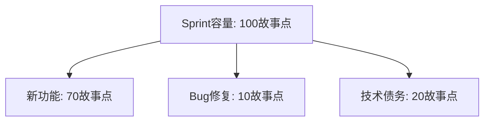

**为什么必须"留预算"**：如果不预留，债务永远没有时间还——就像信用卡月月刷爆、从不还本金，利息越滚越大。

## 6. 常见误区

**误区一：技术债务 = 代码写得烂。** → 技术债务是"权衡的结果"（用质量换速度），不等于能力差。谨慎债务是合理的，问题在于"欠了不还"。

**误区二：技术债务可以永远不还。** → 不还的债务会"利滚利"：代码越来越难改，新功能越来越慢，最终"技术破产"（推倒重写）。

**误区三：重构 = 还清债务。** → 重构是还债的一种方式。但有些债务（如架构选型错误）靠重构也还不清，需要重新设计。

**误区四：技术债务是"技术团队的事"。** → 债务影响的是**交付速度**（新功能越来越慢）——这直接关系到业务。要让管理层"看见"债务（量化成数字），争取还债的资源。

**误区五：还债要"一次性还清"。** → 大爆炸式重构风险极高。**渐进式偿还**（每 Sprint 还一点）更安全、更可持续。


<!-- ============ 文档分隔线：037-software-engineering/010-DevOpsCICDIntegration.md ============ -->


## 1. 从"两个部门打架"说起

### 1.1 传统模式的困境

在传统的软件开发中，开发（Dev）和运维（Ops）常常是"对立的两个部门"：

- **开发**：我的代码写完了，扔给运维部署。出问题？那一定是环境的问题。
- **运维**：这个版本又出 bug 了，肯定是代码的问题。系统稳定是最重要的，新版本少来。

两边互相甩锅、互相埋怨，结果：

- 发布一次要"审批+排期+备份+演练"，周期以"周"计算
- 上线后出问题，两边互相扯皮，找不到责任人
- 系统维护靠"人肉操作手册"，出了问题全靠值班人经验

### 1.2 DevOps 的解法

**DevOps 是"开发（Development）和运维（Operations）"的融合**，通过自动化和文化变革，让软件交付更快、更可靠。

**核心思想**：开发、测试、运维是一个**团队**，共同对"软件从代码到生产"负责——"你构建它，你运行它"（You build it, you run it）。

## 2. DevOps 的核心：CALMS 框架

| 维度 | 说明 |
| :--- | :--- |
| Culture | 共担责任、持续学习（打破部门墙） |
| Automation | 自动化一切可自动化的（减少人肉操作） |
| Lean | 消除浪费、小批量交付（缩短交付周期） |
| Measurement | 数据驱动决策（用数据说话） |
| Sharing | 知识和经验共享（文档即代码） |

**CALMS 是理解 DevOps 的五把钥匙**：文化是灵魂，自动化是手段，精益是方法，度量是依据，共享是保障。

### 2.1 DevOps 工具链

| 阶段 | 工具 |
| :--- | :--- |
| 计划 | Jira、Trello |
| 编码 | Git、VS Code |
| 构建 | Maven、Gradle、Webpack |
| 测试 | JUnit、Selenium、Jest |
| 发布 | Jenkins、GitHub Actions、GitLab CI |
| 部署 | Docker、Kubernetes、Ansible |
| 运维 | Prometheus、Grafana、ELK |
| 监控 | Datadog、New Relic |

## 3. CI/CD 流水线：DevOps 的"主动脉"

### 3.1 持续集成（CI）：让代码"天天合并"

```
代码提交 → 自动构建 → 自动测试 → 代码质量检查 → 反馈
```

**CI 原则**：

- 频繁提交（每天至少一次）——不要"憋大招"
- 自动化构建——提交即触发
- 自动化测试——测试是 CI 的核心
- 快速反馈（<10 分钟）——慢了就没人等结果了
- 主干开发——长期分支是 CI 的敌人

**CI 的价值**：每次提交都跑一遍"构建+测试"，让"代码坏了"在几分钟内暴露，而不是等到集成时才爆炸。

### 3.2 持续交付（CD）：一键发布到生产

```
CI通过 → 自动部署到Staging → 验收测试 → 人工批准 → 生产部署
```

### 3.3 持续部署：全自动发布

```
CI通过 → 自动部署到Staging → 自动测试 → 自动部署到生产
```

| 模式 | 生产部署 | 适用场景 |
| :--- | :--- | :--- |
| 持续集成 | 手动 | 早期团队 |
| 持续交付 | 人工批准 | 关键业务 |
| 持续部署 | 全自动 | SaaS 产品 |

**三者的区别**：CI 只管"构建+测试"；持续交付在 CI 之上加了"随时可发布"（但要人批准）；持续部署连"批准"都自动化了。

### 3.4 流水线示例（GitHub Actions）

```yaml
# GitHub Actions
name: CI/CD Pipeline
on:
  push:
    branches: [main]
  pull_request:
    branches: [main]

jobs:
  test:
    runs-on: ubuntu-latest
    steps:
      - uses: actions/checkout@v4
      - uses: actions/setup-node@v4
        with:
          node-version: '20'
      - run: npm ci
      - run: npm run lint
      - run: npm run test:unit
      - run: npm run test:integration

  build:
    needs: test
    runs-on: ubuntu-latest
    steps:
      - uses: actions/checkout@v4
      - run: docker build -t app:${{ github.sha }} .
      - run: docker push registry/app:${{ github.sha }}

  deploy:
    needs: build
    runs-on: ubuntu-latest
    if: github.ref == 'refs/heads/main'
    steps:
      - run: kubectl set image deployment/app app=registry/app:${{ github.sha }}
```

**流水线的"三段式"**：test（质量门禁）→ build（构建产物）→ deploy（部署上线），每段 `needs` 依赖上一段，形成清晰的责任链。

## 4. 发布策略：怎么上线才安全

### 4.1 五种发布模式

| 策略 | 说明 | 风险 | 回滚难度 |
| :--- | :--- | :--- | :--- |
| 大爆炸发布 | 一次性全量发布 | 高 | 难 |
| 蓝绿部署 | 两套环境切换 | 低 | 容易 |
| 金丝雀发布 | 逐步扩大发布比例 | 低 | 容易 |
| 滚动更新 | 逐个替换实例 | 中 | 中 |
| 特性开关 | 代码已部署，按需开启 | 低 | 容易 |

### 4.2 蓝绿部署

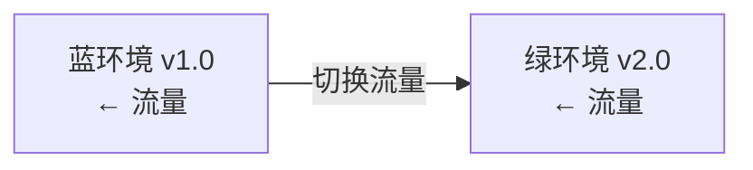

**原理**：同时维护两套环境（蓝=旧版、绿=新版）。新版在绿环境部署并验证后，把流量一次性切到绿环境。出问题？把流量切回蓝环境——**回滚就是"切一下流量"**。

### 4.3 金丝雀发布

```
v1.0 ← 95%流量
v2.0 ← 5%流量  → 观察 → 10% → 25% → 50% → 100%
```

**原理**：先让新版接收 5% 的流量（金丝雀），观察监控指标；没问题就逐步扩大比例，直到 100%。

**监控指标**：错误率、延迟（P50/P95/P99）、CPU/内存使用率、业务指标。

### 4.4 特性开关（Feature Flag）

**原理**：代码已经部署到生产，但功能默认关闭；通过配置开关按需开启。**发布代码 ≠ 上线功能**——代码随时可部署，功能按需放量。

## 5. 质量门禁：流水线的"关卡"

### 5.1 CI 质量门禁

| 检查项 | 阈值 | 说明 |
| :--- | :--- | :--- |
| 单元测试通过率 | 100% | 零容忍 |
| 测试覆盖率 | ≥80% | 最低标准 |
| 代码规范 | 0 error | Lint 检查 |
| 安全扫描 | 0 高危 | SAST 检查 |
| 构建时间 | <10min | 快速反馈 |

### 5.2 CD 质量门禁

| 检查项 | 说明 |
| :--- | :--- |
| 集成测试通过 | 全部通过 |
| 性能测试 | 响应时间达标 |
| 安全扫描 | 无高危漏洞 |
| 人工审批 | 关键环境需审批 |

**质量门禁的意义**：把"质量检查"自动化地嵌入流水线——**不达标的代码进不了下一步**，从流程上保证质量（见 039-engineering-practices《工程实践概述》）。

## 6. GitOps：用 Git 管理基础设施

### 6.1 核心原则

1. **声明式**：系统状态用声明式描述（"系统应该是这样"）
2. **版本控制**：所有变更通过 Git（包括基础设施配置）
3. **自动拉取**：系统自动应用 Git 中的状态
4. **持续协调**：软件代理持续对比"期望状态"和"实际状态"

### 6.2 GitOps 工作流

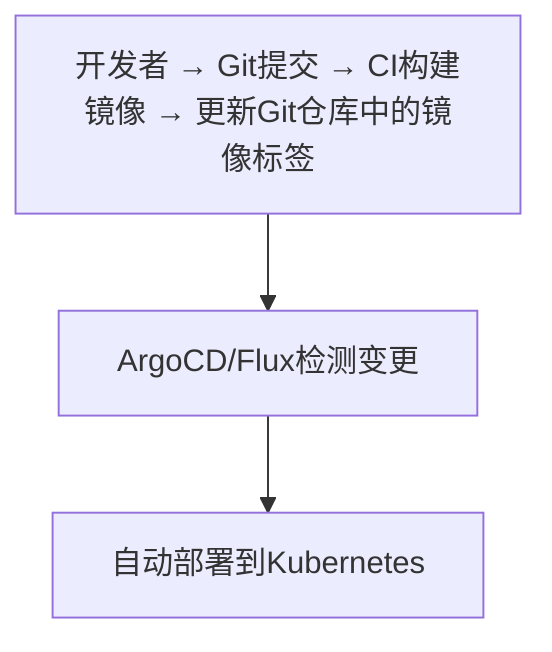

**GitOps 的价值**：基础设施和应用的变更**都在 Git 里、都可审查、都可回滚**——"Git 是唯一的事实来源"。出问题？回滚到上一个 Git 提交即可。

## 7. 常见误区

**误区一：DevOps = 用一些自动化工具。** → 工具只是手段。**DevOps 首先是文化变革**（开发运维共担责任），没有文化变革，工具只是摆设。

**误区二：CI/CD 建完就一劳永逸。** → 流水线需要持续维护（脚本更新、门禁调整、速度优化）。它是"活系统"，不是"一次建好的雕像"。

**误区三：持续部署 = 每天发布很多次。** → 发布频率取决于业务。持续部署解决的是"发布不难、随时可发"，而不是"必须多发"。

**误区四：蓝绿部署就是万能的。** → 蓝绿需要两套完整环境（成本翻倍），且数据库结构变更时切换复杂。**金丝雀发布**更适合大多数场景。

**误区五：质量门禁越多越好。** → 门禁太多（几十个检查）会让流水线慢、团队烦。**少而关键**的门禁（5-8 个）才有效。
