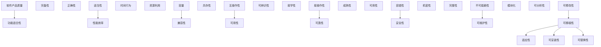

## 1. 软件工程定义

软件工程是将**系统化、规范化、可度量**的方法应用于软件的开发、运行和维护的学科。

### 1.1 核心目标

| 目标     | 说明                     |
| :------- | :----------------------- |
| 可靠性   | 软件在规定条件下正确运行 |
| 可维护性 | 软件易于修改和扩展       |
| 可扩展性 | 软件能适应需求增长       |
| 高效性   | 合理利用计算资源         |
| 可重用性 | 组件可在不同项目中复用   |

### 1.2 软件危机

1968年NATO会议提出"软件危机"概念：

| 表现           | 原因                   |
| :------------- | :--------------------- |
| 项目超期超预算 | 需求不明确、估算不准   |
| 软件质量低     | 缺乏质量保证流程       |
| 维护困难       | 代码结构混乱、文档缺失 |
| 需求变更频繁   | 缺乏变更管理           |
| 团队协作困难   | 沟通机制不完善         |

## 2. 软件生命周期

### 2.1 主要阶段

```
需求分析 → 系统设计 → 编码实现 → 测试验证 → 部署运维 → 维护演进
```

| 阶段     | 产出物         | 关键活动                     |
| :------- | :------------- | :--------------------------- |
| 需求分析 | 需求规格说明书 | 需求获取、分析、验证         |
| 系统设计 | 设计文档       | 架构设计、详细设计           |
| 编码实现 | 源代码         | 编码、代码审查               |
| 测试验证 | 测试报告       | 单元测试、集成测试、系统测试 |
| 部署运维 | 运行系统       | 部署、监控、运维             |
| 维护演进 | 新版本         | 缺陷修复、功能增强           |

### 2.2 开发模型

| 模型     | 特点           | 适用场景         |
| :------- | :------------- | :--------------- |
| 瀑布模型 | 线性顺序       | 需求明确的小项目 |
| V模型    | 测试与开发对应 | 安全关键系统     |
| 增量模型 | 分批交付       | 大型系统         |
| 螺旋模型 | 风险驱动       | 高风险项目       |
| 敏捷模型 | 迭代增量       | 需求变化频繁     |

## 3. 软件质量属性

### 3.1 ISO 25010质量模型



## 4. 软件工程原则

### 4.1 核心原则

| 原则       | 说明                                   |
| :--------- | :------------------------------------- |
| DRY        | Don't Repeat Yourself，消除重复        |
| KISS       | Keep It Simple, Stupid，保持简单       |
| YAGNI      | You Aren't Gonna Need It，不做过度设计 |
| 关注点分离 | 每个模块只关注一个职责                 |
| 信息隐藏   | 模块内部实现对外不可见                 |
| 最少知识   | 最小化模块间的依赖                     |

### 4.2 工程化实践

| 实践       | 说明               |
| :--------- | :----------------- |
| 版本控制   | Git管理代码变更    |
| 持续集成   | 自动化构建和测试   |
| 代码审查   | 同行评审保证质量   |
| 自动化测试 | 测试金字塔覆盖     |
| 文档驱动   | 设计文档与代码同步 |

## 参考文献

IEEE Software 期刊：https://www.computer.org/csdl/magazine/so
Martin Fowler 网站：https://martinfowler.com/
敏捷宣言：https://agilemanifesto.org/iso/zhchs/manifesto.html
12 因素应用：https://12factor.net/zh_cn/

## 延伸阅读

软件架构设计，见 038-software-architecture 模块。
工程实践（Git/CI），见 003-git/031-devops 模块。
测试工程，见 036-software-testing 模块。
黑马程序员 Bilibili 空间（https://space.bilibili.com/37974444 ）提供软件工程课程。

## 深度专题扩展

以下专题从不同角度深入本文主题，供有进阶需求的读者研读。每个专题独立成节，内容相互补充。

### 13.1 敏捷落地实践

Scrum：Sprint（1-4 周）、三会议（计划/每日站会/回顾）、三工件（Backlog/Sprint Backlog/增量）。
看板：可视化流程、WIP 限制、流动效率。
用户故事：As a / I want / so that + 验收标准。
常见失败：仪式化、缺乏自组织、需求仍大爆炸。

### 13.2 代码评审最佳实践

评审范围：小 PR（<400 行）、明确描述、自动化前置。
关注点：正确性、可读性、测试、边界、安全。
沟通：提问式评论、代码建议、避免人身化。
机制：必过门禁、多 Reviewer 轮换、评审 SLA。
