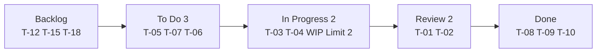

## 1. 敏捷宣言与原则

### 1.1 敏捷宣言四价值观

| 价值观       | 优先于     |
| :----------- | :--------- |
| 个体和互动   | 流程和工具 |
| 可工作的软件 | 详尽的文档 |
| 客户合作     | 合同谈判   |
| 响应变化     | 遵循计划   |

### 1.2 十二原则（核心摘要）

1. 最高优先级是尽早持续交付有价值的软件
2. 欢迎需求变化，即使开发后期
3. 频繁交付可工作的软件（周期越短越好）
4. 业务人员与开发者每日协作
5. 以积极的人为核心，提供所需环境和信任
6. 面对面沟通是最有效的信息传递方式
7. 可工作的软件是进度的首要度量
8. 可持续的开发节奏
9. 持续关注技术卓越和良好设计
10. 简洁——最大化未完成工作量的艺术
11. 最好的架构、需求和设计出自自组织团队
12. 团队定期反思和调整

## 2. Scrum框架

### 2.1 三个角色

| 角色             | 职责                                | 关注点     |
| :--------------- | :---------------------------------- | :--------- |
| Product Owner    | 管理Product Backlog，定义需求优先级 | 做正确的事 |
| Scrum Master     | 移除障碍，确保Scrum实践             | 正确地做事 |
| Development Team | 自组织完成Sprint目标                | 高效地做事 |

### 2.2 五个事件

| 事件                 | 时长（2周Sprint） | 参与者          | 目的           |
| :------------------- | :---------------- | :-------------- | :------------- |
| Sprint               | 2周               | 全员            | 交付增量       |
| Sprint Planning      | 4小时             | 全员            | 规划Sprint目标 |
| Daily Standup        | 15分钟            | 开发团队        | 同步进度和障碍 |
| Sprint Review        | 2小时             | 全员+利益相关者 | 展示成果       |
| Sprint Retrospective | 1.5小时           | 全员            | 改进流程       |

### 2.3 三个工件

| 工件            | 说明               | 负责人           |
| :-------------- | :----------------- | :--------------- |
| Product Backlog | 所有需求的有序列表 | Product Owner    |
| Sprint Backlog  | 当前Sprint的任务   | Development Team |
| Increment       | 可交付的产品增量   | Development Team |

### 2.4 Sprint流程



## 3. Kanban方法

### 3.1 核心原则

1. **可视化工作流**：看板展示所有工作项
2. **限制WIP（Work In Progress）**：限制每列在制品数量
3. **管理流动**：优化工作项从左到右的流动
4. **显式策略**：明确"完成"的定义
5. **反馈环**：定期评审和改进
6. **协作改进**：团队共同优化

### 3.2 Kanban看板


### 3.3 Scrum vs Kanban

| 维度     | Scrum        | Kanban               |
| :------- | :----------- | :------------------- |
| 迭代周期 | 固定Sprint   | 无固定周期           |
| 变更     | Sprint内不变 | 随时可变             |
| WIP限制  | Sprint容量   | 每列WIP限制          |
| 角色     | PO/SM/Team   | 无规定角色           |
| 度量     | 速度         | Lead Time/Cycle Time |
| 适用     | 产品开发     | 运维/支持            |

## 4. Backlog管理

### 4.1 用户故事

**格式**：作为[角色]，我希望[功能]，以便[价值]

```
作为 注册用户，
我希望 能够重置密码，
以便 我忘记密码时可以重新访问账户
```

### 4.2 验收标准

```
验收标准:
1. 用户点击"忘记密码"链接
2. 输入注册邮箱
3. 系统发送重置链接到邮箱
4. 链接30分钟内有效
5. 重置密码需满足复杂度要求
```

### 4.3 故事估算

| 方法     | 说明                           |
| :------- | :----------------------------- |
| 故事点   | 相对复杂度估算（斐波那契数列） |
| T恤尺码  | S/M/L/XL粗粒度估算             |
| 理想天数 | 假设无干扰的完成天数           |

**规划扑克**：团队成员同时出牌，讨论差异后达成共识。

### 4.4 优先级排序

| 方法        | 说明                    |
| :---------- | :---------------------- |
| MoSCoW      | Must/Should/Could/Won't |
| WSJF        | 加权最短作业优先        |
| 价值/成本比 | ROI排序                 |
| Kano模型    | 基本/期望/兴奋需求      |

## 5. 敏捷度量

### 5.1 速度（Velocity）

$$\text{Velocity} = \sum_{i \in \text{Sprint}} \text{StoryPoints}_i$$

### 5.2 燃尽图

```mermaid
flowchart LR
    A[剩余故事点 100] --> B[75] --> C[50] --> D[25] --> E[0<br/>→ Sprint 天数]
    I[理想线 ╲]<br/>A2[实际线 ╲]
```

### 5.3 Lead Time vs Cycle Time

| 指标       | 定义           | 含义               |
| :--------- | :------------- | :----------------- |
| Lead Time  | 需求提出到交付 | 客户感知的响应时间 |
| Cycle Time | 开始工作到完成 | 团队的执行效率     |

## 参考文献

IEEE Software 期刊：https://www.computer.org/csdl/magazine/so
Martin Fowler 网站：https://martinfowler.com/
敏捷宣言：https://agilemanifesto.org/iso/zhchs/manifesto.html
12 因素应用：https://12factor.net/zh_cn/

## 延伸阅读

软件架构设计，见 038-software-architecture 模块。
工程实践（Git/CI），见 003-git/031-devops 模块。
测试工程，见 036-software-testing 模块。
黑马程序员 Bilibili 空间（https://space.bilibili.com/37974444 ）提供软件工程课程。

## 深度专题扩展

以下专题从不同角度深入本文主题，供有进阶需求的读者研读。每个专题独立成节，内容相互补充。

### 13.1 敏捷落地实践

Scrum：Sprint（1-4 周）、三会议（计划/每日站会/回顾）、三工件（Backlog/Sprint Backlog/增量）。
看板：可视化流程、WIP 限制、流动效率。
用户故事：As a / I want / so that + 验收标准。
常见失败：仪式化、缺乏自组织、需求仍大爆炸。

### 13.2 代码评审最佳实践

评审范围：小 PR（<400 行）、明确描述、自动化前置。
关注点：正确性、可读性、测试、边界、安全。
沟通：提问式评论、代码建议、避免人身化。
机制：必过门禁、多 Reviewer 轮换、评审 SLA。
