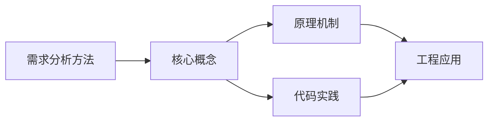
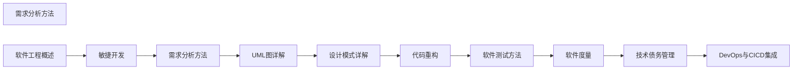

## 1. 学习目标（Bloom 分类）

本节按照布鲁姆教育目标分类学组织学习路径。本文主题为《需求分析方法》，属于 软件工程 模块，读者可以根据自身阶段选择阅读深度。

记忆层面：能够准确复述本文的核心概念、术语与基本语法或操作步骤，并能够在提问或检索时快速定位对应知识点。能够说出 软件工程 的核心概念、常用命令与流程。

理解层面：能够用自己的语言解释核心原理与工作机制，说明概念之间的因果关系，而不是机械记忆结论。能够解释 软件工程 的工作原理与设计动机。

应用层面：能够在真实项目或练习场景中运用本文知识解决具体问题，写出正确且可维护的实现。能够独立完成 软件工程 的标准操作。

分析层面：能够拆解复杂问题，比较本文主题与相邻概念的异同，识别边界条件与例外情况。能够分析 软件工程 使用中的异常与边界。

评价层面：能够根据约束条件（性能、可读性、安全、成本）评价不同方案的优劣，做出有依据的技术决策。能够评价 软件工程 相关工具与方案。

创造层面：能够把本文知识与其他模块知识组合，设计出新的解决方案或可复用的工程模式。能够把 软件工程 融入团队工作流。

通过本节学习，读者应当能够把《需求分析方法》纳入自己的知识网络，并与 软件工程 模块的其他主题（需求、设计、代码质量、项目管理）建立关联。

## 2. 历史动机与发展脉络

《需求分析方法》是 软件工程 领域的重要主题。要真正理解它，需要先了解它解决的问题与演进过程。

软件工程概念于 1968 年 NATO 会议提出，回应“软件危机”：大型系统开发失控；工程化=过程+方法+工具+度量。
生命周期模型：瀑布（顺序）、迭代（螺旋）、敏捷（Scrum/Kanban）；现代以敏捷为主、按场景混合。
工程主题：需求管理、架构设计、代码质量、测试、部署、运维、度量与改进。

回到本文主题：需求分析方法 的提出与成熟，正是上述技术背景下的必然产物。早期实现往往以简单可用为目标，随着工程规模扩大，社区逐渐沉淀出标准做法与最佳实践；理解这一脉络，可以帮助读者判断“为什么文档中的推荐写法是现在这个样子”，也能在遇到历史遗留代码时准确识别其设计年代与取舍。


## 3. 形式化定义与核心概念精讲

本节把《需求分析方法》涉及的核心概念以“定义 + 讲解”的形式展开。读者应把定义当作工具，把讲解当作理解路径；两者结合才能形成可迁移的知识。

需求工程：收集（访谈/用户故事）、分析（优先级）、规格（验收标准）、验证；需求是质量的源头。
设计原则：SOLID（单一职责、开闭、里氏替换、接口隔离、依赖反转）、DRY、YAGNI；模式是经验的命名。
代码质量：可读性、可测试性、可维护性；评审（四人眼）、静态分析、重构。

### 3.1 原文章节逐一精讲

原文档把主题拆分为 5 个小节，下面按顺序给出每一节的导读讲解，随后保留原文细节供精读。

#### 原文精读（完整保留）


#### 1. 需求工程概述

##### 1.1 需求层次

```
业务需求 → 用户需求 → 系统需求
(为什么)    (做什么)    (怎么做)
```

| 层次     | 来源       | 示例                   |
| :------- | :--------- | :--------------------- |
| 业务需求 | 利益相关者 | 提升用户留存率20%      |
| 用户需求 | 最终用户   | 用户能快速找到所需商品 |
| 系统需求 | 开发团队   | 搜索响应时间<200ms     |

##### 1.2 功能需求与非功能需求

| 类型       | 说明                 | 示例                   |
| :--------- | :------------------- | :--------------------- |
| 功能需求   | 系统应该做什么       | 用户可以创建订单       |
| 非功能需求 | 系统应该做到什么程度 | 订单创建响应时间<500ms |

**非功能需求分类（FURPS+）**：

| 类别           | 说明     | 示例               |
| :------------- | :------- | :----------------- |
| Functionality  | 功能性   | 功能完整性         |
| Usability      | 可用性   | 学习曲线、操作步骤 |
| Reliability    | 可靠性   | MTBF、容错能力     |
| Performance    | 性能     | 响应时间、吞吐量   |
| Supportability | 可支持性 | 可维护性、可扩展性 |

#### 2. 需求获取方法

##### 2.1 获取技术

| 方法     | 适用场景       | 优点     | 缺点         |
| :------- | :------------- | :------- | :----------- |
| 访谈     | 深入了解需求   | 信息丰富 | 耗时         |
| 问卷调查 | 大范围收集     | 覆盖面广 | 深度不够     |
| 观察     | 了解实际工作流 | 真实场景 | 可能影响行为 |
| 原型     | 需求不明确     | 直观反馈 | 成本较高     |
| 文档分析 | 现有系统改造   | 基于事实 | 可能过时     |
| 焦点小组 | 收集多方意见   | 多角度   | 组织难度大   |

##### 2.2 需求获取流程

```
1. 识别利益相关者
2. 确定获取策略
3. 执行获取活动
4. 整理和记录需求
5. 验证需求完整性
```

#### 3. 用户故事

##### 3.1 用户故事格式

**标准格式**：

```
作为 [角色]，
我希望 [功能]，
以便 [业务价值]
```

**INVEST原则**：

| 原则        | 说明                     |
| :---------- | :----------------------- |
| Independent | 故事之间尽量独立         |
| Negotiable  | 故事是可协商的           |
| Valuable    | 对用户或业务有价值       |
| Estimable   | 可以估算工作量           |
| Small       | 足够小，一个Sprint内完成 |
| Testable    | 可以验证是否完成         |

##### 3.2 用户故事拆分

| 拆分模式     | 说明             | 示例              |
| :----------- | :--------------- | :---------------- |
| 按工作流步骤 | 拆分流程中的步骤 | 搜索→筛选→下单    |
| 按数据变体   | 拆分不同数据类型 | 国内支付→国际支付 |
| 按操作       | 拆分CRUD操作     | 创建订单→查看订单 |
| 按业务规则   | 拆分不同规则     | 普通用户→VIP用户  |
| 按界面       | 拆分不同界面     | 移动端→桌面端     |

#### 4. 用例图

##### 4.1 用例图元素

| 元素     | 符号      | 说明                 |
| :------- | :-------- | :------------------- |
| 参与者   | 小人      | 与系统交互的外部实体 |
| 用例     | 椭圆      | 系统提供的功能       |
| 系统边界 | 矩形      | 系统范围             |
| 关联     | 实线      | 参与者与用例的关系   |
| 包含     | «include» | 必然执行的行为       |
| 扩展     | «extend»  | 条件执行的行为       |
| 泛化     | 空心箭头  | 一般到特殊           |

##### 4.2 用例描述模板

```
用例名称: 用户登录
参与者: 注册用户
前置条件: 用户已注册
主流程:
  1. 用户输入用户名和密码
  2. 系统验证凭据
  3. 系统创建会话
  4. 系统跳转到首页
备选流程:
  2a. 凭据无效: 提示错误，允许重试
  2b. 账户锁定: 提示联系管理员
后置条件: 用户已登录
```

#### 5. 需求管理

##### 5.1 需求变更控制

```
变更请求 → 影响分析 → 变更评审 → 批准/拒绝 → 实施 → 验证
```

| 步骤     | 关键活动                     |
| :------- | :--------------------------- |
| 变更请求 | 记录变更内容和原因           |
| 影响分析 | 评估对进度、成本、质量的影响 |
| 变更评审 | CCB（变更控制委员会）决策    |
| 实施     | 修改需求和设计               |
| 验证     | 确认变更正确实施             |

##### 5.2 需求追踪

**需求追踪矩阵**：

| 需求ID | 需求描述 | 设计文档 | 代码模块 | 测试用例 | 状态   |
| :----- | :------- | :------- | :------- | :------- | :----- |
| REQ-01 | 用户登录 | HLD-3.1  | auth.py  | TC-01~03 | 完成   |
| REQ-02 | 密码重置 | HLD-3.2  | reset.py | TC-04~06 | 开发中 |

##### 5.3 需求验证

| 方法     | 说明               |
| :------- | :----------------- |
| 需求评审 | 同行评审需求文档   |
| 原型验证 | 用原型确认需求理解 |
| 验收测试 | 用户确认需求满足   |
| 需求基线 | 确认的需求版本冻结 |


### 3.2 概念关系图

下面用 Mermaid 图表达本文核心概念之间的关系，帮助读者建立整体图景：



图中展示的是本文知识的结构化关系：核心概念是入口，原理机制解释“为什么”，代码实践演示“怎么做”，工程应用回答“何时用”。读者学习时可以把每个小节的内容挂接到对应节点上。

## 4. 理论推导与原理解析

本节深入《需求分析方法》背后的原理。理论部分不求面面俱到，而是聚焦“能解释现象、能指导实践”的关键推导。

需求工程：收集（访谈/用户故事）、分析（优先级）、规格（验收标准）、验证；需求是质量的源头。
设计原则：SOLID（单一职责、开闭、里氏替换、接口隔离、依赖反转）、DRY、YAGNI；模式是经验的命名。
代码质量：可读性、可测试性、可维护性；评审（四人眼）、静态分析、重构。
项目管理：范围/时间/成本三角；看板与迭代；风险登记。

需要强调的是，理论推导与工程实践之间存在翻译层：理论给出的是理想化模型与边界条件，工程代码则必须处理真实环境中的例外。读者在学习时应先掌握理论的“标准情形”，再通过陷阱章节了解“非标准情形”。

## 5. 代码示例与逐行讲解

本节把原文中的代码示例系统整理，并为每个示例补充用途说明与讲解。读者不应只浏览代码，而应逐段对照讲解理解设计意图。

### 5.1 示例：1.1 需求层次

该示例来自原文《1.1 需求层次》小节，用于演示需求分析方法相关操作。阅读时请先看代码结构，再看其后的讲解。

```text
业务需求 → 用户需求 → 系统需求
(为什么)    (做什么)    (怎么做)
```

讲解：这段代码演示了本节核心知识点。代码中的关键操作可以归纳为三步：准备（定义或初始化）、执行（核心逻辑）、收尾（释放资源或返回结果）。实际项目中，这三步往往被封装为函数或类，以提升复用性与可测试性。

关键点分析：

该示例共 2 行有效代码，结构以数据或配置为主。阅读时应关注：数据字段的含义、配置项的作用，以及它们与运行行为的对应关系。

进阶思考路径：先尝试修改参数观察行为变化，再把示例中的模式迁移到自己的项目中；每次修改都记录预期与实测差异，这是把示例转化为能力的最快方式。

### 5.2 示例：2.2 需求获取流程

该示例来自原文《2.2 需求获取流程》小节，用于演示需求分析方法相关操作。阅读时请先看代码结构，再看其后的讲解。

```text
1. 识别利益相关者
2. 确定获取策略
3. 执行获取活动
4. 整理和记录需求
5. 验证需求完整性
```

讲解：这段代码演示了本节核心知识点。代码中的关键操作可以归纳为三步：准备（定义或初始化）、执行（核心逻辑）、收尾（释放资源或返回结果）。实际项目中，这三步往往被封装为函数或类，以提升复用性与可测试性。

关键点分析：

该示例共 5 行有效代码，结构以数据或配置为主。阅读时应关注：数据字段的含义、配置项的作用，以及它们与运行行为的对应关系。

进阶思考路径：先尝试修改参数观察行为变化，再把示例中的模式迁移到自己的项目中；每次修改都记录预期与实测差异，这是把示例转化为能力的最快方式。

### 5.3 示例：3.1 用户故事格式

该示例来自原文《3.1 用户故事格式》小节，用于演示需求分析方法相关操作。阅读时请先看代码结构，再看其后的讲解。

```text
作为 [角色]，
我希望 [功能]，
以便 [业务价值]
```

讲解：这段代码演示了本节核心知识点。代码中的关键操作可以归纳为三步：准备（定义或初始化）、执行（核心逻辑）、收尾（释放资源或返回结果）。实际项目中，这三步往往被封装为函数或类，以提升复用性与可测试性。

关键点分析：

该示例共 3 行有效代码，结构以数据或配置为主。阅读时应关注：数据字段的含义、配置项的作用，以及它们与运行行为的对应关系。

进阶思考路径：先尝试修改参数观察行为变化，再把示例中的模式迁移到自己的项目中；每次修改都记录预期与实测差异，这是把示例转化为能力的最快方式。

### 5.4 示例：4.2 用例描述模板

该示例来自原文《4.2 用例描述模板》小节，用于演示需求分析方法相关操作。阅读时请先看代码结构，再看其后的讲解。

```text
用例名称: 用户登录
参与者: 注册用户
前置条件: 用户已注册
主流程:
  1. 用户输入用户名和密码
  2. 系统验证凭据
  3. 系统创建会话
  4. 系统跳转到首页
备选流程:
  2a. 凭据无效: 提示错误，允许重试
  2b. 账户锁定: 提示联系管理员
后置条件: 用户已登录
```

讲解：这段代码演示了本节核心知识点。代码中的关键操作可以归纳为三步：准备（定义或初始化）、执行（核心逻辑）、收尾（释放资源或返回结果）。实际项目中，这三步往往被封装为函数或类，以提升复用性与可测试性。

关键点分析：

该示例共 12 行有效代码，结构以数据或配置为主。阅读时应关注：数据字段的含义、配置项的作用，以及它们与运行行为的对应关系。

进阶思考路径：先尝试修改参数观察行为变化，再把示例中的模式迁移到自己的项目中；每次修改都记录预期与实测差异，这是把示例转化为能力的最快方式。

### 5.5 示例：5.1 需求变更控制

该示例来自原文《5.1 需求变更控制》小节，用于演示需求分析方法相关操作。阅读时请先看代码结构，再看其后的讲解。

```text
变更请求 → 影响分析 → 变更评审 → 批准/拒绝 → 实施 → 验证
```

讲解：这段代码演示了本节核心知识点。代码中的关键操作可以归纳为三步：准备（定义或初始化）、执行（核心逻辑）、收尾（释放资源或返回结果）。实际项目中，这三步往往被封装为函数或类，以提升复用性与可测试性。

关键点分析：

该示例共 1 行有效代码，结构以数据或配置为主。阅读时应关注：数据字段的含义、配置项的作用，以及它们与运行行为的对应关系。

进阶思考路径：先尝试修改参数观察行为变化，再把示例中的模式迁移到自己的项目中；每次修改都记录预期与实测差异，这是把示例转化为能力的最快方式。


综合以上示例，可以总结出本主题的代码实践要点：第一，先定义清晰的输入输出契约；第二，核心逻辑保持单一职责；第三，错误处理与边界条件不可省略；第四，命名与注释表达意图而非复述代码。

## 6. 对比分析

对比是理解《需求分析方法》定位的最快路径。下面从多个维度与相邻方案进行对比。

瀑布与敏捷：瀑布适合需求稳定的合规项目；敏捷适合快速迭代。
微服务与单体：单体简单，微服务解耦；按团队与规模选择。
手写与低代码：低代码提效场景受限，核心系统仍手写。

对比的目的不是分出绝对优劣，而是建立选择依据：不同约束条件下，最优解不同。读者应把每个对比维度转化为决策检查清单。

## 7. 常见陷阱与最佳实践

本节整理该主题的高频错误与推荐做法。每个陷阱先描述现象，再解释原因，最后给出最佳实践。

### 7.1 需求理解偏差

交付不符。验收标准前置 + 频繁确认。

深入讲解：该问题之所以被归类为“常见陷阱”，是因为它在初学者的代码中反复出现，而且往往不在第一时间暴露——错误通常隐藏在特定数据或特定时序下。

从成因上看，需求理解偏差 一般源于对 软件工程 某个机制的理解偏差：要么误用了默认行为，要么忽略了边界条件，要么把其他语言的思维惯性带了过来。

从影响上看，需求理解偏差 轻则产生错误结果，重则导致资源泄漏、数据损坏或安全事故；这也是为什么工程评审中会把它列为检查项。

从修复策略上看，处理需求理解偏差的正确顺序是：先复现（构造最小用例），再定位（确认机制层面的根因），最后修复并补充回归测试。跳过复现直接改代码，往往治标不治本。

### 7.2 技术债堆积

短期快改长期失控。重构纳入迭代。

深入讲解：该问题之所以被归类为“常见陷阱”，是因为它在初学者的代码中反复出现，而且往往不在第一时间暴露——错误通常隐藏在特定数据或特定时序下。

从成因上看，技术债堆积 一般源于对 软件工程 某个机制的理解偏差：要么误用了默认行为，要么忽略了边界条件，要么把其他语言的思维惯性带了过来。

从影响上看，技术债堆积 轻则产生错误结果，重则导致资源泄漏、数据损坏或安全事故；这也是为什么工程评审中会把它列为检查项。

从修复策略上看，处理技术债堆积的正确顺序是：先复现（构造最小用例），再定位（确认机制层面的根因），最后修复并补充回归测试。跳过复现直接改代码，往往治标不治本。

### 7.3 缺乏评审

缺陷后置。强制评审与 lint。

深入讲解：该问题之所以被归类为“常见陷阱”，是因为它在初学者的代码中反复出现，而且往往不在第一时间暴露——错误通常隐藏在特定数据或特定时序下。

从成因上看，缺乏评审 一般源于对 软件工程 某个机制的理解偏差：要么误用了默认行为，要么忽略了边界条件，要么把其他语言的思维惯性带了过来。

从影响上看，缺乏评审 轻则产生错误结果，重则导致资源泄漏、数据损坏或安全事故；这也是为什么工程评审中会把它列为检查项。

从修复策略上看，处理缺乏评审的正确顺序是：先复现（构造最小用例），再定位（确认机制层面的根因），最后修复并补充回归测试。跳过复现直接改代码，往往治标不治本。

### 7.4 文档过期

误导团队。文档即代码，随变更更新。

深入讲解：该问题之所以被归类为“常见陷阱”，是因为它在初学者的代码中反复出现，而且往往不在第一时间暴露——错误通常隐藏在特定数据或特定时序下。

从成因上看，文档过期 一般源于对 软件工程 某个机制的理解偏差：要么误用了默认行为，要么忽略了边界条件，要么把其他语言的思维惯性带了过来。

从影响上看，文档过期 轻则产生错误结果，重则导致资源泄漏、数据损坏或安全事故；这也是为什么工程评审中会把它列为检查项。

从修复策略上看，处理文档过期的正确顺序是：先复现（构造最小用例），再定位（确认机制层面的根因），最后修复并补充回归测试。跳过复现直接改代码，往往治标不治本。

### 7.5 过度设计

YAGNI 被忽视。按当前需求设计。

深入讲解：该问题之所以被归类为“常见陷阱”，是因为它在初学者的代码中反复出现，而且往往不在第一时间暴露——错误通常隐藏在特定数据或特定时序下。

从成因上看，过度设计 一般源于对 软件工程 某个机制的理解偏差：要么误用了默认行为，要么忽略了边界条件，要么把其他语言的思维惯性带了过来。

从影响上看，过度设计 轻则产生错误结果，重则导致资源泄漏、数据损坏或安全事故；这也是为什么工程评审中会把它列为检查项。

从修复策略上看，处理过度设计的正确顺序是：先复现（构造最小用例），再定位（确认机制层面的根因），最后修复并补充回归测试。跳过复现直接改代码，往往治标不治本。

### 7.6 估时不实

承诺拍脑袋。相对估算 + 数据校准。

深入讲解：该问题之所以被归类为“常见陷阱”，是因为它在初学者的代码中反复出现，而且往往不在第一时间暴露——错误通常隐藏在特定数据或特定时序下。

从成因上看，估时不实 一般源于对 软件工程 某个机制的理解偏差：要么误用了默认行为，要么忽略了边界条件，要么把其他语言的思维惯性带了过来。

从影响上看，估时不实 轻则产生错误结果，重则导致资源泄漏、数据损坏或安全事故；这也是为什么工程评审中会把它列为检查项。

从修复策略上看，处理估时不实的正确顺序是：先复现（构造最小用例），再定位（确认机制层面的根因），最后修复并补充回归测试。跳过复现直接改代码，往往治标不治本。

### 7.7 范围蔓延

不断加需求。变更控制与 backlog 优先。

深入讲解：该问题之所以被归类为“常见陷阱”，是因为它在初学者的代码中反复出现，而且往往不在第一时间暴露——错误通常隐藏在特定数据或特定时序下。

从成因上看，范围蔓延 一般源于对 软件工程 某个机制的理解偏差：要么误用了默认行为，要么忽略了边界条件，要么把其他语言的思维惯性带了过来。

从影响上看，范围蔓延 轻则产生错误结果，重则导致资源泄漏、数据损坏或安全事故；这也是为什么工程评审中会把它列为检查项。

从修复策略上看，处理范围蔓延的正确顺序是：先复现（构造最小用例），再定位（确认机制层面的根因），最后修复并补充回归测试。跳过复现直接改代码，往往治标不治本。

### 7.8 沉默的失败

问题不敢说。安全文化 + 复盘。

深入讲解：该问题之所以被归类为“常见陷阱”，是因为它在初学者的代码中反复出现，而且往往不在第一时间暴露——错误通常隐藏在特定数据或特定时序下。

从成因上看，沉默的失败 一般源于对 软件工程 某个机制的理解偏差：要么误用了默认行为，要么忽略了边界条件，要么把其他语言的思维惯性带了过来。

从影响上看，沉默的失败 轻则产生错误结果，重则导致资源泄漏、数据损坏或安全事故；这也是为什么工程评审中会把它列为检查项。

从修复策略上看，处理沉默的失败的正确顺序是：先复现（构造最小用例），再定位（确认机制层面的根因），最后修复并补充回归测试。跳过复现直接改代码，往往治标不治本。

### 7.0 最佳实践总览

1. 定义完成（DoD）：编码、测试、文档、评审齐备。
2. 小步交付：每迭代可演示可发布。
3. 度量驱动：周期时间、缺陷率、吞吐；用数据开会。
4. 复盘：每次迭代回顾，行动项闭环。

把这些最佳实践固化为团队规范与代码评审检查项，是避免同类问题反复出现的关键。

## 8. 工程实践

本节把《需求分析方法》放入真实工程场景，给出可复用的模式与组织方法。

工程效能：CI/CD、开发容器、代码模板、脚手架。
知识管理：ADR（架构决策记录）、Wiki、onboarding 文档。
治理：代码所有权、依赖策略、安全基线。

### 8.1 工程实践的原则拆解

以上工程实践可以归纳为四条原则。第一，配置与代码分离：软件工程 项目中环境差异应通过配置注入，而不是散落在代码分支中；这保证同一份代码可以在开发、测试、生产环境一致运行。

第二，接口稳定优先：对外接口（函数签名、协议、数据格式）一旦被消费方依赖，变更成本极高；设计时应预留扩展点并保持向后兼容。

第三，可观测性内置：日志、指标与追踪应该在功能开发时同步设计，而不是故障发生后补救；没有观测手段的模块等于黑盒。

第四，变更可回滚：任何发布都应有对应的回滚方案；数据库迁移、配置变更与代码发布一样需要版本管理与逆向路径。

### 8.2 实践落地的检查清单

- [ ] 工程效能：对照本节描述，检查当前项目是否已经落实；未落实的项列入技术债并排期处理。
- [ ] 知识管理：对照本节描述，检查当前项目是否已经落实；未落实的项列入技术债并排期处理。
- [ ] 治理：对照本节描述，检查当前项目是否已经落实；未落实的项列入技术债并排期处理。

工程实践的共性原则：配置与代码分离、接口稳定优先、可观测性内置、变更可回滚。这些原则适用于本主题的所有实现。

## 9. 案例研究

本节通过一个完整案例把《需求分析方法》的知识串起来。案例按“需求分析、方案设计、实现、验证”四步展开。

需求：提升团队交付质量与效率。
方案：DoD + PR 门禁 + 迭代复盘 + 效能度量。
要点：小步、自动化、数据驱动改进。
验证：周期时间下降、缺陷率下降、满意度提升。

### 9.1 案例的扩展讨论

把案例中的方案放大到真实规模，需要额外考虑三个问题：

第一，规模：当数据量或并发量上升一个数量级时，原方案中的数据结构、缓存策略与任务调度是否仍然成立？通常需要引入分层与异步。

第二，团队：多人协作时，模块边界、接口契约与代码所有权必须明确；案例中的实现应拆分为可独立测试的单元，并配合文档说明设计意图。

第三，演进：上线后的需求变化不可避免；方案设计时应预留扩展点（配置化、插件化、事件化），并定期用真实指标验证假设。


案例研究的学习方法：先独立阅读需求，尝试在脑中形成方案，再对照实现与讲解，最后思考“如果约束变化（数据量、并发、团队规模），方案应如何调整”。

## 10. 知识要点总结与深入讲解

本节以讲解形式汇总全文要点，替代传统的习题与自测，读者不需要答题，只需跟随解释建立完整的认知框架。

关于《需求分析方法》的核心结论：

软件工程的核心是“管理复杂性”：过程、设计、度量都为此服务。
质量内建优于事后补救。
持续改进：小步实验 + 数据验证。

原文档各小节的要点回顾：

- 1. 需求工程概述：该小节围绕需求分析方法展开具体细节，阅读时应关注其与核心结论的对应关系；每个小节都是核心结论在某一个侧面的展开。
- 2. 需求获取方法：该小节围绕需求分析方法展开具体细节，阅读时应关注其与核心结论的对应关系；每个小节都是核心结论在某一个侧面的展开。
- 3. 用户故事：该小节围绕需求分析方法展开具体细节，阅读时应关注其与核心结论的对应关系；每个小节都是核心结论在某一个侧面的展开。
- 4. 用例图：该小节围绕需求分析方法展开具体细节，阅读时应关注其与核心结论的对应关系；每个小节都是核心结论在某一个侧面的展开。
- 5. 需求管理：该小节围绕需求分析方法展开具体细节，阅读时应关注其与核心结论的对应关系；每个小节都是核心结论在某一个侧面的展开。

把以上要点与第 3-9 节的内容对照复习，即可完成对本文主题的闭环学习。

## 11. 参考文献


IEEE Software 期刊：https://www.computer.org/csdl/magazine/so
Martin Fowler 网站：https://martinfowler.com/
敏捷宣言：https://agilemanifesto.org/iso/zhchs/manifesto.html
12 因素应用：https://12factor.net/zh_cn/

## 12. 延伸阅读


软件架构设计，见 038-software-architecture 模块。
工程实践（Git/CI），见 003-git/031-devops 模块。
测试工程，见 036-software-testing 模块。
黑马程序员 Bilibili 空间（https://space.bilibili.com/37974444 ）提供软件工程课程。

## 14. 模块知识图谱与学习路径

本文属于 软件工程 模块。为了把《需求分析方法》放入完整的知识网络，下面列出本模块的全部主题并给出相互关联的导读。学习时建议按模块内顺序推进，并在每个文档中留意交叉引用。



上图为模块主题的推荐学习顺序示意图（仅展示前若干主题）。各主题之间存在三类关联：

第一，前置依赖关系：早期主题是后期主题的基础，例如环境与语法先行、进阶主题随后；

第二，横向并列关系：同一层级主题从不同角度覆盖模块能力，学习顺序可以按兴趣调整；

第三，工程组合关系：多个主题在真实项目中组合使用，例如配置、性能与安全主题往往出现在同一系统的不同层面。

### 14.1 模块主题速查表

| 文档 | 主题 | 与本文的关联 |
| --- | --- | --- |
| 软件工程概述 | 001-SoftwareEngineeringOverview | 本文的前置基础 |
| 敏捷开发 | 002-AgileDevelopment | 本文的并列主题 |
| 需求分析方法 | 003-RequirementAnalysisMethod | 本文自身 |
| UML图详解 | 004-UMLGraphDetailed | 本文的并列主题 |
| 设计模式详解 | 005-DesignPatternDetailed | 本文的并列主题 |
| 代码重构 | 006-Refactoring | 本文的并列主题 |
| 软件测试方法 | 007-SoftwareTestMethod | 本文的并列主题 |
| 软件度量 | 008-SoftwareMetrics | 本文的并列主题 |
| 技术债务管理 | 009-TechDebtManagement | 本文的并列主题 |
| DevOps与CICD集成 | 010-DevOpsCICDIntegration | 本文的并列主题 |

速查表的作用是让读者快速判断：哪些文档应在阅读本文前掌握（前置基础），哪些文档应在阅读本文后继续（延伸主题）。本模块的交叉引用体系即以此表为基础。

## 15. 术语表

下表整理《需求分析方法》及 软件工程 模块中出现的高频术语，给出简明释义。术语按字母序或逻辑序排列，供查阅。

| 术语 | 释义 |
| --- | --- |
| 需求工程 | 收集（访谈/用户故事）、分析（优先级）、规格（验收标准）、验证；需求是质量的源头。 |
| 设计原则 | SOLID（单一职责、开闭、里氏替换、接口隔离、依赖反转）、DRY、YAGNI；模式是经验的命名。 |
| 代码质量 | 可读性、可测试性、可维护性；评审（四人眼）、静态分析、重构。 |
| 项目管理 | 范围/时间/成本三角；看板与迭代；风险登记。 |
| 需求理解偏差（易错点） | 参见常见陷阱章节的详细讲解 |
| 技术债堆积（易错点） | 参见常见陷阱章节的详细讲解 |
| 缺乏评审（易错点） | 参见常见陷阱章节的详细讲解 |
| 文档过期（易错点） | 参见常见陷阱章节的详细讲解 |
| 过度设计（易错点） | 参见常见陷阱章节的详细讲解 |
| 估时不实（易错点） | 参见常见陷阱章节的详细讲解 |

术语表与正文配合使用：先通读正文，遇到模糊术语回查本表；长期使用后术语会自然进入工作记忆。

## 13. 深度专题扩展

以下专题从不同角度深入本文主题，供有进阶需求的读者研读。每个专题独立成节，内容相互补充。

### 13.1 敏捷落地实践

Scrum：Sprint（1-4 周）、三会议（计划/每日站会/回顾）、三工件（Backlog/Sprint Backlog/增量）。
看板：可视化流程、WIP 限制、流动效率。
用户故事：As a / I want / so that + 验收标准。
常见失败：仪式化、缺乏自组织、需求仍大爆炸。

### 13.2 代码评审最佳实践

评审范围：小 PR（<400 行）、明确描述、自动化前置。
关注点：正确性、可读性、测试、边界、安全。
沟通：提问式评论、代码建议、避免人身化。
机制：必过门禁、多 Reviewer 轮换、评审 SLA。

## 16. 核心概念串讲（复习视角）

本节以“把知识讲给他人听”的方式，把《需求分析方法》的核心概念重新串讲一遍。与前文按章节展开不同，这里的叙述更接近课堂总结：先说整体，再逐个展开，最后收束。

《需求分析方法》属于 软件工程 模块。要理解它，先要理解它在模块中的位置：它解决的是该领域的一个具体问题，并依赖模块内若干前置概念；反过来，它又为后续进阶主题提供基础。

第一个概念是需求工程。收集（访谈/用户故事）、分析（优先级）、规格（验收标准）、验证；需求是质量的源头。

在实际使用中，需求工程需要与相邻概念区分：它们的区别不在于名称，而在于适用条件与行为边界；这正是前文对比分析章节的意义。

第一个概念是设计原则。SOLID（单一职责、开闭、里氏替换、接口隔离、依赖反转）、DRY、YAGNI；模式是经验的命名。

在实际使用中，设计原则需要与相邻概念区分：它们的区别不在于名称，而在于适用条件与行为边界；这正是前文对比分析章节的意义。

第一个概念是代码质量。可读性、可测试性、可维护性；评审（四人眼）、静态分析、重构。

在实际使用中，代码质量需要与相邻概念区分：它们的区别不在于名称，而在于适用条件与行为边界；这正是前文对比分析章节的意义。

接下来是需求工程。收集（访谈/用户故事）、分析（优先级）、规格（验收标准）、验证；需求是质量的源头。

理解该原理的关键不是记住结论，而是记住“它从什么假设出发、推出了什么、假设不成立时会怎样”。带着这个框架复习，原理之间就会连成网络。

接下来是设计原则。SOLID（单一职责、开闭、里氏替换、接口隔离、依赖反转）、DRY、YAGNI；模式是经验的命名。

理解该原理的关键不是记住结论，而是记住“它从什么假设出发、推出了什么、假设不成立时会怎样”。带着这个框架复习，原理之间就会连成网络。

接下来是代码质量。可读性、可测试性、可维护性；评审（四人眼）、静态分析、重构。

理解该原理的关键不是记住结论，而是记住“它从什么假设出发、推出了什么、假设不成立时会怎样”。带着这个框架复习，原理之间就会连成网络。

接下来是项目管理。范围/时间/成本三角；看板与迭代；风险登记。

理解该原理的关键不是记住结论，而是记住“它从什么假设出发、推出了什么、假设不成立时会怎样”。带着这个框架复习，原理之间就会连成网络。

串讲收束：把概念与原理放回本文主题，可以得出一个总纲——定义描述是什么，原理解释为什么，实践回答怎么做。三者构成完整的学习闭环；后续遇到相关问题，都可以按这个总纲检索知识。
