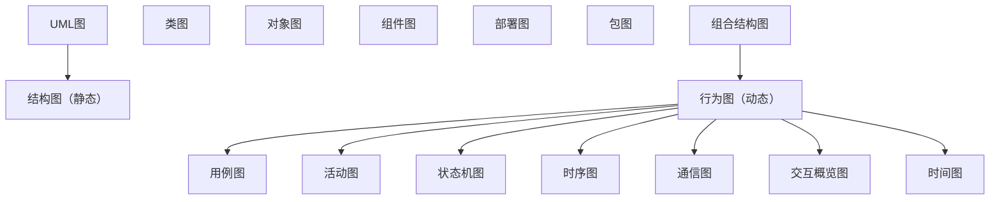
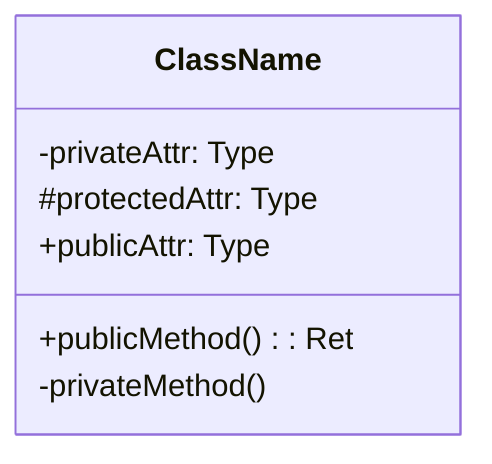
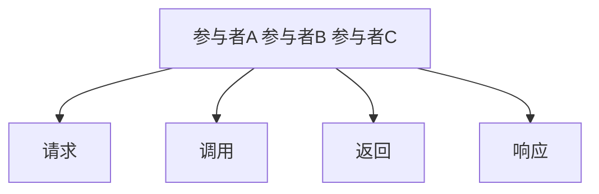
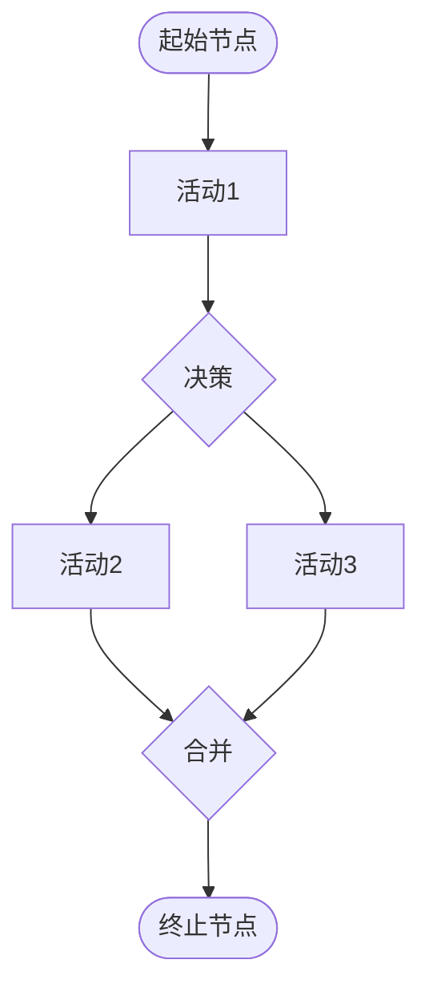
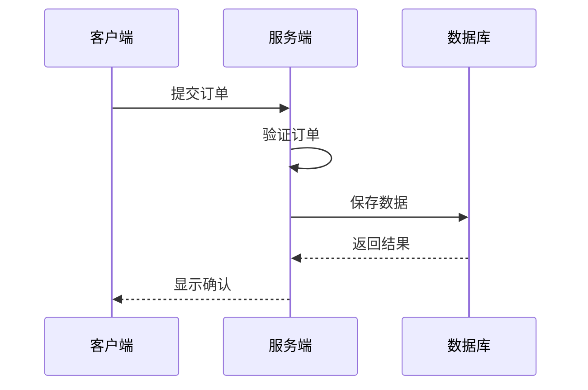
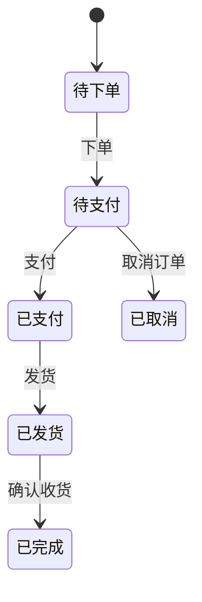
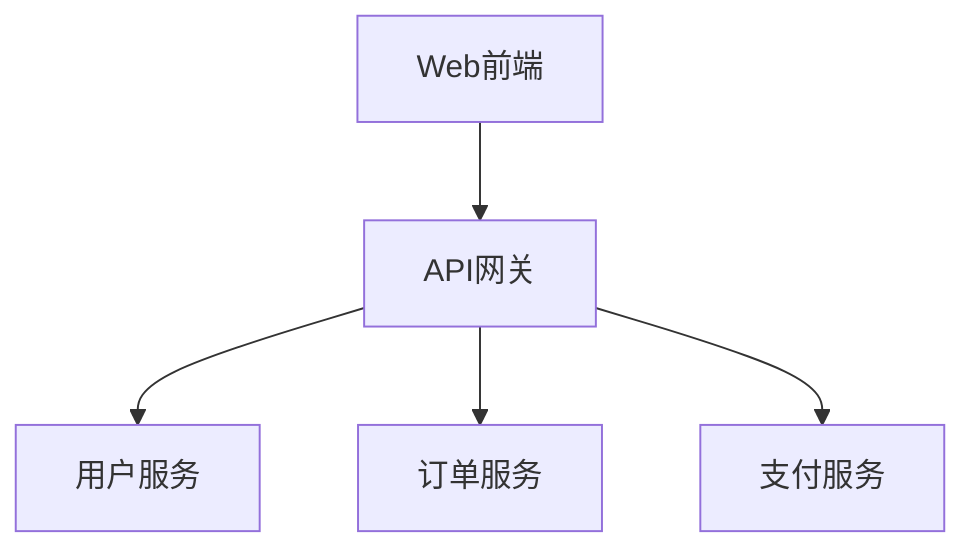
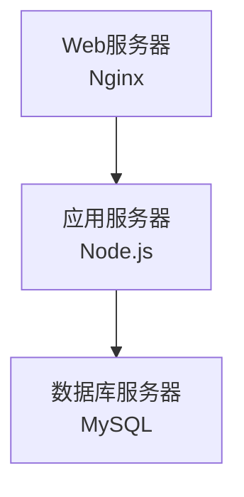

## 1. UML概述

### 1.1 UML图分类

## 2. 类图

### 2.1 类的表示

### 2.2 类间关系

| 关系 | 符号  | 含义             | 示例        |
| :--- | :---- | :--------------- | :---------- |
| 依赖 | - - → | A使用B           | 方法参数    |
| 关联 | ——→   | A知道B           | 成员变量    |
| 聚合 | ◇——→  | A包含B（弱拥有） | 部门-员工   |
| 组合 | ◆——→  | A拥有B（强拥有） | 人-心脏     |
| 泛化 | ——▷   | A继承B           | 子类-父类   |
| 实现 | - -▷  | A实现B接口       | 实现类-接口 |

**关系强度**：依赖 < 关联 < 聚合 < 组合 < 泛化/实现

### 2.3 多重性

| 标记  | 含义       |
| :---- | :--------- |
| 1     | 恰好一个   |
| 0..1  | 零或一个   |
| \*    | 任意多个   |
| 1..\* | 一个或多个 |
| 0..\* | 零或多个   |

## 3. 时序图

### 3.1 基本元素

| 元素     | 说明                     |
| :------- | :----------------------- |
| 参与者   | 交互的对象               |
| 生命线   | 虚线，表示对象存在时间   |
| 激活条   | 矩形条，表示对象正在执行 |
| 同步消息 | 实心箭头，等待返回       |
| 异步消息 | 开放箭头，不等待         |
| 返回消息 | 虚线箭头                 |
| 自调用   | 消息指向自身             |

### 3.2 组合片段

| 操作符   | 含义                |
| :------- | :------------------ |
| alt      | 条件分支（if-else） |
| opt      | 可选执行（if）      |
| loop     | 循环                |
| par      | 并行执行            |
| critical | 临界区              |
| break    | 中断                |

## 4. 活动图

### 4.1 基本元素

| 元素      | 说明           |
| :-------- | :------------- |
| 起始节点  | 实心圆         |
| 终止节点  | 实心圆加外圈   |
| 活动节点  | 圆角矩形       |
| 决策节点  | 菱形           |
| 合并节点  | 菱形           |
| 分叉/汇合 | 粗横线（并行） |
| 泳道      | 分区表示职责   |

### 4.2 泳道活动图

## 5. 状态机图

### 5.1 基本元素

### 5.2 状态转换表

| 当前状态 | 事件     | 动作     | 目标状态 |
| :------- | :------- | :------- | :------- |
| 待下单   | 下单     | 创建订单 | 待支付   |
| 待支付   | 支付     | 处理支付 | 已支付   |
| 待支付   | 取消     | 释放库存 | 已取消   |
| 已支付   | 发货     | 更新物流 | 已发货   |
| 已发货   | 确认收货 | 完成订单 | 已完成   |

## 6. 其他UML图

### 6.1 组件图

展示系统的**组件及其依赖关系**：

### 6.2 部署图

展示**硬件节点和软件部署**：

## 参考文献

IEEE Software 期刊：https://www.computer.org/csdl/magazine/so
Martin Fowler 网站：https://martinfowler.com/
敏捷宣言：https://agilemanifesto.org/iso/zhchs/manifesto.html
12 因素应用：https://12factor.net/zh_cn/

## 延伸阅读

软件架构设计，见 038-software-architecture 模块。
工程实践（Git/CI），见 003-git/031-devops 模块。
测试工程，见 036-software-testing 模块。
黑马程序员 Bilibili 空间（https://space.bilibili.com/37974444 ）提供软件工程课程。

## 深度专题扩展

以下专题从不同角度深入本文主题，供有进阶需求的读者研读。每个专题独立成节，内容相互补充。

### 13.1 敏捷落地实践

Scrum：Sprint（1-4 周）、三会议（计划/每日站会/回顾）、三工件（Backlog/Sprint Backlog/增量）。
看板：可视化流程、WIP 限制、流动效率。
用户故事：As a / I want / so that + 验收标准。
常见失败：仪式化、缺乏自组织、需求仍大爆炸。

### 13.2 代码评审最佳实践

评审范围：小 PR（<400 行）、明确描述、自动化前置。
关注点：正确性、可读性、测试、边界、安全。
沟通：提问式评论、代码建议、避免人身化。
机制：必过门禁、多 Reviewer 轮换、评审 SLA。

## 模块文档速查表

| 文档 | 主题 | 与本文的关联 |
| --- | --- | --- |
| 软件工程概述 | 001-SoftwareEngineeringOverview | 本文的前置基础 |
| 敏捷开发 | 002-AgileDevelopment | 本文的并列主题 |
| 需求分析方法 | 003-RequirementAnalysisMethod | 本文的并列主题 |
| UML图详解 | 004-UMLGraphDetailed | 本文自身 |
| 设计模式详解 | 005-DesignPatternDetailed | 本文的并列主题 |
| 代码重构 | 006-Refactoring | 本文的并列主题 |
| 软件测试方法 | 007-SoftwareTestMethod | 本文的并列主题 |
| 软件度量 | 008-SoftwareMetrics | 本文的并列主题 |
| 技术债务管理 | 009-TechDebtManagement | 本文的并列主题 |
| DevOps与CICD集成 | 010-DevOpsCICDIntegration | 本文的并列主题 |
