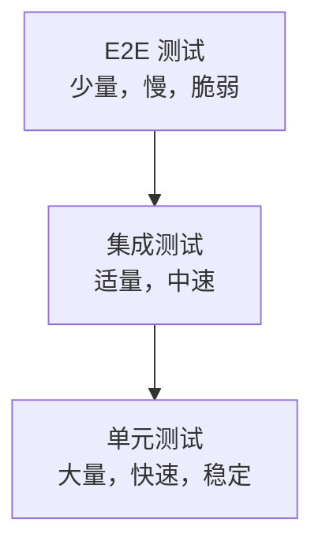

## 1. 从"质检"说起：为什么需要测试

### 1.1 一个工厂的类比

想象一家工厂生产手机。没有质检流程会怎样？

- 零件组装后直接发货 → 有缺陷的手机到了用户手里 → 退货、投诉、品牌受损
- 更糟的是，质检人员**完全靠手感**（"这个看起来不错"）→ 今天标准松、明天标准严 → 质量不可控

**软件测试就是软件的"质检体系"**：用系统化的方法验证"软件是否符合预期"，在缺陷到达用户之前发现它。

### 1.2 测试的核心价值

| 价值 | 说明 |
| :--- | :--- |
| 发现缺陷 | 在用户遇到问题之前发现问题 |
| 保障质量 | 确保功能正确、稳定、安全 |
| 支持重构 | 有测试保护，改代码才敢动手（见《代码重构》） |
| 建立信心 | 发布前知道"东西是好的" |

**关键认知**：测试的目的不是"证明没有 bug"（这不可能），而是"在可接受的成本内，把缺陷风险降到可接受的水平"。

## 2. 测试金字塔：测试的"配比艺术"

### 2.1 金字塔模型



| 层级 | 数量 | 速度 | 范围 | 目的 |
| :--- | :--- | :--- | :--- | :--- |
| 单元测试 | 70% | 毫秒 | 单个函数/类 | 验证逻辑正确性 |
| 集成测试 | 20% | 秒 | 模块交互 | 验证组件协作 |
| E2E 测试 | 10% | 分钟 | 完整流程 | 验证用户场景 |

### 2.2 为什么是"金字塔"形状

**越往上的测试越贵、越慢、越脆弱**：

- **单元测试**：只测一个函数，毫秒级，稳定（一个函数变了其他测试不受影响）
- **E2E 测试**：启动整个系统、走完整流程，分钟级，脆弱（任何一环变化都可能挂）

**正确策略**：大部分测试放在底层（单元测试），只有少量关键场景用 E2E 测试。**如果你 70% 的测试是 E2E（倒金字塔），每次改动都会"挂一片"——测试变成负担而不是保护。**

## 3. 测试类型

### 3.1 按范围分类

| 类型 | 说明 | 示例 |
| :--- | :--- | :--- |
| 单元测试 | 测试最小可测试单元 | 函数、方法 |
| 集成测试 | 测试模块间交互 | API 调用、数据库操作 |
| 系统测试 | 测试完整系统 | 端到端流程 |
| 验收测试 | 用户确认需求满足 | UAT |

### 3.2 按目的分类

| 类型 | 说明 |
| :--- | :--- |
| 功能测试 | 验证功能是否正确 |
| 性能测试 | 验证响应时间和吞吐量 |
| 安全测试 | 验证安全漏洞 |
| 兼容性测试 | 验证不同环境下的表现 |
| 回归测试 | 验证修改未引入新缺陷 |

**回归测试特别重要**：每次修改代码后，跑一遍回归测试，确认"没把原来好的功能改坏"。

### 3.3 按方法分类

| 类型 | 说明 | 特点 |
| :--- | :--- | :--- |
| 白盒测试 | 基于代码结构 | 路径覆盖、条件覆盖 |
| 黑盒测试 | 基于功能规格 | 等价类、边界值 |
| 灰盒测试 | 部分了解内部结构 | 结合黑白盒 |

**白盒**：能看到代码，测"代码的每一条路径"；**黑盒**：只看功能规格，测"输入输出是否符合预期"。

## 4. TDD（测试驱动开发）：测试先行

### 4.1 红-绿-重构循环

TDD 的核心是**"先写测试，再写代码"**：

```
1.  红：写一个失败的测试（先定义"什么算对"）
2.  绿：写最少的代码使测试通过（只求通过）
3.  重构：优化代码，保持测试通过
4. 重复1-3（加新功能 → 加新测试）
```

### 4.2 TDD 示例

```python
# 第1步：红 - 写失败测试（add 还不存在）
def test_add():
    assert add(2, 3) == 5  # NameError: add未定义

# 第2步：绿 - 最少代码通过
def add(a, b):
    return a + b

# 第3步：重构 - 优化（此处已足够简洁）

# 继续添加测试（每次加一个）
def test_add_negative():
    assert add(-1, 1) == 0

def test_add_zero():
    assert add(0, 0) == 0
```

### 4.3 TDD 的价值与原则

| 原则 | 说明 |
| :--- | :--- |
| 测试先行 | 先写测试再写代码 |
| 小步前进 | 每次只添加一个测试 |
| 最少代码 | 只写让测试通过的最少代码 |
| 持续重构 | 每次通过后立即重构 |

**TDD 的核心价值**：写代码之前先想清楚"什么算对"（测试就是需求的可执行规格）；测试驱动设计（为了让代码可测，你会自然地设计出更清晰的接口）。

**注意**：TDD 不是万能的。它适合"逻辑明确、可独立测试"的代码；对 UI、复杂集成场景，TDD 收益有限。

## 5. BDD（行为驱动开发）：让业务参与

### 5.1 BDD 与 TDD 的区别

| 维度 | TDD | BDD |
| :--- | :--- | :--- |
| 关注点 | 代码正确性 | 业务行为 |
| 语言 | 编程语言 | 自然语言 |
| 参与者 | 开发者 | 开发者 + QA + 业务 |
| 规格形式 | 测试函数 | 场景描述 |

**BDD 解决 TDD 的痛点**：TDD 的测试是开发者写的，业务看不懂；BDD 用"自然语言描述业务场景"，让**业务人员也能参与定义"什么算对"**。

### 5.2 Gherkin 语法

```gherkin
Feature: 用户登录
  作为注册用户
  我希望登录系统
  以便访问我的账户

  Scenario: 成功登录
    Given 用户在登录页面
    And 用户输入正确的用户名和密码
    When 用户点击登录按钮
    Then 用户跳转到首页
    And 显示欢迎消息

  Scenario: 密码错误
    Given 用户在登录页面
    And 用户输入正确的用户名和错误的密码
    When 用户点击登录按钮
    Then 显示"密码错误"提示
    And 用户仍在登录页面
```

**关键词**：Given（前置条件）、When（动作）、Then（结果）——像写故事一样描述业务场景。

### 5.3 BDD 工具

| 语言 | 工具 |
| :--- | :--- |
| Java | Cucumber-JVM |
| Python | Behave |
| JavaScript | Cucumber.js |
| .NET | SpecFlow |

## 6. 测试覆盖率与 Mock

### 6.1 覆盖率类型

| 类型 | 说明 |
| :--- | :--- |
| 语句覆盖 | 每条语句至少执行一次 |
| 分支覆盖 | 每个分支至少执行一次 |
| 路径覆盖 | 每条可能路径至少执行一次 |
| 条件覆盖 | 每个条件的真假至少一次 |
| MC/DC | 每个条件独立影响结果 |

### 6.2 覆盖率目标

| 场景 | 建议覆盖率 |
| :--- | :--- |
| 核心业务逻辑 | 90%+ |
| 通用工具类 | 80%+ |
| UI 层 | 50%~70% |
| 遗留代码 | 逐步提升 |

**重要提醒**：覆盖率是"底线指标"，不是"目标指标"。**100% 覆盖率也可能漏掉关键 bug**（比如"测了所有代码路径，但没测对输入组合"）。覆盖率不够是问题，但"为了覆盖率而写没意义的测试"也是问题。

### 6.3 Mock 与 Stub

测试外部依赖（数据库、API）时，用测试替身：

| 类型 | 说明 | 特点 |
| :--- | :--- | :--- |
| Stub | 返回预设值 | 简单，不验证交互 |
| Mock | 验证交互行为 | 验证方法是否被调用 |
| Spy | 记录调用信息 | 部分模拟 |
| Fake | 简化实现 | 如内存数据库 |

```python
from unittest.mock import Mock, patch

# Mock
db = Mock()
db.save.return_value = True
assert db.save({"name": "test"}) == True
db.save.assert_called_once()

# Patch
with patch('module.external_api') as mock_api:
    mock_api.return_value = {"status": "ok"}
    result = my_function()
```

**关键提醒**：Mock 是"模拟外部依赖"，不是"把业务逻辑也 mock 掉"。**过度 Mock 的测试"测的是 Mock 而不是代码"**——测试全绿但代码是坏的（详见 036-software-testing 模块）。

## 7. 常见误区

**误区一：测试 = 手工点一遍功能。** → 手工测试重要但不可靠（人累了会漏、改了要重测）。**自动化测试**才是"可重复、可回归"的保障。

**误区二：测试覆盖率越高越好。** → 覆盖率是底线不是目标。为覆盖率写"没意义的测试"（只测不断言）是自欺欺人。

**误区三：测试是 QA 的事，开发不用管。** → 单元测试必须开发者写（只有开发者懂代码逻辑）；QA 侧重集成/系统/验收层面。

**误区四：TDD 是唯一正确的测试方式。** → TDD 适合逻辑明确的代码；对 UI、集成场景，先写实现再补测试也完全合理。工具是服务目标的，不是教条。

**误区五：测试太多会拖慢开发。** → 好的测试（快速、稳定、准确）**加速**开发——它们让重构敢做、回归放心。坏测试（慢、脆弱、误报）才拖慢开发。

## 10. 延伸阅读

- 测试工程完整体系，见 036-software-testing 模块
- 测试保障重构，见本模块《代码重构》
- 测试的度量，见本模块《软件度量》
- 测试在工程实践中的位置，见 039-engineering-practices《工程实践概述》

> **一句话记忆**：软件测试是"质检体系"——测试金字塔决定配比（多为单元、少为 E2E）、TDD 让测试先行（先定义"什么算对"）、BDD 让业务参与（自然语言描述场景）、Mock 隔离外部依赖；好的测试是开发的安全网，坏的测试是团队的负担。
