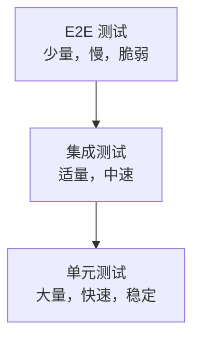

## 1. 测试金字塔

### 1.1 金字塔模型



| 层级     | 数量 | 速度 | 范围        | 目的           |
| :------- | :--- | :--- | :---------- | :------------- |
| 单元测试 | 70%  | 毫秒 | 单个函数/类 | 验证逻辑正确性 |
| 集成测试 | 20%  | 秒   | 模块交互    | 验证组件协作   |
| E2E测试  | 10%  | 分钟 | 完整流程    | 验证用户场景   |

## 2. 测试类型

### 2.1 按范围分类

| 类型     | 说明               | 示例                |
| :------- | :----------------- | :------------------ |
| 单元测试 | 测试最小可测试单元 | 函数、方法          |
| 集成测试 | 测试模块间交互     | API调用、数据库操作 |
| 系统测试 | 测试完整系统       | 端到端流程          |
| 验收测试 | 用户确认需求满足   | UAT                 |

### 2.2 按目的分类

| 类型       | 说明                 |
| :--------- | :------------------- |
| 功能测试   | 验证功能是否正确     |
| 性能测试   | 验证响应时间和吞吐量 |
| 安全测试   | 验证安全漏洞         |
| 兼容性测试 | 验证不同环境下的表现 |
| 回归测试   | 验证修改未引入新缺陷 |

### 2.3 按方法分类

| 类型     | 说明             | 特点               |
| :------- | :--------------- | :----------------- |
| 白盒测试 | 基于代码结构     | 路径覆盖、条件覆盖 |
| 黑盒测试 | 基于功能规格     | 等价类、边界值     |
| 灰盒测试 | 部分了解内部结构 | 结合黑白盒         |

## 3. TDD（测试驱动开发）

### 3.1 红-绿-重构循环

```
1.  红：写一个失败的测试
2.  绿：写最少的代码使测试通过
3.  重构：优化代码，保持测试通过
4. 重复1-3
```

### 3.2 TDD示例

```python
# 第1步：红 - 写失败测试
def test_add():
    assert add(2, 3) == 5  # NameError: add未定义

# 第2步：绿 - 最少代码通过
def add(a, b):
    return a + b

# 第3步：重构 - 优化（此处已足够简洁）

# 继续添加测试
def test_add_negative():
    assert add(-1, 1) == 0

def test_add_zero():
    assert add(0, 0) == 0
```

### 3.3 TDD原则

| 原则     | 说明                     |
| :------- | :----------------------- |
| 测试先行 | 先写测试再写代码         |
| 小步前进 | 每次只添加一个测试       |
| 最少代码 | 只写让测试通过的最少代码 |
| 持续重构 | 每次通过后立即重构       |

## 4. BDD（行为驱动开发）

### 4.1 BDD与TDD

| 维度     | TDD        | BDD            |
| :------- | :--------- | :------------- |
| 关注点   | 代码正确性 | 业务行为       |
| 语言     | 编程语言   | 自然语言       |
| 参与者   | 开发者     | 开发者+QA+业务 |
| 规格形式 | 测试函数   | 场景描述       |

### 4.2 Gherkin语法

```gherkin
Feature: 用户登录
  作为注册用户
  我希望登录系统
  以便访问我的账户

  Scenario: 成功登录
    Given 用户在登录页面
    And 用户输入正确的用户名和密码
    When 用户点击登录按钮
    Then 用户跳转到首页
    And 显示欢迎消息

  Scenario: 密码错误
    Given 用户在登录页面
    And 用户输入正确的用户名和错误的密码
    When 用户点击登录按钮
    Then 显示"密码错误"提示
    And 用户仍在登录页面
```

### 4.3 BDD工具

| 语言       | 工具         |
| :--------- | :----------- |
| Java       | Cucumber-JVM |
| Python     | Behave       |
| JavaScript | Cucumber.js  |
| .NET       | SpecFlow     |

## 5. 测试覆盖率

### 5.1 覆盖率类型

| 类型     | 说明                     |
| :------- | :----------------------- |
| 语句覆盖 | 每条语句至少执行一次     |
| 分支覆盖 | 每个分支至少执行一次     |
| 路径覆盖 | 每条可能路径至少执行一次 |
| 条件覆盖 | 每个条件的真假至少一次   |
| MC/DC    | 每个条件独立影响结果     |

### 5.2 覆盖率目标

| 场景         | 建议覆盖率 |
| :----------- | :--------- |
| 核心业务逻辑 | 90%+       |
| 通用工具类   | 80%+       |
| UI层         | 50%~70%    |
| 遗留代码     | 逐步提升   |

### 5.3 Mock与Stub

| 类型 | 说明         | 特点               |
| :--- | :----------- | :----------------- |
| Stub | 返回预设值   | 简单，不验证交互   |
| Mock | 验证交互行为 | 验证方法是否被调用 |
| Spy  | 记录调用信息 | 部分模拟           |
| Fake | 简化实现     | 如内存数据库       |

```python
from unittest.mock import Mock, patch

# Mock
db = Mock()
db.save.return_value = True
assert db.save({"name": "test"}) == True
db.save.assert_called_once()

# Patch
with patch('module.external_api') as mock_api:
    mock_api.return_value = {"status": "ok"}
    result = my_function()
```

## 参考文献

IEEE Software 期刊：https://www.computer.org/csdl/magazine/so
Martin Fowler 网站：https://martinfowler.com/
敏捷宣言：https://agilemanifesto.org/iso/zhchs/manifesto.html
12 因素应用：https://12factor.net/zh_cn/

## 延伸阅读

软件架构设计，见 038-software-architecture 模块。
工程实践（Git/CI），见 003-git/031-devops 模块。
测试工程，见 036-software-testing 模块。
黑马程序员 Bilibili 空间（https://space.bilibili.com/37974444 ）提供软件工程课程。

## 深度专题扩展

以下专题从不同角度深入本文主题，供有进阶需求的读者研读。每个专题独立成节，内容相互补充。

### 13.1 敏捷落地实践

Scrum：Sprint（1-4 周）、三会议（计划/每日站会/回顾）、三工件（Backlog/Sprint Backlog/增量）。
看板：可视化流程、WIP 限制、流动效率。
用户故事：As a / I want / so that + 验收标准。
常见失败：仪式化、缺乏自组织、需求仍大爆炸。

### 13.2 代码评审最佳实践

评审范围：小 PR（<400 行）、明确描述、自动化前置。
关注点：正确性、可读性、测试、边界、安全。
沟通：提问式评论、代码建议、避免人身化。
机制：必过门禁、多 Reviewer 轮换、评审 SLA。

## 模块文档速查表

| 文档 | 主题 | 与本文的关联 |
| --- | --- | --- |
| 软件工程概述 | 001-SoftwareEngineeringOverview | 本文的前置基础 |
| 敏捷开发 | 002-AgileDevelopment | 本文的并列主题 |
| 需求分析方法 | 003-RequirementAnalysisMethod | 本文的并列主题 |
| UML图详解 | 004-UMLGraphDetailed | 本文的并列主题 |
| 设计模式详解 | 005-DesignPatternDetailed | 本文的并列主题 |
| 代码重构 | 006-Refactoring | 本文的并列主题 |
| 软件测试方法 | 007-SoftwareTestMethod | 本文自身 |
| 软件度量 | 008-SoftwareMetrics | 本文的并列主题 |
| 技术债务管理 | 009-TechDebtManagement | 本文的并列主题 |
| DevOps与CICD集成 | 010-DevOpsCICDIntegration | 本文的并列主题 |
