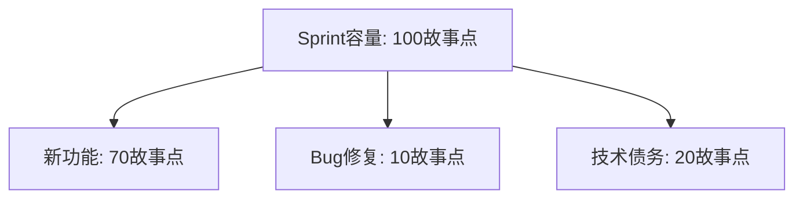

## 1. 技术债务概念

### 1.1 定义

技术债务是**为了短期利益而采取的次优技术决策**所累积的额外维护成本。

```
技术债务 = 快速交付的收益 - 长期维护的额外成本
```

### 1.2 债务分类

| 类型     | 说明               | 示例                   |
| :------- | :----------------- | :--------------------- |
| 有意债务 | 明确权衡后的选择   | 为了赶deadline跳过设计 |
| 无意债务 | 不了解最佳实践     | 不知SOLID原则而违反    |
| 鲁莽债务 | 知道不对但不管     | 明知该写测试但不写     |
| 谨慎债务 | 知道风险但有意为之 | 原型验证时快速实现     |

### 1.3 债务来源

| 来源     | 说明                 |
| :------- | :------------------- |
| 时间压力 | 赶进度牺牲质量       |
| 知识不足 | 不了解最佳实践       |
| 需求变更 | 原有设计不再适用     |
| 团队变动 | 人员流动导致知识丢失 |
| 技术演进 | 框架/库版本过时      |
| 缺乏重构 | 从不偿还债务         |

## 2. 技术债务识别

### 2.1 识别方法

| 方法       | 说明             | 工具              |
| :--------- | :--------------- | :---------------- |
| 静态分析   | 自动检测代码问题 | SonarQube、ESLint |
| 代码审查   | 人工发现设计问题 | PR Review         |
| 架构评审   | 评估架构合理性   | ADR               |
| 开发者调查 | 团队感知的痛点   | 问卷/访谈         |
| 缺陷分析   | 高频修改的模块   | Git热点分析       |

### 2.2 债务信号

| 信号                     | 含义         |
| :----------------------- | :----------- |
| 修改一个功能需改多个文件 | 高耦合       |
| 新人理解代码需要很长时间 | 可读性差     |
| 添加简单功能需要很长时间 | 设计不灵活   |
| 测试困难                 | 依赖过多     |
| 频繁出现回归Bug          | 缺乏测试覆盖 |

## 3. 技术债务量化

### 3.1 SQALE方法

SQALE（Software Quality Assessment based on Lifecycle Expectations）将技术债务量化为**修复时间**：

$$\text{TD} = \sum_{i=1}^{n} \text{RemediationTime}_i$$

| 质量特性 | 典型债务               |
| :------- | :--------------------- |
| 可测试性 | 缺少测试、依赖难以Mock |
| 可维护性 | 代码重复、圈复杂度高   |
| 可修改性 | 硬编码、紧耦合         |
| 可靠性   | 未处理异常、资源泄露   |
| 可移植性 | 平台依赖               |

### 3.2 债务比率

$$\text{债务比率} = \frac{\text{技术债务（修复时间）}}{\text{开发总投入（时间）}}$$

| 比率    | 等级 | 建议         |
| :------ | :--- | :----------- |
| <5%     | 优秀 | 保持         |
| 5%~10%  | 良好 | 定期偿还     |
| 10%~20% | 警告 | 需要专项偿还 |
| >20%    | 危险 | 立即行动     |

## 4. 偿还策略

### 4.1 偿还原则

| 原则       | 说明                     |
| :--------- | :----------------------- |
| 童子军规则 | 每次修改让代码比之前更好 |
| 渐进式偿还 | 小步持续改进             |
| ROI优先    | 先偿还收益最高的债务     |
| 与功能结合 | 新功能开发时顺便重构     |
| 定期专项   | 每Sprint分配20%时间      |

### 4.2 偿还计划

```
1. 盘点: 列出所有技术债务项
2. 评估: 每项的影响和修复成本
3. 排序: 按ROI排序
4. 计划: 分配到Sprint Backlog
5. 执行: 按计划偿还
6. 验证: 确认债务已消除
```

### 4.3 技术债务Backlog

| ID    | 描述                | 影响 | 修复成本 | ROI | 优先级 |
| :---- | :------------------ | :--- | :------- | :-- | :----- |
| TD-01 | 订单模块圈复杂度>30 | 高   | 3天      | 高  | P0     |
| TD-02 | 缺少单元测试        | 中   | 5天      | 中  | P1     |
| TD-03 | 日志框架版本过旧    | 低   | 1天      | 中  | P2     |

## 5. 预防机制

### 5.1 预防措施

| 措施         | 说明                   |
| :----------- | :--------------------- |
| 编码规范     | 统一代码风格和最佳实践 |
| 代码审查     | PR合并前必须审查       |
| 持续集成     | 自动化构建和测试       |
| 静态分析     | 自动检测代码问题       |
| 架构决策记录 | 记录设计决策和权衡     |
| 技术雷达     | 跟踪技术趋势和风险     |

### 5.2 债务预算

每个Sprint预留**固定比例**（如20%）的时间用于偿还技术债务：



## 参考文献


IEEE Software 期刊：https://www.computer.org/csdl/magazine/so
Martin Fowler 网站：https://martinfowler.com/
敏捷宣言：https://agilemanifesto.org/iso/zhchs/manifesto.html
12 因素应用：https://12factor.net/zh_cn/

## 延伸阅读


软件架构设计，见 038-software-architecture 模块。
工程实践（Git/CI），见 003-git/031-devops 模块。
测试工程，见 036-software-testing 模块。
黑马程序员 Bilibili 空间（https://space.bilibili.com/37974444 ）提供软件工程课程。

## 深度专题扩展


以下专题从不同角度深入本文主题，供有进阶需求的读者研读。每个专题独立成节，内容相互补充。

### 13.1 敏捷落地实践

Scrum：Sprint（1-4 周）、三会议（计划/每日站会/回顾）、三工件（Backlog/Sprint Backlog/增量）。
看板：可视化流程、WIP 限制、流动效率。
用户故事：As a / I want / so that + 验收标准。
常见失败：仪式化、缺乏自组织、需求仍大爆炸。

### 13.2 代码评审最佳实践

评审范围：小 PR（<400 行）、明确描述、自动化前置。
关注点：正确性、可读性、测试、边界、安全。
沟通：提问式评论、代码建议、避免人身化。
机制：必过门禁、多 Reviewer 轮换、评审 SLA。

## 模块文档速查表

| 文档 | 主题 | 与本文的关联 |
| --- | --- | --- |
| 软件工程概述 | 001-SoftwareEngineeringOverview | 本文的前置基础 |
| 敏捷开发 | 002-AgileDevelopment | 本文的并列主题 |
| 需求分析方法 | 003-RequirementAnalysisMethod | 本文的并列主题 |
| UML图详解 | 004-UMLGraphDetailed | 本文的并列主题 |
| 设计模式详解 | 005-DesignPatternDetailed | 本文的并列主题 |
| 代码重构 | 006-Refactoring | 本文的并列主题 |
| 软件测试方法 | 007-SoftwareTestMethod | 本文的并列主题 |
| 软件度量 | 008-SoftwareMetrics | 本文的并列主题 |
| 技术债务管理 | 009-TechDebtManagement | 本文自身 |
| DevOps与CICD集成 | 010-DevOpsCICDIntegration | 本文的并列主题 |
