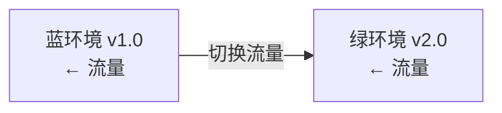
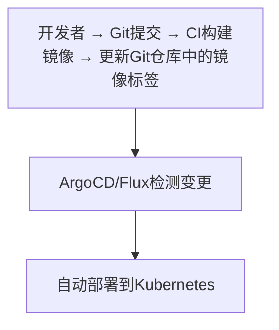

## 1. 从"两个部门打架"说起

### 1.1 传统模式的困境

在传统的软件开发中，开发（Dev）和运维（Ops）常常是"对立的两个部门"：

- **开发**：我的代码写完了，扔给运维部署。出问题？那一定是环境的问题。
- **运维**：这个版本又出 bug 了，肯定是代码的问题。系统稳定是最重要的，新版本少来。

两边互相甩锅、互相埋怨，结果：

- 发布一次要"审批+排期+备份+演练"，周期以"周"计算
- 上线后出问题，两边互相扯皮，找不到责任人
- 系统维护靠"人肉操作手册"，出了问题全靠值班人经验

### 1.2 DevOps 的解法

**DevOps 是"开发（Development）和运维（Operations）"的融合**，通过自动化和文化变革，让软件交付更快、更可靠。

**核心思想**：开发、测试、运维是一个**团队**，共同对"软件从代码到生产"负责——"你构建它，你运行它"（You build it, you run it）。

## 2. DevOps 的核心：CALMS 框架

| 维度 | 说明 |
| :--- | :--- |
| Culture | 共担责任、持续学习（打破部门墙） |
| Automation | 自动化一切可自动化的（减少人肉操作） |
| Lean | 消除浪费、小批量交付（缩短交付周期） |
| Measurement | 数据驱动决策（用数据说话） |
| Sharing | 知识和经验共享（文档即代码） |

**CALMS 是理解 DevOps 的五把钥匙**：文化是灵魂，自动化是手段，精益是方法，度量是依据，共享是保障。

### 2.1 DevOps 工具链

| 阶段 | 工具 |
| :--- | :--- |
| 计划 | Jira、Trello |
| 编码 | Git、VS Code |
| 构建 | Maven、Gradle、Webpack |
| 测试 | JUnit、Selenium、Jest |
| 发布 | Jenkins、GitHub Actions、GitLab CI |
| 部署 | Docker、Kubernetes、Ansible |
| 运维 | Prometheus、Grafana、ELK |
| 监控 | Datadog、New Relic |

## 3. CI/CD 流水线：DevOps 的"主动脉"

### 3.1 持续集成（CI）：让代码"天天合并"

```
代码提交 → 自动构建 → 自动测试 → 代码质量检查 → 反馈
```

**CI 原则**：

- 频繁提交（每天至少一次）——不要"憋大招"
- 自动化构建——提交即触发
- 自动化测试——测试是 CI 的核心
- 快速反馈（<10 分钟）——慢了就没人等结果了
- 主干开发——长期分支是 CI 的敌人

**CI 的价值**：每次提交都跑一遍"构建+测试"，让"代码坏了"在几分钟内暴露，而不是等到集成时才爆炸。

### 3.2 持续交付（CD）：一键发布到生产

```
CI通过 → 自动部署到Staging → 验收测试 → 人工批准 → 生产部署
```

### 3.3 持续部署：全自动发布

```
CI通过 → 自动部署到Staging → 自动测试 → 自动部署到生产
```

| 模式 | 生产部署 | 适用场景 |
| :--- | :--- | :--- |
| 持续集成 | 手动 | 早期团队 |
| 持续交付 | 人工批准 | 关键业务 |
| 持续部署 | 全自动 | SaaS 产品 |

**三者的区别**：CI 只管"构建+测试"；持续交付在 CI 之上加了"随时可发布"（但要人批准）；持续部署连"批准"都自动化了。

### 3.4 流水线示例（GitHub Actions）

```yaml
# GitHub Actions
name: CI/CD Pipeline
on:
  push:
    branches: [main]
  pull_request:
    branches: [main]

jobs:
  test:
    runs-on: ubuntu-latest
    steps:
      - uses: actions/checkout@v4
      - uses: actions/setup-node@v4
        with:
          node-version: '20'
      - run: npm ci
      - run: npm run lint
      - run: npm run test:unit
      - run: npm run test:integration

  build:
    needs: test
    runs-on: ubuntu-latest
    steps:
      - uses: actions/checkout@v4
      - run: docker build -t app:${{ github.sha }} .
      - run: docker push registry/app:${{ github.sha }}

  deploy:
    needs: build
    runs-on: ubuntu-latest
    if: github.ref == 'refs/heads/main'
    steps:
      - run: kubectl set image deployment/app app=registry/app:${{ github.sha }}
```

**流水线的"三段式"**：test（质量门禁）→ build（构建产物）→ deploy（部署上线），每段 `needs` 依赖上一段，形成清晰的责任链。

## 4. 发布策略：怎么上线才安全

### 4.1 五种发布模式

| 策略 | 说明 | 风险 | 回滚难度 |
| :--- | :--- | :--- | :--- |
| 大爆炸发布 | 一次性全量发布 | 高 | 难 |
| 蓝绿部署 | 两套环境切换 | 低 | 容易 |
| 金丝雀发布 | 逐步扩大发布比例 | 低 | 容易 |
| 滚动更新 | 逐个替换实例 | 中 | 中 |
| 特性开关 | 代码已部署，按需开启 | 低 | 容易 |

### 4.2 蓝绿部署



**原理**：同时维护两套环境（蓝=旧版、绿=新版）。新版在绿环境部署并验证后，把流量一次性切到绿环境。出问题？把流量切回蓝环境——**回滚就是"切一下流量"**。

### 4.3 金丝雀发布

```
v1.0 ← 95%流量
v2.0 ← 5%流量  → 观察 → 10% → 25% → 50% → 100%
```

**原理**：先让新版接收 5% 的流量（金丝雀），观察监控指标；没问题就逐步扩大比例，直到 100%。

**监控指标**：错误率、延迟（P50/P95/P99）、CPU/内存使用率、业务指标。

### 4.4 特性开关（Feature Flag）

**原理**：代码已经部署到生产，但功能默认关闭；通过配置开关按需开启。**发布代码 ≠ 上线功能**——代码随时可部署，功能按需放量。

## 5. 质量门禁：流水线的"关卡"

### 5.1 CI 质量门禁

| 检查项 | 阈值 | 说明 |
| :--- | :--- | :--- |
| 单元测试通过率 | 100% | 零容忍 |
| 测试覆盖率 | ≥80% | 最低标准 |
| 代码规范 | 0 error | Lint 检查 |
| 安全扫描 | 0 高危 | SAST 检查 |
| 构建时间 | <10min | 快速反馈 |

### 5.2 CD 质量门禁

| 检查项 | 说明 |
| :--- | :--- |
| 集成测试通过 | 全部通过 |
| 性能测试 | 响应时间达标 |
| 安全扫描 | 无高危漏洞 |
| 人工审批 | 关键环境需审批 |

**质量门禁的意义**：把"质量检查"自动化地嵌入流水线——**不达标的代码进不了下一步**，从流程上保证质量（见 039-engineering-practices《工程实践概述》）。

## 6. GitOps：用 Git 管理基础设施

### 6.1 核心原则

1. **声明式**：系统状态用声明式描述（"系统应该是这样"）
2. **版本控制**：所有变更通过 Git（包括基础设施配置）
3. **自动拉取**：系统自动应用 Git 中的状态
4. **持续协调**：软件代理持续对比"期望状态"和"实际状态"

### 6.2 GitOps 工作流



**GitOps 的价值**：基础设施和应用的变更**都在 Git 里、都可审查、都可回滚**——"Git 是唯一的事实来源"。出问题？回滚到上一个 Git 提交即可。

## 7. 常见误区

**误区一：DevOps = 用一些自动化工具。** → 工具只是手段。**DevOps 首先是文化变革**（开发运维共担责任），没有文化变革，工具只是摆设。

**误区二：CI/CD 建完就一劳永逸。** → 流水线需要持续维护（脚本更新、门禁调整、速度优化）。它是"活系统"，不是"一次建好的雕像"。

**误区三：持续部署 = 每天发布很多次。** → 发布频率取决于业务。持续部署解决的是"发布不难、随时可发"，而不是"必须多发"。

**误区四：蓝绿部署就是万能的。** → 蓝绿需要两套完整环境（成本翻倍），且数据库结构变更时切换复杂。**金丝雀发布**更适合大多数场景。

**误区五：质量门禁越多越好。** → 门禁太多（几十个检查）会让流水线慢、团队烦。**少而关键**的门禁（5-8 个）才有效。

## 10. 延伸阅读

- DevOps 的监控与 SLO，见 039-engineering-practices《On-Call最佳实践》
- 流水线中的测试，见本模块《软件测试方法》
- 流水线的度量，见本模块《软件度量》
- 云原生部署，见 034-cloud-computing 模块

> **一句话记忆**：DevOps 是"开发运维一条心"的文化+自动化——用 CI（天天合并）、CD（随时可发）、发布策略（蓝绿/金丝雀）、质量门禁（自动化关卡）和 GitOps（Git 管一切），把"发布靠人肉"变成"发布靠流水线"。
