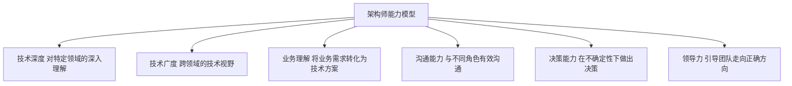
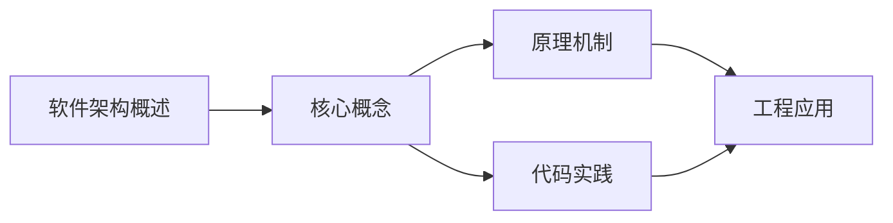
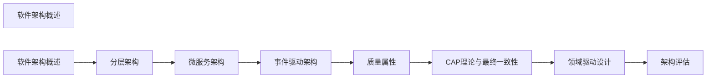

## 1. 学习目标（Bloom 分类）

本节按照布鲁姆教育目标分类学组织学习路径。本文主题为《软件架构概述》，属于 软件架构 模块，读者可以根据自身阶段选择阅读深度。

记忆层面：能够准确复述本文的核心概念、术语与基本语法或操作步骤，并能够在提问或检索时快速定位对应知识点。能够说出 软件架构 的核心概念、常用命令与流程。

理解层面：能够用自己的语言解释核心原理与工作机制，说明概念之间的因果关系，而不是机械记忆结论。能够解释 软件架构 的工作原理与设计动机。

应用层面：能够在真实项目或练习场景中运用本文知识解决具体问题，写出正确且可维护的实现。能够独立完成 软件架构 的标准操作。

分析层面：能够拆解复杂问题，比较本文主题与相邻概念的异同，识别边界条件与例外情况。能够分析 软件架构 使用中的异常与边界。

评价层面：能够根据约束条件（性能、可读性、安全、成本）评价不同方案的优劣，做出有依据的技术决策。能够评价 软件架构 相关工具与方案。

创造层面：能够把本文知识与其他模块知识组合，设计出新的解决方案或可复用的工程模式。能够把 软件架构 融入团队工作流。

通过本节学习，读者应当能够把《软件架构概述》纳入自己的知识网络，并与 软件架构 模块的其他主题（架构风格、设计原则、微服务、演进）建立关联。

## 2. 历史动机与发展脉络

《软件架构概述》是 软件架构 领域的重要主题。要真正理解它，需要先了解它解决的问题与演进过程。

软件架构是系统的“骨架决策”：组件划分、交互方式、非功能属性（性能、安全、可维护性）；架构师职责是权衡与演进。
架构风格演进：单体 -> 分层 -> SOA -> 微服务 -> 云原生（网格/Serverless）；没有银弹，风格是权衡。
方法论：4+1 视图（逻辑/开发/进程/物理+场景）、C4 模型（Context/Container/Component/Code）、ADR 记录决策。

回到本文主题：软件架构概述 的提出与成熟，正是上述技术背景下的必然产物。早期实现往往以简单可用为目标，随着工程规模扩大，社区逐渐沉淀出标准做法与最佳实践；理解这一脉络，可以帮助读者判断“为什么文档中的推荐写法是现在这个样子”，也能在遇到历史遗留代码时准确识别其设计年代与取舍。


## 3. 形式化定义与核心概念精讲

本节把《软件架构概述》涉及的核心概念以“定义 + 讲解”的形式展开。读者应把定义当作工具，把讲解当作理解路径；两者结合才能形成可迁移的知识。

质量属性：可用性、性能、安全、可修改性、可测试性、可部署性；架构通过战术实现属性（冗余、缓存、隔离）。
分层与依赖：依赖方向向内（domain 为核心）；端口适配器（六边形）隔离外部。
模块化：模块边界、接口契约、依赖管理（DDD 限界上下文）。

### 3.1 原文章节逐一精讲

原文档把主题拆分为 10 个小节，下面按顺序给出每一节的导读讲解，随后保留原文细节供精读。

#### 原文精读（完整保留）


#### 1. 软件架构定义

##### 1.1 什么是软件架构

软件架构是系统的**高层设计决策**，包括组织结构、行为模式、核心组件及其交互关系。

> "Architecture is the decisions that you wish you could get right early in a project." — Ralph Johnson

##### 1.2 架构与设计的区别

| 维度     | 架构           | 设计         |
| :------- | :------------- | :----------- |
| 抽象层次 | 系统级         | 模块级       |
| 关注点   | 全局约束和决策 | 局部实现细节 |
| 变更成本 | 极高           | 较低         |
| 影响范围 | 整个系统       | 单个模块     |
| 决策者   | 架构师         | 开发者       |

##### 1.3 架构的核心要素

| 要素   | 说明                   |
| :----- | :--------------------- |
| 组件   | 系统的构建块           |
| 连接器 | 组件间的交互机制       |
| 约束   | 组件和连接器的使用规则 |
| 配置   | 组件和连接器的组合方式 |

#### 2. 架构师角色

##### 2.1 架构师职责

| 职责     | 说明                 |
| :------- | :------------------- |
| 技术决策 | 选择技术栈和架构风格 |
| 质量保障 | 确保系统满足质量属性 |
| 风险管理 | 识别和缓解技术风险   |
| 沟通桥梁 | 连接业务和技术团队   |
| 技术指导 | 制定技术标准和规范   |
| 知识传承 | 培养团队技术能力     |

##### 2.2 架构师能力模型



#### 3. 架构决策

##### 3.1 架构决策记录（ADR）

```markdown
# ADR-001: 选择微服务架构

#### 状态

已接受

#### 背景

单体应用已无法满足业务快速增长的需求，团队规模扩大后协作效率下降。

#### 决策

采用微服务架构，按业务域拆分服务。

#### 理由

1. 独立部署：各服务可独立发布
2. 技术异构：各服务可选择合适技术栈
3. 团队自治：每个团队负责自己的服务
4. 弹性伸缩：按需扩展高负载服务

#### 后果

- 增加运维复杂度
- 需要服务发现和API网关
- 分布式事务处理更复杂
- 需要更完善的监控体系
```

##### 3.2 决策原则

| 原则       | 说明                       |
| :--------- | :------------------------- |
| 延迟决策   | 在必须决策时再做决定       |
| 可逆性优先 | 优先选择可逆的决策         |
| 证据驱动   | 基于数据而非直觉           |
| 最简可行   | 选择最简单的可行方案       |
| 适度设计   | 满足当前需求，预留扩展空间 |

#### 4. 架构文档

##### 4.1 C4模型

| 层级    | 视图         | 受众          | 关注点           |
| :------ | :----------- | :------------ | :--------------- |
| Level 1 | 系统上下文图 | 所有人        | 系统与外部的关系 |
| Level 2 | 容器图       | 开发者/架构师 | 系统内部的容器   |
| Level 3 | 组件图       | 开发者        | 容器内部的组件   |
| Level 4 | 代码图       | 开发者        | 组件内部的类     |

##### 4.2 架构视图

| 视图     | 说明       | 关注点   |
| :------- | :--------- | :------- |
| 逻辑视图 | 功能分解   | 终端用户 |
| 进程视图 | 并发和同步 | 集成者   |
| 开发视图 | 代码组织   | 程序员   |
| 物理视图 | 部署拓扑   | 运维人员 |

#### 5. 架构反模式

| 反模式        | 症状                 | 解决方案             |
| :------------ | :------------------- | :------------------- |
| 大泥球        | 无清晰架构，代码纠缠 | 逐步重构，引入分层   |
| 过度工程      | 架构过于复杂         | YAGNI，简化设计      |
| 复制-粘贴架构 | 多个服务结构完全相同 | 提取共享库/平台      |
| 供应商锁定    | 过度依赖特定技术     | 抽象层、多供应商策略 |
| 架构黑洞      | 架构决策不落地       | ADR + 代码审查       |


### 3.2 概念关系图

下面用 Mermaid 图表达本文核心概念之间的关系，帮助读者建立整体图景：



图中展示的是本文知识的结构化关系：核心概念是入口，原理机制解释“为什么”，代码实践演示“怎么做”，工程应用回答“何时用”。读者学习时可以把每个小节的内容挂接到对应节点上。

## 4. 理论推导与原理解析

本节深入《软件架构概述》背后的原理。理论部分不求面面俱到，而是聚焦“能解释现象、能指导实践”的关键推导。

质量属性：可用性、性能、安全、可修改性、可测试性、可部署性；架构通过战术实现属性（冗余、缓存、隔离）。
分层与依赖：依赖方向向内（domain 为核心）；端口适配器（六边形）隔离外部。
模块化：模块边界、接口契约、依赖管理（DDD 限界上下文）。
分布式架构：服务发现、负载均衡、熔断/限流/降级、分布式事务（Saga/Outbox）。

需要强调的是，理论推导与工程实践之间存在翻译层：理论给出的是理想化模型与边界条件，工程代码则必须处理真实环境中的例外。读者在学习时应先掌握理论的“标准情形”，再通过陷阱章节了解“非标准情形”。

## 5. 代码示例与逐行讲解

本节把原文中的代码示例系统整理，并为每个示例补充用途说明与讲解。读者不应只浏览代码，而应逐段对照讲解理解设计意图。

### 5.1 示例：2.2 架构师能力模型

该示例来自原文《2.2 架构师能力模型》小节，用于演示软件架构概述相关操作。阅读时请先看代码结构，再看其后的讲解。


讲解：这段代码演示了本节核心知识点。代码中的关键操作可以归纳为三步：准备（定义或初始化）、执行（核心逻辑）、收尾（释放资源或返回结果）。实际项目中，这三步往往被封装为函数或类，以提升复用性与可测试性。

关键点分析：

该示例共 8 行有效代码，结构以数据或配置为主。阅读时应关注：数据字段的含义、配置项的作用，以及它们与运行行为的对应关系。

进阶思考路径：先尝试修改参数观察行为变化，再把示例中的模式迁移到自己的项目中；每次修改都记录预期与实测差异，这是把示例转化为能力的最快方式。

### 5.2 示例：3.1 架构决策记录（ADR）

该示例来自原文《3.1 架构决策记录（ADR）》小节，用于演示软件架构概述相关操作。阅读时请先看代码结构，再看其后的讲解。

```markdown
# ADR-001: 选择微服务架构

## 状态

已接受

## 背景

单体应用已无法满足业务快速增长的需求，团队规模扩大后协作效率下降。

## 决策

采用微服务架构，按业务域拆分服务。

## 理由

1. 独立部署：各服务可独立发布
2. 技术异构：各服务可选择合适技术栈
3. 团队自治：每个团队负责自己的服务
4. 弹性伸缩：按需扩展高负载服务

## 后果

- 增加运维复杂度
- 需要服务发现和API网关
- 分布式事务处理更复杂
- 需要更完善的监控体系
```

讲解：这段代码演示了本节核心知识点。代码中的关键操作可以归纳为三步：准备（定义或初始化）、执行（核心逻辑）、收尾（释放资源或返回结果）。实际项目中，这三步往往被封装为函数或类，以提升复用性与可测试性。

关键点分析：

该示例共 17 行有效代码，结构以数据或配置为主。阅读时应关注：数据字段的含义、配置项的作用，以及它们与运行行为的对应关系。

进阶思考路径：先尝试修改参数观察行为变化，再把示例中的模式迁移到自己的项目中；每次修改都记录预期与实测差异，这是把示例转化为能力的最快方式。


综合以上示例，可以总结出本主题的代码实践要点：第一，先定义清晰的输入输出契约；第二，核心逻辑保持单一职责；第三，错误处理与边界条件不可省略；第四，命名与注释表达意图而非复述代码。

## 6. 对比分析

对比是理解《软件架构概述》定位的最快路径。下面从多个维度与相邻方案进行对比。

单体与微服务：单体开发运维简单；微服务独立扩展与团队自治。
同步与异步：REST 简单直观；消息队列解耦与削峰。
分层与六边形：分层通用；六边形强化领域与外部隔离。

对比的目的不是分出绝对优劣，而是建立选择依据：不同约束条件下，最优解不同。读者应把每个对比维度转化为决策检查清单。

## 7. 常见陷阱与最佳实践

本节整理该主题的高频错误与推荐做法。每个陷阱先描述现象，再解释原因，最后给出最佳实践。

### 7.1 过度设计

为不存在的规模上微服务。从单体/模块化单体开始。

深入讲解：该问题之所以被归类为“常见陷阱”，是因为它在初学者的代码中反复出现，而且往往不在第一时间暴露——错误通常隐藏在特定数据或特定时序下。

从成因上看，过度设计 一般源于对 软件架构 某个机制的理解偏差：要么误用了默认行为，要么忽略了边界条件，要么把其他语言的思维惯性带了过来。

从影响上看，过度设计 轻则产生错误结果，重则导致资源泄漏、数据损坏或安全事故；这也是为什么工程评审中会把它列为检查项。

从修复策略上看，处理过度设计的正确顺序是：先复现（构造最小用例），再定位（确认机制层面的根因），最后修复并补充回归测试。跳过复现直接改代码，往往治标不治本。

### 7.2 分布式谬误

假设网络可靠、延迟为零。设计超时、重试与幂等。

深入讲解：该问题之所以被归类为“常见陷阱”，是因为它在初学者的代码中反复出现，而且往往不在第一时间暴露——错误通常隐藏在特定数据或特定时序下。

从成因上看，分布式谬误 一般源于对 软件架构 某个机制的理解偏差：要么误用了默认行为，要么忽略了边界条件，要么把其他语言的思维惯性带了过来。

从影响上看，分布式谬误 轻则产生错误结果，重则导致资源泄漏、数据损坏或安全事故；这也是为什么工程评审中会把它列为检查项。

从修复策略上看，处理分布式谬误的正确顺序是：先复现（构造最小用例），再定位（确认机制层面的根因），最后修复并补充回归测试。跳过复现直接改代码，往往治标不治本。

### 7.3 耦合外部实现

数据库/框架泄漏到领域层。依赖倒置。

深入讲解：该问题之所以被归类为“常见陷阱”，是因为它在初学者的代码中反复出现，而且往往不在第一时间暴露——错误通常隐藏在特定数据或特定时序下。

从成因上看，耦合外部实现 一般源于对 软件架构 某个机制的理解偏差：要么误用了默认行为，要么忽略了边界条件，要么把其他语言的思维惯性带了过来。

从影响上看，耦合外部实现 轻则产生错误结果，重则导致资源泄漏、数据损坏或安全事故；这也是为什么工程评审中会把它列为检查项。

从修复策略上看，处理耦合外部实现的正确顺序是：先复现（构造最小用例），再定位（确认机制层面的根因），最后修复并补充回归测试。跳过复现直接改代码，往往治标不治本。

### 7.4 无架构决策记录

决策失忆。ADR 随决策落地。

深入讲解：该问题之所以被归类为“常见陷阱”，是因为它在初学者的代码中反复出现，而且往往不在第一时间暴露——错误通常隐藏在特定数据或特定时序下。

从成因上看，无架构决策记录 一般源于对 软件架构 某个机制的理解偏差：要么误用了默认行为，要么忽略了边界条件，要么把其他语言的思维惯性带了过来。

从影响上看，无架构决策记录 轻则产生错误结果，重则导致资源泄漏、数据损坏或安全事故；这也是为什么工程评审中会把它列为检查项。

从修复策略上看，处理无架构决策记录的正确顺序是：先复现（构造最小用例），再定位（确认机制层面的根因），最后修复并补充回归测试。跳过复现直接改代码，往往治标不治本。

### 7.5 忽略非功能

上线后性能安全翻车。早期架构评审。

深入讲解：该问题之所以被归类为“常见陷阱”，是因为它在初学者的代码中反复出现，而且往往不在第一时间暴露——错误通常隐藏在特定数据或特定时序下。

从成因上看，忽略非功能 一般源于对 软件架构 某个机制的理解偏差：要么误用了默认行为，要么忽略了边界条件，要么把其他语言的思维惯性带了过来。

从影响上看，忽略非功能 轻则产生错误结果，重则导致资源泄漏、数据损坏或安全事故；这也是为什么工程评审中会把它列为检查项。

从修复策略上看，处理忽略非功能的正确顺序是：先复现（构造最小用例），再定位（确认机制层面的根因），最后修复并补充回归测试。跳过复现直接改代码，往往治标不治本。

### 7.6 上帝服务

一个服务包罗万象。按业务能力拆分。

深入讲解：该问题之所以被归类为“常见陷阱”，是因为它在初学者的代码中反复出现，而且往往不在第一时间暴露——错误通常隐藏在特定数据或特定时序下。

从成因上看，上帝服务 一般源于对 软件架构 某个机制的理解偏差：要么误用了默认行为，要么忽略了边界条件，要么把其他语言的思维惯性带了过来。

从影响上看，上帝服务 轻则产生错误结果，重则导致资源泄漏、数据损坏或安全事故；这也是为什么工程评审中会把它列为检查项。

从修复策略上看，处理上帝服务的正确顺序是：先复现（构造最小用例），再定位（确认机制层面的根因），最后修复并补充回归测试。跳过复现直接改代码，往往治标不治本。

### 7.7 分布式事务硬做

强一致分布式事务复杂。Saga/最终一致。

深入讲解：该问题之所以被归类为“常见陷阱”，是因为它在初学者的代码中反复出现，而且往往不在第一时间暴露——错误通常隐藏在特定数据或特定时序下。

从成因上看，分布式事务硬做 一般源于对 软件架构 某个机制的理解偏差：要么误用了默认行为，要么忽略了边界条件，要么把其他语言的思维惯性带了过来。

从影响上看，分布式事务硬做 轻则产生错误结果，重则导致资源泄漏、数据损坏或安全事故；这也是为什么工程评审中会把它列为检查项。

从修复策略上看，处理分布式事务硬做的正确顺序是：先复现（构造最小用例），再定位（确认机制层面的根因），最后修复并补充回归测试。跳过复现直接改代码，往往治标不治本。

### 7.8 没有演进路径

架构僵化。预留替换点与兼容层。

深入讲解：该问题之所以被归类为“常见陷阱”，是因为它在初学者的代码中反复出现，而且往往不在第一时间暴露——错误通常隐藏在特定数据或特定时序下。

从成因上看，没有演进路径 一般源于对 软件架构 某个机制的理解偏差：要么误用了默认行为，要么忽略了边界条件，要么把其他语言的思维惯性带了过来。

从影响上看，没有演进路径 轻则产生错误结果，重则导致资源泄漏、数据损坏或安全事故；这也是为什么工程评审中会把它列为检查项。

从修复策略上看，处理没有演进路径的正确顺序是：先复现（构造最小用例），再定位（确认机制层面的根因），最后修复并补充回归测试。跳过复现直接改代码，往往治标不治本。

### 7.0 最佳实践总览

1. 先质量属性后结构：用场景驱动架构。
2. 接口即契约：版本化、兼容演进。
3. 简单优先：最简架构满足需求，再按证据演进。
4. 架构评审：变更影响评估 + 定期健康检查。

把这些最佳实践固化为团队规范与代码评审检查项，是避免同类问题反复出现的关键。

## 8. 工程实践

本节把《软件架构概述》放入真实工程场景，给出可复用的模式与组织方法。

架构文档：C4 图 + ADR + 质量属性场景。
治理：架构适应度函数（自动化检查）、依赖约束（ArchUnit）。
演进：绞杀者模式（渐进替换）、 strangler fig。

### 8.1 工程实践的原则拆解

以上工程实践可以归纳为四条原则。第一，配置与代码分离：软件架构 项目中环境差异应通过配置注入，而不是散落在代码分支中；这保证同一份代码可以在开发、测试、生产环境一致运行。

第二，接口稳定优先：对外接口（函数签名、协议、数据格式）一旦被消费方依赖，变更成本极高；设计时应预留扩展点并保持向后兼容。

第三，可观测性内置：日志、指标与追踪应该在功能开发时同步设计，而不是故障发生后补救；没有观测手段的模块等于黑盒。

第四，变更可回滚：任何发布都应有对应的回滚方案；数据库迁移、配置变更与代码发布一样需要版本管理与逆向路径。

### 8.2 实践落地的检查清单

- [ ] 架构文档：对照本节描述，检查当前项目是否已经落实；未落实的项列入技术债并排期处理。
- [ ] 治理：对照本节描述，检查当前项目是否已经落实；未落实的项列入技术债并排期处理。
- [ ] 演进：对照本节描述，检查当前项目是否已经落实；未落实的项列入技术债并排期处理。

工程实践的共性原则：配置与代码分离、接口稳定优先、可观测性内置、变更可回滚。这些原则适用于本主题的所有实现。

## 9. 案例研究

本节通过一个完整案例把《软件架构概述》的知识串起来。案例按“需求分析、方案设计、实现、验证”四步展开。

需求：设计订单系统的目标架构。
方案：模块化单体起步，订单/库存/支付为模块；事件驱动解耦。
要点：限界上下文、领域事件、最终一致。
验证：架构适应度测试、故障演练、演进评审。

### 9.1 案例的扩展讨论

把案例中的方案放大到真实规模，需要额外考虑三个问题：

第一，规模：当数据量或并发量上升一个数量级时，原方案中的数据结构、缓存策略与任务调度是否仍然成立？通常需要引入分层与异步。

第二，团队：多人协作时，模块边界、接口契约与代码所有权必须明确；案例中的实现应拆分为可独立测试的单元，并配合文档说明设计意图。

第三，演进：上线后的需求变化不可避免；方案设计时应预留扩展点（配置化、插件化、事件化），并定期用真实指标验证假设。


案例研究的学习方法：先独立阅读需求，尝试在脑中形成方案，再对照实现与讲解，最后思考“如果约束变化（数据量、并发、团队规模），方案应如何调整”。

## 10. 知识要点总结与深入讲解

本节以讲解形式汇总全文要点，替代传统的习题与自测，读者不需要答题，只需跟随解释建立完整的认知框架。

关于《软件架构概述》的核心结论：

架构是权衡的艺术：每个决策都有代价。
质量属性驱动结构，演进能力是核心。
文档化决策（ADR）让架构可传承。

原文档各小节的要点回顾：

- 1. 软件架构定义：该小节围绕软件架构概述展开具体细节，阅读时应关注其与核心结论的对应关系；每个小节都是核心结论在某一个侧面的展开。
- 2. 架构师角色：该小节围绕软件架构概述展开具体细节，阅读时应关注其与核心结论的对应关系；每个小节都是核心结论在某一个侧面的展开。
- 3. 架构决策：该小节围绕软件架构概述展开具体细节，阅读时应关注其与核心结论的对应关系；每个小节都是核心结论在某一个侧面的展开。
- 状态：该小节围绕软件架构概述展开具体细节，阅读时应关注其与核心结论的对应关系；每个小节都是核心结论在某一个侧面的展开。
- 背景：该小节围绕软件架构概述展开具体细节，阅读时应关注其与核心结论的对应关系；每个小节都是核心结论在某一个侧面的展开。
- 决策：该小节围绕软件架构概述展开具体细节，阅读时应关注其与核心结论的对应关系；每个小节都是核心结论在某一个侧面的展开。
- 理由：该小节围绕软件架构概述展开具体细节，阅读时应关注其与核心结论的对应关系；每个小节都是核心结论在某一个侧面的展开。
- 后果：该小节围绕软件架构概述展开具体细节，阅读时应关注其与核心结论的对应关系；每个小节都是核心结论在某一个侧面的展开。
- 4. 架构文档：该小节围绕软件架构概述展开具体细节，阅读时应关注其与核心结论的对应关系；每个小节都是核心结论在某一个侧面的展开。
- 5. 架构反模式：该小节围绕软件架构概述展开具体细节，阅读时应关注其与核心结论的对应关系；每个小节都是核心结论在某一个侧面的展开。

把以上要点与第 3-9 节的内容对照复习，即可完成对本文主题的闭环学习。

## 11. 参考文献


SEI 架构定义：https://www.sei.cmu.edu/architecture/
C4 模型：https://c4model.com/
Martin Fowler 微服务：https://martinfowler.com/articles/microservices.html
DDD 社区：https://www.dddcommunity.org/

## 12. 延伸阅读


架构模式与案例，见 038-software-architecture 模块文档。
云原生架构，见 034-cloud-computing 模块。
软件工程方法，见 037-software-engineering 模块。
尚硅谷 Bilibili 空间（https://space.bilibili.com/302417610 ）提供架构课程。

## 14. 模块知识图谱与学习路径

本文属于 软件架构 模块。为了把《软件架构概述》放入完整的知识网络，下面列出本模块的全部主题并给出相互关联的导读。学习时建议按模块内顺序推进，并在每个文档中留意交叉引用。



上图为模块主题的推荐学习顺序示意图（仅展示前若干主题）。各主题之间存在三类关联：

第一，前置依赖关系：早期主题是后期主题的基础，例如环境与语法先行、进阶主题随后；

第二，横向并列关系：同一层级主题从不同角度覆盖模块能力，学习顺序可以按兴趣调整；

第三，工程组合关系：多个主题在真实项目中组合使用，例如配置、性能与安全主题往往出现在同一系统的不同层面。

### 14.1 模块主题速查表

| 文档 | 主题 | 与本文的关联 |
| --- | --- | --- |
| 软件架构概述 | 001-SoftwareArchitectureOverview | 本文自身 |
| 分层架构 | 002-LayeredArchitecture | 本文的原理深化 |
| 微服务架构 | 003-MicroserviceArchitecture | 本文的原理深化 |
| 事件驱动架构 | 004-EventDrivenArchitecture | 本文的原理深化 |
| 质量属性 | 005-QualityAttribute | 本文的并列主题 |
| CAP理论与最终一致性 | 006-CAP | 本文的并列主题 |
| 领域驱动设计 | 007-DDD | 本文的并列主题 |
| 架构评估 | 008-ArchitectureEvaluation | 本文的原理深化 |

速查表的作用是让读者快速判断：哪些文档应在阅读本文前掌握（前置基础），哪些文档应在阅读本文后继续（延伸主题）。本模块的交叉引用体系即以此表为基础。

## 15. 术语表

下表整理《软件架构概述》及 软件架构 模块中出现的高频术语，给出简明释义。术语按字母序或逻辑序排列，供查阅。

| 术语 | 释义 |
| --- | --- |
| 质量属性 | 可用性、性能、安全、可修改性、可测试性、可部署性；架构通过战术实现属性（冗余、缓存、隔离）。 |
| 分层与依赖 | 依赖方向向内（domain 为核心）；端口适配器（六边形）隔离外部。 |
| 模块化 | 模块边界、接口契约、依赖管理（DDD 限界上下文）。 |
| 分布式架构 | 服务发现、负载均衡、熔断/限流/降级、分布式事务（Saga/Outbox）。 |
| 过度设计（易错点） | 参见常见陷阱章节的详细讲解 |
| 分布式谬误（易错点） | 参见常见陷阱章节的详细讲解 |
| 耦合外部实现（易错点） | 参见常见陷阱章节的详细讲解 |
| 无架构决策记录（易错点） | 参见常见陷阱章节的详细讲解 |
| 忽略非功能（易错点） | 参见常见陷阱章节的详细讲解 |
| 上帝服务（易错点） | 参见常见陷阱章节的详细讲解 |

术语表与正文配合使用：先通读正文，遇到模糊术语回查本表；长期使用后术语会自然进入工作记忆。

## 13. 深度专题扩展

以下专题从不同角度深入本文主题，供有进阶需求的读者研读。每个专题独立成节，内容相互补充。

### 13.1 微服务拆分方法论

拆分依据：业务能力、子域（DDD）、团队结构（康威定律）、变更频率与扩展需求。
拆分陷阱：分布式事务、跨服务查询、版本兼容。
配套：API 网关、服务网格、可观测性、契约测试。
演进：模块化单体 -> 按需抽取服务，避免一次性大爆炸。

### 13.2 架构决策记录（ADR）

ADR 结构：背景（Context）、决策（Decision）、后果（Consequences）。
时机：每次重大技术选择记录；轻量 Markdown 入库。
价值：新成员快速理解、避免重复争论、审计轨迹。
维护：决策被推翻时新增 ADR 而非修改历史。

## 16. 核心概念串讲（复习视角）

本节以“把知识讲给他人听”的方式，把《软件架构概述》的核心概念重新串讲一遍。与前文按章节展开不同，这里的叙述更接近课堂总结：先说整体，再逐个展开，最后收束。

《软件架构概述》属于 软件架构 模块。要理解它，先要理解它在模块中的位置：它解决的是该领域的一个具体问题，并依赖模块内若干前置概念；反过来，它又为后续进阶主题提供基础。

第一个概念是质量属性。可用性、性能、安全、可修改性、可测试性、可部署性；架构通过战术实现属性（冗余、缓存、隔离）。

在实际使用中，质量属性需要与相邻概念区分：它们的区别不在于名称，而在于适用条件与行为边界；这正是前文对比分析章节的意义。

第一个概念是分层与依赖。依赖方向向内（domain 为核心）；端口适配器（六边形）隔离外部。

在实际使用中，分层与依赖需要与相邻概念区分：它们的区别不在于名称，而在于适用条件与行为边界；这正是前文对比分析章节的意义。

第一个概念是模块化。模块边界、接口契约、依赖管理（DDD 限界上下文）。

在实际使用中，模块化需要与相邻概念区分：它们的区别不在于名称，而在于适用条件与行为边界；这正是前文对比分析章节的意义。

接下来是质量属性。可用性、性能、安全、可修改性、可测试性、可部署性；架构通过战术实现属性（冗余、缓存、隔离）。

理解该原理的关键不是记住结论，而是记住“它从什么假设出发、推出了什么、假设不成立时会怎样”。带着这个框架复习，原理之间就会连成网络。

接下来是分层与依赖。依赖方向向内（domain 为核心）；端口适配器（六边形）隔离外部。

理解该原理的关键不是记住结论，而是记住“它从什么假设出发、推出了什么、假设不成立时会怎样”。带着这个框架复习，原理之间就会连成网络。

接下来是模块化。模块边界、接口契约、依赖管理（DDD 限界上下文）。

理解该原理的关键不是记住结论，而是记住“它从什么假设出发、推出了什么、假设不成立时会怎样”。带着这个框架复习，原理之间就会连成网络。

接下来是分布式架构。服务发现、负载均衡、熔断/限流/降级、分布式事务（Saga/Outbox）。

理解该原理的关键不是记住结论，而是记住“它从什么假设出发、推出了什么、假设不成立时会怎样”。带着这个框架复习，原理之间就会连成网络。

串讲收束：把概念与原理放回本文主题，可以得出一个总纲——定义描述是什么，原理解释为什么，实践回答怎么做。三者构成完整的学习闭环；后续遇到相关问题，都可以按这个总纲检索知识。
