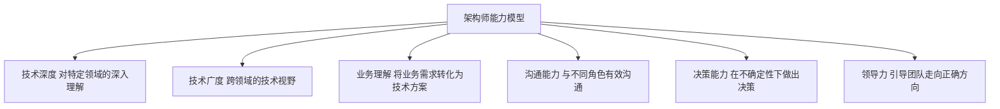

## 0. 零基础入门（从零开始）

### 0.1 零基础起点

本模块讲解软件架构，建议先读完 037 软件工程模块再学习，但零基础也可开始。不需要写代码，重点在“设计思维”。
架构的直觉：盖房子前先画图纸，确定承重墙、水电走向和房间分布；软件架构就是在写代码前确定系统的“骨架”——分几个模块、模块之间怎么通信、数据存在哪里。

### 0.2 第一个架构决策：为外卖系统选择模块划分

```text
需求：一个外卖平台，需要支持用户下单、商家接单、骑手配送、支付结算。

方案 A（单体）：一个程序包含全部功能
方案 B（模块化单体）：一个程序，但内部按业务分成清晰的模块
方案 C（微服务）：四个功能各自独立部署，通过网络通信
```

这是一个典型的架构选择题：不是选“最先进的”，而是选“最合适的”。
方案 A 最简单，适合 3 人小团队快速上线，但代码混杂后难以维护。
方案 B 在单体内部划清边界（用户模块、订单模块...），是多数项目的合理起点：开发简单，边界清晰。
方案 C 扩展性最强，但引入网络通信、部署、监控的巨大复杂度，通常只有团队规模和数据量都很大时才值得。
架构师的工作就是权衡：写下每个方案的优缺点与适用条件，再根据团队规模、业务阶段做出决策，并记录理由（ADR）。

## 1. 软件架构定义

### 1.1 什么是软件架构

软件架构是系统的**高层设计决策**，包括组织结构、行为模式、核心组件及其交互关系。

> "Architecture is the decisions that you wish you could get right early in a project." — Ralph Johnson

### 1.2 架构与设计的区别

| 维度     | 架构           | 设计         |
| :------- | :------------- | :----------- |
| 抽象层次 | 系统级         | 模块级       |
| 关注点   | 全局约束和决策 | 局部实现细节 |
| 变更成本 | 极高           | 较低         |
| 影响范围 | 整个系统       | 单个模块     |
| 决策者   | 架构师         | 开发者       |

### 1.3 架构的核心要素

| 要素   | 说明                   |
| :----- | :--------------------- |
| 组件   | 系统的构建块           |
| 连接器 | 组件间的交互机制       |
| 约束   | 组件和连接器的使用规则 |
| 配置   | 组件和连接器的组合方式 |

## 2. 架构师角色

### 2.1 架构师职责

| 职责     | 说明                 |
| :------- | :------------------- |
| 技术决策 | 选择技术栈和架构风格 |
| 质量保障 | 确保系统满足质量属性 |
| 风险管理 | 识别和缓解技术风险   |
| 沟通桥梁 | 连接业务和技术团队   |
| 技术指导 | 制定技术标准和规范   |
| 知识传承 | 培养团队技术能力     |

### 2.2 架构师能力模型



## 3. 架构决策

### 3.1 架构决策记录（ADR）

```markdown
# ADR-001: 选择微服务架构

## 状态

已接受

## 背景

单体应用已无法满足业务快速增长的需求，团队规模扩大后协作效率下降。

## 决策

采用微服务架构，按业务域拆分服务。

## 理由

1. 独立部署：各服务可独立发布
2. 技术异构：各服务可选择合适技术栈
3. 团队自治：每个团队负责自己的服务
4. 弹性伸缩：按需扩展高负载服务

## 后果

- 增加运维复杂度
- 需要服务发现和API网关
- 分布式事务处理更复杂
- 需要更完善的监控体系
```

### 3.2 决策原则

| 原则       | 说明                       |
| :--------- | :------------------------- |
| 延迟决策   | 在必须决策时再做决定       |
| 可逆性优先 | 优先选择可逆的决策         |
| 证据驱动   | 基于数据而非直觉           |
| 最简可行   | 选择最简单的可行方案       |
| 适度设计   | 满足当前需求，预留扩展空间 |

## 4. 架构文档

### 4.1 C4模型

| 层级    | 视图         | 受众          | 关注点           |
| :------ | :----------- | :------------ | :--------------- |
| Level 1 | 系统上下文图 | 所有人        | 系统与外部的关系 |
| Level 2 | 容器图       | 开发者/架构师 | 系统内部的容器   |
| Level 3 | 组件图       | 开发者        | 容器内部的组件   |
| Level 4 | 代码图       | 开发者        | 组件内部的类     |

### 4.2 架构视图

| 视图     | 说明       | 关注点   |
| :------- | :--------- | :------- |
| 逻辑视图 | 功能分解   | 终端用户 |
| 进程视图 | 并发和同步 | 集成者   |
| 开发视图 | 代码组织   | 程序员   |
| 物理视图 | 部署拓扑   | 运维人员 |

## 5. 架构反模式

| 反模式        | 症状                 | 解决方案             |
| :------------ | :------------------- | :------------------- |
| 大泥球        | 无清晰架构，代码纠缠 | 逐步重构，引入分层   |
| 过度工程      | 架构过于复杂         | YAGNI，简化设计      |
| 复制-粘贴架构 | 多个服务结构完全相同 | 提取共享库/平台      |
| 供应商锁定    | 过度依赖特定技术     | 抽象层、多供应商策略 |
| 架构黑洞      | 架构决策不落地       | ADR + 代码审查       |

## 参考文献

SEI 架构定义：https://www.sei.cmu.edu/architecture/
C4 模型：https://c4model.com/
Martin Fowler 微服务：https://martinfowler.com/articles/microservices.html
DDD 社区：https://www.dddcommunity.org/

## 延伸阅读

架构模式与案例，见 038-software-architecture 模块文档。
云原生架构，见 034-cloud-computing 模块。
软件工程方法，见 037-software-engineering 模块。
尚硅谷 Bilibili 空间（https://space.bilibili.com/302417610 ）提供架构课程。

## 深度专题扩展

以下专题从不同角度深入本文主题，供有进阶需求的读者研读。每个专题独立成节，内容相互补充。

### 13.1 微服务拆分方法论

拆分依据：业务能力、子域（DDD）、团队结构（康威定律）、变更频率与扩展需求。
拆分陷阱：分布式事务、跨服务查询、版本兼容。
配套：API 网关、服务网格、可观测性、契约测试。
演进：模块化单体 -> 按需抽取服务，避免一次性大爆炸。

### 13.2 架构决策记录（ADR）

ADR 结构：背景（Context）、决策（Decision）、后果（Consequences）。
时机：每次重大技术选择记录；轻量 Markdown 入库。
价值：新成员快速理解、避免重复争论、审计轨迹。
维护：决策被推翻时新增 ADR 而非修改历史。

## 模块文档速查表

| 文档 | 主题 | 与本文的关联 |
| --- | --- | --- |
| 软件架构概述 | 001-SoftwareArchitectureOverview | 本文自身 |
| 分层架构 | 002-LayeredArchitecture | 本文的原理深化 |
| 微服务架构 | 003-MicroserviceArchitecture | 本文的原理深化 |
| 事件驱动架构 | 004-EventDrivenArchitecture | 本文的原理深化 |
| 质量属性 | 005-QualityAttribute | 本文的并列主题 |
| CAP理论与最终一致性 | 006-CAP | 本文的并列主题 |
| 领域驱动设计 | 007-DDD | 本文的并列主题 |
| 架构评估 | 008-ArchitectureEvaluation | 本文的原理深化 |
