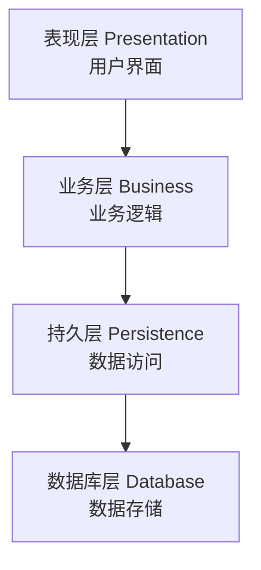
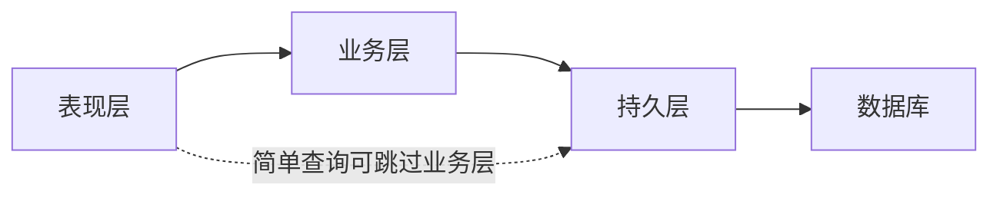

## 1. 分层架构概述

### 1.1 核心思想

将系统按职责分为**多个水平层**，每层只与相邻层交互：



### 1.2 分层原则

| 原则       | 说明                         |
| :--------- | :--------------------------- |
| 单向依赖   | 上层依赖下层，下层不依赖上层 |
| 隔离变化   | 层内变化不影响其他层         |
| 关注点分离 | 每层只关注自己的职责         |
| 可替换性   | 每层可独立替换实现           |

## 2. 各层职责

### 2.1 表现层

| 职责     | 说明             |
| :------- | :--------------- |
| 用户交互 | 接收用户输入     |
| 数据展示 | 格式化输出       |
| 请求路由 | 分发请求到业务层 |
| 输入验证 | 基本格式校验     |

### 2.2 业务层

| 职责     | 说明           |
| :------- | :------------- |
| 业务逻辑 | 核心业务规则   |
| 流程编排 | 协调多个服务   |
| 事务管理 | 保证数据一致性 |
| 权限控制 | 业务级权限     |

### 2.3 持久层

| 职责     | 说明          |
| :------- | :------------ |
| 数据访问 | CRUD操作      |
| ORM映射  | 对象-关系映射 |
| 查询优化 | SQL优化       |
| 缓存管理 | 数据缓存      |

## 3. 分层变体

### 3.1 严格分层

每层只能调用**直接下层**：

```
表现层 → 业务层 → 持久层 → 数据库
```

### 3.2 松散分层

允许跨层调用（如表现层直接调用持久层进行简单查询）：



### 3.3 常见分层模式

| 模式       | 层次                    | 示例              |
| :--------- | :---------------------- | :---------------- |
| 三层架构   | 表现-业务-数据          | Java EE           |
| 四层架构   | 表现-应用-领域-基础设施 | DDD               |
| 六边形架构 | 核心+适配器             | Alistair Cockburn |
| 洋葱架构   | 领域核心+多层环绕       | Jeffrey Palermo   |

## 4. 分层架构优缺点

### 4.1 优点

- **简单易懂**：团队快速上手
- **关注点分离**：各层职责清晰
- **可测试性**：每层可独立测试
- **标准化**：业界广泛采用

### 4.2 缺点

- **性能开销**：多层调用增加延迟
- **过度抽象**：简单功能也需经过所有层
- **腐化风险**：层间边界容易被打破
- **单体倾向**：容易变成大泥球

## 5. 最佳实践

| 实践         | 说明                        |
| :----------- | :-------------------------- |
| DTO转换      | 层间使用DTO而非暴露领域模型 |
| 依赖倒置     | 业务层定义接口，持久层实现  |
| 防腐层       | 外部系统集成使用适配器      |
| 统一异常处理 | 每层转换异常类型            |
| 日志规范     | 每层记录适当级别的日志      |

## 参考文献

SEI 架构定义：https://www.sei.cmu.edu/architecture/
C4 模型：https://c4model.com/
Martin Fowler 微服务：https://martinfowler.com/articles/microservices.html
DDD 社区：https://www.dddcommunity.org/

## 延伸阅读

架构模式与案例，见 038-software-architecture 模块文档。
云原生架构，见 034-cloud-computing 模块。
软件工程方法，见 037-software-engineering 模块。
尚硅谷 Bilibili 空间（https://space.bilibili.com/302417610 ）提供架构课程。

## 深度专题扩展

以下专题从不同角度深入本文主题，供有进阶需求的读者研读。每个专题独立成节，内容相互补充。

### 13.1 微服务拆分方法论

拆分依据：业务能力、子域（DDD）、团队结构（康威定律）、变更频率与扩展需求。
拆分陷阱：分布式事务、跨服务查询、版本兼容。
配套：API 网关、服务网格、可观测性、契约测试。
演进：模块化单体 -> 按需抽取服务，避免一次性大爆炸。

### 13.2 架构决策记录（ADR）

ADR 结构：背景（Context）、决策（Decision）、后果（Consequences）。
时机：每次重大技术选择记录；轻量 Markdown 入库。
价值：新成员快速理解、避免重复争论、审计轨迹。
维护：决策被推翻时新增 ADR 而非修改历史。
