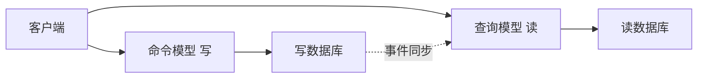
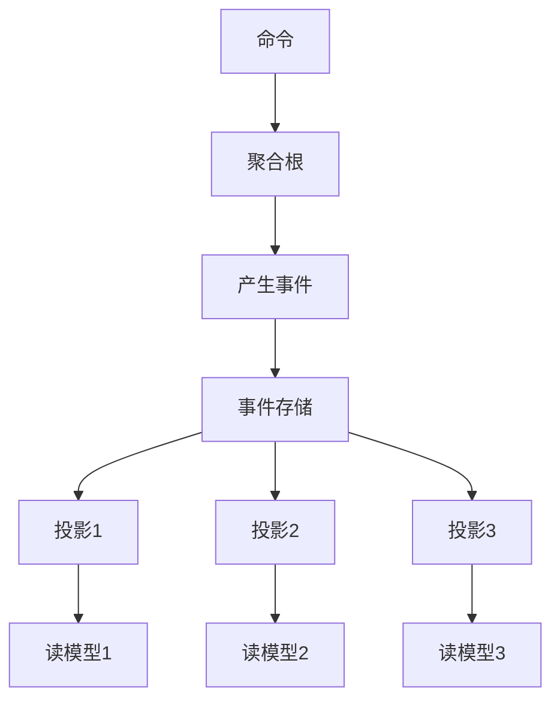

## 1. 事件驱动架构概述

### 1.1 核心概念

事件驱动架构以**事件的产生、检测和消费**为核心：

```
事件生产者 → 事件通道 → 事件消费者
```

| 概念     | 说明           |
| :------- | :------------- |
| 事件     | 状态变化的记录 |
| 生产者   | 产生事件的组件 |
| 消费者   | 处理事件的组件 |
| 通道     | 事件传输的媒介 |
| 事件存储 | 事件的持久化   |

### 1.2 事件拓扑

| 拓扑             | 说明                   | 适用场景       |
| :--------------- | :--------------------- | :------------- |
| 事件通知         | 简单通知，不含数据变更 | 状态变更通知   |
| 事件携带状态转移 | 事件包含完整数据       | 跨服务数据同步 |
| 事件溯源         | 所有变更以事件序列存储 | 审计、回溯     |

## 2. 事件溯源

### 2.1 核心思想

不存储当前状态，而是存储**所有状态变更事件**：

```
传统: 账户余额 = 1000
事件溯源:
  AccountCreated(balance=0)
  MoneyDeposited(amount=500)
  MoneyDeposited(amount=300)
  MoneyWithdrawn(amount=100)
  → 余额 = 0 + 500 + 300 - 100 = 700
```

### 2.2 事件存储

```mermaid
flowchart TD
    E[事件流]<br/>1 AccountCreated {id: A1}<br/>2 MoneyDeposited {amt: 500}<br/>3 MoneyDeposited {amt: 300}<br/>4 MoneyWithdrawn {amt: 100}
```

### 2.3 快照优化

当事件过多时，定期保存**快照**：

```
快照@事件100: {balance: 700, ...}
事件101: MoneyDeposited(200)
事件102: MoneyWithdrawn(50)

重建: 从快照开始，重放事件101-102
```

### 2.4 事件溯源优缺点

| 优点                     | 缺点           |
| :----------------------- | :------------- |
| 完整审计追踪             | 事件流可能很长 |
| 时间旅行（任意时刻状态） | 查询复杂       |
| 天然事件驱动             | 存储空间大     |
| 事件不可变               | 需要快照优化   |

## 3. CQRS

### 3.1 核心思想

命令查询职责分离：**写模型和读模型独立设计**：



### 3.2 CQRS + 事件溯源



- **写端**：事件溯源，保证一致性
- **读端**：多个投影，针对不同查询优化
- **同步**：异步事件驱动，最终一致性

### 3.3 CQRS适用场景

| 适用           | 不适用       |
| :------------- | :----------- |
| 读写比差异大   | 简单CRUD     |
| 复杂业务规则   | 小型应用     |
| 需要不同读模型 | 团队经验不足 |
| 事件溯源需求   | 强一致性要求 |

## 4. 事件模式

### 4.1 事件设计

```json
{
  "eventId": "uuid-1234",
  "eventType": "OrderCreated",
  "timestamp": "2024-01-15T10:30:00Z",
  "aggregateId": "order-5678",
  "version": 1,
  "data": {
    "orderId": "order-5678",
    "customerId": "cust-9012",
    "items": [{ "productId": "p1", "quantity": 2 }],
    "totalAmount": 99.99
  }
}
```

### 4.2 事件版本化

| 策略         | 说明             |
| :----------- | :--------------- |
| 向后兼容     | 新增字段有默认值 |
| 多版本消费者 | 消费者支持多版本 |
| 事件升级     | 中间层转换旧事件 |

## 5. 事件驱动架构模式

| 模式         | 说明                 | 示例             |
| :----------- | :------------------- | :--------------- |
| 事件通知     | 只通知变更           | 订单状态变更通知 |
| 事件携带状态 | 事件包含完整数据     | 库存变更事件     |
| 事件溯源     | 存储所有事件         | 金融交易系统     |
| CQRS         | 读写分离             | 高并发查询系统   |
| Saga         | 事件驱动的分布式事务 | 订单-支付-库存   |

## 参考文献

SEI 架构定义：https://www.sei.cmu.edu/architecture/
C4 模型：https://c4model.com/
Martin Fowler 微服务：https://martinfowler.com/articles/microservices.html
DDD 社区：https://www.dddcommunity.org/

## 延伸阅读

架构模式与案例，见 038-software-architecture 模块文档。
云原生架构，见 034-cloud-computing 模块。
软件工程方法，见 037-software-engineering 模块。
尚硅谷 Bilibili 空间（https://space.bilibili.com/302417610 ）提供架构课程。

## 深度专题扩展

以下专题从不同角度深入本文主题，供有进阶需求的读者研读。每个专题独立成节，内容相互补充。

### 13.1 微服务拆分方法论

拆分依据：业务能力、子域（DDD）、团队结构（康威定律）、变更频率与扩展需求。
拆分陷阱：分布式事务、跨服务查询、版本兼容。
配套：API 网关、服务网格、可观测性、契约测试。
演进：模块化单体 -> 按需抽取服务，避免一次性大爆炸。

### 13.2 架构决策记录（ADR）

ADR 结构：背景（Context）、决策（Decision）、后果（Consequences）。
时机：每次重大技术选择记录；轻量 Markdown 入库。
价值：新成员快速理解、避免重复争论、审计轨迹。
维护：决策被推翻时新增 ADR 而非修改历史。

## 模块文档速查表

| 文档 | 主题 | 与本文的关联 |
| --- | --- | --- |
| 软件架构概述 | 001-SoftwareArchitectureOverview | 本文的前置基础 |
| 分层架构 | 002-LayeredArchitecture | 本文的原理深化 |
| 微服务架构 | 003-MicroserviceArchitecture | 本文的原理深化 |
| 事件驱动架构 | 004-EventDrivenArchitecture | 本文自身 |
| 质量属性 | 005-QualityAttribute | 本文的并列主题 |
| CAP理论与最终一致性 | 006-CAP | 本文的并列主题 |
| 领域驱动设计 | 007-DDD | 本文的并列主题 |
| 架构评估 | 008-ArchitectureEvaluation | 本文的原理深化 |
