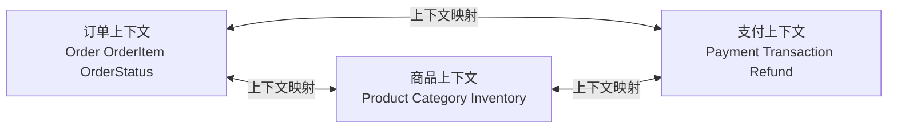
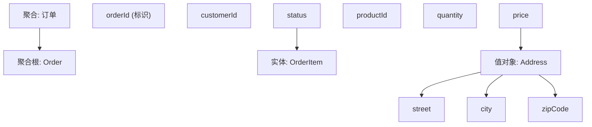
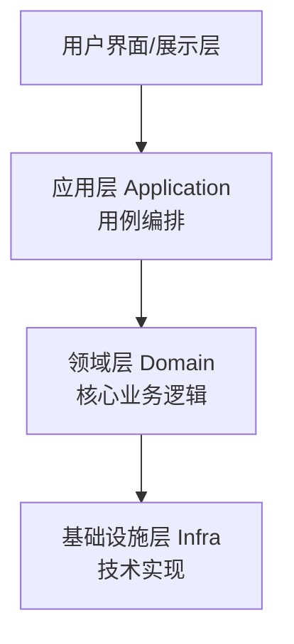

## 1. DDD核心概念

### 1.1 什么是DDD

领域驱动设计（Domain-Driven Design）是一套以**业务领域为核心**的软件设计方法论，强调技术与业务的深度融合。

### 1.2 核心原则

| 原则     | 说明                   |
| :------- | :--------------------- |
| 统一语言 | 团队使用相同的业务术语 |
| 模型驱动 | 领域模型指导设计       |
| 持续学习 | 深入理解业务领域       |
| 精炼     | 提炼核心领域           |

## 2. 战略设计

### 2.1 限界上下文（Bounded Context）

限界上下文是**语义边界**，在其中领域模型有明确且统一的含义：



### 2.2 上下文映射

| 关系                | 说明               |
| :------------------ | :----------------- |
| 合作关系            | 两个团队协商协调   |
| 客户-供应商         | 下游需求驱动上游   |
| 遵奉者              | 上游不考虑下游需求 |
| 防腐层（ACL）       | 下游翻译上游模型   |
| 开放主机服务（OHS） | 上游提供标准协议   |
| 发布语言（PL）      | 共享的事件/DTO格式 |

### 2.3 子域分类

| 子域   | 说明           | 投入       |
| :----- | :------------- | :--------- |
| 核心域 | 业务核心竞争力 | 自研，最优 |
| 支撑域 | 辅助核心业务   | 自研或外包 |
| 通用域 | 通用功能       | 采购或开源 |

## 3. 战术设计

### 3.1 实体与值对象

| 概念   | 特征             | 示例       |
| :----- | :--------------- | :--------- |
| 实体   | 有唯一标识，可变 | 用户、订单 |
| 值对象 | 无标识，不可变   | 地址、金额 |

### 3.2 聚合与聚合根

聚合是**一致性边界**，聚合根是聚合的唯一入口：



**聚合设计原则**：

- 聚合尽量小
- 通过ID引用其他聚合
- 一个事务只修改一个聚合
- 跨聚合使用领域事件

### 3.3 领域服务

当业务逻辑**不属于任何实体或值对象**时，使用领域服务：

```java
public class TransferService {
    public void transfer(Account from, Account to, Money amount) {
        from.debit(amount);
        to.credit(amount);
    }
}
```

### 3.4 领域事件

领域中发生的**有意义的事情**：

```java
public class OrderCreatedEvent {
    private final String orderId;
    private final String customerId;
    private final Money totalAmount;
    private final Instant occurredOn;
}
```

### 3.5 仓储（Repository）

提供聚合的**持久化和检索**接口：

```java
public interface OrderRepository {
    Order findById(OrderId id);
    void save(Order order);
    void delete(Order order);
}
```

## 4. 分层架构（DDD版）



| 层       | 职责                   | 依赖方向             |
| :------- | :--------------------- | :------------------- |
| 用户界面 | 展示和交互             | → 应用层             |
| 应用层   | 用例编排、事务         | → 领域层             |
| 领域层   | 业务规则、领域模型     | 无外部依赖           |
| 基础设施 | 持久化、消息、外部服务 | → 领域层（实现接口） |

## 5. DDD实践要点

| 要点       | 说明                   |
| :--------- | :--------------------- |
| 统一语言   | 代码命名与业务术语一致 |
| 事件风暴   | 团队协作发现领域事件   |
| 渐进式建模 | 模型随理解深化而演进   |
| 防腐层     | 隔离外部系统影响       |
| 持续重构   | 随业务变化调整模型     |

## 参考文献


SEI 架构定义：https://www.sei.cmu.edu/architecture/
C4 模型：https://c4model.com/
Martin Fowler 微服务：https://martinfowler.com/articles/microservices.html
DDD 社区：https://www.dddcommunity.org/

## 延伸阅读


架构模式与案例，见 038-software-architecture 模块文档。
云原生架构，见 034-cloud-computing 模块。
软件工程方法，见 037-software-engineering 模块。
尚硅谷 Bilibili 空间（https://space.bilibili.com/302417610 ）提供架构课程。

## 深度专题扩展


以下专题从不同角度深入本文主题，供有进阶需求的读者研读。每个专题独立成节，内容相互补充。

### 13.1 微服务拆分方法论

拆分依据：业务能力、子域（DDD）、团队结构（康威定律）、变更频率与扩展需求。
拆分陷阱：分布式事务、跨服务查询、版本兼容。
配套：API 网关、服务网格、可观测性、契约测试。
演进：模块化单体 -> 按需抽取服务，避免一次性大爆炸。

### 13.2 架构决策记录（ADR）

ADR 结构：背景（Context）、决策（Decision）、后果（Consequences）。
时机：每次重大技术选择记录；轻量 Markdown 入库。
价值：新成员快速理解、避免重复争论、审计轨迹。
维护：决策被推翻时新增 ADR 而非修改历史。

## 模块文档速查表

| 文档 | 主题 | 与本文的关联 |
| --- | --- | --- |
| 软件架构概述 | 001-SoftwareArchitectureOverview | 本文的前置基础 |
| 分层架构 | 002-LayeredArchitecture | 本文的原理深化 |
| 微服务架构 | 003-MicroserviceArchitecture | 本文的原理深化 |
| 事件驱动架构 | 004-EventDrivenArchitecture | 本文的原理深化 |
| 质量属性 | 005-QualityAttribute | 本文的并列主题 |
| CAP理论与最终一致性 | 006-CAP | 本文的并列主题 |
| 领域驱动设计 | 007-DDD | 本文自身 |
| 架构评估 | 008-ArchitectureEvaluation | 本文的原理深化 |
