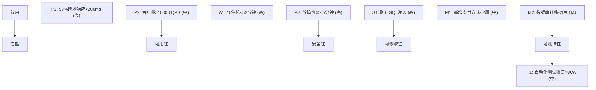

## 1. 架构评估概述

### 1.1 为什么需要评估

| 原因           | 说明                 |
| :------------- | :------------------- |
| 早期发现缺陷   | 架构缺陷修复成本极高 |
| 质量属性验证   | 确认架构满足质量需求 |
| 决策支持       | 为架构选择提供依据   |
| 风险识别       | 提前发现技术风险     |
| 利益相关者对齐 | 统一各方期望         |

### 1.2 评估时机

| 时机           | 说明         |
| :------------- | :----------- |
| 架构设计完成后 | 验证设计决策 |
| 重大变更前     | 评估变更影响 |
| 迭代结束时     | 验证架构演进 |
| 系统出现问题时 | 诊断根因     |

## 2. ATAM方法

### 2.1 ATAM概述

ATAM（Architecture Tradeoff Analysis Method）通过**质量属性场景**评估架构的权衡点。

### 2.2 ATAM步骤

```
第1步: 介绍ATAM方法
第2步: 介绍业务驱动
第3步: 介绍架构
第4步: 识别架构方法
第5步: 生成质量属性效用树
第6步: 分析架构方法
第7步: 头脑风暴和优先级排序场景
第8步: 分析架构方法
第9步: 报告结果
```

### 2.3 效用树



### 2.4 ATAM输出

| 输出   | 说明                   |
| :----- | :--------------------- |
| 敏感点 | 影响质量属性的架构决策 |
| 权衡点 | 影响多个质量属性的决策 |
| 风险   | 可能导致不良结果的决策 |
| 非风险 | 已验证的架构决策       |

**示例**：

| 类型   | 描述                           |
| :----- | :----------------------------- |
| 敏感点 | 缓存策略对响应时间的影响       |
| 权衡点 | 数据冗余提高可用性但降低一致性 |
| 风险   | 单点数据库可能成为瓶颈         |
| 非风险 | 已验证的负载均衡策略           |

## 3. CBAM方法

### 3.1 CBAM概述

CBAM（Cost Benefit Analysis Method）在ATAM基础上加入**经济分析**，帮助选择最具成本效益的架构策略。

### 3.2 CBAM步骤

```
1. 从ATAM效用树中选择关键场景
2. 为每个场景确定架构策略
3. 评估每个策略的收益和成本
4. 计算ROI
5. 选择最优策略
```

### 3.3 ROI计算

$$\text{ROI} = \frac{\text{收益} - \text{成本}}{\text{成本}}$$

| 策略     | 收益 | 成本 | ROI   |
| :------- | :--- | :--- | :---- |
| 读写分离 | 8    | 3    | 167%  |
| 缓存层   | 7    | 2    | 250%  |
| 微服务化 | 9    | 8    | 12.5% |
| CDN加速  | 6    | 1    | 500%  |

## 4. 架构评审实践

### 4.1 评审清单

| 维度     | 检查项                       |
| :------- | :--------------------------- |
| 功能性   | 是否满足核心功能需求         |
| 性能     | 是否满足响应时间和吞吐量要求 |
| 可用性   | 是否满足可用性SLA            |
| 安全性   | 是否满足安全合规要求         |
| 可扩展性 | 是否支持未来业务增长         |
| 可维护性 | 是否易于理解和修改           |
| 可测试性 | 是否便于测试                 |
| 可部署性 | 是否支持持续交付             |

### 4.2 评审流程

```
1. 准备: 收集架构文档和评审材料
2. 预审: 评审者独立阅读材料
3. 评审会议: 集体讨论和评审
4. 输出: 评审报告和改进建议
5. 跟踪: 确保改进措施落实
```

## 参考文献


SEI 架构定义：https://www.sei.cmu.edu/architecture/
C4 模型：https://c4model.com/
Martin Fowler 微服务：https://martinfowler.com/articles/microservices.html
DDD 社区：https://www.dddcommunity.org/

## 延伸阅读


架构模式与案例，见 038-software-architecture 模块文档。
云原生架构，见 034-cloud-computing 模块。
软件工程方法，见 037-software-engineering 模块。
尚硅谷 Bilibili 空间（https://space.bilibili.com/302417610 ）提供架构课程。

## 深度专题扩展


以下专题从不同角度深入本文主题，供有进阶需求的读者研读。每个专题独立成节，内容相互补充。

### 13.1 微服务拆分方法论

拆分依据：业务能力、子域（DDD）、团队结构（康威定律）、变更频率与扩展需求。
拆分陷阱：分布式事务、跨服务查询、版本兼容。
配套：API 网关、服务网格、可观测性、契约测试。
演进：模块化单体 -> 按需抽取服务，避免一次性大爆炸。

### 13.2 架构决策记录（ADR）

ADR 结构：背景（Context）、决策（Decision）、后果（Consequences）。
时机：每次重大技术选择记录；轻量 Markdown 入库。
价值：新成员快速理解、避免重复争论、审计轨迹。
维护：决策被推翻时新增 ADR 而非修改历史。

## 模块文档速查表

| 文档 | 主题 | 与本文的关联 |
| --- | --- | --- |
| 软件架构概述 | 001-SoftwareArchitectureOverview | 本文的前置基础 |
| 分层架构 | 002-LayeredArchitecture | 本文的原理深化 |
| 微服务架构 | 003-MicroserviceArchitecture | 本文的原理深化 |
| 事件驱动架构 | 004-EventDrivenArchitecture | 本文的原理深化 |
| 质量属性 | 005-QualityAttribute | 本文的并列主题 |
| CAP理论与最终一致性 | 006-CAP | 本文的并列主题 |
| 领域驱动设计 | 007-DDD | 本文的并列主题 |
| 架构评估 | 008-ArchitectureEvaluation | 本文自身 |
