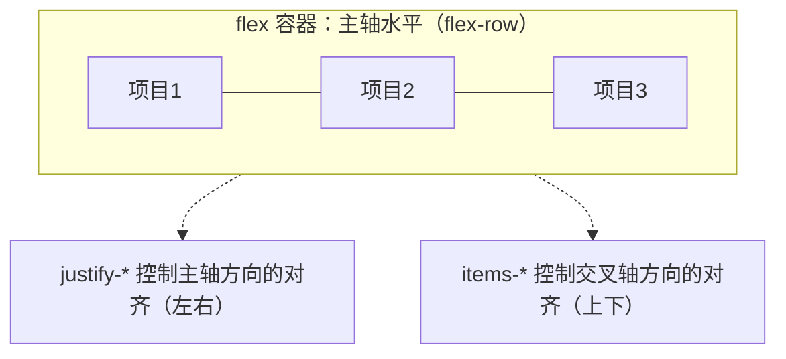
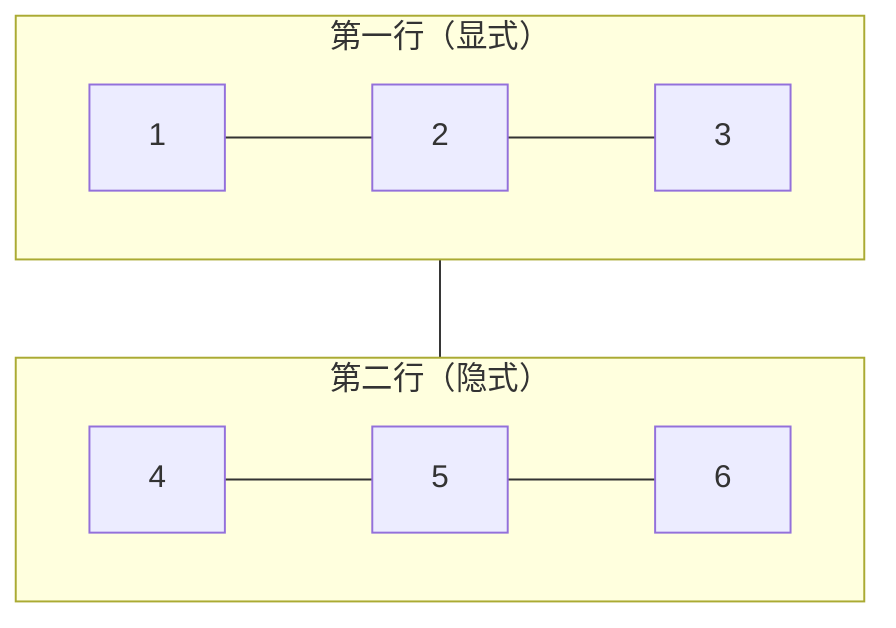

<!-- ============ 文档分隔线：046-tailwind/001-TailwindOverview.md ============ -->

## 0. 从一盒乐高说起

想象你面前有一盒标准乐高积木：没有成品模型说明书，只有一块块独立的积木颗粒——红色的 2x4 板、蓝色的 1x2 砖、灰色的斜面件、黄色的窗框。你想搭一栋房子，不会去雕一块"专用房顶砖"，而是随手从盒子里挑出合适的颗粒，一块一块拼出你要的形状。要改设计？拆掉几块，换上别的颗粒，几秒钟搞定。不需要胶水，不需要切割，每一块积木都可以反复拆装复用。

Tailwind CSS 就是前端世界里的这盒乐高。它不提供"成品房顶"（预置组件），而是提供成百上千个单一用途的"积木颗粒"——一个工具类只负责一条 CSS 声明。`p-4` 只做一件事：设置 16px 的内边距；`text-lg` 只做一件事：设置 1.125rem 的字号。你要的页面样式，全部由这些颗粒在 HTML 里拼装出来。

本篇文章将用"传统写法 vs 工具类写法"的全程对比，带你理解 Tailwind CSS 为什么诞生、它解决了什么问题、它与 Bootstrap 这类框架的本质区别，以及它适合用在什么场景。


> 本节为增量补充，帮助你选择 Tailwind CSS 版本。

- Tailwind CSS：v4.x 为当前稳定版（2025-01 发布 v4），采用 CSS-first 配置，不再依赖 tailwind.config.js；v3 仅做维护。
- v4 与 Vite 8、Next.js 16、Astro 6 均有官方插件；新项目直接使用 v4。
- 学习顺序：先掌握工具类（布局/排版/响应式），再学习主题令牌与 @theme 自定义。

## 1. 传统 CSS 的痛点：为什么"写样式"这么累

在 Tailwind 出现之前，一个典型的网页样式开发流程是这样走的：先在 HTML 里搭结构，再打开单独的 `.css` 文件写样式，最后刷新浏览器看效果。如果样式没生效，还得用开发者工具逐条排查。整个过程在"HTML 文件"和"CSS 文件"之间来回切换，就像装修时工人在"图纸"和"工地"两头跑。

### 1.1 传统写法：结构与样式分离

```html
<!-- 传统 HTML：结构里只有语义标签，没有样式信息 -->
<div class="card">
  <h2 class="card-title">课程简介</h2>
  <p class="card-desc">这是一门面向零基础的编程入门课程。</p>
  <a href="/course/1" class="card-link">开始学习</a>
</div>
```

```css
/* 传统 CSS：样式单独写在另一个文件里 */
.card {
  background-color: #ffffff;
  border: 1px solid #e5e7eb;
  border-radius: 8px;
  padding: 16px;
  box-shadow: 0 2px 8px rgba(0, 0, 0, 0.08);
}
.card-title {
  font-size: 20px;
  font-weight: 700;
  color: #111827;
}
.card-desc {
  font-size: 14px;
  color: #6b7280;
}
.card-link {
  display: inline-block;
  background-color: #2563eb;
  color: #ffffff;
  padding: 8px 16px;
  border-radius: 6px;
  text-decoration: none;
}
```

这种"结构分离"的写法看似整洁，但隐藏着三个问题：

- **命名负担**：`.card`、`.card-title`、`.card-desc`，每个样式块都要想名字。页面一多，类名表越来越长，重名、语义不清、命名风格不统一是常态。
- **文件切换**：改一个按钮颜色，要定位到 CSS 文件的对应规则，来回对照 HTML 与 CSS 两个文件。
- **死代码累积**：某个 `.card` 不再被使用后，CSS 规则往往还躺在文件里，日积月累形成无人维护的"僵尸样式"。

### 1.2 HTML 混写：内联样式的反面教材

为了省去文件切换，有人干脆把样式直接写进标签：

```html
<!-- 内联样式：样式与结构同处一处，但完全无法复用 -->
<div style="background-color:#fff;border:1px solid #e5e7eb;border-radius:8px;padding:16px;box-shadow:0 2px 8px rgba(0,0,0,.08)">
  <h2 style="font-size:20px;font-weight:700;color:#111827">课程简介</h2>
</div>
```

内联样式解决了"切换文件"的问题，却制造了更大的问题：每个地方都要重复粘贴同一段样式，改一个圆角值要全局搜索替换，媒体查询（响应式）完全无法使用。这条路走不通。

## 2. 语义类 CSS：命名与复用的永恒难题

CSS 社区为了解决"命名"问题，发展出了 BEM（Block Element Modifier，块-元素-修饰符）等命名方法论。BEM 的类名长这样：

```css
/* BEM 命名法：用严格的命名规则约束类名 */
.card__title--large { font-size: 24px; }
.card__title--small { font-size: 14px; }
.card__desc--muted  { color: #9ca3af; }
```

BEM 确实让命名变得规范，但代价是类名越来越长、记忆成本越来越高。而且它仍然没有解决"复用"问题：两个长得相似但细节不同的组件（比如一个卡片有阴影、一个没有），只能通过"多写一个修饰符类"或"复制一份样式"来区分。

更深层的问题在于：**传统 CSS 把"样式"当作需要命名的实体来管理**，而页面上真正变化的其实是"属性的组合"。一个按钮和另一个按钮的差异，往往只是背景色、内边距、圆角这三个属性的取值不同——它们共享的底层逻辑是同一个。既然如此，为什么不直接提供"属性级别的原子类"，让开发者自由组合呢？这正是 utility-first 思想的起点。

## 3. utility-first：不写 CSS 的 CSS 方案

utility-first（工具类优先）的思路是：框架不再提供组件级的类（如 `.btn`、`.card`），而是提供**原子化的工具类**，每个类只封装一条 CSS 声明，开发者直接在 HTML 中组合它们。

### 3.1 两种写法逐条对比

| 需求 | 传统语义类写法 | Tailwind 工具类写法 |
| --- | --- | --- |
| 卡片圆角 8px | `.card { border-radius: 8px; }` | `rounded-lg` |
| 白色背景 | `.card { background-color: #fff; }` | `bg-white` |
| 四周内边距 16px | `.card { padding: 16px; }` | `p-4` |
| 中等阴影 | `.card { box-shadow: 0 4px 6px rgba(0,0,0,.1); }` | `shadow-md` |

```html
<!-- 传统写法：先定义类，再写规则，最后引用 -->
<div class="card">卡片内容</div>

<!-- Tailwind 写法：类名即样式，组合即设计 -->
<div class="rounded-lg bg-white p-4 shadow-md">卡片内容</div>
```

注意第二行：没有 `.css` 文件，没有命名，样式直接"长"在标签上。`rounded-lg` 管圆角，`bg-white` 管背景，`p-4` 管内边距，`shadow-md` 管阴影——每个类各司其职，一眼可读。

### 3.2 工具类写法的四大收益

第一，**零命名负担**。不需要为每个模块想类名，也就没有 BEM 命名规范的记忆成本。

第二，**受设计令牌约束**。间距、颜色、字号全部来自预设刻度，你不会随手写出 `padding: 17px` 或 `#f3f2f1` 这种打破设计一致性的"野值"。

第三，**删除组件即删除样式**。组件从页面移除后，对应的工具类不再被扫描到，构建产物里就不会再有它的样式——从机制上杜绝了死代码。

第四，**响应式内联**。媒体查询的断点前缀（`sm:`、`md:`、`lg:`）直接写在类名上，同一个元素在不同屏幕宽度下的样式一目了然：

```html
<!-- 移动端单列，桌面端三列：断点前缀直接写在类名上 -->
<div class="grid grid-cols-1 md:grid-cols-3 gap-4">
  <div>卡片一</div>
  <div>卡片二</div>
  <div>卡片三</div>
</div>
```

## 4. Tailwind CSS 是什么：从 2017 到 v4

Tailwind CSS 由 Adam Wathan 于 2017 年创建，是一个"实用优先"（utility-first）的 CSS 框架。它不提供预设组件，而是提供大量原子工具类，开发者直接在 HTML 或组件中组合出完整设计。如今它在 GitHub 上拥有超过 91,800 颗星标，是全球最受欢迎的 CSS 框架之一。

版本演进的关键节点：

| 版本 | 发布时间 | 核心变化 |
| --- | --- | --- |
| v1 | 2019 年 | 正式发布，确立 utility-first 设计哲学 |
| v2 | 2020 年 | 引入 JIT（即时编译）引擎雏形、暗色模式支持 |
| v3 | 2021 年 | JIT 引擎全面启用，构建速度大幅提升 |
| v4 | 2025 年 1 月 | 从零重写：Rust 编写的 Oxide 引擎、CSS-first 配置、自动内容检测 |

其中 v4 是里程碑式的重构。它把配置从 `tailwind.config.js` 迁入 CSS 文件（`@theme` 指令），把三行 `@tailwind` 指令简化为一行 `@import "tailwindcss"`，并把编译引擎换成 Rust 实现的 Oxide——完整构建速度提升 3.5 到 5 倍，增量构建最高提升 100 倍。截至本文写作时，最新稳定版为 v4.3.3（2026 年 7 月发布），新增了滚动条样式工具类、`@container-size` 尺寸容器、`zoom-*` 缩放、`tab-*` 制表符宽度等实用能力。

## 5. Tailwind vs Bootstrap：两套截然不同的哲学

初学者最容易混淆 Tailwind 和 Bootstrap，因为两者都叫"CSS 框架"。但它们的哲学完全相反：

| 对比维度 | Bootstrap | Tailwind CSS |
| --- | --- | --- |
| 核心资产 | 预制组件（`.btn`、`.card`、`.navbar`） | 原子工具类（`flex`、`p-4`、`rounded`） |
| 上手成本 | 低：套用现成组件即可 | 中：需要组合类名理解 CSS 属性 |
| 定制方式 | 覆盖 Sass 变量 / 覆写组件类 | 组合工具类 / `@theme` 定义设计令牌 |
| 风格统一 | 开箱即用，但换肤需要大改 | 无默认外观，一切由你组合 |
| 产物体积 | 通常引入整套组件库 CSS | 只生成用到的类，tree-shaking 后极小 |
| 学习曲线 | 学会套用即可 | 需要理解底层 CSS 属性 |
| 适合人群 | 快速原型、后台系统、不追求独特外观 | 定制化产品、设计系统、追求性能 |

用乐高的比喻来说：Bootstrap 给你一整套"成品模型"（打开包装就是一辆车、一栋楼），Tailwind 给你一盒"散装积木"（一切由你拼）。Bootstrap 见效快但改造成本高；Tailwind 初期组合成本高，但拼出来的设计完全属于你自己，且没有多余样式。

值得强调的是：两者并不互斥。很多团队用 Tailwind 搭配组件库（如 daisyUI、shadcn/ui）使用——组件库负责交互逻辑，Tailwind 负责外观定制。

## 6. Tailwind 4 的新特性一览

既然本模块系列文档面向 Tailwind 4，这里先把 v4 带来的关键变化讲清楚，后续文档会逐一展开。

### 6.1 Oxide 引擎：Rust 驱动的编译速度

v4 用 Rust 重写了编译引擎。官方基准测试显示：完整构建从 v3 的约 378ms 降到 100ms 左右（约 3.8 倍），无新 CSS 的增量构建从 35ms 降到微秒级（超过 100 倍）。对大型项目来说，改一个类名几乎"零延迟"刷新。

### 6.2 CSS-first 配置：@theme 取代 tailwind.config.js

v3 时代定制主题要在 JS 配置文件里写 `theme.extend`；v4 直接在 CSS 中声明设计令牌：

```css
/* v4：设计令牌直接写在 CSS 里，自动生成对应工具类 */
@import "tailwindcss";

@theme {
  --color-brand-500: #3b82f6;  /* 生成 bg-brand-500、text-brand-500 等 */
  --font-display: "Inter", sans-serif;  /* 生成 font-display */
  --radius-4xl: 2rem;           /* 生成 rounded-4xl */
}
```

### 6.3 单行导入：@import "tailwindcss"

v3 需要在 CSS 里写三行指令（`@tailwind base;`、`@tailwind components;`、`@tailwind utilities;`），v4 一行搞定：

```css
/* v3 写法 */
@tailwind base;
@tailwind components;
@tailwind utilities;

/* v4 写法：一行导入全部功能 */
@import "tailwindcss";
```

### 6.4 自动内容检测与 @source

v3 要在配置文件里手动填写 `content` 数组，告诉框架去哪里扫描类名；v4 自动扫描项目源码，只有写在 HTML/模板文件里的类名才会被生成。扫描范围外的目录可用 `@source` 指令手动补充。

### 6.5 更多内置能力

- **OKLCH 色彩空间**：默认调色板改用感知均匀的 OKLCH，颜色更鲜艳、色阶过渡更自然，并支持 P3 广色域。
- **容器查询内置**：v3 需要插件的 `@container`、`@sm:` 等容器查询类，v4 开箱即用。
- **动态工具类值**：`grid-cols-15`、`mt-17`、`w-29` 这类非预设数值可直接使用，无需方括号语法。
- **3D 变换**：内置 `rotate-x-*`、`rotate-y-*`、`perspective-*` 等 3D 工具类。
- **自定义工具类**：`@utility` 指令可封装自己的工具类，并自动支持 `hover:`、`dark:` 等变体组合。

## 7. 适用场景分析：什么时候用，什么时候不用

任何技术都有边界，Tailwind 也不例外。

### 7.1 适合用 Tailwind 的场景

第一，**需要高度定制外观的产品**。工具类组合自由度极高，适合电商、内容社区、SaaS 后台等对视觉有独特要求的项目。

第二，**组件化前端项目**（React / Vue / Svelte / Astro）。组件封装天然消化了"类名长"的缺点：按钮组件内部写一堆工具类，外部使用者只看到 `<Button>`。

第三，**追求极致性能与最小产物体积**。Tailwind 只生成被扫描到的类，一个普通页面最终的 CSS 常常只有几 KB 到几十 KB，远小于整套组件库。

第四，**团队希望统一设计规范**。预设刻度与 `@theme` 令牌让所有成员的间距、颜色、字号保持同源，杜绝"每人一套数值"的混乱。

### 7.2 不太适合的场景

第一，**快速后台管理原型**。如果项目生命周期短、对样式没有定制要求，直接用 Bootstrap 或 Ant Design 更省事。

第二，**需要兼容老旧浏览器**。v4 要求 Safari 16.4+、Chrome 111+、Firefox 128+，依赖 `@property`、`color-mix()` 等现代 CSS 特性，老浏览器环境下建议停留在 v3.4。

第三，**纯静态文档页**。简单几个页面，手写 CSS 可能更快，引入构建工具链反而复杂。

## 8. 常见错误与对策

| 错误场景 | 表现 | 原因 | 解决办法 |
| --- | --- | --- | --- |
| 动态拼接类名 | `bg-${color}-500` 样式不生效 | 框架按完整字符串扫描类名，拼接结果无法被识别 | 写出完整类名，或维护"类名到完整字符串"的映射表 |
| 找不到类名对应的类 | 输入了 `mx-auto` 却无效果 | 类名拼写错误，或该类不在扫描范围内 | 核对官方速查表；检查 `@source` 配置 |
| 任意值滥用 | `p-[17px]`、`text-[13.5px]` 满屏都是 | 绕过了设计令牌，破坏了视觉一致性 | 频繁出现的值提升到 `@theme` 中定义 |
| 与内联样式混用 | 同一个元素既写 `style=""` 又写工具类 | 两套体系互相覆盖，难以维护 | 统一使用工具类；确需动态值时用任意值语法 |
| 把 Tailwind 当 Bootstrap 用 | 找"按钮组件类"找不到 | 误解了 utility-first：没有预制组件 | 用工具类组合 + 组件封装（React 组件）实现"伪组件" |
| 旧教程操作 v4 项目 | 写了 `@tailwind base;` 三行指令报错 | v3 指令在 v4 中已移除 | 改用 `@import "tailwindcss";` |

## 10. 一句话记忆

Tailwind CSS 是一盒乐高积木：不提供成品组件，只提供单条 CSS 声明对应的原子工具类，让你在 HTML 里直接拼出设计——省去命名、杜绝死代码、响应式内联，而 Tailwind 4 用 CSS-first 配置和 Rust 引擎把这些体验推到新高度。

<!-- ============ 文档分隔线：046-tailwind/002-InstallConfig.md ============ -->

## 0. 装修开工前的准备

把写网页比作装修一套房子：HTML 是房子的结构（墙、门、窗的位置），CSS 是装修（墙面的颜色、家具的摆放）。而 Tailwind 就是一套"预制墙板 + 标准五金件"的装修方案——但再好的建材，也得先完成"水电进场、工具就位"才能开工。本篇文章就是安装配置的"开工手册"。

装修开工前要做三件事：确认房屋属于哪种户型（项目类型）、确认水电到位（Node.js 环境）、选择施工方案（接入方式）。对应到 Tailwind 就是：

第一，判断项目类型：是 Vite 脚手架项目（React/Vue/Svelte/Astro），还是 Next.js 这类基于 webpack 的项目，还是完全没有构建工具的纯 HTML 页面——不同项目对应不同接入方式。

第二，确认环境就绪：Tailwind 4 的安装与构建依赖 Node.js 20 及以上版本，先运行 `node -v` 检查版本。

第三，选择接入方式：Vite 插件（推荐）、PostCSS 插件、CLI 工具，三者取其一。

下文按"操作向导"的方式，手把手带你完成每一步。你可以对照自己的项目类型，选择对应章节执行。

## 1. 开工检查清单

在执行任何安装命令之前，先完成三项检查：

```bash
# 检查 Node.js 版本：v4 的安装与构建要求 Node.js 20 及以上
node -v

# 检查包管理器：npm / pnpm / yarn 任一即可，本文以 pnpm 为例
pnpm -v

# 确认当前目录是项目根目录（package.json 所在位置）
ls package.json
```

如果 `node -v` 输出的版本低于 v20，请先升级 Node.js。Tailwind 4 依赖新版 Node 运行时，版本过低会导致安装或构建报错。

项目类型判断口诀：**有 Vite 用插件，有 PostCSS 链条用 PostCSS，什么都没有用 CLI**。三种方式最终殊途同归——都在入口 CSS 里写一行 `@import "tailwindcss";`，区别只在于"谁来编译"。

## 2. 方式一：Vite 插件接入（官方推荐，最省心）

这是官方文档首推的方式，适用于 Vite 项目以及所有基于 Vite 的框架（React、Vue、Svelte、SolidJS、Astro 等）。整个接入过程只有五步。

### 第 1 步：创建 Vite 项目

如果你还没有项目，用脚手架创建一个（已有项目可跳过本步）：

```bash
# 创建 React + TypeScript 模板项目
npm create vite@latest my-project -- --template react-ts
cd my-project
npm install
```

### 第 2 步：安装 Tailwind 核心包与 Vite 插件

```bash
pnpm add tailwindcss @tailwindcss/vite
```

讲解：这里安装两个包。`tailwindcss` 是框架核心（内含 Oxide 编译引擎）；`@tailwindcss/vite` 是官方 Vite 专用插件，负责把 Tailwind 挂进 Vite 的构建管线。使用 npm 或 yarn 时命令等价（`npm install` / `yarn add`）。

### 第 3 步：在 vite.config.ts 中注册插件

```ts
// vite.config.ts
import { defineConfig } from 'vite'
import react from '@vitejs/plugin-react'
import tailwindcss from '@tailwindcss/vite'

export default defineConfig({
  plugins: [
    react(),
    tailwindcss(), // 注册 Tailwind 插件，无需任何配置对象
  ],
})
```

讲解：在 `plugins` 数组中加入 `tailwindcss()` 即可。注意 v4 必须从 `@tailwindcss/vite` 包导入，而不是从 `tailwindcss` 包导入——老教程里常见的 `import tailwindcss from 'tailwindcss'` 是 v3 的 PostCSS 用法，在 v4 中会报 `tailwindcss is not defined` 之类的错误。

### 第 4 步：创建入口 CSS 并写入一行导入

```css
/* src/index.css：项目全局样式入口 */
@import "tailwindcss";
```

这一行是 v4 的全部"安装内容"。它做了三件事：引入 Preflight 基础重置样式、注入默认主题变量（颜色、间距、字号等设计令牌）、挂载全部工具类生成的管线。v3 时代需要 `@tailwind base;`、`@tailwind components;`、`@tailwind utilities;` 三行指令，v4 全部合并进这一行。

### 第 5 步：在应用入口引入 CSS 并启动

```ts
// src/main.ts
import { createRoot } from 'react-dom/client'
import './index.css' // 全局引入一次即可

createRoot(document.getElementById('root')!).render(<App />)
```

```bash
# 启动开发服务器
npm run dev
```

验证方法：在任意组件中写 `<div className="bg-blue-500 p-4 text-white">你好，Tailwind</div>`，页面出现蓝色圆角白字方块，即安装成功。

Vite 插件的额外红利：开发时类名变更会通过 HMR（热更新）即时生效，无需手动刷新；生产构建时自动完成 tree-shaking，只输出被扫描到的类。

## 3. 方式二：PostCSS 接入（Next.js / webpack 生态）

如果你的项目使用 Next.js App Router、Nuxt 或自定义 webpack 构建链，推荐使用 PostCSS 方式。

### 第 1 步：安装依赖

```bash
pnpm add tailwindcss @tailwindcss/postcss
```

讲解：注意插件包名是 `@tailwindcss/postcss`，与 v3 直接在 `tailwindcss` 包内嵌 PostCSS 插件不同。v4 把 PostCSS 插件独立成包。同时，v4 已自动处理 `@import` 与浏览器前缀（vendor prefix），因此项目中旧的 `postcss-import` 和 `autoprefixer` 都可以移除。

### 第 2 步：配置 postcss.config.mjs

```js
// postcss.config.mjs
export default {
  plugins: {
    '@tailwindcss/postcss': {},
  },
}
```

### 第 3 步：在全局样式文件中导入

以 Next.js App Router 为例，在 `app/globals.css` 中写入：

```css
/* app/globals.css */
@import "tailwindcss";
```

Next.js 的 Layout 组件已默认引入 `globals.css`，无需额外改动入口文件。启动 `npm run dev` 后即可使用工具类。

## 4. 方式三：CLI 接入（纯 HTML 项目）

没有构建工具的静态 HTML 项目，用官方 CLI 独立编译 CSS，三行命令搞定。

### 第 1 步：安装 CLI 并创建输入文件

```bash
# 初始化 npm 项目（已有 package.json 可跳过）
npm init -y

# 安装 CLI 工具
npm install -D @tailwindcss/cli
```

创建 `src/input.css`，写入导入指令：

```css
/* src/input.css */
@import "tailwindcss";
```

### 第 2 步：编译并监听

```bash
# 开发模式：监听文件变化，实时重编译
npx @tailwindcss/cli -i ./src/input.css -o ./dist/output.css --watch

# 生产构建：压缩输出
npx @tailwindcss/cli -i ./src/input.css -o ./dist/output.css --minify
```

讲解：`-i` 指定输入 CSS，`-o` 指定输出文件，`--watch` 开启监听模式，`--minify` 压缩体积。建议把命令写入 `package.json` 的 scripts：

```json
{
  "scripts": {
    "dev": "@tailwindcss/cli -i ./src/input.css -o ./dist/output.css --watch",
    "build": "@tailwindcss/cli -i ./src/input.css -o ./dist/output.css --minify"
  }
}
```

然后在 HTML 中引入编译产物：

```html
<!doctype html>
<html lang="zh-CN">
<head>
  <meta charset="UTF-8">
  <link rel="stylesheet" href="./dist/output.css">
</head>
<body class="bg-gray-50">
  <h1 class="text-3xl font-bold text-blue-600">你好，Tailwind CSS</h1>
</body>
</html>
```

## 5. Astro 项目接入

Astro 底层使用 Vite，因此接入方式与第 2 节几乎一致，只有配置位置不同：插件要挂在 `astro.config.mjs` 的 `vite` 字段下。

### 第 1 步：安装依赖

```bash
pnpm add tailwindcss @tailwindcss/vite
```

### 第 2 步：注册插件

```js
// astro.config.mjs
import { defineConfig } from 'astro/config'
import tailwindcss from '@tailwindcss/vite'

export default defineConfig({
  vite: {
    plugins: [tailwindcss()],
  },
})
```

### 第 3 步：在全局布局中导入 CSS

```css
/* src/styles/global.css */
@import "tailwindcss";
```

```astro
---
// src/layouts/Base.astro
import '../styles/global.css'
---
<html lang="zh-CN">
  <body>
    <slot />
  </body>
</html>
```

之后即可在任意 `.astro` 组件的模板中直接使用工具类。注意：Astro 在 v3 之前有官方的 `@astrojs/tailwind` 集成包，v4 之后官方推荐直接用 Vite 插件方式，二者选其一，不要重复配置。

## 6. 深度理解：@import "tailwindcss" 到底做了什么

这一行导入是 v4 安装配置的核心。它展开后包含三层内容：

第一，**Preflight 基础层**。一套现代 CSS 重置样式：消除浏览器默认的外边距、统一盒模型（`box-sizing: border-box`）、重置标题字号、规范表单控件外观等，让所有浏览器从同一起跑线开始渲染。

第二，**主题变量层（Theme）**。注入默认设计令牌，全部以 CSS 变量形式暴露，例如 `--color-blue-500`、`--spacing-4`、`--font-sans`。这些变量既是工具类生成的依据，也能在自定义 CSS 中直接引用。

第三，**工具类层（Utilities）**。挂载工具类生成管线——框架扫描源文件中的类名，按需生成对应的 CSS 规则。最终产物只包含你用到的类。

此外 v4 采用原生级联层（`@layer theme, base, components, utilities`）管理样式优先级，工具类总是位于最后、优先级最高，因此自定义 CSS 很难"误伤"工具类。

## 7. @source：手动控制扫描范围

v4 最大的配置简化之一：不再需要 `tailwind.config.js` 里的 `content` 数组。框架会自动扫描项目中的模板文件（入口 CSS 所在项目的公共源码根目录，如 `src`），自动忽略 `.gitignore` 中忽略的文件与二进制文件。

但有两种情况需要手动声明 `@source`：

- 类名写在自动扫描范围之外的目录（例如 monorepo 中单独放置的组件包）。
- 第三方组件库的样式依赖 Tailwind 类名，需要把这些库的源码纳入扫描。

```css
/* src/styles/global.css */
@import "tailwindcss";

/* 手动声明需要扫描的目录 */
@source "../components";
@source "../node_modules/@my-lib/ui";

/* 支持 glob 通配符 */
@source "../views/**/*.html";

/* 支持排除规则 */
@source not "../src/**/*.test.tsx";
```

`@source` 的三个要点：

第一，路径是相对于入口 CSS 文件所在目录的。

第二，类名必须是完整的字符串。`bg-${color}-500` 这类动态拼接的类名无法被扫描识别，需要把完整类名字符串列出来，或用 `@source inline("bg-red-500 bg-blue-500")` 之类的内联声明强制收录。

第三，新增 `@source` 后开发服务器通常会自动重扫；若未生效，重启开发服务器即可。

## 8. Tailwind 3 vs 4：配置方式对照

| 对比项 | Tailwind 3 | Tailwind 4 |
| --- | --- | --- |
| 配置位置 | `tailwind.config.js`（JS 文件） | CSS 文件中的 `@theme` 指令 |
| 导入方式 | `@tailwind base;` + `@tailwind components;` + `@tailwind utilities;` | 一行 `@import "tailwindcss";` |
| 扫描配置 | `content: ['./src/**/*.{js,ts,jsx}']` | 自动检测 + 可选 `@source` |
| PostCSS 插件 | 内置在 `tailwindcss` 包 | 独立包 `@tailwindcss/postcss` |
| Vite 集成 | 需走 PostCSS 链 | 原生插件 `@tailwindcss/vite` |
| CLI 工具 | `npx tailwindcss -i ...` | 独立包 `@tailwindcss/cli` |
| 自定义工具类 | `@layer components` + `@apply` | `@utility` 指令 |
| 不透明度 | `bg-opacity-50` 单独类 | `bg-black/50` 斜杠修饰符 |
| 弹性伸缩 | `flex-shrink-0` / `flex-grow` | `shrink-0` / `grow` |
| 浏览器要求 | 较宽松 | Safari 16.4+ / Chrome 111+ / Firefox 128+ |
| 构建引擎 | JS（JIT） | Rust 编写的 Oxide 引擎 |

旧项目升级到 v4，官方提供了自动升级工具，能完成依赖更新、配置迁移等大部分工作：

```bash
# 需要 Node.js 20+
npx @tailwindcss/upgrade
```

官方建议在独立分支运行升级工具，仔细审查 diff 后再合入。

## 9. 安装后的自检清单

完成安装后，用以下五项快速验证环境是否正确：

第一，页面出现 Preflight 重置效果：比如默认 `h1` 不再有巨大的浏览器默认字号和边距，说明基础层生效。

第二，写一个明显的类（如 `bg-red-500`）后样式即时出现，说明类名扫描正常。

第三，尝试一个状态变体（如 `hover:bg-blue-600`），悬停后颜色变化，说明变体编译正常。

第四，在 `vite.config.ts` / 样式文件中故意写错一个类名，页面不应报错，只是样式不生效——工具类天然"静默降级"。

第五，执行生产构建，检查输出 CSS 体积：v4 的 tree-shaking 保证只保留被扫描到的类，几十个组件的项目产物通常在几十 KB 以内。

## 10. 常见错误与对策

| 错误场景 | 报错/表现 | 原因 | 解决办法 |
| --- | --- | --- | --- |
| 插件导入来源错误 | `tailwindcss is not defined` | 从 `tailwindcss` 包导入插件，但 v4 插件在 `@tailwindcss/vite` 中 | `import tailwindcss from '@tailwindcss/vite'` |
| 版本过低 | 安装/运行时报 Node 版本错误 | Tailwind 4 要求 Node.js 20+ | 升级 Node.js 后重装依赖 |
| 类名不生效 | 写了 `bg-blue-500` 无样式 | 类名拼写错误或不在扫描范围 | 核对官方速查表；补充 `@source` |
| 动态拼接类名 | `bg-${color}-500` 不生效 | 扫描器按完整字符串匹配，拼接无法识别 | 维护完整类名映射表或用 `@source inline()` |
| v3 指令残留 | `@tailwind base;` 报错 | v4 移除了这三条指令 | 改为 `@import "tailwindcss";` |
| 重复配置 | 样式重复或冲突 | 同时使用了旧集成包（如 `@astrojs/tailwind`）与 Vite 插件 | 只保留一种接入方式 |
| 修改后不生效 | 改了配置没反应 | Vite 缓存或监听失效 | 重启开发服务器 |

## 12. 一句话记忆

安装 Tailwind 4 只有两步：装包（`tailwindcss` + 对应构建插件）与写一行 `@import "tailwindcss";`——剩下的扫描范围用 `@source` 按需补充，配置从 `tailwind.config.js` 搬进了 CSS。

<!-- ============ 文档分隔线：046-tailwind/003-UtilityCore.md ============ -->

## 0. 工具箱里的成套扳手

修理工的工具箱里，扳手从来不是一支，而是一套：4mm、6mm、8mm、10mm……从小到大排成一排，卡在专用的扳手架上。为什么要成套？因为拧不同尺寸的螺栓，就要用对应尺寸的扳手——用 8mm 扳手去拧 10mm 的螺栓，要么拧不紧，要么滑扣。成套工具的意义在于：**每种规格都有明确位置，拿起来就能用，用错了立刻知道**。

Tailwind 的工具类就是这套"成套扳手"。它把 CSS 属性按"族"组织：颜色是一族、间距是一族、排版是一族……每一族内部又按刻度细分。你不需要"发明"一个类名，只需要从架上挑选合适的那一支。而且整套扳手的规格是统一的——颜色都在 50 到 950 的明度刻度上，间距都在 0.25rem 的倍数上，不会有任何一支"扳手"长得和其他支不一样。

本篇采用"清单驱动"的写法：按七大工具类族逐一盘点（颜色、间距、排版、边框、圆角、阴影、滤镜），每族配示例与命名规律讲解，最后补充状态变体与任意值，并给出常见错误表与实战练习。

## 1. 先认识命名规律：工具类怎么"读"出来

在逐族盘点之前，先掌握 Tailwind 类名的通用拼写规则。绝大多数工具类遵循"属性前缀 + 值"两级命名：

```text
bg-blue-500   → 前缀 bg（background 背景）+ blue（色相）+ 500（明度刻度）
text-sm       → 前缀 text（字号/文字颜色）+ sm（小号）
p-4           → 前缀 p（padding 内边距）+ 4（间距刻度）
rounded-lg    → 前缀 rounded（圆角）+ lg（大）
```

三种常见结构：

第一，**属性前缀直接对应 CSS 属性**：`bg` 对应 `background`，`text` 对应 `font-size`/`color`，`p` 对应 `padding`，`m` 对应 `margin`，`w`/`h` 对应 `width`/`height`。

第二，**颜色类多一级"色相"**：`bg-blue-500` 是"背景 + 蓝色 + 明度 500"，色相有 red、orange、amber、yellow、lime、green、emerald、teal、cyan、sky、blue、indigo、violet、purple、fuchsia、pink、rose，以及中性色 gray、zinc、neutral、stone、slate。

第三，**同一前缀在不同语境可能映射不同属性**：比如 `text-sm` 管字号、`text-blue-500` 管颜色、`text-center` 管对齐。Tailwind 会按词意自动识别，初学者偶尔会困惑，但用的多了自然熟悉。

只要掌握了"前缀 + 值"的规律，看到陌生的类名也能猜出七八分。下面是七大工具类族的完整清单。

## 2. 颜色族：全站配色都在这一层

颜色是页面的第一印象。Tailwind 的调色板采用"色相-明度"两级命名，明度从 50（最浅）到 950（最深），共 11 个刻度。v4 的默认调色板全面升级为 OKLCH 色彩空间，颜色更鲜艳、明度过渡更均匀，并支持 P3 广色域。

颜色工具类按作用对象分为四组：

| 前缀 | 作用 | 示例 |
| --- | --- | --- |
| `bg-*` | 背景色 | `bg-blue-600` |
| `text-*` | 文字色 | `text-gray-700` |
| `border-*` | 边框色 | `border-emerald-200` |
| `ring-*` | 外圈光晕色 | `ring-blue-300` |

```html
<!-- 主按钮：蓝色背景 + 悬停加深 -->
<button class="rounded-lg bg-blue-600 px-4 py-2 text-white hover:bg-blue-700">
  提交
</button>

<!-- 次按钮：浅色背景 + 描边 -->
<button class="rounded-lg border border-emerald-200 bg-emerald-50 px-4 py-2 text-emerald-700">
  草稿
</button>

<!-- 错误提示：红色文字 -->
<p class="text-sm text-red-500">手机号格式不正确</p>

<!-- 透明度修饰：v4 用斜杠写法，bg-black/50 即半透明黑 -->
<div class="bg-black/50 text-white">遮罩层</div>
```

讲解：`bg-blue-600 hover:bg-blue-700` 实现"主色 + 悬停加深"的标准按钮交互。`/50` 是 v4 的透明度修饰符，替代了 v3 的 `bg-opacity-50` 单独类；斜杠后可以是 0-100 的任意百分比。

v4 在 4.2 版本还新增了 mauve（灰紫）、olive（橄榄）、mist（雾灰）、taupe（灰褐）四个中性色板，配合原有的 gray、zinc、neutral、stone、slate，共有九个中性色可选。

## 3. 间距族：一切留白都有刻度

间距体系是 Tailwind 设计一致性的基石。它基于 0.25rem（4px）的刻度：`p-4` 中的 4 表示 4 × 4px = 16px。数字越大间距越大，且全部来自统一刻度，从机制上杜绝了"随手写 17px"。

内边距（padding）四向与方向缩写：

| 类名 | 值 | 说明 |
| --- | --- | --- |
| `p-4` | 1rem | 四边内边距 |
| `px-4` | 1rem | 左右（x 轴）内边距 |
| `py-2` | 0.5rem | 上下（y 轴）内边距 |
| `pt-4` / `pb-2` / `pl-3` / `pr-1` | 各方向 | 上/下/左/右单方向内边距 |

外边距（margin）完全同构，只是把 `p` 换成 `m`：`m-4`、`mx-auto`（左右自动，经典居中）、`mt-8`（上边距）、`mb-6`。

```html
<!-- 卡片内统一留白 -->
<div class="rounded-lg border border-gray-200 p-6">
  <h2 class="text-lg font-semibold">课程大纲</h2>
  <!-- 区块之间用 mb-4 拉开距离 -->
  <p class="mb-4 text-sm text-gray-600">第一章：认识编程</p>
  <p class="mb-4 text-sm text-gray-600">第二章：变量与运算</p>
</div>

<!-- 子元素间距：space-y-4 为所有相邻子元素添加垂直间距 -->
<div class="space-y-4">
  <div class="rounded bg-gray-100 p-3">条目一</div>
  <div class="rounded bg-gray-100 p-3">条目二</div>
</div>
```

讲解：`space-y-4` 用一条类替代"给每个子元素加 `mt-4`"的重复劳动，它通过相邻兄弟选择器（`> * + *`）实现，只影响相邻子元素之间的间距。口诀：**p 是 padding（往内撑开），m 是 margin（往外推开）**。

间距刻度速查（常用值）：`1` = 4px、`2` = 8px、`3` = 12px、`4` = 16px、`6` = 24px、`8` = 32px、`12` = 48px、`16` = 64px。v4 还支持任意动态值，`mt-17` 这种非预设数值也可直接使用。

## 4. 排版族：字号、字重、行高、字距一次配齐

排版涉及五个维度：字号（font-size）、字重（font-weight）、行高（line-height）、字距（letter-spacing）、对齐（text-align）。

| 维度 | 前缀 | 示例类 | 说明 |
| --- | --- | --- | --- |
| 字号 | `text-*` | `text-sm` / `text-2xl` | 预设字号刻度 |
| 字重 | `font-*` | `font-bold` / `font-medium` | 400 到 900 |
| 行高 | `leading-*` | `leading-relaxed` | 阅读舒适度 |
| 字距 | `tracking-*` | `tracking-tight` | 字母/汉字间距 |
| 对齐 | `text-*` | `text-center` / `text-left` | 段落对齐 |

```html
<!-- 标题：大字号 + 加粗 + 紧凑字距 + 紧凑行高 -->
<h1 class="text-3xl font-bold leading-tight tracking-tight">课程简介</h1>

<!-- 正文：常规字号 + 宽松行高，阅读更舒适 -->
<p class="mt-3 text-base leading-relaxed text-gray-600">
  这是一门面向零基础学习者的编程入门课程，
  通过项目实战帮助学员建立完整的编程思维。
</p>

<!-- 辅助文字：小字号 + 浅灰色 -->
<p class="mt-1 text-sm text-gray-400">更新于 2026 年 8 月</p>

<!-- 徽标：极小字号 + 大写 + 宽字距 -->
<span class="rounded bg-blue-100 px-2 py-0.5 text-xs font-medium uppercase tracking-wide text-blue-700">
  初级
</span>
```

讲解：字号刻度按等比缩放设计（`xs` 12px、`sm` 14px、`base` 16px、`lg` 18px、`xl` 20px、`2xl` 24px、`3xl` 30px……），标题层级用 `text-2xl` 到 `text-6xl` 拉开视觉落差。`leading-*` 与 `tracking-*` 让标题更紧凑、正文更宽松，是"高级感"排版的小技巧。

## 5. 边框族：描边与分割线

边框用于分隔信息与勾勒轮廓，包含粗细、颜色、样式三个维度，加上 `divide-*`（子元素分割线）与 `ring-*`（外圈光晕）两个扩展。

| 类名 | 作用 |
| --- | --- |
| `border` | 四边 1px 边框 |
| `border-2` / `border-4` | 2px / 4px 边框 |
| `border-t` / `border-b` | 仅上边 / 下边 |
| `border-gray-200` | 边框颜色 |
| `border-dashed` | 虚线边框 |
| `divide-y-2` | 子元素之间加分隔线 |
| `ring-2` | 外圈 2px 光晕 |

```html
<!-- 描边卡片 -->
<div class="rounded-lg border border-gray-200 p-4">
  轻量卡片，仅用描边区分层级
</div>

<!-- 虚线框：常用于"拖拽上传"区域 -->
<div class="rounded-lg border-2 border-dashed border-gray-300 p-8 text-center text-sm text-gray-500">
  拖拽文件到此处上传
</div>

<!-- 列表分隔线：divide-y 自动在子元素之间加线 -->
<ul class="divide-y divide-gray-100">
  <li class="py-3">第一章：认识编程</li>
  <li class="py-3">第二章：变量与运算</li>
  <li class="py-3">第三章：条件与循环</li>
</ul>

<!-- 焦点光晕：表单聚焦时的高亮圈 -->
<input class="rounded-md border border-gray-300 px-3 py-2 focus:ring-2 focus:ring-blue-300 focus:outline-none" />
```

讲解：`divide-y` 是"列表内部分隔线"的标准写法，比给每个 `li` 加 `border-t` 更省事且不会出现首尾多线。`ring` 使用 `box-shadow` 实现，不占据布局空间，适合做焦点提示；配合 `focus:` 变体就是"聚焦高亮"的标准交互。

## 6. 圆角族：一张卡片的气质由圆角决定

圆角工具类前缀统一为 `rounded`，按预设刻度选择：

| 类名 | 值 | 视觉 |
| --- | --- | --- |
| `rounded-sm` | 2px | 几乎看不出圆 |
| `rounded` | 4px | 轻微圆角 |
| `rounded-md` | 6px | 常规控件 |
| `rounded-lg` | 8px | 卡片常用 |
| `rounded-xl` | 12px | 大卡片、弹窗 |
| `rounded-2xl` | 16px | 卡片墙 |
| `rounded-3xl` | 24px | 更夸张的圆 |
| `rounded-full` | 9999px | 胶囊 / 圆形 |

单角与双角控制：`rounded-t-lg`（上两角）、`rounded-b-md`（下两角）、`rounded-l-xl`（左两角）、`rounded-tl-lg`（左上单角）。

```html
<!-- 胶囊按钮：rounded-full 两端全圆 -->
<button class="rounded-full bg-gray-900 px-6 py-2 text-sm text-white">开始学习</button>

<!-- 头像：正方形 + rounded-full 变圆形 -->


<!-- 图片卡片：顶部圆角 + 内容区 -->
<figure class="overflow-hidden rounded-xl border border-gray-200">
  
  <figcaption class="p-4 text-sm text-gray-600">课程封面图</figcaption>
</figure>
```

讲解：图片裁圆角时要注意两点：图片本身用 `object-cover` 裁剪填充；外层容器加 `overflow-hidden` 防止图片溢出圆角边界。圆角刻度与间距刻度一样来自设计令牌，可在 `@theme` 中用 `--radius-*` 自定义（例如 `--radius-4xl: 2rem`）。

## 7. 阴影族：用投影建立空间层级

阴影让元素"浮"起来，是区分卡片层级的重要手段。`shadow-*` 按大小分五档：

```html
<!-- 阴影五档：sm（微弱）→ md（中等）→ lg → xl → 2xl -->
<div class="rounded-lg bg-white p-6 shadow-sm">常规卡片</div>
<div class="rounded-lg bg-white p-6 shadow-lg">浮起卡片</div>
<div class="rounded-lg bg-white p-6 shadow-2xl">弹窗层卡片</div>
```

```html
<!-- 彩色阴影 + 透明度：v4 支持 shadow-颜色/透明度 -->
<div class="rounded-xl bg-white p-6 shadow-lg shadow-blue-500/20">
  品牌色投影：适合强调性卡片
</div>

<!-- 移除默认阴影 -->
<button class="rounded-md bg-blue-600 px-4 py-2 text-white shadow-md hover:shadow-lg active:shadow-none">
  悬停浮起、按下收起
</button>
```

讲解：按钮"悬停浮起、按下按下"的动效只靠三个类：`shadow-md` 默认、`hover:shadow-lg` 悬停加深、`active:shadow-none` 按下消失，配合 `transition-shadow` 可让变化平滑。彩色阴影（如 `shadow-blue-500/20`）能给卡片注入品牌色调，但要克制使用，避免全页面彩色阴影。

## 8. 滤镜族：模糊、亮度、灰度、混合

滤镜类处理图片与背景的视觉效果，前缀为 `blur-*`、`brightness-*`、`grayscale`、`sepia`、`hue-rotate-*`、`saturate-*` 等：

```html
<!-- 模糊背景：常用于弹窗背后的毛玻璃层 -->
<div class="fixed inset-0 bg-black/40 backdrop-blur-sm"></div>

<!-- 灰度图：未完成课程的封面 -->


<!-- 悬停恢复彩色：hover:grayscale-0 -->

```

```html
<!-- 亮度与透明度：图片浮层上的文字可读性处理 -->
<div class="relative">
  
  <p class="absolute inset-0 flex items-center justify-center text-lg font-medium text-white">
    半暗背景上的白色标题
  </p>
</div>
```

讲解：`backdrop-blur-*` 作用于元素背后的内容（毛玻璃效果），是模态框遮罩的流行做法；`brightness-50` 把图片压暗 50%，让叠加的文字清晰可读。滤镜类同样支持 `hover:`、`group-hover:` 等变体，实现"悬停去灰"这类细腻交互。

## 9. 状态变体：同一类，不同状态

变体（variant）是 Tailwind 的"灵魂"：在工具类前加状态前缀，样式只在特定状态生效。样式不变，前缀一换，状态即变。

```html
<!-- 一个按钮覆盖四种状态 -->
<button class="rounded-md bg-blue-600 px-4 py-2 text-white
               hover:bg-blue-700 focus:ring-2 focus:ring-blue-300
               active:bg-blue-800 disabled:opacity-50 disabled:cursor-not-allowed">
  提交
</button>
```

常用状态变体清单：

| 变体 | 触发时机 | 典型用途 |
| --- | --- | --- |
| `hover:` | 鼠标悬停 | 颜色加深、浮起 |
| `focus:` | 键盘/点击聚焦 | 焦点高亮 |
| `focus-visible:` | 仅键盘聚焦 | 可访问性优先（推荐） |
| `active:` | 元素被按下 | 按下反馈 |
| `disabled:` | 元素禁用 | 置灰、禁点 |
| `first:` / `last:` | 第一个 / 最后一个子元素 | 首尾去边距 |
| `group-hover:` | 祖先含 `group` 类时悬停 | 整卡联动 |
| `dark:` | 暗色模式 | 明暗双套样式 |
| `md:` 等断点前缀 | 视口宽度 | 响应式 |

```html
<!-- group-hover 示例：悬停整张卡片时标题变色、阴影加深 -->
<div class="group rounded-xl border border-gray-200 p-6 transition-shadow hover:shadow-md">
  <h3 class="text-lg font-semibold group-hover:text-blue-600">课程卡片</h3>
  <p class="mt-2 text-sm text-gray-500">悬停本卡片试试，标题会变蓝</p>
</div>
```

讲解：父元素加 `group` 标记，子元素用 `group-hover:` 就能响应父元素的悬停状态，实现"整卡联动"而无需为子元素单独挂事件。`dark:` 变体在 v4 中默认跟随系统（`prefers-color-scheme`），如需类名切换模式，用 `@custom-variant dark` 自定义。

## 10. 任意值与 @utility：清单之外的补充

预设刻度覆盖 95% 的场景，剩下的 5% 用两个手段解决。

第一，**任意值**：方括号语法直接写任意 CSS 值。注意类名中不能有空格，用下划线 `_` 代替：

```html
<!-- 任意宽度、任意颜色、任意网格 -->
<div class="w-[320px] bg-[#f8fafc] p-[13px]">精确到像素</div>
<div class="grid grid-cols-[1fr_2fr]">自定义网格列</div>
<p class="text-[clamp(1rem,2vw,1.5rem)]">响应式字号</p>
```

第二，**@utility 自定义工具类**：把反复出现的复杂样式封装成自己的工具类，且自动支持变体组合：

```css
/* src/styles/global.css */
@import "tailwindcss";

@utility card-base {
  border-radius: 0.75rem;
  border: 1px solid var(--color-gray-200);
  box-shadow: var(--shadow-sm);
}
```

```html
<!-- 自定义工具类 + 变体直接可用 -->
<div class="card-base hover:shadow-md">封装样式</div>
```

使用原则：**偶尔的例外值用任意值；频繁出现的值提升为 `@theme` 设计令牌或 `@utility` 工具类**，保证全站一致性。

## 11. 常见错误与对策

| 错误场景 | 表现 | 原因 | 解决办法 |
| --- | --- | --- | --- |
| 混淆 m 与 p | 加间距没效果或布局错乱 | 分不清内边距与外边距 | 记口诀：p 是往里撑，m 是往外推 |
| 颜色找不到 | `bg-sky-400` 样式缺失 | 色相名拼写错误（如 `skyblue`） | 对照官方色板：sky、emerald、rose 等均为标准色相名 |
| 忘写变体前缀 | hover 样式直接常驻 | 写了 `bg-blue-700` 但没写 `hover:` | 状态样式必须带前缀：`hover:bg-blue-700` |
| 任意值空格报错 | `grid-cols-[1fr 2fr]` 不生效 | 类名不允许空格 | 用下划线：`grid-cols-[1fr_2fr]` |
| 阴影叠加混乱 | 多层阴影不生效 | `shadow-md` 会覆盖默认阴影变量 | 单层元素只写一个 `shadow-*`；组合阴影用任意值 |
| 圆角图片四角发方 | 图片盖住了圆角 | 图片溢出容器圆角 | 容器加 `overflow-hidden` |
| v3 透明度写法残留 | `bg-opacity-50` 无效 | v4 已移除该旧类 | 用 `bg-black/50` 斜杠修饰符 |

## 13. 一句话记忆

工具类就是成套扳手：按"属性前缀 + 刻度值"的规律从颜色、间距、排版、边框、圆角、阴影、滤镜七大族里挑选组合，状态切换靠 `hover:` 等前缀，刻度的例外用任意值与 `@utility` 补充。

<!-- ============ 文档分隔线：046-tailwind/004-LayoutFlexGrid.md ============ -->

## 0. 摆积木的排布学问

儿童玩具桌上有两盒积木。第一盒是"串珠"：一根绳子，把珠子一颗颗穿进去，顺序固定、方向单一，只能排成一列或一串——这是**一维**排布。第二盒是"底板"：一块带凸点的塑料板，积木可以横着放、竖着放、跨两格、占满一行——这是**二维**排布。

网页布局和摆积木是同一件事：决定"谁在谁旁边、谁占多大地方、空间多了怎么办"。CSS 为此提供了两套排布系统：**Flex（弹性盒子）**像串珠，擅长一维排布（一行或一列）；**Grid（网格）**像底板，擅长二维排布（行列同时控制）。Tailwind 把这套原理翻译成了 `flex`、`grid`、`justify-between`、`col-span-2` 等工具类。

本篇采用"原理驱动"的写法：先讲清每套布局系统的底层原理（主轴与交叉轴、网格线与网格区域），再映射到对应的 Tailwind 工具类，最后用大量布局示例串联全篇。

## 1. 布局的起点：文档流与盒模型

在认识 Flex 和 Grid 之前，先理解它们出现之前的世界——普通文档流（normal flow）。

### 1.1 块级与行内

HTML 元素天然分两类：

- **块级元素**（div、p、h1、section）：独占一行，宽度默认占满父容器，从上到下堆叠。
- **行内元素**（span、a、strong）：随文本从左到右排列，一行放不下才换行，宽度由内容决定。

```html
<!-- 三个块级元素：上下堆叠 -->
<div class="bg-blue-100 p-2">块一：独占一行</div>
<div class="bg-blue-100 p-2">块二：独占一行</div>

<!-- 三个行内元素：从左到右流动 -->
<span class="bg-green-100 px-2">行内一</span>
<span class="bg-green-100 px-2">行内二</span>
<span class="bg-green-100 px-2">行内三</span>
```

普通文档流的问题是：**无法精确控制排布方向与对齐方式**。想让两个块并排、让元素垂直居中、让某块占剩余空间——靠文档流都做不到。于是 CSS 引入了两套"主动布局"方案：一维的 Flex 与二维的 Grid。

### 1.2 一切布局的前提：display

`display` 属性决定元素以何种身份参与布局。Tailwind 提供了对应的工具类：

| 类名 | CSS 值 | 用途 |
| --- | --- | --- |
| `block` | display: block | 强制块级 |
| `inline` | display: inline | 强制行内 |
| `inline-block` | display: inline-block | 行内但可设宽高 |
| `flex` | display: flex | 开启弹性布局 |
| `grid` | display: grid | 开启网格布局 |
| `hidden` | display: none | 从页面移除元素 |

```html
<!-- span 变成块级：独占一行 -->
<span class="block bg-gray-100 p-2">我是 span，但显示为块级</span>

<!-- div 变成行内块：可设宽度，又随文本排列 -->
<div class="inline-block w-24 bg-gray-100 p-2">行内块</div>

<!-- 响应式显隐：移动端隐藏，桌面端显示 -->
<div class="hidden md:block bg-gray-100 p-2">桌面端才显示</div>
```

讲解：`hidden` 配合断点前缀（`md:block`）是"移动端隐藏/桌面端显示"的常用手段，无需手写媒体查询。

## 2. Flex 原理：一维排布的串珠

Flex（Flexible Box，弹性盒子）解决的是**一维**排布：元素沿一条"主轴"排列，辅以一条"交叉轴"控制对齐。

### 2.1 两个核心概念

第一，**主轴与交叉轴**。Flex 容器里有两条轴：主轴（main axis）决定元素的排列方向，默认水平向右；交叉轴（cross axis）垂直于主轴。设置 `flex-row`（默认）主轴为水平，`flex-col` 主轴为垂直——两条轴随之互换。

第二，**容器与项目**。给父元素加 `flex`，它就是"容器"（flex container），直接子元素成为"项目"（flex item）。**容器管整体排布，项目管自身伸缩**。这是 Flex 最重要的心智模型：对齐类（`justify-*`、`items-*`）写在容器上，伸缩类（`flex-1`、`grow`、`shrink`）写在项目上。



### 2.2 容器类：控制整体排布

| 工具类 | CSS 属性 | 效果 |
| --- | --- | --- |
| `flex-row` | flex-direction: row | 主轴水平（默认） |
| `flex-col` | flex-direction: column | 主轴垂直 |
| `flex-wrap` | flex-wrap: wrap | 空间不足时换行 |
| `justify-center` | justify-content: center | 主轴居中 |
| `justify-between` | justify-content: space-between | 主轴两端对齐，中间均匀留白 |
| `justify-end` | justify-content: flex-end | 主轴末尾对齐 |
| `items-center` | align-items: center | 交叉轴居中（垂直居中神器） |
| `items-start` / `items-end` | align-items: flex-start/end | 交叉轴顶部 / 底部 |
| `gap-4` | gap: 1rem | 项目之间的间距 |

```html
<!-- 导航栏标准布局：左 logo、右按钮，垂直居中 -->
<nav class="flex items-center justify-between bg-gray-900 px-6 py-4 text-white">
  <span class="text-lg font-bold">FANDEX</span>
  <button class="rounded-md bg-blue-600 px-4 py-2 text-sm">登录</button>
</nav>

<!-- 三张卡片水平排列，间距 16px，换行时自动折行 -->
<div class="flex flex-wrap gap-4">
  <div class="w-48 rounded-lg border border-gray-200 p-4">卡片一</div>
  <div class="w-48 rounded-lg border border-gray-200 p-4">卡片二</div>
  <div class="w-48 rounded-lg border border-gray-200 p-4">卡片三</div>
</div>

<!-- 垂直布局：纵向排列 + 居中 -->
<div class="flex flex-col items-center gap-2">
  
  <p class="text-sm text-gray-500">居中排列的头像与说明</p>
</div>
```

讲解：`justify-between` + `items-center` 是导航栏的"黄金组合"——主轴两端各放一端内容，交叉轴垂直居中。`flex-col items-center` 则是"纵向堆叠 + 水平居中"的标配，几乎每个页面都有。

### 2.3 项目类：控制自身伸缩

| 工具类 | CSS 值 | 效果 |
| --- | --- | --- |
| `flex-1` | flex: 1 | 等分剩余空间（可伸展可收缩） |
| `flex-none` | flex: none | 不伸缩，保持固有尺寸 |
| `shrink-0` | flex-shrink: 0 | 禁止收缩（固定宽度元素） |
| `grow` | flex-grow: 1 | 允许伸展 |
| `basis-1/3` | flex-basis: 33.33% | 项目基础宽度 |
| `order-1` | order: 1 | 调整项目顺序 |

```html
<!-- 经典三栏：左右固定，中间弹性 -->
<div class="flex gap-4">
  <aside class="w-48 shrink-0 bg-gray-100 p-4">侧边栏（固定 192px）</aside>
  <main class="flex-1 bg-white p-4">主内容区（占满剩余空间）</main>
  <aside class="w-40 shrink-0 bg-gray-100 p-4">广告栏（固定 160px）</aside>
</div>

<!-- 三个 flex-1 项目：等分宽度 -->
<div class="flex gap-4">
  <div class="flex-1 rounded bg-blue-100 p-4">33.3%</div>
  <div class="flex-1 rounded bg-blue-100 p-4">33.3%</div>
  <div class="flex-1 rounded bg-blue-100 p-4">33.3%</div>
</div>

<!-- order 调整顺序：视觉上把第二项移到最前 -->
<div class="flex gap-2">
  <div class="order-2 rounded bg-gray-200 p-4">视觉第二</div>
  <div class="order-1 rounded bg-gray-200 p-4">视觉第一</div>
</div>
```

讲解：`flex-1` 是"均分剩余空间"的速记（等价于 `flex: 1 1 0%`），用在三栏布局的中间栏；`shrink-0` 保护固定宽度元素不被压缩。`order-*` 只改变视觉顺序，不改 DOM 结构，移动端适配时常用于"内容优先、视觉后置"。

### 2.4 一句话总结 Flex

**容器定方向与对齐，项目定伸缩与占比**——记住这一句，Flex 已掌握八成。

## 3. Grid 原理：二维排布的底板

Grid（网格）解决的是**二维**排布：同时控制行与列。如果说 Flex 是"一串珠子"，Grid 就是"一块带网格线的底板"。

### 3.1 三个核心概念

第一，**网格线与网格轨道**。网格由水平与垂直两组"网格线"划分成一个个单元格。两列三行的网格有 3 条竖线、4 条横线。列线之间是"列轨道"，行线之间是"行轨道"。

第二，**显式网格与隐式网格**。你显式声明了 3 列（`grid-cols-3`），第 4 个及之后的子元素会自动"挤"到下一行——这新出现的一行是"隐式网格行"，高度由内容决定（`auto`）。

第三，**网格区域**。通过 `col-span-2`、`row-span-2` 可以让一个元素横跨多列/多行，占据一块矩形"区域"。



### 3.2 容器类：定义网格骨架

| 工具类 | CSS 值 | 效果 |
| --- | --- | --- |
| `grid-cols-2` | grid-template-columns: repeat(2, minmax(0, 1fr)) | 两列等宽 |
| `grid-cols-4` | 同上，4 列 | 四列等宽 |
| `grid-rows-2` | grid-template-rows: repeat(2, ...) | 两行 |
| `gap-4` | gap: 1rem | 行列间距 |
| `gap-x-4` / `gap-y-2` | column-gap / row-gap | 仅列距 / 仅行距 |
| `grid-flow-col` | grid-auto-flow: column | 子元素沿列方向填充 |

```html
<!-- 六张卡片，三列等宽，自动排成两行 -->
<div class="grid grid-cols-3 gap-4">
  <div class="rounded-lg bg-gray-100 p-4">1</div>
  <div class="rounded-lg bg-gray-100 p-4">2</div>
  <div class="rounded-lg bg-gray-100 p-4">3</div>
  <div class="rounded-lg bg-gray-100 p-4">4</div>
  <div class="rounded-lg bg-gray-100 p-4">5</div>
  <div class="rounded-lg bg-gray-100 p-4">6</div>
</div>

<!-- 响应式网格：移动端 1 列，md 2 列，lg 3 列 -->
<div class="grid grid-cols-1 gap-6 md:grid-cols-2 lg:grid-cols-3">
  <div class="rounded-xl border border-gray-200 p-6">课程卡片</div>
  <!-- 重复多张卡片 -->
</div>

<!-- 照片墙：子元素沿列方向填充，两列 -->
<div class="grid grid-flow-col grid-cols-2 gap-2">
  <div class="h-24 rounded bg-gray-200">照片 1</div>
  <div class="h-24 rounded bg-gray-200">照片 2</div>
  <div class="h-24 rounded bg-gray-200">照片 3</div>
</div>
```

讲解：`grid-cols-3` 中的 3 直接生成"repeat(3, minmax(0, 1fr))"，即三列等宽、列宽自适应。响应式只需叠加断点前缀：`grid-cols-1 md:grid-cols-2 lg:grid-cols-3` 一条链完成"手机 1 列、平板 2 列、桌面 3 列"。

### 3.3 项目类：控制跨列跨行

| 工具类 | CSS 值 | 效果 |
| --- | --- | --- |
| `col-span-2` | grid-column: span 2 | 横跨两列 |
| `col-span-full` | grid-column: 1 / -1 | 占满整行 |
| `row-span-2` | grid-row: span 2 | 横跨两行 |
| `col-start-2` | grid-column-start: 2 | 从第 2 列线开始 |
| `row-start-1` | grid-row-start: 1 | 从第 1 行线开始 |

```html
<!-- 通栏横幅：col-span-full 占满整行 -->
<div class="grid grid-cols-4 gap-4">
  <div class="col-span-2 rounded-lg bg-gray-100 p-4">占两列</div>
  <div class="col-span-2 rounded-lg bg-gray-100 p-4">占两列</div>
  <div class="col-span-full rounded-lg bg-blue-100 p-4">通栏横幅</div>
</div>

<!-- 侧边栏 + 主内容：经典后台骨架 -->
<div class="grid grid-cols-1 gap-6 md:grid-cols-3">
  <aside class="md:col-span-1 rounded-lg bg-gray-100 p-6">侧边栏导航</aside>
  <main class="md:col-span-2 rounded-lg bg-white p-6">主内容区</main>
</div>
```

讲解：`col-span-*` 让元素跨越指定数量的列轨道，配合 `grid-cols-*` 即可拼出任意版面。"侧边栏 + 主内容"（1:2 或 1:3）是后台系统最常用的骨架，改动数字即调整比例。

### 3.4 一句话总结 Grid

**容器定行列轨道，项目定跨列跨行**——二维版面用 Grid，一维排列用 Flex，两者各有分工、经常嵌套使用。

## 4. 间距与居中：布局的"呼吸感"

布局不止于排列，还包括间距与居中两大细节。

### 4.1 gap：替代 margin 的现代间距

`gap-*` 是 Flex 和 Grid 容器共有的间距类，作用于项目之间，不产生"外边距合并"问题，是 v4 布局的首选：

```html
<!-- 行列间距一致：gap-4（16px） -->
<div class="grid grid-cols-3 gap-4">...</div>

<!-- 行距列距不同：gap-x-2 gap-y-4 -->
<div class="flex flex-wrap gap-x-2 gap-y-4">
  <span class="rounded bg-gray-100 px-3 py-1">标签一</span>
  <span class="rounded bg-gray-100 px-3 py-1">标签二</span>
  <span class="rounded bg-gray-100 px-3 py-1">标签三</span>
</div>
```

口诀：**兄弟之间用 gap，自己与外部用 margin**。

### 4.2 居中三兄弟

元素居中有三种情况，对应三个工具类：

| 需求 | 工具类 | 说明 |
| --- | --- | --- |
| 文字居中 | `text-center` | 文本水平居中 |
| 块级元素水平居中 | `mx-auto` + 定宽 | 左右外边距自动平分 |
| Flex 内垂直水平居中 | `flex items-center justify-center` | 双轴居中 |

```html
<!-- 文字居中 -->
<h1 class="text-center text-2xl font-bold">居中标题</h1>

<!-- 块级容器水平居中：max-w 限宽 + mx-auto -->
<main class="mx-auto max-w-7xl px-6">
  <p>内容在 1280px 以内水平居中，两侧保留 24px 内边距</p>
</main>

<!-- 双轴居中：弹窗内容 -->
<div class="flex h-64 items-center justify-center rounded-xl bg-gray-50">
  <p class="text-sm text-gray-500">上下左右完全居中</p>
</div>
```

讲解：`max-w-7xl`（1280px）是页面级内容区的常见宽度。v4 中旧式 `container` 类已改为用 `@utility` 定义，官方推荐直接用 `max-w-*` + `mx-auto` 组合，更直观可控。

## 5. 定位：让元素"飞"起来

布局解决"正常位置"，定位解决"特殊位置"：吸顶导航、悬浮徽标、弹窗遮罩。

| 类名 | 属性值 | 说明 |
| --- | --- | --- |
| `relative` | position: relative | 相对自身原位偏移，常作为子元素定位基准 |
| `absolute` | position: absolute | 相对最近的定位祖先定位 |
| `fixed` | position: fixed | 相对视口定位，不随滚动 |
| `sticky` | position: sticky | 滚动到阈值后"吸"住 |
| `inset-0` | top/right/bottom/left: 0 | 四边贴齐父容器 |

```html
<!-- 头像上的未读徽标：父 relative + 子 absolute -->
<div class="relative inline-block">
  
  <span class="absolute -top-1 -right-1 flex h-5 w-5 items-center justify-center rounded-full bg-red-500 text-xs text-white">3</span>
</div>

<!-- 吸顶导航：sticky + z 层级 -->
<nav class="sticky top-0 z-50 bg-white/80 backdrop-blur">
  滚动页面，本导航会吸在顶部
</nav>

<!-- 弹窗遮罩：fixed + inset-0 铺满视口 -->
<div class="fixed inset-0 z-40 flex items-center justify-center bg-black/50">
  <div class="w-96 rounded-xl bg-white p-6 shadow-xl">弹窗内容</div>
</div>
```

讲解：定位三件套是 `relative` + `absolute` + `z-*`：父元素加 `relative` 成为定位基准，子元素 `absolute` 精确定位到角落，`z-50` 保证悬浮层盖在其他内容之上。`sticky top-0` 让导航滚动后固定，配合 `backdrop-blur`（毛玻璃）与半透明背景是流行做法。

## 6. 布局综合示例

把本篇文章的能力组合起来，完成三个真实页面场景。

### 6.1 完整导航栏

```html
<nav class="sticky top-0 z-50 flex items-center justify-between bg-white/80 px-6 py-3 shadow-sm backdrop-blur">
  <!-- 左侧：logo + 菜单 -->
  <div class="flex items-center gap-8">
    <span class="text-lg font-bold text-gray-900">FANDEX</span>
    <ul class="hidden items-center gap-6 text-sm text-gray-600 md:flex">
      <li class="hover:text-blue-600">课程</li>
      <li class="hover:text-blue-600">题库</li>
      <li class="hover:text-blue-600">社区</li>
    </ul>
  </div>
  <!-- 右侧：操作按钮 -->
  <div class="flex items-center gap-3">
    <button class="rounded-md px-3 py-2 text-sm text-gray-600 hover:bg-gray-100">登录</button>
    <button class="rounded-md bg-blue-600 px-4 py-2 text-sm text-white hover:bg-blue-700">注册</button>
  </div>
</nav>
```

### 6.2 课程卡片墙

```html
<section class="grid grid-cols-1 gap-6 p-6 md:grid-cols-2 lg:grid-cols-3">
  <!-- 卡片：纵向 flex 布局 + flex-1 让按钮贴底 -->
  <article class="flex flex-col overflow-hidden rounded-xl border border-gray-200 bg-white shadow-sm transition-shadow hover:shadow-md">
    
    <div class="flex flex-1 flex-col p-5">
      <h3 class="text-base font-semibold text-gray-900">JavaScript 入门</h3>
      <p class="mt-1 flex-1 text-sm text-gray-500">从零开始掌握变量、函数与对象，最终完成一个小项目。</p>
      <div class="mt-4 flex items-center justify-between">
        <span class="rounded bg-blue-50 px-2 py-1 text-xs text-blue-700">初级</span>
        <button class="rounded-md bg-gray-900 px-4 py-2 text-sm text-white hover:bg-gray-700">开始学习</button>
      </div>
    </div>
  </article>
  <!-- 其余卡片结构相同，省略 -->
</section>
```

### 6.3 后台页面骨架

```html
<div class="grid min-h-screen grid-cols-1 md:grid-cols-4">
  <!-- 侧边栏 -->
  <aside class="hidden bg-gray-900 p-6 text-white md:block">
    <p class="mb-6 text-lg font-bold">管理后台</p>
    <ul class="space-y-3 text-sm text-gray-300">
      <li class="hover:text-white">课程管理</li>
      <li class="hover:text-white">用户管理</li>
      <li class="hover:text-white">数据统计</li>
    </ul>
  </aside>
  <!-- 主区域：顶部栏 + 内容 -->
  <div class="flex flex-col md:col-span-3">
    <header class="flex items-center justify-between border-b border-gray-200 bg-white px-6 py-3">
      <h1 class="text-lg font-semibold">课程管理</h1>
      <button class="rounded-md bg-blue-600 px-4 py-2 text-sm text-white">新建课程</button>
    </header>
    <main class="grid flex-1 grid-cols-1 gap-4 bg-gray-50 p-6 lg:grid-cols-2">
      <div class="rounded-lg bg-white p-4 shadow-sm">课程列表</div>
      <div class="rounded-lg bg-white p-4 shadow-sm">统计数据</div>
    </main>
  </div>
</div>
```

三个示例展示了核心套路：**横向一排用 flex + justify/items，整块版面用 grid + 断点，弹性占位用 flex-1，悬浮层用定位三件套**。

## 7. 常见错误与对策

| 错误场景 | 表现 | 原因 | 解决办法 |
| --- | --- | --- | --- |
| justify 与 items 混淆 | 想垂直居中却水平居中了 | 主轴与交叉轴概念不清 | 先确定方向：flex-row 时 justify 管左右、items 管上下；flex-col 时相反 |
| 垂直居中失效 | `items-center` 无效果 | 容器没有高度，交叉轴无从居中 | 给容器显式高度（如 `h-screen`、`h-64`）再居中 |
| 宽度失效 | 子元素设了 `w-24` 仍占满 | 块级元素宽度受父容器约束，且未设 flex 上下文 | 需要行内排列时先设 `flex`/`inline-block` |
| 项目被压缩 | 固定宽度元素被挤压 | 默认 `flex-shrink: 1` | 固定元素加 `shrink-0` |
| 网格溢出 | 卡片挤到网格外 | 内容最小宽度超过列轨道宽度 | 给项目加 `min-w-0` 或改用 `minmax(0,1fr)` 思路（Tailwind 默认已是） |
| 忘了 gap | 项目紧贴没有间距 | margin 与 gap 混用导致不一致 | 容器用 `gap-*` 统一管理兄弟间距 |
| 定位基准错误 | absolute 元素"飞"到页面角落 | 祖先没有 `relative`，absolute 定位到更外层 | 在最近的定位父元素上加 `relative` |
| 响应式断点写反 | 移动端也显示多列 | 忘记"移动优先"：基础类先写移动端样式 | 基础写单列，`md:`/`lg:` 前缀逐级增强 |

## 9. 一句话记忆

一维排布用 Flex（容器管方向与对齐、项目管伸缩），二维排布用 Grid（容器管行列轨道、项目管跨列跨行），兄弟间距用 `gap`、块级居中用 `mx-auto`、悬浮层用 `relative + absolute + z-*`。

<!-- ============ 文档分隔线：046-tailwind/005-ThemeCustomization.md ============ -->

## 0. 先打个比方：装修前先出"设计图纸"

想象你要装修一套新房。专业的设计公司不会让施工队"边装边想"，而是先出一整套**设计图纸**：墙漆用哪个色号、地板选什么材质、灯光的色温是多少、门把手是圆角还是直角……每一处细节都提前定好，施工队照图施工，整屋风格才能统一。

网站开发也是一样。一个网站有成百上千个按钮、卡片、标题，如果每个页面各写各的颜色值，很容易出现"这个按钮的蓝和那个按钮的蓝不一样"的灾难。而 **Tailwind CSS 的"设计图纸"**，就是本篇文章的主角——**设计令牌（Design Token）与 @theme 配置**。

Tailwind 4 之前，这份"图纸"写在一个叫 `tailwind.config.js` 的 JavaScript 文件里；Tailwind 4 之后，图纸直接写进 CSS，用 `@theme` 块声明。本篇文章就以"品牌设计规范"的视角，带你逐步建立一套属于自己的设计系统。

## 1. 设计令牌：网站的品牌设计规范

### 1.1 直观理解：给设计决策起名字

什么是设计令牌？一句话：**把"颜色、字体、间距、圆角、阴影"等设计决策，起一个有意义的名字，存成一个可复用的变量**。

举个例子，你家楼下的奶茶店有自己的品牌色——"暖阳橙" `#ff7a45`。如果店里每张海报都写一遍 `#ff7a45`，改版时就要全城找一遍所有海报。正确的做法是：定义一次"品牌橙"这个名字，所有海报引用它，改版时只改一处定义。

设计令牌就是这个道理：

```css
/* 给"品牌橙"起个名字，全站共用 */
--color-brand-500: #ff7a45;
```

以后写 `bg-brand-500`、`text-brand-500`，底层都是同一个值。改品牌色时，只动这一行。

### 1.2 为什么要从设计规范视角看主题

一个成熟的主题定制，应该像品牌设计规范书一样分章节管理，Tailwind 4 的 `@theme` 恰好支持这种组织方式。一份完整的品牌规范通常包含六类，正好对应六类令牌：

| 品牌规范章节 | Tailwind 令牌命名空间 | 生成的工具类示例 |
| --- | --- | --- |
| 品牌色板 | `--color-*` | `bg-primary`、`text-danger`、`border-primary` |
| 字体体系 | `--font-*`、`--text-*` | `font-sans`、`text-lg` |
| 间距体系 | `--spacing-*` | `p-4`、`m-2`、`gap-6` |
| 圆角规范 | `--radius-*` | `rounded-card` |
| 阴影规范 | `--shadow-*` | `shadow-card` |
| 响应式断点 | `--breakpoint-*` | `md:`、`lg:` 前缀 |

后续章节就按照这份"品牌规范书"逐章展开。

## 2. @theme：Tailwind 4 的 CSS-first 配置核心

### 2.1 直观理解：一张"声明台"

在 Tailwind 4 中，配置从 JavaScript 文件迁移到了 CSS，核心入口就是一个 `@theme` 块。你可以把它想象成品牌规范书的"声明台"：**在这里声明的每一个变量，既是一个真实的 CSS 变量，又会自动生成对应的工具类**。

### 2.2 原理：变量与工具类的映射

`@theme` 为什么能同时产生"CSS 变量"和"工具类"两种产物？因为 Tailwind 4 的编译引擎（Rust 编写的 Oxide）会在构建时读取 `@theme` 块：一方面把变量原样输出到 `:root` 中（供 JS 和任意值使用），另一方面根据变量的**命名空间前缀**（如 `--color-`、`--font-`）生成对应的全套工具类。

```css
/* src/styles/global.css —— 项目唯一的样式入口 */
@import "tailwindcss";

/* 品牌规范书的"声明台"：一次声明，两处生效 */
@theme {
  /* 色彩章节 */
  --color-primary: #1677ff;          /* 生成 bg-primary / text-primary / border-primary ... */
  --color-primary-hover: #4096ff;    /* 生成 bg-primary-hover 等 */
  --color-surface: #ffffff;          /* 卡片、页面底色 */
  --color-text-main: #1f1f1f;        /* 正文主色 */

  /* 字体章节 */
  --font-sans: "Inter", system-ui, sans-serif;  /* 覆盖默认字体族 */

  /* 圆角章节 */
  --radius-card: 12px;               /* 生成 rounded-card */

  /* 阴影章节 */
  --shadow-card: 0 2px 8px rgb(0 0 0 / 0.08);   /* 生成 shadow-card */
}
```

### 2.3 在 HTML 中使用

```html
<!-- 主按钮：bg-primary 指向品牌主色，rounded-card 指向 12px 圆角 -->
<button class="bg-primary text-white rounded-card px-4 py-2 hover:bg-primary-hover">
  主按钮
</button>

<!-- 卡片：语义化令牌组合，修改一处全站生效 -->
<div class="bg-surface shadow-card rounded-card text-text-main p-6">卡片内容</div>
```

### 2.4 命名空间速查表

`@theme` 中的变量名前缀决定了它能生成哪些工具类，这是 Tailwind 4 主题定制的"语法核心"：

| 变量前缀 | 生成的工具类 | 说明 |
| --- | --- | --- |
| `--color-*` | `bg-*`、`text-*`、`border-*`、`fill-*`、`ring-*` 等 | 颜色全家桶 |
| `--font-*` | `font-*` | 字体族 |
| `--text-*` | `text-*` | 字号（注意与文字颜色前缀区分） |
| `--font-weight-*` | `font-*`（字重） | 如 `font-semibold` |
| `--spacing-*` | `p-*`、`m-*`、`gap-*`、`w-*`、`h-*` 等 | 间距与尺寸 |
| `--radius-*` | `rounded-*` | 圆角 |
| `--shadow-*` | `shadow-*` | 外阴影 |
| `--breakpoint-*` | `sm:`、`md:`、`lg:` 等前缀 | 响应式断点 |
| `--animate-*` | `animate-*` | 动画 |
| `--ease-*` | `ease-*` | 缓动函数 |

> 提示：`--text-*` 既指字号也涵盖行高，Tailwind 内部用 `--text-lg--line-height` 这样的复合变量控制行高，不必深究，只需知道"字号也能量身定制"。

## 3. 色彩令牌：网站的第一张脸

### 3.1 新增令牌 vs 覆盖默认令牌

在 `@theme` 中定义 `--color-*` 有两种语义，新手务必分清：

- **新增令牌**：定义 `--color-brand-500`，`bg-brand-500` 立即可用，**默认色板不受影响**，安全；
- **覆盖默认令牌**：重新定义 `--color-blue-500`，会**覆盖 Tailwind 预设的蓝色 500**，影响所有使用 `blue-500` 的地方，需谨慎。

```css
@theme {
  /* 覆盖默认色板：把全站 blue-* 换成品牌蓝（影响面大，谨慎使用） */
  --color-blue-500: #1677ff;
  --color-blue-600: #0958d9;
  --color-blue-700: #003eb3;

  /* 新增品牌色系：完全安全，默认色板不受影响 */
  --color-brand-50: #e6f4ff;
  --color-brand-100: #bae0ff;
  --color-brand-500: #1677ff;
  --color-brand-600: #0958d9;
  --color-brand-700: #003eb3;
}
```

推荐的组合策略是"**新增为主、覆盖为辅**"：日常开发优先用 `brand-*` 这类自定义色系；只有确需把默认色统一替换为品牌色时，才覆盖 `blue-*` 等默认命名。

### 3.2 认识 OKLCH 色彩空间

Tailwind 4 的默认调色板改用 **OKLCH 色彩空间**，它是 CSS 原生支持的颜色函数，三个参数分别是：亮度 L（0-1）、饱和度 C、色相 H（角度）。

```css
@theme {
  /* 用 oklch() 定义颜色：同一色系的色阶过渡更均匀、更符合人眼感知 */
  --color-brand-500: oklch(0.623 0.214 259.8);
  --color-brand-600: oklch(0.546 0.245 262.9);
}
```

直观理解：同样是在 500、600、700 之间渐变，OKLCH 的明暗变化是"人眼觉得均匀"的，而传统 HEX/RGB 的色阶在人眼看来往往"中间偏亮或偏暗"。这就是为什么 Tailwind 4 用 OKLCH 重新设计整套色板。

实际项目不必强求写 `oklch()`，**直接写 HEX（如 `#1677ff`）完全没问题**，Tailwind 会自动处理兼容性（对不支持 OKLCH 的浏览器生成兜底颜色）。OKLCH 的价值主要在你需要精心设计一套色阶时体现。

### 3.3 语义令牌：让颜色名表达业务含义

"品牌规范"进阶做法是把颜色分为三层：

- **基础层**：原始取值，如 `--color-blue-500: #1677ff`；
- **语义层**：表达业务语义，如 `--color-primary: var(--color-blue-500)`；
- **组件层**：落到具体组件，如 `--color-btn-bg: var(--color-primary)`。

```css
@theme {
  /* 基础层：真实取值 */
  --color-blue-500: #1677ff;
  --color-red-500: #f5222d;

  /* 语义层：通过 var() 引用基础层，形成依赖 */
  --color-primary: var(--color-blue-500);
  --color-danger: var(--color-red-500);
}
```

这样做的好处是：**未来换肤只改基础层，语义层与组件层零改动**。比如品牌蓝从 `#1677ff` 换成 `#0ea5e9`，只动 `--color-blue-500` 一行，所有用 `bg-primary` 的地方全部跟着变。

## 4. 字体令牌：排版体系的骨架

字体体系是品牌规范的第二大板块。Tailwind 4 中，字体相关的命名空间主要有 `--font-*`（字体族）、`--text-*`（字号）、`--font-weight-*`（字重）：

```css
@theme {
  /* 覆盖默认字体族：全站文字使用品牌字体 */
  --font-sans: "Inter", "PingFang SC", "Microsoft YaHei", system-ui, sans-serif;

  /* 新增展示字体：标题用 */
  --font-display: "Satoshi", "Inter", sans-serif;

  /* 自定义一个"标题级"字号 */
  --text-hero: 2.5rem;
  --text-hero--line-height: 1.2;
}
```

```html
<h1 class="font-display text-hero">品牌标题</h1>
<p class="font-sans">正文内容使用 --font-sans 定义的字体栈</p>
```

## 5. 间距令牌：让页面呼吸感统一

设计规范里通常规定"间距刻度"，比如 4px 的整数倍：4、8、12、16、24……Tailwind 默认的 `--spacing-*` 就是 0.25rem 的倍数。你可以新增自定义间距刻度：

```css
@theme {
  /* 新增间距刻度：18 = 4.5rem，用于特殊大区块 */
  --spacing-18: 4.5rem;
  --spacing-128: 32rem;
}
```

```html
<!-- 大区块用自定义间距 -->
<section class="p-18">内容</section>
```

新增的 `--spacing-18` 会自动让 `p-18`、`m-18`、`gap-18`、`w-18` 等所有间距类可用。

## 6. 圆角与阴影：视觉质感的最后一块拼图

```css
@theme {
  /* 圆角规范：卡片 12px，胶囊按钮 9999px */
  --radius-card: 12px;
  --radius-pill: 9999px;

  /* 阴影规范：柔和卡片阴影 + 悬浮提升阴影 */
  --shadow-card: 0 2px 8px rgb(0 0 0 / 0.08);
  --shadow-card-hover: 0 4px 16px rgb(0 0 0 / 0.12);
}
```

```html
<div class="rounded-card shadow-card hover:shadow-card-hover transition-shadow">
  悬浮时阴影加深，形成"卡片抬起来"的层次感
</div>
```

## 7. 断点令牌：响应式布局的刻度

断点也是品牌规范的一部分。Tailwind 4 用 `--breakpoint-*` 定义断点，**新增变量自动生成对应前缀，覆盖变量则改变默认断点**：

```css
@theme {
  /* 覆盖默认断点：把 sm 从 640px 调整为 560px */
  --breakpoint-sm: 560px;

  /* 新增断点：自动生成 3xl: 前缀 */
  --breakpoint-3xl: 1920px;
}
```

```html
<div class="grid grid-cols-1 3xl:grid-cols-4">
  超大屏幕（≥1920px）下显示 4 列
</div>
```

断点的完整用法在下一篇《响应式与暗色模式》中详述，这里只需记住：断点也是 `@theme` 里的一等公民。

## 8. @theme inline：内联展开的取舍

当你让一个令牌引用另一个令牌时，会面临"内联展开"还是"保留引用链"的选择：

```css
/* 普通 @theme：工具类输出 var(--color-primary)，运行时跟随变量变化 */
@theme {
  --color-primary: var(--color-blue-600);
}
/* 编译结果：.bg-primary { background-color: var(--color-primary); } */

/* @theme inline：把值直接内联到工具类，不保留变量引用链 */
@theme inline {
  --color-primary: var(--color-blue-600);
}
/* 编译结果：.bg-primary { background-color: var(--color-blue-600); } */
```

两种写法各有用处：

- **普通 `@theme`**：适合希望"运行时能通过覆盖变量换肤"的场景（见第 10 节）；
- **`@theme inline`**：适合"类名渲染结果必须稳定、不依赖变量链"的场景。Tailwind 默认主题内部大量使用 inline 展开，以保证内置工具类取值稳定。

官方文档特别提醒：当变量引用会跨作用域时（如 `--font-sans: var(--font-inter)`，而 `--font-inter` 定义在更深层选择器），必须用 `@theme inline`，否则 `var()` 可能在解析时取不到值而回退到兜底值。

## 9. @utility：把设计规范固化为自定义工具类

有时候，你需要一个"不属于任何命名空间"的自定义工具类。Tailwind 4 提供了 `@utility` 指令，在 CSS 中即可注册一个全新的工具类，并支持搭配 `hover:`、`dark:` 等变体使用：

```css
/* 自定义工具类：文字渐变 */
@utility text-gradient {
  background-image: linear-gradient(to right, #1677ff, #722ed1);
  -webkit-background-clip: text;
  background-clip: text;
  color: transparent;
}
```

```html
<!-- 像普通工具类一样使用，还能叠加变体 -->
<h2 class="text-gradient hover:opacity-80">渐变标题</h2>
```

`@utility` 相比 v3 时代"写 JS 插件注册工具类"的方式，心智负担小得多，是 Tailwind 4 自定义能力的首选。

## 10. 运行时换肤：CSS-first 的核心红利

因为令牌本质就是 CSS 变量，**运行时换肤（如亮色/暗色/品牌色切换）只需用 JS 覆盖变量值**，无需重新构建：

```js
// theme-switcher.js —— 运行时换肤
const themes = {
  light: { '--color-primary': '#1677ff', '--color-surface': '#ffffff' },
  dark:  { '--color-primary': '#4096ff', '--color-surface': '#141414' },
}

function applyTheme(name) {
  const vars = themes[name]
  const root = document.documentElement
  for (const [key, value] of Object.entries(vars)) {
    root.style.setProperty(key, value)  // 覆盖 :root 上的令牌变量
  }
}
```

组件里全程使用语义类（`bg-primary`、`bg-surface`），切换主题时 JS 只改变量，样式代码零改动。这就是"CSS-first 配置 + CSS 变量"相比旧配置方案的核心红利。

## 11. 常见错误与对策

| 常见错误 | 报错 / 现象 | 原因 | 解决办法 |
| --- | --- | --- | --- |
| 在 `@theme` 外定义 `--color-*` 却期待生成工具类 | `bg-primary` 无效，样式缺失 | 只有 `@theme` 内的令牌才会生成工具类 | 把令牌定义移入 `@theme`；`:root` 中的变量仅用于运行时覆盖 |
| 定义 `--primary: #1677ff`（漏了 `color`） | `bg-primary` 不生效 | 变量前缀不属于任何命名空间 | 使用完整命名空间 `--color-primary` |
| 覆盖 `--color-blue-500` 后全站蓝色"失控" | 多处蓝色意外改变 | 覆盖默认令牌影响所有引用处 | 优先用 `--color-brand-*` 新增色系，仅在有明确需求时覆盖默认令牌 |
| 在 `@theme` 里嵌套选择器 | 编译报错或变量不生效 | `@theme` 要求变量定义在顶层 | 把嵌套内容移到 `@theme` 之外，`@theme` 只放顶层变量 |
| 语义令牌换肤不生效 | 切换主题后颜色不变 | 用了 `@theme inline`，值被内联无法覆盖 | 需要运行时换肤的令牌用普通 `@theme` |
| 用 `bg-[var(--color-primary)]` 写任意值 | 能运行但可读性差 | 忽略了令牌已生成工具类的事实 | 直接用 `bg-primary`，任意值仅用于一次性场景 |

## 13. 一句话记忆

**设计令牌 = 网站的装修设计图纸；`@theme` 声明令牌，一个变量同时变身"CSS 变量 + 全套工具类"，改一处、全站生效。**

<!-- ============ 文档分隔线：046-tailwind/006-ResponsiveDark.md ============ -->

## 0. 先打个比方：给"变形金刚"准备多套衣服

你有没有想过，变形金刚为什么能同时适应汽车和机器人两种形态？因为它有一套"变形逻辑"：**根据当前环境，决定展示哪套外观**。

网页也面临同样的问题：同一份内容，要在手机（375px 宽）、平板（768px 宽）、电脑（1440px 宽）上都能正常阅读。更麻烦的是，同一个用户可能白天用亮色界面、晚上用暗色界面。响应式设计和暗色模式，就是网页的"变形逻辑"。

Tailwind CSS 用一套非常聪明的语法解决了这个问题：**把"变形条件"（视口宽度、系统明暗偏好）写成类名前缀**，比如 `md:grid-cols-2` 表示"当屏幕达到平板宽度时变成两列"，`dark:bg-gray-900` 表示"当系统处于暗色偏好时换成深色背景"。

本篇文章采用**原理驱动**的讲法：先搞懂响应式和暗色模式背后的 CSS 原理，再学习 Tailwind 的语法糖，最后看代码。原理清楚了，再复杂的布局你都能自己推理出来。

## 1. 响应式原理：从媒体查询说起

### 1.1 直观理解：一道"宽度闸门"

响应式的本质，是 CSS 的**媒体查询（Media Query）**。它就像一道"宽度闸门"：当浏览器窗口宽度达到某个值，闸门打开，闸门内的样式才生效。

```css
/* 原生 CSS：当视口宽度 ≥ 768px 时，.card 变成两列布局 */
@media (min-width: 768px) {
  .card { grid-template-columns: repeat(2, minmax(0, 1fr)); }
}
```

### 1.2 移动优先：从最窄开始写

Tailwind 采用**移动优先（mobile-first）**策略，理解这一点是掌握响应式的关键：

- **不加前缀的类**（如 `grid-cols-1`）：默认作用于所有屏幕，包括手机；
- **带前缀的类**（如 `md:grid-cols-2`）：仅在视口"达到该宽度及以上"时生效。

就像变形金刚默认是"汽车形态"（手机最常用），只有满足条件才切换成其他形态。这种策略的工程理由是：手机端是流量大头，且"从窄到宽逐级增强"的思维比"从宽到窄逐步降级"更容易维护。

```html
<!-- 移动优先示例：默认 1 列，平板 2 列，桌面 4 列 -->
<div class="grid grid-cols-1 gap-4 md:grid-cols-2 lg:grid-cols-4">
  <div>卡片 1</div>
  <div>卡片 2</div>
  <div>卡片 3</div>
  <div>卡片 4</div>
</div>
```

### 1.3 原理：编译后的 CSS 长什么样

上面的写法，Tailwind 会编译成下面这段原生 CSS——**每一个前缀类都被包进对应的 `@media (min-width: ...)` 媒体查询里**：

```css
.grid-cols-1 { grid-template-columns: repeat(1, minmax(0, 1fr)); }

/* md: 前缀的类被包进 768px 闸门 */
@media (min-width: 768px) {
  .md\:grid-cols-2 { grid-template-columns: repeat(2, minmax(0, 1fr)); }
}

/* lg: 前缀的类被包进 1024px 闸门 */
@media (min-width: 1024px) {
  .lg\:grid-cols-4 { grid-template-columns: repeat(4, minmax(0, 1fr)); }
}
```

看懂这段编译结果，你就明白了响应式的全部真相：**断点前缀不过是一个"自动包裹媒体查询"的语法糖**，类名之间互不干扰，浏览器自己根据当前视口宽度决定哪些媒体查询内的规则生效。

## 2. 断点体系：默认的五档宽度

Tailwind 4 内置五档断点（在 `@theme` 中以 `--breakpoint-*` 变量存在，可自定义）：

| 前缀 | 最小宽度 | 对应媒体查询 | 典型设备 |
| --- | --- | --- | --- |
| （无前缀） | 0 | 无 | 手机 |
| `sm:` | 640px（40rem） | `@media (width >= 640px)` | 大屏手机 / 小平板 |
| `md:` | 768px（48rem） | `@media (width >= 768px)` | 平板 |
| `lg:` | 1024px（64rem） | `@media (width >= 1024px)` | 笔记本 |
| `xl:` | 1280px（80rem） | `@media (width >= 1280px)` | 桌面显示器 |
| `2xl:` | 1536px（96rem） | `@media (width >= 1536px)` | 大屏显示器 |

注意：Tailwind 4 编译输出的媒体查询写法是 `@media (width >= 768px)` 这种新式语法，与传统 `@media (min-width: 768px)` 等价，语义更直观。旧浏览器会自动被工具降级处理。

### 2.1 自定义断点

断点也是设计令牌，在 `@theme` 中修改即可（承接上一篇的主题定制知识）：

```css
@theme {
  /* 覆盖默认断点：把 sm 从 640px 改为 560px */
  --breakpoint-sm: 560px;

  /* 新增断点：自动生成 3xl: 前缀 */
  --breakpoint-3xl: 1920px;
}
```

```html
<div class="grid grid-cols-1 3xl:grid-cols-4">超大屏 4 列</div>
```

### 2.2 任意断点 min-[...]

当预设断点都不合适时，用任意值语法精确控制（生成 `@media (width >= 880px)`）：

```html
<div class="grid grid-cols-1 min-[880px]:grid-cols-3">
  当视口宽度 ≥ 880px 时变为三列
</div>
```

> 建议：任意断点适合"设计稿刚好在非标准宽度断列"的一次性场景，但应控制数量，否则断点碎片化会严重增加维护成本。

## 3. 移动优先的思维模式：先写"地板"，再铺"台阶"

响应式布局的推荐写法遵循"**渐进增强**"原则——先保证手机端可用，再逐档增强：

```html
<!-- 先写手机端（基础样式），再逐级增强 -->
<h1 class="text-2xl sm:text-3xl md:text-4xl font-bold">
  响应式标题：手机 2xl，平板 3xl，桌面 4xl
</h1>

<section class="py-8 md:py-12 lg:py-16 px-4 md:px-8">
  响应式内边距
</section>
```

也可以反向理解"不要做什么"：不要写 `lg:text-lg md:text-base text-sm` 这种"从大往小降级"的排列，它会让人难以判断基础样式是什么。**基础样式（无前缀）永远在最前，增强样式按断点从小到大排列。**

## 4. 暗色模式原理：prefers-color-scheme

### 4.1 直观理解：系统的一道"明暗闸门"

和媒体查询一样，CSS 原生就支持按用户的系统明暗偏好来切换样式，靠的是 `prefers-color-scheme` 媒体特性：

```css
/* 原生 CSS：系统处于暗色偏好时，页面换深色背景 */
@media (prefers-color-scheme: dark) {
  body { background-color: #111827; color: #f3f4f6; }
}
```

这就像变形金刚感知到"天黑自动切换夜行形态"。用户不需要在网页上做任何操作——**操作系统设置成深色模式，网页自动变暗**。

### 4.2 dark: 变体：Tailwind 的暗色语法糖

Tailwind 4 把这道"明暗闸门"封装成 `dark:` 前缀。**无需任何配置，开箱即用**：

```html
<div class="bg-white text-gray-900 dark:bg-gray-900 dark:text-gray-100">
  亮色下白底黑字，暗色下黑底白字
</div>
```

原理和断点完全一样：`dark:bg-gray-900` 会被编译成 `@media (prefers-color-scheme: dark) { .dark\:bg-gray-900 { ... } }`。

### 4.3 与主题令牌配合的推荐写法

结合上一篇的主题定制，把亮/暗两套取值定义为语义令牌，`dark:` 负责切换，避免组件里散落大量颜色值：

```css
@theme {
  --color-surface: #ffffff;
  --color-surface-dark: #141414;
  --color-text-main: #1f1f1f;
  --color-text-dark: #e5e5e5;
}
```

```html
<div class="bg-surface text-text-main dark:bg-surface-dark dark:text-text-dark">
  语义令牌 + dark 变体：主题更可控
</div>
```

## 5. class 策略：让用户手动切换主题

### 5.1 为什么需要 class 策略

系统策略（跟随系统偏好）适合"开箱即用"，但真实产品通常还要提供"**用户手动切换**"的功能——用户可能想在系统亮色时把网站调成暗色。这时 `prefers-color-scheme` 就不够用了，我们需要用 class 策略：**由 JS 在 `<html>` 元素上挂一个 `.dark` 类，`dark:` 变体检测这个类是否存在**。

### 5.2 原理：@custom-variant 重新定义 dark

Tailwind 4 用 `@custom-variant` 指令重新定义 `dark:` 变体的匹配条件：

```css
/* src/styles/global.css */
@import "tailwindcss";

/* 重新定义 dark 变体：当祖先元素存在 .dark 类时生效 */
@custom-variant dark (&:where(.dark, .dark *));
```

```html
<html class="dark">
  <body class="bg-white dark:bg-gray-900">内容</body>
</html>
```

`&:where(.dark, .dark *)` 是 CSS 选择器语法：`&` 代表当前元素，`.dark` 代表"元素自身或祖先有 `.dark` 类"，`.dark *` 代表"`.dark` 的后代元素"。合起来就是：**只要祖先树里出现 `.dark`，`dark:` 样式就生效**。`@where` 的选择器优先级恒为 0，保证不会干扰其他样式规则。

### 5.3 JS 切换 + 持久化

```js
// theme-toggle.js —— 手动切换主题
function toggleTheme() {
  document.documentElement.classList.toggle('dark')
}
```

进阶：配合 `localStorage` 持久化 + `matchMedia` 检测系统偏好，实现"跟随系统 + 手动覆盖"三态切换：

```js
// theme-manager.js —— 支持"亮色 / 暗色 / 跟随系统"三态
function applyTheme(theme) {
  const root = document.documentElement
  if (theme === 'system') {
    // 未显式设置时，跟随系统偏好
    localStorage.removeItem('theme')
    const prefersDark = window.matchMedia('(prefers-color-scheme: dark)').matches
    root.classList.toggle('dark', prefersDark)
  } else {
    localStorage.setItem('theme', theme)
    root.classList.toggle('dark', theme === 'dark')
  }
}
// 建议在 <head> 内联执行一次，避免页面加载时"闪白/闪黑"（FOUC）
```

### 5.4 data 属性策略

不想用 `.dark` 类？也可以改用 `data-theme` 属性，把 `@custom-variant` 的匹配条件换成属性选择器：

```css
@custom-variant dark (&:where([data-theme=dark], [data-theme=dark] *));
```

```html
<html data-theme="dark">
  <body class="bg-white dark:bg-black">内容</body>
</html>
```

两种策略只是选择器不同，原理完全一致，按团队习惯选择即可。

## 6. 响应式与暗色的组合：变体叠加

### 6.1 变体可以任意叠加

Tailwind 的变体（断点前缀、状态前缀、暗色前缀）可以像积木一样叠加，顺序自由，语义从右往左读：

```html
<button class="bg-blue-600 px-4 py-2 text-white rounded-md
               hover:bg-blue-700
               dark:bg-blue-500 dark:hover:bg-blue-400
               md:px-6">
  叠加变体的按钮
</button>
```

- `dark:hover:bg-blue-400`：暗色模式下悬停时变亮蓝；
- `md:px-6`：桌面端加大内边距。

编译结果会生成 `@media (prefers-color-scheme: dark)` 内的 `:hover` 规则、`@media (width >= 768px)` 内的规则，各归其位、互不干扰。

### 6.2 典型示例：响应式导航栏

导航栏是响应式 + 暗色的经典组合场景：

```html
<nav class="flex items-center justify-between px-6 py-4 bg-white dark:bg-gray-900">
  <a href="/" class="font-bold dark:text-white">Logo</a>

  <!-- 移动端隐藏、桌面端显示的菜单 -->
  <ul class="hidden md:flex gap-6">
    <li><a class="dark:text-gray-300" href="/docs">文档</a></li>
    <li><a class="dark:text-gray-300" href="/blog">博客</a></li>
  </ul>

  <!-- 仅移动端显示的菜单按钮（反向控制） -->
  <button class="md:hidden">菜单按钮</button>
</nav>
```

两个关键模式：
- `hidden md:flex`：默认隐藏，平板及以上显示（渐进增强）；
- `md:hidden`：默认显示，平板及以上隐藏（反向控制）。

## 7. 常见错误与对策

| 常见错误 | 报错 / 现象 | 原因 | 解决办法 |
| --- | --- | --- | --- |
| 只写了 `md:grid-cols-2` 没写基础类 | 手机上永远是默认布局 | 无前缀类才是基础样式，前缀类只在对应宽度生效 | 先写无前缀基础类（如 `grid-cols-1`），再写增强类 |
| 断点类顺序写反（`lg:... md:...` 从大到小） | 行为诡异、难以排查 | 移动优先要求从小到大排列，保证代码可读 | 基础类在前，断点从小到大 |
| 想用 class 策略但没写 `@custom-variant` | `dark:` 一直跟随系统，JS 切类无效 | 默认策略是 `prefers-color-scheme`，不是 class | 在 CSS 中加入 `@custom-variant dark (&:where(.dark, .dark *))` |
| `dark:` 写在没有祖先 `.dark` 的元素上 | 暗色样式不生效 | class 策略要求 `.dark` 在元素祖先链上 | 把 `.dark` 加到 `<html>` 上（`document.documentElement`） |
| 拼接动态类名 `bg-${color}-500` | 样式缺失 | 内容扫描只识别完整类名，无法解析拼接 | 使用完整类名，或用映射表（如 `const map = { red: 'bg-red-500' }`） |
| 深色模式下忘记处理图片/阴影 | 图片过亮、阴影突兀 | `dark:` 只覆盖显式书写的类 | 给图片加 `dark:opacity-80`、阴影换 `dark:shadow-none` 等 |

## 9. 一句话记忆

**响应式 = "移动优先"断点闸门（`sm:`/`md:`/`lg:` 只是自动包一层媒体查询）；暗色 = `dark:` 变体（默认听系统，`@custom-variant` 后听 `.dark` 类）；二者都是"环境条件 + 类名前缀"的语法糖。**

<!-- ============ 文档分隔线：046-tailwind/007-ComponentReuse.md ============ -->

## 0. 先打个比方：从"预制菜"到"中央厨房"

你一定见过预制菜：把洗好的菜、配好的料包封装在一起，拆开就能下锅，省去每天洗菜切菜的重复劳动。做网站也类似——同一个"蓝色圆角按钮"可能出现在全站几十个地方，如果每次都重新写一遍那 8 个工具类，改一次样式就要全站搜索替换，维护成本极高。

组件复用的本质，就是把"反复出现的工具类组合"沉淀为可复用的零件。就像餐饮行业的三种经营模式：

- **菜品封装**：中央厨房把标准菜式做成半成品（对应：纯工具类组件封装）；
- **调料包**：把固定的调料配比装成一包（对应：`@apply` 提取样式）；
- **统一供应链**：所有餐厅从同一供应商进货、共用一套原材料标准（对应：CSS 变量组合 + 设计令牌）。

本篇文章采用**对比驱动**的讲法：把三种主流复用方案放在一起对比——各自的写法、原理、优劣、适用场景，最后给出工程化组合方案（cva + clsx + tailwind-merge）和一张决策速查表。

## 1. 三种复用方案总览

先把三张"牌"摊开对比，心中有数再逐张细讲：

| 维度 | 方案一：组件封装 | 方案二：@apply 提取 | 方案三：CSS 变量组合 |
| --- | --- | --- | --- |
| 载体 | React/Vue 组件代码 | CSS（@layer components） | CSS 变量 + 设计令牌 |
| 典型语法 | `class="btn btn-primary"` | `@apply bg-blue-600 ...` | `bg-primary` + `var(--color-primary)` |
| 是否依赖框架 | 是（组件框架） | 否（纯 CSS） | 否（纯 CSS） |
| 变体支持 | 通过 props / cva | `@apply` 内可写 `dark:` 等 | 依赖令牌本身 |
| 适用项目 | React/Vue 等组件化项目 | 纯 HTML / 服务端模板 | 需要主题切换 / 多端复用的项目 |
| 可维护性 | 高（单一封装点） | 中（类名与 CSS 双处维护） | 高（改一处全站生效） |
| 学习成本 | 低 | 中 | 低 |

**核心结论先行**：组件框架项目首选"组件封装"（配合 cva 管理变体）；纯 HTML 项目用 `@apply`；主题相关的取值交给"CSS 变量组合"。三者并不互斥，可以组合使用。

## 2. 方案一：纯工具类组件封装（推荐）

### 2.1 直观理解

组件封装就像中央厨房的"菜品封装"：把一组工具类写进组件内部，调用方只传 props，无需关心内部样式。类名只出现一次，改样式只改组件文件。

### 2.2 React 示例：按钮组件

```tsx
// Button.tsx —— 类名只在这里出现一次
export function Button({ variant = 'primary', children }) {
  return (
    <button
      className={
        variant === 'primary'
          ? 'rounded-lg bg-blue-600 px-4 py-2 font-medium text-white hover:bg-blue-700'
          : 'rounded-lg bg-gray-100 px-4 py-2 font-medium text-gray-800 hover:bg-gray-200'
      }
    >
      {children}
    </button>
  )
}
```

```tsx
// 使用处：只关心业务，不关心样式
<Button variant="primary">提交</Button>
<Button>取消</Button>
```

### 2.3 为什么说"组件封装"是主流推荐

- **单一事实来源**：类名组合只存在组件文件里，全局搜索 `rounded-lg` 就能找到所有按钮；
- **类型安全**：TypeScript 的 props 定义天然约束了调用方的取值范围；
- **与框架生态契合**：React/Vue/Svelte 的组件模型就是为这种复用设计的。

## 3. 方案二：@apply 提取样式

### 3.1 直观理解

`@apply` 就像"调料包"：把一组工具类的"配方"装进一个自定义类名里，HTML 里写一个类名，编译时展开成整组样式。

### 3.2 基础用法

```css
/* src/styles/global.css */
@import "tailwindcss";

/* 在 components 层注册一个"半成品样式" */
@layer components {
  .btn-primary {
    @apply inline-flex items-center justify-center rounded-lg bg-blue-600
           px-4 py-2 font-medium text-white transition-colors hover:bg-blue-700;
  }
}
```

```html
<!-- 使用处：一行类名，即可获得整组样式 -->
<button class="btn-primary">主按钮</button>
<a href="#" class="btn-primary">作为链接使用</a>
```

### 3.3 原理：@apply 做了什么事

`@apply` 不是运行时行为，而是**构建期的"宏展开"**：Tailwind 编译器在编译时把 `@apply` 后面的工具类逐个解析，把对应的 CSS 声明复制到 `.btn-primary` 规则里。你可以把编译结果想象成：

```css
.btn-primary {
  display: inline-flex;
  align-items: center;
  justify-content: center;
  border-radius: 0.5rem;
  background-color: var(--color-blue-600);
  /* ...其他声明 */
}
.btn-primary:hover { background-color: var(--color-blue-700); }
```

`@apply` 内部还可以写变体和令牌类：

```css
@layer components {
  .card {
    @apply rounded-xl border border-gray-200 bg-white p-6 shadow-sm
           dark:border-gray-800 dark:bg-gray-900;
  }
}
```

### 3.4 注意：v4 中作用域样式里的 @apply

在 v4 中，如果要在 CSS Modules、Vue `<style scoped>`、Svelte `<style>` 这类**作用域样式**里使用 `@apply`，需要通过 `@reference` 指令引入主题令牌，否则编译器不知道 `bg-blue-600` 等类对应的值：

```css
/* Button.module.css —— 作用域样式中使用 @apply 需要 @reference */
@reference "../../styles/global.css";

.btn {
  @apply rounded-lg bg-blue-600 px-4 py-2 text-white;
}
```

### 3.5 @apply 的适用与不适用

- 适合：纯 HTML / 服务端模板项目；工具类组合确实过长、反复出现且不依赖框架的场景；
- 不适合：组件框架项目——**官方建议直接在组件里写工具类**，因为组件本身就是最好的封装，额外写一层 `@apply` 反而造成"类名与 CSS 两处维护"。

## 4. 方案三：CSS 变量组合（设计令牌）

### 4.1 直观理解

第三张牌最"隐形"却最根本：把颜色、间距、圆角等取值沉淀为设计令牌（承接第 5 篇），组件里全部使用语义类。这样"换肤"时只改令牌，所有组件自动跟随。

### 4.2 示例

```css
/* 主题层：定义语义令牌 */
@theme {
  --color-primary: #1677ff;
  --color-danger: #f5222d;
  --radius-card: 12px;
  --shadow-card: 0 2px 8px rgb(0 0 0 / 0.08);
}
```

```html
<!-- 组件层：只使用语义类，不出现具体色值 -->
<button class="bg-primary text-white rounded-card px-4 py-2">提交</button>
<div class="bg-white shadow-card rounded-card p-6">卡片</div>
```

### 4.3 与方案一、二的组合

方案三的威力在于"打底"：它让方案一的组件 props 值和方案二的 `@apply` 内容都建立在稳定的语义令牌之上。例如按钮组件里写 `bg-primary` 而不是 `bg-blue-600`，未来品牌换色时组件代码零改动。

## 5. 工程化组合：cva + clsx + tailwind-merge

当组件出现多个维度（variant、size、状态）时，手工三元表达式会爆炸。业界（shadcn/ui 等主流实践）的标准答案是三个小工具组合使用。

### 5.1 clsx：条件类名的可读写法

`clsx` 是一个不到 300 字节的小库，支持字符串、对象、数组，自动过滤 `false`/`null`/`undefined`：

```ts
import { clsx } from 'clsx'

// 写法一：逻辑与 —— 条件成立才拼接
const a = clsx('px-4 py-2', isActive && 'bg-blue-600 text-white')

// 写法二：对象 —— 键是类名，值是布尔条件
const b = clsx({ 'bg-blue-600 text-white': isActive, 'opacity-50': isDisabled })
```

### 5.2 tailwind-merge：解决类名冲突

有一个关键陷阱：**CSS 里最后定义的规则优先，与 HTML class 属性中字符串的顺序无关**。如果组件内部有 `bg-blue-600`，调用方传 `bg-red-500`，最终元素 class 是 `bg-blue-600 bg-red-500`，谁生效取决于编译产物顺序，结果不可预测。

`tailwind-merge` 能识别 Tailwind 类的语义，**保留同组类中靠后的那一个**：

```ts
import { twMerge } from 'tailwind-merge'

twMerge('bg-blue-600 text-white', 'bg-red-500')
// => 'bg-red-500 text-white'（都是背景色，后者胜出）
```

### 5.3 cva：变体的一等公民

`cva`（class-variance-authority）用声明式配置管理组件的多维度变体：

```ts
import { cva, type VariantProps } from 'class-variance-authority'

// 定义按钮的变体体系：variant × size 两个维度
const buttonVariants = cva(
  // 基础样式：始终存在
  'inline-flex items-center justify-center rounded-md font-medium transition-colors',
  {
    variants: {
      variant: {
        primary:   'bg-blue-600 text-white hover:bg-blue-700',
        secondary: 'bg-gray-100 text-gray-800 hover:bg-gray-200',
        danger:    'bg-red-500 text-white hover:bg-red-600',
      },
      size: {
        sm: 'h-8 px-3 text-sm',
        md: 'h-10 px-4 text-base',
        lg: 'h-12 px-6 text-lg',
      },
    },
    defaultVariants: {
      variant: 'primary',
      size: 'md',
    },
  },
)

// 提取类型：调用方 props 自动获得类型提示
type ButtonProps = VariantProps<typeof buttonVariants>
```

### 5.4 组合成 cn()：完整组件

把三者串起来，就得到 shadcn/ui 同款的标准写法：

```ts
// lib/utils.ts —— 全项目共享的 cn 工具函数
import { clsx, type ClassValue } from 'clsx'
import { twMerge } from 'tailwind-merge'

export function cn(...inputs: ClassValue[]) {
  return twMerge(clsx(inputs))
}
```

```tsx
// Button.tsx —— 变体 + 外部覆盖两不误
import { cn } from '@/lib/utils'
import { buttonVariants } from './button-variants'

export function Button({ variant, size, className, children }) {
  return (
    <button
      className={cn(buttonVariants({ variant, size }), className)}
    >
      {children}
    </button>
  )
}
```

```tsx
// 使用处：可以精细化覆盖任意样式
<Button variant="danger" size="lg" className="w-full dark:bg-red-400">
  全宽危险按钮
</Button>
```

工作流程说明：`cva` 负责按 variant/size 生成基础类名 → `clsx` 负责拼接条件类名 → `twMerge` 负责消除冲突（外部 `className` 的 `w-full` 不会与内部的宽度类打架）。

## 6. 补充零件：@utility 自定义工具类

如果需要一个"不属于任何组件、也不属于默认工具类"的新能力，v4 提供了 `@utility` 指令（上一篇文章介绍过）。它和 `@apply` 的区别在于：`@apply` 是"组合已有工具类"，`@utility` 是"创建全新的工具类"：

```css
/* 创建全新工具类：文字渐变 */
@utility text-gradient {
  background-image: linear-gradient(to right, #1677ff, #722ed1);
  -webkit-background-clip: text;
  background-clip: text;
  color: transparent;
}
```

```html
<!-- 像内置工具类一样支持变体 -->
<h2 class="text-gradient hover:opacity-80">渐变标题</h2>
```

## 7. 复用决策速查表

| 场景 | 推荐方案 | 理由 |
| --- | --- | --- |
| React/Vue/Svelte 组件框架项目 | 组件封装 + 工具类（不写 @apply） | 组件本身就是封装层，避免双处维护 |
| 组件有多种变体（primary/secondary/size） | cva + cn() | 声明式变体管理 + 类型安全 |
| 需要允许调用方覆盖样式 | cn()（clsx + tailwind-merge） | 冲突可预测，后者胜出 |
| 纯 HTML / 服务端模板项目 | `@apply` 提取组件类 | 无组件框架，CSS 是最合适的封装层 |
| CSS Modules / Vue scoped 中用 @apply | `@reference` + `@apply` | 让作用域样式认识主题令牌 |
| 全新的、不属于任何组件的工具能力 | `@utility` | 原生指令，支持变体 |
| 品牌换色 / 多主题切换 | 设计令牌（方案三）打底 | 改一处、全站生效 |

## 8. 常见错误与对策

| 常见错误 | 报错 / 现象 | 原因 | 解决办法 |
| --- | --- | --- | --- |
| 组件内部与外部类名冲突（`bg-blue-600` + `bg-red-500`） | 颜色时对时错、结果不确定 | CSS 优先级取决于编译产物顺序，与 class 书写顺序无关 | 用 `twMerge` / `cn()` 合并类名 |
| 在 CSS Modules 里用 `@apply` | 编译报错"找不到工具类" | 作用域样式不知道主题令牌 | 文件头部加 `@reference` 引入主题文件 |
| 把 `@apply` 写进 `<style scoped>` 而缺 `@reference` | 类名解析失败 | 同上 | 同上 |
| 组件项目里滥用 `@apply` 包一层类 | 类名与 CSS 双处维护，改一处漏一处 | 组件本身就是封装层，`@apply` 冗余 | 直接在组件里写工具类 |
| 手写三元表达式拼接变体（`${v==='x'?'...':'...'}`） | 可读性差、容易写错 | 缺少变体管理工具 | 改用 cva |
| `@apply` 里用了未定义的类名 | 编译报错 `Cannot apply unknown utility class` | 类名拼写错误或令牌未定义 | 检查拼写；自定义类先定义在 `@theme` 中 |
| 忘记给组件加 `className` 透传 | 调用方无法覆盖样式 | 组件没有接收外部类名 | 组件 props 增加 `className` 并用 `cn()` 合并 |

## 10. 一句话记忆

**复用三板斧：组件封装管结构（框架项目首选）、`@apply` 管纯 CSS 沉淀、设计令牌管全局取值；工程化收尾用 `cva + cn()` 管变体和类名冲突——先定方案，再写代码。**

<!-- ============ 文档分隔线：046-tailwind/008-V4Features.md ============ -->

## 0. 先打个比方：汽车界的"年度改款"

汽车品牌每年都会发布"年度改款"：外观小改、发动机升级、车机系统换代，但方向盘还是方向盘、油门还是油门——**核心驾驶逻辑不变，体验全面提升**。有的年份是"换代"级别的大改，连平台架构都推倒重来。

Tailwind CSS v4 就是一次"**换代级改款**"。2025 年 1 月 22 日，Tailwind 团队正式发布 v4.0，发布公告的第一句话就是"这是一个从零重写的全新框架"。发动机（构建引擎）从 JavaScript 换成了 Rust，中控系统（配置文件）从 JS 文件搬进了 CSS，还全系标配了此前需要加装的功能（容器查询、3D 变换等）。

本篇文章采用**时间线驱动**的讲法：沿着"v3 时代 → v4.0 发布 → v4.1/v4.2/v4.3 迭代"的时间轴，逐个拆解 v4 的核心变化。了解"为什么变"，比记住"变成什么"更重要。

## 1. 版本演进时间线

| 时间 | 版本 | 里程碑 |
| --- | --- | --- |
| 2017 年底 | v0.x | 框架诞生，Utility-First 理念确立 |
| 2021 年 | v2.x | 引入 JIT 模式雏形 |
| 2022 年 | v3.0 | JIT 成为默认，`tailwind.config.js` 时代 |
| 2025-01-22 | v4.0 | 从零重写：Rust 引擎 Oxide、CSS-first 配置、自动内容检测 |
| 2025-2026 | v4.1 / v4.2 | 新增 webpack 插件、新调色板、逻辑属性工具类等 |
| 2026-05 | v4.3 | 持续迭代：性能与细节继续完善 |

对学习者最有意义的对照是 **v3 与 v4 的架构对比**：

| 特性 | v3 | v4 |
| --- | --- | --- |
| 构建引擎 | Node.js + PostCSS | Rust（Oxide） |
| 配置方式 | tailwind.config.js | CSS（@theme） |
| 内容扫描 | content 数组 | 自动检测 + @source |
| 安装集成 | PostCSS 插件为主 | @tailwindcss/vite 首选 |
| 暗色模式 | darkMode: 'class' 配置 | dark: 默认跟随系统，@custom-variant 自定义 |
| 容器查询 | 官方插件 | 内置 |
| 色彩空间 | RGB/HEX | OKLCH（P3） |

## 2. 第一大变化：Oxide Rust 引擎，快 100 倍

### 2.1 直观理解

v3 的构建管线是"JavaScript 跑在 Node 上"，就像一辆 1.5L 自吸发动机；v4 用 Rust 重写了整个编译管线（解析器、内容扫描器、CSS 生成器全部编译为 Rust 原生代码），并内嵌了 Lightning CSS（前缀补全、压缩、降级一体化），相当于换上了涡轮增压。

### 2.2 官方基准数据（来自 v4 发布公告）

Tailwind 团队在自己的 Catalyst 项目上做的实测：

| 场景 | v3.4 | v4.0 | 提升倍数 |
| --- | --- | --- | --- |
| 全量构建 | 378ms | 100ms | 约 3.8 倍 |
| 增量重建（有新 CSS） | 44ms | 5ms | 约 8.8 倍 |
| 增量重建（无新 CSS） | 35ms | 192µs | 约 182 倍 |

最后一个数字最有意义：**当你复用已生成的类名时，增量构建在微秒级完成**——热更新（HMR）从"明显等待"变成"几乎瞬时"。真实项目体感：大型设计系统全量构建从 4 秒级降到 1 秒以内。

### 2.3 附带收益：安装体积减半

v4 的 `tailwindcss` 包通过可选依赖携带平台对应的 Rust 二进制，整体安装体积约 15MB，而 v3 的 JavaScript 依赖链约 45MB。对开发者完全透明——按 v4 方式安装即可自动获得全部性能收益，无需任何调优参数。

## 3. 第二大变化：CSS-first 配置

### 3.1 从 JS 配置到 CSS 配置

v4 最大的开发者可见变化：`tailwind.config.js` 不再需要。所有主题定制通过 `@theme` 块在 CSS 中完成（详见第 5 篇）：

```css
/* src/styles/global.css —— 唯一的配置与入口 */
@import "tailwindcss";

@theme {
  --color-primary: oklch(0.623 0.214 259.8);
  --font-sans: "Inter", system-ui, sans-serif;
  --breakpoint-3xl: 1920px;
}
```

`@theme` 中每个 `--var` 既是 CSS 变量，又自动生成对应工具类（`bg-primary`、`font-sans`、`3xl:` 前缀）。三行 `@tailwind base/components/utilities` 指令也合并为一行 `@import "tailwindcss"`。

### 3.2 CSS-first 带来的三个收益

- **心智简化**：不用在 JS 对象与 CSS 之间来回翻译，样式概念全部在 CSS 中表达；
- **调试友好**：令牌变量直接暴露在浏览器 `:root` 中，DevTools 可直接修改验证；
- **生态统一**：设计与工程共用同一份 CSS 变量，设计稿上的令牌能一字不差落到代码，设计同学也能直接读懂。

## 4. 第三大变化：自动内容检测

### 4.1 告别 content 数组

v3 必须在 `tailwind.config.js` 里手写 `content: ['./src/**/*.{html,js,ts,jsx,tsx}']`，漏配一个目录就少一堆样式——这是 v3 最常见的配置错误。v4 的 Oxide 引擎会**自动扫描项目中的模板文件**（HTML/JSX/TSX/Vue/Svelte/PHP 等），并根据 `.gitignore` 规则自动忽略依赖目录与二进制文件：

```css
/* v4：零配置自动检测 */
@import "tailwindcss";

/* 仅当类名出现在扫描范围之外时，用 @source 补充 */
@source "../shared-components";

/* 排除某些目录 */
@source not "../legacy";
```

### 4.2 @source 的进阶用法

某些场景下类名是"动态生成"的（如数据库里的类名、配置文件拼出的类名），可以用 `@source inline()` 强制纳入扫描：

```css
/* 把 JS 文件里的完整类名也纳入扫描 */
@source inline("./src/config/theme.js");
```

> 注意：无论 v3 还是 v4，**运行时拼接的类名（`bg-${color}-500`）都不会被扫描到**，因为扫描器读的是源码文本而非运行时结果。完整类名 + 映射表是唯一可靠做法。

## 5. 第四大变化：@tailwindcss/vite 首选插件

### 5.1 集成方式大洗牌

v3 时代 PostCSS 插件是标准集成方式；v4 把集成优先级调整为：

1. **Vite 插件 `@tailwindcss/vite`**：首选，与 Vite 开发服务器深度集成，CSS 变换在 dev server 内部完成，性能最佳；
2. **CLI `@tailwindcss/cli`**：适合无打包器的静态站点（Hugo 等）；
3. **PostCSS 插件 `@tailwindcss/postcss`**：保留用于兼容 Next.js 等仍走 PostCSS 管线的框架。

```bash
# v4 + Vite 安装：只需两个包
pnpm add tailwindcss @tailwindcss/vite
```

```ts
// vite.config.ts —— 注册插件
import { defineConfig } from 'vite'
import tailwindcss from '@tailwindcss/vite'

export default defineConfig({
  plugins: [tailwindcss()],
})
```

```css
/* src/styles/global.css —— 入口只剩一行 */
@import "tailwindcss";
```

对比 v3 的安装（`tailwindcss` + `postcss` + `autoprefixer` + 两个配置文件），v4 真正做到了"开箱即用"。注意 `@tailwindcss/vite` 要求 Vite 5 及以上版本。

## 6. 第五大变化：原生 @layer 级联

### 6.1 从"指令"到"原生级联层"

v4 全面采用 CSS 原生级联层（Cascade Layers）组织样式。`@import "tailwindcss"` 内部实际是：

```css
/* node_modules/tailwindcss/index.css 的简化视图 */
@layer theme, base, components, utilities;
@import "./theme.css" layer(theme);      /* 设计令牌 */
@import "./preflight.css" layer(base);    /* 样式重置 */
@import "./utilities.css" layer(utilities); /* 工具类 */
```

四个内置层的优先级（后者覆盖前者）：

| 层 | 内容 | 优先级 |
| --- | --- | --- |
| `theme` | 设计令牌（`--color-*` 等变量） | 1（最低） |
| `base` | Preflight 重置、基础样式 | 2 |
| `components` | `@apply` 提取的组件类 | 3 |
| `utilities` | 工具类 | 4（最高） |

这个设计的工程含义：**组件类天然被工具类覆盖**——元素同时有组件类和工具类时，工具类胜出，所以"在组件基础上用工具类微调"永远有效，不需要 `!important`。

### 6.2 自定义样式放进正确层级

```css
@import "tailwindcss";

/* 全局基础样式放 base 层，可被工具类覆盖 */
@layer base {
  body { @apply antialiased text-gray-800; }
}

/* 组件样式放 components 层 */
@layer components {
  .btn-primary { @apply rounded-lg bg-blue-600 px-4 py-2 text-white; }
}
```

## 7. 新语法全家桶：@source / @utility / @custom-variant / @reference

v4 把 v3 需要写 JS 插件才能完成的事，全部搬进 CSS 指令：

| 指令 | 替代 v3 的什么 | 用途 |
| --- | --- | --- |
| `@source` | `content` 数组 | 补充/排除扫描范围 |
| `@utility` | `plugin` 注册工具类 | 定义全新工具类，支持变体 |
| `@custom-variant` | `darkMode` 等变体配置 | 自定义变体（如 class 策略暗色） |
| `@reference` | 无（新增） | 作用域样式中引用主题令牌 |
| `@config` | 保留兼容 | 仍想用 JS 配置时的过渡通道 |
| `@plugin` | `plugins` 数组 | 加载第三方插件（如 typography） |

```css
/* @utility：全新工具类 */
@utility text-gradient {
  background-image: linear-gradient(to right, #1677ff, #722ed1);
  background-clip: text;
  color: transparent;
}

/* @custom-variant：class 策略暗色模式 */
@custom-variant dark (&:where(.dark, .dark *));

/* @plugin：加载官方排版插件 */
@plugin "@tailwindcss/typography";
```

## 8. 内置能力扩容：从"加装"到"标配"

v4 把大量此前需要插件的功能直接内置：

| 能力 | v3 状态 | v4 状态 | 示例 |
| --- | --- | --- | --- |
| 容器查询 | `@tailwindcss/container-queries` 插件 | 内置 | `@container` + `@lg:grid-cols-3` |
| 3D 变换 | 无 | 内置 | `rotate-x-45`、`perspective-*` |
| scrollbar 样式 | 手写 `::-webkit-scrollbar` | 内置工具类 | `scrollbar-thin`、`scrollbar-thumb-gray-400` |
| 入场动画 | JS 库或手写 | `@starting-style` 支持 | 元素出现时平滑过渡 |
| `not-*` 变体 | 无 | 内置 | 非匹配时应用样式 |
| 渐变增强 | 基础 | radial/conic 渐变、插值模式 | `bg-radial`、`bg-conic` |

```html
<!-- 容器查询：子元素根据父容器宽度自适应（v3 需要插件） -->
<div class="@container">
  <div class="grid grid-cols-1 @lg:grid-cols-3">
    <div>父容器达到 lg 宽度时变三列</div>
  </div>
</div>
```

## 9. 全新调色板：OKLCH 与 P3

v4 的默认调色板重新设计，改用 OKLCH 色彩空间并支持 P3 广色域：

| 维度 | v3 调色板 | v4 调色板 |
| --- | --- | --- |
| 色彩空间 | RGB | OKLCH |
| 色阶数量 | 每色相 10 阶（50-900） | 每色相 11 阶（50-950） |
| 色相覆盖 | 22 个 | 22 个（含新增 olive 等） |
| 视觉均匀度 | 部分色阶过渡不均 | 亮度、饱和度过渡均匀 |

**迁移警示**：因为色彩空间改变，同一色阶号（如 `blue-500`）在 v4 下的最终显示颜色与 v3 不同。迁移后视觉观感可能变化，重点页面需逐页核对品牌色。

## 10. 迁移指南：v3 到 v4

### 10.1 安装与入口

```bash
# 安装 v4 及相关插件
pnpm add tailwindcss @tailwindcss/vite
```

```css
/* 旧入口（v3） */
@tailwind base;
@tailwind components;
@tailwind utilities;

/* 新入口（v4） */
@import "tailwindcss";
```

### 10.2 配置迁移示例

```css
/* 旧 tailwind.config.js 的 theme.extend 转写为： */
@theme {
  --color-brand-500: #1677ff;
  --font-sans: "Inter", sans-serif;
}
```

暗色模式配置迁移：

```css
/* 旧：tailwind.config.js 中 darkMode: 'class' */
/* 新：CSS 中自定义变体 */
@custom-variant dark (&:where(.dark, .dark *));
```

### 10.3 官方自动化迁移工具

```bash
# 官方升级工具：自动重写 CSS 入口、迁移配置、处理常见语法差异
npx @tailwindcss/upgrade
```

建议在独立 git 分支上执行，逐条审查改动后再合并。官方还提供了完整的升级指南文档（见文末链接）。

### 10.4 常见破坏性变化自查清单

- **默认边框颜色**：v3 默认 `border` 为 gray-200，v4 默认使用 `currentColor`，涉及边框需显式指定颜色；
- **调色板观感**：OKLCH 下同一色号显示不同，重点检查品牌色；
- **阴影与圆角**：`shadow-sm` 等阴影值微调，容器圆角默认值有变化；
- **动态类名**：`bg-${color}-500` 拼接在 v4 中同样不被扫描，改用完整类名或映射表；
- **浏览器要求**：v4 要求现代浏览器（Chrome 111+、Safari 16.4+、Firefox 128+），不支持 IE11。

### 10.5 是否值得迁移

| 场景 | 建议 |
| --- | --- |
| 新项目 | 直接用 v4，无历史包袱 |
| 中小型 v3 项目 | 迁移成本低，收益明显（性能 + 配置简化），建议迁移 |
| 大型 v3 项目 | 评估调色板观感变化与插件生态兼容性后，分批迁移 |
| 深度依赖 v3 生态插件 | 先确认插件已支持 v4 再迁移 |

## 11. 常见错误与对策

| 常见错误 | 报错 / 现象 | 原因 | 解决办法 |
| --- | --- | --- | --- |
| 还在写 `@tailwind base; @tailwind components; @tailwind utilities;` | 样式完全不生效 | v4 已废弃三行指令 | 改为 `@import "tailwindcss"` |
| 仍创建 tailwind.config.js 配置主题 | 配置不生效 | v4 的配置在 CSS 中 | 用 `@theme` 块；确有需要可用 `@config` 过渡 |
| 安装了 PostCSS 插件方式却期望 Vite 速度 | 集成报错或不工作 | v4 首选 Vite 插件 | 使用 `@tailwindcss/vite`；Next.js 等框架用 `@tailwindcss/postcss` |
| 忘记 `border` 显式指定颜色 | 边框变成文字颜色（currentColor） | v4 默认边框色改为 currentColor | 显式写 `border-gray-200` 等 |
| 迁移后发现品牌色观感全变 | 同一色号颜色不同 | 调色板从 RGB 换成 OKLCH | 核对重点色号，必要时用自定义 `--color-*` 固定品牌值 |
| 拼接类名 `bg-${color}-500` | 样式缺失且无报错 | 扫描器只识别源码中的完整类名 | 用完整类名或映射表 |
| v3 插件在 v4 中报错 | 插件加载失败 | 部分 v3 插件尚未适配 v4 | 查插件文档；用 `@utility`/`@custom-variant` 原生替代 |

## 13. 一句话记忆

**v4 = 换发动机（Rust 的 Oxide，快 100 倍）+ 换中控（配置搬进 CSS 的 @theme）+ 全系标配（容器查询、OKLCH、新语法全家桶）——"改款"之后，功能更强、上手更简单。**

<!-- ============ 文档分隔线：046-tailwind/009-TailwindAnimationTransition.md ============ -->

# 动画与过渡

> 本篇为占位文档：主题已规划进学习路径，正文内容待补全。

**计划覆盖要点**：

- transition 工具类
- animation 与关键帧
- 新版本动画特性概览
- 条件动画与状态切换
- 性能与可访问性（prefers-reduced-motion）

<!-- ============ 文档分隔线：046-tailwind/010-TailwindPluginsForms.md ============ -->

# 插件与表单

> 本篇为占位文档：主题已规划进学习路径，正文内容待补全。

**计划覆盖要点**：

- @tailwindcss/forms
- @tailwindcss/typography
- 自定义插件 API
- 插件与主题联动

<!-- ============ 文档分隔线：046-tailwind/011-TailwindContainerQueries.md ============ -->

# 容器查询

> 本篇为占位文档：主题已规划进学习路径，正文内容待补全。

**计划覆盖要点**：

- 容器查询概念
- @container 工具类
- 命名容器与嵌套
- 与媒体查询对比
- 组件化实践
