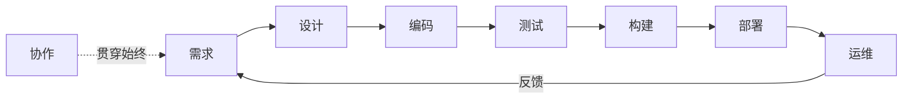

## 1. 从一个故事说起：为什么需要"工程化"

先看两个场景。

**场景 A：一个人的项目。** 小林自己开发了一个小工具，代码都在自己脑子里，改完就跑，跑通就发。没有任何文档，也没有测试，但工具只有他自己用，出了 bug 他打开编辑器五分钟就修好。这个阶段，**不需要任何工程化**——因为唯一的用户就是作者本人，唯一的"团队"也是作者本人。

**场景 B：二十个人的产品。** 同样是这个工具，现在有 20 个工程师一起开发：有人负责前端、有人负责后端、有人负责运维。小林发现：他改了数据库连接方式，负责部署的老张不知道；老张上线了新版本，负责前端的小李没跟上接口变化；三个月的某天，有人"顺手"改了一个函数签名，编译没报错，但线上功能悄悄坏掉了，直到用户投诉才发现。

同一个问题出现了：**当软件开发从"一个人"变成"一个团队"、从"一次性的小工具"变成"持续演进的系统"时，光靠个人记忆和自觉已经无法保证质量和进度了。** 工程化，就是把这套"靠人"的经验，转变成"靠制度和工具"的系统方法。

工程化不是给开发者增加负担的条条框框，而是**用科学的方法管理复杂度**：把不可靠的个人行为，变成可复制的团队流程。这就是本模块要讲的全部内容。

## 2. 工程化到底是什么

### 2.1 一个朴素的定义

工程化（Engineering Practice）可以概括为一句话：

> **把软件开发中那些"碰运气"的成分，变成"可预期"的流程。**

具体拆开看，包含三个层次：

| 层次 | 回答的问题 | 例子 |
| :--- | :--- | :--- |
| 规范性 | 怎么做才对？ | 编码规范、提交规范、文档规范 |
| 流程化 | 先做什么后做什么？ | 需求 → 设计 → 编码 → 测试 → 发布 |
| 自动化 | 哪些事不该人做？ | CI 构建、自动化测试、自动部署 |

这三层是递进关系：先有"规矩"（规范），再定"顺序"（流程），最后把重复的事情交给"机器"（自动化）。

### 2.2 工程化 ≠ 一堆文档

很多人对工程化有误解，以为工程化就是"写很多文档、开很多会、走很多审批"。恰恰相反，**文档和会议只是手段，不是目的**。如果一份文档写了没人看、一个会议开了没结论，那它们不但没有价值，反而是浪费。

判断一个工程实践是否值得，只有一个标准：

> **它是否让"整个系统"变得更可靠、更可维护、更高效？**

比如代码审查：它让每个改动在被合并前经过他人检查，减少线上事故——值得。但如果在审查时互相挑刺、拖延数周，阻碍了所有人的进度——那这个实践就执行坏了。

### 2.3 工程化的两条铁律

**铁律一：工程化的目的是降低风险，不是消灭风险。** 世界上没有"零事故"的软件系统，工程化要做的是让事故发生得更少、发生后恢复得更快、影响范围更小。

**铁律二：工程化的代价必须小于收益。** 一个小团队、小项目，采用过重的流程只会拖慢速度。工程化的深度应当与团队规模、系统复杂度、风险等级相匹配。这就是为什么后续会反复强调"适度"。

## 3. 工程化的五大核心思维

工程化不仅仅是一堆实践清单，更是一套思考方式。以下五种思维是理解所有工程实践的地基。

### 3.1 系统思维：看整体，而不是局部

**反例**：小林发现数据库查询慢，于是在查询语句后面加了个"ORDER BY"试图优化，结果问题依旧——因为慢的根本原因是缺少索引，而不是排序。

**正例**：遇到性能问题，先画一张"请求从用户到数据库的完整路径图"，看清楚瓶颈到底在哪一环，再动手。

系统思维要求我们：分析问题时，把代码、配置、网络、依赖、团队协作看作一个相互关联的整体，而不是孤立的零件。

### 3.2 权衡思维：没有银弹，只有取舍

软件工程里没有"完美方案"。用微服务换取独立部署，就要付出分布式复杂度的代价；用强一致性换取数据准确，就要付出性能的代价；用严格流程换取质量，就要付出速度的代价。

**关键问题不是"哪个方案最好"，而是"哪个方案在当下的约束下最合适"。** 任何工程决策，都要同时看到收益和代价，并明确写下来（这就是后面会讲的 ADR——架构决策记录）。

### 3.3 度量思维：用数据说话，而不是拍脑袋

"系统好像变慢了"是感觉，"P99 延迟从 120ms 涨到 350ms"是数据。感觉无法管理，数据才可以。

度量思维包含三件事：

1. **定义指标**：什么算"好"？比如"发布成功率 99%"
2. **采集数据**：如何持续测量？比如 CI 系统自动统计
3. **数据驱动决策**：根据数据决定要不要改进、改进是否生效

注意：度量不是为了考核个人，而是为了发现问题。指标设计得不好（比如只看代码行数），反而会诱导错误行为。

### 3.4 迭代思维：小步快跑，持续改进

没有人能一次设计出完美的系统。工程化的正确姿势是：**每次改进一小步，验证，再改进**。

- 功能开发：先做最小可用版本，收集反馈再迭代
- 流程改进：先在小范围试点，有效再推广
- 系统重构：分阶段进行，每次改动保持系统可用

迭代思维的反面是"憋大招"：几个月不发布，一次性上线巨大改动——一旦出问题，定位成本极高。

### 3.5 防御思维：假设一切可能出错

写代码时要默认：用户会输入奇怪的数据、网络会断、磁盘会满、依赖会升级、同事会误操作。

防御思维落地为三个习惯：

- **校验**：所有外部输入都要验证合法性
- **降级**：核心功能挂了，非核心功能要能降级继续服务
- **可恢复**：出了事故，要有预案和备份能恢复

**案例**：某支付系统在"双十一"前做了一次演练，发现如果数据库主库宕机，备用切换需要 40 分钟——远超客户可接受范围。于是团队提前优化了切换脚本，把时间缩短到 8 分钟。这就是防御思维的实战价值：**不假设"不会出事"，而是提前准备"出事怎么办"。**

## 4. 工程师素养：工程化的执行者

工程化最终要靠人来执行。一个合格的工程师，需要具备以下素养：

### 4.1 技术深度与广度

**深度**：至少在一个领域达到专家水平（比如精通数据库原理），遇到深水区问题能独立解决。**广度**：对相邻领域有基本了解（前端了解后端、后端了解运维），能跨领域协作。

深度让你"做得成"，广度让你"做得对"——因为很多问题的根源在别处。

### 4.2 沟通与协作

工程师的产出不仅是代码，还有决策与影响。一个方案再好，如果说不清楚为什么这么做，就无法获得团队支持。

好的技术沟通有三个要点：

1. **讲清楚问题**：先说明"我们面对什么问题"，再说"我建议怎么做"
2. **讲清楚理由**：方案为什么优于替代方案，用数据或原理支撑
3. **讲清楚代价**：这个方案放弃/牺牲了什么

### 4.3 学习能力

技术栈每三到五年就有一轮更新。工程化思维本身是"元能力"——掌握它之后，无论技术怎么变，你都有一套应对新问题的方法论。这比记住某个框架的用法重要得多。

### 4.4 工匠精神

"能用"和"好用"之间，隔着工匠精神：命名清晰、边界处理完善、错误信息友好、注释解释原因而非复述代码。工匠精神不是完美主义——它是在可接受的成本内，把质量做到位。

## 5. 工程实践体系全景

把工程实践按软件生命周期展开，可以看到一个完整的体系。每个阶段都有对应的关键实践。

| 阶段 | 核心问题 | 关键实践 | 本模块对应文档 |
| :--- | :--- | :--- | :--- |
| 设计 | 做什么、怎么做 | RFC、ADR、方案评审 | 设计文档规范、技术方案评审 |
| 编码 | 怎么写才正确可维护 | 编码规范、代码审查 | 代码审查清单 |
| 测试 | 怎么证明它是对的 | 单元/集成/E2E 测试 | 见 036-software-testing |
| 构建 | 怎么稳定地产出制品 | CI 流水线 | 见 031-devops |
| 部署 | 怎么安全地上线 | 灰度、回滚、蓝绿发布 | 见 031-devops |
| 运维 | 怎么保证持续可用 | 监控、告警、On-Call | On-Call 最佳实践 |
| 协作 | 怎么让团队高效 | 站会、回顾、知识分享 | 知识管理 |

注意一个容易被忽略的要点：**这个环是闭合的**。运维中发现的教训要反馈回设计阶段，形成"事故 → 复盘 → 改进 → 预防"的闭环。这也是本模块每篇文档反复出现的主题。

## 6. 实践成熟度：你的团队在哪个级别

判断一个团队的工程化水平，可以用业界广泛认可的成熟度模型（源自 CMMI 思想）。它描述了一个团队从"靠个人英雄主义"到"系统化持续改进"的五个阶段：

### L1 初始级：全靠个人

- 特征：没有流程规范，每个人按自己的习惯写代码
- 表现：项目成功与否取决于"有没有厉害的人"，人员离职=知识流失
- 典型场景：一人开发的小工具、创业初期的代码库

### L2 可重复级：经验可复制

- 特征：有基本的约定（比如命名规范、提交规范），踩过的坑会记下来
- 表现：同一件事第二次做能成功，但靠的是"老人带新人"的口口相传
- 提升动作：把口头经验书面化，建立第一个 Runbook

### L3 已定义级：流程标准化

- 特征：流程被写成文档，全员按统一流程执行
- 表现：新成员按文档即可上手，团队不依赖个别"关键人"
- 提升动作：CI/CD 落地、代码审查制度化、设计文档规范化

### L4 已管理级：量化度量

- 特征：流程不仅定义，而且用数据度量
- 表现：能回答"发布成功率是多少""平均修复时间多长""告警准确率如何"
- 提升动作：建立 SLO/SLI 指标体系，用数据驱动改进

### L5 优化级：持续改进

- 特征：基于数据主动优化流程，鼓励创新
- 表现：团队会主动消灭低效环节，比如自动化重复劳动、压缩发布周期
- 提升动作：定期复盘流程本身，引入新技术试点

**请思考：你所在的团队（或你想象中将要加入的团队）处于哪个级别？** 这不是为了评价好坏，而是为了找到"下一步改什么"。绝大多数团队卡在 L2 到 L3 之间——它们不是缺流程，而是缺"把流程写下来并坚持执行"的决心。

## 7. 核心实践原则

以下是贯穿整个工程实践模块的五条原则。理解它们，后面每篇文档都是在这些原则上的具体展开。

### 7.1 自动化优先

凡是"重复的、机械的、容易出错的"操作，都应当自动化：代码格式化交给工具、构建交给 CI、部署交给流水线、检查交给 Lint。

**为什么重要**：人做重复操作必然出错（忘了跑测试、漏了部署步骤、改了 A 忘了 B）。机器不会累、不会忘、不会"觉得这次应该没问题"。

**边界**：自动化也有成本（写脚本的时间、维护流水线的时间），所以"自动化优先"不是"什么都自动化"，而是"优先考虑自动化，当成本大于收益时再手工"。

### 7.2 文档即代码

文档与代码同仓库、同评审、同版本管理。这样做的核心价值是：**文档不会与代码脱节**。代码改了，同一次提交里的文档必须一起改，审查者会看到两者的一致性。

文档即代码的落地方式：

- 文档用 Markdown 纯文本存放（可 diff、可审查）
- 文档放在代码仓库里（与代码同目录或 docs/ 目录）
- 文档随代码一起走 CI 审查（检查链接有效性、格式合法性）
- 文档变更与代码变更在同一个 PR 里评审

### 7.3 左移：越早发现问题越便宜

软件工程有一个著名的规律：**缺陷发现得越晚，修复成本越高。** 需求阶段的错误可能只要 1 小时修复，上线后才发现则要改代码、走发布流程、通知用户，成本放大几十上百倍。

"左移"就是把质量活动往前移：需求阶段就评审需求、设计阶段就评审方案、编码阶段就写测试、合并前就做代码审查——而不是等问题上线后再说。

### 7.4 反馈闭环

任何流程都要有"结果反馈"：测试失败要通知到人、发布成功要留痕、事故复盘要有行动项、行动项要有人跟踪完成。

没有闭环的流程是形式主义：测试跑了没人看结果 = 没跑；复盘写了行动项没人落实 = 没复盘。

### 7.5 渐进式推进

工程化改造最忌讳"一刀切"：突然要求所有团队第二天起必须写 RFC、必须 100% 测试覆盖、必须两周一个发布周期——这会引发强烈抵触，最终不了了之。

正确的推进方式：

1. 选择一个痛点最明显的环节（比如"部署总出问题"）
2. 小范围试点（一个团队先跑通）
3. 验证效果，形成可复制的模板
4. 逐步推广到全团队

## 8. 从 0 到 1：一个团队的工程化落地路线

假设一个 10 人团队，代码库乱、上线靠手动、事故频发，想启动工程化改造。推荐的落地顺序（从易到难、从见效快到见效慢）：

**第一阶段（第 1 个月）：止血**

- 建立 Git 分支规范与提交规范（小成本、立刻见效）
- 引入代码格式化工具与 Lint（自动拦截低级错误）
- 建立测试环境与正式环境分离（避免"在开发环境上线"）

**第二阶段（第 2-3 个月）：自动化**

- 搭建 CI：每次提交自动跑测试与构建（让"红/绿"状态人人可见）
- 建立基本的监控与告警（先解决"出事没人知道"）
- 编写第一批 Runbook（部署手册、常见故障手册）

**第三阶段（第 4-6 个月）：制度化**

- 代码审查制度化（全员参与，明确审查标准）
- 引入设计文档（RFC/ADR），重大改动先设计再编码
- 启动事故复盘（无指责、行动项闭环）

**第四阶段（持续）：度量与优化**

- 建立 SLO 指标体系（可用性、延迟、错误率）
- 按数据优化流程（哪些告警无效、哪些环节拖慢发布）
- 定期复盘流程本身，持续改进

**关键提醒**：以上路线不是唯一正确的答案。工程化没有标准答案，只有"适合当前团队状况"的答案。落地过程中要不断问自己：**这个实践解决了真实问题吗？代价可接受吗？**

## 9. 常见误区

### 误区一：工程化 = 流程越重越好

**错误认知**：流程多了、文档多了、审批多了，就是工程化做得好。

**真相**：过重的流程会拖慢一切。工程化的深度应当与团队规模、系统风险成正比。2 个人的工具项目和 200 人的交易系统，需要的工程化程度完全不同。**判断标准永远是"收益是否大于代价"。**

### 误区二：工程化是管理者的事，与开发无关

**错误认知**：定规范、建流程是领导/PM 的事，工程师只管写代码。

**真相**：工程化的最终执行者是每一个工程师。代码审查需要你认真参与，事故复盘需要你坦诚分享，文档需要你认真编写。**没有工程师认同的工程化，只是墙上的一纸空文。**

### 误区三：工程化 = 写一堆没人看的文档

**错误认知**：工程化就是写文档，写完就完事。

**真相**：文档是手段不是目的。如果一份设计文档写完后没人评审、没人按它实现、没人更新，那它就是垃圾。文档的价值在于"被使用"，而不是"被生产"。

### 误区四：自动化之后就可以不用人管了

**错误认知**：CI 跑起来了、监控装好了，就可以高枕无忧。

**真相**：自动化系统本身也需要维护：CI 脚本要更新、监控阈值要调整、告警要定期审查是否有效。自动化把"人做重复的事"变成"人做更高级的事"，而不是"人不做事"。

## 10. 本章小结

工程化是什么：**把软件开发中"碰运气"的成分，变成"可预期"的流程。**

- 它的核心是三大递进：规范（怎么做对）→ 流程（先做什么）→ 自动化（什么交给机器）
- 它的五大思维：系统、权衡、度量、迭代、防御
- 它的完整体系：设计 → 编码 → 测试 → 构建 → 部署 → 运维 → 协作，形成闭环
- 它的成熟度：从"靠个人"到"可复制"到"已定义"到"可度量"到"持续优化"
- 它的五条原则：自动化优先、文档即代码、左移、反馈闭环、渐进式推进

## 11. 思考与练习

1. **观察练习**：回想你参与过的（或同学/朋友的）一个项目，分析它处于成熟度模型的哪个级别，并说出三个"提升到下一级"的具体动作。

2. **权衡练习**：你的团队要引入"每次发布必须经过 3 层审批"的制度。用权衡思维分析：它解决了什么问题？代价是什么？对 2 人小工具和 50 人交易系统，结论是否不同？

3. **防御练习**：列出你常用的一个系统（哪怕是手机 App）可能出错的 5 种情况，并思考每种情况的"降级方案"应该是什么。

## 12. 参考资源

- Google 工程实践文档（官方公开）：https://google.github.io/eng-practices/
- 12 因素应用（云原生应用规范）：https://12factor.net/zh_cn/
- SemVer 语义化版本规范：https://semver.org/lang/zh-CN/
- Conventional Commits 提交规范：https://www.conventionalcommits.org/zh-hans/
- CMMI 成熟度模型：https://cmmiinstitute.com/

## 13. 延伸阅读

- 本模块后续文档按软件生命周期展开：设计文档规范、代码审查清单、On-Call 最佳实践、事故复盘方法论、技术方案评审、知识管理
- 工程化在具体场景的落地，见 031-devops 模块（CI/CD、监控告警）
- Git 协作规范与工作流，见 003-git 模块
- 测试体系详解，见 036-software-testing 模块
- 软件工程方法论（需求、设计、重构），见 037-software-engineering 模块
- 架构决策与系统设计，见 038-software-architecture 模块

> **一句话记忆**：工程化不是给开发者套枷锁，而是给团队装安全网——让个人能力可放大、让团队错误可吸收、让系统演进可持续。
