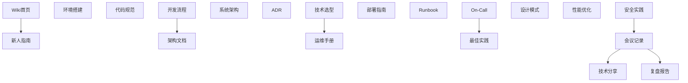

## 1. 知识管理概述

### 1.1 知识类型

| 类型     | 说明           | 示例               |
| :------- | :------------- | :----------------- |
| 显性知识 | 可文档化的知识 | API文档、架构图    |
| 隐性知识 | 经验和直觉     | 排障经验、设计直觉 |
| 过程知识 | 流程和方法     | 发布流程、应急手册 |

### 1.2 知识管理目标

| 目标     | 说明             |
| :------- | :--------------- |
| 知识沉淀 | 将经验转化为文档 |
| 知识发现 | 快速找到所需知识 |
| 知识传播 | 团队共享和传递   |
| 知识更新 | 保持知识时效性   |

## 2. 技术文档体系

### 2.1 文档分类

| 类别     | 说明           | 示例                   |
| :------- | :------------- | :--------------------- |
| 架构文档 | 系统架构和设计 | ADR、架构图            |
| API文档  | 接口定义       | OpenAPI、gRPC proto    |
| 运维文档 | 部署和运维     | Runbook、部署手册      |
| 开发文档 | 开发指南       | 编码规范、开发环境搭建 |
| 业务文档 | 业务逻辑       | 业务流程、术语表       |

### 2.2 文档即代码

| 实践         | 说明               |
| :----------- | :----------------- |
| Markdown格式 | 纯文本，版本可控   |
| 与代码同仓库 | 文档和代码同步更新 |
| CI验证       | 自动检查文档完整性 |
| 自动发布     | 文档自动构建和发布 |

## 3. Wiki建设

### 3.1 Wiki结构

### 3.2 Wiki维护

| 策略      | 说明               |
| :-------- | :----------------- |
| 指定Owner | 每个区域有负责人   |
| 定期审查  | 季度审查文档时效性 |
| 贡献激励  | 鼓励团队成员贡献   |
| 搜索友好  | 标签和索引便于搜索 |

## 4. 知识分享

### 4.1 分享形式

| 形式       | 频率 | 时长     | 适用内容    |
| :--------- | :--- | :------- | :---------- |
| 技术分享会 | 每周 | 30-60min | 技术专题    |
| 闪电演讲   | 每周 | 5-10min  | 小技巧/工具 |
| 读书会     | 每月 | 60min    | 书籍/论文   |
| 代码走读   | 按需 | 30min    | 代码设计    |
| 工作坊     | 季度 | 半天     | 实战演练    |

### 4.2 知识分享最佳实践

| 实践     | 说明             |
| :------- | :--------------- |
| 轮流主讲 | 每人都有机会分享 |
| 录制存档 | 方便回看和传播   |
| 互动讨论 | 鼓励提问和讨论   |
| 实践导向 | 结合实际项目     |
| 正向激励 | 认可和奖励分享   |

## 5. 组织学习

### 5.1 学习型组织特征

| 特征     | 说明           |
| :------- | :------------- |
| 系统思考 | 看到整体和关联 |
| 自我超越 | 持续学习和成长 |
| 心智模式 | 反思和改进思维 |
| 共同愿景 | 团队共享目标   |
| 团队学习 | 集体智慧提升   |

### 5.2 知识管理度量

| 指标         | 说明                 |
| :----------- | :------------------- |
| 文档覆盖率   | 关键系统有文档的比例 |
| 文档更新频率 | 文档最近更新的时间   |
| 搜索命中率   | 搜索能找到答案的比例 |
| 分享次数     | 团队知识分享的频次   |

## 参考文献

Google 工程实践文档：https://google.github.io/eng-practices/
12 因素应用：https://12factor.net/zh_cn/
SemVer：https://semver.org/lang/zh-CN/
Conventional Commits：https://www.conventionalcommits.org/zh-hans/

## 延伸阅读

工程实践总览，见 039-engineering-practices 模块文档。
Git 协作规范，见 003-git 模块。
CI/CD 与 DevOps，见 031-devops 模块。
黑马程序员 Bilibili 空间（https://space.bilibili.com/37974444 ）提供工程化课程。

## 深度专题扩展

以下专题从不同角度深入本文主题，供有进阶需求的读者研读。每个专题独立成节，内容相互补充。

### 13.1 Monorepo 工程化

pnpm workspace：catalog 统一版本、隔离依赖、高效安装。
原子提交：跨包变更一次提交，版本联动。
构建缓存：turbo/nx 增量构建；依赖图驱动并行。
边界治理：包间依赖显式声明，禁止隐式引用。

### 13.2 代码评审与质量门禁

门禁矩阵：lint、格式、类型、单测、构建、覆盖率阈值。
评审自动化：机器人摘要、安全扫描、依赖检查。
人工聚焦：设计、边界、测试质量与可读性。
度量：评审周期、缺陷逃逸率、门禁通过率。

## 模块文档速查表

| 文档 | 主题 | 与本文的关联 |
| --- | --- | --- |
| 工程实践概述 | 001-EngineeringPracticeOverview | 本文的前置基础 |
| 设计文档规范 | 002-DesignDocumentStandard | 本文的并列主题 |
| Code-Review-Checklist | 003-CodeReviewChecklist | 本文的并列主题 |
| On-Call最佳实践 | 004-OnCallPractice | 本文的并列主题 |
| 事故复盘方法论 | 005-IncidentRetrospectiveMethodology | 本文的并列主题 |
| 技术方案评审 | 006-TechnicalReview | 本文的并列主题 |
| 知识管理 | 007-KnowledgeManagement | 本文自身 |
