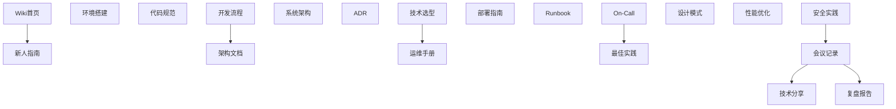
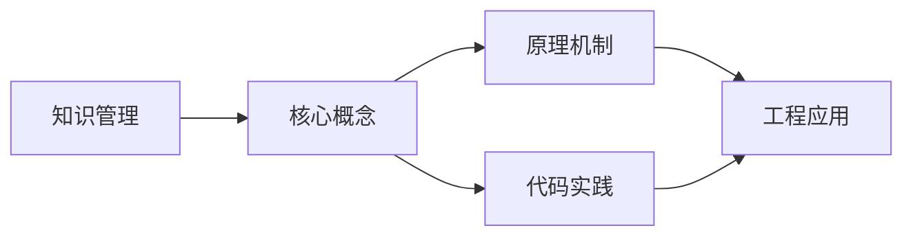
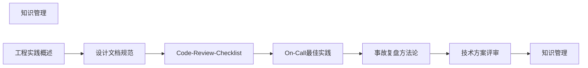

## 1. 学习目标（Bloom 分类）

本节按照布鲁姆教育目标分类学组织学习路径。本文主题为《知识管理》，属于 工程实践 模块，读者可以根据自身阶段选择阅读深度。

记忆层面：能够准确复述本文的核心概念、术语与基本语法或操作步骤，并能够在提问或检索时快速定位对应知识点。能够说出 工程实践 的核心概念、常用命令与流程。

理解层面：能够用自己的语言解释核心原理与工作机制，说明概念之间的因果关系，而不是机械记忆结论。能够解释 工程实践 的工作原理与设计动机。

应用层面：能够在真实项目或练习场景中运用本文知识解决具体问题，写出正确且可维护的实现。能够独立完成 工程实践 的标准操作。

分析层面：能够拆解复杂问题，比较本文主题与相邻概念的异同，识别边界条件与例外情况。能够分析 工程实践 使用中的异常与边界。

评价层面：能够根据约束条件（性能、可读性、安全、成本）评价不同方案的优劣，做出有依据的技术决策。能够评价 工程实践 相关工具与方案。

创造层面：能够把本文知识与其他模块知识组合，设计出新的解决方案或可复用的工程模式。能够把 工程实践 融入团队工作流。

通过本节学习，读者应当能够把《知识管理》纳入自己的知识网络，并与 工程实践 模块的其他主题（开发流程、代码规范、工具链、效能）建立关联。

## 2. 历史动机与发展脉络

《知识管理》是 工程实践 领域的重要主题。要真正理解它，需要先了解它解决的问题与演进过程。

工程实践是把软件工程原理落到日常开发的“习惯”：版本控制、代码规范、测试、评审、持续集成。
目标：可重复（任何机器可构建）、可追踪（变更可溯源）、可回滚（发布可恢复）。
现代开发者体验：脚手架、开发容器、AI 辅助、本地预览；工具链统一降低认知负担。

回到本文主题：知识管理 的提出与成熟，正是上述技术背景下的必然产物。早期实现往往以简单可用为目标，随着工程规模扩大，社区逐渐沉淀出标准做法与最佳实践；理解这一脉络，可以帮助读者判断“为什么文档中的推荐写法是现在这个样子”，也能在遇到历史遗留代码时准确识别其设计年代与取舍。

## 3. 形式化定义与核心概念精讲

本节把《知识管理》涉及的核心概念以“定义 + 讲解”的形式展开。读者应把定义当作工具，把讲解当作理解路径；两者结合才能形成可迁移的知识。

开发循环：需求 -> 分支 -> 编码 -> 测试 -> 评审 -> 合并 -> 部署 -> 监控。
代码规范：格式化（Prettier/gofmt）、Lint（ESLint/Ruff）、类型检查；自动化强制执行。
依赖管理：锁定版本、升级策略、漏洞扫描；供应链安全（SBOM）。

### 3.1 原文章节逐一精讲

原文档把主题拆分为 5 个小节，下面按顺序给出每一节的导读讲解，随后保留原文细节供精读。

#### 原文精读（完整保留）

#### 1. 知识管理概述

##### 1.1 知识类型

| 类型     | 说明           | 示例               |
| :------- | :------------- | :----------------- |
| 显性知识 | 可文档化的知识 | API文档、架构图    |
| 隐性知识 | 经验和直觉     | 排障经验、设计直觉 |
| 过程知识 | 流程和方法     | 发布流程、应急手册 |

##### 1.2 知识管理目标

| 目标     | 说明             |
| :------- | :--------------- |
| 知识沉淀 | 将经验转化为文档 |
| 知识发现 | 快速找到所需知识 |
| 知识传播 | 团队共享和传递   |
| 知识更新 | 保持知识时效性   |

#### 2. 技术文档体系

##### 2.1 文档分类

| 类别     | 说明           | 示例                   |
| :------- | :------------- | :--------------------- |
| 架构文档 | 系统架构和设计 | ADR、架构图            |
| API文档  | 接口定义       | OpenAPI、gRPC proto    |
| 运维文档 | 部署和运维     | Runbook、部署手册      |
| 开发文档 | 开发指南       | 编码规范、开发环境搭建 |
| 业务文档 | 业务逻辑       | 业务流程、术语表       |

##### 2.2 文档即代码

| 实践         | 说明               |
| :----------- | :----------------- |
| Markdown格式 | 纯文本，版本可控   |
| 与代码同仓库 | 文档和代码同步更新 |
| CI验证       | 自动检查文档完整性 |
| 自动发布     | 文档自动构建和发布 |

#### 3. Wiki建设

##### 3.1 Wiki结构

##### 3.2 Wiki维护

| 策略      | 说明               |
| :-------- | :----------------- |
| 指定Owner | 每个区域有负责人   |
| 定期审查  | 季度审查文档时效性 |
| 贡献激励  | 鼓励团队成员贡献   |
| 搜索友好  | 标签和索引便于搜索 |

#### 4. 知识分享

##### 4.1 分享形式

| 形式       | 频率 | 时长     | 适用内容    |
| :--------- | :--- | :------- | :---------- |
| 技术分享会 | 每周 | 30-60min | 技术专题    |
| 闪电演讲   | 每周 | 5-10min  | 小技巧/工具 |
| 读书会     | 每月 | 60min    | 书籍/论文   |
| 代码走读   | 按需 | 30min    | 代码设计    |
| 工作坊     | 季度 | 半天     | 实战演练    |

##### 4.2 知识分享最佳实践

| 实践     | 说明             |
| :------- | :--------------- |
| 轮流主讲 | 每人都有机会分享 |
| 录制存档 | 方便回看和传播   |
| 互动讨论 | 鼓励提问和讨论   |
| 实践导向 | 结合实际项目     |
| 正向激励 | 认可和奖励分享   |

#### 5. 组织学习

##### 5.1 学习型组织特征

| 特征     | 说明           |
| :------- | :------------- |
| 系统思考 | 看到整体和关联 |
| 自我超越 | 持续学习和成长 |
| 心智模式 | 反思和改进思维 |
| 共同愿景 | 团队共享目标   |
| 团队学习 | 集体智慧提升   |

##### 5.2 知识管理度量

| 指标         | 说明                 |
| :----------- | :------------------- |
| 文档覆盖率   | 关键系统有文档的比例 |
| 文档更新频率 | 文档最近更新的时间   |
| 搜索命中率   | 搜索能找到答案的比例 |
| 分享次数     | 团队知识分享的频次   |

### 3.2 概念关系图

下面用 Mermaid 图表达本文核心概念之间的关系，帮助读者建立整体图景：

图中展示的是本文知识的结构化关系：核心概念是入口，原理机制解释“为什么”，代码实践演示“怎么做”，工程应用回答“何时用”。读者学习时可以把每个小节的内容挂接到对应节点上。

## 4. 理论推导与原理解析

本节深入《知识管理》背后的原理。理论部分不求面面俱到，而是聚焦“能解释现象、能指导实践”的关键推导。

开发循环：需求 -> 分支 -> 编码 -> 测试 -> 评审 -> 合并 -> 部署 -> 监控。
代码规范：格式化（Prettier/gofmt）、Lint（ESLint/Ruff）、类型检查；自动化强制执行。
依赖管理：锁定版本、升级策略、漏洞扫描；供应链安全（SBOM）。
环境一致性：版本管理（nvm/pyenv）、容器化、配置文件模板。

需要强调的是，理论推导与工程实践之间存在翻译层：理论给出的是理想化模型与边界条件，工程代码则必须处理真实环境中的例外。读者在学习时应先掌握理论的“标准情形”，再通过陷阱章节了解“非标准情形”。

## 5. 代码示例与逐行讲解

本节把原文中的代码示例系统整理，并为每个示例补充用途说明与讲解。读者不应只浏览代码，而应逐段对照讲解理解设计意图。

### 5.1 示例：3.1 Wiki结构

该示例来自原文《3.1 Wiki结构》小节，用于演示知识管理相关操作。阅读时请先看代码结构，再看其后的讲解。

讲解：这段代码演示了本节核心知识点。代码中的关键操作可以归纳为三步：准备（定义或初始化）、执行（核心逻辑）、收尾（释放资源或返回结果）。实际项目中，这三步往往被封装为函数或类，以提升复用性与可测试性。

关键点分析：

该示例共 28 行有效代码，结构以数据或配置为主。阅读时应关注：数据字段的含义、配置项的作用，以及它们与运行行为的对应关系。

进阶思考路径：先尝试修改参数观察行为变化，再把示例中的模式迁移到自己的项目中；每次修改都记录预期与实测差异，这是把示例转化为能力的最快方式。

综合以上示例，可以总结出本主题的代码实践要点：第一，先定义清晰的输入输出契约；第二，核心逻辑保持单一职责；第三，错误处理与边界条件不可省略；第四，命名与注释表达意图而非复述代码。

## 6. 对比分析

对比是理解《知识管理》定位的最快路径。下面从多个维度与相邻方案进行对比。

本地开发与云端开发：本地简单，云端一致（Codespaces/Gitpod）。
monorepo 与多仓：monorepo 统一依赖与原子提交；多仓独立版本。
传统发布与持续发布：持续发布要求自动化与监控成熟。

对比的目的不是分出绝对优劣，而是建立选择依据：不同约束条件下，最优解不同。读者应把每个对比维度转化为决策检查清单。

## 7. 常见陷阱与最佳实践

本节整理该主题的高频错误与推荐做法。每个陷阱先描述现象，再解释原因，最后给出最佳实践。

### 7.1 规范靠人记

执行不一致。全部自动化（hook + CI）。

深入讲解：该问题之所以被归类为“常见陷阱”，是因为它在初学者的代码中反复出现，而且往往不在第一时间暴露——错误通常隐藏在特定数据或特定时序下。

从成因上看，规范靠人记 一般源于对 工程实践 某个机制的理解偏差：要么误用了默认行为，要么忽略了边界条件，要么把其他语言的思维惯性带了过来。

从影响上看，规范靠人记 轻则产生错误结果，重则导致资源泄漏、数据损坏或安全事故；这也是为什么工程评审中会把它列为检查项。

从修复策略上看，处理规范靠人记的正确顺序是：先复现（构造最小用例），再定位（确认机制层面的根因），最后修复并补充回归测试。跳过复现直接改代码，往往治标不治本。

### 7.2 依赖漂移

本机能跑生产崩。锁定文件 + 可复现构建。

深入讲解：该问题之所以被归类为“常见陷阱”，是因为它在初学者的代码中反复出现，而且往往不在第一时间暴露——错误通常隐藏在特定数据或特定时序下。

从成因上看，依赖漂移 一般源于对 工程实践 某个机制的理解偏差：要么误用了默认行为，要么忽略了边界条件，要么把其他语言的思维惯性带了过来。

从影响上看，依赖漂移 轻则产生错误结果，重则导致资源泄漏、数据损坏或安全事故；这也是为什么工程评审中会把它列为检查项。

从修复策略上看，处理依赖漂移的正确顺序是：先复现（构造最小用例），再定位（确认机制层面的根因），最后修复并补充回归测试。跳过复现直接改代码，往往治标不治本。

### 7.3 本地不跑测试

CI 红海。本地 pre-push 跑关键测试。

深入讲解：该问题之所以被归类为“常见陷阱”，是因为它在初学者的代码中反复出现，而且往往不在第一时间暴露——错误通常隐藏在特定数据或特定时序下。

从成因上看，本地不跑测试 一般源于对 工程实践 某个机制的理解偏差：要么误用了默认行为，要么忽略了边界条件，要么把其他语言的思维惯性带了过来。

从影响上看，本地不跑测试 轻则产生错误结果，重则导致资源泄漏、数据损坏或安全事故；这也是为什么工程评审中会把它列为检查项。

从修复策略上看，处理本地不跑测试的正确顺序是：先复现（构造最小用例），再定位（确认机制层面的根因），最后修复并补充回归测试。跳过复现直接改代码，往往治标不治本。

### 7.4 评审走过场

缺陷后置。评审清单与自动化前置。

深入讲解：该问题之所以被归类为“常见陷阱”，是因为它在初学者的代码中反复出现，而且往往不在第一时间暴露——错误通常隐藏在特定数据或特定时序下。

从成因上看，评审走过场 一般源于对 工程实践 某个机制的理解偏差：要么误用了默认行为，要么忽略了边界条件，要么把其他语言的思维惯性带了过来。

从影响上看，评审走过场 轻则产生错误结果，重则导致资源泄漏、数据损坏或安全事故；这也是为什么工程评审中会把它列为检查项。

从修复策略上看，处理评审走过场的正确顺序是：先复现（构造最小用例），再定位（确认机制层面的根因），最后修复并补充回归测试。跳过复现直接改代码，往往治标不治本。

### 7.5 环境配置手写

新人 onboarding 慢。脚手架与文档化。

深入讲解：该问题之所以被归类为“常见陷阱”，是因为它在初学者的代码中反复出现，而且往往不在第一时间暴露——错误通常隐藏在特定数据或特定时序下。

从成因上看，环境配置手写 一般源于对 工程实践 某个机制的理解偏差：要么误用了默认行为，要么忽略了边界条件，要么把其他语言的思维惯性带了过来。

从影响上看，环境配置手写 轻则产生错误结果，重则导致资源泄漏、数据损坏或安全事故；这也是为什么工程评审中会把它列为检查项。

从修复策略上看，处理环境配置手写的正确顺序是：先复现（构造最小用例），再定位（确认机制层面的根因），最后修复并补充回归测试。跳过复现直接改代码，往往治标不治本。

### 7.6 忽视代码所有权

无人负责。CODEOWNERS 与维护者。

深入讲解：该问题之所以被归类为“常见陷阱”，是因为它在初学者的代码中反复出现，而且往往不在第一时间暴露——错误通常隐藏在特定数据或特定时序下。

从成因上看，忽视代码所有权 一般源于对 工程实践 某个机制的理解偏差：要么误用了默认行为，要么忽略了边界条件，要么把其他语言的思维惯性带了过来。

从影响上看，忽视代码所有权 轻则产生错误结果，重则导致资源泄漏、数据损坏或安全事故；这也是为什么工程评审中会把它列为检查项。

从修复策略上看，处理忽视代码所有权的正确顺序是：先复现（构造最小用例），再定位（确认机制层面的根因），最后修复并补充回归测试。跳过复现直接改代码，往往治标不治本。

### 7.7 技术债不记账

积累失控。债项入库排期。

深入讲解：该问题之所以被归类为“常见陷阱”，是因为它在初学者的代码中反复出现，而且往往不在第一时间暴露——错误通常隐藏在特定数据或特定时序下。

从成因上看，技术债不记账 一般源于对 工程实践 某个机制的理解偏差：要么误用了默认行为，要么忽略了边界条件，要么把其他语言的思维惯性带了过来。

从影响上看，技术债不记账 轻则产生错误结果，重则导致资源泄漏、数据损坏或安全事故；这也是为什么工程评审中会把它列为检查项。

从修复策略上看，处理技术债不记账的正确顺序是：先复现（构造最小用例），再定位（确认机制层面的根因），最后修复并补充回归测试。跳过复现直接改代码，往往治标不治本。

### 7.8 工具链割裂

命令不统一。Makefile/Taskfile 封装。

深入讲解：该问题之所以被归类为“常见陷阱”，是因为它在初学者的代码中反复出现，而且往往不在第一时间暴露——错误通常隐藏在特定数据或特定时序下。

从成因上看，工具链割裂 一般源于对 工程实践 某个机制的理解偏差：要么误用了默认行为，要么忽略了边界条件，要么把其他语言的思维惯性带了过来。

从影响上看，工具链割裂 轻则产生错误结果，重则导致资源泄漏、数据损坏或安全事故；这也是为什么工程评审中会把它列为检查项。

从修复策略上看，处理工具链割裂的正确顺序是：先复现（构造最小用例），再定位（确认机制层面的根因），最后修复并补充回归测试。跳过复现直接改代码，往往治标不治本。

### 7.0 最佳实践总览

1. 约定优于配置：统一目录、命名、脚本入口。
2. 自动化优先：能脚本化就不手工。
3. 可观测的流程：状态、日志、指标可见。
4. 持续改进：实践季度复盘，按证据调整。

把这些最佳实践固化为团队规范与代码评审检查项，是避免同类问题反复出现的关键。

## 8. 工程实践

本节把《知识管理》放入真实工程场景，给出可复用的模式与组织方法。

项目脚手架：模板仓库 + CLI 生成器（如 create-vite）。
统一脚本：pnpm workspace 脚本、Makefile 封装复杂命令。
质量门禁：lint、类型、测试、构建四步 CI。

### 8.1 工程实践的原则拆解

以上工程实践可以归纳为四条原则。第一，配置与代码分离：工程实践 项目中环境差异应通过配置注入，而不是散落在代码分支中；这保证同一份代码可以在开发、测试、生产环境一致运行。

第二，接口稳定优先：对外接口（函数签名、协议、数据格式）一旦被消费方依赖，变更成本极高；设计时应预留扩展点并保持向后兼容。

第三，可观测性内置：日志、指标与追踪应该在功能开发时同步设计，而不是故障发生后补救；没有观测手段的模块等于黑盒。

第四，变更可回滚：任何发布都应有对应的回滚方案；数据库迁移、配置变更与代码发布一样需要版本管理与逆向路径。

### 8.2 实践落地的检查清单

- [ ] 项目脚手架：对照本节描述，检查当前项目是否已经落实；未落实的项列入技术债并排期处理。
- [ ] 统一脚本：对照本节描述，检查当前项目是否已经落实；未落实的项列入技术债并排期处理。
- [ ] 质量门禁：对照本节描述，检查当前项目是否已经落实；未落实的项列入技术债并排期处理。

工程实践的共性原则：配置与代码分离、接口稳定优先、可观测性内置、变更可回滚。这些原则适用于本主题的所有实现。

## 9. 案例研究

本节通过一个完整案例把《知识管理》的知识串起来。案例按“需求分析、方案设计、实现、验证”四步展开。

需求：统一团队的开发环境与命令。
方案：脚手架 + 统一脚本 + 开发容器 + CI 门禁。
要点：文档化的快速开始（5 分钟跑通）。
验证：新成员 onboarding 时长与 CI 绿率。

### 9.1 案例的扩展讨论

把案例中的方案放大到真实规模，需要额外考虑三个问题：

第一，规模：当数据量或并发量上升一个数量级时，原方案中的数据结构、缓存策略与任务调度是否仍然成立？通常需要引入分层与异步。

第二，团队：多人协作时，模块边界、接口契约与代码所有权必须明确；案例中的实现应拆分为可独立测试的单元，并配合文档说明设计意图。

第三，演进：上线后的需求变化不可避免；方案设计时应预留扩展点（配置化、插件化、事件化），并定期用真实指标验证假设。

案例研究的学习方法：先独立阅读需求，尝试在脑中形成方案，再对照实现与讲解，最后思考“如果约束变化（数据量、并发、团队规模），方案应如何调整”。

## 10. 知识要点总结与深入讲解

本节以讲解形式汇总全文要点，替代传统的习题与自测，读者不需要答题，只需跟随解释建立完整的认知框架。

关于《知识管理》的核心结论：

工程实践的价值在一致性：一致的流程降低协作成本。
自动化是唯一可靠的执行者。
从一个小习惯开始，逐步建立完整体系。

原文档各小节的要点回顾：

- 1. 知识管理概述：该小节围绕知识管理展开具体细节，阅读时应关注其与核心结论的对应关系；每个小节都是核心结论在某一个侧面的展开。
- 2. 技术文档体系：该小节围绕知识管理展开具体细节，阅读时应关注其与核心结论的对应关系；每个小节都是核心结论在某一个侧面的展开。
- 3. Wiki建设：该小节围绕知识管理展开具体细节，阅读时应关注其与核心结论的对应关系；每个小节都是核心结论在某一个侧面的展开。
- 4. 知识分享：该小节围绕知识管理展开具体细节，阅读时应关注其与核心结论的对应关系；每个小节都是核心结论在某一个侧面的展开。
- 5. 组织学习：该小节围绕知识管理展开具体细节，阅读时应关注其与核心结论的对应关系；每个小节都是核心结论在某一个侧面的展开。

把以上要点与第 3-9 节的内容对照复习，即可完成对本文主题的闭环学习。

## 11. 参考文献

Google 工程实践文档：https://google.github.io/eng-practices/
12 因素应用：https://12factor.net/zh_cn/
SemVer：https://semver.org/lang/zh-CN/
Conventional Commits：https://www.conventionalcommits.org/zh-hans/

## 12. 延伸阅读

工程实践总览，见 039-engineering-practices 模块文档。
Git 协作规范，见 003-git 模块。
CI/CD 与 DevOps，见 031-devops 模块。
黑马程序员 Bilibili 空间（https://space.bilibili.com/37974444 ）提供工程化课程。

## 14. 模块知识图谱与学习路径

本文属于 工程实践 模块。为了把《知识管理》放入完整的知识网络，下面列出本模块的全部主题并给出相互关联的导读。学习时建议按模块内顺序推进，并在每个文档中留意交叉引用。

上图为模块主题的推荐学习顺序示意图（仅展示前若干主题）。各主题之间存在三类关联：

第一，前置依赖关系：早期主题是后期主题的基础，例如环境与语法先行、进阶主题随后；

第二，横向并列关系：同一层级主题从不同角度覆盖模块能力，学习顺序可以按兴趣调整；

第三，工程组合关系：多个主题在真实项目中组合使用，例如配置、性能与安全主题往往出现在同一系统的不同层面。

### 14.1 模块主题速查表

| 文档 | 主题 | 与本文的关联 |
| --- | --- | --- |
| 工程实践概述 | 001-EngineeringPracticeOverview | 本文的前置基础 |
| 设计文档规范 | 002-DesignDocumentStandard | 本文的并列主题 |
| Code-Review-Checklist | 003-CodeReviewChecklist | 本文的并列主题 |
| On-Call最佳实践 | 004-OnCallPractice | 本文的并列主题 |
| 事故复盘方法论 | 005-IncidentRetrospectiveMethodology | 本文的并列主题 |
| 技术方案评审 | 006-TechnicalReview | 本文的并列主题 |
| 知识管理 | 007-KnowledgeManagement | 本文自身 |

速查表的作用是让读者快速判断：哪些文档应在阅读本文前掌握（前置基础），哪些文档应在阅读本文后继续（延伸主题）。本模块的交叉引用体系即以此表为基础。

## 15. 术语表

下表整理《知识管理》及 工程实践 模块中出现的高频术语，给出简明释义。术语按字母序或逻辑序排列，供查阅。

| 术语 | 释义 |
| --- | --- |
| 开发循环 | 需求 -> 分支 -> 编码 -> 测试 -> 评审 -> 合并 -> 部署 -> 监控。 |
| 代码规范 | 格式化（Prettier/gofmt）、Lint（ESLint/Ruff）、类型检查；自动化强制执行。 |
| 依赖管理 | 锁定版本、升级策略、漏洞扫描；供应链安全（SBOM）。 |
| 环境一致性 | 版本管理（nvm/pyenv）、容器化、配置文件模板。 |
| 规范靠人记（易错点） | 参见常见陷阱章节的详细讲解 |
| 依赖漂移（易错点） | 参见常见陷阱章节的详细讲解 |
| 本地不跑测试（易错点） | 参见常见陷阱章节的详细讲解 |
| 评审走过场（易错点） | 参见常见陷阱章节的详细讲解 |
| 环境配置手写（易错点） | 参见常见陷阱章节的详细讲解 |
| 忽视代码所有权（易错点） | 参见常见陷阱章节的详细讲解 |

术语表与正文配合使用：先通读正文，遇到模糊术语回查本表；长期使用后术语会自然进入工作记忆。

## 13. 深度专题扩展

以下专题从不同角度深入本文主题，供有进阶需求的读者研读。每个专题独立成节，内容相互补充。

### 13.1 Monorepo 工程化

pnpm workspace：catalog 统一版本、隔离依赖、高效安装。
原子提交：跨包变更一次提交，版本联动。
构建缓存：turbo/nx 增量构建；依赖图驱动并行。
边界治理：包间依赖显式声明，禁止隐式引用。

### 13.2 代码评审与质量门禁

门禁矩阵：lint、格式、类型、单测、构建、覆盖率阈值。
评审自动化：机器人摘要、安全扫描、依赖检查。
人工聚焦：设计、边界、测试质量与可读性。
度量：评审周期、缺陷逃逸率、门禁通过率。

## 16. 核心概念串讲（复习视角）

本节以“把知识讲给他人听”的方式，把《知识管理》的核心概念重新串讲一遍。与前文按章节展开不同，这里的叙述更接近课堂总结：先说整体，再逐个展开，最后收束。

《知识管理》属于 工程实践 模块。要理解它，先要理解它在模块中的位置：它解决的是该领域的一个具体问题，并依赖模块内若干前置概念；反过来，它又为后续进阶主题提供基础。

第一个概念是开发循环。需求 -> 分支 -> 编码 -> 测试 -> 评审 -> 合并 -> 部署 -> 监控。

在实际使用中，开发循环需要与相邻概念区分：它们的区别不在于名称，而在于适用条件与行为边界；这正是前文对比分析章节的意义。

第一个概念是代码规范。格式化（Prettier/gofmt）、Lint（ESLint/Ruff）、类型检查；自动化强制执行。

在实际使用中，代码规范需要与相邻概念区分：它们的区别不在于名称，而在于适用条件与行为边界；这正是前文对比分析章节的意义。

第一个概念是依赖管理。锁定版本、升级策略、漏洞扫描；供应链安全（SBOM）。

在实际使用中，依赖管理需要与相邻概念区分：它们的区别不在于名称，而在于适用条件与行为边界；这正是前文对比分析章节的意义。

接下来是开发循环。需求 -> 分支 -> 编码 -> 测试 -> 评审 -> 合并 -> 部署 -> 监控。

理解该原理的关键不是记住结论，而是记住“它从什么假设出发、推出了什么、假设不成立时会怎样”。带着这个框架复习，原理之间就会连成网络。

接下来是代码规范。格式化（Prettier/gofmt）、Lint（ESLint/Ruff）、类型检查；自动化强制执行。

理解该原理的关键不是记住结论，而是记住“它从什么假设出发、推出了什么、假设不成立时会怎样”。带着这个框架复习，原理之间就会连成网络。

接下来是依赖管理。锁定版本、升级策略、漏洞扫描；供应链安全（SBOM）。

理解该原理的关键不是记住结论，而是记住“它从什么假设出发、推出了什么、假设不成立时会怎样”。带着这个框架复习，原理之间就会连成网络。

接下来是环境一致性。版本管理（nvm/pyenv）、容器化、配置文件模板。

理解该原理的关键不是记住结论，而是记住“它从什么假设出发、推出了什么、假设不成立时会怎样”。带着这个框架复习，原理之间就会连成网络。

串讲收束：把概念与原理放回本文主题，可以得出一个总纲——定义描述是什么，原理解释为什么，实践回答怎么做。三者构成完整的学习闭环；后续遇到相关问题，都可以按这个总纲检索知识。
