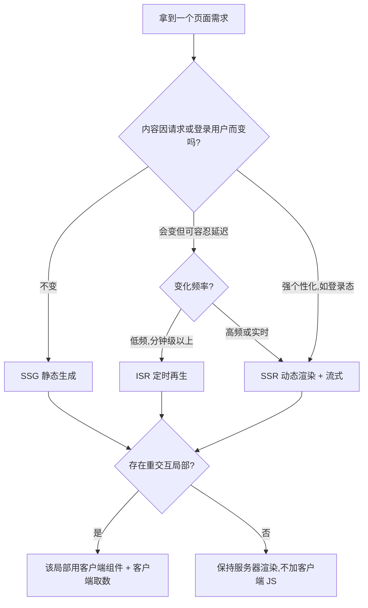

<!-- ============================================================ nextjs/001-NextJS16Overview ============================================================ -->

## 0. 五分钟创建第一个项目（先读这里）

> 学习目标：跑起一个 Next.js 项目，理解"页面文件 = 路由"。

```bash
npx create-next-app@latest my-app --ts --app --tailwind --eslint
cd my-app
npm run dev
```

**讲解：**

1. `create-next-app` 是官方脚手架：`--ts` 使用 TypeScript，`--app` 使用 App Router（当前唯一推荐），`--tailwind` 预装 Tailwind CSS v4。
2. `npm run dev` 启动开发服务器，默认地址 `http://localhost:3000`。
3. 打开 `app/page.tsx`，修改文字保存，浏览器会热更新——这就是"文件即路由"的起点。

## 1. Next.js 是什么

Next.js 是 React 的全栈元框架，由 Vercel 维护。它在 React 之上补齐了生产应用需要的：

- 文件路由与布局系统（App Router）；
- 服务器组件（Server Components）与客户端组件；
- 数据获取、缓存与增量静态再生（ISR）；
- 图片、字体、SEO 元数据的内置优化；
- 前后端一体（Route Handlers、Server Actions）。

### 1.1 版本现状（2026-08）

- Next.js 16.2.x 为 Active LTS（16.0 于 2025-10 发布；16.2.11 为 2026-07 安全版本）。
- 要求 Node.js 20.9+，推荐 Node 22 LTS；React 19.2+。
- 新项目统一使用 App Router；Pages Router 仅用于维护存量项目。

## 2. 认识项目结构

```text
my-app/
  app/
    layout.tsx      # 根布局：所有页面共享的壳（html/body）
    page.tsx        # 首页，对应路径 /
    globals.css     # 全局样式
  public/           # 静态资源（图片等）
  package.json
  tsconfig.json
  next.config.ts    # Next.js 配置文件
```

**讲解：**

1. `app/` 目录下的每个文件都映射路由：`page.tsx` 是页面，`layout.tsx` 是布局。
2. 组件默认是**服务器组件**：在服务器上渲染成 HTML 再发给浏览器，代码里可以直接读数据库、访问环境变量。
3. 需要交互（onClick、useState）的文件要在顶部写 `"use client"`，标记为客户端组件。

## 3. 第一个页面：服务器组件

```tsx
// app/page.tsx
export default function Home() {
  return (
    <main>
      <h1>你好，Next.js 16</h1>
      <p>这个页面在服务器上渲染，浏览器里能看到完整 HTML。</p>
    </main>
  )
}
```

**讲解：**

1. `export default function Home()` 是页面组件的固定写法，文件名决定路由，函数名只用于开发调试。
2. 没有 `"use client"` 的组件默认是服务器组件：用户点击"查看源代码"能看到渲染好的完整内容，SEO 友好。
3. `main` 等语义化标签与 HTML 一致，配合 Tailwind 类名即可快速排版。

## 4. 动手试试

1. 在 `app/about/page.tsx` 新建一个"关于"页面，访问 `/about` 看是否生效。
2. 在首页加一张图片：把图片放进 `public/`，用 ``（进阶后用官方 `next/image`）。
3. 新建 `app/contact/page.tsx`，用 `<Link href="/about">` 在页面之间跳转（下一章详解路由）。

## 5. 一句话记住

> Next.js = React + 文件路由 + 服务器渲染；`app/` 里放 `page.tsx` 就有页面，默认服务器组件、需要交互才加 `"use client"`。

<!-- ============================================================ nextjs/002-AppRouterRouting ============================================================ -->

## 0. 一句话理解

> App Router 的文件约定：`page.tsx` 是页面、`layout.tsx` 是共享壳、`[参数]` 文件夹是动态路由、`loading/error/not-found` 是三种状态页面。

## 1. 布局嵌套

```tsx
// app/layout.tsx：根布局
import type { Metadata } from "next"

export const metadata: Metadata = {
  title: "我的站点",
  description: "Next.js 16 学习示例"
}

export default function RootLayout({
  children
}: Readonly<{ children: React.ReactNode }>) {
  return (
    <html lang="zh-CN">
      <body>
        <header>全站导航</header>
        {children}
        <footer>页脚</footer>
      </body>
    </html>
  )
}
```

**讲解：**

1. `layout.tsx` 接收 `children`（子路由渲染结果），布局本身在切换子页面时**不会重新渲染**，导航条写在布局里可以避免整页刷新。
2. `metadata` 导出对象用于设置页面标题与描述，Next.js 会自动注入 `<head>`，这是内置 SEO 能力。
3. `lang="zh-CN"` 声明页面语言，有利于无障碍与搜索引擎。

## 2. 动态路由

创建文件夹 `app/posts/[id]/page.tsx`：

```tsx
import { notFound } from "next/navigation"

export default async function PostPage({
  params
}: {
  params: Promise<{ id: string }>
}) {
  const { id } = await params
  if (!/^\d+$/.test(id)) notFound()

  return <main>文章编号：{id}</main>
}
```

**讲解：**

1. 文件夹名 `[id]` 表示动态段：`/posts/42` 会匹配并把 `id` 设为 `"42"`。
2. Next.js 15+ 中 `params` 是 Promise，必须 `await` 后才能读取。
3. `notFound()` 会触发最近的 `not-found.tsx`，返回 404 页面；示例用正则校验"必须是数字"。
4. 多段动态路由用 `[...slug]`（匹配 1 段以上）或 `[[...slug]]`（可匹配 0 段）。

## 3. 导航

```tsx
import Link from "next/link"

export default function Nav() {
  return (
    <nav>
      <Link href="/">首页</Link>
      <Link href="/about">关于</Link>
      <Link href={`/posts/${42}`}>文章 42</Link>
    </nav>
  )
}
```

**讲解：**

1. `next/link` 是客户端导航：点击后不会整页刷新，Next.js 会预取视口内的链接页面。
2. 服务端组件里也能用 `Link`，它最终在客户端接管导航。
3. 编程式跳转用 `useRouter()`（来自 `next/navigation`，必须在 `"use client"` 组件里）。

## 4. 加载与错误状态

```tsx
// app/posts/[id]/loading.tsx
export default function Loading() {
  return <p>加载中……</p>
}
```

```tsx
// app/posts/[id]/error.tsx（"use client" 是必须的）
"use client"

export default function Error({ reset }: { reset: () => void }) {
  return (
    <div>
      <p>出错了</p>
      <button onClick={reset}>重试</button>
    </div>
  )
}
```

**讲解：**

1. `loading.tsx` 在路由进入 Suspense 加载态时显示，配合流式渲染避免白屏。
2. `error.tsx` 必须标注 `"use client"`，因为错误边界需要在浏览器里捕获并交互。
3. `reset` 函数由 Next.js 注入，点击后重新渲染出错的页面。

## 5. 动手试试

1. 给 `app/posts/[id]/page.tsx` 加 `generateStaticParams`，预习静态生成：
   ```tsx
   export function generateStaticParams() {
     return [{ id: "1" }, { id: "2" }]
   }
   ```
2. 在 `app/posts/` 下新建 `not-found.tsx`，访问一个非数字 id，确认 404 页面生效。
3. 把导航改成动态生成的文章列表（先写死 5 个 id）。

## 6. 一句话记住

> 路由就是文件夹约定：`page` 管页面、`layout` 管外壳、`[id]` 管动态参数、`loading/error/not-found` 管三种状态。

<!-- ============================================================ nextjs/003-DataFetchingCaching ============================================================ -->

## 0. 一句话理解

> 服务器组件里可以直接 `await fetch()` 拿数据；缓存策略就三个词：`force-cache` 存起来、`no-store` 不存、`revalidate` 定期更新。

## 1. 服务器组件直接取数

```tsx
// app/posts/page.tsx
interface Post {
  id: number
  title: string
}

export default async function PostsPage() {
  const res = await fetch("https://jsonplaceholder.typicode.com/posts")
  const posts: Post[] = await res.json()

  return (
    <ul>
      {posts.slice(0, 10).map((post) => (
        <li key={post.id}>{post.title}</li>
      ))}
    </ul>
  )
}
```

**讲解：**

1. 页面组件标 `async` 后可直接 `await` 网络请求——这段代码运行在服务器上，不会出现在浏览器端 JS 里。
2. `res.json()` 把响应解析为对象数组；用 `interface Post` 声明类型后，`post.title` 有完整类型提示。
3. `key` 属性是 React 列表渲染的要求，用稳定的 `post.id` 而不是数组下标。

## 2. 缓存策略

```tsx
// 静态：构建时抓一次，之后直接读缓存（默认）
await fetch("https://api.example.com/static")

// 动态：每次请求都重新抓取
await fetch("https://api.example.com/dynamic", { cache: "no-store" })

// 增量：每 60 秒后台重新生成一次
await fetch("https://api.example.com/price", { next: { revalidate: 60 } })
```

**讲解：**

1. 不传选项时 Next.js 会尽力静态化：构建时抓取并缓存，适合内容型页面。
2. `cache: "no-store"` 跳过缓存，适合登录态、实时库存等数据。
3. `next.revalidate: 60` 实现 ISR：用户仍读到旧缓存，后台每 60 秒最多重建一次，兼顾速度与新鲜度。

## 3. 客户端数据获取

```tsx
"use client"

import { useEffect, useState } from "react"

export default function LiveTime() {
  const [now, setNow] = useState("")

  useEffect(() => {
    const timer = setInterval(() => {
      setNow(new Date().toLocaleTimeString())
    }, 1000)
    return () => clearInterval(timer)
  }, [])

  return <p>现在时间：{now}</p>
}
```

**讲解：**

1. 需要实时更新、用户交互的数据才放客户端组件（`"use client"`）。
2. `useEffect` 在浏览器挂载后执行，`return () => clearInterval(timer)` 是清理函数，防止组件卸载后定时器泄漏。
3. 更复杂的数据请求建议使用 `useSWR` 或 TanStack Query 管理缓存与重试。

## 4. Server Actions：表单提交

```tsx
// app/contact/page.tsx
async function submit(formData: FormData) {
  "use server"

  const name = formData.get("name")
  // 生产环境：写入数据库或调用 API
  console.log("收到提交：", name)
}

export default function ContactPage() {
  return (
    <form action={submit}>
      <input name="name" placeholder="你的名字" required />
      <button type="submit">提交</button>
    </form>
  )
}
```

**讲解：**

1. 函数内部标注 `"use server"` 后成为 Server Action：浏览器把表单数据发给服务器执行，不需要自己写 API 路由。
2. `formData.get("name")` 读取表单字段，字段名以 `input` 的 `name` 属性为准。
3. 没有 JavaScript 也能提交，这是渐进增强；执行成功后可用 `revalidatePath("/")` 刷新相关页面缓存。

## 5. 动手试试

1. 把首页改成从 `jsonplaceholder` 拉取 10 条文章并展示。
2. 给文章列表加 `{ next: { revalidate: 30 } }`，观察构建日志中的重新验证行为。
3. 写一个 Server Action 收集"订阅邮箱"，提交后在页面上方显示成功提示（提示可用 `useActionState`）。

## 6. 一句话记住

> 能服务器取数就在服务器取；`no-store` 求实时、`revalidate` 求平衡、默认缓存求速度；表单用 Server Action 最省事。

<!-- ============================================================ nextjs/004-DeploymentOptimization ============================================================ -->

## 0. 一句话理解

> 部署 = `next build` 产出优化后的产物；优化 = 图片走 next/image、字体走 next/font、慢查询加缓存。

## 1. 构建与产物

```bash
npm run build
```

**讲解：**

1. 构建时 Next.js 会输出三类页面：静态页（SSG）、ISR 页（按 revalidate 更新）、动态页（SSR 或客户端渲染）。
2. 构建日志里 `○` 表示静态、`ƒ` 表示动态、`●` 表示 ISR，新项目应尽量让更多页面静态化。
3. 产物默认输出到 `.next/`；用 Docker 部署时参考 `next.config.ts` 的 `output: "standalone"` 模式，只复制运行所需文件。

## 2. 环境变量

```bash
# .env.local（仅本机，不提交 git）
DATABASE_URL="postgres://..."
NEXT_PUBLIC_SITE_URL="https://example.com"
```

```tsx
// 服务端读取
const dbUrl = process.env.DATABASE_URL
// 客户端读取（必须 NEXT_PUBLIC_ 前缀，会打包进浏览器代码）
const siteUrl = process.env.NEXT_PUBLIC_SITE_URL
```

**讲解：**

1. 不带前缀的变量只在服务器端可用，密钥（数据库密码、API Key）绝不能加 `NEXT_PUBLIC_`。
2. 以 `NEXT_PUBLIC_` 开头的变量会被内联进浏览器包，任何人都能看到，只放公开信息。
3. 生产环境在部署平台配置同名变量即可覆盖，不需要改代码。

## 3. 图片与字体优化

```tsx
import Image from "next/image"
import { Inter } from "next/font/google"

const inter = Inter({ subsets: ["latin"] })

export default function Home() {
  return (
    <main className={inter.className}>
      <Image
        src="/hero.png"
        alt="首页横幅"
        width={1200}
        height={600}
        priority
      />
    </main>
  )
}
```

**讲解：**

1. `next/image` 自动做响应式尺寸、WebP/AVIF 转换与懒加载；`priority` 让首屏图片提前加载。
2. `width/height` 必须提供，用来预留空间防止布局偏移（CLS）。
3. `next/font` 自动托管字体并优化加载，避免第三方字体阻塞渲染；中文字体体积大，建议只引入需要的字重或使用子集。

## 4. 核心性能指标自查

| 指标 | 含义 | 常见优化 |
| --- | --- | --- |
| LCP | 最大内容绘制（首屏） | 图片加 priority、减少阻塞脚本、服务端渲染关键内容 |
| CLS | 布局偏移 | 图片/字体预留尺寸，避免内容弹出 |
| INP | 交互延迟 | 减少客户端 JS、拆分组件、避免长任务 |
| TTFB | 首字节时间 | 使用 CDN 边缘缓存、数据库查询优化、ISR |

## 5. 部署方式选择

- **Vercel**：官方平台，push 即部署，推荐学习与中小企业使用；
- **自托管 Node**：`output: "standalone"` + Docker + Nginx 反向代理；
- **静态导出**：纯静态站可 `output: "export"` 部署到任意静态托管，但会失去 SSR/ISR 能力。

## 6. 动手试试

1. 把项目部署到 Vercel（`vercel` 命令或 GitHub 导入），观察构建日志中的路由类型。
2. 用 Chrome DevTools 的 Lighthouse 跑一次性能报告，对照上表优化其中一项。
3. 写一个 Dockerfile（多阶段构建 + standalone 输出），本地 `docker build` 成功。

## 7. 一句话记住

> 构建时能静态就静态，密钥只进服务端环境变量，图片字体交给 next/image 与 next/font，性能报告用 Lighthouse 说话。

<!-- ============================================================ nextjs/005-RouteHandlersApi ============================================================ -->

## 0. Route Handlers 是什么（先读这里）

> 学习目标：理解 `route.ts` 与 `page.tsx` 的分工；会导出 GET/POST/PUT/DELETE 响应各 HTTP 方法；会用动态段 params 与 searchParams 接收参数；会用 NextRequest/NextResponse 处理 Cookie、重定向与流式响应；能说清 GET 接口的缓存语义，并落地统一的错误处理与状态码规范。

Route Handler 是 Next.js 内置的"后端"：在 `app` 目录下创建 `route.ts`，导出与 HTTP 方法同名的异步函数，即可对外提供真实接口，不必再单独维护一个 Express/Koa 服务。

```text
app/
  api/
    todos/
      route.ts          # 对应 /api/todos（集合级接口）
      [id]/
        route.ts        # 对应 /api/todos/42（单条资源接口）
```

| 对比项 | page.tsx（页面） | route.ts（接口） |
| --- | --- | --- |
| 对外产出 | 渲染好的 HTML / React UI | HTTP 响应（JSON、文本、流） |
| 典型调用方 | 浏览器地址栏、`<Link>` 导航 | fetch、curl、移动端、第三方系统 |
| 必须导出 | default 的 React 组件 | 与方法同名的函数：GET、POST 等 |
| 返回值 | JSX | Web 标准 Response 对象 |
| 同目录关系 | 两者不能共存，一个文件夹二选一 | 同左 |

**讲解：**

1. 同一个文件夹里 `page.tsx` 与 `route.ts` 互斥：该路径要么渲染页面、要么响应接口，同时存在会在构建时报错。
2. `route.ts` 里的代码只在服务器执行，可以直接连数据库、读取环境变量密钥，不会被打包进浏览器 JS。
3. 它完全基于 Web 标准 Request/Response API，与各类边缘运行时的写法一致，学习一次即可多处复用。

## 1. 导出 HTTP 方法：GET / POST / PUT / DELETE

一个 `route.ts` 可以同时导出多个方法函数，分别响应不同的 HTTP 动词。

```tsx
// app/api/todos/route.ts
// 说明：db 为任意数据库客户端（如 Prisma），此处仅示意

// GET /api/todos：查询列表
export async function GET() {
  const todos = await db.todo.findMany({ orderBy: { id: "desc" } })
  return Response.json(todos) // 快捷返回 JSON，状态码默认 200
}

// POST /api/todos：新建
export async function POST(request: Request) {
  const body = await request.json() // 读取 JSON 请求体
  if (!body?.title) {
    return Response.json({ error: "title 必填" }, { status: 400 })
  }
  const todo = await db.todo.create({ data: { title: String(body.title) } })
  return Response.json(todo, { status: 201 }) // 201 表示资源创建成功
}

// DELETE /api/todos?id=3：删除（查询参数用法见第 2 节）
export async function DELETE(request: Request) {
  const id = new URL(request.url).searchParams.get("id")
  if (!id) {
    return Response.json({ error: "id 必填" }, { status: 400 })
  }
  await db.todo.delete({ where: { id: Number(id) } })
  return new Response(null, { status: 204 }) // 204：成功但无响应体
}
```

**讲解：**

1. 只有导出的方法才能被调用：只导出 `GET` 的接口收到 POST 请求会返回 405 Method Not Allowed。
2. `Response.json()` 是标准快捷方式；`new Response(null, { status: 204 })` 常用于"成功但无内容"的删除场景。
3. REST 风格约定：GET 读、POST 建、PUT/PATCH 改、DELETE 删；集合用名词复数（`/api/todos`），单条资源用动态段（`/api/todos/[id]`）。

## 2. 动态段与查询参数：params 与 searchParams

动态段文件夹（如 `[id]`）会把 URL 片段注入 `params`。注意：Next.js 15 起 `params` 与 `searchParams` 都是 Promise，必须先 `await` 再读取。

```tsx
// app/api/todos/[id]/route.ts
// 说明：db 为任意数据库客户端，此处仅示意

interface RouteContext {
  params: Promise<{ id: string }> // 动态段参数是异步的，类型上就是 Promise
}

// GET /api/todos/42：查询单条
export async function GET(_request: Request, { params }: RouteContext) {
  const { id } = await params // 先 await 拿到 { id: "42" }
  const numId = Number(id)
  if (!Number.isInteger(numId)) {
    return Response.json({ error: "id 必须是数字" }, { status: 400 })
  }
  const todo = await db.todo.findUnique({ where: { id: numId } })
  if (!todo) {
    return Response.json({ error: "资源不存在" }, { status: 404 })
  }
  return Response.json(todo)
}

// PUT /api/todos/42：整体更新
export async function PUT(request: Request, { params }: RouteContext) {
  const { id } = await params
  const body = await request.json()
  const todo = await db.todo.update({
    where: { id: Number(id) },
    data: { done: Boolean(body.done) },
  })
  return Response.json(todo)
}
```

```tsx
// app/api/search/route.ts —— 查询参数示例：/api/search?q=next&page=2
import { NextRequest } from "next/server"

export async function GET(request: NextRequest) {
  // NextRequest 提供 nextUrl，读取查询参数比手动解析 request.url 更顺手
  const q = request.nextUrl.searchParams.get("q") ?? ""
  const page = Number(request.nextUrl.searchParams.get("page") ?? 1)
  const results = await searchPosts(q, page) // 按关键词分页检索（示意）
  return Response.json({ q, page, results })
}
```

**讲解：**

1. `params` 对应路径中的动态段（`[id]` 单段、`[...slug]` 捕获多段），`searchParams` 对应 `?key=value` 查询串；两者都必须 `await`。
2. 使用 `NextRequest` 时用 `request.nextUrl.searchParams.get("key")` 读取查询参数；用普通 `Request` 时可自行 `new URL(request.url)` 解析。
3. 动态段的值永远是字符串，转数字前必须校验，非法输入直接返回 400，避免脏数据打到数据库。

## 3. 请求与响应：NextRequest 与 NextResponse

`next/server` 提供两个增强类型：`NextRequest` 简化读取 Cookie、查询串与请求地址；`NextResponse` 在 Response 之上支持设置 Cookie、重定向与改写。

```tsx
// app/api/legacy/route.ts
import { NextRequest, NextResponse } from "next/server"

export async function GET(request: NextRequest) {
  // 读取 Cookie：等价于手动解析 request.headers.get("cookie")
  const hasSession = request.cookies.has("session")

  // 旧版本调用方：重定向到新接口
  if (request.nextUrl.searchParams.get("v") === "1") {
    return NextResponse.redirect(new URL("/api/v2/legacy", request.url))
  }

  const res = NextResponse.json({ ok: true, hasSession })
  res.headers.set("Cache-Control", "no-store") // 动态接口显式禁止任何缓存
  return res
}
```

**讲解：**

1. `request.cookies.get(name)?.value` / `res.cookies.set(name, value, options)` 是类型安全的 Cookie 读写通道，set 时可指定 httpOnly、maxAge 等属性。
2. `NextResponse.redirect(new URL(目标, request.url))` 用于跳转；`NextResponse.rewrite()` 则在不改变浏览器地址的情况下把请求改写到另一路径。
3. 处理函数签名是 `(request, context)`：第二个参数只在动态路由里有意义，非动态路由可像第 1 节那样直接省略。

## 4. 流式响应：边生成边发送

返回值是标准 Response，因此可以直接返回 `ReadableStream`，实现"生成多少、发送多少"的流式输出，适合大文本导出、AI 逐字回答等场景。

```tsx
// app/api/stream/route.ts
export async function GET() {
  const encoder = new TextEncoder() // 流中只能传二进制，字符串需先编码

  const stream = new ReadableStream({
    async start(controller) {
      for (const word of ["你好", "，", "世界", "！"]) {
        controller.enqueue(encoder.encode(word)) // 每推一段，客户端立即收到一段
        await new Promise((resolve) => setTimeout(resolve, 300)) // 模拟逐步生成的耗时
      }
      controller.close() // 发送完毕，必须关闭流
    },
  })

  return new Response(stream, {
    headers: { "Content-Type": "text/plain; charset=utf-8" },
  })
}
```

**讲解：**

1. 客户端用 `response.body.getReader()` 逐段读取；配合 `text/event-stream` 等协议可实现打字机效果，页面无需等待完整响应。
2. 典型场景：服务端转发大模型回答、按批导出大 CSV，显著降低首字节等待时间（TTFB）。
3. 流式响应始终按动态处理，不会被静态缓存；具体的流式协议选择与边界情况以官方文档为准。

## 5. 缓存语义：GET 接口什么时候会被缓存

Route Handler 的缓存行为经历过一次重要转向：早期版本（13/14）默认缓存 GET 请求，Next.js 15 起改为默认不缓存，改由开发者显式声明（当前版本的细节以官方文档为准）。POST/PUT/DELETE 等写操作从不缓存。

| 控制手段 | 写法 | 效果 |
| --- | --- | --- |
| 默认（15 起） | 不做任何声明 | GET 每次请求都执行，等价于动态接口 |
| 路由段配置 | `export const dynamic = "force-static"` | GET 在构建期执行一次并缓存为静态 |
| 路由段配置 | `export const revalidate = 60` | 缓存 60 秒，后台定时再生（ISR） |
| 路由段配置 | `export const dynamic = "force-dynamic"` | 强制每次请求都执行；读取 Cookie 等动态 API 时也会自动进入动态模式 |
| fetch 级别 | `{ next: { revalidate: 30 } }` | 只控制这一次取数自身的缓存 |

```tsx
// app/api/stats/route.ts
export const revalidate = 60 // 访问统计 60 秒内复用缓存，扛住高频轮询

export async function GET() {
  const stats = await db.metrics.aggregate() // 聚合查询较重，适合加缓存
  return Response.json(stats)
}
```

**讲解：**

1. 缓存只对 GET 生效；写接口永远直达服务器执行，不必担心"返回了缓存的写入结果"。
2. 默认不缓存让动态接口更安全：涉及登录态、库存、价格的接口，不声明就不会被意外静态化。
3. 值得缓存的接口是"读得多、变得慢"的那类（统计、榜单、配置）；拿不准时先保持默认动态，再依据监控数据逐步加缓存。

## 6. 统一错误处理与状态码

散落的 try/catch 很快会失控。推荐封装统一的响应工具：成功与失败结构一致，任何情况下客户端都能用同一套解析逻辑。

```tsx
// lib/api.ts —— 统一响应工具
export function ok<T>(data: T, status = 200) {
  return Response.json({ success: true, data }, { status })
}

export function fail(message: string, status = 400) {
  return Response.json({ success: false, error: message }, { status })
}
```

```tsx
// app/api/todos/[id]/route.ts
import { fail } from "@/lib/api"

export async function DELETE(
  _request: Request,
  { params }: { params: Promise<{ id: string }> },
) {
  try {
    const { id } = await params
    const numId = Number(id)
    if (!Number.isInteger(numId)) {
      return fail("id 必须是整数", 400) // 客户端错误：参数不合法
    }
    await db.todo.delete({ where: { id: numId } })
    return new Response(null, { status: 204 })
  } catch (err) {
    console.error("删除 todo 失败:", err) // 服务端只记日志，不向外泄露细节
    return fail("服务器内部错误", 500) // 客户端只看到笼统的 500
  }
}
```

常用状态码速查：

| 状态码 | 含义 | 典型场景 |
| --- | --- | --- |
| 200 / 201 | 成功 / 已创建 | 查询成功；POST 新建成功 |
| 204 | 成功无内容 | DELETE 成功 |
| 400 | 参数错误 | 缺字段、格式非法 |
| 401 / 403 | 未登录 / 无权限 | 会话缺失；普通用户删他人数据 |
| 404 | 资源不存在 | id 查不到对应记录 |
| 405 | 方法不允许 | 用 POST 访问只导出 GET 的接口 |
| 500 | 服务器错误 | 数据库宕机、代码异常 |

**讲解：**

1. 4xx 归因于调用方（参数、权限），5xx 归因于服务器；错误文案要告诉调用方"该做什么"，而不是抛出内部堆栈。
2. 不要把 `err.message` 原样返回给客户端，避免泄露表结构、文件路径等内部信息。
3. 统一的 `{ success, data | error }` 结构，让前端可以用同一个响应解析器处理全部接口，减少散落的 if 判断。

## 7. 动手试试

1. 为第 3 篇的文章列表补一套接口：`/api/posts`（GET/POST）与 `/api/posts/[id]`（GET/DELETE），用 `curl -i` 逐一验证状态码。
2. 给 `/api/posts` 加 `export const revalidate = 30`，在 `next build` 日志里观察它的缓存类型变化。
3. 写一个流式接口逐字输出一句话，前端用 `res.body.getReader()` 渲染打字机效果。

## 小结与延伸

> `route.ts` 导出方法即接口：params/searchParams 记得 `await`；NextRequest/NextResponse 管 Cookie 与跳转；GET 是否缓存由你显式声明；错误统一封装，4xx 说人话、5xx 不泄密。

- 接口只负责"承形"；本应用内部的改数据操作更推荐 Server Actions，见第 6 篇《Server Actions 与表单》。
- 缓存语义与渲染策略的全局视角，见第 3 篇《Next.js 数据获取与缓存》与第 7 篇《渲染策略与缓存》。
- 接口的鉴权与安全响应头设置，见第 8 篇《认证、代理与安全》。
- 更多接口细节（如 Edge 与 Node 运行时差异、Webhook 校验）以官方文档为准。

<!-- ============================================================ nextjs/006-ServerActionsForms ============================================================ -->

## 0. Server Actions 是什么（先读这里）

> 学习目标：会用 `'use server'` 定义 Server Action 并绑定到 `<form action>`；会用 `useActionState` 把校验错误带回表单并回填输入；会用 `useFormStatus` / `useTransition` 展示提交中状态；会用 zod 在服务端做强校验；会用 `revalidatePath` / `revalidateTag` 失效缓存；理解渐进增强与"Action 是公开端点"的安全模型。

改数据有两条路：Route Handler（自己定义接口、自己 fetch）与 Server Actions（框架代劳）。后者把"表单提交、服务器执行、缓存更新"串成一个函数调用，是 App Router 时代写表单的首选。

| 对比项 | Route Handler | Server Actions |
| --- | --- | --- |
| 定位 | 通用 HTTP 接口，供任何调用方使用 | 专为本应用 UI 服务的"服务器函数" |
| 调用方式 | fetch + 手写 URL 与方法 | 直接 `import` 函数或绑定 `<form action>` |
| 请求协议 | HTTP/JSON，格式自己约定 | 框架自动序列化（内部走 POST） |
| 错误处理 | 手动解析响应与状态码 | 返回值直接进入 React 状态 |
| 适合场景 | 开放 API、Webhook、第三方回调 | 表单提交、增删改、按钮触发 |

**讲解：**

1. Server Actions 并没有"消灭"后端：它本质仍是框架托管的 HTTP 端点，只是 URL、序列化与调用协议都不再需要你操心。
2. 需要精确控制 HTTP 语义、供外部系统调用时用 Route Handler（见第 5 篇）；本应用内部的表单与按钮用 Server Actions。
3. 两者可共存：Action 负责页面交互，Handler 负责开放能力，底层共享同一套数据库访问代码。

## 1. 第一个 Server Action：'use server' 与 form action

Action 就是标了 `'use server'` 的 async 函数。有两种定义位置：独立文件（文件顶部声明）或内联在组件里（函数体首行声明）。

```ts
// app/todos/actions.ts
"use server" // 文件级声明：此文件所有导出函数都是 Server Action

import { db } from "@/lib/db" // db 为任意数据库客户端，此处仅示意

// 约定：入参 FormData，返回 void 或可序列化对象
export async function addTodo(formData: FormData) {
  const title = String(formData.get("title") ?? "").trim()
  if (!title) return // 最简示例：真实项目必须用 zod 校验，见第 4 节
  await db.todo.create({ data: { title, done: false } })
}
```

```tsx
// app/todos/page.tsx
import { addTodo } from "./actions"

export default function TodoPage() {
  return (
    <form action={addTodo}> {/* action 绑定服务器函数，而不是 onSubmit */}
      <input name="title" placeholder="要做什么？" required />
      <button type="submit">添加</button>
    </form>
  )
}
```

**讲解：**

1. 独立 `actions.ts` 利于复用与测试；内联写法是在 async 函数体首行写 `'use server'`，只有该函数是 Action，适合一次性小逻辑。
2. Action 的入参与返回值必须可序列化（字符串、数字、普通对象、FormData），不能传类实例、函数等无法跨越网络的结构。
3. `<form action={addTodo}>` 的 `action` 接收函数：提交时浏览器把 FormData 以 POST 发给服务器执行，相当于一次隐藏的 RPC。

## 2. useActionState：把结果带回表单

Action 的返回值不会自动更新 UI，需要用 `useActionState`（React 19 内置）接进组件状态。

```ts
// lib/form.ts —— Action 状态的统一类型
export type FormState = {
  message: string // 整体提示
  fieldErrors: Record<string, string[]> // 字段级错误：title -> ["标题不能为空"]
  values: Record<string, string> // 提交前的输入，用于回填
}

export const emptyState: FormState = { message: "", fieldErrors: {}, values: {} }
```

```ts
// app/todos/actions.ts（节选）
"use server"

import { revalidatePath } from "next/cache"
import { emptyState, type FormState } from "@/lib/form"

export async function addTodo(_prev: FormState, formData: FormData): Promise<FormState> {
  // 签名固定：(上一次状态, 表单数据) => 新状态
  const title = String(formData.get("title") ?? "").trim()
  if (!title) {
    return { ...emptyState, fieldErrors: { title: ["标题不能为空"] } }
  }
  await db.todo.create({ data: { title, done: false } })
  revalidatePath("/todos") // 新增后失效列表缓存（见第 5 节）
  return { ...emptyState, message: "已添加" }
}
```

```tsx
// app/todos/form.tsx —— 客户端组件
"use client"

import { useActionState } from "react"
import { addTodo } from "./actions"
import { emptyState } from "@/lib/form"

export function TodoForm() {
  // 返回 [状态, 提交函数, 是否提交中]
  const [state, formAction, pending] = useActionState(addTodo, emptyState)

  return (
    <form action={formAction}>
      {/* defaultValue 用上次提交的值回填，校验失败不丢输入 */}
      <input name="title" defaultValue={state.values.title} required />
      {state.fieldErrors.title?.[0] && <p>{state.fieldErrors.title[0]}</p>}
      <button type="submit" disabled={pending}>
        {pending ? "提交中" : "添加"}
      </button>
    </form>
  )
}
```

**讲解：**

1. `useActionState(fn, initialState)` 的 `fn` 签名固定为 `(prevState, formData) => newState`；第一个参数是上一次返回的状态，初始为 `initialState`。
2. 第三个返回值 `pending` 表示提交进行中，可直接禁用按钮；不用它时也可用 `useFormStatus`（见第 3 节）。
3. 想回填输入就要在返回的状态里带上 `values`：服务器读 FormData 时顺手把原值放回去，经 `defaultValue` 显示。

## 3. 提交中状态：useFormStatus 与 useTransition

| 手段 | 用法 | 适用场景 |
| --- | --- | --- |
| `useActionState` 第三返回值 | 直接拿 `pending` | 已在用 useActionState 的表单 |
| `useFormStatus` | 表单子组件内读取 pending | 把提交按钮抽成独立组件复用 |
| `useTransition` | `startTransition(() => action())` | onClick 直接调用 Action 的场景 |

```tsx
// app/todos/submit-button.tsx
"use client"

import { useFormStatus } from "react-dom"

// 必须是 <form> 的子组件，否则读不到提交状态
export function SubmitButton({ children }: { children: React.ReactNode }) {
  const { pending } = useFormStatus()
  return (
    <button type="submit" disabled={pending}>
      {pending ? "提交中……" : children}
    </button>
  )
}
```

**讲解：**

1. `useFormStatus` 读取的是最近父级 form 的提交状态，所以按钮组件必须写在 `<form>` 内部。
2. 非表单触发的 Action（如删除按钮的 onClick）用 `useTransition` 包裹：`startTransition(() => deleteTodo(id))`，其 `pending` 值同样用于禁用按钮与文案反馈。
3. 提交中禁用按钮是防重复提交的第一道手段；关键写操作还应在服务端做幂等设计。

## 4. zod 服务端校验：永远不信任客户端

浏览器端的 `required`、正则只是体验优化：攻击者可绕过页面直接构造请求。校验的唯一权威位置在服务器，推荐用 zod 声明式完成。

```ts
// lib/post-schema.ts
import { z } from "zod"

// 服务端唯一信任的校验来源
export const postSchema = z.object({
  title: z.string().trim().min(1, "标题不能为空").max(50, "标题最长 50 字"),
  content: z.string().trim().min(10, "正文至少 10 个字"),
})

// 由 schema 推导 TypeScript 类型：类型与校验永远同步
export type PostInput = z.infer<typeof postSchema>
```

```ts
// app/posts/actions.ts（节选）
"use server"

import { postSchema } from "@/lib/post-schema"
import { emptyState, type FormState } from "@/lib/form"

export async function createPost(_prev: FormState, formData: FormData): Promise<FormState> {
  // 1. 从 FormData 取出原始字符串，交给 zod 解析
  const parsed = postSchema.safeParse({
    title: formData.get("title"),
    content: formData.get("content"),
  })

  // 2. 校验失败：返回字段级错误，绝不写库
  if (!parsed.success) {
    return {
      ...emptyState,
      fieldErrors: parsed.error.flatten().fieldErrors, // { title: [...], content: [...] }
      values: { title: String(formData.get("title") ?? ""), content: String(formData.get("content") ?? "") },
    }
  }

  // 3. parsed.data 已通过校验且类型为 PostInput，可放心入库
  await db.post.create({ data: parsed.data })
  revalidatePath("/posts")
  return { ...emptyState, message: "发布成功" }
}
```

**讲解：**

1. `safeParse` 不抛异常：成功时 `parsed.data` 是校验并清洗后的数据，失败时 `parsed.error` 携带全部错误。
2. `flatten().fieldErrors` 把错误整理成 `{ 字段名: [文案] }`，正好对应 `useActionState` 的回填结构。
3. 复杂字段同理：`z.coerce.number()` 转数字、`z.enum([...])` 限定取值，让非法输入在边界处就被拒绝。

## 5. 缓存失效与页面跳转

Action 改完数据后，页面看到的可能还是旧缓存。用 `revalidatePath` / `revalidateTag` 主动失效，用 `redirect` 跳转。

```ts
// app/posts/actions.ts（节选）
"use server"

import { revalidatePath, revalidateTag } from "next/cache"
import { redirect } from "next/navigation"

export async function publishPost(id: string) {
  await db.post.update({ where: { id }, data: { published: true } })

  revalidatePath("/posts") // 方式一：精确失效某个路径
  revalidateTag("posts") // 方式二：失效打有该标签的所有缓存
  redirect("/posts") // 跳转；redirect 通过抛错终止后续代码，不要用 try/catch 包它
}
```

| 对比项 | revalidatePath | revalidateTag |
| --- | --- | --- |
| 失效对象 | 指定路径（支持动态段） | 一组打了相同标签的缓存 |
| 精确度 | 高，路径级 | 中，按数据域分组 |
| 典型用法 | 表单提交后刷新当前列表 | 多个页面共用同一份数据源 |

**讲解：**

1. 给 fetch 打标签：`fetch(url, { next: { tags: ["posts"] } })`，之后一处 `revalidateTag("posts")` 即可让所有用到它的页面同步更新。
2. 带动态段的路径也可失效，如 `revalidatePath("/posts/[id]", "page")`。
3. 失效要"最小够用"：只 revalidate 真正受影响的路径与标签，避免整站缓存频繁失效。

## 6. 渐进增强：JS 加载前也能提交

`<form action={serverAction}>` 不是普通 `onSubmit`：Next.js 会为表单注入隐藏字段来标识要调用的 Action，即使浏览器还没加载完 JS（甚至禁用 JS），点击提交也能把数据 POST 到服务器并执行 Action。

| 对比项 | onSubmit + fetch | action 绑定 Server Action |
| --- | --- | --- |
| JS 加载前可提交 | 否，事件绑定尚未就绪 | 是，原生表单直发 |
| 需要手写请求代码 | 是，URL、方法、序列化 | 否，函数即接口 |
| 错误与状态管理 | 手动 setState、loading 变量 | useActionState 自动接入 |
| 组件要求 | 必须是客户端组件 | 表单所在页面可以是服务器组件 |

**讲解：**

1. 需要错误回填、pending 反馈时，把使用 `useActionState` 的部分抽成客户端子组件；外层页面与表单骨架仍可以是服务器组件。
2. 渐进增强意味着弱网、脚本加载慢的用户也能完成核心流程，对可访问性与 SEO 都是加分项。
3. 提交成功后的反馈（跳转、提示）优先用 `redirect` / `revalidatePath` 在服务端完成，天然不依赖 JS。

## 7. 安全要点：Action 是公开端点

Server Action 编译后是一个**任何人都能直接调用的公开 HTTP 端点**：框架生成的隐藏 URL 是公开的，参数可以被任意构造。它的安全完全取决于你在函数体内做了什么。

```ts
// app/admin/actions.ts
"use server"

import { cookies } from "next/headers"
import { verifySession } from "@/lib/auth"
import { fail } from "@/lib/form"

export async function deleteUser(formData: FormData) {
  // 1. 鉴权必须在 Action 内部做：proxy.ts 的拦截只是体验层，可以被绕过
  const token = (await cookies()).get("session")?.value
  const session = await verifySession(token)
  if (!session || session.role !== "admin") {
    return fail("无权限", 403) // 未授权直接返回，绝不执行敏感操作
  }

  // 2. 不信任任何来自表单的身份信息：以服务端会话为准
  const id = String(formData.get("id") ?? "")
  if (!id) return fail("缺少 id", 400)

  await db.user.delete({ where: { id } })
  revalidatePath("/admin/users")
  return { success: true }
}
```

**讲解：**

1. 把 Action 当作公开的 POST 接口来审视：鉴权、校验、限流一个都不能少；"页面上没有暴露这个按钮"不是安全边界。
2. 身份只认服务端会话（Cookie + 服务端验证），永远不要相信表单里传来的 `userId`、`role` 等字段。
3. 敏感操作考虑幂等与重放：带请求 id 去重、限制频率；关键业务（支付、扣库存）要有审计日志。
4. 更多入口防线（proxy 粗筛、安全响应头、CSRF）见第 8 篇《认证、代理与安全》。

## 8. 动手试试

1. 把第 3 篇的"订阅邮箱"表单升级为 `useActionState` 版本：支持字段错误提示、输入回填与提交中禁用。
2. 用 zod 重写文章创建 Action：标题 1-50 字、正文至少 10 字，错误逐字段展示。
3. 给文章删除按钮加 `useTransition` 的 pending 反馈，并在 Action 内部加管理员校验。

## 小结与延伸

> Action = 标了 `'use server'` 的 async 函数：`<form action>` 一绑即用；结果用 `useActionState` 接回组件，pending 用 `useFormStatus`；校验只认服务端 zod；改完数据 `revalidatePath/Tag` 失效缓存；它本质是公开端点，鉴权必须写在函数体内。

- 与本文互补的 HTTP 接口写法，见第 5 篇《Route Handlers 与 API 设计》。
- `revalidateTag` 与 fetch 标签的配合细节，见第 3 篇《Next.js 数据获取与缓存》。
- 渐进增强与 Server Actions 的更多 API 行为，以官方文档为准。

<!-- ============================================================ nextjs/007-RenderingStrategies ============================================================ -->

## 0. 渲染策略全景（先读这里）

> 学习目标：能用一张对比表区分 SSG/ISR/SSR/CSR 的取舍；知道框架依据哪些信号判定页面是静态还是动态；会用 `loading.tsx` 与 `<Suspense>` 做流式渲染；理解 Next.js 16 缓存模型显式化后的三个关键词——Cache Components、Partial Prefetching、Instant Navigations；拿到需求能按决策树选出渲染方式。

同一份页面代码，选错渲染策略，轻则白屏变长，重则每分钟多烧一台服务器。本篇把"选型"拆成三个问题：数据多旧可接受？用户是谁？交互有多重？

| 策略 | 全称 | HTML 生成时机 | 数据新鲜度 | 首屏速度 | 服务器成本 | 典型场景 |
| --- | --- | --- | --- | --- | --- | --- |
| SSG | 静态生成 | 构建时一次 | 构建时快照，需重新构建 | 最快 | 最低（CDN 直出） | 营销页、关于页 |
| ISR | 增量静态再生 | 构建时 + 后台定时再生 | 可调（秒级到分钟级陈旧） | 快 | 低 | 博客、商品页 |
| SSR | 服务端渲染 | 每次请求时 | 实时 | 中（TTFB 取决于计算量） | 高 | 仪表盘、搜索 |
| CSR | 客户端渲染 | 浏览器执行 JS 后 | 实时 | 首屏慢、后续快 | 最低（只发壳） | 重交互编辑器局部 |

**讲解：**

1. 前三种都发生在服务器，用户拿到的都是"带内容的 HTML"，SEO 友好；CSR 的首屏 HTML 近乎空壳，搜索引擎与弱网用户都不友好。
2. App Router 中这些策略不是全局开关，而是**页面级甚至组件级**的选择：同一站点可以逐路由混用。
3. 决策顺序：先看数据新鲜度要求（决定 SSG/ISR/SSR），再看交互强度（决定是否局部 CSR）。

## 1. 静态还是动态：框架如何判定

App Router 默认把页面静态化，只有出现"动态信号"才会退回每次请求渲染。判定信号有三类。

```tsx
// app/dashboard/page.tsx —— 动态信号一：动态 API
import { cookies } from "next/headers"

export default async function Dashboard() {
  // 读取 cookies()/headers() 等动态 API：本页自动变为每次请求渲染
  const theme = (await cookies()).get("theme")?.value
  return <main data-theme={theme}>仪表盘</main>
}
```

```tsx
// app/blog/page.tsx —— 动态信号二/三：fetch 缓存选项与路由段配置
export const revalidate = 300 // 路由段配置：本页每 5 分钟 ISR 再生

export default async function Blog() {
  const posts = await fetch("https://api.example.com/posts", {
    next: { revalidate: 300 }, // 取数级缓存：与页面策略保持一致
  }).then((r) => r.json())
  return <PostList posts={posts} />
}
```

```tsx
// app/search/page.tsx —— searchParams 属于请求信息，使用即动态
export default async function SearchPage({
  searchParams,
}: {
  searchParams: Promise<{ q: string }> // Next.js 15 起为 Promise，需要 await
}) {
  const { q } = await searchParams
  return <p>搜索：{q}</p>
}
```

**讲解：**

1. 动态信号清单：`cookies()`、`headers()`、页面 props 的 `searchParams`、`connection()` 等；只要任一被使用，该路由就转为动态渲染。
2. 也可显式声明：`export const dynamic = "force-dynamic"` 强制动态、`"force-static"` 强制静态；显式声明的优先级高于默认推断。
3. Next.js 16 缓存模型显式化（Cache Components，见第 4 节）之后，"什么被缓存、什么动态"由代码显式声明，默认行为更保守，细节以官方文档为准。

## 2. 流式 SSR 与 Suspense 边界

SSR 不必等最慢的查询。流式渲染把 HTML 按 Suspense 边界切块：布局与快的部分先发送，慢的卡片随后补齐。

```tsx
// app/dashboard/page.tsx
import { Suspense } from "react"
import Revenue from "./revenue" // async 服务器组件：聚合查询，较慢
import Sales from "./sales"     // async 服务器组件：单表查询，较快

export default function DashboardPage() {
  return (
    <main>
      <h1>仪表盘</h1>
      {/* 两个边界互不阻塞：壳先到，各自的骨架屏先展示 */}
      <Suspense fallback={<RevenueSkeleton />}>
        <Revenue />
      </Suspense>
      <Suspense fallback={<SalesSkeleton />}>
        <Sales />
      </Suspense>
    </main>
  )
}
```

```tsx
// app/dashboard/loading.tsx —— 路由级兜底：导航进入本路由时立即展示
export default function Loading() {
  return <p>加载仪表盘……</p> // 实际项目中替换为整页骨架屏
}
```

**讲解：**

1. `loading.tsx` 是路由级的隐式 `<Suspense>`：点击链接后先展示它，页面数据就绪再切换，无需等待完整渲染。
2. 手动 `<Suspense>` 的粒度越细，白屏与占位时间越短：慢卡片不必拖累整页。
3. 骨架屏要模拟真实布局尺寸，避免内容到达后页面跳动（CLS）；数据获取仍写在服务器组件里，与流式不冲突。

## 3. Cache Components 与 Partial Prefetching

Next.js 16.0 把缓存模型显式化：过去"fetch 默认缓存、Router Cache 自动缓存"的隐式行为，是"为什么页面没更新"类问题的根源。新模型的两个核心概念（细节与启用方式以官方文档为准）：

1. **Cache Components**：缓存什么由代码显式声明（`use cache` 指令等），未声明的内容默认动态渲染；动态读取必须放在 `<Suspense>` 边界内，与缓存壳自由组合。
2. **Partial Prefetching**：导航预取不再只有"整页静态 HTML"与"什么都不取"两档——可以只预取页面的静态壳，动态部分进入页面后再流式补齐。

```tsx
// app/products/[id]/page.tsx —— cacheComponents 模式下的组合示意
import { Suspense } from "react"
import ProductInfo from "./product-info" // 商品名、描述：稳定内容
import LivePrice from "./live-price"     // 实时价格：动态内容

export default async function ProductPage({
  params,
}: {
  params: Promise<{ id: string }>
}) {
  const { id } = await params
  return (
    <main>
      {/* 稳定部分：可被缓存，预取时即可送达 */}
      <ProductInfo id={id} />
      {/* 动态部分：包在 Suspense 内，进入页面后流式补齐 */}
      <Suspense fallback={<p>价格加载中……</p>}>
        <LivePrice id={id} />
      </Suspense>
    </main>
  )
}
```

```tsx
// app/products/[id]/live-price.tsx —— 缓存与动态的分界写在代码里
export default async function LivePrice({ id }: { id: string }) {
  // 未声明缓存 => 每次请求实时取价；若可容忍延迟，
  // 在函数顶部加 'use cache' 并配合缓存时间配置即可转为缓存读取
  const price = await fetchLatestPrice(id)
  return <strong>￥{price}</strong>
}
```

**讲解：**

1. 判断口诀：**能缓存的显式缓存，该动态的老实动态**；两类的交界处用 `<Suspense>` 划开。
2. Partial Prefetching 让"点得快"与"看得全"兼得：静态壳秒开，动态洞由流式填上。
3. 该特性仍处于快速演进期，指令名称、配置项与默认值可能调整，落地前以官方文档为准。

## 4. Instant Navigations：SPA 级导航体验

Next.js 16.3 引入 Instant Navigations，目标是让 App Router 的客户端导航达到"点击即切换"的即时感（机制细节以官方文档为准）：

1. **预取更激进也更聪明**：`<Link>` 进入视口即预取，借助 Partial Prefetching 只取静态壳，动态部分不浪费带宽。
2. **客户端缓存复用**：已访问过的页面壳与数据被保留，返回导航（前进/后退）几乎零等待。
3. **导航流水线优化**：预取、渲染、提交各阶段重叠执行，先展示缓存壳再流式补齐动态洞。

```tsx
// app/components/nav.tsx —— prefetch 属性控制预取激进度
import Link from "next/link"

export function Nav() {
  return (
    <nav>
      {/* prefetch 默认行为已足够；确需关停时才显式设置 */}
      <Link href="/blog" prefetch={false}>博客（大列表，按需加载）</Link>
      <Link href="/about">关于（默认预取，享受即时导航）</Link>
    </nav>
  )
}
```

**讲解：**

1. Instant Navigations 不是新路由器，而是既有客户端路由在"预取 + 缓存 + 流式"三件事上的组合升级。
2. 体验提升的前提是页面结构配合：稳定内容与动态内容边界清晰（第 3 节），预取才有"壳"可取。
3. 对实时性极强、不希望预取的页面（如支付页），可用 `prefetch={false}` 收敛。

## 5. 选型决策树与场景对照



| 页面类型 | 推荐策略 | 理由 |
| --- | --- | --- |
| 营销首页、关于页 | SSG | 内容固定，追求极致速度与最低成本 |
| 博客、文档、商品详情 | ISR | 页面多、更新不频繁，revalidate 定时再生 |
| 搜索结果、实时榜单 | SSR（可加短 revalidate） | 依赖查询串，要求较新的数据 |
| 登录后仪表盘 | SSR + Suspense 流式 | 个性化数据，慢卡片不阻塞整页 |
| 富文本编辑器、画板 | 局部 CSR | 复杂交互状态，JS 必须在客户端 |
| 支付、确认页 | SSR + 关闭预取 | 实时且强一致，避免任何旧缓存 |

**讲解：**

1. 决策树上每一步都在问代价：新鲜度要求越高，离"静态、便宜、快"越远；交互越重，进入浏览器的 JS 越多。
2. "局部 CSR"是关键纪律：只把真正需要交互的叶子组件标 `"use client"`，页面骨架仍留在服务器。
3. 混合是常态：一个电商站点通常同时存在 SSG 帮助页、ISR 商品页与 SSR 购物车。

## 6. 动手试试

1. 用 `next build` 查看路由清单：把一个静态页改为读取 `cookies()`，再构建并对比日志中该路由的渲染标记变化。
2. 给仪表盘页加 `loading.tsx` 与两块 `<Suspense>` 骨架屏，用 Network 面板观察 HTML 的流式到达。
3. 选一个商品页按第 3 节拆分：稳定信息与实时价格分离，思考哪些部分适合声明缓存。

## 小结与延伸

> 先问数据多旧可接受：不变用 SSG、可容忍延迟用 ISR、要实时用 SSR；再问交互多重：重交互只下沉到叶子组件 CSR。判定看动态 API 与显式声明；慢查询交给 Suspense 流式；16 时代的缓存要显式声明，导航即时感来自 Partial Prefetching 与 Instant Navigations。

- 数据获取与缓存的基础语法，见第 3 篇《Next.js 数据获取与缓存》。
- 缓存与预取对部署产物与 CDN 的影响，见第 4 篇《Next.js 部署与性能优化》。
- Cache Components、Partial Prefetching 与 Instant Navigations 仍在快速演进，指令与配置的最新形态以官方文档为准。

<!-- ============================================================ nextjs/008-AuthProxyMiddleware ============================================================ -->

## 0. 认证与入口防线（先读这里）

> 学习目标：能对比 Session+Cookie 与 JWT 两种会话方案的取舍；会在 Route Handler / Server Action 中用 `next/headers` 的 `cookies()` 读写会话；了解 `proxy.ts` 的来历（16 起由 `middleware.ts` 更名）、运行位置与能力边界；会用 matcher 配置做登录重定向与安全响应头；建立"proxy 粗筛、action/handler 强校验"的分层鉴权模型。

Web 应用的安全起点是两个问题：**你是谁**（认证，登录态放哪）与**你能做什么**（鉴权，在哪里校验）。Next.js 为此提供了 Cookie 工具、proxy 入口层与服务器端的强校验位置，三层各司其职。

## 1. 认证两大流派：Session + Cookie 与 JWT

| 对比项 | Session + Cookie（会话） | JWT（JSON Web Token） |
| --- | --- | --- |
| 状态存储 | 服务端保存会话（内存/Redis/数据库），Cookie 只存会话 ID | 无状态，用户信息编码进令牌本身 |
| 吊销与登出 | 删除服务端会话立即生效 | 困难，需黑名单或很短的有效期 |
| 令牌体积 | 小（一个 ID） | 较大（头部 + 载荷 + 签名） |
| 跨服务共享 | 需要共享会话存储 | 自带签名，天然适合多服务验证 |
| 典型组合 | 同域 Web 应用、传统全栈 | 移动端、开放 API、微服务 |
| Next.js 生态 | Auth.js、Clerk 等默认方案 | Supabase Auth 等方案常见 |

**讲解：**

1. 服务端渲染的 Web 应用优先选 Session + Cookie：页面在服务器上就能读到会话，登出可控、实现直观。
2. JWT 的签名保证"没被改过"，但**不保密**：载荷只是 Base64 编码，任何拿到令牌的人都能读出内容，不要放敏感明文。
3. 两者可组合使用：Cookie 里放不透明会话 ID，或放短有效期的 JWT 并在服务端验证；具体选型与实现可参考成熟认证库，细节以官方文档为准。

## 2. 在 Route Handler 与 Server Action 中读写 Cookie

登录的本质：校验凭据后把凭证写进 Cookie。`next/headers` 的 `cookies()` 是统一入口。

```ts
// app/api/login/route.ts
import { cookies } from "next/headers"
import { NextResponse } from "next/server"

export async function POST(request: Request) {
  const { username, password } = await request.json()
  const token = await verifyCredentials(username, password) // 校验凭据（示意）
  if (!token) {
    return NextResponse.json({ error: "用户名或密码错误" }, { status: 401 })
  }

  const store = await cookies() // Next.js 15 起 cookies() 为异步，需要 await
  store.set("session", token, {
    httpOnly: true, // 禁止 JS 读取，防 XSS 窃取会话
    secure: true,   // 仅通过 HTTPS 传输
    sameSite: "lax", // 跨站请求不自动携带，缓解 CSRF
    maxAge: 60 * 60 * 24 * 7, // 一周过期
    path: "/",
  })
  return NextResponse.json({ ok: true })
}
```

```tsx
// app/dashboard/page.tsx —— 服务器组件中只读会话
import { cookies } from "next/headers"
import { redirect } from "next/navigation"

export default async function Dashboard() {
  const session = (await cookies()).get("session") // 组件中只能读，不能 set
  if (!session) {
    redirect("/login") // 未登录直接跳走
  }
  return <h1>欢迎回来</h1>
}
```

**讲解：**

1. `cookies()` 读取在页面、Server Action、Route Handler 中均可用；**写入只允许出现在 Server Action 或 Route Handler 中**——服务器组件渲染阶段写 Cookie 会被直接报错。
2. 会话 Cookie 三件套：`httpOnly`（防脚本偷取）、`secure`（只走 HTTPS）、`sameSite`（限制跨站携带）；三者缺一都有已知攻击面。
3. 读取 Cookie 属于动态 API，会让该页面进入动态渲染（见第 7 篇），这是"登录态页面默认动态"的原因。

## 3. proxy.ts：请求进入应用前的关卡

历史与定位：`middleware.ts` 自 Next.js 16 起更名为 `proxy.ts`（旧文件名仍可运行，建议统一迁移）。它运行在请求到达页面/接口之前，是全应用唯一的"入口中间件"。

1. **运行位置**：部署时通常运行在离用户更近的边缘环境；它不是完整的 Node.js 进程——完整的 Node API（如直接读写文件、连接数据库）不可用，代码必须保持轻量（具体运行时能力以官方文档为准）。
2. **能力**：改写/重定向请求、读写转发头与 Cookie、短路返回响应；**没有服务器端数据库会话**，只能看到请求本身携带的信息。
3. **不是鉴权层**：它适合做"粗筛"与体验优化，不能作为敏感操作唯一的安全边界。

```ts
// proxy.ts —— 放在项目根目录（使用 src 目录时放 src 下）
import { NextRequest, NextResponse } from "next/server"

export function proxy(request: NextRequest) {
  const hasSession = request.cookies.has("session") // 只能判断"有 Cookie"，不能证明"已登录"

  // 未登录访问受保护路径：跳转登录页并记录回跳地址
  if (!hasSession && request.nextUrl.pathname.startsWith("/dashboard")) {
    const login = new URL("/login", request.url)
    login.searchParams.set("from", request.nextUrl.pathname)
    return NextResponse.redirect(login)
  }

  const res = NextResponse.next() // 放行，继续正常的渲染流程
  res.headers.set("X-Frame-Options", "DENY") // 顺手统一注入安全响应头
  return res
}

export const config = {
  // matcher：只对页面请求执行，排除静态资源，降低每次请求的开销
  matcher: ["/((?!_next/static|_next/image|favicon.ico).*)"],
}
```

**讲解：**

1. 导出函数即为处理函数（`proxy.ts` 中推荐命名 `proxy`，旧的 `middleware.ts` 中为 `middleware`）；返回 `NextResponse.next()` 放行、`redirect()` 跳转、`rewrite()` 改写。
2. `matcher` 支持 `/dashboard/:path*` 这类通配与负向前瞻正则；匹配范围越小，边缘开销与误伤越少。
3. proxy 的正确用法清单：登录态粗筛与跳转、A/B 分流、按地理/设备改写、安全头注入；错误用法：在 proxy 里直连数据库、做重计算或唯一鉴权。

## 4. 完整链路：登录、回跳与登出

把 Cookie 与 proxy 串成完整流程：受保护页被 proxy 拦下带到 `/login?from=/dashboard`，登录成功后写会话并跳回来源页。

```tsx
// app/login/page.tsx —— 登录页把回跳地址放进隐藏字段
import { login } from "./actions"

export default async function LoginPage({
  searchParams,
}: {
  searchParams: Promise<{ from?: string }>
}) {
  const { from } = await searchParams
  return (
    <form action={login}>
      {/* from 经服务端页面传入，Action 内只接受本站路径，防开放重定向 */}
      <input type="hidden" name="from" value={from ?? "/dashboard"} />
      <input name="username" placeholder="用户名" required />
      <input name="password" type="password" placeholder="密码" required />
      <button type="submit">登录</button>
    </form>
  )
}
```

```ts
// app/login/actions.ts
"use server"

import { cookies } from "next/headers"
import { redirect } from "next/navigation"

export async function login(formData: FormData) {
  const username = String(formData.get("username") ?? "")
  const password = String(formData.get("password") ?? "")
  const token = await verifyCredentials(username, password) // 校验凭据（示意）

  if (!token) {
    redirect("/login?error=1") // 失败：回到登录页并提示
  }

  const store = await cookies()
  store.set("session", token, { httpOnly: true, sameSite: "lax", path: "/" })

  // 只允许站内路径：以 "/" 开头且不以 "//" 开头，防止跳往外部站点
  const from = String(formData.get("from") ?? "/dashboard")
  const safeFrom = from.startsWith("/") && !from.startsWith("//") ? from : "/dashboard"
  redirect(safeFrom)
}
```

**讲解：**

1. 回跳地址必须做**开放重定向防护**：只接受本站相对路径，否则攻击者可构造 `/login?from=https://evil.com` 钓鱼。
2. 登出即反向操作：Server Action 中 `store.delete("session")` 后 `redirect("/")`；如有服务端会话记录，同时删除。
3. 表单绑定 Server Action 的写法来自第 6 篇；错误提示可用 `useActionState` 替代这里的 `?error=1` 参数。

## 5. 安全响应头清单

安全头是零成本的防线，建议全站注入。两种方式二选一：`next.config.ts` 静态配置，或 `proxy.ts` 动态注入。

| 响应头 | 作用 | 示例值 |
| --- | --- | --- |
| Content-Security-Policy | 限制脚本/样式等资源来源，防 XSS | `default-src 'self'; script-src 'self'` |
| Strict-Transport-Security | 强制浏览器后续走 HTTPS | `max-age=63072000; includeSubDomains` |
| X-Frame-Options | 禁止被 iframe 嵌套，防点击劫持 | `DENY` 或 `SAMEORIGIN` |
| X-Content-Type-Options | 禁止 MIME 嗅探 | `nosniff` |
| Referrer-Policy | 控制跳转时泄露来源地址 | `strict-origin-when-cross-origin` |
| Permissions-Policy | 收拢摄像头、麦克风等能力 | `camera=(), microphone=()` |

```ts
// next.config.ts —— 静态配置全站安全头
import type { NextConfig } from "next"

const securityHeaders = [
  { key: "X-Content-Type-Options", value: "nosniff" },
  { key: "X-Frame-Options", value: "DENY" },
  { key: "Referrer-Policy", value: "strict-origin-when-cross-origin" },
]

const nextConfig: NextConfig = {
  async headers() {
    return [{ source: "/(.*)", headers: securityHeaders }] // 匹配全站路径
  },
}

export default nextConfig
```

**讲解：**

1. CSP 配置不当容易"误伤"自己的脚本与样式：初期可先用 `Content-Security-Policy-Report-Only` 观察违规报告，再逐步收紧为强制模式。
2. 以上为常用起步值，具体指令组合需结合站点实际的第三方资源调整；完整指令清单以官方文档为准。
3. 静态资源、CDN 缓存与安全头的相互作用属于部署话题，可延伸阅读第 4 篇《Next.js 部署与性能优化》。

## 6. CSRF 与鉴权分层模型

**CSRF（跨站请求伪造）**：攻击者诱导已登录用户的浏览器向你的站点发起伪造请求（如表单自动提交），浏览器会自动带上 Cookie。防线：

1. `sameSite: "lax"`（或 strict）让跨站请求不携带会话 Cookie，挡住绝大多数 CSRF；
2. 对关键写操作校验请求的 `Origin` 头，或使用 CSRF token（认证库通常内置，以官方文档为准）；
3. 永远不用 GET 执行写操作——GET 可能被链接、预取与爬虫触发。

**鉴权分层模型**：任何一层都不是多余的，也任何一层都不能单独作为安全边界。

| 层级 | 位置 | 职责 | 强度 |
| --- | --- | --- | --- |
| 第一层：入口粗筛 | proxy.ts | 未登录访问受保护页时跳转登录、注入安全头 | 体验层，可被绕过 |
| 第二层：强校验 | Server Action / Route Handler | 校验会话与角色、zod 校验输入 | 真正的安全边界 |
| 第三层：数据兜底 | 数据库权限 / 行级安全 | 即使前两层失误也限制损失 | 最后防线 |

```ts
// app/admin/actions.ts —— 第二层的标准姿势
"use server"

import { cookies } from "next/headers"
import { verifySession } from "@/lib/auth"

export async function deleteUser(formData: FormData) {
  // 每个敏感 Action 都重新鉴权：不依赖 proxy 是否放行
  const token = (await cookies()).get("session")?.value
  const session = await verifySession(token)
  if (!session || session.role !== "admin") {
    throw new Error("无权限")
  }
  await db.user.delete({ where: { id: String(formData.get("id")) } })
}
```

**讲解：**

1. **永远不要只靠 proxy.ts**：Server Action 是公开端点（见第 6 篇），攻击者可以直接构造请求调用，绕过页面上的按钮与 proxy 的跳转。
2. 第二层的纪律是"每个敏感操作都自证权限"：读会话、验角色、再动数据；公共函数封装 `requireAdmin()` 可减少遗漏。
3. 第三层是运维与架构话题：为数据库账号分配最小权限、启用行级安全，属于纵深防御，超出框架层职责。

## 7. 动手试试

1. 实现完整登录链路：`/dashboard` 被 proxy 重定向到 `/login`，登录成功写 httpOnly Cookie 并回跳，登出删除 Cookie。
2. 在 `next.config.ts` 配置三个安全头，用浏览器 DevTools 的 Network 面板确认响应中已生效。
3. 给第 6 篇的文章删除 Action 补上管理员校验，并尝试不带 Cookie 直接调用该 Action，确认返回无权限。

## 小结与延伸

> 登录态首选 Cookie + 服务端会话：`cookies()` 读 anywhere、写只在 Action/Handler；`proxy.ts`（16 起由 middleware.ts 更名）在边缘做粗筛与安全头，跑不了完整 Node API；CSRF 靠 sameSite 加 Origin 校验；分层模型记住一句：proxy 粗筛、action/handler 强校验、数据层兜底，永远不要只靠 proxy。

- Server Action 与 Route Handler 的写法基础，见第 5 篇《Route Handlers 与 API 设计》与第 6 篇《Server Actions 与表单》。
- 会话读取导致的动态渲染、缓存失效逻辑，见第 7 篇《渲染策略与缓存》。
- 生产环境的 HTTPS、反代与密钥管理，见第 4 篇《Next.js 部署与性能优化》。
- 认证库（Auth.js、Clerk 等）的接入方式、proxy 运行时的具体能力边界，以官方文档为准。
