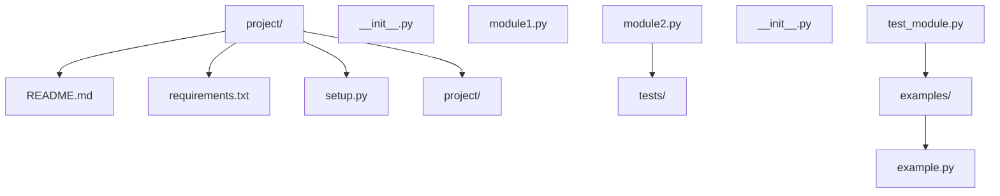
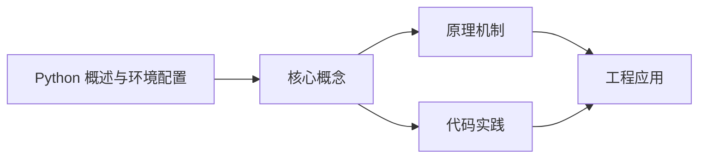
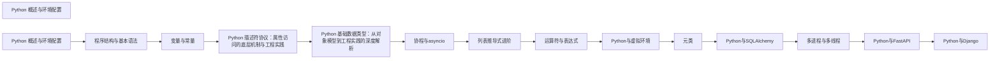

## 1. 学习目标（Bloom 分类）

本节按照布鲁姆教育目标分类学组织学习路径。本文主题为《Python 概述与环境配置》，属于 Python 模块，读者可以根据自身阶段选择阅读深度。

记忆层面：能够准确复述本文的核心概念、术语与基本语法或操作步骤，并能够在提问或检索时快速定位对应知识点。例如能够说出 Python 的动态类型、缩进语法与解释执行等基本特征。

理解层面：能够用自己的语言解释核心原理与工作机制，说明概念之间的因果关系，而不是机械记忆结论。例如能够解释解释器与编译器的差异，以及 GIL 对并发的影响。

应用层面：能够在真实项目或练习场景中运用本文知识解决具体问题，写出正确且可维护的实现。例如能够编写函数、类与标准库调用的完整脚本。

分析层面：能够拆解复杂问题，比较本文主题与相邻概念的异同，识别边界条件与例外情况。例如能够比较 Python 与 Java、Go 在类型系统与并发模型上的差异。

评价层面：能够根据约束条件（性能、可读性、安全、成本）评价不同方案的优劣，做出有依据的技术决策。例如能够评估不同实现方案（脚本、服务、库）的适用场景。

创造层面：能够把本文知识与其他模块知识组合，设计出新的解决方案或可复用的工程模式。例如能够组合标准库与第三方包设计完整的自动化工具。

通过本节学习，读者应当能够把《Python 概述与环境配置》纳入自己的知识网络，并与 Python 模块的其他主题（数据类型、函数、模块、异常、并发）建立关联。

## 2. 历史动机与发展脉络

《Python 概述与环境配置》是 Python 领域的重要主题。要真正理解它，需要先了解它解决的问题与演进过程。

Python 由 Guido van Rossum 于 1991 年首次发布，设计哲学强调代码可读性与开发效率，核心思想记录在《Python 之禅》（PEP 20）中：优美优于丑陋、明确优于隐晦、简单优于复杂。
Python 2 与 Python 3 的分裂期（2008-2020）是语言史上最重要的兼容性事件：Python 3 修复了字符串编码、整数除法等长期问题，但破坏性变更导致迁移缓慢；2020 年 1 月 Python 2 停止官方维护，社区全面转向 Python 3。
Python 3.9 至 3.13 的演进带来了类型提示增强（PEP 604 的 X | Y 语法、PEP 695 的泛型语法）、性能优化（3.11 的 faster-calls 与自适应解释器）以及异步生态的成熟（asyncio、FastAPI、httpx）。
Python 的应用版图从脚本自动化扩展到 Web 后端（Django、FastAPI）、数据科学（NumPy、Pandas、Matplotlib）、机器学习（PyTorch、scikit-learn）、运维自动化（Ansible）与科学计算，是当今最通用的编程语言之一。

回到本文主题：Python 概述与环境配置 的提出与成熟，正是上述技术背景下的必然产物。早期实现往往以简单可用为目标，随着工程规模扩大，社区逐渐沉淀出标准做法与最佳实践；理解这一脉络，可以帮助读者判断“为什么文档中的推荐写法是现在这个样子”，也能在遇到历史遗留代码时准确识别其设计年代与取舍。

对于初学者，理解 Python 的“电池内置”（标准库丰富）与“胶水语言”（易于调用 C/C++/Rust 扩展）两大特性，是判断其适用场景的基础。

## 3. 形式化定义与核心概念精讲

本节把《Python 概述与环境配置》涉及的核心概念以“定义 + 讲解”的形式展开。读者应把定义当作工具，把讲解当作理解路径；两者结合才能形成可迁移的知识。

变量与动态类型：Python 变量是对象的引用，类型属于对象而非变量；`isinstance()` 与 `type()` 用于运行时检查，类型注解（PEP 484）提供静态检查能力但不改变运行时行为。
缩进即语法：Python 用缩进表达代码块层次，避免了花括号噪声，也强制了代码排版一致性；同一代码块必须使用一致的空格数（官方推荐 4 空格）。
函数是一等公民：函数可以赋值、传参、返回，配合 lambda、装饰器与闭包，构成函数式编程能力的基础。
模块与包：每个 `.py` 文件是模块，目录加 `__init__.py` 是包；`import` 机制支持绝对导入、相对导入与命名空间包。
异常处理：`try/except/finally` 与 `raise` 构成错误传播体系；`with` 语句通过上下文管理器（`__enter__/__exit__`）管理资源生命周期。

### 3.1 原文章节逐一精讲

原文档把主题拆分为 10 个小节，下面按顺序给出每一节的导读讲解，随后保留原文细节供精读。

#### 原文精读（完整保留）


#### 1. Python 概述 (Overview)

Python 是由 **Guido van Rossum** 于 1989 年圣诞节期间开始设计的一种高级脚本语言。它以英国电视喜剧《Monty Python's Flying Circus》命名，于 1991 年发布第一个正式版本。Python 的设计哲学强调代码可读性和简洁性，提倡 "优雅"、"明确"、"简单" 的编程风格。

##### 1.1 核心特点 (Key Features)

| 特点             | 描述                                                      | 优势                          |
| :--------------- | :-------------------------------------------------------- | :---------------------------- |
| **简单易学**     | 语法接近自然语言，强制缩进提高代码可读性                  | 学习曲线平缓，上手快          |
| **解释执行**     | 源码由 Python 解释器逐行转换成字节码运行，无需显式编译    | 开发效率高，调试方便          |
| **动态类型**     | 变量不需要声明类型，运行时自动确定                        | 代码简洁，灵活性高            |
| **丰富的库**     | 拥有庞大的标准库 (Battery Included) 和第三方库生态 (PyPI) | 避免重复造轮子，开发效率高    |
| **跨平台**       | 支持 Windows, Linux, macOS 等多种操作系统                 | 一次编写，多处运行            |
| **多范式**       | 支持面向对象、函数式、过程式编程                          | 适应不同编程风格和场景        |
| **自动内存管理** | 内置垃圾回收机制，无需手动管理内存                        | 减少内存泄漏，提高代码可靠性  |
| **扩展性**       | 可以与 C/C++ 等语言无缝集成                               | 性能关键部分可以用 C/C++ 实现 |

##### 1.3 Python 2 vs Python 3

| 方面         | Python 2               | Python 3                |
| :----------- | :--------------------- | :---------------------- |
| **打印语句** | `print "Hello"`        | `print("Hello")`        |
| **整数除法** | `3 / 2 = 1`            | `3 / 2 = 1.5`           |
| **字符串**   | ASCII 字符串和 Unicode | 统一使用 Unicode        |
| **异常处理** | `except Exception, e`  | `except Exception as e` |
| **xrange**   | 存在 `xrange()`        | 统一使用 `range()`      |
| **迭代器**   | 需要调用 `iter()`      | 直接可迭代              |
| **官方支持** | 2020 年停止支持        | 持续更新                |

#### 2. 应用领域 (Applications)

Python 的 versatility 使其在多个领域都有广泛应用：

##### 2.1 数据科学与机器学习

- **数据处理**: NumPy, Pandas, SciPy
- **数据可视化**: Matplotlib, Seaborn, Plotly
- **机器学习**: Scikit-learn, XGBoost, LightGBM
- **深度学习**: TensorFlow, PyTorch, Keras
- **自然语言处理**: NLTK, spaCy, Transformers

##### 2.2 Web 开发

- **全栈框架**: Django, Pyramid
- **微框架**: Flask, FastAPI, Bottle
- **API 开发**: FastAPI, Flask-RESTful
- **异步框架**: FastAPI, Tornado, aiohttp
- **前端集成**: Django REST Framework, Flask + React

##### 2.3 自动化与运维

- **配置管理**: Ansible, SaltStack
- **容器编排**: Kubernetes (Python 客户端)
- **监控系统**: Prometheus, Grafana (Python 集成)
- **自动化脚本**: 文件处理、系统管理、网络操作
- **CI/CD**: Jenkins, GitHub Actions (Python 脚本)

##### 2.4 网络爬虫与数据采集

- **爬虫框架**: Scrapy, PySpider
- **HTTP 客户端**: Requests, aiohttp
- **HTML 解析**: BeautifulSoup, lxml
- **数据提取**: Scrapy Selector, XPath
- **反爬处理**: Selenium, Playwright

##### 2.5 游戏开发

- **游戏引擎**: Pygame, Pyglet
- **3D 游戏**: Panda3D, Blender Game Engine
- **游戏工具**: PyOpenGL, PySDL2
- **游戏 AI**: 强化学习、路径规划

##### 2.6 科学计算与工程

- **数值计算**: NumPy, SciPy
- **符号计算**: SymPy
- **图像处理**: OpenCV, PIL/Pillow
- **信号处理**: SciPy.signal
- **仿真模拟**: PySimulator, PyDy

##### 2.7 其他领域

- **物联网**: MicroPython, CircuitPython
- **区块链**: Web3.py, pyethereum
- **桌面应用**: PyQt, Tkinter, wxPython
- **移动应用**: Kivy, BeeWare
- **教育与教学**: 适合初学者的编程语言

#### 3. 环境搭建 (Environment Setup)

##### 3.1 安装 Python

###### 3.1.1 Windows 安装

1. **下载安装包**: 访问 [Python 官网](https://www.python.org/downloads/) 下载最新版本的 Python 安装包
2. **运行安装程序**:

- 勾选 "Add Python to PATH" (非常重要)
- 选择 "Customize installation"
- 确保勾选所有必要的组件

3. **完成安装**:

- 点击 "Install Now"
- 等待安装完成

4. **验证安装**:

```cmd
 python --version
 pip --version
```

###### 3.1.2 macOS 安装

1. **使用 Homebrew** (推荐):

```bash
 brew install python
```

2. **使用安装包**:

- 从官网下载 macOS 安装包
- 运行安装程序
- 按照向导完成安装

3. **验证安装**:

```bash
 python3 --version
 pip3 --version
```

###### 3.1.3 Linux 安装

###### Ubuntu/Debian

```bash
 # 更新包列表
 sudo apt update
 # 安装 Python 3.10+
 sudo apt install python3 python3-pip python3-venv
 # 验证安装
 python3 --version
 pip3 --version
```

###### CentOS/RHEL

```bash
 # 安装 Python 3.10+
 sudo dnf install python3 python3-pip python3-venv
 # 验证安装
 python3 --version
 pip3 --version
```

##### 3.2 包管理

###### 3.2.1 pip 基础使用

```bash
 # 安装包
 pip install requests
 # 安装特定版本
 pip install requests==2.31.0
 # 升级包
 pip install --upgrade requests
 # 卸载包
 pip uninstall requests
 # 查看已安装包
 pip list
 # 导出依赖
 pip freeze > requirements.txt
 # 安装依赖
 pip install -r requirements.txt
```

###### 3.2.2 虚拟环境

虚拟环境可以隔离不同项目的依赖，避免版本冲突：

```bash
 # 创建虚拟环境
 python -m venv venv
 # 激活虚拟环境
 # Linux/macOS
 source venv/bin/activate
 # Windows
 .\venv\Scripts\activate
 # 退出虚拟环境
 deactivate
 # 删除虚拟环境
 # Linux/macOS
 rm -rf venv
 # Windows
 rmdir /s venv
```

###### 3.2.3 包管理工具

| 工具       | 特点                | 适用场景     |
| :--------- | :------------------ | :----------- |
| **pip**    | 官方包管理工具      | 基本包管理   |
| **pipenv** | 结合 pip 和虚拟环境 | 项目依赖管理 |
| **poetry** | 现代化包管理工具    | 复杂项目管理 |
| **conda**  | 跨语言包管理        | 数据科学项目 |

##### 3.3 环境变量配置

###### 3.3.1 Windows

1. 右键 "此电脑" → "属性" → "高级系统设置" → "环境变量"
2. 在 "系统变量" 中找到 "Path"，点击 "编辑"
3. 添加 Python 安装目录和 Scripts 目录（如 `C:\Program Files\Python310` 和 `C:\Program Files\Python310\Scripts`）
4. 点击 "确定" 保存配置
5. 重启命令行窗口使配置生效

###### 3.3.2 Linux/macOS

```bash
 # 编辑 bash 配置文件
 nano ~/.bashrc # 或 ~/.zshrc
 # 添加 Python 路径
 export PATH="$PATH:/usr/local/bin/python3"
 export PATH="$PATH:/usr/local/bin/pip3"
 # 使配置生效
 source ~/.bashrc # 或 ~/.zshrc
```

#### 4. 解释器与 IDE (Interpreters & IDEs)

##### 4.1 Python 解释器

| 解释器          | 特点                            | 适用场景         |
| :-------------- | :------------------------------ | :--------------- |
| **CPython**     | 官方默认解释器，用 C 编写       | 大多数应用场景   |
| **PyPy**        | 即时编译 (JIT) 解释器，性能更高 | 性能要求高的场景 |
| **Jython**      | 运行在 JVM 上的 Python 解释器   | Java 集成        |
| **IronPython**  | 运行在 .NET 上的 Python 解释器  | .NET 集成        |
| **MicroPython** | 为微控制器优化的 Python 实现    | 物联网设备       |

##### 4.2 集成开发环境 (IDE)

| IDE                    | 特点                                               | 适用场景             |
| :--------------------- | :------------------------------------------------- | :------------------- |
| **PyCharm**            | 功能最全的专业 IDE，支持智能代码补全、调试、测试等 | 大型项目开发         |
| **Visual Studio Code** | 轻量级编辑器，配合 Python 插件，功能强大           | 通用开发、跨语言项目 |
| **Jupyter Notebook**   | 交互式开发环境，支持代码、文本、可视化混合         | 数据分析、机器学习   |
| **Spyder**             | 科学计算专用 IDE，类似 MATLAB                      | 科学计算、数据分析   |
| **Thonny**             | 初学者友好的 IDE，内置调试器                       | 学习 Python、教学    |
| **Sublime Text**       | 轻量快速的编辑器，配合插件使用                     | 快速编辑、小型项目   |

##### 4.3 实用工具

| 工具           | 功能                       | 用途               |
| :------------- | :------------------------- | :----------------- |
| **IPython**    | 增强的交互式 Python 解释器 | 交互式开发、调试   |
| **JupyterLab** | Jupyter Notebook 的升级版  | 数据科学、可视化   |
| **pytest**     | 强大的测试框架             | 单元测试、集成测试 |
| **black**      | 代码格式化工具             | 保持代码风格一致   |
| **flake8**     | 代码检查工具               | 代码质量检查       |
| **mypy**       | 静态类型检查工具           | 类型检查、代码质量 |
| **virtualenv** | 虚拟环境管理工具           | 依赖隔离           |
| **tox**        | 测试自动化工具             | 多环境测试         |

#### 5. 第一个 Python 程序

##### 5.1 简单示例

```python
 # hello.py
 print("Hello, Python!")
 # 变量和数据类型
 name = "Python"
 version = 3.12
 is_great = version >= 3.12
 print(f"{name} version {version} is great: {is_great}")
 # 列表和循环
 languages = ["Python", "Java", "C++", "JavaScript"]
 for lang in languages:
  print(f"I love {lang}!")
 # 函数定义
 def greet(name):
  return f"Hello, {name}!"
 print(greet("World"))
```

##### 5.2 运行程序

```bash
 # 直接运行
 python hello.py
 # 交互式运行
 python
 >
 Hello, Python!
 >
 # 使用 IPython
 ipython
 in [1]: print("Hello, Python!")
 Hello, Python!
 in [2]: exit()
```

#### 6. 最佳实践

##### 6.1 代码风格

- **PEP 8**: 遵循 Python 官方代码风格指南
- 缩进使用 4 个空格
- 每行不超过 79 个字符
- 空行分隔逻辑块
- 命名规范：
- 函数和变量：snake_case
- 类名：CamelCase
- 常量：UPPER_CASE
- **代码格式化**: 使用 black 自动格式化代码

```bash
 pip install black
 black your_script.py
```

##### 6.2 项目结构



##### 6.3 依赖管理

- **使用虚拟环境**：为每个项目创建独立的虚拟环境
- **固定依赖版本**：在 requirements.txt 中指定精确版本
- **定期更新依赖**：使用 `pip list --outdated` 检查过时的依赖
- **使用锁文件**：对于生产环境，使用 pipenv 或 poetry 的锁文件

##### 6.4 测试

- **单元测试**：使用 pytest 编写和运行测试

```bash
 pip install pytest
 pytest tests/
```

- **测试覆盖率**：使用 coverage.py 检查测试覆盖率

```bash
 pip install coverage
 coverage run -m pytest
 coverage report
```

##### 6.5 性能优化

- **使用适当的数据结构**：选择合适的容器类型
- **避免全局变量**：减少全局变量的使用
- **使用生成器**：对于大型数据集，使用生成器节省内存
- **性能分析**：使用 cProfile 分析代码性能

```python
 import cProfile
 cProfile.run('your_function()')
```

- **使用 PyPy**：对于性能关键的代码，考虑使用 PyPy 解释器

##### 6.6 安全

- **避免注入攻击**：使用参数化查询处理 SQL
- **处理用户输入**：验证和清理用户输入
- **使用安全的依赖**：定期检查依赖的安全漏洞

```bash
 pip install safety
 safety check
```

- **使用 HTTPS**：在网络通信中使用 HTTPS
- **密码处理**：使用 hashlib 或 bcrypt 处理密码

#### 7. 学习资源

##### 7.1 官方资源

- **Python 官网**: [https://www.python.org/](https://www.python.org/)
- **Python 文档**: [https://docs.python.org/](https://docs.python.org/)
- **PEP 8 风格指南**: [https://peps.python.org/pep-0008/](https://peps.python.org/pep-0008/)
- **PyPI (Python Package Index)**: [https://pypi.org/](https://pypi.org/)

##### 7.2 书籍

- **《Python 编程：从入门到实践》** - Eric Matthes
- **《流畅的 Python》** - Luciano Ramalho
- **《Python cookbook》** - David Beazley & Brian K. Jones
- **《Effective Python》** - Brett Slatkin
- **《Python 数据分析》** - Wes McKinney

##### 7.3 在线教程

- **Python 官方教程**: [https://docs.python.org/3/tutorial/](https://docs.python.org/3/tutorial/)
- **Real Python**: [https://realpython.com/](https://realpython.com/)
- **Python.org 学习资源**: [https://www.python.org/learn/](https://www.python.org/learn/)
- **Codecademy Python 课程**: [https://www.codecademy.com/learn/learn-python-3](https://www.codecademy.com/learn/learn-python-3)
- **Coursera Python 课程**: [https://www.coursera.org/courses?query=python](https://www.coursera.org/courses?query=python)

##### 7.4 社区与论坛

- **Stack Overflow**: [https://stackoverflow.com/questions/tagged/python](https://stackoverflow.com/questions/tagged/python)
- **Python 官方论坛**: [https://discuss.python.org/](https://discuss.python.org/)
- **Reddit r/Python**: [https://www.reddit.com/r/Python/](https://www.reddit.com/r/Python/)
- **Python 中文社区**: [https://python.org.cn/](https://python.org.cn/)

##### 7.5 实践项目

- **Python 官方实践项目**: [https://wiki.python.org/moin/BeginnersGuide/Projects](https://wiki.python.org/moin/BeginnersGuide/Projects)
- **Real Python 项目**: [https://realpython.com/tutorials/projects/](https://realpython.com/tutorials/projects/)
- **GitHub 上的 Python 项目**: [https://github.com/topics/python](https://github.com/topics/python)

#### 8. 常见问题与解决方案

##### 8.1 安装问题

| 问题                  | 原因                      | 解决方案                                       |
| :-------------------- | :------------------------ | :--------------------------------------------- |
| **Python 命令未找到** | 环境变量未配置            | 检查 PATH 环境变量，确保 Python 安装目录已添加 |
| **pip 命令未找到**    | pip 未安装或未添加到 PATH | 重新安装 Python 并勾选 "Add Python to PATH"    |
| **依赖安装失败**      | 网络问题或权限不足        | 使用 `--user` 选项或检查网络连接               |

##### 8.2 运行问题

| 问题           | 原因                               | 解决方案                                |
| :------------- | :--------------------------------- | :-------------------------------------- |
| **语法错误**   | 代码语法不正确                     | 检查代码缩进、括号匹配、语法格式        |
| **模块未找到** | 模块未安装或路径问题               | 使用 pip 安装模块，检查 Python 路径     |
| **版本兼容性** | 代码使用了不兼容的 Python 版本特性 | 检查 Python 版本，修改代码或升级 Python |

##### 8.3 性能问题

| 问题             | 原因                     | 解决方案                               |
| :--------------- | :----------------------- | :------------------------------------- |
| **代码运行缓慢** | 算法效率低或数据结构不当 | 优化算法，使用更合适的数据结构         |
| **内存使用过高** | 处理大量数据时未优化     | 使用生成器、分批处理、释放不需要的变量 |
| **导入时间长**   | 导入了过多模块           | 只导入需要的模块，使用延迟导入         |

##### 8.4 其他问题

| 问题         | 原因                     | 解决方案                                 |
| :----------- | :----------------------- | :--------------------------------------- |
| **编码问题** | 文件编码与系统编码不匹配 | 在文件开头添加 `# -*- coding: utf-8 -*-` |
| **权限错误** | 没有文件或目录的访问权限 | 检查文件权限，使用管理员权限运行         |
| **依赖冲突** | 不同包之间的依赖冲突     | 使用虚拟环境隔离依赖，固定依赖版本       |

#### 9. 总结

Python 是一种功能强大、简单易学的编程语言，拥有丰富的库生态和广泛的应用场景。通过正确的环境搭建、良好的代码风格和最佳实践，可以充分发挥 Python 的优势，提高开发效率。

##### 9.1 关键要点

- **版本选择**: 推荐使用 Python 3.10+，Python 2 已停止官方支持
- **环境管理**: 使用虚拟环境隔离项目依赖
- **代码风格**: 遵循 PEP 8 代码风格指南
- **依赖管理**: 固定依赖版本，定期更新
- **测试**: 编写单元测试，确保代码质量
- **性能**: 根据需要优化代码性能
- **安全**: 注意代码安全，避免常见安全问题

##### 9.2 未来发展

Python 作为一种不断发展的编程语言，未来将继续在以下方面演进：

- **性能提升**: 持续优化解释器性能
- **类型系统**: 增强静态类型支持
- **异步编程**: 改进异步 I/O 支持
- **标准库**: 扩展和更新标准库
- **生态系统**: 丰富第三方库生态
  Python 的学习是一个持续的过程，随着版本的更新和技术的发展，需要不断学习和实践，才能更好地掌握和应用 Python 技术。

---

#### 延伸阅读

- [数据分析](data-analysis/overview)


### 3.2 概念关系图

下面用 Mermaid 图表达本文核心概念之间的关系，帮助读者建立整体图景：



图中展示的是本文知识的结构化关系：核心概念是入口，原理机制解释“为什么”，代码实践演示“怎么做”，工程应用回答“何时用”。读者学习时可以把每个小节的内容挂接到对应节点上。

## 4. 理论推导与原理解析

本节深入《Python 概述与环境配置》背后的原理。理论部分不求面面俱到，而是聚焦“能解释现象、能指导实践”的关键推导。

解释执行与字节码：CPython 先把源码编译为字节码（.pyc），再由虚拟机逐条执行。字节码是平台无关的中间表示，因此 Python 程序可以跨平台运行，但执行速度低于编译型语言；性能敏感路径可用 C 扩展或 Cython 加速。
GIL（全局解释器锁）：CPython 的 GIL 保证同一时刻只有一个线程执行字节码，简化了内存管理，但限制了 CPU 密集型多线程并行；I/O 密集型任务通过线程切换获得并发，CPU 密集型任务应使用多进程（multiprocessing）或异步。
引用计数与垃圾回收：Python 对象通过引用计数管理生命周期，循环引用由分代垃圾回收器（gc 模块）处理。理解这一模型可以解释“为什么局部变量及时释放内存”“为什么大对象需要 del 或作用域退出”。
鸭子类型与协议：Python 依赖行为协议而非继承体系，例如实现 `__iter__` 与 `__next__` 的对象即可用于 `for` 循环。这一设计带来灵活性的同时，也要求开发者编写清晰的接口文档与类型注解。

需要强调的是，理论推导与工程实践之间存在翻译层：理论给出的是理想化模型与边界条件，工程代码则必须处理真实环境中的例外。读者在学习时应先掌握理论的“标准情形”，再通过陷阱章节了解“非标准情形”。

## 5. 代码示例与逐行讲解

本节把原文中的代码示例系统整理，并为每个示例补充用途说明与讲解。读者不应只浏览代码，而应逐段对照讲解理解设计意图。

### 5.1 示例：3.1.1 Windows 安装

该示例来自原文《3.1.1 Windows 安装》小节，用于演示Python 概述与环境配置相关操作。阅读时请先看代码结构，再看其后的讲解。

```cmd
 python --version
 pip --version
```

讲解：这段代码演示了本节核心知识点。代码中的关键操作可以归纳为三步：准备（定义或初始化）、执行（核心逻辑）、收尾（释放资源或返回结果）。实际项目中，这三步往往被封装为函数或类，以提升复用性与可测试性。

关键点分析：

该示例共 2 行有效代码，结构以数据或配置为主。阅读时应关注：数据字段的含义、配置项的作用，以及它们与运行行为的对应关系。

进阶思考路径：先尝试修改参数观察行为变化，再把示例中的模式迁移到自己的项目中；每次修改都记录预期与实测差异，这是把示例转化为能力的最快方式。

### 5.2 示例：3.1.2 macOS 安装

该示例来自原文《3.1.2 macOS 安装》小节，用于演示Python 概述与环境配置相关操作。阅读时请先看代码结构，再看其后的讲解。

```bash
 brew install python
```

讲解：这段代码演示了本节核心知识点。代码中的关键操作可以归纳为三步：准备（定义或初始化）、执行（核心逻辑）、收尾（释放资源或返回结果）。实际项目中，这三步往往被封装为函数或类，以提升复用性与可测试性。

关键点分析：

该示例共 1 行有效代码，结构以数据或配置为主。阅读时应关注：数据字段的含义、配置项的作用，以及它们与运行行为的对应关系。

进阶思考路径：先尝试修改参数观察行为变化，再把示例中的模式迁移到自己的项目中；每次修改都记录预期与实测差异，这是把示例转化为能力的最快方式。

### 5.3 示例：3.1.2 macOS 安装

该示例来自原文《3.1.2 macOS 安装》小节，用于演示Python 概述与环境配置相关操作。阅读时请先看代码结构，再看其后的讲解。

```bash
 python3 --version
 pip3 --version
```

讲解：这段代码演示了本节核心知识点。代码中的关键操作可以归纳为三步：准备（定义或初始化）、执行（核心逻辑）、收尾（释放资源或返回结果）。实际项目中，这三步往往被封装为函数或类，以提升复用性与可测试性。

关键点分析：

该示例共 2 行有效代码，结构以数据或配置为主。阅读时应关注：数据字段的含义、配置项的作用，以及它们与运行行为的对应关系。

进阶思考路径：先尝试修改参数观察行为变化，再把示例中的模式迁移到自己的项目中；每次修改都记录预期与实测差异，这是把示例转化为能力的最快方式。

### 5.4 示例：Ubuntu/Debian

该示例来自原文《Ubuntu/Debian》小节，用于演示Python 概述与环境配置相关操作。阅读时请先看代码结构，再看其后的讲解。

```bash
 # 更新包列表
 sudo apt update
 # 安装 Python 3.10+
 sudo apt install python3 python3-pip python3-venv
 # 验证安装
 python3 --version
 pip3 --version
```

讲解：这段代码演示了本节核心知识点。代码中的关键操作可以归纳为三步：准备（定义或初始化）、执行（核心逻辑）、收尾（释放资源或返回结果）。实际项目中，这三步往往被封装为函数或类，以提升复用性与可测试性。

关键点分析：

该示例共 7 行有效代码，结构以数据或配置为主。阅读时应关注：数据字段的含义、配置项的作用，以及它们与运行行为的对应关系。

进阶思考路径：先尝试修改参数观察行为变化，再把示例中的模式迁移到自己的项目中；每次修改都记录预期与实测差异，这是把示例转化为能力的最快方式。

### 5.5 示例：CentOS/RHEL

该示例来自原文《CentOS/RHEL》小节，用于演示Python 概述与环境配置相关操作。阅读时请先看代码结构，再看其后的讲解。

```bash
 # 安装 Python 3.10+
 sudo dnf install python3 python3-pip python3-venv
 # 验证安装
 python3 --version
 pip3 --version
```

讲解：这段代码演示了本节核心知识点。代码中的关键操作可以归纳为三步：准备（定义或初始化）、执行（核心逻辑）、收尾（释放资源或返回结果）。实际项目中，这三步往往被封装为函数或类，以提升复用性与可测试性。

关键点分析：

该示例共 5 行有效代码，结构以数据或配置为主。阅读时应关注：数据字段的含义、配置项的作用，以及它们与运行行为的对应关系。

进阶思考路径：先尝试修改参数观察行为变化，再把示例中的模式迁移到自己的项目中；每次修改都记录预期与实测差异，这是把示例转化为能力的最快方式。

### 5.6 示例：3.2.1 pip 基础使用

该示例来自原文《3.2.1 pip 基础使用》小节，用于演示Python 概述与环境配置相关操作。阅读时请先看代码结构，再看其后的讲解。

```bash
 # 安装包
 pip install requests
 # 安装特定版本
 pip install requests==2.31.0
 # 升级包
 pip install --upgrade requests
 # 卸载包
 pip uninstall requests
 # 查看已安装包
 pip list
 # 导出依赖
 pip freeze > requirements.txt
 # 安装依赖
 pip install -r requirements.txt
```

讲解：这段代码演示了本节核心知识点。代码中的关键操作可以归纳为三步：准备（定义或初始化）、执行（核心逻辑）、收尾（释放资源或返回结果）。实际项目中，这三步往往被封装为函数或类，以提升复用性与可测试性。

关键点分析：

该示例共 14 行有效代码，结构以数据或配置为主。阅读时应关注：数据字段的含义、配置项的作用，以及它们与运行行为的对应关系。

进阶思考路径：先尝试修改参数观察行为变化，再把示例中的模式迁移到自己的项目中；每次修改都记录预期与实测差异，这是把示例转化为能力的最快方式。

### 5.7 示例：3.2.2 虚拟环境

该示例来自原文《3.2.2 虚拟环境》小节，用于演示Python 概述与环境配置相关操作。阅读时请先看代码结构，再看其后的讲解。

```bash
 # 创建虚拟环境
 python -m venv venv
 # 激活虚拟环境
 # Linux/macOS
 source venv/bin/activate
 # Windows
 .\venv\Scripts\activate
 # 退出虚拟环境
 deactivate
 # 删除虚拟环境
 # Linux/macOS
 rm -rf venv
 # Windows
 rmdir /s venv
```

讲解：这段代码演示了本节核心知识点。代码中的关键操作可以归纳为三步：准备（定义或初始化）、执行（核心逻辑）、收尾（释放资源或返回结果）。实际项目中，这三步往往被封装为函数或类，以提升复用性与可测试性。

关键点分析：

该示例共 14 行有效代码，结构以数据或配置为主。阅读时应关注：数据字段的含义、配置项的作用，以及它们与运行行为的对应关系。

进阶思考路径：先尝试修改参数观察行为变化，再把示例中的模式迁移到自己的项目中；每次修改都记录预期与实测差异，这是把示例转化为能力的最快方式。

### 5.8 示例：3.3.2 Linux/macOS

该示例来自原文《3.3.2 Linux/macOS》小节，用于演示Python 概述与环境配置相关操作。阅读时请先看代码结构，再看其后的讲解。

```bash
 # 编辑 bash 配置文件
 nano ~/.bashrc # 或 ~/.zshrc
 # 添加 Python 路径
 export PATH="$PATH:/usr/local/bin/python3"
 export PATH="$PATH:/usr/local/bin/pip3"
 # 使配置生效
 source ~/.bashrc # 或 ~/.zshrc
```

讲解：这段代码演示了本节核心知识点。代码中的关键操作可以归纳为三步：准备（定义或初始化）、执行（核心逻辑）、收尾（释放资源或返回结果）。实际项目中，这三步往往被封装为函数或类，以提升复用性与可测试性。

关键点分析：

该示例共 7 行有效代码，结构以数据或配置为主。阅读时应关注：数据字段的含义、配置项的作用，以及它们与运行行为的对应关系。

进阶思考路径：先尝试修改参数观察行为变化，再把示例中的模式迁移到自己的项目中；每次修改都记录预期与实测差异，这是把示例转化为能力的最快方式。

### 5.9 示例：5.1 简单示例

该示例来自原文《5.1 简单示例》小节，用于演示Python 概述与环境配置相关操作。阅读时请先看代码结构，再看其后的讲解。

```python
 # hello.py
 print("Hello, Python!")
 # 变量和数据类型
 name = "Python"
 version = 3.12
 is_great = version >= 3.12
 print(f"{name} version {version} is great: {is_great}")
 # 列表和循环
 languages = ["Python", "Java", "C++", "JavaScript"]
 for lang in languages:
  print(f"I love {lang}!")
 # 函数定义
 def greet(name):
  return f"Hello, {name}!"
 print(greet("World"))
```

讲解：这段代码演示了本节核心知识点。代码中的关键操作可以归纳为三步：准备（定义或初始化）、执行（核心逻辑）、收尾（释放资源或返回结果）。实际项目中，这三步往往被封装为函数或类，以提升复用性与可测试性。

关键点分析：

该示例共 15 行有效代码，包含 3 类关键结构（def、for、return）。其中：

- 入口与初始化部分负责建立上下文，对应实际项目中的启动或装配逻辑；
- 核心逻辑部分体现本文主题的主要操作，是阅读时最需要对照讲解理解的部分；
- 输出或返回部分把结果交给调用方，注意其类型与边界条件。

进阶思考路径：先尝试修改参数观察行为变化，再把示例中的模式迁移到自己的项目中；每次修改都记录预期与实测差异，这是把示例转化为能力的最快方式。

### 5.10 示例：5.2 运行程序

该示例来自原文《5.2 运行程序》小节，用于演示Python 概述与环境配置相关操作。阅读时请先看代码结构，再看其后的讲解。

```bash
 # 直接运行
 python hello.py
 # 交互式运行
 python
 >
 Hello, Python!
 >
 # 使用 IPython
 ipython
 in [1]: print("Hello, Python!")
 Hello, Python!
 in [2]: exit()
```

讲解：这段代码演示了本节核心知识点。代码中的关键操作可以归纳为三步：准备（定义或初始化）、执行（核心逻辑）、收尾（释放资源或返回结果）。实际项目中，这三步往往被封装为函数或类，以提升复用性与可测试性。

关键点分析：

该示例共 12 行有效代码，结构以数据或配置为主。阅读时应关注：数据字段的含义、配置项的作用，以及它们与运行行为的对应关系。

进阶思考路径：先尝试修改参数观察行为变化，再把示例中的模式迁移到自己的项目中；每次修改都记录预期与实测差异，这是把示例转化为能力的最快方式。

### 5.11 示例：6.1 代码风格

该示例来自原文《6.1 代码风格》小节，用于演示Python 概述与环境配置相关操作。阅读时请先看代码结构，再看其后的讲解。

```bash
 pip install black
 black your_script.py
```

讲解：这段代码演示了本节核心知识点。代码中的关键操作可以归纳为三步：准备（定义或初始化）、执行（核心逻辑）、收尾（释放资源或返回结果）。实际项目中，这三步往往被封装为函数或类，以提升复用性与可测试性。

关键点分析：

该示例共 2 行有效代码，结构以数据或配置为主。阅读时应关注：数据字段的含义、配置项的作用，以及它们与运行行为的对应关系。

进阶思考路径：先尝试修改参数观察行为变化，再把示例中的模式迁移到自己的项目中；每次修改都记录预期与实测差异，这是把示例转化为能力的最快方式。

### 5.12 示例：6.2 项目结构

该示例来自原文《6.2 项目结构》小节，用于演示Python 概述与环境配置相关操作。阅读时请先看代码结构，再看其后的讲解。


讲解：这段代码演示了本节核心知识点。代码中的关键操作可以归纳为三步：准备（定义或初始化）、执行（核心逻辑）、收尾（释放资源或返回结果）。实际项目中，这三步往往被封装为函数或类，以提升复用性与可测试性。

关键点分析：

该示例共 21 行有效代码，结构以数据或配置为主。阅读时应关注：数据字段的含义、配置项的作用，以及它们与运行行为的对应关系。

进阶思考路径：先尝试修改参数观察行为变化，再把示例中的模式迁移到自己的项目中；每次修改都记录预期与实测差异，这是把示例转化为能力的最快方式。

### 5.13 示例：6.4 测试

该示例来自原文《6.4 测试》小节，用于演示Python 概述与环境配置相关操作。阅读时请先看代码结构，再看其后的讲解。

```bash
 pip install pytest
 pytest tests/
```

讲解：这段代码演示了本节核心知识点。代码中的关键操作可以归纳为三步：准备（定义或初始化）、执行（核心逻辑）、收尾（释放资源或返回结果）。实际项目中，这三步往往被封装为函数或类，以提升复用性与可测试性。

关键点分析：

该示例共 2 行有效代码，结构以数据或配置为主。阅读时应关注：数据字段的含义、配置项的作用，以及它们与运行行为的对应关系。

进阶思考路径：先尝试修改参数观察行为变化，再把示例中的模式迁移到自己的项目中；每次修改都记录预期与实测差异，这是把示例转化为能力的最快方式。

### 5.14 示例：6.4 测试

该示例来自原文《6.4 测试》小节，用于演示Python 概述与环境配置相关操作。阅读时请先看代码结构，再看其后的讲解。

```bash
 pip install coverage
 coverage run -m pytest
 coverage report
```

讲解：这段代码演示了本节核心知识点。代码中的关键操作可以归纳为三步：准备（定义或初始化）、执行（核心逻辑）、收尾（释放资源或返回结果）。实际项目中，这三步往往被封装为函数或类，以提升复用性与可测试性。

关键点分析：

该示例共 3 行有效代码，结构以数据或配置为主。阅读时应关注：数据字段的含义、配置项的作用，以及它们与运行行为的对应关系。

进阶思考路径：先尝试修改参数观察行为变化，再把示例中的模式迁移到自己的项目中；每次修改都记录预期与实测差异，这是把示例转化为能力的最快方式。

### 5.15 示例：6.5 性能优化

该示例来自原文《6.5 性能优化》小节，用于演示Python 概述与环境配置相关操作。阅读时请先看代码结构，再看其后的讲解。

```python
 import cProfile
 cProfile.run('your_function()')
```

讲解：这段代码演示了本节核心知识点。代码中的关键操作可以归纳为三步：准备（定义或初始化）、执行（核心逻辑）、收尾（释放资源或返回结果）。实际项目中，这三步往往被封装为函数或类，以提升复用性与可测试性。

关键点分析：

该示例共 2 行有效代码，包含 2 类关键结构（function、import）。其中：

- 入口与初始化部分负责建立上下文，对应实际项目中的启动或装配逻辑；
- 核心逻辑部分体现本文主题的主要操作，是阅读时最需要对照讲解理解的部分；
- 输出或返回部分把结果交给调用方，注意其类型与边界条件。

进阶思考路径：先尝试修改参数观察行为变化，再把示例中的模式迁移到自己的项目中；每次修改都记录预期与实测差异，这是把示例转化为能力的最快方式。

### 5.16 示例：6.6 安全

该示例来自原文《6.6 安全》小节，用于演示Python 概述与环境配置相关操作。阅读时请先看代码结构，再看其后的讲解。

```bash
 pip install safety
 safety check
```

讲解：这段代码演示了本节核心知识点。代码中的关键操作可以归纳为三步：准备（定义或初始化）、执行（核心逻辑）、收尾（释放资源或返回结果）。实际项目中，这三步往往被封装为函数或类，以提升复用性与可测试性。

关键点分析：

该示例共 2 行有效代码，结构以数据或配置为主。阅读时应关注：数据字段的含义、配置项的作用，以及它们与运行行为的对应关系。

进阶思考路径：先尝试修改参数观察行为变化，再把示例中的模式迁移到自己的项目中；每次修改都记录预期与实测差异，这是把示例转化为能力的最快方式。

```python
from pathlib import Path

def count_files(root: Path) -> dict[str, int]:
    """统计目录下各扩展名文件数量。"""
    counter: dict[str, int] = {}
    for p in root.rglob('*'):  # 递归遍历所有路径
        if p.is_file():
            ext = p.suffix.lower() or '(无扩展名)'
            counter[ext] = counter.get(ext, 0) + 1
    return counter
```
讲解：`rglob('*')` 返回生成器，逐个处理文件避免一次性加载全部路径；`suffix.lower()` 统一大小写；`dict.get(ext, 0)` 实现计数累加。这是 Python 文件处理的通用骨架。

综合以上示例，可以总结出本主题的代码实践要点：第一，先定义清晰的输入输出契约；第二，核心逻辑保持单一职责；第三，错误处理与边界条件不可省略；第四，命名与注释表达意图而非复述代码。

## 6. 对比分析

对比是理解《Python 概述与环境配置》定位的最快路径。下面从多个维度与相邻方案进行对比。

Python 与 Java 对比：Python 动态类型开发快、代码短；Java 静态类型编译期检查强、适合大型长期项目。Python 的 GIL 限制多线程并行，Java 的线程模型更成熟。
Python 与 Go 对比：Go 的 goroutine 与 channel 在并发编程上更直接，编译为单一二进制部署简单；Python 生态更丰富，AI 与数据领域占绝对优势。
Python 2 与 Python 3 对比：Python 3 的 `print()` 函数、`str/bytes` 分离、整除语义 `//`、f-string 与类型注解是主要差异；新代码一律使用 Python 3。

对比的目的不是分出绝对优劣，而是建立选择依据：不同约束条件下，最优解不同。读者应把每个对比维度转化为决策检查清单。

## 7. 常见陷阱与最佳实践

本节整理该主题的高频错误与推荐做法。每个陷阱先描述现象，再解释原因，最后给出最佳实践。

### 7.1 可变默认参数

`def f(x, lst=[])` 中默认列表在函数定义时创建一次，多次调用共享同一对象。最佳实践：默认值用 `None`，函数内创建新对象。

深入讲解：该问题之所以被归类为“常见陷阱”，是因为它在初学者的代码中反复出现，而且往往不在第一时间暴露——错误通常隐藏在特定数据或特定时序下。

从成因上看，可变默认参数 一般源于对 Python 某个机制的理解偏差：要么误用了默认行为，要么忽略了边界条件，要么把其他语言的思维惯性带了过来。

从影响上看，可变默认参数 轻则产生错误结果，重则导致资源泄漏、数据损坏或安全事故；这也是为什么工程评审中会把它列为检查项。

从修复策略上看，处理可变默认参数的正确顺序是：先复现（构造最小用例），再定位（确认机制层面的根因），最后修复并补充回归测试。跳过复现直接改代码，往往治标不治本。

### 7.2 浅拷贝陷阱

`list.copy()`、切片与 `dict.copy()` 都是浅拷贝，嵌套可变对象仍共享。需要深拷贝时使用 `copy.deepcopy()`，或明确设计不可变结构。

深入讲解：该问题之所以被归类为“常见陷阱”，是因为它在初学者的代码中反复出现，而且往往不在第一时间暴露——错误通常隐藏在特定数据或特定时序下。

从成因上看，浅拷贝陷阱 一般源于对 Python 某个机制的理解偏差：要么误用了默认行为，要么忽略了边界条件，要么把其他语言的思维惯性带了过来。

从影响上看，浅拷贝陷阱 轻则产生错误结果，重则导致资源泄漏、数据损坏或安全事故；这也是为什么工程评审中会把它列为检查项。

从修复策略上看，处理浅拷贝陷阱的正确顺序是：先复现（构造最小用例），再定位（确认机制层面的根因），最后修复并补充回归测试。跳过复现直接改代码，往往治标不治本。

### 7.3 字符串拼接性能

循环内使用 `+` 拼接字符串产生大量中间对象，复杂度为 O(n²)。最佳实践：使用列表收集后 `''.join()`。

深入讲解：该问题之所以被归类为“常见陷阱”，是因为它在初学者的代码中反复出现，而且往往不在第一时间暴露——错误通常隐藏在特定数据或特定时序下。

从成因上看，字符串拼接性能 一般源于对 Python 某个机制的理解偏差：要么误用了默认行为，要么忽略了边界条件，要么把其他语言的思维惯性带了过来。

从影响上看，字符串拼接性能 轻则产生错误结果，重则导致资源泄漏、数据损坏或安全事故；这也是为什么工程评审中会把它列为检查项。

从修复策略上看，处理字符串拼接性能的正确顺序是：先复现（构造最小用例），再定位（确认机制层面的根因），最后修复并补充回归测试。跳过复现直接改代码，往往治标不治本。

### 7.4 浮点精度

二进制浮点无法精确表示 0.1，金额计算应使用 `decimal.Decimal` 或整数分。

深入讲解：该问题之所以被归类为“常见陷阱”，是因为它在初学者的代码中反复出现，而且往往不在第一时间暴露——错误通常隐藏在特定数据或特定时序下。

从成因上看，浮点精度 一般源于对 Python 某个机制的理解偏差：要么误用了默认行为，要么忽略了边界条件，要么把其他语言的思维惯性带了过来。

从影响上看，浮点精度 轻则产生错误结果，重则导致资源泄漏、数据损坏或安全事故；这也是为什么工程评审中会把它列为检查项。

从修复策略上看，处理浮点精度的正确顺序是：先复现（构造最小用例），再定位（确认机制层面的根因），最后修复并补充回归测试。跳过复现直接改代码，往往治标不治本。

### 7.5 循环中修改列表

遍历列表时删除或插入元素会导致跳过或重复。最佳实践：构造新列表或倒序遍历。

深入讲解：该问题之所以被归类为“常见陷阱”，是因为它在初学者的代码中反复出现，而且往往不在第一时间暴露——错误通常隐藏在特定数据或特定时序下。

从成因上看，循环中修改列表 一般源于对 Python 某个机制的理解偏差：要么误用了默认行为，要么忽略了边界条件，要么把其他语言的思维惯性带了过来。

从影响上看，循环中修改列表 轻则产生错误结果，重则导致资源泄漏、数据损坏或安全事故；这也是为什么工程评审中会把它列为检查项。

从修复策略上看，处理循环中修改列表的正确顺序是：先复现（构造最小用例），再定位（确认机制层面的根因），最后修复并补充回归测试。跳过复现直接改代码，往往治标不治本。

### 7.6 全局变量滥用

`global` 声明使函数产生隐藏依赖，难以测试。最佳实践：通过参数传递与返回值交换数据。

深入讲解：该问题之所以被归类为“常见陷阱”，是因为它在初学者的代码中反复出现，而且往往不在第一时间暴露——错误通常隐藏在特定数据或特定时序下。

从成因上看，全局变量滥用 一般源于对 Python 某个机制的理解偏差：要么误用了默认行为，要么忽略了边界条件，要么把其他语言的思维惯性带了过来。

从影响上看，全局变量滥用 轻则产生错误结果，重则导致资源泄漏、数据损坏或安全事故；这也是为什么工程评审中会把它列为检查项。

从修复策略上看，处理全局变量滥用的正确顺序是：先复现（构造最小用例），再定位（确认机制层面的根因），最后修复并补充回归测试。跳过复现直接改代码，往往治标不治本。

### 7.7 异常吞掉

`except: pass` 隐藏错误导致调试困难。最佳实践：捕获具体异常类型，记录日志，必要时重新抛出。

深入讲解：该问题之所以被归类为“常见陷阱”，是因为它在初学者的代码中反复出现，而且往往不在第一时间暴露——错误通常隐藏在特定数据或特定时序下。

从成因上看，异常吞掉 一般源于对 Python 某个机制的理解偏差：要么误用了默认行为，要么忽略了边界条件，要么把其他语言的思维惯性带了过来。

从影响上看，异常吞掉 轻则产生错误结果，重则导致资源泄漏、数据损坏或安全事故；这也是为什么工程评审中会把它列为检查项。

从修复策略上看，处理异常吞掉的正确顺序是：先复现（构造最小用例），再定位（确认机制层面的根因），最后修复并补充回归测试。跳过复现直接改代码，往往治标不治本。

### 7.8 时间与时区

`datetime.now()` 返回本地时间，跨时区存储应使用 UTC。最佳实践：存储 UTC，展示时转本地。

深入讲解：该问题之所以被归类为“常见陷阱”，是因为它在初学者的代码中反复出现，而且往往不在第一时间暴露——错误通常隐藏在特定数据或特定时序下。

从成因上看，时间与时区 一般源于对 Python 某个机制的理解偏差：要么误用了默认行为，要么忽略了边界条件，要么把其他语言的思维惯性带了过来。

从影响上看，时间与时区 轻则产生错误结果，重则导致资源泄漏、数据损坏或安全事故；这也是为什么工程评审中会把它列为检查项。

从修复策略上看，处理时间与时区的正确顺序是：先复现（构造最小用例），再定位（确认机制层面的根因），最后修复并补充回归测试。跳过复现直接改代码，往往治标不治本。

### 7.9 版本与依赖

全局环境安装依赖导致版本冲突。最佳实践：使用 venv/uv/poetry 管理虚拟环境与锁定文件。

深入讲解：该问题之所以被归类为“常见陷阱”，是因为它在初学者的代码中反复出现，而且往往不在第一时间暴露——错误通常隐藏在特定数据或特定时序下。

从成因上看，版本与依赖 一般源于对 Python 某个机制的理解偏差：要么误用了默认行为，要么忽略了边界条件，要么把其他语言的思维惯性带了过来。

从影响上看，版本与依赖 轻则产生错误结果，重则导致资源泄漏、数据损坏或安全事故；这也是为什么工程评审中会把它列为检查项。

从修复策略上看，处理版本与依赖的正确顺序是：先复现（构造最小用例），再定位（确认机制层面的根因），最后修复并补充回归测试。跳过复现直接改代码，往往治标不治本。

### 7.10 性能过早优化

在没有基准测试的情况下优化反而降低可读性。最佳实践：先 profile（cProfile）定位热点，再针对性优化。

深入讲解：该问题之所以被归类为“常见陷阱”，是因为它在初学者的代码中反复出现，而且往往不在第一时间暴露——错误通常隐藏在特定数据或特定时序下。

从成因上看，性能过早优化 一般源于对 Python 某个机制的理解偏差：要么误用了默认行为，要么忽略了边界条件，要么把其他语言的思维惯性带了过来。

从影响上看，性能过早优化 轻则产生错误结果，重则导致资源泄漏、数据损坏或安全事故；这也是为什么工程评审中会把它列为检查项。

从修复策略上看，处理性能过早优化的正确顺序是：先复现（构造最小用例），再定位（确认机制层面的根因），最后修复并补充回归测试。跳过复现直接改代码，往往治标不治本。

### 7.0 最佳实践总览

1. 遵循 PEP 8 命名规范：模块与函数小写下划线，类用驼峰，常量全大写。
2. 使用类型注解（`def f(x: int) -> str`）配合 mypy/pyright 静态检查。
3. 函数保持单一职责并控制参数数量，超过 3 个参数考虑数据类。
4. 用 `if __name__ == "__main__":` 保护入口，保证模块可导入。
5. 资源使用 with 语句管理；日志使用 logging 模块而非 print。
6. 测试使用 pytest，覆盖正常、边界与异常路径。

把这些最佳实践固化为团队规范与代码评审检查项，是避免同类问题反复出现的关键。

## 8. 工程实践

本节把《Python 概述与环境配置》放入真实工程场景，给出可复用的模式与组织方法。

项目结构：src 布局（`src/` 下放包）与 flat 布局（包在根目录）各有优劣，配合 pyproject.toml 与 hatchling/setuptools 声明元数据。
依赖管理：pyproject.toml 是 PEP 621 标准入口，uv 提供极快的解析与安装；锁定文件保证可复现构建。
测试与 CI：pytest + coverage 度量，GitHub Actions 在矩阵（多版本 Python、多操作系统）上运行测试与 lint（ruff）。
打包发布：构建 wheel（`python -m build`），发布到 PyPI；私有包可用内部索引或直接引用 git 依赖。

### 8.1 工程实践的原则拆解

以上工程实践可以归纳为四条原则。第一，配置与代码分离：Python 项目中环境差异应通过配置注入，而不是散落在代码分支中；这保证同一份代码可以在开发、测试、生产环境一致运行。

第二，接口稳定优先：对外接口（函数签名、协议、数据格式）一旦被消费方依赖，变更成本极高；设计时应预留扩展点并保持向后兼容。

第三，可观测性内置：日志、指标与追踪应该在功能开发时同步设计，而不是故障发生后补救；没有观测手段的模块等于黑盒。

第四，变更可回滚：任何发布都应有对应的回滚方案；数据库迁移、配置变更与代码发布一样需要版本管理与逆向路径。

### 8.2 实践落地的检查清单

- [ ] 项目结构：对照本节描述，检查当前项目是否已经落实；未落实的项列入技术债并排期处理。
- [ ] 依赖管理：对照本节描述，检查当前项目是否已经落实；未落实的项列入技术债并排期处理。
- [ ] 测试与 CI：对照本节描述，检查当前项目是否已经落实；未落实的项列入技术债并排期处理。
- [ ] 打包发布：对照本节描述，检查当前项目是否已经落实；未落实的项列入技术债并排期处理。

工程实践的共性原则：配置与代码分离、接口稳定优先、可观测性内置、变更可回滚。这些原则适用于本主题的所有实现。

## 9. 案例研究

本节通过一个完整案例把《Python 概述与环境配置》的知识串起来。案例按“需求分析、方案设计、实现、验证”四步展开。

需求：实现一个命令行文件统计工具，统计目录下各扩展名文件数量与总大小，支持递归。
方案：使用 pathlib 遍历、collections.Counter 统计、argparse 解析参数，输出格式化报告。
实现要点：用 `rglob('*')` 递归遍历；`suffix.lower()` 统一扩展名；大目录用生成器避免内存膨胀；异常（权限拒绝）单独捕获并记录。
验证：对测试目录运行，核对数量与大小；对空目录与无权限目录验证边界行为；用 `time` 命令评估大目录性能。

### 9.1 案例的扩展讨论

把案例中的方案放大到真实规模，需要额外考虑三个问题：

第一，规模：当数据量或并发量上升一个数量级时，原方案中的数据结构、缓存策略与任务调度是否仍然成立？通常需要引入分层与异步。

第二，团队：多人协作时，模块边界、接口契约与代码所有权必须明确；案例中的实现应拆分为可独立测试的单元，并配合文档说明设计意图。

第三，演进：上线后的需求变化不可避免；方案设计时应预留扩展点（配置化、插件化、事件化），并定期用真实指标验证假设。


案例研究的学习方法：先独立阅读需求，尝试在脑中形成方案，再对照实现与讲解，最后思考“如果约束变化（数据量、并发、团队规模），方案应如何调整”。

## 10. 知识要点总结与深入讲解

本节以讲解形式汇总全文要点，替代传统的习题与自测，读者不需要答题，只需跟随解释建立完整的认知框架。

关于《Python 概述与环境配置》的核心结论：

Python 的核心竞争力是开发效率与生态广度，代价是运行性能与并发模型限制。
类型注解、虚拟环境、测试与静态检查是现代 Python 工程的四条基线，缺一不可。
理解解释执行、GIL 与内存模型，是解释 Python 行为异常（性能、并发、内存）的前提。

原文档各小节的要点回顾：

- 1. Python 概述 (Overview)：该小节围绕Python 概述与环境配置展开具体细节，阅读时应关注其与核心结论的对应关系；每个小节都是核心结论在某一个侧面的展开。
- 2. 应用领域 (Applications)：该小节围绕Python 概述与环境配置展开具体细节，阅读时应关注其与核心结论的对应关系；每个小节都是核心结论在某一个侧面的展开。
- 3. 环境搭建 (Environment Setup)：该小节围绕Python 概述与环境配置展开具体细节，阅读时应关注其与核心结论的对应关系；每个小节都是核心结论在某一个侧面的展开。
- 4. 解释器与 IDE (Interpreters & IDEs)：该小节围绕Python 概述与环境配置展开具体细节，阅读时应关注其与核心结论的对应关系；每个小节都是核心结论在某一个侧面的展开。
- 5. 第一个 Python 程序：该小节围绕Python 概述与环境配置展开具体细节，阅读时应关注其与核心结论的对应关系；每个小节都是核心结论在某一个侧面的展开。
- 6. 最佳实践：该小节围绕Python 概述与环境配置展开具体细节，阅读时应关注其与核心结论的对应关系；每个小节都是核心结论在某一个侧面的展开。
- 7. 学习资源：该小节围绕Python 概述与环境配置展开具体细节，阅读时应关注其与核心结论的对应关系；每个小节都是核心结论在某一个侧面的展开。
- 8. 常见问题与解决方案：该小节围绕Python 概述与环境配置展开具体细节，阅读时应关注其与核心结论的对应关系；每个小节都是核心结论在某一个侧面的展开。
- 9. 总结：该小节围绕Python 概述与环境配置展开具体细节，阅读时应关注其与核心结论的对应关系；每个小节都是核心结论在某一个侧面的展开。
- 延伸阅读：该小节围绕Python 概述与环境配置展开具体细节，阅读时应关注其与核心结论的对应关系；每个小节都是核心结论在某一个侧面的展开。

把以上要点与第 3-9 节的内容对照复习，即可完成对本文主题的闭环学习。

## 11. 参考文献


Python 官方文档：https://docs.python.org/zh-cn/3/
PEP 8 样式指南：https://peps.python.org/pep-0008/
Python 之禅（PEP 20）：https://peps.python.org/pep-0020/
Python 类型注解指南（PEP 484）：https://peps.python.org/pep-0484/
Python 打包用户指南：https://packaging.python.org/
Real Python 教程站：https://realpython.com/

## 12. 延伸阅读


Python 数据类型与内置容器，见 040-python 模块的基础文档。
Python 异步编程（asyncio/FastAPI），见 040-python 模块的异步与 Web 文档。
Python 数据分析（NumPy/Pandas），见 051-data-analysis 模块。
Python 与数据库交互（SQLAlchemy），见 019-sql 模块相关文档。
黑马程序员 Bilibili 空间（https://space.bilibili.com/37974444 ）提供 Python 全栈课程；尚硅谷 Bilibili 空间（https://space.bilibili.com/302417610 ）提供 Python 后端课程。

## 14. 模块知识图谱与学习路径

本文属于 Python 模块。为了把《Python 概述与环境配置》放入完整的知识网络，下面列出本模块的全部主题并给出相互关联的导读。学习时建议按模块内顺序推进，并在每个文档中留意交叉引用。



上图为模块主题的推荐学习顺序示意图（仅展示前若干主题）。各主题之间存在三类关联：

第一，前置依赖关系：早期主题是后期主题的基础，例如环境与语法先行、进阶主题随后；

第二，横向并列关系：同一层级主题从不同角度覆盖模块能力，学习顺序可以按兴趣调整；

第三，工程组合关系：多个主题在真实项目中组合使用，例如配置、性能与安全主题往往出现在同一系统的不同层面。

### 14.1 模块主题速查表

| 文档 | 主题 | 与本文的关联 |
| --- | --- | --- |
| Python 概述与环境配置 | 001-PythonOverviewEnvSetup | 本文自身 |
| 程序结构与基本语法 | 002-ProgramStructureBasicSyntax | 本文的并列主题 |
| 变量与常量 | 003-VariableConstant | 本文的并列主题 |
| Python 描述符协议：属性访问的底层机制与工程实践 | 004-PythonDescriptorProtocol | 本文的原理深化 |
| Python 基础数据类型：从对象模型到工程实践的深度解析 | 005-PythonBasicsDataTypeObjectModelPracticeDeepAnalysis | 本文的前置基础 |
| 协程与asyncio | 006-CoroutineAsyncio | 本文的并列主题 |
| 列表推导式进阶 | 007-ListComprehensionAdvanced | 本文的并列主题 |
| 运算符与表达式 | 008-OperatorExpression | 本文的并列主题 |
| Python与虚拟环境 | 009-PythonVirtualEnv | 本文的前置基础 |
| 元类 | 010-Metaclass | 本文的并列主题 |
| Python与SQLAlchemy | 011-PythonSQLAlchemy | 本文的并列主题 |
| 多进程与多线程 | 012-MultiprocessingMultithreading | 本文的并列主题 |
| Python与FastAPI | 013-PythonFastAPI | 本文的并列主题 |
| Python与Django | 014-PythonDjango | 本文的并列主题 |
| 数据类与Pydantic | 015-DataClassPydantic | 本文的并列主题 |
| Python与Redis | 016-PythonRedis | 本文的并列主题 |
| Python 与 Celery：分布式任务队列的设计、实现与工程实践 | 017-PythonCeleryDistributedTaskQueue | 本文的并列主题 |
| 控制流 | 018-ControlFlow | 本文的并列主题 |
| Python与Docker | 019-PythonDocker | 本文的并列主题 |
| Python与机器学习 | 020-PythonMachineLearning | 本文的并列主题 |
| Python与深度学习 | 021-PythonDeepLearning | 本文的并列主题 |
| Python与NLP | 022-PythonAndNLP | 本文的并列主题 |
| Python与计算机视觉 | 023-PythonComputerVision | 本文的并列主题 |
| Python与Web爬虫 | 024-WebScrapingWithPython | 本文的并列主题 |
| Python与自动化 | 025-PythonAutomationCookbook | 本文的并列主题 |
| 函数详解 | 026-FunctionDetailed | 本文的并列主题 |
| Python与日志 | 027-PythonLog | 本文的并列主题 |
| Python与加密 | 028-PythonAndCryptography | 本文的安全延伸 |
| Python与测试 | 029-PythonTest | 本文的并列主题 |
| Python 与配置管理：从环境变量到云原生动态配置的工程实践 | 030-Python | 本文的前置基础 |
| 装饰器 | 031-Decorator | 本文的并列主题 |
| Python与消息队列 | 032-PythonMessageQueue | 本文的并列主题 |
| Python与gRPC | 033-PythongRPC | 本文的并列主题 |
| Python与WebSocket | 034-PythonWebSocket | 本文的并列主题 |
| Python与CI-CD | 035-PythonCICD | 本文的并列主题 |
| Python与性能优化 | 036-PythonPerformance | 本文的性能延伸 |
| 内置数据结构 | 037-BuiltinDataStructure | 本文的并列主题 |
| 正则表达式 | 038-Regex | 本文的并列主题 |
| Python与CLI | 039-PythonCLI | 本文的并列主题 |
| Python与设计模式 | 040-PythonDesignPattern | 本文的并列主题 |
| Python与打包发布 | 041-ASurveyOfPythonPackagingPastPresentAndFuture | 本文的并列主题 |
| Python 与 Jupyter：交互式计算、数据分析与可复现研究 | 042-PythonJupyter | 本文的并列主题 |
| Python与GraphQL | 043-PythonGraphQL | 本文的并列主题 |
| Python与代码质量 | 044-PythonCodeQuality | 本文的并列主题 |
| 并发编程 | 045-ConcurrentProgramming | 本文的并列主题 |
| Python与数据库迁移 | 046-PythonDatabaseMigration | 本文的并列主题 |
| Python与OAuth2 | 047-PythonOAuth2 | 本文的并列主题 |
| Python与向量数据库 | 048-PythonVectorDatabase | 本文的并列主题 |
| Python 进阶与最新特性 | 049-PythonAdvancedLatestFeature | 本文的并列主题 |
| 推导式与生成器 | 050-ComprehensionGenerator | 本文的并列主题 |
| 模块、包与工程化 | 051-ModulePackageEngineering | 本文的并列主题 |
| 上下文管理器 | 052-ContextManager | 本文的并列主题 |
| 元类与单例模式 | 053-MetaclassSingleton | 本文的并列主题 |
| 异步编程详解 | 054-AsyncProgrammingDetailed | 本文的并列主题 |
| 弱引用 | 055-WeakReference | 本文的并列主题 |
| 打包与发布 | 056-PackagePublish | 本文的并列主题 |
| 描述符 | 057-Descriptor | 本文的并列主题 |
| 数据类与字段默认值 | 058-DataClassFieldDefault | 本文的并列主题 |
| 生成器与协程 | 059-GeneratorCoroutine | 本文的并列主题 |
| 类型注解与mypy | 060-TypeAnnotationMypy | 本文的并列主题 |
| 面向对象编程 | 061-OOP | 本文的并列主题 |
| 装饰器进阶 | 062-DecoratorAdvanced | 本文的并列主题 |
| 异常处理 | 063-ExceptionHandling | 本文的并列主题 |
| 文件 I/O 与上下文管理器 | 064-FileIOContextManager | 本文的并列主题 |
| Python 项目示例：网页爬虫与数据分析 | 065-PythonProjectExampleWebCrawlerDataAnalysis | 本文的综合应用 |
| Python 理论知识点 | 066-PythonTheoryKnowledge | 本文的并列主题 |
| 基础数据类型 | 067-BasicDataType | 本文的前置基础 |
| Python 面向对象基础 | 068-COOPBasics | 本文的前置基础 |
| Python 面向对象进阶 | 069-COOPAdvanced | 本文的并列主题 |
| Python pathlib 路径操作 | 070-Pathlib | 本文的并列主题 |
| Python itertools 迭代工具 | 071-Itertools | 本文的并列主题 |
| Python functools 函数工具 | 072-Functools | 本文的并列主题 |
| Python datetime 与 time | 073-DatetimeTime | 本文的并列主题 |
| Python 序列化 JSON/CSV/Pickle | 074-SerializationJsonCsvPickle | 本文的并列主题 |
| Python 网络编程 socket/http | 075-NetworkSocketHttp | 本文的并列主题 |
| Python sys/os 平台接口 | 076-SysOsPlatform | 本文的并列主题 |
| Python math/random/statistics | 077-MathRandomStatistics | 本文的并列主题 |
| Python subprocess 子进程 | 078-Subprocess | 本文的并列主题 |
| Python logging 日志配置 | 079-Logging | 本文的并列主题 |
| Python 测试 unittest/pytest | 080-UnittestPytest | 本文的并列主题 |
| Python 字符串格式化与方法 | 081-StringFormattingMethods | 本文的并列主题 |
| Python argparse 命令行参数解析 | 082-ArgparseCli | 本文的并列主题 |
| Python typing 进阶 | 083-TypingAdvanced | 本文的并列主题 |
| Python enum 枚举 | 084-Enum | 本文的并列主题 |
| Python hashlib 与 hmac | 085-HashlibHmac | 本文的并列主题 |
| Python ssl 安全套接字 | 086-SslCrypto | 本文的安全延伸 |
| Python http.client HTTP 客户端 | 087-HttpClient | 本文的并列主题 |
| Python sqlite3 数据库 | 088-Sqlite3 | 本文的并列主题 |
| Python zipfile 与 tarfile | 089-ZipfileTarfile | 本文的并列主题 |
| Python array 与 bisect | 090-ArrayBisect | 本文的并列主题 |
| Python 字符串与文本处理 | 091-StringText | 本文的并列主题 |
| Python decimal 与 fractions | 092-DecimalFractions | 本文的并列主题 |
| Python shutil 与 tempfile | 093-ShutilTempfile | 本文的并列主题 |
| Python gc inspect dis | 094-GcInspect | 本文的并列主题 |
| Python traceback 与 warnings | 095-TracebackWarnings | 本文的并列主题 |
| Python httpx 与 requests | 096-HttpxRequests | 本文的并列主题 |
| Python 性能分析与优化 | 097-ProfilingOptimization | 本文的性能延伸 |

速查表的作用是让读者快速判断：哪些文档应在阅读本文前掌握（前置基础），哪些文档应在阅读本文后继续（延伸主题）。本模块的交叉引用体系即以此表为基础。

## 15. 术语表

下表整理《Python 概述与环境配置》及 Python 模块中出现的高频术语，给出简明释义。术语按字母序或逻辑序排列，供查阅。

| 术语 | 释义 |
| --- | --- |
| 变量与动态类型 | Python 变量是对象的引用，类型属于对象而非变量；`isinstance()` 与 `type()` 用于运行时检查，类型注解（PEP 484）提供静态检查 |
| 缩进即语法 | Python 用缩进表达代码块层次，避免了花括号噪声，也强制了代码排版一致性；同一代码块必须使用一致的空格数（官方推荐 4 空格）。 |
| 函数是一等公民 | 函数可以赋值、传参、返回，配合 lambda、装饰器与闭包，构成函数式编程能力的基础。 |
| 模块与包 | 每个 `.py` 文件是模块，目录加 `__init__.py` 是包；`import` 机制支持绝对导入、相对导入与命名空间包。 |
| 异常处理 | `try/except/finally` 与 `raise` 构成错误传播体系；`with` 语句通过上下文管理器（`__enter__/__exit__`）管 |
| 解释执行与字节码 | CPython 先把源码编译为字节码（.pyc），再由虚拟机逐条执行。字节码是平台无关的中间表示，因此 Python 程序可以跨平台运行，但执行速度低于编译型语 |
| GIL（全局解释器锁） | CPython 的 GIL 保证同一时刻只有一个线程执行字节码，简化了内存管理，但限制了 CPU 密集型多线程并行；I/O 密集型任务通过线程切换获得并发，CP |
| 引用计数与垃圾回收 | Python 对象通过引用计数管理生命周期，循环引用由分代垃圾回收器（gc 模块）处理。理解这一模型可以解释“为什么局部变量及时释放内存”“为什么大对象需要 d |
| 鸭子类型与协议 | Python 依赖行为协议而非继承体系，例如实现 `__iter__` 与 `__next__` 的对象即可用于 `for` 循环。这一设计带来灵活性的同时，也 |
| 可变默认参数（易错点） | 参见常见陷阱章节的详细讲解 |
| 浅拷贝（易错点） | 参见常见陷阱章节的详细讲解 |
| 字符串拼接性能（易错点） | 参见常见陷阱章节的详细讲解 |
| 浮点精度（易错点） | 参见常见陷阱章节的详细讲解 |
| 循环中修改列表（易错点） | 参见常见陷阱章节的详细讲解 |
| 全局变量滥用（易错点） | 参见常见陷阱章节的详细讲解 |

术语表与正文配合使用：先通读正文，遇到模糊术语回查本表；长期使用后术语会自然进入工作记忆。

## 13. 深度专题扩展

以下专题从不同角度深入本文主题，供有进阶需求的读者研读。每个专题独立成节，内容相互补充。

### 13.1 Python 对象模型与魔术方法

Python 的对象模型以“特殊方法”（dunder methods）为协议载体。`__init__` 负责初始化，`__new__` 负责创建；`__repr__` 与 `__str__` 控制展示；`__eq__` 与 `__hash__` 控制相等性与哈希。
运算符重载同样基于协议：`__add__` 对应 +，`__lt__` 对应 <，`__getitem__` 对应下标访问。实现这些方法时，应保持与内置类型行为一致，例如 `__eq__` 返回布尔值、`__hash__` 与 `__eq__` 同步定义。
上下文管理器协议（`__enter__/__exit__`）让自定义资源支持 with 语句；迭代器协议（`__iter__/__next__`）让自定义容器支持 for。掌握协议思维，就能写出与标准库无缝协作的类。
属性协议（`__getattr__/__setattr__/__getattribute__`）与 `property` 装饰器提供属性访问控制；`__slots__` 声明固定属性，减少实例内存并提升属性访问速度。
工程建议：优先使用 `dataclasses` 声明数据类，仅在需要深度定制时才手写特殊方法；每个特殊方法都应有明确的文档与测试。

### 13.2 装饰器与闭包的原理

闭包是携带自由变量的函数：内层函数引用外层函数的变量，外层返回内层函数时，变量随函数一起保存。Python 用 `nonlocal` 声明需要修改的外层变量。
装饰器是“接收函数并返回函数”的高阶函数，`@decorator` 语法等价于 `func = decorator(func)`。装饰器常用于日志、计时、鉴权、缓存。
带参数的装饰器需要三层嵌套：最外层接收参数，中间层接收函数，内层包裹原函数。`functools.wraps` 复制原函数元信息，避免调试信息丢失。
常见陷阱：装饰器只在导入时执行一次，若缓存结果会导致状态过期；装饰器堆叠顺序从下往上应用，从下往上执行。
工程建议：装饰器保持薄层，复杂逻辑拆分为独立函数；使用 `functools.singledispatch` 实现单分派泛型，避免大量 isinstance 分支。

### 13.3 生成器与内存优化

生成器函数使用 `yield` 逐次产出值，保存执行状态，下次调用从断点继续。与列表相比，生成器不一次性占用内存，适合大文件、无限序列与流式处理。
生成器表达式 `(x * x for x in range(10))` 是惰性求值的列表推导变体；`yield from` 委托子生成器，简化递归生成。
协程与生成器同源：`send()` 向生成器传入值，`throw()` 注入异常，`close()` 终止。asyncio 的事件循环正是基于这一机制实现异步任务调度。
流水线模式：多个生成器串联（如读取行、过滤、转换、输出），每个环节独立可测，内存占用恒定。
工程建议：不确定数据量时默认用生成器；需要随机访问或多遍遍历时改用列表；用 `itertools` 组合生成器避免重复造轮子。

## 16. 核心概念串讲（复习视角）

本节以“把知识讲给他人听”的方式，把《Python 概述与环境配置》的核心概念重新串讲一遍。与前文按章节展开不同，这里的叙述更接近课堂总结：先说整体，再逐个展开，最后收束。

《Python 概述与环境配置》属于 Python 模块。要理解它，先要理解它在模块中的位置：它解决的是该领域的一个具体问题，并依赖模块内若干前置概念；反过来，它又为后续进阶主题提供基础。

第一个概念是变量与动态类型。Python 变量是对象的引用，类型属于对象而非变量；`isinstance()` 与 `type()` 用于运行时检查，类型注解（PEP 484）提供静态检查能力但不改变运行时行为。

在实际使用中，变量与动态类型需要与相邻概念区分：它们的区别不在于名称，而在于适用条件与行为边界；这正是前文对比分析章节的意义。

第一个概念是缩进即语法。Python 用缩进表达代码块层次，避免了花括号噪声，也强制了代码排版一致性；同一代码块必须使用一致的空格数（官方推荐 4 空格）。

在实际使用中，缩进即语法需要与相邻概念区分：它们的区别不在于名称，而在于适用条件与行为边界；这正是前文对比分析章节的意义。

第一个概念是函数是一等公民。函数可以赋值、传参、返回，配合 lambda、装饰器与闭包，构成函数式编程能力的基础。

在实际使用中，函数是一等公民需要与相邻概念区分：它们的区别不在于名称，而在于适用条件与行为边界；这正是前文对比分析章节的意义。

第一个概念是模块与包。每个 `.py` 文件是模块，目录加 `__init__.py` 是包；`import` 机制支持绝对导入、相对导入与命名空间包。

在实际使用中，模块与包需要与相邻概念区分：它们的区别不在于名称，而在于适用条件与行为边界；这正是前文对比分析章节的意义。

第一个概念是异常处理。`try/except/finally` 与 `raise` 构成错误传播体系；`with` 语句通过上下文管理器（`__enter__/__exit__`）管理资源生命周期。

在实际使用中，异常处理需要与相邻概念区分：它们的区别不在于名称，而在于适用条件与行为边界；这正是前文对比分析章节的意义。

接下来是解释执行与字节码。CPython 先把源码编译为字节码（.pyc），再由虚拟机逐条执行。字节码是平台无关的中间表示，因此 Python 程序可以跨平台运行，但执行速度低于编译型语言；性能敏感路径可用 C 扩展或 Cython 加速。

理解该原理的关键不是记住结论，而是记住“它从什么假设出发、推出了什么、假设不成立时会怎样”。带着这个框架复习，原理之间就会连成网络。

接下来是GIL（全局解释器锁）。CPython 的 GIL 保证同一时刻只有一个线程执行字节码，简化了内存管理，但限制了 CPU 密集型多线程并行；I/O 密集型任务通过线程切换获得并发，CPU 密集型任务应使用多进程（multiprocessing）或异步。

理解该原理的关键不是记住结论，而是记住“它从什么假设出发、推出了什么、假设不成立时会怎样”。带着这个框架复习，原理之间就会连成网络。

接下来是引用计数与垃圾回收。Python 对象通过引用计数管理生命周期，循环引用由分代垃圾回收器（gc 模块）处理。理解这一模型可以解释“为什么局部变量及时释放内存”“为什么大对象需要 del 或作用域退出”。

理解该原理的关键不是记住结论，而是记住“它从什么假设出发、推出了什么、假设不成立时会怎样”。带着这个框架复习，原理之间就会连成网络。

接下来是鸭子类型与协议。Python 依赖行为协议而非继承体系，例如实现 `__iter__` 与 `__next__` 的对象即可用于 `for` 循环。这一设计带来灵活性的同时，也要求开发者编写清晰的接口文档与类型注解。

理解该原理的关键不是记住结论，而是记住“它从什么假设出发、推出了什么、假设不成立时会怎样”。带着这个框架复习，原理之间就会连成网络。

串讲收束：把概念与原理放回本文主题，可以得出一个总纲——定义描述是什么，原理解释为什么，实践回答怎么做。三者构成完整的学习闭环；后续遇到相关问题，都可以按这个总纲检索知识。
