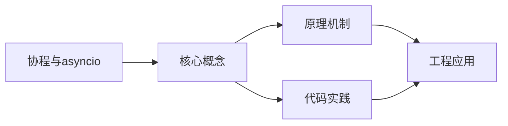
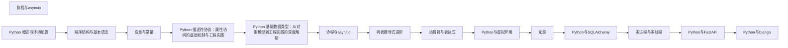

## 1. 学习目标（Bloom 分类）

本节按照布鲁姆教育目标分类学组织学习路径。本文主题为《协程与asyncio》，属于 Python 模块，读者可以根据自身阶段选择阅读深度。

记忆层面：能够准确复述本文的核心概念、术语与基本语法或操作步骤，并能够在提问或检索时快速定位对应知识点。例如能够说出 Python 的动态类型、缩进语法与解释执行等基本特征。

理解层面：能够用自己的语言解释核心原理与工作机制，说明概念之间的因果关系，而不是机械记忆结论。例如能够解释解释器与编译器的差异，以及 GIL 对并发的影响。

应用层面：能够在真实项目或练习场景中运用本文知识解决具体问题，写出正确且可维护的实现。例如能够编写函数、类与标准库调用的完整脚本。

分析层面：能够拆解复杂问题，比较本文主题与相邻概念的异同，识别边界条件与例外情况。例如能够比较 Python 与 Java、Go 在类型系统与并发模型上的差异。

评价层面：能够根据约束条件（性能、可读性、安全、成本）评价不同方案的优劣，做出有依据的技术决策。例如能够评估不同实现方案（脚本、服务、库）的适用场景。

创造层面：能够把本文知识与其他模块知识组合，设计出新的解决方案或可复用的工程模式。例如能够组合标准库与第三方包设计完整的自动化工具。

通过本节学习，读者应当能够把《协程与asyncio》纳入自己的知识网络，并与 Python 模块的其他主题（数据类型、函数、模块、异常、并发）建立关联。

## 2. 历史动机与发展脉络

《协程与asyncio》是 Python 领域的重要主题。要真正理解它，需要先了解它解决的问题与演进过程。

Python 由 Guido van Rossum 于 1991 年首次发布，设计哲学强调代码可读性与开发效率，核心思想记录在《Python 之禅》（PEP 20）中：优美优于丑陋、明确优于隐晦、简单优于复杂。
Python 2 与 Python 3 的分裂期（2008-2020）是语言史上最重要的兼容性事件：Python 3 修复了字符串编码、整数除法等长期问题，但破坏性变更导致迁移缓慢；2020 年 1 月 Python 2 停止官方维护，社区全面转向 Python 3。
Python 3.9 至 3.13 的演进带来了类型提示增强（PEP 604 的 X | Y 语法、PEP 695 的泛型语法）、性能优化（3.11 的 faster-calls 与自适应解释器）以及异步生态的成熟（asyncio、FastAPI、httpx）。
Python 的应用版图从脚本自动化扩展到 Web 后端（Django、FastAPI）、数据科学（NumPy、Pandas、Matplotlib）、机器学习（PyTorch、scikit-learn）、运维自动化（Ansible）与科学计算，是当今最通用的编程语言之一。

回到本文主题：协程与asyncio 的提出与成熟，正是上述技术背景下的必然产物。早期实现往往以简单可用为目标，随着工程规模扩大，社区逐渐沉淀出标准做法与最佳实践；理解这一脉络，可以帮助读者判断“为什么文档中的推荐写法是现在这个样子”，也能在遇到历史遗留代码时准确识别其设计年代与取舍。

对于初学者，理解 Python 的“电池内置”（标准库丰富）与“胶水语言”（易于调用 C/C++/Rust 扩展）两大特性，是判断其适用场景的基础。

## 3. 形式化定义与核心概念精讲

本节把《协程与asyncio》涉及的核心概念以“定义 + 讲解”的形式展开。读者应把定义当作工具，把讲解当作理解路径；两者结合才能形成可迁移的知识。

变量与动态类型：Python 变量是对象的引用，类型属于对象而非变量；`isinstance()` 与 `type()` 用于运行时检查，类型注解（PEP 484）提供静态检查能力但不改变运行时行为。
缩进即语法：Python 用缩进表达代码块层次，避免了花括号噪声，也强制了代码排版一致性；同一代码块必须使用一致的空格数（官方推荐 4 空格）。
函数是一等公民：函数可以赋值、传参、返回，配合 lambda、装饰器与闭包，构成函数式编程能力的基础。
模块与包：每个 `.py` 文件是模块，目录加 `__init__.py` 是包；`import` 机制支持绝对导入、相对导入与命名空间包。
异常处理：`try/except/finally` 与 `raise` 构成错误传播体系；`with` 语句通过上下文管理器（`__enter__/__exit__`）管理资源生命周期。

### 3.1 原文章节逐一精讲

原文档把主题拆分为 16 个小节，下面按顺序给出每一节的导读讲解，随后保留原文细节供精读。

#### 原文精读（完整保留）

# Python asyncio 异步编程

> **符号约定**：`< >` 必填参数 | `[ ]` 可选参数

---

#### 事件循环

**基本写法：运行协程**
`asyncio.run(<协程>)`
```python
# 运行顶层协程并管理事件循环
async def main():
    print("hello")
asyncio.run(main())
```

**基本写法：获取当前事件循环**
`asyncio.get_event_loop()`
```python
# 获取当前运行的事件循环
loop = asyncio.get_event_loop()
```

**基本写法：获取运行中的事件循环**
`asyncio.get_running_loop()`
```python
# 在协程中获取当前运行的事件循环
loop = asyncio.get_running_loop()
```

**基本写法：设置事件循环策略**
`asyncio.set_event_loop_policy(<策略>)`
```python
# Windows 下使用 Selector 事件循环
if sys.platform == "win32":
    asyncio.set_event_loop_policy(asyncio.WindowsSelectorEventLoopPolicy())
```

---

##### 异步上下文管理器

```python
import asyncio

class AsyncDatabaseConnection:
    """异步数据库连接"""

    async def __aenter__(self):
        print("连接数据库")
        await asyncio.sleep(0.1)  # 模拟异步连接
        return self

    async def __aexit__(self, exc_type, exc_val, exc_tb):
        print("关闭数据库连接")
        await asyncio.sleep(0.1)  # 模拟异步关闭

    async def query(self, sql):
        await asyncio.sleep(0.5)  # 模拟异步查询
        return f"查询结果: {sql}"

async def main():
    async with AsyncDatabaseConnection() as db:
        result = await db.query("SELECT * FROM users")
        print(result)

asyncio.run(main())
```

##### 异步迭代器

```python
import asyncio

class AsyncRange:
    """异步范围迭代器"""

    def __init__(self, count):
        self.count = count

    def __aiter__(self):
        self.current = 0
        return self

    async def __anext__(self):
        if self.current >= self.count:
            raise StopAsyncIteration
        await asyncio.sleep(0.1)  # 模拟异步获取
        value = self.current
        self.current += 1
        return value

async def main():
    # 使用 async for 遍历异步迭代器
    async for i in AsyncRange(5):
        print(f"获取到: {i}")

asyncio.run(main())
```

#### 什么是协程

协程是一种比线程更轻量的并发方式。线程由操作系统调度，切换开销大；协程由程序自身调度，切换开销极小。你可以创建成千上万个协程而不会耗尽系统资源。

Python 的 asyncio 模块提供了编写协程的基础设施。在 asyncio 中，你用 async def 定义协程函数，用 await 等待异步操作完成。当一个协程在等待（比如等待网络响应）时，事件循环会自动切换到其他协程执行，从而实现并发。

#### 基础概念

##### 同步与异步

同步代码是按顺序执行的：一行代码执行完才执行下一行。如果某行代码需要等待（如网络请求），整个程序都会停在那里。

异步代码在等待时会自动切换到其他任务。比如你发起一个网络请求，在等待响应的同时可以做其他事情，等响应到了再回来处理。这样就不会因为一个慢操作阻塞整个程序。

##### async/await 语法

- async def：定义一个协程函数。调用协程函数不会立即执行，而是返回一个协程对象
- await：等待一个异步操作完成。await 只能在 async 函数中使用

##### 协程与任务

- 协程（Coroutine）：async def 定义的函数的返回值，本身不会执行
- 任务（Task）：对协程的封装，由事件循环调度执行。使用 asyncio.create_task() 创建

#### 快速上手

##### 第一个协程

```python
import asyncio

# 定义协程函数
async def say_hello(name, delay):
    """延迟后打印问候"""
    print(f"开始等待 {name}...")
    # 异步等待（不会阻塞事件循环）
    await asyncio.sleep(delay)
    print(f"你好, {name}!")

# 运行协程
asyncio.run(say_hello("世界", 2))
```

##### 并发执行多个协程

```python
import asyncio
import time

async def say_hello(name, delay):
    print(f"开始: {name}")
    await asyncio.sleep(delay)
    print(f"完成: {name}")
    return f"{name} 的结果"

async def main():
    start = time.time()

    # 并发执行三个协程
    results = await asyncio.gather(
        say_hello("任务A", 2),
        say_hello("任务B", 1),
        say_hello("任务C", 3),
    )

    duration = time.time() - start
    print(f"结果: {results}")
    print(f"总耗时: {duration:.1f} 秒")  # 约 3 秒，不是 6 秒

asyncio.run(main())
```

输出：

```
开始: 任务A
开始: 任务B
开始: 任务C
完成: 任务B
完成: 任务A
完成: 任务C
结果: ['任务A 的结果', '任务B 的结果', '任务C 的结果']
总耗时: 3.0 秒
```

三个任务并发执行，总耗时等于最慢的那个任务（3 秒），而不是所有任务时间之和（6 秒）。

#### 详细用法

##### 创建任务

```python
import asyncio

async def process_data(data):
    """处理数据"""
    await asyncio.sleep(1)
    return f"处理完成: {data}"

async def main():
    # 方式一：create_task 创建任务并立即开始执行
    task = asyncio.create_task(process_data("测试数据"))

    # 在任务执行的同时可以做其他事情
    print("任务已创建，可以做其他事...")

    # 等待任务完成并获取结果
    result = await task
    print(result)

    # 方式二：gather 同时等待多个任务
    results = await asyncio.gather(
        process_data("数据1"),
        process_data("数据2"),
        process_data("数据3"),
    )
    print(results)

asyncio.run(main())
```

##### 任务取消

```python
import asyncio

async def long_task():
    """长时间运行的任务"""
    try:
        for i in range(10):
            print(f"进度: {i}/10")
            await asyncio.sleep(1)
        return "完成"
    except asyncio.CancelledError:
        print("任务被取消了")
        raise  # 重新抛出，让调用者知道任务被取消

async def main():
    task = asyncio.create_task(long_task())

    # 等 3 秒后取消任务
    await asyncio.sleep(3)
    task.cancel()

    try:
        result = await task
    except asyncio.CancelledError:
        print("主函数得知任务被取消")

asyncio.run(main())
```

##### 超时控制

```python
import asyncio

async def slow_operation():
    """模拟慢操作"""
    await asyncio.sleep(10)
    return "完成"

async def main():
    # 方式一：wait_for 设置超时
    try:
        result = await asyncio.wait_for(slow_operation(), timeout=3)
        print(result)
    except asyncio.TimeoutError:
        print("操作超时")

    # 方式二：asyncio.timeout（Python 3.11+）
    async with asyncio.timeout(3):
        try:
            result = await slow_operation()
            print(result)
        except asyncio.TimeoutError:
            print("操作超时")

asyncio.run(main())
```

##### 异步 HTTP 请求

```python
import asyncio
import aiohttp

async def fetch_url(session, url):
    """异步获取 URL 内容"""
    async with session.get(url) as response:
        return await response.text()

async def main():
    # 使用 aiohttp 进行异步 HTTP 请求
    async with aiohttp.ClientSession() as session:
        # 并发请求多个 URL
        urls = [
            "https://httpbin.org/get",
            "https://httpbin.org/ip",
            "https://httpbin.org/headers",
        ]
        tasks = [fetch_url(session, url) for url in urls]
        results = await asyncio.gather(*tasks)

        for url, result in zip(urls, results):
            print(f"{url}: {len(result)} 字符")

# 需要先安装 aiohttp: pip install aiohttp
asyncio.run(main())
```

##### 异步文件操作

```python
import asyncio
import aiofiles

async def read_file(path):
    """异步读取文件"""
    async with aiofiles.open(path, 'r', encoding='utf-8') as f:
        content = await f.read()
    return content

async def write_file(path, content):
    """异步写入文件"""
    async with aiofiles.open(path, 'w', encoding='utf-8') as f:
        await f.write(content)

# 需要先安装 aiofiles: pip install aiofiles
```

##### asyncio.Queue

asyncio.Queue 是协程间通信的安全方式：

```python
import asyncio
import random

async def producer(queue, producer_id):
    """生产者：向队列中添加数据"""
    for i in range(5):
        item = f"产品-{producer_id}-{i}"
        await queue.put(item)
        print(f"生产者 {producer_id} 添加: {item}")
        await asyncio.sleep(random.uniform(0.1, 0.5))

async def consumer(queue, consumer_id):
    """消费者：从队列中取出数据"""
    while True:
        item = await queue.get()
        print(f"消费者 {consumer_id} 处理: {item}")
        await asyncio.sleep(random.uniform(0.2, 0.8))
        queue.task_done()

async def main():
    queue = asyncio.Queue(maxsize=10)

    # 启动生产者和消费者
    producers = [producer(queue, i) for i in range(2)]
    consumers = [asyncio.create_task(consumer(queue, i)) for i in range(3)]

    # 等待所有生产者完成
    await asyncio.gather(*producers)

    # 等待队列中所有项目被处理
    await queue.join()

    # 取消消费者（它们在无限循环中）
    for c in consumers:
        c.cancel()

asyncio.run(main())
```

#### 常见场景

##### 异步 Web 爬虫

```python
import asyncio
import aiohttp
from time import time

async def fetch(session, url):
    """异步获取单个 URL"""
    try:
        async with session.get(url, timeout=aiohttp.ClientTimeout(total=10)) as resp:
            return await resp.text()
    except Exception as e:
        return f"错误: {e}"

async def crawl(urls):
    """并发爬取多个 URL"""
    async with aiohttp.ClientSession() as session:
        tasks = [fetch(session, url) for url in urls]
        results = await asyncio.gather(*tasks)
        return results

async def main():
    urls = [f"https://httpbin.org/get?id={i}" for i in range(10)]

    start = time()
    results = await crawl(urls)
    duration = time() - start

    print(f"爬取 {len(urls)} 个页面，耗时 {duration:.2f} 秒")

asyncio.run(main())
```

##### 异步数据库操作

```python
import asyncio

async def batch_insert(records):
    """批量异步插入数据"""
    tasks = [insert_record(record) for record in records]
    results = await asyncio.gather(*tasks)
    return results

async def insert_record(record):
    """异步插入单条记录"""
    # 模拟异步数据库操作
    await asyncio.sleep(0.01)
    return f"已插入: {record}"

async def main():
    records = [f"记录_{i}" for i in range(100)]
    results = await batch_insert(records)
    print(f"共插入 {len(results)} 条记录")

asyncio.run(main())
```

#### 注意事项与常见错误

##### 不要在协程中调用阻塞函数

在 async 函数中调用 time.sleep()、requests.get() 等同步阻塞函数会阻塞整个事件循环，其他协程都无法执行。应该使用对应的异步版本：

```python
import asyncio
import time

# 错误：使用同步的 time.sleep
async def bad_example():
    time.sleep(5)  # 阻塞整个事件循环 5 秒

# 正确：使用异步的 asyncio.sleep
async def good_example():
    await asyncio.sleep(5)  # 不阻塞事件循环
```

如果必须调用阻塞函数，使用 asyncio.to_thread 在线程中执行：

```python
import asyncio
import time

async def main():
    # 在线程中执行阻塞操作
    result = await asyncio.to_thread(time.sleep, 5)
```

##### 忘记 await

调用协程函数时如果不加 await，协程不会执行：

```python
import asyncio

async def my_coroutine():
    print("这行会执行吗？")

async def main():
    # 错误：没有 await，协程不会执行
    my_coroutine()

    # 正确：使用 await
    await my_coroutine()

asyncio.run(main())
```

##### asyncio.run 只能调用一次

asyncio.run() 会创建新的事件循环并运行。在已有事件循环运行时（如在 FastAPI 中），不能再调用 asyncio.run()。应该直接 await 协程或使用 asyncio.create_task()。

##### gather 的错误处理

asyncio.gather 中某个任务抛出异常时，默认会取消其他任务。如果需要获取所有结果（包括异常），使用 return_exceptions=True：

```python
results = await asyncio.gather(
    task1(),
    task2(),
    task3(),
    return_exceptions=True  # 异常作为返回值，不会取消其他任务
)
```

#### 进阶用法

##### 使用 Semaphore 限制并发数

```python
import asyncio
import aiohttp

async def fetch_with_limit(session, url, semaphore):
    """带并发限制的请求"""
    async with semaphore:  # 获取信号量，超过限制则等待
        async with session.get(url) as resp:
            return await resp.text()

async def main():
    # 最多同时 5 个请求
    semaphore = asyncio.Semaphore(5)

    async with aiohttp.ClientSession() as session:
        urls = [f"https://httpbin.org/get?id={i}" for i in range(50)]
        tasks = [
            fetch_with_limit(session, url, semaphore)
            for url in urls
        ]
        results = await asyncio.gather(*tasks)
        print(f"完成 {len(results)} 个请求")

asyncio.run(main())
```

##### 使用 as_completed 按完成顺序获取结果

```python
import asyncio

async def task(name, delay):
    await asyncio.sleep(delay)
    return f"{name} 完成（耗时 {delay} 秒）"

async def main():
    tasks = [
        asyncio.create_task(task("A", 3)),
        asyncio.create_task(task("B", 1)),
        asyncio.create_task(task("C", 2)),
    ]

    # 按完成顺序获取结果（而不是按创建顺序）
    for coro in asyncio.as_completed(tasks):
        result = await coro
        print(result)

# 输出顺序：B -> C -> A

asyncio.run(main())
```

##### 子进程管理

```python
import asyncio

async def run_command(cmd):
    """异步运行命令行命令"""
    process = await asyncio.create_subprocess_exec(
        *cmd,
        stdout=asyncio.subprocess.PIPE,
        stderr=asyncio.subprocess.PIPE,
    )

    stdout, stderr = await process.communicate()
    return {
        "returncode": process.returncode,
        "stdout": stdout.decode(),
        "stderr": stderr.decode(),
    }

async def main():
    result = await run_command(["python", "-c", "print('Hello')"])
    print(result["stdout"])  # Hello

asyncio.run(main())
```

##### 在 FastAPI 中使用异步

FastAPI 原生支持 async/await，你可以直接在路由处理函数中使用：

```python
from fastapi import FastAPI
import asyncio

app = FastAPI()

@app.get("/slow")
async def slow_endpoint():
    """异步端点：等待时可以处理其他请求"""
    await asyncio.sleep(2)
    return {"message": "完成"}

@app.get("/fast")
async def fast_endpoint():
    return {"message": "立即返回"}
```
#### 协程定义与调用

**基本写法：定义协程函数**
`async def <函数名>(<参数>): <语句>`
```python
# 使用 async def 定义协程
async def fetch_data(url):
    await asyncio.sleep(1)
    return {"data": "result"}
```

**基本写法：await 等待协程**
`await <协程>`
```python
# 在协程中等待另一个协程完成
async def main():
    result = await fetch_data("https://example.com")
    print(result)
```

**基本写法：await 多个协程顺序执行**
`await <协程1>; await <协程2>`
```python
# 依次等待两个协程
async def main():
    r1 = await fetch("url1")
    r2 = await fetch("url2")
```

---

#### 任务管理

**基本写法：创建任务**
`asyncio.create_task(<协程>)`
```python
# 将协程封装为 Task 并调度执行
async def main():
    task = asyncio.create_task(fetch_data("url"))
    result = await task
```

**基本写法：并发运行多个协程**
`asyncio.gather(<协程1>, <协程2>)`
```python
# 并发执行多个协程，按顺序返回结果
async def main():
    results = await asyncio.gather(
        fetch("url1"),
        fetch("url2"),
        fetch("url3"),
    )
```

**基本写法：gather 异常处理**
`asyncio.gather(<协程>, return_exceptions=True)`
```python
# 异常作为返回值而非抛出
async def main():
    results = await asyncio.gather(
        fetch("url1"),
        fetch("bad_url"),
        return_exceptions=True,
    )
    for r in results:
        if isinstance(r, Exception):
            print("失败:", r)
```

**基本写法：Go 1.0 风格任务组**
`async with asyncio.TaskGroup() as <组>:`
```python
# Python 3.11+ 结构化并发，任一任务异常则全部取消
async def main():
    async with asyncio.TaskGroup() as tg:
        t1 = tg.create_task(fetch("url1"))
        t2 = tg.create_task(fetch("url2"))
    # 退出 with 块时所有任务已完成
    print(t1.result(), t2.result())
```

---

#### 等待与超时

**基本写法：等待第一个完成**
`asyncio.wait_for(<协程>, <超时>)`
```python
# 设置超时，超时抛出 TimeoutError
async def main():
    try:
        result = await asyncio.wait_for(fetch("url"), timeout=5.0)
    except asyncio.TimeoutError:
        print("超时")
```

**基本写法：Python 3.11+ asyncio.timeout**
`async with asyncio.timeout(<秒>):`
```python
# Python 3.11+ 超时上下文管理器
async def main():
    try:
        async with asyncio.timeout(5.0):
            result = await fetch("url")
    except TimeoutError:
        print("超时")
```

**基本写法：等待首个完成**
`asyncio.as_completed(<协程列表>)`
```python
# 按完成顺序获取结果
async def main():
    tasks = [fetch(f"url{i}") for i in range(3)]
    for coro in asyncio.as_completed(tasks):
        result = await coro
        print("完成:", result)
```

**基本写法：wait 返回两组任务**
`done, pending = await asyncio.wait(<任务集>)`
```python
# 返回已完成和未完成两组任务
async def main():
    tasks = [asyncio.create_task(fetch(f"url{i}")) for i in range(3)]
    done, pending = await asyncio.wait(
        tasks, return_when=asyncio.FIRST_COMPLETED
    )
```

---

#### 休眠

**基本写法：异步休眠**
`await asyncio.sleep(<秒>)`
```python
# 非阻塞休眠，让出控制权
async def main():
    await asyncio.sleep(1.0)
    print("1秒后")
```

---

#### 队列

**基本写法：异步队列**
`asyncio.Queue()`
```python
# 协程间安全传递数据
async def producer(q):
    await q.put("item")
async def consumer(q):
    item = await q.get()
async def main():
    q = asyncio.Queue(maxsize=10)
    await asyncio.gather(producer(q), consumer(q))
```

**基本写法：带缓冲的队列**
`asyncio.Queue(maxsize=<大小>)`
```python
# 设置最大容量，满时 put 阻塞
q = asyncio.Queue(maxsize=5)
await q.put("data")
item = await q.get()
q.task_done()
await q.join()
```

---

#### 锁与信号量

**基本写法：异步锁**
`asyncio.Lock()`
```python
# 协程间互斥锁
lock = asyncio.Lock()
async def safe_update():
    async with lock:
        shared_resource += 1
```

**基本写法：信号量**
`asyncio.Semaphore(<数量>)`
```python
# 限制并发数量
sem = asyncio.Semaphore(5)
async def limited_fetch(url):
    async with sem:
        return await fetch(url)
```

**基本写法：事件**
`asyncio.Event()`
```python
# 协程间事件通知
event = asyncio.Event()
async def waiter():
    await event.wait()
    print("收到信号")
async def setter():
    await asyncio.sleep(1)
    event.set()
```

---

#### 异步生成器

**基本写法：定义异步生成器**
`async def <函数名>(): yield <值>`
```python
# 异步生成器函数
async def async_range(n):
    for i in range(n):
        await asyncio.sleep(0.1)
        yield i
```

**基本写法：遍历异步生成器**
`async for <变量> in <异步可迭代>:`
```python
# 异步迭代
async def main():
    async for num in async_range(5):
        print(num)
```

---

#### Python 3.13+ asyncio 增强

**基本写法：Python 3.13+ asyncio.Runner**
`asyncio.Runner()`
```python
# Python 3.13+ Runner 上下文管理复用事件循环
with asyncio.Runner() as runner:
    r1 = runner.run(fetch("url1"))
    r2 = runner.run(fetch("url2"))
```

**基本写法：Python 3.13+ eager_task_factory**
`loop.set_task_factory(asyncio.eager_task_factory)`
```python
# Python 3.13+ 协程立即开始执行而非延迟调度
async def main():
    loop = asyncio.get_running_loop()
    loop.set_task_factory(asyncio.eager_task_factory)
```


### 3.2 概念关系图

下面用 Mermaid 图表达本文核心概念之间的关系，帮助读者建立整体图景：



图中展示的是本文知识的结构化关系：核心概念是入口，原理机制解释“为什么”，代码实践演示“怎么做”，工程应用回答“何时用”。读者学习时可以把每个小节的内容挂接到对应节点上。

## 4. 理论推导与原理解析

本节深入《协程与asyncio》背后的原理。理论部分不求面面俱到，而是聚焦“能解释现象、能指导实践”的关键推导。

解释执行与字节码：CPython 先把源码编译为字节码（.pyc），再由虚拟机逐条执行。字节码是平台无关的中间表示，因此 Python 程序可以跨平台运行，但执行速度低于编译型语言；性能敏感路径可用 C 扩展或 Cython 加速。
GIL（全局解释器锁）：CPython 的 GIL 保证同一时刻只有一个线程执行字节码，简化了内存管理，但限制了 CPU 密集型多线程并行；I/O 密集型任务通过线程切换获得并发，CPU 密集型任务应使用多进程（multiprocessing）或异步。
引用计数与垃圾回收：Python 对象通过引用计数管理生命周期，循环引用由分代垃圾回收器（gc 模块）处理。理解这一模型可以解释“为什么局部变量及时释放内存”“为什么大对象需要 del 或作用域退出”。
鸭子类型与协议：Python 依赖行为协议而非继承体系，例如实现 `__iter__` 与 `__next__` 的对象即可用于 `for` 循环。这一设计带来灵活性的同时，也要求开发者编写清晰的接口文档与类型注解。

需要强调的是，理论推导与工程实践之间存在翻译层：理论给出的是理想化模型与边界条件，工程代码则必须处理真实环境中的例外。读者在学习时应先掌握理论的“标准情形”，再通过陷阱章节了解“非标准情形”。

## 5. 代码示例与逐行讲解

本节把原文中的代码示例系统整理，并为每个示例补充用途说明与讲解。读者不应只浏览代码，而应逐段对照讲解理解设计意图。

### 5.1 示例：事件循环

该示例来自原文《事件循环》小节，用于演示协程与asyncio相关操作。阅读时请先看代码结构，再看其后的讲解。

```python
# 运行顶层协程并管理事件循环
async def main():
    print("hello")
asyncio.run(main())
```

讲解：这段代码演示了本节核心知识点。代码中的关键操作可以归纳为三步：准备（定义或初始化）、执行（核心逻辑）、收尾（释放资源或返回结果）。实际项目中，这三步往往被封装为函数或类，以提升复用性与可测试性。

关键点分析：

该示例共 4 行有效代码，包含 1 类关键结构（def）。其中：

- 入口与初始化部分负责建立上下文，对应实际项目中的启动或装配逻辑；
- 核心逻辑部分体现本文主题的主要操作，是阅读时最需要对照讲解理解的部分；
- 输出或返回部分把结果交给调用方，注意其类型与边界条件。

进阶思考路径：先尝试修改参数观察行为变化，再把示例中的模式迁移到自己的项目中；每次修改都记录预期与实测差异，这是把示例转化为能力的最快方式。

### 5.2 示例：事件循环

该示例来自原文《事件循环》小节，用于演示协程与asyncio相关操作。阅读时请先看代码结构，再看其后的讲解。

```python
# 获取当前运行的事件循环
loop = asyncio.get_event_loop()
```

讲解：这段代码演示了本节核心知识点。代码中的关键操作可以归纳为三步：准备（定义或初始化）、执行（核心逻辑）、收尾（释放资源或返回结果）。实际项目中，这三步往往被封装为函数或类，以提升复用性与可测试性。

关键点分析：

该示例共 2 行有效代码，结构以数据或配置为主。阅读时应关注：数据字段的含义、配置项的作用，以及它们与运行行为的对应关系。

进阶思考路径：先尝试修改参数观察行为变化，再把示例中的模式迁移到自己的项目中；每次修改都记录预期与实测差异，这是把示例转化为能力的最快方式。

### 5.3 示例：事件循环

该示例来自原文《事件循环》小节，用于演示协程与asyncio相关操作。阅读时请先看代码结构，再看其后的讲解。

```python
# 在协程中获取当前运行的事件循环
loop = asyncio.get_running_loop()
```

讲解：这段代码演示了本节核心知识点。代码中的关键操作可以归纳为三步：准备（定义或初始化）、执行（核心逻辑）、收尾（释放资源或返回结果）。实际项目中，这三步往往被封装为函数或类，以提升复用性与可测试性。

关键点分析：

该示例共 2 行有效代码，结构以数据或配置为主。阅读时应关注：数据字段的含义、配置项的作用，以及它们与运行行为的对应关系。

进阶思考路径：先尝试修改参数观察行为变化，再把示例中的模式迁移到自己的项目中；每次修改都记录预期与实测差异，这是把示例转化为能力的最快方式。

### 5.4 示例：事件循环

该示例来自原文《事件循环》小节，用于演示协程与asyncio相关操作。阅读时请先看代码结构，再看其后的讲解。

```python
# Windows 下使用 Selector 事件循环
if sys.platform == "win32":
    asyncio.set_event_loop_policy(asyncio.WindowsSelectorEventLoopPolicy())
```

讲解：这段代码演示了本节核心知识点。代码中的关键操作可以归纳为三步：准备（定义或初始化）、执行（核心逻辑）、收尾（释放资源或返回结果）。实际项目中，这三步往往被封装为函数或类，以提升复用性与可测试性。

关键点分析：

该示例共 3 行有效代码，包含 1 类关键结构（if）。其中：

- 入口与初始化部分负责建立上下文，对应实际项目中的启动或装配逻辑；
- 核心逻辑部分体现本文主题的主要操作，是阅读时最需要对照讲解理解的部分；
- 输出或返回部分把结果交给调用方，注意其类型与边界条件。

进阶思考路径：先尝试修改参数观察行为变化，再把示例中的模式迁移到自己的项目中；每次修改都记录预期与实测差异，这是把示例转化为能力的最快方式。

### 5.5 示例：异步上下文管理器

该示例来自原文《异步上下文管理器》小节，用于演示协程与asyncio相关操作。阅读时请先看代码结构，再看其后的讲解。

```python
import asyncio

class AsyncDatabaseConnection:
    """异步数据库连接"""

    async def __aenter__(self):
        print("连接数据库")
        await asyncio.sleep(0.1)  # 模拟异步连接
        return self

    async def __aexit__(self, exc_type, exc_val, exc_tb):
        print("关闭数据库连接")
        await asyncio.sleep(0.1)  # 模拟异步关闭

    async def query(self, sql):
        await asyncio.sleep(0.5)  # 模拟异步查询
        return f"查询结果: {sql}"

async def main():
    async with AsyncDatabaseConnection() as db:
        result = await db.query("SELECT * FROM users")
        print(result)

asyncio.run(main())
```

讲解：这段代码演示了本节核心知识点。代码中的关键操作可以归纳为三步：准备（定义或初始化）、执行（核心逻辑）、收尾（释放资源或返回结果）。实际项目中，这三步往往被封装为函数或类，以提升复用性与可测试性。

关键点分析：

该示例共 18 行有效代码，包含 6 类关键结构（class、def、import、return、SELECT、FROM）。其中：

- 入口与初始化部分负责建立上下文，对应实际项目中的启动或装配逻辑；
- 核心逻辑部分体现本文主题的主要操作，是阅读时最需要对照讲解理解的部分；
- 输出或返回部分把结果交给调用方，注意其类型与边界条件。

进阶思考路径：先尝试修改参数观察行为变化，再把示例中的模式迁移到自己的项目中；每次修改都记录预期与实测差异，这是把示例转化为能力的最快方式。

### 5.6 示例：异步迭代器

该示例来自原文《异步迭代器》小节，用于演示协程与asyncio相关操作。阅读时请先看代码结构，再看其后的讲解。

```python
import asyncio

class AsyncRange:
    """异步范围迭代器"""

    def __init__(self, count):
        self.count = count

    def __aiter__(self):
        self.current = 0
        return self

    async def __anext__(self):
        if self.current >= self.count:
            raise StopAsyncIteration
        await asyncio.sleep(0.1)  # 模拟异步获取
        value = self.current
        self.current += 1
        return value

async def main():
    # 使用 async for 遍历异步迭代器
    async for i in AsyncRange(5):
        print(f"获取到: {i}")

asyncio.run(main())
```

讲解：这段代码演示了本节核心知识点。代码中的关键操作可以归纳为三步：准备（定义或初始化）、执行（核心逻辑）、收尾（释放资源或返回结果）。实际项目中，这三步往往被封装为函数或类，以提升复用性与可测试性。

关键点分析：

该示例共 20 行有效代码，包含 6 类关键结构（class、def、import、if、for、return）。其中：

- 入口与初始化部分负责建立上下文，对应实际项目中的启动或装配逻辑；
- 核心逻辑部分体现本文主题的主要操作，是阅读时最需要对照讲解理解的部分；
- 输出或返回部分把结果交给调用方，注意其类型与边界条件。

进阶思考路径：先尝试修改参数观察行为变化，再把示例中的模式迁移到自己的项目中；每次修改都记录预期与实测差异，这是把示例转化为能力的最快方式。

### 5.7 示例：第一个协程

该示例来自原文《第一个协程》小节，用于演示协程与asyncio相关操作。阅读时请先看代码结构，再看其后的讲解。

```python
import asyncio

# 定义协程函数
async def say_hello(name, delay):
    """延迟后打印问候"""
    print(f"开始等待 {name}...")
    # 异步等待（不会阻塞事件循环）
    await asyncio.sleep(delay)
    print(f"你好, {name}!")

# 运行协程
asyncio.run(say_hello("世界", 2))
```

讲解：这段代码演示了本节核心知识点。代码中的关键操作可以归纳为三步：准备（定义或初始化）、执行（核心逻辑）、收尾（释放资源或返回结果）。实际项目中，这三步往往被封装为函数或类，以提升复用性与可测试性。

关键点分析：

该示例共 10 行有效代码，包含 2 类关键结构（def、import）。其中：

- 入口与初始化部分负责建立上下文，对应实际项目中的启动或装配逻辑；
- 核心逻辑部分体现本文主题的主要操作，是阅读时最需要对照讲解理解的部分；
- 输出或返回部分把结果交给调用方，注意其类型与边界条件。

进阶思考路径：先尝试修改参数观察行为变化，再把示例中的模式迁移到自己的项目中；每次修改都记录预期与实测差异，这是把示例转化为能力的最快方式。

### 5.8 示例：并发执行多个协程

该示例来自原文《并发执行多个协程》小节，用于演示协程与asyncio相关操作。阅读时请先看代码结构，再看其后的讲解。

```python
import asyncio
import time

async def say_hello(name, delay):
    print(f"开始: {name}")
    await asyncio.sleep(delay)
    print(f"完成: {name}")
    return f"{name} 的结果"

async def main():
    start = time.time()

    # 并发执行三个协程
    results = await asyncio.gather(
        say_hello("任务A", 2),
        say_hello("任务B", 1),
        say_hello("任务C", 3),
    )

    duration = time.time() - start
    print(f"结果: {results}")
    print(f"总耗时: {duration:.1f} 秒")  # 约 3 秒，不是 6 秒

asyncio.run(main())
```

讲解：这段代码演示了本节核心知识点。代码中的关键操作可以归纳为三步：准备（定义或初始化）、执行（核心逻辑）、收尾（释放资源或返回结果）。实际项目中，这三步往往被封装为函数或类，以提升复用性与可测试性。

关键点分析：

该示例共 19 行有效代码，包含 3 类关键结构（def、import、return）。其中：

- 入口与初始化部分负责建立上下文，对应实际项目中的启动或装配逻辑；
- 核心逻辑部分体现本文主题的主要操作，是阅读时最需要对照讲解理解的部分；
- 输出或返回部分把结果交给调用方，注意其类型与边界条件。

进阶思考路径：先尝试修改参数观察行为变化，再把示例中的模式迁移到自己的项目中；每次修改都记录预期与实测差异，这是把示例转化为能力的最快方式。

### 5.9 示例：并发执行多个协程

该示例来自原文《并发执行多个协程》小节，用于演示协程与asyncio相关操作。阅读时请先看代码结构，再看其后的讲解。

```text
开始: 任务A
开始: 任务B
开始: 任务C
完成: 任务B
完成: 任务A
完成: 任务C
结果: ['任务A 的结果', '任务B 的结果', '任务C 的结果']
总耗时: 3.0 秒
```

讲解：这段代码演示了本节核心知识点。代码中的关键操作可以归纳为三步：准备（定义或初始化）、执行（核心逻辑）、收尾（释放资源或返回结果）。实际项目中，这三步往往被封装为函数或类，以提升复用性与可测试性。

关键点分析：

该示例共 8 行有效代码，结构以数据或配置为主。阅读时应关注：数据字段的含义、配置项的作用，以及它们与运行行为的对应关系。

进阶思考路径：先尝试修改参数观察行为变化，再把示例中的模式迁移到自己的项目中；每次修改都记录预期与实测差异，这是把示例转化为能力的最快方式。

### 5.10 示例：创建任务

该示例来自原文《创建任务》小节，用于演示协程与asyncio相关操作。阅读时请先看代码结构，再看其后的讲解。

```python
import asyncio

async def process_data(data):
    """处理数据"""
    await asyncio.sleep(1)
    return f"处理完成: {data}"

async def main():
    # 方式一：create_task 创建任务并立即开始执行
    task = asyncio.create_task(process_data("测试数据"))

    # 在任务执行的同时可以做其他事情
    print("任务已创建，可以做其他事...")

    # 等待任务完成并获取结果
    result = await task
    print(result)

    # 方式二：gather 同时等待多个任务
    results = await asyncio.gather(
        process_data("数据1"),
        process_data("数据2"),
        process_data("数据3"),
    )
    print(results)

asyncio.run(main())
```

讲解：这段代码演示了本节核心知识点。代码中的关键操作可以归纳为三步：准备（定义或初始化）、执行（核心逻辑）、收尾（释放资源或返回结果）。实际项目中，这三步往往被封装为函数或类，以提升复用性与可测试性。

关键点分析：

该示例共 21 行有效代码，包含 3 类关键结构（def、import、return）。其中：

- 入口与初始化部分负责建立上下文，对应实际项目中的启动或装配逻辑；
- 核心逻辑部分体现本文主题的主要操作，是阅读时最需要对照讲解理解的部分；
- 输出或返回部分把结果交给调用方，注意其类型与边界条件。

进阶思考路径：先尝试修改参数观察行为变化，再把示例中的模式迁移到自己的项目中；每次修改都记录预期与实测差异，这是把示例转化为能力的最快方式。

### 5.11 示例：任务取消

该示例来自原文《任务取消》小节，用于演示协程与asyncio相关操作。阅读时请先看代码结构，再看其后的讲解。

```python
import asyncio

async def long_task():
    """长时间运行的任务"""
    try:
        for i in range(10):
            print(f"进度: {i}/10")
            await asyncio.sleep(1)
        return "完成"
    except asyncio.CancelledError:
        print("任务被取消了")
        raise  # 重新抛出，让调用者知道任务被取消

async def main():
    task = asyncio.create_task(long_task())

    # 等 3 秒后取消任务
    await asyncio.sleep(3)
    task.cancel()

    try:
        result = await task
    except asyncio.CancelledError:
        print("主函数得知任务被取消")

asyncio.run(main())
```

讲解：这段代码演示了本节核心知识点。代码中的关键操作可以归纳为三步：准备（定义或初始化）、执行（核心逻辑）、收尾（释放资源或返回结果）。实际项目中，这三步往往被封装为函数或类，以提升复用性与可测试性。

关键点分析：

该示例共 21 行有效代码，包含 4 类关键结构（def、import、for、return）。其中：

- 入口与初始化部分负责建立上下文，对应实际项目中的启动或装配逻辑；
- 核心逻辑部分体现本文主题的主要操作，是阅读时最需要对照讲解理解的部分；
- 输出或返回部分把结果交给调用方，注意其类型与边界条件。

进阶思考路径：先尝试修改参数观察行为变化，再把示例中的模式迁移到自己的项目中；每次修改都记录预期与实测差异，这是把示例转化为能力的最快方式。

### 5.12 示例：超时控制

该示例来自原文《超时控制》小节，用于演示协程与asyncio相关操作。阅读时请先看代码结构，再看其后的讲解。

```python
import asyncio

async def slow_operation():
    """模拟慢操作"""
    await asyncio.sleep(10)
    return "完成"

async def main():
    # 方式一：wait_for 设置超时
    try:
        result = await asyncio.wait_for(slow_operation(), timeout=3)
        print(result)
    except asyncio.TimeoutError:
        print("操作超时")

    # 方式二：asyncio.timeout（Python 3.11+）
    async with asyncio.timeout(3):
        try:
            result = await slow_operation()
            print(result)
        except asyncio.TimeoutError:
            print("操作超时")

asyncio.run(main())
```

讲解：这段代码演示了本节核心知识点。代码中的关键操作可以归纳为三步：准备（定义或初始化）、执行（核心逻辑）、收尾（释放资源或返回结果）。实际项目中，这三步往往被封装为函数或类，以提升复用性与可测试性。

关键点分析：

该示例共 20 行有效代码，包含 4 类关键结构（def、import、for、return）。其中：

- 入口与初始化部分负责建立上下文，对应实际项目中的启动或装配逻辑；
- 核心逻辑部分体现本文主题的主要操作，是阅读时最需要对照讲解理解的部分；
- 输出或返回部分把结果交给调用方，注意其类型与边界条件。

进阶思考路径：先尝试修改参数观察行为变化，再把示例中的模式迁移到自己的项目中；每次修改都记录预期与实测差异，这是把示例转化为能力的最快方式。

### 5.13 示例：异步 HTTP 请求

该示例来自原文《异步 HTTP 请求》小节，用于演示协程与asyncio相关操作。阅读时请先看代码结构，再看其后的讲解。

```python
import asyncio
import aiohttp

async def fetch_url(session, url):
    """异步获取 URL 内容"""
    async with session.get(url) as response:
        return await response.text()

async def main():
    # 使用 aiohttp 进行异步 HTTP 请求
    async with aiohttp.ClientSession() as session:
        # 并发请求多个 URL
        urls = [
            "https://httpbin.org/get",
            "https://httpbin.org/ip",
            "https://httpbin.org/headers",
        ]
        tasks = [fetch_url(session, url) for url in urls]
        results = await asyncio.gather(*tasks)

        for url, result in zip(urls, results):
            print(f"{url}: {len(result)} 字符")

# 需要先安装 aiohttp: pip install aiohttp
asyncio.run(main())
```

讲解：这段代码演示了本节核心知识点。代码中的关键操作可以归纳为三步：准备（定义或初始化）、执行（核心逻辑）、收尾（释放资源或返回结果）。实际项目中，这三步往往被封装为函数或类，以提升复用性与可测试性。

关键点分析：

该示例共 21 行有效代码，包含 4 类关键结构（def、import、for、return）。其中：

- 入口与初始化部分负责建立上下文，对应实际项目中的启动或装配逻辑；
- 核心逻辑部分体现本文主题的主要操作，是阅读时最需要对照讲解理解的部分；
- 输出或返回部分把结果交给调用方，注意其类型与边界条件。

进阶思考路径：先尝试修改参数观察行为变化，再把示例中的模式迁移到自己的项目中；每次修改都记录预期与实测差异，这是把示例转化为能力的最快方式。

### 5.14 示例：异步文件操作

该示例来自原文《异步文件操作》小节，用于演示协程与asyncio相关操作。阅读时请先看代码结构，再看其后的讲解。

```python
import asyncio
import aiofiles

async def read_file(path):
    """异步读取文件"""
    async with aiofiles.open(path, 'r', encoding='utf-8') as f:
        content = await f.read()
    return content

async def write_file(path, content):
    """异步写入文件"""
    async with aiofiles.open(path, 'w', encoding='utf-8') as f:
        await f.write(content)

# 需要先安装 aiofiles: pip install aiofiles
```

讲解：这段代码演示了本节核心知识点。代码中的关键操作可以归纳为三步：准备（定义或初始化）、执行（核心逻辑）、收尾（释放资源或返回结果）。实际项目中，这三步往往被封装为函数或类，以提升复用性与可测试性。

关键点分析：

该示例共 12 行有效代码，包含 3 类关键结构（def、import、return）。其中：

- 入口与初始化部分负责建立上下文，对应实际项目中的启动或装配逻辑；
- 核心逻辑部分体现本文主题的主要操作，是阅读时最需要对照讲解理解的部分；
- 输出或返回部分把结果交给调用方，注意其类型与边界条件。

进阶思考路径：先尝试修改参数观察行为变化，再把示例中的模式迁移到自己的项目中；每次修改都记录预期与实测差异，这是把示例转化为能力的最快方式。

### 5.15 示例：asyncio.Queue

该示例来自原文《asyncio.Queue》小节，用于演示协程与asyncio相关操作。阅读时请先看代码结构，再看其后的讲解。

```python
import asyncio
import random

async def producer(queue, producer_id):
    """生产者：向队列中添加数据"""
    for i in range(5):
        item = f"产品-{producer_id}-{i}"
        await queue.put(item)
        print(f"生产者 {producer_id} 添加: {item}")
        await asyncio.sleep(random.uniform(0.1, 0.5))

async def consumer(queue, consumer_id):
    """消费者：从队列中取出数据"""
    while True:
        item = await queue.get()
        print(f"消费者 {consumer_id} 处理: {item}")
        await asyncio.sleep(random.uniform(0.2, 0.8))
        queue.task_done()

async def main():
    queue = asyncio.Queue(maxsize=10)

    # 启动生产者和消费者
    producers = [producer(queue, i) for i in range(2)]
    consumers = [asyncio.create_task(consumer(queue, i)) for i in range(3)]

    # 等待所有生产者完成
    await asyncio.gather(*producers)

    # 等待队列中所有项目被处理
    await queue.join()

    # 取消消费者（它们在无限循环中）
    for c in consumers:
        c.cancel()

asyncio.run(main())
```

讲解：这段代码演示了本节核心知识点。代码中的关键操作可以归纳为三步：准备（定义或初始化）、执行（核心逻辑）、收尾（释放资源或返回结果）。实际项目中，这三步往往被封装为函数或类，以提升复用性与可测试性。

关键点分析：

该示例共 29 行有效代码，包含 4 类关键结构（def、import、for、while）。其中：

- 入口与初始化部分负责建立上下文，对应实际项目中的启动或装配逻辑；
- 核心逻辑部分体现本文主题的主要操作，是阅读时最需要对照讲解理解的部分；
- 输出或返回部分把结果交给调用方，注意其类型与边界条件。

进阶思考路径：先尝试修改参数观察行为变化，再把示例中的模式迁移到自己的项目中；每次修改都记录预期与实测差异，这是把示例转化为能力的最快方式。

### 5.16 示例：异步 Web 爬虫

该示例来自原文《异步 Web 爬虫》小节，用于演示协程与asyncio相关操作。阅读时请先看代码结构，再看其后的讲解。

```python
import asyncio
import aiohttp
from time import time

async def fetch(session, url):
    """异步获取单个 URL"""
    try:
        async with session.get(url, timeout=aiohttp.ClientTimeout(total=10)) as resp:
            return await resp.text()
    except Exception as e:
        return f"错误: {e}"

async def crawl(urls):
    """并发爬取多个 URL"""
    async with aiohttp.ClientSession() as session:
        tasks = [fetch(session, url) for url in urls]
        results = await asyncio.gather(*tasks)
        return results

async def main():
    urls = [f"https://httpbin.org/get?id={i}" for i in range(10)]

    start = time()
    results = await crawl(urls)
    duration = time() - start

    print(f"爬取 {len(urls)} 个页面，耗时 {duration:.2f} 秒")

asyncio.run(main())
```

讲解：这段代码演示了本节核心知识点。代码中的关键操作可以归纳为三步：准备（定义或初始化）、执行（核心逻辑）、收尾（释放资源或返回结果）。实际项目中，这三步往往被封装为函数或类，以提升复用性与可测试性。

关键点分析：

该示例共 23 行有效代码，包含 5 类关键结构（def、import、from、for、return）。其中：

- 入口与初始化部分负责建立上下文，对应实际项目中的启动或装配逻辑；
- 核心逻辑部分体现本文主题的主要操作，是阅读时最需要对照讲解理解的部分；
- 输出或返回部分把结果交给调用方，注意其类型与边界条件。

进阶思考路径：先尝试修改参数观察行为变化，再把示例中的模式迁移到自己的项目中；每次修改都记录预期与实测差异，这是把示例转化为能力的最快方式。

### 5.17 示例：异步数据库操作

该示例来自原文《异步数据库操作》小节，用于演示协程与asyncio相关操作。阅读时请先看代码结构，再看其后的讲解。

```python
import asyncio

async def batch_insert(records):
    """批量异步插入数据"""
    tasks = [insert_record(record) for record in records]
    results = await asyncio.gather(*tasks)
    return results

async def insert_record(record):
    """异步插入单条记录"""
    # 模拟异步数据库操作
    await asyncio.sleep(0.01)
    return f"已插入: {record}"

async def main():
    records = [f"记录_{i}" for i in range(100)]
    results = await batch_insert(records)
    print(f"共插入 {len(results)} 条记录")

asyncio.run(main())
```

讲解：这段代码演示了本节核心知识点。代码中的关键操作可以归纳为三步：准备（定义或初始化）、执行（核心逻辑）、收尾（释放资源或返回结果）。实际项目中，这三步往往被封装为函数或类，以提升复用性与可测试性。

关键点分析：

该示例共 16 行有效代码，包含 4 类关键结构（def、import、for、return）。其中：

- 入口与初始化部分负责建立上下文，对应实际项目中的启动或装配逻辑；
- 核心逻辑部分体现本文主题的主要操作，是阅读时最需要对照讲解理解的部分；
- 输出或返回部分把结果交给调用方，注意其类型与边界条件。

进阶思考路径：先尝试修改参数观察行为变化，再把示例中的模式迁移到自己的项目中；每次修改都记录预期与实测差异，这是把示例转化为能力的最快方式。

### 5.18 示例：不要在协程中调用阻塞函数

该示例来自原文《不要在协程中调用阻塞函数》小节，用于演示协程与asyncio相关操作。阅读时请先看代码结构，再看其后的讲解。

```python
import asyncio
import time

# 错误：使用同步的 time.sleep
async def bad_example():
    time.sleep(5)  # 阻塞整个事件循环 5 秒

# 正确：使用异步的 asyncio.sleep
async def good_example():
    await asyncio.sleep(5)  # 不阻塞事件循环
```

讲解：这段代码演示了本节核心知识点。代码中的关键操作可以归纳为三步：准备（定义或初始化）、执行（核心逻辑）、收尾（释放资源或返回结果）。实际项目中，这三步往往被封装为函数或类，以提升复用性与可测试性。

关键点分析：

该示例共 8 行有效代码，包含 2 类关键结构（def、import）。其中：

- 入口与初始化部分负责建立上下文，对应实际项目中的启动或装配逻辑；
- 核心逻辑部分体现本文主题的主要操作，是阅读时最需要对照讲解理解的部分；
- 输出或返回部分把结果交给调用方，注意其类型与边界条件。

进阶思考路径：先尝试修改参数观察行为变化，再把示例中的模式迁移到自己的项目中；每次修改都记录预期与实测差异，这是把示例转化为能力的最快方式。

### 5.19 示例：不要在协程中调用阻塞函数

该示例来自原文《不要在协程中调用阻塞函数》小节，用于演示协程与asyncio相关操作。阅读时请先看代码结构，再看其后的讲解。

```python
import asyncio
import time

async def main():
    # 在线程中执行阻塞操作
    result = await asyncio.to_thread(time.sleep, 5)
```

讲解：这段代码演示了本节核心知识点。代码中的关键操作可以归纳为三步：准备（定义或初始化）、执行（核心逻辑）、收尾（释放资源或返回结果）。实际项目中，这三步往往被封装为函数或类，以提升复用性与可测试性。

关键点分析：

该示例共 5 行有效代码，包含 2 类关键结构（def、import）。其中：

- 入口与初始化部分负责建立上下文，对应实际项目中的启动或装配逻辑；
- 核心逻辑部分体现本文主题的主要操作，是阅读时最需要对照讲解理解的部分；
- 输出或返回部分把结果交给调用方，注意其类型与边界条件。

进阶思考路径：先尝试修改参数观察行为变化，再把示例中的模式迁移到自己的项目中；每次修改都记录预期与实测差异，这是把示例转化为能力的最快方式。

### 5.20 示例：忘记 await

该示例来自原文《忘记 await》小节，用于演示协程与asyncio相关操作。阅读时请先看代码结构，再看其后的讲解。

```python
import asyncio

async def my_coroutine():
    print("这行会执行吗？")

async def main():
    # 错误：没有 await，协程不会执行
    my_coroutine()

    # 正确：使用 await
    await my_coroutine()

asyncio.run(main())
```

讲解：这段代码演示了本节核心知识点。代码中的关键操作可以归纳为三步：准备（定义或初始化）、执行（核心逻辑）、收尾（释放资源或返回结果）。实际项目中，这三步往往被封装为函数或类，以提升复用性与可测试性。

关键点分析：

该示例共 9 行有效代码，包含 2 类关键结构（def、import）。其中：

- 入口与初始化部分负责建立上下文，对应实际项目中的启动或装配逻辑；
- 核心逻辑部分体现本文主题的主要操作，是阅读时最需要对照讲解理解的部分；
- 输出或返回部分把结果交给调用方，注意其类型与边界条件。

进阶思考路径：先尝试修改参数观察行为变化，再把示例中的模式迁移到自己的项目中；每次修改都记录预期与实测差异，这是把示例转化为能力的最快方式。

### 5.21 示例：gather 的错误处理

该示例来自原文《gather 的错误处理》小节，用于演示协程与asyncio相关操作。阅读时请先看代码结构，再看其后的讲解。

```python
results = await asyncio.gather(
    task1(),
    task2(),
    task3(),
    return_exceptions=True  # 异常作为返回值，不会取消其他任务
)
```

讲解：这段代码演示了本节核心知识点。代码中的关键操作可以归纳为三步：准备（定义或初始化）、执行（核心逻辑）、收尾（释放资源或返回结果）。实际项目中，这三步往往被封装为函数或类，以提升复用性与可测试性。

关键点分析：

该示例共 6 行有效代码，包含 1 类关键结构（return）。其中：

- 入口与初始化部分负责建立上下文，对应实际项目中的启动或装配逻辑；
- 核心逻辑部分体现本文主题的主要操作，是阅读时最需要对照讲解理解的部分；
- 输出或返回部分把结果交给调用方，注意其类型与边界条件。

进阶思考路径：先尝试修改参数观察行为变化，再把示例中的模式迁移到自己的项目中；每次修改都记录预期与实测差异，这是把示例转化为能力的最快方式。

### 5.22 示例：使用 Semaphore 限制并发数

该示例来自原文《使用 Semaphore 限制并发数》小节，用于演示协程与asyncio相关操作。阅读时请先看代码结构，再看其后的讲解。

```python
import asyncio
import aiohttp

async def fetch_with_limit(session, url, semaphore):
    """带并发限制的请求"""
    async with semaphore:  # 获取信号量，超过限制则等待
        async with session.get(url) as resp:
            return await resp.text()

async def main():
    # 最多同时 5 个请求
    semaphore = asyncio.Semaphore(5)

    async with aiohttp.ClientSession() as session:
        urls = [f"https://httpbin.org/get?id={i}" for i in range(50)]
        tasks = [
            fetch_with_limit(session, url, semaphore)
            for url in urls
        ]
        results = await asyncio.gather(*tasks)
        print(f"完成 {len(results)} 个请求")

asyncio.run(main())
```

讲解：这段代码演示了本节核心知识点。代码中的关键操作可以归纳为三步：准备（定义或初始化）、执行（核心逻辑）、收尾（释放资源或返回结果）。实际项目中，这三步往往被封装为函数或类，以提升复用性与可测试性。

关键点分析：

该示例共 19 行有效代码，包含 4 类关键结构（def、import、for、return）。其中：

- 入口与初始化部分负责建立上下文，对应实际项目中的启动或装配逻辑；
- 核心逻辑部分体现本文主题的主要操作，是阅读时最需要对照讲解理解的部分；
- 输出或返回部分把结果交给调用方，注意其类型与边界条件。

进阶思考路径：先尝试修改参数观察行为变化，再把示例中的模式迁移到自己的项目中；每次修改都记录预期与实测差异，这是把示例转化为能力的最快方式。

### 5.23 示例：使用 as_completed 按完成顺序获取结果

该示例来自原文《使用 as_completed 按完成顺序获取结果》小节，用于演示协程与asyncio相关操作。阅读时请先看代码结构，再看其后的讲解。

```python
import asyncio

async def task(name, delay):
    await asyncio.sleep(delay)
    return f"{name} 完成（耗时 {delay} 秒）"

async def main():
    tasks = [
        asyncio.create_task(task("A", 3)),
        asyncio.create_task(task("B", 1)),
        asyncio.create_task(task("C", 2)),
    ]

    # 按完成顺序获取结果（而不是按创建顺序）
    for coro in asyncio.as_completed(tasks):
        result = await coro
        print(result)

# 输出顺序：B -> C -> A

asyncio.run(main())
```

讲解：这段代码演示了本节核心知识点。代码中的关键操作可以归纳为三步：准备（定义或初始化）、执行（核心逻辑）、收尾（释放资源或返回结果）。实际项目中，这三步往往被封装为函数或类，以提升复用性与可测试性。

关键点分析：

该示例共 16 行有效代码，包含 4 类关键结构（def、import、for、return）。其中：

- 入口与初始化部分负责建立上下文，对应实际项目中的启动或装配逻辑；
- 核心逻辑部分体现本文主题的主要操作，是阅读时最需要对照讲解理解的部分；
- 输出或返回部分把结果交给调用方，注意其类型与边界条件。

进阶思考路径：先尝试修改参数观察行为变化，再把示例中的模式迁移到自己的项目中；每次修改都记录预期与实测差异，这是把示例转化为能力的最快方式。

### 5.24 示例：子进程管理

该示例来自原文《子进程管理》小节，用于演示协程与asyncio相关操作。阅读时请先看代码结构，再看其后的讲解。

```python
import asyncio

async def run_command(cmd):
    """异步运行命令行命令"""
    process = await asyncio.create_subprocess_exec(
        *cmd,
        stdout=asyncio.subprocess.PIPE,
        stderr=asyncio.subprocess.PIPE,
    )

    stdout, stderr = await process.communicate()
    return {
        "returncode": process.returncode,
        "stdout": stdout.decode(),
        "stderr": stderr.decode(),
    }

async def main():
    result = await run_command(["python", "-c", "print('Hello')"])
    print(result["stdout"])  # Hello

asyncio.run(main())
```

讲解：这段代码演示了本节核心知识点。代码中的关键操作可以归纳为三步：准备（定义或初始化）、执行（核心逻辑）、收尾（释放资源或返回结果）。实际项目中，这三步往往被封装为函数或类，以提升复用性与可测试性。

关键点分析：

该示例共 18 行有效代码，包含 3 类关键结构（def、import、return）。其中：

- 入口与初始化部分负责建立上下文，对应实际项目中的启动或装配逻辑；
- 核心逻辑部分体现本文主题的主要操作，是阅读时最需要对照讲解理解的部分；
- 输出或返回部分把结果交给调用方，注意其类型与边界条件。

进阶思考路径：先尝试修改参数观察行为变化，再把示例中的模式迁移到自己的项目中；每次修改都记录预期与实测差异，这是把示例转化为能力的最快方式。

### 5.25 示例：在 FastAPI 中使用异步

该示例来自原文《在 FastAPI 中使用异步》小节，用于演示协程与asyncio相关操作。阅读时请先看代码结构，再看其后的讲解。

```python
from fastapi import FastAPI
import asyncio

app = FastAPI()

@app.get("/slow")
async def slow_endpoint():
    """异步端点：等待时可以处理其他请求"""
    await asyncio.sleep(2)
    return {"message": "完成"}

@app.get("/fast")
async def fast_endpoint():
    return {"message": "立即返回"}
```

讲解：这段代码演示了本节核心知识点。代码中的关键操作可以归纳为三步：准备（定义或初始化）、执行（核心逻辑）、收尾（释放资源或返回结果）。实际项目中，这三步往往被封装为函数或类，以提升复用性与可测试性。

关键点分析：

该示例共 11 行有效代码，包含 4 类关键结构（def、import、from、return）。其中：

- 入口与初始化部分负责建立上下文，对应实际项目中的启动或装配逻辑；
- 核心逻辑部分体现本文主题的主要操作，是阅读时最需要对照讲解理解的部分；
- 输出或返回部分把结果交给调用方，注意其类型与边界条件。

进阶思考路径：先尝试修改参数观察行为变化，再把示例中的模式迁移到自己的项目中；每次修改都记录预期与实测差异，这是把示例转化为能力的最快方式。

### 5.26 示例：协程定义与调用

该示例来自原文《协程定义与调用》小节，用于演示协程与asyncio相关操作。阅读时请先看代码结构，再看其后的讲解。

```python
# 使用 async def 定义协程
async def fetch_data(url):
    await asyncio.sleep(1)
    return {"data": "result"}
```

讲解：这段代码演示了本节核心知识点。代码中的关键操作可以归纳为三步：准备（定义或初始化）、执行（核心逻辑）、收尾（释放资源或返回结果）。实际项目中，这三步往往被封装为函数或类，以提升复用性与可测试性。

关键点分析：

该示例共 4 行有效代码，包含 2 类关键结构（def、return）。其中：

- 入口与初始化部分负责建立上下文，对应实际项目中的启动或装配逻辑；
- 核心逻辑部分体现本文主题的主要操作，是阅读时最需要对照讲解理解的部分；
- 输出或返回部分把结果交给调用方，注意其类型与边界条件。

进阶思考路径：先尝试修改参数观察行为变化，再把示例中的模式迁移到自己的项目中；每次修改都记录预期与实测差异，这是把示例转化为能力的最快方式。

### 5.27 示例：协程定义与调用

该示例来自原文《协程定义与调用》小节，用于演示协程与asyncio相关操作。阅读时请先看代码结构，再看其后的讲解。

```python
# 在协程中等待另一个协程完成
async def main():
    result = await fetch_data("https://example.com")
    print(result)
```

讲解：这段代码演示了本节核心知识点。代码中的关键操作可以归纳为三步：准备（定义或初始化）、执行（核心逻辑）、收尾（释放资源或返回结果）。实际项目中，这三步往往被封装为函数或类，以提升复用性与可测试性。

关键点分析：

该示例共 4 行有效代码，包含 1 类关键结构（def）。其中：

- 入口与初始化部分负责建立上下文，对应实际项目中的启动或装配逻辑；
- 核心逻辑部分体现本文主题的主要操作，是阅读时最需要对照讲解理解的部分；
- 输出或返回部分把结果交给调用方，注意其类型与边界条件。

进阶思考路径：先尝试修改参数观察行为变化，再把示例中的模式迁移到自己的项目中；每次修改都记录预期与实测差异，这是把示例转化为能力的最快方式。

### 5.28 示例：协程定义与调用

该示例来自原文《协程定义与调用》小节，用于演示协程与asyncio相关操作。阅读时请先看代码结构，再看其后的讲解。

```python
# 依次等待两个协程
async def main():
    r1 = await fetch("url1")
    r2 = await fetch("url2")
```

讲解：这段代码演示了本节核心知识点。代码中的关键操作可以归纳为三步：准备（定义或初始化）、执行（核心逻辑）、收尾（释放资源或返回结果）。实际项目中，这三步往往被封装为函数或类，以提升复用性与可测试性。

关键点分析：

该示例共 4 行有效代码，包含 1 类关键结构（def）。其中：

- 入口与初始化部分负责建立上下文，对应实际项目中的启动或装配逻辑；
- 核心逻辑部分体现本文主题的主要操作，是阅读时最需要对照讲解理解的部分；
- 输出或返回部分把结果交给调用方，注意其类型与边界条件。

进阶思考路径：先尝试修改参数观察行为变化，再把示例中的模式迁移到自己的项目中；每次修改都记录预期与实测差异，这是把示例转化为能力的最快方式。

### 5.29 示例：任务管理

该示例来自原文《任务管理》小节，用于演示协程与asyncio相关操作。阅读时请先看代码结构，再看其后的讲解。

```python
# 将协程封装为 Task 并调度执行
async def main():
    task = asyncio.create_task(fetch_data("url"))
    result = await task
```

讲解：这段代码演示了本节核心知识点。代码中的关键操作可以归纳为三步：准备（定义或初始化）、执行（核心逻辑）、收尾（释放资源或返回结果）。实际项目中，这三步往往被封装为函数或类，以提升复用性与可测试性。

关键点分析：

该示例共 4 行有效代码，包含 1 类关键结构（def）。其中：

- 入口与初始化部分负责建立上下文，对应实际项目中的启动或装配逻辑；
- 核心逻辑部分体现本文主题的主要操作，是阅读时最需要对照讲解理解的部分；
- 输出或返回部分把结果交给调用方，注意其类型与边界条件。

进阶思考路径：先尝试修改参数观察行为变化，再把示例中的模式迁移到自己的项目中；每次修改都记录预期与实测差异，这是把示例转化为能力的最快方式。

### 5.30 示例：任务管理

该示例来自原文《任务管理》小节，用于演示协程与asyncio相关操作。阅读时请先看代码结构，再看其后的讲解。

```python
# 并发执行多个协程，按顺序返回结果
async def main():
    results = await asyncio.gather(
        fetch("url1"),
        fetch("url2"),
        fetch("url3"),
    )
```

讲解：这段代码演示了本节核心知识点。代码中的关键操作可以归纳为三步：准备（定义或初始化）、执行（核心逻辑）、收尾（释放资源或返回结果）。实际项目中，这三步往往被封装为函数或类，以提升复用性与可测试性。

关键点分析：

该示例共 7 行有效代码，包含 1 类关键结构（def）。其中：

- 入口与初始化部分负责建立上下文，对应实际项目中的启动或装配逻辑；
- 核心逻辑部分体现本文主题的主要操作，是阅读时最需要对照讲解理解的部分；
- 输出或返回部分把结果交给调用方，注意其类型与边界条件。

进阶思考路径：先尝试修改参数观察行为变化，再把示例中的模式迁移到自己的项目中；每次修改都记录预期与实测差异，这是把示例转化为能力的最快方式。

### 5.31 示例：任务管理

该示例来自原文《任务管理》小节，用于演示协程与asyncio相关操作。阅读时请先看代码结构，再看其后的讲解。

```python
# 异常作为返回值而非抛出
async def main():
    results = await asyncio.gather(
        fetch("url1"),
        fetch("bad_url"),
        return_exceptions=True,
    )
    for r in results:
        if isinstance(r, Exception):
            print("失败:", r)
```

讲解：这段代码演示了本节核心知识点。代码中的关键操作可以归纳为三步：准备（定义或初始化）、执行（核心逻辑）、收尾（释放资源或返回结果）。实际项目中，这三步往往被封装为函数或类，以提升复用性与可测试性。

关键点分析：

该示例共 10 行有效代码，包含 4 类关键结构（def、if、for、return）。其中：

- 入口与初始化部分负责建立上下文，对应实际项目中的启动或装配逻辑；
- 核心逻辑部分体现本文主题的主要操作，是阅读时最需要对照讲解理解的部分；
- 输出或返回部分把结果交给调用方，注意其类型与边界条件。

进阶思考路径：先尝试修改参数观察行为变化，再把示例中的模式迁移到自己的项目中；每次修改都记录预期与实测差异，这是把示例转化为能力的最快方式。

### 5.32 示例：任务管理

该示例来自原文《任务管理》小节，用于演示协程与asyncio相关操作。阅读时请先看代码结构，再看其后的讲解。

```python
# Python 3.11+ 结构化并发，任一任务异常则全部取消
async def main():
    async with asyncio.TaskGroup() as tg:
        t1 = tg.create_task(fetch("url1"))
        t2 = tg.create_task(fetch("url2"))
    # 退出 with 块时所有任务已完成
    print(t1.result(), t2.result())
```

讲解：这段代码演示了本节核心知识点。代码中的关键操作可以归纳为三步：准备（定义或初始化）、执行（核心逻辑）、收尾（释放资源或返回结果）。实际项目中，这三步往往被封装为函数或类，以提升复用性与可测试性。

关键点分析：

该示例共 7 行有效代码，包含 1 类关键结构（def）。其中：

- 入口与初始化部分负责建立上下文，对应实际项目中的启动或装配逻辑；
- 核心逻辑部分体现本文主题的主要操作，是阅读时最需要对照讲解理解的部分；
- 输出或返回部分把结果交给调用方，注意其类型与边界条件。

进阶思考路径：先尝试修改参数观察行为变化，再把示例中的模式迁移到自己的项目中；每次修改都记录预期与实测差异，这是把示例转化为能力的最快方式。

### 5.33 示例：等待与超时

该示例来自原文《等待与超时》小节，用于演示协程与asyncio相关操作。阅读时请先看代码结构，再看其后的讲解。

```python
# 设置超时，超时抛出 TimeoutError
async def main():
    try:
        result = await asyncio.wait_for(fetch("url"), timeout=5.0)
    except asyncio.TimeoutError:
        print("超时")
```

讲解：这段代码演示了本节核心知识点。代码中的关键操作可以归纳为三步：准备（定义或初始化）、执行（核心逻辑）、收尾（释放资源或返回结果）。实际项目中，这三步往往被封装为函数或类，以提升复用性与可测试性。

关键点分析：

该示例共 6 行有效代码，包含 1 类关键结构（def）。其中：

- 入口与初始化部分负责建立上下文，对应实际项目中的启动或装配逻辑；
- 核心逻辑部分体现本文主题的主要操作，是阅读时最需要对照讲解理解的部分；
- 输出或返回部分把结果交给调用方，注意其类型与边界条件。

进阶思考路径：先尝试修改参数观察行为变化，再把示例中的模式迁移到自己的项目中；每次修改都记录预期与实测差异，这是把示例转化为能力的最快方式。

### 5.34 示例：等待与超时

该示例来自原文《等待与超时》小节，用于演示协程与asyncio相关操作。阅读时请先看代码结构，再看其后的讲解。

```python
# Python 3.11+ 超时上下文管理器
async def main():
    try:
        async with asyncio.timeout(5.0):
            result = await fetch("url")
    except TimeoutError:
        print("超时")
```

讲解：这段代码演示了本节核心知识点。代码中的关键操作可以归纳为三步：准备（定义或初始化）、执行（核心逻辑）、收尾（释放资源或返回结果）。实际项目中，这三步往往被封装为函数或类，以提升复用性与可测试性。

关键点分析：

该示例共 7 行有效代码，包含 1 类关键结构（def）。其中：

- 入口与初始化部分负责建立上下文，对应实际项目中的启动或装配逻辑；
- 核心逻辑部分体现本文主题的主要操作，是阅读时最需要对照讲解理解的部分；
- 输出或返回部分把结果交给调用方，注意其类型与边界条件。

进阶思考路径：先尝试修改参数观察行为变化，再把示例中的模式迁移到自己的项目中；每次修改都记录预期与实测差异，这是把示例转化为能力的最快方式。

### 5.35 示例：等待与超时

该示例来自原文《等待与超时》小节，用于演示协程与asyncio相关操作。阅读时请先看代码结构，再看其后的讲解。

```python
# 按完成顺序获取结果
async def main():
    tasks = [fetch(f"url{i}") for i in range(3)]
    for coro in asyncio.as_completed(tasks):
        result = await coro
        print("完成:", result)
```

讲解：这段代码演示了本节核心知识点。代码中的关键操作可以归纳为三步：准备（定义或初始化）、执行（核心逻辑）、收尾（释放资源或返回结果）。实际项目中，这三步往往被封装为函数或类，以提升复用性与可测试性。

关键点分析：

该示例共 6 行有效代码，包含 2 类关键结构（def、for）。其中：

- 入口与初始化部分负责建立上下文，对应实际项目中的启动或装配逻辑；
- 核心逻辑部分体现本文主题的主要操作，是阅读时最需要对照讲解理解的部分；
- 输出或返回部分把结果交给调用方，注意其类型与边界条件。

进阶思考路径：先尝试修改参数观察行为变化，再把示例中的模式迁移到自己的项目中；每次修改都记录预期与实测差异，这是把示例转化为能力的最快方式。

### 5.36 示例：等待与超时

该示例来自原文《等待与超时》小节，用于演示协程与asyncio相关操作。阅读时请先看代码结构，再看其后的讲解。

```python
# 返回已完成和未完成两组任务
async def main():
    tasks = [asyncio.create_task(fetch(f"url{i}")) for i in range(3)]
    done, pending = await asyncio.wait(
        tasks, return_when=asyncio.FIRST_COMPLETED
    )
```

讲解：这段代码演示了本节核心知识点。代码中的关键操作可以归纳为三步：准备（定义或初始化）、执行（核心逻辑）、收尾（释放资源或返回结果）。实际项目中，这三步往往被封装为函数或类，以提升复用性与可测试性。

关键点分析：

该示例共 6 行有效代码，包含 3 类关键结构（def、for、return）。其中：

- 入口与初始化部分负责建立上下文，对应实际项目中的启动或装配逻辑；
- 核心逻辑部分体现本文主题的主要操作，是阅读时最需要对照讲解理解的部分；
- 输出或返回部分把结果交给调用方，注意其类型与边界条件。

进阶思考路径：先尝试修改参数观察行为变化，再把示例中的模式迁移到自己的项目中；每次修改都记录预期与实测差异，这是把示例转化为能力的最快方式。

### 5.37 示例：休眠

该示例来自原文《休眠》小节，用于演示协程与asyncio相关操作。阅读时请先看代码结构，再看其后的讲解。

```python
# 非阻塞休眠，让出控制权
async def main():
    await asyncio.sleep(1.0)
    print("1秒后")
```

讲解：这段代码演示了本节核心知识点。代码中的关键操作可以归纳为三步：准备（定义或初始化）、执行（核心逻辑）、收尾（释放资源或返回结果）。实际项目中，这三步往往被封装为函数或类，以提升复用性与可测试性。

关键点分析：

该示例共 4 行有效代码，包含 1 类关键结构（def）。其中：

- 入口与初始化部分负责建立上下文，对应实际项目中的启动或装配逻辑；
- 核心逻辑部分体现本文主题的主要操作，是阅读时最需要对照讲解理解的部分；
- 输出或返回部分把结果交给调用方，注意其类型与边界条件。

进阶思考路径：先尝试修改参数观察行为变化，再把示例中的模式迁移到自己的项目中；每次修改都记录预期与实测差异，这是把示例转化为能力的最快方式。

### 5.38 示例：队列

该示例来自原文《队列》小节，用于演示协程与asyncio相关操作。阅读时请先看代码结构，再看其后的讲解。

```python
# 协程间安全传递数据
async def producer(q):
    await q.put("item")
async def consumer(q):
    item = await q.get()
async def main():
    q = asyncio.Queue(maxsize=10)
    await asyncio.gather(producer(q), consumer(q))
```

讲解：这段代码演示了本节核心知识点。代码中的关键操作可以归纳为三步：准备（定义或初始化）、执行（核心逻辑）、收尾（释放资源或返回结果）。实际项目中，这三步往往被封装为函数或类，以提升复用性与可测试性。

关键点分析：

该示例共 8 行有效代码，包含 1 类关键结构（def）。其中：

- 入口与初始化部分负责建立上下文，对应实际项目中的启动或装配逻辑；
- 核心逻辑部分体现本文主题的主要操作，是阅读时最需要对照讲解理解的部分；
- 输出或返回部分把结果交给调用方，注意其类型与边界条件。

进阶思考路径：先尝试修改参数观察行为变化，再把示例中的模式迁移到自己的项目中；每次修改都记录预期与实测差异，这是把示例转化为能力的最快方式。

### 5.39 示例：队列

该示例来自原文《队列》小节，用于演示协程与asyncio相关操作。阅读时请先看代码结构，再看其后的讲解。

```python
# 设置最大容量，满时 put 阻塞
q = asyncio.Queue(maxsize=5)
await q.put("data")
item = await q.get()
q.task_done()
await q.join()
```

讲解：这段代码演示了本节核心知识点。代码中的关键操作可以归纳为三步：准备（定义或初始化）、执行（核心逻辑）、收尾（释放资源或返回结果）。实际项目中，这三步往往被封装为函数或类，以提升复用性与可测试性。

关键点分析：

该示例共 6 行有效代码，结构以数据或配置为主。阅读时应关注：数据字段的含义、配置项的作用，以及它们与运行行为的对应关系。

进阶思考路径：先尝试修改参数观察行为变化，再把示例中的模式迁移到自己的项目中；每次修改都记录预期与实测差异，这是把示例转化为能力的最快方式。

### 5.40 示例：锁与信号量

该示例来自原文《锁与信号量》小节，用于演示协程与asyncio相关操作。阅读时请先看代码结构，再看其后的讲解。

```python
# 协程间互斥锁
lock = asyncio.Lock()
async def safe_update():
    async with lock:
        shared_resource += 1
```

讲解：这段代码演示了本节核心知识点。代码中的关键操作可以归纳为三步：准备（定义或初始化）、执行（核心逻辑）、收尾（释放资源或返回结果）。实际项目中，这三步往往被封装为函数或类，以提升复用性与可测试性。

关键点分析：

该示例共 5 行有效代码，包含 1 类关键结构（def）。其中：

- 入口与初始化部分负责建立上下文，对应实际项目中的启动或装配逻辑；
- 核心逻辑部分体现本文主题的主要操作，是阅读时最需要对照讲解理解的部分；
- 输出或返回部分把结果交给调用方，注意其类型与边界条件。

进阶思考路径：先尝试修改参数观察行为变化，再把示例中的模式迁移到自己的项目中；每次修改都记录预期与实测差异，这是把示例转化为能力的最快方式。

### 5.41 示例：锁与信号量

该示例来自原文《锁与信号量》小节，用于演示协程与asyncio相关操作。阅读时请先看代码结构，再看其后的讲解。

```python
# 限制并发数量
sem = asyncio.Semaphore(5)
async def limited_fetch(url):
    async with sem:
        return await fetch(url)
```

讲解：这段代码演示了本节核心知识点。代码中的关键操作可以归纳为三步：准备（定义或初始化）、执行（核心逻辑）、收尾（释放资源或返回结果）。实际项目中，这三步往往被封装为函数或类，以提升复用性与可测试性。

关键点分析：

该示例共 5 行有效代码，包含 2 类关键结构（def、return）。其中：

- 入口与初始化部分负责建立上下文，对应实际项目中的启动或装配逻辑；
- 核心逻辑部分体现本文主题的主要操作，是阅读时最需要对照讲解理解的部分；
- 输出或返回部分把结果交给调用方，注意其类型与边界条件。

进阶思考路径：先尝试修改参数观察行为变化，再把示例中的模式迁移到自己的项目中；每次修改都记录预期与实测差异，这是把示例转化为能力的最快方式。

### 5.42 示例：锁与信号量

该示例来自原文《锁与信号量》小节，用于演示协程与asyncio相关操作。阅读时请先看代码结构，再看其后的讲解。

```python
# 协程间事件通知
event = asyncio.Event()
async def waiter():
    await event.wait()
    print("收到信号")
async def setter():
    await asyncio.sleep(1)
    event.set()
```

讲解：这段代码演示了本节核心知识点。代码中的关键操作可以归纳为三步：准备（定义或初始化）、执行（核心逻辑）、收尾（释放资源或返回结果）。实际项目中，这三步往往被封装为函数或类，以提升复用性与可测试性。

关键点分析：

该示例共 8 行有效代码，包含 1 类关键结构（def）。其中：

- 入口与初始化部分负责建立上下文，对应实际项目中的启动或装配逻辑；
- 核心逻辑部分体现本文主题的主要操作，是阅读时最需要对照讲解理解的部分；
- 输出或返回部分把结果交给调用方，注意其类型与边界条件。

进阶思考路径：先尝试修改参数观察行为变化，再把示例中的模式迁移到自己的项目中；每次修改都记录预期与实测差异，这是把示例转化为能力的最快方式。

### 5.43 示例：异步生成器

该示例来自原文《异步生成器》小节，用于演示协程与asyncio相关操作。阅读时请先看代码结构，再看其后的讲解。

```python
# 异步生成器函数
async def async_range(n):
    for i in range(n):
        await asyncio.sleep(0.1)
        yield i
```

讲解：这段代码演示了本节核心知识点。代码中的关键操作可以归纳为三步：准备（定义或初始化）、执行（核心逻辑）、收尾（释放资源或返回结果）。实际项目中，这三步往往被封装为函数或类，以提升复用性与可测试性。

关键点分析：

该示例共 5 行有效代码，包含 2 类关键结构（def、for）。其中：

- 入口与初始化部分负责建立上下文，对应实际项目中的启动或装配逻辑；
- 核心逻辑部分体现本文主题的主要操作，是阅读时最需要对照讲解理解的部分；
- 输出或返回部分把结果交给调用方，注意其类型与边界条件。

进阶思考路径：先尝试修改参数观察行为变化，再把示例中的模式迁移到自己的项目中；每次修改都记录预期与实测差异，这是把示例转化为能力的最快方式。

### 5.44 示例：异步生成器

该示例来自原文《异步生成器》小节，用于演示协程与asyncio相关操作。阅读时请先看代码结构，再看其后的讲解。

```python
# 异步迭代
async def main():
    async for num in async_range(5):
        print(num)
```

讲解：这段代码演示了本节核心知识点。代码中的关键操作可以归纳为三步：准备（定义或初始化）、执行（核心逻辑）、收尾（释放资源或返回结果）。实际项目中，这三步往往被封装为函数或类，以提升复用性与可测试性。

关键点分析：

该示例共 4 行有效代码，包含 2 类关键结构（def、for）。其中：

- 入口与初始化部分负责建立上下文，对应实际项目中的启动或装配逻辑；
- 核心逻辑部分体现本文主题的主要操作，是阅读时最需要对照讲解理解的部分；
- 输出或返回部分把结果交给调用方，注意其类型与边界条件。

进阶思考路径：先尝试修改参数观察行为变化，再把示例中的模式迁移到自己的项目中；每次修改都记录预期与实测差异，这是把示例转化为能力的最快方式。

### 5.45 示例：Python 3.13+ asyncio 增强

该示例来自原文《Python 3.13+ asyncio 增强》小节，用于演示协程与asyncio相关操作。阅读时请先看代码结构，再看其后的讲解。

```python
# Python 3.13+ Runner 上下文管理复用事件循环
with asyncio.Runner() as runner:
    r1 = runner.run(fetch("url1"))
    r2 = runner.run(fetch("url2"))
```

讲解：这段代码演示了本节核心知识点。代码中的关键操作可以归纳为三步：准备（定义或初始化）、执行（核心逻辑）、收尾（释放资源或返回结果）。实际项目中，这三步往往被封装为函数或类，以提升复用性与可测试性。

关键点分析：

该示例共 4 行有效代码，结构以数据或配置为主。阅读时应关注：数据字段的含义、配置项的作用，以及它们与运行行为的对应关系。

进阶思考路径：先尝试修改参数观察行为变化，再把示例中的模式迁移到自己的项目中；每次修改都记录预期与实测差异，这是把示例转化为能力的最快方式。

### 5.46 示例：Python 3.13+ asyncio 增强

该示例来自原文《Python 3.13+ asyncio 增强》小节，用于演示协程与asyncio相关操作。阅读时请先看代码结构，再看其后的讲解。

```python
# Python 3.13+ 协程立即开始执行而非延迟调度
async def main():
    loop = asyncio.get_running_loop()
    loop.set_task_factory(asyncio.eager_task_factory)
```

讲解：这段代码演示了本节核心知识点。代码中的关键操作可以归纳为三步：准备（定义或初始化）、执行（核心逻辑）、收尾（释放资源或返回结果）。实际项目中，这三步往往被封装为函数或类，以提升复用性与可测试性。

关键点分析：

该示例共 4 行有效代码，包含 1 类关键结构（def）。其中：

- 入口与初始化部分负责建立上下文，对应实际项目中的启动或装配逻辑；
- 核心逻辑部分体现本文主题的主要操作，是阅读时最需要对照讲解理解的部分；
- 输出或返回部分把结果交给调用方，注意其类型与边界条件。

进阶思考路径：先尝试修改参数观察行为变化，再把示例中的模式迁移到自己的项目中；每次修改都记录预期与实测差异，这是把示例转化为能力的最快方式。

```python
from pathlib import Path

def count_files(root: Path) -> dict[str, int]:
    """统计目录下各扩展名文件数量。"""
    counter: dict[str, int] = {}
    for p in root.rglob('*'):  # 递归遍历所有路径
        if p.is_file():
            ext = p.suffix.lower() or '(无扩展名)'
            counter[ext] = counter.get(ext, 0) + 1
    return counter
```
讲解：`rglob('*')` 返回生成器，逐个处理文件避免一次性加载全部路径；`suffix.lower()` 统一大小写；`dict.get(ext, 0)` 实现计数累加。这是 Python 文件处理的通用骨架。

综合以上示例，可以总结出本主题的代码实践要点：第一，先定义清晰的输入输出契约；第二，核心逻辑保持单一职责；第三，错误处理与边界条件不可省略；第四，命名与注释表达意图而非复述代码。

## 6. 对比分析

对比是理解《协程与asyncio》定位的最快路径。下面从多个维度与相邻方案进行对比。

Python 与 Java 对比：Python 动态类型开发快、代码短；Java 静态类型编译期检查强、适合大型长期项目。Python 的 GIL 限制多线程并行，Java 的线程模型更成熟。
Python 与 Go 对比：Go 的 goroutine 与 channel 在并发编程上更直接，编译为单一二进制部署简单；Python 生态更丰富，AI 与数据领域占绝对优势。
Python 2 与 Python 3 对比：Python 3 的 `print()` 函数、`str/bytes` 分离、整除语义 `//`、f-string 与类型注解是主要差异；新代码一律使用 Python 3。

对比的目的不是分出绝对优劣，而是建立选择依据：不同约束条件下，最优解不同。读者应把每个对比维度转化为决策检查清单。

## 7. 常见陷阱与最佳实践

本节整理该主题的高频错误与推荐做法。每个陷阱先描述现象，再解释原因，最后给出最佳实践。

### 7.1 可变默认参数

`def f(x, lst=[])` 中默认列表在函数定义时创建一次，多次调用共享同一对象。最佳实践：默认值用 `None`，函数内创建新对象。

深入讲解：该问题之所以被归类为“常见陷阱”，是因为它在初学者的代码中反复出现，而且往往不在第一时间暴露——错误通常隐藏在特定数据或特定时序下。

从成因上看，可变默认参数 一般源于对 Python 某个机制的理解偏差：要么误用了默认行为，要么忽略了边界条件，要么把其他语言的思维惯性带了过来。

从影响上看，可变默认参数 轻则产生错误结果，重则导致资源泄漏、数据损坏或安全事故；这也是为什么工程评审中会把它列为检查项。

从修复策略上看，处理可变默认参数的正确顺序是：先复现（构造最小用例），再定位（确认机制层面的根因），最后修复并补充回归测试。跳过复现直接改代码，往往治标不治本。

### 7.2 浅拷贝陷阱

`list.copy()`、切片与 `dict.copy()` 都是浅拷贝，嵌套可变对象仍共享。需要深拷贝时使用 `copy.deepcopy()`，或明确设计不可变结构。

深入讲解：该问题之所以被归类为“常见陷阱”，是因为它在初学者的代码中反复出现，而且往往不在第一时间暴露——错误通常隐藏在特定数据或特定时序下。

从成因上看，浅拷贝陷阱 一般源于对 Python 某个机制的理解偏差：要么误用了默认行为，要么忽略了边界条件，要么把其他语言的思维惯性带了过来。

从影响上看，浅拷贝陷阱 轻则产生错误结果，重则导致资源泄漏、数据损坏或安全事故；这也是为什么工程评审中会把它列为检查项。

从修复策略上看，处理浅拷贝陷阱的正确顺序是：先复现（构造最小用例），再定位（确认机制层面的根因），最后修复并补充回归测试。跳过复现直接改代码，往往治标不治本。

### 7.3 字符串拼接性能

循环内使用 `+` 拼接字符串产生大量中间对象，复杂度为 O(n²)。最佳实践：使用列表收集后 `''.join()`。

深入讲解：该问题之所以被归类为“常见陷阱”，是因为它在初学者的代码中反复出现，而且往往不在第一时间暴露——错误通常隐藏在特定数据或特定时序下。

从成因上看，字符串拼接性能 一般源于对 Python 某个机制的理解偏差：要么误用了默认行为，要么忽略了边界条件，要么把其他语言的思维惯性带了过来。

从影响上看，字符串拼接性能 轻则产生错误结果，重则导致资源泄漏、数据损坏或安全事故；这也是为什么工程评审中会把它列为检查项。

从修复策略上看，处理字符串拼接性能的正确顺序是：先复现（构造最小用例），再定位（确认机制层面的根因），最后修复并补充回归测试。跳过复现直接改代码，往往治标不治本。

### 7.4 浮点精度

二进制浮点无法精确表示 0.1，金额计算应使用 `decimal.Decimal` 或整数分。

深入讲解：该问题之所以被归类为“常见陷阱”，是因为它在初学者的代码中反复出现，而且往往不在第一时间暴露——错误通常隐藏在特定数据或特定时序下。

从成因上看，浮点精度 一般源于对 Python 某个机制的理解偏差：要么误用了默认行为，要么忽略了边界条件，要么把其他语言的思维惯性带了过来。

从影响上看，浮点精度 轻则产生错误结果，重则导致资源泄漏、数据损坏或安全事故；这也是为什么工程评审中会把它列为检查项。

从修复策略上看，处理浮点精度的正确顺序是：先复现（构造最小用例），再定位（确认机制层面的根因），最后修复并补充回归测试。跳过复现直接改代码，往往治标不治本。

### 7.5 循环中修改列表

遍历列表时删除或插入元素会导致跳过或重复。最佳实践：构造新列表或倒序遍历。

深入讲解：该问题之所以被归类为“常见陷阱”，是因为它在初学者的代码中反复出现，而且往往不在第一时间暴露——错误通常隐藏在特定数据或特定时序下。

从成因上看，循环中修改列表 一般源于对 Python 某个机制的理解偏差：要么误用了默认行为，要么忽略了边界条件，要么把其他语言的思维惯性带了过来。

从影响上看，循环中修改列表 轻则产生错误结果，重则导致资源泄漏、数据损坏或安全事故；这也是为什么工程评审中会把它列为检查项。

从修复策略上看，处理循环中修改列表的正确顺序是：先复现（构造最小用例），再定位（确认机制层面的根因），最后修复并补充回归测试。跳过复现直接改代码，往往治标不治本。

### 7.6 全局变量滥用

`global` 声明使函数产生隐藏依赖，难以测试。最佳实践：通过参数传递与返回值交换数据。

深入讲解：该问题之所以被归类为“常见陷阱”，是因为它在初学者的代码中反复出现，而且往往不在第一时间暴露——错误通常隐藏在特定数据或特定时序下。

从成因上看，全局变量滥用 一般源于对 Python 某个机制的理解偏差：要么误用了默认行为，要么忽略了边界条件，要么把其他语言的思维惯性带了过来。

从影响上看，全局变量滥用 轻则产生错误结果，重则导致资源泄漏、数据损坏或安全事故；这也是为什么工程评审中会把它列为检查项。

从修复策略上看，处理全局变量滥用的正确顺序是：先复现（构造最小用例），再定位（确认机制层面的根因），最后修复并补充回归测试。跳过复现直接改代码，往往治标不治本。

### 7.7 异常吞掉

`except: pass` 隐藏错误导致调试困难。最佳实践：捕获具体异常类型，记录日志，必要时重新抛出。

深入讲解：该问题之所以被归类为“常见陷阱”，是因为它在初学者的代码中反复出现，而且往往不在第一时间暴露——错误通常隐藏在特定数据或特定时序下。

从成因上看，异常吞掉 一般源于对 Python 某个机制的理解偏差：要么误用了默认行为，要么忽略了边界条件，要么把其他语言的思维惯性带了过来。

从影响上看，异常吞掉 轻则产生错误结果，重则导致资源泄漏、数据损坏或安全事故；这也是为什么工程评审中会把它列为检查项。

从修复策略上看，处理异常吞掉的正确顺序是：先复现（构造最小用例），再定位（确认机制层面的根因），最后修复并补充回归测试。跳过复现直接改代码，往往治标不治本。

### 7.8 时间与时区

`datetime.now()` 返回本地时间，跨时区存储应使用 UTC。最佳实践：存储 UTC，展示时转本地。

深入讲解：该问题之所以被归类为“常见陷阱”，是因为它在初学者的代码中反复出现，而且往往不在第一时间暴露——错误通常隐藏在特定数据或特定时序下。

从成因上看，时间与时区 一般源于对 Python 某个机制的理解偏差：要么误用了默认行为，要么忽略了边界条件，要么把其他语言的思维惯性带了过来。

从影响上看，时间与时区 轻则产生错误结果，重则导致资源泄漏、数据损坏或安全事故；这也是为什么工程评审中会把它列为检查项。

从修复策略上看，处理时间与时区的正确顺序是：先复现（构造最小用例），再定位（确认机制层面的根因），最后修复并补充回归测试。跳过复现直接改代码，往往治标不治本。

### 7.9 版本与依赖

全局环境安装依赖导致版本冲突。最佳实践：使用 venv/uv/poetry 管理虚拟环境与锁定文件。

深入讲解：该问题之所以被归类为“常见陷阱”，是因为它在初学者的代码中反复出现，而且往往不在第一时间暴露——错误通常隐藏在特定数据或特定时序下。

从成因上看，版本与依赖 一般源于对 Python 某个机制的理解偏差：要么误用了默认行为，要么忽略了边界条件，要么把其他语言的思维惯性带了过来。

从影响上看，版本与依赖 轻则产生错误结果，重则导致资源泄漏、数据损坏或安全事故；这也是为什么工程评审中会把它列为检查项。

从修复策略上看，处理版本与依赖的正确顺序是：先复现（构造最小用例），再定位（确认机制层面的根因），最后修复并补充回归测试。跳过复现直接改代码，往往治标不治本。

### 7.10 性能过早优化

在没有基准测试的情况下优化反而降低可读性。最佳实践：先 profile（cProfile）定位热点，再针对性优化。

深入讲解：该问题之所以被归类为“常见陷阱”，是因为它在初学者的代码中反复出现，而且往往不在第一时间暴露——错误通常隐藏在特定数据或特定时序下。

从成因上看，性能过早优化 一般源于对 Python 某个机制的理解偏差：要么误用了默认行为，要么忽略了边界条件，要么把其他语言的思维惯性带了过来。

从影响上看，性能过早优化 轻则产生错误结果，重则导致资源泄漏、数据损坏或安全事故；这也是为什么工程评审中会把它列为检查项。

从修复策略上看，处理性能过早优化的正确顺序是：先复现（构造最小用例），再定位（确认机制层面的根因），最后修复并补充回归测试。跳过复现直接改代码，往往治标不治本。

### 7.0 最佳实践总览

1. 遵循 PEP 8 命名规范：模块与函数小写下划线，类用驼峰，常量全大写。
2. 使用类型注解（`def f(x: int) -> str`）配合 mypy/pyright 静态检查。
3. 函数保持单一职责并控制参数数量，超过 3 个参数考虑数据类。
4. 用 `if __name__ == "__main__":` 保护入口，保证模块可导入。
5. 资源使用 with 语句管理；日志使用 logging 模块而非 print。
6. 测试使用 pytest，覆盖正常、边界与异常路径。

把这些最佳实践固化为团队规范与代码评审检查项，是避免同类问题反复出现的关键。

## 8. 工程实践

本节把《协程与asyncio》放入真实工程场景，给出可复用的模式与组织方法。

项目结构：src 布局（`src/` 下放包）与 flat 布局（包在根目录）各有优劣，配合 pyproject.toml 与 hatchling/setuptools 声明元数据。
依赖管理：pyproject.toml 是 PEP 621 标准入口，uv 提供极快的解析与安装；锁定文件保证可复现构建。
测试与 CI：pytest + coverage 度量，GitHub Actions 在矩阵（多版本 Python、多操作系统）上运行测试与 lint（ruff）。
打包发布：构建 wheel（`python -m build`），发布到 PyPI；私有包可用内部索引或直接引用 git 依赖。

### 8.1 工程实践的原则拆解

以上工程实践可以归纳为四条原则。第一，配置与代码分离：Python 项目中环境差异应通过配置注入，而不是散落在代码分支中；这保证同一份代码可以在开发、测试、生产环境一致运行。

第二，接口稳定优先：对外接口（函数签名、协议、数据格式）一旦被消费方依赖，变更成本极高；设计时应预留扩展点并保持向后兼容。

第三，可观测性内置：日志、指标与追踪应该在功能开发时同步设计，而不是故障发生后补救；没有观测手段的模块等于黑盒。

第四，变更可回滚：任何发布都应有对应的回滚方案；数据库迁移、配置变更与代码发布一样需要版本管理与逆向路径。

### 8.2 实践落地的检查清单

- [ ] 项目结构：对照本节描述，检查当前项目是否已经落实；未落实的项列入技术债并排期处理。
- [ ] 依赖管理：对照本节描述，检查当前项目是否已经落实；未落实的项列入技术债并排期处理。
- [ ] 测试与 CI：对照本节描述，检查当前项目是否已经落实；未落实的项列入技术债并排期处理。
- [ ] 打包发布：对照本节描述，检查当前项目是否已经落实；未落实的项列入技术债并排期处理。

工程实践的共性原则：配置与代码分离、接口稳定优先、可观测性内置、变更可回滚。这些原则适用于本主题的所有实现。

## 9. 案例研究

本节通过一个完整案例把《协程与asyncio》的知识串起来。案例按“需求分析、方案设计、实现、验证”四步展开。

需求：实现一个命令行文件统计工具，统计目录下各扩展名文件数量与总大小，支持递归。
方案：使用 pathlib 遍历、collections.Counter 统计、argparse 解析参数，输出格式化报告。
实现要点：用 `rglob('*')` 递归遍历；`suffix.lower()` 统一扩展名；大目录用生成器避免内存膨胀；异常（权限拒绝）单独捕获并记录。
验证：对测试目录运行，核对数量与大小；对空目录与无权限目录验证边界行为；用 `time` 命令评估大目录性能。

### 9.1 案例的扩展讨论

把案例中的方案放大到真实规模，需要额外考虑三个问题：

第一，规模：当数据量或并发量上升一个数量级时，原方案中的数据结构、缓存策略与任务调度是否仍然成立？通常需要引入分层与异步。

第二，团队：多人协作时，模块边界、接口契约与代码所有权必须明确；案例中的实现应拆分为可独立测试的单元，并配合文档说明设计意图。

第三，演进：上线后的需求变化不可避免；方案设计时应预留扩展点（配置化、插件化、事件化），并定期用真实指标验证假设。


案例研究的学习方法：先独立阅读需求，尝试在脑中形成方案，再对照实现与讲解，最后思考“如果约束变化（数据量、并发、团队规模），方案应如何调整”。

## 10. 知识要点总结与深入讲解

本节以讲解形式汇总全文要点，替代传统的习题与自测，读者不需要答题，只需跟随解释建立完整的认知框架。

关于《协程与asyncio》的核心结论：

Python 的核心竞争力是开发效率与生态广度，代价是运行性能与并发模型限制。
类型注解、虚拟环境、测试与静态检查是现代 Python 工程的四条基线，缺一不可。
理解解释执行、GIL 与内存模型，是解释 Python 行为异常（性能、并发、内存）的前提。

原文档各小节的要点回顾：

- 事件循环：该小节围绕协程与asyncio展开具体细节，阅读时应关注其与核心结论的对应关系；每个小节都是核心结论在某一个侧面的展开。
- 什么是协程：该小节围绕协程与asyncio展开具体细节，阅读时应关注其与核心结论的对应关系；每个小节都是核心结论在某一个侧面的展开。
- 基础概念：该小节围绕协程与asyncio展开具体细节，阅读时应关注其与核心结论的对应关系；每个小节都是核心结论在某一个侧面的展开。
- 快速上手：该小节围绕协程与asyncio展开具体细节，阅读时应关注其与核心结论的对应关系；每个小节都是核心结论在某一个侧面的展开。
- 详细用法：该小节围绕协程与asyncio展开具体细节，阅读时应关注其与核心结论的对应关系；每个小节都是核心结论在某一个侧面的展开。
- 常见场景：该小节围绕协程与asyncio展开具体细节，阅读时应关注其与核心结论的对应关系；每个小节都是核心结论在某一个侧面的展开。
- 注意事项与常见错误：该小节围绕协程与asyncio展开具体细节，阅读时应关注其与核心结论的对应关系；每个小节都是核心结论在某一个侧面的展开。
- 进阶用法：该小节围绕协程与asyncio展开具体细节，阅读时应关注其与核心结论的对应关系；每个小节都是核心结论在某一个侧面的展开。
- 协程定义与调用：该小节围绕协程与asyncio展开具体细节，阅读时应关注其与核心结论的对应关系；每个小节都是核心结论在某一个侧面的展开。
- 任务管理：该小节围绕协程与asyncio展开具体细节，阅读时应关注其与核心结论的对应关系；每个小节都是核心结论在某一个侧面的展开。
- 等待与超时：该小节围绕协程与asyncio展开具体细节，阅读时应关注其与核心结论的对应关系；每个小节都是核心结论在某一个侧面的展开。
- 休眠：该小节围绕协程与asyncio展开具体细节，阅读时应关注其与核心结论的对应关系；每个小节都是核心结论在某一个侧面的展开。
- 队列：该小节围绕协程与asyncio展开具体细节，阅读时应关注其与核心结论的对应关系；每个小节都是核心结论在某一个侧面的展开。
- 锁与信号量：该小节围绕协程与asyncio展开具体细节，阅读时应关注其与核心结论的对应关系；每个小节都是核心结论在某一个侧面的展开。
- 异步生成器：该小节围绕协程与asyncio展开具体细节，阅读时应关注其与核心结论的对应关系；每个小节都是核心结论在某一个侧面的展开。
- Python 3.13+ asyncio 增强：该小节围绕协程与asyncio展开具体细节，阅读时应关注其与核心结论的对应关系；每个小节都是核心结论在某一个侧面的展开。

把以上要点与第 3-9 节的内容对照复习，即可完成对本文主题的闭环学习。

## 11. 参考文献


Python 官方文档：https://docs.python.org/zh-cn/3/
PEP 8 样式指南：https://peps.python.org/pep-0008/
Python 之禅（PEP 20）：https://peps.python.org/pep-0020/
Python 类型注解指南（PEP 484）：https://peps.python.org/pep-0484/
Python 打包用户指南：https://packaging.python.org/
Real Python 教程站：https://realpython.com/

## 12. 延伸阅读


Python 数据类型与内置容器，见 040-python 模块的基础文档。
Python 异步编程（asyncio/FastAPI），见 040-python 模块的异步与 Web 文档。
Python 数据分析（NumPy/Pandas），见 051-data-analysis 模块。
Python 与数据库交互（SQLAlchemy），见 019-sql 模块相关文档。
黑马程序员 Bilibili 空间（https://space.bilibili.com/37974444 ）提供 Python 全栈课程；尚硅谷 Bilibili 空间（https://space.bilibili.com/302417610 ）提供 Python 后端课程。

## 14. 模块知识图谱与学习路径

本文属于 Python 模块。为了把《协程与asyncio》放入完整的知识网络，下面列出本模块的全部主题并给出相互关联的导读。学习时建议按模块内顺序推进，并在每个文档中留意交叉引用。



上图为模块主题的推荐学习顺序示意图（仅展示前若干主题）。各主题之间存在三类关联：

第一，前置依赖关系：早期主题是后期主题的基础，例如环境与语法先行、进阶主题随后；

第二，横向并列关系：同一层级主题从不同角度覆盖模块能力，学习顺序可以按兴趣调整；

第三，工程组合关系：多个主题在真实项目中组合使用，例如配置、性能与安全主题往往出现在同一系统的不同层面。

### 14.1 模块主题速查表

| 文档 | 主题 | 与本文的关联 |
| --- | --- | --- |
| Python 概述与环境配置 | 001-PythonOverviewEnvSetup | 本文的前置基础 |
| 程序结构与基本语法 | 002-ProgramStructureBasicSyntax | 本文的并列主题 |
| 变量与常量 | 003-VariableConstant | 本文的并列主题 |
| Python 描述符协议：属性访问的底层机制与工程实践 | 004-PythonDescriptorProtocol | 本文的原理深化 |
| Python 基础数据类型：从对象模型到工程实践的深度解析 | 005-PythonBasicsDataTypeObjectModelPracticeDeepAnalysis | 本文的前置基础 |
| 协程与asyncio | 006-CoroutineAsyncio | 本文自身 |
| 列表推导式进阶 | 007-ListComprehensionAdvanced | 本文的并列主题 |
| 运算符与表达式 | 008-OperatorExpression | 本文的并列主题 |
| Python与虚拟环境 | 009-PythonVirtualEnv | 本文的前置基础 |
| 元类 | 010-Metaclass | 本文的并列主题 |
| Python与SQLAlchemy | 011-PythonSQLAlchemy | 本文的并列主题 |
| 多进程与多线程 | 012-MultiprocessingMultithreading | 本文的并列主题 |
| Python与FastAPI | 013-PythonFastAPI | 本文的并列主题 |
| Python与Django | 014-PythonDjango | 本文的并列主题 |
| 数据类与Pydantic | 015-DataClassPydantic | 本文的并列主题 |
| Python与Redis | 016-PythonRedis | 本文的并列主题 |
| Python 与 Celery：分布式任务队列的设计、实现与工程实践 | 017-PythonCeleryDistributedTaskQueue | 本文的并列主题 |
| 控制流 | 018-ControlFlow | 本文的并列主题 |
| Python与Docker | 019-PythonDocker | 本文的并列主题 |
| Python与机器学习 | 020-PythonMachineLearning | 本文的并列主题 |
| Python与深度学习 | 021-PythonDeepLearning | 本文的并列主题 |
| Python与NLP | 022-PythonAndNLP | 本文的并列主题 |
| Python与计算机视觉 | 023-PythonComputerVision | 本文的并列主题 |
| Python与Web爬虫 | 024-WebScrapingWithPython | 本文的并列主题 |
| Python与自动化 | 025-PythonAutomationCookbook | 本文的并列主题 |
| 函数详解 | 026-FunctionDetailed | 本文的并列主题 |
| Python与日志 | 027-PythonLog | 本文的并列主题 |
| Python与加密 | 028-PythonAndCryptography | 本文的安全延伸 |
| Python与测试 | 029-PythonTest | 本文的并列主题 |
| Python 与配置管理：从环境变量到云原生动态配置的工程实践 | 030-Python | 本文的前置基础 |
| 装饰器 | 031-Decorator | 本文的并列主题 |
| Python与消息队列 | 032-PythonMessageQueue | 本文的并列主题 |
| Python与gRPC | 033-PythongRPC | 本文的并列主题 |
| Python与WebSocket | 034-PythonWebSocket | 本文的并列主题 |
| Python与CI-CD | 035-PythonCICD | 本文的并列主题 |
| Python与性能优化 | 036-PythonPerformance | 本文的性能延伸 |
| 内置数据结构 | 037-BuiltinDataStructure | 本文的并列主题 |
| 正则表达式 | 038-Regex | 本文的并列主题 |
| Python与CLI | 039-PythonCLI | 本文的并列主题 |
| Python与设计模式 | 040-PythonDesignPattern | 本文的并列主题 |
| Python与打包发布 | 041-ASurveyOfPythonPackagingPastPresentAndFuture | 本文的并列主题 |
| Python 与 Jupyter：交互式计算、数据分析与可复现研究 | 042-PythonJupyter | 本文的并列主题 |
| Python与GraphQL | 043-PythonGraphQL | 本文的并列主题 |
| Python与代码质量 | 044-PythonCodeQuality | 本文的并列主题 |
| 并发编程 | 045-ConcurrentProgramming | 本文的并列主题 |
| Python与数据库迁移 | 046-PythonDatabaseMigration | 本文的并列主题 |
| Python与OAuth2 | 047-PythonOAuth2 | 本文的并列主题 |
| Python与向量数据库 | 048-PythonVectorDatabase | 本文的并列主题 |
| Python 进阶与最新特性 | 049-PythonAdvancedLatestFeature | 本文的并列主题 |
| 推导式与生成器 | 050-ComprehensionGenerator | 本文的并列主题 |
| 模块、包与工程化 | 051-ModulePackageEngineering | 本文的并列主题 |
| 上下文管理器 | 052-ContextManager | 本文的并列主题 |
| 元类与单例模式 | 053-MetaclassSingleton | 本文的并列主题 |
| 异步编程详解 | 054-AsyncProgrammingDetailed | 本文的并列主题 |
| 弱引用 | 055-WeakReference | 本文的并列主题 |
| 打包与发布 | 056-PackagePublish | 本文的并列主题 |
| 描述符 | 057-Descriptor | 本文的并列主题 |
| 数据类与字段默认值 | 058-DataClassFieldDefault | 本文的并列主题 |
| 生成器与协程 | 059-GeneratorCoroutine | 本文的并列主题 |
| 类型注解与mypy | 060-TypeAnnotationMypy | 本文的并列主题 |
| 面向对象编程 | 061-OOP | 本文的并列主题 |
| 装饰器进阶 | 062-DecoratorAdvanced | 本文的并列主题 |
| 异常处理 | 063-ExceptionHandling | 本文的并列主题 |
| 文件 I/O 与上下文管理器 | 064-FileIOContextManager | 本文的并列主题 |
| Python 项目示例：网页爬虫与数据分析 | 065-PythonProjectExampleWebCrawlerDataAnalysis | 本文的综合应用 |
| Python 理论知识点 | 066-PythonTheoryKnowledge | 本文的并列主题 |
| 基础数据类型 | 067-BasicDataType | 本文的前置基础 |
| Python 面向对象基础 | 068-COOPBasics | 本文的前置基础 |
| Python 面向对象进阶 | 069-COOPAdvanced | 本文的并列主题 |
| Python pathlib 路径操作 | 070-Pathlib | 本文的并列主题 |
| Python itertools 迭代工具 | 071-Itertools | 本文的并列主题 |
| Python functools 函数工具 | 072-Functools | 本文的并列主题 |
| Python datetime 与 time | 073-DatetimeTime | 本文的并列主题 |
| Python 序列化 JSON/CSV/Pickle | 074-SerializationJsonCsvPickle | 本文的并列主题 |
| Python 网络编程 socket/http | 075-NetworkSocketHttp | 本文的并列主题 |
| Python sys/os 平台接口 | 076-SysOsPlatform | 本文的并列主题 |
| Python math/random/statistics | 077-MathRandomStatistics | 本文的并列主题 |
| Python subprocess 子进程 | 078-Subprocess | 本文的并列主题 |
| Python logging 日志配置 | 079-Logging | 本文的并列主题 |
| Python 测试 unittest/pytest | 080-UnittestPytest | 本文的并列主题 |
| Python 字符串格式化与方法 | 081-StringFormattingMethods | 本文的并列主题 |
| Python argparse 命令行参数解析 | 082-ArgparseCli | 本文的并列主题 |
| Python typing 进阶 | 083-TypingAdvanced | 本文的并列主题 |
| Python enum 枚举 | 084-Enum | 本文的并列主题 |
| Python hashlib 与 hmac | 085-HashlibHmac | 本文的并列主题 |
| Python ssl 安全套接字 | 086-SslCrypto | 本文的安全延伸 |
| Python http.client HTTP 客户端 | 087-HttpClient | 本文的并列主题 |
| Python sqlite3 数据库 | 088-Sqlite3 | 本文的并列主题 |
| Python zipfile 与 tarfile | 089-ZipfileTarfile | 本文的并列主题 |
| Python array 与 bisect | 090-ArrayBisect | 本文的并列主题 |
| Python 字符串与文本处理 | 091-StringText | 本文的并列主题 |
| Python decimal 与 fractions | 092-DecimalFractions | 本文的并列主题 |
| Python shutil 与 tempfile | 093-ShutilTempfile | 本文的并列主题 |
| Python gc inspect dis | 094-GcInspect | 本文的并列主题 |
| Python traceback 与 warnings | 095-TracebackWarnings | 本文的并列主题 |
| Python httpx 与 requests | 096-HttpxRequests | 本文的并列主题 |
| Python 性能分析与优化 | 097-ProfilingOptimization | 本文的性能延伸 |

速查表的作用是让读者快速判断：哪些文档应在阅读本文前掌握（前置基础），哪些文档应在阅读本文后继续（延伸主题）。本模块的交叉引用体系即以此表为基础。

## 15. 术语表

下表整理《协程与asyncio》及 Python 模块中出现的高频术语，给出简明释义。术语按字母序或逻辑序排列，供查阅。

| 术语 | 释义 |
| --- | --- |
| 变量与动态类型 | Python 变量是对象的引用，类型属于对象而非变量；`isinstance()` 与 `type()` 用于运行时检查，类型注解（PEP 484）提供静态检查 |
| 缩进即语法 | Python 用缩进表达代码块层次，避免了花括号噪声，也强制了代码排版一致性；同一代码块必须使用一致的空格数（官方推荐 4 空格）。 |
| 函数是一等公民 | 函数可以赋值、传参、返回，配合 lambda、装饰器与闭包，构成函数式编程能力的基础。 |
| 模块与包 | 每个 `.py` 文件是模块，目录加 `__init__.py` 是包；`import` 机制支持绝对导入、相对导入与命名空间包。 |
| 异常处理 | `try/except/finally` 与 `raise` 构成错误传播体系；`with` 语句通过上下文管理器（`__enter__/__exit__`）管 |
| 解释执行与字节码 | CPython 先把源码编译为字节码（.pyc），再由虚拟机逐条执行。字节码是平台无关的中间表示，因此 Python 程序可以跨平台运行，但执行速度低于编译型语 |
| GIL（全局解释器锁） | CPython 的 GIL 保证同一时刻只有一个线程执行字节码，简化了内存管理，但限制了 CPU 密集型多线程并行；I/O 密集型任务通过线程切换获得并发，CP |
| 引用计数与垃圾回收 | Python 对象通过引用计数管理生命周期，循环引用由分代垃圾回收器（gc 模块）处理。理解这一模型可以解释“为什么局部变量及时释放内存”“为什么大对象需要 d |
| 鸭子类型与协议 | Python 依赖行为协议而非继承体系，例如实现 `__iter__` 与 `__next__` 的对象即可用于 `for` 循环。这一设计带来灵活性的同时，也 |
| 可变默认参数（易错点） | 参见常见陷阱章节的详细讲解 |
| 浅拷贝（易错点） | 参见常见陷阱章节的详细讲解 |
| 字符串拼接性能（易错点） | 参见常见陷阱章节的详细讲解 |
| 浮点精度（易错点） | 参见常见陷阱章节的详细讲解 |
| 循环中修改列表（易错点） | 参见常见陷阱章节的详细讲解 |
| 全局变量滥用（易错点） | 参见常见陷阱章节的详细讲解 |

术语表与正文配合使用：先通读正文，遇到模糊术语回查本表；长期使用后术语会自然进入工作记忆。
