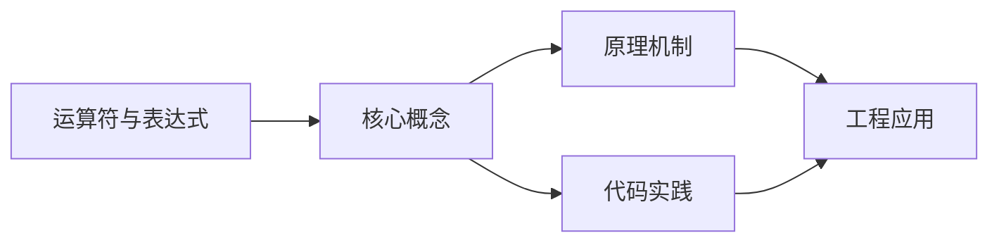
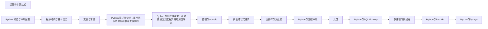

## 1. 学习目标（Bloom 分类）

本节按照布鲁姆教育目标分类学组织学习路径。本文主题为《运算符与表达式》，属于 Python 模块，读者可以根据自身阶段选择阅读深度。

记忆层面：能够准确复述本文的核心概念、术语与基本语法或操作步骤，并能够在提问或检索时快速定位对应知识点。例如能够说出 Python 的动态类型、缩进语法与解释执行等基本特征。

理解层面：能够用自己的语言解释核心原理与工作机制，说明概念之间的因果关系，而不是机械记忆结论。例如能够解释解释器与编译器的差异，以及 GIL 对并发的影响。

应用层面：能够在真实项目或练习场景中运用本文知识解决具体问题，写出正确且可维护的实现。例如能够编写函数、类与标准库调用的完整脚本。

分析层面：能够拆解复杂问题，比较本文主题与相邻概念的异同，识别边界条件与例外情况。例如能够比较 Python 与 Java、Go 在类型系统与并发模型上的差异。

评价层面：能够根据约束条件（性能、可读性、安全、成本）评价不同方案的优劣，做出有依据的技术决策。例如能够评估不同实现方案（脚本、服务、库）的适用场景。

创造层面：能够把本文知识与其他模块知识组合，设计出新的解决方案或可复用的工程模式。例如能够组合标准库与第三方包设计完整的自动化工具。

通过本节学习，读者应当能够把《运算符与表达式》纳入自己的知识网络，并与 Python 模块的其他主题（数据类型、函数、模块、异常、并发）建立关联。

## 2. 历史动机与发展脉络

《运算符与表达式》是 Python 领域的重要主题。要真正理解它，需要先了解它解决的问题与演进过程。

Python 由 Guido van Rossum 于 1991 年首次发布，设计哲学强调代码可读性与开发效率，核心思想记录在《Python 之禅》（PEP 20）中：优美优于丑陋、明确优于隐晦、简单优于复杂。
Python 2 与 Python 3 的分裂期（2008-2020）是语言史上最重要的兼容性事件：Python 3 修复了字符串编码、整数除法等长期问题，但破坏性变更导致迁移缓慢；2020 年 1 月 Python 2 停止官方维护，社区全面转向 Python 3。
Python 3.9 至 3.13 的演进带来了类型提示增强（PEP 604 的 X | Y 语法、PEP 695 的泛型语法）、性能优化（3.11 的 faster-calls 与自适应解释器）以及异步生态的成熟（asyncio、FastAPI、httpx）。
Python 的应用版图从脚本自动化扩展到 Web 后端（Django、FastAPI）、数据科学（NumPy、Pandas、Matplotlib）、机器学习（PyTorch、scikit-learn）、运维自动化（Ansible）与科学计算，是当今最通用的编程语言之一。

回到本文主题：运算符与表达式 的提出与成熟，正是上述技术背景下的必然产物。早期实现往往以简单可用为目标，随着工程规模扩大，社区逐渐沉淀出标准做法与最佳实践；理解这一脉络，可以帮助读者判断“为什么文档中的推荐写法是现在这个样子”，也能在遇到历史遗留代码时准确识别其设计年代与取舍。

对于初学者，理解 Python 的“电池内置”（标准库丰富）与“胶水语言”（易于调用 C/C++/Rust 扩展）两大特性，是判断其适用场景的基础。

## 3. 形式化定义与核心概念精讲

本节把《运算符与表达式》涉及的核心概念以“定义 + 讲解”的形式展开。读者应把定义当作工具，把讲解当作理解路径；两者结合才能形成可迁移的知识。

变量与动态类型：Python 变量是对象的引用，类型属于对象而非变量；`isinstance()` 与 `type()` 用于运行时检查，类型注解（PEP 484）提供静态检查能力但不改变运行时行为。
缩进即语法：Python 用缩进表达代码块层次，避免了花括号噪声，也强制了代码排版一致性；同一代码块必须使用一致的空格数（官方推荐 4 空格）。
函数是一等公民：函数可以赋值、传参、返回，配合 lambda、装饰器与闭包，构成函数式编程能力的基础。
模块与包：每个 `.py` 文件是模块，目录加 `__init__.py` 是包；`import` 机制支持绝对导入、相对导入与命名空间包。
异常处理：`try/except/finally` 与 `raise` 构成错误传播体系；`with` 语句通过上下文管理器（`__enter__/__exit__`）管理资源生命周期。

### 3.1 原文章节逐一精讲

原文档把主题拆分为 20 个小节，下面按顺序给出每一节的导读讲解，随后保留原文细节供精读。

#### 原文精读（完整保留）

# 运算符与表达式

> **符号约定**：`< >` 必填参数 | `[ ]` 可选参数

---

#### 1. 运算符分类 (Operator Categories)

##### 1.1 算术运算符 (Arithmetic)

算术运算符用于执行基本的数学运算：

| 运算符 | 描述             | 示例 (a=10, b=3)   |
| ------ | ---------------- | ------------------ |
| `+`    | 加法             | `a + b = 13`       |
| `-`    | 减法             | `a - b = 7`        |
| `*`    | 乘法             | `a * b = 30`       |
| `/`    | 除法             | `a / b = 3.333...` |
| `//`   | 整除（向下取整） | `a // b = 3`       |
| `%`    | 取模（求余数）   | `a % b = 1`        |
| `**`   | 幂运算           | `a ** b = 1000`    |

###### 1.1.1 算术运算符示例

```python
 # 基本算术运算
 a = 10
 b = 3
 print(f"a + b = {a + b}") # 13
 print(f"a - b = {a - b}") # 7
 print(f"a * b = {a * b}") # 30
 print(f"a / b = {a / b}") # 3.3333333333333335
 print(f"a // b = {a // b}") # 3
 print(f"a % b = {a % b}") # 1
 print(f"a ** b = {a ** b}") # 1000
 # 负数运算
 c = -5
 print(f"-c = {-c}") # 5
 # 浮点数运算
 d = 3.14
 e = 2.71
 print(f"d + e = {d + e}") # 5.85
 print(f"d * e = {d * e}") # 8.5094
 # 混合类型运算
 f = 5
 g = 2.5
 print(f"f + g = {f + g}") # 7.5（结果为浮点数）
```

###### 1.1.2 算术运算符的特殊用法

```python
 # 字符串拼接
 first_name = "Alice"
 last_name = "Smith"
 full_name = first_name + " " + last_name
 print(full_name) # "Alice Smith"
 # 字符串重复
 print("Hello" * 3) # "HelloHelloHello"
 # 列表拼接
 list1 = [1, 2, 3]
 list2 = [4, 5, 6]
 combined = list1 + list2
 print(combined) # [1, 2, 3, 4, 5, 6]
 # 列表重复
 print([0] * 5) # [0, 0, 0, 0, 0]
```

##### 1.2 比较运算符 (Relational)

比较运算符用于比较两个值的关系，返回布尔值 ``或 `False`：

| 运算符 | 描述     | 示例              |
| ------ | -------- | ----------------- |
| `==`   | 等于     | `5 == 5` →``      |
| `!=`   | 不等于   | `5 != 3` → ``     |
| `>`    | 大于     | `5 > 3` →``       |
| `<`    | 小于     | `5 < 3` → `False` |
| `>=`   | 大于等于 | `5 >= 5` → ``     |
| `<=`   | 小于等于 | `5 <= 3`→`False`  |

###### 1.2.1 比较运算符示例

```python
 # 基本比较
 x = 10
 y = 5
 print(f"x == y: {x == y}") # False
 print(f"x != y: {x != y}") #
 print(f"x > y: {x > y}") #
 print(f"x < y: {x < y}") # False
 print(f"x >= y: {x >= y}") #
 print(f"x <= y: {x <= y}") # False
 # 字符串比较（按字典序）
 s1 = "apple"
 s2 = "banana"
 print(f"s1 < s2: {s1 < s2}") # True（"apple" 在字典序中小于 "banana"）
 # 列表比较（按元素顺序）
 lst1 = [1, 2, 3]
 lst2 = [1, 2, 4]
 print(f"lst1 < lst2: {lst1 < lst2}") # True（第三个元素 3 < 4）
 # 链式比较
 age = 25
 print(f"18 <= age <= 65: {18 <= age <= 65}") #
```

##### 1.3 逻辑运算符 (Logical)

逻辑运算符用于组合多个布尔表达式：

| 运算符 | 描述   | 短路特性                       | 示例                   |
| ------ | ------ | ------------------------------ | ---------------------- |
| `and`  | 逻辑与 | 如果左侧为 `False`，右侧不执行 | ` and False` → `False` |
| `or`   | 逻辑或 | 如果左侧为 ``，右侧不执行      | ` or False` → ``       |
| `not`  | 逻辑非 | 取反布尔值                     | `not ` → `False`       |

###### 1.3.1 逻辑运算符示例

```python
 # 基本逻辑运算
 a =
 b = False
 print(f"a and b: {a and b}") # False
 print(f"a or b: {a or b}") #
 print(f"not a: {not a}") # False
 print(f"not b: {not b}") #
 # 短路特性
 # and: 左侧为 False 时，右侧不执行
 def func():
  print("Function executed")
  return
 print(f"False and func(): {False and func()}") # 输出: False（func 未执行）
 print(f" and func(): { and func()}") # 输出: Function executed
  #
 # or: 左侧为  时，右侧不执行
 print(f" or func(): { or func()}") # 输出: True（func 未执行）
 print(f"False or func(): {False or func()}") # 输出: Function executed
  #
 # 实际应用
 age = 20
 is_student =
 if age >= 18 and is_student:
  print("Eligible for student discount")
 # 非布尔值的逻辑运算
 # 0, None, "", [], {}, set() 等被视为 False
 print(f"0 and 5: {0 and 5}") # 0（False）
 print(f"5 and 10: {5 and 10}") # 10（最后一个真值）
 print(f"0 or 5: {0 or 5}") # 5（第一个真值）
 print(f"5 or 10: {5 or 10}") # 5（第一个真值）
 print(f"not 0: {not 0}") #
 print(f"not 'hello': {not 'hello'}") # False
```

##### 1.4 位运算符 (Bitwise)

位运算符用于对整数的二进制位进行操作：

| 运算符 | 描述     | 示例 (a=6 (0110), b=3 (0011)) |
| ------ | -------- | ----------------------------- |
| `&`    | 按位与   | `a & b = 2 (0010)`            |
| `      | `        | 按位或                        | `a  | b = 7 (0111)` |
| `^`    | 按位异或 | `a ^ b = 5 (0101)`            |
| `~`    | 按位取反 | `~a = -7 (补码表示)`          |
| `<<`   | 左移     | `a << 1 = 12 (1100)`          |
| `>>`   | 右移     | `a >> 1 = 3 (0011)`           |

###### 1.4.1 位运算符示例

```python
 # 位运算符示例
 a = 6 # 二进制: 0110
 b = 3 # 二进制: 0011
 print(f"a = {a} (0b{bin(a)[2:]})")
 print(f"b = {b} (0b{bin(b)[2:]})")
 print(f"a & b = {a & b} (0b{bin(a & b)[2:]})") # 2 (0010)
 print(f"a | b = {a | b} (0b{bin(a | b)[2:]})") # 7 (0111)
 print(f"a ^ b = {a ^ b} (0b{bin(a ^ b)[2:]})") # 5 (0101)
 print(f"~a = {~a} (0b{bin(~a)[2:]})") # -7
 print(f"a << 1 = {a << 1} (0b{bin(a << 1)[2:]})") # 12 (1100)
 print(f"a >> 1 = {a >> 1} (0b{bin(a >> 1)[2:]})") # 3 (0011)
 # 应用：检查奇偶数
 num = 7
 if num & 1:
  print(f"{num} 是奇数")
 else:
  print(f"{num} 是偶数")
 # 应用：交换两个数（不使用临时变量）
 x = 10
 y = 20
 print(f"交换前: x={x}, y={y}")
 x ^= y
 y ^= x
 x ^= y
 print(f"交换后: x={x}, y={y}")
```

##### 1.5 成员运算符 (Membership)

成员运算符用于检查一个值是否存在于序列或集合中：

| 运算符   | 描述                 | 示例                     |
| -------- | -------------------- | ------------------------ |
| `in`     | 检查值是否在序列中   | `3 in [1, 2, 3]` → ``    |
| `not in` | 检查值是否不在序列中 | `4 not in [1, 2, 3]` →`` |

###### 1.5.1 成员运算符示例

```python
 # 字符串
 text = "Hello, World!"
 print(f"'H' in text: {'H' in text}") #
 print(f"'z' in text: {'z' in text}") # False
 print(f"'World' in text: {'World' in text}") #
 # 列表
 numbers = [1, 2, 3, 4, 5]
 print(f"3 in numbers: {3 in numbers}") #
 print(f"6 in numbers: {6 in numbers}") # False
 # 元组
 coordinates = (10, 20, 30)
 print(f"10 in coordinates: {10 in coordinates}") #
 # 集合
 fruits = {"apple", "banana", "orange"}
 print(f"'apple' in fruits: {'apple' in fruits}") #
 # 字典（检查键）
 person = {"name": "Alice", "age": 30}
 print(f"'name' in person: {'name' in person}") #
 print(f"'Alice' in person: {'Alice' in person}") # False（检查的是键）
 print(f"'Alice' in person.values(): {'Alice' in person.values()}") #
```

##### 1.6 身份运算符 (Identity)

身份运算符用于比较两个对象的内存地址：

| 运算符                          | 描述                           | 示例         |
| ------------------------------- | ------------------------------ | ------------ |
| `is`                            | 检查两个对象是否为同一个对象   | `a is b`     |
| `is not`                        | 检查两个对象是否不是同一个对象 | `a is not b` |
| **注意**: `is` 与 `==` 的区别： |

- `is` 比较的是对象的身份（内存地址）
- `==` 比较的是对象的值

###### 1.6.1 身份运算符示例

```python
 # 身份运算符示例
 a = [1, 2, 3]
 b = a # b 指向同一个对象
 c = [1, 2, 3] # c 是一个新对象
 print(f"a is b: {a is b}") # True（指向同一个对象）
 print(f"a == b: {a == b}") # True（值相同）
 print(f"a is c: {a is c}") # False（不同对象）
 print(f"a == c: {a == c}") # True（值相同）
 # 小整数池
 x = 100
 y = 100
 print(f"x is y: {x is y}") # True（小整数被缓存）
 x = 1000
 y = 1000
 print(f"x is y: {x is y}") # False（大整数不被缓存）
 # None 的比较
 value = None
 print(f"value is None: {value is None}") # True（推荐方式）
 print(f"value == None: {value == None}") # True（不推荐）
 # 布尔值
 p =
 q =
 print(f"p is q: {p is q}") # True（布尔值被缓存）
```

#### 2. 海象运算符 (Walrus Operator - `:=`)

Python 3.8 引入的海象运算符允许在表达式内部进行赋值，简化代码结构。

##### 2.1 基本用法

```python
 # 基本用法
 items = [1, 2, 3, 4, 5, 6, 7, 8, 9, 10, 11]
 # 传统方式
 n = len(items)
 if n > 10:
  print(f"Total items: {n}")
 # 使用海象运算符
 if (n := len(items)) > 10:
  print(f"Total items: {n}")
 # 在循环中使用
 while (line := input("Enter a line (or 'quit' to exit): ")) != "quit":
  print(f"You entered: {line}")
 # 在列表推导式中使用
 values = [1, 2, 3, 4, 5]
 squared = [x*x for x in values if (x := x*2) > 5]
 print(squared) # [16, 25]（x 先被乘以 2，然后检查是否大于 5）
```

##### 2.2 应用场景

```python
 # 读取文件时使用
 with open("example.txt", "r") as f:
  while (line := f.readline()):
  print(line.strip())
 # 正则表达式匹配
 import re
 text = "Contact: john@example.com"
 if match := re.search(r"([a-zA-Z0-9._%+-]+@[a-zA-Z0-9.-]+\.[a-zA-Z]{2,})", text):
  print(f"Found email: {match.group(1)}")
 # 复杂条件判断
 user = {"name": "Alice", "age": 30, "active": True}
 if (name := user.get("name")) and (age := user.get("age")) > 18:
  print(f"Welcome, {name}! You are {age} years old.")
```

#### 3. 赋值运算符 (Assignment Operators)

赋值运算符用于将值赋给变量，包括复合赋值运算符：

| 运算符 | 描述         | 示例                     |
| ------ | ------------ | ------------------------ |
| `=`    | 简单赋值     | `x = 5`                  |
| `+=`   | 加法赋值     | `x += 3` → `x = x + 3`   |
| `-=`   | 减法赋值     | `x -= 3` → `x = x - 3`   |
| `*=`   | 乘法赋值     | `x *= 3` → `x = x * 3`   |
| `/=`   | 除法赋值     | `x /= 3` → `x = x / 3`   |
| `//=`  | 整除赋值     | `x //= 3` → `x = x // 3` |
| `%=`   | 取模赋值     | `x %= 3` → `x = x % 3`   |
| `**=`  | 幂运算赋值   | `x **= 3` → `x = x ** 3` |
| `&=`   | 按位与赋值   | `x &= 3` → `x = x & 3`   |
| `      | =`           | 按位或赋值               | `x  | = 3`→`x = x | 3`  |
| `^=`   | 按位异或赋值 | `x ^= 3` → `x = x ^ 3`   |
| `<<=`  | 左移赋值     | `x <<= 1` → `x = x << 1` |
| `>>=`  | 右移赋值     | `x >>= 1` → `x = x >> 1` |

##### 3.1 赋值运算符示例

```python
 # 赋值运算符示例
 x = 10
 print(f"初始 x = {x}")
 x += 5 # x = x + 5
 print(f"x += 5 → x = {x}") # 15
 x -= 3 # x = x - 3
 print(f"x -= 3 → x = {x}") # 12
 x *= 2 # x = x * 2
 print(f"x *= 2 → x = {x}") # 24
 x /= 4 # x = x / 4
 print(f"x /= 4 → x = {x}") # 6.0
 x //= 2 # x = x // 2
 print(f"x //= 2 → x = {x}") # 3.0
 x %= 2 # x = x % 2
 print(f"x %= 2 → x = {x}") # 1.0
 x **= 3 # x = x ** 3
 print(f"x **= 3 → x = {x}") # 1.0
 # 位运算赋值
 y = 6 # 0110
 print(f"初始 y = {y} (0b{bin(y)[2:]})")
 y <<= 1 # y = y << 1
 print(f"y <<= 1 → y = {y} (0b{bin(y)[2:]})") # 12 (1100)
 y >>= 1 # y = y >> 1
 print(f"y >>= 1 → y = {y} (0b{bin(y)[2:]})") # 6 (0110)
 y &= 3 # y = y & 3
 print(f"y &= 3 → y = {y} (0b{bin(y)[2:]})") # 2 (0010)
```

#### 4. 运算符优先级 (Precedence)

运算符优先级决定了表达式中运算的执行顺序，优先级高的运算符先执行：

| 优先级 | 运算符                                                           | 描述                     |
| ------ | ---------------------------------------------------------------- | ------------------------ |
| 1      | `()`                                                             | 括号（最高优先级）       |
| 2      | `**`                                                             | 幂运算                   |
| 3      | `~`                                                              | 按位取反                 |
| 4      | `*`, `/`, `//`, `%`                                              | 乘除、整除、取模         |
| 5      | `+`, `-`                                                         | 加减                     |
| 6      | `<<`, `>>`                                                       | 位移运算                 |
| 7      | `&`                                                              | 按位与                   |
| 8      | `^`                                                              | 按位异或                 |
| 9      | `                                                                | `                        | 按位或 |
| 10     | `==`, `!=`, `>`, `<`, `>=`, `<=`, `is`, `is not`, `in`, `not in` | 比较运算符               |
| 11     | `not`                                                            | 逻辑非                   |
| 12     | `and`                                                            | 逻辑与                   |
| 13     | `or`                                                             | 逻辑或                   |
| 14     | `=`                                                              | 赋值运算符（最低优先级） |

##### 4.1 优先级示例

```python
 # 优先级示例
 # 1. 括号优先
 print((2 + 3) * 4) # 20（先计算括号内的加法）
 # 2. 幂运算优先
 print(2 ** 3 * 4) # 32（先计算 2**3 = 8，再乘以 4）
 print(2 ** (3 * 4)) # 4096（括号改变优先级）
 # 3. 乘除优先于加减
 print(10 + 5 * 2) # 20（先计算 5*2 = 10，再加 10）
 print((10 + 5) * 2) # 30（括号改变优先级）
 # 4. 逻辑运算符优先级
 print( or False and False) # True（and 优先于 or）
 print(( or False) and False) # False（括号改变优先级）
 # 5. 比较运算符与逻辑运算符
 print(5 > 3 and 2 < 4) # True（比较运算符优先于 and）
 print(5 > (3 and 2) < 4) # True（括号改变优先级）
```

#### 5. 表达式 (Expressions)

表达式是由变量、常量、运算符和函数调用组成的代码片段，它会被计算并返回一个值。

##### 5.1 基本表达式

```python
 # 算术表达式
 result = 10 + 5 * 2 # 20
 # 比较表达式
 is_greater = 10 > 5 #
 # 逻辑表达式
 is_valid =  and not False #
 # 成员表达式
 is_present = 3 in [1, 2, 3] #
 # 身份表达式
 is_same = (a is b) # 取决于 a 和 b 是否指向同一对象
```

##### 5.2 复杂表达式

```python
 # 复杂表达式
 a = 10
 b = 5
 c = 3
 # 混合运算符
 result = (a + b) * c / 2 # 22.5
 # 条件表达式（三元运算符）
 status = "Adult" if a >= 18 else "Minor"
 # 嵌套表达式
 result = ((a + b) * c) ** 2 # 225
 # 函数调用表达式
 result = len("Hello") + sum([1, 2, 3]) # 5 + 6 = 11
```

##### 5.3 表达式求值

Python 表达式的求值遵循运算符优先级和结合性规则：

- **结合性**: 大多数运算符从左到右结合，除了幂运算符（从右到左）

```python
 # 结合性示例
 print(10 - 5 - 3) # 2（从左到右：(10-5)-3）
 print(2 ** 3 ** 2) # 512（从右到左：2**(3**2)）
 print(10 / 5 * 2) # 4.0（从左到右：(10/5)*2）
```

#### 6. 最佳实践

##### 6.1 运算符使用

- **括号使用**: 当表达式复杂时，使用括号提高可读性，即使括号不是必需的
- **短路特性**: 利用 `and` 和 `or` 的短路特性优化代码
- **身份比较**: 对于 `None`、``、`False`等单例对象，使用`is` 进行比较
- **成员检查**: 使用 `in` 运算符检查成员关系，它比手动遍历更高效

##### 6.2 表达式编写

- **可读性**: 保持表达式简洁明了，避免过于复杂的单行表达式
- **格式化**: 对于长表达式，适当换行和缩进以提高可读性
- **优先级**: 了解运算符优先级，避免因优先级问题导致的错误
- **类型一致性**: 确保表达式中的操作数类型兼容

##### 6.3 性能考虑

- **短路评估**: 利用逻辑运算符的短路特性减少不必要的计算
- **位运算**: 在处理位级操作时，位运算符比算术运算符更高效
- **成员检查**: 在大型集合中，`in` 运算符对 `set` 和 `dict` 的检查比 `list` 和 `tuple` 更快

---

#### 算术运算符

**基本写法：加法运算**
`<操作数1> + <操作数2>`

```python
# 加法运算
result = 10 + 5
```

---

**基本写法：减法运算**
`<操作数1> - <操作数2>`

```python
# 减法运算
result = 10 - 5
```

---

**基本写法：乘法运算**
`<操作数1> * <操作数2>`

```python
# 乘法运算
result = 10 * 5
```

---

**基本写法：除法运算**
`<操作数1> / <操作数2>`

```python
# 除法运算（返回浮点数）
result = 10 / 3
```

---

**基本写法：整除运算**
`<操作数1> // <操作数2>`

```python
# 整除运算（向下取整）
result = 10 // 3
```

---

**基本写法：取模运算**
`<操作数1> % <操作数2>`

```python
# 取模运算（求余数）
result = 10 % 3
```

---

**基本写法：幂运算**
`<操作数1> ** <操作数2>`

```python
# 幂运算
result = 2 ** 3
```

---

**基本写法：负号运算**
`-<操作数>`

```python
# 负号运算
result = -10
```

---

**基本写法：正号运算**
`+<操作数>`

```python
# 正号运算
result = +10
```

---

#### 复合赋值运算符

**基本写法：加法赋值**
`<变量> += <值>`

```python
# 加法赋值运算
x = 10
x += 5
```

---

**基本写法：减法赋值**
`<变量> -= <值>`

```python
# 减法赋值运算
x = 10
x -= 5
```

---

**基本写法：乘法赋值**
`<变量> *= <值>`

```python
# 乘法赋值运算
x = 10
x *= 5
```

---

**基本写法：除法赋值**
`<变量> /= <值>`

```python
# 除法赋值运算
x = 10
x /= 5
```

---

**基本写法：整除赋值**
`<变量> //= <值>`

```python
# 整除赋值运算
x = 10
x //= 3
```

---

**基本写法：取模赋值**
`<变量> %= <值>`

```python
# 取模赋值运算
x = 10
x %= 3
```

---

**基本写法：幂运算赋值**
`<变量> **= <值>`

```python
# 幂运算赋值
x = 2
x **= 3
```

---

#### 比较运算符

**基本写法：等于比较**
`<操作数1> == <操作数2>`

```python
# 等于比较
result = (5 == 5)
```

---

**基本写法：不等于比较**
`<操作数1> != <操作数2>`

```python
# 不等于比较
result = (5 != 3)
```

---

**基本写法：大于比较**
`<操作数1> > <操作数2>`

```python
# 大于比较
result = (5 > 3)
```

---

**基本写法：小于比较**
`<操作数1> < <操作数2>`

```python
# 小于比较
result = (5 < 10)
```

---

**基本写法：大于等于比较**
`<操作数1> >= <操作数2>`

```python
# 大于等于比较
result = (5 >= 5)
```

---

**基本写法：小于等于比较**
`<操作数1> <= <操作数2>`

```python
# 小于等于比较
result = (5 <= 10)
```

---

#### 链式比较

**基本写法：链式比较运算**
`<值1> < <值2> < <值3>`

```python
# 链式比较（等价于 1 < 2 and 2 < 3）
result = 1 < 2 < 3
```

---

#### 逻辑运算符

**基本写法：逻辑与运算**
`<表达式1> and <表达式2>`

```python
# 逻辑与运算
result = True and False
```

---

**基本写法：逻辑或运算**
`<表达式1> or <表达式2>`

```python
# 逻辑或运算
result = True or False
```

---

**基本写法：逻辑非运算**
`not <表达式>`

```python
# 逻辑非运算
result = not True
```

---

#### 短路求值

**基本写法：and 短路返回**
`<表达式1> and <表达式2>`

```python
# and 短路求值，第一个为 False 时返回第一个值
result = False and expensive_operation()
```

---

**基本写法：or 短路返回**
`<表达式1> or <表达式2>`

```python
# or 短路求值，第一个为 True 时返回第一个值
result = True or expensive_operation()
```

---

#### 身份运算符

**基本写法：is 身份比较**
`<对象1> is <对象2>`

```python
# is 身份比较（判断是否为同一对象）
a = [1, 2, 3]
b = a
result = (a is b)
```

---

**基本写法：is not 身份比较**
`<对象1> is not <对象2>`

```python
# is not 身份比较
a = [1, 2, 3]
b = [1, 2, 3]
result = (a is not b)
```

---

**基本写法：使用 is 检查 None**
`<变量> is None`

```python
# 使用 is 检查 None
x = None
result = (x is None)
```

---

#### 成员运算符

**基本写法：in 成员判断**
`<元素> in <容器>`

```python
# in 成员判断
result = 3 in [1, 2, 3]
```

---

**基本写法：not in 成员判断**
`<元素> not in <容器>`

```python
# not in 成员判断
result = 4 not in [1, 2, 3]
```

---

**基本写法：字符串成员判断**
`<子串> in <字符串>`

```python
# 字符串子串判断
result = "World" in "Hello, World!"
```

---

**基本写法：字典键成员判断**
`<键> in <字典>`

```python
# 字典键成员判断
result = "name" in {"name": "Alice", "age": 30}
```

---

#### 位运算符

**基本写法：按位与运算**
`<操作数1> & <操作数2>`

```python
# 按位与运算
result = 5 & 3
```

---

**基本写法：按位或运算**
`<操作数1> | <操作数2>`

```python
# 按位或运算
result = 5 | 3
```

---

**基本写法：按位异或运算**
`<操作数1> ^ <操作数2>`

```python
# 按位异或运算
result = 5 ^ 3
```

---

**基本写法：按位取反运算**
`~<操作数>`

```python
# 按位取反运算
result = ~5
```

---

**基本写法：左移运算**
`<操作数> << <位数>`

```python
# 左移运算
result = 5 << 2
```

---

**基本写法：右移运算**
`<操作数> >> <位数>`

```python
# 右移运算
result = 20 >> 2
```

---

#### 三元条件运算符

**单行写法：三元条件表达式**
`<值1> if <条件> else <值2>`

```python
# 三元条件表达式
age = 20
status = "Adult" if age >= 18 else "Minor"
```

---

**单行写法：嵌套三元表达式**
`<值1> if <条件1> else (<值2> if <条件2> else <值3>)`

```python
# 嵌套三元表达式
score = 85
grade = "A" if score >= 90 else ("B" if score >= 80 else "C")
```

---

#### 运算符优先级

**基本写法：使用括号改变优先级**
`(<表达式>)`

```python
# 使用括号明确运算优先级
result = (2 + 3) * 4
```

---

#### 海象运算符

**基本写法：赋值表达式**
`(<变量> := <值>)`

```python
# 海象运算符（赋值表达式）
if (n := len([1, 2, 3])) > 2:
    print(f"List has {n} elements")
```

---

**基本写法：在 while 循环中使用海象运算符**
`while (<变量> := <表达式>): <语句>`

```python
# 在 while 循环中使用海象运算符
while (line := input()) != "quit":
    print(line)
```

---

**基本写法：在列表推导式中使用海象运算符**
`[<变量> for <元素> in <可迭代对象> if (<变量> := <表达式>)]`

```python
# 在列表推导式中使用海象运算符
data = [1, 2, 3, 4, 5]
results = [y for x in data if (y := x * 2) > 4]
```

---

#### 表达式求值

**基本写法：使用 eval() 求值**
`eval(<字符串表达式>)`

```python
# 使用 eval() 求值字符串表达式
result = eval("2 + 3 * 4")
```

---

#### 运算符重载

**换行写法：通过魔术方法重载运算符**
`class <类名>:`
`    def __<运算符方法>__(self, <参数>): <语句>`

```python
# 通过 __add__ 方法重载加法运算符
class Vector:
    def __init__(self, x, y):
        self.x = x
        self.y = y

    def __add__(self, other):
        return Vector(self.x + other.x, self.y + other.y)
```

---

**基本写法：重载等于运算符**
`def __eq__(self, other): <语句>`

```python
# 通过 __eq__ 方法重载等于运算符
class Point:
    def __init__(self, x, y):
        self.x = x
        self.y = y

    def __eq__(self, other):
        return self.x == other.x and self.y == other.y
```

---

**基本写法：重载小于运算符**
`def __lt__(self, other): <语句>`

```python
# 通过 __lt__ 方法重载小于运算符
class Student:
    def __init__(self, score):
        self.score = score

    def __lt__(self, other):
        return self.score < other.score
```

---

**基本写法：重载字符串表示**
`def __repr__(self): <语句>`

```python
# 通过 __repr__ 方法重载字符串表示
class Person:
    def __init__(self, name):
        self.name = name

    def __repr__(self):
        return f"Person(name={self.name!r})"
```

---

**基本写法：重载长度运算**
`def __len__(self): <语句>`

```python
# 通过 __len__ 方法重载 len() 函数
class Stack:
    def __init__(self):
        self.items = []

    def __len__(self):
        return len(self.items)
```

---

**基本写法：重载成员判断**
`def __contains__(self, item): <语句>`

```python
# 通过 __contains__ 方法重载 in 运算符
class Matrix:
    def __init__(self, data):
        self.data = data

    def __contains__(self, item):
        return any(item in row for row in self.data)
```

---


### 3.2 概念关系图

下面用 Mermaid 图表达本文核心概念之间的关系，帮助读者建立整体图景：



图中展示的是本文知识的结构化关系：核心概念是入口，原理机制解释“为什么”，代码实践演示“怎么做”，工程应用回答“何时用”。读者学习时可以把每个小节的内容挂接到对应节点上。

## 4. 理论推导与原理解析

本节深入《运算符与表达式》背后的原理。理论部分不求面面俱到，而是聚焦“能解释现象、能指导实践”的关键推导。

解释执行与字节码：CPython 先把源码编译为字节码（.pyc），再由虚拟机逐条执行。字节码是平台无关的中间表示，因此 Python 程序可以跨平台运行，但执行速度低于编译型语言；性能敏感路径可用 C 扩展或 Cython 加速。
GIL（全局解释器锁）：CPython 的 GIL 保证同一时刻只有一个线程执行字节码，简化了内存管理，但限制了 CPU 密集型多线程并行；I/O 密集型任务通过线程切换获得并发，CPU 密集型任务应使用多进程（multiprocessing）或异步。
引用计数与垃圾回收：Python 对象通过引用计数管理生命周期，循环引用由分代垃圾回收器（gc 模块）处理。理解这一模型可以解释“为什么局部变量及时释放内存”“为什么大对象需要 del 或作用域退出”。
鸭子类型与协议：Python 依赖行为协议而非继承体系，例如实现 `__iter__` 与 `__next__` 的对象即可用于 `for` 循环。这一设计带来灵活性的同时，也要求开发者编写清晰的接口文档与类型注解。

需要强调的是，理论推导与工程实践之间存在翻译层：理论给出的是理想化模型与边界条件，工程代码则必须处理真实环境中的例外。读者在学习时应先掌握理论的“标准情形”，再通过陷阱章节了解“非标准情形”。

## 5. 代码示例与逐行讲解

本节把原文中的代码示例系统整理，并为每个示例补充用途说明与讲解。读者不应只浏览代码，而应逐段对照讲解理解设计意图。

### 5.1 示例：1.1.1 算术运算符示例

该示例来自原文《1.1.1 算术运算符示例》小节，用于演示运算符与表达式相关操作。阅读时请先看代码结构，再看其后的讲解。

```python
 # 基本算术运算
 a = 10
 b = 3
 print(f"a + b = {a + b}") # 13
 print(f"a - b = {a - b}") # 7
 print(f"a * b = {a * b}") # 30
 print(f"a / b = {a / b}") # 3.3333333333333335
 print(f"a // b = {a // b}") # 3
 print(f"a % b = {a % b}") # 1
 print(f"a ** b = {a ** b}") # 1000
 # 负数运算
 c = -5
 print(f"-c = {-c}") # 5
 # 浮点数运算
 d = 3.14
 e = 2.71
 print(f"d + e = {d + e}") # 5.85
 print(f"d * e = {d * e}") # 8.5094
 # 混合类型运算
 f = 5
 g = 2.5
 print(f"f + g = {f + g}") # 7.5（结果为浮点数）
```

讲解：这段代码演示了本节核心知识点。代码中的关键操作可以归纳为三步：准备（定义或初始化）、执行（核心逻辑）、收尾（释放资源或返回结果）。实际项目中，这三步往往被封装为函数或类，以提升复用性与可测试性。

关键点分析：

该示例共 22 行有效代码，结构以数据或配置为主。阅读时应关注：数据字段的含义、配置项的作用，以及它们与运行行为的对应关系。

进阶思考路径：先尝试修改参数观察行为变化，再把示例中的模式迁移到自己的项目中；每次修改都记录预期与实测差异，这是把示例转化为能力的最快方式。

### 5.2 示例：1.1.2 算术运算符的特殊用法

该示例来自原文《1.1.2 算术运算符的特殊用法》小节，用于演示运算符与表达式相关操作。阅读时请先看代码结构，再看其后的讲解。

```python
 # 字符串拼接
 first_name = "Alice"
 last_name = "Smith"
 full_name = first_name + " " + last_name
 print(full_name) # "Alice Smith"
 # 字符串重复
 print("Hello" * 3) # "HelloHelloHello"
 # 列表拼接
 list1 = [1, 2, 3]
 list2 = [4, 5, 6]
 combined = list1 + list2
 print(combined) # [1, 2, 3, 4, 5, 6]
 # 列表重复
 print([0] * 5) # [0, 0, 0, 0, 0]
```

讲解：这段代码演示了本节核心知识点。代码中的关键操作可以归纳为三步：准备（定义或初始化）、执行（核心逻辑）、收尾（释放资源或返回结果）。实际项目中，这三步往往被封装为函数或类，以提升复用性与可测试性。

关键点分析：

该示例共 14 行有效代码，结构以数据或配置为主。阅读时应关注：数据字段的含义、配置项的作用，以及它们与运行行为的对应关系。

进阶思考路径：先尝试修改参数观察行为变化，再把示例中的模式迁移到自己的项目中；每次修改都记录预期与实测差异，这是把示例转化为能力的最快方式。

### 5.3 示例：1.2.1 比较运算符示例

该示例来自原文《1.2.1 比较运算符示例》小节，用于演示运算符与表达式相关操作。阅读时请先看代码结构，再看其后的讲解。

```python
 # 基本比较
 x = 10
 y = 5
 print(f"x == y: {x == y}") # False
 print(f"x != y: {x != y}") #
 print(f"x > y: {x > y}") #
 print(f"x < y: {x < y}") # False
 print(f"x >= y: {x >= y}") #
 print(f"x <= y: {x <= y}") # False
 # 字符串比较（按字典序）
 s1 = "apple"
 s2 = "banana"
 print(f"s1 < s2: {s1 < s2}") # True（"apple" 在字典序中小于 "banana"）
 # 列表比较（按元素顺序）
 lst1 = [1, 2, 3]
 lst2 = [1, 2, 4]
 print(f"lst1 < lst2: {lst1 < lst2}") # True（第三个元素 3 < 4）
 # 链式比较
 age = 25
 print(f"18 <= age <= 65: {18 <= age <= 65}") #
```

讲解：这段代码演示了本节核心知识点。代码中的关键操作可以归纳为三步：准备（定义或初始化）、执行（核心逻辑）、收尾（释放资源或返回结果）。实际项目中，这三步往往被封装为函数或类，以提升复用性与可测试性。

关键点分析：

该示例共 20 行有效代码，结构以数据或配置为主。阅读时应关注：数据字段的含义、配置项的作用，以及它们与运行行为的对应关系。

进阶思考路径：先尝试修改参数观察行为变化，再把示例中的模式迁移到自己的项目中；每次修改都记录预期与实测差异，这是把示例转化为能力的最快方式。

### 5.4 示例：1.3.1 逻辑运算符示例

该示例来自原文《1.3.1 逻辑运算符示例》小节，用于演示运算符与表达式相关操作。阅读时请先看代码结构，再看其后的讲解。

```python
 # 基本逻辑运算
 a =
 b = False
 print(f"a and b: {a and b}") # False
 print(f"a or b: {a or b}") #
 print(f"not a: {not a}") # False
 print(f"not b: {not b}") #
 # 短路特性
 # and: 左侧为 False 时，右侧不执行
 def func():
  print("Function executed")
  return
 print(f"False and func(): {False and func()}") # 输出: False（func 未执行）
 print(f" and func(): { and func()}") # 输出: Function executed
  #
 # or: 左侧为  时，右侧不执行
 print(f" or func(): { or func()}") # 输出: True（func 未执行）
 print(f"False or func(): {False or func()}") # 输出: Function executed
  #
 # 实际应用
 age = 20
 is_student =
 if age >= 18 and is_student:
  print("Eligible for student discount")
 # 非布尔值的逻辑运算
 # 0, None, "", [], {}, set() 等被视为 False
 print(f"0 and 5: {0 and 5}") # 0（False）
 print(f"5 and 10: {5 and 10}") # 10（最后一个真值）
 print(f"0 or 5: {0 or 5}") # 5（第一个真值）
 print(f"5 or 10: {5 or 10}") # 5（第一个真值）
 print(f"not 0: {not 0}") #
 print(f"not 'hello': {not 'hello'}") # False
```

讲解：这段代码演示了本节核心知识点。代码中的关键操作可以归纳为三步：准备（定义或初始化）、执行（核心逻辑）、收尾（释放资源或返回结果）。实际项目中，这三步往往被封装为函数或类，以提升复用性与可测试性。

关键点分析：

该示例共 32 行有效代码，包含 5 类关键结构（def、func、if、for、return）。其中：

- 入口与初始化部分负责建立上下文，对应实际项目中的启动或装配逻辑；
- 核心逻辑部分体现本文主题的主要操作，是阅读时最需要对照讲解理解的部分；
- 输出或返回部分把结果交给调用方，注意其类型与边界条件。

进阶思考路径：先尝试修改参数观察行为变化，再把示例中的模式迁移到自己的项目中；每次修改都记录预期与实测差异，这是把示例转化为能力的最快方式。

### 5.5 示例：1.4.1 位运算符示例

该示例来自原文《1.4.1 位运算符示例》小节，用于演示运算符与表达式相关操作。阅读时请先看代码结构，再看其后的讲解。

```python
 # 位运算符示例
 a = 6 # 二进制: 0110
 b = 3 # 二进制: 0011
 print(f"a = {a} (0b{bin(a)[2:]})")
 print(f"b = {b} (0b{bin(b)[2:]})")
 print(f"a & b = {a & b} (0b{bin(a & b)[2:]})") # 2 (0010)
 print(f"a | b = {a | b} (0b{bin(a | b)[2:]})") # 7 (0111)
 print(f"a ^ b = {a ^ b} (0b{bin(a ^ b)[2:]})") # 5 (0101)
 print(f"~a = {~a} (0b{bin(~a)[2:]})") # -7
 print(f"a << 1 = {a << 1} (0b{bin(a << 1)[2:]})") # 12 (1100)
 print(f"a >> 1 = {a >> 1} (0b{bin(a >> 1)[2:]})") # 3 (0011)
 # 应用：检查奇偶数
 num = 7
 if num & 1:
  print(f"{num} 是奇数")
 else:
  print(f"{num} 是偶数")
 # 应用：交换两个数（不使用临时变量）
 x = 10
 y = 20
 print(f"交换前: x={x}, y={y}")
 x ^= y
 y ^= x
 x ^= y
 print(f"交换后: x={x}, y={y}")
```

讲解：这段代码演示了本节核心知识点。代码中的关键操作可以归纳为三步：准备（定义或初始化）、执行（核心逻辑）、收尾（释放资源或返回结果）。实际项目中，这三步往往被封装为函数或类，以提升复用性与可测试性。

关键点分析：

该示例共 25 行有效代码，包含 1 类关键结构（if）。其中：

- 入口与初始化部分负责建立上下文，对应实际项目中的启动或装配逻辑；
- 核心逻辑部分体现本文主题的主要操作，是阅读时最需要对照讲解理解的部分；
- 输出或返回部分把结果交给调用方，注意其类型与边界条件。

进阶思考路径：先尝试修改参数观察行为变化，再把示例中的模式迁移到自己的项目中；每次修改都记录预期与实测差异，这是把示例转化为能力的最快方式。

### 5.6 示例：1.5.1 成员运算符示例

该示例来自原文《1.5.1 成员运算符示例》小节，用于演示运算符与表达式相关操作。阅读时请先看代码结构，再看其后的讲解。

```python
 # 字符串
 text = "Hello, World!"
 print(f"'H' in text: {'H' in text}") #
 print(f"'z' in text: {'z' in text}") # False
 print(f"'World' in text: {'World' in text}") #
 # 列表
 numbers = [1, 2, 3, 4, 5]
 print(f"3 in numbers: {3 in numbers}") #
 print(f"6 in numbers: {6 in numbers}") # False
 # 元组
 coordinates = (10, 20, 30)
 print(f"10 in coordinates: {10 in coordinates}") #
 # 集合
 fruits = {"apple", "banana", "orange"}
 print(f"'apple' in fruits: {'apple' in fruits}") #
 # 字典（检查键）
 person = {"name": "Alice", "age": 30}
 print(f"'name' in person: {'name' in person}") #
 print(f"'Alice' in person: {'Alice' in person}") # False（检查的是键）
 print(f"'Alice' in person.values(): {'Alice' in person.values()}") #
```

讲解：这段代码演示了本节核心知识点。代码中的关键操作可以归纳为三步：准备（定义或初始化）、执行（核心逻辑）、收尾（释放资源或返回结果）。实际项目中，这三步往往被封装为函数或类，以提升复用性与可测试性。

关键点分析：

该示例共 20 行有效代码，结构以数据或配置为主。阅读时应关注：数据字段的含义、配置项的作用，以及它们与运行行为的对应关系。

进阶思考路径：先尝试修改参数观察行为变化，再把示例中的模式迁移到自己的项目中；每次修改都记录预期与实测差异，这是把示例转化为能力的最快方式。

### 5.7 示例：1.6.1 身份运算符示例

该示例来自原文《1.6.1 身份运算符示例》小节，用于演示运算符与表达式相关操作。阅读时请先看代码结构，再看其后的讲解。

```python
 # 身份运算符示例
 a = [1, 2, 3]
 b = a # b 指向同一个对象
 c = [1, 2, 3] # c 是一个新对象
 print(f"a is b: {a is b}") # True（指向同一个对象）
 print(f"a == b: {a == b}") # True（值相同）
 print(f"a is c: {a is c}") # False（不同对象）
 print(f"a == c: {a == c}") # True（值相同）
 # 小整数池
 x = 100
 y = 100
 print(f"x is y: {x is y}") # True（小整数被缓存）
 x = 1000
 y = 1000
 print(f"x is y: {x is y}") # False（大整数不被缓存）
 # None 的比较
 value = None
 print(f"value is None: {value is None}") # True（推荐方式）
 print(f"value == None: {value == None}") # True（不推荐）
 # 布尔值
 p =
 q =
 print(f"p is q: {p is q}") # True（布尔值被缓存）
```

讲解：这段代码演示了本节核心知识点。代码中的关键操作可以归纳为三步：准备（定义或初始化）、执行（核心逻辑）、收尾（释放资源或返回结果）。实际项目中，这三步往往被封装为函数或类，以提升复用性与可测试性。

关键点分析：

该示例共 23 行有效代码，结构以数据或配置为主。阅读时应关注：数据字段的含义、配置项的作用，以及它们与运行行为的对应关系。

进阶思考路径：先尝试修改参数观察行为变化，再把示例中的模式迁移到自己的项目中；每次修改都记录预期与实测差异，这是把示例转化为能力的最快方式。

### 5.8 示例：2.1 基本用法

该示例来自原文《2.1 基本用法》小节，用于演示运算符与表达式相关操作。阅读时请先看代码结构，再看其后的讲解。

```python
 # 基本用法
 items = [1, 2, 3, 4, 5, 6, 7, 8, 9, 10, 11]
 # 传统方式
 n = len(items)
 if n > 10:
  print(f"Total items: {n}")
 # 使用海象运算符
 if (n := len(items)) > 10:
  print(f"Total items: {n}")
 # 在循环中使用
 while (line := input("Enter a line (or 'quit' to exit): ")) != "quit":
  print(f"You entered: {line}")
 # 在列表推导式中使用
 values = [1, 2, 3, 4, 5]
 squared = [x*x for x in values if (x := x*2) > 5]
 print(squared) # [16, 25]（x 先被乘以 2，然后检查是否大于 5）
```

讲解：这段代码演示了本节核心知识点。代码中的关键操作可以归纳为三步：准备（定义或初始化）、执行（核心逻辑）、收尾（释放资源或返回结果）。实际项目中，这三步往往被封装为函数或类，以提升复用性与可测试性。

关键点分析：

该示例共 16 行有效代码，包含 3 类关键结构（if、for、while）。其中：

- 入口与初始化部分负责建立上下文，对应实际项目中的启动或装配逻辑；
- 核心逻辑部分体现本文主题的主要操作，是阅读时最需要对照讲解理解的部分；
- 输出或返回部分把结果交给调用方，注意其类型与边界条件。

进阶思考路径：先尝试修改参数观察行为变化，再把示例中的模式迁移到自己的项目中；每次修改都记录预期与实测差异，这是把示例转化为能力的最快方式。

### 5.9 示例：2.2 应用场景

该示例来自原文《2.2 应用场景》小节，用于演示运算符与表达式相关操作。阅读时请先看代码结构，再看其后的讲解。

```python
 # 读取文件时使用
 with open("example.txt", "r") as f:
  while (line := f.readline()):
  print(line.strip())
 # 正则表达式匹配
 import re
 text = "Contact: john@example.com"
 if match := re.search(r"([a-zA-Z0-9._%+-]+@[a-zA-Z0-9.-]+\.[a-zA-Z]{2,})", text):
  print(f"Found email: {match.group(1)}")
 # 复杂条件判断
 user = {"name": "Alice", "age": 30, "active": True}
 if (name := user.get("name")) and (age := user.get("age")) > 18:
  print(f"Welcome, {name}! You are {age} years old.")
```

讲解：这段代码演示了本节核心知识点。代码中的关键操作可以归纳为三步：准备（定义或初始化）、执行（核心逻辑）、收尾（释放资源或返回结果）。实际项目中，这三步往往被封装为函数或类，以提升复用性与可测试性。

关键点分析：

该示例共 13 行有效代码，包含 3 类关键结构（import、if、while）。其中：

- 入口与初始化部分负责建立上下文，对应实际项目中的启动或装配逻辑；
- 核心逻辑部分体现本文主题的主要操作，是阅读时最需要对照讲解理解的部分；
- 输出或返回部分把结果交给调用方，注意其类型与边界条件。

进阶思考路径：先尝试修改参数观察行为变化，再把示例中的模式迁移到自己的项目中；每次修改都记录预期与实测差异，这是把示例转化为能力的最快方式。

### 5.10 示例：3.1 赋值运算符示例

该示例来自原文《3.1 赋值运算符示例》小节，用于演示运算符与表达式相关操作。阅读时请先看代码结构，再看其后的讲解。

```python
 # 赋值运算符示例
 x = 10
 print(f"初始 x = {x}")
 x += 5 # x = x + 5
 print(f"x += 5 → x = {x}") # 15
 x -= 3 # x = x - 3
 print(f"x -= 3 → x = {x}") # 12
 x *= 2 # x = x * 2
 print(f"x *= 2 → x = {x}") # 24
 x /= 4 # x = x / 4
 print(f"x /= 4 → x = {x}") # 6.0
 x //= 2 # x = x // 2
 print(f"x //= 2 → x = {x}") # 3.0
 x %= 2 # x = x % 2
 print(f"x %= 2 → x = {x}") # 1.0
 x **= 3 # x = x ** 3
 print(f"x **= 3 → x = {x}") # 1.0
 # 位运算赋值
 y = 6 # 0110
 print(f"初始 y = {y} (0b{bin(y)[2:]})")
 y <<= 1 # y = y << 1
 print(f"y <<= 1 → y = {y} (0b{bin(y)[2:]})") # 12 (1100)
 y >>= 1 # y = y >> 1
 print(f"y >>= 1 → y = {y} (0b{bin(y)[2:]})") # 6 (0110)
 y &= 3 # y = y & 3
 print(f"y &= 3 → y = {y} (0b{bin(y)[2:]})") # 2 (0010)
```

讲解：这段代码演示了本节核心知识点。代码中的关键操作可以归纳为三步：准备（定义或初始化）、执行（核心逻辑）、收尾（释放资源或返回结果）。实际项目中，这三步往往被封装为函数或类，以提升复用性与可测试性。

关键点分析：

该示例共 26 行有效代码，结构以数据或配置为主。阅读时应关注：数据字段的含义、配置项的作用，以及它们与运行行为的对应关系。

进阶思考路径：先尝试修改参数观察行为变化，再把示例中的模式迁移到自己的项目中；每次修改都记录预期与实测差异，这是把示例转化为能力的最快方式。

### 5.11 示例：4.1 优先级示例

该示例来自原文《4.1 优先级示例》小节，用于演示运算符与表达式相关操作。阅读时请先看代码结构，再看其后的讲解。

```python
 # 优先级示例
 # 1. 括号优先
 print((2 + 3) * 4) # 20（先计算括号内的加法）
 # 2. 幂运算优先
 print(2 ** 3 * 4) # 32（先计算 2**3 = 8，再乘以 4）
 print(2 ** (3 * 4)) # 4096（括号改变优先级）
 # 3. 乘除优先于加减
 print(10 + 5 * 2) # 20（先计算 5*2 = 10，再加 10）
 print((10 + 5) * 2) # 30（括号改变优先级）
 # 4. 逻辑运算符优先级
 print( or False and False) # True（and 优先于 or）
 print(( or False) and False) # False（括号改变优先级）
 # 5. 比较运算符与逻辑运算符
 print(5 > 3 and 2 < 4) # True（比较运算符优先于 and）
 print(5 > (3 and 2) < 4) # True（括号改变优先级）
```

讲解：这段代码演示了本节核心知识点。代码中的关键操作可以归纳为三步：准备（定义或初始化）、执行（核心逻辑）、收尾（释放资源或返回结果）。实际项目中，这三步往往被封装为函数或类，以提升复用性与可测试性。

关键点分析：

该示例共 15 行有效代码，结构以数据或配置为主。阅读时应关注：数据字段的含义、配置项的作用，以及它们与运行行为的对应关系。

进阶思考路径：先尝试修改参数观察行为变化，再把示例中的模式迁移到自己的项目中；每次修改都记录预期与实测差异，这是把示例转化为能力的最快方式。

### 5.12 示例：5.1 基本表达式

该示例来自原文《5.1 基本表达式》小节，用于演示运算符与表达式相关操作。阅读时请先看代码结构，再看其后的讲解。

```python
 # 算术表达式
 result = 10 + 5 * 2 # 20
 # 比较表达式
 is_greater = 10 > 5 #
 # 逻辑表达式
 is_valid =  and not False #
 # 成员表达式
 is_present = 3 in [1, 2, 3] #
 # 身份表达式
 is_same = (a is b) # 取决于 a 和 b 是否指向同一对象
```

讲解：这段代码演示了本节核心知识点。代码中的关键操作可以归纳为三步：准备（定义或初始化）、执行（核心逻辑）、收尾（释放资源或返回结果）。实际项目中，这三步往往被封装为函数或类，以提升复用性与可测试性。

关键点分析：

该示例共 10 行有效代码，结构以数据或配置为主。阅读时应关注：数据字段的含义、配置项的作用，以及它们与运行行为的对应关系。

进阶思考路径：先尝试修改参数观察行为变化，再把示例中的模式迁移到自己的项目中；每次修改都记录预期与实测差异，这是把示例转化为能力的最快方式。

### 5.13 示例：5.2 复杂表达式

该示例来自原文《5.2 复杂表达式》小节，用于演示运算符与表达式相关操作。阅读时请先看代码结构，再看其后的讲解。

```python
 # 复杂表达式
 a = 10
 b = 5
 c = 3
 # 混合运算符
 result = (a + b) * c / 2 # 22.5
 # 条件表达式（三元运算符）
 status = "Adult" if a >= 18 else "Minor"
 # 嵌套表达式
 result = ((a + b) * c) ** 2 # 225
 # 函数调用表达式
 result = len("Hello") + sum([1, 2, 3]) # 5 + 6 = 11
```

讲解：这段代码演示了本节核心知识点。代码中的关键操作可以归纳为三步：准备（定义或初始化）、执行（核心逻辑）、收尾（释放资源或返回结果）。实际项目中，这三步往往被封装为函数或类，以提升复用性与可测试性。

关键点分析：

该示例共 12 行有效代码，包含 1 类关键结构（if）。其中：

- 入口与初始化部分负责建立上下文，对应实际项目中的启动或装配逻辑；
- 核心逻辑部分体现本文主题的主要操作，是阅读时最需要对照讲解理解的部分；
- 输出或返回部分把结果交给调用方，注意其类型与边界条件。

进阶思考路径：先尝试修改参数观察行为变化，再把示例中的模式迁移到自己的项目中；每次修改都记录预期与实测差异，这是把示例转化为能力的最快方式。

### 5.14 示例：5.3 表达式求值

该示例来自原文《5.3 表达式求值》小节，用于演示运算符与表达式相关操作。阅读时请先看代码结构，再看其后的讲解。

```python
 # 结合性示例
 print(10 - 5 - 3) # 2（从左到右：(10-5)-3）
 print(2 ** 3 ** 2) # 512（从右到左：2**(3**2)）
 print(10 / 5 * 2) # 4.0（从左到右：(10/5)*2）
```

讲解：这段代码演示了本节核心知识点。代码中的关键操作可以归纳为三步：准备（定义或初始化）、执行（核心逻辑）、收尾（释放资源或返回结果）。实际项目中，这三步往往被封装为函数或类，以提升复用性与可测试性。

关键点分析：

该示例共 4 行有效代码，结构以数据或配置为主。阅读时应关注：数据字段的含义、配置项的作用，以及它们与运行行为的对应关系。

进阶思考路径：先尝试修改参数观察行为变化，再把示例中的模式迁移到自己的项目中；每次修改都记录预期与实测差异，这是把示例转化为能力的最快方式。

### 5.15 示例：算术运算符

该示例来自原文《算术运算符》小节，用于演示运算符与表达式相关操作。阅读时请先看代码结构，再看其后的讲解。

```python
# 加法运算
result = 10 + 5
```

讲解：这段代码演示了本节核心知识点。代码中的关键操作可以归纳为三步：准备（定义或初始化）、执行（核心逻辑）、收尾（释放资源或返回结果）。实际项目中，这三步往往被封装为函数或类，以提升复用性与可测试性。

关键点分析：

该示例共 2 行有效代码，结构以数据或配置为主。阅读时应关注：数据字段的含义、配置项的作用，以及它们与运行行为的对应关系。

进阶思考路径：先尝试修改参数观察行为变化，再把示例中的模式迁移到自己的项目中；每次修改都记录预期与实测差异，这是把示例转化为能力的最快方式。

### 5.16 示例：算术运算符

该示例来自原文《算术运算符》小节，用于演示运算符与表达式相关操作。阅读时请先看代码结构，再看其后的讲解。

```python
# 减法运算
result = 10 - 5
```

讲解：这段代码演示了本节核心知识点。代码中的关键操作可以归纳为三步：准备（定义或初始化）、执行（核心逻辑）、收尾（释放资源或返回结果）。实际项目中，这三步往往被封装为函数或类，以提升复用性与可测试性。

关键点分析：

该示例共 2 行有效代码，结构以数据或配置为主。阅读时应关注：数据字段的含义、配置项的作用，以及它们与运行行为的对应关系。

进阶思考路径：先尝试修改参数观察行为变化，再把示例中的模式迁移到自己的项目中；每次修改都记录预期与实测差异，这是把示例转化为能力的最快方式。

### 5.17 示例：算术运算符

该示例来自原文《算术运算符》小节，用于演示运算符与表达式相关操作。阅读时请先看代码结构，再看其后的讲解。

```python
# 乘法运算
result = 10 * 5
```

讲解：这段代码演示了本节核心知识点。代码中的关键操作可以归纳为三步：准备（定义或初始化）、执行（核心逻辑）、收尾（释放资源或返回结果）。实际项目中，这三步往往被封装为函数或类，以提升复用性与可测试性。

关键点分析：

该示例共 2 行有效代码，结构以数据或配置为主。阅读时应关注：数据字段的含义、配置项的作用，以及它们与运行行为的对应关系。

进阶思考路径：先尝试修改参数观察行为变化，再把示例中的模式迁移到自己的项目中；每次修改都记录预期与实测差异，这是把示例转化为能力的最快方式。

### 5.18 示例：算术运算符

该示例来自原文《算术运算符》小节，用于演示运算符与表达式相关操作。阅读时请先看代码结构，再看其后的讲解。

```python
# 除法运算（返回浮点数）
result = 10 / 3
```

讲解：这段代码演示了本节核心知识点。代码中的关键操作可以归纳为三步：准备（定义或初始化）、执行（核心逻辑）、收尾（释放资源或返回结果）。实际项目中，这三步往往被封装为函数或类，以提升复用性与可测试性。

关键点分析：

该示例共 2 行有效代码，结构以数据或配置为主。阅读时应关注：数据字段的含义、配置项的作用，以及它们与运行行为的对应关系。

进阶思考路径：先尝试修改参数观察行为变化，再把示例中的模式迁移到自己的项目中；每次修改都记录预期与实测差异，这是把示例转化为能力的最快方式。

### 5.19 示例：算术运算符

该示例来自原文《算术运算符》小节，用于演示运算符与表达式相关操作。阅读时请先看代码结构，再看其后的讲解。

```python
# 整除运算（向下取整）
result = 10 // 3
```

讲解：这段代码演示了本节核心知识点。代码中的关键操作可以归纳为三步：准备（定义或初始化）、执行（核心逻辑）、收尾（释放资源或返回结果）。实际项目中，这三步往往被封装为函数或类，以提升复用性与可测试性。

关键点分析：

该示例共 2 行有效代码，结构以数据或配置为主。阅读时应关注：数据字段的含义、配置项的作用，以及它们与运行行为的对应关系。

进阶思考路径：先尝试修改参数观察行为变化，再把示例中的模式迁移到自己的项目中；每次修改都记录预期与实测差异，这是把示例转化为能力的最快方式。

### 5.20 示例：算术运算符

该示例来自原文《算术运算符》小节，用于演示运算符与表达式相关操作。阅读时请先看代码结构，再看其后的讲解。

```python
# 取模运算（求余数）
result = 10 % 3
```

讲解：这段代码演示了本节核心知识点。代码中的关键操作可以归纳为三步：准备（定义或初始化）、执行（核心逻辑）、收尾（释放资源或返回结果）。实际项目中，这三步往往被封装为函数或类，以提升复用性与可测试性。

关键点分析：

该示例共 2 行有效代码，结构以数据或配置为主。阅读时应关注：数据字段的含义、配置项的作用，以及它们与运行行为的对应关系。

进阶思考路径：先尝试修改参数观察行为变化，再把示例中的模式迁移到自己的项目中；每次修改都记录预期与实测差异，这是把示例转化为能力的最快方式。

### 5.21 示例：算术运算符

该示例来自原文《算术运算符》小节，用于演示运算符与表达式相关操作。阅读时请先看代码结构，再看其后的讲解。

```python
# 幂运算
result = 2 ** 3
```

讲解：这段代码演示了本节核心知识点。代码中的关键操作可以归纳为三步：准备（定义或初始化）、执行（核心逻辑）、收尾（释放资源或返回结果）。实际项目中，这三步往往被封装为函数或类，以提升复用性与可测试性。

关键点分析：

该示例共 2 行有效代码，结构以数据或配置为主。阅读时应关注：数据字段的含义、配置项的作用，以及它们与运行行为的对应关系。

进阶思考路径：先尝试修改参数观察行为变化，再把示例中的模式迁移到自己的项目中；每次修改都记录预期与实测差异，这是把示例转化为能力的最快方式。

### 5.22 示例：算术运算符

该示例来自原文《算术运算符》小节，用于演示运算符与表达式相关操作。阅读时请先看代码结构，再看其后的讲解。

```python
# 负号运算
result = -10
```

讲解：这段代码演示了本节核心知识点。代码中的关键操作可以归纳为三步：准备（定义或初始化）、执行（核心逻辑）、收尾（释放资源或返回结果）。实际项目中，这三步往往被封装为函数或类，以提升复用性与可测试性。

关键点分析：

该示例共 2 行有效代码，结构以数据或配置为主。阅读时应关注：数据字段的含义、配置项的作用，以及它们与运行行为的对应关系。

进阶思考路径：先尝试修改参数观察行为变化，再把示例中的模式迁移到自己的项目中；每次修改都记录预期与实测差异，这是把示例转化为能力的最快方式。

### 5.23 示例：算术运算符

该示例来自原文《算术运算符》小节，用于演示运算符与表达式相关操作。阅读时请先看代码结构，再看其后的讲解。

```python
# 正号运算
result = +10
```

讲解：这段代码演示了本节核心知识点。代码中的关键操作可以归纳为三步：准备（定义或初始化）、执行（核心逻辑）、收尾（释放资源或返回结果）。实际项目中，这三步往往被封装为函数或类，以提升复用性与可测试性。

关键点分析：

该示例共 2 行有效代码，结构以数据或配置为主。阅读时应关注：数据字段的含义、配置项的作用，以及它们与运行行为的对应关系。

进阶思考路径：先尝试修改参数观察行为变化，再把示例中的模式迁移到自己的项目中；每次修改都记录预期与实测差异，这是把示例转化为能力的最快方式。

### 5.24 示例：复合赋值运算符

该示例来自原文《复合赋值运算符》小节，用于演示运算符与表达式相关操作。阅读时请先看代码结构，再看其后的讲解。

```python
# 加法赋值运算
x = 10
x += 5
```

讲解：这段代码演示了本节核心知识点。代码中的关键操作可以归纳为三步：准备（定义或初始化）、执行（核心逻辑）、收尾（释放资源或返回结果）。实际项目中，这三步往往被封装为函数或类，以提升复用性与可测试性。

关键点分析：

该示例共 3 行有效代码，结构以数据或配置为主。阅读时应关注：数据字段的含义、配置项的作用，以及它们与运行行为的对应关系。

进阶思考路径：先尝试修改参数观察行为变化，再把示例中的模式迁移到自己的项目中；每次修改都记录预期与实测差异，这是把示例转化为能力的最快方式。

### 5.25 示例：复合赋值运算符

该示例来自原文《复合赋值运算符》小节，用于演示运算符与表达式相关操作。阅读时请先看代码结构，再看其后的讲解。

```python
# 减法赋值运算
x = 10
x -= 5
```

讲解：这段代码演示了本节核心知识点。代码中的关键操作可以归纳为三步：准备（定义或初始化）、执行（核心逻辑）、收尾（释放资源或返回结果）。实际项目中，这三步往往被封装为函数或类，以提升复用性与可测试性。

关键点分析：

该示例共 3 行有效代码，结构以数据或配置为主。阅读时应关注：数据字段的含义、配置项的作用，以及它们与运行行为的对应关系。

进阶思考路径：先尝试修改参数观察行为变化，再把示例中的模式迁移到自己的项目中；每次修改都记录预期与实测差异，这是把示例转化为能力的最快方式。

### 5.26 示例：复合赋值运算符

该示例来自原文《复合赋值运算符》小节，用于演示运算符与表达式相关操作。阅读时请先看代码结构，再看其后的讲解。

```python
# 乘法赋值运算
x = 10
x *= 5
```

讲解：这段代码演示了本节核心知识点。代码中的关键操作可以归纳为三步：准备（定义或初始化）、执行（核心逻辑）、收尾（释放资源或返回结果）。实际项目中，这三步往往被封装为函数或类，以提升复用性与可测试性。

关键点分析：

该示例共 3 行有效代码，结构以数据或配置为主。阅读时应关注：数据字段的含义、配置项的作用，以及它们与运行行为的对应关系。

进阶思考路径：先尝试修改参数观察行为变化，再把示例中的模式迁移到自己的项目中；每次修改都记录预期与实测差异，这是把示例转化为能力的最快方式。

### 5.27 示例：复合赋值运算符

该示例来自原文《复合赋值运算符》小节，用于演示运算符与表达式相关操作。阅读时请先看代码结构，再看其后的讲解。

```python
# 除法赋值运算
x = 10
x /= 5
```

讲解：这段代码演示了本节核心知识点。代码中的关键操作可以归纳为三步：准备（定义或初始化）、执行（核心逻辑）、收尾（释放资源或返回结果）。实际项目中，这三步往往被封装为函数或类，以提升复用性与可测试性。

关键点分析：

该示例共 3 行有效代码，结构以数据或配置为主。阅读时应关注：数据字段的含义、配置项的作用，以及它们与运行行为的对应关系。

进阶思考路径：先尝试修改参数观察行为变化，再把示例中的模式迁移到自己的项目中；每次修改都记录预期与实测差异，这是把示例转化为能力的最快方式。

### 5.28 示例：复合赋值运算符

该示例来自原文《复合赋值运算符》小节，用于演示运算符与表达式相关操作。阅读时请先看代码结构，再看其后的讲解。

```python
# 整除赋值运算
x = 10
x //= 3
```

讲解：这段代码演示了本节核心知识点。代码中的关键操作可以归纳为三步：准备（定义或初始化）、执行（核心逻辑）、收尾（释放资源或返回结果）。实际项目中，这三步往往被封装为函数或类，以提升复用性与可测试性。

关键点分析：

该示例共 3 行有效代码，结构以数据或配置为主。阅读时应关注：数据字段的含义、配置项的作用，以及它们与运行行为的对应关系。

进阶思考路径：先尝试修改参数观察行为变化，再把示例中的模式迁移到自己的项目中；每次修改都记录预期与实测差异，这是把示例转化为能力的最快方式。

### 5.29 示例：复合赋值运算符

该示例来自原文《复合赋值运算符》小节，用于演示运算符与表达式相关操作。阅读时请先看代码结构，再看其后的讲解。

```python
# 取模赋值运算
x = 10
x %= 3
```

讲解：这段代码演示了本节核心知识点。代码中的关键操作可以归纳为三步：准备（定义或初始化）、执行（核心逻辑）、收尾（释放资源或返回结果）。实际项目中，这三步往往被封装为函数或类，以提升复用性与可测试性。

关键点分析：

该示例共 3 行有效代码，结构以数据或配置为主。阅读时应关注：数据字段的含义、配置项的作用，以及它们与运行行为的对应关系。

进阶思考路径：先尝试修改参数观察行为变化，再把示例中的模式迁移到自己的项目中；每次修改都记录预期与实测差异，这是把示例转化为能力的最快方式。

### 5.30 示例：复合赋值运算符

该示例来自原文《复合赋值运算符》小节，用于演示运算符与表达式相关操作。阅读时请先看代码结构，再看其后的讲解。

```python
# 幂运算赋值
x = 2
x **= 3
```

讲解：这段代码演示了本节核心知识点。代码中的关键操作可以归纳为三步：准备（定义或初始化）、执行（核心逻辑）、收尾（释放资源或返回结果）。实际项目中，这三步往往被封装为函数或类，以提升复用性与可测试性。

关键点分析：

该示例共 3 行有效代码，结构以数据或配置为主。阅读时应关注：数据字段的含义、配置项的作用，以及它们与运行行为的对应关系。

进阶思考路径：先尝试修改参数观察行为变化，再把示例中的模式迁移到自己的项目中；每次修改都记录预期与实测差异，这是把示例转化为能力的最快方式。

### 5.31 示例：比较运算符

该示例来自原文《比较运算符》小节，用于演示运算符与表达式相关操作。阅读时请先看代码结构，再看其后的讲解。

```python
# 等于比较
result = (5 == 5)
```

讲解：这段代码演示了本节核心知识点。代码中的关键操作可以归纳为三步：准备（定义或初始化）、执行（核心逻辑）、收尾（释放资源或返回结果）。实际项目中，这三步往往被封装为函数或类，以提升复用性与可测试性。

关键点分析：

该示例共 2 行有效代码，结构以数据或配置为主。阅读时应关注：数据字段的含义、配置项的作用，以及它们与运行行为的对应关系。

进阶思考路径：先尝试修改参数观察行为变化，再把示例中的模式迁移到自己的项目中；每次修改都记录预期与实测差异，这是把示例转化为能力的最快方式。

### 5.32 示例：比较运算符

该示例来自原文《比较运算符》小节，用于演示运算符与表达式相关操作。阅读时请先看代码结构，再看其后的讲解。

```python
# 不等于比较
result = (5 != 3)
```

讲解：这段代码演示了本节核心知识点。代码中的关键操作可以归纳为三步：准备（定义或初始化）、执行（核心逻辑）、收尾（释放资源或返回结果）。实际项目中，这三步往往被封装为函数或类，以提升复用性与可测试性。

关键点分析：

该示例共 2 行有效代码，结构以数据或配置为主。阅读时应关注：数据字段的含义、配置项的作用，以及它们与运行行为的对应关系。

进阶思考路径：先尝试修改参数观察行为变化，再把示例中的模式迁移到自己的项目中；每次修改都记录预期与实测差异，这是把示例转化为能力的最快方式。

### 5.33 示例：比较运算符

该示例来自原文《比较运算符》小节，用于演示运算符与表达式相关操作。阅读时请先看代码结构，再看其后的讲解。

```python
# 大于比较
result = (5 > 3)
```

讲解：这段代码演示了本节核心知识点。代码中的关键操作可以归纳为三步：准备（定义或初始化）、执行（核心逻辑）、收尾（释放资源或返回结果）。实际项目中，这三步往往被封装为函数或类，以提升复用性与可测试性。

关键点分析：

该示例共 2 行有效代码，结构以数据或配置为主。阅读时应关注：数据字段的含义、配置项的作用，以及它们与运行行为的对应关系。

进阶思考路径：先尝试修改参数观察行为变化，再把示例中的模式迁移到自己的项目中；每次修改都记录预期与实测差异，这是把示例转化为能力的最快方式。

### 5.34 示例：比较运算符

该示例来自原文《比较运算符》小节，用于演示运算符与表达式相关操作。阅读时请先看代码结构，再看其后的讲解。

```python
# 小于比较
result = (5 < 10)
```

讲解：这段代码演示了本节核心知识点。代码中的关键操作可以归纳为三步：准备（定义或初始化）、执行（核心逻辑）、收尾（释放资源或返回结果）。实际项目中，这三步往往被封装为函数或类，以提升复用性与可测试性。

关键点分析：

该示例共 2 行有效代码，结构以数据或配置为主。阅读时应关注：数据字段的含义、配置项的作用，以及它们与运行行为的对应关系。

进阶思考路径：先尝试修改参数观察行为变化，再把示例中的模式迁移到自己的项目中；每次修改都记录预期与实测差异，这是把示例转化为能力的最快方式。

### 5.35 示例：比较运算符

该示例来自原文《比较运算符》小节，用于演示运算符与表达式相关操作。阅读时请先看代码结构，再看其后的讲解。

```python
# 大于等于比较
result = (5 >= 5)
```

讲解：这段代码演示了本节核心知识点。代码中的关键操作可以归纳为三步：准备（定义或初始化）、执行（核心逻辑）、收尾（释放资源或返回结果）。实际项目中，这三步往往被封装为函数或类，以提升复用性与可测试性。

关键点分析：

该示例共 2 行有效代码，结构以数据或配置为主。阅读时应关注：数据字段的含义、配置项的作用，以及它们与运行行为的对应关系。

进阶思考路径：先尝试修改参数观察行为变化，再把示例中的模式迁移到自己的项目中；每次修改都记录预期与实测差异，这是把示例转化为能力的最快方式。

### 5.36 示例：比较运算符

该示例来自原文《比较运算符》小节，用于演示运算符与表达式相关操作。阅读时请先看代码结构，再看其后的讲解。

```python
# 小于等于比较
result = (5 <= 10)
```

讲解：这段代码演示了本节核心知识点。代码中的关键操作可以归纳为三步：准备（定义或初始化）、执行（核心逻辑）、收尾（释放资源或返回结果）。实际项目中，这三步往往被封装为函数或类，以提升复用性与可测试性。

关键点分析：

该示例共 2 行有效代码，结构以数据或配置为主。阅读时应关注：数据字段的含义、配置项的作用，以及它们与运行行为的对应关系。

进阶思考路径：先尝试修改参数观察行为变化，再把示例中的模式迁移到自己的项目中；每次修改都记录预期与实测差异，这是把示例转化为能力的最快方式。

### 5.37 示例：链式比较

该示例来自原文《链式比较》小节，用于演示运算符与表达式相关操作。阅读时请先看代码结构，再看其后的讲解。

```python
# 链式比较（等价于 1 < 2 and 2 < 3）
result = 1 < 2 < 3
```

讲解：这段代码演示了本节核心知识点。代码中的关键操作可以归纳为三步：准备（定义或初始化）、执行（核心逻辑）、收尾（释放资源或返回结果）。实际项目中，这三步往往被封装为函数或类，以提升复用性与可测试性。

关键点分析：

该示例共 2 行有效代码，结构以数据或配置为主。阅读时应关注：数据字段的含义、配置项的作用，以及它们与运行行为的对应关系。

进阶思考路径：先尝试修改参数观察行为变化，再把示例中的模式迁移到自己的项目中；每次修改都记录预期与实测差异，这是把示例转化为能力的最快方式。

### 5.38 示例：逻辑运算符

该示例来自原文《逻辑运算符》小节，用于演示运算符与表达式相关操作。阅读时请先看代码结构，再看其后的讲解。

```python
# 逻辑与运算
result = True and False
```

讲解：这段代码演示了本节核心知识点。代码中的关键操作可以归纳为三步：准备（定义或初始化）、执行（核心逻辑）、收尾（释放资源或返回结果）。实际项目中，这三步往往被封装为函数或类，以提升复用性与可测试性。

关键点分析：

该示例共 2 行有效代码，结构以数据或配置为主。阅读时应关注：数据字段的含义、配置项的作用，以及它们与运行行为的对应关系。

进阶思考路径：先尝试修改参数观察行为变化，再把示例中的模式迁移到自己的项目中；每次修改都记录预期与实测差异，这是把示例转化为能力的最快方式。

### 5.39 示例：逻辑运算符

该示例来自原文《逻辑运算符》小节，用于演示运算符与表达式相关操作。阅读时请先看代码结构，再看其后的讲解。

```python
# 逻辑或运算
result = True or False
```

讲解：这段代码演示了本节核心知识点。代码中的关键操作可以归纳为三步：准备（定义或初始化）、执行（核心逻辑）、收尾（释放资源或返回结果）。实际项目中，这三步往往被封装为函数或类，以提升复用性与可测试性。

关键点分析：

该示例共 2 行有效代码，结构以数据或配置为主。阅读时应关注：数据字段的含义、配置项的作用，以及它们与运行行为的对应关系。

进阶思考路径：先尝试修改参数观察行为变化，再把示例中的模式迁移到自己的项目中；每次修改都记录预期与实测差异，这是把示例转化为能力的最快方式。

### 5.40 示例：逻辑运算符

该示例来自原文《逻辑运算符》小节，用于演示运算符与表达式相关操作。阅读时请先看代码结构，再看其后的讲解。

```python
# 逻辑非运算
result = not True
```

讲解：这段代码演示了本节核心知识点。代码中的关键操作可以归纳为三步：准备（定义或初始化）、执行（核心逻辑）、收尾（释放资源或返回结果）。实际项目中，这三步往往被封装为函数或类，以提升复用性与可测试性。

关键点分析：

该示例共 2 行有效代码，结构以数据或配置为主。阅读时应关注：数据字段的含义、配置项的作用，以及它们与运行行为的对应关系。

进阶思考路径：先尝试修改参数观察行为变化，再把示例中的模式迁移到自己的项目中；每次修改都记录预期与实测差异，这是把示例转化为能力的最快方式。

### 5.41 示例：短路求值

该示例来自原文《短路求值》小节，用于演示运算符与表达式相关操作。阅读时请先看代码结构，再看其后的讲解。

```python
# and 短路求值，第一个为 False 时返回第一个值
result = False and expensive_operation()
```

讲解：这段代码演示了本节核心知识点。代码中的关键操作可以归纳为三步：准备（定义或初始化）、执行（核心逻辑）、收尾（释放资源或返回结果）。实际项目中，这三步往往被封装为函数或类，以提升复用性与可测试性。

关键点分析：

该示例共 2 行有效代码，结构以数据或配置为主。阅读时应关注：数据字段的含义、配置项的作用，以及它们与运行行为的对应关系。

进阶思考路径：先尝试修改参数观察行为变化，再把示例中的模式迁移到自己的项目中；每次修改都记录预期与实测差异，这是把示例转化为能力的最快方式。

### 5.42 示例：短路求值

该示例来自原文《短路求值》小节，用于演示运算符与表达式相关操作。阅读时请先看代码结构，再看其后的讲解。

```python
# or 短路求值，第一个为 True 时返回第一个值
result = True or expensive_operation()
```

讲解：这段代码演示了本节核心知识点。代码中的关键操作可以归纳为三步：准备（定义或初始化）、执行（核心逻辑）、收尾（释放资源或返回结果）。实际项目中，这三步往往被封装为函数或类，以提升复用性与可测试性。

关键点分析：

该示例共 2 行有效代码，结构以数据或配置为主。阅读时应关注：数据字段的含义、配置项的作用，以及它们与运行行为的对应关系。

进阶思考路径：先尝试修改参数观察行为变化，再把示例中的模式迁移到自己的项目中；每次修改都记录预期与实测差异，这是把示例转化为能力的最快方式。

### 5.43 示例：身份运算符

该示例来自原文《身份运算符》小节，用于演示运算符与表达式相关操作。阅读时请先看代码结构，再看其后的讲解。

```python
# is 身份比较（判断是否为同一对象）
a = [1, 2, 3]
b = a
result = (a is b)
```

讲解：这段代码演示了本节核心知识点。代码中的关键操作可以归纳为三步：准备（定义或初始化）、执行（核心逻辑）、收尾（释放资源或返回结果）。实际项目中，这三步往往被封装为函数或类，以提升复用性与可测试性。

关键点分析：

该示例共 4 行有效代码，结构以数据或配置为主。阅读时应关注：数据字段的含义、配置项的作用，以及它们与运行行为的对应关系。

进阶思考路径：先尝试修改参数观察行为变化，再把示例中的模式迁移到自己的项目中；每次修改都记录预期与实测差异，这是把示例转化为能力的最快方式。

### 5.44 示例：身份运算符

该示例来自原文《身份运算符》小节，用于演示运算符与表达式相关操作。阅读时请先看代码结构，再看其后的讲解。

```python
# is not 身份比较
a = [1, 2, 3]
b = [1, 2, 3]
result = (a is not b)
```

讲解：这段代码演示了本节核心知识点。代码中的关键操作可以归纳为三步：准备（定义或初始化）、执行（核心逻辑）、收尾（释放资源或返回结果）。实际项目中，这三步往往被封装为函数或类，以提升复用性与可测试性。

关键点分析：

该示例共 4 行有效代码，结构以数据或配置为主。阅读时应关注：数据字段的含义、配置项的作用，以及它们与运行行为的对应关系。

进阶思考路径：先尝试修改参数观察行为变化，再把示例中的模式迁移到自己的项目中；每次修改都记录预期与实测差异，这是把示例转化为能力的最快方式。

### 5.45 示例：身份运算符

该示例来自原文《身份运算符》小节，用于演示运算符与表达式相关操作。阅读时请先看代码结构，再看其后的讲解。

```python
# 使用 is 检查 None
x = None
result = (x is None)
```

讲解：这段代码演示了本节核心知识点。代码中的关键操作可以归纳为三步：准备（定义或初始化）、执行（核心逻辑）、收尾（释放资源或返回结果）。实际项目中，这三步往往被封装为函数或类，以提升复用性与可测试性。

关键点分析：

该示例共 3 行有效代码，结构以数据或配置为主。阅读时应关注：数据字段的含义、配置项的作用，以及它们与运行行为的对应关系。

进阶思考路径：先尝试修改参数观察行为变化，再把示例中的模式迁移到自己的项目中；每次修改都记录预期与实测差异，这是把示例转化为能力的最快方式。

### 5.46 示例：成员运算符

该示例来自原文《成员运算符》小节，用于演示运算符与表达式相关操作。阅读时请先看代码结构，再看其后的讲解。

```python
# in 成员判断
result = 3 in [1, 2, 3]
```

讲解：这段代码演示了本节核心知识点。代码中的关键操作可以归纳为三步：准备（定义或初始化）、执行（核心逻辑）、收尾（释放资源或返回结果）。实际项目中，这三步往往被封装为函数或类，以提升复用性与可测试性。

关键点分析：

该示例共 2 行有效代码，结构以数据或配置为主。阅读时应关注：数据字段的含义、配置项的作用，以及它们与运行行为的对应关系。

进阶思考路径：先尝试修改参数观察行为变化，再把示例中的模式迁移到自己的项目中；每次修改都记录预期与实测差异，这是把示例转化为能力的最快方式。

### 5.47 示例：成员运算符

该示例来自原文《成员运算符》小节，用于演示运算符与表达式相关操作。阅读时请先看代码结构，再看其后的讲解。

```python
# not in 成员判断
result = 4 not in [1, 2, 3]
```

讲解：这段代码演示了本节核心知识点。代码中的关键操作可以归纳为三步：准备（定义或初始化）、执行（核心逻辑）、收尾（释放资源或返回结果）。实际项目中，这三步往往被封装为函数或类，以提升复用性与可测试性。

关键点分析：

该示例共 2 行有效代码，结构以数据或配置为主。阅读时应关注：数据字段的含义、配置项的作用，以及它们与运行行为的对应关系。

进阶思考路径：先尝试修改参数观察行为变化，再把示例中的模式迁移到自己的项目中；每次修改都记录预期与实测差异，这是把示例转化为能力的最快方式。

### 5.48 示例：成员运算符

该示例来自原文《成员运算符》小节，用于演示运算符与表达式相关操作。阅读时请先看代码结构，再看其后的讲解。

```python
# 字符串子串判断
result = "World" in "Hello, World!"
```

讲解：这段代码演示了本节核心知识点。代码中的关键操作可以归纳为三步：准备（定义或初始化）、执行（核心逻辑）、收尾（释放资源或返回结果）。实际项目中，这三步往往被封装为函数或类，以提升复用性与可测试性。

关键点分析：

该示例共 2 行有效代码，结构以数据或配置为主。阅读时应关注：数据字段的含义、配置项的作用，以及它们与运行行为的对应关系。

进阶思考路径：先尝试修改参数观察行为变化，再把示例中的模式迁移到自己的项目中；每次修改都记录预期与实测差异，这是把示例转化为能力的最快方式。

### 5.49 示例：成员运算符

该示例来自原文《成员运算符》小节，用于演示运算符与表达式相关操作。阅读时请先看代码结构，再看其后的讲解。

```python
# 字典键成员判断
result = "name" in {"name": "Alice", "age": 30}
```

讲解：这段代码演示了本节核心知识点。代码中的关键操作可以归纳为三步：准备（定义或初始化）、执行（核心逻辑）、收尾（释放资源或返回结果）。实际项目中，这三步往往被封装为函数或类，以提升复用性与可测试性。

关键点分析：

该示例共 2 行有效代码，结构以数据或配置为主。阅读时应关注：数据字段的含义、配置项的作用，以及它们与运行行为的对应关系。

进阶思考路径：先尝试修改参数观察行为变化，再把示例中的模式迁移到自己的项目中；每次修改都记录预期与实测差异，这是把示例转化为能力的最快方式。

### 5.50 示例：位运算符

该示例来自原文《位运算符》小节，用于演示运算符与表达式相关操作。阅读时请先看代码结构，再看其后的讲解。

```python
# 按位与运算
result = 5 & 3
```

讲解：这段代码演示了本节核心知识点。代码中的关键操作可以归纳为三步：准备（定义或初始化）、执行（核心逻辑）、收尾（释放资源或返回结果）。实际项目中，这三步往往被封装为函数或类，以提升复用性与可测试性。

关键点分析：

该示例共 2 行有效代码，结构以数据或配置为主。阅读时应关注：数据字段的含义、配置项的作用，以及它们与运行行为的对应关系。

进阶思考路径：先尝试修改参数观察行为变化，再把示例中的模式迁移到自己的项目中；每次修改都记录预期与实测差异，这是把示例转化为能力的最快方式。

### 5.51 示例：位运算符

该示例来自原文《位运算符》小节，用于演示运算符与表达式相关操作。阅读时请先看代码结构，再看其后的讲解。

```python
# 按位或运算
result = 5 | 3
```

讲解：这段代码演示了本节核心知识点。代码中的关键操作可以归纳为三步：准备（定义或初始化）、执行（核心逻辑）、收尾（释放资源或返回结果）。实际项目中，这三步往往被封装为函数或类，以提升复用性与可测试性。

关键点分析：

该示例共 2 行有效代码，结构以数据或配置为主。阅读时应关注：数据字段的含义、配置项的作用，以及它们与运行行为的对应关系。

进阶思考路径：先尝试修改参数观察行为变化，再把示例中的模式迁移到自己的项目中；每次修改都记录预期与实测差异，这是把示例转化为能力的最快方式。

### 5.52 示例：位运算符

该示例来自原文《位运算符》小节，用于演示运算符与表达式相关操作。阅读时请先看代码结构，再看其后的讲解。

```python
# 按位异或运算
result = 5 ^ 3
```

讲解：这段代码演示了本节核心知识点。代码中的关键操作可以归纳为三步：准备（定义或初始化）、执行（核心逻辑）、收尾（释放资源或返回结果）。实际项目中，这三步往往被封装为函数或类，以提升复用性与可测试性。

关键点分析：

该示例共 2 行有效代码，结构以数据或配置为主。阅读时应关注：数据字段的含义、配置项的作用，以及它们与运行行为的对应关系。

进阶思考路径：先尝试修改参数观察行为变化，再把示例中的模式迁移到自己的项目中；每次修改都记录预期与实测差异，这是把示例转化为能力的最快方式。

### 5.53 示例：位运算符

该示例来自原文《位运算符》小节，用于演示运算符与表达式相关操作。阅读时请先看代码结构，再看其后的讲解。

```python
# 按位取反运算
result = ~5
```

讲解：这段代码演示了本节核心知识点。代码中的关键操作可以归纳为三步：准备（定义或初始化）、执行（核心逻辑）、收尾（释放资源或返回结果）。实际项目中，这三步往往被封装为函数或类，以提升复用性与可测试性。

关键点分析：

该示例共 2 行有效代码，结构以数据或配置为主。阅读时应关注：数据字段的含义、配置项的作用，以及它们与运行行为的对应关系。

进阶思考路径：先尝试修改参数观察行为变化，再把示例中的模式迁移到自己的项目中；每次修改都记录预期与实测差异，这是把示例转化为能力的最快方式。

### 5.54 示例：位运算符

该示例来自原文《位运算符》小节，用于演示运算符与表达式相关操作。阅读时请先看代码结构，再看其后的讲解。

```python
# 左移运算
result = 5 << 2
```

讲解：这段代码演示了本节核心知识点。代码中的关键操作可以归纳为三步：准备（定义或初始化）、执行（核心逻辑）、收尾（释放资源或返回结果）。实际项目中，这三步往往被封装为函数或类，以提升复用性与可测试性。

关键点分析：

该示例共 2 行有效代码，结构以数据或配置为主。阅读时应关注：数据字段的含义、配置项的作用，以及它们与运行行为的对应关系。

进阶思考路径：先尝试修改参数观察行为变化，再把示例中的模式迁移到自己的项目中；每次修改都记录预期与实测差异，这是把示例转化为能力的最快方式。

### 5.55 示例：位运算符

该示例来自原文《位运算符》小节，用于演示运算符与表达式相关操作。阅读时请先看代码结构，再看其后的讲解。

```python
# 右移运算
result = 20 >> 2
```

讲解：这段代码演示了本节核心知识点。代码中的关键操作可以归纳为三步：准备（定义或初始化）、执行（核心逻辑）、收尾（释放资源或返回结果）。实际项目中，这三步往往被封装为函数或类，以提升复用性与可测试性。

关键点分析：

该示例共 2 行有效代码，结构以数据或配置为主。阅读时应关注：数据字段的含义、配置项的作用，以及它们与运行行为的对应关系。

进阶思考路径：先尝试修改参数观察行为变化，再把示例中的模式迁移到自己的项目中；每次修改都记录预期与实测差异，这是把示例转化为能力的最快方式。

### 5.56 示例：三元条件运算符

该示例来自原文《三元条件运算符》小节，用于演示运算符与表达式相关操作。阅读时请先看代码结构，再看其后的讲解。

```python
# 三元条件表达式
age = 20
status = "Adult" if age >= 18 else "Minor"
```

讲解：这段代码演示了本节核心知识点。代码中的关键操作可以归纳为三步：准备（定义或初始化）、执行（核心逻辑）、收尾（释放资源或返回结果）。实际项目中，这三步往往被封装为函数或类，以提升复用性与可测试性。

关键点分析：

该示例共 3 行有效代码，包含 1 类关键结构（if）。其中：

- 入口与初始化部分负责建立上下文，对应实际项目中的启动或装配逻辑；
- 核心逻辑部分体现本文主题的主要操作，是阅读时最需要对照讲解理解的部分；
- 输出或返回部分把结果交给调用方，注意其类型与边界条件。

进阶思考路径：先尝试修改参数观察行为变化，再把示例中的模式迁移到自己的项目中；每次修改都记录预期与实测差异，这是把示例转化为能力的最快方式。

### 5.57 示例：三元条件运算符

该示例来自原文《三元条件运算符》小节，用于演示运算符与表达式相关操作。阅读时请先看代码结构，再看其后的讲解。

```python
# 嵌套三元表达式
score = 85
grade = "A" if score >= 90 else ("B" if score >= 80 else "C")
```

讲解：这段代码演示了本节核心知识点。代码中的关键操作可以归纳为三步：准备（定义或初始化）、执行（核心逻辑）、收尾（释放资源或返回结果）。实际项目中，这三步往往被封装为函数或类，以提升复用性与可测试性。

关键点分析：

该示例共 3 行有效代码，包含 1 类关键结构（if）。其中：

- 入口与初始化部分负责建立上下文，对应实际项目中的启动或装配逻辑；
- 核心逻辑部分体现本文主题的主要操作，是阅读时最需要对照讲解理解的部分；
- 输出或返回部分把结果交给调用方，注意其类型与边界条件。

进阶思考路径：先尝试修改参数观察行为变化，再把示例中的模式迁移到自己的项目中；每次修改都记录预期与实测差异，这是把示例转化为能力的最快方式。

### 5.58 示例：运算符优先级

该示例来自原文《运算符优先级》小节，用于演示运算符与表达式相关操作。阅读时请先看代码结构，再看其后的讲解。

```python
# 使用括号明确运算优先级
result = (2 + 3) * 4
```

讲解：这段代码演示了本节核心知识点。代码中的关键操作可以归纳为三步：准备（定义或初始化）、执行（核心逻辑）、收尾（释放资源或返回结果）。实际项目中，这三步往往被封装为函数或类，以提升复用性与可测试性。

关键点分析：

该示例共 2 行有效代码，结构以数据或配置为主。阅读时应关注：数据字段的含义、配置项的作用，以及它们与运行行为的对应关系。

进阶思考路径：先尝试修改参数观察行为变化，再把示例中的模式迁移到自己的项目中；每次修改都记录预期与实测差异，这是把示例转化为能力的最快方式。

### 5.59 示例：海象运算符

该示例来自原文《海象运算符》小节，用于演示运算符与表达式相关操作。阅读时请先看代码结构，再看其后的讲解。

```python
# 海象运算符（赋值表达式）
if (n := len([1, 2, 3])) > 2:
    print(f"List has {n} elements")
```

讲解：这段代码演示了本节核心知识点。代码中的关键操作可以归纳为三步：准备（定义或初始化）、执行（核心逻辑）、收尾（释放资源或返回结果）。实际项目中，这三步往往被封装为函数或类，以提升复用性与可测试性。

关键点分析：

该示例共 3 行有效代码，包含 1 类关键结构（if）。其中：

- 入口与初始化部分负责建立上下文，对应实际项目中的启动或装配逻辑；
- 核心逻辑部分体现本文主题的主要操作，是阅读时最需要对照讲解理解的部分；
- 输出或返回部分把结果交给调用方，注意其类型与边界条件。

进阶思考路径：先尝试修改参数观察行为变化，再把示例中的模式迁移到自己的项目中；每次修改都记录预期与实测差异，这是把示例转化为能力的最快方式。

### 5.60 示例：海象运算符

该示例来自原文《海象运算符》小节，用于演示运算符与表达式相关操作。阅读时请先看代码结构，再看其后的讲解。

```python
# 在 while 循环中使用海象运算符
while (line := input()) != "quit":
    print(line)
```

讲解：这段代码演示了本节核心知识点。代码中的关键操作可以归纳为三步：准备（定义或初始化）、执行（核心逻辑）、收尾（释放资源或返回结果）。实际项目中，这三步往往被封装为函数或类，以提升复用性与可测试性。

关键点分析：

该示例共 3 行有效代码，包含 1 类关键结构（while）。其中：

- 入口与初始化部分负责建立上下文，对应实际项目中的启动或装配逻辑；
- 核心逻辑部分体现本文主题的主要操作，是阅读时最需要对照讲解理解的部分；
- 输出或返回部分把结果交给调用方，注意其类型与边界条件。

进阶思考路径：先尝试修改参数观察行为变化，再把示例中的模式迁移到自己的项目中；每次修改都记录预期与实测差异，这是把示例转化为能力的最快方式。

### 5.61 示例：海象运算符

该示例来自原文《海象运算符》小节，用于演示运算符与表达式相关操作。阅读时请先看代码结构，再看其后的讲解。

```python
# 在列表推导式中使用海象运算符
data = [1, 2, 3, 4, 5]
results = [y for x in data if (y := x * 2) > 4]
```

讲解：这段代码演示了本节核心知识点。代码中的关键操作可以归纳为三步：准备（定义或初始化）、执行（核心逻辑）、收尾（释放资源或返回结果）。实际项目中，这三步往往被封装为函数或类，以提升复用性与可测试性。

关键点分析：

该示例共 3 行有效代码，包含 2 类关键结构（if、for）。其中：

- 入口与初始化部分负责建立上下文，对应实际项目中的启动或装配逻辑；
- 核心逻辑部分体现本文主题的主要操作，是阅读时最需要对照讲解理解的部分；
- 输出或返回部分把结果交给调用方，注意其类型与边界条件。

进阶思考路径：先尝试修改参数观察行为变化，再把示例中的模式迁移到自己的项目中；每次修改都记录预期与实测差异，这是把示例转化为能力的最快方式。

### 5.62 示例：表达式求值

该示例来自原文《表达式求值》小节，用于演示运算符与表达式相关操作。阅读时请先看代码结构，再看其后的讲解。

```python
# 使用 eval() 求值字符串表达式
result = eval("2 + 3 * 4")
```

讲解：这段代码演示了本节核心知识点。代码中的关键操作可以归纳为三步：准备（定义或初始化）、执行（核心逻辑）、收尾（释放资源或返回结果）。实际项目中，这三步往往被封装为函数或类，以提升复用性与可测试性。

关键点分析：

该示例共 2 行有效代码，结构以数据或配置为主。阅读时应关注：数据字段的含义、配置项的作用，以及它们与运行行为的对应关系。

进阶思考路径：先尝试修改参数观察行为变化，再把示例中的模式迁移到自己的项目中；每次修改都记录预期与实测差异，这是把示例转化为能力的最快方式。

### 5.63 示例：运算符重载

该示例来自原文《运算符重载》小节，用于演示运算符与表达式相关操作。阅读时请先看代码结构，再看其后的讲解。

```python
# 通过 __add__ 方法重载加法运算符
class Vector:
    def __init__(self, x, y):
        self.x = x
        self.y = y

    def __add__(self, other):
        return Vector(self.x + other.x, self.y + other.y)
```

讲解：这段代码演示了本节核心知识点。代码中的关键操作可以归纳为三步：准备（定义或初始化）、执行（核心逻辑）、收尾（释放资源或返回结果）。实际项目中，这三步往往被封装为函数或类，以提升复用性与可测试性。

关键点分析：

该示例共 7 行有效代码，包含 3 类关键结构（class、def、return）。其中：

- 入口与初始化部分负责建立上下文，对应实际项目中的启动或装配逻辑；
- 核心逻辑部分体现本文主题的主要操作，是阅读时最需要对照讲解理解的部分；
- 输出或返回部分把结果交给调用方，注意其类型与边界条件。

进阶思考路径：先尝试修改参数观察行为变化，再把示例中的模式迁移到自己的项目中；每次修改都记录预期与实测差异，这是把示例转化为能力的最快方式。

### 5.64 示例：运算符重载

该示例来自原文《运算符重载》小节，用于演示运算符与表达式相关操作。阅读时请先看代码结构，再看其后的讲解。

```python
# 通过 __eq__ 方法重载等于运算符
class Point:
    def __init__(self, x, y):
        self.x = x
        self.y = y

    def __eq__(self, other):
        return self.x == other.x and self.y == other.y
```

讲解：这段代码演示了本节核心知识点。代码中的关键操作可以归纳为三步：准备（定义或初始化）、执行（核心逻辑）、收尾（释放资源或返回结果）。实际项目中，这三步往往被封装为函数或类，以提升复用性与可测试性。

关键点分析：

该示例共 7 行有效代码，包含 3 类关键结构（class、def、return）。其中：

- 入口与初始化部分负责建立上下文，对应实际项目中的启动或装配逻辑；
- 核心逻辑部分体现本文主题的主要操作，是阅读时最需要对照讲解理解的部分；
- 输出或返回部分把结果交给调用方，注意其类型与边界条件。

进阶思考路径：先尝试修改参数观察行为变化，再把示例中的模式迁移到自己的项目中；每次修改都记录预期与实测差异，这是把示例转化为能力的最快方式。

### 5.65 示例：运算符重载

该示例来自原文《运算符重载》小节，用于演示运算符与表达式相关操作。阅读时请先看代码结构，再看其后的讲解。

```python
# 通过 __lt__ 方法重载小于运算符
class Student:
    def __init__(self, score):
        self.score = score

    def __lt__(self, other):
        return self.score < other.score
```

讲解：这段代码演示了本节核心知识点。代码中的关键操作可以归纳为三步：准备（定义或初始化）、执行（核心逻辑）、收尾（释放资源或返回结果）。实际项目中，这三步往往被封装为函数或类，以提升复用性与可测试性。

关键点分析：

该示例共 6 行有效代码，包含 3 类关键结构（class、def、return）。其中：

- 入口与初始化部分负责建立上下文，对应实际项目中的启动或装配逻辑；
- 核心逻辑部分体现本文主题的主要操作，是阅读时最需要对照讲解理解的部分；
- 输出或返回部分把结果交给调用方，注意其类型与边界条件。

进阶思考路径：先尝试修改参数观察行为变化，再把示例中的模式迁移到自己的项目中；每次修改都记录预期与实测差异，这是把示例转化为能力的最快方式。

### 5.66 示例：运算符重载

该示例来自原文《运算符重载》小节，用于演示运算符与表达式相关操作。阅读时请先看代码结构，再看其后的讲解。

```python
# 通过 __repr__ 方法重载字符串表示
class Person:
    def __init__(self, name):
        self.name = name

    def __repr__(self):
        return f"Person(name={self.name!r})"
```

讲解：这段代码演示了本节核心知识点。代码中的关键操作可以归纳为三步：准备（定义或初始化）、执行（核心逻辑）、收尾（释放资源或返回结果）。实际项目中，这三步往往被封装为函数或类，以提升复用性与可测试性。

关键点分析：

该示例共 6 行有效代码，包含 3 类关键结构（class、def、return）。其中：

- 入口与初始化部分负责建立上下文，对应实际项目中的启动或装配逻辑；
- 核心逻辑部分体现本文主题的主要操作，是阅读时最需要对照讲解理解的部分；
- 输出或返回部分把结果交给调用方，注意其类型与边界条件。

进阶思考路径：先尝试修改参数观察行为变化，再把示例中的模式迁移到自己的项目中；每次修改都记录预期与实测差异，这是把示例转化为能力的最快方式。

### 5.67 示例：运算符重载

该示例来自原文《运算符重载》小节，用于演示运算符与表达式相关操作。阅读时请先看代码结构，再看其后的讲解。

```python
# 通过 __len__ 方法重载 len() 函数
class Stack:
    def __init__(self):
        self.items = []

    def __len__(self):
        return len(self.items)
```

讲解：这段代码演示了本节核心知识点。代码中的关键操作可以归纳为三步：准备（定义或初始化）、执行（核心逻辑）、收尾（释放资源或返回结果）。实际项目中，这三步往往被封装为函数或类，以提升复用性与可测试性。

关键点分析：

该示例共 6 行有效代码，包含 3 类关键结构（class、def、return）。其中：

- 入口与初始化部分负责建立上下文，对应实际项目中的启动或装配逻辑；
- 核心逻辑部分体现本文主题的主要操作，是阅读时最需要对照讲解理解的部分；
- 输出或返回部分把结果交给调用方，注意其类型与边界条件。

进阶思考路径：先尝试修改参数观察行为变化，再把示例中的模式迁移到自己的项目中；每次修改都记录预期与实测差异，这是把示例转化为能力的最快方式。

### 5.68 示例：运算符重载

该示例来自原文《运算符重载》小节，用于演示运算符与表达式相关操作。阅读时请先看代码结构，再看其后的讲解。

```python
# 通过 __contains__ 方法重载 in 运算符
class Matrix:
    def __init__(self, data):
        self.data = data

    def __contains__(self, item):
        return any(item in row for row in self.data)
```

讲解：这段代码演示了本节核心知识点。代码中的关键操作可以归纳为三步：准备（定义或初始化）、执行（核心逻辑）、收尾（释放资源或返回结果）。实际项目中，这三步往往被封装为函数或类，以提升复用性与可测试性。

关键点分析：

该示例共 6 行有效代码，包含 4 类关键结构（class、def、for、return）。其中：

- 入口与初始化部分负责建立上下文，对应实际项目中的启动或装配逻辑；
- 核心逻辑部分体现本文主题的主要操作，是阅读时最需要对照讲解理解的部分；
- 输出或返回部分把结果交给调用方，注意其类型与边界条件。

进阶思考路径：先尝试修改参数观察行为变化，再把示例中的模式迁移到自己的项目中；每次修改都记录预期与实测差异，这是把示例转化为能力的最快方式。

```python
from pathlib import Path

def count_files(root: Path) -> dict[str, int]:
    """统计目录下各扩展名文件数量。"""
    counter: dict[str, int] = {}
    for p in root.rglob('*'):  # 递归遍历所有路径
        if p.is_file():
            ext = p.suffix.lower() or '(无扩展名)'
            counter[ext] = counter.get(ext, 0) + 1
    return counter
```
讲解：`rglob('*')` 返回生成器，逐个处理文件避免一次性加载全部路径；`suffix.lower()` 统一大小写；`dict.get(ext, 0)` 实现计数累加。这是 Python 文件处理的通用骨架。

综合以上示例，可以总结出本主题的代码实践要点：第一，先定义清晰的输入输出契约；第二，核心逻辑保持单一职责；第三，错误处理与边界条件不可省略；第四，命名与注释表达意图而非复述代码。

## 6. 对比分析

对比是理解《运算符与表达式》定位的最快路径。下面从多个维度与相邻方案进行对比。

Python 与 Java 对比：Python 动态类型开发快、代码短；Java 静态类型编译期检查强、适合大型长期项目。Python 的 GIL 限制多线程并行，Java 的线程模型更成熟。
Python 与 Go 对比：Go 的 goroutine 与 channel 在并发编程上更直接，编译为单一二进制部署简单；Python 生态更丰富，AI 与数据领域占绝对优势。
Python 2 与 Python 3 对比：Python 3 的 `print()` 函数、`str/bytes` 分离、整除语义 `//`、f-string 与类型注解是主要差异；新代码一律使用 Python 3。

对比的目的不是分出绝对优劣，而是建立选择依据：不同约束条件下，最优解不同。读者应把每个对比维度转化为决策检查清单。

## 7. 常见陷阱与最佳实践

本节整理该主题的高频错误与推荐做法。每个陷阱先描述现象，再解释原因，最后给出最佳实践。

### 7.1 可变默认参数

`def f(x, lst=[])` 中默认列表在函数定义时创建一次，多次调用共享同一对象。最佳实践：默认值用 `None`，函数内创建新对象。

深入讲解：该问题之所以被归类为“常见陷阱”，是因为它在初学者的代码中反复出现，而且往往不在第一时间暴露——错误通常隐藏在特定数据或特定时序下。

从成因上看，可变默认参数 一般源于对 Python 某个机制的理解偏差：要么误用了默认行为，要么忽略了边界条件，要么把其他语言的思维惯性带了过来。

从影响上看，可变默认参数 轻则产生错误结果，重则导致资源泄漏、数据损坏或安全事故；这也是为什么工程评审中会把它列为检查项。

从修复策略上看，处理可变默认参数的正确顺序是：先复现（构造最小用例），再定位（确认机制层面的根因），最后修复并补充回归测试。跳过复现直接改代码，往往治标不治本。

### 7.2 浅拷贝陷阱

`list.copy()`、切片与 `dict.copy()` 都是浅拷贝，嵌套可变对象仍共享。需要深拷贝时使用 `copy.deepcopy()`，或明确设计不可变结构。

深入讲解：该问题之所以被归类为“常见陷阱”，是因为它在初学者的代码中反复出现，而且往往不在第一时间暴露——错误通常隐藏在特定数据或特定时序下。

从成因上看，浅拷贝陷阱 一般源于对 Python 某个机制的理解偏差：要么误用了默认行为，要么忽略了边界条件，要么把其他语言的思维惯性带了过来。

从影响上看，浅拷贝陷阱 轻则产生错误结果，重则导致资源泄漏、数据损坏或安全事故；这也是为什么工程评审中会把它列为检查项。

从修复策略上看，处理浅拷贝陷阱的正确顺序是：先复现（构造最小用例），再定位（确认机制层面的根因），最后修复并补充回归测试。跳过复现直接改代码，往往治标不治本。

### 7.3 字符串拼接性能

循环内使用 `+` 拼接字符串产生大量中间对象，复杂度为 O(n²)。最佳实践：使用列表收集后 `''.join()`。

深入讲解：该问题之所以被归类为“常见陷阱”，是因为它在初学者的代码中反复出现，而且往往不在第一时间暴露——错误通常隐藏在特定数据或特定时序下。

从成因上看，字符串拼接性能 一般源于对 Python 某个机制的理解偏差：要么误用了默认行为，要么忽略了边界条件，要么把其他语言的思维惯性带了过来。

从影响上看，字符串拼接性能 轻则产生错误结果，重则导致资源泄漏、数据损坏或安全事故；这也是为什么工程评审中会把它列为检查项。

从修复策略上看，处理字符串拼接性能的正确顺序是：先复现（构造最小用例），再定位（确认机制层面的根因），最后修复并补充回归测试。跳过复现直接改代码，往往治标不治本。

### 7.4 浮点精度

二进制浮点无法精确表示 0.1，金额计算应使用 `decimal.Decimal` 或整数分。

深入讲解：该问题之所以被归类为“常见陷阱”，是因为它在初学者的代码中反复出现，而且往往不在第一时间暴露——错误通常隐藏在特定数据或特定时序下。

从成因上看，浮点精度 一般源于对 Python 某个机制的理解偏差：要么误用了默认行为，要么忽略了边界条件，要么把其他语言的思维惯性带了过来。

从影响上看，浮点精度 轻则产生错误结果，重则导致资源泄漏、数据损坏或安全事故；这也是为什么工程评审中会把它列为检查项。

从修复策略上看，处理浮点精度的正确顺序是：先复现（构造最小用例），再定位（确认机制层面的根因），最后修复并补充回归测试。跳过复现直接改代码，往往治标不治本。

### 7.5 循环中修改列表

遍历列表时删除或插入元素会导致跳过或重复。最佳实践：构造新列表或倒序遍历。

深入讲解：该问题之所以被归类为“常见陷阱”，是因为它在初学者的代码中反复出现，而且往往不在第一时间暴露——错误通常隐藏在特定数据或特定时序下。

从成因上看，循环中修改列表 一般源于对 Python 某个机制的理解偏差：要么误用了默认行为，要么忽略了边界条件，要么把其他语言的思维惯性带了过来。

从影响上看，循环中修改列表 轻则产生错误结果，重则导致资源泄漏、数据损坏或安全事故；这也是为什么工程评审中会把它列为检查项。

从修复策略上看，处理循环中修改列表的正确顺序是：先复现（构造最小用例），再定位（确认机制层面的根因），最后修复并补充回归测试。跳过复现直接改代码，往往治标不治本。

### 7.6 全局变量滥用

`global` 声明使函数产生隐藏依赖，难以测试。最佳实践：通过参数传递与返回值交换数据。

深入讲解：该问题之所以被归类为“常见陷阱”，是因为它在初学者的代码中反复出现，而且往往不在第一时间暴露——错误通常隐藏在特定数据或特定时序下。

从成因上看，全局变量滥用 一般源于对 Python 某个机制的理解偏差：要么误用了默认行为，要么忽略了边界条件，要么把其他语言的思维惯性带了过来。

从影响上看，全局变量滥用 轻则产生错误结果，重则导致资源泄漏、数据损坏或安全事故；这也是为什么工程评审中会把它列为检查项。

从修复策略上看，处理全局变量滥用的正确顺序是：先复现（构造最小用例），再定位（确认机制层面的根因），最后修复并补充回归测试。跳过复现直接改代码，往往治标不治本。

### 7.7 异常吞掉

`except: pass` 隐藏错误导致调试困难。最佳实践：捕获具体异常类型，记录日志，必要时重新抛出。

深入讲解：该问题之所以被归类为“常见陷阱”，是因为它在初学者的代码中反复出现，而且往往不在第一时间暴露——错误通常隐藏在特定数据或特定时序下。

从成因上看，异常吞掉 一般源于对 Python 某个机制的理解偏差：要么误用了默认行为，要么忽略了边界条件，要么把其他语言的思维惯性带了过来。

从影响上看，异常吞掉 轻则产生错误结果，重则导致资源泄漏、数据损坏或安全事故；这也是为什么工程评审中会把它列为检查项。

从修复策略上看，处理异常吞掉的正确顺序是：先复现（构造最小用例），再定位（确认机制层面的根因），最后修复并补充回归测试。跳过复现直接改代码，往往治标不治本。

### 7.8 时间与时区

`datetime.now()` 返回本地时间，跨时区存储应使用 UTC。最佳实践：存储 UTC，展示时转本地。

深入讲解：该问题之所以被归类为“常见陷阱”，是因为它在初学者的代码中反复出现，而且往往不在第一时间暴露——错误通常隐藏在特定数据或特定时序下。

从成因上看，时间与时区 一般源于对 Python 某个机制的理解偏差：要么误用了默认行为，要么忽略了边界条件，要么把其他语言的思维惯性带了过来。

从影响上看，时间与时区 轻则产生错误结果，重则导致资源泄漏、数据损坏或安全事故；这也是为什么工程评审中会把它列为检查项。

从修复策略上看，处理时间与时区的正确顺序是：先复现（构造最小用例），再定位（确认机制层面的根因），最后修复并补充回归测试。跳过复现直接改代码，往往治标不治本。

### 7.9 版本与依赖

全局环境安装依赖导致版本冲突。最佳实践：使用 venv/uv/poetry 管理虚拟环境与锁定文件。

深入讲解：该问题之所以被归类为“常见陷阱”，是因为它在初学者的代码中反复出现，而且往往不在第一时间暴露——错误通常隐藏在特定数据或特定时序下。

从成因上看，版本与依赖 一般源于对 Python 某个机制的理解偏差：要么误用了默认行为，要么忽略了边界条件，要么把其他语言的思维惯性带了过来。

从影响上看，版本与依赖 轻则产生错误结果，重则导致资源泄漏、数据损坏或安全事故；这也是为什么工程评审中会把它列为检查项。

从修复策略上看，处理版本与依赖的正确顺序是：先复现（构造最小用例），再定位（确认机制层面的根因），最后修复并补充回归测试。跳过复现直接改代码，往往治标不治本。

### 7.10 性能过早优化

在没有基准测试的情况下优化反而降低可读性。最佳实践：先 profile（cProfile）定位热点，再针对性优化。

深入讲解：该问题之所以被归类为“常见陷阱”，是因为它在初学者的代码中反复出现，而且往往不在第一时间暴露——错误通常隐藏在特定数据或特定时序下。

从成因上看，性能过早优化 一般源于对 Python 某个机制的理解偏差：要么误用了默认行为，要么忽略了边界条件，要么把其他语言的思维惯性带了过来。

从影响上看，性能过早优化 轻则产生错误结果，重则导致资源泄漏、数据损坏或安全事故；这也是为什么工程评审中会把它列为检查项。

从修复策略上看，处理性能过早优化的正确顺序是：先复现（构造最小用例），再定位（确认机制层面的根因），最后修复并补充回归测试。跳过复现直接改代码，往往治标不治本。

### 7.0 最佳实践总览

1. 遵循 PEP 8 命名规范：模块与函数小写下划线，类用驼峰，常量全大写。
2. 使用类型注解（`def f(x: int) -> str`）配合 mypy/pyright 静态检查。
3. 函数保持单一职责并控制参数数量，超过 3 个参数考虑数据类。
4. 用 `if __name__ == "__main__":` 保护入口，保证模块可导入。
5. 资源使用 with 语句管理；日志使用 logging 模块而非 print。
6. 测试使用 pytest，覆盖正常、边界与异常路径。

把这些最佳实践固化为团队规范与代码评审检查项，是避免同类问题反复出现的关键。

## 8. 工程实践

本节把《运算符与表达式》放入真实工程场景，给出可复用的模式与组织方法。

项目结构：src 布局（`src/` 下放包）与 flat 布局（包在根目录）各有优劣，配合 pyproject.toml 与 hatchling/setuptools 声明元数据。
依赖管理：pyproject.toml 是 PEP 621 标准入口，uv 提供极快的解析与安装；锁定文件保证可复现构建。
测试与 CI：pytest + coverage 度量，GitHub Actions 在矩阵（多版本 Python、多操作系统）上运行测试与 lint（ruff）。
打包发布：构建 wheel（`python -m build`），发布到 PyPI；私有包可用内部索引或直接引用 git 依赖。

### 8.1 工程实践的原则拆解

以上工程实践可以归纳为四条原则。第一，配置与代码分离：Python 项目中环境差异应通过配置注入，而不是散落在代码分支中；这保证同一份代码可以在开发、测试、生产环境一致运行。

第二，接口稳定优先：对外接口（函数签名、协议、数据格式）一旦被消费方依赖，变更成本极高；设计时应预留扩展点并保持向后兼容。

第三，可观测性内置：日志、指标与追踪应该在功能开发时同步设计，而不是故障发生后补救；没有观测手段的模块等于黑盒。

第四，变更可回滚：任何发布都应有对应的回滚方案；数据库迁移、配置变更与代码发布一样需要版本管理与逆向路径。

### 8.2 实践落地的检查清单

- [ ] 项目结构：对照本节描述，检查当前项目是否已经落实；未落实的项列入技术债并排期处理。
- [ ] 依赖管理：对照本节描述，检查当前项目是否已经落实；未落实的项列入技术债并排期处理。
- [ ] 测试与 CI：对照本节描述，检查当前项目是否已经落实；未落实的项列入技术债并排期处理。
- [ ] 打包发布：对照本节描述，检查当前项目是否已经落实；未落实的项列入技术债并排期处理。

工程实践的共性原则：配置与代码分离、接口稳定优先、可观测性内置、变更可回滚。这些原则适用于本主题的所有实现。

## 9. 案例研究

本节通过一个完整案例把《运算符与表达式》的知识串起来。案例按“需求分析、方案设计、实现、验证”四步展开。

需求：实现一个命令行文件统计工具，统计目录下各扩展名文件数量与总大小，支持递归。
方案：使用 pathlib 遍历、collections.Counter 统计、argparse 解析参数，输出格式化报告。
实现要点：用 `rglob('*')` 递归遍历；`suffix.lower()` 统一扩展名；大目录用生成器避免内存膨胀；异常（权限拒绝）单独捕获并记录。
验证：对测试目录运行，核对数量与大小；对空目录与无权限目录验证边界行为；用 `time` 命令评估大目录性能。

### 9.1 案例的扩展讨论

把案例中的方案放大到真实规模，需要额外考虑三个问题：

第一，规模：当数据量或并发量上升一个数量级时，原方案中的数据结构、缓存策略与任务调度是否仍然成立？通常需要引入分层与异步。

第二，团队：多人协作时，模块边界、接口契约与代码所有权必须明确；案例中的实现应拆分为可独立测试的单元，并配合文档说明设计意图。

第三，演进：上线后的需求变化不可避免；方案设计时应预留扩展点（配置化、插件化、事件化），并定期用真实指标验证假设。


案例研究的学习方法：先独立阅读需求，尝试在脑中形成方案，再对照实现与讲解，最后思考“如果约束变化（数据量、并发、团队规模），方案应如何调整”。

## 10. 知识要点总结与深入讲解

本节以讲解形式汇总全文要点，替代传统的习题与自测，读者不需要答题，只需跟随解释建立完整的认知框架。

关于《运算符与表达式》的核心结论：

Python 的核心竞争力是开发效率与生态广度，代价是运行性能与并发模型限制。
类型注解、虚拟环境、测试与静态检查是现代 Python 工程的四条基线，缺一不可。
理解解释执行、GIL 与内存模型，是解释 Python 行为异常（性能、并发、内存）的前提。

原文档各小节的要点回顾：

- 1. 运算符分类 (Operator Categories)：该小节围绕运算符与表达式展开具体细节，阅读时应关注其与核心结论的对应关系；每个小节都是核心结论在某一个侧面的展开。
- 2. 海象运算符 (Walrus Operator - `:=`)：该小节围绕运算符与表达式展开具体细节，阅读时应关注其与核心结论的对应关系；每个小节都是核心结论在某一个侧面的展开。
- 3. 赋值运算符 (Assignment Operators)：该小节围绕运算符与表达式展开具体细节，阅读时应关注其与核心结论的对应关系；每个小节都是核心结论在某一个侧面的展开。
- 4. 运算符优先级 (Precedence)：该小节围绕运算符与表达式展开具体细节，阅读时应关注其与核心结论的对应关系；每个小节都是核心结论在某一个侧面的展开。
- 5. 表达式 (Expressions)：该小节围绕运算符与表达式展开具体细节，阅读时应关注其与核心结论的对应关系；每个小节都是核心结论在某一个侧面的展开。
- 6. 最佳实践：该小节围绕运算符与表达式展开具体细节，阅读时应关注其与核心结论的对应关系；每个小节都是核心结论在某一个侧面的展开。
- 算术运算符：该小节围绕运算符与表达式展开具体细节，阅读时应关注其与核心结论的对应关系；每个小节都是核心结论在某一个侧面的展开。
- 复合赋值运算符：该小节围绕运算符与表达式展开具体细节，阅读时应关注其与核心结论的对应关系；每个小节都是核心结论在某一个侧面的展开。
- 比较运算符：该小节围绕运算符与表达式展开具体细节，阅读时应关注其与核心结论的对应关系；每个小节都是核心结论在某一个侧面的展开。
- 链式比较：该小节围绕运算符与表达式展开具体细节，阅读时应关注其与核心结论的对应关系；每个小节都是核心结论在某一个侧面的展开。
- 逻辑运算符：该小节围绕运算符与表达式展开具体细节，阅读时应关注其与核心结论的对应关系；每个小节都是核心结论在某一个侧面的展开。
- 短路求值：该小节围绕运算符与表达式展开具体细节，阅读时应关注其与核心结论的对应关系；每个小节都是核心结论在某一个侧面的展开。
- 身份运算符：该小节围绕运算符与表达式展开具体细节，阅读时应关注其与核心结论的对应关系；每个小节都是核心结论在某一个侧面的展开。
- 成员运算符：该小节围绕运算符与表达式展开具体细节，阅读时应关注其与核心结论的对应关系；每个小节都是核心结论在某一个侧面的展开。
- 位运算符：该小节围绕运算符与表达式展开具体细节，阅读时应关注其与核心结论的对应关系；每个小节都是核心结论在某一个侧面的展开。
- 三元条件运算符：该小节围绕运算符与表达式展开具体细节，阅读时应关注其与核心结论的对应关系；每个小节都是核心结论在某一个侧面的展开。
- 运算符优先级：该小节围绕运算符与表达式展开具体细节，阅读时应关注其与核心结论的对应关系；每个小节都是核心结论在某一个侧面的展开。
- 海象运算符：该小节围绕运算符与表达式展开具体细节，阅读时应关注其与核心结论的对应关系；每个小节都是核心结论在某一个侧面的展开。
- 表达式求值：该小节围绕运算符与表达式展开具体细节，阅读时应关注其与核心结论的对应关系；每个小节都是核心结论在某一个侧面的展开。
- 运算符重载：该小节围绕运算符与表达式展开具体细节，阅读时应关注其与核心结论的对应关系；每个小节都是核心结论在某一个侧面的展开。

把以上要点与第 3-9 节的内容对照复习，即可完成对本文主题的闭环学习。

## 11. 参考文献


Python 官方文档：https://docs.python.org/zh-cn/3/
PEP 8 样式指南：https://peps.python.org/pep-0008/
Python 之禅（PEP 20）：https://peps.python.org/pep-0020/
Python 类型注解指南（PEP 484）：https://peps.python.org/pep-0484/
Python 打包用户指南：https://packaging.python.org/
Real Python 教程站：https://realpython.com/

## 12. 延伸阅读


Python 数据类型与内置容器，见 040-python 模块的基础文档。
Python 异步编程（asyncio/FastAPI），见 040-python 模块的异步与 Web 文档。
Python 数据分析（NumPy/Pandas），见 051-data-analysis 模块。
Python 与数据库交互（SQLAlchemy），见 019-sql 模块相关文档。
黑马程序员 Bilibili 空间（https://space.bilibili.com/37974444 ）提供 Python 全栈课程；尚硅谷 Bilibili 空间（https://space.bilibili.com/302417610 ）提供 Python 后端课程。

## 14. 模块知识图谱与学习路径

本文属于 Python 模块。为了把《运算符与表达式》放入完整的知识网络，下面列出本模块的全部主题并给出相互关联的导读。学习时建议按模块内顺序推进，并在每个文档中留意交叉引用。



上图为模块主题的推荐学习顺序示意图（仅展示前若干主题）。各主题之间存在三类关联：

第一，前置依赖关系：早期主题是后期主题的基础，例如环境与语法先行、进阶主题随后；

第二，横向并列关系：同一层级主题从不同角度覆盖模块能力，学习顺序可以按兴趣调整；

第三，工程组合关系：多个主题在真实项目中组合使用，例如配置、性能与安全主题往往出现在同一系统的不同层面。

### 14.1 模块主题速查表

| 文档 | 主题 | 与本文的关联 |
| --- | --- | --- |
| Python 概述与环境配置 | 001-PythonOverviewEnvSetup | 本文的前置基础 |
| 程序结构与基本语法 | 002-ProgramStructureBasicSyntax | 本文的并列主题 |
| 变量与常量 | 003-VariableConstant | 本文的并列主题 |
| Python 描述符协议：属性访问的底层机制与工程实践 | 004-PythonDescriptorProtocol | 本文的原理深化 |
| Python 基础数据类型：从对象模型到工程实践的深度解析 | 005-PythonBasicsDataTypeObjectModelPracticeDeepAnalysis | 本文的前置基础 |
| 协程与asyncio | 006-CoroutineAsyncio | 本文的并列主题 |
| 列表推导式进阶 | 007-ListComprehensionAdvanced | 本文的并列主题 |
| 运算符与表达式 | 008-OperatorExpression | 本文自身 |
| Python与虚拟环境 | 009-PythonVirtualEnv | 本文的前置基础 |
| 元类 | 010-Metaclass | 本文的并列主题 |
| Python与SQLAlchemy | 011-PythonSQLAlchemy | 本文的并列主题 |
| 多进程与多线程 | 012-MultiprocessingMultithreading | 本文的并列主题 |
| Python与FastAPI | 013-PythonFastAPI | 本文的并列主题 |
| Python与Django | 014-PythonDjango | 本文的并列主题 |
| 数据类与Pydantic | 015-DataClassPydantic | 本文的并列主题 |
| Python与Redis | 016-PythonRedis | 本文的并列主题 |
| Python 与 Celery：分布式任务队列的设计、实现与工程实践 | 017-PythonCeleryDistributedTaskQueue | 本文的并列主题 |
| 控制流 | 018-ControlFlow | 本文的并列主题 |
| Python与Docker | 019-PythonDocker | 本文的并列主题 |
| Python与机器学习 | 020-PythonMachineLearning | 本文的并列主题 |
| Python与深度学习 | 021-PythonDeepLearning | 本文的并列主题 |
| Python与NLP | 022-PythonAndNLP | 本文的并列主题 |
| Python与计算机视觉 | 023-PythonComputerVision | 本文的并列主题 |
| Python与Web爬虫 | 024-WebScrapingWithPython | 本文的并列主题 |
| Python与自动化 | 025-PythonAutomationCookbook | 本文的并列主题 |
| 函数详解 | 026-FunctionDetailed | 本文的并列主题 |
| Python与日志 | 027-PythonLog | 本文的并列主题 |
| Python与加密 | 028-PythonAndCryptography | 本文的安全延伸 |
| Python与测试 | 029-PythonTest | 本文的并列主题 |
| Python 与配置管理：从环境变量到云原生动态配置的工程实践 | 030-Python | 本文的前置基础 |
| 装饰器 | 031-Decorator | 本文的并列主题 |
| Python与消息队列 | 032-PythonMessageQueue | 本文的并列主题 |
| Python与gRPC | 033-PythongRPC | 本文的并列主题 |
| Python与WebSocket | 034-PythonWebSocket | 本文的并列主题 |
| Python与CI-CD | 035-PythonCICD | 本文的并列主题 |
| Python与性能优化 | 036-PythonPerformance | 本文的性能延伸 |
| 内置数据结构 | 037-BuiltinDataStructure | 本文的并列主题 |
| 正则表达式 | 038-Regex | 本文的并列主题 |
| Python与CLI | 039-PythonCLI | 本文的并列主题 |
| Python与设计模式 | 040-PythonDesignPattern | 本文的并列主题 |
| Python与打包发布 | 041-ASurveyOfPythonPackagingPastPresentAndFuture | 本文的并列主题 |
| Python 与 Jupyter：交互式计算、数据分析与可复现研究 | 042-PythonJupyter | 本文的并列主题 |
| Python与GraphQL | 043-PythonGraphQL | 本文的并列主题 |
| Python与代码质量 | 044-PythonCodeQuality | 本文的并列主题 |
| 并发编程 | 045-ConcurrentProgramming | 本文的并列主题 |
| Python与数据库迁移 | 046-PythonDatabaseMigration | 本文的并列主题 |
| Python与OAuth2 | 047-PythonOAuth2 | 本文的并列主题 |
| Python与向量数据库 | 048-PythonVectorDatabase | 本文的并列主题 |
| Python 进阶与最新特性 | 049-PythonAdvancedLatestFeature | 本文的并列主题 |
| 推导式与生成器 | 050-ComprehensionGenerator | 本文的并列主题 |
| 模块、包与工程化 | 051-ModulePackageEngineering | 本文的并列主题 |
| 上下文管理器 | 052-ContextManager | 本文的并列主题 |
| 元类与单例模式 | 053-MetaclassSingleton | 本文的并列主题 |
| 异步编程详解 | 054-AsyncProgrammingDetailed | 本文的并列主题 |
| 弱引用 | 055-WeakReference | 本文的并列主题 |
| 打包与发布 | 056-PackagePublish | 本文的并列主题 |
| 描述符 | 057-Descriptor | 本文的并列主题 |
| 数据类与字段默认值 | 058-DataClassFieldDefault | 本文的并列主题 |
| 生成器与协程 | 059-GeneratorCoroutine | 本文的并列主题 |
| 类型注解与mypy | 060-TypeAnnotationMypy | 本文的并列主题 |
| 面向对象编程 | 061-OOP | 本文的并列主题 |
| 装饰器进阶 | 062-DecoratorAdvanced | 本文的并列主题 |
| 异常处理 | 063-ExceptionHandling | 本文的并列主题 |
| 文件 I/O 与上下文管理器 | 064-FileIOContextManager | 本文的并列主题 |
| Python 项目示例：网页爬虫与数据分析 | 065-PythonProjectExampleWebCrawlerDataAnalysis | 本文的综合应用 |
| Python 理论知识点 | 066-PythonTheoryKnowledge | 本文的并列主题 |
| 基础数据类型 | 067-BasicDataType | 本文的前置基础 |
| Python 面向对象基础 | 068-COOPBasics | 本文的前置基础 |
| Python 面向对象进阶 | 069-COOPAdvanced | 本文的并列主题 |
| Python pathlib 路径操作 | 070-Pathlib | 本文的并列主题 |
| Python itertools 迭代工具 | 071-Itertools | 本文的并列主题 |
| Python functools 函数工具 | 072-Functools | 本文的并列主题 |
| Python datetime 与 time | 073-DatetimeTime | 本文的并列主题 |
| Python 序列化 JSON/CSV/Pickle | 074-SerializationJsonCsvPickle | 本文的并列主题 |
| Python 网络编程 socket/http | 075-NetworkSocketHttp | 本文的并列主题 |
| Python sys/os 平台接口 | 076-SysOsPlatform | 本文的并列主题 |
| Python math/random/statistics | 077-MathRandomStatistics | 本文的并列主题 |
| Python subprocess 子进程 | 078-Subprocess | 本文的并列主题 |
| Python logging 日志配置 | 079-Logging | 本文的并列主题 |
| Python 测试 unittest/pytest | 080-UnittestPytest | 本文的并列主题 |
| Python 字符串格式化与方法 | 081-StringFormattingMethods | 本文的并列主题 |
| Python argparse 命令行参数解析 | 082-ArgparseCli | 本文的并列主题 |
| Python typing 进阶 | 083-TypingAdvanced | 本文的并列主题 |
| Python enum 枚举 | 084-Enum | 本文的并列主题 |
| Python hashlib 与 hmac | 085-HashlibHmac | 本文的并列主题 |
| Python ssl 安全套接字 | 086-SslCrypto | 本文的安全延伸 |
| Python http.client HTTP 客户端 | 087-HttpClient | 本文的并列主题 |
| Python sqlite3 数据库 | 088-Sqlite3 | 本文的并列主题 |
| Python zipfile 与 tarfile | 089-ZipfileTarfile | 本文的并列主题 |
| Python array 与 bisect | 090-ArrayBisect | 本文的并列主题 |
| Python 字符串与文本处理 | 091-StringText | 本文的并列主题 |
| Python decimal 与 fractions | 092-DecimalFractions | 本文的并列主题 |
| Python shutil 与 tempfile | 093-ShutilTempfile | 本文的并列主题 |
| Python gc inspect dis | 094-GcInspect | 本文的并列主题 |
| Python traceback 与 warnings | 095-TracebackWarnings | 本文的并列主题 |
| Python httpx 与 requests | 096-HttpxRequests | 本文的并列主题 |
| Python 性能分析与优化 | 097-ProfilingOptimization | 本文的性能延伸 |

速查表的作用是让读者快速判断：哪些文档应在阅读本文前掌握（前置基础），哪些文档应在阅读本文后继续（延伸主题）。本模块的交叉引用体系即以此表为基础。

## 15. 术语表

下表整理《运算符与表达式》及 Python 模块中出现的高频术语，给出简明释义。术语按字母序或逻辑序排列，供查阅。

| 术语 | 释义 |
| --- | --- |
| 变量与动态类型 | Python 变量是对象的引用，类型属于对象而非变量；`isinstance()` 与 `type()` 用于运行时检查，类型注解（PEP 484）提供静态检查 |
| 缩进即语法 | Python 用缩进表达代码块层次，避免了花括号噪声，也强制了代码排版一致性；同一代码块必须使用一致的空格数（官方推荐 4 空格）。 |
| 函数是一等公民 | 函数可以赋值、传参、返回，配合 lambda、装饰器与闭包，构成函数式编程能力的基础。 |
| 模块与包 | 每个 `.py` 文件是模块，目录加 `__init__.py` 是包；`import` 机制支持绝对导入、相对导入与命名空间包。 |
| 异常处理 | `try/except/finally` 与 `raise` 构成错误传播体系；`with` 语句通过上下文管理器（`__enter__/__exit__`）管 |
| 解释执行与字节码 | CPython 先把源码编译为字节码（.pyc），再由虚拟机逐条执行。字节码是平台无关的中间表示，因此 Python 程序可以跨平台运行，但执行速度低于编译型语 |
| GIL（全局解释器锁） | CPython 的 GIL 保证同一时刻只有一个线程执行字节码，简化了内存管理，但限制了 CPU 密集型多线程并行；I/O 密集型任务通过线程切换获得并发，CP |
| 引用计数与垃圾回收 | Python 对象通过引用计数管理生命周期，循环引用由分代垃圾回收器（gc 模块）处理。理解这一模型可以解释“为什么局部变量及时释放内存”“为什么大对象需要 d |
| 鸭子类型与协议 | Python 依赖行为协议而非继承体系，例如实现 `__iter__` 与 `__next__` 的对象即可用于 `for` 循环。这一设计带来灵活性的同时，也 |
| 可变默认参数（易错点） | 参见常见陷阱章节的详细讲解 |
| 浅拷贝（易错点） | 参见常见陷阱章节的详细讲解 |
| 字符串拼接性能（易错点） | 参见常见陷阱章节的详细讲解 |
| 浮点精度（易错点） | 参见常见陷阱章节的详细讲解 |
| 循环中修改列表（易错点） | 参见常见陷阱章节的详细讲解 |
| 全局变量滥用（易错点） | 参见常见陷阱章节的详细讲解 |

术语表与正文配合使用：先通读正文，遇到模糊术语回查本表；长期使用后术语会自然进入工作记忆。
