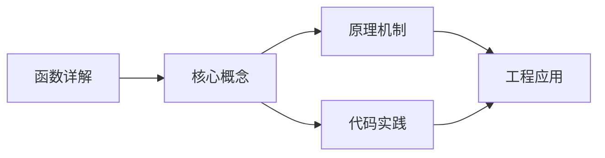
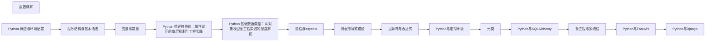

## 1. 学习目标（Bloom 分类）

本节按照布鲁姆教育目标分类学组织学习路径。本文主题为《函数详解》，属于 Python 模块，读者可以根据自身阶段选择阅读深度。

记忆层面：能够准确复述本文的核心概念、术语与基本语法或操作步骤，并能够在提问或检索时快速定位对应知识点。例如能够说出 Python 的动态类型、缩进语法与解释执行等基本特征。

理解层面：能够用自己的语言解释核心原理与工作机制，说明概念之间的因果关系，而不是机械记忆结论。例如能够解释解释器与编译器的差异，以及 GIL 对并发的影响。

应用层面：能够在真实项目或练习场景中运用本文知识解决具体问题，写出正确且可维护的实现。例如能够编写函数、类与标准库调用的完整脚本。

分析层面：能够拆解复杂问题，比较本文主题与相邻概念的异同，识别边界条件与例外情况。例如能够比较 Python 与 Java、Go 在类型系统与并发模型上的差异。

评价层面：能够根据约束条件（性能、可读性、安全、成本）评价不同方案的优劣，做出有依据的技术决策。例如能够评估不同实现方案（脚本、服务、库）的适用场景。

创造层面：能够把本文知识与其他模块知识组合，设计出新的解决方案或可复用的工程模式。例如能够组合标准库与第三方包设计完整的自动化工具。

通过本节学习，读者应当能够把《函数详解》纳入自己的知识网络，并与 Python 模块的其他主题（数据类型、函数、模块、异常、并发）建立关联。

## 2. 历史动机与发展脉络

《函数详解》是 Python 领域的重要主题。要真正理解它，需要先了解它解决的问题与演进过程。

Python 由 Guido van Rossum 于 1991 年首次发布，设计哲学强调代码可读性与开发效率，核心思想记录在《Python 之禅》（PEP 20）中：优美优于丑陋、明确优于隐晦、简单优于复杂。
Python 2 与 Python 3 的分裂期（2008-2020）是语言史上最重要的兼容性事件：Python 3 修复了字符串编码、整数除法等长期问题，但破坏性变更导致迁移缓慢；2020 年 1 月 Python 2 停止官方维护，社区全面转向 Python 3。
Python 3.9 至 3.13 的演进带来了类型提示增强（PEP 604 的 X | Y 语法、PEP 695 的泛型语法）、性能优化（3.11 的 faster-calls 与自适应解释器）以及异步生态的成熟（asyncio、FastAPI、httpx）。
Python 的应用版图从脚本自动化扩展到 Web 后端（Django、FastAPI）、数据科学（NumPy、Pandas、Matplotlib）、机器学习（PyTorch、scikit-learn）、运维自动化（Ansible）与科学计算，是当今最通用的编程语言之一。

回到本文主题：函数详解 的提出与成熟，正是上述技术背景下的必然产物。早期实现往往以简单可用为目标，随着工程规模扩大，社区逐渐沉淀出标准做法与最佳实践；理解这一脉络，可以帮助读者判断“为什么文档中的推荐写法是现在这个样子”，也能在遇到历史遗留代码时准确识别其设计年代与取舍。

对于初学者，理解 Python 的“电池内置”（标准库丰富）与“胶水语言”（易于调用 C/C++/Rust 扩展）两大特性，是判断其适用场景的基础。

## 3. 形式化定义与核心概念精讲

本节把《函数详解》涉及的核心概念以“定义 + 讲解”的形式展开。读者应把定义当作工具，把讲解当作理解路径；两者结合才能形成可迁移的知识。

变量与动态类型：Python 变量是对象的引用，类型属于对象而非变量；`isinstance()` 与 `type()` 用于运行时检查，类型注解（PEP 484）提供静态检查能力但不改变运行时行为。
缩进即语法：Python 用缩进表达代码块层次，避免了花括号噪声，也强制了代码排版一致性；同一代码块必须使用一致的空格数（官方推荐 4 空格）。
函数是一等公民：函数可以赋值、传参、返回，配合 lambda、装饰器与闭包，构成函数式编程能力的基础。
模块与包：每个 `.py` 文件是模块，目录加 `__init__.py` 是包；`import` 机制支持绝对导入、相对导入与命名空间包。
异常处理：`try/except/finally` 与 `raise` 构成错误传播体系；`with` 语句通过上下文管理器（`__enter__/__exit__`）管理资源生命周期。

### 3.1 原文章节逐一精讲

原文档把主题拆分为 25 个小节，下面按顺序给出每一节的导读讲解，随后保留原文细节供精读。

#### 原文精读（完整保留）

# 函数详解

> **符号约定**：`< >` 必填参数 | `[ ]` 可选参数

---

#### 1. 函数基本语法 (Basic Syntax)

函数是封装逻辑的可重用代码块，用于组织和简化代码。

##### 1.1 定义与调用 (Definition & Invocation)

```python
 # 基本函数定义
 def greet(name, msg="Hello"):
  """
  函数文档字符串 | Docstring
  Args:
  name (str): 用户名
  msg (str): 问候消息，默认为 "Hello"
  Returns:
  str: 格式化的问候消息
  """
  return f"{msg}, {name}!"
 # 调用函数
 print(greet("Alice")) # 输出: Hello, Alice!
 print(greet("Bob", "Hi")) # 输出: Hi, Bob!
 # 无返回值的函数
 def print_message(message):
  """打印消息"""
  print(f"Message: {message}")
 print_message("Hello, World!") # 输出: Message: Hello, World!
 # 多返回值函数
 def get_user_info():
  """返回用户信息"""
  name = "Alice"
  age = 30
  city = "New York"
  return name, age, city # 返回元组
 user_name, user_age, user_city = get_user_info()
 print(f"Name: {user_name}, Age: {user_age}, City: {user_city}")
 # 空函数
 def placeholder():
  """占位函数"""
  pass # 空语句
```

##### 1.2 参数传递 (Parameter Passing)

Python 中采用**引用传递** (Pass by Object Reference) 的方式传递参数：

- **不可变对象 (int, str, tuple)**: 修改形参不会影响实参
- **可变对象 (list, dict, set)**: 修改形参的内容会影响实参

```python
 # 不可变对象示例
 def modify_immutable(x):
  x = x + 1
  print(f"Inside function: x = {x}")
 num = 10
 modify_immutable(num)
 print(f"Outside function: num = {num}") # 输出: 10（实参未改变）
 # 可变对象示例
 def modify_mutable(lst):
  lst.append(4)
  print(f"Inside function: lst = {lst}")
 my_list = [1, 2, 3]
 modify_mutable(my_list)
 print(f"Outside function: my_list = {my_list}") # 输出: [1, 2, 3, 4]（实参被修改）
 # 重新绑定可变对象
 def rebind_mutable(lst):
  lst = [4, 5, 6] # 重新绑定局部变量
  print(f"Inside function: lst = {lst}")
 my_list = [1, 2, 3]
 rebind_mutable(my_list)
 print(f"Outside function: my_list = {my_list}") # 输出: [1, 2, 3]（实参未改变）
```

#### 2. 参数类型 (Parameter Types)

Python 支持多种类型的函数参数：

##### 2.1 位置参数 (Positional Parameters)

位置参数是最基本的参数类型，必须按顺序传递：

```python
 def add(a, b):
  return a + b
 print(add(3, 5)) # 输出: 8
 # print(add(3)) # 错误: 缺少位置参数 b
```

##### 2.2 关键字参数 (Keyword Parameters)

关键字参数允许通过参数名指定值，顺序可以任意：

```python
 def greet(name, age):
  return f"Hello, {name}! You are {age} years old."
 print(greet(name="Alice", age=30)) # 输出: Hello, Alice! You are 30 years old.
 print(greet(age=25, name="Bob")) # 输出: Hello, Bob! You are 25 years old.
```

##### 2.3 默认参数 (Default Parameters)

默认参数为参数提供默认值，当调用时未提供该参数时使用：

```python
 def greet(name, msg="Hello", age=None):
  if age:
  return f"{msg}, {name}! You are {age} years old."
  return f"{msg}, {name}!"
 print(greet("Alice")) # 输出: Hello, Alice!
 print(greet("Bob", "Hi")) # 输出: Hi, Bob!
 print(greet("Charlie", age=25)) # 输出: Hello, Charlie! You are 25 years old.
 # 陷阱: 不要使用可变对象作为默认参数
 def add_item(item, items=[]): # 危险：默认参数在函数定义时只计算一次
  items.append(item)
  return items
 print(add_item(1)) # 输出: [1]
 print(add_item(2)) # 输出: [1, 2]（意外：使用了同一个列表）
 # 正确的做法
 def add_item_safe(item, items=None):
  if items is None:
  items = []
  items.append(item)
  return items
 print(add_item_safe(1)) # 输出: [1]
 print(add_item_safe(2)) # 输出: [2]（正确：每次创建新列表）
```

##### 2.4 可变参数 (\*args)

可变参数允许接收任意数量的位置参数，会将这些参数打包成一个元组：

```python
 def sum_numbers(*args):
  """计算任意数量数字的和"""
  total = 0
  for num in args:
  total += num
  return total
 print(sum_numbers(1, 2, 3)) # 输出: 6
 print(sum_numbers(1, 2, 3, 4, 5)) # 输出: 15
 print(sum_numbers()) # 输出: 0
 # 解包序列作为可变参数
 numbers = [1, 2, 3, 4, 5]
 print(sum_numbers(*numbers)) # 输出: 15
```

##### 2.5 关键字可变参数 (\*\*kwargs)

关键字可变参数允许接收任意数量的关键字参数，会将这些参数打包成一个字典：

```python
 def print_person(**kwargs):
  """打印人物信息"""
  for key, value in kwargs.items():
  print(f"{key}: {value}")
 print_person(name="Alice", age=30, city="New York")
 # 输出:
 # name: Alice
 # age: 30
 # city: New York
 # 解包字典作为关键字可变参数
 person_info = {"name": "Bob", "age": 25, "city": "London"}
 print_person(**person_info)
```

##### 2.6 混合使用不同类型的参数

参数定义的顺序必须是：位置参数 → 默认参数 → 可变参数 → 关键字可变参数

```python
 def mixed_params(a, b, c=10, *args, **kwargs):
  print(f"a: {a}, b: {b}, c: {c}")
  print(f"args: {args}")
  print(f"kwargs: {kwargs}")
 mixed_params(1, 2, 3, 4, 5, 6, name="Alice", age=30)
 # 输出:
 # a: 1, b: 2, c: 3
 # args: (4, 5, 6)
 # kwargs: {'name': 'Alice', 'age': 30}
```

#### 3. 匿名函数 (Lambda)

Lambda 函数是一种小型的匿名函数，使用 `lambda` 关键字定义：

##### 3.1 基本语法

```python
 # 基本语法: lambda arguments: expression
 add = lambda x, y: x + y
 print(add(5, 5)) # 输出: 10
 # 无参数
 greet = lambda: "Hello, World!"
 print(greet()) # 输出: Hello, World!
 # 单个参数
 square = lambda x: x ** 2
 print(square(4)) # 输出: 16
 # 多个参数
 max_num = lambda x, y: x if x > y else y
 print(max_num(10, 20)) # 输出: 20
```

##### 3.2 Lambda 函数的应用场景

Lambda 函数常用于需要简短函数的场景，如作为高阶函数的参数：

```python
 # 与 map() 结合
 numbers = [1, 2, 3, 4, 5]
 squared = list(map(lambda x: x ** 2, numbers))
 print(squared) # 输出: [1, 4, 9, 16, 25]
 # 与 filter() 结合
 even_numbers = list(filter(lambda x: x % 2 == 0, numbers))
 print(even_numbers) # 输出: [2, 4]
 # 与 sorted() 结合
 students = [
  {"name": "Alice", "grade": 85},
  {"name": "Bob", "grade": 92},
  {"name": "Charlie", "grade": 78}
 ]
 # 按分数排序
 sorted_by_grade = sorted(students, key=lambda student: student["grade"], reverse=True)
 print(sorted_by_grade)
 # 与 reduce() 结合
 from functools import reduce
 product = reduce(lambda x, y: x * y, numbers)
 print(product) # 输出: 120
 # 作为返回值
 def make_adder(n):
  return lambda x: x + n
 add5 = make_adder(5)
 print(add5(10)) # 输出: 15
```

#### 4. 装饰器 (Decorators)

装饰器是一种特殊的函数，用于修改其他函数的行为，而不改变其源代码：

##### 4.1 基本装饰器

```python
 def timer(func):
  """计算函数执行时间的装饰器"""
  import time
  def wrapper(*args, **kwargs):
  start_time = time.time()
  result = func(*args, **kwargs)
  end_time = time.time()
  print(f"{func.__name__} 执行时间: {end_time - start_time:.4f} 秒")
  return result
  return wrapper
 @timer # 等价于: slow_function = timer(slow_function)
 def slow_function():
  """模拟耗时操作"""
  import time
  time.sleep(1)
  print("Function executed")
 slow_function()
```

##### 4.2 带参数的装饰器

```python
 def repeat(n):
  """重复执行函数 n 次的装饰器"""
  def decorator(func):
  def wrapper(*args, **kwargs):
  for i in range(n):
  result = func(*args, **kwargs)
  return result
  return wrapper
  return decorator
 @repeat(3) # 传递参数给装饰器
 def say_hello(name):
  print(f"Hello, {name}!")
 say_hello("Alice")
 # 输出:
 # Hello, Alice!
 # Hello, Alice!
 # Hello, Alice!
```

##### 4.3 保留原函数信息

使用 `functools.wraps` 保留原函数的元数据：

```python
 import functools
 def my_decorator(func):
  @functools.wraps(func) # 保留原函数信息
  def wrapper(*args, **kwargs):
  print("Before function execution")
  result = func(*args, **kwargs)
  print("After function execution")
  return result
  return wrapper
 @my_decorator
 def example():
  """示例函数"""
  print("Function executed")
 example()
 print(f"Function name: {example.__name__}")
 print(f"Function docstring: {example.__doc__}")
```

##### 4.4 装饰器链

多个装饰器可以同时应用于一个函数：

```python
 def decorator1(func):
  def wrapper(*args, **kwargs):
  print("Decorator 1 before")
  result = func(*args, **kwargs)
  print("Decorator 1 after")
  return result
  return wrapper
 def decorator2(func):
  def wrapper(*args, **kwargs):
  print("Decorator 2 before")
  result = func(*args, **kwargs)
  print("Decorator 2 after")
  return result
  return wrapper
 @decorator1
 @decorator2
 def my_function():
  print("Function executed")
 my_function()
 # 输出顺序:
 # Decorator 1 before
 # Decorator 2 before
 # Function executed
 # Decorator 2 after
 # Decorator 1 after
```

#### 5. 高阶函数 (Higher-Order Functions)

高阶函数是指接收函数作为参数或返回函数的函数：

##### 5.1 接收函数作为参数

```python
 def apply_function(func, value):
  """应用函数到值"""
  return func(value)
 def square(x):
  return x ** 2
 def cube(x):
  return x ** 3
 print(apply_function(square, 5)) # 输出: 25
 print(apply_function(cube, 5)) # 输出: 125
 print(apply_function(lambda x: x + 1, 5)) # 输出: 6
```

##### 5.2 返回函数

```python
 def make_multiplier(n):
  """返回一个乘以 n 的函数"""
  def multiplier(x):
  return x * n
  return multiplier
 double = make_multiplier(2)
 triple = make_multiplier(3)
 print(double(5)) # 输出: 10
 print(triple(5)) # 输出: 15
```

##### 5.3 内置高阶函数

###### 5.3.1 `map()`

`map()` 函数对序列中的每个元素应用一个函数：

```python
 # 基本用法
 numbers = [1, 2, 3, 4, 5]
 squared = list(map(lambda x: x ** 2, numbers))
 print(squared) # 输出: [1, 4, 9, 16, 25]
 # 多个序列
 numbers1 = [1, 2, 3]
 numbers2 = [4, 5, 6]
 summed = list(map(lambda x, y: x + y, numbers1, numbers2))
 print(summed) # 输出: [5, 7, 9]
 # 自定义函数
 def to_upper(s):
  return s.upper()
 words = ["hello", "world", "python"]
 upper_words = list(map(to_upper, words))
 print(upper_words) # 输出: ['HELLO', 'WORLD', 'PYTHON']
```

###### 5.3.2 `filter()`

`filter()` 函数根据函数结果过滤序列中的元素：

```python
 # 基本用法
 numbers = [1, 2, 3, 4, 5, 6, 7, 8, 9, 10]
 even_numbers = list(filter(lambda x: x % 2 == 0, numbers))
 print(even_numbers) # 输出: [2, 4, 6, 8, 10]
 # 过滤非空字符串
 words = ["hello", "", "world", "", "python"]
 non_empty = list(filter(lambda s: s, words))
 print(non_empty) # 输出: ['hello', 'world', 'python']
 # 自定义函数
 def is_positive(n):
  return n > 0
 numbers = [-5, -3, 0, 2, 7, -1]
 positive_numbers = list(filter(is_positive, numbers))
 print(positive_numbers) # 输出: [2, 7]
```

###### 5.3.3 `reduce()`

`reduce()` 函数对序列中的元素进行累积计算：

```python
 from functools import reduce
 # 基本用法
 numbers = [1, 2, 3, 4, 5]
 sum_result = reduce(lambda x, y: x + y, numbers)
 print(sum_result) # 输出: 15
 # 带初始值
 product_result = reduce(lambda x, y: x * y, numbers, 10) # 初始值为 10
 print(product_result) # 输出: 1200 (10 * 1 * 2 * 3 * 4 * 5)
 # 连接字符串
 words = ["Hello", " ", "World", "!"]
 sentence = reduce(lambda x, y: x + y, words)
 print(sentence) # 输出: Hello World!
 # 查找最大值
 numbers = [3, 1, 4, 1, 5, 9, 2, 6]
 max_value = reduce(lambda x, y: x if x > y else y, numbers)
 print(max_value) # 输出: 9
```

#### 6. 函数作用域 (Function Scope)

Python 中的变量作用域遵循 LEGB 规则：

1. **Local (L)**: 局部作用域，在函数内部定义的变量
2. **Enclosing (E)**: 嵌套作用域，在嵌套函数的外层函数中定义的变量
3. **Global (G)**: 全局作用域，在模块级别定义的变量
4. **Built-in (B)**: 内置作用域，Python 内置的变量和函数

##### 6.1 局部作用域

```python
 def my_function():
  local_var = "local"
  print(local_var) # 可以访问局部变量
 my_function()
 # print(local_var) # 错误: 无法访问局部变量
```

##### 6.2 全局作用域

```python
 global_var = "global"
 def my_function():
  print(global_var) # 可以访问全局变量
 my_function()
 print(global_var) # 可以访问全局变量
```

##### 6.3 修改全局变量

```python
 global_var = "global"
 def my_function():
  global global_var # 声明要修改全局变量
  global_var = "modified global"
  print(global_var)
 my_function()
 print(global_var) # 输出: modified global
```

##### 6.4 嵌套作用域

```python
 def outer_function():
  outer_var = "outer"
  def inner_function():
  nonlocal outer_var # 声明要修改嵌套作用域变量
  outer_var = "modified outer"
  print(outer_var)
  inner_function()
  print(outer_var) # 输出: modified outer
 outer_function()
```

#### 7. 递归函数 (Recursive Functions)

递归函数是调用自身的函数，用于解决可以分解为相同子问题的问题：

##### 7.1 基本递归

```python
 def factorial(n):
  """计算阶乘"""
  if n <= 1:
  return 1
  return n * factorial(n - 1)
 print(factorial(5)) # 输出: 120
 # 斐波那契数列
 def fibonacci(n):
  """计算斐波那契数列第 n 项"""
  if n <= 1:
  return n
  return fibonacci(n - 1) + fibonacci(n - 2)
 print(fibonacci(10)) # 输出: 55
```

##### 7.2 递归的注意事项

- **基线条件**: 必须有一个明确的终止条件
- **递归深度**: Python 默认递归深度限制为 1000
- **性能**: 某些递归实现可能效率低下，可考虑使用记忆化或迭代

```python
 # 记忆化优化斐波那契
 from functools import lru_cache
 @lru_cache(maxsize=None)
 def fibonacci_memo(n):
  if n <= 1:
  return n
  return fibonacci_memo(n - 1) + fibonacci_memo(n - 2)
 print(fibonacci_memo(100)) # 快速计算大值
 # 迭代实现斐波那契
 def fibonacci_iterative(n):
  if n <= 1:
  return n
  a, b = 0, 1
  for _ in range(2, n + 1):
  a, b = b, a + b
  return b
 print(fibonacci_iterative(100)) # 更高效
```

#### 8. 函数式编程 (Functional Programming)

函数式编程是一种编程范式，强调使用纯函数、不可变数据和高阶函数：

##### 8.1 纯函数

纯函数是指没有副作用且相同输入总是产生相同输出的函数：

```python
 # 纯函数
 def add(a, b):
  return a + b
 # 非纯函数（有副作用）
 total = 0
 def add_to_total(x):
  global total
  total += x
  return total
```

##### 8.2 不可变数据

函数式编程鼓励使用不可变数据，避免修改现有数据：

```python
 # 不可变操作
 numbers = [1, 2, 3]
 # 创建新列表而不是修改原列表
 new_numbers = [x * 2 for x in numbers]
 print(numbers) # 原列表不变: [1, 2, 3]
 print(new_numbers) # 新列表: [2, 4, 6]
 # 使用元组（不可变）
 point = (1, 2)
 # point[0] = 3 # 错误: 元组不可修改
```

##### 8.3 函数式编程工具

```python
 from functools import reduce
 # 组合函数
 def compose(f, g):
  return lambda x: f(g(x))
 def add_one(x):
  return x + 1
 def multiply_by_two(x):
  return x * 2
 # 先加 1，再乘以 2
 add_one_then_multiply_by_two = compose(multiply_by_two, add_one)
 print(add_one_then_multiply_by_two(5)) # 输出: 12
 # 管道操作
 from functools import reduce
 def pipe(data, *functions):
  return reduce(lambda x, func: func(x), functions, data)
 result = pipe(
  5,
  lambda x: x + 1, # 6
  lambda x: x * 2, # 12
  lambda x: x - 3 # 9
 )
 print(result) # 输出: 9
```

#### 9. 函数最佳实践

##### 9.1 函数设计

- **单一职责**: 每个函数应该只做一件事情
- **函数长度**: 保持函数简洁，通常不超过 50 行
- **命名规范**: 使用小写字母和下划线，函数名应该描述其功能
- **文档字符串**: 为函数添加详细的文档字符串
- **参数数量**: 尽量减少参数数量，通常不超过 5 个

##### 9.2 性能优化

- **避免重复计算**: 使用缓存或记忆化
- **避免不必要的全局变量**: 优先使用函数参数和返回值
- **使用适当的数据结构**: 选择合适的数据结构提高性能
- **生成器**: 对于大型数据集，使用生成器节省内存

##### 9.3 代码风格

- **缩进**: 使用 4 个空格进行缩进
- **空行**: 在函数定义之间使用空行
- **注释**: 为复杂的逻辑添加注释
- **类型提示**: 使用类型提示提高代码可读性

```python
 # 使用类型提示
 def greet(name: str, age: int) -> str:
  """问候函数"""
  return f"Hello, {name}! You are {age} years old."
 # 类型提示的好处
 # 1. 提高代码可读性
 # 2. 支持静态类型检查
 # 3. 提供更好的代码补全
```

---

#### 函数定义

**基本写法：定义无参函数**
`def <函数名>(): <语句>`

```python
# 定义无参函数
def greet():
    print("Hello, World!")
```

---

**基本写法：定义带参函数**
`def <函数名>(<参数>): <语句>`

```python
# 定义带参函数
def greet(name):
    print(f"Hello, {name}!")
```

---

**单行写法：定义单行函数**
`def <函数名>(<参数>): return <表达式>`

```python
# 定义单行函数
def square(x): return x * x
```

---

**换行写法：定义多参数函数**
`def <函数名>(`
`    <参数1>,`
`    <参数2>,`
`    <参数3>,`
`): <语句>`

```python
# 定义多参数函数（换行书写）
def create_user(
    name,
    age,
    email,
):
    return {"name": name, "age": age, "email": email}
```

---

#### 函数调用

**基本写法：调用无参函数**
`<函数名>()`

```python
# 调用无参函数
greet()
```

---

**基本写法：按位置传参调用**
`<函数名>(<参数1>, <参数2>)`

```python
# 按位置传参调用函数
greet("Alice")
```

---

**基本写法：按关键字传参调用**
`<函数名>(<参数名>=<值>)`

```python
# 按关键字传参调用函数
greet(name="Alice")
```

---

**换行写法：多参数函数调用**
`<函数名>(`
`    <参数1>=<值1>,`
`    <参数2>=<值2>,`
`)`

```python
# 多参数函数调用（换行书写）
create_user(
    name="Alice",
    age=30,
    email="alice@example.com",
)
```

---

#### 返回值

**基本写法：返回单个值**
`return <值>`

```python
# 返回单个值
def add(a, b):
    return a + b
```

---

**单行写法：返回多个值（元组）**
`return <值1>, <值2>, <值3>`

```python
# 返回多个值（作为元组）
def get_user_info():
    return "Alice", 30, "alice@example.com"
```

---

**基本写法：无返回值（隐式返回 None）**
`def <函数名>(): <语句>`

```python
# 无返回值的函数（隐式返回 None）
def print_message(msg):
    print(msg)
```

---

**基本写法：显式返回 None**
`return None`

```python
# 显式返回 None
def process(data):
    if not data:
        return None
    return data
```

---

#### 默认参数

**基本写法：定义带默认值的参数**
`def <函数名>(<参数>=<默认值>): <语句>`

```python
# 定义带默认值的参数
def greet(name="World"):
    print(f"Hello, {name}!")
```

---

**基本写法：混合必选和默认参数**
`def <函数名>(<必选参数>, <参数>=<默认值>): <语句>`

```python
# 混合必选参数和默认参数
def create_user(name, age=18, active=True):
    return {"name": name, "age": age, "active": active}
```

---

#### 可变参数

**基本写法：使用 *args 收集位置参数**
`def <函数名>(*<args>): <语句>`

```python
# 使用 *args 收集位置参数
def sum_all(*args):
    return sum(args)
```

---

**基本写法：使用 **kwargs 收集关键字参数**
`def <函数名>(**<kwargs>): <语句>`

```python
# 使用 **kwargs 收集关键字参数
def print_info(**kwargs):
    for key, value in kwargs.items():
        print(f"{key}: {value}")
```

---

**换行写法：组合使用必选、默认、可变参数**
`def <函数名>(`
`    <必选参数>,`
`    <参数>=<默认值>,`
`    *<args>,`
`    **<kwargs>,`
`): <语句>`

```python
# 组合使用各类参数
def create_profile(
    name,
    age=18,
    *hobbies,
    **metadata,
):
    profile = {"name": name, "age": age, "hobbies": hobbies}
    profile.update(metadata)
    return profile
```

---

#### 参数解包

**基本写法：使用 * 解包列表或元组**
`<函数名>(*<序列>)`

```python
# 使用 * 解包列表作为位置参数
def add(a, b, c):
    return a + b + c

numbers = [1, 2, 3]
print(add(*numbers))
```

---

**基本写法：使用 ** 解包字典**
`<函数名>(**<字典>)`

```python
# 使用 ** 解包字典作为关键字参数
def greet(name, greeting):
    print(f"{greeting}, {name}!")

params = {"name": "Alice", "greeting": "Hi"}
greet(**params)
```

---

#### 仅关键字参数

**基本写法：使用 * 强制关键字参数**
`def <函数名>(*, <参数>): <语句>`

```python
# 使用 * 强制后面的参数为关键字参数
def connect(host, *, port, timeout):
    print(f"Connecting to {host}:{port}, timeout={timeout}")
```

---

**基本写法：在 *args 后定义关键字参数**
`def <函数名>(*<args>, <参数>=<默认值>): <语句>`

```python
# 在 *args 后定义仅关键字参数
def func(*args, debug=False):
    if debug:
        print(f"args: {args}")
    return sum(args)
```

---

#### 仅位置参数

**基本写法：使用 / 强制位置参数**
`def <函数名>(<参数1>, <参数2>, /): <语句>`

```python
# 使用 / 强制前面的参数为位置参数
def divide(a, b, /):
    return a / b
```

---

**换行写法：组合位置参数和关键字参数**
`def <函数名>(`
`    <位置参数>, /,`
`    <普通参数>,`
`    *, <关键字参数>,`
`): <语句>`

```python
# 组合位置参数、普通参数和关键字参数
def process_data(
    data, /,
    transform=None,
    *,
    validate=False,
):
    if transform:
        data = transform(data)
    if validate:
        data = validate(data)
    return data
```

---

#### Lambda 表达式

**单行写法：基本 lambda 表达式**
`lambda <参数>: <表达式>`

```python
# 基本 lambda 表达式
square = lambda x: x * x
print(square(5))
```

---

**单行写法：多参数 lambda 表达式**
`lambda <参数1>, <参数2>: <表达式>`

```python
# 多参数 lambda 表达式
add = lambda a, b: a + b
print(add(3, 5))
```

---

**单行写法：带默认值的 lambda 表达式**
`lambda <参数>=<默认值>: <表达式>`

```python
# 带默认值的 lambda 表达式
greet = lambda name="World": f"Hello, {name}!"
print(greet())
```

---

**基本写法：在 sorted() 中使用 lambda**
`sorted(<可迭代对象>, key=lambda <参数>: <表达式>)`

```python
# 在 sorted() 中使用 lambda 作为 key
students = [("Alice", 85), ("Bob", 92), ("Charlie", 78)]
sorted_students = sorted(students, key=lambda x: x[1])
```

---

**基本写法：在 map() 中使用 lambda**
`map(lambda <参数>: <表达式>, <可迭代对象>)`

```python
# 在 map() 中使用 lambda
numbers = [1, 2, 3, 4, 5]
squares = list(map(lambda x: x ** 2, numbers))
```

---

**基本写法：在 filter() 中使用 lambda**
`filter(lambda <参数>: <条件>, <可迭代对象>)`

```python
# 在 filter() 中使用 lambda
numbers = [1, 2, 3, 4, 5, 6]
evens = list(filter(lambda x: x % 2 == 0, numbers))
```

---

#### 高阶函数

**基本写法：函数作为参数**
`def <函数名>(<函数参数>, <其他参数>): <语句>`

```python
# 函数作为参数传递
def apply(func, value):
    return func(value)

result = apply(lambda x: x * 2, 5)
```

---

**基本写法：函数作为返回值**
`def <函数名>(): return <函数>`

```python
# 函数作为返回值
def make_multiplier(factor):
    return lambda x: x * factor

double = make_multiplier(2)
print(double(5))
```

---

**基本写法：使用 map() 函数**
`map(<函数>, <可迭代对象>)`

```python
# 使用 map() 对可迭代对象应用函数
numbers = [1, 2, 3, 4, 5]
squares = list(map(lambda x: x ** 2, numbers))
```

---

**基本写法：使用 filter() 函数**
`filter(<函数>, <可迭代对象>)`

```python
# 使用 filter() 过滤可迭代对象
numbers = [1, 2, 3, 4, 5, 6]
evens = list(filter(lambda x: x % 2 == 0, numbers))
```

---

**基本写法：使用 reduce() 函数**
`reduce(<函数>, <可迭代对象>)`

```python
# 使用 reduce() 累积计算
from functools import reduce
numbers = [1, 2, 3, 4, 5]
product = reduce(lambda x, y: x * y, numbers)
```

---

#### 闭包

**换行写法：定义闭包**
`def <外部函数>(<参数>):`
`    def <内部函数>(<参数>): <语句>`
`    return <内部函数>`

```python
# 定义闭包
def make_counter():
    count = 0
    def counter():
        nonlocal count
        count += 1
        return count
    return counter
```

---

**基本写法：使用闭包**
`<变量> = <外部函数>()`

```python
# 使用闭包
counter = make_counter()
print(counter())
print(counter())
```

---

#### 递归

**基本写法：递归函数**
`def <函数名>(<参数>): if <条件>: return <基线> else: return <递归调用>`

```python
# 递归计算阶乘
def factorial(n):
    if n <= 1:
        return 1
    else:
        return n * factorial(n - 1)
```

---

**基本写法：尾递归优化（Python 不支持，仅作示例）**
`def <函数名>(<参数>, <累加器>): if <条件>: return <累加器> else: return <递归调用>`

```python
# 尾递归形式的阶乘（Python 不优化）
def factorial_tail(n, acc=1):
    if n <= 1:
        return acc
    else:
        return factorial_tail(n - 1, n * acc)
```

---

#### 函数注解

**基本写法：参数类型注解**
`def <函数名>(<参数>: <类型>): <语句>`

```python
# 参数类型注解
def greet(name: str) -> str:
    return f"Hello, {name}!"
```

---

**基本写法：返回值类型注解**
`def <函数名>(<参数>) -> <返回类型>: <语句>`

```python
# 返回值类型注解
def add(a: int, b: int) -> int:
    return a + b
```

---

**基本写法：使用 Optional 类型注解**
`def <函数名>(<参数>: Optional[<类型>]) -> <类型>: <语句>`

```python
# 使用 Optional 类型注解
from typing import Optional

def find_user(user_id: int) -> Optional[dict]:
    if user_id == 1:
        return {"id": 1, "name": "Alice"}
    return None
```

---

**基本写法：使用 List 类型注解**
`def <函数名>(<参数>: List[<类型>]) -> <类型>: <语句>`

```python
# 使用 List 类型注解
from typing import List

def sum_numbers(numbers: List[int]) -> int:
    return sum(numbers)
```

---

**基本写法：使用 Dict 类型注解**
`def <函数名>(<参数>: Dict[<键类型>, <值类型>]) -> <类型>: <语句>`

```python
# 使用 Dict 类型注解
from typing import Dict

def get_value(data: Dict[str, int], key: str) -> int:
    return data.get(key, 0)
```

---

**基本写法：使用 Union 类型注解**
`def <函数名>(<参数>: Union[<类型1>, <类型2>]) -> <类型>: <语句>`

```python
# 使用 Union 类型注解
from typing import Union

def process(data: Union[str, bytes]) -> str:
    if isinstance(data, bytes):
        return data.decode()
    return data
```

---

#### 函数属性

**基本写法：访问函数注解**
`<函数>.__annotations__`

```python
# 访问函数的注解信息
def greet(name: str) -> str:
    return f"Hello, {name}!"

print(greet.__annotations__)
```

---

**基本写法：访问函数文档字符串**
`<函数>.__doc__`

```python
# 访问函数的文档字符串
def greet(name):
    """向用户打招呼"""
    return f"Hello, {name}!"

print(greet.__doc__)
```

---

**基本写法：访问函数名**
`<函数>.__name__`

```python
# 访问函数的名称
def my_function():
    pass

print(my_function.__name__)
```

---

#### 偏函数

**基本写法：使用 partial 创建偏函数**
`partial(<函数>, <固定参数>)`

```python
# 使用 partial 创建偏函数
from functools import partial

def power(base, exponent):
    return base ** exponent

square = partial(power, exponent=2)
print(square(5))
```

---

#### 函数缓存

**基本写法：使用 lru_cache 缓存函数结果**
`@lru_cache(maxsize=<n>)`

```python
# 使用 lru_cache 缓存函数结果
from functools import lru_cache

@lru_cache(maxsize=128)
def fibonacci(n):
    if n < 2:
        return n
    return fibonacci(n - 1) + fibonacci(n - 2)
```

---

**基本写法：使用 cache 无限缓存**
`@cache`

```python
# 使用 cache 无限缓存
from functools import cache

@cache
def expensive_computation(n):
    return sum(i * i for i in range(n))
```

---


### 3.2 概念关系图

下面用 Mermaid 图表达本文核心概念之间的关系，帮助读者建立整体图景：



图中展示的是本文知识的结构化关系：核心概念是入口，原理机制解释“为什么”，代码实践演示“怎么做”，工程应用回答“何时用”。读者学习时可以把每个小节的内容挂接到对应节点上。

## 4. 理论推导与原理解析

本节深入《函数详解》背后的原理。理论部分不求面面俱到，而是聚焦“能解释现象、能指导实践”的关键推导。

解释执行与字节码：CPython 先把源码编译为字节码（.pyc），再由虚拟机逐条执行。字节码是平台无关的中间表示，因此 Python 程序可以跨平台运行，但执行速度低于编译型语言；性能敏感路径可用 C 扩展或 Cython 加速。
GIL（全局解释器锁）：CPython 的 GIL 保证同一时刻只有一个线程执行字节码，简化了内存管理，但限制了 CPU 密集型多线程并行；I/O 密集型任务通过线程切换获得并发，CPU 密集型任务应使用多进程（multiprocessing）或异步。
引用计数与垃圾回收：Python 对象通过引用计数管理生命周期，循环引用由分代垃圾回收器（gc 模块）处理。理解这一模型可以解释“为什么局部变量及时释放内存”“为什么大对象需要 del 或作用域退出”。
鸭子类型与协议：Python 依赖行为协议而非继承体系，例如实现 `__iter__` 与 `__next__` 的对象即可用于 `for` 循环。这一设计带来灵活性的同时，也要求开发者编写清晰的接口文档与类型注解。

需要强调的是，理论推导与工程实践之间存在翻译层：理论给出的是理想化模型与边界条件，工程代码则必须处理真实环境中的例外。读者在学习时应先掌握理论的“标准情形”，再通过陷阱章节了解“非标准情形”。

## 5. 代码示例与逐行讲解

本节把原文中的代码示例系统整理，并为每个示例补充用途说明与讲解。读者不应只浏览代码，而应逐段对照讲解理解设计意图。

### 5.1 示例：1.1 定义与调用 (Definition & Invocation)

该示例来自原文《1.1 定义与调用 (Definition & Invocation)》小节，用于演示函数详解相关操作。阅读时请先看代码结构，再看其后的讲解。

```python
 # 基本函数定义
 def greet(name, msg="Hello"):
  """
  函数文档字符串 | Docstring
  Args:
  name (str): 用户名
  msg (str): 问候消息，默认为 "Hello"
  Returns:
  str: 格式化的问候消息
  """
  return f"{msg}, {name}!"
 # 调用函数
 print(greet("Alice")) # 输出: Hello, Alice!
 print(greet("Bob", "Hi")) # 输出: Hi, Bob!
 # 无返回值的函数
 def print_message(message):
  """打印消息"""
  print(f"Message: {message}")
 print_message("Hello, World!") # 输出: Message: Hello, World!
 # 多返回值函数
 def get_user_info():
  """返回用户信息"""
  name = "Alice"
  age = 30
  city = "New York"
  return name, age, city # 返回元组
 user_name, user_age, user_city = get_user_info()
 print(f"Name: {user_name}, Age: {user_age}, City: {user_city}")
 # 空函数
 def placeholder():
  """占位函数"""
  pass # 空语句
```

讲解：这段代码演示了本节核心知识点。代码中的关键操作可以归纳为三步：准备（定义或初始化）、执行（核心逻辑）、收尾（释放资源或返回结果）。实际项目中，这三步往往被封装为函数或类，以提升复用性与可测试性。

关键点分析：

该示例共 32 行有效代码，包含 2 类关键结构（def、return）。其中：

- 入口与初始化部分负责建立上下文，对应实际项目中的启动或装配逻辑；
- 核心逻辑部分体现本文主题的主要操作，是阅读时最需要对照讲解理解的部分；
- 输出或返回部分把结果交给调用方，注意其类型与边界条件。

进阶思考路径：先尝试修改参数观察行为变化，再把示例中的模式迁移到自己的项目中；每次修改都记录预期与实测差异，这是把示例转化为能力的最快方式。

### 5.2 示例：1.2 参数传递 (Parameter Passing)

该示例来自原文《1.2 参数传递 (Parameter Passing)》小节，用于演示函数详解相关操作。阅读时请先看代码结构，再看其后的讲解。

```python
 # 不可变对象示例
 def modify_immutable(x):
  x = x + 1
  print(f"Inside function: x = {x}")
 num = 10
 modify_immutable(num)
 print(f"Outside function: num = {num}") # 输出: 10（实参未改变）
 # 可变对象示例
 def modify_mutable(lst):
  lst.append(4)
  print(f"Inside function: lst = {lst}")
 my_list = [1, 2, 3]
 modify_mutable(my_list)
 print(f"Outside function: my_list = {my_list}") # 输出: [1, 2, 3, 4]（实参被修改）
 # 重新绑定可变对象
 def rebind_mutable(lst):
  lst = [4, 5, 6] # 重新绑定局部变量
  print(f"Inside function: lst = {lst}")
 my_list = [1, 2, 3]
 rebind_mutable(my_list)
 print(f"Outside function: my_list = {my_list}") # 输出: [1, 2, 3]（实参未改变）
```

讲解：这段代码演示了本节核心知识点。代码中的关键操作可以归纳为三步：准备（定义或初始化）、执行（核心逻辑）、收尾（释放资源或返回结果）。实际项目中，这三步往往被封装为函数或类，以提升复用性与可测试性。

关键点分析：

该示例共 21 行有效代码，包含 2 类关键结构（def、function）。其中：

- 入口与初始化部分负责建立上下文，对应实际项目中的启动或装配逻辑；
- 核心逻辑部分体现本文主题的主要操作，是阅读时最需要对照讲解理解的部分；
- 输出或返回部分把结果交给调用方，注意其类型与边界条件。

进阶思考路径：先尝试修改参数观察行为变化，再把示例中的模式迁移到自己的项目中；每次修改都记录预期与实测差异，这是把示例转化为能力的最快方式。

### 5.3 示例：2.1 位置参数 (Positional Parameters)

该示例来自原文《2.1 位置参数 (Positional Parameters)》小节，用于演示函数详解相关操作。阅读时请先看代码结构，再看其后的讲解。

```python
 def add(a, b):
  return a + b
 print(add(3, 5)) # 输出: 8
 # print(add(3)) # 错误: 缺少位置参数 b
```

讲解：这段代码演示了本节核心知识点。代码中的关键操作可以归纳为三步：准备（定义或初始化）、执行（核心逻辑）、收尾（释放资源或返回结果）。实际项目中，这三步往往被封装为函数或类，以提升复用性与可测试性。

关键点分析：

该示例共 4 行有效代码，包含 2 类关键结构（def、return）。其中：

- 入口与初始化部分负责建立上下文，对应实际项目中的启动或装配逻辑；
- 核心逻辑部分体现本文主题的主要操作，是阅读时最需要对照讲解理解的部分；
- 输出或返回部分把结果交给调用方，注意其类型与边界条件。

进阶思考路径：先尝试修改参数观察行为变化，再把示例中的模式迁移到自己的项目中；每次修改都记录预期与实测差异，这是把示例转化为能力的最快方式。

### 5.4 示例：2.2 关键字参数 (Keyword Parameters)

该示例来自原文《2.2 关键字参数 (Keyword Parameters)》小节，用于演示函数详解相关操作。阅读时请先看代码结构，再看其后的讲解。

```python
 def greet(name, age):
  return f"Hello, {name}! You are {age} years old."
 print(greet(name="Alice", age=30)) # 输出: Hello, Alice! You are 30 years old.
 print(greet(age=25, name="Bob")) # 输出: Hello, Bob! You are 25 years old.
```

讲解：这段代码演示了本节核心知识点。代码中的关键操作可以归纳为三步：准备（定义或初始化）、执行（核心逻辑）、收尾（释放资源或返回结果）。实际项目中，这三步往往被封装为函数或类，以提升复用性与可测试性。

关键点分析：

该示例共 4 行有效代码，包含 2 类关键结构（def、return）。其中：

- 入口与初始化部分负责建立上下文，对应实际项目中的启动或装配逻辑；
- 核心逻辑部分体现本文主题的主要操作，是阅读时最需要对照讲解理解的部分；
- 输出或返回部分把结果交给调用方，注意其类型与边界条件。

进阶思考路径：先尝试修改参数观察行为变化，再把示例中的模式迁移到自己的项目中；每次修改都记录预期与实测差异，这是把示例转化为能力的最快方式。

### 5.5 示例：2.3 默认参数 (Default Parameters)

该示例来自原文《2.3 默认参数 (Default Parameters)》小节，用于演示函数详解相关操作。阅读时请先看代码结构，再看其后的讲解。

```python
 def greet(name, msg="Hello", age=None):
  if age:
  return f"{msg}, {name}! You are {age} years old."
  return f"{msg}, {name}!"
 print(greet("Alice")) # 输出: Hello, Alice!
 print(greet("Bob", "Hi")) # 输出: Hi, Bob!
 print(greet("Charlie", age=25)) # 输出: Hello, Charlie! You are 25 years old.
 # 陷阱: 不要使用可变对象作为默认参数
 def add_item(item, items=[]): # 危险：默认参数在函数定义时只计算一次
  items.append(item)
  return items
 print(add_item(1)) # 输出: [1]
 print(add_item(2)) # 输出: [1, 2]（意外：使用了同一个列表）
 # 正确的做法
 def add_item_safe(item, items=None):
  if items is None:
  items = []
  items.append(item)
  return items
 print(add_item_safe(1)) # 输出: [1]
 print(add_item_safe(2)) # 输出: [2]（正确：每次创建新列表）
```

讲解：这段代码演示了本节核心知识点。代码中的关键操作可以归纳为三步：准备（定义或初始化）、执行（核心逻辑）、收尾（释放资源或返回结果）。实际项目中，这三步往往被封装为函数或类，以提升复用性与可测试性。

关键点分析：

该示例共 21 行有效代码，包含 3 类关键结构（def、if、return）。其中：

- 入口与初始化部分负责建立上下文，对应实际项目中的启动或装配逻辑；
- 核心逻辑部分体现本文主题的主要操作，是阅读时最需要对照讲解理解的部分；
- 输出或返回部分把结果交给调用方，注意其类型与边界条件。

进阶思考路径：先尝试修改参数观察行为变化，再把示例中的模式迁移到自己的项目中；每次修改都记录预期与实测差异，这是把示例转化为能力的最快方式。

### 5.6 示例：2.4 可变参数 (\*args)

该示例来自原文《2.4 可变参数 (\*args)》小节，用于演示函数详解相关操作。阅读时请先看代码结构，再看其后的讲解。

```python
 def sum_numbers(*args):
  """计算任意数量数字的和"""
  total = 0
  for num in args:
  total += num
  return total
 print(sum_numbers(1, 2, 3)) # 输出: 6
 print(sum_numbers(1, 2, 3, 4, 5)) # 输出: 15
 print(sum_numbers()) # 输出: 0
 # 解包序列作为可变参数
 numbers = [1, 2, 3, 4, 5]
 print(sum_numbers(*numbers)) # 输出: 15
```

讲解：这段代码演示了本节核心知识点。代码中的关键操作可以归纳为三步：准备（定义或初始化）、执行（核心逻辑）、收尾（释放资源或返回结果）。实际项目中，这三步往往被封装为函数或类，以提升复用性与可测试性。

关键点分析：

该示例共 12 行有效代码，包含 3 类关键结构（def、for、return）。其中：

- 入口与初始化部分负责建立上下文，对应实际项目中的启动或装配逻辑；
- 核心逻辑部分体现本文主题的主要操作，是阅读时最需要对照讲解理解的部分；
- 输出或返回部分把结果交给调用方，注意其类型与边界条件。

进阶思考路径：先尝试修改参数观察行为变化，再把示例中的模式迁移到自己的项目中；每次修改都记录预期与实测差异，这是把示例转化为能力的最快方式。

### 5.7 示例：2.5 关键字可变参数 (\*\*kwargs)

该示例来自原文《2.5 关键字可变参数 (\*\*kwargs)》小节，用于演示函数详解相关操作。阅读时请先看代码结构，再看其后的讲解。

```python
 def print_person(**kwargs):
  """打印人物信息"""
  for key, value in kwargs.items():
  print(f"{key}: {value}")
 print_person(name="Alice", age=30, city="New York")
 # 输出:
 # name: Alice
 # age: 30
 # city: New York
 # 解包字典作为关键字可变参数
 person_info = {"name": "Bob", "age": 25, "city": "London"}
 print_person(**person_info)
```

讲解：这段代码演示了本节核心知识点。代码中的关键操作可以归纳为三步：准备（定义或初始化）、执行（核心逻辑）、收尾（释放资源或返回结果）。实际项目中，这三步往往被封装为函数或类，以提升复用性与可测试性。

关键点分析：

该示例共 12 行有效代码，包含 2 类关键结构（def、for）。其中：

- 入口与初始化部分负责建立上下文，对应实际项目中的启动或装配逻辑；
- 核心逻辑部分体现本文主题的主要操作，是阅读时最需要对照讲解理解的部分；
- 输出或返回部分把结果交给调用方，注意其类型与边界条件。

进阶思考路径：先尝试修改参数观察行为变化，再把示例中的模式迁移到自己的项目中；每次修改都记录预期与实测差异，这是把示例转化为能力的最快方式。

### 5.8 示例：2.6 混合使用不同类型的参数

该示例来自原文《2.6 混合使用不同类型的参数》小节，用于演示函数详解相关操作。阅读时请先看代码结构，再看其后的讲解。

```python
 def mixed_params(a, b, c=10, *args, **kwargs):
  print(f"a: {a}, b: {b}, c: {c}")
  print(f"args: {args}")
  print(f"kwargs: {kwargs}")
 mixed_params(1, 2, 3, 4, 5, 6, name="Alice", age=30)
 # 输出:
 # a: 1, b: 2, c: 3
 # args: (4, 5, 6)
 # kwargs: {'name': 'Alice', 'age': 30}
```

讲解：这段代码演示了本节核心知识点。代码中的关键操作可以归纳为三步：准备（定义或初始化）、执行（核心逻辑）、收尾（释放资源或返回结果）。实际项目中，这三步往往被封装为函数或类，以提升复用性与可测试性。

关键点分析：

该示例共 9 行有效代码，包含 1 类关键结构（def）。其中：

- 入口与初始化部分负责建立上下文，对应实际项目中的启动或装配逻辑；
- 核心逻辑部分体现本文主题的主要操作，是阅读时最需要对照讲解理解的部分；
- 输出或返回部分把结果交给调用方，注意其类型与边界条件。

进阶思考路径：先尝试修改参数观察行为变化，再把示例中的模式迁移到自己的项目中；每次修改都记录预期与实测差异，这是把示例转化为能力的最快方式。

### 5.9 示例：3.1 基本语法

该示例来自原文《3.1 基本语法》小节，用于演示函数详解相关操作。阅读时请先看代码结构，再看其后的讲解。

```python
 # 基本语法: lambda arguments: expression
 add = lambda x, y: x + y
 print(add(5, 5)) # 输出: 10
 # 无参数
 greet = lambda: "Hello, World!"
 print(greet()) # 输出: Hello, World!
 # 单个参数
 square = lambda x: x ** 2
 print(square(4)) # 输出: 16
 # 多个参数
 max_num = lambda x, y: x if x > y else y
 print(max_num(10, 20)) # 输出: 20
```

讲解：这段代码演示了本节核心知识点。代码中的关键操作可以归纳为三步：准备（定义或初始化）、执行（核心逻辑）、收尾（释放资源或返回结果）。实际项目中，这三步往往被封装为函数或类，以提升复用性与可测试性。

关键点分析：

该示例共 12 行有效代码，包含 1 类关键结构（if）。其中：

- 入口与初始化部分负责建立上下文，对应实际项目中的启动或装配逻辑；
- 核心逻辑部分体现本文主题的主要操作，是阅读时最需要对照讲解理解的部分；
- 输出或返回部分把结果交给调用方，注意其类型与边界条件。

进阶思考路径：先尝试修改参数观察行为变化，再把示例中的模式迁移到自己的项目中；每次修改都记录预期与实测差异，这是把示例转化为能力的最快方式。

### 5.10 示例：3.2 Lambda 函数的应用场景

该示例来自原文《3.2 Lambda 函数的应用场景》小节，用于演示函数详解相关操作。阅读时请先看代码结构，再看其后的讲解。

```python
 # 与 map() 结合
 numbers = [1, 2, 3, 4, 5]
 squared = list(map(lambda x: x ** 2, numbers))
 print(squared) # 输出: [1, 4, 9, 16, 25]
 # 与 filter() 结合
 even_numbers = list(filter(lambda x: x % 2 == 0, numbers))
 print(even_numbers) # 输出: [2, 4]
 # 与 sorted() 结合
 students = [
  {"name": "Alice", "grade": 85},
  {"name": "Bob", "grade": 92},
  {"name": "Charlie", "grade": 78}
 ]
 # 按分数排序
 sorted_by_grade = sorted(students, key=lambda student: student["grade"], reverse=True)
 print(sorted_by_grade)
 # 与 reduce() 结合
 from functools import reduce
 product = reduce(lambda x, y: x * y, numbers)
 print(product) # 输出: 120
 # 作为返回值
 def make_adder(n):
  return lambda x: x + n
 add5 = make_adder(5)
 print(add5(10)) # 输出: 15
```

讲解：这段代码演示了本节核心知识点。代码中的关键操作可以归纳为三步：准备（定义或初始化）、执行（核心逻辑）、收尾（释放资源或返回结果）。实际项目中，这三步往往被封装为函数或类，以提升复用性与可测试性。

关键点分析：

该示例共 25 行有效代码，包含 4 类关键结构（def、import、from、return）。其中：

- 入口与初始化部分负责建立上下文，对应实际项目中的启动或装配逻辑；
- 核心逻辑部分体现本文主题的主要操作，是阅读时最需要对照讲解理解的部分；
- 输出或返回部分把结果交给调用方，注意其类型与边界条件。

进阶思考路径：先尝试修改参数观察行为变化，再把示例中的模式迁移到自己的项目中；每次修改都记录预期与实测差异，这是把示例转化为能力的最快方式。

### 5.11 示例：4.1 基本装饰器

该示例来自原文《4.1 基本装饰器》小节，用于演示函数详解相关操作。阅读时请先看代码结构，再看其后的讲解。

```python
 def timer(func):
  """计算函数执行时间的装饰器"""
  import time
  def wrapper(*args, **kwargs):
  start_time = time.time()
  result = func(*args, **kwargs)
  end_time = time.time()
  print(f"{func.__name__} 执行时间: {end_time - start_time:.4f} 秒")
  return result
  return wrapper
 @timer # 等价于: slow_function = timer(slow_function)
 def slow_function():
  """模拟耗时操作"""
  import time
  time.sleep(1)
  print("Function executed")
 slow_function()
```

讲解：这段代码演示了本节核心知识点。代码中的关键操作可以归纳为三步：准备（定义或初始化）、执行（核心逻辑）、收尾（释放资源或返回结果）。实际项目中，这三步往往被封装为函数或类，以提升复用性与可测试性。

关键点分析：

该示例共 17 行有效代码，包含 4 类关键结构（def、function、import、return）。其中：

- 入口与初始化部分负责建立上下文，对应实际项目中的启动或装配逻辑；
- 核心逻辑部分体现本文主题的主要操作，是阅读时最需要对照讲解理解的部分；
- 输出或返回部分把结果交给调用方，注意其类型与边界条件。

进阶思考路径：先尝试修改参数观察行为变化，再把示例中的模式迁移到自己的项目中；每次修改都记录预期与实测差异，这是把示例转化为能力的最快方式。

### 5.12 示例：4.2 带参数的装饰器

该示例来自原文《4.2 带参数的装饰器》小节，用于演示函数详解相关操作。阅读时请先看代码结构，再看其后的讲解。

```python
 def repeat(n):
  """重复执行函数 n 次的装饰器"""
  def decorator(func):
  def wrapper(*args, **kwargs):
  for i in range(n):
  result = func(*args, **kwargs)
  return result
  return wrapper
  return decorator
 @repeat(3) # 传递参数给装饰器
 def say_hello(name):
  print(f"Hello, {name}!")
 say_hello("Alice")
 # 输出:
 # Hello, Alice!
 # Hello, Alice!
 # Hello, Alice!
```

讲解：这段代码演示了本节核心知识点。代码中的关键操作可以归纳为三步：准备（定义或初始化）、执行（核心逻辑）、收尾（释放资源或返回结果）。实际项目中，这三步往往被封装为函数或类，以提升复用性与可测试性。

关键点分析：

该示例共 17 行有效代码，包含 3 类关键结构（def、for、return）。其中：

- 入口与初始化部分负责建立上下文，对应实际项目中的启动或装配逻辑；
- 核心逻辑部分体现本文主题的主要操作，是阅读时最需要对照讲解理解的部分；
- 输出或返回部分把结果交给调用方，注意其类型与边界条件。

进阶思考路径：先尝试修改参数观察行为变化，再把示例中的模式迁移到自己的项目中；每次修改都记录预期与实测差异，这是把示例转化为能力的最快方式。

### 5.13 示例：4.3 保留原函数信息

该示例来自原文《4.3 保留原函数信息》小节，用于演示函数详解相关操作。阅读时请先看代码结构，再看其后的讲解。

```python
 import functools
 def my_decorator(func):
  @functools.wraps(func) # 保留原函数信息
  def wrapper(*args, **kwargs):
  print("Before function execution")
  result = func(*args, **kwargs)
  print("After function execution")
  return result
  return wrapper
 @my_decorator
 def example():
  """示例函数"""
  print("Function executed")
 example()
 print(f"Function name: {example.__name__}")
 print(f"Function docstring: {example.__doc__}")
```

讲解：这段代码演示了本节核心知识点。代码中的关键操作可以归纳为三步：准备（定义或初始化）、执行（核心逻辑）、收尾（释放资源或返回结果）。实际项目中，这三步往往被封装为函数或类，以提升复用性与可测试性。

关键点分析：

该示例共 16 行有效代码，包含 4 类关键结构（def、function、import、return）。其中：

- 入口与初始化部分负责建立上下文，对应实际项目中的启动或装配逻辑；
- 核心逻辑部分体现本文主题的主要操作，是阅读时最需要对照讲解理解的部分；
- 输出或返回部分把结果交给调用方，注意其类型与边界条件。

进阶思考路径：先尝试修改参数观察行为变化，再把示例中的模式迁移到自己的项目中；每次修改都记录预期与实测差异，这是把示例转化为能力的最快方式。

### 5.14 示例：4.4 装饰器链

该示例来自原文《4.4 装饰器链》小节，用于演示函数详解相关操作。阅读时请先看代码结构，再看其后的讲解。

```python
 def decorator1(func):
  def wrapper(*args, **kwargs):
  print("Decorator 1 before")
  result = func(*args, **kwargs)
  print("Decorator 1 after")
  return result
  return wrapper
 def decorator2(func):
  def wrapper(*args, **kwargs):
  print("Decorator 2 before")
  result = func(*args, **kwargs)
  print("Decorator 2 after")
  return result
  return wrapper
 @decorator1
 @decorator2
 def my_function():
  print("Function executed")
 my_function()
 # 输出顺序:
 # Decorator 1 before
 # Decorator 2 before
 # Function executed
 # Decorator 2 after
 # Decorator 1 after
```

讲解：这段代码演示了本节核心知识点。代码中的关键操作可以归纳为三步：准备（定义或初始化）、执行（核心逻辑）、收尾（释放资源或返回结果）。实际项目中，这三步往往被封装为函数或类，以提升复用性与可测试性。

关键点分析：

该示例共 25 行有效代码，包含 3 类关键结构（def、function、return）。其中：

- 入口与初始化部分负责建立上下文，对应实际项目中的启动或装配逻辑；
- 核心逻辑部分体现本文主题的主要操作，是阅读时最需要对照讲解理解的部分；
- 输出或返回部分把结果交给调用方，注意其类型与边界条件。

进阶思考路径：先尝试修改参数观察行为变化，再把示例中的模式迁移到自己的项目中；每次修改都记录预期与实测差异，这是把示例转化为能力的最快方式。

### 5.15 示例：5.1 接收函数作为参数

该示例来自原文《5.1 接收函数作为参数》小节，用于演示函数详解相关操作。阅读时请先看代码结构，再看其后的讲解。

```python
 def apply_function(func, value):
  """应用函数到值"""
  return func(value)
 def square(x):
  return x ** 2
 def cube(x):
  return x ** 3
 print(apply_function(square, 5)) # 输出: 25
 print(apply_function(cube, 5)) # 输出: 125
 print(apply_function(lambda x: x + 1, 5)) # 输出: 6
```

讲解：这段代码演示了本节核心知识点。代码中的关键操作可以归纳为三步：准备（定义或初始化）、执行（核心逻辑）、收尾（释放资源或返回结果）。实际项目中，这三步往往被封装为函数或类，以提升复用性与可测试性。

关键点分析：

该示例共 10 行有效代码，包含 3 类关键结构（def、function、return）。其中：

- 入口与初始化部分负责建立上下文，对应实际项目中的启动或装配逻辑；
- 核心逻辑部分体现本文主题的主要操作，是阅读时最需要对照讲解理解的部分；
- 输出或返回部分把结果交给调用方，注意其类型与边界条件。

进阶思考路径：先尝试修改参数观察行为变化，再把示例中的模式迁移到自己的项目中；每次修改都记录预期与实测差异，这是把示例转化为能力的最快方式。

### 5.16 示例：5.2 返回函数

该示例来自原文《5.2 返回函数》小节，用于演示函数详解相关操作。阅读时请先看代码结构，再看其后的讲解。

```python
 def make_multiplier(n):
  """返回一个乘以 n 的函数"""
  def multiplier(x):
  return x * n
  return multiplier
 double = make_multiplier(2)
 triple = make_multiplier(3)
 print(double(5)) # 输出: 10
 print(triple(5)) # 输出: 15
```

讲解：这段代码演示了本节核心知识点。代码中的关键操作可以归纳为三步：准备（定义或初始化）、执行（核心逻辑）、收尾（释放资源或返回结果）。实际项目中，这三步往往被封装为函数或类，以提升复用性与可测试性。

关键点分析：

该示例共 9 行有效代码，包含 2 类关键结构（def、return）。其中：

- 入口与初始化部分负责建立上下文，对应实际项目中的启动或装配逻辑；
- 核心逻辑部分体现本文主题的主要操作，是阅读时最需要对照讲解理解的部分；
- 输出或返回部分把结果交给调用方，注意其类型与边界条件。

进阶思考路径：先尝试修改参数观察行为变化，再把示例中的模式迁移到自己的项目中；每次修改都记录预期与实测差异，这是把示例转化为能力的最快方式。

### 5.17 示例：5.3.1 `map()`

该示例来自原文《5.3.1 `map()`》小节，用于演示函数详解相关操作。阅读时请先看代码结构，再看其后的讲解。

```python
 # 基本用法
 numbers = [1, 2, 3, 4, 5]
 squared = list(map(lambda x: x ** 2, numbers))
 print(squared) # 输出: [1, 4, 9, 16, 25]
 # 多个序列
 numbers1 = [1, 2, 3]
 numbers2 = [4, 5, 6]
 summed = list(map(lambda x, y: x + y, numbers1, numbers2))
 print(summed) # 输出: [5, 7, 9]
 # 自定义函数
 def to_upper(s):
  return s.upper()
 words = ["hello", "world", "python"]
 upper_words = list(map(to_upper, words))
 print(upper_words) # 输出: ['HELLO', 'WORLD', 'PYTHON']
```

讲解：这段代码演示了本节核心知识点。代码中的关键操作可以归纳为三步：准备（定义或初始化）、执行（核心逻辑）、收尾（释放资源或返回结果）。实际项目中，这三步往往被封装为函数或类，以提升复用性与可测试性。

关键点分析：

该示例共 15 行有效代码，包含 2 类关键结构（def、return）。其中：

- 入口与初始化部分负责建立上下文，对应实际项目中的启动或装配逻辑；
- 核心逻辑部分体现本文主题的主要操作，是阅读时最需要对照讲解理解的部分；
- 输出或返回部分把结果交给调用方，注意其类型与边界条件。

进阶思考路径：先尝试修改参数观察行为变化，再把示例中的模式迁移到自己的项目中；每次修改都记录预期与实测差异，这是把示例转化为能力的最快方式。

### 5.18 示例：5.3.2 `filter()`

该示例来自原文《5.3.2 `filter()`》小节，用于演示函数详解相关操作。阅读时请先看代码结构，再看其后的讲解。

```python
 # 基本用法
 numbers = [1, 2, 3, 4, 5, 6, 7, 8, 9, 10]
 even_numbers = list(filter(lambda x: x % 2 == 0, numbers))
 print(even_numbers) # 输出: [2, 4, 6, 8, 10]
 # 过滤非空字符串
 words = ["hello", "", "world", "", "python"]
 non_empty = list(filter(lambda s: s, words))
 print(non_empty) # 输出: ['hello', 'world', 'python']
 # 自定义函数
 def is_positive(n):
  return n > 0
 numbers = [-5, -3, 0, 2, 7, -1]
 positive_numbers = list(filter(is_positive, numbers))
 print(positive_numbers) # 输出: [2, 7]
```

讲解：这段代码演示了本节核心知识点。代码中的关键操作可以归纳为三步：准备（定义或初始化）、执行（核心逻辑）、收尾（释放资源或返回结果）。实际项目中，这三步往往被封装为函数或类，以提升复用性与可测试性。

关键点分析：

该示例共 14 行有效代码，包含 2 类关键结构（def、return）。其中：

- 入口与初始化部分负责建立上下文，对应实际项目中的启动或装配逻辑；
- 核心逻辑部分体现本文主题的主要操作，是阅读时最需要对照讲解理解的部分；
- 输出或返回部分把结果交给调用方，注意其类型与边界条件。

进阶思考路径：先尝试修改参数观察行为变化，再把示例中的模式迁移到自己的项目中；每次修改都记录预期与实测差异，这是把示例转化为能力的最快方式。

### 5.19 示例：5.3.3 `reduce()`

该示例来自原文《5.3.3 `reduce()`》小节，用于演示函数详解相关操作。阅读时请先看代码结构，再看其后的讲解。

```python
 from functools import reduce
 # 基本用法
 numbers = [1, 2, 3, 4, 5]
 sum_result = reduce(lambda x, y: x + y, numbers)
 print(sum_result) # 输出: 15
 # 带初始值
 product_result = reduce(lambda x, y: x * y, numbers, 10) # 初始值为 10
 print(product_result) # 输出: 1200 (10 * 1 * 2 * 3 * 4 * 5)
 # 连接字符串
 words = ["Hello", " ", "World", "!"]
 sentence = reduce(lambda x, y: x + y, words)
 print(sentence) # 输出: Hello World!
 # 查找最大值
 numbers = [3, 1, 4, 1, 5, 9, 2, 6]
 max_value = reduce(lambda x, y: x if x > y else y, numbers)
 print(max_value) # 输出: 9
```

讲解：这段代码演示了本节核心知识点。代码中的关键操作可以归纳为三步：准备（定义或初始化）、执行（核心逻辑）、收尾（释放资源或返回结果）。实际项目中，这三步往往被封装为函数或类，以提升复用性与可测试性。

关键点分析：

该示例共 16 行有效代码，包含 3 类关键结构（import、from、if）。其中：

- 入口与初始化部分负责建立上下文，对应实际项目中的启动或装配逻辑；
- 核心逻辑部分体现本文主题的主要操作，是阅读时最需要对照讲解理解的部分；
- 输出或返回部分把结果交给调用方，注意其类型与边界条件。

进阶思考路径：先尝试修改参数观察行为变化，再把示例中的模式迁移到自己的项目中；每次修改都记录预期与实测差异，这是把示例转化为能力的最快方式。

### 5.20 示例：6.1 局部作用域

该示例来自原文《6.1 局部作用域》小节，用于演示函数详解相关操作。阅读时请先看代码结构，再看其后的讲解。

```python
 def my_function():
  local_var = "local"
  print(local_var) # 可以访问局部变量
 my_function()
 # print(local_var) # 错误: 无法访问局部变量
```

讲解：这段代码演示了本节核心知识点。代码中的关键操作可以归纳为三步：准备（定义或初始化）、执行（核心逻辑）、收尾（释放资源或返回结果）。实际项目中，这三步往往被封装为函数或类，以提升复用性与可测试性。

关键点分析：

该示例共 5 行有效代码，包含 2 类关键结构（def、function）。其中：

- 入口与初始化部分负责建立上下文，对应实际项目中的启动或装配逻辑；
- 核心逻辑部分体现本文主题的主要操作，是阅读时最需要对照讲解理解的部分；
- 输出或返回部分把结果交给调用方，注意其类型与边界条件。

进阶思考路径：先尝试修改参数观察行为变化，再把示例中的模式迁移到自己的项目中；每次修改都记录预期与实测差异，这是把示例转化为能力的最快方式。

### 5.21 示例：6.2 全局作用域

该示例来自原文《6.2 全局作用域》小节，用于演示函数详解相关操作。阅读时请先看代码结构，再看其后的讲解。

```python
 global_var = "global"
 def my_function():
  print(global_var) # 可以访问全局变量
 my_function()
 print(global_var) # 可以访问全局变量
```

讲解：这段代码演示了本节核心知识点。代码中的关键操作可以归纳为三步：准备（定义或初始化）、执行（核心逻辑）、收尾（释放资源或返回结果）。实际项目中，这三步往往被封装为函数或类，以提升复用性与可测试性。

关键点分析：

该示例共 5 行有效代码，包含 2 类关键结构（def、function）。其中：

- 入口与初始化部分负责建立上下文，对应实际项目中的启动或装配逻辑；
- 核心逻辑部分体现本文主题的主要操作，是阅读时最需要对照讲解理解的部分；
- 输出或返回部分把结果交给调用方，注意其类型与边界条件。

进阶思考路径：先尝试修改参数观察行为变化，再把示例中的模式迁移到自己的项目中；每次修改都记录预期与实测差异，这是把示例转化为能力的最快方式。

### 5.22 示例：6.3 修改全局变量

该示例来自原文《6.3 修改全局变量》小节，用于演示函数详解相关操作。阅读时请先看代码结构，再看其后的讲解。

```python
 global_var = "global"
 def my_function():
  global global_var # 声明要修改全局变量
  global_var = "modified global"
  print(global_var)
 my_function()
 print(global_var) # 输出: modified global
```

讲解：这段代码演示了本节核心知识点。代码中的关键操作可以归纳为三步：准备（定义或初始化）、执行（核心逻辑）、收尾（释放资源或返回结果）。实际项目中，这三步往往被封装为函数或类，以提升复用性与可测试性。

关键点分析：

该示例共 7 行有效代码，包含 2 类关键结构（def、function）。其中：

- 入口与初始化部分负责建立上下文，对应实际项目中的启动或装配逻辑；
- 核心逻辑部分体现本文主题的主要操作，是阅读时最需要对照讲解理解的部分；
- 输出或返回部分把结果交给调用方，注意其类型与边界条件。

进阶思考路径：先尝试修改参数观察行为变化，再把示例中的模式迁移到自己的项目中；每次修改都记录预期与实测差异，这是把示例转化为能力的最快方式。

### 5.23 示例：6.4 嵌套作用域

该示例来自原文《6.4 嵌套作用域》小节，用于演示函数详解相关操作。阅读时请先看代码结构，再看其后的讲解。

```python
 def outer_function():
  outer_var = "outer"
  def inner_function():
  nonlocal outer_var # 声明要修改嵌套作用域变量
  outer_var = "modified outer"
  print(outer_var)
  inner_function()
  print(outer_var) # 输出: modified outer
 outer_function()
```

讲解：这段代码演示了本节核心知识点。代码中的关键操作可以归纳为三步：准备（定义或初始化）、执行（核心逻辑）、收尾（释放资源或返回结果）。实际项目中，这三步往往被封装为函数或类，以提升复用性与可测试性。

关键点分析：

该示例共 9 行有效代码，包含 2 类关键结构（def、function）。其中：

- 入口与初始化部分负责建立上下文，对应实际项目中的启动或装配逻辑；
- 核心逻辑部分体现本文主题的主要操作，是阅读时最需要对照讲解理解的部分；
- 输出或返回部分把结果交给调用方，注意其类型与边界条件。

进阶思考路径：先尝试修改参数观察行为变化，再把示例中的模式迁移到自己的项目中；每次修改都记录预期与实测差异，这是把示例转化为能力的最快方式。

### 5.24 示例：7.1 基本递归

该示例来自原文《7.1 基本递归》小节，用于演示函数详解相关操作。阅读时请先看代码结构，再看其后的讲解。

```python
 def factorial(n):
  """计算阶乘"""
  if n <= 1:
  return 1
  return n * factorial(n - 1)
 print(factorial(5)) # 输出: 120
 # 斐波那契数列
 def fibonacci(n):
  """计算斐波那契数列第 n 项"""
  if n <= 1:
  return n
  return fibonacci(n - 1) + fibonacci(n - 2)
 print(fibonacci(10)) # 输出: 55
```

讲解：这段代码演示了本节核心知识点。代码中的关键操作可以归纳为三步：准备（定义或初始化）、执行（核心逻辑）、收尾（释放资源或返回结果）。实际项目中，这三步往往被封装为函数或类，以提升复用性与可测试性。

关键点分析：

该示例共 13 行有效代码，包含 3 类关键结构（def、if、return）。其中：

- 入口与初始化部分负责建立上下文，对应实际项目中的启动或装配逻辑；
- 核心逻辑部分体现本文主题的主要操作，是阅读时最需要对照讲解理解的部分；
- 输出或返回部分把结果交给调用方，注意其类型与边界条件。

进阶思考路径：先尝试修改参数观察行为变化，再把示例中的模式迁移到自己的项目中；每次修改都记录预期与实测差异，这是把示例转化为能力的最快方式。

### 5.25 示例：7.2 递归的注意事项

该示例来自原文《7.2 递归的注意事项》小节，用于演示函数详解相关操作。阅读时请先看代码结构，再看其后的讲解。

```python
 # 记忆化优化斐波那契
 from functools import lru_cache
 @lru_cache(maxsize=None)
 def fibonacci_memo(n):
  if n <= 1:
  return n
  return fibonacci_memo(n - 1) + fibonacci_memo(n - 2)
 print(fibonacci_memo(100)) # 快速计算大值
 # 迭代实现斐波那契
 def fibonacci_iterative(n):
  if n <= 1:
  return n
  a, b = 0, 1
  for _ in range(2, n + 1):
  a, b = b, a + b
  return b
 print(fibonacci_iterative(100)) # 更高效
```

讲解：这段代码演示了本节核心知识点。代码中的关键操作可以归纳为三步：准备（定义或初始化）、执行（核心逻辑）、收尾（释放资源或返回结果）。实际项目中，这三步往往被封装为函数或类，以提升复用性与可测试性。

关键点分析：

该示例共 17 行有效代码，包含 6 类关键结构（def、import、from、if、for、return）。其中：

- 入口与初始化部分负责建立上下文，对应实际项目中的启动或装配逻辑；
- 核心逻辑部分体现本文主题的主要操作，是阅读时最需要对照讲解理解的部分；
- 输出或返回部分把结果交给调用方，注意其类型与边界条件。

进阶思考路径：先尝试修改参数观察行为变化，再把示例中的模式迁移到自己的项目中；每次修改都记录预期与实测差异，这是把示例转化为能力的最快方式。

### 5.26 示例：8.1 纯函数

该示例来自原文《8.1 纯函数》小节，用于演示函数详解相关操作。阅读时请先看代码结构，再看其后的讲解。

```python
 # 纯函数
 def add(a, b):
  return a + b
 # 非纯函数（有副作用）
 total = 0
 def add_to_total(x):
  global total
  total += x
  return total
```

讲解：这段代码演示了本节核心知识点。代码中的关键操作可以归纳为三步：准备（定义或初始化）、执行（核心逻辑）、收尾（释放资源或返回结果）。实际项目中，这三步往往被封装为函数或类，以提升复用性与可测试性。

关键点分析：

该示例共 9 行有效代码，包含 2 类关键结构（def、return）。其中：

- 入口与初始化部分负责建立上下文，对应实际项目中的启动或装配逻辑；
- 核心逻辑部分体现本文主题的主要操作，是阅读时最需要对照讲解理解的部分；
- 输出或返回部分把结果交给调用方，注意其类型与边界条件。

进阶思考路径：先尝试修改参数观察行为变化，再把示例中的模式迁移到自己的项目中；每次修改都记录预期与实测差异，这是把示例转化为能力的最快方式。

### 5.27 示例：8.2 不可变数据

该示例来自原文《8.2 不可变数据》小节，用于演示函数详解相关操作。阅读时请先看代码结构，再看其后的讲解。

```python
 # 不可变操作
 numbers = [1, 2, 3]
 # 创建新列表而不是修改原列表
 new_numbers = [x * 2 for x in numbers]
 print(numbers) # 原列表不变: [1, 2, 3]
 print(new_numbers) # 新列表: [2, 4, 6]
 # 使用元组（不可变）
 point = (1, 2)
 # point[0] = 3 # 错误: 元组不可修改
```

讲解：这段代码演示了本节核心知识点。代码中的关键操作可以归纳为三步：准备（定义或初始化）、执行（核心逻辑）、收尾（释放资源或返回结果）。实际项目中，这三步往往被封装为函数或类，以提升复用性与可测试性。

关键点分析：

该示例共 9 行有效代码，包含 1 类关键结构（for）。其中：

- 入口与初始化部分负责建立上下文，对应实际项目中的启动或装配逻辑；
- 核心逻辑部分体现本文主题的主要操作，是阅读时最需要对照讲解理解的部分；
- 输出或返回部分把结果交给调用方，注意其类型与边界条件。

进阶思考路径：先尝试修改参数观察行为变化，再把示例中的模式迁移到自己的项目中；每次修改都记录预期与实测差异，这是把示例转化为能力的最快方式。

### 5.28 示例：8.3 函数式编程工具

该示例来自原文《8.3 函数式编程工具》小节，用于演示函数详解相关操作。阅读时请先看代码结构，再看其后的讲解。

```python
 from functools import reduce
 # 组合函数
 def compose(f, g):
  return lambda x: f(g(x))
 def add_one(x):
  return x + 1
 def multiply_by_two(x):
  return x * 2
 # 先加 1，再乘以 2
 add_one_then_multiply_by_two = compose(multiply_by_two, add_one)
 print(add_one_then_multiply_by_two(5)) # 输出: 12
 # 管道操作
 from functools import reduce
 def pipe(data, *functions):
  return reduce(lambda x, func: func(x), functions, data)
 result = pipe(
  5,
  lambda x: x + 1, # 6
  lambda x: x * 2, # 12
  lambda x: x - 3 # 9
 )
 print(result) # 输出: 9
```

讲解：这段代码演示了本节核心知识点。代码中的关键操作可以归纳为三步：准备（定义或初始化）、执行（核心逻辑）、收尾（释放资源或返回结果）。实际项目中，这三步往往被封装为函数或类，以提升复用性与可测试性。

关键点分析：

该示例共 22 行有效代码，包含 5 类关键结构（def、function、import、from、return）。其中：

- 入口与初始化部分负责建立上下文，对应实际项目中的启动或装配逻辑；
- 核心逻辑部分体现本文主题的主要操作，是阅读时最需要对照讲解理解的部分；
- 输出或返回部分把结果交给调用方，注意其类型与边界条件。

进阶思考路径：先尝试修改参数观察行为变化，再把示例中的模式迁移到自己的项目中；每次修改都记录预期与实测差异，这是把示例转化为能力的最快方式。

### 5.29 示例：9.3 代码风格

该示例来自原文《9.3 代码风格》小节，用于演示函数详解相关操作。阅读时请先看代码结构，再看其后的讲解。

```python
 # 使用类型提示
 def greet(name: str, age: int) -> str:
  """问候函数"""
  return f"Hello, {name}! You are {age} years old."
 # 类型提示的好处
 # 1. 提高代码可读性
 # 2. 支持静态类型检查
 # 3. 提供更好的代码补全
```

讲解：这段代码演示了本节核心知识点。代码中的关键操作可以归纳为三步：准备（定义或初始化）、执行（核心逻辑）、收尾（释放资源或返回结果）。实际项目中，这三步往往被封装为函数或类，以提升复用性与可测试性。

关键点分析：

该示例共 8 行有效代码，包含 2 类关键结构（def、return）。其中：

- 入口与初始化部分负责建立上下文，对应实际项目中的启动或装配逻辑；
- 核心逻辑部分体现本文主题的主要操作，是阅读时最需要对照讲解理解的部分；
- 输出或返回部分把结果交给调用方，注意其类型与边界条件。

进阶思考路径：先尝试修改参数观察行为变化，再把示例中的模式迁移到自己的项目中；每次修改都记录预期与实测差异，这是把示例转化为能力的最快方式。

### 5.30 示例：函数定义

该示例来自原文《函数定义》小节，用于演示函数详解相关操作。阅读时请先看代码结构，再看其后的讲解。

```python
# 定义无参函数
def greet():
    print("Hello, World!")
```

讲解：这段代码演示了本节核心知识点。代码中的关键操作可以归纳为三步：准备（定义或初始化）、执行（核心逻辑）、收尾（释放资源或返回结果）。实际项目中，这三步往往被封装为函数或类，以提升复用性与可测试性。

关键点分析：

该示例共 3 行有效代码，包含 1 类关键结构（def）。其中：

- 入口与初始化部分负责建立上下文，对应实际项目中的启动或装配逻辑；
- 核心逻辑部分体现本文主题的主要操作，是阅读时最需要对照讲解理解的部分；
- 输出或返回部分把结果交给调用方，注意其类型与边界条件。

进阶思考路径：先尝试修改参数观察行为变化，再把示例中的模式迁移到自己的项目中；每次修改都记录预期与实测差异，这是把示例转化为能力的最快方式。

### 5.31 示例：函数定义

该示例来自原文《函数定义》小节，用于演示函数详解相关操作。阅读时请先看代码结构，再看其后的讲解。

```python
# 定义带参函数
def greet(name):
    print(f"Hello, {name}!")
```

讲解：这段代码演示了本节核心知识点。代码中的关键操作可以归纳为三步：准备（定义或初始化）、执行（核心逻辑）、收尾（释放资源或返回结果）。实际项目中，这三步往往被封装为函数或类，以提升复用性与可测试性。

关键点分析：

该示例共 3 行有效代码，包含 1 类关键结构（def）。其中：

- 入口与初始化部分负责建立上下文，对应实际项目中的启动或装配逻辑；
- 核心逻辑部分体现本文主题的主要操作，是阅读时最需要对照讲解理解的部分；
- 输出或返回部分把结果交给调用方，注意其类型与边界条件。

进阶思考路径：先尝试修改参数观察行为变化，再把示例中的模式迁移到自己的项目中；每次修改都记录预期与实测差异，这是把示例转化为能力的最快方式。

### 5.32 示例：函数定义

该示例来自原文《函数定义》小节，用于演示函数详解相关操作。阅读时请先看代码结构，再看其后的讲解。

```python
# 定义单行函数
def square(x): return x * x
```

讲解：这段代码演示了本节核心知识点。代码中的关键操作可以归纳为三步：准备（定义或初始化）、执行（核心逻辑）、收尾（释放资源或返回结果）。实际项目中，这三步往往被封装为函数或类，以提升复用性与可测试性。

关键点分析：

该示例共 2 行有效代码，包含 2 类关键结构（def、return）。其中：

- 入口与初始化部分负责建立上下文，对应实际项目中的启动或装配逻辑；
- 核心逻辑部分体现本文主题的主要操作，是阅读时最需要对照讲解理解的部分；
- 输出或返回部分把结果交给调用方，注意其类型与边界条件。

进阶思考路径：先尝试修改参数观察行为变化，再把示例中的模式迁移到自己的项目中；每次修改都记录预期与实测差异，这是把示例转化为能力的最快方式。

### 5.33 示例：函数定义

该示例来自原文《函数定义》小节，用于演示函数详解相关操作。阅读时请先看代码结构，再看其后的讲解。

```python
# 定义多参数函数（换行书写）
def create_user(
    name,
    age,
    email,
):
    return {"name": name, "age": age, "email": email}
```

讲解：这段代码演示了本节核心知识点。代码中的关键操作可以归纳为三步：准备（定义或初始化）、执行（核心逻辑）、收尾（释放资源或返回结果）。实际项目中，这三步往往被封装为函数或类，以提升复用性与可测试性。

关键点分析：

该示例共 7 行有效代码，包含 2 类关键结构（def、return）。其中：

- 入口与初始化部分负责建立上下文，对应实际项目中的启动或装配逻辑；
- 核心逻辑部分体现本文主题的主要操作，是阅读时最需要对照讲解理解的部分；
- 输出或返回部分把结果交给调用方，注意其类型与边界条件。

进阶思考路径：先尝试修改参数观察行为变化，再把示例中的模式迁移到自己的项目中；每次修改都记录预期与实测差异，这是把示例转化为能力的最快方式。

### 5.34 示例：函数调用

该示例来自原文《函数调用》小节，用于演示函数详解相关操作。阅读时请先看代码结构，再看其后的讲解。

```python
# 调用无参函数
greet()
```

讲解：这段代码演示了本节核心知识点。代码中的关键操作可以归纳为三步：准备（定义或初始化）、执行（核心逻辑）、收尾（释放资源或返回结果）。实际项目中，这三步往往被封装为函数或类，以提升复用性与可测试性。

关键点分析：

该示例共 2 行有效代码，结构以数据或配置为主。阅读时应关注：数据字段的含义、配置项的作用，以及它们与运行行为的对应关系。

进阶思考路径：先尝试修改参数观察行为变化，再把示例中的模式迁移到自己的项目中；每次修改都记录预期与实测差异，这是把示例转化为能力的最快方式。

### 5.35 示例：函数调用

该示例来自原文《函数调用》小节，用于演示函数详解相关操作。阅读时请先看代码结构，再看其后的讲解。

```python
# 按位置传参调用函数
greet("Alice")
```

讲解：这段代码演示了本节核心知识点。代码中的关键操作可以归纳为三步：准备（定义或初始化）、执行（核心逻辑）、收尾（释放资源或返回结果）。实际项目中，这三步往往被封装为函数或类，以提升复用性与可测试性。

关键点分析：

该示例共 2 行有效代码，结构以数据或配置为主。阅读时应关注：数据字段的含义、配置项的作用，以及它们与运行行为的对应关系。

进阶思考路径：先尝试修改参数观察行为变化，再把示例中的模式迁移到自己的项目中；每次修改都记录预期与实测差异，这是把示例转化为能力的最快方式。

### 5.36 示例：函数调用

该示例来自原文《函数调用》小节，用于演示函数详解相关操作。阅读时请先看代码结构，再看其后的讲解。

```python
# 按关键字传参调用函数
greet(name="Alice")
```

讲解：这段代码演示了本节核心知识点。代码中的关键操作可以归纳为三步：准备（定义或初始化）、执行（核心逻辑）、收尾（释放资源或返回结果）。实际项目中，这三步往往被封装为函数或类，以提升复用性与可测试性。

关键点分析：

该示例共 2 行有效代码，结构以数据或配置为主。阅读时应关注：数据字段的含义、配置项的作用，以及它们与运行行为的对应关系。

进阶思考路径：先尝试修改参数观察行为变化，再把示例中的模式迁移到自己的项目中；每次修改都记录预期与实测差异，这是把示例转化为能力的最快方式。

### 5.37 示例：函数调用

该示例来自原文《函数调用》小节，用于演示函数详解相关操作。阅读时请先看代码结构，再看其后的讲解。

```python
# 多参数函数调用（换行书写）
create_user(
    name="Alice",
    age=30,
    email="alice@example.com",
)
```

讲解：这段代码演示了本节核心知识点。代码中的关键操作可以归纳为三步：准备（定义或初始化）、执行（核心逻辑）、收尾（释放资源或返回结果）。实际项目中，这三步往往被封装为函数或类，以提升复用性与可测试性。

关键点分析：

该示例共 6 行有效代码，结构以数据或配置为主。阅读时应关注：数据字段的含义、配置项的作用，以及它们与运行行为的对应关系。

进阶思考路径：先尝试修改参数观察行为变化，再把示例中的模式迁移到自己的项目中；每次修改都记录预期与实测差异，这是把示例转化为能力的最快方式。

### 5.38 示例：返回值

该示例来自原文《返回值》小节，用于演示函数详解相关操作。阅读时请先看代码结构，再看其后的讲解。

```python
# 返回单个值
def add(a, b):
    return a + b
```

讲解：这段代码演示了本节核心知识点。代码中的关键操作可以归纳为三步：准备（定义或初始化）、执行（核心逻辑）、收尾（释放资源或返回结果）。实际项目中，这三步往往被封装为函数或类，以提升复用性与可测试性。

关键点分析：

该示例共 3 行有效代码，包含 2 类关键结构（def、return）。其中：

- 入口与初始化部分负责建立上下文，对应实际项目中的启动或装配逻辑；
- 核心逻辑部分体现本文主题的主要操作，是阅读时最需要对照讲解理解的部分；
- 输出或返回部分把结果交给调用方，注意其类型与边界条件。

进阶思考路径：先尝试修改参数观察行为变化，再把示例中的模式迁移到自己的项目中；每次修改都记录预期与实测差异，这是把示例转化为能力的最快方式。

### 5.39 示例：返回值

该示例来自原文《返回值》小节，用于演示函数详解相关操作。阅读时请先看代码结构，再看其后的讲解。

```python
# 返回多个值（作为元组）
def get_user_info():
    return "Alice", 30, "alice@example.com"
```

讲解：这段代码演示了本节核心知识点。代码中的关键操作可以归纳为三步：准备（定义或初始化）、执行（核心逻辑）、收尾（释放资源或返回结果）。实际项目中，这三步往往被封装为函数或类，以提升复用性与可测试性。

关键点分析：

该示例共 3 行有效代码，包含 2 类关键结构（def、return）。其中：

- 入口与初始化部分负责建立上下文，对应实际项目中的启动或装配逻辑；
- 核心逻辑部分体现本文主题的主要操作，是阅读时最需要对照讲解理解的部分；
- 输出或返回部分把结果交给调用方，注意其类型与边界条件。

进阶思考路径：先尝试修改参数观察行为变化，再把示例中的模式迁移到自己的项目中；每次修改都记录预期与实测差异，这是把示例转化为能力的最快方式。

### 5.40 示例：返回值

该示例来自原文《返回值》小节，用于演示函数详解相关操作。阅读时请先看代码结构，再看其后的讲解。

```python
# 无返回值的函数（隐式返回 None）
def print_message(msg):
    print(msg)
```

讲解：这段代码演示了本节核心知识点。代码中的关键操作可以归纳为三步：准备（定义或初始化）、执行（核心逻辑）、收尾（释放资源或返回结果）。实际项目中，这三步往往被封装为函数或类，以提升复用性与可测试性。

关键点分析：

该示例共 3 行有效代码，包含 1 类关键结构（def）。其中：

- 入口与初始化部分负责建立上下文，对应实际项目中的启动或装配逻辑；
- 核心逻辑部分体现本文主题的主要操作，是阅读时最需要对照讲解理解的部分；
- 输出或返回部分把结果交给调用方，注意其类型与边界条件。

进阶思考路径：先尝试修改参数观察行为变化，再把示例中的模式迁移到自己的项目中；每次修改都记录预期与实测差异，这是把示例转化为能力的最快方式。

### 5.41 示例：返回值

该示例来自原文《返回值》小节，用于演示函数详解相关操作。阅读时请先看代码结构，再看其后的讲解。

```python
# 显式返回 None
def process(data):
    if not data:
        return None
    return data
```

讲解：这段代码演示了本节核心知识点。代码中的关键操作可以归纳为三步：准备（定义或初始化）、执行（核心逻辑）、收尾（释放资源或返回结果）。实际项目中，这三步往往被封装为函数或类，以提升复用性与可测试性。

关键点分析：

该示例共 5 行有效代码，包含 3 类关键结构（def、if、return）。其中：

- 入口与初始化部分负责建立上下文，对应实际项目中的启动或装配逻辑；
- 核心逻辑部分体现本文主题的主要操作，是阅读时最需要对照讲解理解的部分；
- 输出或返回部分把结果交给调用方，注意其类型与边界条件。

进阶思考路径：先尝试修改参数观察行为变化，再把示例中的模式迁移到自己的项目中；每次修改都记录预期与实测差异，这是把示例转化为能力的最快方式。

### 5.42 示例：默认参数

该示例来自原文《默认参数》小节，用于演示函数详解相关操作。阅读时请先看代码结构，再看其后的讲解。

```python
# 定义带默认值的参数
def greet(name="World"):
    print(f"Hello, {name}!")
```

讲解：这段代码演示了本节核心知识点。代码中的关键操作可以归纳为三步：准备（定义或初始化）、执行（核心逻辑）、收尾（释放资源或返回结果）。实际项目中，这三步往往被封装为函数或类，以提升复用性与可测试性。

关键点分析：

该示例共 3 行有效代码，包含 1 类关键结构（def）。其中：

- 入口与初始化部分负责建立上下文，对应实际项目中的启动或装配逻辑；
- 核心逻辑部分体现本文主题的主要操作，是阅读时最需要对照讲解理解的部分；
- 输出或返回部分把结果交给调用方，注意其类型与边界条件。

进阶思考路径：先尝试修改参数观察行为变化，再把示例中的模式迁移到自己的项目中；每次修改都记录预期与实测差异，这是把示例转化为能力的最快方式。

### 5.43 示例：默认参数

该示例来自原文《默认参数》小节，用于演示函数详解相关操作。阅读时请先看代码结构，再看其后的讲解。

```python
# 混合必选参数和默认参数
def create_user(name, age=18, active=True):
    return {"name": name, "age": age, "active": active}
```

讲解：这段代码演示了本节核心知识点。代码中的关键操作可以归纳为三步：准备（定义或初始化）、执行（核心逻辑）、收尾（释放资源或返回结果）。实际项目中，这三步往往被封装为函数或类，以提升复用性与可测试性。

关键点分析：

该示例共 3 行有效代码，包含 2 类关键结构（def、return）。其中：

- 入口与初始化部分负责建立上下文，对应实际项目中的启动或装配逻辑；
- 核心逻辑部分体现本文主题的主要操作，是阅读时最需要对照讲解理解的部分；
- 输出或返回部分把结果交给调用方，注意其类型与边界条件。

进阶思考路径：先尝试修改参数观察行为变化，再把示例中的模式迁移到自己的项目中；每次修改都记录预期与实测差异，这是把示例转化为能力的最快方式。

### 5.44 示例：可变参数

该示例来自原文《可变参数》小节，用于演示函数详解相关操作。阅读时请先看代码结构，再看其后的讲解。

```python
# 使用 *args 收集位置参数
def sum_all(*args):
    return sum(args)
```

讲解：这段代码演示了本节核心知识点。代码中的关键操作可以归纳为三步：准备（定义或初始化）、执行（核心逻辑）、收尾（释放资源或返回结果）。实际项目中，这三步往往被封装为函数或类，以提升复用性与可测试性。

关键点分析：

该示例共 3 行有效代码，包含 2 类关键结构（def、return）。其中：

- 入口与初始化部分负责建立上下文，对应实际项目中的启动或装配逻辑；
- 核心逻辑部分体现本文主题的主要操作，是阅读时最需要对照讲解理解的部分；
- 输出或返回部分把结果交给调用方，注意其类型与边界条件。

进阶思考路径：先尝试修改参数观察行为变化，再把示例中的模式迁移到自己的项目中；每次修改都记录预期与实测差异，这是把示例转化为能力的最快方式。

### 5.45 示例：可变参数

该示例来自原文《可变参数》小节，用于演示函数详解相关操作。阅读时请先看代码结构，再看其后的讲解。

```python
# 使用 **kwargs 收集关键字参数
def print_info(**kwargs):
    for key, value in kwargs.items():
        print(f"{key}: {value}")
```

讲解：这段代码演示了本节核心知识点。代码中的关键操作可以归纳为三步：准备（定义或初始化）、执行（核心逻辑）、收尾（释放资源或返回结果）。实际项目中，这三步往往被封装为函数或类，以提升复用性与可测试性。

关键点分析：

该示例共 4 行有效代码，包含 2 类关键结构（def、for）。其中：

- 入口与初始化部分负责建立上下文，对应实际项目中的启动或装配逻辑；
- 核心逻辑部分体现本文主题的主要操作，是阅读时最需要对照讲解理解的部分；
- 输出或返回部分把结果交给调用方，注意其类型与边界条件。

进阶思考路径：先尝试修改参数观察行为变化，再把示例中的模式迁移到自己的项目中；每次修改都记录预期与实测差异，这是把示例转化为能力的最快方式。

### 5.46 示例：可变参数

该示例来自原文《可变参数》小节，用于演示函数详解相关操作。阅读时请先看代码结构，再看其后的讲解。

```python
# 组合使用各类参数
def create_profile(
    name,
    age=18,
    *hobbies,
    **metadata,
):
    profile = {"name": name, "age": age, "hobbies": hobbies}
    profile.update(metadata)
    return profile
```

讲解：这段代码演示了本节核心知识点。代码中的关键操作可以归纳为三步：准备（定义或初始化）、执行（核心逻辑）、收尾（释放资源或返回结果）。实际项目中，这三步往往被封装为函数或类，以提升复用性与可测试性。

关键点分析：

该示例共 10 行有效代码，包含 2 类关键结构（def、return）。其中：

- 入口与初始化部分负责建立上下文，对应实际项目中的启动或装配逻辑；
- 核心逻辑部分体现本文主题的主要操作，是阅读时最需要对照讲解理解的部分；
- 输出或返回部分把结果交给调用方，注意其类型与边界条件。

进阶思考路径：先尝试修改参数观察行为变化，再把示例中的模式迁移到自己的项目中；每次修改都记录预期与实测差异，这是把示例转化为能力的最快方式。

### 5.47 示例：参数解包

该示例来自原文《参数解包》小节，用于演示函数详解相关操作。阅读时请先看代码结构，再看其后的讲解。

```python
# 使用 * 解包列表作为位置参数
def add(a, b, c):
    return a + b + c

numbers = [1, 2, 3]
print(add(*numbers))
```

讲解：这段代码演示了本节核心知识点。代码中的关键操作可以归纳为三步：准备（定义或初始化）、执行（核心逻辑）、收尾（释放资源或返回结果）。实际项目中，这三步往往被封装为函数或类，以提升复用性与可测试性。

关键点分析：

该示例共 5 行有效代码，包含 2 类关键结构（def、return）。其中：

- 入口与初始化部分负责建立上下文，对应实际项目中的启动或装配逻辑；
- 核心逻辑部分体现本文主题的主要操作，是阅读时最需要对照讲解理解的部分；
- 输出或返回部分把结果交给调用方，注意其类型与边界条件。

进阶思考路径：先尝试修改参数观察行为变化，再把示例中的模式迁移到自己的项目中；每次修改都记录预期与实测差异，这是把示例转化为能力的最快方式。

### 5.48 示例：参数解包

该示例来自原文《参数解包》小节，用于演示函数详解相关操作。阅读时请先看代码结构，再看其后的讲解。

```python
# 使用 ** 解包字典作为关键字参数
def greet(name, greeting):
    print(f"{greeting}, {name}!")

params = {"name": "Alice", "greeting": "Hi"}
greet(**params)
```

讲解：这段代码演示了本节核心知识点。代码中的关键操作可以归纳为三步：准备（定义或初始化）、执行（核心逻辑）、收尾（释放资源或返回结果）。实际项目中，这三步往往被封装为函数或类，以提升复用性与可测试性。

关键点分析：

该示例共 5 行有效代码，包含 1 类关键结构（def）。其中：

- 入口与初始化部分负责建立上下文，对应实际项目中的启动或装配逻辑；
- 核心逻辑部分体现本文主题的主要操作，是阅读时最需要对照讲解理解的部分；
- 输出或返回部分把结果交给调用方，注意其类型与边界条件。

进阶思考路径：先尝试修改参数观察行为变化，再把示例中的模式迁移到自己的项目中；每次修改都记录预期与实测差异，这是把示例转化为能力的最快方式。

### 5.49 示例：仅关键字参数

该示例来自原文《仅关键字参数》小节，用于演示函数详解相关操作。阅读时请先看代码结构，再看其后的讲解。

```python
# 使用 * 强制后面的参数为关键字参数
def connect(host, *, port, timeout):
    print(f"Connecting to {host}:{port}, timeout={timeout}")
```

讲解：这段代码演示了本节核心知识点。代码中的关键操作可以归纳为三步：准备（定义或初始化）、执行（核心逻辑）、收尾（释放资源或返回结果）。实际项目中，这三步往往被封装为函数或类，以提升复用性与可测试性。

关键点分析：

该示例共 3 行有效代码，包含 1 类关键结构（def）。其中：

- 入口与初始化部分负责建立上下文，对应实际项目中的启动或装配逻辑；
- 核心逻辑部分体现本文主题的主要操作，是阅读时最需要对照讲解理解的部分；
- 输出或返回部分把结果交给调用方，注意其类型与边界条件。

进阶思考路径：先尝试修改参数观察行为变化，再把示例中的模式迁移到自己的项目中；每次修改都记录预期与实测差异，这是把示例转化为能力的最快方式。

### 5.50 示例：仅关键字参数

该示例来自原文《仅关键字参数》小节，用于演示函数详解相关操作。阅读时请先看代码结构，再看其后的讲解。

```python
# 在 *args 后定义仅关键字参数
def func(*args, debug=False):
    if debug:
        print(f"args: {args}")
    return sum(args)
```

讲解：这段代码演示了本节核心知识点。代码中的关键操作可以归纳为三步：准备（定义或初始化）、执行（核心逻辑）、收尾（释放资源或返回结果）。实际项目中，这三步往往被封装为函数或类，以提升复用性与可测试性。

关键点分析：

该示例共 5 行有效代码，包含 3 类关键结构（def、if、return）。其中：

- 入口与初始化部分负责建立上下文，对应实际项目中的启动或装配逻辑；
- 核心逻辑部分体现本文主题的主要操作，是阅读时最需要对照讲解理解的部分；
- 输出或返回部分把结果交给调用方，注意其类型与边界条件。

进阶思考路径：先尝试修改参数观察行为变化，再把示例中的模式迁移到自己的项目中；每次修改都记录预期与实测差异，这是把示例转化为能力的最快方式。

### 5.51 示例：仅位置参数

该示例来自原文《仅位置参数》小节，用于演示函数详解相关操作。阅读时请先看代码结构，再看其后的讲解。

```python
# 使用 / 强制前面的参数为位置参数
def divide(a, b, /):
    return a / b
```

讲解：这段代码演示了本节核心知识点。代码中的关键操作可以归纳为三步：准备（定义或初始化）、执行（核心逻辑）、收尾（释放资源或返回结果）。实际项目中，这三步往往被封装为函数或类，以提升复用性与可测试性。

关键点分析：

该示例共 3 行有效代码，包含 2 类关键结构（def、return）。其中：

- 入口与初始化部分负责建立上下文，对应实际项目中的启动或装配逻辑；
- 核心逻辑部分体现本文主题的主要操作，是阅读时最需要对照讲解理解的部分；
- 输出或返回部分把结果交给调用方，注意其类型与边界条件。

进阶思考路径：先尝试修改参数观察行为变化，再把示例中的模式迁移到自己的项目中；每次修改都记录预期与实测差异，这是把示例转化为能力的最快方式。

### 5.52 示例：仅位置参数

该示例来自原文《仅位置参数》小节，用于演示函数详解相关操作。阅读时请先看代码结构，再看其后的讲解。

```python
# 组合位置参数、普通参数和关键字参数
def process_data(
    data, /,
    transform=None,
    *,
    validate=False,
):
    if transform:
        data = transform(data)
    if validate:
        data = validate(data)
    return data
```

讲解：这段代码演示了本节核心知识点。代码中的关键操作可以归纳为三步：准备（定义或初始化）、执行（核心逻辑）、收尾（释放资源或返回结果）。实际项目中，这三步往往被封装为函数或类，以提升复用性与可测试性。

关键点分析：

该示例共 12 行有效代码，包含 3 类关键结构（def、if、return）。其中：

- 入口与初始化部分负责建立上下文，对应实际项目中的启动或装配逻辑；
- 核心逻辑部分体现本文主题的主要操作，是阅读时最需要对照讲解理解的部分；
- 输出或返回部分把结果交给调用方，注意其类型与边界条件。

进阶思考路径：先尝试修改参数观察行为变化，再把示例中的模式迁移到自己的项目中；每次修改都记录预期与实测差异，这是把示例转化为能力的最快方式。

### 5.53 示例：Lambda 表达式

该示例来自原文《Lambda 表达式》小节，用于演示函数详解相关操作。阅读时请先看代码结构，再看其后的讲解。

```python
# 基本 lambda 表达式
square = lambda x: x * x
print(square(5))
```

讲解：这段代码演示了本节核心知识点。代码中的关键操作可以归纳为三步：准备（定义或初始化）、执行（核心逻辑）、收尾（释放资源或返回结果）。实际项目中，这三步往往被封装为函数或类，以提升复用性与可测试性。

关键点分析：

该示例共 3 行有效代码，结构以数据或配置为主。阅读时应关注：数据字段的含义、配置项的作用，以及它们与运行行为的对应关系。

进阶思考路径：先尝试修改参数观察行为变化，再把示例中的模式迁移到自己的项目中；每次修改都记录预期与实测差异，这是把示例转化为能力的最快方式。

### 5.54 示例：Lambda 表达式

该示例来自原文《Lambda 表达式》小节，用于演示函数详解相关操作。阅读时请先看代码结构，再看其后的讲解。

```python
# 多参数 lambda 表达式
add = lambda a, b: a + b
print(add(3, 5))
```

讲解：这段代码演示了本节核心知识点。代码中的关键操作可以归纳为三步：准备（定义或初始化）、执行（核心逻辑）、收尾（释放资源或返回结果）。实际项目中，这三步往往被封装为函数或类，以提升复用性与可测试性。

关键点分析：

该示例共 3 行有效代码，结构以数据或配置为主。阅读时应关注：数据字段的含义、配置项的作用，以及它们与运行行为的对应关系。

进阶思考路径：先尝试修改参数观察行为变化，再把示例中的模式迁移到自己的项目中；每次修改都记录预期与实测差异，这是把示例转化为能力的最快方式。

### 5.55 示例：Lambda 表达式

该示例来自原文《Lambda 表达式》小节，用于演示函数详解相关操作。阅读时请先看代码结构，再看其后的讲解。

```python
# 带默认值的 lambda 表达式
greet = lambda name="World": f"Hello, {name}!"
print(greet())
```

讲解：这段代码演示了本节核心知识点。代码中的关键操作可以归纳为三步：准备（定义或初始化）、执行（核心逻辑）、收尾（释放资源或返回结果）。实际项目中，这三步往往被封装为函数或类，以提升复用性与可测试性。

关键点分析：

该示例共 3 行有效代码，结构以数据或配置为主。阅读时应关注：数据字段的含义、配置项的作用，以及它们与运行行为的对应关系。

进阶思考路径：先尝试修改参数观察行为变化，再把示例中的模式迁移到自己的项目中；每次修改都记录预期与实测差异，这是把示例转化为能力的最快方式。

### 5.56 示例：Lambda 表达式

该示例来自原文《Lambda 表达式》小节，用于演示函数详解相关操作。阅读时请先看代码结构，再看其后的讲解。

```python
# 在 sorted() 中使用 lambda 作为 key
students = [("Alice", 85), ("Bob", 92), ("Charlie", 78)]
sorted_students = sorted(students, key=lambda x: x[1])
```

讲解：这段代码演示了本节核心知识点。代码中的关键操作可以归纳为三步：准备（定义或初始化）、执行（核心逻辑）、收尾（释放资源或返回结果）。实际项目中，这三步往往被封装为函数或类，以提升复用性与可测试性。

关键点分析：

该示例共 3 行有效代码，结构以数据或配置为主。阅读时应关注：数据字段的含义、配置项的作用，以及它们与运行行为的对应关系。

进阶思考路径：先尝试修改参数观察行为变化，再把示例中的模式迁移到自己的项目中；每次修改都记录预期与实测差异，这是把示例转化为能力的最快方式。

### 5.57 示例：Lambda 表达式

该示例来自原文《Lambda 表达式》小节，用于演示函数详解相关操作。阅读时请先看代码结构，再看其后的讲解。

```python
# 在 map() 中使用 lambda
numbers = [1, 2, 3, 4, 5]
squares = list(map(lambda x: x ** 2, numbers))
```

讲解：这段代码演示了本节核心知识点。代码中的关键操作可以归纳为三步：准备（定义或初始化）、执行（核心逻辑）、收尾（释放资源或返回结果）。实际项目中，这三步往往被封装为函数或类，以提升复用性与可测试性。

关键点分析：

该示例共 3 行有效代码，结构以数据或配置为主。阅读时应关注：数据字段的含义、配置项的作用，以及它们与运行行为的对应关系。

进阶思考路径：先尝试修改参数观察行为变化，再把示例中的模式迁移到自己的项目中；每次修改都记录预期与实测差异，这是把示例转化为能力的最快方式。

### 5.58 示例：Lambda 表达式

该示例来自原文《Lambda 表达式》小节，用于演示函数详解相关操作。阅读时请先看代码结构，再看其后的讲解。

```python
# 在 filter() 中使用 lambda
numbers = [1, 2, 3, 4, 5, 6]
evens = list(filter(lambda x: x % 2 == 0, numbers))
```

讲解：这段代码演示了本节核心知识点。代码中的关键操作可以归纳为三步：准备（定义或初始化）、执行（核心逻辑）、收尾（释放资源或返回结果）。实际项目中，这三步往往被封装为函数或类，以提升复用性与可测试性。

关键点分析：

该示例共 3 行有效代码，结构以数据或配置为主。阅读时应关注：数据字段的含义、配置项的作用，以及它们与运行行为的对应关系。

进阶思考路径：先尝试修改参数观察行为变化，再把示例中的模式迁移到自己的项目中；每次修改都记录预期与实测差异，这是把示例转化为能力的最快方式。

### 5.59 示例：高阶函数

该示例来自原文《高阶函数》小节，用于演示函数详解相关操作。阅读时请先看代码结构，再看其后的讲解。

```python
# 函数作为参数传递
def apply(func, value):
    return func(value)

result = apply(lambda x: x * 2, 5)
```

讲解：这段代码演示了本节核心知识点。代码中的关键操作可以归纳为三步：准备（定义或初始化）、执行（核心逻辑）、收尾（释放资源或返回结果）。实际项目中，这三步往往被封装为函数或类，以提升复用性与可测试性。

关键点分析：

该示例共 4 行有效代码，包含 2 类关键结构（def、return）。其中：

- 入口与初始化部分负责建立上下文，对应实际项目中的启动或装配逻辑；
- 核心逻辑部分体现本文主题的主要操作，是阅读时最需要对照讲解理解的部分；
- 输出或返回部分把结果交给调用方，注意其类型与边界条件。

进阶思考路径：先尝试修改参数观察行为变化，再把示例中的模式迁移到自己的项目中；每次修改都记录预期与实测差异，这是把示例转化为能力的最快方式。

### 5.60 示例：高阶函数

该示例来自原文《高阶函数》小节，用于演示函数详解相关操作。阅读时请先看代码结构，再看其后的讲解。

```python
# 函数作为返回值
def make_multiplier(factor):
    return lambda x: x * factor

double = make_multiplier(2)
print(double(5))
```

讲解：这段代码演示了本节核心知识点。代码中的关键操作可以归纳为三步：准备（定义或初始化）、执行（核心逻辑）、收尾（释放资源或返回结果）。实际项目中，这三步往往被封装为函数或类，以提升复用性与可测试性。

关键点分析：

该示例共 5 行有效代码，包含 2 类关键结构（def、return）。其中：

- 入口与初始化部分负责建立上下文，对应实际项目中的启动或装配逻辑；
- 核心逻辑部分体现本文主题的主要操作，是阅读时最需要对照讲解理解的部分；
- 输出或返回部分把结果交给调用方，注意其类型与边界条件。

进阶思考路径：先尝试修改参数观察行为变化，再把示例中的模式迁移到自己的项目中；每次修改都记录预期与实测差异，这是把示例转化为能力的最快方式。

### 5.61 示例：高阶函数

该示例来自原文《高阶函数》小节，用于演示函数详解相关操作。阅读时请先看代码结构，再看其后的讲解。

```python
# 使用 map() 对可迭代对象应用函数
numbers = [1, 2, 3, 4, 5]
squares = list(map(lambda x: x ** 2, numbers))
```

讲解：这段代码演示了本节核心知识点。代码中的关键操作可以归纳为三步：准备（定义或初始化）、执行（核心逻辑）、收尾（释放资源或返回结果）。实际项目中，这三步往往被封装为函数或类，以提升复用性与可测试性。

关键点分析：

该示例共 3 行有效代码，结构以数据或配置为主。阅读时应关注：数据字段的含义、配置项的作用，以及它们与运行行为的对应关系。

进阶思考路径：先尝试修改参数观察行为变化，再把示例中的模式迁移到自己的项目中；每次修改都记录预期与实测差异，这是把示例转化为能力的最快方式。

### 5.62 示例：高阶函数

该示例来自原文《高阶函数》小节，用于演示函数详解相关操作。阅读时请先看代码结构，再看其后的讲解。

```python
# 使用 filter() 过滤可迭代对象
numbers = [1, 2, 3, 4, 5, 6]
evens = list(filter(lambda x: x % 2 == 0, numbers))
```

讲解：这段代码演示了本节核心知识点。代码中的关键操作可以归纳为三步：准备（定义或初始化）、执行（核心逻辑）、收尾（释放资源或返回结果）。实际项目中，这三步往往被封装为函数或类，以提升复用性与可测试性。

关键点分析：

该示例共 3 行有效代码，结构以数据或配置为主。阅读时应关注：数据字段的含义、配置项的作用，以及它们与运行行为的对应关系。

进阶思考路径：先尝试修改参数观察行为变化，再把示例中的模式迁移到自己的项目中；每次修改都记录预期与实测差异，这是把示例转化为能力的最快方式。

### 5.63 示例：高阶函数

该示例来自原文《高阶函数》小节，用于演示函数详解相关操作。阅读时请先看代码结构，再看其后的讲解。

```python
# 使用 reduce() 累积计算
from functools import reduce
numbers = [1, 2, 3, 4, 5]
product = reduce(lambda x, y: x * y, numbers)
```

讲解：这段代码演示了本节核心知识点。代码中的关键操作可以归纳为三步：准备（定义或初始化）、执行（核心逻辑）、收尾（释放资源或返回结果）。实际项目中，这三步往往被封装为函数或类，以提升复用性与可测试性。

关键点分析：

该示例共 4 行有效代码，包含 2 类关键结构（import、from）。其中：

- 入口与初始化部分负责建立上下文，对应实际项目中的启动或装配逻辑；
- 核心逻辑部分体现本文主题的主要操作，是阅读时最需要对照讲解理解的部分；
- 输出或返回部分把结果交给调用方，注意其类型与边界条件。

进阶思考路径：先尝试修改参数观察行为变化，再把示例中的模式迁移到自己的项目中；每次修改都记录预期与实测差异，这是把示例转化为能力的最快方式。

### 5.64 示例：闭包

该示例来自原文《闭包》小节，用于演示函数详解相关操作。阅读时请先看代码结构，再看其后的讲解。

```python
# 定义闭包
def make_counter():
    count = 0
    def counter():
        nonlocal count
        count += 1
        return count
    return counter
```

讲解：这段代码演示了本节核心知识点。代码中的关键操作可以归纳为三步：准备（定义或初始化）、执行（核心逻辑）、收尾（释放资源或返回结果）。实际项目中，这三步往往被封装为函数或类，以提升复用性与可测试性。

关键点分析：

该示例共 8 行有效代码，包含 2 类关键结构（def、return）。其中：

- 入口与初始化部分负责建立上下文，对应实际项目中的启动或装配逻辑；
- 核心逻辑部分体现本文主题的主要操作，是阅读时最需要对照讲解理解的部分；
- 输出或返回部分把结果交给调用方，注意其类型与边界条件。

进阶思考路径：先尝试修改参数观察行为变化，再把示例中的模式迁移到自己的项目中；每次修改都记录预期与实测差异，这是把示例转化为能力的最快方式。

### 5.65 示例：闭包

该示例来自原文《闭包》小节，用于演示函数详解相关操作。阅读时请先看代码结构，再看其后的讲解。

```python
# 使用闭包
counter = make_counter()
print(counter())
print(counter())
```

讲解：这段代码演示了本节核心知识点。代码中的关键操作可以归纳为三步：准备（定义或初始化）、执行（核心逻辑）、收尾（释放资源或返回结果）。实际项目中，这三步往往被封装为函数或类，以提升复用性与可测试性。

关键点分析：

该示例共 4 行有效代码，结构以数据或配置为主。阅读时应关注：数据字段的含义、配置项的作用，以及它们与运行行为的对应关系。

进阶思考路径：先尝试修改参数观察行为变化，再把示例中的模式迁移到自己的项目中；每次修改都记录预期与实测差异，这是把示例转化为能力的最快方式。

### 5.66 示例：递归

该示例来自原文《递归》小节，用于演示函数详解相关操作。阅读时请先看代码结构，再看其后的讲解。

```python
# 递归计算阶乘
def factorial(n):
    if n <= 1:
        return 1
    else:
        return n * factorial(n - 1)
```

讲解：这段代码演示了本节核心知识点。代码中的关键操作可以归纳为三步：准备（定义或初始化）、执行（核心逻辑）、收尾（释放资源或返回结果）。实际项目中，这三步往往被封装为函数或类，以提升复用性与可测试性。

关键点分析：

该示例共 6 行有效代码，包含 3 类关键结构（def、if、return）。其中：

- 入口与初始化部分负责建立上下文，对应实际项目中的启动或装配逻辑；
- 核心逻辑部分体现本文主题的主要操作，是阅读时最需要对照讲解理解的部分；
- 输出或返回部分把结果交给调用方，注意其类型与边界条件。

进阶思考路径：先尝试修改参数观察行为变化，再把示例中的模式迁移到自己的项目中；每次修改都记录预期与实测差异，这是把示例转化为能力的最快方式。

### 5.67 示例：递归

该示例来自原文《递归》小节，用于演示函数详解相关操作。阅读时请先看代码结构，再看其后的讲解。

```python
# 尾递归形式的阶乘（Python 不优化）
def factorial_tail(n, acc=1):
    if n <= 1:
        return acc
    else:
        return factorial_tail(n - 1, n * acc)
```

讲解：这段代码演示了本节核心知识点。代码中的关键操作可以归纳为三步：准备（定义或初始化）、执行（核心逻辑）、收尾（释放资源或返回结果）。实际项目中，这三步往往被封装为函数或类，以提升复用性与可测试性。

关键点分析：

该示例共 6 行有效代码，包含 3 类关键结构（def、if、return）。其中：

- 入口与初始化部分负责建立上下文，对应实际项目中的启动或装配逻辑；
- 核心逻辑部分体现本文主题的主要操作，是阅读时最需要对照讲解理解的部分；
- 输出或返回部分把结果交给调用方，注意其类型与边界条件。

进阶思考路径：先尝试修改参数观察行为变化，再把示例中的模式迁移到自己的项目中；每次修改都记录预期与实测差异，这是把示例转化为能力的最快方式。

### 5.68 示例：函数注解

该示例来自原文《函数注解》小节，用于演示函数详解相关操作。阅读时请先看代码结构，再看其后的讲解。

```python
# 参数类型注解
def greet(name: str) -> str:
    return f"Hello, {name}!"
```

讲解：这段代码演示了本节核心知识点。代码中的关键操作可以归纳为三步：准备（定义或初始化）、执行（核心逻辑）、收尾（释放资源或返回结果）。实际项目中，这三步往往被封装为函数或类，以提升复用性与可测试性。

关键点分析：

该示例共 3 行有效代码，包含 2 类关键结构（def、return）。其中：

- 入口与初始化部分负责建立上下文，对应实际项目中的启动或装配逻辑；
- 核心逻辑部分体现本文主题的主要操作，是阅读时最需要对照讲解理解的部分；
- 输出或返回部分把结果交给调用方，注意其类型与边界条件。

进阶思考路径：先尝试修改参数观察行为变化，再把示例中的模式迁移到自己的项目中；每次修改都记录预期与实测差异，这是把示例转化为能力的最快方式。

### 5.69 示例：函数注解

该示例来自原文《函数注解》小节，用于演示函数详解相关操作。阅读时请先看代码结构，再看其后的讲解。

```python
# 返回值类型注解
def add(a: int, b: int) -> int:
    return a + b
```

讲解：这段代码演示了本节核心知识点。代码中的关键操作可以归纳为三步：准备（定义或初始化）、执行（核心逻辑）、收尾（释放资源或返回结果）。实际项目中，这三步往往被封装为函数或类，以提升复用性与可测试性。

关键点分析：

该示例共 3 行有效代码，包含 2 类关键结构（def、return）。其中：

- 入口与初始化部分负责建立上下文，对应实际项目中的启动或装配逻辑；
- 核心逻辑部分体现本文主题的主要操作，是阅读时最需要对照讲解理解的部分；
- 输出或返回部分把结果交给调用方，注意其类型与边界条件。

进阶思考路径：先尝试修改参数观察行为变化，再把示例中的模式迁移到自己的项目中；每次修改都记录预期与实测差异，这是把示例转化为能力的最快方式。

### 5.70 示例：函数注解

该示例来自原文《函数注解》小节，用于演示函数详解相关操作。阅读时请先看代码结构，再看其后的讲解。

```python
# 使用 Optional 类型注解
from typing import Optional

def find_user(user_id: int) -> Optional[dict]:
    if user_id == 1:
        return {"id": 1, "name": "Alice"}
    return None
```

讲解：这段代码演示了本节核心知识点。代码中的关键操作可以归纳为三步：准备（定义或初始化）、执行（核心逻辑）、收尾（释放资源或返回结果）。实际项目中，这三步往往被封装为函数或类，以提升复用性与可测试性。

关键点分析：

该示例共 6 行有效代码，包含 5 类关键结构（def、import、from、if、return）。其中：

- 入口与初始化部分负责建立上下文，对应实际项目中的启动或装配逻辑；
- 核心逻辑部分体现本文主题的主要操作，是阅读时最需要对照讲解理解的部分；
- 输出或返回部分把结果交给调用方，注意其类型与边界条件。

进阶思考路径：先尝试修改参数观察行为变化，再把示例中的模式迁移到自己的项目中；每次修改都记录预期与实测差异，这是把示例转化为能力的最快方式。

### 5.71 示例：函数注解

该示例来自原文《函数注解》小节，用于演示函数详解相关操作。阅读时请先看代码结构，再看其后的讲解。

```python
# 使用 List 类型注解
from typing import List

def sum_numbers(numbers: List[int]) -> int:
    return sum(numbers)
```

讲解：这段代码演示了本节核心知识点。代码中的关键操作可以归纳为三步：准备（定义或初始化）、执行（核心逻辑）、收尾（释放资源或返回结果）。实际项目中，这三步往往被封装为函数或类，以提升复用性与可测试性。

关键点分析：

该示例共 4 行有效代码，包含 4 类关键结构（def、import、from、return）。其中：

- 入口与初始化部分负责建立上下文，对应实际项目中的启动或装配逻辑；
- 核心逻辑部分体现本文主题的主要操作，是阅读时最需要对照讲解理解的部分；
- 输出或返回部分把结果交给调用方，注意其类型与边界条件。

进阶思考路径：先尝试修改参数观察行为变化，再把示例中的模式迁移到自己的项目中；每次修改都记录预期与实测差异，这是把示例转化为能力的最快方式。

### 5.72 示例：函数注解

该示例来自原文《函数注解》小节，用于演示函数详解相关操作。阅读时请先看代码结构，再看其后的讲解。

```python
# 使用 Dict 类型注解
from typing import Dict

def get_value(data: Dict[str, int], key: str) -> int:
    return data.get(key, 0)
```

讲解：这段代码演示了本节核心知识点。代码中的关键操作可以归纳为三步：准备（定义或初始化）、执行（核心逻辑）、收尾（释放资源或返回结果）。实际项目中，这三步往往被封装为函数或类，以提升复用性与可测试性。

关键点分析：

该示例共 4 行有效代码，包含 4 类关键结构（def、import、from、return）。其中：

- 入口与初始化部分负责建立上下文，对应实际项目中的启动或装配逻辑；
- 核心逻辑部分体现本文主题的主要操作，是阅读时最需要对照讲解理解的部分；
- 输出或返回部分把结果交给调用方，注意其类型与边界条件。

进阶思考路径：先尝试修改参数观察行为变化，再把示例中的模式迁移到自己的项目中；每次修改都记录预期与实测差异，这是把示例转化为能力的最快方式。

### 5.73 示例：函数注解

该示例来自原文《函数注解》小节，用于演示函数详解相关操作。阅读时请先看代码结构，再看其后的讲解。

```python
# 使用 Union 类型注解
from typing import Union

def process(data: Union[str, bytes]) -> str:
    if isinstance(data, bytes):
        return data.decode()
    return data
```

讲解：这段代码演示了本节核心知识点。代码中的关键操作可以归纳为三步：准备（定义或初始化）、执行（核心逻辑）、收尾（释放资源或返回结果）。实际项目中，这三步往往被封装为函数或类，以提升复用性与可测试性。

关键点分析：

该示例共 6 行有效代码，包含 5 类关键结构（def、import、from、if、return）。其中：

- 入口与初始化部分负责建立上下文，对应实际项目中的启动或装配逻辑；
- 核心逻辑部分体现本文主题的主要操作，是阅读时最需要对照讲解理解的部分；
- 输出或返回部分把结果交给调用方，注意其类型与边界条件。

进阶思考路径：先尝试修改参数观察行为变化，再把示例中的模式迁移到自己的项目中；每次修改都记录预期与实测差异，这是把示例转化为能力的最快方式。

### 5.74 示例：函数属性

该示例来自原文《函数属性》小节，用于演示函数详解相关操作。阅读时请先看代码结构，再看其后的讲解。

```python
# 访问函数的注解信息
def greet(name: str) -> str:
    return f"Hello, {name}!"

print(greet.__annotations__)
```

讲解：这段代码演示了本节核心知识点。代码中的关键操作可以归纳为三步：准备（定义或初始化）、执行（核心逻辑）、收尾（释放资源或返回结果）。实际项目中，这三步往往被封装为函数或类，以提升复用性与可测试性。

关键点分析：

该示例共 4 行有效代码，包含 2 类关键结构（def、return）。其中：

- 入口与初始化部分负责建立上下文，对应实际项目中的启动或装配逻辑；
- 核心逻辑部分体现本文主题的主要操作，是阅读时最需要对照讲解理解的部分；
- 输出或返回部分把结果交给调用方，注意其类型与边界条件。

进阶思考路径：先尝试修改参数观察行为变化，再把示例中的模式迁移到自己的项目中；每次修改都记录预期与实测差异，这是把示例转化为能力的最快方式。

### 5.75 示例：函数属性

该示例来自原文《函数属性》小节，用于演示函数详解相关操作。阅读时请先看代码结构，再看其后的讲解。

```python
# 访问函数的文档字符串
def greet(name):
    """向用户打招呼"""
    return f"Hello, {name}!"

print(greet.__doc__)
```

讲解：这段代码演示了本节核心知识点。代码中的关键操作可以归纳为三步：准备（定义或初始化）、执行（核心逻辑）、收尾（释放资源或返回结果）。实际项目中，这三步往往被封装为函数或类，以提升复用性与可测试性。

关键点分析：

该示例共 5 行有效代码，包含 2 类关键结构（def、return）。其中：

- 入口与初始化部分负责建立上下文，对应实际项目中的启动或装配逻辑；
- 核心逻辑部分体现本文主题的主要操作，是阅读时最需要对照讲解理解的部分；
- 输出或返回部分把结果交给调用方，注意其类型与边界条件。

进阶思考路径：先尝试修改参数观察行为变化，再把示例中的模式迁移到自己的项目中；每次修改都记录预期与实测差异，这是把示例转化为能力的最快方式。

### 5.76 示例：函数属性

该示例来自原文《函数属性》小节，用于演示函数详解相关操作。阅读时请先看代码结构，再看其后的讲解。

```python
# 访问函数的名称
def my_function():
    pass

print(my_function.__name__)
```

讲解：这段代码演示了本节核心知识点。代码中的关键操作可以归纳为三步：准备（定义或初始化）、执行（核心逻辑）、收尾（释放资源或返回结果）。实际项目中，这三步往往被封装为函数或类，以提升复用性与可测试性。

关键点分析：

该示例共 4 行有效代码，包含 2 类关键结构（def、function）。其中：

- 入口与初始化部分负责建立上下文，对应实际项目中的启动或装配逻辑；
- 核心逻辑部分体现本文主题的主要操作，是阅读时最需要对照讲解理解的部分；
- 输出或返回部分把结果交给调用方，注意其类型与边界条件。

进阶思考路径：先尝试修改参数观察行为变化，再把示例中的模式迁移到自己的项目中；每次修改都记录预期与实测差异，这是把示例转化为能力的最快方式。

### 5.77 示例：偏函数

该示例来自原文《偏函数》小节，用于演示函数详解相关操作。阅读时请先看代码结构，再看其后的讲解。

```python
# 使用 partial 创建偏函数
from functools import partial

def power(base, exponent):
    return base ** exponent

square = partial(power, exponent=2)
print(square(5))
```

讲解：这段代码演示了本节核心知识点。代码中的关键操作可以归纳为三步：准备（定义或初始化）、执行（核心逻辑）、收尾（释放资源或返回结果）。实际项目中，这三步往往被封装为函数或类，以提升复用性与可测试性。

关键点分析：

该示例共 6 行有效代码，包含 4 类关键结构（def、import、from、return）。其中：

- 入口与初始化部分负责建立上下文，对应实际项目中的启动或装配逻辑；
- 核心逻辑部分体现本文主题的主要操作，是阅读时最需要对照讲解理解的部分；
- 输出或返回部分把结果交给调用方，注意其类型与边界条件。

进阶思考路径：先尝试修改参数观察行为变化，再把示例中的模式迁移到自己的项目中；每次修改都记录预期与实测差异，这是把示例转化为能力的最快方式。

### 5.78 示例：函数缓存

该示例来自原文《函数缓存》小节，用于演示函数详解相关操作。阅读时请先看代码结构，再看其后的讲解。

```python
# 使用 lru_cache 缓存函数结果
from functools import lru_cache

@lru_cache(maxsize=128)
def fibonacci(n):
    if n < 2:
        return n
    return fibonacci(n - 1) + fibonacci(n - 2)
```

讲解：这段代码演示了本节核心知识点。代码中的关键操作可以归纳为三步：准备（定义或初始化）、执行（核心逻辑）、收尾（释放资源或返回结果）。实际项目中，这三步往往被封装为函数或类，以提升复用性与可测试性。

关键点分析：

该示例共 7 行有效代码，包含 5 类关键结构（def、import、from、if、return）。其中：

- 入口与初始化部分负责建立上下文，对应实际项目中的启动或装配逻辑；
- 核心逻辑部分体现本文主题的主要操作，是阅读时最需要对照讲解理解的部分；
- 输出或返回部分把结果交给调用方，注意其类型与边界条件。

进阶思考路径：先尝试修改参数观察行为变化，再把示例中的模式迁移到自己的项目中；每次修改都记录预期与实测差异，这是把示例转化为能力的最快方式。

### 5.79 示例：函数缓存

该示例来自原文《函数缓存》小节，用于演示函数详解相关操作。阅读时请先看代码结构，再看其后的讲解。

```python
# 使用 cache 无限缓存
from functools import cache

@cache
def expensive_computation(n):
    return sum(i * i for i in range(n))
```

讲解：这段代码演示了本节核心知识点。代码中的关键操作可以归纳为三步：准备（定义或初始化）、执行（核心逻辑）、收尾（释放资源或返回结果）。实际项目中，这三步往往被封装为函数或类，以提升复用性与可测试性。

关键点分析：

该示例共 5 行有效代码，包含 5 类关键结构（def、import、from、for、return）。其中：

- 入口与初始化部分负责建立上下文，对应实际项目中的启动或装配逻辑；
- 核心逻辑部分体现本文主题的主要操作，是阅读时最需要对照讲解理解的部分；
- 输出或返回部分把结果交给调用方，注意其类型与边界条件。

进阶思考路径：先尝试修改参数观察行为变化，再把示例中的模式迁移到自己的项目中；每次修改都记录预期与实测差异，这是把示例转化为能力的最快方式。

```python
from pathlib import Path

def count_files(root: Path) -> dict[str, int]:
    """统计目录下各扩展名文件数量。"""
    counter: dict[str, int] = {}
    for p in root.rglob('*'):  # 递归遍历所有路径
        if p.is_file():
            ext = p.suffix.lower() or '(无扩展名)'
            counter[ext] = counter.get(ext, 0) + 1
    return counter
```
讲解：`rglob('*')` 返回生成器，逐个处理文件避免一次性加载全部路径；`suffix.lower()` 统一大小写；`dict.get(ext, 0)` 实现计数累加。这是 Python 文件处理的通用骨架。

综合以上示例，可以总结出本主题的代码实践要点：第一，先定义清晰的输入输出契约；第二，核心逻辑保持单一职责；第三，错误处理与边界条件不可省略；第四，命名与注释表达意图而非复述代码。

## 6. 对比分析

对比是理解《函数详解》定位的最快路径。下面从多个维度与相邻方案进行对比。

Python 与 Java 对比：Python 动态类型开发快、代码短；Java 静态类型编译期检查强、适合大型长期项目。Python 的 GIL 限制多线程并行，Java 的线程模型更成熟。
Python 与 Go 对比：Go 的 goroutine 与 channel 在并发编程上更直接，编译为单一二进制部署简单；Python 生态更丰富，AI 与数据领域占绝对优势。
Python 2 与 Python 3 对比：Python 3 的 `print()` 函数、`str/bytes` 分离、整除语义 `//`、f-string 与类型注解是主要差异；新代码一律使用 Python 3。

对比的目的不是分出绝对优劣，而是建立选择依据：不同约束条件下，最优解不同。读者应把每个对比维度转化为决策检查清单。

## 7. 常见陷阱与最佳实践

本节整理该主题的高频错误与推荐做法。每个陷阱先描述现象，再解释原因，最后给出最佳实践。

### 7.1 可变默认参数

`def f(x, lst=[])` 中默认列表在函数定义时创建一次，多次调用共享同一对象。最佳实践：默认值用 `None`，函数内创建新对象。

深入讲解：该问题之所以被归类为“常见陷阱”，是因为它在初学者的代码中反复出现，而且往往不在第一时间暴露——错误通常隐藏在特定数据或特定时序下。

从成因上看，可变默认参数 一般源于对 Python 某个机制的理解偏差：要么误用了默认行为，要么忽略了边界条件，要么把其他语言的思维惯性带了过来。

从影响上看，可变默认参数 轻则产生错误结果，重则导致资源泄漏、数据损坏或安全事故；这也是为什么工程评审中会把它列为检查项。

从修复策略上看，处理可变默认参数的正确顺序是：先复现（构造最小用例），再定位（确认机制层面的根因），最后修复并补充回归测试。跳过复现直接改代码，往往治标不治本。

### 7.2 浅拷贝陷阱

`list.copy()`、切片与 `dict.copy()` 都是浅拷贝，嵌套可变对象仍共享。需要深拷贝时使用 `copy.deepcopy()`，或明确设计不可变结构。

深入讲解：该问题之所以被归类为“常见陷阱”，是因为它在初学者的代码中反复出现，而且往往不在第一时间暴露——错误通常隐藏在特定数据或特定时序下。

从成因上看，浅拷贝陷阱 一般源于对 Python 某个机制的理解偏差：要么误用了默认行为，要么忽略了边界条件，要么把其他语言的思维惯性带了过来。

从影响上看，浅拷贝陷阱 轻则产生错误结果，重则导致资源泄漏、数据损坏或安全事故；这也是为什么工程评审中会把它列为检查项。

从修复策略上看，处理浅拷贝陷阱的正确顺序是：先复现（构造最小用例），再定位（确认机制层面的根因），最后修复并补充回归测试。跳过复现直接改代码，往往治标不治本。

### 7.3 字符串拼接性能

循环内使用 `+` 拼接字符串产生大量中间对象，复杂度为 O(n²)。最佳实践：使用列表收集后 `''.join()`。

深入讲解：该问题之所以被归类为“常见陷阱”，是因为它在初学者的代码中反复出现，而且往往不在第一时间暴露——错误通常隐藏在特定数据或特定时序下。

从成因上看，字符串拼接性能 一般源于对 Python 某个机制的理解偏差：要么误用了默认行为，要么忽略了边界条件，要么把其他语言的思维惯性带了过来。

从影响上看，字符串拼接性能 轻则产生错误结果，重则导致资源泄漏、数据损坏或安全事故；这也是为什么工程评审中会把它列为检查项。

从修复策略上看，处理字符串拼接性能的正确顺序是：先复现（构造最小用例），再定位（确认机制层面的根因），最后修复并补充回归测试。跳过复现直接改代码，往往治标不治本。

### 7.4 浮点精度

二进制浮点无法精确表示 0.1，金额计算应使用 `decimal.Decimal` 或整数分。

深入讲解：该问题之所以被归类为“常见陷阱”，是因为它在初学者的代码中反复出现，而且往往不在第一时间暴露——错误通常隐藏在特定数据或特定时序下。

从成因上看，浮点精度 一般源于对 Python 某个机制的理解偏差：要么误用了默认行为，要么忽略了边界条件，要么把其他语言的思维惯性带了过来。

从影响上看，浮点精度 轻则产生错误结果，重则导致资源泄漏、数据损坏或安全事故；这也是为什么工程评审中会把它列为检查项。

从修复策略上看，处理浮点精度的正确顺序是：先复现（构造最小用例），再定位（确认机制层面的根因），最后修复并补充回归测试。跳过复现直接改代码，往往治标不治本。

### 7.5 循环中修改列表

遍历列表时删除或插入元素会导致跳过或重复。最佳实践：构造新列表或倒序遍历。

深入讲解：该问题之所以被归类为“常见陷阱”，是因为它在初学者的代码中反复出现，而且往往不在第一时间暴露——错误通常隐藏在特定数据或特定时序下。

从成因上看，循环中修改列表 一般源于对 Python 某个机制的理解偏差：要么误用了默认行为，要么忽略了边界条件，要么把其他语言的思维惯性带了过来。

从影响上看，循环中修改列表 轻则产生错误结果，重则导致资源泄漏、数据损坏或安全事故；这也是为什么工程评审中会把它列为检查项。

从修复策略上看，处理循环中修改列表的正确顺序是：先复现（构造最小用例），再定位（确认机制层面的根因），最后修复并补充回归测试。跳过复现直接改代码，往往治标不治本。

### 7.6 全局变量滥用

`global` 声明使函数产生隐藏依赖，难以测试。最佳实践：通过参数传递与返回值交换数据。

深入讲解：该问题之所以被归类为“常见陷阱”，是因为它在初学者的代码中反复出现，而且往往不在第一时间暴露——错误通常隐藏在特定数据或特定时序下。

从成因上看，全局变量滥用 一般源于对 Python 某个机制的理解偏差：要么误用了默认行为，要么忽略了边界条件，要么把其他语言的思维惯性带了过来。

从影响上看，全局变量滥用 轻则产生错误结果，重则导致资源泄漏、数据损坏或安全事故；这也是为什么工程评审中会把它列为检查项。

从修复策略上看，处理全局变量滥用的正确顺序是：先复现（构造最小用例），再定位（确认机制层面的根因），最后修复并补充回归测试。跳过复现直接改代码，往往治标不治本。

### 7.7 异常吞掉

`except: pass` 隐藏错误导致调试困难。最佳实践：捕获具体异常类型，记录日志，必要时重新抛出。

深入讲解：该问题之所以被归类为“常见陷阱”，是因为它在初学者的代码中反复出现，而且往往不在第一时间暴露——错误通常隐藏在特定数据或特定时序下。

从成因上看，异常吞掉 一般源于对 Python 某个机制的理解偏差：要么误用了默认行为，要么忽略了边界条件，要么把其他语言的思维惯性带了过来。

从影响上看，异常吞掉 轻则产生错误结果，重则导致资源泄漏、数据损坏或安全事故；这也是为什么工程评审中会把它列为检查项。

从修复策略上看，处理异常吞掉的正确顺序是：先复现（构造最小用例），再定位（确认机制层面的根因），最后修复并补充回归测试。跳过复现直接改代码，往往治标不治本。

### 7.8 时间与时区

`datetime.now()` 返回本地时间，跨时区存储应使用 UTC。最佳实践：存储 UTC，展示时转本地。

深入讲解：该问题之所以被归类为“常见陷阱”，是因为它在初学者的代码中反复出现，而且往往不在第一时间暴露——错误通常隐藏在特定数据或特定时序下。

从成因上看，时间与时区 一般源于对 Python 某个机制的理解偏差：要么误用了默认行为，要么忽略了边界条件，要么把其他语言的思维惯性带了过来。

从影响上看，时间与时区 轻则产生错误结果，重则导致资源泄漏、数据损坏或安全事故；这也是为什么工程评审中会把它列为检查项。

从修复策略上看，处理时间与时区的正确顺序是：先复现（构造最小用例），再定位（确认机制层面的根因），最后修复并补充回归测试。跳过复现直接改代码，往往治标不治本。

### 7.9 版本与依赖

全局环境安装依赖导致版本冲突。最佳实践：使用 venv/uv/poetry 管理虚拟环境与锁定文件。

深入讲解：该问题之所以被归类为“常见陷阱”，是因为它在初学者的代码中反复出现，而且往往不在第一时间暴露——错误通常隐藏在特定数据或特定时序下。

从成因上看，版本与依赖 一般源于对 Python 某个机制的理解偏差：要么误用了默认行为，要么忽略了边界条件，要么把其他语言的思维惯性带了过来。

从影响上看，版本与依赖 轻则产生错误结果，重则导致资源泄漏、数据损坏或安全事故；这也是为什么工程评审中会把它列为检查项。

从修复策略上看，处理版本与依赖的正确顺序是：先复现（构造最小用例），再定位（确认机制层面的根因），最后修复并补充回归测试。跳过复现直接改代码，往往治标不治本。

### 7.10 性能过早优化

在没有基准测试的情况下优化反而降低可读性。最佳实践：先 profile（cProfile）定位热点，再针对性优化。

深入讲解：该问题之所以被归类为“常见陷阱”，是因为它在初学者的代码中反复出现，而且往往不在第一时间暴露——错误通常隐藏在特定数据或特定时序下。

从成因上看，性能过早优化 一般源于对 Python 某个机制的理解偏差：要么误用了默认行为，要么忽略了边界条件，要么把其他语言的思维惯性带了过来。

从影响上看，性能过早优化 轻则产生错误结果，重则导致资源泄漏、数据损坏或安全事故；这也是为什么工程评审中会把它列为检查项。

从修复策略上看，处理性能过早优化的正确顺序是：先复现（构造最小用例），再定位（确认机制层面的根因），最后修复并补充回归测试。跳过复现直接改代码，往往治标不治本。

### 7.0 最佳实践总览

1. 遵循 PEP 8 命名规范：模块与函数小写下划线，类用驼峰，常量全大写。
2. 使用类型注解（`def f(x: int) -> str`）配合 mypy/pyright 静态检查。
3. 函数保持单一职责并控制参数数量，超过 3 个参数考虑数据类。
4. 用 `if __name__ == "__main__":` 保护入口，保证模块可导入。
5. 资源使用 with 语句管理；日志使用 logging 模块而非 print。
6. 测试使用 pytest，覆盖正常、边界与异常路径。

把这些最佳实践固化为团队规范与代码评审检查项，是避免同类问题反复出现的关键。

## 8. 工程实践

本节把《函数详解》放入真实工程场景，给出可复用的模式与组织方法。

项目结构：src 布局（`src/` 下放包）与 flat 布局（包在根目录）各有优劣，配合 pyproject.toml 与 hatchling/setuptools 声明元数据。
依赖管理：pyproject.toml 是 PEP 621 标准入口，uv 提供极快的解析与安装；锁定文件保证可复现构建。
测试与 CI：pytest + coverage 度量，GitHub Actions 在矩阵（多版本 Python、多操作系统）上运行测试与 lint（ruff）。
打包发布：构建 wheel（`python -m build`），发布到 PyPI；私有包可用内部索引或直接引用 git 依赖。

### 8.1 工程实践的原则拆解

以上工程实践可以归纳为四条原则。第一，配置与代码分离：Python 项目中环境差异应通过配置注入，而不是散落在代码分支中；这保证同一份代码可以在开发、测试、生产环境一致运行。

第二，接口稳定优先：对外接口（函数签名、协议、数据格式）一旦被消费方依赖，变更成本极高；设计时应预留扩展点并保持向后兼容。

第三，可观测性内置：日志、指标与追踪应该在功能开发时同步设计，而不是故障发生后补救；没有观测手段的模块等于黑盒。

第四，变更可回滚：任何发布都应有对应的回滚方案；数据库迁移、配置变更与代码发布一样需要版本管理与逆向路径。

### 8.2 实践落地的检查清单

- [ ] 项目结构：对照本节描述，检查当前项目是否已经落实；未落实的项列入技术债并排期处理。
- [ ] 依赖管理：对照本节描述，检查当前项目是否已经落实；未落实的项列入技术债并排期处理。
- [ ] 测试与 CI：对照本节描述，检查当前项目是否已经落实；未落实的项列入技术债并排期处理。
- [ ] 打包发布：对照本节描述，检查当前项目是否已经落实；未落实的项列入技术债并排期处理。

工程实践的共性原则：配置与代码分离、接口稳定优先、可观测性内置、变更可回滚。这些原则适用于本主题的所有实现。

## 9. 案例研究

本节通过一个完整案例把《函数详解》的知识串起来。案例按“需求分析、方案设计、实现、验证”四步展开。

需求：实现一个命令行文件统计工具，统计目录下各扩展名文件数量与总大小，支持递归。
方案：使用 pathlib 遍历、collections.Counter 统计、argparse 解析参数，输出格式化报告。
实现要点：用 `rglob('*')` 递归遍历；`suffix.lower()` 统一扩展名；大目录用生成器避免内存膨胀；异常（权限拒绝）单独捕获并记录。
验证：对测试目录运行，核对数量与大小；对空目录与无权限目录验证边界行为；用 `time` 命令评估大目录性能。

### 9.1 案例的扩展讨论

把案例中的方案放大到真实规模，需要额外考虑三个问题：

第一，规模：当数据量或并发量上升一个数量级时，原方案中的数据结构、缓存策略与任务调度是否仍然成立？通常需要引入分层与异步。

第二，团队：多人协作时，模块边界、接口契约与代码所有权必须明确；案例中的实现应拆分为可独立测试的单元，并配合文档说明设计意图。

第三，演进：上线后的需求变化不可避免；方案设计时应预留扩展点（配置化、插件化、事件化），并定期用真实指标验证假设。


案例研究的学习方法：先独立阅读需求，尝试在脑中形成方案，再对照实现与讲解，最后思考“如果约束变化（数据量、并发、团队规模），方案应如何调整”。

## 10. 知识要点总结与深入讲解

本节以讲解形式汇总全文要点，替代传统的习题与自测，读者不需要答题，只需跟随解释建立完整的认知框架。

关于《函数详解》的核心结论：

Python 的核心竞争力是开发效率与生态广度，代价是运行性能与并发模型限制。
类型注解、虚拟环境、测试与静态检查是现代 Python 工程的四条基线，缺一不可。
理解解释执行、GIL 与内存模型，是解释 Python 行为异常（性能、并发、内存）的前提。

原文档各小节的要点回顾：

- 1. 函数基本语法 (Basic Syntax)：该小节围绕函数详解展开具体细节，阅读时应关注其与核心结论的对应关系；每个小节都是核心结论在某一个侧面的展开。
- 2. 参数类型 (Parameter Types)：该小节围绕函数详解展开具体细节，阅读时应关注其与核心结论的对应关系；每个小节都是核心结论在某一个侧面的展开。
- 3. 匿名函数 (Lambda)：该小节围绕函数详解展开具体细节，阅读时应关注其与核心结论的对应关系；每个小节都是核心结论在某一个侧面的展开。
- 4. 装饰器 (Decorators)：该小节围绕函数详解展开具体细节，阅读时应关注其与核心结论的对应关系；每个小节都是核心结论在某一个侧面的展开。
- 5. 高阶函数 (Higher-Order Functions)：该小节围绕函数详解展开具体细节，阅读时应关注其与核心结论的对应关系；每个小节都是核心结论在某一个侧面的展开。
- 6. 函数作用域 (Function Scope)：该小节围绕函数详解展开具体细节，阅读时应关注其与核心结论的对应关系；每个小节都是核心结论在某一个侧面的展开。
- 7. 递归函数 (Recursive Functions)：该小节围绕函数详解展开具体细节，阅读时应关注其与核心结论的对应关系；每个小节都是核心结论在某一个侧面的展开。
- 8. 函数式编程 (Functional Programming)：该小节围绕函数详解展开具体细节，阅读时应关注其与核心结论的对应关系；每个小节都是核心结论在某一个侧面的展开。
- 9. 函数最佳实践：该小节围绕函数详解展开具体细节，阅读时应关注其与核心结论的对应关系；每个小节都是核心结论在某一个侧面的展开。
- 函数定义：该小节围绕函数详解展开具体细节，阅读时应关注其与核心结论的对应关系；每个小节都是核心结论在某一个侧面的展开。
- 函数调用：该小节围绕函数详解展开具体细节，阅读时应关注其与核心结论的对应关系；每个小节都是核心结论在某一个侧面的展开。
- 返回值：该小节围绕函数详解展开具体细节，阅读时应关注其与核心结论的对应关系；每个小节都是核心结论在某一个侧面的展开。
- 默认参数：该小节围绕函数详解展开具体细节，阅读时应关注其与核心结论的对应关系；每个小节都是核心结论在某一个侧面的展开。
- 可变参数：该小节围绕函数详解展开具体细节，阅读时应关注其与核心结论的对应关系；每个小节都是核心结论在某一个侧面的展开。
- 参数解包：该小节围绕函数详解展开具体细节，阅读时应关注其与核心结论的对应关系；每个小节都是核心结论在某一个侧面的展开。
- 仅关键字参数：该小节围绕函数详解展开具体细节，阅读时应关注其与核心结论的对应关系；每个小节都是核心结论在某一个侧面的展开。
- 仅位置参数：该小节围绕函数详解展开具体细节，阅读时应关注其与核心结论的对应关系；每个小节都是核心结论在某一个侧面的展开。
- Lambda 表达式：该小节围绕函数详解展开具体细节，阅读时应关注其与核心结论的对应关系；每个小节都是核心结论在某一个侧面的展开。
- 高阶函数：该小节围绕函数详解展开具体细节，阅读时应关注其与核心结论的对应关系；每个小节都是核心结论在某一个侧面的展开。
- 闭包：该小节围绕函数详解展开具体细节，阅读时应关注其与核心结论的对应关系；每个小节都是核心结论在某一个侧面的展开。
- 递归：该小节围绕函数详解展开具体细节，阅读时应关注其与核心结论的对应关系；每个小节都是核心结论在某一个侧面的展开。
- 函数注解：该小节围绕函数详解展开具体细节，阅读时应关注其与核心结论的对应关系；每个小节都是核心结论在某一个侧面的展开。
- 函数属性：该小节围绕函数详解展开具体细节，阅读时应关注其与核心结论的对应关系；每个小节都是核心结论在某一个侧面的展开。
- 偏函数：该小节围绕函数详解展开具体细节，阅读时应关注其与核心结论的对应关系；每个小节都是核心结论在某一个侧面的展开。
- 函数缓存：该小节围绕函数详解展开具体细节，阅读时应关注其与核心结论的对应关系；每个小节都是核心结论在某一个侧面的展开。

把以上要点与第 3-9 节的内容对照复习，即可完成对本文主题的闭环学习。

## 11. 参考文献


Python 官方文档：https://docs.python.org/zh-cn/3/
PEP 8 样式指南：https://peps.python.org/pep-0008/
Python 之禅（PEP 20）：https://peps.python.org/pep-0020/
Python 类型注解指南（PEP 484）：https://peps.python.org/pep-0484/
Python 打包用户指南：https://packaging.python.org/
Real Python 教程站：https://realpython.com/

## 12. 延伸阅读


Python 数据类型与内置容器，见 040-python 模块的基础文档。
Python 异步编程（asyncio/FastAPI），见 040-python 模块的异步与 Web 文档。
Python 数据分析（NumPy/Pandas），见 051-data-analysis 模块。
Python 与数据库交互（SQLAlchemy），见 019-sql 模块相关文档。
黑马程序员 Bilibili 空间（https://space.bilibili.com/37974444 ）提供 Python 全栈课程；尚硅谷 Bilibili 空间（https://space.bilibili.com/302417610 ）提供 Python 后端课程。

## 14. 模块知识图谱与学习路径

本文属于 Python 模块。为了把《函数详解》放入完整的知识网络，下面列出本模块的全部主题并给出相互关联的导读。学习时建议按模块内顺序推进，并在每个文档中留意交叉引用。



上图为模块主题的推荐学习顺序示意图（仅展示前若干主题）。各主题之间存在三类关联：

第一，前置依赖关系：早期主题是后期主题的基础，例如环境与语法先行、进阶主题随后；

第二，横向并列关系：同一层级主题从不同角度覆盖模块能力，学习顺序可以按兴趣调整；

第三，工程组合关系：多个主题在真实项目中组合使用，例如配置、性能与安全主题往往出现在同一系统的不同层面。

### 14.1 模块主题速查表

| 文档 | 主题 | 与本文的关联 |
| --- | --- | --- |
| Python 概述与环境配置 | 001-PythonOverviewEnvSetup | 本文的前置基础 |
| 程序结构与基本语法 | 002-ProgramStructureBasicSyntax | 本文的并列主题 |
| 变量与常量 | 003-VariableConstant | 本文的并列主题 |
| Python 描述符协议：属性访问的底层机制与工程实践 | 004-PythonDescriptorProtocol | 本文的原理深化 |
| Python 基础数据类型：从对象模型到工程实践的深度解析 | 005-PythonBasicsDataTypeObjectModelPracticeDeepAnalysis | 本文的前置基础 |
| 协程与asyncio | 006-CoroutineAsyncio | 本文的并列主题 |
| 列表推导式进阶 | 007-ListComprehensionAdvanced | 本文的并列主题 |
| 运算符与表达式 | 008-OperatorExpression | 本文的并列主题 |
| Python与虚拟环境 | 009-PythonVirtualEnv | 本文的前置基础 |
| 元类 | 010-Metaclass | 本文的并列主题 |
| Python与SQLAlchemy | 011-PythonSQLAlchemy | 本文的并列主题 |
| 多进程与多线程 | 012-MultiprocessingMultithreading | 本文的并列主题 |
| Python与FastAPI | 013-PythonFastAPI | 本文的并列主题 |
| Python与Django | 014-PythonDjango | 本文的并列主题 |
| 数据类与Pydantic | 015-DataClassPydantic | 本文的并列主题 |
| Python与Redis | 016-PythonRedis | 本文的并列主题 |
| Python 与 Celery：分布式任务队列的设计、实现与工程实践 | 017-PythonCeleryDistributedTaskQueue | 本文的并列主题 |
| 控制流 | 018-ControlFlow | 本文的并列主题 |
| Python与Docker | 019-PythonDocker | 本文的并列主题 |
| Python与机器学习 | 020-PythonMachineLearning | 本文的并列主题 |
| Python与深度学习 | 021-PythonDeepLearning | 本文的并列主题 |
| Python与NLP | 022-PythonAndNLP | 本文的并列主题 |
| Python与计算机视觉 | 023-PythonComputerVision | 本文的并列主题 |
| Python与Web爬虫 | 024-WebScrapingWithPython | 本文的并列主题 |
| Python与自动化 | 025-PythonAutomationCookbook | 本文的并列主题 |
| 函数详解 | 026-FunctionDetailed | 本文自身 |
| Python与日志 | 027-PythonLog | 本文的并列主题 |
| Python与加密 | 028-PythonAndCryptography | 本文的安全延伸 |
| Python与测试 | 029-PythonTest | 本文的并列主题 |
| Python 与配置管理：从环境变量到云原生动态配置的工程实践 | 030-Python | 本文的前置基础 |
| 装饰器 | 031-Decorator | 本文的并列主题 |
| Python与消息队列 | 032-PythonMessageQueue | 本文的并列主题 |
| Python与gRPC | 033-PythongRPC | 本文的并列主题 |
| Python与WebSocket | 034-PythonWebSocket | 本文的并列主题 |
| Python与CI-CD | 035-PythonCICD | 本文的并列主题 |
| Python与性能优化 | 036-PythonPerformance | 本文的性能延伸 |
| 内置数据结构 | 037-BuiltinDataStructure | 本文的并列主题 |
| 正则表达式 | 038-Regex | 本文的并列主题 |
| Python与CLI | 039-PythonCLI | 本文的并列主题 |
| Python与设计模式 | 040-PythonDesignPattern | 本文的并列主题 |
| Python与打包发布 | 041-ASurveyOfPythonPackagingPastPresentAndFuture | 本文的并列主题 |
| Python 与 Jupyter：交互式计算、数据分析与可复现研究 | 042-PythonJupyter | 本文的并列主题 |
| Python与GraphQL | 043-PythonGraphQL | 本文的并列主题 |
| Python与代码质量 | 044-PythonCodeQuality | 本文的并列主题 |
| 并发编程 | 045-ConcurrentProgramming | 本文的并列主题 |
| Python与数据库迁移 | 046-PythonDatabaseMigration | 本文的并列主题 |
| Python与OAuth2 | 047-PythonOAuth2 | 本文的并列主题 |
| Python与向量数据库 | 048-PythonVectorDatabase | 本文的并列主题 |
| Python 进阶与最新特性 | 049-PythonAdvancedLatestFeature | 本文的并列主题 |
| 推导式与生成器 | 050-ComprehensionGenerator | 本文的并列主题 |
| 模块、包与工程化 | 051-ModulePackageEngineering | 本文的并列主题 |
| 上下文管理器 | 052-ContextManager | 本文的并列主题 |
| 元类与单例模式 | 053-MetaclassSingleton | 本文的并列主题 |
| 异步编程详解 | 054-AsyncProgrammingDetailed | 本文的并列主题 |
| 弱引用 | 055-WeakReference | 本文的并列主题 |
| 打包与发布 | 056-PackagePublish | 本文的并列主题 |
| 描述符 | 057-Descriptor | 本文的并列主题 |
| 数据类与字段默认值 | 058-DataClassFieldDefault | 本文的并列主题 |
| 生成器与协程 | 059-GeneratorCoroutine | 本文的并列主题 |
| 类型注解与mypy | 060-TypeAnnotationMypy | 本文的并列主题 |
| 面向对象编程 | 061-OOP | 本文的并列主题 |
| 装饰器进阶 | 062-DecoratorAdvanced | 本文的并列主题 |
| 异常处理 | 063-ExceptionHandling | 本文的并列主题 |
| 文件 I/O 与上下文管理器 | 064-FileIOContextManager | 本文的并列主题 |
| Python 项目示例：网页爬虫与数据分析 | 065-PythonProjectExampleWebCrawlerDataAnalysis | 本文的综合应用 |
| Python 理论知识点 | 066-PythonTheoryKnowledge | 本文的并列主题 |
| 基础数据类型 | 067-BasicDataType | 本文的前置基础 |
| Python 面向对象基础 | 068-COOPBasics | 本文的前置基础 |
| Python 面向对象进阶 | 069-COOPAdvanced | 本文的并列主题 |
| Python pathlib 路径操作 | 070-Pathlib | 本文的并列主题 |
| Python itertools 迭代工具 | 071-Itertools | 本文的并列主题 |
| Python functools 函数工具 | 072-Functools | 本文的并列主题 |
| Python datetime 与 time | 073-DatetimeTime | 本文的并列主题 |
| Python 序列化 JSON/CSV/Pickle | 074-SerializationJsonCsvPickle | 本文的并列主题 |
| Python 网络编程 socket/http | 075-NetworkSocketHttp | 本文的并列主题 |
| Python sys/os 平台接口 | 076-SysOsPlatform | 本文的并列主题 |
| Python math/random/statistics | 077-MathRandomStatistics | 本文的并列主题 |
| Python subprocess 子进程 | 078-Subprocess | 本文的并列主题 |
| Python logging 日志配置 | 079-Logging | 本文的并列主题 |
| Python 测试 unittest/pytest | 080-UnittestPytest | 本文的并列主题 |
| Python 字符串格式化与方法 | 081-StringFormattingMethods | 本文的并列主题 |
| Python argparse 命令行参数解析 | 082-ArgparseCli | 本文的并列主题 |
| Python typing 进阶 | 083-TypingAdvanced | 本文的并列主题 |
| Python enum 枚举 | 084-Enum | 本文的并列主题 |
| Python hashlib 与 hmac | 085-HashlibHmac | 本文的并列主题 |
| Python ssl 安全套接字 | 086-SslCrypto | 本文的安全延伸 |
| Python http.client HTTP 客户端 | 087-HttpClient | 本文的并列主题 |
| Python sqlite3 数据库 | 088-Sqlite3 | 本文的并列主题 |
| Python zipfile 与 tarfile | 089-ZipfileTarfile | 本文的并列主题 |
| Python array 与 bisect | 090-ArrayBisect | 本文的并列主题 |
| Python 字符串与文本处理 | 091-StringText | 本文的并列主题 |
| Python decimal 与 fractions | 092-DecimalFractions | 本文的并列主题 |
| Python shutil 与 tempfile | 093-ShutilTempfile | 本文的并列主题 |
| Python gc inspect dis | 094-GcInspect | 本文的并列主题 |
| Python traceback 与 warnings | 095-TracebackWarnings | 本文的并列主题 |
| Python httpx 与 requests | 096-HttpxRequests | 本文的并列主题 |
| Python 性能分析与优化 | 097-ProfilingOptimization | 本文的性能延伸 |

速查表的作用是让读者快速判断：哪些文档应在阅读本文前掌握（前置基础），哪些文档应在阅读本文后继续（延伸主题）。本模块的交叉引用体系即以此表为基础。

## 15. 术语表

下表整理《函数详解》及 Python 模块中出现的高频术语，给出简明释义。术语按字母序或逻辑序排列，供查阅。

| 术语 | 释义 |
| --- | --- |
| 变量与动态类型 | Python 变量是对象的引用，类型属于对象而非变量；`isinstance()` 与 `type()` 用于运行时检查，类型注解（PEP 484）提供静态检查 |
| 缩进即语法 | Python 用缩进表达代码块层次，避免了花括号噪声，也强制了代码排版一致性；同一代码块必须使用一致的空格数（官方推荐 4 空格）。 |
| 函数是一等公民 | 函数可以赋值、传参、返回，配合 lambda、装饰器与闭包，构成函数式编程能力的基础。 |
| 模块与包 | 每个 `.py` 文件是模块，目录加 `__init__.py` 是包；`import` 机制支持绝对导入、相对导入与命名空间包。 |
| 异常处理 | `try/except/finally` 与 `raise` 构成错误传播体系；`with` 语句通过上下文管理器（`__enter__/__exit__`）管 |
| 解释执行与字节码 | CPython 先把源码编译为字节码（.pyc），再由虚拟机逐条执行。字节码是平台无关的中间表示，因此 Python 程序可以跨平台运行，但执行速度低于编译型语 |
| GIL（全局解释器锁） | CPython 的 GIL 保证同一时刻只有一个线程执行字节码，简化了内存管理，但限制了 CPU 密集型多线程并行；I/O 密集型任务通过线程切换获得并发，CP |
| 引用计数与垃圾回收 | Python 对象通过引用计数管理生命周期，循环引用由分代垃圾回收器（gc 模块）处理。理解这一模型可以解释“为什么局部变量及时释放内存”“为什么大对象需要 d |
| 鸭子类型与协议 | Python 依赖行为协议而非继承体系，例如实现 `__iter__` 与 `__next__` 的对象即可用于 `for` 循环。这一设计带来灵活性的同时，也 |
| 可变默认参数（易错点） | 参见常见陷阱章节的详细讲解 |
| 浅拷贝（易错点） | 参见常见陷阱章节的详细讲解 |
| 字符串拼接性能（易错点） | 参见常见陷阱章节的详细讲解 |
| 浮点精度（易错点） | 参见常见陷阱章节的详细讲解 |
| 循环中修改列表（易错点） | 参见常见陷阱章节的详细讲解 |
| 全局变量滥用（易错点） | 参见常见陷阱章节的详细讲解 |

术语表与正文配合使用：先通读正文，遇到模糊术语回查本表；长期使用后术语会自然进入工作记忆。
