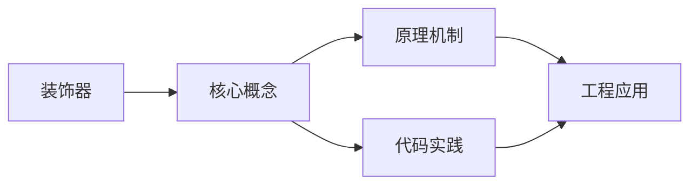
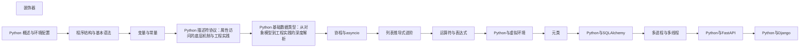

## 1. 学习目标（Bloom 分类）

本节按照布鲁姆教育目标分类学组织学习路径。本文主题为《装饰器》，属于 Python 模块，读者可以根据自身阶段选择阅读深度。

记忆层面：能够准确复述本文的核心概念、术语与基本语法或操作步骤，并能够在提问或检索时快速定位对应知识点。例如能够说出 Python 的动态类型、缩进语法与解释执行等基本特征。

理解层面：能够用自己的语言解释核心原理与工作机制，说明概念之间的因果关系，而不是机械记忆结论。例如能够解释解释器与编译器的差异，以及 GIL 对并发的影响。

应用层面：能够在真实项目或练习场景中运用本文知识解决具体问题，写出正确且可维护的实现。例如能够编写函数、类与标准库调用的完整脚本。

分析层面：能够拆解复杂问题，比较本文主题与相邻概念的异同，识别边界条件与例外情况。例如能够比较 Python 与 Java、Go 在类型系统与并发模型上的差异。

评价层面：能够根据约束条件（性能、可读性、安全、成本）评价不同方案的优劣，做出有依据的技术决策。例如能够评估不同实现方案（脚本、服务、库）的适用场景。

创造层面：能够把本文知识与其他模块知识组合，设计出新的解决方案或可复用的工程模式。例如能够组合标准库与第三方包设计完整的自动化工具。

通过本节学习，读者应当能够把《装饰器》纳入自己的知识网络，并与 Python 模块的其他主题（数据类型、函数、模块、异常、并发）建立关联。

## 2. 历史动机与发展脉络

《装饰器》是 Python 领域的重要主题。要真正理解它，需要先了解它解决的问题与演进过程。

Python 由 Guido van Rossum 于 1991 年首次发布，设计哲学强调代码可读性与开发效率，核心思想记录在《Python 之禅》（PEP 20）中：优美优于丑陋、明确优于隐晦、简单优于复杂。
Python 2 与 Python 3 的分裂期（2008-2020）是语言史上最重要的兼容性事件：Python 3 修复了字符串编码、整数除法等长期问题，但破坏性变更导致迁移缓慢；2020 年 1 月 Python 2 停止官方维护，社区全面转向 Python 3。
Python 3.9 至 3.13 的演进带来了类型提示增强（PEP 604 的 X | Y 语法、PEP 695 的泛型语法）、性能优化（3.11 的 faster-calls 与自适应解释器）以及异步生态的成熟（asyncio、FastAPI、httpx）。
Python 的应用版图从脚本自动化扩展到 Web 后端（Django、FastAPI）、数据科学（NumPy、Pandas、Matplotlib）、机器学习（PyTorch、scikit-learn）、运维自动化（Ansible）与科学计算，是当今最通用的编程语言之一。

回到本文主题：装饰器 的提出与成熟，正是上述技术背景下的必然产物。早期实现往往以简单可用为目标，随着工程规模扩大，社区逐渐沉淀出标准做法与最佳实践；理解这一脉络，可以帮助读者判断“为什么文档中的推荐写法是现在这个样子”，也能在遇到历史遗留代码时准确识别其设计年代与取舍。

对于初学者，理解 Python 的“电池内置”（标准库丰富）与“胶水语言”（易于调用 C/C++/Rust 扩展）两大特性，是判断其适用场景的基础。

## 3. 形式化定义与核心概念精讲

本节把《装饰器》涉及的核心概念以“定义 + 讲解”的形式展开。读者应把定义当作工具，把讲解当作理解路径；两者结合才能形成可迁移的知识。

变量与动态类型：Python 变量是对象的引用，类型属于对象而非变量；`isinstance()` 与 `type()` 用于运行时检查，类型注解（PEP 484）提供静态检查能力但不改变运行时行为。
缩进即语法：Python 用缩进表达代码块层次，避免了花括号噪声，也强制了代码排版一致性；同一代码块必须使用一致的空格数（官方推荐 4 空格）。
函数是一等公民：函数可以赋值、传参、返回，配合 lambda、装饰器与闭包，构成函数式编程能力的基础。
模块与包：每个 `.py` 文件是模块，目录加 `__init__.py` 是包；`import` 机制支持绝对导入、相对导入与命名空间包。
异常处理：`try/except/finally` 与 `raise` 构成错误传播体系；`with` 语句通过上下文管理器（`__enter__/__exit__`）管理资源生命周期。

### 3.1 原文章节逐一精讲

原文档把主题拆分为 21 个小节，下面按顺序给出每一节的导读讲解，随后保留原文细节供精读。

#### 原文精读（完整保留）

# 装饰器

> **符号约定**：`< >` 必填参数 | `[ ]` 可选参数

---

#### 1. 装饰器基础

##### 1.1 什么是装饰器

装饰器是一种高级Python语法，用于在不修改原函数代码的情况下，动态地给函数增加功能。装饰器本质上是一个高阶函数，接收一个函数作为参数，返回一个新函数。

```python
# 装饰器的本质
def my_decorator(func):
    def wrapper(*args, **kwargs):
        # 前置增强
        print("Before function call")
        # 调用原函数
        result = func(*args, **kwargs)
        # 后置增强
        print("After function call")
        return result
    return wrapper

# 应用装饰器
@my_decorator
def say_hello(name):
    print(f"Hello, {name}!")

# 等价于: say_hello = my_decorator(say_hello)
say_hello("Alice")
# Before function call
# Hello, Alice!
# After function call
```

##### 1.2 装饰器的执行时机

```python
def decorator(func):
    print(f"装饰器被调用，装饰函数: {func.__name__}")
    def wrapper(*args, **kwargs):
        print(f"wrapper被调用")
        return func(*args, **kwargs)
    return wrapper

@decorator  # 此时就执行了decorator函数，而非调用greet时
def greet():
    print("Hello!")

# 输出: 装饰器被调用，装饰函数: greet
# 此时greet已经被替换为wrapper

greet()
# 输出: wrapper被调用
#        Hello!
```

#### 2. 函数装饰器

##### 2.1 基本装饰器模式

```python
import time
import functools

# 计时装饰器
def timer(func):
    @functools.wraps(func)  # 保留原函数的元信息
    def wrapper(*args, **kwargs):
        start = time.perf_counter()
        result = func(*args, **kwargs)
        end = time.perf_counter()
        print(f"{func.__name__} 耗时: {end - start:.4f}秒")
        return result
    return wrapper

@timer
def slow_function():
    time.sleep(1)
    return "Done"

result = slow_function()  # slow_function 耗时: 1.0012秒
print(result)  # Done
```

##### 2.2 functools.wraps 的重要性

```python
import functools

# 不使用wraps：原函数信息丢失
def bad_decorator(func):
    def wrapper(*args, **kwargs):
        return func(*args, **kwargs)
    return wrapper

@bad_decorator
def my_function():
    """这是my_function的文档字符串"""
    pass

print(my_function.__name__)   # "wrapper"（不是"my_function"！）
print(my_function.__doc__)    # None（文档丢失！）

# 使用wraps：保留原函数信息
def good_decorator(func):
    @functools.wraps(func)
    def wrapper(*args, **kwargs):
        return func(*args, **kwargs)
    return wrapper

@good_decorator
def my_function2():
    """这是my_function2的文档字符串"""
    pass

print(my_function2.__name__)  # "my_function2"
print(my_function2.__doc__)   # "这是my_function2的文档字符串"
```

##### 2.3 带参数的装饰器

```python
import functools

# 三层嵌套：最外层接收装饰器参数
def retry(max_attempts=3, delay=1):
    def decorator(func):
        @functools.wraps(func)
        def wrapper(*args, **kwargs):
            for attempt in range(1, max_attempts + 1):
                try:
                    return func(*args, **kwargs)
                except Exception as e:
                    if attempt == max_attempts:
                        raise
                    print(f"第{attempt}次尝试失败: {e}，{delay}秒后重试...")
                    time.sleep(delay)
        return wrapper
    return decorator

@retry(max_attempts=3, delay=2)
def unstable_api_call():
    import random
    if random.random() < 0.7:
        raise ConnectionError("API不可用")
    return "Success"

# 使用
result = unstable_api_call()
```

##### 2.4 多个装饰器叠加

```python
import functools

def bold(func):
    @functools.wraps(func)
    def wrapper(*args, **kwargs):
        return f"<b>{func(*args, **kwargs)}</b>"
    return wrapper

def italic(func):
    @functools.wraps(func)
    def wrapper(*args, **kwargs):
        return f"<i>{func(*args, **kwargs)}</i>"
    return wrapper

# 装饰器从下到上执行（靠近函数的先执行）
@bold      # 第二步：加粗
@italic    # 第一步：斜体
def greet(name):
    return f"Hello, {name}"

print(greet("Alice"))  # <b><i>Hello, Alice</i></b>

# 等价于: greet = bold(italic(greet))
```

#### 3. 类装饰器

##### 3.1 用类作为装饰器

```python
import functools

class CountCalls:
    """统计函数调用次数的类装饰器"""

    def __init__(self, func):
        functools.update_wrapper(self, func)
        self.func = func
        self.count = 0

    def __call__(self, *args, **kwargs):
        self.count += 1
        print(f"{self.func.__name__} 已被调用 {self.count} 次")
        return self.func(*args, **kwargs)

@CountCalls
def say_hi(name):
    return f"Hi, {name}!"

say_hi("Alice")  # say_hi 已被调用 1 次
say_hi("Bob")    # say_hi 已被调用 2 次
print(say_hi.count)  # 2
```

##### 3.2 装饰类

```python
def add_repr(cls):
    """为类自动添加__repr__方法"""
    def __repr__(self):
        attrs = ", ".join(f"{k}={v!r}" for k, v in self.__dict__.items())
        return f"{cls.__name__}({attrs})"

    cls.__repr__ = __repr__
    return cls

def add_eq(cls):
    """为类自动添加__eq__方法（基于所有属性）"""
    def __eq__(self, other):
        if not isinstance(other, cls):
            return False
        return self.__dict__ == other.__dict__

    cls.__eq__ = __eq__
    return cls

@add_repr
@add_eq
class Point:
    def __init__(self, x, y):
        self.x = x
        self.y = y

p1 = Point(1, 2)
p2 = Point(1, 2)
print(p1)          # Point(x=1, y=2)
print(p1 == p2)    # True
```

#### 4. 实用装饰器模式

##### 4.1 缓存装饰器

```python
import functools

def memoize(func):
    """带TTL的缓存装饰器"""
    cache = {}

    @functools.wraps(func)
    def wrapper(*args):
        if args in cache:
            return cache[args]
        result = func(*args)
        cache[args] = result
        return result

    wrapper.cache = cache
    wrapper.cache_clear = lambda: cache.clear()
    return wrapper

@memoize
def fibonacci(n):
    if n <= 1:
        return n
    return fibonacci(n - 1) + fibonacci(n - 2)

print(fibonacci(100))  # 瞬间完成（缓存加速）

# Python内置: functools.lru_cache
@functools.lru_cache(maxsize=128)
def expensive_compute(n):
    print(f"Computing {n}...")
    return n * n

expensive_compute(5)   # Computing 5... → 25
expensive_compute(5)   # 25（缓存命中）
print(expensive_compute.cache_info())  # CacheInfo(hits=1, misses=1, ...)
```

##### 4.2 类型检查装饰器

```python
import functools

def typecheck(**expected_types):
    """运行时类型检查装饰器"""
    def decorator(func):
        @functools.wraps(func)
        def wrapper(*args, **kwargs):
            # 检查位置参数
            import inspect
            sig = inspect.signature(func)
            bound = sig.bind(*args, **kwargs)
            bound.apply_defaults()

            for param_name, expected_type in expected_types.items():
                if param_name in bound.arguments:
                    value = bound.arguments[param_name]
                    if not isinstance(value, expected_type):
                        raise TypeError(
                            f"参数 '{param_name}' 期望类型 {expected_type.__name__}，"
                            f"实际类型 {type(value).__name__}"
                        )

            return func(*args, **kwargs)
        return wrapper
    return decorator

@typecheck(name=str, age=int)
def create_user(name, age):
    return f"User: {name}, Age: {age}"

print(create_user("Alice", 25))   # 正常
# create_user("Alice", "25")      # TypeError
```

##### 4.3 单例模式装饰器

```python
import functools

def singleton(cls):
    """单例模式装饰器"""
    instances = {}

    @functools.wraps(cls)
    def get_instance(*args, **kwargs):
        if cls not in instances:
            instances[cls] = cls(*args, **kwargs)
        return instances[cls]

    return get_instance

@singleton
class DatabaseConnection:
    def __init__(self, host="localhost"):
        self.host = host
        print(f"连接到数据库: {host}")

db1 = DatabaseConnection("server1")  # 连接到数据库: server1
db2 = DatabaseConnection("server2")  # 已有实例，不再创建
print(db1 is db2)  # True
```

##### 4.4 权限验证装饰器

```python
import functools

def require_role(*roles):
    """权限验证装饰器"""
    def decorator(func):
        @functools.wraps(func)
        def wrapper(user, *args, **kwargs):
            if user.role not in roles:
                raise PermissionError(
                    f"用户 '{user.name}' 角色 '{user.role}' 无权执行此操作，"
                    f"需要角色: {', '.join(roles)}"
                )
            return func(user, *args, **kwargs)
        return wrapper
    return decorator

class User:
    def __init__(self, name, role):
        self.name = name
        self.role = role

@require_role("admin", "moderator")
def delete_post(user, post_id):
    return f"帖子 {post_id} 已删除"

admin = User("Alice", "admin")
guest = User("Bob", "guest")

print(delete_post(admin, 1))  # "帖子 1 已删除"
# delete_post(guest, 1)       # PermissionError
```

#### 5. 常见问题与解决方案

##### 5.1 装饰器导致函数签名丢失

```python
# 问题：装饰后函数签名变为wrapper的签名
import inspect

def my_decorator(func):
    def wrapper(*args, **kwargs):
        return func(*args, **kwargs)
    return wrapper

@my_decorator
def greet(name: str, age: int = 25) -> str:
    return f"Hello, {name}!"

print(inspect.signature(greet))  # (*args, **kwargs) 而非 (name, age)

# 解决方案：使用functools.wraps
import functools

def good_decorator(func):
    @functools.wraps(func)
    def wrapper(*args, **kwargs):
        return func(*args, **kwargs)
    return wrapper

@good_decorator
def greet2(name: str, age: int = 25) -> str:
    return f"Hello, {name}!"

print(inspect.signature(greet2))  # (name: str, age: int = 25) -> str
```

##### 5.2 装饰器与类方法

```python
class MyClass:
    # 实例方法装饰器：第一个参数是self
    @timer
    def instance_method(self):
        time.sleep(0.1)

    # 类方法装饰器：第一个参数是cls
    @classmethod
    @timer
    def class_method(cls):
        time.sleep(0.1)

    # 静态方法装饰器
    @staticmethod
    @timer
    def static_method():
        time.sleep(0.1)

    # 注意装饰器顺序：@classmethod/@staticmethod 应在最外层
```

#### 6. 总结与最佳实践

##### 6.1 装饰器选择指南

| 场景         | 推荐方式            |
| :----------- | :------------------ |
| 简单增强     | 函数装饰器          |
| 需要维护状态 | 类装饰器            |
| 需要参数     | 三层嵌套装饰器      |
| 缓存         | functools.lru_cache |
| 方法装饰     | 注意self/cls参数    |

##### 6.2 最佳实践

1. **始终使用 functools.wraps**：保留原函数元信息
2. **保持装饰器简单**：一个装饰器只做一件事
3. **通用装饰器用 \*args, **kwargs\*\*：兼容各种函数签名
4. **提供撤销机制**：如 `cache_clear()` 方法
5. **文档化装饰器行为**：说明装饰器对函数的影响
6. **避免过度使用**：装饰器增加调试难度，简单逻辑直接写在函数中
#### 基本装饰器

**换行写法：定义基本装饰器**
`def <装饰器名>(func):`
`    def wrapper(*args, **kwargs):`
`        <前置处理>`
`        result = func(*args, **kwargs)`
`        <后置处理>`
`        return result`
`    return wrapper`

```python
# 定义基本装饰器
def my_decorator(func):
    def wrapper(*args, **kwargs):
        print("函数执行前")
        result = func(*args, **kwargs)
        print("函数执行后")
        return result
    return wrapper
```

---

**基本写法：使用装饰器**
`@<装饰器名>`
`def <函数名>(<参数>): <语句>`

```python
# 使用装饰器装饰函数
@my_decorator
def say_hello(name):
    print(f"Hello, {name}!")
```

---

**基本写法：手动应用装饰器**
`<函数> = <装饰器>(<函数>)`

```python
# 手动应用装饰器
def say_hello(name):
    print(f"Hello, {name}!")

say_hello = my_decorator(say_hello)
```

---

#### 带参数的装饰器

**换行写法：定义带参数的装饰器**
`def <装饰器名>(<参数>):`
`    def decorator(func):`
`        def wrapper(*args, **kwargs): <语句>`
`        return wrapper`
`    return decorator`

```python
# 定义带参数的装饰器
def repeat(times):
    def decorator(func):
        def wrapper(*args, **kwargs):
            for _ in range(times):
                result = func(*args, **kwargs)
            return result
        return wrapper
    return decorator
```

---

**基本写法：使用带参数的装饰器**
`@<装饰器名>(<参数>)`
`def <函数名>(<参数>): <语句>`

```python
# 使用带参数的装饰器
@repeat(times=3)
def greet(name):
    print(f"Hello, {name}!")
```

---

#### functools.wraps 保留元信息

**换行写法：使用 @wraps 保留元信息**
`from functools import wraps`
`def <装饰器名>(func):`
`    @wraps(func)`
`    def wrapper(*args, **kwargs): <语句>`
`    return wrapper`

```python
# 使用 @wraps 保留原函数的元信息
from functools import wraps

def my_decorator(func):
    @wraps(func)
    def wrapper(*args, **kwargs):
        print(f"调用 {func.__name__}")
        return func(*args, **kwargs)
    return wrapper
```

---

#### 类装饰器

**换行写法：使用类作为装饰器**
`class <装饰器类>:`
`    def __init__(self, func): self.func = func`
`    def __call__(self, *args, **kwargs): <语句>`

```python
# 使用类作为装饰器
class CountCalls:
    def __init__(self, func):
        self.func = func
        self.count = 0

    def __call__(self, *args, **kwargs):
        self.count += 1
        print(f"调用次数: {self.count}")
        return self.func(*args, **kwargs)
```

---

**基本写法：使用类装饰器**
`@<装饰器类>`
`def <函数名>(<参数>): <语句>`

```python
# 使用类装饰器
@CountCalls
def say_hello():
    print("Hello!")
```

---

#### 带参数的类装饰器

**换行写法：定义带参数的类装饰器**
`class <装饰器类>:`
`    def __init__(self, <参数>): <语句>`
`    def __call__(self, func): <返回包装函数>`

```python
# 定义带参数的类装饰器
class Repeat:
    def __init__(self, times):
        self.times = times

    def __call__(self, func):
        def wrapper(*args, **kwargs):
            for _ in range(self.times):
                result = func(*args, **kwargs)
            return result
        return wrapper
```

---

#### 方法装饰器

**换行写法：装饰类的方法**
`class <类名>:`
`    @<装饰器名>`
`    def <方法名>(self, <参数>): <语句>`

```python
# 装饰类的方法
class MyClass:
    @my_decorator
    def my_method(self):
        print("方法执行")
```

---

#### 属性装饰器

**基本写法：使用 @property 定义属性**
`@property`
`def <属性名>(self): return <值>`

```python
# 使用 @property 定义只读属性
class Circle:
    def __init__(self, radius):
        self._radius = radius

    @property
    def area(self):
        return 3.14159 * self._radius ** 2
```

---

**基本写法：使用 @staticmethod 定义静态方法**
`@staticmethod`
`def <方法名>(<参数>): <语句>`

```python
# 使用 @staticmethod 定义静态方法
class MathHelper:
    @staticmethod
    def add(a, b):
        return a + b
```

---

**基本写法：使用 @classmethod 定义类方法**
`@classmethod`
`def <方法名>(cls, <参数>): <语句>`

```python
# 使用 @classmethod 定义类方法
class Counter:
    count = 0

    @classmethod
    def increment(cls):
        cls.count += 1
        return cls.count
```

---

#### 多个装饰器叠加

**换行写法：叠加多个装饰器**
`@<装饰器1>`
`@<装饰器2>`
`def <函数名>(<参数>): <语句>`

```python
# 叠加多个装饰器（从下往上执行）
@decorator1
@decorator2
def my_function():
    print("Hello")
```

---

#### 常用内置装饰器

**基本写法：使用 @staticmethod**
`@staticmethod`
`def <方法名>(<参数>): <语句>`

```python
# 使用 @staticmethod
class MyClass:
    @staticmethod
    def static_method():
        return "静态方法"
```

---

**基本写法：使用 @classmethod**
`@classmethod`
`def <方法名>(cls, <参数>): <语句>`

```python
# 使用 @classmethod
class MyClass:
    @classmethod
    def class_method(cls):
        return "类方法"
```

---

**基本写法：使用 @property**
`@property`
`def <属性名>(self): <语句>`

```python
# 使用 @property
class MyClass:
    @property
    def value(self):
        return self._value
```

---

**基本写法：使用 @abstractmethod**
`@abstractmethod`
`def <方法名>(self): <语句>`

```python
# 使用 @abstractmethod 定义抽象方法
from abc import ABC, abstractmethod

class Animal(ABC):
    @abstractmethod
    def speak(self):
        pass
```

---

**基本写法：使用 @dataclass**
`@dataclass`
`class <类名>: <类体>`

```python
# 使用 @dataclass
from dataclasses import dataclass

@dataclass
class Point:
    x: float
    y: float
```

---

**基本写法：使用 @lru_cache**
`@lru_cache(maxsize=<n>)`
`def <函数名>(<参数>): <语句>`

```python
# 使用 @lru_cache 缓存函数结果
from functools import lru_cache

@lru_cache(maxsize=128)
def fibonacci(n):
    if n < 2:
        return n
    return fibonacci(n - 1) + fibonacci(n - 2)
```

---

#### 装饰器实战

**换行写法：计时装饰器**
`def <装饰器名>(func):`
`    @wraps(func)`
`    def wrapper(*args, **kwargs):`
`        start = time.time()`
`        result = func(*args, **kwargs)`
`        end = time.time()`
`        print(f"耗时: {end - start}")`
`        return result`
`    return wrapper`

```python
# 计时装饰器
import time
from functools import wraps

def timer(func):
    @wraps(func)
    def wrapper(*args, **kwargs):
        start = time.time()
        result = func(*args, **kwargs)
        end = time.time()
        print(f"{func.__name__} 耗时: {end - start:.4f} 秒")
        return result
    return wrapper
```

---

**换行写法：日志装饰器**
`def <装饰器名>(func):`
`    @wraps(func)`
`    def wrapper(*args, **kwargs):`
`        print(f"调用 {func.__name__}, 参数: {args}, {kwargs}")`
`        result = func(*args, **kwargs)`
`        print(f"返回: {result}")`
`        return result`
`    return wrapper`

```python
# 日志装饰器
from functools import wraps

def logger(func):
    @wraps(func)
    def wrapper(*args, **kwargs):
        print(f"调用 {func.__name__}, 参数: {args}, {kwargs}")
        result = func(*args, **kwargs)
        print(f"返回: {result}")
        return result
    return wrapper
```

---

**换行写法：权限验证装饰器**
`def <装饰器名>(<权限参数>):`
`    def decorator(func):`
`        @wraps(func)`
`        def wrapper(*args, **kwargs):`
`            if not <检查权限>: raise <异常>`
`            return func(*args, **kwargs)`
`        return wrapper`
`    return decorator`

```python
# 权限验证装饰器
from functools import wraps

def require_role(role):
    def decorator(func):
        @wraps(func)
        def wrapper(*args, **kwargs):
            if not has_role(role):
                raise PermissionError(f"需要 {role} 权限")
            return func(*args, **kwargs)
        return wrapper
    return decorator
```

---

**换行写法：重试装饰器**
`def <装饰器名>(max_retries=<n>):`
`    def decorator(func):`
`        @wraps(func)`
`        def wrapper(*args, **kwargs):`
`            for attempt in range(max_retries):`
`                try: return func(*args, **kwargs)`
`                except <异常>: <处理>`
`        return wrapper`
`    return decorator`

```python
# 重试装饰器
import time
from functools import wraps

def retry(max_retries=3, delay=1):
    def decorator(func):
        @wraps(func)
        def wrapper(*args, **kwargs):
            for attempt in range(max_retries):
                try:
                    return func(*args, **kwargs)
                except Exception as e:
                    if attempt == max_retries - 1:
                        raise
                    time.sleep(delay)
        return wrapper
    return decorator
```

---

**换行写法：缓存装饰器**
`def <装饰器名>(func):`
`    cache = {}`
`    @wraps(func)`
`    def wrapper(*args):`
`        if args not in cache: cache[args] = func(*args)`
`        return cache[args]`
`    return wrapper`

```python
# 自定义缓存装饰器
from functools import wraps

def memoize(func):
    cache = {}
    @wraps(func)
    def wrapper(*args):
        if args not in cache:
            cache[args] = func(*args)
        return cache[args]
    return wrapper
```

---

#### 装饰器类实战

**换行写法：使用类实现计数装饰器**
`class <装饰器类>:`
`    def __init__(self, func):`
`        self.func = func`
`        self.count = 0`
`    def __call__(self, *args, **kwargs):`
`        self.count += 1`
`        return self.func(*args, **kwargs)`

```python
# 使用类实现计数装饰器
class CountCalls:
    def __init__(self, func):
        self.func = func
        self.count = 0

    def __call__(self, *args, **kwargs):
        self.count += 1
        print(f"调用次数: {self.count}")
        return self.func(*args, **kwargs)
```

---

#### 装饰器堆栈

**换行写法：多个装饰器组合使用**
`@<装饰器1>`
`@<装饰器2>`
`@<装饰器3>`
`def <函数名>(<参数>): <语句>`

```python
# 多个装饰器组合使用
@timer
@logger
@retry(max_retries=3)
def fetch_data(url):
    print(f"从 {url} 获取数据")
    return "data"
```

---

#### 装饰器与元信息

**基本写法：访问装饰后的函数名**
`<函数>.__name__`

```python
# 访问装饰后的函数名（使用 @wraps 保留原信息）
@my_decorator
def my_function():
    pass

print(my_function.__name__)
```

---

**基本写法：访问装饰后的函数文档**
`<函数>.__doc__`

```python
# 访问装饰后的函数文档
@my_decorator
def my_function():
    """这是函数文档"""
    pass

print(my_function.__doc__)
```

---

#### functools 模块工具

**基本写法：使用 @wraps**
`@wraps(<原函数>)`

```python
# 使用 @wraps 保留原函数元信息
from functools import wraps

def my_decorator(func):
    @wraps(func)
    def wrapper(*args, **kwargs):
        return func(*args, **kwargs)
    return wrapper
```

---

**基本写法：使用 @lru_cache**
`@lru_cache(maxsize=<n>)`

```python
# 使用 @lru_cache 实现缓存
from functools import lru_cache

@lru_cache(maxsize=128)
def expensive_function(n):
    return sum(i * i for i in range(n))
```

---

**基本写法：使用 @cache**
`@cache`

```python
# 使用 @cache 无限缓存
from functools import cache

@cache
def fibonacci(n):
    if n < 2:
        return n
    return fibonacci(n - 1) + fibonacci(n - 2)
```

---

**基本写法：使用 @cached_property**
`@cached_property`
`def <属性名>(self): <语句>`

```python
# 使用 @cached_property 缓存属性计算结果
from functools import cached_property

class Circle:
    def __init__(self, radius):
        self.radius = radius

    @cached_property
    def area(self):
        return 3.14159 * self.radius ** 2
```

---

**基本写法：使用 @singledispatch**
`@singledispatch`
`def <函数名>(<参数>): <语句>`

```python
# 使用 @singledispatch 实现函数重载
from functools import singledispatch

@singledispatch
def process(data):
    raise TypeError(f"不支持的类型: {type(data)}")

@process.register
def _(data: int):
    return f"处理整数: {data}"
```

---

**基本写法：注册 singledispatch 处理器**
`@<函数>.register`
`def _(<参数>: <类型>): <语句>`

```python
# 注册 singledispatch 的字符串处理器
@process.register
def _(data: str):
    return f"处理字符串: {data}"
```

---

#### 装饰器与类型注解

**换行写法：带类型注解的装饰器**
`from typing import Callable, TypeVar`
`T = TypeVar("T")`
`def <装饰器名>(func: Callable[..., T]) -> Callable[..., T]:`
`    def wrapper(*args, **kwargs) -> T: return func(*args, **kwargs)`
`    return wrapper`

```python
# 带类型注解的装饰器
from typing import Callable, TypeVar, Any
from functools import wraps

T = TypeVar("T")

def my_decorator(func: Callable[..., T]) -> Callable[..., T]:
    @wraps(func)
    def wrapper(*args: Any, **kwargs: Any) -> T:
        print("装饰器执行")
        return func(*args, **kwargs)
    return wrapper
```


### 3.2 概念关系图

下面用 Mermaid 图表达本文核心概念之间的关系，帮助读者建立整体图景：



图中展示的是本文知识的结构化关系：核心概念是入口，原理机制解释“为什么”，代码实践演示“怎么做”，工程应用回答“何时用”。读者学习时可以把每个小节的内容挂接到对应节点上。

## 4. 理论推导与原理解析

本节深入《装饰器》背后的原理。理论部分不求面面俱到，而是聚焦“能解释现象、能指导实践”的关键推导。

解释执行与字节码：CPython 先把源码编译为字节码（.pyc），再由虚拟机逐条执行。字节码是平台无关的中间表示，因此 Python 程序可以跨平台运行，但执行速度低于编译型语言；性能敏感路径可用 C 扩展或 Cython 加速。
GIL（全局解释器锁）：CPython 的 GIL 保证同一时刻只有一个线程执行字节码，简化了内存管理，但限制了 CPU 密集型多线程并行；I/O 密集型任务通过线程切换获得并发，CPU 密集型任务应使用多进程（multiprocessing）或异步。
引用计数与垃圾回收：Python 对象通过引用计数管理生命周期，循环引用由分代垃圾回收器（gc 模块）处理。理解这一模型可以解释“为什么局部变量及时释放内存”“为什么大对象需要 del 或作用域退出”。
鸭子类型与协议：Python 依赖行为协议而非继承体系，例如实现 `__iter__` 与 `__next__` 的对象即可用于 `for` 循环。这一设计带来灵活性的同时，也要求开发者编写清晰的接口文档与类型注解。

需要强调的是，理论推导与工程实践之间存在翻译层：理论给出的是理想化模型与边界条件，工程代码则必须处理真实环境中的例外。读者在学习时应先掌握理论的“标准情形”，再通过陷阱章节了解“非标准情形”。

## 5. 代码示例与逐行讲解

本节把原文中的代码示例系统整理，并为每个示例补充用途说明与讲解。读者不应只浏览代码，而应逐段对照讲解理解设计意图。

### 5.1 示例：1.1 什么是装饰器

该示例来自原文《1.1 什么是装饰器》小节，用于演示装饰器相关操作。阅读时请先看代码结构，再看其后的讲解。

```python
# 装饰器的本质
def my_decorator(func):
    def wrapper(*args, **kwargs):
        # 前置增强
        print("Before function call")
        # 调用原函数
        result = func(*args, **kwargs)
        # 后置增强
        print("After function call")
        return result
    return wrapper

# 应用装饰器
@my_decorator
def say_hello(name):
    print(f"Hello, {name}!")

# 等价于: say_hello = my_decorator(say_hello)
say_hello("Alice")
# Before function call
# Hello, Alice!
# After function call
```

讲解：这段代码演示了本节核心知识点。代码中的关键操作可以归纳为三步：准备（定义或初始化）、执行（核心逻辑）、收尾（释放资源或返回结果）。实际项目中，这三步往往被封装为函数或类，以提升复用性与可测试性。

关键点分析：

该示例共 20 行有效代码，包含 3 类关键结构（def、function、return）。其中：

- 入口与初始化部分负责建立上下文，对应实际项目中的启动或装配逻辑；
- 核心逻辑部分体现本文主题的主要操作，是阅读时最需要对照讲解理解的部分；
- 输出或返回部分把结果交给调用方，注意其类型与边界条件。

进阶思考路径：先尝试修改参数观察行为变化，再把示例中的模式迁移到自己的项目中；每次修改都记录预期与实测差异，这是把示例转化为能力的最快方式。

### 5.2 示例：1.2 装饰器的执行时机

该示例来自原文《1.2 装饰器的执行时机》小节，用于演示装饰器相关操作。阅读时请先看代码结构，再看其后的讲解。

```python
def decorator(func):
    print(f"装饰器被调用，装饰函数: {func.__name__}")
    def wrapper(*args, **kwargs):
        print(f"wrapper被调用")
        return func(*args, **kwargs)
    return wrapper

@decorator  # 此时就执行了decorator函数，而非调用greet时
def greet():
    print("Hello!")

# 输出: 装饰器被调用，装饰函数: greet
# 此时greet已经被替换为wrapper

greet()
# 输出: wrapper被调用
#        Hello!
```

讲解：这段代码演示了本节核心知识点。代码中的关键操作可以归纳为三步：准备（定义或初始化）、执行（核心逻辑）、收尾（释放资源或返回结果）。实际项目中，这三步往往被封装为函数或类，以提升复用性与可测试性。

关键点分析：

该示例共 14 行有效代码，包含 2 类关键结构（def、return）。其中：

- 入口与初始化部分负责建立上下文，对应实际项目中的启动或装配逻辑；
- 核心逻辑部分体现本文主题的主要操作，是阅读时最需要对照讲解理解的部分；
- 输出或返回部分把结果交给调用方，注意其类型与边界条件。

进阶思考路径：先尝试修改参数观察行为变化，再把示例中的模式迁移到自己的项目中；每次修改都记录预期与实测差异，这是把示例转化为能力的最快方式。

### 5.3 示例：2.1 基本装饰器模式

该示例来自原文《2.1 基本装饰器模式》小节，用于演示装饰器相关操作。阅读时请先看代码结构，再看其后的讲解。

```python
import time
import functools

# 计时装饰器
def timer(func):
    @functools.wraps(func)  # 保留原函数的元信息
    def wrapper(*args, **kwargs):
        start = time.perf_counter()
        result = func(*args, **kwargs)
        end = time.perf_counter()
        print(f"{func.__name__} 耗时: {end - start:.4f}秒")
        return result
    return wrapper

@timer
def slow_function():
    time.sleep(1)
    return "Done"

result = slow_function()  # slow_function 耗时: 1.0012秒
print(result)  # Done
```

讲解：这段代码演示了本节核心知识点。代码中的关键操作可以归纳为三步：准备（定义或初始化）、执行（核心逻辑）、收尾（释放资源或返回结果）。实际项目中，这三步往往被封装为函数或类，以提升复用性与可测试性。

关键点分析：

该示例共 18 行有效代码，包含 4 类关键结构（def、function、import、return）。其中：

- 入口与初始化部分负责建立上下文，对应实际项目中的启动或装配逻辑；
- 核心逻辑部分体现本文主题的主要操作，是阅读时最需要对照讲解理解的部分；
- 输出或返回部分把结果交给调用方，注意其类型与边界条件。

进阶思考路径：先尝试修改参数观察行为变化，再把示例中的模式迁移到自己的项目中；每次修改都记录预期与实测差异，这是把示例转化为能力的最快方式。

### 5.4 示例：2.2 functools.wraps 的重要性

该示例来自原文《2.2 functools.wraps 的重要性》小节，用于演示装饰器相关操作。阅读时请先看代码结构，再看其后的讲解。

```python
import functools

# 不使用wraps：原函数信息丢失
def bad_decorator(func):
    def wrapper(*args, **kwargs):
        return func(*args, **kwargs)
    return wrapper

@bad_decorator
def my_function():
    """这是my_function的文档字符串"""
    pass

print(my_function.__name__)   # "wrapper"（不是"my_function"！）
print(my_function.__doc__)    # None（文档丢失！）

# 使用wraps：保留原函数信息
def good_decorator(func):
    @functools.wraps(func)
    def wrapper(*args, **kwargs):
        return func(*args, **kwargs)
    return wrapper

@good_decorator
def my_function2():
    """这是my_function2的文档字符串"""
    pass

print(my_function2.__name__)  # "my_function2"
print(my_function2.__doc__)   # "这是my_function2的文档字符串"
```

讲解：这段代码演示了本节核心知识点。代码中的关键操作可以归纳为三步：准备（定义或初始化）、执行（核心逻辑）、收尾（释放资源或返回结果）。实际项目中，这三步往往被封装为函数或类，以提升复用性与可测试性。

关键点分析：

该示例共 24 行有效代码，包含 4 类关键结构（def、function、import、return）。其中：

- 入口与初始化部分负责建立上下文，对应实际项目中的启动或装配逻辑；
- 核心逻辑部分体现本文主题的主要操作，是阅读时最需要对照讲解理解的部分；
- 输出或返回部分把结果交给调用方，注意其类型与边界条件。

进阶思考路径：先尝试修改参数观察行为变化，再把示例中的模式迁移到自己的项目中；每次修改都记录预期与实测差异，这是把示例转化为能力的最快方式。

### 5.5 示例：2.3 带参数的装饰器

该示例来自原文《2.3 带参数的装饰器》小节，用于演示装饰器相关操作。阅读时请先看代码结构，再看其后的讲解。

```python
import functools

# 三层嵌套：最外层接收装饰器参数
def retry(max_attempts=3, delay=1):
    def decorator(func):
        @functools.wraps(func)
        def wrapper(*args, **kwargs):
            for attempt in range(1, max_attempts + 1):
                try:
                    return func(*args, **kwargs)
                except Exception as e:
                    if attempt == max_attempts:
                        raise
                    print(f"第{attempt}次尝试失败: {e}，{delay}秒后重试...")
                    time.sleep(delay)
        return wrapper
    return decorator

@retry(max_attempts=3, delay=2)
def unstable_api_call():
    import random
    if random.random() < 0.7:
        raise ConnectionError("API不可用")
    return "Success"

# 使用
result = unstable_api_call()
```

讲解：这段代码演示了本节核心知识点。代码中的关键操作可以归纳为三步：准备（定义或初始化）、执行（核心逻辑）、收尾（释放资源或返回结果）。实际项目中，这三步往往被封装为函数或类，以提升复用性与可测试性。

关键点分析：

该示例共 24 行有效代码，包含 5 类关键结构（def、import、if、for、return）。其中：

- 入口与初始化部分负责建立上下文，对应实际项目中的启动或装配逻辑；
- 核心逻辑部分体现本文主题的主要操作，是阅读时最需要对照讲解理解的部分；
- 输出或返回部分把结果交给调用方，注意其类型与边界条件。

进阶思考路径：先尝试修改参数观察行为变化，再把示例中的模式迁移到自己的项目中；每次修改都记录预期与实测差异，这是把示例转化为能力的最快方式。

### 5.6 示例：2.4 多个装饰器叠加

该示例来自原文《2.4 多个装饰器叠加》小节，用于演示装饰器相关操作。阅读时请先看代码结构，再看其后的讲解。

```python
import functools

def bold(func):
    @functools.wraps(func)
    def wrapper(*args, **kwargs):
        return f"<b>{func(*args, **kwargs)}</b>"
    return wrapper

def italic(func):
    @functools.wraps(func)
    def wrapper(*args, **kwargs):
        return f"<i>{func(*args, **kwargs)}</i>"
    return wrapper

# 装饰器从下到上执行（靠近函数的先执行）
@bold      # 第二步：加粗
@italic    # 第一步：斜体
def greet(name):
    return f"Hello, {name}"

print(greet("Alice"))  # <b><i>Hello, Alice</i></b>

# 等价于: greet = bold(italic(greet))
```

讲解：这段代码演示了本节核心知识点。代码中的关键操作可以归纳为三步：准备（定义或初始化）、执行（核心逻辑）、收尾（释放资源或返回结果）。实际项目中，这三步往往被封装为函数或类，以提升复用性与可测试性。

关键点分析：

该示例共 18 行有效代码，包含 3 类关键结构（def、import、return）。其中：

- 入口与初始化部分负责建立上下文，对应实际项目中的启动或装配逻辑；
- 核心逻辑部分体现本文主题的主要操作，是阅读时最需要对照讲解理解的部分；
- 输出或返回部分把结果交给调用方，注意其类型与边界条件。

进阶思考路径：先尝试修改参数观察行为变化，再把示例中的模式迁移到自己的项目中；每次修改都记录预期与实测差异，这是把示例转化为能力的最快方式。

### 5.7 示例：3.1 用类作为装饰器

该示例来自原文《3.1 用类作为装饰器》小节，用于演示装饰器相关操作。阅读时请先看代码结构，再看其后的讲解。

```python
import functools

class CountCalls:
    """统计函数调用次数的类装饰器"""

    def __init__(self, func):
        functools.update_wrapper(self, func)
        self.func = func
        self.count = 0

    def __call__(self, *args, **kwargs):
        self.count += 1
        print(f"{self.func.__name__} 已被调用 {self.count} 次")
        return self.func(*args, **kwargs)

@CountCalls
def say_hi(name):
    return f"Hi, {name}!"

say_hi("Alice")  # say_hi 已被调用 1 次
say_hi("Bob")    # say_hi 已被调用 2 次
print(say_hi.count)  # 2
```

讲解：这段代码演示了本节核心知识点。代码中的关键操作可以归纳为三步：准备（定义或初始化）、执行（核心逻辑）、收尾（释放资源或返回结果）。实际项目中，这三步往往被封装为函数或类，以提升复用性与可测试性。

关键点分析：

该示例共 17 行有效代码，包含 5 类关键结构（class、def、func、import、return）。其中：

- 入口与初始化部分负责建立上下文，对应实际项目中的启动或装配逻辑；
- 核心逻辑部分体现本文主题的主要操作，是阅读时最需要对照讲解理解的部分；
- 输出或返回部分把结果交给调用方，注意其类型与边界条件。

进阶思考路径：先尝试修改参数观察行为变化，再把示例中的模式迁移到自己的项目中；每次修改都记录预期与实测差异，这是把示例转化为能力的最快方式。

### 5.8 示例：3.2 装饰类

该示例来自原文《3.2 装饰类》小节，用于演示装饰器相关操作。阅读时请先看代码结构，再看其后的讲解。

```python
def add_repr(cls):
    """为类自动添加__repr__方法"""
    def __repr__(self):
        attrs = ", ".join(f"{k}={v!r}" for k, v in self.__dict__.items())
        return f"{cls.__name__}({attrs})"

    cls.__repr__ = __repr__
    return cls

def add_eq(cls):
    """为类自动添加__eq__方法（基于所有属性）"""
    def __eq__(self, other):
        if not isinstance(other, cls):
            return False
        return self.__dict__ == other.__dict__

    cls.__eq__ = __eq__
    return cls

@add_repr
@add_eq
class Point:
    def __init__(self, x, y):
        self.x = x
        self.y = y

p1 = Point(1, 2)
p2 = Point(1, 2)
print(p1)          # Point(x=1, y=2)
print(p1 == p2)    # True
```

讲解：这段代码演示了本节核心知识点。代码中的关键操作可以归纳为三步：准备（定义或初始化）、执行（核心逻辑）、收尾（释放资源或返回结果）。实际项目中，这三步往往被封装为函数或类，以提升复用性与可测试性。

关键点分析：

该示例共 25 行有效代码，包含 5 类关键结构（class、def、if、for、return）。其中：

- 入口与初始化部分负责建立上下文，对应实际项目中的启动或装配逻辑；
- 核心逻辑部分体现本文主题的主要操作，是阅读时最需要对照讲解理解的部分；
- 输出或返回部分把结果交给调用方，注意其类型与边界条件。

进阶思考路径：先尝试修改参数观察行为变化，再把示例中的模式迁移到自己的项目中；每次修改都记录预期与实测差异，这是把示例转化为能力的最快方式。

### 5.9 示例：4.1 缓存装饰器

该示例来自原文《4.1 缓存装饰器》小节，用于演示装饰器相关操作。阅读时请先看代码结构，再看其后的讲解。

```python
import functools

def memoize(func):
    """带TTL的缓存装饰器"""
    cache = {}

    @functools.wraps(func)
    def wrapper(*args):
        if args in cache:
            return cache[args]
        result = func(*args)
        cache[args] = result
        return result

    wrapper.cache = cache
    wrapper.cache_clear = lambda: cache.clear()
    return wrapper

@memoize
def fibonacci(n):
    if n <= 1:
        return n
    return fibonacci(n - 1) + fibonacci(n - 2)

print(fibonacci(100))  # 瞬间完成（缓存加速）

# Python内置: functools.lru_cache
@functools.lru_cache(maxsize=128)
def expensive_compute(n):
    print(f"Computing {n}...")
    return n * n

expensive_compute(5)   # Computing 5... → 25
expensive_compute(5)   # 25（缓存命中）
print(expensive_compute.cache_info())  # CacheInfo(hits=1, misses=1, ...)
```

讲解：这段代码演示了本节核心知识点。代码中的关键操作可以归纳为三步：准备（定义或初始化）、执行（核心逻辑）、收尾（释放资源或返回结果）。实际项目中，这三步往往被封装为函数或类，以提升复用性与可测试性。

关键点分析：

该示例共 28 行有效代码，包含 4 类关键结构（def、import、if、return）。其中：

- 入口与初始化部分负责建立上下文，对应实际项目中的启动或装配逻辑；
- 核心逻辑部分体现本文主题的主要操作，是阅读时最需要对照讲解理解的部分；
- 输出或返回部分把结果交给调用方，注意其类型与边界条件。

进阶思考路径：先尝试修改参数观察行为变化，再把示例中的模式迁移到自己的项目中；每次修改都记录预期与实测差异，这是把示例转化为能力的最快方式。

### 5.10 示例：4.2 类型检查装饰器

该示例来自原文《4.2 类型检查装饰器》小节，用于演示装饰器相关操作。阅读时请先看代码结构，再看其后的讲解。

```python
import functools

def typecheck(**expected_types):
    """运行时类型检查装饰器"""
    def decorator(func):
        @functools.wraps(func)
        def wrapper(*args, **kwargs):
            # 检查位置参数
            import inspect
            sig = inspect.signature(func)
            bound = sig.bind(*args, **kwargs)
            bound.apply_defaults()

            for param_name, expected_type in expected_types.items():
                if param_name in bound.arguments:
                    value = bound.arguments[param_name]
                    if not isinstance(value, expected_type):
                        raise TypeError(
                            f"参数 '{param_name}' 期望类型 {expected_type.__name__}，"
                            f"实际类型 {type(value).__name__}"
                        )

            return func(*args, **kwargs)
        return wrapper
    return decorator

@typecheck(name=str, age=int)
def create_user(name, age):
    return f"User: {name}, Age: {age}"

print(create_user("Alice", 25))   # 正常
# create_user("Alice", "25")      # TypeError
```

讲解：这段代码演示了本节核心知识点。代码中的关键操作可以归纳为三步：准备（定义或初始化）、执行（核心逻辑）、收尾（释放资源或返回结果）。实际项目中，这三步往往被封装为函数或类，以提升复用性与可测试性。

关键点分析：

该示例共 27 行有效代码，包含 5 类关键结构（def、import、if、for、return）。其中：

- 入口与初始化部分负责建立上下文，对应实际项目中的启动或装配逻辑；
- 核心逻辑部分体现本文主题的主要操作，是阅读时最需要对照讲解理解的部分；
- 输出或返回部分把结果交给调用方，注意其类型与边界条件。

进阶思考路径：先尝试修改参数观察行为变化，再把示例中的模式迁移到自己的项目中；每次修改都记录预期与实测差异，这是把示例转化为能力的最快方式。

### 5.11 示例：4.3 单例模式装饰器

该示例来自原文《4.3 单例模式装饰器》小节，用于演示装饰器相关操作。阅读时请先看代码结构，再看其后的讲解。

```python
import functools

def singleton(cls):
    """单例模式装饰器"""
    instances = {}

    @functools.wraps(cls)
    def get_instance(*args, **kwargs):
        if cls not in instances:
            instances[cls] = cls(*args, **kwargs)
        return instances[cls]

    return get_instance

@singleton
class DatabaseConnection:
    def __init__(self, host="localhost"):
        self.host = host
        print(f"连接到数据库: {host}")

db1 = DatabaseConnection("server1")  # 连接到数据库: server1
db2 = DatabaseConnection("server2")  # 已有实例，不再创建
print(db1 is db2)  # True
```

讲解：这段代码演示了本节核心知识点。代码中的关键操作可以归纳为三步：准备（定义或初始化）、执行（核心逻辑）、收尾（释放资源或返回结果）。实际项目中，这三步往往被封装为函数或类，以提升复用性与可测试性。

关键点分析：

该示例共 18 行有效代码，包含 5 类关键结构（class、def、import、if、return）。其中：

- 入口与初始化部分负责建立上下文，对应实际项目中的启动或装配逻辑；
- 核心逻辑部分体现本文主题的主要操作，是阅读时最需要对照讲解理解的部分；
- 输出或返回部分把结果交给调用方，注意其类型与边界条件。

进阶思考路径：先尝试修改参数观察行为变化，再把示例中的模式迁移到自己的项目中；每次修改都记录预期与实测差异，这是把示例转化为能力的最快方式。

### 5.12 示例：4.4 权限验证装饰器

该示例来自原文《4.4 权限验证装饰器》小节，用于演示装饰器相关操作。阅读时请先看代码结构，再看其后的讲解。

```python
import functools

def require_role(*roles):
    """权限验证装饰器"""
    def decorator(func):
        @functools.wraps(func)
        def wrapper(user, *args, **kwargs):
            if user.role not in roles:
                raise PermissionError(
                    f"用户 '{user.name}' 角色 '{user.role}' 无权执行此操作，"
                    f"需要角色: {', '.join(roles)}"
                )
            return func(user, *args, **kwargs)
        return wrapper
    return decorator

class User:
    def __init__(self, name, role):
        self.name = name
        self.role = role

@require_role("admin", "moderator")
def delete_post(user, post_id):
    return f"帖子 {post_id} 已删除"

admin = User("Alice", "admin")
guest = User("Bob", "guest")

print(delete_post(admin, 1))  # "帖子 1 已删除"
# delete_post(guest, 1)       # PermissionError
```

讲解：这段代码演示了本节核心知识点。代码中的关键操作可以归纳为三步：准备（定义或初始化）、执行（核心逻辑）、收尾（释放资源或返回结果）。实际项目中，这三步往往被封装为函数或类，以提升复用性与可测试性。

关键点分析：

该示例共 25 行有效代码，包含 5 类关键结构（class、def、import、if、return）。其中：

- 入口与初始化部分负责建立上下文，对应实际项目中的启动或装配逻辑；
- 核心逻辑部分体现本文主题的主要操作，是阅读时最需要对照讲解理解的部分；
- 输出或返回部分把结果交给调用方，注意其类型与边界条件。

进阶思考路径：先尝试修改参数观察行为变化，再把示例中的模式迁移到自己的项目中；每次修改都记录预期与实测差异，这是把示例转化为能力的最快方式。

### 5.13 示例：5.1 装饰器导致函数签名丢失

该示例来自原文《5.1 装饰器导致函数签名丢失》小节，用于演示装饰器相关操作。阅读时请先看代码结构，再看其后的讲解。

```python
# 问题：装饰后函数签名变为wrapper的签名
import inspect

def my_decorator(func):
    def wrapper(*args, **kwargs):
        return func(*args, **kwargs)
    return wrapper

@my_decorator
def greet(name: str, age: int = 25) -> str:
    return f"Hello, {name}!"

print(inspect.signature(greet))  # (*args, **kwargs) 而非 (name, age)

# 解决方案：使用functools.wraps
import functools

def good_decorator(func):
    @functools.wraps(func)
    def wrapper(*args, **kwargs):
        return func(*args, **kwargs)
    return wrapper

@good_decorator
def greet2(name: str, age: int = 25) -> str:
    return f"Hello, {name}!"

print(inspect.signature(greet2))  # (name: str, age: int = 25) -> str
```

讲解：这段代码演示了本节核心知识点。代码中的关键操作可以归纳为三步：准备（定义或初始化）、执行（核心逻辑）、收尾（释放资源或返回结果）。实际项目中，这三步往往被封装为函数或类，以提升复用性与可测试性。

关键点分析：

该示例共 21 行有效代码，包含 3 类关键结构（def、import、return）。其中：

- 入口与初始化部分负责建立上下文，对应实际项目中的启动或装配逻辑；
- 核心逻辑部分体现本文主题的主要操作，是阅读时最需要对照讲解理解的部分；
- 输出或返回部分把结果交给调用方，注意其类型与边界条件。

进阶思考路径：先尝试修改参数观察行为变化，再把示例中的模式迁移到自己的项目中；每次修改都记录预期与实测差异，这是把示例转化为能力的最快方式。

### 5.14 示例：5.2 装饰器与类方法

该示例来自原文《5.2 装饰器与类方法》小节，用于演示装饰器相关操作。阅读时请先看代码结构，再看其后的讲解。

```python
class MyClass:
    # 实例方法装饰器：第一个参数是self
    @timer
    def instance_method(self):
        time.sleep(0.1)

    # 类方法装饰器：第一个参数是cls
    @classmethod
    @timer
    def class_method(cls):
        time.sleep(0.1)

    # 静态方法装饰器
    @staticmethod
    @timer
    def static_method():
        time.sleep(0.1)

    # 注意装饰器顺序：@classmethod/@staticmethod 应在最外层
```

讲解：这段代码演示了本节核心知识点。代码中的关键操作可以归纳为三步：准备（定义或初始化）、执行（核心逻辑）、收尾（释放资源或返回结果）。实际项目中，这三步往往被封装为函数或类，以提升复用性与可测试性。

关键点分析：

该示例共 16 行有效代码，包含 2 类关键结构（class、def）。其中：

- 入口与初始化部分负责建立上下文，对应实际项目中的启动或装配逻辑；
- 核心逻辑部分体现本文主题的主要操作，是阅读时最需要对照讲解理解的部分；
- 输出或返回部分把结果交给调用方，注意其类型与边界条件。

进阶思考路径：先尝试修改参数观察行为变化，再把示例中的模式迁移到自己的项目中；每次修改都记录预期与实测差异，这是把示例转化为能力的最快方式。

### 5.15 示例：基本装饰器

该示例来自原文《基本装饰器》小节，用于演示装饰器相关操作。阅读时请先看代码结构，再看其后的讲解。

```python
# 定义基本装饰器
def my_decorator(func):
    def wrapper(*args, **kwargs):
        print("函数执行前")
        result = func(*args, **kwargs)
        print("函数执行后")
        return result
    return wrapper
```

讲解：这段代码演示了本节核心知识点。代码中的关键操作可以归纳为三步：准备（定义或初始化）、执行（核心逻辑）、收尾（释放资源或返回结果）。实际项目中，这三步往往被封装为函数或类，以提升复用性与可测试性。

关键点分析：

该示例共 8 行有效代码，包含 2 类关键结构（def、return）。其中：

- 入口与初始化部分负责建立上下文，对应实际项目中的启动或装配逻辑；
- 核心逻辑部分体现本文主题的主要操作，是阅读时最需要对照讲解理解的部分；
- 输出或返回部分把结果交给调用方，注意其类型与边界条件。

进阶思考路径：先尝试修改参数观察行为变化，再把示例中的模式迁移到自己的项目中；每次修改都记录预期与实测差异，这是把示例转化为能力的最快方式。

### 5.16 示例：基本装饰器

该示例来自原文《基本装饰器》小节，用于演示装饰器相关操作。阅读时请先看代码结构，再看其后的讲解。

```python
# 使用装饰器装饰函数
@my_decorator
def say_hello(name):
    print(f"Hello, {name}!")
```

讲解：这段代码演示了本节核心知识点。代码中的关键操作可以归纳为三步：准备（定义或初始化）、执行（核心逻辑）、收尾（释放资源或返回结果）。实际项目中，这三步往往被封装为函数或类，以提升复用性与可测试性。

关键点分析：

该示例共 4 行有效代码，包含 1 类关键结构（def）。其中：

- 入口与初始化部分负责建立上下文，对应实际项目中的启动或装配逻辑；
- 核心逻辑部分体现本文主题的主要操作，是阅读时最需要对照讲解理解的部分；
- 输出或返回部分把结果交给调用方，注意其类型与边界条件。

进阶思考路径：先尝试修改参数观察行为变化，再把示例中的模式迁移到自己的项目中；每次修改都记录预期与实测差异，这是把示例转化为能力的最快方式。

### 5.17 示例：基本装饰器

该示例来自原文《基本装饰器》小节，用于演示装饰器相关操作。阅读时请先看代码结构，再看其后的讲解。

```python
# 手动应用装饰器
def say_hello(name):
    print(f"Hello, {name}!")

say_hello = my_decorator(say_hello)
```

讲解：这段代码演示了本节核心知识点。代码中的关键操作可以归纳为三步：准备（定义或初始化）、执行（核心逻辑）、收尾（释放资源或返回结果）。实际项目中，这三步往往被封装为函数或类，以提升复用性与可测试性。

关键点分析：

该示例共 4 行有效代码，包含 1 类关键结构（def）。其中：

- 入口与初始化部分负责建立上下文，对应实际项目中的启动或装配逻辑；
- 核心逻辑部分体现本文主题的主要操作，是阅读时最需要对照讲解理解的部分；
- 输出或返回部分把结果交给调用方，注意其类型与边界条件。

进阶思考路径：先尝试修改参数观察行为变化，再把示例中的模式迁移到自己的项目中；每次修改都记录预期与实测差异，这是把示例转化为能力的最快方式。

### 5.18 示例：带参数的装饰器

该示例来自原文《带参数的装饰器》小节，用于演示装饰器相关操作。阅读时请先看代码结构，再看其后的讲解。

```python
# 定义带参数的装饰器
def repeat(times):
    def decorator(func):
        def wrapper(*args, **kwargs):
            for _ in range(times):
                result = func(*args, **kwargs)
            return result
        return wrapper
    return decorator
```

讲解：这段代码演示了本节核心知识点。代码中的关键操作可以归纳为三步：准备（定义或初始化）、执行（核心逻辑）、收尾（释放资源或返回结果）。实际项目中，这三步往往被封装为函数或类，以提升复用性与可测试性。

关键点分析：

该示例共 9 行有效代码，包含 3 类关键结构（def、for、return）。其中：

- 入口与初始化部分负责建立上下文，对应实际项目中的启动或装配逻辑；
- 核心逻辑部分体现本文主题的主要操作，是阅读时最需要对照讲解理解的部分；
- 输出或返回部分把结果交给调用方，注意其类型与边界条件。

进阶思考路径：先尝试修改参数观察行为变化，再把示例中的模式迁移到自己的项目中；每次修改都记录预期与实测差异，这是把示例转化为能力的最快方式。

### 5.19 示例：带参数的装饰器

该示例来自原文《带参数的装饰器》小节，用于演示装饰器相关操作。阅读时请先看代码结构，再看其后的讲解。

```python
# 使用带参数的装饰器
@repeat(times=3)
def greet(name):
    print(f"Hello, {name}!")
```

讲解：这段代码演示了本节核心知识点。代码中的关键操作可以归纳为三步：准备（定义或初始化）、执行（核心逻辑）、收尾（释放资源或返回结果）。实际项目中，这三步往往被封装为函数或类，以提升复用性与可测试性。

关键点分析：

该示例共 4 行有效代码，包含 1 类关键结构（def）。其中：

- 入口与初始化部分负责建立上下文，对应实际项目中的启动或装配逻辑；
- 核心逻辑部分体现本文主题的主要操作，是阅读时最需要对照讲解理解的部分；
- 输出或返回部分把结果交给调用方，注意其类型与边界条件。

进阶思考路径：先尝试修改参数观察行为变化，再把示例中的模式迁移到自己的项目中；每次修改都记录预期与实测差异，这是把示例转化为能力的最快方式。

### 5.20 示例：functools.wraps 保留元信息

该示例来自原文《functools.wraps 保留元信息》小节，用于演示装饰器相关操作。阅读时请先看代码结构，再看其后的讲解。

```python
# 使用 @wraps 保留原函数的元信息
from functools import wraps

def my_decorator(func):
    @wraps(func)
    def wrapper(*args, **kwargs):
        print(f"调用 {func.__name__}")
        return func(*args, **kwargs)
    return wrapper
```

讲解：这段代码演示了本节核心知识点。代码中的关键操作可以归纳为三步：准备（定义或初始化）、执行（核心逻辑）、收尾（释放资源或返回结果）。实际项目中，这三步往往被封装为函数或类，以提升复用性与可测试性。

关键点分析：

该示例共 8 行有效代码，包含 4 类关键结构（def、import、from、return）。其中：

- 入口与初始化部分负责建立上下文，对应实际项目中的启动或装配逻辑；
- 核心逻辑部分体现本文主题的主要操作，是阅读时最需要对照讲解理解的部分；
- 输出或返回部分把结果交给调用方，注意其类型与边界条件。

进阶思考路径：先尝试修改参数观察行为变化，再把示例中的模式迁移到自己的项目中；每次修改都记录预期与实测差异，这是把示例转化为能力的最快方式。

### 5.21 示例：类装饰器

该示例来自原文《类装饰器》小节，用于演示装饰器相关操作。阅读时请先看代码结构，再看其后的讲解。

```python
# 使用类作为装饰器
class CountCalls:
    def __init__(self, func):
        self.func = func
        self.count = 0

    def __call__(self, *args, **kwargs):
        self.count += 1
        print(f"调用次数: {self.count}")
        return self.func(*args, **kwargs)
```

讲解：这段代码演示了本节核心知识点。代码中的关键操作可以归纳为三步：准备（定义或初始化）、执行（核心逻辑）、收尾（释放资源或返回结果）。实际项目中，这三步往往被封装为函数或类，以提升复用性与可测试性。

关键点分析：

该示例共 9 行有效代码，包含 4 类关键结构（class、def、func、return）。其中：

- 入口与初始化部分负责建立上下文，对应实际项目中的启动或装配逻辑；
- 核心逻辑部分体现本文主题的主要操作，是阅读时最需要对照讲解理解的部分；
- 输出或返回部分把结果交给调用方，注意其类型与边界条件。

进阶思考路径：先尝试修改参数观察行为变化，再把示例中的模式迁移到自己的项目中；每次修改都记录预期与实测差异，这是把示例转化为能力的最快方式。

### 5.22 示例：类装饰器

该示例来自原文《类装饰器》小节，用于演示装饰器相关操作。阅读时请先看代码结构，再看其后的讲解。

```python
# 使用类装饰器
@CountCalls
def say_hello():
    print("Hello!")
```

讲解：这段代码演示了本节核心知识点。代码中的关键操作可以归纳为三步：准备（定义或初始化）、执行（核心逻辑）、收尾（释放资源或返回结果）。实际项目中，这三步往往被封装为函数或类，以提升复用性与可测试性。

关键点分析：

该示例共 4 行有效代码，包含 1 类关键结构（def）。其中：

- 入口与初始化部分负责建立上下文，对应实际项目中的启动或装配逻辑；
- 核心逻辑部分体现本文主题的主要操作，是阅读时最需要对照讲解理解的部分；
- 输出或返回部分把结果交给调用方，注意其类型与边界条件。

进阶思考路径：先尝试修改参数观察行为变化，再把示例中的模式迁移到自己的项目中；每次修改都记录预期与实测差异，这是把示例转化为能力的最快方式。

### 5.23 示例：带参数的类装饰器

该示例来自原文《带参数的类装饰器》小节，用于演示装饰器相关操作。阅读时请先看代码结构，再看其后的讲解。

```python
# 定义带参数的类装饰器
class Repeat:
    def __init__(self, times):
        self.times = times

    def __call__(self, func):
        def wrapper(*args, **kwargs):
            for _ in range(self.times):
                result = func(*args, **kwargs)
            return result
        return wrapper
```

讲解：这段代码演示了本节核心知识点。代码中的关键操作可以归纳为三步：准备（定义或初始化）、执行（核心逻辑）、收尾（释放资源或返回结果）。实际项目中，这三步往往被封装为函数或类，以提升复用性与可测试性。

关键点分析：

该示例共 10 行有效代码，包含 4 类关键结构（class、def、for、return）。其中：

- 入口与初始化部分负责建立上下文，对应实际项目中的启动或装配逻辑；
- 核心逻辑部分体现本文主题的主要操作，是阅读时最需要对照讲解理解的部分；
- 输出或返回部分把结果交给调用方，注意其类型与边界条件。

进阶思考路径：先尝试修改参数观察行为变化，再把示例中的模式迁移到自己的项目中；每次修改都记录预期与实测差异，这是把示例转化为能力的最快方式。

### 5.24 示例：方法装饰器

该示例来自原文《方法装饰器》小节，用于演示装饰器相关操作。阅读时请先看代码结构，再看其后的讲解。

```python
# 装饰类的方法
class MyClass:
    @my_decorator
    def my_method(self):
        print("方法执行")
```

讲解：这段代码演示了本节核心知识点。代码中的关键操作可以归纳为三步：准备（定义或初始化）、执行（核心逻辑）、收尾（释放资源或返回结果）。实际项目中，这三步往往被封装为函数或类，以提升复用性与可测试性。

关键点分析：

该示例共 5 行有效代码，包含 2 类关键结构（class、def）。其中：

- 入口与初始化部分负责建立上下文，对应实际项目中的启动或装配逻辑；
- 核心逻辑部分体现本文主题的主要操作，是阅读时最需要对照讲解理解的部分；
- 输出或返回部分把结果交给调用方，注意其类型与边界条件。

进阶思考路径：先尝试修改参数观察行为变化，再把示例中的模式迁移到自己的项目中；每次修改都记录预期与实测差异，这是把示例转化为能力的最快方式。

### 5.25 示例：属性装饰器

该示例来自原文《属性装饰器》小节，用于演示装饰器相关操作。阅读时请先看代码结构，再看其后的讲解。

```python
# 使用 @property 定义只读属性
class Circle:
    def __init__(self, radius):
        self._radius = radius

    @property
    def area(self):
        return 3.14159 * self._radius ** 2
```

讲解：这段代码演示了本节核心知识点。代码中的关键操作可以归纳为三步：准备（定义或初始化）、执行（核心逻辑）、收尾（释放资源或返回结果）。实际项目中，这三步往往被封装为函数或类，以提升复用性与可测试性。

关键点分析：

该示例共 7 行有效代码，包含 3 类关键结构（class、def、return）。其中：

- 入口与初始化部分负责建立上下文，对应实际项目中的启动或装配逻辑；
- 核心逻辑部分体现本文主题的主要操作，是阅读时最需要对照讲解理解的部分；
- 输出或返回部分把结果交给调用方，注意其类型与边界条件。

进阶思考路径：先尝试修改参数观察行为变化，再把示例中的模式迁移到自己的项目中；每次修改都记录预期与实测差异，这是把示例转化为能力的最快方式。

### 5.26 示例：属性装饰器

该示例来自原文《属性装饰器》小节，用于演示装饰器相关操作。阅读时请先看代码结构，再看其后的讲解。

```python
# 使用 @staticmethod 定义静态方法
class MathHelper:
    @staticmethod
    def add(a, b):
        return a + b
```

讲解：这段代码演示了本节核心知识点。代码中的关键操作可以归纳为三步：准备（定义或初始化）、执行（核心逻辑）、收尾（释放资源或返回结果）。实际项目中，这三步往往被封装为函数或类，以提升复用性与可测试性。

关键点分析：

该示例共 5 行有效代码，包含 3 类关键结构（class、def、return）。其中：

- 入口与初始化部分负责建立上下文，对应实际项目中的启动或装配逻辑；
- 核心逻辑部分体现本文主题的主要操作，是阅读时最需要对照讲解理解的部分；
- 输出或返回部分把结果交给调用方，注意其类型与边界条件。

进阶思考路径：先尝试修改参数观察行为变化，再把示例中的模式迁移到自己的项目中；每次修改都记录预期与实测差异，这是把示例转化为能力的最快方式。

### 5.27 示例：属性装饰器

该示例来自原文《属性装饰器》小节，用于演示装饰器相关操作。阅读时请先看代码结构，再看其后的讲解。

```python
# 使用 @classmethod 定义类方法
class Counter:
    count = 0

    @classmethod
    def increment(cls):
        cls.count += 1
        return cls.count
```

讲解：这段代码演示了本节核心知识点。代码中的关键操作可以归纳为三步：准备（定义或初始化）、执行（核心逻辑）、收尾（释放资源或返回结果）。实际项目中，这三步往往被封装为函数或类，以提升复用性与可测试性。

关键点分析：

该示例共 7 行有效代码，包含 3 类关键结构（class、def、return）。其中：

- 入口与初始化部分负责建立上下文，对应实际项目中的启动或装配逻辑；
- 核心逻辑部分体现本文主题的主要操作，是阅读时最需要对照讲解理解的部分；
- 输出或返回部分把结果交给调用方，注意其类型与边界条件。

进阶思考路径：先尝试修改参数观察行为变化，再把示例中的模式迁移到自己的项目中；每次修改都记录预期与实测差异，这是把示例转化为能力的最快方式。

### 5.28 示例：多个装饰器叠加

该示例来自原文《多个装饰器叠加》小节，用于演示装饰器相关操作。阅读时请先看代码结构，再看其后的讲解。

```python
# 叠加多个装饰器（从下往上执行）
@decorator1
@decorator2
def my_function():
    print("Hello")
```

讲解：这段代码演示了本节核心知识点。代码中的关键操作可以归纳为三步：准备（定义或初始化）、执行（核心逻辑）、收尾（释放资源或返回结果）。实际项目中，这三步往往被封装为函数或类，以提升复用性与可测试性。

关键点分析：

该示例共 5 行有效代码，包含 2 类关键结构（def、function）。其中：

- 入口与初始化部分负责建立上下文，对应实际项目中的启动或装配逻辑；
- 核心逻辑部分体现本文主题的主要操作，是阅读时最需要对照讲解理解的部分；
- 输出或返回部分把结果交给调用方，注意其类型与边界条件。

进阶思考路径：先尝试修改参数观察行为变化，再把示例中的模式迁移到自己的项目中；每次修改都记录预期与实测差异，这是把示例转化为能力的最快方式。

### 5.29 示例：常用内置装饰器

该示例来自原文《常用内置装饰器》小节，用于演示装饰器相关操作。阅读时请先看代码结构，再看其后的讲解。

```python
# 使用 @staticmethod
class MyClass:
    @staticmethod
    def static_method():
        return "静态方法"
```

讲解：这段代码演示了本节核心知识点。代码中的关键操作可以归纳为三步：准备（定义或初始化）、执行（核心逻辑）、收尾（释放资源或返回结果）。实际项目中，这三步往往被封装为函数或类，以提升复用性与可测试性。

关键点分析：

该示例共 5 行有效代码，包含 3 类关键结构（class、def、return）。其中：

- 入口与初始化部分负责建立上下文，对应实际项目中的启动或装配逻辑；
- 核心逻辑部分体现本文主题的主要操作，是阅读时最需要对照讲解理解的部分；
- 输出或返回部分把结果交给调用方，注意其类型与边界条件。

进阶思考路径：先尝试修改参数观察行为变化，再把示例中的模式迁移到自己的项目中；每次修改都记录预期与实测差异，这是把示例转化为能力的最快方式。

### 5.30 示例：常用内置装饰器

该示例来自原文《常用内置装饰器》小节，用于演示装饰器相关操作。阅读时请先看代码结构，再看其后的讲解。

```python
# 使用 @classmethod
class MyClass:
    @classmethod
    def class_method(cls):
        return "类方法"
```

讲解：这段代码演示了本节核心知识点。代码中的关键操作可以归纳为三步：准备（定义或初始化）、执行（核心逻辑）、收尾（释放资源或返回结果）。实际项目中，这三步往往被封装为函数或类，以提升复用性与可测试性。

关键点分析：

该示例共 5 行有效代码，包含 3 类关键结构（class、def、return）。其中：

- 入口与初始化部分负责建立上下文，对应实际项目中的启动或装配逻辑；
- 核心逻辑部分体现本文主题的主要操作，是阅读时最需要对照讲解理解的部分；
- 输出或返回部分把结果交给调用方，注意其类型与边界条件。

进阶思考路径：先尝试修改参数观察行为变化，再把示例中的模式迁移到自己的项目中；每次修改都记录预期与实测差异，这是把示例转化为能力的最快方式。

### 5.31 示例：常用内置装饰器

该示例来自原文《常用内置装饰器》小节，用于演示装饰器相关操作。阅读时请先看代码结构，再看其后的讲解。

```python
# 使用 @property
class MyClass:
    @property
    def value(self):
        return self._value
```

讲解：这段代码演示了本节核心知识点。代码中的关键操作可以归纳为三步：准备（定义或初始化）、执行（核心逻辑）、收尾（释放资源或返回结果）。实际项目中，这三步往往被封装为函数或类，以提升复用性与可测试性。

关键点分析：

该示例共 5 行有效代码，包含 3 类关键结构（class、def、return）。其中：

- 入口与初始化部分负责建立上下文，对应实际项目中的启动或装配逻辑；
- 核心逻辑部分体现本文主题的主要操作，是阅读时最需要对照讲解理解的部分；
- 输出或返回部分把结果交给调用方，注意其类型与边界条件。

进阶思考路径：先尝试修改参数观察行为变化，再把示例中的模式迁移到自己的项目中；每次修改都记录预期与实测差异，这是把示例转化为能力的最快方式。

### 5.32 示例：常用内置装饰器

该示例来自原文《常用内置装饰器》小节，用于演示装饰器相关操作。阅读时请先看代码结构，再看其后的讲解。

```python
# 使用 @abstractmethod 定义抽象方法
from abc import ABC, abstractmethod

class Animal(ABC):
    @abstractmethod
    def speak(self):
        pass
```

讲解：这段代码演示了本节核心知识点。代码中的关键操作可以归纳为三步：准备（定义或初始化）、执行（核心逻辑）、收尾（释放资源或返回结果）。实际项目中，这三步往往被封装为函数或类，以提升复用性与可测试性。

关键点分析：

该示例共 6 行有效代码，包含 4 类关键结构（class、def、import、from）。其中：

- 入口与初始化部分负责建立上下文，对应实际项目中的启动或装配逻辑；
- 核心逻辑部分体现本文主题的主要操作，是阅读时最需要对照讲解理解的部分；
- 输出或返回部分把结果交给调用方，注意其类型与边界条件。

进阶思考路径：先尝试修改参数观察行为变化，再把示例中的模式迁移到自己的项目中；每次修改都记录预期与实测差异，这是把示例转化为能力的最快方式。

### 5.33 示例：常用内置装饰器

该示例来自原文《常用内置装饰器》小节，用于演示装饰器相关操作。阅读时请先看代码结构，再看其后的讲解。

```python
# 使用 @dataclass
from dataclasses import dataclass

@dataclass
class Point:
    x: float
    y: float
```

讲解：这段代码演示了本节核心知识点。代码中的关键操作可以归纳为三步：准备（定义或初始化）、执行（核心逻辑）、收尾（释放资源或返回结果）。实际项目中，这三步往往被封装为函数或类，以提升复用性与可测试性。

关键点分析：

该示例共 6 行有效代码，包含 3 类关键结构（class、import、from）。其中：

- 入口与初始化部分负责建立上下文，对应实际项目中的启动或装配逻辑；
- 核心逻辑部分体现本文主题的主要操作，是阅读时最需要对照讲解理解的部分；
- 输出或返回部分把结果交给调用方，注意其类型与边界条件。

进阶思考路径：先尝试修改参数观察行为变化，再把示例中的模式迁移到自己的项目中；每次修改都记录预期与实测差异，这是把示例转化为能力的最快方式。

### 5.34 示例：常用内置装饰器

该示例来自原文《常用内置装饰器》小节，用于演示装饰器相关操作。阅读时请先看代码结构，再看其后的讲解。

```python
# 使用 @lru_cache 缓存函数结果
from functools import lru_cache

@lru_cache(maxsize=128)
def fibonacci(n):
    if n < 2:
        return n
    return fibonacci(n - 1) + fibonacci(n - 2)
```

讲解：这段代码演示了本节核心知识点。代码中的关键操作可以归纳为三步：准备（定义或初始化）、执行（核心逻辑）、收尾（释放资源或返回结果）。实际项目中，这三步往往被封装为函数或类，以提升复用性与可测试性。

关键点分析：

该示例共 7 行有效代码，包含 5 类关键结构（def、import、from、if、return）。其中：

- 入口与初始化部分负责建立上下文，对应实际项目中的启动或装配逻辑；
- 核心逻辑部分体现本文主题的主要操作，是阅读时最需要对照讲解理解的部分；
- 输出或返回部分把结果交给调用方，注意其类型与边界条件。

进阶思考路径：先尝试修改参数观察行为变化，再把示例中的模式迁移到自己的项目中；每次修改都记录预期与实测差异，这是把示例转化为能力的最快方式。

### 5.35 示例：装饰器实战

该示例来自原文《装饰器实战》小节，用于演示装饰器相关操作。阅读时请先看代码结构，再看其后的讲解。

```python
# 计时装饰器
import time
from functools import wraps

def timer(func):
    @wraps(func)
    def wrapper(*args, **kwargs):
        start = time.time()
        result = func(*args, **kwargs)
        end = time.time()
        print(f"{func.__name__} 耗时: {end - start:.4f} 秒")
        return result
    return wrapper
```

讲解：这段代码演示了本节核心知识点。代码中的关键操作可以归纳为三步：准备（定义或初始化）、执行（核心逻辑）、收尾（释放资源或返回结果）。实际项目中，这三步往往被封装为函数或类，以提升复用性与可测试性。

关键点分析：

该示例共 12 行有效代码，包含 4 类关键结构（def、import、from、return）。其中：

- 入口与初始化部分负责建立上下文，对应实际项目中的启动或装配逻辑；
- 核心逻辑部分体现本文主题的主要操作，是阅读时最需要对照讲解理解的部分；
- 输出或返回部分把结果交给调用方，注意其类型与边界条件。

进阶思考路径：先尝试修改参数观察行为变化，再把示例中的模式迁移到自己的项目中；每次修改都记录预期与实测差异，这是把示例转化为能力的最快方式。

### 5.36 示例：装饰器实战

该示例来自原文《装饰器实战》小节，用于演示装饰器相关操作。阅读时请先看代码结构，再看其后的讲解。

```python
# 日志装饰器
from functools import wraps

def logger(func):
    @wraps(func)
    def wrapper(*args, **kwargs):
        print(f"调用 {func.__name__}, 参数: {args}, {kwargs}")
        result = func(*args, **kwargs)
        print(f"返回: {result}")
        return result
    return wrapper
```

讲解：这段代码演示了本节核心知识点。代码中的关键操作可以归纳为三步：准备（定义或初始化）、执行（核心逻辑）、收尾（释放资源或返回结果）。实际项目中，这三步往往被封装为函数或类，以提升复用性与可测试性。

关键点分析：

该示例共 10 行有效代码，包含 4 类关键结构（def、import、from、return）。其中：

- 入口与初始化部分负责建立上下文，对应实际项目中的启动或装配逻辑；
- 核心逻辑部分体现本文主题的主要操作，是阅读时最需要对照讲解理解的部分；
- 输出或返回部分把结果交给调用方，注意其类型与边界条件。

进阶思考路径：先尝试修改参数观察行为变化，再把示例中的模式迁移到自己的项目中；每次修改都记录预期与实测差异，这是把示例转化为能力的最快方式。

### 5.37 示例：装饰器实战

该示例来自原文《装饰器实战》小节，用于演示装饰器相关操作。阅读时请先看代码结构，再看其后的讲解。

```python
# 权限验证装饰器
from functools import wraps

def require_role(role):
    def decorator(func):
        @wraps(func)
        def wrapper(*args, **kwargs):
            if not has_role(role):
                raise PermissionError(f"需要 {role} 权限")
            return func(*args, **kwargs)
        return wrapper
    return decorator
```

讲解：这段代码演示了本节核心知识点。代码中的关键操作可以归纳为三步：准备（定义或初始化）、执行（核心逻辑）、收尾（释放资源或返回结果）。实际项目中，这三步往往被封装为函数或类，以提升复用性与可测试性。

关键点分析：

该示例共 11 行有效代码，包含 5 类关键结构（def、import、from、if、return）。其中：

- 入口与初始化部分负责建立上下文，对应实际项目中的启动或装配逻辑；
- 核心逻辑部分体现本文主题的主要操作，是阅读时最需要对照讲解理解的部分；
- 输出或返回部分把结果交给调用方，注意其类型与边界条件。

进阶思考路径：先尝试修改参数观察行为变化，再把示例中的模式迁移到自己的项目中；每次修改都记录预期与实测差异，这是把示例转化为能力的最快方式。

### 5.38 示例：装饰器实战

该示例来自原文《装饰器实战》小节，用于演示装饰器相关操作。阅读时请先看代码结构，再看其后的讲解。

```python
# 重试装饰器
import time
from functools import wraps

def retry(max_retries=3, delay=1):
    def decorator(func):
        @wraps(func)
        def wrapper(*args, **kwargs):
            for attempt in range(max_retries):
                try:
                    return func(*args, **kwargs)
                except Exception as e:
                    if attempt == max_retries - 1:
                        raise
                    time.sleep(delay)
        return wrapper
    return decorator
```

讲解：这段代码演示了本节核心知识点。代码中的关键操作可以归纳为三步：准备（定义或初始化）、执行（核心逻辑）、收尾（释放资源或返回结果）。实际项目中，这三步往往被封装为函数或类，以提升复用性与可测试性。

关键点分析：

该示例共 16 行有效代码，包含 6 类关键结构（def、import、from、if、for、return）。其中：

- 入口与初始化部分负责建立上下文，对应实际项目中的启动或装配逻辑；
- 核心逻辑部分体现本文主题的主要操作，是阅读时最需要对照讲解理解的部分；
- 输出或返回部分把结果交给调用方，注意其类型与边界条件。

进阶思考路径：先尝试修改参数观察行为变化，再把示例中的模式迁移到自己的项目中；每次修改都记录预期与实测差异，这是把示例转化为能力的最快方式。

### 5.39 示例：装饰器实战

该示例来自原文《装饰器实战》小节，用于演示装饰器相关操作。阅读时请先看代码结构，再看其后的讲解。

```python
# 自定义缓存装饰器
from functools import wraps

def memoize(func):
    cache = {}
    @wraps(func)
    def wrapper(*args):
        if args not in cache:
            cache[args] = func(*args)
        return cache[args]
    return wrapper
```

讲解：这段代码演示了本节核心知识点。代码中的关键操作可以归纳为三步：准备（定义或初始化）、执行（核心逻辑）、收尾（释放资源或返回结果）。实际项目中，这三步往往被封装为函数或类，以提升复用性与可测试性。

关键点分析：

该示例共 10 行有效代码，包含 5 类关键结构（def、import、from、if、return）。其中：

- 入口与初始化部分负责建立上下文，对应实际项目中的启动或装配逻辑；
- 核心逻辑部分体现本文主题的主要操作，是阅读时最需要对照讲解理解的部分；
- 输出或返回部分把结果交给调用方，注意其类型与边界条件。

进阶思考路径：先尝试修改参数观察行为变化，再把示例中的模式迁移到自己的项目中；每次修改都记录预期与实测差异，这是把示例转化为能力的最快方式。

### 5.40 示例：装饰器类实战

该示例来自原文《装饰器类实战》小节，用于演示装饰器相关操作。阅读时请先看代码结构，再看其后的讲解。

```python
# 使用类实现计数装饰器
class CountCalls:
    def __init__(self, func):
        self.func = func
        self.count = 0

    def __call__(self, *args, **kwargs):
        self.count += 1
        print(f"调用次数: {self.count}")
        return self.func(*args, **kwargs)
```

讲解：这段代码演示了本节核心知识点。代码中的关键操作可以归纳为三步：准备（定义或初始化）、执行（核心逻辑）、收尾（释放资源或返回结果）。实际项目中，这三步往往被封装为函数或类，以提升复用性与可测试性。

关键点分析：

该示例共 9 行有效代码，包含 4 类关键结构（class、def、func、return）。其中：

- 入口与初始化部分负责建立上下文，对应实际项目中的启动或装配逻辑；
- 核心逻辑部分体现本文主题的主要操作，是阅读时最需要对照讲解理解的部分；
- 输出或返回部分把结果交给调用方，注意其类型与边界条件。

进阶思考路径：先尝试修改参数观察行为变化，再把示例中的模式迁移到自己的项目中；每次修改都记录预期与实测差异，这是把示例转化为能力的最快方式。

### 5.41 示例：装饰器堆栈

该示例来自原文《装饰器堆栈》小节，用于演示装饰器相关操作。阅读时请先看代码结构，再看其后的讲解。

```python
# 多个装饰器组合使用
@timer
@logger
@retry(max_retries=3)
def fetch_data(url):
    print(f"从 {url} 获取数据")
    return "data"
```

讲解：这段代码演示了本节核心知识点。代码中的关键操作可以归纳为三步：准备（定义或初始化）、执行（核心逻辑）、收尾（释放资源或返回结果）。实际项目中，这三步往往被封装为函数或类，以提升复用性与可测试性。

关键点分析：

该示例共 7 行有效代码，包含 2 类关键结构（def、return）。其中：

- 入口与初始化部分负责建立上下文，对应实际项目中的启动或装配逻辑；
- 核心逻辑部分体现本文主题的主要操作，是阅读时最需要对照讲解理解的部分；
- 输出或返回部分把结果交给调用方，注意其类型与边界条件。

进阶思考路径：先尝试修改参数观察行为变化，再把示例中的模式迁移到自己的项目中；每次修改都记录预期与实测差异，这是把示例转化为能力的最快方式。

### 5.42 示例：装饰器与元信息

该示例来自原文《装饰器与元信息》小节，用于演示装饰器相关操作。阅读时请先看代码结构，再看其后的讲解。

```python
# 访问装饰后的函数名（使用 @wraps 保留原信息）
@my_decorator
def my_function():
    pass

print(my_function.__name__)
```

讲解：这段代码演示了本节核心知识点。代码中的关键操作可以归纳为三步：准备（定义或初始化）、执行（核心逻辑）、收尾（释放资源或返回结果）。实际项目中，这三步往往被封装为函数或类，以提升复用性与可测试性。

关键点分析：

该示例共 5 行有效代码，包含 2 类关键结构（def、function）。其中：

- 入口与初始化部分负责建立上下文，对应实际项目中的启动或装配逻辑；
- 核心逻辑部分体现本文主题的主要操作，是阅读时最需要对照讲解理解的部分；
- 输出或返回部分把结果交给调用方，注意其类型与边界条件。

进阶思考路径：先尝试修改参数观察行为变化，再把示例中的模式迁移到自己的项目中；每次修改都记录预期与实测差异，这是把示例转化为能力的最快方式。

### 5.43 示例：装饰器与元信息

该示例来自原文《装饰器与元信息》小节，用于演示装饰器相关操作。阅读时请先看代码结构，再看其后的讲解。

```python
# 访问装饰后的函数文档
@my_decorator
def my_function():
    """这是函数文档"""
    pass

print(my_function.__doc__)
```

讲解：这段代码演示了本节核心知识点。代码中的关键操作可以归纳为三步：准备（定义或初始化）、执行（核心逻辑）、收尾（释放资源或返回结果）。实际项目中，这三步往往被封装为函数或类，以提升复用性与可测试性。

关键点分析：

该示例共 6 行有效代码，包含 2 类关键结构（def、function）。其中：

- 入口与初始化部分负责建立上下文，对应实际项目中的启动或装配逻辑；
- 核心逻辑部分体现本文主题的主要操作，是阅读时最需要对照讲解理解的部分；
- 输出或返回部分把结果交给调用方，注意其类型与边界条件。

进阶思考路径：先尝试修改参数观察行为变化，再把示例中的模式迁移到自己的项目中；每次修改都记录预期与实测差异，这是把示例转化为能力的最快方式。

### 5.44 示例：functools 模块工具

该示例来自原文《functools 模块工具》小节，用于演示装饰器相关操作。阅读时请先看代码结构，再看其后的讲解。

```python
# 使用 @wraps 保留原函数元信息
from functools import wraps

def my_decorator(func):
    @wraps(func)
    def wrapper(*args, **kwargs):
        return func(*args, **kwargs)
    return wrapper
```

讲解：这段代码演示了本节核心知识点。代码中的关键操作可以归纳为三步：准备（定义或初始化）、执行（核心逻辑）、收尾（释放资源或返回结果）。实际项目中，这三步往往被封装为函数或类，以提升复用性与可测试性。

关键点分析：

该示例共 7 行有效代码，包含 4 类关键结构（def、import、from、return）。其中：

- 入口与初始化部分负责建立上下文，对应实际项目中的启动或装配逻辑；
- 核心逻辑部分体现本文主题的主要操作，是阅读时最需要对照讲解理解的部分；
- 输出或返回部分把结果交给调用方，注意其类型与边界条件。

进阶思考路径：先尝试修改参数观察行为变化，再把示例中的模式迁移到自己的项目中；每次修改都记录预期与实测差异，这是把示例转化为能力的最快方式。

### 5.45 示例：functools 模块工具

该示例来自原文《functools 模块工具》小节，用于演示装饰器相关操作。阅读时请先看代码结构，再看其后的讲解。

```python
# 使用 @lru_cache 实现缓存
from functools import lru_cache

@lru_cache(maxsize=128)
def expensive_function(n):
    return sum(i * i for i in range(n))
```

讲解：这段代码演示了本节核心知识点。代码中的关键操作可以归纳为三步：准备（定义或初始化）、执行（核心逻辑）、收尾（释放资源或返回结果）。实际项目中，这三步往往被封装为函数或类，以提升复用性与可测试性。

关键点分析：

该示例共 5 行有效代码，包含 6 类关键结构（def、function、import、from、for、return）。其中：

- 入口与初始化部分负责建立上下文，对应实际项目中的启动或装配逻辑；
- 核心逻辑部分体现本文主题的主要操作，是阅读时最需要对照讲解理解的部分；
- 输出或返回部分把结果交给调用方，注意其类型与边界条件。

进阶思考路径：先尝试修改参数观察行为变化，再把示例中的模式迁移到自己的项目中；每次修改都记录预期与实测差异，这是把示例转化为能力的最快方式。

### 5.46 示例：functools 模块工具

该示例来自原文《functools 模块工具》小节，用于演示装饰器相关操作。阅读时请先看代码结构，再看其后的讲解。

```python
# 使用 @cache 无限缓存
from functools import cache

@cache
def fibonacci(n):
    if n < 2:
        return n
    return fibonacci(n - 1) + fibonacci(n - 2)
```

讲解：这段代码演示了本节核心知识点。代码中的关键操作可以归纳为三步：准备（定义或初始化）、执行（核心逻辑）、收尾（释放资源或返回结果）。实际项目中，这三步往往被封装为函数或类，以提升复用性与可测试性。

关键点分析：

该示例共 7 行有效代码，包含 5 类关键结构（def、import、from、if、return）。其中：

- 入口与初始化部分负责建立上下文，对应实际项目中的启动或装配逻辑；
- 核心逻辑部分体现本文主题的主要操作，是阅读时最需要对照讲解理解的部分；
- 输出或返回部分把结果交给调用方，注意其类型与边界条件。

进阶思考路径：先尝试修改参数观察行为变化，再把示例中的模式迁移到自己的项目中；每次修改都记录预期与实测差异，这是把示例转化为能力的最快方式。

### 5.47 示例：functools 模块工具

该示例来自原文《functools 模块工具》小节，用于演示装饰器相关操作。阅读时请先看代码结构，再看其后的讲解。

```python
# 使用 @cached_property 缓存属性计算结果
from functools import cached_property

class Circle:
    def __init__(self, radius):
        self.radius = radius

    @cached_property
    def area(self):
        return 3.14159 * self.radius ** 2
```

讲解：这段代码演示了本节核心知识点。代码中的关键操作可以归纳为三步：准备（定义或初始化）、执行（核心逻辑）、收尾（释放资源或返回结果）。实际项目中，这三步往往被封装为函数或类，以提升复用性与可测试性。

关键点分析：

该示例共 8 行有效代码，包含 5 类关键结构（class、def、import、from、return）。其中：

- 入口与初始化部分负责建立上下文，对应实际项目中的启动或装配逻辑；
- 核心逻辑部分体现本文主题的主要操作，是阅读时最需要对照讲解理解的部分；
- 输出或返回部分把结果交给调用方，注意其类型与边界条件。

进阶思考路径：先尝试修改参数观察行为变化，再把示例中的模式迁移到自己的项目中；每次修改都记录预期与实测差异，这是把示例转化为能力的最快方式。

### 5.48 示例：functools 模块工具

该示例来自原文《functools 模块工具》小节，用于演示装饰器相关操作。阅读时请先看代码结构，再看其后的讲解。

```python
# 使用 @singledispatch 实现函数重载
from functools import singledispatch

@singledispatch
def process(data):
    raise TypeError(f"不支持的类型: {type(data)}")

@process.register
def _(data: int):
    return f"处理整数: {data}"
```

讲解：这段代码演示了本节核心知识点。代码中的关键操作可以归纳为三步：准备（定义或初始化）、执行（核心逻辑）、收尾（释放资源或返回结果）。实际项目中，这三步往往被封装为函数或类，以提升复用性与可测试性。

关键点分析：

该示例共 8 行有效代码，包含 4 类关键结构（def、import、from、return）。其中：

- 入口与初始化部分负责建立上下文，对应实际项目中的启动或装配逻辑；
- 核心逻辑部分体现本文主题的主要操作，是阅读时最需要对照讲解理解的部分；
- 输出或返回部分把结果交给调用方，注意其类型与边界条件。

进阶思考路径：先尝试修改参数观察行为变化，再把示例中的模式迁移到自己的项目中；每次修改都记录预期与实测差异，这是把示例转化为能力的最快方式。

### 5.49 示例：functools 模块工具

该示例来自原文《functools 模块工具》小节，用于演示装饰器相关操作。阅读时请先看代码结构，再看其后的讲解。

```python
# 注册 singledispatch 的字符串处理器
@process.register
def _(data: str):
    return f"处理字符串: {data}"
```

讲解：这段代码演示了本节核心知识点。代码中的关键操作可以归纳为三步：准备（定义或初始化）、执行（核心逻辑）、收尾（释放资源或返回结果）。实际项目中，这三步往往被封装为函数或类，以提升复用性与可测试性。

关键点分析：

该示例共 4 行有效代码，包含 2 类关键结构（def、return）。其中：

- 入口与初始化部分负责建立上下文，对应实际项目中的启动或装配逻辑；
- 核心逻辑部分体现本文主题的主要操作，是阅读时最需要对照讲解理解的部分；
- 输出或返回部分把结果交给调用方，注意其类型与边界条件。

进阶思考路径：先尝试修改参数观察行为变化，再把示例中的模式迁移到自己的项目中；每次修改都记录预期与实测差异，这是把示例转化为能力的最快方式。

### 5.50 示例：装饰器与类型注解

该示例来自原文《装饰器与类型注解》小节，用于演示装饰器相关操作。阅读时请先看代码结构，再看其后的讲解。

```python
# 带类型注解的装饰器
from typing import Callable, TypeVar, Any
from functools import wraps

T = TypeVar("T")

def my_decorator(func: Callable[..., T]) -> Callable[..., T]:
    @wraps(func)
    def wrapper(*args: Any, **kwargs: Any) -> T:
        print("装饰器执行")
        return func(*args, **kwargs)
    return wrapper
```

讲解：这段代码演示了本节核心知识点。代码中的关键操作可以归纳为三步：准备（定义或初始化）、执行（核心逻辑）、收尾（释放资源或返回结果）。实际项目中，这三步往往被封装为函数或类，以提升复用性与可测试性。

关键点分析：

该示例共 10 行有效代码，包含 4 类关键结构（def、import、from、return）。其中：

- 入口与初始化部分负责建立上下文，对应实际项目中的启动或装配逻辑；
- 核心逻辑部分体现本文主题的主要操作，是阅读时最需要对照讲解理解的部分；
- 输出或返回部分把结果交给调用方，注意其类型与边界条件。

进阶思考路径：先尝试修改参数观察行为变化，再把示例中的模式迁移到自己的项目中；每次修改都记录预期与实测差异，这是把示例转化为能力的最快方式。

```python
from pathlib import Path

def count_files(root: Path) -> dict[str, int]:
    """统计目录下各扩展名文件数量。"""
    counter: dict[str, int] = {}
    for p in root.rglob('*'):  # 递归遍历所有路径
        if p.is_file():
            ext = p.suffix.lower() or '(无扩展名)'
            counter[ext] = counter.get(ext, 0) + 1
    return counter
```
讲解：`rglob('*')` 返回生成器，逐个处理文件避免一次性加载全部路径；`suffix.lower()` 统一大小写；`dict.get(ext, 0)` 实现计数累加。这是 Python 文件处理的通用骨架。

综合以上示例，可以总结出本主题的代码实践要点：第一，先定义清晰的输入输出契约；第二，核心逻辑保持单一职责；第三，错误处理与边界条件不可省略；第四，命名与注释表达意图而非复述代码。

## 6. 对比分析

对比是理解《装饰器》定位的最快路径。下面从多个维度与相邻方案进行对比。

Python 与 Java 对比：Python 动态类型开发快、代码短；Java 静态类型编译期检查强、适合大型长期项目。Python 的 GIL 限制多线程并行，Java 的线程模型更成熟。
Python 与 Go 对比：Go 的 goroutine 与 channel 在并发编程上更直接，编译为单一二进制部署简单；Python 生态更丰富，AI 与数据领域占绝对优势。
Python 2 与 Python 3 对比：Python 3 的 `print()` 函数、`str/bytes` 分离、整除语义 `//`、f-string 与类型注解是主要差异；新代码一律使用 Python 3。

对比的目的不是分出绝对优劣，而是建立选择依据：不同约束条件下，最优解不同。读者应把每个对比维度转化为决策检查清单。

## 7. 常见陷阱与最佳实践

本节整理该主题的高频错误与推荐做法。每个陷阱先描述现象，再解释原因，最后给出最佳实践。

### 7.1 可变默认参数

`def f(x, lst=[])` 中默认列表在函数定义时创建一次，多次调用共享同一对象。最佳实践：默认值用 `None`，函数内创建新对象。

深入讲解：该问题之所以被归类为“常见陷阱”，是因为它在初学者的代码中反复出现，而且往往不在第一时间暴露——错误通常隐藏在特定数据或特定时序下。

从成因上看，可变默认参数 一般源于对 Python 某个机制的理解偏差：要么误用了默认行为，要么忽略了边界条件，要么把其他语言的思维惯性带了过来。

从影响上看，可变默认参数 轻则产生错误结果，重则导致资源泄漏、数据损坏或安全事故；这也是为什么工程评审中会把它列为检查项。

从修复策略上看，处理可变默认参数的正确顺序是：先复现（构造最小用例），再定位（确认机制层面的根因），最后修复并补充回归测试。跳过复现直接改代码，往往治标不治本。

### 7.2 浅拷贝陷阱

`list.copy()`、切片与 `dict.copy()` 都是浅拷贝，嵌套可变对象仍共享。需要深拷贝时使用 `copy.deepcopy()`，或明确设计不可变结构。

深入讲解：该问题之所以被归类为“常见陷阱”，是因为它在初学者的代码中反复出现，而且往往不在第一时间暴露——错误通常隐藏在特定数据或特定时序下。

从成因上看，浅拷贝陷阱 一般源于对 Python 某个机制的理解偏差：要么误用了默认行为，要么忽略了边界条件，要么把其他语言的思维惯性带了过来。

从影响上看，浅拷贝陷阱 轻则产生错误结果，重则导致资源泄漏、数据损坏或安全事故；这也是为什么工程评审中会把它列为检查项。

从修复策略上看，处理浅拷贝陷阱的正确顺序是：先复现（构造最小用例），再定位（确认机制层面的根因），最后修复并补充回归测试。跳过复现直接改代码，往往治标不治本。

### 7.3 字符串拼接性能

循环内使用 `+` 拼接字符串产生大量中间对象，复杂度为 O(n²)。最佳实践：使用列表收集后 `''.join()`。

深入讲解：该问题之所以被归类为“常见陷阱”，是因为它在初学者的代码中反复出现，而且往往不在第一时间暴露——错误通常隐藏在特定数据或特定时序下。

从成因上看，字符串拼接性能 一般源于对 Python 某个机制的理解偏差：要么误用了默认行为，要么忽略了边界条件，要么把其他语言的思维惯性带了过来。

从影响上看，字符串拼接性能 轻则产生错误结果，重则导致资源泄漏、数据损坏或安全事故；这也是为什么工程评审中会把它列为检查项。

从修复策略上看，处理字符串拼接性能的正确顺序是：先复现（构造最小用例），再定位（确认机制层面的根因），最后修复并补充回归测试。跳过复现直接改代码，往往治标不治本。

### 7.4 浮点精度

二进制浮点无法精确表示 0.1，金额计算应使用 `decimal.Decimal` 或整数分。

深入讲解：该问题之所以被归类为“常见陷阱”，是因为它在初学者的代码中反复出现，而且往往不在第一时间暴露——错误通常隐藏在特定数据或特定时序下。

从成因上看，浮点精度 一般源于对 Python 某个机制的理解偏差：要么误用了默认行为，要么忽略了边界条件，要么把其他语言的思维惯性带了过来。

从影响上看，浮点精度 轻则产生错误结果，重则导致资源泄漏、数据损坏或安全事故；这也是为什么工程评审中会把它列为检查项。

从修复策略上看，处理浮点精度的正确顺序是：先复现（构造最小用例），再定位（确认机制层面的根因），最后修复并补充回归测试。跳过复现直接改代码，往往治标不治本。

### 7.5 循环中修改列表

遍历列表时删除或插入元素会导致跳过或重复。最佳实践：构造新列表或倒序遍历。

深入讲解：该问题之所以被归类为“常见陷阱”，是因为它在初学者的代码中反复出现，而且往往不在第一时间暴露——错误通常隐藏在特定数据或特定时序下。

从成因上看，循环中修改列表 一般源于对 Python 某个机制的理解偏差：要么误用了默认行为，要么忽略了边界条件，要么把其他语言的思维惯性带了过来。

从影响上看，循环中修改列表 轻则产生错误结果，重则导致资源泄漏、数据损坏或安全事故；这也是为什么工程评审中会把它列为检查项。

从修复策略上看，处理循环中修改列表的正确顺序是：先复现（构造最小用例），再定位（确认机制层面的根因），最后修复并补充回归测试。跳过复现直接改代码，往往治标不治本。

### 7.6 全局变量滥用

`global` 声明使函数产生隐藏依赖，难以测试。最佳实践：通过参数传递与返回值交换数据。

深入讲解：该问题之所以被归类为“常见陷阱”，是因为它在初学者的代码中反复出现，而且往往不在第一时间暴露——错误通常隐藏在特定数据或特定时序下。

从成因上看，全局变量滥用 一般源于对 Python 某个机制的理解偏差：要么误用了默认行为，要么忽略了边界条件，要么把其他语言的思维惯性带了过来。

从影响上看，全局变量滥用 轻则产生错误结果，重则导致资源泄漏、数据损坏或安全事故；这也是为什么工程评审中会把它列为检查项。

从修复策略上看，处理全局变量滥用的正确顺序是：先复现（构造最小用例），再定位（确认机制层面的根因），最后修复并补充回归测试。跳过复现直接改代码，往往治标不治本。

### 7.7 异常吞掉

`except: pass` 隐藏错误导致调试困难。最佳实践：捕获具体异常类型，记录日志，必要时重新抛出。

深入讲解：该问题之所以被归类为“常见陷阱”，是因为它在初学者的代码中反复出现，而且往往不在第一时间暴露——错误通常隐藏在特定数据或特定时序下。

从成因上看，异常吞掉 一般源于对 Python 某个机制的理解偏差：要么误用了默认行为，要么忽略了边界条件，要么把其他语言的思维惯性带了过来。

从影响上看，异常吞掉 轻则产生错误结果，重则导致资源泄漏、数据损坏或安全事故；这也是为什么工程评审中会把它列为检查项。

从修复策略上看，处理异常吞掉的正确顺序是：先复现（构造最小用例），再定位（确认机制层面的根因），最后修复并补充回归测试。跳过复现直接改代码，往往治标不治本。

### 7.8 时间与时区

`datetime.now()` 返回本地时间，跨时区存储应使用 UTC。最佳实践：存储 UTC，展示时转本地。

深入讲解：该问题之所以被归类为“常见陷阱”，是因为它在初学者的代码中反复出现，而且往往不在第一时间暴露——错误通常隐藏在特定数据或特定时序下。

从成因上看，时间与时区 一般源于对 Python 某个机制的理解偏差：要么误用了默认行为，要么忽略了边界条件，要么把其他语言的思维惯性带了过来。

从影响上看，时间与时区 轻则产生错误结果，重则导致资源泄漏、数据损坏或安全事故；这也是为什么工程评审中会把它列为检查项。

从修复策略上看，处理时间与时区的正确顺序是：先复现（构造最小用例），再定位（确认机制层面的根因），最后修复并补充回归测试。跳过复现直接改代码，往往治标不治本。

### 7.9 版本与依赖

全局环境安装依赖导致版本冲突。最佳实践：使用 venv/uv/poetry 管理虚拟环境与锁定文件。

深入讲解：该问题之所以被归类为“常见陷阱”，是因为它在初学者的代码中反复出现，而且往往不在第一时间暴露——错误通常隐藏在特定数据或特定时序下。

从成因上看，版本与依赖 一般源于对 Python 某个机制的理解偏差：要么误用了默认行为，要么忽略了边界条件，要么把其他语言的思维惯性带了过来。

从影响上看，版本与依赖 轻则产生错误结果，重则导致资源泄漏、数据损坏或安全事故；这也是为什么工程评审中会把它列为检查项。

从修复策略上看，处理版本与依赖的正确顺序是：先复现（构造最小用例），再定位（确认机制层面的根因），最后修复并补充回归测试。跳过复现直接改代码，往往治标不治本。

### 7.10 性能过早优化

在没有基准测试的情况下优化反而降低可读性。最佳实践：先 profile（cProfile）定位热点，再针对性优化。

深入讲解：该问题之所以被归类为“常见陷阱”，是因为它在初学者的代码中反复出现，而且往往不在第一时间暴露——错误通常隐藏在特定数据或特定时序下。

从成因上看，性能过早优化 一般源于对 Python 某个机制的理解偏差：要么误用了默认行为，要么忽略了边界条件，要么把其他语言的思维惯性带了过来。

从影响上看，性能过早优化 轻则产生错误结果，重则导致资源泄漏、数据损坏或安全事故；这也是为什么工程评审中会把它列为检查项。

从修复策略上看，处理性能过早优化的正确顺序是：先复现（构造最小用例），再定位（确认机制层面的根因），最后修复并补充回归测试。跳过复现直接改代码，往往治标不治本。

### 7.0 最佳实践总览

1. 遵循 PEP 8 命名规范：模块与函数小写下划线，类用驼峰，常量全大写。
2. 使用类型注解（`def f(x: int) -> str`）配合 mypy/pyright 静态检查。
3. 函数保持单一职责并控制参数数量，超过 3 个参数考虑数据类。
4. 用 `if __name__ == "__main__":` 保护入口，保证模块可导入。
5. 资源使用 with 语句管理；日志使用 logging 模块而非 print。
6. 测试使用 pytest，覆盖正常、边界与异常路径。

把这些最佳实践固化为团队规范与代码评审检查项，是避免同类问题反复出现的关键。

## 8. 工程实践

本节把《装饰器》放入真实工程场景，给出可复用的模式与组织方法。

项目结构：src 布局（`src/` 下放包）与 flat 布局（包在根目录）各有优劣，配合 pyproject.toml 与 hatchling/setuptools 声明元数据。
依赖管理：pyproject.toml 是 PEP 621 标准入口，uv 提供极快的解析与安装；锁定文件保证可复现构建。
测试与 CI：pytest + coverage 度量，GitHub Actions 在矩阵（多版本 Python、多操作系统）上运行测试与 lint（ruff）。
打包发布：构建 wheel（`python -m build`），发布到 PyPI；私有包可用内部索引或直接引用 git 依赖。

### 8.1 工程实践的原则拆解

以上工程实践可以归纳为四条原则。第一，配置与代码分离：Python 项目中环境差异应通过配置注入，而不是散落在代码分支中；这保证同一份代码可以在开发、测试、生产环境一致运行。

第二，接口稳定优先：对外接口（函数签名、协议、数据格式）一旦被消费方依赖，变更成本极高；设计时应预留扩展点并保持向后兼容。

第三，可观测性内置：日志、指标与追踪应该在功能开发时同步设计，而不是故障发生后补救；没有观测手段的模块等于黑盒。

第四，变更可回滚：任何发布都应有对应的回滚方案；数据库迁移、配置变更与代码发布一样需要版本管理与逆向路径。

### 8.2 实践落地的检查清单

- [ ] 项目结构：对照本节描述，检查当前项目是否已经落实；未落实的项列入技术债并排期处理。
- [ ] 依赖管理：对照本节描述，检查当前项目是否已经落实；未落实的项列入技术债并排期处理。
- [ ] 测试与 CI：对照本节描述，检查当前项目是否已经落实；未落实的项列入技术债并排期处理。
- [ ] 打包发布：对照本节描述，检查当前项目是否已经落实；未落实的项列入技术债并排期处理。

工程实践的共性原则：配置与代码分离、接口稳定优先、可观测性内置、变更可回滚。这些原则适用于本主题的所有实现。

## 9. 案例研究

本节通过一个完整案例把《装饰器》的知识串起来。案例按“需求分析、方案设计、实现、验证”四步展开。

需求：实现一个命令行文件统计工具，统计目录下各扩展名文件数量与总大小，支持递归。
方案：使用 pathlib 遍历、collections.Counter 统计、argparse 解析参数，输出格式化报告。
实现要点：用 `rglob('*')` 递归遍历；`suffix.lower()` 统一扩展名；大目录用生成器避免内存膨胀；异常（权限拒绝）单独捕获并记录。
验证：对测试目录运行，核对数量与大小；对空目录与无权限目录验证边界行为；用 `time` 命令评估大目录性能。

### 9.1 案例的扩展讨论

把案例中的方案放大到真实规模，需要额外考虑三个问题：

第一，规模：当数据量或并发量上升一个数量级时，原方案中的数据结构、缓存策略与任务调度是否仍然成立？通常需要引入分层与异步。

第二，团队：多人协作时，模块边界、接口契约与代码所有权必须明确；案例中的实现应拆分为可独立测试的单元，并配合文档说明设计意图。

第三，演进：上线后的需求变化不可避免；方案设计时应预留扩展点（配置化、插件化、事件化），并定期用真实指标验证假设。


案例研究的学习方法：先独立阅读需求，尝试在脑中形成方案，再对照实现与讲解，最后思考“如果约束变化（数据量、并发、团队规模），方案应如何调整”。

## 10. 知识要点总结与深入讲解

本节以讲解形式汇总全文要点，替代传统的习题与自测，读者不需要答题，只需跟随解释建立完整的认知框架。

关于《装饰器》的核心结论：

Python 的核心竞争力是开发效率与生态广度，代价是运行性能与并发模型限制。
类型注解、虚拟环境、测试与静态检查是现代 Python 工程的四条基线，缺一不可。
理解解释执行、GIL 与内存模型，是解释 Python 行为异常（性能、并发、内存）的前提。

原文档各小节的要点回顾：

- 1. 装饰器基础：该小节围绕装饰器展开具体细节，阅读时应关注其与核心结论的对应关系；每个小节都是核心结论在某一个侧面的展开。
- 2. 函数装饰器：该小节围绕装饰器展开具体细节，阅读时应关注其与核心结论的对应关系；每个小节都是核心结论在某一个侧面的展开。
- 3. 类装饰器：该小节围绕装饰器展开具体细节，阅读时应关注其与核心结论的对应关系；每个小节都是核心结论在某一个侧面的展开。
- 4. 实用装饰器模式：该小节围绕装饰器展开具体细节，阅读时应关注其与核心结论的对应关系；每个小节都是核心结论在某一个侧面的展开。
- 5. 常见问题与解决方案：该小节围绕装饰器展开具体细节，阅读时应关注其与核心结论的对应关系；每个小节都是核心结论在某一个侧面的展开。
- 6. 总结与最佳实践：该小节围绕装饰器展开具体细节，阅读时应关注其与核心结论的对应关系；每个小节都是核心结论在某一个侧面的展开。
- 基本装饰器：该小节围绕装饰器展开具体细节，阅读时应关注其与核心结论的对应关系；每个小节都是核心结论在某一个侧面的展开。
- 带参数的装饰器：该小节围绕装饰器展开具体细节，阅读时应关注其与核心结论的对应关系；每个小节都是核心结论在某一个侧面的展开。
- functools.wraps 保留元信息：该小节围绕装饰器展开具体细节，阅读时应关注其与核心结论的对应关系；每个小节都是核心结论在某一个侧面的展开。
- 类装饰器：该小节围绕装饰器展开具体细节，阅读时应关注其与核心结论的对应关系；每个小节都是核心结论在某一个侧面的展开。
- 带参数的类装饰器：该小节围绕装饰器展开具体细节，阅读时应关注其与核心结论的对应关系；每个小节都是核心结论在某一个侧面的展开。
- 方法装饰器：该小节围绕装饰器展开具体细节，阅读时应关注其与核心结论的对应关系；每个小节都是核心结论在某一个侧面的展开。
- 属性装饰器：该小节围绕装饰器展开具体细节，阅读时应关注其与核心结论的对应关系；每个小节都是核心结论在某一个侧面的展开。
- 多个装饰器叠加：该小节围绕装饰器展开具体细节，阅读时应关注其与核心结论的对应关系；每个小节都是核心结论在某一个侧面的展开。
- 常用内置装饰器：该小节围绕装饰器展开具体细节，阅读时应关注其与核心结论的对应关系；每个小节都是核心结论在某一个侧面的展开。
- 装饰器实战：该小节围绕装饰器展开具体细节，阅读时应关注其与核心结论的对应关系；每个小节都是核心结论在某一个侧面的展开。
- 装饰器类实战：该小节围绕装饰器展开具体细节，阅读时应关注其与核心结论的对应关系；每个小节都是核心结论在某一个侧面的展开。
- 装饰器堆栈：该小节围绕装饰器展开具体细节，阅读时应关注其与核心结论的对应关系；每个小节都是核心结论在某一个侧面的展开。
- 装饰器与元信息：该小节围绕装饰器展开具体细节，阅读时应关注其与核心结论的对应关系；每个小节都是核心结论在某一个侧面的展开。
- functools 模块工具：该小节围绕装饰器展开具体细节，阅读时应关注其与核心结论的对应关系；每个小节都是核心结论在某一个侧面的展开。
- 装饰器与类型注解：该小节围绕装饰器展开具体细节，阅读时应关注其与核心结论的对应关系；每个小节都是核心结论在某一个侧面的展开。

把以上要点与第 3-9 节的内容对照复习，即可完成对本文主题的闭环学习。

## 11. 参考文献


Python 官方文档：https://docs.python.org/zh-cn/3/
PEP 8 样式指南：https://peps.python.org/pep-0008/
Python 之禅（PEP 20）：https://peps.python.org/pep-0020/
Python 类型注解指南（PEP 484）：https://peps.python.org/pep-0484/
Python 打包用户指南：https://packaging.python.org/
Real Python 教程站：https://realpython.com/

## 12. 延伸阅读


Python 数据类型与内置容器，见 040-python 模块的基础文档。
Python 异步编程（asyncio/FastAPI），见 040-python 模块的异步与 Web 文档。
Python 数据分析（NumPy/Pandas），见 051-data-analysis 模块。
Python 与数据库交互（SQLAlchemy），见 019-sql 模块相关文档。
黑马程序员 Bilibili 空间（https://space.bilibili.com/37974444 ）提供 Python 全栈课程；尚硅谷 Bilibili 空间（https://space.bilibili.com/302417610 ）提供 Python 后端课程。

## 14. 模块知识图谱与学习路径

本文属于 Python 模块。为了把《装饰器》放入完整的知识网络，下面列出本模块的全部主题并给出相互关联的导读。学习时建议按模块内顺序推进，并在每个文档中留意交叉引用。



上图为模块主题的推荐学习顺序示意图（仅展示前若干主题）。各主题之间存在三类关联：

第一，前置依赖关系：早期主题是后期主题的基础，例如环境与语法先行、进阶主题随后；

第二，横向并列关系：同一层级主题从不同角度覆盖模块能力，学习顺序可以按兴趣调整；

第三，工程组合关系：多个主题在真实项目中组合使用，例如配置、性能与安全主题往往出现在同一系统的不同层面。

### 14.1 模块主题速查表

| 文档 | 主题 | 与本文的关联 |
| --- | --- | --- |
| Python 概述与环境配置 | 001-PythonOverviewEnvSetup | 本文的前置基础 |
| 程序结构与基本语法 | 002-ProgramStructureBasicSyntax | 本文的并列主题 |
| 变量与常量 | 003-VariableConstant | 本文的并列主题 |
| Python 描述符协议：属性访问的底层机制与工程实践 | 004-PythonDescriptorProtocol | 本文的原理深化 |
| Python 基础数据类型：从对象模型到工程实践的深度解析 | 005-PythonBasicsDataTypeObjectModelPracticeDeepAnalysis | 本文的前置基础 |
| 协程与asyncio | 006-CoroutineAsyncio | 本文的并列主题 |
| 列表推导式进阶 | 007-ListComprehensionAdvanced | 本文的并列主题 |
| 运算符与表达式 | 008-OperatorExpression | 本文的并列主题 |
| Python与虚拟环境 | 009-PythonVirtualEnv | 本文的前置基础 |
| 元类 | 010-Metaclass | 本文的并列主题 |
| Python与SQLAlchemy | 011-PythonSQLAlchemy | 本文的并列主题 |
| 多进程与多线程 | 012-MultiprocessingMultithreading | 本文的并列主题 |
| Python与FastAPI | 013-PythonFastAPI | 本文的并列主题 |
| Python与Django | 014-PythonDjango | 本文的并列主题 |
| 数据类与Pydantic | 015-DataClassPydantic | 本文的并列主题 |
| Python与Redis | 016-PythonRedis | 本文的并列主题 |
| Python 与 Celery：分布式任务队列的设计、实现与工程实践 | 017-PythonCeleryDistributedTaskQueue | 本文的并列主题 |
| 控制流 | 018-ControlFlow | 本文的并列主题 |
| Python与Docker | 019-PythonDocker | 本文的并列主题 |
| Python与机器学习 | 020-PythonMachineLearning | 本文的并列主题 |
| Python与深度学习 | 021-PythonDeepLearning | 本文的并列主题 |
| Python与NLP | 022-PythonAndNLP | 本文的并列主题 |
| Python与计算机视觉 | 023-PythonComputerVision | 本文的并列主题 |
| Python与Web爬虫 | 024-WebScrapingWithPython | 本文的并列主题 |
| Python与自动化 | 025-PythonAutomationCookbook | 本文的并列主题 |
| 函数详解 | 026-FunctionDetailed | 本文的并列主题 |
| Python与日志 | 027-PythonLog | 本文的并列主题 |
| Python与加密 | 028-PythonAndCryptography | 本文的安全延伸 |
| Python与测试 | 029-PythonTest | 本文的并列主题 |
| Python 与配置管理：从环境变量到云原生动态配置的工程实践 | 030-Python | 本文的前置基础 |
| 装饰器 | 031-Decorator | 本文自身 |
| Python与消息队列 | 032-PythonMessageQueue | 本文的并列主题 |
| Python与gRPC | 033-PythongRPC | 本文的并列主题 |
| Python与WebSocket | 034-PythonWebSocket | 本文的并列主题 |
| Python与CI-CD | 035-PythonCICD | 本文的并列主题 |
| Python与性能优化 | 036-PythonPerformance | 本文的性能延伸 |
| 内置数据结构 | 037-BuiltinDataStructure | 本文的并列主题 |
| 正则表达式 | 038-Regex | 本文的并列主题 |
| Python与CLI | 039-PythonCLI | 本文的并列主题 |
| Python与设计模式 | 040-PythonDesignPattern | 本文的并列主题 |
| Python与打包发布 | 041-ASurveyOfPythonPackagingPastPresentAndFuture | 本文的并列主题 |
| Python 与 Jupyter：交互式计算、数据分析与可复现研究 | 042-PythonJupyter | 本文的并列主题 |
| Python与GraphQL | 043-PythonGraphQL | 本文的并列主题 |
| Python与代码质量 | 044-PythonCodeQuality | 本文的并列主题 |
| 并发编程 | 045-ConcurrentProgramming | 本文的并列主题 |
| Python与数据库迁移 | 046-PythonDatabaseMigration | 本文的并列主题 |
| Python与OAuth2 | 047-PythonOAuth2 | 本文的并列主题 |
| Python与向量数据库 | 048-PythonVectorDatabase | 本文的并列主题 |
| Python 进阶与最新特性 | 049-PythonAdvancedLatestFeature | 本文的并列主题 |
| 推导式与生成器 | 050-ComprehensionGenerator | 本文的并列主题 |
| 模块、包与工程化 | 051-ModulePackageEngineering | 本文的并列主题 |
| 上下文管理器 | 052-ContextManager | 本文的并列主题 |
| 元类与单例模式 | 053-MetaclassSingleton | 本文的并列主题 |
| 异步编程详解 | 054-AsyncProgrammingDetailed | 本文的并列主题 |
| 弱引用 | 055-WeakReference | 本文的并列主题 |
| 打包与发布 | 056-PackagePublish | 本文的并列主题 |
| 描述符 | 057-Descriptor | 本文的并列主题 |
| 数据类与字段默认值 | 058-DataClassFieldDefault | 本文的并列主题 |
| 生成器与协程 | 059-GeneratorCoroutine | 本文的并列主题 |
| 类型注解与mypy | 060-TypeAnnotationMypy | 本文的并列主题 |
| 面向对象编程 | 061-OOP | 本文的并列主题 |
| 装饰器进阶 | 062-DecoratorAdvanced | 本文的并列主题 |
| 异常处理 | 063-ExceptionHandling | 本文的并列主题 |
| 文件 I/O 与上下文管理器 | 064-FileIOContextManager | 本文的并列主题 |
| Python 项目示例：网页爬虫与数据分析 | 065-PythonProjectExampleWebCrawlerDataAnalysis | 本文的综合应用 |
| Python 理论知识点 | 066-PythonTheoryKnowledge | 本文的并列主题 |
| 基础数据类型 | 067-BasicDataType | 本文的前置基础 |
| Python 面向对象基础 | 068-COOPBasics | 本文的前置基础 |
| Python 面向对象进阶 | 069-COOPAdvanced | 本文的并列主题 |
| Python pathlib 路径操作 | 070-Pathlib | 本文的并列主题 |
| Python itertools 迭代工具 | 071-Itertools | 本文的并列主题 |
| Python functools 函数工具 | 072-Functools | 本文的并列主题 |
| Python datetime 与 time | 073-DatetimeTime | 本文的并列主题 |
| Python 序列化 JSON/CSV/Pickle | 074-SerializationJsonCsvPickle | 本文的并列主题 |
| Python 网络编程 socket/http | 075-NetworkSocketHttp | 本文的并列主题 |
| Python sys/os 平台接口 | 076-SysOsPlatform | 本文的并列主题 |
| Python math/random/statistics | 077-MathRandomStatistics | 本文的并列主题 |
| Python subprocess 子进程 | 078-Subprocess | 本文的并列主题 |
| Python logging 日志配置 | 079-Logging | 本文的并列主题 |
| Python 测试 unittest/pytest | 080-UnittestPytest | 本文的并列主题 |
| Python 字符串格式化与方法 | 081-StringFormattingMethods | 本文的并列主题 |
| Python argparse 命令行参数解析 | 082-ArgparseCli | 本文的并列主题 |
| Python typing 进阶 | 083-TypingAdvanced | 本文的并列主题 |
| Python enum 枚举 | 084-Enum | 本文的并列主题 |
| Python hashlib 与 hmac | 085-HashlibHmac | 本文的并列主题 |
| Python ssl 安全套接字 | 086-SslCrypto | 本文的安全延伸 |
| Python http.client HTTP 客户端 | 087-HttpClient | 本文的并列主题 |
| Python sqlite3 数据库 | 088-Sqlite3 | 本文的并列主题 |
| Python zipfile 与 tarfile | 089-ZipfileTarfile | 本文的并列主题 |
| Python array 与 bisect | 090-ArrayBisect | 本文的并列主题 |
| Python 字符串与文本处理 | 091-StringText | 本文的并列主题 |
| Python decimal 与 fractions | 092-DecimalFractions | 本文的并列主题 |
| Python shutil 与 tempfile | 093-ShutilTempfile | 本文的并列主题 |
| Python gc inspect dis | 094-GcInspect | 本文的并列主题 |
| Python traceback 与 warnings | 095-TracebackWarnings | 本文的并列主题 |
| Python httpx 与 requests | 096-HttpxRequests | 本文的并列主题 |
| Python 性能分析与优化 | 097-ProfilingOptimization | 本文的性能延伸 |

速查表的作用是让读者快速判断：哪些文档应在阅读本文前掌握（前置基础），哪些文档应在阅读本文后继续（延伸主题）。本模块的交叉引用体系即以此表为基础。

## 15. 术语表

下表整理《装饰器》及 Python 模块中出现的高频术语，给出简明释义。术语按字母序或逻辑序排列，供查阅。

| 术语 | 释义 |
| --- | --- |
| 变量与动态类型 | Python 变量是对象的引用，类型属于对象而非变量；`isinstance()` 与 `type()` 用于运行时检查，类型注解（PEP 484）提供静态检查 |
| 缩进即语法 | Python 用缩进表达代码块层次，避免了花括号噪声，也强制了代码排版一致性；同一代码块必须使用一致的空格数（官方推荐 4 空格）。 |
| 函数是一等公民 | 函数可以赋值、传参、返回，配合 lambda、装饰器与闭包，构成函数式编程能力的基础。 |
| 模块与包 | 每个 `.py` 文件是模块，目录加 `__init__.py` 是包；`import` 机制支持绝对导入、相对导入与命名空间包。 |
| 异常处理 | `try/except/finally` 与 `raise` 构成错误传播体系；`with` 语句通过上下文管理器（`__enter__/__exit__`）管 |
| 解释执行与字节码 | CPython 先把源码编译为字节码（.pyc），再由虚拟机逐条执行。字节码是平台无关的中间表示，因此 Python 程序可以跨平台运行，但执行速度低于编译型语 |
| GIL（全局解释器锁） | CPython 的 GIL 保证同一时刻只有一个线程执行字节码，简化了内存管理，但限制了 CPU 密集型多线程并行；I/O 密集型任务通过线程切换获得并发，CP |
| 引用计数与垃圾回收 | Python 对象通过引用计数管理生命周期，循环引用由分代垃圾回收器（gc 模块）处理。理解这一模型可以解释“为什么局部变量及时释放内存”“为什么大对象需要 d |
| 鸭子类型与协议 | Python 依赖行为协议而非继承体系，例如实现 `__iter__` 与 `__next__` 的对象即可用于 `for` 循环。这一设计带来灵活性的同时，也 |
| 可变默认参数（易错点） | 参见常见陷阱章节的详细讲解 |
| 浅拷贝（易错点） | 参见常见陷阱章节的详细讲解 |
| 字符串拼接性能（易错点） | 参见常见陷阱章节的详细讲解 |
| 浮点精度（易错点） | 参见常见陷阱章节的详细讲解 |
| 循环中修改列表（易错点） | 参见常见陷阱章节的详细讲解 |
| 全局变量滥用（易错点） | 参见常见陷阱章节的详细讲解 |

术语表与正文配合使用：先通读正文，遇到模糊术语回查本表；长期使用后术语会自然进入工作记忆。
