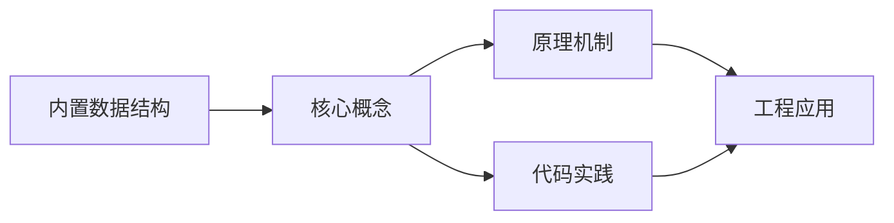
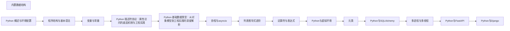

## 1. 学习目标（Bloom 分类）

本节按照布鲁姆教育目标分类学组织学习路径。本文主题为《内置数据结构》，属于 Python 模块，读者可以根据自身阶段选择阅读深度。

记忆层面：能够准确复述本文的核心概念、术语与基本语法或操作步骤，并能够在提问或检索时快速定位对应知识点。例如能够说出 Python 的动态类型、缩进语法与解释执行等基本特征。

理解层面：能够用自己的语言解释核心原理与工作机制，说明概念之间的因果关系，而不是机械记忆结论。例如能够解释解释器与编译器的差异，以及 GIL 对并发的影响。

应用层面：能够在真实项目或练习场景中运用本文知识解决具体问题，写出正确且可维护的实现。例如能够编写函数、类与标准库调用的完整脚本。

分析层面：能够拆解复杂问题，比较本文主题与相邻概念的异同，识别边界条件与例外情况。例如能够比较 Python 与 Java、Go 在类型系统与并发模型上的差异。

评价层面：能够根据约束条件（性能、可读性、安全、成本）评价不同方案的优劣，做出有依据的技术决策。例如能够评估不同实现方案（脚本、服务、库）的适用场景。

创造层面：能够把本文知识与其他模块知识组合，设计出新的解决方案或可复用的工程模式。例如能够组合标准库与第三方包设计完整的自动化工具。

通过本节学习，读者应当能够把《内置数据结构》纳入自己的知识网络，并与 Python 模块的其他主题（数据类型、函数、模块、异常、并发）建立关联。

## 2. 历史动机与发展脉络

《内置数据结构》是 Python 领域的重要主题。要真正理解它，需要先了解它解决的问题与演进过程。

Python 由 Guido van Rossum 于 1991 年首次发布，设计哲学强调代码可读性与开发效率，核心思想记录在《Python 之禅》（PEP 20）中：优美优于丑陋、明确优于隐晦、简单优于复杂。
Python 2 与 Python 3 的分裂期（2008-2020）是语言史上最重要的兼容性事件：Python 3 修复了字符串编码、整数除法等长期问题，但破坏性变更导致迁移缓慢；2020 年 1 月 Python 2 停止官方维护，社区全面转向 Python 3。
Python 3.9 至 3.13 的演进带来了类型提示增强（PEP 604 的 X | Y 语法、PEP 695 的泛型语法）、性能优化（3.11 的 faster-calls 与自适应解释器）以及异步生态的成熟（asyncio、FastAPI、httpx）。
Python 的应用版图从脚本自动化扩展到 Web 后端（Django、FastAPI）、数据科学（NumPy、Pandas、Matplotlib）、机器学习（PyTorch、scikit-learn）、运维自动化（Ansible）与科学计算，是当今最通用的编程语言之一。

回到本文主题：内置数据结构 的提出与成熟，正是上述技术背景下的必然产物。早期实现往往以简单可用为目标，随着工程规模扩大，社区逐渐沉淀出标准做法与最佳实践；理解这一脉络，可以帮助读者判断“为什么文档中的推荐写法是现在这个样子”，也能在遇到历史遗留代码时准确识别其设计年代与取舍。

对于初学者，理解 Python 的“电池内置”（标准库丰富）与“胶水语言”（易于调用 C/C++/Rust 扩展）两大特性，是判断其适用场景的基础。

## 3. 形式化定义与核心概念精讲

本节把《内置数据结构》涉及的核心概念以“定义 + 讲解”的形式展开。读者应把定义当作工具，把讲解当作理解路径；两者结合才能形成可迁移的知识。

变量与动态类型：Python 变量是对象的引用，类型属于对象而非变量；`isinstance()` 与 `type()` 用于运行时检查，类型注解（PEP 484）提供静态检查能力但不改变运行时行为。
缩进即语法：Python 用缩进表达代码块层次，避免了花括号噪声，也强制了代码排版一致性；同一代码块必须使用一致的空格数（官方推荐 4 空格）。
函数是一等公民：函数可以赋值、传参、返回，配合 lambda、装饰器与闭包，构成函数式编程能力的基础。
模块与包：每个 `.py` 文件是模块，目录加 `__init__.py` 是包；`import` 机制支持绝对导入、相对导入与命名空间包。
异常处理：`try/except/finally` 与 `raise` 构成错误传播体系；`with` 语句通过上下文管理器（`__enter__/__exit__`）管理资源生命周期。

### 3.1 原文章节逐一精讲

原文档把主题拆分为 21 个小节，下面按顺序给出每一节的导读讲解，随后保留原文细节供精读。

#### 原文精读（完整保留）

# 内置数据结构

> **符号约定**：`< >` 必填参数 | `[ ]` 可选参数

---

#### 1. 列表 (List - `list`)

列表是Python中最常用的数据结构之一，它是一个有序、可变的序列，允许存储重复元素。

##### 1.1 列表的创建

```python
 # 创建空列表
 empty_list = []
 empty_list = list()
 # 创建带有初始元素的列表
 numbers = [1, 2, 3, 4, 5]
 fruits = ["apple", "banana", "cherry"]
 mixed = [1, "apple", True, 3.14]
 # 使用列表推导式创建列表
 squares = [x ** 2 for x in range(10)]
 print(squares) # 输出: [0, 1, 4, 9, 16, 25, 36, 49, 64, 81]
 # 使用range创建列表
 numbers = list(range(1, 10, 2))
 print(numbers) # 输出: [1, 3, 5, 7, 9]
 # 复制列表
 original = [1, 2, 3]
 copy1 = original.copy()
 copy2 = list(original)
 copy3 = original[:] # 切片复制
```

##### 1.2 列表的访问

```python
 fruits = ["apple", "banana", "cherry"]
 # 通过索引访问元素
 print(fruits[0]) # 输出: apple
 print(fruits[1]) # 输出: banana
 print(fruits[-1]) # 输出: cherry (负索引从末尾开始)
 # 切片操作
 print(fruits[1:3]) # 输出: ['banana', 'cherry'] (从索引1到2)
 print(fruits[:2]) # 输出: ['apple', 'banana'] (从开始到索引1)
 print(fruits[1:]) # 输出: ['banana', 'cherry'] (从索引1到结束)
 print(fruits[::-1]) # 输出: ['cherry', 'banana', 'apple'] (反转列表)
 # 检查元素是否存在
 print("apple" in fruits) # 输出:
 print("orange" in fruits) # 输出: False
 # 获取列表长度
 print(len(fruits)) # 输出: 3
```

##### 1.3 列表的修改

```python
 fruits = ["apple", "banana", "cherry"]
 # 修改元素
 fruits[1] = "grape"
 print(fruits) # 输出: ['apple', 'grape', 'cherry']
 # 添加元素
 fruits.append("orange") # 在末尾添加
 print(fruits) # 输出: ['apple', 'grape', 'cherry', 'orange']
 fruits.insert(1, "pear") # 在指定位置插入
 print(fruits) # 输出: ['apple', 'pear', 'grape', 'cherry', 'orange']
 # 扩展列表
 more_fruits = ["mango", "kiwi"]
 fruits.extend(more_fruits) # 添加另一个列表的所有元素
 print(fruits) # 输出: ['apple', 'pear', 'grape', 'cherry', 'orange', 'mango', 'kiwi']
 # 删除元素
 fruits.remove("cherry") # 移除指定值的元素
 print(fruits) # 输出: ['apple', 'pear', 'grape', 'orange', 'mango', 'kiwi']
 popped = fruits.pop() # 移除并返回最后一个元素
 print(popped) # 输出: kiwi
 print(fruits) # 输出: ['apple', 'pear', 'grape', 'orange', 'mango']
 popped = fruits.pop(1) # 移除并返回指定位置的元素
 print(popped) # 输出: pear
 print(fruits) # 输出: ['apple', 'grape', 'orange', 'mango']
 # 清空列表
 fruits.clear()
 print(fruits) # 输出: []
```

##### 1.4 列表的常用方法

```python
 numbers = [3, 1, 4, 1, 5, 9, 2, 6]
 # 排序
 numbers.sort()
 print(numbers) # 输出: [1, 1, 2, 3, 4, 5, 6, 9]
 # 反向排序
 numbers.sort(reverse=True)
 print(numbers) # 输出: [9, 6, 5, 4, 3, 2, 1, 1]
 # 反转列表
 numbers.reverse()
 print(numbers) # 输出: [1, 1, 2, 3, 4, 5, 6, 9]
 # 统计元素出现次数
 print(numbers.count(1)) # 输出: 2
 # 查找元素索引
 print(numbers.index(5)) # 输出: 5
 # 列表拼接
 list1 = [1, 2, 3]
 list2 = [4, 5, 6]
 combined = list1 + list2
 print(combined) # 输出: [1, 2, 3, 4, 5, 6]
 # 列表重复
 repeated = [1, 2] * 3
 print(repeated) # 输出: [1, 2, 1, 2, 1, 2]
```

##### 1.5 列表的性能特点

- **实现**: 基于动态数组
- **访问**: O(1)（通过索引）
- **插入/删除**:
- 末尾: O(1)
- 中间: O(n)（需要移动元素）
- **查找**: O(n)（线性搜索）

#### 2. 元组 (Tuple - `tuple`)

元组是一个有序、不可变的序列，允许存储重复元素。

##### 2.1 元组的创建

```python
 # 创建元组
 empty_tuple = ()
 empty_tuple = tuple()
 # 创建带有初始元素的元组
 numbers = (1, 2, 3, 4, 5)
 fruits = ("apple", "banana", "cherry")
 mixed = (1, "apple", True, 3.14)
 # 注意: 单个元素的元组需要加逗号
 single_element = (1,)
 print(type(single_element)) # 输出: <class 'tuple'>
 # 不带括号的元组
 implicit_tuple = 1, 2, 3
 print(type(implicit_tuple)) # 输出: <class 'tuple'>
 # 从其他序列创建元组
 list_to_tuple = tuple([1, 2, 3])
 print(list_to_tuple) # 输出: (1, 2, 3)
 string_to_tuple = tuple("hello")
 print(string_to_tuple) # 输出: ('h', 'e', 'l', 'l', 'o')
```

##### 2.2 元组的访问

```python
 fruits = ("apple", "banana", "cherry")
 # 通过索引访问元素
 print(fruits[0]) # 输出: apple
 print(fruits[1]) # 输出: banana
 print(fruits[-1]) # 输出: cherry
 # 切片操作
 print(fruits[1:3]) # 输出: ('banana', 'cherry')
 print(fruits[:2]) # 输出: ('apple', 'banana')
 print(fruits[1:]) # 输出: ('banana', 'cherry')
 print(fruits[::-1]) # 输出: ('cherry', 'banana', 'apple')
 # 检查元素是否存在
 print("apple" in fruits) # 输出:
 # 获取元组长度
 print(len(fruits)) # 输出: 3
 # 元组的不可变性
 # fruits[1] = "grape" # 错误: 'tuple' object does not support item assignment
```

##### 2.3 元组的解包

```python
 # 基本解包
 coordinates = (10, 20, 30)
 x, y, z = coordinates
 print(x, y, z) # 输出: 10 20 30
 # 部分解包
 numbers = (1, 2, 3, 4, 5)
 first, *middle, last = numbers
 print(first) # 输出: 1
 print(middle) # 输出: [2, 3, 4]
 print(last) # 输出: 5
 # 交换变量
 a, b = 1, 2
 a, b = b, a
 print(a, b) # 输出: 2 1
 # 函数返回多个值
 def get_user():
  return "Alice", 30, "New York"
 name, age, city = get_user()
 print(name, age, city) # 输出: Alice 30 New York
```

##### 2.4 元组的常用方法

```python
 numbers = (3, 1, 4, 1, 5, 9)
 # 统计元素出现次数
 print(numbers.count(1)) # 输出: 2
 # 查找元素索引
 print(numbers.index(5)) # 输出: 4
 # 元组拼接
 tuple1 = (1, 2, 3)
 tuple2 = (4, 5, 6)
 combined = tuple1 + tuple2
 print(combined) # 输出: (1, 2, 3, 4, 5, 6)
 # 元组重复
 repeated = (1, 2) * 3
 print(repeated) # 输出: (1, 2, 1, 2, 1, 2)
```

##### 2.5 元组的应用场景

- **作为字典的键**（因为元组不可变）
- **函数返回多个值**
- **保护数据不被修改**
- **性能优化**（元组比列表更节省内存，访问速度更快）

#### 3. 字典 (Dictionary - `dict`)

字典是一种映射类型，存储键值对，Python 3.7+ 保证插入顺序。

##### 3.1 字典的创建

```python
 # 创建空字典
 empty_dict = {}
 empty_dict = dict()
 # 创建带有初始键值对的字典
 person = {"name": "Alice", "age": 30, "city": "New York"}
 # 使用dict()构造函数
 person = dict(name="Alice", age=30, city="New York")
 # 从键值对列表创建
 items = [("name", "Alice"), ("age", 30), ("city", "New York")]
 person = dict(items)
 # 从两个列表创建（键和值）
 keys = ["name", "age", "city"]
 values = ["Alice", 30, "New York"]
 person = dict(zip(keys, values))
 # 字典推导式
 squares = {x: x**2 for x in range(5)}
 print(squares) # 输出: {0: 0, 1: 1, 2: 4, 3: 9, 4: 16}
```

##### 3.2 字典的访问

```python
 person = {"name": "Alice", "age": 30, "city": "New York"}
 # 通过键访问值
 print(person["name"]) # 输出: Alice
 print(person["age"]) # 输出: 30
 # 使用get()方法访问（更安全）
 print(person.get("name")) # 输出: Alice
 print(person.get("country", "Unknown")) # 输出: Unknown（键不存在时返回默认值）
 # 检查键是否存在
 print("name" in person) # 输出:
 print("country" in person) # 输出: False
 # 获取所有键
 print(person.keys()) # 输出: dict_keys(['name', 'age', 'city'])
 # 获取所有值
 print(person.values()) # 输出: dict_values(['Alice', 30, 'New York'])
 # 获取所有键值对
 print(person.items()) # 输出: dict_items([('name', 'Alice'), ('age', 30), ('city', 'New York')])
```

##### 3.3 字典的修改

```python
 person = {"name": "Alice", "age": 30, "city": "New York"}
 # 添加或修改键值对
 person["country"] = "USA" # 添加新键值对
 print(person) # 输出: {'name': 'Alice', 'age': 30, 'city': 'New York', 'country': 'USA'}
 person["age"] = 31 # 修改现有值
 print(person) # 输出: {'name': 'Alice', 'age': 31, 'city': 'New York', 'country': 'USA'}
 # 使用update()方法更新
 person.update({"city": "Boston", "job": "Engineer"})
 print(person) # 输出: {'name': 'Alice', 'age': 31, 'city': 'Boston', 'country': 'USA', 'job': 'Engineer'}
 # 删除键值对
 removed_value = person.pop("country") # 移除并返回值
 print(removed_value) # 输出: USA
 print(person) # 输出: {'name': 'Alice', 'age': 31, 'city': 'Boston', 'job': 'Engineer'}
 # 删除最后一个键值对（Python 3.7+）
 last_item = person.popitem()
 print(last_item) # 输出: ('job', 'Engineer')
 print(person) # 输出: {'name': 'Alice', 'age': 31, 'city': 'Boston'}
 # 清空字典
 person.clear()
 print(person) # 输出: {}
```

##### 3.4 字典的遍历

```python
 person = {"name": "Alice", "age": 30, "city": "New York"}
 # 遍历键
 for key in person:
  print(key)
 # 遍历键（显式）
 for key in person.keys():
  print(key)
 # 遍历值
 for value in person.values():
  print(value)
 # 遍历键值对
 for key, value in person.items():
  print(f"{key}: {value}")
```

##### 3.5 字典的性能特点

- **实现**: 基于哈希表
- **访问**: O(1)（平均情况）
- **插入/删除**: O(1)（平均情况）
- **查找**: O(1)（平均情况）
- **键的要求**: 必须是不可变类型（如字符串、数字、元组）

#### 4. 集合 (Set - `set`)

集合是一个无序、不重复的元素集合。

##### 4.1 集合的创建

```python
 # 创建空集合
 empty_set = set() # 注意: {} 创建的是空字典
 # 创建带有初始元素的集合
 numbers = {1, 2, 3, 4, 5}
 fruits = {"apple", "banana", "cherry"}
 # 从其他序列创建集合
 list_to_set = set([1, 2, 3, 3, 4, 5])
 print(list_to_set) # 输出: {1, 2, 3, 4, 5}（自动去重）
 string_to_set = set("hello")
 print(string_to_set) # 输出: {'h', 'e', 'l', 'o'}（自动去重）
 # 集合推导式
 squares = {x**2 for x in range(5)}
 print(squares) # 输出: {0, 1, 4, 9, 16}
```

##### 4.2 集合的操作

```python
 fruits = {"apple", "banana", "cherry"}
 # 添加元素
 fruits.add("orange")
 print(fruits) # 输出: {'apple', 'banana', 'cherry', 'orange'}
 # 添加多个元素
 fruits.update(["mango", "kiwi"])
 print(fruits) # 输出: {'apple', 'banana', 'cherry', 'orange', 'mango', 'kiwi'}
 # 删除元素
 fruits.remove("cherry") # 如果元素不存在会抛出错误
 print(fruits) # 输出: {'apple', 'banana', 'orange', 'mango', 'kiwi'}
 fruits.discard("grape") # 如果元素不存在不会抛出错误
 print(fruits) # 输出: {'apple', 'banana', 'orange', 'mango', 'kiwi'}
 # 移除并返回任意元素
 popped = fruits.pop()
 print(popped) # 输出: 任意元素，如 'apple'
 print(fruits) # 输出: 剩余元素
 # 清空集合
 fruits.clear()
 print(fruits) # 输出: set()
```

##### 4.3 集合运算

```python
 set1 = {1, 2, 3, 4, 5}
 set2 = {4, 5, 6, 7, 8}
 # 并集
 union = set1 | set2
 print(union) # 输出: {1, 2, 3, 4, 5, 6, 7, 8}
 print(set1.union(set2)) # 同上
 # 交集
 intersection = set1 & set2
 print(intersection) # 输出: {4, 5}
 print(set1.intersection(set2)) # 同上
 # 差集
 difference = set1 - set2
 print(difference) # 输出: {1, 2, 3}
 print(set1.difference(set2)) # 同上
 # 对称差集（并集减去交集）
 symmetric_difference = set1 ^ set2
 print(symmetric_difference) # 输出: {1, 2, 3, 6, 7, 8}
 print(set1.symmetric_difference(set2)) # 同上
 # 子集检查
 set3 = {1, 2, 3}
 print(set3.issubset(set1)) # 输出:
 # 超集检查
 print(set1.issuperset(set3)) # 输出:
 # 不相交检查
 set4 = {6, 7, 8}
 print(set1.isdisjoint(set4)) # 输出:
```

##### 4.4 集合的性能特点

- **实现**: 基于哈希表
- **查找**: O(1)（平均情况）
- **插入/删除**: O(1)（平均情况）
- **元素要求**: 必须是不可变类型

#### 5. 数据结构对比

| 类型    | 有序  | 可变 | 重复     | 性能 (查找) | 适用场景                             |
| ------- | ----- | ---- | -------- | ----------- | ------------------------------------ |
| `list`  | Yes   | Yes  | Yes      | $O(n)$      | 需要有序且可能修改的数据             |
| `tuple` | Yes   | No   | Yes      | $O(n)$      | 需要有序且不可修改的数据，作为字典键 |
| `dict`  | Yes\* | Yes  | No (Key) | $O(1)$      | 需要键值对映射，快速查找             |
| `set`   | No    | Yes  | No       | $O(1)$      | 需要去重，集合运算                   |

- Python 3.7+ 保证字典的插入顺序

#### 6. 数据结构的最佳实践

##### 6.1 列表的最佳实践

- **使用列表推导式**：简洁高效地创建列表
- **避免频繁在列表开头插入**：这会导致 O(n) 的时间复杂度
- **使用 `append()` 而不是 `+`**：`append()` 是 O(1)，而 `+` 是 O(n)
- **使用 `in` 检查元素**：虽然是 O(n)，但对于小列表是可接受的
- **排序前考虑是否需要**：排序是 O(n log n) 操作

##### 6.2 元组的最佳实践

- **使用元组存储相关数据**：如坐标、日期等
- **作为函数返回值**：方便多值返回
- **作为字典键**：因为元组不可变
- **使用拆包简化代码**：提高可读性
- **注意单元素元组的语法**：需要加逗号 `(1,)`

##### 6.3 字典的最佳实践

- **使用 `get()` 方法**：避免键不存在的错误
- **使用字典推导式**：简洁高效地创建字典
- **遍历键值对使用 `items()`**：比分别遍历键和值更高效
- **使用 `defaultdict`**：处理不存在的键（来自 `collections` 模块）
- **使用 `OrderedDict`**：需要保持插入顺序的旧版本 Python（3.7+ 已不需要）

##### 6.4 集合的最佳实践

- **用于去重**：快速去除重复元素
- **用于集合运算**：交集、并集、差集等
- **用于快速成员检查**：比列表的 `in` 操作更快
- **注意集合是无序的**：不要依赖元素顺序
- **元素必须是不可变的**：不能包含列表、字典等可变类型

##### 6.5 性能考虑

- **小数据集**：选择最符合语义的数据结构
- **大数据集**：考虑查找、插入、删除的性能
- **内存使用**：元组比列表更节省内存
- **操作频率**：根据最频繁的操作选择合适的数据结构

#### 7. 高级数据结构

Python 标准库中还提供了一些高级数据结构：

##### 7.1 有序字典 (`OrderedDict`)

```python
 from collections import OrderedDict
 # 在 Python 3.7+ 中，普通字典已经保持插入顺序
 # 但 OrderedDict 提供了额外的方法
 od = OrderedDict()
 od['a'] = 1
 od['b'] = 2
 od['c'] = 3
 print(list(od.keys())) # 输出: ['a', 'b', 'c']
 # 移动元素到末尾
 od.move_to_end('a')
 print(list(od.keys())) # 输出: ['b', 'c', 'a']
```

##### 7.2 默认字典 (`defaultdict`)

```python
 from collections import defaultdict
 # 自动为不存在的键提供默认值
 d = defaultdict(int) # 默认值为 0
 d['a'] += 1
 d['b'] += 1
 print(d) # 输出: defaultdict(<class 'int'>, {'a': 1, 'b': 1})
 # 使用列表作为默认值
 d = defaultdict(list)
 d['a'].append(1)
 d['a'].append(2)
 d['b'].append(3)
 print(d) # 输出: defaultdict(<class 'list'>, {'a': [1, 2], 'b': [3]})
```

##### 7.3 计数器 (`Counter`)

```python
 from collections import Counter
 # 统计元素出现次数
 c = Counter(['a', 'b', 'a', 'c', 'b', 'a'])
 print(c) # 输出: Counter({'a': 3, 'b': 2, 'c': 1})
 # 访问次数
 print(c['a']) # 输出: 3
 # 获取最常见的元素
 print(c.most_common(2)) # 输出: [('a', 3), ('b', 2)]
```

##### 7.4 双端队列 (`deque`)

```python
 from collections import deque
 # 双端队列，支持高效的两端操作
 dq = deque([1, 2, 3])
 # 从右侧添加
 dq.append(4)
 print(dq) # 输出: deque([1, 2, 3, 4])
 # 从左侧添加
 dq.appendleft(0)
 print(dq) # 输出: deque([0, 1, 2, 3, 4])
 # 从右侧移除
 print(dq.pop()) # 输出: 4
 print(dq) # 输出: deque([0, 1, 2, 3])
 # 从左侧移除
 print(dq.popleft()) # 输出: 0
 print(dq) # 输出: deque([1, 2, 3])
```

---

#### 延伸阅读

- [Pandas](data-analysis/pandas)
#### 列表

**基本写法：创建列表**
`[<元素1>, <元素2>, <元素3>]`

```python
# 创建列表
fruits = ["apple", "banana", "cherry"]
```

---

**基本写法：创建空列表**
`[]`

```python
# 创建空列表
empty_list = []
```

---

**基本写法：使用 list() 创建列表**
`list(<可迭代对象>)`

```python
# 使用 list() 创建列表
numbers = list(range(5))
```

---

**基本写法：访问列表元素**
`<列表>[<索引>]`

```python
# 访问列表元素
print(fruits[0])
```

---

**基本写法：负索引访问**
`<列表>[-<索引>]`

```python
# 使用负索引访问（从末尾开始）
print(fruits[-1])
```

---

**基本写法：列表切片**
`<列表>[<start>:<stop>:<step>]`

```python
# 列表切片
print(fruits[0:2])
```

---

**基本写法：修改列表元素**
`<列表>[<索引>] = <新值>`

```python
# 修改列表元素
fruits[0] = "orange"
```

---

#### 列表方法

**基本写法：追加元素**
`<列表>.append(<元素>)`

```python
# 追加元素到列表末尾
fruits.append("grape")
```

---

**基本写法：插入元素**
`<列表>.insert(<索引>, <元素>)`

```python
# 在指定位置插入元素
fruits.insert(1, "kiwi")
```

---

**基本写法：扩展列表**
`<列表>.extend(<可迭代对象>)`

```python
# 使用另一个列表扩展当前列表
fruits.extend(["mango", "pear"])
```

---

**基本写法：删除指定元素**
`<列表>.remove(<元素>)`

```python
# 删除列表中第一个匹配的元素
fruits.remove("banana")
```

---

**基本写法：弹出元素**
`<列表>.pop([<索引>])`

```python
# 弹出指定位置的元素（默认末尾）
last = fruits.pop()
```

---

**基本写法：清空列表**
`<列表>.clear()`

```python
# 清空列表
fruits.clear()
```

---

**基本写法：查找元素索引**
`<列表>.index(<元素>)`

```python
# 查找元素的索引位置
index = fruits.index("cherry")
```

---

**基本写法：统计元素出现次数**
`<列表>.count(<元素>)`

```python
# 统计元素出现次数
count = fruits.count("apple")
```

---

**基本写法：排序列表**
`<列表>.sort()`

```python
# 原地排序列表
fruits.sort()
```

---

**基本写法：指定排序规则**
`<列表>.sort(key=<函数>, reverse=<布尔值>)`

```python
# 按字符串长度排序
fruits.sort(key=len, reverse=True)
```

---

**基本写法：反转列表**
`<列表>.reverse()`

```python
# 原地反转列表
fruits.reverse()
```

---

**基本写法：复制列表**
`<列表>.copy()`

```python
# 复制列表
fruits_copy = fruits.copy()
```

---

#### 元组

**基本写法：创建元组**
`(<元素1>, <元素2>, <元素3>)`

```python
# 创建元组
point = (3, 4)
```

---

**基本写法：创建单元素元组**
`(<元素>,)`

```python
# 创建单元素元组（注意逗号）
single = (42,)
```

---

**基本写法：创建空元组**
`()`

```python
# 创建空元组
empty_tuple = ()
```

---

**基本写法：使用 tuple() 创建元组**
`tuple(<可迭代对象>)`

```python
# 使用 tuple() 创建元组
numbers = tuple([1, 2, 3])
```

---

**基本写法：访问元组元素**
`<元组>[<索引>]`

```python
# 访问元组元素
print(point[0])
```

---

**基本写法：元组解包**
`<变量1>, <变量2> = <元组>`

```python
# 元组解包
x, y = point
```

---

**基本写法：使用星号解包**
`<变量1>, *<变量2> = <元组>`

```python
# 使用星号收集剩余值
first, *rest = (1, 2, 3, 4, 5)
```

---

**基本写法：命名元组**
`namedtuple(<类名>, [<字段1>, <字段2>])`

```python
# 创建命名元组
from collections import namedtuple

Point = namedtuple("Point", ["x", "y"])
p = Point(3, 4)
print(p.x, p.y)
```

---

#### 字典

**基本写法：创建字典**
`{<键1>: <值1>, <键2>: <值2>}`

```python
# 创建字典
person = {"name": "Alice", "age": 30}
```

---

**基本写法：创建空字典**
`{}`

```python
# 创建空字典
empty_dict = {}
```

---

**基本写法：使用 dict() 创建字典**
`dict(<键1>=<值1>, <键2>=<值2>)`

```python
# 使用 dict() 创建字典
person = dict(name="Alice", age=30)
```

---

**基本写法：使用键值对序列创建字典**
`dict([(<键>, <值>), (<键>, <值>)])`

```python
# 使用键值对序列创建字典
person = dict([("name", "Alice"), ("age", 30)])
```

---

**基本写法：访问字典值**
`<字典>[<键>]`

```python
# 通过键访问值
print(person["name"])
```

---

**基本写法：使用 get() 安全访问**
`<字典>.get(<键>, <默认值>)`

```python
# 使用 get() 安全访问，键不存在时返回默认值
print(person.get("email", "N/A"))
```

---

**基本写法：修改或添加键值对**
`<字典>[<键>] = <值>`

```python
# 修改或添加键值对
person["email"] = "alice@example.com"
```

---

**基本写法：删除键值对**
`del <字典>[<键>]`

```python
# 删除指定键值对
del person["age"]
```

---

#### 字典方法

**基本写法：获取所有键**
`<字典>.keys()`

```python
# 获取字典的所有键
print(person.keys())
```

---

**基本写法：获取所有值**
`<字典>.values()`

```python
# 获取字典的所有值
print(person.values())
```

---

**基本写法：获取所有键值对**
`<字典>.items()`

```python
# 获取字典的所有键值对
print(person.items())
```

---

**基本写法：弹出键值对**
`<字典>.pop(<键>, <默认值>)`

```python
# 弹出指定键的值
age = person.pop("age", None)
```

---

**基本写法：弹出最后一个键值对**
`<字典>.popitem()`

```python
# 弹出最后一个键值对
key, value = person.popitem()
```

---

**基本写法：更新字典**
`<字典>.update(<其他字典>)`

```python
# 使用另一个字典更新当前字典
person.update({"age": 31, "city": "New York"})
```

---

**基本写法：设置默认值**
`<字典>.setdefault(<键>, <默认值>)`

```python
# 设置键的默认值（键不存在时设置）
person.setdefault("country", "USA")
```

---

**基本写法：清空字典**
`<字典>.clear()`

```python
# 清空字典
person.clear()
```

---

**基本写法：复制字典**
`<字典>.copy()`

```python
# 复制字典
person_copy = person.copy()
```

---

#### 字典推导式

**基本写法：基本字典推导式**
`{<键表达式>: <值表达式> for <变量> in <可迭代对象>}`

```python
# 基本字典推导式
squares = {x: x ** 2 for x in range(5)}
```

---

**基本写法：带条件的字典推导式**
`{<键表达式>: <值表达式> for <变量> in <可迭代对象> if <条件>}`

```python
# 带条件的字典推导式
even_squares = {x: x ** 2 for x in range(10) if x % 2 == 0}
```

---

#### 集合

**基本写法：创建集合**
`{<元素1>, <元素2>, <元素3>}`

```python
# 创建集合
fruits = {"apple", "banana", "cherry"}
```

---

**基本写法：创建空集合**
`set()`

```python
# 创建空集合（注意：{} 创建的是空字典）
empty_set = set()
```

---

**基本写法：使用 set() 创建集合**
`set(<可迭代对象>)`

```python
# 使用 set() 从列表创建集合
numbers = set([1, 2, 3, 2, 1])
```

---

#### 集合方法

**基本写法：添加元素**
`<集合>.add(<元素>)`

```python
# 添加元素到集合
fruits.add("orange")
```

---

**基本写法：删除元素**
`<集合>.remove(<元素>)`

```python
# 删除元素（元素不存在时抛出异常）
fruits.remove("banana")
```

---

**基本写法：安全删除元素**
`<集合>.discard(<元素>)`

```python
# 安全删除元素（元素不存在时不抛出异常）
fruits.discard("banana")
```

---

**基本写法：弹出元素**
`<集合>.pop()`

```python
# 弹出集合中的任意元素
element = fruits.pop()
```

---

**基本写法：清空集合**
`<集合>.clear()`

```python
# 清空集合
fruits.clear()
```

---

#### 集合运算

**基本写法：并集运算**
`<集合1> | <集合2>`

```python
# 集合并集
set1 = {1, 2, 3}
set2 = {3, 4, 5}
union = set1 | set2
```

---

**基本写法：交集运算**
`<集合1> & <集合2>`

```python
# 集合交集
intersection = set1 & set2
```

---

**基本写法：差集运算**
`<集合1> - <集合2>`

```python
# 集合差集
difference = set1 - set2
```

---

**基本写法：对称差集运算**
`<集合1> ^ <集合2>`

```python
# 集合对称差集
symmetric_diff = set1 ^ set2
```

---

**基本写法：使用 union() 方法**
`<集合>.union(<其他集合>)`

```python
# 使用 union() 方法求并集
union = set1.union(set2)
```

---

**基本写法：使用 intersection() 方法**
`<集合>.intersection(<其他集合>)`

```python
# 使用 intersection() 方法求交集
intersection = set1.intersection(set2)
```

---

**基本写法：使用 difference() 方法**
`<集合>.difference(<其他集合>)`

```python
# 使用 difference() 方法求差集
difference = set1.difference(set2)
```

---

**基本写法：子集判断**
`<集合1>.issubset(<集合2>)`

```python
# 判断是否为子集
is_subset = {1, 2}.issubset({1, 2, 3})
```

---

**基本写法：超集判断**
`<集合1>.issuperset(<集合2>)`

```python
# 判断是否为超集
is_superset = {1, 2, 3}.issuperset({1, 2})
```

---

**基本写法：不相交判断**
`<集合1>.isdisjoint(<集合2>)`

```python
# 判断两个集合是否不相交
is_disjoint = {1, 2}.isdisjoint({3, 4})
```

---

#### 集合推导式

**基本写法：基本集合推导式**
`{<表达式> for <变量> in <可迭代对象>}`

```python
# 基本集合推导式
squares = {x ** 2 for x in range(5)}
```

---

**基本写法：带条件的集合推导式**
`{<表达式> for <变量> in <可迭代对象> if <条件>}`

```python
# 带条件的集合推导式
even_squares = {x ** 2 for x in range(10) if x % 2 == 0}
```

---

#### collections 模块

**基本写法：使用 Counter 计数**
`Counter(<可迭代对象>)`

```python
# 使用 Counter 统计元素出现次数
from collections import Counter
word_count = Counter("hello world")
```

---

**基本写法：使用 defaultdict**
`defaultdict(<默认工厂>)`

```python
# 使用 defaultdict 设置默认值
from collections import defaultdict
word_list = defaultdict(list)
word_list["fruits"].append("apple")
```

---

**基本写法：使用 OrderedDict**
`OrderedDict([(<键>, <值>), (<键>, <值>)])`

```python
# 使用 OrderedDict 保持插入顺序
from collections import OrderedDict
ordered = OrderedDict([("a", 1), ("b", 2)])
```

---

**基本写法：使用 deque 双端队列**
`deque(<可迭代对象>)`

```python
# 使用 deque 创建双端队列
from collections import deque
queue = deque([1, 2, 3])
queue.appendleft(0)
queue.append(4)
```

---

**基本写法：deque 弹出左侧元素**
`<deque>.popleft()`

```python
# 从左侧弹出元素
first = queue.popleft()
```

---

#### 冻结集合

**基本写法：创建冻结集合**
`frozenset(<可迭代对象>)`

```python
# 创建不可变的冻结集合
frozen = frozenset([1, 2, 3])
```

---

#### 数据结构嵌套

**换行写法：嵌套字典列表**
`[`
`    {<键1>: <值1>, <键2>: <值2>},`
`    {<键1>: <值1>, <键2>: <值2>},`
`]`

```python
# 嵌套字典列表
users = [
    {"name": "Alice", "age": 30},
    {"name": "Bob", "age": 25},
]
```

---

**换行写法：嵌套字典字典**
`{`
`    <键1>: {<子键1>: <值1>},`
`    <键2>: {<子键2>: <值2>},`
`}`

```python
# 嵌套字典字典
matrix = {
    "row1": {"col1": 1, "col2": 2},
    "row2": {"col1": 3, "col2": 4},
}
```

---


### 3.2 概念关系图

下面用 Mermaid 图表达本文核心概念之间的关系，帮助读者建立整体图景：



图中展示的是本文知识的结构化关系：核心概念是入口，原理机制解释“为什么”，代码实践演示“怎么做”，工程应用回答“何时用”。读者学习时可以把每个小节的内容挂接到对应节点上。

## 4. 理论推导与原理解析

本节深入《内置数据结构》背后的原理。理论部分不求面面俱到，而是聚焦“能解释现象、能指导实践”的关键推导。

解释执行与字节码：CPython 先把源码编译为字节码（.pyc），再由虚拟机逐条执行。字节码是平台无关的中间表示，因此 Python 程序可以跨平台运行，但执行速度低于编译型语言；性能敏感路径可用 C 扩展或 Cython 加速。
GIL（全局解释器锁）：CPython 的 GIL 保证同一时刻只有一个线程执行字节码，简化了内存管理，但限制了 CPU 密集型多线程并行；I/O 密集型任务通过线程切换获得并发，CPU 密集型任务应使用多进程（multiprocessing）或异步。
引用计数与垃圾回收：Python 对象通过引用计数管理生命周期，循环引用由分代垃圾回收器（gc 模块）处理。理解这一模型可以解释“为什么局部变量及时释放内存”“为什么大对象需要 del 或作用域退出”。
鸭子类型与协议：Python 依赖行为协议而非继承体系，例如实现 `__iter__` 与 `__next__` 的对象即可用于 `for` 循环。这一设计带来灵活性的同时，也要求开发者编写清晰的接口文档与类型注解。

需要强调的是，理论推导与工程实践之间存在翻译层：理论给出的是理想化模型与边界条件，工程代码则必须处理真实环境中的例外。读者在学习时应先掌握理论的“标准情形”，再通过陷阱章节了解“非标准情形”。

## 5. 代码示例与逐行讲解

本节把原文中的代码示例系统整理，并为每个示例补充用途说明与讲解。读者不应只浏览代码，而应逐段对照讲解理解设计意图。

### 5.1 示例：1.1 列表的创建

该示例来自原文《1.1 列表的创建》小节，用于演示内置数据结构相关操作。阅读时请先看代码结构，再看其后的讲解。

```python
 # 创建空列表
 empty_list = []
 empty_list = list()
 # 创建带有初始元素的列表
 numbers = [1, 2, 3, 4, 5]
 fruits = ["apple", "banana", "cherry"]
 mixed = [1, "apple", True, 3.14]
 # 使用列表推导式创建列表
 squares = [x ** 2 for x in range(10)]
 print(squares) # 输出: [0, 1, 4, 9, 16, 25, 36, 49, 64, 81]
 # 使用range创建列表
 numbers = list(range(1, 10, 2))
 print(numbers) # 输出: [1, 3, 5, 7, 9]
 # 复制列表
 original = [1, 2, 3]
 copy1 = original.copy()
 copy2 = list(original)
 copy3 = original[:] # 切片复制
```

讲解：这段代码演示了本节核心知识点。代码中的关键操作可以归纳为三步：准备（定义或初始化）、执行（核心逻辑）、收尾（释放资源或返回结果）。实际项目中，这三步往往被封装为函数或类，以提升复用性与可测试性。

关键点分析：

该示例共 18 行有效代码，包含 1 类关键结构（for）。其中：

- 入口与初始化部分负责建立上下文，对应实际项目中的启动或装配逻辑；
- 核心逻辑部分体现本文主题的主要操作，是阅读时最需要对照讲解理解的部分；
- 输出或返回部分把结果交给调用方，注意其类型与边界条件。

进阶思考路径：先尝试修改参数观察行为变化，再把示例中的模式迁移到自己的项目中；每次修改都记录预期与实测差异，这是把示例转化为能力的最快方式。

### 5.2 示例：1.2 列表的访问

该示例来自原文《1.2 列表的访问》小节，用于演示内置数据结构相关操作。阅读时请先看代码结构，再看其后的讲解。

```python
 fruits = ["apple", "banana", "cherry"]
 # 通过索引访问元素
 print(fruits[0]) # 输出: apple
 print(fruits[1]) # 输出: banana
 print(fruits[-1]) # 输出: cherry (负索引从末尾开始)
 # 切片操作
 print(fruits[1:3]) # 输出: ['banana', 'cherry'] (从索引1到2)
 print(fruits[:2]) # 输出: ['apple', 'banana'] (从开始到索引1)
 print(fruits[1:]) # 输出: ['banana', 'cherry'] (从索引1到结束)
 print(fruits[::-1]) # 输出: ['cherry', 'banana', 'apple'] (反转列表)
 # 检查元素是否存在
 print("apple" in fruits) # 输出:
 print("orange" in fruits) # 输出: False
 # 获取列表长度
 print(len(fruits)) # 输出: 3
```

讲解：这段代码演示了本节核心知识点。代码中的关键操作可以归纳为三步：准备（定义或初始化）、执行（核心逻辑）、收尾（释放资源或返回结果）。实际项目中，这三步往往被封装为函数或类，以提升复用性与可测试性。

关键点分析：

该示例共 15 行有效代码，结构以数据或配置为主。阅读时应关注：数据字段的含义、配置项的作用，以及它们与运行行为的对应关系。

进阶思考路径：先尝试修改参数观察行为变化，再把示例中的模式迁移到自己的项目中；每次修改都记录预期与实测差异，这是把示例转化为能力的最快方式。

### 5.3 示例：1.3 列表的修改

该示例来自原文《1.3 列表的修改》小节，用于演示内置数据结构相关操作。阅读时请先看代码结构，再看其后的讲解。

```python
 fruits = ["apple", "banana", "cherry"]
 # 修改元素
 fruits[1] = "grape"
 print(fruits) # 输出: ['apple', 'grape', 'cherry']
 # 添加元素
 fruits.append("orange") # 在末尾添加
 print(fruits) # 输出: ['apple', 'grape', 'cherry', 'orange']
 fruits.insert(1, "pear") # 在指定位置插入
 print(fruits) # 输出: ['apple', 'pear', 'grape', 'cherry', 'orange']
 # 扩展列表
 more_fruits = ["mango", "kiwi"]
 fruits.extend(more_fruits) # 添加另一个列表的所有元素
 print(fruits) # 输出: ['apple', 'pear', 'grape', 'cherry', 'orange', 'mango', 'kiwi']
 # 删除元素
 fruits.remove("cherry") # 移除指定值的元素
 print(fruits) # 输出: ['apple', 'pear', 'grape', 'orange', 'mango', 'kiwi']
 popped = fruits.pop() # 移除并返回最后一个元素
 print(popped) # 输出: kiwi
 print(fruits) # 输出: ['apple', 'pear', 'grape', 'orange', 'mango']
 popped = fruits.pop(1) # 移除并返回指定位置的元素
 print(popped) # 输出: pear
 print(fruits) # 输出: ['apple', 'grape', 'orange', 'mango']
 # 清空列表
 fruits.clear()
 print(fruits) # 输出: []
```

讲解：这段代码演示了本节核心知识点。代码中的关键操作可以归纳为三步：准备（定义或初始化）、执行（核心逻辑）、收尾（释放资源或返回结果）。实际项目中，这三步往往被封装为函数或类，以提升复用性与可测试性。

关键点分析：

该示例共 25 行有效代码，结构以数据或配置为主。阅读时应关注：数据字段的含义、配置项的作用，以及它们与运行行为的对应关系。

进阶思考路径：先尝试修改参数观察行为变化，再把示例中的模式迁移到自己的项目中；每次修改都记录预期与实测差异，这是把示例转化为能力的最快方式。

### 5.4 示例：1.4 列表的常用方法

该示例来自原文《1.4 列表的常用方法》小节，用于演示内置数据结构相关操作。阅读时请先看代码结构，再看其后的讲解。

```python
 numbers = [3, 1, 4, 1, 5, 9, 2, 6]
 # 排序
 numbers.sort()
 print(numbers) # 输出: [1, 1, 2, 3, 4, 5, 6, 9]
 # 反向排序
 numbers.sort(reverse=True)
 print(numbers) # 输出: [9, 6, 5, 4, 3, 2, 1, 1]
 # 反转列表
 numbers.reverse()
 print(numbers) # 输出: [1, 1, 2, 3, 4, 5, 6, 9]
 # 统计元素出现次数
 print(numbers.count(1)) # 输出: 2
 # 查找元素索引
 print(numbers.index(5)) # 输出: 5
 # 列表拼接
 list1 = [1, 2, 3]
 list2 = [4, 5, 6]
 combined = list1 + list2
 print(combined) # 输出: [1, 2, 3, 4, 5, 6]
 # 列表重复
 repeated = [1, 2] * 3
 print(repeated) # 输出: [1, 2, 1, 2, 1, 2]
```

讲解：这段代码演示了本节核心知识点。代码中的关键操作可以归纳为三步：准备（定义或初始化）、执行（核心逻辑）、收尾（释放资源或返回结果）。实际项目中，这三步往往被封装为函数或类，以提升复用性与可测试性。

关键点分析：

该示例共 22 行有效代码，结构以数据或配置为主。阅读时应关注：数据字段的含义、配置项的作用，以及它们与运行行为的对应关系。

进阶思考路径：先尝试修改参数观察行为变化，再把示例中的模式迁移到自己的项目中；每次修改都记录预期与实测差异，这是把示例转化为能力的最快方式。

### 5.5 示例：2.1 元组的创建

该示例来自原文《2.1 元组的创建》小节，用于演示内置数据结构相关操作。阅读时请先看代码结构，再看其后的讲解。

```python
 # 创建元组
 empty_tuple = ()
 empty_tuple = tuple()
 # 创建带有初始元素的元组
 numbers = (1, 2, 3, 4, 5)
 fruits = ("apple", "banana", "cherry")
 mixed = (1, "apple", True, 3.14)
 # 注意: 单个元素的元组需要加逗号
 single_element = (1,)
 print(type(single_element)) # 输出: <class 'tuple'>
 # 不带括号的元组
 implicit_tuple = 1, 2, 3
 print(type(implicit_tuple)) # 输出: <class 'tuple'>
 # 从其他序列创建元组
 list_to_tuple = tuple([1, 2, 3])
 print(list_to_tuple) # 输出: (1, 2, 3)
 string_to_tuple = tuple("hello")
 print(string_to_tuple) # 输出: ('h', 'e', 'l', 'l', 'o')
```

讲解：这段代码演示了本节核心知识点。代码中的关键操作可以归纳为三步：准备（定义或初始化）、执行（核心逻辑）、收尾（释放资源或返回结果）。实际项目中，这三步往往被封装为函数或类，以提升复用性与可测试性。

关键点分析：

该示例共 18 行有效代码，包含 1 类关键结构（class）。其中：

- 入口与初始化部分负责建立上下文，对应实际项目中的启动或装配逻辑；
- 核心逻辑部分体现本文主题的主要操作，是阅读时最需要对照讲解理解的部分；
- 输出或返回部分把结果交给调用方，注意其类型与边界条件。

进阶思考路径：先尝试修改参数观察行为变化，再把示例中的模式迁移到自己的项目中；每次修改都记录预期与实测差异，这是把示例转化为能力的最快方式。

### 5.6 示例：2.2 元组的访问

该示例来自原文《2.2 元组的访问》小节，用于演示内置数据结构相关操作。阅读时请先看代码结构，再看其后的讲解。

```python
 fruits = ("apple", "banana", "cherry")
 # 通过索引访问元素
 print(fruits[0]) # 输出: apple
 print(fruits[1]) # 输出: banana
 print(fruits[-1]) # 输出: cherry
 # 切片操作
 print(fruits[1:3]) # 输出: ('banana', 'cherry')
 print(fruits[:2]) # 输出: ('apple', 'banana')
 print(fruits[1:]) # 输出: ('banana', 'cherry')
 print(fruits[::-1]) # 输出: ('cherry', 'banana', 'apple')
 # 检查元素是否存在
 print("apple" in fruits) # 输出:
 # 获取元组长度
 print(len(fruits)) # 输出: 3
 # 元组的不可变性
 # fruits[1] = "grape" # 错误: 'tuple' object does not support item assignment
```

讲解：这段代码演示了本节核心知识点。代码中的关键操作可以归纳为三步：准备（定义或初始化）、执行（核心逻辑）、收尾（释放资源或返回结果）。实际项目中，这三步往往被封装为函数或类，以提升复用性与可测试性。

关键点分析：

该示例共 16 行有效代码，结构以数据或配置为主。阅读时应关注：数据字段的含义、配置项的作用，以及它们与运行行为的对应关系。

进阶思考路径：先尝试修改参数观察行为变化，再把示例中的模式迁移到自己的项目中；每次修改都记录预期与实测差异，这是把示例转化为能力的最快方式。

### 5.7 示例：2.3 元组的解包

该示例来自原文《2.3 元组的解包》小节，用于演示内置数据结构相关操作。阅读时请先看代码结构，再看其后的讲解。

```python
 # 基本解包
 coordinates = (10, 20, 30)
 x, y, z = coordinates
 print(x, y, z) # 输出: 10 20 30
 # 部分解包
 numbers = (1, 2, 3, 4, 5)
 first, *middle, last = numbers
 print(first) # 输出: 1
 print(middle) # 输出: [2, 3, 4]
 print(last) # 输出: 5
 # 交换变量
 a, b = 1, 2
 a, b = b, a
 print(a, b) # 输出: 2 1
 # 函数返回多个值
 def get_user():
  return "Alice", 30, "New York"
 name, age, city = get_user()
 print(name, age, city) # 输出: Alice 30 New York
```

讲解：这段代码演示了本节核心知识点。代码中的关键操作可以归纳为三步：准备（定义或初始化）、执行（核心逻辑）、收尾（释放资源或返回结果）。实际项目中，这三步往往被封装为函数或类，以提升复用性与可测试性。

关键点分析：

该示例共 19 行有效代码，包含 2 类关键结构（def、return）。其中：

- 入口与初始化部分负责建立上下文，对应实际项目中的启动或装配逻辑；
- 核心逻辑部分体现本文主题的主要操作，是阅读时最需要对照讲解理解的部分；
- 输出或返回部分把结果交给调用方，注意其类型与边界条件。

进阶思考路径：先尝试修改参数观察行为变化，再把示例中的模式迁移到自己的项目中；每次修改都记录预期与实测差异，这是把示例转化为能力的最快方式。

### 5.8 示例：2.4 元组的常用方法

该示例来自原文《2.4 元组的常用方法》小节，用于演示内置数据结构相关操作。阅读时请先看代码结构，再看其后的讲解。

```python
 numbers = (3, 1, 4, 1, 5, 9)
 # 统计元素出现次数
 print(numbers.count(1)) # 输出: 2
 # 查找元素索引
 print(numbers.index(5)) # 输出: 4
 # 元组拼接
 tuple1 = (1, 2, 3)
 tuple2 = (4, 5, 6)
 combined = tuple1 + tuple2
 print(combined) # 输出: (1, 2, 3, 4, 5, 6)
 # 元组重复
 repeated = (1, 2) * 3
 print(repeated) # 输出: (1, 2, 1, 2, 1, 2)
```

讲解：这段代码演示了本节核心知识点。代码中的关键操作可以归纳为三步：准备（定义或初始化）、执行（核心逻辑）、收尾（释放资源或返回结果）。实际项目中，这三步往往被封装为函数或类，以提升复用性与可测试性。

关键点分析：

该示例共 13 行有效代码，结构以数据或配置为主。阅读时应关注：数据字段的含义、配置项的作用，以及它们与运行行为的对应关系。

进阶思考路径：先尝试修改参数观察行为变化，再把示例中的模式迁移到自己的项目中；每次修改都记录预期与实测差异，这是把示例转化为能力的最快方式。

### 5.9 示例：3.1 字典的创建

该示例来自原文《3.1 字典的创建》小节，用于演示内置数据结构相关操作。阅读时请先看代码结构，再看其后的讲解。

```python
 # 创建空字典
 empty_dict = {}
 empty_dict = dict()
 # 创建带有初始键值对的字典
 person = {"name": "Alice", "age": 30, "city": "New York"}
 # 使用dict()构造函数
 person = dict(name="Alice", age=30, city="New York")
 # 从键值对列表创建
 items = [("name", "Alice"), ("age", 30), ("city", "New York")]
 person = dict(items)
 # 从两个列表创建（键和值）
 keys = ["name", "age", "city"]
 values = ["Alice", 30, "New York"]
 person = dict(zip(keys, values))
 # 字典推导式
 squares = {x: x**2 for x in range(5)}
 print(squares) # 输出: {0: 0, 1: 1, 2: 4, 3: 9, 4: 16}
```

讲解：这段代码演示了本节核心知识点。代码中的关键操作可以归纳为三步：准备（定义或初始化）、执行（核心逻辑）、收尾（释放资源或返回结果）。实际项目中，这三步往往被封装为函数或类，以提升复用性与可测试性。

关键点分析：

该示例共 17 行有效代码，包含 1 类关键结构（for）。其中：

- 入口与初始化部分负责建立上下文，对应实际项目中的启动或装配逻辑；
- 核心逻辑部分体现本文主题的主要操作，是阅读时最需要对照讲解理解的部分；
- 输出或返回部分把结果交给调用方，注意其类型与边界条件。

进阶思考路径：先尝试修改参数观察行为变化，再把示例中的模式迁移到自己的项目中；每次修改都记录预期与实测差异，这是把示例转化为能力的最快方式。

### 5.10 示例：3.2 字典的访问

该示例来自原文《3.2 字典的访问》小节，用于演示内置数据结构相关操作。阅读时请先看代码结构，再看其后的讲解。

```python
 person = {"name": "Alice", "age": 30, "city": "New York"}
 # 通过键访问值
 print(person["name"]) # 输出: Alice
 print(person["age"]) # 输出: 30
 # 使用get()方法访问（更安全）
 print(person.get("name")) # 输出: Alice
 print(person.get("country", "Unknown")) # 输出: Unknown（键不存在时返回默认值）
 # 检查键是否存在
 print("name" in person) # 输出:
 print("country" in person) # 输出: False
 # 获取所有键
 print(person.keys()) # 输出: dict_keys(['name', 'age', 'city'])
 # 获取所有值
 print(person.values()) # 输出: dict_values(['Alice', 30, 'New York'])
 # 获取所有键值对
 print(person.items()) # 输出: dict_items([('name', 'Alice'), ('age', 30), ('city', 'New York')])
```

讲解：这段代码演示了本节核心知识点。代码中的关键操作可以归纳为三步：准备（定义或初始化）、执行（核心逻辑）、收尾（释放资源或返回结果）。实际项目中，这三步往往被封装为函数或类，以提升复用性与可测试性。

关键点分析：

该示例共 16 行有效代码，结构以数据或配置为主。阅读时应关注：数据字段的含义、配置项的作用，以及它们与运行行为的对应关系。

进阶思考路径：先尝试修改参数观察行为变化，再把示例中的模式迁移到自己的项目中；每次修改都记录预期与实测差异，这是把示例转化为能力的最快方式。

### 5.11 示例：3.3 字典的修改

该示例来自原文《3.3 字典的修改》小节，用于演示内置数据结构相关操作。阅读时请先看代码结构，再看其后的讲解。

```python
 person = {"name": "Alice", "age": 30, "city": "New York"}
 # 添加或修改键值对
 person["country"] = "USA" # 添加新键值对
 print(person) # 输出: {'name': 'Alice', 'age': 30, 'city': 'New York', 'country': 'USA'}
 person["age"] = 31 # 修改现有值
 print(person) # 输出: {'name': 'Alice', 'age': 31, 'city': 'New York', 'country': 'USA'}
 # 使用update()方法更新
 person.update({"city": "Boston", "job": "Engineer"})
 print(person) # 输出: {'name': 'Alice', 'age': 31, 'city': 'Boston', 'country': 'USA', 'job': 'Engineer'}
 # 删除键值对
 removed_value = person.pop("country") # 移除并返回值
 print(removed_value) # 输出: USA
 print(person) # 输出: {'name': 'Alice', 'age': 31, 'city': 'Boston', 'job': 'Engineer'}
 # 删除最后一个键值对（Python 3.7+）
 last_item = person.popitem()
 print(last_item) # 输出: ('job', 'Engineer')
 print(person) # 输出: {'name': 'Alice', 'age': 31, 'city': 'Boston'}
 # 清空字典
 person.clear()
 print(person) # 输出: {}
```

讲解：这段代码演示了本节核心知识点。代码中的关键操作可以归纳为三步：准备（定义或初始化）、执行（核心逻辑）、收尾（释放资源或返回结果）。实际项目中，这三步往往被封装为函数或类，以提升复用性与可测试性。

关键点分析：

该示例共 20 行有效代码，结构以数据或配置为主。阅读时应关注：数据字段的含义、配置项的作用，以及它们与运行行为的对应关系。

进阶思考路径：先尝试修改参数观察行为变化，再把示例中的模式迁移到自己的项目中；每次修改都记录预期与实测差异，这是把示例转化为能力的最快方式。

### 5.12 示例：3.4 字典的遍历

该示例来自原文《3.4 字典的遍历》小节，用于演示内置数据结构相关操作。阅读时请先看代码结构，再看其后的讲解。

```python
 person = {"name": "Alice", "age": 30, "city": "New York"}
 # 遍历键
 for key in person:
  print(key)
 # 遍历键（显式）
 for key in person.keys():
  print(key)
 # 遍历值
 for value in person.values():
  print(value)
 # 遍历键值对
 for key, value in person.items():
  print(f"{key}: {value}")
```

讲解：这段代码演示了本节核心知识点。代码中的关键操作可以归纳为三步：准备（定义或初始化）、执行（核心逻辑）、收尾（释放资源或返回结果）。实际项目中，这三步往往被封装为函数或类，以提升复用性与可测试性。

关键点分析：

该示例共 13 行有效代码，包含 1 类关键结构（for）。其中：

- 入口与初始化部分负责建立上下文，对应实际项目中的启动或装配逻辑；
- 核心逻辑部分体现本文主题的主要操作，是阅读时最需要对照讲解理解的部分；
- 输出或返回部分把结果交给调用方，注意其类型与边界条件。

进阶思考路径：先尝试修改参数观察行为变化，再把示例中的模式迁移到自己的项目中；每次修改都记录预期与实测差异，这是把示例转化为能力的最快方式。

### 5.13 示例：4.1 集合的创建

该示例来自原文《4.1 集合的创建》小节，用于演示内置数据结构相关操作。阅读时请先看代码结构，再看其后的讲解。

```python
 # 创建空集合
 empty_set = set() # 注意: {} 创建的是空字典
 # 创建带有初始元素的集合
 numbers = {1, 2, 3, 4, 5}
 fruits = {"apple", "banana", "cherry"}
 # 从其他序列创建集合
 list_to_set = set([1, 2, 3, 3, 4, 5])
 print(list_to_set) # 输出: {1, 2, 3, 4, 5}（自动去重）
 string_to_set = set("hello")
 print(string_to_set) # 输出: {'h', 'e', 'l', 'o'}（自动去重）
 # 集合推导式
 squares = {x**2 for x in range(5)}
 print(squares) # 输出: {0, 1, 4, 9, 16}
```

讲解：这段代码演示了本节核心知识点。代码中的关键操作可以归纳为三步：准备（定义或初始化）、执行（核心逻辑）、收尾（释放资源或返回结果）。实际项目中，这三步往往被封装为函数或类，以提升复用性与可测试性。

关键点分析：

该示例共 13 行有效代码，包含 1 类关键结构（for）。其中：

- 入口与初始化部分负责建立上下文，对应实际项目中的启动或装配逻辑；
- 核心逻辑部分体现本文主题的主要操作，是阅读时最需要对照讲解理解的部分；
- 输出或返回部分把结果交给调用方，注意其类型与边界条件。

进阶思考路径：先尝试修改参数观察行为变化，再把示例中的模式迁移到自己的项目中；每次修改都记录预期与实测差异，这是把示例转化为能力的最快方式。

### 5.14 示例：4.2 集合的操作

该示例来自原文《4.2 集合的操作》小节，用于演示内置数据结构相关操作。阅读时请先看代码结构，再看其后的讲解。

```python
 fruits = {"apple", "banana", "cherry"}
 # 添加元素
 fruits.add("orange")
 print(fruits) # 输出: {'apple', 'banana', 'cherry', 'orange'}
 # 添加多个元素
 fruits.update(["mango", "kiwi"])
 print(fruits) # 输出: {'apple', 'banana', 'cherry', 'orange', 'mango', 'kiwi'}
 # 删除元素
 fruits.remove("cherry") # 如果元素不存在会抛出错误
 print(fruits) # 输出: {'apple', 'banana', 'orange', 'mango', 'kiwi'}
 fruits.discard("grape") # 如果元素不存在不会抛出错误
 print(fruits) # 输出: {'apple', 'banana', 'orange', 'mango', 'kiwi'}
 # 移除并返回任意元素
 popped = fruits.pop()
 print(popped) # 输出: 任意元素，如 'apple'
 print(fruits) # 输出: 剩余元素
 # 清空集合
 fruits.clear()
 print(fruits) # 输出: set()
```

讲解：这段代码演示了本节核心知识点。代码中的关键操作可以归纳为三步：准备（定义或初始化）、执行（核心逻辑）、收尾（释放资源或返回结果）。实际项目中，这三步往往被封装为函数或类，以提升复用性与可测试性。

关键点分析：

该示例共 19 行有效代码，结构以数据或配置为主。阅读时应关注：数据字段的含义、配置项的作用，以及它们与运行行为的对应关系。

进阶思考路径：先尝试修改参数观察行为变化，再把示例中的模式迁移到自己的项目中；每次修改都记录预期与实测差异，这是把示例转化为能力的最快方式。

### 5.15 示例：4.3 集合运算

该示例来自原文《4.3 集合运算》小节，用于演示内置数据结构相关操作。阅读时请先看代码结构，再看其后的讲解。

```python
 set1 = {1, 2, 3, 4, 5}
 set2 = {4, 5, 6, 7, 8}
 # 并集
 union = set1 | set2
 print(union) # 输出: {1, 2, 3, 4, 5, 6, 7, 8}
 print(set1.union(set2)) # 同上
 # 交集
 intersection = set1 & set2
 print(intersection) # 输出: {4, 5}
 print(set1.intersection(set2)) # 同上
 # 差集
 difference = set1 - set2
 print(difference) # 输出: {1, 2, 3}
 print(set1.difference(set2)) # 同上
 # 对称差集（并集减去交集）
 symmetric_difference = set1 ^ set2
 print(symmetric_difference) # 输出: {1, 2, 3, 6, 7, 8}
 print(set1.symmetric_difference(set2)) # 同上
 # 子集检查
 set3 = {1, 2, 3}
 print(set3.issubset(set1)) # 输出:
 # 超集检查
 print(set1.issuperset(set3)) # 输出:
 # 不相交检查
 set4 = {6, 7, 8}
 print(set1.isdisjoint(set4)) # 输出:
```

讲解：这段代码演示了本节核心知识点。代码中的关键操作可以归纳为三步：准备（定义或初始化）、执行（核心逻辑）、收尾（释放资源或返回结果）。实际项目中，这三步往往被封装为函数或类，以提升复用性与可测试性。

关键点分析：

该示例共 26 行有效代码，结构以数据或配置为主。阅读时应关注：数据字段的含义、配置项的作用，以及它们与运行行为的对应关系。

进阶思考路径：先尝试修改参数观察行为变化，再把示例中的模式迁移到自己的项目中；每次修改都记录预期与实测差异，这是把示例转化为能力的最快方式。

### 5.16 示例：7.1 有序字典 (`OrderedDict`)

该示例来自原文《7.1 有序字典 (`OrderedDict`)》小节，用于演示内置数据结构相关操作。阅读时请先看代码结构，再看其后的讲解。

```python
 from collections import OrderedDict
 # 在 Python 3.7+ 中，普通字典已经保持插入顺序
 # 但 OrderedDict 提供了额外的方法
 od = OrderedDict()
 od['a'] = 1
 od['b'] = 2
 od['c'] = 3
 print(list(od.keys())) # 输出: ['a', 'b', 'c']
 # 移动元素到末尾
 od.move_to_end('a')
 print(list(od.keys())) # 输出: ['b', 'c', 'a']
```

讲解：这段代码演示了本节核心知识点。代码中的关键操作可以归纳为三步：准备（定义或初始化）、执行（核心逻辑）、收尾（释放资源或返回结果）。实际项目中，这三步往往被封装为函数或类，以提升复用性与可测试性。

关键点分析：

该示例共 11 行有效代码，包含 2 类关键结构（import、from）。其中：

- 入口与初始化部分负责建立上下文，对应实际项目中的启动或装配逻辑；
- 核心逻辑部分体现本文主题的主要操作，是阅读时最需要对照讲解理解的部分；
- 输出或返回部分把结果交给调用方，注意其类型与边界条件。

进阶思考路径：先尝试修改参数观察行为变化，再把示例中的模式迁移到自己的项目中；每次修改都记录预期与实测差异，这是把示例转化为能力的最快方式。

### 5.17 示例：7.2 默认字典 (`defaultdict`)

该示例来自原文《7.2 默认字典 (`defaultdict`)》小节，用于演示内置数据结构相关操作。阅读时请先看代码结构，再看其后的讲解。

```python
 from collections import defaultdict
 # 自动为不存在的键提供默认值
 d = defaultdict(int) # 默认值为 0
 d['a'] += 1
 d['b'] += 1
 print(d) # 输出: defaultdict(<class 'int'>, {'a': 1, 'b': 1})
 # 使用列表作为默认值
 d = defaultdict(list)
 d['a'].append(1)
 d['a'].append(2)
 d['b'].append(3)
 print(d) # 输出: defaultdict(<class 'list'>, {'a': [1, 2], 'b': [3]})
```

讲解：这段代码演示了本节核心知识点。代码中的关键操作可以归纳为三步：准备（定义或初始化）、执行（核心逻辑）、收尾（释放资源或返回结果）。实际项目中，这三步往往被封装为函数或类，以提升复用性与可测试性。

关键点分析：

该示例共 12 行有效代码，包含 3 类关键结构（class、import、from）。其中：

- 入口与初始化部分负责建立上下文，对应实际项目中的启动或装配逻辑；
- 核心逻辑部分体现本文主题的主要操作，是阅读时最需要对照讲解理解的部分；
- 输出或返回部分把结果交给调用方，注意其类型与边界条件。

进阶思考路径：先尝试修改参数观察行为变化，再把示例中的模式迁移到自己的项目中；每次修改都记录预期与实测差异，这是把示例转化为能力的最快方式。

### 5.18 示例：7.3 计数器 (`Counter`)

该示例来自原文《7.3 计数器 (`Counter`)》小节，用于演示内置数据结构相关操作。阅读时请先看代码结构，再看其后的讲解。

```python
 from collections import Counter
 # 统计元素出现次数
 c = Counter(['a', 'b', 'a', 'c', 'b', 'a'])
 print(c) # 输出: Counter({'a': 3, 'b': 2, 'c': 1})
 # 访问次数
 print(c['a']) # 输出: 3
 # 获取最常见的元素
 print(c.most_common(2)) # 输出: [('a', 3), ('b', 2)]
```

讲解：这段代码演示了本节核心知识点。代码中的关键操作可以归纳为三步：准备（定义或初始化）、执行（核心逻辑）、收尾（释放资源或返回结果）。实际项目中，这三步往往被封装为函数或类，以提升复用性与可测试性。

关键点分析：

该示例共 8 行有效代码，包含 2 类关键结构（import、from）。其中：

- 入口与初始化部分负责建立上下文，对应实际项目中的启动或装配逻辑；
- 核心逻辑部分体现本文主题的主要操作，是阅读时最需要对照讲解理解的部分；
- 输出或返回部分把结果交给调用方，注意其类型与边界条件。

进阶思考路径：先尝试修改参数观察行为变化，再把示例中的模式迁移到自己的项目中；每次修改都记录预期与实测差异，这是把示例转化为能力的最快方式。

### 5.19 示例：7.4 双端队列 (`deque`)

该示例来自原文《7.4 双端队列 (`deque`)》小节，用于演示内置数据结构相关操作。阅读时请先看代码结构，再看其后的讲解。

```python
 from collections import deque
 # 双端队列，支持高效的两端操作
 dq = deque([1, 2, 3])
 # 从右侧添加
 dq.append(4)
 print(dq) # 输出: deque([1, 2, 3, 4])
 # 从左侧添加
 dq.appendleft(0)
 print(dq) # 输出: deque([0, 1, 2, 3, 4])
 # 从右侧移除
 print(dq.pop()) # 输出: 4
 print(dq) # 输出: deque([0, 1, 2, 3])
 # 从左侧移除
 print(dq.popleft()) # 输出: 0
 print(dq) # 输出: deque([1, 2, 3])
```

讲解：这段代码演示了本节核心知识点。代码中的关键操作可以归纳为三步：准备（定义或初始化）、执行（核心逻辑）、收尾（释放资源或返回结果）。实际项目中，这三步往往被封装为函数或类，以提升复用性与可测试性。

关键点分析：

该示例共 15 行有效代码，包含 2 类关键结构（import、from）。其中：

- 入口与初始化部分负责建立上下文，对应实际项目中的启动或装配逻辑；
- 核心逻辑部分体现本文主题的主要操作，是阅读时最需要对照讲解理解的部分；
- 输出或返回部分把结果交给调用方，注意其类型与边界条件。

进阶思考路径：先尝试修改参数观察行为变化，再把示例中的模式迁移到自己的项目中；每次修改都记录预期与实测差异，这是把示例转化为能力的最快方式。

### 5.20 示例：列表

该示例来自原文《列表》小节，用于演示内置数据结构相关操作。阅读时请先看代码结构，再看其后的讲解。

```python
# 创建列表
fruits = ["apple", "banana", "cherry"]
```

讲解：这段代码演示了本节核心知识点。代码中的关键操作可以归纳为三步：准备（定义或初始化）、执行（核心逻辑）、收尾（释放资源或返回结果）。实际项目中，这三步往往被封装为函数或类，以提升复用性与可测试性。

关键点分析：

该示例共 2 行有效代码，结构以数据或配置为主。阅读时应关注：数据字段的含义、配置项的作用，以及它们与运行行为的对应关系。

进阶思考路径：先尝试修改参数观察行为变化，再把示例中的模式迁移到自己的项目中；每次修改都记录预期与实测差异，这是把示例转化为能力的最快方式。

### 5.21 示例：列表

该示例来自原文《列表》小节，用于演示内置数据结构相关操作。阅读时请先看代码结构，再看其后的讲解。

```python
# 创建空列表
empty_list = []
```

讲解：这段代码演示了本节核心知识点。代码中的关键操作可以归纳为三步：准备（定义或初始化）、执行（核心逻辑）、收尾（释放资源或返回结果）。实际项目中，这三步往往被封装为函数或类，以提升复用性与可测试性。

关键点分析：

该示例共 2 行有效代码，结构以数据或配置为主。阅读时应关注：数据字段的含义、配置项的作用，以及它们与运行行为的对应关系。

进阶思考路径：先尝试修改参数观察行为变化，再把示例中的模式迁移到自己的项目中；每次修改都记录预期与实测差异，这是把示例转化为能力的最快方式。

### 5.22 示例：列表

该示例来自原文《列表》小节，用于演示内置数据结构相关操作。阅读时请先看代码结构，再看其后的讲解。

```python
# 使用 list() 创建列表
numbers = list(range(5))
```

讲解：这段代码演示了本节核心知识点。代码中的关键操作可以归纳为三步：准备（定义或初始化）、执行（核心逻辑）、收尾（释放资源或返回结果）。实际项目中，这三步往往被封装为函数或类，以提升复用性与可测试性。

关键点分析：

该示例共 2 行有效代码，结构以数据或配置为主。阅读时应关注：数据字段的含义、配置项的作用，以及它们与运行行为的对应关系。

进阶思考路径：先尝试修改参数观察行为变化，再把示例中的模式迁移到自己的项目中；每次修改都记录预期与实测差异，这是把示例转化为能力的最快方式。

### 5.23 示例：列表

该示例来自原文《列表》小节，用于演示内置数据结构相关操作。阅读时请先看代码结构，再看其后的讲解。

```python
# 访问列表元素
print(fruits[0])
```

讲解：这段代码演示了本节核心知识点。代码中的关键操作可以归纳为三步：准备（定义或初始化）、执行（核心逻辑）、收尾（释放资源或返回结果）。实际项目中，这三步往往被封装为函数或类，以提升复用性与可测试性。

关键点分析：

该示例共 2 行有效代码，结构以数据或配置为主。阅读时应关注：数据字段的含义、配置项的作用，以及它们与运行行为的对应关系。

进阶思考路径：先尝试修改参数观察行为变化，再把示例中的模式迁移到自己的项目中；每次修改都记录预期与实测差异，这是把示例转化为能力的最快方式。

### 5.24 示例：列表

该示例来自原文《列表》小节，用于演示内置数据结构相关操作。阅读时请先看代码结构，再看其后的讲解。

```python
# 使用负索引访问（从末尾开始）
print(fruits[-1])
```

讲解：这段代码演示了本节核心知识点。代码中的关键操作可以归纳为三步：准备（定义或初始化）、执行（核心逻辑）、收尾（释放资源或返回结果）。实际项目中，这三步往往被封装为函数或类，以提升复用性与可测试性。

关键点分析：

该示例共 2 行有效代码，结构以数据或配置为主。阅读时应关注：数据字段的含义、配置项的作用，以及它们与运行行为的对应关系。

进阶思考路径：先尝试修改参数观察行为变化，再把示例中的模式迁移到自己的项目中；每次修改都记录预期与实测差异，这是把示例转化为能力的最快方式。

### 5.25 示例：列表

该示例来自原文《列表》小节，用于演示内置数据结构相关操作。阅读时请先看代码结构，再看其后的讲解。

```python
# 列表切片
print(fruits[0:2])
```

讲解：这段代码演示了本节核心知识点。代码中的关键操作可以归纳为三步：准备（定义或初始化）、执行（核心逻辑）、收尾（释放资源或返回结果）。实际项目中，这三步往往被封装为函数或类，以提升复用性与可测试性。

关键点分析：

该示例共 2 行有效代码，结构以数据或配置为主。阅读时应关注：数据字段的含义、配置项的作用，以及它们与运行行为的对应关系。

进阶思考路径：先尝试修改参数观察行为变化，再把示例中的模式迁移到自己的项目中；每次修改都记录预期与实测差异，这是把示例转化为能力的最快方式。

### 5.26 示例：列表

该示例来自原文《列表》小节，用于演示内置数据结构相关操作。阅读时请先看代码结构，再看其后的讲解。

```python
# 修改列表元素
fruits[0] = "orange"
```

讲解：这段代码演示了本节核心知识点。代码中的关键操作可以归纳为三步：准备（定义或初始化）、执行（核心逻辑）、收尾（释放资源或返回结果）。实际项目中，这三步往往被封装为函数或类，以提升复用性与可测试性。

关键点分析：

该示例共 2 行有效代码，结构以数据或配置为主。阅读时应关注：数据字段的含义、配置项的作用，以及它们与运行行为的对应关系。

进阶思考路径：先尝试修改参数观察行为变化，再把示例中的模式迁移到自己的项目中；每次修改都记录预期与实测差异，这是把示例转化为能力的最快方式。

### 5.27 示例：列表方法

该示例来自原文《列表方法》小节，用于演示内置数据结构相关操作。阅读时请先看代码结构，再看其后的讲解。

```python
# 追加元素到列表末尾
fruits.append("grape")
```

讲解：这段代码演示了本节核心知识点。代码中的关键操作可以归纳为三步：准备（定义或初始化）、执行（核心逻辑）、收尾（释放资源或返回结果）。实际项目中，这三步往往被封装为函数或类，以提升复用性与可测试性。

关键点分析：

该示例共 2 行有效代码，结构以数据或配置为主。阅读时应关注：数据字段的含义、配置项的作用，以及它们与运行行为的对应关系。

进阶思考路径：先尝试修改参数观察行为变化，再把示例中的模式迁移到自己的项目中；每次修改都记录预期与实测差异，这是把示例转化为能力的最快方式。

### 5.28 示例：列表方法

该示例来自原文《列表方法》小节，用于演示内置数据结构相关操作。阅读时请先看代码结构，再看其后的讲解。

```python
# 在指定位置插入元素
fruits.insert(1, "kiwi")
```

讲解：这段代码演示了本节核心知识点。代码中的关键操作可以归纳为三步：准备（定义或初始化）、执行（核心逻辑）、收尾（释放资源或返回结果）。实际项目中，这三步往往被封装为函数或类，以提升复用性与可测试性。

关键点分析：

该示例共 2 行有效代码，结构以数据或配置为主。阅读时应关注：数据字段的含义、配置项的作用，以及它们与运行行为的对应关系。

进阶思考路径：先尝试修改参数观察行为变化，再把示例中的模式迁移到自己的项目中；每次修改都记录预期与实测差异，这是把示例转化为能力的最快方式。

### 5.29 示例：列表方法

该示例来自原文《列表方法》小节，用于演示内置数据结构相关操作。阅读时请先看代码结构，再看其后的讲解。

```python
# 使用另一个列表扩展当前列表
fruits.extend(["mango", "pear"])
```

讲解：这段代码演示了本节核心知识点。代码中的关键操作可以归纳为三步：准备（定义或初始化）、执行（核心逻辑）、收尾（释放资源或返回结果）。实际项目中，这三步往往被封装为函数或类，以提升复用性与可测试性。

关键点分析：

该示例共 2 行有效代码，结构以数据或配置为主。阅读时应关注：数据字段的含义、配置项的作用，以及它们与运行行为的对应关系。

进阶思考路径：先尝试修改参数观察行为变化，再把示例中的模式迁移到自己的项目中；每次修改都记录预期与实测差异，这是把示例转化为能力的最快方式。

### 5.30 示例：列表方法

该示例来自原文《列表方法》小节，用于演示内置数据结构相关操作。阅读时请先看代码结构，再看其后的讲解。

```python
# 删除列表中第一个匹配的元素
fruits.remove("banana")
```

讲解：这段代码演示了本节核心知识点。代码中的关键操作可以归纳为三步：准备（定义或初始化）、执行（核心逻辑）、收尾（释放资源或返回结果）。实际项目中，这三步往往被封装为函数或类，以提升复用性与可测试性。

关键点分析：

该示例共 2 行有效代码，结构以数据或配置为主。阅读时应关注：数据字段的含义、配置项的作用，以及它们与运行行为的对应关系。

进阶思考路径：先尝试修改参数观察行为变化，再把示例中的模式迁移到自己的项目中；每次修改都记录预期与实测差异，这是把示例转化为能力的最快方式。

### 5.31 示例：列表方法

该示例来自原文《列表方法》小节，用于演示内置数据结构相关操作。阅读时请先看代码结构，再看其后的讲解。

```python
# 弹出指定位置的元素（默认末尾）
last = fruits.pop()
```

讲解：这段代码演示了本节核心知识点。代码中的关键操作可以归纳为三步：准备（定义或初始化）、执行（核心逻辑）、收尾（释放资源或返回结果）。实际项目中，这三步往往被封装为函数或类，以提升复用性与可测试性。

关键点分析：

该示例共 2 行有效代码，结构以数据或配置为主。阅读时应关注：数据字段的含义、配置项的作用，以及它们与运行行为的对应关系。

进阶思考路径：先尝试修改参数观察行为变化，再把示例中的模式迁移到自己的项目中；每次修改都记录预期与实测差异，这是把示例转化为能力的最快方式。

### 5.32 示例：列表方法

该示例来自原文《列表方法》小节，用于演示内置数据结构相关操作。阅读时请先看代码结构，再看其后的讲解。

```python
# 清空列表
fruits.clear()
```

讲解：这段代码演示了本节核心知识点。代码中的关键操作可以归纳为三步：准备（定义或初始化）、执行（核心逻辑）、收尾（释放资源或返回结果）。实际项目中，这三步往往被封装为函数或类，以提升复用性与可测试性。

关键点分析：

该示例共 2 行有效代码，结构以数据或配置为主。阅读时应关注：数据字段的含义、配置项的作用，以及它们与运行行为的对应关系。

进阶思考路径：先尝试修改参数观察行为变化，再把示例中的模式迁移到自己的项目中；每次修改都记录预期与实测差异，这是把示例转化为能力的最快方式。

### 5.33 示例：列表方法

该示例来自原文《列表方法》小节，用于演示内置数据结构相关操作。阅读时请先看代码结构，再看其后的讲解。

```python
# 查找元素的索引位置
index = fruits.index("cherry")
```

讲解：这段代码演示了本节核心知识点。代码中的关键操作可以归纳为三步：准备（定义或初始化）、执行（核心逻辑）、收尾（释放资源或返回结果）。实际项目中，这三步往往被封装为函数或类，以提升复用性与可测试性。

关键点分析：

该示例共 2 行有效代码，结构以数据或配置为主。阅读时应关注：数据字段的含义、配置项的作用，以及它们与运行行为的对应关系。

进阶思考路径：先尝试修改参数观察行为变化，再把示例中的模式迁移到自己的项目中；每次修改都记录预期与实测差异，这是把示例转化为能力的最快方式。

### 5.34 示例：列表方法

该示例来自原文《列表方法》小节，用于演示内置数据结构相关操作。阅读时请先看代码结构，再看其后的讲解。

```python
# 统计元素出现次数
count = fruits.count("apple")
```

讲解：这段代码演示了本节核心知识点。代码中的关键操作可以归纳为三步：准备（定义或初始化）、执行（核心逻辑）、收尾（释放资源或返回结果）。实际项目中，这三步往往被封装为函数或类，以提升复用性与可测试性。

关键点分析：

该示例共 2 行有效代码，结构以数据或配置为主。阅读时应关注：数据字段的含义、配置项的作用，以及它们与运行行为的对应关系。

进阶思考路径：先尝试修改参数观察行为变化，再把示例中的模式迁移到自己的项目中；每次修改都记录预期与实测差异，这是把示例转化为能力的最快方式。

### 5.35 示例：列表方法

该示例来自原文《列表方法》小节，用于演示内置数据结构相关操作。阅读时请先看代码结构，再看其后的讲解。

```python
# 原地排序列表
fruits.sort()
```

讲解：这段代码演示了本节核心知识点。代码中的关键操作可以归纳为三步：准备（定义或初始化）、执行（核心逻辑）、收尾（释放资源或返回结果）。实际项目中，这三步往往被封装为函数或类，以提升复用性与可测试性。

关键点分析：

该示例共 2 行有效代码，结构以数据或配置为主。阅读时应关注：数据字段的含义、配置项的作用，以及它们与运行行为的对应关系。

进阶思考路径：先尝试修改参数观察行为变化，再把示例中的模式迁移到自己的项目中；每次修改都记录预期与实测差异，这是把示例转化为能力的最快方式。

### 5.36 示例：列表方法

该示例来自原文《列表方法》小节，用于演示内置数据结构相关操作。阅读时请先看代码结构，再看其后的讲解。

```python
# 按字符串长度排序
fruits.sort(key=len, reverse=True)
```

讲解：这段代码演示了本节核心知识点。代码中的关键操作可以归纳为三步：准备（定义或初始化）、执行（核心逻辑）、收尾（释放资源或返回结果）。实际项目中，这三步往往被封装为函数或类，以提升复用性与可测试性。

关键点分析：

该示例共 2 行有效代码，结构以数据或配置为主。阅读时应关注：数据字段的含义、配置项的作用，以及它们与运行行为的对应关系。

进阶思考路径：先尝试修改参数观察行为变化，再把示例中的模式迁移到自己的项目中；每次修改都记录预期与实测差异，这是把示例转化为能力的最快方式。

### 5.37 示例：列表方法

该示例来自原文《列表方法》小节，用于演示内置数据结构相关操作。阅读时请先看代码结构，再看其后的讲解。

```python
# 原地反转列表
fruits.reverse()
```

讲解：这段代码演示了本节核心知识点。代码中的关键操作可以归纳为三步：准备（定义或初始化）、执行（核心逻辑）、收尾（释放资源或返回结果）。实际项目中，这三步往往被封装为函数或类，以提升复用性与可测试性。

关键点分析：

该示例共 2 行有效代码，结构以数据或配置为主。阅读时应关注：数据字段的含义、配置项的作用，以及它们与运行行为的对应关系。

进阶思考路径：先尝试修改参数观察行为变化，再把示例中的模式迁移到自己的项目中；每次修改都记录预期与实测差异，这是把示例转化为能力的最快方式。

### 5.38 示例：列表方法

该示例来自原文《列表方法》小节，用于演示内置数据结构相关操作。阅读时请先看代码结构，再看其后的讲解。

```python
# 复制列表
fruits_copy = fruits.copy()
```

讲解：这段代码演示了本节核心知识点。代码中的关键操作可以归纳为三步：准备（定义或初始化）、执行（核心逻辑）、收尾（释放资源或返回结果）。实际项目中，这三步往往被封装为函数或类，以提升复用性与可测试性。

关键点分析：

该示例共 2 行有效代码，结构以数据或配置为主。阅读时应关注：数据字段的含义、配置项的作用，以及它们与运行行为的对应关系。

进阶思考路径：先尝试修改参数观察行为变化，再把示例中的模式迁移到自己的项目中；每次修改都记录预期与实测差异，这是把示例转化为能力的最快方式。

### 5.39 示例：元组

该示例来自原文《元组》小节，用于演示内置数据结构相关操作。阅读时请先看代码结构，再看其后的讲解。

```python
# 创建元组
point = (3, 4)
```

讲解：这段代码演示了本节核心知识点。代码中的关键操作可以归纳为三步：准备（定义或初始化）、执行（核心逻辑）、收尾（释放资源或返回结果）。实际项目中，这三步往往被封装为函数或类，以提升复用性与可测试性。

关键点分析：

该示例共 2 行有效代码，结构以数据或配置为主。阅读时应关注：数据字段的含义、配置项的作用，以及它们与运行行为的对应关系。

进阶思考路径：先尝试修改参数观察行为变化，再把示例中的模式迁移到自己的项目中；每次修改都记录预期与实测差异，这是把示例转化为能力的最快方式。

### 5.40 示例：元组

该示例来自原文《元组》小节，用于演示内置数据结构相关操作。阅读时请先看代码结构，再看其后的讲解。

```python
# 创建单元素元组（注意逗号）
single = (42,)
```

讲解：这段代码演示了本节核心知识点。代码中的关键操作可以归纳为三步：准备（定义或初始化）、执行（核心逻辑）、收尾（释放资源或返回结果）。实际项目中，这三步往往被封装为函数或类，以提升复用性与可测试性。

关键点分析：

该示例共 2 行有效代码，结构以数据或配置为主。阅读时应关注：数据字段的含义、配置项的作用，以及它们与运行行为的对应关系。

进阶思考路径：先尝试修改参数观察行为变化，再把示例中的模式迁移到自己的项目中；每次修改都记录预期与实测差异，这是把示例转化为能力的最快方式。

### 5.41 示例：元组

该示例来自原文《元组》小节，用于演示内置数据结构相关操作。阅读时请先看代码结构，再看其后的讲解。

```python
# 创建空元组
empty_tuple = ()
```

讲解：这段代码演示了本节核心知识点。代码中的关键操作可以归纳为三步：准备（定义或初始化）、执行（核心逻辑）、收尾（释放资源或返回结果）。实际项目中，这三步往往被封装为函数或类，以提升复用性与可测试性。

关键点分析：

该示例共 2 行有效代码，结构以数据或配置为主。阅读时应关注：数据字段的含义、配置项的作用，以及它们与运行行为的对应关系。

进阶思考路径：先尝试修改参数观察行为变化，再把示例中的模式迁移到自己的项目中；每次修改都记录预期与实测差异，这是把示例转化为能力的最快方式。

### 5.42 示例：元组

该示例来自原文《元组》小节，用于演示内置数据结构相关操作。阅读时请先看代码结构，再看其后的讲解。

```python
# 使用 tuple() 创建元组
numbers = tuple([1, 2, 3])
```

讲解：这段代码演示了本节核心知识点。代码中的关键操作可以归纳为三步：准备（定义或初始化）、执行（核心逻辑）、收尾（释放资源或返回结果）。实际项目中，这三步往往被封装为函数或类，以提升复用性与可测试性。

关键点分析：

该示例共 2 行有效代码，结构以数据或配置为主。阅读时应关注：数据字段的含义、配置项的作用，以及它们与运行行为的对应关系。

进阶思考路径：先尝试修改参数观察行为变化，再把示例中的模式迁移到自己的项目中；每次修改都记录预期与实测差异，这是把示例转化为能力的最快方式。

### 5.43 示例：元组

该示例来自原文《元组》小节，用于演示内置数据结构相关操作。阅读时请先看代码结构，再看其后的讲解。

```python
# 访问元组元素
print(point[0])
```

讲解：这段代码演示了本节核心知识点。代码中的关键操作可以归纳为三步：准备（定义或初始化）、执行（核心逻辑）、收尾（释放资源或返回结果）。实际项目中，这三步往往被封装为函数或类，以提升复用性与可测试性。

关键点分析：

该示例共 2 行有效代码，结构以数据或配置为主。阅读时应关注：数据字段的含义、配置项的作用，以及它们与运行行为的对应关系。

进阶思考路径：先尝试修改参数观察行为变化，再把示例中的模式迁移到自己的项目中；每次修改都记录预期与实测差异，这是把示例转化为能力的最快方式。

### 5.44 示例：元组

该示例来自原文《元组》小节，用于演示内置数据结构相关操作。阅读时请先看代码结构，再看其后的讲解。

```python
# 元组解包
x, y = point
```

讲解：这段代码演示了本节核心知识点。代码中的关键操作可以归纳为三步：准备（定义或初始化）、执行（核心逻辑）、收尾（释放资源或返回结果）。实际项目中，这三步往往被封装为函数或类，以提升复用性与可测试性。

关键点分析：

该示例共 2 行有效代码，结构以数据或配置为主。阅读时应关注：数据字段的含义、配置项的作用，以及它们与运行行为的对应关系。

进阶思考路径：先尝试修改参数观察行为变化，再把示例中的模式迁移到自己的项目中；每次修改都记录预期与实测差异，这是把示例转化为能力的最快方式。

### 5.45 示例：元组

该示例来自原文《元组》小节，用于演示内置数据结构相关操作。阅读时请先看代码结构，再看其后的讲解。

```python
# 使用星号收集剩余值
first, *rest = (1, 2, 3, 4, 5)
```

讲解：这段代码演示了本节核心知识点。代码中的关键操作可以归纳为三步：准备（定义或初始化）、执行（核心逻辑）、收尾（释放资源或返回结果）。实际项目中，这三步往往被封装为函数或类，以提升复用性与可测试性。

关键点分析：

该示例共 2 行有效代码，结构以数据或配置为主。阅读时应关注：数据字段的含义、配置项的作用，以及它们与运行行为的对应关系。

进阶思考路径：先尝试修改参数观察行为变化，再把示例中的模式迁移到自己的项目中；每次修改都记录预期与实测差异，这是把示例转化为能力的最快方式。

### 5.46 示例：元组

该示例来自原文《元组》小节，用于演示内置数据结构相关操作。阅读时请先看代码结构，再看其后的讲解。

```python
# 创建命名元组
from collections import namedtuple

Point = namedtuple("Point", ["x", "y"])
p = Point(3, 4)
print(p.x, p.y)
```

讲解：这段代码演示了本节核心知识点。代码中的关键操作可以归纳为三步：准备（定义或初始化）、执行（核心逻辑）、收尾（释放资源或返回结果）。实际项目中，这三步往往被封装为函数或类，以提升复用性与可测试性。

关键点分析：

该示例共 5 行有效代码，包含 2 类关键结构（import、from）。其中：

- 入口与初始化部分负责建立上下文，对应实际项目中的启动或装配逻辑；
- 核心逻辑部分体现本文主题的主要操作，是阅读时最需要对照讲解理解的部分；
- 输出或返回部分把结果交给调用方，注意其类型与边界条件。

进阶思考路径：先尝试修改参数观察行为变化，再把示例中的模式迁移到自己的项目中；每次修改都记录预期与实测差异，这是把示例转化为能力的最快方式。

### 5.47 示例：字典

该示例来自原文《字典》小节，用于演示内置数据结构相关操作。阅读时请先看代码结构，再看其后的讲解。

```python
# 创建字典
person = {"name": "Alice", "age": 30}
```

讲解：这段代码演示了本节核心知识点。代码中的关键操作可以归纳为三步：准备（定义或初始化）、执行（核心逻辑）、收尾（释放资源或返回结果）。实际项目中，这三步往往被封装为函数或类，以提升复用性与可测试性。

关键点分析：

该示例共 2 行有效代码，结构以数据或配置为主。阅读时应关注：数据字段的含义、配置项的作用，以及它们与运行行为的对应关系。

进阶思考路径：先尝试修改参数观察行为变化，再把示例中的模式迁移到自己的项目中；每次修改都记录预期与实测差异，这是把示例转化为能力的最快方式。

### 5.48 示例：字典

该示例来自原文《字典》小节，用于演示内置数据结构相关操作。阅读时请先看代码结构，再看其后的讲解。

```python
# 创建空字典
empty_dict = {}
```

讲解：这段代码演示了本节核心知识点。代码中的关键操作可以归纳为三步：准备（定义或初始化）、执行（核心逻辑）、收尾（释放资源或返回结果）。实际项目中，这三步往往被封装为函数或类，以提升复用性与可测试性。

关键点分析：

该示例共 2 行有效代码，结构以数据或配置为主。阅读时应关注：数据字段的含义、配置项的作用，以及它们与运行行为的对应关系。

进阶思考路径：先尝试修改参数观察行为变化，再把示例中的模式迁移到自己的项目中；每次修改都记录预期与实测差异，这是把示例转化为能力的最快方式。

### 5.49 示例：字典

该示例来自原文《字典》小节，用于演示内置数据结构相关操作。阅读时请先看代码结构，再看其后的讲解。

```python
# 使用 dict() 创建字典
person = dict(name="Alice", age=30)
```

讲解：这段代码演示了本节核心知识点。代码中的关键操作可以归纳为三步：准备（定义或初始化）、执行（核心逻辑）、收尾（释放资源或返回结果）。实际项目中，这三步往往被封装为函数或类，以提升复用性与可测试性。

关键点分析：

该示例共 2 行有效代码，结构以数据或配置为主。阅读时应关注：数据字段的含义、配置项的作用，以及它们与运行行为的对应关系。

进阶思考路径：先尝试修改参数观察行为变化，再把示例中的模式迁移到自己的项目中；每次修改都记录预期与实测差异，这是把示例转化为能力的最快方式。

### 5.50 示例：字典

该示例来自原文《字典》小节，用于演示内置数据结构相关操作。阅读时请先看代码结构，再看其后的讲解。

```python
# 使用键值对序列创建字典
person = dict([("name", "Alice"), ("age", 30)])
```

讲解：这段代码演示了本节核心知识点。代码中的关键操作可以归纳为三步：准备（定义或初始化）、执行（核心逻辑）、收尾（释放资源或返回结果）。实际项目中，这三步往往被封装为函数或类，以提升复用性与可测试性。

关键点分析：

该示例共 2 行有效代码，结构以数据或配置为主。阅读时应关注：数据字段的含义、配置项的作用，以及它们与运行行为的对应关系。

进阶思考路径：先尝试修改参数观察行为变化，再把示例中的模式迁移到自己的项目中；每次修改都记录预期与实测差异，这是把示例转化为能力的最快方式。

### 5.51 示例：字典

该示例来自原文《字典》小节，用于演示内置数据结构相关操作。阅读时请先看代码结构，再看其后的讲解。

```python
# 通过键访问值
print(person["name"])
```

讲解：这段代码演示了本节核心知识点。代码中的关键操作可以归纳为三步：准备（定义或初始化）、执行（核心逻辑）、收尾（释放资源或返回结果）。实际项目中，这三步往往被封装为函数或类，以提升复用性与可测试性。

关键点分析：

该示例共 2 行有效代码，结构以数据或配置为主。阅读时应关注：数据字段的含义、配置项的作用，以及它们与运行行为的对应关系。

进阶思考路径：先尝试修改参数观察行为变化，再把示例中的模式迁移到自己的项目中；每次修改都记录预期与实测差异，这是把示例转化为能力的最快方式。

### 5.52 示例：字典

该示例来自原文《字典》小节，用于演示内置数据结构相关操作。阅读时请先看代码结构，再看其后的讲解。

```python
# 使用 get() 安全访问，键不存在时返回默认值
print(person.get("email", "N/A"))
```

讲解：这段代码演示了本节核心知识点。代码中的关键操作可以归纳为三步：准备（定义或初始化）、执行（核心逻辑）、收尾（释放资源或返回结果）。实际项目中，这三步往往被封装为函数或类，以提升复用性与可测试性。

关键点分析：

该示例共 2 行有效代码，结构以数据或配置为主。阅读时应关注：数据字段的含义、配置项的作用，以及它们与运行行为的对应关系。

进阶思考路径：先尝试修改参数观察行为变化，再把示例中的模式迁移到自己的项目中；每次修改都记录预期与实测差异，这是把示例转化为能力的最快方式。

### 5.53 示例：字典

该示例来自原文《字典》小节，用于演示内置数据结构相关操作。阅读时请先看代码结构，再看其后的讲解。

```python
# 修改或添加键值对
person["email"] = "alice@example.com"
```

讲解：这段代码演示了本节核心知识点。代码中的关键操作可以归纳为三步：准备（定义或初始化）、执行（核心逻辑）、收尾（释放资源或返回结果）。实际项目中，这三步往往被封装为函数或类，以提升复用性与可测试性。

关键点分析：

该示例共 2 行有效代码，结构以数据或配置为主。阅读时应关注：数据字段的含义、配置项的作用，以及它们与运行行为的对应关系。

进阶思考路径：先尝试修改参数观察行为变化，再把示例中的模式迁移到自己的项目中；每次修改都记录预期与实测差异，这是把示例转化为能力的最快方式。

### 5.54 示例：字典

该示例来自原文《字典》小节，用于演示内置数据结构相关操作。阅读时请先看代码结构，再看其后的讲解。

```python
# 删除指定键值对
del person["age"]
```

讲解：这段代码演示了本节核心知识点。代码中的关键操作可以归纳为三步：准备（定义或初始化）、执行（核心逻辑）、收尾（释放资源或返回结果）。实际项目中，这三步往往被封装为函数或类，以提升复用性与可测试性。

关键点分析：

该示例共 2 行有效代码，结构以数据或配置为主。阅读时应关注：数据字段的含义、配置项的作用，以及它们与运行行为的对应关系。

进阶思考路径：先尝试修改参数观察行为变化，再把示例中的模式迁移到自己的项目中；每次修改都记录预期与实测差异，这是把示例转化为能力的最快方式。

### 5.55 示例：字典方法

该示例来自原文《字典方法》小节，用于演示内置数据结构相关操作。阅读时请先看代码结构，再看其后的讲解。

```python
# 获取字典的所有键
print(person.keys())
```

讲解：这段代码演示了本节核心知识点。代码中的关键操作可以归纳为三步：准备（定义或初始化）、执行（核心逻辑）、收尾（释放资源或返回结果）。实际项目中，这三步往往被封装为函数或类，以提升复用性与可测试性。

关键点分析：

该示例共 2 行有效代码，结构以数据或配置为主。阅读时应关注：数据字段的含义、配置项的作用，以及它们与运行行为的对应关系。

进阶思考路径：先尝试修改参数观察行为变化，再把示例中的模式迁移到自己的项目中；每次修改都记录预期与实测差异，这是把示例转化为能力的最快方式。

### 5.56 示例：字典方法

该示例来自原文《字典方法》小节，用于演示内置数据结构相关操作。阅读时请先看代码结构，再看其后的讲解。

```python
# 获取字典的所有值
print(person.values())
```

讲解：这段代码演示了本节核心知识点。代码中的关键操作可以归纳为三步：准备（定义或初始化）、执行（核心逻辑）、收尾（释放资源或返回结果）。实际项目中，这三步往往被封装为函数或类，以提升复用性与可测试性。

关键点分析：

该示例共 2 行有效代码，结构以数据或配置为主。阅读时应关注：数据字段的含义、配置项的作用，以及它们与运行行为的对应关系。

进阶思考路径：先尝试修改参数观察行为变化，再把示例中的模式迁移到自己的项目中；每次修改都记录预期与实测差异，这是把示例转化为能力的最快方式。

### 5.57 示例：字典方法

该示例来自原文《字典方法》小节，用于演示内置数据结构相关操作。阅读时请先看代码结构，再看其后的讲解。

```python
# 获取字典的所有键值对
print(person.items())
```

讲解：这段代码演示了本节核心知识点。代码中的关键操作可以归纳为三步：准备（定义或初始化）、执行（核心逻辑）、收尾（释放资源或返回结果）。实际项目中，这三步往往被封装为函数或类，以提升复用性与可测试性。

关键点分析：

该示例共 2 行有效代码，结构以数据或配置为主。阅读时应关注：数据字段的含义、配置项的作用，以及它们与运行行为的对应关系。

进阶思考路径：先尝试修改参数观察行为变化，再把示例中的模式迁移到自己的项目中；每次修改都记录预期与实测差异，这是把示例转化为能力的最快方式。

### 5.58 示例：字典方法

该示例来自原文《字典方法》小节，用于演示内置数据结构相关操作。阅读时请先看代码结构，再看其后的讲解。

```python
# 弹出指定键的值
age = person.pop("age", None)
```

讲解：这段代码演示了本节核心知识点。代码中的关键操作可以归纳为三步：准备（定义或初始化）、执行（核心逻辑）、收尾（释放资源或返回结果）。实际项目中，这三步往往被封装为函数或类，以提升复用性与可测试性。

关键点分析：

该示例共 2 行有效代码，结构以数据或配置为主。阅读时应关注：数据字段的含义、配置项的作用，以及它们与运行行为的对应关系。

进阶思考路径：先尝试修改参数观察行为变化，再把示例中的模式迁移到自己的项目中；每次修改都记录预期与实测差异，这是把示例转化为能力的最快方式。

### 5.59 示例：字典方法

该示例来自原文《字典方法》小节，用于演示内置数据结构相关操作。阅读时请先看代码结构，再看其后的讲解。

```python
# 弹出最后一个键值对
key, value = person.popitem()
```

讲解：这段代码演示了本节核心知识点。代码中的关键操作可以归纳为三步：准备（定义或初始化）、执行（核心逻辑）、收尾（释放资源或返回结果）。实际项目中，这三步往往被封装为函数或类，以提升复用性与可测试性。

关键点分析：

该示例共 2 行有效代码，结构以数据或配置为主。阅读时应关注：数据字段的含义、配置项的作用，以及它们与运行行为的对应关系。

进阶思考路径：先尝试修改参数观察行为变化，再把示例中的模式迁移到自己的项目中；每次修改都记录预期与实测差异，这是把示例转化为能力的最快方式。

### 5.60 示例：字典方法

该示例来自原文《字典方法》小节，用于演示内置数据结构相关操作。阅读时请先看代码结构，再看其后的讲解。

```python
# 使用另一个字典更新当前字典
person.update({"age": 31, "city": "New York"})
```

讲解：这段代码演示了本节核心知识点。代码中的关键操作可以归纳为三步：准备（定义或初始化）、执行（核心逻辑）、收尾（释放资源或返回结果）。实际项目中，这三步往往被封装为函数或类，以提升复用性与可测试性。

关键点分析：

该示例共 2 行有效代码，结构以数据或配置为主。阅读时应关注：数据字段的含义、配置项的作用，以及它们与运行行为的对应关系。

进阶思考路径：先尝试修改参数观察行为变化，再把示例中的模式迁移到自己的项目中；每次修改都记录预期与实测差异，这是把示例转化为能力的最快方式。

### 5.61 示例：字典方法

该示例来自原文《字典方法》小节，用于演示内置数据结构相关操作。阅读时请先看代码结构，再看其后的讲解。

```python
# 设置键的默认值（键不存在时设置）
person.setdefault("country", "USA")
```

讲解：这段代码演示了本节核心知识点。代码中的关键操作可以归纳为三步：准备（定义或初始化）、执行（核心逻辑）、收尾（释放资源或返回结果）。实际项目中，这三步往往被封装为函数或类，以提升复用性与可测试性。

关键点分析：

该示例共 2 行有效代码，结构以数据或配置为主。阅读时应关注：数据字段的含义、配置项的作用，以及它们与运行行为的对应关系。

进阶思考路径：先尝试修改参数观察行为变化，再把示例中的模式迁移到自己的项目中；每次修改都记录预期与实测差异，这是把示例转化为能力的最快方式。

### 5.62 示例：字典方法

该示例来自原文《字典方法》小节，用于演示内置数据结构相关操作。阅读时请先看代码结构，再看其后的讲解。

```python
# 清空字典
person.clear()
```

讲解：这段代码演示了本节核心知识点。代码中的关键操作可以归纳为三步：准备（定义或初始化）、执行（核心逻辑）、收尾（释放资源或返回结果）。实际项目中，这三步往往被封装为函数或类，以提升复用性与可测试性。

关键点分析：

该示例共 2 行有效代码，结构以数据或配置为主。阅读时应关注：数据字段的含义、配置项的作用，以及它们与运行行为的对应关系。

进阶思考路径：先尝试修改参数观察行为变化，再把示例中的模式迁移到自己的项目中；每次修改都记录预期与实测差异，这是把示例转化为能力的最快方式。

### 5.63 示例：字典方法

该示例来自原文《字典方法》小节，用于演示内置数据结构相关操作。阅读时请先看代码结构，再看其后的讲解。

```python
# 复制字典
person_copy = person.copy()
```

讲解：这段代码演示了本节核心知识点。代码中的关键操作可以归纳为三步：准备（定义或初始化）、执行（核心逻辑）、收尾（释放资源或返回结果）。实际项目中，这三步往往被封装为函数或类，以提升复用性与可测试性。

关键点分析：

该示例共 2 行有效代码，结构以数据或配置为主。阅读时应关注：数据字段的含义、配置项的作用，以及它们与运行行为的对应关系。

进阶思考路径：先尝试修改参数观察行为变化，再把示例中的模式迁移到自己的项目中；每次修改都记录预期与实测差异，这是把示例转化为能力的最快方式。

### 5.64 示例：字典推导式

该示例来自原文《字典推导式》小节，用于演示内置数据结构相关操作。阅读时请先看代码结构，再看其后的讲解。

```python
# 基本字典推导式
squares = {x: x ** 2 for x in range(5)}
```

讲解：这段代码演示了本节核心知识点。代码中的关键操作可以归纳为三步：准备（定义或初始化）、执行（核心逻辑）、收尾（释放资源或返回结果）。实际项目中，这三步往往被封装为函数或类，以提升复用性与可测试性。

关键点分析：

该示例共 2 行有效代码，包含 1 类关键结构（for）。其中：

- 入口与初始化部分负责建立上下文，对应实际项目中的启动或装配逻辑；
- 核心逻辑部分体现本文主题的主要操作，是阅读时最需要对照讲解理解的部分；
- 输出或返回部分把结果交给调用方，注意其类型与边界条件。

进阶思考路径：先尝试修改参数观察行为变化，再把示例中的模式迁移到自己的项目中；每次修改都记录预期与实测差异，这是把示例转化为能力的最快方式。

### 5.65 示例：字典推导式

该示例来自原文《字典推导式》小节，用于演示内置数据结构相关操作。阅读时请先看代码结构，再看其后的讲解。

```python
# 带条件的字典推导式
even_squares = {x: x ** 2 for x in range(10) if x % 2 == 0}
```

讲解：这段代码演示了本节核心知识点。代码中的关键操作可以归纳为三步：准备（定义或初始化）、执行（核心逻辑）、收尾（释放资源或返回结果）。实际项目中，这三步往往被封装为函数或类，以提升复用性与可测试性。

关键点分析：

该示例共 2 行有效代码，包含 2 类关键结构（if、for）。其中：

- 入口与初始化部分负责建立上下文，对应实际项目中的启动或装配逻辑；
- 核心逻辑部分体现本文主题的主要操作，是阅读时最需要对照讲解理解的部分；
- 输出或返回部分把结果交给调用方，注意其类型与边界条件。

进阶思考路径：先尝试修改参数观察行为变化，再把示例中的模式迁移到自己的项目中；每次修改都记录预期与实测差异，这是把示例转化为能力的最快方式。

### 5.66 示例：集合

该示例来自原文《集合》小节，用于演示内置数据结构相关操作。阅读时请先看代码结构，再看其后的讲解。

```python
# 创建集合
fruits = {"apple", "banana", "cherry"}
```

讲解：这段代码演示了本节核心知识点。代码中的关键操作可以归纳为三步：准备（定义或初始化）、执行（核心逻辑）、收尾（释放资源或返回结果）。实际项目中，这三步往往被封装为函数或类，以提升复用性与可测试性。

关键点分析：

该示例共 2 行有效代码，结构以数据或配置为主。阅读时应关注：数据字段的含义、配置项的作用，以及它们与运行行为的对应关系。

进阶思考路径：先尝试修改参数观察行为变化，再把示例中的模式迁移到自己的项目中；每次修改都记录预期与实测差异，这是把示例转化为能力的最快方式。

### 5.67 示例：集合

该示例来自原文《集合》小节，用于演示内置数据结构相关操作。阅读时请先看代码结构，再看其后的讲解。

```python
# 创建空集合（注意：{} 创建的是空字典）
empty_set = set()
```

讲解：这段代码演示了本节核心知识点。代码中的关键操作可以归纳为三步：准备（定义或初始化）、执行（核心逻辑）、收尾（释放资源或返回结果）。实际项目中，这三步往往被封装为函数或类，以提升复用性与可测试性。

关键点分析：

该示例共 2 行有效代码，结构以数据或配置为主。阅读时应关注：数据字段的含义、配置项的作用，以及它们与运行行为的对应关系。

进阶思考路径：先尝试修改参数观察行为变化，再把示例中的模式迁移到自己的项目中；每次修改都记录预期与实测差异，这是把示例转化为能力的最快方式。

### 5.68 示例：集合

该示例来自原文《集合》小节，用于演示内置数据结构相关操作。阅读时请先看代码结构，再看其后的讲解。

```python
# 使用 set() 从列表创建集合
numbers = set([1, 2, 3, 2, 1])
```

讲解：这段代码演示了本节核心知识点。代码中的关键操作可以归纳为三步：准备（定义或初始化）、执行（核心逻辑）、收尾（释放资源或返回结果）。实际项目中，这三步往往被封装为函数或类，以提升复用性与可测试性。

关键点分析：

该示例共 2 行有效代码，结构以数据或配置为主。阅读时应关注：数据字段的含义、配置项的作用，以及它们与运行行为的对应关系。

进阶思考路径：先尝试修改参数观察行为变化，再把示例中的模式迁移到自己的项目中；每次修改都记录预期与实测差异，这是把示例转化为能力的最快方式。

### 5.69 示例：集合方法

该示例来自原文《集合方法》小节，用于演示内置数据结构相关操作。阅读时请先看代码结构，再看其后的讲解。

```python
# 添加元素到集合
fruits.add("orange")
```

讲解：这段代码演示了本节核心知识点。代码中的关键操作可以归纳为三步：准备（定义或初始化）、执行（核心逻辑）、收尾（释放资源或返回结果）。实际项目中，这三步往往被封装为函数或类，以提升复用性与可测试性。

关键点分析：

该示例共 2 行有效代码，结构以数据或配置为主。阅读时应关注：数据字段的含义、配置项的作用，以及它们与运行行为的对应关系。

进阶思考路径：先尝试修改参数观察行为变化，再把示例中的模式迁移到自己的项目中；每次修改都记录预期与实测差异，这是把示例转化为能力的最快方式。

### 5.70 示例：集合方法

该示例来自原文《集合方法》小节，用于演示内置数据结构相关操作。阅读时请先看代码结构，再看其后的讲解。

```python
# 删除元素（元素不存在时抛出异常）
fruits.remove("banana")
```

讲解：这段代码演示了本节核心知识点。代码中的关键操作可以归纳为三步：准备（定义或初始化）、执行（核心逻辑）、收尾（释放资源或返回结果）。实际项目中，这三步往往被封装为函数或类，以提升复用性与可测试性。

关键点分析：

该示例共 2 行有效代码，结构以数据或配置为主。阅读时应关注：数据字段的含义、配置项的作用，以及它们与运行行为的对应关系。

进阶思考路径：先尝试修改参数观察行为变化，再把示例中的模式迁移到自己的项目中；每次修改都记录预期与实测差异，这是把示例转化为能力的最快方式。

### 5.71 示例：集合方法

该示例来自原文《集合方法》小节，用于演示内置数据结构相关操作。阅读时请先看代码结构，再看其后的讲解。

```python
# 安全删除元素（元素不存在时不抛出异常）
fruits.discard("banana")
```

讲解：这段代码演示了本节核心知识点。代码中的关键操作可以归纳为三步：准备（定义或初始化）、执行（核心逻辑）、收尾（释放资源或返回结果）。实际项目中，这三步往往被封装为函数或类，以提升复用性与可测试性。

关键点分析：

该示例共 2 行有效代码，结构以数据或配置为主。阅读时应关注：数据字段的含义、配置项的作用，以及它们与运行行为的对应关系。

进阶思考路径：先尝试修改参数观察行为变化，再把示例中的模式迁移到自己的项目中；每次修改都记录预期与实测差异，这是把示例转化为能力的最快方式。

### 5.72 示例：集合方法

该示例来自原文《集合方法》小节，用于演示内置数据结构相关操作。阅读时请先看代码结构，再看其后的讲解。

```python
# 弹出集合中的任意元素
element = fruits.pop()
```

讲解：这段代码演示了本节核心知识点。代码中的关键操作可以归纳为三步：准备（定义或初始化）、执行（核心逻辑）、收尾（释放资源或返回结果）。实际项目中，这三步往往被封装为函数或类，以提升复用性与可测试性。

关键点分析：

该示例共 2 行有效代码，结构以数据或配置为主。阅读时应关注：数据字段的含义、配置项的作用，以及它们与运行行为的对应关系。

进阶思考路径：先尝试修改参数观察行为变化，再把示例中的模式迁移到自己的项目中；每次修改都记录预期与实测差异，这是把示例转化为能力的最快方式。

### 5.73 示例：集合方法

该示例来自原文《集合方法》小节，用于演示内置数据结构相关操作。阅读时请先看代码结构，再看其后的讲解。

```python
# 清空集合
fruits.clear()
```

讲解：这段代码演示了本节核心知识点。代码中的关键操作可以归纳为三步：准备（定义或初始化）、执行（核心逻辑）、收尾（释放资源或返回结果）。实际项目中，这三步往往被封装为函数或类，以提升复用性与可测试性。

关键点分析：

该示例共 2 行有效代码，结构以数据或配置为主。阅读时应关注：数据字段的含义、配置项的作用，以及它们与运行行为的对应关系。

进阶思考路径：先尝试修改参数观察行为变化，再把示例中的模式迁移到自己的项目中；每次修改都记录预期与实测差异，这是把示例转化为能力的最快方式。

### 5.74 示例：集合运算

该示例来自原文《集合运算》小节，用于演示内置数据结构相关操作。阅读时请先看代码结构，再看其后的讲解。

```python
# 集合并集
set1 = {1, 2, 3}
set2 = {3, 4, 5}
union = set1 | set2
```

讲解：这段代码演示了本节核心知识点。代码中的关键操作可以归纳为三步：准备（定义或初始化）、执行（核心逻辑）、收尾（释放资源或返回结果）。实际项目中，这三步往往被封装为函数或类，以提升复用性与可测试性。

关键点分析：

该示例共 4 行有效代码，结构以数据或配置为主。阅读时应关注：数据字段的含义、配置项的作用，以及它们与运行行为的对应关系。

进阶思考路径：先尝试修改参数观察行为变化，再把示例中的模式迁移到自己的项目中；每次修改都记录预期与实测差异，这是把示例转化为能力的最快方式。

### 5.75 示例：集合运算

该示例来自原文《集合运算》小节，用于演示内置数据结构相关操作。阅读时请先看代码结构，再看其后的讲解。

```python
# 集合交集
intersection = set1 & set2
```

讲解：这段代码演示了本节核心知识点。代码中的关键操作可以归纳为三步：准备（定义或初始化）、执行（核心逻辑）、收尾（释放资源或返回结果）。实际项目中，这三步往往被封装为函数或类，以提升复用性与可测试性。

关键点分析：

该示例共 2 行有效代码，结构以数据或配置为主。阅读时应关注：数据字段的含义、配置项的作用，以及它们与运行行为的对应关系。

进阶思考路径：先尝试修改参数观察行为变化，再把示例中的模式迁移到自己的项目中；每次修改都记录预期与实测差异，这是把示例转化为能力的最快方式。

### 5.76 示例：集合运算

该示例来自原文《集合运算》小节，用于演示内置数据结构相关操作。阅读时请先看代码结构，再看其后的讲解。

```python
# 集合差集
difference = set1 - set2
```

讲解：这段代码演示了本节核心知识点。代码中的关键操作可以归纳为三步：准备（定义或初始化）、执行（核心逻辑）、收尾（释放资源或返回结果）。实际项目中，这三步往往被封装为函数或类，以提升复用性与可测试性。

关键点分析：

该示例共 2 行有效代码，结构以数据或配置为主。阅读时应关注：数据字段的含义、配置项的作用，以及它们与运行行为的对应关系。

进阶思考路径：先尝试修改参数观察行为变化，再把示例中的模式迁移到自己的项目中；每次修改都记录预期与实测差异，这是把示例转化为能力的最快方式。

### 5.77 示例：集合运算

该示例来自原文《集合运算》小节，用于演示内置数据结构相关操作。阅读时请先看代码结构，再看其后的讲解。

```python
# 集合对称差集
symmetric_diff = set1 ^ set2
```

讲解：这段代码演示了本节核心知识点。代码中的关键操作可以归纳为三步：准备（定义或初始化）、执行（核心逻辑）、收尾（释放资源或返回结果）。实际项目中，这三步往往被封装为函数或类，以提升复用性与可测试性。

关键点分析：

该示例共 2 行有效代码，结构以数据或配置为主。阅读时应关注：数据字段的含义、配置项的作用，以及它们与运行行为的对应关系。

进阶思考路径：先尝试修改参数观察行为变化，再把示例中的模式迁移到自己的项目中；每次修改都记录预期与实测差异，这是把示例转化为能力的最快方式。

### 5.78 示例：集合运算

该示例来自原文《集合运算》小节，用于演示内置数据结构相关操作。阅读时请先看代码结构，再看其后的讲解。

```python
# 使用 union() 方法求并集
union = set1.union(set2)
```

讲解：这段代码演示了本节核心知识点。代码中的关键操作可以归纳为三步：准备（定义或初始化）、执行（核心逻辑）、收尾（释放资源或返回结果）。实际项目中，这三步往往被封装为函数或类，以提升复用性与可测试性。

关键点分析：

该示例共 2 行有效代码，结构以数据或配置为主。阅读时应关注：数据字段的含义、配置项的作用，以及它们与运行行为的对应关系。

进阶思考路径：先尝试修改参数观察行为变化，再把示例中的模式迁移到自己的项目中；每次修改都记录预期与实测差异，这是把示例转化为能力的最快方式。

### 5.79 示例：集合运算

该示例来自原文《集合运算》小节，用于演示内置数据结构相关操作。阅读时请先看代码结构，再看其后的讲解。

```python
# 使用 intersection() 方法求交集
intersection = set1.intersection(set2)
```

讲解：这段代码演示了本节核心知识点。代码中的关键操作可以归纳为三步：准备（定义或初始化）、执行（核心逻辑）、收尾（释放资源或返回结果）。实际项目中，这三步往往被封装为函数或类，以提升复用性与可测试性。

关键点分析：

该示例共 2 行有效代码，结构以数据或配置为主。阅读时应关注：数据字段的含义、配置项的作用，以及它们与运行行为的对应关系。

进阶思考路径：先尝试修改参数观察行为变化，再把示例中的模式迁移到自己的项目中；每次修改都记录预期与实测差异，这是把示例转化为能力的最快方式。

### 5.80 示例：集合运算

该示例来自原文《集合运算》小节，用于演示内置数据结构相关操作。阅读时请先看代码结构，再看其后的讲解。

```python
# 使用 difference() 方法求差集
difference = set1.difference(set2)
```

讲解：这段代码演示了本节核心知识点。代码中的关键操作可以归纳为三步：准备（定义或初始化）、执行（核心逻辑）、收尾（释放资源或返回结果）。实际项目中，这三步往往被封装为函数或类，以提升复用性与可测试性。

关键点分析：

该示例共 2 行有效代码，结构以数据或配置为主。阅读时应关注：数据字段的含义、配置项的作用，以及它们与运行行为的对应关系。

进阶思考路径：先尝试修改参数观察行为变化，再把示例中的模式迁移到自己的项目中；每次修改都记录预期与实测差异，这是把示例转化为能力的最快方式。

### 5.81 示例：集合运算

该示例来自原文《集合运算》小节，用于演示内置数据结构相关操作。阅读时请先看代码结构，再看其后的讲解。

```python
# 判断是否为子集
is_subset = {1, 2}.issubset({1, 2, 3})
```

讲解：这段代码演示了本节核心知识点。代码中的关键操作可以归纳为三步：准备（定义或初始化）、执行（核心逻辑）、收尾（释放资源或返回结果）。实际项目中，这三步往往被封装为函数或类，以提升复用性与可测试性。

关键点分析：

该示例共 2 行有效代码，结构以数据或配置为主。阅读时应关注：数据字段的含义、配置项的作用，以及它们与运行行为的对应关系。

进阶思考路径：先尝试修改参数观察行为变化，再把示例中的模式迁移到自己的项目中；每次修改都记录预期与实测差异，这是把示例转化为能力的最快方式。

### 5.82 示例：集合运算

该示例来自原文《集合运算》小节，用于演示内置数据结构相关操作。阅读时请先看代码结构，再看其后的讲解。

```python
# 判断是否为超集
is_superset = {1, 2, 3}.issuperset({1, 2})
```

讲解：这段代码演示了本节核心知识点。代码中的关键操作可以归纳为三步：准备（定义或初始化）、执行（核心逻辑）、收尾（释放资源或返回结果）。实际项目中，这三步往往被封装为函数或类，以提升复用性与可测试性。

关键点分析：

该示例共 2 行有效代码，结构以数据或配置为主。阅读时应关注：数据字段的含义、配置项的作用，以及它们与运行行为的对应关系。

进阶思考路径：先尝试修改参数观察行为变化，再把示例中的模式迁移到自己的项目中；每次修改都记录预期与实测差异，这是把示例转化为能力的最快方式。

### 5.83 示例：集合运算

该示例来自原文《集合运算》小节，用于演示内置数据结构相关操作。阅读时请先看代码结构，再看其后的讲解。

```python
# 判断两个集合是否不相交
is_disjoint = {1, 2}.isdisjoint({3, 4})
```

讲解：这段代码演示了本节核心知识点。代码中的关键操作可以归纳为三步：准备（定义或初始化）、执行（核心逻辑）、收尾（释放资源或返回结果）。实际项目中，这三步往往被封装为函数或类，以提升复用性与可测试性。

关键点分析：

该示例共 2 行有效代码，结构以数据或配置为主。阅读时应关注：数据字段的含义、配置项的作用，以及它们与运行行为的对应关系。

进阶思考路径：先尝试修改参数观察行为变化，再把示例中的模式迁移到自己的项目中；每次修改都记录预期与实测差异，这是把示例转化为能力的最快方式。

### 5.84 示例：集合推导式

该示例来自原文《集合推导式》小节，用于演示内置数据结构相关操作。阅读时请先看代码结构，再看其后的讲解。

```python
# 基本集合推导式
squares = {x ** 2 for x in range(5)}
```

讲解：这段代码演示了本节核心知识点。代码中的关键操作可以归纳为三步：准备（定义或初始化）、执行（核心逻辑）、收尾（释放资源或返回结果）。实际项目中，这三步往往被封装为函数或类，以提升复用性与可测试性。

关键点分析：

该示例共 2 行有效代码，包含 1 类关键结构（for）。其中：

- 入口与初始化部分负责建立上下文，对应实际项目中的启动或装配逻辑；
- 核心逻辑部分体现本文主题的主要操作，是阅读时最需要对照讲解理解的部分；
- 输出或返回部分把结果交给调用方，注意其类型与边界条件。

进阶思考路径：先尝试修改参数观察行为变化，再把示例中的模式迁移到自己的项目中；每次修改都记录预期与实测差异，这是把示例转化为能力的最快方式。

### 5.85 示例：集合推导式

该示例来自原文《集合推导式》小节，用于演示内置数据结构相关操作。阅读时请先看代码结构，再看其后的讲解。

```python
# 带条件的集合推导式
even_squares = {x ** 2 for x in range(10) if x % 2 == 0}
```

讲解：这段代码演示了本节核心知识点。代码中的关键操作可以归纳为三步：准备（定义或初始化）、执行（核心逻辑）、收尾（释放资源或返回结果）。实际项目中，这三步往往被封装为函数或类，以提升复用性与可测试性。

关键点分析：

该示例共 2 行有效代码，包含 2 类关键结构（if、for）。其中：

- 入口与初始化部分负责建立上下文，对应实际项目中的启动或装配逻辑；
- 核心逻辑部分体现本文主题的主要操作，是阅读时最需要对照讲解理解的部分；
- 输出或返回部分把结果交给调用方，注意其类型与边界条件。

进阶思考路径：先尝试修改参数观察行为变化，再把示例中的模式迁移到自己的项目中；每次修改都记录预期与实测差异，这是把示例转化为能力的最快方式。

### 5.86 示例：collections 模块

该示例来自原文《collections 模块》小节，用于演示内置数据结构相关操作。阅读时请先看代码结构，再看其后的讲解。

```python
# 使用 Counter 统计元素出现次数
from collections import Counter
word_count = Counter("hello world")
```

讲解：这段代码演示了本节核心知识点。代码中的关键操作可以归纳为三步：准备（定义或初始化）、执行（核心逻辑）、收尾（释放资源或返回结果）。实际项目中，这三步往往被封装为函数或类，以提升复用性与可测试性。

关键点分析：

该示例共 3 行有效代码，包含 2 类关键结构（import、from）。其中：

- 入口与初始化部分负责建立上下文，对应实际项目中的启动或装配逻辑；
- 核心逻辑部分体现本文主题的主要操作，是阅读时最需要对照讲解理解的部分；
- 输出或返回部分把结果交给调用方，注意其类型与边界条件。

进阶思考路径：先尝试修改参数观察行为变化，再把示例中的模式迁移到自己的项目中；每次修改都记录预期与实测差异，这是把示例转化为能力的最快方式。

### 5.87 示例：collections 模块

该示例来自原文《collections 模块》小节，用于演示内置数据结构相关操作。阅读时请先看代码结构，再看其后的讲解。

```python
# 使用 defaultdict 设置默认值
from collections import defaultdict
word_list = defaultdict(list)
word_list["fruits"].append("apple")
```

讲解：这段代码演示了本节核心知识点。代码中的关键操作可以归纳为三步：准备（定义或初始化）、执行（核心逻辑）、收尾（释放资源或返回结果）。实际项目中，这三步往往被封装为函数或类，以提升复用性与可测试性。

关键点分析：

该示例共 4 行有效代码，包含 2 类关键结构（import、from）。其中：

- 入口与初始化部分负责建立上下文，对应实际项目中的启动或装配逻辑；
- 核心逻辑部分体现本文主题的主要操作，是阅读时最需要对照讲解理解的部分；
- 输出或返回部分把结果交给调用方，注意其类型与边界条件。

进阶思考路径：先尝试修改参数观察行为变化，再把示例中的模式迁移到自己的项目中；每次修改都记录预期与实测差异，这是把示例转化为能力的最快方式。

### 5.88 示例：collections 模块

该示例来自原文《collections 模块》小节，用于演示内置数据结构相关操作。阅读时请先看代码结构，再看其后的讲解。

```python
# 使用 OrderedDict 保持插入顺序
from collections import OrderedDict
ordered = OrderedDict([("a", 1), ("b", 2)])
```

讲解：这段代码演示了本节核心知识点。代码中的关键操作可以归纳为三步：准备（定义或初始化）、执行（核心逻辑）、收尾（释放资源或返回结果）。实际项目中，这三步往往被封装为函数或类，以提升复用性与可测试性。

关键点分析：

该示例共 3 行有效代码，包含 2 类关键结构（import、from）。其中：

- 入口与初始化部分负责建立上下文，对应实际项目中的启动或装配逻辑；
- 核心逻辑部分体现本文主题的主要操作，是阅读时最需要对照讲解理解的部分；
- 输出或返回部分把结果交给调用方，注意其类型与边界条件。

进阶思考路径：先尝试修改参数观察行为变化，再把示例中的模式迁移到自己的项目中；每次修改都记录预期与实测差异，这是把示例转化为能力的最快方式。

### 5.89 示例：collections 模块

该示例来自原文《collections 模块》小节，用于演示内置数据结构相关操作。阅读时请先看代码结构，再看其后的讲解。

```python
# 使用 deque 创建双端队列
from collections import deque
queue = deque([1, 2, 3])
queue.appendleft(0)
queue.append(4)
```

讲解：这段代码演示了本节核心知识点。代码中的关键操作可以归纳为三步：准备（定义或初始化）、执行（核心逻辑）、收尾（释放资源或返回结果）。实际项目中，这三步往往被封装为函数或类，以提升复用性与可测试性。

关键点分析：

该示例共 5 行有效代码，包含 2 类关键结构（import、from）。其中：

- 入口与初始化部分负责建立上下文，对应实际项目中的启动或装配逻辑；
- 核心逻辑部分体现本文主题的主要操作，是阅读时最需要对照讲解理解的部分；
- 输出或返回部分把结果交给调用方，注意其类型与边界条件。

进阶思考路径：先尝试修改参数观察行为变化，再把示例中的模式迁移到自己的项目中；每次修改都记录预期与实测差异，这是把示例转化为能力的最快方式。

### 5.90 示例：collections 模块

该示例来自原文《collections 模块》小节，用于演示内置数据结构相关操作。阅读时请先看代码结构，再看其后的讲解。

```python
# 从左侧弹出元素
first = queue.popleft()
```

讲解：这段代码演示了本节核心知识点。代码中的关键操作可以归纳为三步：准备（定义或初始化）、执行（核心逻辑）、收尾（释放资源或返回结果）。实际项目中，这三步往往被封装为函数或类，以提升复用性与可测试性。

关键点分析：

该示例共 2 行有效代码，结构以数据或配置为主。阅读时应关注：数据字段的含义、配置项的作用，以及它们与运行行为的对应关系。

进阶思考路径：先尝试修改参数观察行为变化，再把示例中的模式迁移到自己的项目中；每次修改都记录预期与实测差异，这是把示例转化为能力的最快方式。

### 5.91 示例：冻结集合

该示例来自原文《冻结集合》小节，用于演示内置数据结构相关操作。阅读时请先看代码结构，再看其后的讲解。

```python
# 创建不可变的冻结集合
frozen = frozenset([1, 2, 3])
```

讲解：这段代码演示了本节核心知识点。代码中的关键操作可以归纳为三步：准备（定义或初始化）、执行（核心逻辑）、收尾（释放资源或返回结果）。实际项目中，这三步往往被封装为函数或类，以提升复用性与可测试性。

关键点分析：

该示例共 2 行有效代码，结构以数据或配置为主。阅读时应关注：数据字段的含义、配置项的作用，以及它们与运行行为的对应关系。

进阶思考路径：先尝试修改参数观察行为变化，再把示例中的模式迁移到自己的项目中；每次修改都记录预期与实测差异，这是把示例转化为能力的最快方式。

### 5.92 示例：数据结构嵌套

该示例来自原文《数据结构嵌套》小节，用于演示内置数据结构相关操作。阅读时请先看代码结构，再看其后的讲解。

```python
# 嵌套字典列表
users = [
    {"name": "Alice", "age": 30},
    {"name": "Bob", "age": 25},
]
```

讲解：这段代码演示了本节核心知识点。代码中的关键操作可以归纳为三步：准备（定义或初始化）、执行（核心逻辑）、收尾（释放资源或返回结果）。实际项目中，这三步往往被封装为函数或类，以提升复用性与可测试性。

关键点分析：

该示例共 5 行有效代码，结构以数据或配置为主。阅读时应关注：数据字段的含义、配置项的作用，以及它们与运行行为的对应关系。

进阶思考路径：先尝试修改参数观察行为变化，再把示例中的模式迁移到自己的项目中；每次修改都记录预期与实测差异，这是把示例转化为能力的最快方式。

### 5.93 示例：数据结构嵌套

该示例来自原文《数据结构嵌套》小节，用于演示内置数据结构相关操作。阅读时请先看代码结构，再看其后的讲解。

```python
# 嵌套字典字典
matrix = {
    "row1": {"col1": 1, "col2": 2},
    "row2": {"col1": 3, "col2": 4},
}
```

讲解：这段代码演示了本节核心知识点。代码中的关键操作可以归纳为三步：准备（定义或初始化）、执行（核心逻辑）、收尾（释放资源或返回结果）。实际项目中，这三步往往被封装为函数或类，以提升复用性与可测试性。

关键点分析：

该示例共 5 行有效代码，结构以数据或配置为主。阅读时应关注：数据字段的含义、配置项的作用，以及它们与运行行为的对应关系。

进阶思考路径：先尝试修改参数观察行为变化，再把示例中的模式迁移到自己的项目中；每次修改都记录预期与实测差异，这是把示例转化为能力的最快方式。

```python
from pathlib import Path

def count_files(root: Path) -> dict[str, int]:
    """统计目录下各扩展名文件数量。"""
    counter: dict[str, int] = {}
    for p in root.rglob('*'):  # 递归遍历所有路径
        if p.is_file():
            ext = p.suffix.lower() or '(无扩展名)'
            counter[ext] = counter.get(ext, 0) + 1
    return counter
```
讲解：`rglob('*')` 返回生成器，逐个处理文件避免一次性加载全部路径；`suffix.lower()` 统一大小写；`dict.get(ext, 0)` 实现计数累加。这是 Python 文件处理的通用骨架。

综合以上示例，可以总结出本主题的代码实践要点：第一，先定义清晰的输入输出契约；第二，核心逻辑保持单一职责；第三，错误处理与边界条件不可省略；第四，命名与注释表达意图而非复述代码。

## 6. 对比分析

对比是理解《内置数据结构》定位的最快路径。下面从多个维度与相邻方案进行对比。

Python 与 Java 对比：Python 动态类型开发快、代码短；Java 静态类型编译期检查强、适合大型长期项目。Python 的 GIL 限制多线程并行，Java 的线程模型更成熟。
Python 与 Go 对比：Go 的 goroutine 与 channel 在并发编程上更直接，编译为单一二进制部署简单；Python 生态更丰富，AI 与数据领域占绝对优势。
Python 2 与 Python 3 对比：Python 3 的 `print()` 函数、`str/bytes` 分离、整除语义 `//`、f-string 与类型注解是主要差异；新代码一律使用 Python 3。

对比的目的不是分出绝对优劣，而是建立选择依据：不同约束条件下，最优解不同。读者应把每个对比维度转化为决策检查清单。

## 7. 常见陷阱与最佳实践

本节整理该主题的高频错误与推荐做法。每个陷阱先描述现象，再解释原因，最后给出最佳实践。

### 7.1 可变默认参数

`def f(x, lst=[])` 中默认列表在函数定义时创建一次，多次调用共享同一对象。最佳实践：默认值用 `None`，函数内创建新对象。

深入讲解：该问题之所以被归类为“常见陷阱”，是因为它在初学者的代码中反复出现，而且往往不在第一时间暴露——错误通常隐藏在特定数据或特定时序下。

从成因上看，可变默认参数 一般源于对 Python 某个机制的理解偏差：要么误用了默认行为，要么忽略了边界条件，要么把其他语言的思维惯性带了过来。

从影响上看，可变默认参数 轻则产生错误结果，重则导致资源泄漏、数据损坏或安全事故；这也是为什么工程评审中会把它列为检查项。

从修复策略上看，处理可变默认参数的正确顺序是：先复现（构造最小用例），再定位（确认机制层面的根因），最后修复并补充回归测试。跳过复现直接改代码，往往治标不治本。

### 7.2 浅拷贝陷阱

`list.copy()`、切片与 `dict.copy()` 都是浅拷贝，嵌套可变对象仍共享。需要深拷贝时使用 `copy.deepcopy()`，或明确设计不可变结构。

深入讲解：该问题之所以被归类为“常见陷阱”，是因为它在初学者的代码中反复出现，而且往往不在第一时间暴露——错误通常隐藏在特定数据或特定时序下。

从成因上看，浅拷贝陷阱 一般源于对 Python 某个机制的理解偏差：要么误用了默认行为，要么忽略了边界条件，要么把其他语言的思维惯性带了过来。

从影响上看，浅拷贝陷阱 轻则产生错误结果，重则导致资源泄漏、数据损坏或安全事故；这也是为什么工程评审中会把它列为检查项。

从修复策略上看，处理浅拷贝陷阱的正确顺序是：先复现（构造最小用例），再定位（确认机制层面的根因），最后修复并补充回归测试。跳过复现直接改代码，往往治标不治本。

### 7.3 字符串拼接性能

循环内使用 `+` 拼接字符串产生大量中间对象，复杂度为 O(n²)。最佳实践：使用列表收集后 `''.join()`。

深入讲解：该问题之所以被归类为“常见陷阱”，是因为它在初学者的代码中反复出现，而且往往不在第一时间暴露——错误通常隐藏在特定数据或特定时序下。

从成因上看，字符串拼接性能 一般源于对 Python 某个机制的理解偏差：要么误用了默认行为，要么忽略了边界条件，要么把其他语言的思维惯性带了过来。

从影响上看，字符串拼接性能 轻则产生错误结果，重则导致资源泄漏、数据损坏或安全事故；这也是为什么工程评审中会把它列为检查项。

从修复策略上看，处理字符串拼接性能的正确顺序是：先复现（构造最小用例），再定位（确认机制层面的根因），最后修复并补充回归测试。跳过复现直接改代码，往往治标不治本。

### 7.4 浮点精度

二进制浮点无法精确表示 0.1，金额计算应使用 `decimal.Decimal` 或整数分。

深入讲解：该问题之所以被归类为“常见陷阱”，是因为它在初学者的代码中反复出现，而且往往不在第一时间暴露——错误通常隐藏在特定数据或特定时序下。

从成因上看，浮点精度 一般源于对 Python 某个机制的理解偏差：要么误用了默认行为，要么忽略了边界条件，要么把其他语言的思维惯性带了过来。

从影响上看，浮点精度 轻则产生错误结果，重则导致资源泄漏、数据损坏或安全事故；这也是为什么工程评审中会把它列为检查项。

从修复策略上看，处理浮点精度的正确顺序是：先复现（构造最小用例），再定位（确认机制层面的根因），最后修复并补充回归测试。跳过复现直接改代码，往往治标不治本。

### 7.5 循环中修改列表

遍历列表时删除或插入元素会导致跳过或重复。最佳实践：构造新列表或倒序遍历。

深入讲解：该问题之所以被归类为“常见陷阱”，是因为它在初学者的代码中反复出现，而且往往不在第一时间暴露——错误通常隐藏在特定数据或特定时序下。

从成因上看，循环中修改列表 一般源于对 Python 某个机制的理解偏差：要么误用了默认行为，要么忽略了边界条件，要么把其他语言的思维惯性带了过来。

从影响上看，循环中修改列表 轻则产生错误结果，重则导致资源泄漏、数据损坏或安全事故；这也是为什么工程评审中会把它列为检查项。

从修复策略上看，处理循环中修改列表的正确顺序是：先复现（构造最小用例），再定位（确认机制层面的根因），最后修复并补充回归测试。跳过复现直接改代码，往往治标不治本。

### 7.6 全局变量滥用

`global` 声明使函数产生隐藏依赖，难以测试。最佳实践：通过参数传递与返回值交换数据。

深入讲解：该问题之所以被归类为“常见陷阱”，是因为它在初学者的代码中反复出现，而且往往不在第一时间暴露——错误通常隐藏在特定数据或特定时序下。

从成因上看，全局变量滥用 一般源于对 Python 某个机制的理解偏差：要么误用了默认行为，要么忽略了边界条件，要么把其他语言的思维惯性带了过来。

从影响上看，全局变量滥用 轻则产生错误结果，重则导致资源泄漏、数据损坏或安全事故；这也是为什么工程评审中会把它列为检查项。

从修复策略上看，处理全局变量滥用的正确顺序是：先复现（构造最小用例），再定位（确认机制层面的根因），最后修复并补充回归测试。跳过复现直接改代码，往往治标不治本。

### 7.7 异常吞掉

`except: pass` 隐藏错误导致调试困难。最佳实践：捕获具体异常类型，记录日志，必要时重新抛出。

深入讲解：该问题之所以被归类为“常见陷阱”，是因为它在初学者的代码中反复出现，而且往往不在第一时间暴露——错误通常隐藏在特定数据或特定时序下。

从成因上看，异常吞掉 一般源于对 Python 某个机制的理解偏差：要么误用了默认行为，要么忽略了边界条件，要么把其他语言的思维惯性带了过来。

从影响上看，异常吞掉 轻则产生错误结果，重则导致资源泄漏、数据损坏或安全事故；这也是为什么工程评审中会把它列为检查项。

从修复策略上看，处理异常吞掉的正确顺序是：先复现（构造最小用例），再定位（确认机制层面的根因），最后修复并补充回归测试。跳过复现直接改代码，往往治标不治本。

### 7.8 时间与时区

`datetime.now()` 返回本地时间，跨时区存储应使用 UTC。最佳实践：存储 UTC，展示时转本地。

深入讲解：该问题之所以被归类为“常见陷阱”，是因为它在初学者的代码中反复出现，而且往往不在第一时间暴露——错误通常隐藏在特定数据或特定时序下。

从成因上看，时间与时区 一般源于对 Python 某个机制的理解偏差：要么误用了默认行为，要么忽略了边界条件，要么把其他语言的思维惯性带了过来。

从影响上看，时间与时区 轻则产生错误结果，重则导致资源泄漏、数据损坏或安全事故；这也是为什么工程评审中会把它列为检查项。

从修复策略上看，处理时间与时区的正确顺序是：先复现（构造最小用例），再定位（确认机制层面的根因），最后修复并补充回归测试。跳过复现直接改代码，往往治标不治本。

### 7.9 版本与依赖

全局环境安装依赖导致版本冲突。最佳实践：使用 venv/uv/poetry 管理虚拟环境与锁定文件。

深入讲解：该问题之所以被归类为“常见陷阱”，是因为它在初学者的代码中反复出现，而且往往不在第一时间暴露——错误通常隐藏在特定数据或特定时序下。

从成因上看，版本与依赖 一般源于对 Python 某个机制的理解偏差：要么误用了默认行为，要么忽略了边界条件，要么把其他语言的思维惯性带了过来。

从影响上看，版本与依赖 轻则产生错误结果，重则导致资源泄漏、数据损坏或安全事故；这也是为什么工程评审中会把它列为检查项。

从修复策略上看，处理版本与依赖的正确顺序是：先复现（构造最小用例），再定位（确认机制层面的根因），最后修复并补充回归测试。跳过复现直接改代码，往往治标不治本。

### 7.10 性能过早优化

在没有基准测试的情况下优化反而降低可读性。最佳实践：先 profile（cProfile）定位热点，再针对性优化。

深入讲解：该问题之所以被归类为“常见陷阱”，是因为它在初学者的代码中反复出现，而且往往不在第一时间暴露——错误通常隐藏在特定数据或特定时序下。

从成因上看，性能过早优化 一般源于对 Python 某个机制的理解偏差：要么误用了默认行为，要么忽略了边界条件，要么把其他语言的思维惯性带了过来。

从影响上看，性能过早优化 轻则产生错误结果，重则导致资源泄漏、数据损坏或安全事故；这也是为什么工程评审中会把它列为检查项。

从修复策略上看，处理性能过早优化的正确顺序是：先复现（构造最小用例），再定位（确认机制层面的根因），最后修复并补充回归测试。跳过复现直接改代码，往往治标不治本。

### 7.0 最佳实践总览

1. 遵循 PEP 8 命名规范：模块与函数小写下划线，类用驼峰，常量全大写。
2. 使用类型注解（`def f(x: int) -> str`）配合 mypy/pyright 静态检查。
3. 函数保持单一职责并控制参数数量，超过 3 个参数考虑数据类。
4. 用 `if __name__ == "__main__":` 保护入口，保证模块可导入。
5. 资源使用 with 语句管理；日志使用 logging 模块而非 print。
6. 测试使用 pytest，覆盖正常、边界与异常路径。

把这些最佳实践固化为团队规范与代码评审检查项，是避免同类问题反复出现的关键。

## 8. 工程实践

本节把《内置数据结构》放入真实工程场景，给出可复用的模式与组织方法。

项目结构：src 布局（`src/` 下放包）与 flat 布局（包在根目录）各有优劣，配合 pyproject.toml 与 hatchling/setuptools 声明元数据。
依赖管理：pyproject.toml 是 PEP 621 标准入口，uv 提供极快的解析与安装；锁定文件保证可复现构建。
测试与 CI：pytest + coverage 度量，GitHub Actions 在矩阵（多版本 Python、多操作系统）上运行测试与 lint（ruff）。
打包发布：构建 wheel（`python -m build`），发布到 PyPI；私有包可用内部索引或直接引用 git 依赖。

### 8.1 工程实践的原则拆解

以上工程实践可以归纳为四条原则。第一，配置与代码分离：Python 项目中环境差异应通过配置注入，而不是散落在代码分支中；这保证同一份代码可以在开发、测试、生产环境一致运行。

第二，接口稳定优先：对外接口（函数签名、协议、数据格式）一旦被消费方依赖，变更成本极高；设计时应预留扩展点并保持向后兼容。

第三，可观测性内置：日志、指标与追踪应该在功能开发时同步设计，而不是故障发生后补救；没有观测手段的模块等于黑盒。

第四，变更可回滚：任何发布都应有对应的回滚方案；数据库迁移、配置变更与代码发布一样需要版本管理与逆向路径。

### 8.2 实践落地的检查清单

- [ ] 项目结构：对照本节描述，检查当前项目是否已经落实；未落实的项列入技术债并排期处理。
- [ ] 依赖管理：对照本节描述，检查当前项目是否已经落实；未落实的项列入技术债并排期处理。
- [ ] 测试与 CI：对照本节描述，检查当前项目是否已经落实；未落实的项列入技术债并排期处理。
- [ ] 打包发布：对照本节描述，检查当前项目是否已经落实；未落实的项列入技术债并排期处理。

工程实践的共性原则：配置与代码分离、接口稳定优先、可观测性内置、变更可回滚。这些原则适用于本主题的所有实现。

## 9. 案例研究

本节通过一个完整案例把《内置数据结构》的知识串起来。案例按“需求分析、方案设计、实现、验证”四步展开。

需求：实现一个命令行文件统计工具，统计目录下各扩展名文件数量与总大小，支持递归。
方案：使用 pathlib 遍历、collections.Counter 统计、argparse 解析参数，输出格式化报告。
实现要点：用 `rglob('*')` 递归遍历；`suffix.lower()` 统一扩展名；大目录用生成器避免内存膨胀；异常（权限拒绝）单独捕获并记录。
验证：对测试目录运行，核对数量与大小；对空目录与无权限目录验证边界行为；用 `time` 命令评估大目录性能。

### 9.1 案例的扩展讨论

把案例中的方案放大到真实规模，需要额外考虑三个问题：

第一，规模：当数据量或并发量上升一个数量级时，原方案中的数据结构、缓存策略与任务调度是否仍然成立？通常需要引入分层与异步。

第二，团队：多人协作时，模块边界、接口契约与代码所有权必须明确；案例中的实现应拆分为可独立测试的单元，并配合文档说明设计意图。

第三，演进：上线后的需求变化不可避免；方案设计时应预留扩展点（配置化、插件化、事件化），并定期用真实指标验证假设。


案例研究的学习方法：先独立阅读需求，尝试在脑中形成方案，再对照实现与讲解，最后思考“如果约束变化（数据量、并发、团队规模），方案应如何调整”。

## 10. 知识要点总结与深入讲解

本节以讲解形式汇总全文要点，替代传统的习题与自测，读者不需要答题，只需跟随解释建立完整的认知框架。

关于《内置数据结构》的核心结论：

Python 的核心竞争力是开发效率与生态广度，代价是运行性能与并发模型限制。
类型注解、虚拟环境、测试与静态检查是现代 Python 工程的四条基线，缺一不可。
理解解释执行、GIL 与内存模型，是解释 Python 行为异常（性能、并发、内存）的前提。

原文档各小节的要点回顾：

- 1. 列表 (List - `list`)：该小节围绕内置数据结构展开具体细节，阅读时应关注其与核心结论的对应关系；每个小节都是核心结论在某一个侧面的展开。
- 2. 元组 (Tuple - `tuple`)：该小节围绕内置数据结构展开具体细节，阅读时应关注其与核心结论的对应关系；每个小节都是核心结论在某一个侧面的展开。
- 3. 字典 (Dictionary - `dict`)：该小节围绕内置数据结构展开具体细节，阅读时应关注其与核心结论的对应关系；每个小节都是核心结论在某一个侧面的展开。
- 4. 集合 (Set - `set`)：该小节围绕内置数据结构展开具体细节，阅读时应关注其与核心结论的对应关系；每个小节都是核心结论在某一个侧面的展开。
- 5. 数据结构对比：该小节围绕内置数据结构展开具体细节，阅读时应关注其与核心结论的对应关系；每个小节都是核心结论在某一个侧面的展开。
- 6. 数据结构的最佳实践：该小节围绕内置数据结构展开具体细节，阅读时应关注其与核心结论的对应关系；每个小节都是核心结论在某一个侧面的展开。
- 7. 高级数据结构：该小节围绕内置数据结构展开具体细节，阅读时应关注其与核心结论的对应关系；每个小节都是核心结论在某一个侧面的展开。
- 延伸阅读：该小节围绕内置数据结构展开具体细节，阅读时应关注其与核心结论的对应关系；每个小节都是核心结论在某一个侧面的展开。
- 列表：该小节围绕内置数据结构展开具体细节，阅读时应关注其与核心结论的对应关系；每个小节都是核心结论在某一个侧面的展开。
- 列表方法：该小节围绕内置数据结构展开具体细节，阅读时应关注其与核心结论的对应关系；每个小节都是核心结论在某一个侧面的展开。
- 元组：该小节围绕内置数据结构展开具体细节，阅读时应关注其与核心结论的对应关系；每个小节都是核心结论在某一个侧面的展开。
- 字典：该小节围绕内置数据结构展开具体细节，阅读时应关注其与核心结论的对应关系；每个小节都是核心结论在某一个侧面的展开。
- 字典方法：该小节围绕内置数据结构展开具体细节，阅读时应关注其与核心结论的对应关系；每个小节都是核心结论在某一个侧面的展开。
- 字典推导式：该小节围绕内置数据结构展开具体细节，阅读时应关注其与核心结论的对应关系；每个小节都是核心结论在某一个侧面的展开。
- 集合：该小节围绕内置数据结构展开具体细节，阅读时应关注其与核心结论的对应关系；每个小节都是核心结论在某一个侧面的展开。
- 集合方法：该小节围绕内置数据结构展开具体细节，阅读时应关注其与核心结论的对应关系；每个小节都是核心结论在某一个侧面的展开。
- 集合运算：该小节围绕内置数据结构展开具体细节，阅读时应关注其与核心结论的对应关系；每个小节都是核心结论在某一个侧面的展开。
- 集合推导式：该小节围绕内置数据结构展开具体细节，阅读时应关注其与核心结论的对应关系；每个小节都是核心结论在某一个侧面的展开。
- collections 模块：该小节围绕内置数据结构展开具体细节，阅读时应关注其与核心结论的对应关系；每个小节都是核心结论在某一个侧面的展开。
- 冻结集合：该小节围绕内置数据结构展开具体细节，阅读时应关注其与核心结论的对应关系；每个小节都是核心结论在某一个侧面的展开。
- 数据结构嵌套：该小节围绕内置数据结构展开具体细节，阅读时应关注其与核心结论的对应关系；每个小节都是核心结论在某一个侧面的展开。

把以上要点与第 3-9 节的内容对照复习，即可完成对本文主题的闭环学习。

## 11. 参考文献


Python 官方文档：https://docs.python.org/zh-cn/3/
PEP 8 样式指南：https://peps.python.org/pep-0008/
Python 之禅（PEP 20）：https://peps.python.org/pep-0020/
Python 类型注解指南（PEP 484）：https://peps.python.org/pep-0484/
Python 打包用户指南：https://packaging.python.org/
Real Python 教程站：https://realpython.com/

## 12. 延伸阅读


Python 数据类型与内置容器，见 040-python 模块的基础文档。
Python 异步编程（asyncio/FastAPI），见 040-python 模块的异步与 Web 文档。
Python 数据分析（NumPy/Pandas），见 051-data-analysis 模块。
Python 与数据库交互（SQLAlchemy），见 019-sql 模块相关文档。
黑马程序员 Bilibili 空间（https://space.bilibili.com/37974444 ）提供 Python 全栈课程；尚硅谷 Bilibili 空间（https://space.bilibili.com/302417610 ）提供 Python 后端课程。

## 14. 模块知识图谱与学习路径

本文属于 Python 模块。为了把《内置数据结构》放入完整的知识网络，下面列出本模块的全部主题并给出相互关联的导读。学习时建议按模块内顺序推进，并在每个文档中留意交叉引用。



上图为模块主题的推荐学习顺序示意图（仅展示前若干主题）。各主题之间存在三类关联：

第一，前置依赖关系：早期主题是后期主题的基础，例如环境与语法先行、进阶主题随后；

第二，横向并列关系：同一层级主题从不同角度覆盖模块能力，学习顺序可以按兴趣调整；

第三，工程组合关系：多个主题在真实项目中组合使用，例如配置、性能与安全主题往往出现在同一系统的不同层面。

### 14.1 模块主题速查表

| 文档 | 主题 | 与本文的关联 |
| --- | --- | --- |
| Python 概述与环境配置 | 001-PythonOverviewEnvSetup | 本文的前置基础 |
| 程序结构与基本语法 | 002-ProgramStructureBasicSyntax | 本文的并列主题 |
| 变量与常量 | 003-VariableConstant | 本文的并列主题 |
| Python 描述符协议：属性访问的底层机制与工程实践 | 004-PythonDescriptorProtocol | 本文的原理深化 |
| Python 基础数据类型：从对象模型到工程实践的深度解析 | 005-PythonBasicsDataTypeObjectModelPracticeDeepAnalysis | 本文的前置基础 |
| 协程与asyncio | 006-CoroutineAsyncio | 本文的并列主题 |
| 列表推导式进阶 | 007-ListComprehensionAdvanced | 本文的并列主题 |
| 运算符与表达式 | 008-OperatorExpression | 本文的并列主题 |
| Python与虚拟环境 | 009-PythonVirtualEnv | 本文的前置基础 |
| 元类 | 010-Metaclass | 本文的并列主题 |
| Python与SQLAlchemy | 011-PythonSQLAlchemy | 本文的并列主题 |
| 多进程与多线程 | 012-MultiprocessingMultithreading | 本文的并列主题 |
| Python与FastAPI | 013-PythonFastAPI | 本文的并列主题 |
| Python与Django | 014-PythonDjango | 本文的并列主题 |
| 数据类与Pydantic | 015-DataClassPydantic | 本文的并列主题 |
| Python与Redis | 016-PythonRedis | 本文的并列主题 |
| Python 与 Celery：分布式任务队列的设计、实现与工程实践 | 017-PythonCeleryDistributedTaskQueue | 本文的并列主题 |
| 控制流 | 018-ControlFlow | 本文的并列主题 |
| Python与Docker | 019-PythonDocker | 本文的并列主题 |
| Python与机器学习 | 020-PythonMachineLearning | 本文的并列主题 |
| Python与深度学习 | 021-PythonDeepLearning | 本文的并列主题 |
| Python与NLP | 022-PythonAndNLP | 本文的并列主题 |
| Python与计算机视觉 | 023-PythonComputerVision | 本文的并列主题 |
| Python与Web爬虫 | 024-WebScrapingWithPython | 本文的并列主题 |
| Python与自动化 | 025-PythonAutomationCookbook | 本文的并列主题 |
| 函数详解 | 026-FunctionDetailed | 本文的并列主题 |
| Python与日志 | 027-PythonLog | 本文的并列主题 |
| Python与加密 | 028-PythonAndCryptography | 本文的安全延伸 |
| Python与测试 | 029-PythonTest | 本文的并列主题 |
| Python 与配置管理：从环境变量到云原生动态配置的工程实践 | 030-Python | 本文的前置基础 |
| 装饰器 | 031-Decorator | 本文的并列主题 |
| Python与消息队列 | 032-PythonMessageQueue | 本文的并列主题 |
| Python与gRPC | 033-PythongRPC | 本文的并列主题 |
| Python与WebSocket | 034-PythonWebSocket | 本文的并列主题 |
| Python与CI-CD | 035-PythonCICD | 本文的并列主题 |
| Python与性能优化 | 036-PythonPerformance | 本文的性能延伸 |
| 内置数据结构 | 037-BuiltinDataStructure | 本文自身 |
| 正则表达式 | 038-Regex | 本文的并列主题 |
| Python与CLI | 039-PythonCLI | 本文的并列主题 |
| Python与设计模式 | 040-PythonDesignPattern | 本文的并列主题 |
| Python与打包发布 | 041-ASurveyOfPythonPackagingPastPresentAndFuture | 本文的并列主题 |
| Python 与 Jupyter：交互式计算、数据分析与可复现研究 | 042-PythonJupyter | 本文的并列主题 |
| Python与GraphQL | 043-PythonGraphQL | 本文的并列主题 |
| Python与代码质量 | 044-PythonCodeQuality | 本文的并列主题 |
| 并发编程 | 045-ConcurrentProgramming | 本文的并列主题 |
| Python与数据库迁移 | 046-PythonDatabaseMigration | 本文的并列主题 |
| Python与OAuth2 | 047-PythonOAuth2 | 本文的并列主题 |
| Python与向量数据库 | 048-PythonVectorDatabase | 本文的并列主题 |
| Python 进阶与最新特性 | 049-PythonAdvancedLatestFeature | 本文的并列主题 |
| 推导式与生成器 | 050-ComprehensionGenerator | 本文的并列主题 |
| 模块、包与工程化 | 051-ModulePackageEngineering | 本文的并列主题 |
| 上下文管理器 | 052-ContextManager | 本文的并列主题 |
| 元类与单例模式 | 053-MetaclassSingleton | 本文的并列主题 |
| 异步编程详解 | 054-AsyncProgrammingDetailed | 本文的并列主题 |
| 弱引用 | 055-WeakReference | 本文的并列主题 |
| 打包与发布 | 056-PackagePublish | 本文的并列主题 |
| 描述符 | 057-Descriptor | 本文的并列主题 |
| 数据类与字段默认值 | 058-DataClassFieldDefault | 本文的并列主题 |
| 生成器与协程 | 059-GeneratorCoroutine | 本文的并列主题 |
| 类型注解与mypy | 060-TypeAnnotationMypy | 本文的并列主题 |
| 面向对象编程 | 061-OOP | 本文的并列主题 |
| 装饰器进阶 | 062-DecoratorAdvanced | 本文的并列主题 |
| 异常处理 | 063-ExceptionHandling | 本文的并列主题 |
| 文件 I/O 与上下文管理器 | 064-FileIOContextManager | 本文的并列主题 |
| Python 项目示例：网页爬虫与数据分析 | 065-PythonProjectExampleWebCrawlerDataAnalysis | 本文的综合应用 |
| Python 理论知识点 | 066-PythonTheoryKnowledge | 本文的并列主题 |
| 基础数据类型 | 067-BasicDataType | 本文的前置基础 |
| Python 面向对象基础 | 068-COOPBasics | 本文的前置基础 |
| Python 面向对象进阶 | 069-COOPAdvanced | 本文的并列主题 |
| Python pathlib 路径操作 | 070-Pathlib | 本文的并列主题 |
| Python itertools 迭代工具 | 071-Itertools | 本文的并列主题 |
| Python functools 函数工具 | 072-Functools | 本文的并列主题 |
| Python datetime 与 time | 073-DatetimeTime | 本文的并列主题 |
| Python 序列化 JSON/CSV/Pickle | 074-SerializationJsonCsvPickle | 本文的并列主题 |
| Python 网络编程 socket/http | 075-NetworkSocketHttp | 本文的并列主题 |
| Python sys/os 平台接口 | 076-SysOsPlatform | 本文的并列主题 |
| Python math/random/statistics | 077-MathRandomStatistics | 本文的并列主题 |
| Python subprocess 子进程 | 078-Subprocess | 本文的并列主题 |
| Python logging 日志配置 | 079-Logging | 本文的并列主题 |
| Python 测试 unittest/pytest | 080-UnittestPytest | 本文的并列主题 |
| Python 字符串格式化与方法 | 081-StringFormattingMethods | 本文的并列主题 |
| Python argparse 命令行参数解析 | 082-ArgparseCli | 本文的并列主题 |
| Python typing 进阶 | 083-TypingAdvanced | 本文的并列主题 |
| Python enum 枚举 | 084-Enum | 本文的并列主题 |
| Python hashlib 与 hmac | 085-HashlibHmac | 本文的并列主题 |
| Python ssl 安全套接字 | 086-SslCrypto | 本文的安全延伸 |
| Python http.client HTTP 客户端 | 087-HttpClient | 本文的并列主题 |
| Python sqlite3 数据库 | 088-Sqlite3 | 本文的并列主题 |
| Python zipfile 与 tarfile | 089-ZipfileTarfile | 本文的并列主题 |
| Python array 与 bisect | 090-ArrayBisect | 本文的并列主题 |
| Python 字符串与文本处理 | 091-StringText | 本文的并列主题 |
| Python decimal 与 fractions | 092-DecimalFractions | 本文的并列主题 |
| Python shutil 与 tempfile | 093-ShutilTempfile | 本文的并列主题 |
| Python gc inspect dis | 094-GcInspect | 本文的并列主题 |
| Python traceback 与 warnings | 095-TracebackWarnings | 本文的并列主题 |
| Python httpx 与 requests | 096-HttpxRequests | 本文的并列主题 |
| Python 性能分析与优化 | 097-ProfilingOptimization | 本文的性能延伸 |

速查表的作用是让读者快速判断：哪些文档应在阅读本文前掌握（前置基础），哪些文档应在阅读本文后继续（延伸主题）。本模块的交叉引用体系即以此表为基础。

## 15. 术语表

下表整理《内置数据结构》及 Python 模块中出现的高频术语，给出简明释义。术语按字母序或逻辑序排列，供查阅。

| 术语 | 释义 |
| --- | --- |
| 变量与动态类型 | Python 变量是对象的引用，类型属于对象而非变量；`isinstance()` 与 `type()` 用于运行时检查，类型注解（PEP 484）提供静态检查 |
| 缩进即语法 | Python 用缩进表达代码块层次，避免了花括号噪声，也强制了代码排版一致性；同一代码块必须使用一致的空格数（官方推荐 4 空格）。 |
| 函数是一等公民 | 函数可以赋值、传参、返回，配合 lambda、装饰器与闭包，构成函数式编程能力的基础。 |
| 模块与包 | 每个 `.py` 文件是模块，目录加 `__init__.py` 是包；`import` 机制支持绝对导入、相对导入与命名空间包。 |
| 异常处理 | `try/except/finally` 与 `raise` 构成错误传播体系；`with` 语句通过上下文管理器（`__enter__/__exit__`）管 |
| 解释执行与字节码 | CPython 先把源码编译为字节码（.pyc），再由虚拟机逐条执行。字节码是平台无关的中间表示，因此 Python 程序可以跨平台运行，但执行速度低于编译型语 |
| GIL（全局解释器锁） | CPython 的 GIL 保证同一时刻只有一个线程执行字节码，简化了内存管理，但限制了 CPU 密集型多线程并行；I/O 密集型任务通过线程切换获得并发，CP |
| 引用计数与垃圾回收 | Python 对象通过引用计数管理生命周期，循环引用由分代垃圾回收器（gc 模块）处理。理解这一模型可以解释“为什么局部变量及时释放内存”“为什么大对象需要 d |
| 鸭子类型与协议 | Python 依赖行为协议而非继承体系，例如实现 `__iter__` 与 `__next__` 的对象即可用于 `for` 循环。这一设计带来灵活性的同时，也 |
| 可变默认参数（易错点） | 参见常见陷阱章节的详细讲解 |
| 浅拷贝（易错点） | 参见常见陷阱章节的详细讲解 |
| 字符串拼接性能（易错点） | 参见常见陷阱章节的详细讲解 |
| 浮点精度（易错点） | 参见常见陷阱章节的详细讲解 |
| 循环中修改列表（易错点） | 参见常见陷阱章节的详细讲解 |
| 全局变量滥用（易错点） | 参见常见陷阱章节的详细讲解 |

术语表与正文配合使用：先通读正文，遇到模糊术语回查本表；长期使用后术语会自然进入工作记忆。
