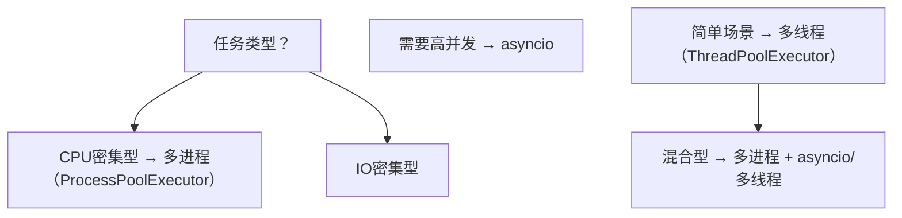

## 1. Python 并发模型概述

### 1.1 三种并发方式

| 方式    | 适用场景  | 特点                    |
| :------ | :-------- | :---------------------- |
| 多线程  | IO密集型  | 受GIL限制，不能真正并行 |
| 多进程  | CPU密集型 | 独立进程，可利用多核    |
| asyncio | IO密集型  | 协程，单线程事件循环    |

### 1.2 GIL（全局解释器锁）

GIL是CPython的互斥锁，确保同一时刻只有一个线程执行Python字节码。

```python
# GIL的影响：多线程无法利用多核加速CPU密集任务
import time
import threading

def cpu_bound_task():
    total = 0
    for i in range(50_000_000):
        total += i
    return total

# 单线程
start = time.perf_counter()
cpu_bound_task()
cpu_bound_task()
print(f"单线程: {time.perf_counter() - start:.2f}s")

# 多线程（由于GIL，不会加速）
start = time.perf_counter()
t1 = threading.Thread(target=cpu_bound_task)
t2 = threading.Thread(target=cpu_bound_task)
t1.start(); t2.start()
t1.join(); t2.join()
print(f"多线程: {time.perf_counter() - start:.2f}s")
# 多线程可能比单线程更慢（线程切换开销）
```

## 2. 多线程

### 2.1 线程创建与管理

```python
import threading
import time

# 方式1：创建Thread实例
def worker(name, delay):
    print(f"线程 {name} 开始")
    time.sleep(delay)
    print(f"线程 {name} 完成")

t1 = threading.Thread(target=worker, args=("A", 2))
t2 = threading.Thread(target=worker, args=("B", 1), daemon=True)

t1.start()
t2.start()
t1.join()  # 等待t1完成
# t2是守护线程，主线程结束时会自动终止

# 方式2：继承Thread类
class MyThread(threading.Thread):
    def __init__(self, name, delay):
        super().__init__(name=name)
        self.delay = delay
        self.result = None

    def run(self):
        time.sleep(self.delay)
        self.result = f"{self.name} completed"

t = MyThread("Worker", 1)
t.start()
t.join()
print(t.result)
```

### 2.2 线程同步

```python
import threading
import time

# Lock: 互斥锁
class SafeCounter:
    def __init__(self):
        self._value = 0
        self._lock = threading.Lock()

    def increment(self):
        with self._lock:  # 自动获取和释放锁
            self._value += 1

    @property
    def value(self):
        with self._lock:
            return self._value

counter = SafeCounter()
threads = []
for _ in range(100):
    t = threading.Thread(target=lambda: [counter.increment() for _ in range(1000)])
    threads.append(t)
    t.start()

for t in threads:
    t.join()

print(f"Counter: {counter.value}")  # 100000

# RLock: 可重入锁（同一线程可多次获取）
class ReentrantExample:
    def __init__(self):
        self._lock = threading.RLock()

    def outer(self):
        with self._lock:
            self.inner()  # 同一线程可以再次获取RLock

    def inner(self):
        with self._lock:
            pass

# Semaphore: 信号量（限制并发数）
semaphore = threading.Semaphore(3)  # 最多3个线程同时访问

def limited_access(task_id):
    with semaphore:
        print(f"Task {task_id} accessing resource")
        time.sleep(1)
    print(f"Task {task_id} done")

threads = [threading.Thread(target=limited_access, args=(i,)) for i in range(10)]
for t in threads: t.start()
for t in threads: t.join()
```

### 2.3 线程间通信

```python
import threading
import queue
import time

# 使用Queue进行线程间通信
def producer(q, count):
    for i in range(count):
        item = f"item-{i}"
        q.put(item)
        print(f"Produced: {item}")
        time.sleep(0.1)
    q.put(None)  # 哨兵值

def consumer(q):
    while True:
        item = q.get()
        if item is None:
            q.task_done()
            break
        print(f"Consumed: {item}")
        q.task_done()

q = queue.Queue(maxsize=10)
t1 = threading.Thread(target=producer, args=(q, 5))
t2 = threading.Thread(target=consumer, args=(q,))

t1.start()
t2.start()
t1.join()
t2.join()

# Event: 线程间信号通知
event = threading.Event()

def waiter():
    print("等待信号...")
    event.wait()  # 阻塞直到set()
    print("收到信号！")

def signaler():
    time.sleep(2)
    print("发送信号")
    event.set()

threading.Thread(target=waiter).start()
threading.Thread(target=signaler).start()

# Condition: 条件变量
condition = threading.Condition()
shared_data = []

def consumer_cond():
    with condition:
        while not shared_data:
            condition.wait()  # 等待通知
        data = shared_data.pop(0)
        print(f"Consumed: {data}")

def producer_cond():
    with condition:
        shared_data.append("new item")
        condition.notify()  # 通知一个等待的线程
```

## 3. 线程池与进程池

### 3.1 ThreadPoolExecutor

```python
from concurrent.futures import ThreadPoolExecutor, as_completed
import time
import requests

# IO密集型：使用线程池
def fetch_url(url):
    response = requests.get(url, timeout=10)
    return url, response.status_code

urls = [
    'https://httpbin.org/get?id=1',
    'https://httpbin.org/get?id=2',
    'https://httpbin.org/get?id=3',
]

with ThreadPoolExecutor(max_workers=3) as executor:
    # 方式1：submit + as_completed
    futures = {executor.submit(fetch_url, url): url for url in urls}
    for future in as_completed(futures):
        url, status = future.result()
        print(f"{url}: {status}")

    # 方式2：map
    for url, status in executor.map(lambda u: fetch_url(u), urls):
        print(f"{url}: {status}")

# 带超时和异常处理
with ThreadPoolExecutor(max_workers=5) as executor:
    futures = [executor.submit(fetch_url, url) for url in urls]
    for future in as_completed(futures, timeout=30):
        try:
            result = future.result(timeout=10)
            print(result)
        except Exception as e:
            print(f"Error: {e}")
```

### 3.2 ProcessPoolExecutor

```python
from concurrent.futures import ProcessPoolExecutor
import time
import math

# CPU密集型：使用进程池
def is_prime(n):
    if n < 2:
        return False
    for i in range(2, int(math.sqrt(n)) + 1):
        if n % i == 0:
            return False
    return True

def count_primes(start, end):
    return sum(1 for n in range(start, end) if is_prime(n))

# 多进程加速CPU密集任务
if __name__ == '__main__':
    ranges = [(1, 250000), (250000, 500000), (500000, 750000), (750000, 1000000)]

    # 单进程
    start = time.perf_counter()
    total = sum(count_primes(s, e) for s, e in ranges)
    print(f"单进程: {total} primes, {time.perf_counter() - start:.2f}s")

    # 多进程
    start = time.perf_counter()
    with ProcessPoolExecutor(max_workers=4) as executor:
        results = executor.map(count_primes, *zip(*ranges))
        total = sum(results)
    print(f"多进程: {total} primes, {time.perf_counter() - start:.2f}s")
```

## 4. asyncio 异步编程

### 4.1 基本用法

```python
import asyncio

# 定义协程
async def hello(name, delay):
    print(f"Hello {name} 开始")
    await asyncio.sleep(delay)  # 非阻塞等待
    print(f"Hello {name} 完成")
    return f"Result for {name}"

# 运行协程
async def main():
    # 串行执行
    result1 = await hello("Alice", 2)
    result2 = await hello("Bob", 1)
    print(result1, result2)

asyncio.run(main())

# 并发执行
async def main_concurrent():
    # gather: 并发运行多个协程
    results = await asyncio.gather(
        hello("Alice", 2),
        hello("Bob", 1),
        hello("Charlie", 1.5),
    )
    print(results)

asyncio.run(main_concurrent())
```

### 4.2 异步IO操作

```python
import asyncio
import aiohttp

# 异步HTTP请求
async def fetch(session, url):
    async with session.get(url) as response:
        return await response.json()

async def fetch_all(urls):
    async with aiohttp.ClientSession() as session:
        tasks = [fetch(session, url) for url in urls]
        results = await asyncio.gather(*tasks, return_exceptions=True)
        return results

# 异步文件操作（Python 3.11+ aiofiles）
async def read_file_async(path):
    import aiofiles
    async with aiofiles.open(path, 'r') as f:
        content = await f.read()
    return content

# 异步TCP
async def tcp_client():
    reader, writer = await asyncio.open_connection('example.com', 80)
    writer.write(b'GET / HTTP/1.1\r\nHost: example.com\r\n\r\n')
    await writer.drain()
    data = await reader.read(1024)
    writer.close()
    await writer.wait_closed()
    return data.decode()
```

### 4.3 异步同步原语

```python
import asyncio

# asyncio.Lock
async def lock_demo():
    lock = asyncio.Lock()
    async with lock:
        # 临界区
        await asyncio.sleep(0.1)

# asyncio.Semaphore
async def semaphore_demo():
    sem = asyncio.Semaphore(3)  # 最多3个并发

    async def limited_task(task_id):
        async with sem:
            print(f"Task {task_id} started")
            await asyncio.sleep(1)
            print(f"Task {task_id} done")

    await asyncio.gather(*[limited_task(i) for i in range(10)])

# asyncio.Queue
async def producer_consumer():
    queue = asyncio.Queue(maxsize=5)

    async def producer():
        for i in range(10):
            await queue.put(i)
            print(f"Produced: {i}")
            await asyncio.sleep(0.1)

    async def consumer():
        while True:
            item = await queue.get()
            print(f"Consumed: {item}")
            queue.task_done()
            await asyncio.sleep(0.2)

    prod_task = asyncio.create_task(producer())
    cons_task = asyncio.create_task(consumer())

    await prod_task
    await queue.join()
    cons_task.cancel()

asyncio.run(producer_consumer())
```

## 5. 常见问题与解决方案

### 5.1 线程安全的数据共享

```python
# 问题：多线程修改共享数据
import threading

counter = 0
lock = threading.Lock()

def safe_increment():
    global counter
    for _ in range(100000):
        with lock:
            counter += 1

# 解决方案2：使用threading.local
local_data = threading.local()

def process_with_local():
    local_data.value = 0
    for _ in range(1000):
        local_data.value += 1
    print(f"Thread local value: {local_data.value}")
```

### 5.2 进程间通信

```python
from multiprocessing import Process, Queue, Value, Array

# 使用Queue通信
def producer_mp(q):
    for i in range(5):
        q.put(i)
    q.put(None)  # 结束信号

def consumer_mp(q):
    while True:
        item = q.get()
        if item is None:
            break
        print(f"Got: {item}")

q = Queue()
p1 = Process(target=producer_mp, args=(q,))
p2 = Process(target=consumer_mp, args=(q,))
p1.start(); p2.start()
p1.join(); p2.join()

# 使用共享内存
def worker_mp(val, arr):
    val.value += 1
    arr[0] = -1

val = Value('i', 0)     # 共享整数
arr = Array('d', [1.0, 2.0, 3.0])  # 共享数组
p = Process(target=worker_mp, args=(val, arr))
p.start(); p.join()
```

### 5.3 asyncio 与同步代码混用

```python
import asyncio

# 在async中调用同步阻塞函数
async def mixed_code():
    loop = asyncio.get_event_loop()

    # 方式1：run_in_executor（在线程池中运行）
    result = await loop.run_in_executor(None, blocking_function)

    # 方式2：使用asyncio.to_thread（Python 3.9+）
    result = await asyncio.to_thread(blocking_function)

def blocking_function():
    import time
    time.sleep(1)
    return "result"
```

## 6. 总结与最佳实践

### 6.1 并发方式选择



### 6.2 最佳实践

1. **CPU密集用多进程**：绕过GIL限制
2. **IO密集用asyncio**：高并发、低开销
3. **简单IO用线程池**：代码更直观
4. **避免共享状态**：使用Queue通信
5. **设置超时**：防止任务永久阻塞
6. **进程池在 `if __name__ == '__main__'` 中使用**：Windows必须
7. **合理设置并发数**：线程/进程数不超过CPU核数×2
## ThreadPoolExecutor 线程池

**基本写法：创建线程池**
`concurrent.futures.ThreadPoolExecutor(max_workers=<数量>)`
```python
# 创建线程池
from concurrent.futures import ThreadPoolExecutor

with ThreadPoolExecutor(max_workers=4) as executor:
    pass
```

**基本写法：submit 提交任务**
`executor.submit(<函数>, *<参数>)`
```python
# 提交单个任务并返回 Future
with ThreadPoolExecutor(max_workers=4) as executor:
    future = executor.submit(pow, 2, 8)
    print(future.result())
```

**基本写法：map 批量提交**
`executor.map(<函数>, <可迭代>)`
```python
# 批量提交并按顺序返回结果
def square(x):
    return x * x

with ThreadPoolExecutor() as executor:
    results = list(executor.map(square, [1, 2, 3, 4]))
    print(results)
```

---

## ProcessPoolExecutor 进程池

**基本写法：创建进程池**
`concurrent.futures.ProcessPoolExecutor(max_workers=<数量>)`
```python
# 创建进程池
from concurrent.futures import ProcessPoolExecutor

with ProcessPoolExecutor(max_workers=4) as executor:
    future = executor.submit(pow, 2, 8)
    print(future.result())
```

**基本写法：进程池 map**
`executor.map(<函数>, <可迭代>)`
```python
# 进程池批量处理 CPU 密集任务
def heavy(n):
    return sum(i * i for i in range(n))

if __name__ == "__main__":
    with ProcessPoolExecutor() as executor:
        results = list(executor.map(heavy, [100000, 200000, 300000]))
```

---

## Future 对象

**基本写法：result 获取结果**
`future.result(timeout=<秒>)`
```python
# 阻塞等待结果
future = executor.submit(pow, 2, 8)
print(future.result(timeout=5))
```

**基本写法：exception 获取异常**
`future.exception()`
```python
# 获取任务抛出的异常
future = executor.submit(lambda: 1 / 0)
try:
    future.result()
except ZeroDivisionError:
    print(future.exception())
```

**基本写法：done 判断完成**
`future.done()`
```python
# 判断任务是否完成
print(future.done())
```

**基本写法：cancelled 判断取消**
`future.cancelled()`
```python
# 判断任务是否被取消
print(future.cancelled())
```

**基本写法：cancel 取消任务**
`future.cancel()`
```python
# 尝试取消未开始的任务
future = executor.submit(pow, 2, 8)
future.cancel()
```

**基本写法：add_done_callback 回调**
`future.add_done_callback(<函数>)`
```python
# 任务完成时回调
def on_done(fut):
    print("结果:", fut.result())

future = executor.submit(pow, 2, 8)
future.add_done_callback(on_done)
```

---

## wait 等待多个 Future

**基本写法：wait 等待**
`concurrent.futures.wait(<Future 列表>)`
```python
# 等待所有任务完成
from concurrent.futures import wait

futures = [executor.submit(pow, 2, i) for i in range(5)]
done, not_done = wait(futures)
print([f.result() for f in done])
```

**基本写法：指定 return_when**
`wait(<列表>, return_when=<常量>)`
```python
# FIRST_COMPLETED 首个完成即返回
from concurrent.futures import wait, FIRST_COMPLETED

done, not_done = wait(futures, return_when=FIRST_COMPLETED)
```

**基本写法：指定 timeout**
`wait(<列表>, timeout=<秒>)`
```python
# 超时返回
done, not_done = wait(futures, timeout=2.0)
```

---

## as_completed 按完成顺序

**基本写法：as_completed 迭代**
`concurrent.futures.as_completed(<Future 列表>)`
```python
# 按完成顺序迭代结果
from concurrent.futures import as_completed

futures = [executor.submit(pow, 2, i) for i in range(5)]
for future in as_completed(futures):
    print(future.result())
```

**基本写法：带超时**
`as_completed(<列表>, timeout=<秒>)`
```python
# 带超时迭代
for future in as_completed(futures, timeout=5):
    try:
        print(future.result())
    except TimeoutError:
        break
```

---

## 异常处理

**基本写法：捕获任务异常**
`try: future.result()\nexcept <异常>:`
```python
# 任务异常会通过 result() 重新抛出
futures = [executor.submit(lambda: 1 / 0)]
for future in as_completed(futures):
    try:
        future.result()
    except ZeroDivisionError as e:
        print("任务异常:", e)
```

---

## Executor 上下文管理

**基本写法：with 自动关闭**
`with ThreadPoolExecutor() as executor:`
```python
# with 块结束时会调用 executor.shutdown(wait=True)
with ThreadPoolExecutor(max_workers=4) as executor:
    executor.submit(task)
```

**基本写法：shutdown 手动关闭**
`executor.shutdown(wait=<bool>, cancel_futures=<bool>)`
```python
# 手动关闭执行器
executor = ThreadPoolExecutor()
executor.submit(task)
executor.shutdown(wait=True, cancel_futures=True)
```

## 参考文献

Python 官方文档：https://docs.python.org/zh-cn/3/
PEP 8 样式指南：https://peps.python.org/pep-0008/
Python 之禅（PEP 20）：https://peps.python.org/pep-0020/
Python 类型注解指南（PEP 484）：https://peps.python.org/pep-0484/
Python 打包用户指南：https://packaging.python.org/
Real Python 教程站：https://realpython.com/

## 延伸阅读

Python 数据类型与内置容器，见 040-python 模块的基础文档。
Python 异步编程（asyncio/FastAPI），见 040-python 模块的异步与 Web 文档。
Python 数据分析（NumPy/Pandas），见 051-data-analysis 模块。
Python 与数据库交互（SQLAlchemy），见 019-sql 模块相关文档。
黑马程序员 Bilibili 空间（https://space.bilibili.com/37974444 ）提供 Python 全栈课程；尚硅谷 Bilibili 空间（https://space.bilibili.com/302417610 ）提供 Python 后端课程。

## 模块文档速查表

| 文档 | 主题 | 与本文的关联 |
| --- | --- | --- |
| Python 概述与环境配置 | 001-PythonOverviewEnvSetup | 本文的前置基础 |
| 程序结构与基本语法 | 002-ProgramStructureBasicSyntax | 本文的并列主题 |
| 变量与常量 | 003-VariableConstant | 本文的并列主题 |
| Python 描述符协议：属性访问的底层机制与工程实践 | 004-PythonDescriptorProtocol | 本文的原理深化 |
| Python 基础数据类型：从对象模型到工程实践的深度解析 | 005-PythonBasicsDataTypeObjectModelPracticeDeepAnalysis | 本文的前置基础 |
| 协程与asyncio | 006-CoroutineAsyncio | 本文的并列主题 |
| 列表推导式进阶 | 007-ListComprehensionAdvanced | 本文的并列主题 |
| 运算符与表达式 | 008-OperatorExpression | 本文的并列主题 |
| Python与虚拟环境 | 009-PythonVirtualEnv | 本文的前置基础 |
| 元类 | 010-Metaclass | 本文的并列主题 |
| Python与SQLAlchemy | 011-PythonSQLAlchemy | 本文的并列主题 |
| 多进程与多线程 | 012-MultiprocessingMultithreading | 本文的并列主题 |
| Python与FastAPI | 013-PythonFastAPI | 本文的并列主题 |
| Python与Django | 014-PythonDjango | 本文的并列主题 |
| 数据类与Pydantic | 015-DataClassPydantic | 本文的并列主题 |
| Python与Redis | 016-PythonRedis | 本文的并列主题 |
| Python 与 Celery：分布式任务队列的设计、实现与工程实践 | 017-PythonCeleryDistributedTaskQueue | 本文的并列主题 |
| 控制流 | 018-ControlFlow | 本文的并列主题 |
| Python与Docker | 019-PythonDocker | 本文的并列主题 |
| Python与机器学习 | 020-PythonMachineLearning | 本文的并列主题 |
| Python与深度学习 | 021-PythonDeepLearning | 本文的并列主题 |
| Python与NLP | 022-PythonAndNLP | 本文的并列主题 |
| Python与计算机视觉 | 023-PythonComputerVision | 本文的并列主题 |
| Python与Web爬虫 | 024-WebScrapingWithPython | 本文的并列主题 |
| Python与自动化 | 025-PythonAutomationCookbook | 本文的并列主题 |
| 函数详解 | 026-FunctionDetailed | 本文的并列主题 |
| Python与日志 | 027-PythonLog | 本文的并列主题 |
| Python与加密 | 028-PythonAndCryptography | 本文的安全延伸 |
| Python与测试 | 029-PythonTest | 本文的并列主题 |
| Python 与配置管理：从环境变量到云原生动态配置的工程实践 | 030-Python | 本文的前置基础 |
| 装饰器 | 031-Decorator | 本文的并列主题 |
| Python与消息队列 | 032-PythonMessageQueue | 本文的并列主题 |
| Python与gRPC | 033-PythongRPC | 本文的并列主题 |
| Python与WebSocket | 034-PythonWebSocket | 本文的并列主题 |
| Python与CI-CD | 035-PythonCICD | 本文的并列主题 |
| Python与性能优化 | 036-PythonPerformance | 本文的性能延伸 |
| 内置数据结构 | 037-BuiltinDataStructure | 本文的并列主题 |
| 正则表达式 | 038-Regex | 本文的并列主题 |
| Python与CLI | 039-PythonCLI | 本文的并列主题 |
| Python与设计模式 | 040-PythonDesignPattern | 本文的并列主题 |
| Python与打包发布 | 041-ASurveyOfPythonPackagingPastPresentAndFuture | 本文的并列主题 |
| Python 与 Jupyter：交互式计算、数据分析与可复现研究 | 042-PythonJupyter | 本文的并列主题 |
| Python与GraphQL | 043-PythonGraphQL | 本文的并列主题 |
| Python与代码质量 | 044-PythonCodeQuality | 本文的并列主题 |
| 并发编程 | 045-ConcurrentProgramming | 本文自身 |
| Python与数据库迁移 | 046-PythonDatabaseMigration | 本文的并列主题 |
| Python与OAuth2 | 047-PythonOAuth2 | 本文的并列主题 |
| Python与向量数据库 | 048-PythonVectorDatabase | 本文的并列主题 |
| Python 进阶与最新特性 | 049-PythonAdvancedLatestFeature | 本文的并列主题 |
| 推导式与生成器 | 050-ComprehensionGenerator | 本文的并列主题 |
| 模块、包与工程化 | 051-ModulePackageEngineering | 本文的并列主题 |
| 上下文管理器 | 052-ContextManager | 本文的并列主题 |
| 元类与单例模式 | 053-MetaclassSingleton | 本文的并列主题 |
| 异步编程详解 | 054-AsyncProgrammingDetailed | 本文的并列主题 |
| 弱引用 | 055-WeakReference | 本文的并列主题 |
| 打包与发布 | 056-PackagePublish | 本文的并列主题 |
| 描述符 | 057-Descriptor | 本文的并列主题 |
| 数据类与字段默认值 | 058-DataClassFieldDefault | 本文的并列主题 |
| 生成器与协程 | 059-GeneratorCoroutine | 本文的并列主题 |
| 类型注解与mypy | 060-TypeAnnotationMypy | 本文的并列主题 |
| 面向对象编程 | 061-OOP | 本文的并列主题 |
| 装饰器进阶 | 062-DecoratorAdvanced | 本文的并列主题 |
| 异常处理 | 063-ExceptionHandling | 本文的并列主题 |
| 文件 I/O 与上下文管理器 | 064-FileIOContextManager | 本文的并列主题 |
| Python 项目示例：网页爬虫与数据分析 | 065-PythonProjectExampleWebCrawlerDataAnalysis | 本文的综合应用 |
| Python 理论知识点 | 066-PythonTheoryKnowledge | 本文的并列主题 |
| 基础数据类型 | 067-BasicDataType | 本文的前置基础 |
| Python 面向对象基础 | 068-COOPBasics | 本文的前置基础 |
| Python 面向对象进阶 | 069-COOPAdvanced | 本文的并列主题 |
| Python pathlib 路径操作 | 070-Pathlib | 本文的并列主题 |
| Python itertools 迭代工具 | 071-Itertools | 本文的并列主题 |
| Python functools 函数工具 | 072-Functools | 本文的并列主题 |
| Python datetime 与 time | 073-DatetimeTime | 本文的并列主题 |
| Python 序列化 JSON/CSV/Pickle | 074-SerializationJsonCsvPickle | 本文的并列主题 |
| Python 网络编程 socket/http | 075-NetworkSocketHttp | 本文的并列主题 |
| Python sys/os 平台接口 | 076-SysOsPlatform | 本文的并列主题 |
| Python math/random/statistics | 077-MathRandomStatistics | 本文的并列主题 |
| Python subprocess 子进程 | 078-Subprocess | 本文的并列主题 |
| Python logging 日志配置 | 079-Logging | 本文的并列主题 |
| Python 测试 unittest/pytest | 080-UnittestPytest | 本文的并列主题 |
| Python 字符串格式化与方法 | 081-StringFormattingMethods | 本文的并列主题 |
| Python argparse 命令行参数解析 | 082-ArgparseCli | 本文的并列主题 |
| Python typing 进阶 | 083-TypingAdvanced | 本文的并列主题 |
| Python enum 枚举 | 084-Enum | 本文的并列主题 |
| Python hashlib 与 hmac | 085-HashlibHmac | 本文的并列主题 |
| Python ssl 安全套接字 | 086-SslCrypto | 本文的安全延伸 |
| Python http.client HTTP 客户端 | 087-HttpClient | 本文的并列主题 |
| Python sqlite3 数据库 | 088-Sqlite3 | 本文的并列主题 |
| Python zipfile 与 tarfile | 089-ZipfileTarfile | 本文的并列主题 |
| Python array 与 bisect | 090-ArrayBisect | 本文的并列主题 |
| Python 字符串与文本处理 | 091-StringText | 本文的并列主题 |
| Python decimal 与 fractions | 092-DecimalFractions | 本文的并列主题 |
| Python shutil 与 tempfile | 093-ShutilTempfile | 本文的并列主题 |
| Python gc inspect dis | 094-GcInspect | 本文的并列主题 |
| Python traceback 与 warnings | 095-TracebackWarnings | 本文的并列主题 |
| Python httpx 与 requests | 096-HttpxRequests | 本文的并列主题 |
| Python 性能分析与优化 | 097-ProfilingOptimization | 本文的性能延伸 |
