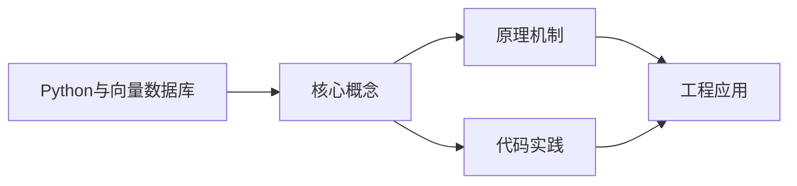
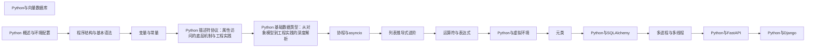

## 1. 学习目标（Bloom 分类）

本节按照布鲁姆教育目标分类学组织学习路径。本文主题为《Python与向量数据库》，属于 Python 模块，读者可以根据自身阶段选择阅读深度。

记忆层面：能够准确复述本文的核心概念、术语与基本语法或操作步骤，并能够在提问或检索时快速定位对应知识点。例如能够说出 Python 的动态类型、缩进语法与解释执行等基本特征。

理解层面：能够用自己的语言解释核心原理与工作机制，说明概念之间的因果关系，而不是机械记忆结论。例如能够解释解释器与编译器的差异，以及 GIL 对并发的影响。

应用层面：能够在真实项目或练习场景中运用本文知识解决具体问题，写出正确且可维护的实现。例如能够编写函数、类与标准库调用的完整脚本。

分析层面：能够拆解复杂问题，比较本文主题与相邻概念的异同，识别边界条件与例外情况。例如能够比较 Python 与 Java、Go 在类型系统与并发模型上的差异。

评价层面：能够根据约束条件（性能、可读性、安全、成本）评价不同方案的优劣，做出有依据的技术决策。例如能够评估不同实现方案（脚本、服务、库）的适用场景。

创造层面：能够把本文知识与其他模块知识组合，设计出新的解决方案或可复用的工程模式。例如能够组合标准库与第三方包设计完整的自动化工具。

通过本节学习，读者应当能够把《Python与向量数据库》纳入自己的知识网络，并与 Python 模块的其他主题（数据类型、函数、模块、异常、并发）建立关联。

## 2. 历史动机与发展脉络

《Python与向量数据库》是 Python 领域的重要主题。要真正理解它，需要先了解它解决的问题与演进过程。

Python 由 Guido van Rossum 于 1991 年首次发布，设计哲学强调代码可读性与开发效率，核心思想记录在《Python 之禅》（PEP 20）中：优美优于丑陋、明确优于隐晦、简单优于复杂。
Python 2 与 Python 3 的分裂期（2008-2020）是语言史上最重要的兼容性事件：Python 3 修复了字符串编码、整数除法等长期问题，但破坏性变更导致迁移缓慢；2020 年 1 月 Python 2 停止官方维护，社区全面转向 Python 3。
Python 3.9 至 3.13 的演进带来了类型提示增强（PEP 604 的 X | Y 语法、PEP 695 的泛型语法）、性能优化（3.11 的 faster-calls 与自适应解释器）以及异步生态的成熟（asyncio、FastAPI、httpx）。
Python 的应用版图从脚本自动化扩展到 Web 后端（Django、FastAPI）、数据科学（NumPy、Pandas、Matplotlib）、机器学习（PyTorch、scikit-learn）、运维自动化（Ansible）与科学计算，是当今最通用的编程语言之一。

回到本文主题：Python与向量数据库 的提出与成熟，正是上述技术背景下的必然产物。早期实现往往以简单可用为目标，随着工程规模扩大，社区逐渐沉淀出标准做法与最佳实践；理解这一脉络，可以帮助读者判断“为什么文档中的推荐写法是现在这个样子”，也能在遇到历史遗留代码时准确识别其设计年代与取舍。

对于初学者，理解 Python 的“电池内置”（标准库丰富）与“胶水语言”（易于调用 C/C++/Rust 扩展）两大特性，是判断其适用场景的基础。

## 3. 形式化定义与核心概念精讲

本节把《Python与向量数据库》涉及的核心概念以“定义 + 讲解”的形式展开。读者应把定义当作工具，把讲解当作理解路径；两者结合才能形成可迁移的知识。

变量与动态类型：Python 变量是对象的引用，类型属于对象而非变量；`isinstance()` 与 `type()` 用于运行时检查，类型注解（PEP 484）提供静态检查能力但不改变运行时行为。
缩进即语法：Python 用缩进表达代码块层次，避免了花括号噪声，也强制了代码排版一致性；同一代码块必须使用一致的空格数（官方推荐 4 空格）。
函数是一等公民：函数可以赋值、传参、返回，配合 lambda、装饰器与闭包，构成函数式编程能力的基础。
模块与包：每个 `.py` 文件是模块，目录加 `__init__.py` 是包；`import` 机制支持绝对导入、相对导入与命名空间包。
异常处理：`try/except/finally` 与 `raise` 构成错误传播体系；`with` 语句通过上下文管理器（`__enter__/__exit__`）管理资源生命周期。

### 3.1 原文章节逐一精讲

原文档把主题拆分为 7 个小节，下面按顺序给出每一节的导读讲解，随后保留原文细节供精读。

#### 原文精读（完整保留）


#### 什么是向量数据库

向量数据库是专门用来存储和检索向量（一组浮点数）的数据库。在大语言模型和 AI 应用中，文本、图片等数据会被转换成高维向量（比如 1536 维的浮点数组），向量数据库能快速找到与某个向量最相似的其他向量。

这种"相似性搜索"是 RAG（检索增强生成）技术的核心。当你向 AI 提问时，系统先把你的问题转成向量，在向量数据库中找到最相关的文档片段，再把这些片段提供给大语言模型来生成回答。

#### 基础概念

##### 向量嵌入（Embedding）

向量嵌入是把非结构化数据（文本、图片、音频）转换成数值向量的过程。例如，一句话"今天天气很好"经过嵌入模型处理后，可能变成一个 1536 维的浮点数组。语义相近的文本，其向量在空间中的距离也相近。

##### 相似度计算

向量数据库通过计算向量之间的距离来判断相似度。常用的距离度量有：

- 余弦相似度：计算两个向量夹角的余弦值，范围 -1 到 1，值越大越相似
- 欧氏距离：两个向量在空间中的直线距离，值越小越相似
- 内积（点积）：两个向量对应位置相乘再求和

##### RAG（检索增强生成）

RAG 的工作流程：用户提问 -> 问题转成向量 -> 在向量数据库中检索相关文档 -> 将文档和问题一起交给大语言模型 -> 生成回答。这样大语言模型就能基于你自己的数据来回答问题，而不仅限于训练数据。

##### 常见的向量数据库

- ChromaDB：轻量级，适合本地开发和原型验证
- Pinecone：全托管云服务，适合生产环境
- Milvus：高性能分布式向量数据库，适合大规模数据
- Qdrant：用 Rust 编写的高性能向量搜索引擎
- Weaviate：支持混合搜索（向量+关键词）

#### 快速上手

##### 安装 ChromaDB

```bash
# 安装 ChromaDB
pip install chromadb

# 安装 OpenAI SDK（用于生成嵌入向量）
pip install openai
```

##### 最简单的向量存储和检索

```python
import chromadb

# 创建内存模式的客户端（数据不持久化）
client = chromadb.Client()

# 创建或获取一个集合（类似数据库中的表）
collection = client.get_or_create_collection("my_docs")

# 添加文档（ChromaDB 会自动使用默认嵌入模型）
collection.add(
    documents=["Python 是一种编程语言", "Java 也是一种编程语言", "今天天气很好"],
    ids=["doc1", "doc2", "doc3"]
)

# 查询与"编程"最相关的文档
results = collection.query(
    query_texts=["编程语言有哪些"],
    n_results=2  # 返回最相似的 2 个结果
)

print(results["documents"])
# 输出: [['Python 是一种编程语言', 'Java 也是一种编程语言']]
```

##### 使用持久化存储

上面的例子数据只存在于内存中，程序关闭后就丢失了。使用持久化客户端可以将数据保存到磁盘：

```python
import chromadb

# 创建持久化客户端（数据保存到指定目录）
client = chromadb.PersistentClient(path="./chroma_data")

# 创建集合
collection = client.get_or_create_collection("my_docs")

# 添加文档
collection.add(
    documents=["第一篇文档的内容", "第二篇文档的内容"],
    ids=["1", "2"]
)

# 下次启动程序时，数据依然存在
```

#### 详细用法

##### 手动指定嵌入向量

如果你有自己的嵌入模型，可以手动计算向量并存入 ChromaDB：

```python
import chromadb

client = chromadb.Client()
collection = client.get_or_create_collection("custom_embeddings")

# 手动提供嵌入向量（这里用模拟数据，实际应使用嵌入模型生成）
# 假设每个文档对应一个 3 维向量
collection.add(
    documents=["苹果是一种水果", "香蕉也是一种水果", "汽车是交通工具"],
    embeddings=[
        [0.9, 0.1, 0.0],  # 苹果的向量
        [0.85, 0.15, 0.0],  # 香蕉的向量（和苹果相近）
        [0.0, 0.1, 0.9],  # 汽车的向量（和水果相远）
    ],
    ids=["1", "2", "3"]
)

# 用向量进行查询
results = collection.query(
    query_embeddings=[[0.9, 0.1, 0.0]],  # 查询和苹果相近的文档
    n_results=2
)

print(results["documents"])
# 输出: [['苹果是一种水果', '香蕉也是一种水果']]
```

##### 添加元数据

元数据是附加在文档上的额外信息，可以用来过滤搜索结果：

```python
import chromadb

client = chromadb.Client()
collection = client.get_or_create_collection("articles")

# 添加带元数据的文档
collection.add(
    documents=["Python 入门教程", "Java 高级编程", "Python 数据分析"],
    metadatas=[
        {"category": "tutorial", "language": "python", "level": "beginner"},
        {"category": "book", "language": "java", "level": "advanced"},
        {"category": "tutorial", "language": "python", "level": "intermediate"},
    ],
    ids=["1", "2", "3"]
)

# 查询时通过元数据过滤：只搜索 Python 相关的文档
results = collection.query(
    query_texts=["学习编程"],
    n_results=10,
    where={"language": "python"}  # 过滤条件
)

print(results["documents"])
# 输出: [['Python 入门教程', 'Python 数据分析']]
```

##### 更新和删除文档

```python
import chromadb

client = chromadb.Client()
collection = client.get_or_create_collection("my_docs")

# 先添加文档
collection.add(
    documents=["原始内容"],
    ids=["1"]
)

# 更新文档（id 不变，内容替换）
collection.update(
    documents=["更新后的内容"],
    ids=["1"]
)

# 也可以用 upsert（存在则更新，不存在则添加）
collection.upsert(
    documents=["再次更新的内容"],
    ids=["1"]
)

# 删除文档
collection.delete(ids=["1"])

# 删除整个集合
client.delete_collection("my_docs")
```

##### 使用 OpenAI 嵌入模型

在实际项目中，通常使用 OpenAI 的嵌入模型来生成向量：

```python
import chromadb
from openai import OpenAI

# 初始化 OpenAI 客户端
openai_client = OpenAI()

def get_embedding(text: str) -> list[float]:
    """使用 OpenAI 的嵌入模型将文本转换为向量"""
    response = openai_client.embeddings.create(
        model="text-embedding-3-small",
        input=text
    )
    return response.data[0].embedding

# 创建 ChromaDB 集合
chroma_client = chromadb.PersistentClient(path="./chroma_data")
collection = chroma_client.get_or_create_collection("knowledge_base")

# 添加文档
docs = [
    "Python 是一种解释型编程语言",
    "FastAPI 是一个高性能的 Python Web 框架",
    "Docker 可以将应用容器化部署",
]

for i, doc in enumerate(docs):
    embedding = get_embedding(doc)
    collection.upsert(
        documents=[doc],
        embeddings=[embedding],
        ids=[str(i)]
    )

# 查询
query = "Python Web 开发"
query_embedding = get_embedding(query)

results = collection.query(
    query_embeddings=[query_embedding],
    n_results=2
)

print(results["documents"])
```

##### 构建简单的 RAG 系统

下面是一个完整的 RAG 系统示例，包含文档入库、检索和生成回答：

```python
import chromadb
from openai import OpenAI

openai_client = OpenAI()
chroma_client = chromadb.PersistentClient(path="./rag_data")
collection = chroma_client.get_or_create_collection("rag_docs")

def get_embedding(text: str) -> list[float]:
    """生成文本的嵌入向量"""
    response = openai_client.embeddings.create(
        model="text-embedding-3-small",
        input=text
    )
    return response.data[0].embedding

def add_documents(texts: list[str]):
    """将文档添加到向量数据库"""
    for i, text in enumerate(texts):
        embedding = get_embedding(text)
        collection.upsert(
            documents=[text],
            embeddings=[embedding],
            ids=[f"doc_{i}"],
            metadatas=[{"source": "user_input"}]
        )

def search_documents(query: str, n_results: int = 3) -> list[str]:
    """检索与查询最相关的文档"""
    query_embedding = get_embedding(query)
    results = collection.query(
        query_embeddings=[query_embedding],
        n_results=n_results
    )
    return results["documents"][0]

def ask_question(question: str) -> str:
    """RAG 问答：检索相关文档，然后让大模型生成回答"""
    # 第一步：检索相关文档
    relevant_docs = search_documents(question)

    # 第二步：构建提示词
    context = "\n".join(relevant_docs)
    prompt = f"""请根据以下参考资料回答问题。如果参考资料中没有相关信息，请说明。

参考资料：
{context}

问题：{question}

回答："""

    # 第三步：调用大语言模型生成回答
    response = openai_client.chat.completions.create(
        model="gpt-4o-mini",
        messages=[{"role": "user", "content": prompt}]
    )

    return response.choices[0].message.content

# 使用示例
# 先添加知识库文档
add_documents([
    "Python 的 GIL（全局解释器锁）使得同一时刻只有一个线程执行 Python 字节码。",
    "FastAPI 支持 async/await 异步编程，可以高效处理并发请求。",
    "Celery 是 Python 的分布式任务队列，常用于处理耗时操作如发送邮件、生成报表。",
])

# 然后提问
answer = ask_question("Python 如何处理异步任务？")
print(answer)
```

#### 常见场景

##### 文档问答系统

将公司内部文档（PDF、Word、Wiki）分块后存入向量数据库，员工可以通过自然语言提问，系统自动检索相关内容并生成回答。

```python
# 将长文档切分成小块
def split_text(text: str, chunk_size: int = 500, overlap: int = 50) -> list[str]:
    """将长文本切分成重叠的小块"""
    chunks = []
    start = 0
    while start < len(text):
        end = start + chunk_size
        chunks.append(text[start:end])
        start += chunk_size - overlap  # 重叠部分确保不丢失上下文
    return chunks

# 处理长文档
long_text = "这是一篇很长的文档..."  # 你的文档内容
chunks = split_text(long_text)

# 将每个块存入向量数据库
for i, chunk in enumerate(chunks):
    embedding = get_embedding(chunk)
    collection.upsert(
        documents=[chunk],
        embeddings=[embedding],
        ids=[f"chunk_{i}"],
        metadatas=[{"chunk_index": i}]
    )
```

##### 语义搜索

传统的关键词搜索只能匹配包含相同词的文档，语义搜索能理解用户意图，找到意思相近但不包含相同关键词的文档：

```python
# 添加文档
collection.add(
    documents=[
        "如何提高代码质量",
        "代码审查的最佳实践",
        "数据库性能优化方法",
    ],
    ids=["1", "2", "3"]
)

# 语义搜索：即使用词不同，也能找到相关文档
results = collection.query(
    query_texts=["怎样写出更好的程序"],  # 没有用"代码质量"这个词
    n_results=2
)
# 仍然能找到"如何提高代码质量"和"代码审查的最佳实践"
```

##### 推荐系统

通过向量相似度为用户推荐内容：

```python
# 假设用户喜欢某篇文章，找到相似的文章推荐
liked_article = "Python 异步编程入门"
results = collection.query(
    query_texts=[liked_article],
    n_results=5
)

# 返回与用户喜欢的文章最相似的内容
for doc in results["documents"][0]:
    print(f"推荐: {doc}")
```

#### 注意事项与常见错误

##### 嵌入模型的选择

嵌入模型的质量直接决定搜索效果。不同的嵌入模型生成的向量维度和语义空间不同，不能混用。一旦选定了嵌入模型，整个项目都应该使用同一个模型。

##### 文档分块策略

文档太大时需要切分成小块再存入向量数据库。分块太小会丢失上下文，太大会导致检索不精确。一般建议每块 300-1000 个字符，相邻块之间有 50-100 个字符的重叠。

##### 向量维度必须一致

同一个集合中所有向量的维度必须相同。如果你使用的嵌入模型输出 1536 维向量，那么所有文档和查询的向量都必须是 1536 维。

##### ChromaDB 不适合大规模生产环境

ChromaDB 适合开发和小规模应用。如果数据量超过百万级别或需要高可用性，应该考虑 Milvus、Pinecone 等专业向量数据库。

##### 搜索结果需要验证

向量搜索返回的是"语义相似"的结果，但不一定是"正确"的结果。在 RAG 系统中，应该让大语言模型判断检索到的内容是否真的与问题相关。

#### 进阶用法

##### 使用 Qdrant 向量数据库

Qdrant 是一个高性能的开源向量数据库，适合生产环境：

```bash
# 安装 Qdrant 客户端
pip install qdrant-client
```

```python
from qdrant_client import QdrantClient
from qdrant_client.models import Distance, VectorParams, PointStruct

# 连接 Qdrant（本地模式）
client = QdrantClient(":memory:")

# 也可以连接远程服务器
# client = QdrantClient(url="http://localhost:6333")

# 创建集合
client.create_collection(
    collection_name="my_docs",
    vectors_config=VectorParams(size=3, distance=Distance.COSINE),
)

# 插入向量
client.upsert(
    collection_name="my_docs",
    points=[
        PointStruct(id=1, vector=[0.9, 0.1, 0.0], payload={"text": "苹果是一种水果"}),
        PointStruct(id=2, vector=[0.85, 0.15, 0.0], payload={"text": "香蕉也是一种水果"}),
        PointStruct(id=3, vector=[0.0, 0.1, 0.9], payload={"text": "汽车是交通工具"}),
    ]
)

# 搜索
results = client.search(
    collection_name="my_docs",
    query_vector=[0.9, 0.1, 0.0],
    limit=2
)

for result in results:
    print(f"相似度: {result.score:.4f}, 内容: {result.payload['text']}")
```

##### 混合搜索

混合搜索结合了向量搜索和关键词搜索的优点，既能理解语义，又能精确匹配关键词：

```python
import chromadb

client = chromadb.Client()
collection = client.get_or_create_collection("hybrid_search")

# 添加文档
collection.add(
    documents=[
        "Python 3.12 发布于 2023 年 10 月",
        "Python 是最流行的编程语言之一",
        "Java 21 也发布了新特性",
    ],
    ids=["1", "2", "3"]
)

# 向量搜索（语义匹配）
vector_results = collection.query(
    query_texts=["Python 最新版本"],
    n_results=2
)

# 结合关键词过滤
filtered_results = collection.query(
    query_texts=["编程语言"],
    n_results=10,
    where_document={"$contains": "Python"}  # 文档必须包含"Python"
)
```

##### 使用 LangChain 集成向量数据库

LangChain 是一个流行的 LLM 应用开发框架，提供了向量数据库的统一接口：

```bash
pip install langchain langchain-chroma langchain-openai
```

```python
from langchain_chroma import Chroma
from langchain_openai import OpenAIEmbeddings
from langchain_openai import ChatOpenAI
from langchain.chains import RetrievalQA

# 创建嵌入模型
embeddings = OpenAIEmbeddings(model="text-embedding-3-small")

# 创建向量数据库
vectorstore = Chroma.from_texts(
    texts=[
        "Python 的列表推导式是一种简洁的创建列表的方式",
        "字典是 Python 中最常用的数据结构之一",
        "装饰器可以在不修改函数代码的情况下扩展函数功能",
    ],
    embedding=embeddings,
    collection_name="python_knowledge"
)

# 创建检索器
retriever = vectorstore.as_retriever(search_kwargs={"k": 2})

# 创建问答链
llm = ChatOpenAI(model="gpt-4o-mini")
qa_chain = RetrievalQA.from_chain_type(
    llm=llm,
    retriever=retriever,
    return_source_documents=True
)

# 提问
result = qa_chain.invoke({"query": "Python 中如何扩展函数功能？"})
print(result["result"])
```


### 3.2 概念关系图

下面用 Mermaid 图表达本文核心概念之间的关系，帮助读者建立整体图景：



图中展示的是本文知识的结构化关系：核心概念是入口，原理机制解释“为什么”，代码实践演示“怎么做”，工程应用回答“何时用”。读者学习时可以把每个小节的内容挂接到对应节点上。

## 4. 理论推导与原理解析

本节深入《Python与向量数据库》背后的原理。理论部分不求面面俱到，而是聚焦“能解释现象、能指导实践”的关键推导。

解释执行与字节码：CPython 先把源码编译为字节码（.pyc），再由虚拟机逐条执行。字节码是平台无关的中间表示，因此 Python 程序可以跨平台运行，但执行速度低于编译型语言；性能敏感路径可用 C 扩展或 Cython 加速。
GIL（全局解释器锁）：CPython 的 GIL 保证同一时刻只有一个线程执行字节码，简化了内存管理，但限制了 CPU 密集型多线程并行；I/O 密集型任务通过线程切换获得并发，CPU 密集型任务应使用多进程（multiprocessing）或异步。
引用计数与垃圾回收：Python 对象通过引用计数管理生命周期，循环引用由分代垃圾回收器（gc 模块）处理。理解这一模型可以解释“为什么局部变量及时释放内存”“为什么大对象需要 del 或作用域退出”。
鸭子类型与协议：Python 依赖行为协议而非继承体系，例如实现 `__iter__` 与 `__next__` 的对象即可用于 `for` 循环。这一设计带来灵活性的同时，也要求开发者编写清晰的接口文档与类型注解。

需要强调的是，理论推导与工程实践之间存在翻译层：理论给出的是理想化模型与边界条件，工程代码则必须处理真实环境中的例外。读者在学习时应先掌握理论的“标准情形”，再通过陷阱章节了解“非标准情形”。

## 5. 代码示例与逐行讲解

本节把原文中的代码示例系统整理，并为每个示例补充用途说明与讲解。读者不应只浏览代码，而应逐段对照讲解理解设计意图。

### 5.1 示例：安装 ChromaDB

该示例来自原文《安装 ChromaDB》小节，用于演示Python与向量数据库相关操作。阅读时请先看代码结构，再看其后的讲解。

```bash
# 安装 ChromaDB
pip install chromadb

# 安装 OpenAI SDK（用于生成嵌入向量）
pip install openai
```

讲解：这段代码演示了本节核心知识点。代码中的关键操作可以归纳为三步：准备（定义或初始化）、执行（核心逻辑）、收尾（释放资源或返回结果）。实际项目中，这三步往往被封装为函数或类，以提升复用性与可测试性。

关键点分析：

该示例共 4 行有效代码，结构以数据或配置为主。阅读时应关注：数据字段的含义、配置项的作用，以及它们与运行行为的对应关系。

进阶思考路径：先尝试修改参数观察行为变化，再把示例中的模式迁移到自己的项目中；每次修改都记录预期与实测差异，这是把示例转化为能力的最快方式。

### 5.2 示例：最简单的向量存储和检索

该示例来自原文《最简单的向量存储和检索》小节，用于演示Python与向量数据库相关操作。阅读时请先看代码结构，再看其后的讲解。

```python
import chromadb

# 创建内存模式的客户端（数据不持久化）
client = chromadb.Client()

# 创建或获取一个集合（类似数据库中的表）
collection = client.get_or_create_collection("my_docs")

# 添加文档（ChromaDB 会自动使用默认嵌入模型）
collection.add(
    documents=["Python 是一种编程语言", "Java 也是一种编程语言", "今天天气很好"],
    ids=["doc1", "doc2", "doc3"]
)

# 查询与"编程"最相关的文档
results = collection.query(
    query_texts=["编程语言有哪些"],
    n_results=2  # 返回最相似的 2 个结果
)

print(results["documents"])
# 输出: [['Python 是一种编程语言', 'Java 也是一种编程语言']]
```

讲解：这段代码演示了本节核心知识点。代码中的关键操作可以归纳为三步：准备（定义或初始化）、执行（核心逻辑）、收尾（释放资源或返回结果）。实际项目中，这三步往往被封装为函数或类，以提升复用性与可测试性。

关键点分析：

该示例共 17 行有效代码，包含 1 类关键结构（import）。其中：

- 入口与初始化部分负责建立上下文，对应实际项目中的启动或装配逻辑；
- 核心逻辑部分体现本文主题的主要操作，是阅读时最需要对照讲解理解的部分；
- 输出或返回部分把结果交给调用方，注意其类型与边界条件。

进阶思考路径：先尝试修改参数观察行为变化，再把示例中的模式迁移到自己的项目中；每次修改都记录预期与实测差异，这是把示例转化为能力的最快方式。

### 5.3 示例：使用持久化存储

该示例来自原文《使用持久化存储》小节，用于演示Python与向量数据库相关操作。阅读时请先看代码结构，再看其后的讲解。

```python
import chromadb

# 创建持久化客户端（数据保存到指定目录）
client = chromadb.PersistentClient(path="./chroma_data")

# 创建集合
collection = client.get_or_create_collection("my_docs")

# 添加文档
collection.add(
    documents=["第一篇文档的内容", "第二篇文档的内容"],
    ids=["1", "2"]
)

# 下次启动程序时，数据依然存在
```

讲解：这段代码演示了本节核心知识点。代码中的关键操作可以归纳为三步：准备（定义或初始化）、执行（核心逻辑）、收尾（释放资源或返回结果）。实际项目中，这三步往往被封装为函数或类，以提升复用性与可测试性。

关键点分析：

该示例共 11 行有效代码，包含 1 类关键结构（import）。其中：

- 入口与初始化部分负责建立上下文，对应实际项目中的启动或装配逻辑；
- 核心逻辑部分体现本文主题的主要操作，是阅读时最需要对照讲解理解的部分；
- 输出或返回部分把结果交给调用方，注意其类型与边界条件。

进阶思考路径：先尝试修改参数观察行为变化，再把示例中的模式迁移到自己的项目中；每次修改都记录预期与实测差异，这是把示例转化为能力的最快方式。

### 5.4 示例：手动指定嵌入向量

该示例来自原文《手动指定嵌入向量》小节，用于演示Python与向量数据库相关操作。阅读时请先看代码结构，再看其后的讲解。

```python
import chromadb

client = chromadb.Client()
collection = client.get_or_create_collection("custom_embeddings")

# 手动提供嵌入向量（这里用模拟数据，实际应使用嵌入模型生成）
# 假设每个文档对应一个 3 维向量
collection.add(
    documents=["苹果是一种水果", "香蕉也是一种水果", "汽车是交通工具"],
    embeddings=[
        [0.9, 0.1, 0.0],  # 苹果的向量
        [0.85, 0.15, 0.0],  # 香蕉的向量（和苹果相近）
        [0.0, 0.1, 0.9],  # 汽车的向量（和水果相远）
    ],
    ids=["1", "2", "3"]
)

# 用向量进行查询
results = collection.query(
    query_embeddings=[[0.9, 0.1, 0.0]],  # 查询和苹果相近的文档
    n_results=2
)

print(results["documents"])
# 输出: [['苹果是一种水果', '香蕉也是一种水果']]
```

讲解：这段代码演示了本节核心知识点。代码中的关键操作可以归纳为三步：准备（定义或初始化）、执行（核心逻辑）、收尾（释放资源或返回结果）。实际项目中，这三步往往被封装为函数或类，以提升复用性与可测试性。

关键点分析：

该示例共 21 行有效代码，包含 1 类关键结构（import）。其中：

- 入口与初始化部分负责建立上下文，对应实际项目中的启动或装配逻辑；
- 核心逻辑部分体现本文主题的主要操作，是阅读时最需要对照讲解理解的部分；
- 输出或返回部分把结果交给调用方，注意其类型与边界条件。

进阶思考路径：先尝试修改参数观察行为变化，再把示例中的模式迁移到自己的项目中；每次修改都记录预期与实测差异，这是把示例转化为能力的最快方式。

### 5.5 示例：添加元数据

该示例来自原文《添加元数据》小节，用于演示Python与向量数据库相关操作。阅读时请先看代码结构，再看其后的讲解。

```python
import chromadb

client = chromadb.Client()
collection = client.get_or_create_collection("articles")

# 添加带元数据的文档
collection.add(
    documents=["Python 入门教程", "Java 高级编程", "Python 数据分析"],
    metadatas=[
        {"category": "tutorial", "language": "python", "level": "beginner"},
        {"category": "book", "language": "java", "level": "advanced"},
        {"category": "tutorial", "language": "python", "level": "intermediate"},
    ],
    ids=["1", "2", "3"]
)

# 查询时通过元数据过滤：只搜索 Python 相关的文档
results = collection.query(
    query_texts=["学习编程"],
    n_results=10,
    where={"language": "python"}  # 过滤条件
)

print(results["documents"])
# 输出: [['Python 入门教程', 'Python 数据分析']]
```

讲解：这段代码演示了本节核心知识点。代码中的关键操作可以归纳为三步：准备（定义或初始化）、执行（核心逻辑）、收尾（释放资源或返回结果）。实际项目中，这三步往往被封装为函数或类，以提升复用性与可测试性。

关键点分析：

该示例共 21 行有效代码，包含 1 类关键结构（import）。其中：

- 入口与初始化部分负责建立上下文，对应实际项目中的启动或装配逻辑；
- 核心逻辑部分体现本文主题的主要操作，是阅读时最需要对照讲解理解的部分；
- 输出或返回部分把结果交给调用方，注意其类型与边界条件。

进阶思考路径：先尝试修改参数观察行为变化，再把示例中的模式迁移到自己的项目中；每次修改都记录预期与实测差异，这是把示例转化为能力的最快方式。

### 5.6 示例：更新和删除文档

该示例来自原文《更新和删除文档》小节，用于演示Python与向量数据库相关操作。阅读时请先看代码结构，再看其后的讲解。

```python
import chromadb

client = chromadb.Client()
collection = client.get_or_create_collection("my_docs")

# 先添加文档
collection.add(
    documents=["原始内容"],
    ids=["1"]
)

# 更新文档（id 不变，内容替换）
collection.update(
    documents=["更新后的内容"],
    ids=["1"]
)

# 也可以用 upsert（存在则更新，不存在则添加）
collection.upsert(
    documents=["再次更新的内容"],
    ids=["1"]
)

# 删除文档
collection.delete(ids=["1"])

# 删除整个集合
client.delete_collection("my_docs")
```

讲解：这段代码演示了本节核心知识点。代码中的关键操作可以归纳为三步：准备（定义或初始化）、执行（核心逻辑）、收尾（释放资源或返回结果）。实际项目中，这三步往往被封装为函数或类，以提升复用性与可测试性。

关键点分析：

该示例共 22 行有效代码，包含 1 类关键结构（import）。其中：

- 入口与初始化部分负责建立上下文，对应实际项目中的启动或装配逻辑；
- 核心逻辑部分体现本文主题的主要操作，是阅读时最需要对照讲解理解的部分；
- 输出或返回部分把结果交给调用方，注意其类型与边界条件。

进阶思考路径：先尝试修改参数观察行为变化，再把示例中的模式迁移到自己的项目中；每次修改都记录预期与实测差异，这是把示例转化为能力的最快方式。

### 5.7 示例：使用 OpenAI 嵌入模型

该示例来自原文《使用 OpenAI 嵌入模型》小节，用于演示Python与向量数据库相关操作。阅读时请先看代码结构，再看其后的讲解。

```python
import chromadb
from openai import OpenAI

# 初始化 OpenAI 客户端
openai_client = OpenAI()

def get_embedding(text: str) -> list[float]:
    """使用 OpenAI 的嵌入模型将文本转换为向量"""
    response = openai_client.embeddings.create(
        model="text-embedding-3-small",
        input=text
    )
    return response.data[0].embedding

# 创建 ChromaDB 集合
chroma_client = chromadb.PersistentClient(path="./chroma_data")
collection = chroma_client.get_or_create_collection("knowledge_base")

# 添加文档
docs = [
    "Python 是一种解释型编程语言",
    "FastAPI 是一个高性能的 Python Web 框架",
    "Docker 可以将应用容器化部署",
]

for i, doc in enumerate(docs):
    embedding = get_embedding(doc)
    collection.upsert(
        documents=[doc],
        embeddings=[embedding],
        ids=[str(i)]
    )

# 查询
query = "Python Web 开发"
query_embedding = get_embedding(query)

results = collection.query(
    query_embeddings=[query_embedding],
    n_results=2
)

print(results["documents"])
```

讲解：这段代码演示了本节核心知识点。代码中的关键操作可以归纳为三步：准备（定义或初始化）、执行（核心逻辑）、收尾（释放资源或返回结果）。实际项目中，这三步往往被封装为函数或类，以提升复用性与可测试性。

关键点分析：

该示例共 35 行有效代码，包含 5 类关键结构（def、import、from、for、return）。其中：

- 入口与初始化部分负责建立上下文，对应实际项目中的启动或装配逻辑；
- 核心逻辑部分体现本文主题的主要操作，是阅读时最需要对照讲解理解的部分；
- 输出或返回部分把结果交给调用方，注意其类型与边界条件。

进阶思考路径：先尝试修改参数观察行为变化，再把示例中的模式迁移到自己的项目中；每次修改都记录预期与实测差异，这是把示例转化为能力的最快方式。

### 5.8 示例：构建简单的 RAG 系统

该示例来自原文《构建简单的 RAG 系统》小节，用于演示Python与向量数据库相关操作。阅读时请先看代码结构，再看其后的讲解。

```python
import chromadb
from openai import OpenAI

openai_client = OpenAI()
chroma_client = chromadb.PersistentClient(path="./rag_data")
collection = chroma_client.get_or_create_collection("rag_docs")

def get_embedding(text: str) -> list[float]:
    """生成文本的嵌入向量"""
    response = openai_client.embeddings.create(
        model="text-embedding-3-small",
        input=text
    )
    return response.data[0].embedding

def add_documents(texts: list[str]):
    """将文档添加到向量数据库"""
    for i, text in enumerate(texts):
        embedding = get_embedding(text)
        collection.upsert(
            documents=[text],
            embeddings=[embedding],
            ids=[f"doc_{i}"],
            metadatas=[{"source": "user_input"}]
        )

def search_documents(query: str, n_results: int = 3) -> list[str]:
    """检索与查询最相关的文档"""
    query_embedding = get_embedding(query)
    results = collection.query(
        query_embeddings=[query_embedding],
        n_results=n_results
    )
    return results["documents"][0]

def ask_question(question: str) -> str:
    """RAG 问答：检索相关文档，然后让大模型生成回答"""
    # 第一步：检索相关文档
    relevant_docs = search_documents(question)

    # 第二步：构建提示词
    context = "\n".join(relevant_docs)
    prompt = f"""请根据以下参考资料回答问题。如果参考资料中没有相关信息，请说明。

参考资料：
{context}

问题：{question}

回答："""

    # 第三步：调用大语言模型生成回答
    response = openai_client.chat.completions.create(
        model="gpt-4o-mini",
        messages=[{"role": "user", "content": prompt}]
    )

    return response.choices[0].message.content

# 使用示例
# 先添加知识库文档
add_documents([
    "Python 的 GIL（全局解释器锁）使得同一时刻只有一个线程执行 Python 字节码。",
    "FastAPI 支持 async/await 异步编程，可以高效处理并发请求。",
    "Celery 是 Python 的分布式任务队列，常用于处理耗时操作如发送邮件、生成报表。",
])

# 然后提问
answer = ask_question("Python 如何处理异步任务？")
print(answer)
```

讲解：这段代码演示了本节核心知识点。代码中的关键操作可以归纳为三步：准备（定义或初始化）、执行（核心逻辑）、收尾（释放资源或返回结果）。实际项目中，这三步往往被封装为函数或类，以提升复用性与可测试性。

关键点分析：

该示例共 57 行有效代码，包含 5 类关键结构（def、import、from、for、return）。其中：

- 入口与初始化部分负责建立上下文，对应实际项目中的启动或装配逻辑；
- 核心逻辑部分体现本文主题的主要操作，是阅读时最需要对照讲解理解的部分；
- 输出或返回部分把结果交给调用方，注意其类型与边界条件。

进阶思考路径：先尝试修改参数观察行为变化，再把示例中的模式迁移到自己的项目中；每次修改都记录预期与实测差异，这是把示例转化为能力的最快方式。

### 5.9 示例：文档问答系统

该示例来自原文《文档问答系统》小节，用于演示Python与向量数据库相关操作。阅读时请先看代码结构，再看其后的讲解。

```python
# 将长文档切分成小块
def split_text(text: str, chunk_size: int = 500, overlap: int = 50) -> list[str]:
    """将长文本切分成重叠的小块"""
    chunks = []
    start = 0
    while start < len(text):
        end = start + chunk_size
        chunks.append(text[start:end])
        start += chunk_size - overlap  # 重叠部分确保不丢失上下文
    return chunks

# 处理长文档
long_text = "这是一篇很长的文档..."  # 你的文档内容
chunks = split_text(long_text)

# 将每个块存入向量数据库
for i, chunk in enumerate(chunks):
    embedding = get_embedding(chunk)
    collection.upsert(
        documents=[chunk],
        embeddings=[embedding],
        ids=[f"chunk_{i}"],
        metadatas=[{"chunk_index": i}]
    )
```

讲解：这段代码演示了本节核心知识点。代码中的关键操作可以归纳为三步：准备（定义或初始化）、执行（核心逻辑）、收尾（释放资源或返回结果）。实际项目中，这三步往往被封装为函数或类，以提升复用性与可测试性。

关键点分析：

该示例共 22 行有效代码，包含 4 类关键结构（def、for、while、return）。其中：

- 入口与初始化部分负责建立上下文，对应实际项目中的启动或装配逻辑；
- 核心逻辑部分体现本文主题的主要操作，是阅读时最需要对照讲解理解的部分；
- 输出或返回部分把结果交给调用方，注意其类型与边界条件。

进阶思考路径：先尝试修改参数观察行为变化，再把示例中的模式迁移到自己的项目中；每次修改都记录预期与实测差异，这是把示例转化为能力的最快方式。

### 5.10 示例：语义搜索

该示例来自原文《语义搜索》小节，用于演示Python与向量数据库相关操作。阅读时请先看代码结构，再看其后的讲解。

```python
# 添加文档
collection.add(
    documents=[
        "如何提高代码质量",
        "代码审查的最佳实践",
        "数据库性能优化方法",
    ],
    ids=["1", "2", "3"]
)

# 语义搜索：即使用词不同，也能找到相关文档
results = collection.query(
    query_texts=["怎样写出更好的程序"],  # 没有用"代码质量"这个词
    n_results=2
)
# 仍然能找到"如何提高代码质量"和"代码审查的最佳实践"
```

讲解：这段代码演示了本节核心知识点。代码中的关键操作可以归纳为三步：准备（定义或初始化）、执行（核心逻辑）、收尾（释放资源或返回结果）。实际项目中，这三步往往被封装为函数或类，以提升复用性与可测试性。

关键点分析：

该示例共 15 行有效代码，结构以数据或配置为主。阅读时应关注：数据字段的含义、配置项的作用，以及它们与运行行为的对应关系。

进阶思考路径：先尝试修改参数观察行为变化，再把示例中的模式迁移到自己的项目中；每次修改都记录预期与实测差异，这是把示例转化为能力的最快方式。

### 5.11 示例：推荐系统

该示例来自原文《推荐系统》小节，用于演示Python与向量数据库相关操作。阅读时请先看代码结构，再看其后的讲解。

```python
# 假设用户喜欢某篇文章，找到相似的文章推荐
liked_article = "Python 异步编程入门"
results = collection.query(
    query_texts=[liked_article],
    n_results=5
)

# 返回与用户喜欢的文章最相似的内容
for doc in results["documents"][0]:
    print(f"推荐: {doc}")
```

讲解：这段代码演示了本节核心知识点。代码中的关键操作可以归纳为三步：准备（定义或初始化）、执行（核心逻辑）、收尾（释放资源或返回结果）。实际项目中，这三步往往被封装为函数或类，以提升复用性与可测试性。

关键点分析：

该示例共 9 行有效代码，包含 1 类关键结构（for）。其中：

- 入口与初始化部分负责建立上下文，对应实际项目中的启动或装配逻辑；
- 核心逻辑部分体现本文主题的主要操作，是阅读时最需要对照讲解理解的部分；
- 输出或返回部分把结果交给调用方，注意其类型与边界条件。

进阶思考路径：先尝试修改参数观察行为变化，再把示例中的模式迁移到自己的项目中；每次修改都记录预期与实测差异，这是把示例转化为能力的最快方式。

### 5.12 示例：使用 Qdrant 向量数据库

该示例来自原文《使用 Qdrant 向量数据库》小节，用于演示Python与向量数据库相关操作。阅读时请先看代码结构，再看其后的讲解。

```bash
# 安装 Qdrant 客户端
pip install qdrant-client
```

讲解：这段代码演示了本节核心知识点。代码中的关键操作可以归纳为三步：准备（定义或初始化）、执行（核心逻辑）、收尾（释放资源或返回结果）。实际项目中，这三步往往被封装为函数或类，以提升复用性与可测试性。

关键点分析：

该示例共 2 行有效代码，结构以数据或配置为主。阅读时应关注：数据字段的含义、配置项的作用，以及它们与运行行为的对应关系。

进阶思考路径：先尝试修改参数观察行为变化，再把示例中的模式迁移到自己的项目中；每次修改都记录预期与实测差异，这是把示例转化为能力的最快方式。

### 5.13 示例：使用 Qdrant 向量数据库

该示例来自原文《使用 Qdrant 向量数据库》小节，用于演示Python与向量数据库相关操作。阅读时请先看代码结构，再看其后的讲解。

```python
from qdrant_client import QdrantClient
from qdrant_client.models import Distance, VectorParams, PointStruct

# 连接 Qdrant（本地模式）
client = QdrantClient(":memory:")

# 也可以连接远程服务器
# client = QdrantClient(url="http://localhost:6333")

# 创建集合
client.create_collection(
    collection_name="my_docs",
    vectors_config=VectorParams(size=3, distance=Distance.COSINE),
)

# 插入向量
client.upsert(
    collection_name="my_docs",
    points=[
        PointStruct(id=1, vector=[0.9, 0.1, 0.0], payload={"text": "苹果是一种水果"}),
        PointStruct(id=2, vector=[0.85, 0.15, 0.0], payload={"text": "香蕉也是一种水果"}),
        PointStruct(id=3, vector=[0.0, 0.1, 0.9], payload={"text": "汽车是交通工具"}),
    ]
)

# 搜索
results = client.search(
    collection_name="my_docs",
    query_vector=[0.9, 0.1, 0.0],
    limit=2
)

for result in results:
    print(f"相似度: {result.score:.4f}, 内容: {result.payload['text']}")
```

讲解：这段代码演示了本节核心知识点。代码中的关键操作可以归纳为三步：准备（定义或初始化）、执行（核心逻辑）、收尾（释放资源或返回结果）。实际项目中，这三步往往被封装为函数或类，以提升复用性与可测试性。

关键点分析：

该示例共 28 行有效代码，包含 3 类关键结构（import、from、for）。其中：

- 入口与初始化部分负责建立上下文，对应实际项目中的启动或装配逻辑；
- 核心逻辑部分体现本文主题的主要操作，是阅读时最需要对照讲解理解的部分；
- 输出或返回部分把结果交给调用方，注意其类型与边界条件。

进阶思考路径：先尝试修改参数观察行为变化，再把示例中的模式迁移到自己的项目中；每次修改都记录预期与实测差异，这是把示例转化为能力的最快方式。

### 5.14 示例：混合搜索

该示例来自原文《混合搜索》小节，用于演示Python与向量数据库相关操作。阅读时请先看代码结构，再看其后的讲解。

```python
import chromadb

client = chromadb.Client()
collection = client.get_or_create_collection("hybrid_search")

# 添加文档
collection.add(
    documents=[
        "Python 3.12 发布于 2023 年 10 月",
        "Python 是最流行的编程语言之一",
        "Java 21 也发布了新特性",
    ],
    ids=["1", "2", "3"]
)

# 向量搜索（语义匹配）
vector_results = collection.query(
    query_texts=["Python 最新版本"],
    n_results=2
)

# 结合关键词过滤
filtered_results = collection.query(
    query_texts=["编程语言"],
    n_results=10,
    where_document={"$contains": "Python"}  # 文档必须包含"Python"
)
```

讲解：这段代码演示了本节核心知识点。代码中的关键操作可以归纳为三步：准备（定义或初始化）、执行（核心逻辑）、收尾（释放资源或返回结果）。实际项目中，这三步往往被封装为函数或类，以提升复用性与可测试性。

关键点分析：

该示例共 23 行有效代码，包含 1 类关键结构（import）。其中：

- 入口与初始化部分负责建立上下文，对应实际项目中的启动或装配逻辑；
- 核心逻辑部分体现本文主题的主要操作，是阅读时最需要对照讲解理解的部分；
- 输出或返回部分把结果交给调用方，注意其类型与边界条件。

进阶思考路径：先尝试修改参数观察行为变化，再把示例中的模式迁移到自己的项目中；每次修改都记录预期与实测差异，这是把示例转化为能力的最快方式。

### 5.15 示例：使用 LangChain 集成向量数据库

该示例来自原文《使用 LangChain 集成向量数据库》小节，用于演示Python与向量数据库相关操作。阅读时请先看代码结构，再看其后的讲解。

```bash
pip install langchain langchain-chroma langchain-openai
```

讲解：这段代码演示了本节核心知识点。代码中的关键操作可以归纳为三步：准备（定义或初始化）、执行（核心逻辑）、收尾（释放资源或返回结果）。实际项目中，这三步往往被封装为函数或类，以提升复用性与可测试性。

关键点分析：

该示例共 1 行有效代码，结构以数据或配置为主。阅读时应关注：数据字段的含义、配置项的作用，以及它们与运行行为的对应关系。

进阶思考路径：先尝试修改参数观察行为变化，再把示例中的模式迁移到自己的项目中；每次修改都记录预期与实测差异，这是把示例转化为能力的最快方式。

### 5.16 示例：使用 LangChain 集成向量数据库

该示例来自原文《使用 LangChain 集成向量数据库》小节，用于演示Python与向量数据库相关操作。阅读时请先看代码结构，再看其后的讲解。

```python
from langchain_chroma import Chroma
from langchain_openai import OpenAIEmbeddings
from langchain_openai import ChatOpenAI
from langchain.chains import RetrievalQA

# 创建嵌入模型
embeddings = OpenAIEmbeddings(model="text-embedding-3-small")

# 创建向量数据库
vectorstore = Chroma.from_texts(
    texts=[
        "Python 的列表推导式是一种简洁的创建列表的方式",
        "字典是 Python 中最常用的数据结构之一",
        "装饰器可以在不修改函数代码的情况下扩展函数功能",
    ],
    embedding=embeddings,
    collection_name="python_knowledge"
)

# 创建检索器
retriever = vectorstore.as_retriever(search_kwargs={"k": 2})

# 创建问答链
llm = ChatOpenAI(model="gpt-4o-mini")
qa_chain = RetrievalQA.from_chain_type(
    llm=llm,
    retriever=retriever,
    return_source_documents=True
)

# 提问
result = qa_chain.invoke({"query": "Python 中如何扩展函数功能？"})
print(result["result"])
```

讲解：这段代码演示了本节核心知识点。代码中的关键操作可以归纳为三步：准备（定义或初始化）、执行（核心逻辑）、收尾（释放资源或返回结果）。实际项目中，这三步往往被封装为函数或类，以提升复用性与可测试性。

关键点分析：

该示例共 28 行有效代码，包含 3 类关键结构（import、from、return）。其中：

- 入口与初始化部分负责建立上下文，对应实际项目中的启动或装配逻辑；
- 核心逻辑部分体现本文主题的主要操作，是阅读时最需要对照讲解理解的部分；
- 输出或返回部分把结果交给调用方，注意其类型与边界条件。

进阶思考路径：先尝试修改参数观察行为变化，再把示例中的模式迁移到自己的项目中；每次修改都记录预期与实测差异，这是把示例转化为能力的最快方式。

```python
from pathlib import Path

def count_files(root: Path) -> dict[str, int]:
    """统计目录下各扩展名文件数量。"""
    counter: dict[str, int] = {}
    for p in root.rglob('*'):  # 递归遍历所有路径
        if p.is_file():
            ext = p.suffix.lower() or '(无扩展名)'
            counter[ext] = counter.get(ext, 0) + 1
    return counter
```
讲解：`rglob('*')` 返回生成器，逐个处理文件避免一次性加载全部路径；`suffix.lower()` 统一大小写；`dict.get(ext, 0)` 实现计数累加。这是 Python 文件处理的通用骨架。

综合以上示例，可以总结出本主题的代码实践要点：第一，先定义清晰的输入输出契约；第二，核心逻辑保持单一职责；第三，错误处理与边界条件不可省略；第四，命名与注释表达意图而非复述代码。

## 6. 对比分析

对比是理解《Python与向量数据库》定位的最快路径。下面从多个维度与相邻方案进行对比。

Python 与 Java 对比：Python 动态类型开发快、代码短；Java 静态类型编译期检查强、适合大型长期项目。Python 的 GIL 限制多线程并行，Java 的线程模型更成熟。
Python 与 Go 对比：Go 的 goroutine 与 channel 在并发编程上更直接，编译为单一二进制部署简单；Python 生态更丰富，AI 与数据领域占绝对优势。
Python 2 与 Python 3 对比：Python 3 的 `print()` 函数、`str/bytes` 分离、整除语义 `//`、f-string 与类型注解是主要差异；新代码一律使用 Python 3。

对比的目的不是分出绝对优劣，而是建立选择依据：不同约束条件下，最优解不同。读者应把每个对比维度转化为决策检查清单。

## 7. 常见陷阱与最佳实践

本节整理该主题的高频错误与推荐做法。每个陷阱先描述现象，再解释原因，最后给出最佳实践。

### 7.1 可变默认参数

`def f(x, lst=[])` 中默认列表在函数定义时创建一次，多次调用共享同一对象。最佳实践：默认值用 `None`，函数内创建新对象。

深入讲解：该问题之所以被归类为“常见陷阱”，是因为它在初学者的代码中反复出现，而且往往不在第一时间暴露——错误通常隐藏在特定数据或特定时序下。

从成因上看，可变默认参数 一般源于对 Python 某个机制的理解偏差：要么误用了默认行为，要么忽略了边界条件，要么把其他语言的思维惯性带了过来。

从影响上看，可变默认参数 轻则产生错误结果，重则导致资源泄漏、数据损坏或安全事故；这也是为什么工程评审中会把它列为检查项。

从修复策略上看，处理可变默认参数的正确顺序是：先复现（构造最小用例），再定位（确认机制层面的根因），最后修复并补充回归测试。跳过复现直接改代码，往往治标不治本。

### 7.2 浅拷贝陷阱

`list.copy()`、切片与 `dict.copy()` 都是浅拷贝，嵌套可变对象仍共享。需要深拷贝时使用 `copy.deepcopy()`，或明确设计不可变结构。

深入讲解：该问题之所以被归类为“常见陷阱”，是因为它在初学者的代码中反复出现，而且往往不在第一时间暴露——错误通常隐藏在特定数据或特定时序下。

从成因上看，浅拷贝陷阱 一般源于对 Python 某个机制的理解偏差：要么误用了默认行为，要么忽略了边界条件，要么把其他语言的思维惯性带了过来。

从影响上看，浅拷贝陷阱 轻则产生错误结果，重则导致资源泄漏、数据损坏或安全事故；这也是为什么工程评审中会把它列为检查项。

从修复策略上看，处理浅拷贝陷阱的正确顺序是：先复现（构造最小用例），再定位（确认机制层面的根因），最后修复并补充回归测试。跳过复现直接改代码，往往治标不治本。

### 7.3 字符串拼接性能

循环内使用 `+` 拼接字符串产生大量中间对象，复杂度为 O(n²)。最佳实践：使用列表收集后 `''.join()`。

深入讲解：该问题之所以被归类为“常见陷阱”，是因为它在初学者的代码中反复出现，而且往往不在第一时间暴露——错误通常隐藏在特定数据或特定时序下。

从成因上看，字符串拼接性能 一般源于对 Python 某个机制的理解偏差：要么误用了默认行为，要么忽略了边界条件，要么把其他语言的思维惯性带了过来。

从影响上看，字符串拼接性能 轻则产生错误结果，重则导致资源泄漏、数据损坏或安全事故；这也是为什么工程评审中会把它列为检查项。

从修复策略上看，处理字符串拼接性能的正确顺序是：先复现（构造最小用例），再定位（确认机制层面的根因），最后修复并补充回归测试。跳过复现直接改代码，往往治标不治本。

### 7.4 浮点精度

二进制浮点无法精确表示 0.1，金额计算应使用 `decimal.Decimal` 或整数分。

深入讲解：该问题之所以被归类为“常见陷阱”，是因为它在初学者的代码中反复出现，而且往往不在第一时间暴露——错误通常隐藏在特定数据或特定时序下。

从成因上看，浮点精度 一般源于对 Python 某个机制的理解偏差：要么误用了默认行为，要么忽略了边界条件，要么把其他语言的思维惯性带了过来。

从影响上看，浮点精度 轻则产生错误结果，重则导致资源泄漏、数据损坏或安全事故；这也是为什么工程评审中会把它列为检查项。

从修复策略上看，处理浮点精度的正确顺序是：先复现（构造最小用例），再定位（确认机制层面的根因），最后修复并补充回归测试。跳过复现直接改代码，往往治标不治本。

### 7.5 循环中修改列表

遍历列表时删除或插入元素会导致跳过或重复。最佳实践：构造新列表或倒序遍历。

深入讲解：该问题之所以被归类为“常见陷阱”，是因为它在初学者的代码中反复出现，而且往往不在第一时间暴露——错误通常隐藏在特定数据或特定时序下。

从成因上看，循环中修改列表 一般源于对 Python 某个机制的理解偏差：要么误用了默认行为，要么忽略了边界条件，要么把其他语言的思维惯性带了过来。

从影响上看，循环中修改列表 轻则产生错误结果，重则导致资源泄漏、数据损坏或安全事故；这也是为什么工程评审中会把它列为检查项。

从修复策略上看，处理循环中修改列表的正确顺序是：先复现（构造最小用例），再定位（确认机制层面的根因），最后修复并补充回归测试。跳过复现直接改代码，往往治标不治本。

### 7.6 全局变量滥用

`global` 声明使函数产生隐藏依赖，难以测试。最佳实践：通过参数传递与返回值交换数据。

深入讲解：该问题之所以被归类为“常见陷阱”，是因为它在初学者的代码中反复出现，而且往往不在第一时间暴露——错误通常隐藏在特定数据或特定时序下。

从成因上看，全局变量滥用 一般源于对 Python 某个机制的理解偏差：要么误用了默认行为，要么忽略了边界条件，要么把其他语言的思维惯性带了过来。

从影响上看，全局变量滥用 轻则产生错误结果，重则导致资源泄漏、数据损坏或安全事故；这也是为什么工程评审中会把它列为检查项。

从修复策略上看，处理全局变量滥用的正确顺序是：先复现（构造最小用例），再定位（确认机制层面的根因），最后修复并补充回归测试。跳过复现直接改代码，往往治标不治本。

### 7.7 异常吞掉

`except: pass` 隐藏错误导致调试困难。最佳实践：捕获具体异常类型，记录日志，必要时重新抛出。

深入讲解：该问题之所以被归类为“常见陷阱”，是因为它在初学者的代码中反复出现，而且往往不在第一时间暴露——错误通常隐藏在特定数据或特定时序下。

从成因上看，异常吞掉 一般源于对 Python 某个机制的理解偏差：要么误用了默认行为，要么忽略了边界条件，要么把其他语言的思维惯性带了过来。

从影响上看，异常吞掉 轻则产生错误结果，重则导致资源泄漏、数据损坏或安全事故；这也是为什么工程评审中会把它列为检查项。

从修复策略上看，处理异常吞掉的正确顺序是：先复现（构造最小用例），再定位（确认机制层面的根因），最后修复并补充回归测试。跳过复现直接改代码，往往治标不治本。

### 7.8 时间与时区

`datetime.now()` 返回本地时间，跨时区存储应使用 UTC。最佳实践：存储 UTC，展示时转本地。

深入讲解：该问题之所以被归类为“常见陷阱”，是因为它在初学者的代码中反复出现，而且往往不在第一时间暴露——错误通常隐藏在特定数据或特定时序下。

从成因上看，时间与时区 一般源于对 Python 某个机制的理解偏差：要么误用了默认行为，要么忽略了边界条件，要么把其他语言的思维惯性带了过来。

从影响上看，时间与时区 轻则产生错误结果，重则导致资源泄漏、数据损坏或安全事故；这也是为什么工程评审中会把它列为检查项。

从修复策略上看，处理时间与时区的正确顺序是：先复现（构造最小用例），再定位（确认机制层面的根因），最后修复并补充回归测试。跳过复现直接改代码，往往治标不治本。

### 7.9 版本与依赖

全局环境安装依赖导致版本冲突。最佳实践：使用 venv/uv/poetry 管理虚拟环境与锁定文件。

深入讲解：该问题之所以被归类为“常见陷阱”，是因为它在初学者的代码中反复出现，而且往往不在第一时间暴露——错误通常隐藏在特定数据或特定时序下。

从成因上看，版本与依赖 一般源于对 Python 某个机制的理解偏差：要么误用了默认行为，要么忽略了边界条件，要么把其他语言的思维惯性带了过来。

从影响上看，版本与依赖 轻则产生错误结果，重则导致资源泄漏、数据损坏或安全事故；这也是为什么工程评审中会把它列为检查项。

从修复策略上看，处理版本与依赖的正确顺序是：先复现（构造最小用例），再定位（确认机制层面的根因），最后修复并补充回归测试。跳过复现直接改代码，往往治标不治本。

### 7.10 性能过早优化

在没有基准测试的情况下优化反而降低可读性。最佳实践：先 profile（cProfile）定位热点，再针对性优化。

深入讲解：该问题之所以被归类为“常见陷阱”，是因为它在初学者的代码中反复出现，而且往往不在第一时间暴露——错误通常隐藏在特定数据或特定时序下。

从成因上看，性能过早优化 一般源于对 Python 某个机制的理解偏差：要么误用了默认行为，要么忽略了边界条件，要么把其他语言的思维惯性带了过来。

从影响上看，性能过早优化 轻则产生错误结果，重则导致资源泄漏、数据损坏或安全事故；这也是为什么工程评审中会把它列为检查项。

从修复策略上看，处理性能过早优化的正确顺序是：先复现（构造最小用例），再定位（确认机制层面的根因），最后修复并补充回归测试。跳过复现直接改代码，往往治标不治本。

### 7.0 最佳实践总览

1. 遵循 PEP 8 命名规范：模块与函数小写下划线，类用驼峰，常量全大写。
2. 使用类型注解（`def f(x: int) -> str`）配合 mypy/pyright 静态检查。
3. 函数保持单一职责并控制参数数量，超过 3 个参数考虑数据类。
4. 用 `if __name__ == "__main__":` 保护入口，保证模块可导入。
5. 资源使用 with 语句管理；日志使用 logging 模块而非 print。
6. 测试使用 pytest，覆盖正常、边界与异常路径。

把这些最佳实践固化为团队规范与代码评审检查项，是避免同类问题反复出现的关键。

## 8. 工程实践

本节把《Python与向量数据库》放入真实工程场景，给出可复用的模式与组织方法。

项目结构：src 布局（`src/` 下放包）与 flat 布局（包在根目录）各有优劣，配合 pyproject.toml 与 hatchling/setuptools 声明元数据。
依赖管理：pyproject.toml 是 PEP 621 标准入口，uv 提供极快的解析与安装；锁定文件保证可复现构建。
测试与 CI：pytest + coverage 度量，GitHub Actions 在矩阵（多版本 Python、多操作系统）上运行测试与 lint（ruff）。
打包发布：构建 wheel（`python -m build`），发布到 PyPI；私有包可用内部索引或直接引用 git 依赖。

### 8.1 工程实践的原则拆解

以上工程实践可以归纳为四条原则。第一，配置与代码分离：Python 项目中环境差异应通过配置注入，而不是散落在代码分支中；这保证同一份代码可以在开发、测试、生产环境一致运行。

第二，接口稳定优先：对外接口（函数签名、协议、数据格式）一旦被消费方依赖，变更成本极高；设计时应预留扩展点并保持向后兼容。

第三，可观测性内置：日志、指标与追踪应该在功能开发时同步设计，而不是故障发生后补救；没有观测手段的模块等于黑盒。

第四，变更可回滚：任何发布都应有对应的回滚方案；数据库迁移、配置变更与代码发布一样需要版本管理与逆向路径。

### 8.2 实践落地的检查清单

- [ ] 项目结构：对照本节描述，检查当前项目是否已经落实；未落实的项列入技术债并排期处理。
- [ ] 依赖管理：对照本节描述，检查当前项目是否已经落实；未落实的项列入技术债并排期处理。
- [ ] 测试与 CI：对照本节描述，检查当前项目是否已经落实；未落实的项列入技术债并排期处理。
- [ ] 打包发布：对照本节描述，检查当前项目是否已经落实；未落实的项列入技术债并排期处理。

工程实践的共性原则：配置与代码分离、接口稳定优先、可观测性内置、变更可回滚。这些原则适用于本主题的所有实现。

## 9. 案例研究

本节通过一个完整案例把《Python与向量数据库》的知识串起来。案例按“需求分析、方案设计、实现、验证”四步展开。

需求：实现一个命令行文件统计工具，统计目录下各扩展名文件数量与总大小，支持递归。
方案：使用 pathlib 遍历、collections.Counter 统计、argparse 解析参数，输出格式化报告。
实现要点：用 `rglob('*')` 递归遍历；`suffix.lower()` 统一扩展名；大目录用生成器避免内存膨胀；异常（权限拒绝）单独捕获并记录。
验证：对测试目录运行，核对数量与大小；对空目录与无权限目录验证边界行为；用 `time` 命令评估大目录性能。

### 9.1 案例的扩展讨论

把案例中的方案放大到真实规模，需要额外考虑三个问题：

第一，规模：当数据量或并发量上升一个数量级时，原方案中的数据结构、缓存策略与任务调度是否仍然成立？通常需要引入分层与异步。

第二，团队：多人协作时，模块边界、接口契约与代码所有权必须明确；案例中的实现应拆分为可独立测试的单元，并配合文档说明设计意图。

第三，演进：上线后的需求变化不可避免；方案设计时应预留扩展点（配置化、插件化、事件化），并定期用真实指标验证假设。


案例研究的学习方法：先独立阅读需求，尝试在脑中形成方案，再对照实现与讲解，最后思考“如果约束变化（数据量、并发、团队规模），方案应如何调整”。

## 10. 知识要点总结与深入讲解

本节以讲解形式汇总全文要点，替代传统的习题与自测，读者不需要答题，只需跟随解释建立完整的认知框架。

关于《Python与向量数据库》的核心结论：

Python 的核心竞争力是开发效率与生态广度，代价是运行性能与并发模型限制。
类型注解、虚拟环境、测试与静态检查是现代 Python 工程的四条基线，缺一不可。
理解解释执行、GIL 与内存模型，是解释 Python 行为异常（性能、并发、内存）的前提。

原文档各小节的要点回顾：

- 什么是向量数据库：该小节围绕Python与向量数据库展开具体细节，阅读时应关注其与核心结论的对应关系；每个小节都是核心结论在某一个侧面的展开。
- 基础概念：该小节围绕Python与向量数据库展开具体细节，阅读时应关注其与核心结论的对应关系；每个小节都是核心结论在某一个侧面的展开。
- 快速上手：该小节围绕Python与向量数据库展开具体细节，阅读时应关注其与核心结论的对应关系；每个小节都是核心结论在某一个侧面的展开。
- 详细用法：该小节围绕Python与向量数据库展开具体细节，阅读时应关注其与核心结论的对应关系；每个小节都是核心结论在某一个侧面的展开。
- 常见场景：该小节围绕Python与向量数据库展开具体细节，阅读时应关注其与核心结论的对应关系；每个小节都是核心结论在某一个侧面的展开。
- 注意事项与常见错误：该小节围绕Python与向量数据库展开具体细节，阅读时应关注其与核心结论的对应关系；每个小节都是核心结论在某一个侧面的展开。
- 进阶用法：该小节围绕Python与向量数据库展开具体细节，阅读时应关注其与核心结论的对应关系；每个小节都是核心结论在某一个侧面的展开。

把以上要点与第 3-9 节的内容对照复习，即可完成对本文主题的闭环学习。

## 11. 参考文献


Python 官方文档：https://docs.python.org/zh-cn/3/
PEP 8 样式指南：https://peps.python.org/pep-0008/
Python 之禅（PEP 20）：https://peps.python.org/pep-0020/
Python 类型注解指南（PEP 484）：https://peps.python.org/pep-0484/
Python 打包用户指南：https://packaging.python.org/
Real Python 教程站：https://realpython.com/

## 12. 延伸阅读


Python 数据类型与内置容器，见 040-python 模块的基础文档。
Python 异步编程（asyncio/FastAPI），见 040-python 模块的异步与 Web 文档。
Python 数据分析（NumPy/Pandas），见 051-data-analysis 模块。
Python 与数据库交互（SQLAlchemy），见 019-sql 模块相关文档。
黑马程序员 Bilibili 空间（https://space.bilibili.com/37974444 ）提供 Python 全栈课程；尚硅谷 Bilibili 空间（https://space.bilibili.com/302417610 ）提供 Python 后端课程。

## 14. 模块知识图谱与学习路径

本文属于 Python 模块。为了把《Python与向量数据库》放入完整的知识网络，下面列出本模块的全部主题并给出相互关联的导读。学习时建议按模块内顺序推进，并在每个文档中留意交叉引用。



上图为模块主题的推荐学习顺序示意图（仅展示前若干主题）。各主题之间存在三类关联：

第一，前置依赖关系：早期主题是后期主题的基础，例如环境与语法先行、进阶主题随后；

第二，横向并列关系：同一层级主题从不同角度覆盖模块能力，学习顺序可以按兴趣调整；

第三，工程组合关系：多个主题在真实项目中组合使用，例如配置、性能与安全主题往往出现在同一系统的不同层面。

### 14.1 模块主题速查表

| 文档 | 主题 | 与本文的关联 |
| --- | --- | --- |
| Python 概述与环境配置 | 001-PythonOverviewEnvSetup | 本文的前置基础 |
| 程序结构与基本语法 | 002-ProgramStructureBasicSyntax | 本文的并列主题 |
| 变量与常量 | 003-VariableConstant | 本文的并列主题 |
| Python 描述符协议：属性访问的底层机制与工程实践 | 004-PythonDescriptorProtocol | 本文的原理深化 |
| Python 基础数据类型：从对象模型到工程实践的深度解析 | 005-PythonBasicsDataTypeObjectModelPracticeDeepAnalysis | 本文的前置基础 |
| 协程与asyncio | 006-CoroutineAsyncio | 本文的并列主题 |
| 列表推导式进阶 | 007-ListComprehensionAdvanced | 本文的并列主题 |
| 运算符与表达式 | 008-OperatorExpression | 本文的并列主题 |
| Python与虚拟环境 | 009-PythonVirtualEnv | 本文的前置基础 |
| 元类 | 010-Metaclass | 本文的并列主题 |
| Python与SQLAlchemy | 011-PythonSQLAlchemy | 本文的并列主题 |
| 多进程与多线程 | 012-MultiprocessingMultithreading | 本文的并列主题 |
| Python与FastAPI | 013-PythonFastAPI | 本文的并列主题 |
| Python与Django | 014-PythonDjango | 本文的并列主题 |
| 数据类与Pydantic | 015-DataClassPydantic | 本文的并列主题 |
| Python与Redis | 016-PythonRedis | 本文的并列主题 |
| Python 与 Celery：分布式任务队列的设计、实现与工程实践 | 017-PythonCeleryDistributedTaskQueue | 本文的并列主题 |
| 控制流 | 018-ControlFlow | 本文的并列主题 |
| Python与Docker | 019-PythonDocker | 本文的并列主题 |
| Python与机器学习 | 020-PythonMachineLearning | 本文的并列主题 |
| Python与深度学习 | 021-PythonDeepLearning | 本文的并列主题 |
| Python与NLP | 022-PythonAndNLP | 本文的并列主题 |
| Python与计算机视觉 | 023-PythonComputerVision | 本文的并列主题 |
| Python与Web爬虫 | 024-WebScrapingWithPython | 本文的并列主题 |
| Python与自动化 | 025-PythonAutomationCookbook | 本文的并列主题 |
| 函数详解 | 026-FunctionDetailed | 本文的并列主题 |
| Python与日志 | 027-PythonLog | 本文的并列主题 |
| Python与加密 | 028-PythonAndCryptography | 本文的安全延伸 |
| Python与测试 | 029-PythonTest | 本文的并列主题 |
| Python 与配置管理：从环境变量到云原生动态配置的工程实践 | 030-Python | 本文的前置基础 |
| 装饰器 | 031-Decorator | 本文的并列主题 |
| Python与消息队列 | 032-PythonMessageQueue | 本文的并列主题 |
| Python与gRPC | 033-PythongRPC | 本文的并列主题 |
| Python与WebSocket | 034-PythonWebSocket | 本文的并列主题 |
| Python与CI-CD | 035-PythonCICD | 本文的并列主题 |
| Python与性能优化 | 036-PythonPerformance | 本文的性能延伸 |
| 内置数据结构 | 037-BuiltinDataStructure | 本文的并列主题 |
| 正则表达式 | 038-Regex | 本文的并列主题 |
| Python与CLI | 039-PythonCLI | 本文的并列主题 |
| Python与设计模式 | 040-PythonDesignPattern | 本文的并列主题 |
| Python与打包发布 | 041-ASurveyOfPythonPackagingPastPresentAndFuture | 本文的并列主题 |
| Python 与 Jupyter：交互式计算、数据分析与可复现研究 | 042-PythonJupyter | 本文的并列主题 |
| Python与GraphQL | 043-PythonGraphQL | 本文的并列主题 |
| Python与代码质量 | 044-PythonCodeQuality | 本文的并列主题 |
| 并发编程 | 045-ConcurrentProgramming | 本文的并列主题 |
| Python与数据库迁移 | 046-PythonDatabaseMigration | 本文的并列主题 |
| Python与OAuth2 | 047-PythonOAuth2 | 本文的并列主题 |
| Python与向量数据库 | 048-PythonVectorDatabase | 本文自身 |
| Python 进阶与最新特性 | 049-PythonAdvancedLatestFeature | 本文的并列主题 |
| 推导式与生成器 | 050-ComprehensionGenerator | 本文的并列主题 |
| 模块、包与工程化 | 051-ModulePackageEngineering | 本文的并列主题 |
| 上下文管理器 | 052-ContextManager | 本文的并列主题 |
| 元类与单例模式 | 053-MetaclassSingleton | 本文的并列主题 |
| 异步编程详解 | 054-AsyncProgrammingDetailed | 本文的并列主题 |
| 弱引用 | 055-WeakReference | 本文的并列主题 |
| 打包与发布 | 056-PackagePublish | 本文的并列主题 |
| 描述符 | 057-Descriptor | 本文的并列主题 |
| 数据类与字段默认值 | 058-DataClassFieldDefault | 本文的并列主题 |
| 生成器与协程 | 059-GeneratorCoroutine | 本文的并列主题 |
| 类型注解与mypy | 060-TypeAnnotationMypy | 本文的并列主题 |
| 面向对象编程 | 061-OOP | 本文的并列主题 |
| 装饰器进阶 | 062-DecoratorAdvanced | 本文的并列主题 |
| 异常处理 | 063-ExceptionHandling | 本文的并列主题 |
| 文件 I/O 与上下文管理器 | 064-FileIOContextManager | 本文的并列主题 |
| Python 项目示例：网页爬虫与数据分析 | 065-PythonProjectExampleWebCrawlerDataAnalysis | 本文的综合应用 |
| Python 理论知识点 | 066-PythonTheoryKnowledge | 本文的并列主题 |
| 基础数据类型 | 067-BasicDataType | 本文的前置基础 |
| Python 面向对象基础 | 068-COOPBasics | 本文的前置基础 |
| Python 面向对象进阶 | 069-COOPAdvanced | 本文的并列主题 |
| Python pathlib 路径操作 | 070-Pathlib | 本文的并列主题 |
| Python itertools 迭代工具 | 071-Itertools | 本文的并列主题 |
| Python functools 函数工具 | 072-Functools | 本文的并列主题 |
| Python datetime 与 time | 073-DatetimeTime | 本文的并列主题 |
| Python 序列化 JSON/CSV/Pickle | 074-SerializationJsonCsvPickle | 本文的并列主题 |
| Python 网络编程 socket/http | 075-NetworkSocketHttp | 本文的并列主题 |
| Python sys/os 平台接口 | 076-SysOsPlatform | 本文的并列主题 |
| Python math/random/statistics | 077-MathRandomStatistics | 本文的并列主题 |
| Python subprocess 子进程 | 078-Subprocess | 本文的并列主题 |
| Python logging 日志配置 | 079-Logging | 本文的并列主题 |
| Python 测试 unittest/pytest | 080-UnittestPytest | 本文的并列主题 |
| Python 字符串格式化与方法 | 081-StringFormattingMethods | 本文的并列主题 |
| Python argparse 命令行参数解析 | 082-ArgparseCli | 本文的并列主题 |
| Python typing 进阶 | 083-TypingAdvanced | 本文的并列主题 |
| Python enum 枚举 | 084-Enum | 本文的并列主题 |
| Python hashlib 与 hmac | 085-HashlibHmac | 本文的并列主题 |
| Python ssl 安全套接字 | 086-SslCrypto | 本文的安全延伸 |
| Python http.client HTTP 客户端 | 087-HttpClient | 本文的并列主题 |
| Python sqlite3 数据库 | 088-Sqlite3 | 本文的并列主题 |
| Python zipfile 与 tarfile | 089-ZipfileTarfile | 本文的并列主题 |
| Python array 与 bisect | 090-ArrayBisect | 本文的并列主题 |
| Python 字符串与文本处理 | 091-StringText | 本文的并列主题 |
| Python decimal 与 fractions | 092-DecimalFractions | 本文的并列主题 |
| Python shutil 与 tempfile | 093-ShutilTempfile | 本文的并列主题 |
| Python gc inspect dis | 094-GcInspect | 本文的并列主题 |
| Python traceback 与 warnings | 095-TracebackWarnings | 本文的并列主题 |
| Python httpx 与 requests | 096-HttpxRequests | 本文的并列主题 |
| Python 性能分析与优化 | 097-ProfilingOptimization | 本文的性能延伸 |

速查表的作用是让读者快速判断：哪些文档应在阅读本文前掌握（前置基础），哪些文档应在阅读本文后继续（延伸主题）。本模块的交叉引用体系即以此表为基础。

## 15. 术语表

下表整理《Python与向量数据库》及 Python 模块中出现的高频术语，给出简明释义。术语按字母序或逻辑序排列，供查阅。

| 术语 | 释义 |
| --- | --- |
| 变量与动态类型 | Python 变量是对象的引用，类型属于对象而非变量；`isinstance()` 与 `type()` 用于运行时检查，类型注解（PEP 484）提供静态检查 |
| 缩进即语法 | Python 用缩进表达代码块层次，避免了花括号噪声，也强制了代码排版一致性；同一代码块必须使用一致的空格数（官方推荐 4 空格）。 |
| 函数是一等公民 | 函数可以赋值、传参、返回，配合 lambda、装饰器与闭包，构成函数式编程能力的基础。 |
| 模块与包 | 每个 `.py` 文件是模块，目录加 `__init__.py` 是包；`import` 机制支持绝对导入、相对导入与命名空间包。 |
| 异常处理 | `try/except/finally` 与 `raise` 构成错误传播体系；`with` 语句通过上下文管理器（`__enter__/__exit__`）管 |
| 解释执行与字节码 | CPython 先把源码编译为字节码（.pyc），再由虚拟机逐条执行。字节码是平台无关的中间表示，因此 Python 程序可以跨平台运行，但执行速度低于编译型语 |
| GIL（全局解释器锁） | CPython 的 GIL 保证同一时刻只有一个线程执行字节码，简化了内存管理，但限制了 CPU 密集型多线程并行；I/O 密集型任务通过线程切换获得并发，CP |
| 引用计数与垃圾回收 | Python 对象通过引用计数管理生命周期，循环引用由分代垃圾回收器（gc 模块）处理。理解这一模型可以解释“为什么局部变量及时释放内存”“为什么大对象需要 d |
| 鸭子类型与协议 | Python 依赖行为协议而非继承体系，例如实现 `__iter__` 与 `__next__` 的对象即可用于 `for` 循环。这一设计带来灵活性的同时，也 |
| 可变默认参数（易错点） | 参见常见陷阱章节的详细讲解 |
| 浅拷贝（易错点） | 参见常见陷阱章节的详细讲解 |
| 字符串拼接性能（易错点） | 参见常见陷阱章节的详细讲解 |
| 浮点精度（易错点） | 参见常见陷阱章节的详细讲解 |
| 循环中修改列表（易错点） | 参见常见陷阱章节的详细讲解 |
| 全局变量滥用（易错点） | 参见常见陷阱章节的详细讲解 |

术语表与正文配合使用：先通读正文，遇到模糊术语回查本表；长期使用后术语会自然进入工作记忆。
