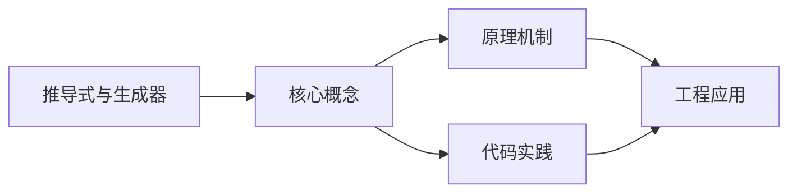
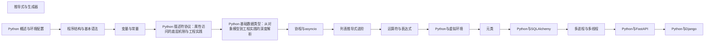

## 1. 学习目标（Bloom 分类）

本节按照布鲁姆教育目标分类学组织学习路径。本文主题为《推导式与生成器》，属于 Python 模块，读者可以根据自身阶段选择阅读深度。

记忆层面：能够准确复述本文的核心概念、术语与基本语法或操作步骤，并能够在提问或检索时快速定位对应知识点。例如能够说出 Python 的动态类型、缩进语法与解释执行等基本特征。

理解层面：能够用自己的语言解释核心原理与工作机制，说明概念之间的因果关系，而不是机械记忆结论。例如能够解释解释器与编译器的差异，以及 GIL 对并发的影响。

应用层面：能够在真实项目或练习场景中运用本文知识解决具体问题，写出正确且可维护的实现。例如能够编写函数、类与标准库调用的完整脚本。

分析层面：能够拆解复杂问题，比较本文主题与相邻概念的异同，识别边界条件与例外情况。例如能够比较 Python 与 Java、Go 在类型系统与并发模型上的差异。

评价层面：能够根据约束条件（性能、可读性、安全、成本）评价不同方案的优劣，做出有依据的技术决策。例如能够评估不同实现方案（脚本、服务、库）的适用场景。

创造层面：能够把本文知识与其他模块知识组合，设计出新的解决方案或可复用的工程模式。例如能够组合标准库与第三方包设计完整的自动化工具。

通过本节学习，读者应当能够把《推导式与生成器》纳入自己的知识网络，并与 Python 模块的其他主题（数据类型、函数、模块、异常、并发）建立关联。

## 2. 历史动机与发展脉络

《推导式与生成器》是 Python 领域的重要主题。要真正理解它，需要先了解它解决的问题与演进过程。

Python 由 Guido van Rossum 于 1991 年首次发布，设计哲学强调代码可读性与开发效率，核心思想记录在《Python 之禅》（PEP 20）中：优美优于丑陋、明确优于隐晦、简单优于复杂。
Python 2 与 Python 3 的分裂期（2008-2020）是语言史上最重要的兼容性事件：Python 3 修复了字符串编码、整数除法等长期问题，但破坏性变更导致迁移缓慢；2020 年 1 月 Python 2 停止官方维护，社区全面转向 Python 3。
Python 3.9 至 3.13 的演进带来了类型提示增强（PEP 604 的 X | Y 语法、PEP 695 的泛型语法）、性能优化（3.11 的 faster-calls 与自适应解释器）以及异步生态的成熟（asyncio、FastAPI、httpx）。
Python 的应用版图从脚本自动化扩展到 Web 后端（Django、FastAPI）、数据科学（NumPy、Pandas、Matplotlib）、机器学习（PyTorch、scikit-learn）、运维自动化（Ansible）与科学计算，是当今最通用的编程语言之一。

回到本文主题：推导式与生成器 的提出与成熟，正是上述技术背景下的必然产物。早期实现往往以简单可用为目标，随着工程规模扩大，社区逐渐沉淀出标准做法与最佳实践；理解这一脉络，可以帮助读者判断“为什么文档中的推荐写法是现在这个样子”，也能在遇到历史遗留代码时准确识别其设计年代与取舍。

对于初学者，理解 Python 的“电池内置”（标准库丰富）与“胶水语言”（易于调用 C/C++/Rust 扩展）两大特性，是判断其适用场景的基础。

## 3. 形式化定义与核心概念精讲

本节把《推导式与生成器》涉及的核心概念以“定义 + 讲解”的形式展开。读者应把定义当作工具，把讲解当作理解路径；两者结合才能形成可迁移的知识。

变量与动态类型：Python 变量是对象的引用，类型属于对象而非变量；`isinstance()` 与 `type()` 用于运行时检查，类型注解（PEP 484）提供静态检查能力但不改变运行时行为。
缩进即语法：Python 用缩进表达代码块层次，避免了花括号噪声，也强制了代码排版一致性；同一代码块必须使用一致的空格数（官方推荐 4 空格）。
函数是一等公民：函数可以赋值、传参、返回，配合 lambda、装饰器与闭包，构成函数式编程能力的基础。
模块与包：每个 `.py` 文件是模块，目录加 `__init__.py` 是包；`import` 机制支持绝对导入、相对导入与命名空间包。
异常处理：`try/except/finally` 与 `raise` 构成错误传播体系；`with` 语句通过上下文管理器（`__enter__/__exit__`）管理资源生命周期。

### 3.1 原文章节逐一精讲

原文档把主题拆分为 24 个小节，下面按顺序给出每一节的导读讲解，随后保留原文细节供精读。

#### 原文精读（完整保留）

# 推导式与生成器

> **符号约定**：`< >` 必填参数 | `[ ]` 可选参数

---

#### 1. 推导式 (Comprehensions)

推导式是一种简洁高效的方式，用于从现有的序列创建新的序列。

##### 1.1 列表推导式 (List Comprehensions)

列表推导式使用方括号 `[]` 来创建新的列表：

```python
 # 基本语法: [expression for item in iterable if condition]
 # 生成平方数列表
 squares = [x ** 2 for x in range(10)]
 print(squares) # 输出: [0, 1, 4, 9, 16, 25, 36, 49, 64, 81]
 # 带条件的列表推导式
 even_squares = [x ** 2 for x in range(10) if x % 2 == 0]
 print(even_squares) # 输出: [0, 4, 16, 36, 64]
 # 嵌套的列表推导式
 matrix = [[1, 2, 3], [4, 5, 6], [7, 8, 9]]
 flattened = [num for row in matrix for num in row]
 print(flattened) # 输出: [1, 2, 3, 4, 5, 6, 7, 8, 9]
 # 复杂表达式的列表推导式
 names = ["Alice", "Bob", "Charlie", "David"]
 name_lengths = [(name, len(name)) for name in names]
 print(name_lengths) # 输出: [('Alice', 5), ('Bob', 3), ('Charlie', 7), ('David', 5)]
 # 多层嵌套的列表推导式
 # 生成 3x3 的乘法表
 multiplication_table = [[i * j for j in range(1, 4)] for i in range(1, 4)]
 print(multiplication_table) # 输出: [[1, 2, 3], [2, 4, 6], [3, 6, 9]]
```

##### 1.2 字典推导式 (Dictionary Comprehensions)

字典推导式使用花括号 `{}` 来创建新的字典：

```python
 # 基本语法: {key_expression: value_expression for item in iterable if condition}
 # 从列表创建字典
 names = ["Alice", "Bob", "Charlie"]
 name_lengths = {name: len(name) for name in names}
 print(name_lengths) # 输出: {'Alice': 5, 'Bob': 3, 'Charlie': 7}
 # 带条件的字典推导式
 numbers = [1, 2, 3, 4, 5, 6, 7, 8, 9, 10]
 even_squares = {num: num ** 2 for num in numbers if num % 2 == 0}
 print(even_squares) # 输出: {2: 4, 4: 16, 6: 36, 8: 64, 10: 100}
 # 从现有字典创建新字典
 person = {"name": "Alice", "age": 30, "city": "New York"}
 upper_case = {k.upper(): v for k, v in person.items()}
 print(upper_case) # 输出: {'NAME': 'Alice', 'AGE': 30, 'CITY': 'New York'}
 # 交换字典的键值对
 original = {"a": 1, "b": 2, "c": 3}
 swapped = {v: k for k, v in original.items()}
 print(swapped) # 输出: {1: 'a', 2: 'b', 3: 'c'}
```

##### 1.3 集合推导式 (Set Comprehensions)

集合推导式使用花括号 `{}` 来创建新的集合：

```python
 # 基本语法: {expression for item in iterable if condition}
 # 生成平方数集合
 numbers = [1, 2, 3, 4, 5, 4, 3, 2, 1]
 squares = {x ** 2 for x in numbers}
 print(squares) # 输出: {1, 4, 9, 16, 25}（自动去重）
 # 带条件的集合推导式
 positive_numbers = {x for x in range(-5, 6) if x > 0}
 print(positive_numbers) # 输出: {1, 2, 3, 4, 5}
 # 字符串去重
 text = "hello world"
 unique_chars = {char for char in text if char != " "}
 print(unique_chars) # 输出: {'d', 'e', 'h', 'l', 'o', 'r', 'w'}
```

##### 1.4 推导式的性能

推导式通常比传统的循环更高效，因为它们在 C 语言级别执行，减少了 Python 解释器的开销：

```python
 import time
 # 使用传统循环
 start = time.time()
 squares = []
 for i in range(1000000):
  squares.append(i ** 2)
 end = time.time()
 print(f"传统循环: {end - start:.4f} 秒")
 # 使用列表推导式
 start = time.time()
 squares = [i ** 2 for i in range(1000000)]
 end = time.time()
 print(f"列表推导式: {end - start:.4f} 秒")
```

#### 2. 迭代器 (Iterators)

迭代器是实现了迭代协议的对象，它允许我们遍历容器中的元素。

##### 2.1 迭代器协议

一个对象要成为迭代器，必须实现两个方法：

- `__iter__()`: 返回迭代器本身
- `__next__()`: 返回下一个元素，当没有更多元素时抛出 `StopIteration` 异常

```python
 # 自定义迭代器
 class Countdown:
  def __init__(self, start):
  self.start = start
  def __iter__(self):
  return self
  def __next__(self):
  if self.start <= 0:
  raise StopIteration
  self.start -= 1
  return self.start + 1
 # 使用自定义迭代器
 for i in Countdown(5):
  print(i) # 输出: 5, 4, 3, 2, 1
 # 手动使用迭代器
 countdown = Countdown(3)
 it = iter(countdown)
 print(next(it)) # 输出: 3
 print(next(it)) # 输出: 2
 print(next(it)) # 输出: 1
 # print(next(it)) # 抛出 StopIteration 异常
```

##### 2.2 内置迭代器

Python 中的许多内置对象都是可迭代的，例如列表、元组、字符串、字典等：

```python
 # 列表是可迭代的
 numbers = [1, 2, 3]
 it = iter(numbers)
 print(next(it)) # 输出: 1
 print(next(it)) # 输出: 2
 print(next(it)) # 输出: 3
 # 字符串是可迭代的
 text = "hello"
 it = iter(text)
 print(next(it)) # 输出: 'h'
 print(next(it)) # 输出: 'e'
 # 字典是可迭代的（默认迭代键）
 d = {"a": 1, "b": 2}
 it = iter(d)
 print(next(it)) # 输出: 'a'
 print(next(it)) # 输出: 'b'
 # 迭代字典的值
 it = iter(d.values())
 print(next(it)) # 输出: 1
 print(next(it)) # 输出: 2
 # 迭代字典的键值对
 it = iter(d.items())
 print(next(it)) # 输出: ('a', 1)
 print(next(it)) # 输出: ('b', 2)
```

##### 2.3 `iter()` 和 `next()` 函数

- `iter()`: 将可迭代对象转换为迭代器
- `next()`: 获取迭代器的下一个元素

```python
 # 使用 iter() 函数
 numbers = [1, 2, 3]
 it = iter(numbers)
 # 使用 next() 函数
 print(next(it)) # 输出: 1
 print(next(it)) # 输出: 2
 print(next(it)) # 输出: 3
 # print(next(it)) # 抛出 StopIteration 异常
 # 为 next() 提供默认值
 it = iter([])
 print(next(it, "No more elements")) # 输出: No more elements
```

#### 3. 生成器 (Generators)

生成器是一种特殊的迭代器，它使用 `yield` 关键字来生成值，实现了惰性求值。

##### 3.1 生成器表达式 (Generator Expressions)

生成器表达式使用圆括号 `()` 来创建生成器，语法与列表推导式类似：

```python
 # 基本语法: (expression for item in iterable if condition)
 # 创建生成器
 gen = (x ** 2 for x in range(10))
 print(type(gen)) # 输出: <class 'generator'>
 # 遍历生成器
 for num in gen:
  print(num) # 输出: 0, 1, 4, 9, 16, 25, 36, 49, 64, 81
 # 生成器只能遍历一次
 gen = (x ** 2 for x in range(5))
 print(list(gen)) # 输出: [0, 1, 4, 9, 16]
 print(list(gen)) # 输出: []（生成器已耗尽）
 # 内存使用对比
 import sys
 # 列表占用的内存
 t_list = [x for x in range(1000000)]
 print(f"列表内存: {sys.getsizeof(t_list):,} 字节")
 # 生成器占用的内存
 t_gen = (x for x in range(1000000))
 print(f"生成器内存: {sys.getsizeof(t_gen):,} 字节")
```

##### 3.2 生成器函数 (Generator Functions)

生成器函数使用 `yield` 关键字来定义，当函数被调用时，它返回一个生成器对象：

```python
 # 基本语法
 def generator_function():
  yield value1
  yield value2
  # ...
 # 示例: 生成斐波那契数列
 def fibonacci(n):
  """生成前 n 个斐波那契数"""
  a, b = 0, 1
  for _ in range(n):
  yield a
  a, b = b, a + b
 # 使用生成器函数
 for num in fibonacci(10):
  print(num, end=" ") # 输出: 0 1 1 2 3 5 8 13 21 34
 # 手动使用生成器
 fib = fibonacci(3)
 print(next(fib)) # 输出: 0
 print(next(fib)) # 输出: 1
 print(next(fib)) # 输出: 1
 # print(next(fib)) # 抛出 StopIteration 异常
 # 示例: 生成无限序列
 def infinite_counter():
  """生成无限递增的计数器"""
  i = 0
  while True:
  yield i
  i += 1
 # 使用无限生成器（需要手动停止）
 counter = infinite_counter()
 for _ in range(5):
  print(next(counter)) # 输出: 0, 1, 2, 3, 4
```

##### 3.3 生成器的高级特性

###### 3.3.1 `send()` 方法

生成器的 `send()` 方法允许向生成器发送值：

```python
 def echo():
  while True:
  received = yield
  print(f"Received: {received}")
 # 使用 send() 方法
 gen = echo()
 next(gen) # 启动生成器
 gen.send("Hello") # 输出: Received: Hello
 gen.send("World") # 输出: Received: World
 gen.close() # 关闭生成器
```

###### 3.3.2 `throw()` 方法

生成器的 `throw()` 方法允许向生成器抛出异常：

```python
 def error_handling():
  try:
  while True:
  yield "Normal operation"
  except ValueError:
  yield "Handling ValueError"
  except Exception:
  yield "Handling other exception"
 # 使用 throw() 方法
 gen = error_handling()
 print(next(gen)) # 输出: Normal operation
 print(gen.throw(ValueError)) # 输出: Handling ValueError
 print(next(gen)) # 输出: Normal operation
 print(gen.throw(TypeError)) # 输出: Handling other exception
```

###### 3.3.3 `close()` 方法

生成器的 `close()` 方法用于关闭生成器：

```python
 def countdown(n):
  while n > 0:
  yield n
  n -= 1
 # 使用 close() 方法
 gen = countdown(5)
 print(next(gen)) # 输出: 5
 print(next(gen)) # 输出: 4
 gen.close()
 # print(next(gen)) # 抛出 StopIteration 异常
```

#### 4. 惰性求值 (Lazy Evaluation)

惰性求值是一种计算策略，它推迟计算直到真正需要结果的时候。

##### 4.1 惰性求值的优势

- **节省内存**: 不需要一次性存储所有数据
- **提高性能**: 避免不必要的计算
- **处理无限序列**: 可以表示理论上无限的序列
- **流式处理**: 适合处理大型数据集

##### 4.2 惰性求值的应用

```python
 # 处理大型文件
 def read_large_file(file_path):
  """惰性读取大型文件"""
  with open(file_path, 'r') as f:
  for line in f:
  yield line.strip()
 # 使用生成器处理大型文件
 for line in read_large_file('large_file.txt'):
  # 处理每一行，而不是一次性加载整个文件
  pass
 # 链式生成器
 def filter_lines(lines, keyword):
  """过滤包含关键字的行"""
  for line in lines:
  if keyword in line:
  yield line
 def process_lines(lines):
  """处理行"""
  for line in lines:
  yield line.upper()
 # 链式使用生成器
 lines = read_large_file('large_file.txt')
 filtered = filter_lines(lines, 'python')
 processed = process_lines(filtered)
 for line in processed:
  print(line)
```

#### 5. 迭代工具

Python 标准库提供了一些实用的迭代工具：

##### 5.1 `itertools` 模块

`itertools` 模块提供了许多用于创建和操作迭代器的函数：

```python
 import itertools
 # 无限迭代器
 # count(): 从指定值开始无限计数
 for i in itertools.count(5, 2):
  print(i, end=" ")
  if i > 10:
  break # 输出: 5 7 9 11
 # cycle(): 无限循环迭代一个序列
 count = 0
 for item in itertools.cycle(['A', 'B', 'C']):
  print(item, end=" ")
  count += 1
  if count > 5:
  break # 输出: A B C A B C
 # repeat(): 重复一个值指定次数或无限次
 for item in itertools.repeat('Hello', 3):
  print(item) # 输出: Hello Hello Hello
 # 组合迭代器
 # product(): 笛卡尔积
 print(list(itertools.product([1, 2], ['a', 'b'])))
 # 输出: [(1, 'a'), (1, 'b'), (2, 'a'), (2, 'b')]
 # permutations(): 排列
 print(list(itertools.permutations([1, 2, 3], 2)))
 # 输出: [(1, 2), (1, 3), (2, 1), (2, 3), (3, 1), (3, 2)]
 # combinations(): 组合
 print(list(itertools.combinations([1, 2, 3], 2)))
 # 输出: [(1, 2), (1, 3), (2, 3)]
 # 其他有用的函数
 # chain(): 连接多个迭代器
 print(list(itertools.chain([1, 2], [3, 4], [5, 6])))
 # 输出: [1, 2, 3, 4, 5, 6]
 # groupby(): 分组
 from operator import itemgetter
 data = [
  {'name': 'Alice', 'age': 25},
  {'name': 'Bob', 'age': 30},
  {'name': 'Charlie', 'age': 25},
  {'name': 'David', 'age': 30}
 ]
 # 按年龄分组
 data.sort(key=itemgetter('age'))
 for age, group in itertools.groupby(data, key=itemgetter('age')):
  print(f"Age {age}:")
  for person in group:
  print(f" {person['name']}")
```

##### 5.2 `functools` 模块

`functools` 模块中的 `reduce()` 函数可以与生成器结合使用：

```python
 from functools import reduce
 # 使用 reduce() 计算生成器的和
 def numbers():
  for i in range(1, 6):
  yield i
 result = reduce(lambda x, y: x + y, numbers())
 print(result) # 输出: 15
```

#### 6. 最佳实践

##### 6.1 推导式的最佳实践

- **简洁性**: 推导式应该简洁明了，避免过于复杂的表达式
- **可读性**: 对于复杂的逻辑，考虑使用传统循环
- **性能**: 对于大型数据集，考虑使用生成器表达式
- **嵌套**: 避免过多的嵌套推导式，保持代码可读性

##### 6.2 生成器的最佳实践

- **内存管理**: 对于大型数据集，优先使用生成器
- **无限序列**: 使用生成器表示无限序列
- **流式处理**: 使用生成器进行流式数据处理
- **组合使用**: 多个生成器可以组合使用，形成数据处理管道
- **异常处理**: 在生成器中适当处理异常

##### 6.3 迭代器的最佳实践

- **理解迭代协议**: 了解 `__iter__` 和 `__next__` 方法的实现
- **避免修改**: 迭代过程中避免修改正在迭代的容器
- **使用内置函数**: 充分利用 `iter()`, `next()`, `enumerate()`, `zip()` 等内置函数
- **自定义迭代器**: 当需要特殊迭代行为时，考虑实现自定义迭代器

#### 7. 实际应用示例

##### 7.1 数据处理

```python
 # 处理日志文件
 def parse_log(file_path):
  """解析日志文件，提取关键信息"""
  with open(file_path, 'r') as f:
  for line in f:
  if 'ERROR' in line:
  parts = line.split()
  timestamp = parts[0]
  error_message = ' '.join(parts[3:])
  yield {'timestamp': timestamp, 'error': error_message}
 # 使用生成器处理日志
 for error in parse_log('app.log'):
  print(f"[{error['timestamp']}] ERROR: {error['error']}")
```

##### 7.2 数学计算

```python
 # 生成素数
 def is_prime(n):
  if n <= 1:
  return False
  for i in range(2, int(n**0.5) + 1):
  if n % i == 0:
  return False
  return
 def primes():
  """生成无限素数序列"""
  n = 2
  while True:
  if is_prime(n):
  yield n
  n += 1
 # 使用生成器获取前 10 个素数
 prime_gen = primes()
 for _ in range(10):
  print(next(prime_gen), end=" ") # 输出: 2 3 5 7 11 13 17 19 23 29
```

##### 7.3 网络爬虫

```python
 import requests
 from bs4 import BeautifulSoup
 def crawl(url, max_depth=2):
  """简单的网页爬虫"""
  visited = set()
  def _crawl(url, depth):
  if depth > max_depth or url in visited:
  return
  visited.add(url)
  yield url
  try:
  response = requests.get(url)
  soup = BeautifulSoup(response.text, 'html.parser')
  for link in soup.find_all('a', href=True):
  next_url = link['href']
  if next_url.startswith('http'):
  yield from _crawl(next_url, depth + 1)
  except Exception:
  pass
  yield from _crawl(url, 0)
 # 使用生成器爬取网页
 for url in crawl('https://example.com', max_depth=1):
  print(url)
```

---

#### 列表推导式

**基本写法：基本列表推导式**
`[<表达式> for <变量> in <可迭代对象>]`

```python
# 基本列表推导式
squares = [x ** 2 for x in range(5)]
```

---

**基本写法：带条件的列表推导式**
`[<表达式> for <变量> in <可迭代对象> if <条件>]`

```python
# 带条件的列表推导式
evens = [x for x in range(10) if x % 2 == 0]
```

---

**基本写法：带 if-else 的列表推导式**
`[<表达式1> if <条件> else <表达式2> for <变量> in <可迭代对象>]`

```python
# 带 if-else 的列表推导式
labels = ["even" if x % 2 == 0 else "odd" for x in range(5)]
```

---

#### 嵌套列表推导式

**基本写法：嵌套 for 的列表推导式**
`[<表达式> for <变量1> in <可迭代对象1> for <变量2> in <可迭代对象2>]`

```python
# 嵌套 for 的列表推导式
pairs = [(x, y) for x in range(3) for y in range(3)]
```

---

**基本写法：带条件的嵌套推导式**
`[<表达式> for <变量1> in <可迭代对象1> for <变量2> in <可迭代对象2> if <条件>]`

```python
# 带条件的嵌套推导式
pairs = [(x, y) for x in range(3) for y in range(3) if x != y]
```

---

**换行写法：多行嵌套推导式**
`[<表达式>`
` for <变量1> in <可迭代对象1>`
` for <变量2> in <可迭代对象2>]`

```python
# 多行嵌套推导式
matrix = [
    [x * y for y in range(3)]
    for x in range(3)
]
```

---

#### 字典推导式

**基本写法：基本字典推导式**
`{<键表达式>: <值表达式> for <变量> in <可迭代对象>}`

```python
# 基本字典推导式
squares = {x: x ** 2 for x in range(5)}
```

---

**基本写法：带条件的字典推导式**
`{<键表达式>: <值表达式> for <变量> in <可迭代对象> if <条件>}`

```python
# 带条件的字典推导式
even_squares = {x: x ** 2 for x in range(10) if x % 2 == 0}
```

---

**基本写法：反转字典键值**
`{<值>: <键> for <键>, <值> in <字典>.items()}`

```python
# 反转字典的键和值
original = {"a": 1, "b": 2, "c": 3}
reversed_dict = {v: k for k, v in original.items()}
```

---

#### 集合推导式

**基本写法：基本集合推导式**
`{<表达式> for <变量> in <可迭代对象>}`

```python
# 基本集合推导式
squares = {x ** 2 for x in range(5)}
```

---

**基本写法：带条件的集合推导式**
`{<表达式> for <变量> in <可迭代对象> if <条件>}`

```python
# 带条件的集合推导式
even_squares = {x ** 2 for x in range(10) if x % 2 == 0}
```

---

#### 生成器表达式

**基本写法：基本生成器表达式**
`(<表达式> for <变量> in <可迭代对象>)`

```python
# 基本生成器表达式
squares_gen = (x ** 2 for x in range(5))
print(next(squares_gen))
```

---

**基本写法：带条件的生成器表达式**
`(<表达式> for <变量> in <可迭代对象> if <条件>)`

```python
# 带条件的生成器表达式
evens_gen = (x for x in range(10) if x % 2 == 0)
print(list(evens_gen))
```

---

**基本写法：生成器表达式作为函数参数**
`<函数>(<表达式> for <变量> in <可迭代对象>)`

```python
# 生成器表达式作为函数参数
total = sum(x ** 2 for x in range(10))
```

---

#### 生成器函数

**换行写法：定义生成器函数**
`def <函数名>(<参数>):`
`    yield <值>`

```python
# 定义生成器函数
def count_up_to(max_value):
    count = 0
    while count < max_value:
        yield count
        count += 1
```

---

**基本写法：使用生成器**
`for <变量> in <生成器>: <语句>`

```python
# 使用生成器
for num in count_up_to(5):
    print(num)
```

---

**基本写法：使用 next() 获取值**
`next(<生成器>)`

```python
# 使用 next() 获取生成器的下一个值
gen = count_up_to(3)
print(next(gen))
```

---

**基本写法：使用 list() 转换生成器**
`list(<生成器>)`

```python
# 将生成器转换为列表
gen = count_up_to(5)
print(list(gen))
```

---

#### yield 语句

**基本写法：使用 yield 生成值**
`yield <值>`

```python
# 使用 yield 生成值
def simple_generator():
    yield 1
    yield 2
    yield 3
```

---

**基本写法：使用 yield from 委托生成器**
`yield from <可迭代对象>`

```python
# 使用 yield from 委托给子生成器
def combined_generator():
    yield from [1, 2, 3]
    yield from [4, 5, 6]
```

---

**基本写法：yield from 委托给另一个生成器**
`yield from <生成器函数>()`

```python
# yield from 委托给另一个生成器
def sub_generator():
    yield "a"
    yield "b"

def main_generator():
    yield "start"
    yield from sub_generator()
    yield "end"
```

---

#### 生成器方法

**基本写法：使用 send() 发送值**
`<生成器>.send(<值>)`

```python
# 使用 send() 向生成器发送值
def echo_generator():
    while True:
        received = yield
        print(f"收到: {received}")

gen = echo_generator()
next(gen)
gen.send("Hello")
```

---

**基本写法：使用 throw() 抛出异常**
`<生成器>.throw(<异常>)`

```python
# 使用 throw() 在生成器中抛出异常
def safe_generator():
    try:
        while True:
            yield "正常"
    except ValueError:
        yield "捕获到异常"

gen = safe_generator()
print(next(gen))
print(gen.throw(ValueError))
```

---

**基本写法：使用 close() 关闭生成器**
`<生成器>.close()`

```python
# 使用 close() 关闭生成器
gen = count_up_to(10)
print(next(gen))
gen.close()
```

---

#### 无限生成器

**换行写法：定义无限生成器**
`def <函数名>():`
`    while True:`
`        yield <值>`

```python
# 定义无限生成器
def infinite_counter():
    count = 0
    while True:
        yield count
        count += 1
```

---

**基本写法：使用 itertools.islice 限制无限生成器**
`islice(<无限生成器>, <n>)`

```python
# 使用 islice 限制无限生成器的输出
from itertools import islice

gen = infinite_counter()
first_ten = list(islice(gen, 10))
```

---

#### 生成器管道

**换行写法：生成器管道组合**
`gen1 = (<表达式> for <变量> in <可迭代对象>)`
`gen2 = (<表达式> for <变量> in gen1)`
`gen3 = (<表达式> for <变量> in gen2)`

```python
# 生成器管道组合
numbers = range(100)
squared = (x ** 2 for x in numbers)
evens = (x for x in squared if x % 2 == 0)
result = list(evens)
```

---

#### itertools 模块

**基本写法：使用 itertools.chain 连接**
`chain(<可迭代对象1>, <可迭代对象2>)`

```python
# 使用 chain 连接多个可迭代对象
from itertools import chain
combined = chain([1, 2, 3], [4, 5, 6])
print(list(combined))
```

---

**基本写法：使用 itertools.chain.from_iterable 展平**
`chain.from_iterable(<嵌套可迭代对象>)`

```python
# 使用 chain.from_iterable 展平嵌套列表
from itertools import chain
nested = [[1, 2], [3, 4], [5, 6]]
flat = chain.from_iterable(nested)
print(list(flat))
```

---

**基本写法：使用 itertools.product 笛卡尔积**
`product(<可迭代对象1>, <可迭代对象2>)`

```python
# 使用 product 生成笛卡尔积
from itertools import product
colors = ["red", "blue"]
sizes = ["S", "M"]
combinations = list(product(colors, sizes))
```

---

**基本写法：使用 itertools.combinations 组合**
`combinations(<可迭代对象>, <r>)`

```python
# 使用 combinations 生成所有组合
from itertools import combinations
combos = list(combinations([1, 2, 3, 4], 2))
```

---

**基本写法：使用 itertools.permutations 排列**
`permutations(<可迭代对象>, <r>)`

```python
# 使用 permutations 生成所有排列
from itertools import permutations
perms = list(permutations([1, 2, 3], 2))
```

---

**基本写法：使用 itertools.cycle 循环**
`cycle(<可迭代对象>)`

```python
# 使用 cycle 无限循环可迭代对象
from itertools import cycle
cycler = cycle(["A", "B", "C"])
first_five = [next(cycler) for _ in range(5)]
```

---

**基本写法：使用 itertools.repeat 重复**
`repeat(<元素>, <次数>)`

```python
# 使用 repeat 重复元素
from itertools import repeat
repeated = list(repeat("Hello", 3))
```

---

**基本写法：使用 itertools.starmap 应用函数**
`starmap(<函数>, <可迭代对象>)`

```python
# 使用 starmap 将函数应用于解包的参数
from itertools import starmap
pairs = [(2, 3), (4, 5), (6, 7)]
results = list(starmap(lambda x, y: x + y, pairs))
```

---

**基本写法：使用 itertools.groupby 分组**
`groupby(<可迭代对象>, <键函数>)`

```python
# 使用 groupby 按键分组
from itertools import groupby
data = [("a", 1), ("a", 2), ("b", 3), ("b", 4)]
for key, group in groupby(data, key=lambda x: x[0]):
    print(f"{key}: {list(group)}")
```

---

**基本写法：使用 itertools.accumulate 累积**
`accumulate(<可迭代对象>, <函数>)`

```python
# 使用 accumulate 累积计算
from itertools import accumulate
numbers = [1, 2, 3, 4, 5]
cumsum = list(accumulate(numbers))
```

---

#### 生成器与协程

**换行写法：定义协程生成器**
`def <协程名>():`
`    while True:`
`        <值> = yield`
`        <处理>`

```python
# 定义协程生成器
def coroutine():
    print("启动协程")
    while True:
        value = yield
        print(f"处理: {value}")

coro = coroutine()
next(coro)
coro.send("数据")
```

---

#### 生成器表达式与列表推导式对比

**基本写法：列表推导式（立即计算）**
`[<表达式> for <变量> in <可迭代对象>]`

```python
# 列表推导式（立即计算，占用内存）
squares_list = [x ** 2 for x in range(1000000)]
```

---

**基本写法：生成器表达式（惰性计算）**
`(<表达式> for <变量> in <可迭代对象>)`

```python
# 生成器表达式（惰性计算，节省内存）
squares_gen = (x ** 2 for x in range(1000000))
```

---

#### 生成器与迭代器

**换行写法：自定义迭代器类**
`class <迭代器类>:`
`    def __iter__(self): return self`
`    def __next__(self): <语句>`

```python
# 自定义迭代器类
class CountDown:
    def __init__(self, start):
        self.current = start

    def __iter__(self):
        return self

    def __next__(self):
        if self.current <= 0:
            raise StopIteration
        self.current -= 1
        return self.current + 1
```

---

**换行写法：可迭代对象类**
`class <可迭代对象类>:`
`    def __iter__(self): yield <值>`

```python
# 可迭代对象类（使用 yield）
class NumberRange:
    def __init__(self, start, end):
        self.start = start
        self.end = end

    def __iter__(self):
        current = self.start
        while current < self.end:
            yield current
            current += 1
```

---

#### 生成器与内存优化

**基本写法：使用生成器处理大文件**
`def <函数名>(<文件路径>):`
`    with open(<文件路径>) as f:`
`        for line in f: yield <处理>`

```python
# 使用生成器逐行处理大文件
def read_large_file(file_path):
    with open(file_path, "r") as f:
        for line in f:
            yield line.strip()
```

---

**基本写法：使用生成器过滤数据**
`(<表达式> for <变量> in <可迭代对象> if <条件>)`

```python
# 使用生成器表达式过滤数据
data = range(1000000)
filtered = (x for x in data if x % 2 == 0)
result = sum(filtered)
```

---

#### 生成器与 send() 双向通信

**换行写法：带 send() 的生成器**
`def <生成器名>():`
`    <初始化>`
`    while True:`
`        <输入> = yield <输出>`
`        <处理>`

```python
# 带 send() 的双向通信生成器
def accumulator():
    total = 0
    while True:
        value = yield total
        total += value

gen = accumulator()
next(gen)
print(gen.send(10))
print(gen.send(20))
```

---

#### 生成器与 yield from

**换行写法：使用 yield from 委托**
`def <主生成器>():`
`    yield <值1>`
`    yield from <子生成器>()`
`    yield <值2>`

```python
# 使用 yield from 委托子生成器
def sub_generator():
    yield "sub1"
    yield "sub2"

def main_generator():
    yield "start"
    yield from sub_generator()
    yield "end"
```

---

**基本写法：yield from 返回值**
`result = yield from <生成器>`

```python
# yield from 获取子生成器的返回值
def sub_generator():
    yield 1
    yield 2
    return "完成"

def main_generator():
    result = yield from sub_generator()
    print(f"子生成器返回: {result}")
```


### 3.2 概念关系图

下面用 Mermaid 图表达本文核心概念之间的关系，帮助读者建立整体图景：



图中展示的是本文知识的结构化关系：核心概念是入口，原理机制解释“为什么”，代码实践演示“怎么做”，工程应用回答“何时用”。读者学习时可以把每个小节的内容挂接到对应节点上。

## 4. 理论推导与原理解析

本节深入《推导式与生成器》背后的原理。理论部分不求面面俱到，而是聚焦“能解释现象、能指导实践”的关键推导。

解释执行与字节码：CPython 先把源码编译为字节码（.pyc），再由虚拟机逐条执行。字节码是平台无关的中间表示，因此 Python 程序可以跨平台运行，但执行速度低于编译型语言；性能敏感路径可用 C 扩展或 Cython 加速。
GIL（全局解释器锁）：CPython 的 GIL 保证同一时刻只有一个线程执行字节码，简化了内存管理，但限制了 CPU 密集型多线程并行；I/O 密集型任务通过线程切换获得并发，CPU 密集型任务应使用多进程（multiprocessing）或异步。
引用计数与垃圾回收：Python 对象通过引用计数管理生命周期，循环引用由分代垃圾回收器（gc 模块）处理。理解这一模型可以解释“为什么局部变量及时释放内存”“为什么大对象需要 del 或作用域退出”。
鸭子类型与协议：Python 依赖行为协议而非继承体系，例如实现 `__iter__` 与 `__next__` 的对象即可用于 `for` 循环。这一设计带来灵活性的同时，也要求开发者编写清晰的接口文档与类型注解。

需要强调的是，理论推导与工程实践之间存在翻译层：理论给出的是理想化模型与边界条件，工程代码则必须处理真实环境中的例外。读者在学习时应先掌握理论的“标准情形”，再通过陷阱章节了解“非标准情形”。

## 5. 代码示例与逐行讲解

本节把原文中的代码示例系统整理，并为每个示例补充用途说明与讲解。读者不应只浏览代码，而应逐段对照讲解理解设计意图。

### 5.1 示例：1.1 列表推导式 (List Comprehensions)

该示例来自原文《1.1 列表推导式 (List Comprehensions)》小节，用于演示推导式与生成器相关操作。阅读时请先看代码结构，再看其后的讲解。

```python
 # 基本语法: [expression for item in iterable if condition]
 # 生成平方数列表
 squares = [x ** 2 for x in range(10)]
 print(squares) # 输出: [0, 1, 4, 9, 16, 25, 36, 49, 64, 81]
 # 带条件的列表推导式
 even_squares = [x ** 2 for x in range(10) if x % 2 == 0]
 print(even_squares) # 输出: [0, 4, 16, 36, 64]
 # 嵌套的列表推导式
 matrix = [[1, 2, 3], [4, 5, 6], [7, 8, 9]]
 flattened = [num for row in matrix for num in row]
 print(flattened) # 输出: [1, 2, 3, 4, 5, 6, 7, 8, 9]
 # 复杂表达式的列表推导式
 names = ["Alice", "Bob", "Charlie", "David"]
 name_lengths = [(name, len(name)) for name in names]
 print(name_lengths) # 输出: [('Alice', 5), ('Bob', 3), ('Charlie', 7), ('David', 5)]
 # 多层嵌套的列表推导式
 # 生成 3x3 的乘法表
 multiplication_table = [[i * j for j in range(1, 4)] for i in range(1, 4)]
 print(multiplication_table) # 输出: [[1, 2, 3], [2, 4, 6], [3, 6, 9]]
```

讲解：这段代码演示了本节核心知识点。代码中的关键操作可以归纳为三步：准备（定义或初始化）、执行（核心逻辑）、收尾（释放资源或返回结果）。实际项目中，这三步往往被封装为函数或类，以提升复用性与可测试性。

关键点分析：

该示例共 19 行有效代码，包含 2 类关键结构（if、for）。其中：

- 入口与初始化部分负责建立上下文，对应实际项目中的启动或装配逻辑；
- 核心逻辑部分体现本文主题的主要操作，是阅读时最需要对照讲解理解的部分；
- 输出或返回部分把结果交给调用方，注意其类型与边界条件。

进阶思考路径：先尝试修改参数观察行为变化，再把示例中的模式迁移到自己的项目中；每次修改都记录预期与实测差异，这是把示例转化为能力的最快方式。

### 5.2 示例：1.2 字典推导式 (Dictionary Comprehensions)

该示例来自原文《1.2 字典推导式 (Dictionary Comprehensions)》小节，用于演示推导式与生成器相关操作。阅读时请先看代码结构，再看其后的讲解。

```python
 # 基本语法: {key_expression: value_expression for item in iterable if condition}
 # 从列表创建字典
 names = ["Alice", "Bob", "Charlie"]
 name_lengths = {name: len(name) for name in names}
 print(name_lengths) # 输出: {'Alice': 5, 'Bob': 3, 'Charlie': 7}
 # 带条件的字典推导式
 numbers = [1, 2, 3, 4, 5, 6, 7, 8, 9, 10]
 even_squares = {num: num ** 2 for num in numbers if num % 2 == 0}
 print(even_squares) # 输出: {2: 4, 4: 16, 6: 36, 8: 64, 10: 100}
 # 从现有字典创建新字典
 person = {"name": "Alice", "age": 30, "city": "New York"}
 upper_case = {k.upper(): v for k, v in person.items()}
 print(upper_case) # 输出: {'NAME': 'Alice', 'AGE': 30, 'CITY': 'New York'}
 # 交换字典的键值对
 original = {"a": 1, "b": 2, "c": 3}
 swapped = {v: k for k, v in original.items()}
 print(swapped) # 输出: {1: 'a', 2: 'b', 3: 'c'}
```

讲解：这段代码演示了本节核心知识点。代码中的关键操作可以归纳为三步：准备（定义或初始化）、执行（核心逻辑）、收尾（释放资源或返回结果）。实际项目中，这三步往往被封装为函数或类，以提升复用性与可测试性。

关键点分析：

该示例共 17 行有效代码，包含 2 类关键结构（if、for）。其中：

- 入口与初始化部分负责建立上下文，对应实际项目中的启动或装配逻辑；
- 核心逻辑部分体现本文主题的主要操作，是阅读时最需要对照讲解理解的部分；
- 输出或返回部分把结果交给调用方，注意其类型与边界条件。

进阶思考路径：先尝试修改参数观察行为变化，再把示例中的模式迁移到自己的项目中；每次修改都记录预期与实测差异，这是把示例转化为能力的最快方式。

### 5.3 示例：1.3 集合推导式 (Set Comprehensions)

该示例来自原文《1.3 集合推导式 (Set Comprehensions)》小节，用于演示推导式与生成器相关操作。阅读时请先看代码结构，再看其后的讲解。

```python
 # 基本语法: {expression for item in iterable if condition}
 # 生成平方数集合
 numbers = [1, 2, 3, 4, 5, 4, 3, 2, 1]
 squares = {x ** 2 for x in numbers}
 print(squares) # 输出: {1, 4, 9, 16, 25}（自动去重）
 # 带条件的集合推导式
 positive_numbers = {x for x in range(-5, 6) if x > 0}
 print(positive_numbers) # 输出: {1, 2, 3, 4, 5}
 # 字符串去重
 text = "hello world"
 unique_chars = {char for char in text if char != " "}
 print(unique_chars) # 输出: {'d', 'e', 'h', 'l', 'o', 'r', 'w'}
```

讲解：这段代码演示了本节核心知识点。代码中的关键操作可以归纳为三步：准备（定义或初始化）、执行（核心逻辑）、收尾（释放资源或返回结果）。实际项目中，这三步往往被封装为函数或类，以提升复用性与可测试性。

关键点分析：

该示例共 12 行有效代码，包含 2 类关键结构（if、for）。其中：

- 入口与初始化部分负责建立上下文，对应实际项目中的启动或装配逻辑；
- 核心逻辑部分体现本文主题的主要操作，是阅读时最需要对照讲解理解的部分；
- 输出或返回部分把结果交给调用方，注意其类型与边界条件。

进阶思考路径：先尝试修改参数观察行为变化，再把示例中的模式迁移到自己的项目中；每次修改都记录预期与实测差异，这是把示例转化为能力的最快方式。

### 5.4 示例：1.4 推导式的性能

该示例来自原文《1.4 推导式的性能》小节，用于演示推导式与生成器相关操作。阅读时请先看代码结构，再看其后的讲解。

```python
 import time
 # 使用传统循环
 start = time.time()
 squares = []
 for i in range(1000000):
  squares.append(i ** 2)
 end = time.time()
 print(f"传统循环: {end - start:.4f} 秒")
 # 使用列表推导式
 start = time.time()
 squares = [i ** 2 for i in range(1000000)]
 end = time.time()
 print(f"列表推导式: {end - start:.4f} 秒")
```

讲解：这段代码演示了本节核心知识点。代码中的关键操作可以归纳为三步：准备（定义或初始化）、执行（核心逻辑）、收尾（释放资源或返回结果）。实际项目中，这三步往往被封装为函数或类，以提升复用性与可测试性。

关键点分析：

该示例共 13 行有效代码，包含 2 类关键结构（import、for）。其中：

- 入口与初始化部分负责建立上下文，对应实际项目中的启动或装配逻辑；
- 核心逻辑部分体现本文主题的主要操作，是阅读时最需要对照讲解理解的部分；
- 输出或返回部分把结果交给调用方，注意其类型与边界条件。

进阶思考路径：先尝试修改参数观察行为变化，再把示例中的模式迁移到自己的项目中；每次修改都记录预期与实测差异，这是把示例转化为能力的最快方式。

### 5.5 示例：2.1 迭代器协议

该示例来自原文《2.1 迭代器协议》小节，用于演示推导式与生成器相关操作。阅读时请先看代码结构，再看其后的讲解。

```python
 # 自定义迭代器
 class Countdown:
  def __init__(self, start):
  self.start = start
  def __iter__(self):
  return self
  def __next__(self):
  if self.start <= 0:
  raise StopIteration
  self.start -= 1
  return self.start + 1
 # 使用自定义迭代器
 for i in Countdown(5):
  print(i) # 输出: 5, 4, 3, 2, 1
 # 手动使用迭代器
 countdown = Countdown(3)
 it = iter(countdown)
 print(next(it)) # 输出: 3
 print(next(it)) # 输出: 2
 print(next(it)) # 输出: 1
 # print(next(it)) # 抛出 StopIteration 异常
```

讲解：这段代码演示了本节核心知识点。代码中的关键操作可以归纳为三步：准备（定义或初始化）、执行（核心逻辑）、收尾（释放资源或返回结果）。实际项目中，这三步往往被封装为函数或类，以提升复用性与可测试性。

关键点分析：

该示例共 21 行有效代码，包含 5 类关键结构（class、def、if、for、return）。其中：

- 入口与初始化部分负责建立上下文，对应实际项目中的启动或装配逻辑；
- 核心逻辑部分体现本文主题的主要操作，是阅读时最需要对照讲解理解的部分；
- 输出或返回部分把结果交给调用方，注意其类型与边界条件。

进阶思考路径：先尝试修改参数观察行为变化，再把示例中的模式迁移到自己的项目中；每次修改都记录预期与实测差异，这是把示例转化为能力的最快方式。

### 5.6 示例：2.2 内置迭代器

该示例来自原文《2.2 内置迭代器》小节，用于演示推导式与生成器相关操作。阅读时请先看代码结构，再看其后的讲解。

```python
 # 列表是可迭代的
 numbers = [1, 2, 3]
 it = iter(numbers)
 print(next(it)) # 输出: 1
 print(next(it)) # 输出: 2
 print(next(it)) # 输出: 3
 # 字符串是可迭代的
 text = "hello"
 it = iter(text)
 print(next(it)) # 输出: 'h'
 print(next(it)) # 输出: 'e'
 # 字典是可迭代的（默认迭代键）
 d = {"a": 1, "b": 2}
 it = iter(d)
 print(next(it)) # 输出: 'a'
 print(next(it)) # 输出: 'b'
 # 迭代字典的值
 it = iter(d.values())
 print(next(it)) # 输出: 1
 print(next(it)) # 输出: 2
 # 迭代字典的键值对
 it = iter(d.items())
 print(next(it)) # 输出: ('a', 1)
 print(next(it)) # 输出: ('b', 2)
```

讲解：这段代码演示了本节核心知识点。代码中的关键操作可以归纳为三步：准备（定义或初始化）、执行（核心逻辑）、收尾（释放资源或返回结果）。实际项目中，这三步往往被封装为函数或类，以提升复用性与可测试性。

关键点分析：

该示例共 24 行有效代码，结构以数据或配置为主。阅读时应关注：数据字段的含义、配置项的作用，以及它们与运行行为的对应关系。

进阶思考路径：先尝试修改参数观察行为变化，再把示例中的模式迁移到自己的项目中；每次修改都记录预期与实测差异，这是把示例转化为能力的最快方式。

### 5.7 示例：2.3 `iter()` 和 `next()` 函数

该示例来自原文《2.3 `iter()` 和 `next()` 函数》小节，用于演示推导式与生成器相关操作。阅读时请先看代码结构，再看其后的讲解。

```python
 # 使用 iter() 函数
 numbers = [1, 2, 3]
 it = iter(numbers)
 # 使用 next() 函数
 print(next(it)) # 输出: 1
 print(next(it)) # 输出: 2
 print(next(it)) # 输出: 3
 # print(next(it)) # 抛出 StopIteration 异常
 # 为 next() 提供默认值
 it = iter([])
 print(next(it, "No more elements")) # 输出: No more elements
```

讲解：这段代码演示了本节核心知识点。代码中的关键操作可以归纳为三步：准备（定义或初始化）、执行（核心逻辑）、收尾（释放资源或返回结果）。实际项目中，这三步往往被封装为函数或类，以提升复用性与可测试性。

关键点分析：

该示例共 11 行有效代码，结构以数据或配置为主。阅读时应关注：数据字段的含义、配置项的作用，以及它们与运行行为的对应关系。

进阶思考路径：先尝试修改参数观察行为变化，再把示例中的模式迁移到自己的项目中；每次修改都记录预期与实测差异，这是把示例转化为能力的最快方式。

### 5.8 示例：3.1 生成器表达式 (Generator Expressions)

该示例来自原文《3.1 生成器表达式 (Generator Expressions)》小节，用于演示推导式与生成器相关操作。阅读时请先看代码结构，再看其后的讲解。

```python
 # 基本语法: (expression for item in iterable if condition)
 # 创建生成器
 gen = (x ** 2 for x in range(10))
 print(type(gen)) # 输出: <class 'generator'>
 # 遍历生成器
 for num in gen:
  print(num) # 输出: 0, 1, 4, 9, 16, 25, 36, 49, 64, 81
 # 生成器只能遍历一次
 gen = (x ** 2 for x in range(5))
 print(list(gen)) # 输出: [0, 1, 4, 9, 16]
 print(list(gen)) # 输出: []（生成器已耗尽）
 # 内存使用对比
 import sys
 # 列表占用的内存
 t_list = [x for x in range(1000000)]
 print(f"列表内存: {sys.getsizeof(t_list):,} 字节")
 # 生成器占用的内存
 t_gen = (x for x in range(1000000))
 print(f"生成器内存: {sys.getsizeof(t_gen):,} 字节")
```

讲解：这段代码演示了本节核心知识点。代码中的关键操作可以归纳为三步：准备（定义或初始化）、执行（核心逻辑）、收尾（释放资源或返回结果）。实际项目中，这三步往往被封装为函数或类，以提升复用性与可测试性。

关键点分析：

该示例共 19 行有效代码，包含 4 类关键结构（class、import、if、for）。其中：

- 入口与初始化部分负责建立上下文，对应实际项目中的启动或装配逻辑；
- 核心逻辑部分体现本文主题的主要操作，是阅读时最需要对照讲解理解的部分；
- 输出或返回部分把结果交给调用方，注意其类型与边界条件。

进阶思考路径：先尝试修改参数观察行为变化，再把示例中的模式迁移到自己的项目中；每次修改都记录预期与实测差异，这是把示例转化为能力的最快方式。

### 5.9 示例：3.2 生成器函数 (Generator Functions)

该示例来自原文《3.2 生成器函数 (Generator Functions)》小节，用于演示推导式与生成器相关操作。阅读时请先看代码结构，再看其后的讲解。

```python
 # 基本语法
 def generator_function():
  yield value1
  yield value2
  # ...
 # 示例: 生成斐波那契数列
 def fibonacci(n):
  """生成前 n 个斐波那契数"""
  a, b = 0, 1
  for _ in range(n):
  yield a
  a, b = b, a + b
 # 使用生成器函数
 for num in fibonacci(10):
  print(num, end=" ") # 输出: 0 1 1 2 3 5 8 13 21 34
 # 手动使用生成器
 fib = fibonacci(3)
 print(next(fib)) # 输出: 0
 print(next(fib)) # 输出: 1
 print(next(fib)) # 输出: 1
 # print(next(fib)) # 抛出 StopIteration 异常
 # 示例: 生成无限序列
 def infinite_counter():
  """生成无限递增的计数器"""
  i = 0
  while True:
  yield i
  i += 1
 # 使用无限生成器（需要手动停止）
 counter = infinite_counter()
 for _ in range(5):
  print(next(counter)) # 输出: 0, 1, 2, 3, 4
```

讲解：这段代码演示了本节核心知识点。代码中的关键操作可以归纳为三步：准备（定义或初始化）、执行（核心逻辑）、收尾（释放资源或返回结果）。实际项目中，这三步往往被封装为函数或类，以提升复用性与可测试性。

关键点分析：

该示例共 32 行有效代码，包含 4 类关键结构（def、function、for、while）。其中：

- 入口与初始化部分负责建立上下文，对应实际项目中的启动或装配逻辑；
- 核心逻辑部分体现本文主题的主要操作，是阅读时最需要对照讲解理解的部分；
- 输出或返回部分把结果交给调用方，注意其类型与边界条件。

进阶思考路径：先尝试修改参数观察行为变化，再把示例中的模式迁移到自己的项目中；每次修改都记录预期与实测差异，这是把示例转化为能力的最快方式。

### 5.10 示例：3.3.1 `send()` 方法

该示例来自原文《3.3.1 `send()` 方法》小节，用于演示推导式与生成器相关操作。阅读时请先看代码结构，再看其后的讲解。

```python
 def echo():
  while True:
  received = yield
  print(f"Received: {received}")
 # 使用 send() 方法
 gen = echo()
 next(gen) # 启动生成器
 gen.send("Hello") # 输出: Received: Hello
 gen.send("World") # 输出: Received: World
 gen.close() # 关闭生成器
```

讲解：这段代码演示了本节核心知识点。代码中的关键操作可以归纳为三步：准备（定义或初始化）、执行（核心逻辑）、收尾（释放资源或返回结果）。实际项目中，这三步往往被封装为函数或类，以提升复用性与可测试性。

关键点分析：

该示例共 10 行有效代码，包含 2 类关键结构（def、while）。其中：

- 入口与初始化部分负责建立上下文，对应实际项目中的启动或装配逻辑；
- 核心逻辑部分体现本文主题的主要操作，是阅读时最需要对照讲解理解的部分；
- 输出或返回部分把结果交给调用方，注意其类型与边界条件。

进阶思考路径：先尝试修改参数观察行为变化，再把示例中的模式迁移到自己的项目中；每次修改都记录预期与实测差异，这是把示例转化为能力的最快方式。

### 5.11 示例：3.3.2 `throw()` 方法

该示例来自原文《3.3.2 `throw()` 方法》小节，用于演示推导式与生成器相关操作。阅读时请先看代码结构，再看其后的讲解。

```python
 def error_handling():
  try:
  while True:
  yield "Normal operation"
  except ValueError:
  yield "Handling ValueError"
  except Exception:
  yield "Handling other exception"
 # 使用 throw() 方法
 gen = error_handling()
 print(next(gen)) # 输出: Normal operation
 print(gen.throw(ValueError)) # 输出: Handling ValueError
 print(next(gen)) # 输出: Normal operation
 print(gen.throw(TypeError)) # 输出: Handling other exception
```

讲解：这段代码演示了本节核心知识点。代码中的关键操作可以归纳为三步：准备（定义或初始化）、执行（核心逻辑）、收尾（释放资源或返回结果）。实际项目中，这三步往往被封装为函数或类，以提升复用性与可测试性。

关键点分析：

该示例共 14 行有效代码，包含 2 类关键结构（def、while）。其中：

- 入口与初始化部分负责建立上下文，对应实际项目中的启动或装配逻辑；
- 核心逻辑部分体现本文主题的主要操作，是阅读时最需要对照讲解理解的部分；
- 输出或返回部分把结果交给调用方，注意其类型与边界条件。

进阶思考路径：先尝试修改参数观察行为变化，再把示例中的模式迁移到自己的项目中；每次修改都记录预期与实测差异，这是把示例转化为能力的最快方式。

### 5.12 示例：3.3.3 `close()` 方法

该示例来自原文《3.3.3 `close()` 方法》小节，用于演示推导式与生成器相关操作。阅读时请先看代码结构，再看其后的讲解。

```python
 def countdown(n):
  while n > 0:
  yield n
  n -= 1
 # 使用 close() 方法
 gen = countdown(5)
 print(next(gen)) # 输出: 5
 print(next(gen)) # 输出: 4
 gen.close()
 # print(next(gen)) # 抛出 StopIteration 异常
```

讲解：这段代码演示了本节核心知识点。代码中的关键操作可以归纳为三步：准备（定义或初始化）、执行（核心逻辑）、收尾（释放资源或返回结果）。实际项目中，这三步往往被封装为函数或类，以提升复用性与可测试性。

关键点分析：

该示例共 10 行有效代码，包含 2 类关键结构（def、while）。其中：

- 入口与初始化部分负责建立上下文，对应实际项目中的启动或装配逻辑；
- 核心逻辑部分体现本文主题的主要操作，是阅读时最需要对照讲解理解的部分；
- 输出或返回部分把结果交给调用方，注意其类型与边界条件。

进阶思考路径：先尝试修改参数观察行为变化，再把示例中的模式迁移到自己的项目中；每次修改都记录预期与实测差异，这是把示例转化为能力的最快方式。

### 5.13 示例：4.2 惰性求值的应用

该示例来自原文《4.2 惰性求值的应用》小节，用于演示推导式与生成器相关操作。阅读时请先看代码结构，再看其后的讲解。

```python
 # 处理大型文件
 def read_large_file(file_path):
  """惰性读取大型文件"""
  with open(file_path, 'r') as f:
  for line in f:
  yield line.strip()
 # 使用生成器处理大型文件
 for line in read_large_file('large_file.txt'):
  # 处理每一行，而不是一次性加载整个文件
  pass
 # 链式生成器
 def filter_lines(lines, keyword):
  """过滤包含关键字的行"""
  for line in lines:
  if keyword in line:
  yield line
 def process_lines(lines):
  """处理行"""
  for line in lines:
  yield line.upper()
 # 链式使用生成器
 lines = read_large_file('large_file.txt')
 filtered = filter_lines(lines, 'python')
 processed = process_lines(filtered)
 for line in processed:
  print(line)
```

讲解：这段代码演示了本节核心知识点。代码中的关键操作可以归纳为三步：准备（定义或初始化）、执行（核心逻辑）、收尾（释放资源或返回结果）。实际项目中，这三步往往被封装为函数或类，以提升复用性与可测试性。

关键点分析：

该示例共 26 行有效代码，包含 3 类关键结构（def、if、for）。其中：

- 入口与初始化部分负责建立上下文，对应实际项目中的启动或装配逻辑；
- 核心逻辑部分体现本文主题的主要操作，是阅读时最需要对照讲解理解的部分；
- 输出或返回部分把结果交给调用方，注意其类型与边界条件。

进阶思考路径：先尝试修改参数观察行为变化，再把示例中的模式迁移到自己的项目中；每次修改都记录预期与实测差异，这是把示例转化为能力的最快方式。

### 5.14 示例：5.1 `itertools` 模块

该示例来自原文《5.1 `itertools` 模块》小节，用于演示推导式与生成器相关操作。阅读时请先看代码结构，再看其后的讲解。

```python
 import itertools
 # 无限迭代器
 # count(): 从指定值开始无限计数
 for i in itertools.count(5, 2):
  print(i, end=" ")
  if i > 10:
  break # 输出: 5 7 9 11
 # cycle(): 无限循环迭代一个序列
 count = 0
 for item in itertools.cycle(['A', 'B', 'C']):
  print(item, end=" ")
  count += 1
  if count > 5:
  break # 输出: A B C A B C
 # repeat(): 重复一个值指定次数或无限次
 for item in itertools.repeat('Hello', 3):
  print(item) # 输出: Hello Hello Hello
 # 组合迭代器
 # product(): 笛卡尔积
 print(list(itertools.product([1, 2], ['a', 'b'])))
 # 输出: [(1, 'a'), (1, 'b'), (2, 'a'), (2, 'b')]
 # permutations(): 排列
 print(list(itertools.permutations([1, 2, 3], 2)))
 # 输出: [(1, 2), (1, 3), (2, 1), (2, 3), (3, 1), (3, 2)]
 # combinations(): 组合
 print(list(itertools.combinations([1, 2, 3], 2)))
 # 输出: [(1, 2), (1, 3), (2, 3)]
 # 其他有用的函数
 # chain(): 连接多个迭代器
 print(list(itertools.chain([1, 2], [3, 4], [5, 6])))
 # 输出: [1, 2, 3, 4, 5, 6]
 # groupby(): 分组
 from operator import itemgetter
 data = [
  {'name': 'Alice', 'age': 25},
  {'name': 'Bob', 'age': 30},
  {'name': 'Charlie', 'age': 25},
  {'name': 'David', 'age': 30}
 ]
 # 按年龄分组
 data.sort(key=itemgetter('age'))
 for age, group in itertools.groupby(data, key=itemgetter('age')):
  print(f"Age {age}:")
  for person in group:
  print(f" {person['name']}")
```

讲解：这段代码演示了本节核心知识点。代码中的关键操作可以归纳为三步：准备（定义或初始化）、执行（核心逻辑）、收尾（释放资源或返回结果）。实际项目中，这三步往往被封装为函数或类，以提升复用性与可测试性。

关键点分析：

该示例共 45 行有效代码，包含 4 类关键结构（import、from、if、for）。其中：

- 入口与初始化部分负责建立上下文，对应实际项目中的启动或装配逻辑；
- 核心逻辑部分体现本文主题的主要操作，是阅读时最需要对照讲解理解的部分；
- 输出或返回部分把结果交给调用方，注意其类型与边界条件。

进阶思考路径：先尝试修改参数观察行为变化，再把示例中的模式迁移到自己的项目中；每次修改都记录预期与实测差异，这是把示例转化为能力的最快方式。

### 5.15 示例：5.2 `functools` 模块

该示例来自原文《5.2 `functools` 模块》小节，用于演示推导式与生成器相关操作。阅读时请先看代码结构，再看其后的讲解。

```python
 from functools import reduce
 # 使用 reduce() 计算生成器的和
 def numbers():
  for i in range(1, 6):
  yield i
 result = reduce(lambda x, y: x + y, numbers())
 print(result) # 输出: 15
```

讲解：这段代码演示了本节核心知识点。代码中的关键操作可以归纳为三步：准备（定义或初始化）、执行（核心逻辑）、收尾（释放资源或返回结果）。实际项目中，这三步往往被封装为函数或类，以提升复用性与可测试性。

关键点分析：

该示例共 7 行有效代码，包含 4 类关键结构（def、import、from、for）。其中：

- 入口与初始化部分负责建立上下文，对应实际项目中的启动或装配逻辑；
- 核心逻辑部分体现本文主题的主要操作，是阅读时最需要对照讲解理解的部分；
- 输出或返回部分把结果交给调用方，注意其类型与边界条件。

进阶思考路径：先尝试修改参数观察行为变化，再把示例中的模式迁移到自己的项目中；每次修改都记录预期与实测差异，这是把示例转化为能力的最快方式。

### 5.16 示例：7.1 数据处理

该示例来自原文《7.1 数据处理》小节，用于演示推导式与生成器相关操作。阅读时请先看代码结构，再看其后的讲解。

```python
 # 处理日志文件
 def parse_log(file_path):
  """解析日志文件，提取关键信息"""
  with open(file_path, 'r') as f:
  for line in f:
  if 'ERROR' in line:
  parts = line.split()
  timestamp = parts[0]
  error_message = ' '.join(parts[3:])
  yield {'timestamp': timestamp, 'error': error_message}
 # 使用生成器处理日志
 for error in parse_log('app.log'):
  print(f"[{error['timestamp']}] ERROR: {error['error']}")
```

讲解：这段代码演示了本节核心知识点。代码中的关键操作可以归纳为三步：准备（定义或初始化）、执行（核心逻辑）、收尾（释放资源或返回结果）。实际项目中，这三步往往被封装为函数或类，以提升复用性与可测试性。

关键点分析：

该示例共 13 行有效代码，包含 3 类关键结构（def、if、for）。其中：

- 入口与初始化部分负责建立上下文，对应实际项目中的启动或装配逻辑；
- 核心逻辑部分体现本文主题的主要操作，是阅读时最需要对照讲解理解的部分；
- 输出或返回部分把结果交给调用方，注意其类型与边界条件。

进阶思考路径：先尝试修改参数观察行为变化，再把示例中的模式迁移到自己的项目中；每次修改都记录预期与实测差异，这是把示例转化为能力的最快方式。

### 5.17 示例：7.2 数学计算

该示例来自原文《7.2 数学计算》小节，用于演示推导式与生成器相关操作。阅读时请先看代码结构，再看其后的讲解。

```python
 # 生成素数
 def is_prime(n):
  if n <= 1:
  return False
  for i in range(2, int(n**0.5) + 1):
  if n % i == 0:
  return False
  return
 def primes():
  """生成无限素数序列"""
  n = 2
  while True:
  if is_prime(n):
  yield n
  n += 1
 # 使用生成器获取前 10 个素数
 prime_gen = primes()
 for _ in range(10):
  print(next(prime_gen), end=" ") # 输出: 2 3 5 7 11 13 17 19 23 29
```

讲解：这段代码演示了本节核心知识点。代码中的关键操作可以归纳为三步：准备（定义或初始化）、执行（核心逻辑）、收尾（释放资源或返回结果）。实际项目中，这三步往往被封装为函数或类，以提升复用性与可测试性。

关键点分析：

该示例共 19 行有效代码，包含 5 类关键结构（def、if、for、while、return）。其中：

- 入口与初始化部分负责建立上下文，对应实际项目中的启动或装配逻辑；
- 核心逻辑部分体现本文主题的主要操作，是阅读时最需要对照讲解理解的部分；
- 输出或返回部分把结果交给调用方，注意其类型与边界条件。

进阶思考路径：先尝试修改参数观察行为变化，再把示例中的模式迁移到自己的项目中；每次修改都记录预期与实测差异，这是把示例转化为能力的最快方式。

### 5.18 示例：7.3 网络爬虫

该示例来自原文《7.3 网络爬虫》小节，用于演示推导式与生成器相关操作。阅读时请先看代码结构，再看其后的讲解。

```python
 import requests
 from bs4 import BeautifulSoup
 def crawl(url, max_depth=2):
  """简单的网页爬虫"""
  visited = set()
  def _crawl(url, depth):
  if depth > max_depth or url in visited:
  return
  visited.add(url)
  yield url
  try:
  response = requests.get(url)
  soup = BeautifulSoup(response.text, 'html.parser')
  for link in soup.find_all('a', href=True):
  next_url = link['href']
  if next_url.startswith('http'):
  yield from _crawl(next_url, depth + 1)
  except Exception:
  pass
  yield from _crawl(url, 0)
 # 使用生成器爬取网页
 for url in crawl('https://example.com', max_depth=1):
  print(url)
```

讲解：这段代码演示了本节核心知识点。代码中的关键操作可以归纳为三步：准备（定义或初始化）、执行（核心逻辑）、收尾（释放资源或返回结果）。实际项目中，这三步往往被封装为函数或类，以提升复用性与可测试性。

关键点分析：

该示例共 23 行有效代码，包含 6 类关键结构（def、import、from、if、for、return）。其中：

- 入口与初始化部分负责建立上下文，对应实际项目中的启动或装配逻辑；
- 核心逻辑部分体现本文主题的主要操作，是阅读时最需要对照讲解理解的部分；
- 输出或返回部分把结果交给调用方，注意其类型与边界条件。

进阶思考路径：先尝试修改参数观察行为变化，再把示例中的模式迁移到自己的项目中；每次修改都记录预期与实测差异，这是把示例转化为能力的最快方式。

### 5.19 示例：列表推导式

该示例来自原文《列表推导式》小节，用于演示推导式与生成器相关操作。阅读时请先看代码结构，再看其后的讲解。

```python
# 基本列表推导式
squares = [x ** 2 for x in range(5)]
```

讲解：这段代码演示了本节核心知识点。代码中的关键操作可以归纳为三步：准备（定义或初始化）、执行（核心逻辑）、收尾（释放资源或返回结果）。实际项目中，这三步往往被封装为函数或类，以提升复用性与可测试性。

关键点分析：

该示例共 2 行有效代码，包含 1 类关键结构（for）。其中：

- 入口与初始化部分负责建立上下文，对应实际项目中的启动或装配逻辑；
- 核心逻辑部分体现本文主题的主要操作，是阅读时最需要对照讲解理解的部分；
- 输出或返回部分把结果交给调用方，注意其类型与边界条件。

进阶思考路径：先尝试修改参数观察行为变化，再把示例中的模式迁移到自己的项目中；每次修改都记录预期与实测差异，这是把示例转化为能力的最快方式。

### 5.20 示例：列表推导式

该示例来自原文《列表推导式》小节，用于演示推导式与生成器相关操作。阅读时请先看代码结构，再看其后的讲解。

```python
# 带条件的列表推导式
evens = [x for x in range(10) if x % 2 == 0]
```

讲解：这段代码演示了本节核心知识点。代码中的关键操作可以归纳为三步：准备（定义或初始化）、执行（核心逻辑）、收尾（释放资源或返回结果）。实际项目中，这三步往往被封装为函数或类，以提升复用性与可测试性。

关键点分析：

该示例共 2 行有效代码，包含 2 类关键结构（if、for）。其中：

- 入口与初始化部分负责建立上下文，对应实际项目中的启动或装配逻辑；
- 核心逻辑部分体现本文主题的主要操作，是阅读时最需要对照讲解理解的部分；
- 输出或返回部分把结果交给调用方，注意其类型与边界条件。

进阶思考路径：先尝试修改参数观察行为变化，再把示例中的模式迁移到自己的项目中；每次修改都记录预期与实测差异，这是把示例转化为能力的最快方式。

### 5.21 示例：列表推导式

该示例来自原文《列表推导式》小节，用于演示推导式与生成器相关操作。阅读时请先看代码结构，再看其后的讲解。

```python
# 带 if-else 的列表推导式
labels = ["even" if x % 2 == 0 else "odd" for x in range(5)]
```

讲解：这段代码演示了本节核心知识点。代码中的关键操作可以归纳为三步：准备（定义或初始化）、执行（核心逻辑）、收尾（释放资源或返回结果）。实际项目中，这三步往往被封装为函数或类，以提升复用性与可测试性。

关键点分析：

该示例共 2 行有效代码，包含 2 类关键结构（if、for）。其中：

- 入口与初始化部分负责建立上下文，对应实际项目中的启动或装配逻辑；
- 核心逻辑部分体现本文主题的主要操作，是阅读时最需要对照讲解理解的部分；
- 输出或返回部分把结果交给调用方，注意其类型与边界条件。

进阶思考路径：先尝试修改参数观察行为变化，再把示例中的模式迁移到自己的项目中；每次修改都记录预期与实测差异，这是把示例转化为能力的最快方式。

### 5.22 示例：嵌套列表推导式

该示例来自原文《嵌套列表推导式》小节，用于演示推导式与生成器相关操作。阅读时请先看代码结构，再看其后的讲解。

```python
# 嵌套 for 的列表推导式
pairs = [(x, y) for x in range(3) for y in range(3)]
```

讲解：这段代码演示了本节核心知识点。代码中的关键操作可以归纳为三步：准备（定义或初始化）、执行（核心逻辑）、收尾（释放资源或返回结果）。实际项目中，这三步往往被封装为函数或类，以提升复用性与可测试性。

关键点分析：

该示例共 2 行有效代码，包含 1 类关键结构（for）。其中：

- 入口与初始化部分负责建立上下文，对应实际项目中的启动或装配逻辑；
- 核心逻辑部分体现本文主题的主要操作，是阅读时最需要对照讲解理解的部分；
- 输出或返回部分把结果交给调用方，注意其类型与边界条件。

进阶思考路径：先尝试修改参数观察行为变化，再把示例中的模式迁移到自己的项目中；每次修改都记录预期与实测差异，这是把示例转化为能力的最快方式。

### 5.23 示例：嵌套列表推导式

该示例来自原文《嵌套列表推导式》小节，用于演示推导式与生成器相关操作。阅读时请先看代码结构，再看其后的讲解。

```python
# 带条件的嵌套推导式
pairs = [(x, y) for x in range(3) for y in range(3) if x != y]
```

讲解：这段代码演示了本节核心知识点。代码中的关键操作可以归纳为三步：准备（定义或初始化）、执行（核心逻辑）、收尾（释放资源或返回结果）。实际项目中，这三步往往被封装为函数或类，以提升复用性与可测试性。

关键点分析：

该示例共 2 行有效代码，包含 2 类关键结构（if、for）。其中：

- 入口与初始化部分负责建立上下文，对应实际项目中的启动或装配逻辑；
- 核心逻辑部分体现本文主题的主要操作，是阅读时最需要对照讲解理解的部分；
- 输出或返回部分把结果交给调用方，注意其类型与边界条件。

进阶思考路径：先尝试修改参数观察行为变化，再把示例中的模式迁移到自己的项目中；每次修改都记录预期与实测差异，这是把示例转化为能力的最快方式。

### 5.24 示例：嵌套列表推导式

该示例来自原文《嵌套列表推导式》小节，用于演示推导式与生成器相关操作。阅读时请先看代码结构，再看其后的讲解。

```python
# 多行嵌套推导式
matrix = [
    [x * y for y in range(3)]
    for x in range(3)
]
```

讲解：这段代码演示了本节核心知识点。代码中的关键操作可以归纳为三步：准备（定义或初始化）、执行（核心逻辑）、收尾（释放资源或返回结果）。实际项目中，这三步往往被封装为函数或类，以提升复用性与可测试性。

关键点分析：

该示例共 5 行有效代码，包含 1 类关键结构（for）。其中：

- 入口与初始化部分负责建立上下文，对应实际项目中的启动或装配逻辑；
- 核心逻辑部分体现本文主题的主要操作，是阅读时最需要对照讲解理解的部分；
- 输出或返回部分把结果交给调用方，注意其类型与边界条件。

进阶思考路径：先尝试修改参数观察行为变化，再把示例中的模式迁移到自己的项目中；每次修改都记录预期与实测差异，这是把示例转化为能力的最快方式。

### 5.25 示例：字典推导式

该示例来自原文《字典推导式》小节，用于演示推导式与生成器相关操作。阅读时请先看代码结构，再看其后的讲解。

```python
# 基本字典推导式
squares = {x: x ** 2 for x in range(5)}
```

讲解：这段代码演示了本节核心知识点。代码中的关键操作可以归纳为三步：准备（定义或初始化）、执行（核心逻辑）、收尾（释放资源或返回结果）。实际项目中，这三步往往被封装为函数或类，以提升复用性与可测试性。

关键点分析：

该示例共 2 行有效代码，包含 1 类关键结构（for）。其中：

- 入口与初始化部分负责建立上下文，对应实际项目中的启动或装配逻辑；
- 核心逻辑部分体现本文主题的主要操作，是阅读时最需要对照讲解理解的部分；
- 输出或返回部分把结果交给调用方，注意其类型与边界条件。

进阶思考路径：先尝试修改参数观察行为变化，再把示例中的模式迁移到自己的项目中；每次修改都记录预期与实测差异，这是把示例转化为能力的最快方式。

### 5.26 示例：字典推导式

该示例来自原文《字典推导式》小节，用于演示推导式与生成器相关操作。阅读时请先看代码结构，再看其后的讲解。

```python
# 带条件的字典推导式
even_squares = {x: x ** 2 for x in range(10) if x % 2 == 0}
```

讲解：这段代码演示了本节核心知识点。代码中的关键操作可以归纳为三步：准备（定义或初始化）、执行（核心逻辑）、收尾（释放资源或返回结果）。实际项目中，这三步往往被封装为函数或类，以提升复用性与可测试性。

关键点分析：

该示例共 2 行有效代码，包含 2 类关键结构（if、for）。其中：

- 入口与初始化部分负责建立上下文，对应实际项目中的启动或装配逻辑；
- 核心逻辑部分体现本文主题的主要操作，是阅读时最需要对照讲解理解的部分；
- 输出或返回部分把结果交给调用方，注意其类型与边界条件。

进阶思考路径：先尝试修改参数观察行为变化，再把示例中的模式迁移到自己的项目中；每次修改都记录预期与实测差异，这是把示例转化为能力的最快方式。

### 5.27 示例：字典推导式

该示例来自原文《字典推导式》小节，用于演示推导式与生成器相关操作。阅读时请先看代码结构，再看其后的讲解。

```python
# 反转字典的键和值
original = {"a": 1, "b": 2, "c": 3}
reversed_dict = {v: k for k, v in original.items()}
```

讲解：这段代码演示了本节核心知识点。代码中的关键操作可以归纳为三步：准备（定义或初始化）、执行（核心逻辑）、收尾（释放资源或返回结果）。实际项目中，这三步往往被封装为函数或类，以提升复用性与可测试性。

关键点分析：

该示例共 3 行有效代码，包含 1 类关键结构（for）。其中：

- 入口与初始化部分负责建立上下文，对应实际项目中的启动或装配逻辑；
- 核心逻辑部分体现本文主题的主要操作，是阅读时最需要对照讲解理解的部分；
- 输出或返回部分把结果交给调用方，注意其类型与边界条件。

进阶思考路径：先尝试修改参数观察行为变化，再把示例中的模式迁移到自己的项目中；每次修改都记录预期与实测差异，这是把示例转化为能力的最快方式。

### 5.28 示例：集合推导式

该示例来自原文《集合推导式》小节，用于演示推导式与生成器相关操作。阅读时请先看代码结构，再看其后的讲解。

```python
# 基本集合推导式
squares = {x ** 2 for x in range(5)}
```

讲解：这段代码演示了本节核心知识点。代码中的关键操作可以归纳为三步：准备（定义或初始化）、执行（核心逻辑）、收尾（释放资源或返回结果）。实际项目中，这三步往往被封装为函数或类，以提升复用性与可测试性。

关键点分析：

该示例共 2 行有效代码，包含 1 类关键结构（for）。其中：

- 入口与初始化部分负责建立上下文，对应实际项目中的启动或装配逻辑；
- 核心逻辑部分体现本文主题的主要操作，是阅读时最需要对照讲解理解的部分；
- 输出或返回部分把结果交给调用方，注意其类型与边界条件。

进阶思考路径：先尝试修改参数观察行为变化，再把示例中的模式迁移到自己的项目中；每次修改都记录预期与实测差异，这是把示例转化为能力的最快方式。

### 5.29 示例：集合推导式

该示例来自原文《集合推导式》小节，用于演示推导式与生成器相关操作。阅读时请先看代码结构，再看其后的讲解。

```python
# 带条件的集合推导式
even_squares = {x ** 2 for x in range(10) if x % 2 == 0}
```

讲解：这段代码演示了本节核心知识点。代码中的关键操作可以归纳为三步：准备（定义或初始化）、执行（核心逻辑）、收尾（释放资源或返回结果）。实际项目中，这三步往往被封装为函数或类，以提升复用性与可测试性。

关键点分析：

该示例共 2 行有效代码，包含 2 类关键结构（if、for）。其中：

- 入口与初始化部分负责建立上下文，对应实际项目中的启动或装配逻辑；
- 核心逻辑部分体现本文主题的主要操作，是阅读时最需要对照讲解理解的部分；
- 输出或返回部分把结果交给调用方，注意其类型与边界条件。

进阶思考路径：先尝试修改参数观察行为变化，再把示例中的模式迁移到自己的项目中；每次修改都记录预期与实测差异，这是把示例转化为能力的最快方式。

### 5.30 示例：生成器表达式

该示例来自原文《生成器表达式》小节，用于演示推导式与生成器相关操作。阅读时请先看代码结构，再看其后的讲解。

```python
# 基本生成器表达式
squares_gen = (x ** 2 for x in range(5))
print(next(squares_gen))
```

讲解：这段代码演示了本节核心知识点。代码中的关键操作可以归纳为三步：准备（定义或初始化）、执行（核心逻辑）、收尾（释放资源或返回结果）。实际项目中，这三步往往被封装为函数或类，以提升复用性与可测试性。

关键点分析：

该示例共 3 行有效代码，包含 1 类关键结构（for）。其中：

- 入口与初始化部分负责建立上下文，对应实际项目中的启动或装配逻辑；
- 核心逻辑部分体现本文主题的主要操作，是阅读时最需要对照讲解理解的部分；
- 输出或返回部分把结果交给调用方，注意其类型与边界条件。

进阶思考路径：先尝试修改参数观察行为变化，再把示例中的模式迁移到自己的项目中；每次修改都记录预期与实测差异，这是把示例转化为能力的最快方式。

### 5.31 示例：生成器表达式

该示例来自原文《生成器表达式》小节，用于演示推导式与生成器相关操作。阅读时请先看代码结构，再看其后的讲解。

```python
# 带条件的生成器表达式
evens_gen = (x for x in range(10) if x % 2 == 0)
print(list(evens_gen))
```

讲解：这段代码演示了本节核心知识点。代码中的关键操作可以归纳为三步：准备（定义或初始化）、执行（核心逻辑）、收尾（释放资源或返回结果）。实际项目中，这三步往往被封装为函数或类，以提升复用性与可测试性。

关键点分析：

该示例共 3 行有效代码，包含 2 类关键结构（if、for）。其中：

- 入口与初始化部分负责建立上下文，对应实际项目中的启动或装配逻辑；
- 核心逻辑部分体现本文主题的主要操作，是阅读时最需要对照讲解理解的部分；
- 输出或返回部分把结果交给调用方，注意其类型与边界条件。

进阶思考路径：先尝试修改参数观察行为变化，再把示例中的模式迁移到自己的项目中；每次修改都记录预期与实测差异，这是把示例转化为能力的最快方式。

### 5.32 示例：生成器表达式

该示例来自原文《生成器表达式》小节，用于演示推导式与生成器相关操作。阅读时请先看代码结构，再看其后的讲解。

```python
# 生成器表达式作为函数参数
total = sum(x ** 2 for x in range(10))
```

讲解：这段代码演示了本节核心知识点。代码中的关键操作可以归纳为三步：准备（定义或初始化）、执行（核心逻辑）、收尾（释放资源或返回结果）。实际项目中，这三步往往被封装为函数或类，以提升复用性与可测试性。

关键点分析：

该示例共 2 行有效代码，包含 1 类关键结构（for）。其中：

- 入口与初始化部分负责建立上下文，对应实际项目中的启动或装配逻辑；
- 核心逻辑部分体现本文主题的主要操作，是阅读时最需要对照讲解理解的部分；
- 输出或返回部分把结果交给调用方，注意其类型与边界条件。

进阶思考路径：先尝试修改参数观察行为变化，再把示例中的模式迁移到自己的项目中；每次修改都记录预期与实测差异，这是把示例转化为能力的最快方式。

### 5.33 示例：生成器函数

该示例来自原文《生成器函数》小节，用于演示推导式与生成器相关操作。阅读时请先看代码结构，再看其后的讲解。

```python
# 定义生成器函数
def count_up_to(max_value):
    count = 0
    while count < max_value:
        yield count
        count += 1
```

讲解：这段代码演示了本节核心知识点。代码中的关键操作可以归纳为三步：准备（定义或初始化）、执行（核心逻辑）、收尾（释放资源或返回结果）。实际项目中，这三步往往被封装为函数或类，以提升复用性与可测试性。

关键点分析：

该示例共 6 行有效代码，包含 2 类关键结构（def、while）。其中：

- 入口与初始化部分负责建立上下文，对应实际项目中的启动或装配逻辑；
- 核心逻辑部分体现本文主题的主要操作，是阅读时最需要对照讲解理解的部分；
- 输出或返回部分把结果交给调用方，注意其类型与边界条件。

进阶思考路径：先尝试修改参数观察行为变化，再把示例中的模式迁移到自己的项目中；每次修改都记录预期与实测差异，这是把示例转化为能力的最快方式。

### 5.34 示例：生成器函数

该示例来自原文《生成器函数》小节，用于演示推导式与生成器相关操作。阅读时请先看代码结构，再看其后的讲解。

```python
# 使用生成器
for num in count_up_to(5):
    print(num)
```

讲解：这段代码演示了本节核心知识点。代码中的关键操作可以归纳为三步：准备（定义或初始化）、执行（核心逻辑）、收尾（释放资源或返回结果）。实际项目中，这三步往往被封装为函数或类，以提升复用性与可测试性。

关键点分析：

该示例共 3 行有效代码，包含 1 类关键结构（for）。其中：

- 入口与初始化部分负责建立上下文，对应实际项目中的启动或装配逻辑；
- 核心逻辑部分体现本文主题的主要操作，是阅读时最需要对照讲解理解的部分；
- 输出或返回部分把结果交给调用方，注意其类型与边界条件。

进阶思考路径：先尝试修改参数观察行为变化，再把示例中的模式迁移到自己的项目中；每次修改都记录预期与实测差异，这是把示例转化为能力的最快方式。

### 5.35 示例：生成器函数

该示例来自原文《生成器函数》小节，用于演示推导式与生成器相关操作。阅读时请先看代码结构，再看其后的讲解。

```python
# 使用 next() 获取生成器的下一个值
gen = count_up_to(3)
print(next(gen))
```

讲解：这段代码演示了本节核心知识点。代码中的关键操作可以归纳为三步：准备（定义或初始化）、执行（核心逻辑）、收尾（释放资源或返回结果）。实际项目中，这三步往往被封装为函数或类，以提升复用性与可测试性。

关键点分析：

该示例共 3 行有效代码，结构以数据或配置为主。阅读时应关注：数据字段的含义、配置项的作用，以及它们与运行行为的对应关系。

进阶思考路径：先尝试修改参数观察行为变化，再把示例中的模式迁移到自己的项目中；每次修改都记录预期与实测差异，这是把示例转化为能力的最快方式。

### 5.36 示例：生成器函数

该示例来自原文《生成器函数》小节，用于演示推导式与生成器相关操作。阅读时请先看代码结构，再看其后的讲解。

```python
# 将生成器转换为列表
gen = count_up_to(5)
print(list(gen))
```

讲解：这段代码演示了本节核心知识点。代码中的关键操作可以归纳为三步：准备（定义或初始化）、执行（核心逻辑）、收尾（释放资源或返回结果）。实际项目中，这三步往往被封装为函数或类，以提升复用性与可测试性。

关键点分析：

该示例共 3 行有效代码，结构以数据或配置为主。阅读时应关注：数据字段的含义、配置项的作用，以及它们与运行行为的对应关系。

进阶思考路径：先尝试修改参数观察行为变化，再把示例中的模式迁移到自己的项目中；每次修改都记录预期与实测差异，这是把示例转化为能力的最快方式。

### 5.37 示例：yield 语句

该示例来自原文《yield 语句》小节，用于演示推导式与生成器相关操作。阅读时请先看代码结构，再看其后的讲解。

```python
# 使用 yield 生成值
def simple_generator():
    yield 1
    yield 2
    yield 3
```

讲解：这段代码演示了本节核心知识点。代码中的关键操作可以归纳为三步：准备（定义或初始化）、执行（核心逻辑）、收尾（释放资源或返回结果）。实际项目中，这三步往往被封装为函数或类，以提升复用性与可测试性。

关键点分析：

该示例共 5 行有效代码，包含 1 类关键结构（def）。其中：

- 入口与初始化部分负责建立上下文，对应实际项目中的启动或装配逻辑；
- 核心逻辑部分体现本文主题的主要操作，是阅读时最需要对照讲解理解的部分；
- 输出或返回部分把结果交给调用方，注意其类型与边界条件。

进阶思考路径：先尝试修改参数观察行为变化，再把示例中的模式迁移到自己的项目中；每次修改都记录预期与实测差异，这是把示例转化为能力的最快方式。

### 5.38 示例：yield 语句

该示例来自原文《yield 语句》小节，用于演示推导式与生成器相关操作。阅读时请先看代码结构，再看其后的讲解。

```python
# 使用 yield from 委托给子生成器
def combined_generator():
    yield from [1, 2, 3]
    yield from [4, 5, 6]
```

讲解：这段代码演示了本节核心知识点。代码中的关键操作可以归纳为三步：准备（定义或初始化）、执行（核心逻辑）、收尾（释放资源或返回结果）。实际项目中，这三步往往被封装为函数或类，以提升复用性与可测试性。

关键点分析：

该示例共 4 行有效代码，包含 2 类关键结构（def、from）。其中：

- 入口与初始化部分负责建立上下文，对应实际项目中的启动或装配逻辑；
- 核心逻辑部分体现本文主题的主要操作，是阅读时最需要对照讲解理解的部分；
- 输出或返回部分把结果交给调用方，注意其类型与边界条件。

进阶思考路径：先尝试修改参数观察行为变化，再把示例中的模式迁移到自己的项目中；每次修改都记录预期与实测差异，这是把示例转化为能力的最快方式。

### 5.39 示例：yield 语句

该示例来自原文《yield 语句》小节，用于演示推导式与生成器相关操作。阅读时请先看代码结构，再看其后的讲解。

```python
# yield from 委托给另一个生成器
def sub_generator():
    yield "a"
    yield "b"

def main_generator():
    yield "start"
    yield from sub_generator()
    yield "end"
```

讲解：这段代码演示了本节核心知识点。代码中的关键操作可以归纳为三步：准备（定义或初始化）、执行（核心逻辑）、收尾（释放资源或返回结果）。实际项目中，这三步往往被封装为函数或类，以提升复用性与可测试性。

关键点分析：

该示例共 8 行有效代码，包含 2 类关键结构（def、from）。其中：

- 入口与初始化部分负责建立上下文，对应实际项目中的启动或装配逻辑；
- 核心逻辑部分体现本文主题的主要操作，是阅读时最需要对照讲解理解的部分；
- 输出或返回部分把结果交给调用方，注意其类型与边界条件。

进阶思考路径：先尝试修改参数观察行为变化，再把示例中的模式迁移到自己的项目中；每次修改都记录预期与实测差异，这是把示例转化为能力的最快方式。

### 5.40 示例：生成器方法

该示例来自原文《生成器方法》小节，用于演示推导式与生成器相关操作。阅读时请先看代码结构，再看其后的讲解。

```python
# 使用 send() 向生成器发送值
def echo_generator():
    while True:
        received = yield
        print(f"收到: {received}")

gen = echo_generator()
next(gen)
gen.send("Hello")
```

讲解：这段代码演示了本节核心知识点。代码中的关键操作可以归纳为三步：准备（定义或初始化）、执行（核心逻辑）、收尾（释放资源或返回结果）。实际项目中，这三步往往被封装为函数或类，以提升复用性与可测试性。

关键点分析：

该示例共 8 行有效代码，包含 2 类关键结构（def、while）。其中：

- 入口与初始化部分负责建立上下文，对应实际项目中的启动或装配逻辑；
- 核心逻辑部分体现本文主题的主要操作，是阅读时最需要对照讲解理解的部分；
- 输出或返回部分把结果交给调用方，注意其类型与边界条件。

进阶思考路径：先尝试修改参数观察行为变化，再把示例中的模式迁移到自己的项目中；每次修改都记录预期与实测差异，这是把示例转化为能力的最快方式。

### 5.41 示例：生成器方法

该示例来自原文《生成器方法》小节，用于演示推导式与生成器相关操作。阅读时请先看代码结构，再看其后的讲解。

```python
# 使用 throw() 在生成器中抛出异常
def safe_generator():
    try:
        while True:
            yield "正常"
    except ValueError:
        yield "捕获到异常"

gen = safe_generator()
print(next(gen))
print(gen.throw(ValueError))
```

讲解：这段代码演示了本节核心知识点。代码中的关键操作可以归纳为三步：准备（定义或初始化）、执行（核心逻辑）、收尾（释放资源或返回结果）。实际项目中，这三步往往被封装为函数或类，以提升复用性与可测试性。

关键点分析：

该示例共 10 行有效代码，包含 2 类关键结构（def、while）。其中：

- 入口与初始化部分负责建立上下文，对应实际项目中的启动或装配逻辑；
- 核心逻辑部分体现本文主题的主要操作，是阅读时最需要对照讲解理解的部分；
- 输出或返回部分把结果交给调用方，注意其类型与边界条件。

进阶思考路径：先尝试修改参数观察行为变化，再把示例中的模式迁移到自己的项目中；每次修改都记录预期与实测差异，这是把示例转化为能力的最快方式。

### 5.42 示例：生成器方法

该示例来自原文《生成器方法》小节，用于演示推导式与生成器相关操作。阅读时请先看代码结构，再看其后的讲解。

```python
# 使用 close() 关闭生成器
gen = count_up_to(10)
print(next(gen))
gen.close()
```

讲解：这段代码演示了本节核心知识点。代码中的关键操作可以归纳为三步：准备（定义或初始化）、执行（核心逻辑）、收尾（释放资源或返回结果）。实际项目中，这三步往往被封装为函数或类，以提升复用性与可测试性。

关键点分析：

该示例共 4 行有效代码，结构以数据或配置为主。阅读时应关注：数据字段的含义、配置项的作用，以及它们与运行行为的对应关系。

进阶思考路径：先尝试修改参数观察行为变化，再把示例中的模式迁移到自己的项目中；每次修改都记录预期与实测差异，这是把示例转化为能力的最快方式。

### 5.43 示例：无限生成器

该示例来自原文《无限生成器》小节，用于演示推导式与生成器相关操作。阅读时请先看代码结构，再看其后的讲解。

```python
# 定义无限生成器
def infinite_counter():
    count = 0
    while True:
        yield count
        count += 1
```

讲解：这段代码演示了本节核心知识点。代码中的关键操作可以归纳为三步：准备（定义或初始化）、执行（核心逻辑）、收尾（释放资源或返回结果）。实际项目中，这三步往往被封装为函数或类，以提升复用性与可测试性。

关键点分析：

该示例共 6 行有效代码，包含 2 类关键结构（def、while）。其中：

- 入口与初始化部分负责建立上下文，对应实际项目中的启动或装配逻辑；
- 核心逻辑部分体现本文主题的主要操作，是阅读时最需要对照讲解理解的部分；
- 输出或返回部分把结果交给调用方，注意其类型与边界条件。

进阶思考路径：先尝试修改参数观察行为变化，再把示例中的模式迁移到自己的项目中；每次修改都记录预期与实测差异，这是把示例转化为能力的最快方式。

### 5.44 示例：无限生成器

该示例来自原文《无限生成器》小节，用于演示推导式与生成器相关操作。阅读时请先看代码结构，再看其后的讲解。

```python
# 使用 islice 限制无限生成器的输出
from itertools import islice

gen = infinite_counter()
first_ten = list(islice(gen, 10))
```

讲解：这段代码演示了本节核心知识点。代码中的关键操作可以归纳为三步：准备（定义或初始化）、执行（核心逻辑）、收尾（释放资源或返回结果）。实际项目中，这三步往往被封装为函数或类，以提升复用性与可测试性。

关键点分析：

该示例共 4 行有效代码，包含 2 类关键结构（import、from）。其中：

- 入口与初始化部分负责建立上下文，对应实际项目中的启动或装配逻辑；
- 核心逻辑部分体现本文主题的主要操作，是阅读时最需要对照讲解理解的部分；
- 输出或返回部分把结果交给调用方，注意其类型与边界条件。

进阶思考路径：先尝试修改参数观察行为变化，再把示例中的模式迁移到自己的项目中；每次修改都记录预期与实测差异，这是把示例转化为能力的最快方式。

### 5.45 示例：生成器管道

该示例来自原文《生成器管道》小节，用于演示推导式与生成器相关操作。阅读时请先看代码结构，再看其后的讲解。

```python
# 生成器管道组合
numbers = range(100)
squared = (x ** 2 for x in numbers)
evens = (x for x in squared if x % 2 == 0)
result = list(evens)
```

讲解：这段代码演示了本节核心知识点。代码中的关键操作可以归纳为三步：准备（定义或初始化）、执行（核心逻辑）、收尾（释放资源或返回结果）。实际项目中，这三步往往被封装为函数或类，以提升复用性与可测试性。

关键点分析：

该示例共 5 行有效代码，包含 2 类关键结构（if、for）。其中：

- 入口与初始化部分负责建立上下文，对应实际项目中的启动或装配逻辑；
- 核心逻辑部分体现本文主题的主要操作，是阅读时最需要对照讲解理解的部分；
- 输出或返回部分把结果交给调用方，注意其类型与边界条件。

进阶思考路径：先尝试修改参数观察行为变化，再把示例中的模式迁移到自己的项目中；每次修改都记录预期与实测差异，这是把示例转化为能力的最快方式。

### 5.46 示例：itertools 模块

该示例来自原文《itertools 模块》小节，用于演示推导式与生成器相关操作。阅读时请先看代码结构，再看其后的讲解。

```python
# 使用 chain 连接多个可迭代对象
from itertools import chain
combined = chain([1, 2, 3], [4, 5, 6])
print(list(combined))
```

讲解：这段代码演示了本节核心知识点。代码中的关键操作可以归纳为三步：准备（定义或初始化）、执行（核心逻辑）、收尾（释放资源或返回结果）。实际项目中，这三步往往被封装为函数或类，以提升复用性与可测试性。

关键点分析：

该示例共 4 行有效代码，包含 2 类关键结构（import、from）。其中：

- 入口与初始化部分负责建立上下文，对应实际项目中的启动或装配逻辑；
- 核心逻辑部分体现本文主题的主要操作，是阅读时最需要对照讲解理解的部分；
- 输出或返回部分把结果交给调用方，注意其类型与边界条件。

进阶思考路径：先尝试修改参数观察行为变化，再把示例中的模式迁移到自己的项目中；每次修改都记录预期与实测差异，这是把示例转化为能力的最快方式。

### 5.47 示例：itertools 模块

该示例来自原文《itertools 模块》小节，用于演示推导式与生成器相关操作。阅读时请先看代码结构，再看其后的讲解。

```python
# 使用 chain.from_iterable 展平嵌套列表
from itertools import chain
nested = [[1, 2], [3, 4], [5, 6]]
flat = chain.from_iterable(nested)
print(list(flat))
```

讲解：这段代码演示了本节核心知识点。代码中的关键操作可以归纳为三步：准备（定义或初始化）、执行（核心逻辑）、收尾（释放资源或返回结果）。实际项目中，这三步往往被封装为函数或类，以提升复用性与可测试性。

关键点分析：

该示例共 5 行有效代码，包含 2 类关键结构（import、from）。其中：

- 入口与初始化部分负责建立上下文，对应实际项目中的启动或装配逻辑；
- 核心逻辑部分体现本文主题的主要操作，是阅读时最需要对照讲解理解的部分；
- 输出或返回部分把结果交给调用方，注意其类型与边界条件。

进阶思考路径：先尝试修改参数观察行为变化，再把示例中的模式迁移到自己的项目中；每次修改都记录预期与实测差异，这是把示例转化为能力的最快方式。

### 5.48 示例：itertools 模块

该示例来自原文《itertools 模块》小节，用于演示推导式与生成器相关操作。阅读时请先看代码结构，再看其后的讲解。

```python
# 使用 product 生成笛卡尔积
from itertools import product
colors = ["red", "blue"]
sizes = ["S", "M"]
combinations = list(product(colors, sizes))
```

讲解：这段代码演示了本节核心知识点。代码中的关键操作可以归纳为三步：准备（定义或初始化）、执行（核心逻辑）、收尾（释放资源或返回结果）。实际项目中，这三步往往被封装为函数或类，以提升复用性与可测试性。

关键点分析：

该示例共 5 行有效代码，包含 2 类关键结构（import、from）。其中：

- 入口与初始化部分负责建立上下文，对应实际项目中的启动或装配逻辑；
- 核心逻辑部分体现本文主题的主要操作，是阅读时最需要对照讲解理解的部分；
- 输出或返回部分把结果交给调用方，注意其类型与边界条件。

进阶思考路径：先尝试修改参数观察行为变化，再把示例中的模式迁移到自己的项目中；每次修改都记录预期与实测差异，这是把示例转化为能力的最快方式。

### 5.49 示例：itertools 模块

该示例来自原文《itertools 模块》小节，用于演示推导式与生成器相关操作。阅读时请先看代码结构，再看其后的讲解。

```python
# 使用 combinations 生成所有组合
from itertools import combinations
combos = list(combinations([1, 2, 3, 4], 2))
```

讲解：这段代码演示了本节核心知识点。代码中的关键操作可以归纳为三步：准备（定义或初始化）、执行（核心逻辑）、收尾（释放资源或返回结果）。实际项目中，这三步往往被封装为函数或类，以提升复用性与可测试性。

关键点分析：

该示例共 3 行有效代码，包含 2 类关键结构（import、from）。其中：

- 入口与初始化部分负责建立上下文，对应实际项目中的启动或装配逻辑；
- 核心逻辑部分体现本文主题的主要操作，是阅读时最需要对照讲解理解的部分；
- 输出或返回部分把结果交给调用方，注意其类型与边界条件。

进阶思考路径：先尝试修改参数观察行为变化，再把示例中的模式迁移到自己的项目中；每次修改都记录预期与实测差异，这是把示例转化为能力的最快方式。

### 5.50 示例：itertools 模块

该示例来自原文《itertools 模块》小节，用于演示推导式与生成器相关操作。阅读时请先看代码结构，再看其后的讲解。

```python
# 使用 permutations 生成所有排列
from itertools import permutations
perms = list(permutations([1, 2, 3], 2))
```

讲解：这段代码演示了本节核心知识点。代码中的关键操作可以归纳为三步：准备（定义或初始化）、执行（核心逻辑）、收尾（释放资源或返回结果）。实际项目中，这三步往往被封装为函数或类，以提升复用性与可测试性。

关键点分析：

该示例共 3 行有效代码，包含 2 类关键结构（import、from）。其中：

- 入口与初始化部分负责建立上下文，对应实际项目中的启动或装配逻辑；
- 核心逻辑部分体现本文主题的主要操作，是阅读时最需要对照讲解理解的部分；
- 输出或返回部分把结果交给调用方，注意其类型与边界条件。

进阶思考路径：先尝试修改参数观察行为变化，再把示例中的模式迁移到自己的项目中；每次修改都记录预期与实测差异，这是把示例转化为能力的最快方式。

### 5.51 示例：itertools 模块

该示例来自原文《itertools 模块》小节，用于演示推导式与生成器相关操作。阅读时请先看代码结构，再看其后的讲解。

```python
# 使用 cycle 无限循环可迭代对象
from itertools import cycle
cycler = cycle(["A", "B", "C"])
first_five = [next(cycler) for _ in range(5)]
```

讲解：这段代码演示了本节核心知识点。代码中的关键操作可以归纳为三步：准备（定义或初始化）、执行（核心逻辑）、收尾（释放资源或返回结果）。实际项目中，这三步往往被封装为函数或类，以提升复用性与可测试性。

关键点分析：

该示例共 4 行有效代码，包含 3 类关键结构（import、from、for）。其中：

- 入口与初始化部分负责建立上下文，对应实际项目中的启动或装配逻辑；
- 核心逻辑部分体现本文主题的主要操作，是阅读时最需要对照讲解理解的部分；
- 输出或返回部分把结果交给调用方，注意其类型与边界条件。

进阶思考路径：先尝试修改参数观察行为变化，再把示例中的模式迁移到自己的项目中；每次修改都记录预期与实测差异，这是把示例转化为能力的最快方式。

### 5.52 示例：itertools 模块

该示例来自原文《itertools 模块》小节，用于演示推导式与生成器相关操作。阅读时请先看代码结构，再看其后的讲解。

```python
# 使用 repeat 重复元素
from itertools import repeat
repeated = list(repeat("Hello", 3))
```

讲解：这段代码演示了本节核心知识点。代码中的关键操作可以归纳为三步：准备（定义或初始化）、执行（核心逻辑）、收尾（释放资源或返回结果）。实际项目中，这三步往往被封装为函数或类，以提升复用性与可测试性。

关键点分析：

该示例共 3 行有效代码，包含 2 类关键结构（import、from）。其中：

- 入口与初始化部分负责建立上下文，对应实际项目中的启动或装配逻辑；
- 核心逻辑部分体现本文主题的主要操作，是阅读时最需要对照讲解理解的部分；
- 输出或返回部分把结果交给调用方，注意其类型与边界条件。

进阶思考路径：先尝试修改参数观察行为变化，再把示例中的模式迁移到自己的项目中；每次修改都记录预期与实测差异，这是把示例转化为能力的最快方式。

### 5.53 示例：itertools 模块

该示例来自原文《itertools 模块》小节，用于演示推导式与生成器相关操作。阅读时请先看代码结构，再看其后的讲解。

```python
# 使用 starmap 将函数应用于解包的参数
from itertools import starmap
pairs = [(2, 3), (4, 5), (6, 7)]
results = list(starmap(lambda x, y: x + y, pairs))
```

讲解：这段代码演示了本节核心知识点。代码中的关键操作可以归纳为三步：准备（定义或初始化）、执行（核心逻辑）、收尾（释放资源或返回结果）。实际项目中，这三步往往被封装为函数或类，以提升复用性与可测试性。

关键点分析：

该示例共 4 行有效代码，包含 2 类关键结构（import、from）。其中：

- 入口与初始化部分负责建立上下文，对应实际项目中的启动或装配逻辑；
- 核心逻辑部分体现本文主题的主要操作，是阅读时最需要对照讲解理解的部分；
- 输出或返回部分把结果交给调用方，注意其类型与边界条件。

进阶思考路径：先尝试修改参数观察行为变化，再把示例中的模式迁移到自己的项目中；每次修改都记录预期与实测差异，这是把示例转化为能力的最快方式。

### 5.54 示例：itertools 模块

该示例来自原文《itertools 模块》小节，用于演示推导式与生成器相关操作。阅读时请先看代码结构，再看其后的讲解。

```python
# 使用 groupby 按键分组
from itertools import groupby
data = [("a", 1), ("a", 2), ("b", 3), ("b", 4)]
for key, group in groupby(data, key=lambda x: x[0]):
    print(f"{key}: {list(group)}")
```

讲解：这段代码演示了本节核心知识点。代码中的关键操作可以归纳为三步：准备（定义或初始化）、执行（核心逻辑）、收尾（释放资源或返回结果）。实际项目中，这三步往往被封装为函数或类，以提升复用性与可测试性。

关键点分析：

该示例共 5 行有效代码，包含 3 类关键结构（import、from、for）。其中：

- 入口与初始化部分负责建立上下文，对应实际项目中的启动或装配逻辑；
- 核心逻辑部分体现本文主题的主要操作，是阅读时最需要对照讲解理解的部分；
- 输出或返回部分把结果交给调用方，注意其类型与边界条件。

进阶思考路径：先尝试修改参数观察行为变化，再把示例中的模式迁移到自己的项目中；每次修改都记录预期与实测差异，这是把示例转化为能力的最快方式。

### 5.55 示例：itertools 模块

该示例来自原文《itertools 模块》小节，用于演示推导式与生成器相关操作。阅读时请先看代码结构，再看其后的讲解。

```python
# 使用 accumulate 累积计算
from itertools import accumulate
numbers = [1, 2, 3, 4, 5]
cumsum = list(accumulate(numbers))
```

讲解：这段代码演示了本节核心知识点。代码中的关键操作可以归纳为三步：准备（定义或初始化）、执行（核心逻辑）、收尾（释放资源或返回结果）。实际项目中，这三步往往被封装为函数或类，以提升复用性与可测试性。

关键点分析：

该示例共 4 行有效代码，包含 2 类关键结构（import、from）。其中：

- 入口与初始化部分负责建立上下文，对应实际项目中的启动或装配逻辑；
- 核心逻辑部分体现本文主题的主要操作，是阅读时最需要对照讲解理解的部分；
- 输出或返回部分把结果交给调用方，注意其类型与边界条件。

进阶思考路径：先尝试修改参数观察行为变化，再把示例中的模式迁移到自己的项目中；每次修改都记录预期与实测差异，这是把示例转化为能力的最快方式。

### 5.56 示例：生成器与协程

该示例来自原文《生成器与协程》小节，用于演示推导式与生成器相关操作。阅读时请先看代码结构，再看其后的讲解。

```python
# 定义协程生成器
def coroutine():
    print("启动协程")
    while True:
        value = yield
        print(f"处理: {value}")

coro = coroutine()
next(coro)
coro.send("数据")
```

讲解：这段代码演示了本节核心知识点。代码中的关键操作可以归纳为三步：准备（定义或初始化）、执行（核心逻辑）、收尾（释放资源或返回结果）。实际项目中，这三步往往被封装为函数或类，以提升复用性与可测试性。

关键点分析：

该示例共 9 行有效代码，包含 2 类关键结构（def、while）。其中：

- 入口与初始化部分负责建立上下文，对应实际项目中的启动或装配逻辑；
- 核心逻辑部分体现本文主题的主要操作，是阅读时最需要对照讲解理解的部分；
- 输出或返回部分把结果交给调用方，注意其类型与边界条件。

进阶思考路径：先尝试修改参数观察行为变化，再把示例中的模式迁移到自己的项目中；每次修改都记录预期与实测差异，这是把示例转化为能力的最快方式。

### 5.57 示例：生成器表达式与列表推导式对比

该示例来自原文《生成器表达式与列表推导式对比》小节，用于演示推导式与生成器相关操作。阅读时请先看代码结构，再看其后的讲解。

```python
# 列表推导式（立即计算，占用内存）
squares_list = [x ** 2 for x in range(1000000)]
```

讲解：这段代码演示了本节核心知识点。代码中的关键操作可以归纳为三步：准备（定义或初始化）、执行（核心逻辑）、收尾（释放资源或返回结果）。实际项目中，这三步往往被封装为函数或类，以提升复用性与可测试性。

关键点分析：

该示例共 2 行有效代码，包含 1 类关键结构（for）。其中：

- 入口与初始化部分负责建立上下文，对应实际项目中的启动或装配逻辑；
- 核心逻辑部分体现本文主题的主要操作，是阅读时最需要对照讲解理解的部分；
- 输出或返回部分把结果交给调用方，注意其类型与边界条件。

进阶思考路径：先尝试修改参数观察行为变化，再把示例中的模式迁移到自己的项目中；每次修改都记录预期与实测差异，这是把示例转化为能力的最快方式。

### 5.58 示例：生成器表达式与列表推导式对比

该示例来自原文《生成器表达式与列表推导式对比》小节，用于演示推导式与生成器相关操作。阅读时请先看代码结构，再看其后的讲解。

```python
# 生成器表达式（惰性计算，节省内存）
squares_gen = (x ** 2 for x in range(1000000))
```

讲解：这段代码演示了本节核心知识点。代码中的关键操作可以归纳为三步：准备（定义或初始化）、执行（核心逻辑）、收尾（释放资源或返回结果）。实际项目中，这三步往往被封装为函数或类，以提升复用性与可测试性。

关键点分析：

该示例共 2 行有效代码，包含 1 类关键结构（for）。其中：

- 入口与初始化部分负责建立上下文，对应实际项目中的启动或装配逻辑；
- 核心逻辑部分体现本文主题的主要操作，是阅读时最需要对照讲解理解的部分；
- 输出或返回部分把结果交给调用方，注意其类型与边界条件。

进阶思考路径：先尝试修改参数观察行为变化，再把示例中的模式迁移到自己的项目中；每次修改都记录预期与实测差异，这是把示例转化为能力的最快方式。

### 5.59 示例：生成器与迭代器

该示例来自原文《生成器与迭代器》小节，用于演示推导式与生成器相关操作。阅读时请先看代码结构，再看其后的讲解。

```python
# 自定义迭代器类
class CountDown:
    def __init__(self, start):
        self.current = start

    def __iter__(self):
        return self

    def __next__(self):
        if self.current <= 0:
            raise StopIteration
        self.current -= 1
        return self.current + 1
```

讲解：这段代码演示了本节核心知识点。代码中的关键操作可以归纳为三步：准备（定义或初始化）、执行（核心逻辑）、收尾（释放资源或返回结果）。实际项目中，这三步往往被封装为函数或类，以提升复用性与可测试性。

关键点分析：

该示例共 11 行有效代码，包含 4 类关键结构（class、def、if、return）。其中：

- 入口与初始化部分负责建立上下文，对应实际项目中的启动或装配逻辑；
- 核心逻辑部分体现本文主题的主要操作，是阅读时最需要对照讲解理解的部分；
- 输出或返回部分把结果交给调用方，注意其类型与边界条件。

进阶思考路径：先尝试修改参数观察行为变化，再把示例中的模式迁移到自己的项目中；每次修改都记录预期与实测差异，这是把示例转化为能力的最快方式。

### 5.60 示例：生成器与迭代器

该示例来自原文《生成器与迭代器》小节，用于演示推导式与生成器相关操作。阅读时请先看代码结构，再看其后的讲解。

```python
# 可迭代对象类（使用 yield）
class NumberRange:
    def __init__(self, start, end):
        self.start = start
        self.end = end

    def __iter__(self):
        current = self.start
        while current < self.end:
            yield current
            current += 1
```

讲解：这段代码演示了本节核心知识点。代码中的关键操作可以归纳为三步：准备（定义或初始化）、执行（核心逻辑）、收尾（释放资源或返回结果）。实际项目中，这三步往往被封装为函数或类，以提升复用性与可测试性。

关键点分析：

该示例共 10 行有效代码，包含 3 类关键结构（class、def、while）。其中：

- 入口与初始化部分负责建立上下文，对应实际项目中的启动或装配逻辑；
- 核心逻辑部分体现本文主题的主要操作，是阅读时最需要对照讲解理解的部分；
- 输出或返回部分把结果交给调用方，注意其类型与边界条件。

进阶思考路径：先尝试修改参数观察行为变化，再把示例中的模式迁移到自己的项目中；每次修改都记录预期与实测差异，这是把示例转化为能力的最快方式。

### 5.61 示例：生成器与内存优化

该示例来自原文《生成器与内存优化》小节，用于演示推导式与生成器相关操作。阅读时请先看代码结构，再看其后的讲解。

```python
# 使用生成器逐行处理大文件
def read_large_file(file_path):
    with open(file_path, "r") as f:
        for line in f:
            yield line.strip()
```

讲解：这段代码演示了本节核心知识点。代码中的关键操作可以归纳为三步：准备（定义或初始化）、执行（核心逻辑）、收尾（释放资源或返回结果）。实际项目中，这三步往往被封装为函数或类，以提升复用性与可测试性。

关键点分析：

该示例共 5 行有效代码，包含 2 类关键结构（def、for）。其中：

- 入口与初始化部分负责建立上下文，对应实际项目中的启动或装配逻辑；
- 核心逻辑部分体现本文主题的主要操作，是阅读时最需要对照讲解理解的部分；
- 输出或返回部分把结果交给调用方，注意其类型与边界条件。

进阶思考路径：先尝试修改参数观察行为变化，再把示例中的模式迁移到自己的项目中；每次修改都记录预期与实测差异，这是把示例转化为能力的最快方式。

### 5.62 示例：生成器与内存优化

该示例来自原文《生成器与内存优化》小节，用于演示推导式与生成器相关操作。阅读时请先看代码结构，再看其后的讲解。

```python
# 使用生成器表达式过滤数据
data = range(1000000)
filtered = (x for x in data if x % 2 == 0)
result = sum(filtered)
```

讲解：这段代码演示了本节核心知识点。代码中的关键操作可以归纳为三步：准备（定义或初始化）、执行（核心逻辑）、收尾（释放资源或返回结果）。实际项目中，这三步往往被封装为函数或类，以提升复用性与可测试性。

关键点分析：

该示例共 4 行有效代码，包含 2 类关键结构（if、for）。其中：

- 入口与初始化部分负责建立上下文，对应实际项目中的启动或装配逻辑；
- 核心逻辑部分体现本文主题的主要操作，是阅读时最需要对照讲解理解的部分；
- 输出或返回部分把结果交给调用方，注意其类型与边界条件。

进阶思考路径：先尝试修改参数观察行为变化，再把示例中的模式迁移到自己的项目中；每次修改都记录预期与实测差异，这是把示例转化为能力的最快方式。

### 5.63 示例：生成器与 send() 双向通信

该示例来自原文《生成器与 send() 双向通信》小节，用于演示推导式与生成器相关操作。阅读时请先看代码结构，再看其后的讲解。

```python
# 带 send() 的双向通信生成器
def accumulator():
    total = 0
    while True:
        value = yield total
        total += value

gen = accumulator()
next(gen)
print(gen.send(10))
print(gen.send(20))
```

讲解：这段代码演示了本节核心知识点。代码中的关键操作可以归纳为三步：准备（定义或初始化）、执行（核心逻辑）、收尾（释放资源或返回结果）。实际项目中，这三步往往被封装为函数或类，以提升复用性与可测试性。

关键点分析：

该示例共 10 行有效代码，包含 2 类关键结构（def、while）。其中：

- 入口与初始化部分负责建立上下文，对应实际项目中的启动或装配逻辑；
- 核心逻辑部分体现本文主题的主要操作，是阅读时最需要对照讲解理解的部分；
- 输出或返回部分把结果交给调用方，注意其类型与边界条件。

进阶思考路径：先尝试修改参数观察行为变化，再把示例中的模式迁移到自己的项目中；每次修改都记录预期与实测差异，这是把示例转化为能力的最快方式。

### 5.64 示例：生成器与 yield from

该示例来自原文《生成器与 yield from》小节，用于演示推导式与生成器相关操作。阅读时请先看代码结构，再看其后的讲解。

```python
# 使用 yield from 委托子生成器
def sub_generator():
    yield "sub1"
    yield "sub2"

def main_generator():
    yield "start"
    yield from sub_generator()
    yield "end"
```

讲解：这段代码演示了本节核心知识点。代码中的关键操作可以归纳为三步：准备（定义或初始化）、执行（核心逻辑）、收尾（释放资源或返回结果）。实际项目中，这三步往往被封装为函数或类，以提升复用性与可测试性。

关键点分析：

该示例共 8 行有效代码，包含 2 类关键结构（def、from）。其中：

- 入口与初始化部分负责建立上下文，对应实际项目中的启动或装配逻辑；
- 核心逻辑部分体现本文主题的主要操作，是阅读时最需要对照讲解理解的部分；
- 输出或返回部分把结果交给调用方，注意其类型与边界条件。

进阶思考路径：先尝试修改参数观察行为变化，再把示例中的模式迁移到自己的项目中；每次修改都记录预期与实测差异，这是把示例转化为能力的最快方式。

### 5.65 示例：生成器与 yield from

该示例来自原文《生成器与 yield from》小节，用于演示推导式与生成器相关操作。阅读时请先看代码结构，再看其后的讲解。

```python
# yield from 获取子生成器的返回值
def sub_generator():
    yield 1
    yield 2
    return "完成"

def main_generator():
    result = yield from sub_generator()
    print(f"子生成器返回: {result}")
```

讲解：这段代码演示了本节核心知识点。代码中的关键操作可以归纳为三步：准备（定义或初始化）、执行（核心逻辑）、收尾（释放资源或返回结果）。实际项目中，这三步往往被封装为函数或类，以提升复用性与可测试性。

关键点分析：

该示例共 8 行有效代码，包含 3 类关键结构（def、from、return）。其中：

- 入口与初始化部分负责建立上下文，对应实际项目中的启动或装配逻辑；
- 核心逻辑部分体现本文主题的主要操作，是阅读时最需要对照讲解理解的部分；
- 输出或返回部分把结果交给调用方，注意其类型与边界条件。

进阶思考路径：先尝试修改参数观察行为变化，再把示例中的模式迁移到自己的项目中；每次修改都记录预期与实测差异，这是把示例转化为能力的最快方式。

```python
from pathlib import Path

def count_files(root: Path) -> dict[str, int]:
    """统计目录下各扩展名文件数量。"""
    counter: dict[str, int] = {}
    for p in root.rglob('*'):  # 递归遍历所有路径
        if p.is_file():
            ext = p.suffix.lower() or '(无扩展名)'
            counter[ext] = counter.get(ext, 0) + 1
    return counter
```
讲解：`rglob('*')` 返回生成器，逐个处理文件避免一次性加载全部路径；`suffix.lower()` 统一大小写；`dict.get(ext, 0)` 实现计数累加。这是 Python 文件处理的通用骨架。

综合以上示例，可以总结出本主题的代码实践要点：第一，先定义清晰的输入输出契约；第二，核心逻辑保持单一职责；第三，错误处理与边界条件不可省略；第四，命名与注释表达意图而非复述代码。

## 6. 对比分析

对比是理解《推导式与生成器》定位的最快路径。下面从多个维度与相邻方案进行对比。

Python 与 Java 对比：Python 动态类型开发快、代码短；Java 静态类型编译期检查强、适合大型长期项目。Python 的 GIL 限制多线程并行，Java 的线程模型更成熟。
Python 与 Go 对比：Go 的 goroutine 与 channel 在并发编程上更直接，编译为单一二进制部署简单；Python 生态更丰富，AI 与数据领域占绝对优势。
Python 2 与 Python 3 对比：Python 3 的 `print()` 函数、`str/bytes` 分离、整除语义 `//`、f-string 与类型注解是主要差异；新代码一律使用 Python 3。

对比的目的不是分出绝对优劣，而是建立选择依据：不同约束条件下，最优解不同。读者应把每个对比维度转化为决策检查清单。

## 7. 常见陷阱与最佳实践

本节整理该主题的高频错误与推荐做法。每个陷阱先描述现象，再解释原因，最后给出最佳实践。

### 7.1 可变默认参数

`def f(x, lst=[])` 中默认列表在函数定义时创建一次，多次调用共享同一对象。最佳实践：默认值用 `None`，函数内创建新对象。

深入讲解：该问题之所以被归类为“常见陷阱”，是因为它在初学者的代码中反复出现，而且往往不在第一时间暴露——错误通常隐藏在特定数据或特定时序下。

从成因上看，可变默认参数 一般源于对 Python 某个机制的理解偏差：要么误用了默认行为，要么忽略了边界条件，要么把其他语言的思维惯性带了过来。

从影响上看，可变默认参数 轻则产生错误结果，重则导致资源泄漏、数据损坏或安全事故；这也是为什么工程评审中会把它列为检查项。

从修复策略上看，处理可变默认参数的正确顺序是：先复现（构造最小用例），再定位（确认机制层面的根因），最后修复并补充回归测试。跳过复现直接改代码，往往治标不治本。

### 7.2 浅拷贝陷阱

`list.copy()`、切片与 `dict.copy()` 都是浅拷贝，嵌套可变对象仍共享。需要深拷贝时使用 `copy.deepcopy()`，或明确设计不可变结构。

深入讲解：该问题之所以被归类为“常见陷阱”，是因为它在初学者的代码中反复出现，而且往往不在第一时间暴露——错误通常隐藏在特定数据或特定时序下。

从成因上看，浅拷贝陷阱 一般源于对 Python 某个机制的理解偏差：要么误用了默认行为，要么忽略了边界条件，要么把其他语言的思维惯性带了过来。

从影响上看，浅拷贝陷阱 轻则产生错误结果，重则导致资源泄漏、数据损坏或安全事故；这也是为什么工程评审中会把它列为检查项。

从修复策略上看，处理浅拷贝陷阱的正确顺序是：先复现（构造最小用例），再定位（确认机制层面的根因），最后修复并补充回归测试。跳过复现直接改代码，往往治标不治本。

### 7.3 字符串拼接性能

循环内使用 `+` 拼接字符串产生大量中间对象，复杂度为 O(n²)。最佳实践：使用列表收集后 `''.join()`。

深入讲解：该问题之所以被归类为“常见陷阱”，是因为它在初学者的代码中反复出现，而且往往不在第一时间暴露——错误通常隐藏在特定数据或特定时序下。

从成因上看，字符串拼接性能 一般源于对 Python 某个机制的理解偏差：要么误用了默认行为，要么忽略了边界条件，要么把其他语言的思维惯性带了过来。

从影响上看，字符串拼接性能 轻则产生错误结果，重则导致资源泄漏、数据损坏或安全事故；这也是为什么工程评审中会把它列为检查项。

从修复策略上看，处理字符串拼接性能的正确顺序是：先复现（构造最小用例），再定位（确认机制层面的根因），最后修复并补充回归测试。跳过复现直接改代码，往往治标不治本。

### 7.4 浮点精度

二进制浮点无法精确表示 0.1，金额计算应使用 `decimal.Decimal` 或整数分。

深入讲解：该问题之所以被归类为“常见陷阱”，是因为它在初学者的代码中反复出现，而且往往不在第一时间暴露——错误通常隐藏在特定数据或特定时序下。

从成因上看，浮点精度 一般源于对 Python 某个机制的理解偏差：要么误用了默认行为，要么忽略了边界条件，要么把其他语言的思维惯性带了过来。

从影响上看，浮点精度 轻则产生错误结果，重则导致资源泄漏、数据损坏或安全事故；这也是为什么工程评审中会把它列为检查项。

从修复策略上看，处理浮点精度的正确顺序是：先复现（构造最小用例），再定位（确认机制层面的根因），最后修复并补充回归测试。跳过复现直接改代码，往往治标不治本。

### 7.5 循环中修改列表

遍历列表时删除或插入元素会导致跳过或重复。最佳实践：构造新列表或倒序遍历。

深入讲解：该问题之所以被归类为“常见陷阱”，是因为它在初学者的代码中反复出现，而且往往不在第一时间暴露——错误通常隐藏在特定数据或特定时序下。

从成因上看，循环中修改列表 一般源于对 Python 某个机制的理解偏差：要么误用了默认行为，要么忽略了边界条件，要么把其他语言的思维惯性带了过来。

从影响上看，循环中修改列表 轻则产生错误结果，重则导致资源泄漏、数据损坏或安全事故；这也是为什么工程评审中会把它列为检查项。

从修复策略上看，处理循环中修改列表的正确顺序是：先复现（构造最小用例），再定位（确认机制层面的根因），最后修复并补充回归测试。跳过复现直接改代码，往往治标不治本。

### 7.6 全局变量滥用

`global` 声明使函数产生隐藏依赖，难以测试。最佳实践：通过参数传递与返回值交换数据。

深入讲解：该问题之所以被归类为“常见陷阱”，是因为它在初学者的代码中反复出现，而且往往不在第一时间暴露——错误通常隐藏在特定数据或特定时序下。

从成因上看，全局变量滥用 一般源于对 Python 某个机制的理解偏差：要么误用了默认行为，要么忽略了边界条件，要么把其他语言的思维惯性带了过来。

从影响上看，全局变量滥用 轻则产生错误结果，重则导致资源泄漏、数据损坏或安全事故；这也是为什么工程评审中会把它列为检查项。

从修复策略上看，处理全局变量滥用的正确顺序是：先复现（构造最小用例），再定位（确认机制层面的根因），最后修复并补充回归测试。跳过复现直接改代码，往往治标不治本。

### 7.7 异常吞掉

`except: pass` 隐藏错误导致调试困难。最佳实践：捕获具体异常类型，记录日志，必要时重新抛出。

深入讲解：该问题之所以被归类为“常见陷阱”，是因为它在初学者的代码中反复出现，而且往往不在第一时间暴露——错误通常隐藏在特定数据或特定时序下。

从成因上看，异常吞掉 一般源于对 Python 某个机制的理解偏差：要么误用了默认行为，要么忽略了边界条件，要么把其他语言的思维惯性带了过来。

从影响上看，异常吞掉 轻则产生错误结果，重则导致资源泄漏、数据损坏或安全事故；这也是为什么工程评审中会把它列为检查项。

从修复策略上看，处理异常吞掉的正确顺序是：先复现（构造最小用例），再定位（确认机制层面的根因），最后修复并补充回归测试。跳过复现直接改代码，往往治标不治本。

### 7.8 时间与时区

`datetime.now()` 返回本地时间，跨时区存储应使用 UTC。最佳实践：存储 UTC，展示时转本地。

深入讲解：该问题之所以被归类为“常见陷阱”，是因为它在初学者的代码中反复出现，而且往往不在第一时间暴露——错误通常隐藏在特定数据或特定时序下。

从成因上看，时间与时区 一般源于对 Python 某个机制的理解偏差：要么误用了默认行为，要么忽略了边界条件，要么把其他语言的思维惯性带了过来。

从影响上看，时间与时区 轻则产生错误结果，重则导致资源泄漏、数据损坏或安全事故；这也是为什么工程评审中会把它列为检查项。

从修复策略上看，处理时间与时区的正确顺序是：先复现（构造最小用例），再定位（确认机制层面的根因），最后修复并补充回归测试。跳过复现直接改代码，往往治标不治本。

### 7.9 版本与依赖

全局环境安装依赖导致版本冲突。最佳实践：使用 venv/uv/poetry 管理虚拟环境与锁定文件。

深入讲解：该问题之所以被归类为“常见陷阱”，是因为它在初学者的代码中反复出现，而且往往不在第一时间暴露——错误通常隐藏在特定数据或特定时序下。

从成因上看，版本与依赖 一般源于对 Python 某个机制的理解偏差：要么误用了默认行为，要么忽略了边界条件，要么把其他语言的思维惯性带了过来。

从影响上看，版本与依赖 轻则产生错误结果，重则导致资源泄漏、数据损坏或安全事故；这也是为什么工程评审中会把它列为检查项。

从修复策略上看，处理版本与依赖的正确顺序是：先复现（构造最小用例），再定位（确认机制层面的根因），最后修复并补充回归测试。跳过复现直接改代码，往往治标不治本。

### 7.10 性能过早优化

在没有基准测试的情况下优化反而降低可读性。最佳实践：先 profile（cProfile）定位热点，再针对性优化。

深入讲解：该问题之所以被归类为“常见陷阱”，是因为它在初学者的代码中反复出现，而且往往不在第一时间暴露——错误通常隐藏在特定数据或特定时序下。

从成因上看，性能过早优化 一般源于对 Python 某个机制的理解偏差：要么误用了默认行为，要么忽略了边界条件，要么把其他语言的思维惯性带了过来。

从影响上看，性能过早优化 轻则产生错误结果，重则导致资源泄漏、数据损坏或安全事故；这也是为什么工程评审中会把它列为检查项。

从修复策略上看，处理性能过早优化的正确顺序是：先复现（构造最小用例），再定位（确认机制层面的根因），最后修复并补充回归测试。跳过复现直接改代码，往往治标不治本。

### 7.0 最佳实践总览

1. 遵循 PEP 8 命名规范：模块与函数小写下划线，类用驼峰，常量全大写。
2. 使用类型注解（`def f(x: int) -> str`）配合 mypy/pyright 静态检查。
3. 函数保持单一职责并控制参数数量，超过 3 个参数考虑数据类。
4. 用 `if __name__ == "__main__":` 保护入口，保证模块可导入。
5. 资源使用 with 语句管理；日志使用 logging 模块而非 print。
6. 测试使用 pytest，覆盖正常、边界与异常路径。

把这些最佳实践固化为团队规范与代码评审检查项，是避免同类问题反复出现的关键。

## 8. 工程实践

本节把《推导式与生成器》放入真实工程场景，给出可复用的模式与组织方法。

项目结构：src 布局（`src/` 下放包）与 flat 布局（包在根目录）各有优劣，配合 pyproject.toml 与 hatchling/setuptools 声明元数据。
依赖管理：pyproject.toml 是 PEP 621 标准入口，uv 提供极快的解析与安装；锁定文件保证可复现构建。
测试与 CI：pytest + coverage 度量，GitHub Actions 在矩阵（多版本 Python、多操作系统）上运行测试与 lint（ruff）。
打包发布：构建 wheel（`python -m build`），发布到 PyPI；私有包可用内部索引或直接引用 git 依赖。

### 8.1 工程实践的原则拆解

以上工程实践可以归纳为四条原则。第一，配置与代码分离：Python 项目中环境差异应通过配置注入，而不是散落在代码分支中；这保证同一份代码可以在开发、测试、生产环境一致运行。

第二，接口稳定优先：对外接口（函数签名、协议、数据格式）一旦被消费方依赖，变更成本极高；设计时应预留扩展点并保持向后兼容。

第三，可观测性内置：日志、指标与追踪应该在功能开发时同步设计，而不是故障发生后补救；没有观测手段的模块等于黑盒。

第四，变更可回滚：任何发布都应有对应的回滚方案；数据库迁移、配置变更与代码发布一样需要版本管理与逆向路径。

### 8.2 实践落地的检查清单

- [ ] 项目结构：对照本节描述，检查当前项目是否已经落实；未落实的项列入技术债并排期处理。
- [ ] 依赖管理：对照本节描述，检查当前项目是否已经落实；未落实的项列入技术债并排期处理。
- [ ] 测试与 CI：对照本节描述，检查当前项目是否已经落实；未落实的项列入技术债并排期处理。
- [ ] 打包发布：对照本节描述，检查当前项目是否已经落实；未落实的项列入技术债并排期处理。

工程实践的共性原则：配置与代码分离、接口稳定优先、可观测性内置、变更可回滚。这些原则适用于本主题的所有实现。

## 9. 案例研究

本节通过一个完整案例把《推导式与生成器》的知识串起来。案例按“需求分析、方案设计、实现、验证”四步展开。

需求：实现一个命令行文件统计工具，统计目录下各扩展名文件数量与总大小，支持递归。
方案：使用 pathlib 遍历、collections.Counter 统计、argparse 解析参数，输出格式化报告。
实现要点：用 `rglob('*')` 递归遍历；`suffix.lower()` 统一扩展名；大目录用生成器避免内存膨胀；异常（权限拒绝）单独捕获并记录。
验证：对测试目录运行，核对数量与大小；对空目录与无权限目录验证边界行为；用 `time` 命令评估大目录性能。

### 9.1 案例的扩展讨论

把案例中的方案放大到真实规模，需要额外考虑三个问题：

第一，规模：当数据量或并发量上升一个数量级时，原方案中的数据结构、缓存策略与任务调度是否仍然成立？通常需要引入分层与异步。

第二，团队：多人协作时，模块边界、接口契约与代码所有权必须明确；案例中的实现应拆分为可独立测试的单元，并配合文档说明设计意图。

第三，演进：上线后的需求变化不可避免；方案设计时应预留扩展点（配置化、插件化、事件化），并定期用真实指标验证假设。


案例研究的学习方法：先独立阅读需求，尝试在脑中形成方案，再对照实现与讲解，最后思考“如果约束变化（数据量、并发、团队规模），方案应如何调整”。

## 10. 知识要点总结与深入讲解

本节以讲解形式汇总全文要点，替代传统的习题与自测，读者不需要答题，只需跟随解释建立完整的认知框架。

关于《推导式与生成器》的核心结论：

Python 的核心竞争力是开发效率与生态广度，代价是运行性能与并发模型限制。
类型注解、虚拟环境、测试与静态检查是现代 Python 工程的四条基线，缺一不可。
理解解释执行、GIL 与内存模型，是解释 Python 行为异常（性能、并发、内存）的前提。

原文档各小节的要点回顾：

- 1. 推导式 (Comprehensions)：该小节围绕推导式与生成器展开具体细节，阅读时应关注其与核心结论的对应关系；每个小节都是核心结论在某一个侧面的展开。
- 2. 迭代器 (Iterators)：该小节围绕推导式与生成器展开具体细节，阅读时应关注其与核心结论的对应关系；每个小节都是核心结论在某一个侧面的展开。
- 3. 生成器 (Generators)：该小节围绕推导式与生成器展开具体细节，阅读时应关注其与核心结论的对应关系；每个小节都是核心结论在某一个侧面的展开。
- 4. 惰性求值 (Lazy Evaluation)：该小节围绕推导式与生成器展开具体细节，阅读时应关注其与核心结论的对应关系；每个小节都是核心结论在某一个侧面的展开。
- 5. 迭代工具：该小节围绕推导式与生成器展开具体细节，阅读时应关注其与核心结论的对应关系；每个小节都是核心结论在某一个侧面的展开。
- 6. 最佳实践：该小节围绕推导式与生成器展开具体细节，阅读时应关注其与核心结论的对应关系；每个小节都是核心结论在某一个侧面的展开。
- 7. 实际应用示例：该小节围绕推导式与生成器展开具体细节，阅读时应关注其与核心结论的对应关系；每个小节都是核心结论在某一个侧面的展开。
- 列表推导式：该小节围绕推导式与生成器展开具体细节，阅读时应关注其与核心结论的对应关系；每个小节都是核心结论在某一个侧面的展开。
- 嵌套列表推导式：该小节围绕推导式与生成器展开具体细节，阅读时应关注其与核心结论的对应关系；每个小节都是核心结论在某一个侧面的展开。
- 字典推导式：该小节围绕推导式与生成器展开具体细节，阅读时应关注其与核心结论的对应关系；每个小节都是核心结论在某一个侧面的展开。
- 集合推导式：该小节围绕推导式与生成器展开具体细节，阅读时应关注其与核心结论的对应关系；每个小节都是核心结论在某一个侧面的展开。
- 生成器表达式：该小节围绕推导式与生成器展开具体细节，阅读时应关注其与核心结论的对应关系；每个小节都是核心结论在某一个侧面的展开。
- 生成器函数：该小节围绕推导式与生成器展开具体细节，阅读时应关注其与核心结论的对应关系；每个小节都是核心结论在某一个侧面的展开。
- yield 语句：该小节围绕推导式与生成器展开具体细节，阅读时应关注其与核心结论的对应关系；每个小节都是核心结论在某一个侧面的展开。
- 生成器方法：该小节围绕推导式与生成器展开具体细节，阅读时应关注其与核心结论的对应关系；每个小节都是核心结论在某一个侧面的展开。
- 无限生成器：该小节围绕推导式与生成器展开具体细节，阅读时应关注其与核心结论的对应关系；每个小节都是核心结论在某一个侧面的展开。
- 生成器管道：该小节围绕推导式与生成器展开具体细节，阅读时应关注其与核心结论的对应关系；每个小节都是核心结论在某一个侧面的展开。
- itertools 模块：该小节围绕推导式与生成器展开具体细节，阅读时应关注其与核心结论的对应关系；每个小节都是核心结论在某一个侧面的展开。
- 生成器与协程：该小节围绕推导式与生成器展开具体细节，阅读时应关注其与核心结论的对应关系；每个小节都是核心结论在某一个侧面的展开。
- 生成器表达式与列表推导式对比：该小节围绕推导式与生成器展开具体细节，阅读时应关注其与核心结论的对应关系；每个小节都是核心结论在某一个侧面的展开。
- 生成器与迭代器：该小节围绕推导式与生成器展开具体细节，阅读时应关注其与核心结论的对应关系；每个小节都是核心结论在某一个侧面的展开。
- 生成器与内存优化：该小节围绕推导式与生成器展开具体细节，阅读时应关注其与核心结论的对应关系；每个小节都是核心结论在某一个侧面的展开。
- 生成器与 send() 双向通信：该小节围绕推导式与生成器展开具体细节，阅读时应关注其与核心结论的对应关系；每个小节都是核心结论在某一个侧面的展开。
- 生成器与 yield from：该小节围绕推导式与生成器展开具体细节，阅读时应关注其与核心结论的对应关系；每个小节都是核心结论在某一个侧面的展开。

把以上要点与第 3-9 节的内容对照复习，即可完成对本文主题的闭环学习。

## 11. 参考文献


Python 官方文档：https://docs.python.org/zh-cn/3/
PEP 8 样式指南：https://peps.python.org/pep-0008/
Python 之禅（PEP 20）：https://peps.python.org/pep-0020/
Python 类型注解指南（PEP 484）：https://peps.python.org/pep-0484/
Python 打包用户指南：https://packaging.python.org/
Real Python 教程站：https://realpython.com/

## 12. 延伸阅读


Python 数据类型与内置容器，见 040-python 模块的基础文档。
Python 异步编程（asyncio/FastAPI），见 040-python 模块的异步与 Web 文档。
Python 数据分析（NumPy/Pandas），见 051-data-analysis 模块。
Python 与数据库交互（SQLAlchemy），见 019-sql 模块相关文档。
黑马程序员 Bilibili 空间（https://space.bilibili.com/37974444 ）提供 Python 全栈课程；尚硅谷 Bilibili 空间（https://space.bilibili.com/302417610 ）提供 Python 后端课程。

## 14. 模块知识图谱与学习路径

本文属于 Python 模块。为了把《推导式与生成器》放入完整的知识网络，下面列出本模块的全部主题并给出相互关联的导读。学习时建议按模块内顺序推进，并在每个文档中留意交叉引用。



上图为模块主题的推荐学习顺序示意图（仅展示前若干主题）。各主题之间存在三类关联：

第一，前置依赖关系：早期主题是后期主题的基础，例如环境与语法先行、进阶主题随后；

第二，横向并列关系：同一层级主题从不同角度覆盖模块能力，学习顺序可以按兴趣调整；

第三，工程组合关系：多个主题在真实项目中组合使用，例如配置、性能与安全主题往往出现在同一系统的不同层面。

### 14.1 模块主题速查表

| 文档 | 主题 | 与本文的关联 |
| --- | --- | --- |
| Python 概述与环境配置 | 001-PythonOverviewEnvSetup | 本文的前置基础 |
| 程序结构与基本语法 | 002-ProgramStructureBasicSyntax | 本文的并列主题 |
| 变量与常量 | 003-VariableConstant | 本文的并列主题 |
| Python 描述符协议：属性访问的底层机制与工程实践 | 004-PythonDescriptorProtocol | 本文的原理深化 |
| Python 基础数据类型：从对象模型到工程实践的深度解析 | 005-PythonBasicsDataTypeObjectModelPracticeDeepAnalysis | 本文的前置基础 |
| 协程与asyncio | 006-CoroutineAsyncio | 本文的并列主题 |
| 列表推导式进阶 | 007-ListComprehensionAdvanced | 本文的并列主题 |
| 运算符与表达式 | 008-OperatorExpression | 本文的并列主题 |
| Python与虚拟环境 | 009-PythonVirtualEnv | 本文的前置基础 |
| 元类 | 010-Metaclass | 本文的并列主题 |
| Python与SQLAlchemy | 011-PythonSQLAlchemy | 本文的并列主题 |
| 多进程与多线程 | 012-MultiprocessingMultithreading | 本文的并列主题 |
| Python与FastAPI | 013-PythonFastAPI | 本文的并列主题 |
| Python与Django | 014-PythonDjango | 本文的并列主题 |
| 数据类与Pydantic | 015-DataClassPydantic | 本文的并列主题 |
| Python与Redis | 016-PythonRedis | 本文的并列主题 |
| Python 与 Celery：分布式任务队列的设计、实现与工程实践 | 017-PythonCeleryDistributedTaskQueue | 本文的并列主题 |
| 控制流 | 018-ControlFlow | 本文的并列主题 |
| Python与Docker | 019-PythonDocker | 本文的并列主题 |
| Python与机器学习 | 020-PythonMachineLearning | 本文的并列主题 |
| Python与深度学习 | 021-PythonDeepLearning | 本文的并列主题 |
| Python与NLP | 022-PythonAndNLP | 本文的并列主题 |
| Python与计算机视觉 | 023-PythonComputerVision | 本文的并列主题 |
| Python与Web爬虫 | 024-WebScrapingWithPython | 本文的并列主题 |
| Python与自动化 | 025-PythonAutomationCookbook | 本文的并列主题 |
| 函数详解 | 026-FunctionDetailed | 本文的并列主题 |
| Python与日志 | 027-PythonLog | 本文的并列主题 |
| Python与加密 | 028-PythonAndCryptography | 本文的安全延伸 |
| Python与测试 | 029-PythonTest | 本文的并列主题 |
| Python 与配置管理：从环境变量到云原生动态配置的工程实践 | 030-Python | 本文的前置基础 |
| 装饰器 | 031-Decorator | 本文的并列主题 |
| Python与消息队列 | 032-PythonMessageQueue | 本文的并列主题 |
| Python与gRPC | 033-PythongRPC | 本文的并列主题 |
| Python与WebSocket | 034-PythonWebSocket | 本文的并列主题 |
| Python与CI-CD | 035-PythonCICD | 本文的并列主题 |
| Python与性能优化 | 036-PythonPerformance | 本文的性能延伸 |
| 内置数据结构 | 037-BuiltinDataStructure | 本文的并列主题 |
| 正则表达式 | 038-Regex | 本文的并列主题 |
| Python与CLI | 039-PythonCLI | 本文的并列主题 |
| Python与设计模式 | 040-PythonDesignPattern | 本文的并列主题 |
| Python与打包发布 | 041-ASurveyOfPythonPackagingPastPresentAndFuture | 本文的并列主题 |
| Python 与 Jupyter：交互式计算、数据分析与可复现研究 | 042-PythonJupyter | 本文的并列主题 |
| Python与GraphQL | 043-PythonGraphQL | 本文的并列主题 |
| Python与代码质量 | 044-PythonCodeQuality | 本文的并列主题 |
| 并发编程 | 045-ConcurrentProgramming | 本文的并列主题 |
| Python与数据库迁移 | 046-PythonDatabaseMigration | 本文的并列主题 |
| Python与OAuth2 | 047-PythonOAuth2 | 本文的并列主题 |
| Python与向量数据库 | 048-PythonVectorDatabase | 本文的并列主题 |
| Python 进阶与最新特性 | 049-PythonAdvancedLatestFeature | 本文的并列主题 |
| 推导式与生成器 | 050-ComprehensionGenerator | 本文自身 |
| 模块、包与工程化 | 051-ModulePackageEngineering | 本文的并列主题 |
| 上下文管理器 | 052-ContextManager | 本文的并列主题 |
| 元类与单例模式 | 053-MetaclassSingleton | 本文的并列主题 |
| 异步编程详解 | 054-AsyncProgrammingDetailed | 本文的并列主题 |
| 弱引用 | 055-WeakReference | 本文的并列主题 |
| 打包与发布 | 056-PackagePublish | 本文的并列主题 |
| 描述符 | 057-Descriptor | 本文的并列主题 |
| 数据类与字段默认值 | 058-DataClassFieldDefault | 本文的并列主题 |
| 生成器与协程 | 059-GeneratorCoroutine | 本文的并列主题 |
| 类型注解与mypy | 060-TypeAnnotationMypy | 本文的并列主题 |
| 面向对象编程 | 061-OOP | 本文的并列主题 |
| 装饰器进阶 | 062-DecoratorAdvanced | 本文的并列主题 |
| 异常处理 | 063-ExceptionHandling | 本文的并列主题 |
| 文件 I/O 与上下文管理器 | 064-FileIOContextManager | 本文的并列主题 |
| Python 项目示例：网页爬虫与数据分析 | 065-PythonProjectExampleWebCrawlerDataAnalysis | 本文的综合应用 |
| Python 理论知识点 | 066-PythonTheoryKnowledge | 本文的并列主题 |
| 基础数据类型 | 067-BasicDataType | 本文的前置基础 |
| Python 面向对象基础 | 068-COOPBasics | 本文的前置基础 |
| Python 面向对象进阶 | 069-COOPAdvanced | 本文的并列主题 |
| Python pathlib 路径操作 | 070-Pathlib | 本文的并列主题 |
| Python itertools 迭代工具 | 071-Itertools | 本文的并列主题 |
| Python functools 函数工具 | 072-Functools | 本文的并列主题 |
| Python datetime 与 time | 073-DatetimeTime | 本文的并列主题 |
| Python 序列化 JSON/CSV/Pickle | 074-SerializationJsonCsvPickle | 本文的并列主题 |
| Python 网络编程 socket/http | 075-NetworkSocketHttp | 本文的并列主题 |
| Python sys/os 平台接口 | 076-SysOsPlatform | 本文的并列主题 |
| Python math/random/statistics | 077-MathRandomStatistics | 本文的并列主题 |
| Python subprocess 子进程 | 078-Subprocess | 本文的并列主题 |
| Python logging 日志配置 | 079-Logging | 本文的并列主题 |
| Python 测试 unittest/pytest | 080-UnittestPytest | 本文的并列主题 |
| Python 字符串格式化与方法 | 081-StringFormattingMethods | 本文的并列主题 |
| Python argparse 命令行参数解析 | 082-ArgparseCli | 本文的并列主题 |
| Python typing 进阶 | 083-TypingAdvanced | 本文的并列主题 |
| Python enum 枚举 | 084-Enum | 本文的并列主题 |
| Python hashlib 与 hmac | 085-HashlibHmac | 本文的并列主题 |
| Python ssl 安全套接字 | 086-SslCrypto | 本文的安全延伸 |
| Python http.client HTTP 客户端 | 087-HttpClient | 本文的并列主题 |
| Python sqlite3 数据库 | 088-Sqlite3 | 本文的并列主题 |
| Python zipfile 与 tarfile | 089-ZipfileTarfile | 本文的并列主题 |
| Python array 与 bisect | 090-ArrayBisect | 本文的并列主题 |
| Python 字符串与文本处理 | 091-StringText | 本文的并列主题 |
| Python decimal 与 fractions | 092-DecimalFractions | 本文的并列主题 |
| Python shutil 与 tempfile | 093-ShutilTempfile | 本文的并列主题 |
| Python gc inspect dis | 094-GcInspect | 本文的并列主题 |
| Python traceback 与 warnings | 095-TracebackWarnings | 本文的并列主题 |
| Python httpx 与 requests | 096-HttpxRequests | 本文的并列主题 |
| Python 性能分析与优化 | 097-ProfilingOptimization | 本文的性能延伸 |

速查表的作用是让读者快速判断：哪些文档应在阅读本文前掌握（前置基础），哪些文档应在阅读本文后继续（延伸主题）。本模块的交叉引用体系即以此表为基础。

## 15. 术语表

下表整理《推导式与生成器》及 Python 模块中出现的高频术语，给出简明释义。术语按字母序或逻辑序排列，供查阅。

| 术语 | 释义 |
| --- | --- |
| 变量与动态类型 | Python 变量是对象的引用，类型属于对象而非变量；`isinstance()` 与 `type()` 用于运行时检查，类型注解（PEP 484）提供静态检查 |
| 缩进即语法 | Python 用缩进表达代码块层次，避免了花括号噪声，也强制了代码排版一致性；同一代码块必须使用一致的空格数（官方推荐 4 空格）。 |
| 函数是一等公民 | 函数可以赋值、传参、返回，配合 lambda、装饰器与闭包，构成函数式编程能力的基础。 |
| 模块与包 | 每个 `.py` 文件是模块，目录加 `__init__.py` 是包；`import` 机制支持绝对导入、相对导入与命名空间包。 |
| 异常处理 | `try/except/finally` 与 `raise` 构成错误传播体系；`with` 语句通过上下文管理器（`__enter__/__exit__`）管 |
| 解释执行与字节码 | CPython 先把源码编译为字节码（.pyc），再由虚拟机逐条执行。字节码是平台无关的中间表示，因此 Python 程序可以跨平台运行，但执行速度低于编译型语 |
| GIL（全局解释器锁） | CPython 的 GIL 保证同一时刻只有一个线程执行字节码，简化了内存管理，但限制了 CPU 密集型多线程并行；I/O 密集型任务通过线程切换获得并发，CP |
| 引用计数与垃圾回收 | Python 对象通过引用计数管理生命周期，循环引用由分代垃圾回收器（gc 模块）处理。理解这一模型可以解释“为什么局部变量及时释放内存”“为什么大对象需要 d |
| 鸭子类型与协议 | Python 依赖行为协议而非继承体系，例如实现 `__iter__` 与 `__next__` 的对象即可用于 `for` 循环。这一设计带来灵活性的同时，也 |
| 可变默认参数（易错点） | 参见常见陷阱章节的详细讲解 |
| 浅拷贝（易错点） | 参见常见陷阱章节的详细讲解 |
| 字符串拼接性能（易错点） | 参见常见陷阱章节的详细讲解 |
| 浮点精度（易错点） | 参见常见陷阱章节的详细讲解 |
| 循环中修改列表（易错点） | 参见常见陷阱章节的详细讲解 |
| 全局变量滥用（易错点） | 参见常见陷阱章节的详细讲解 |

术语表与正文配合使用：先通读正文，遇到模糊术语回查本表；长期使用后术语会自然进入工作记忆。
