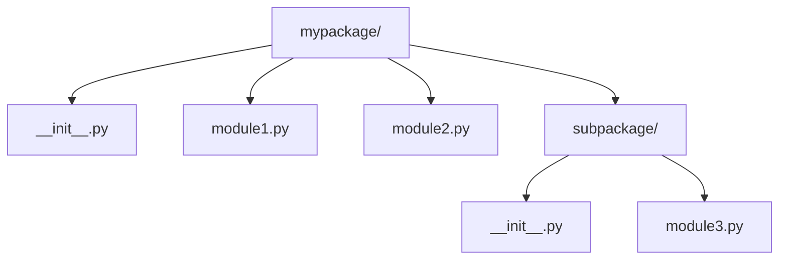
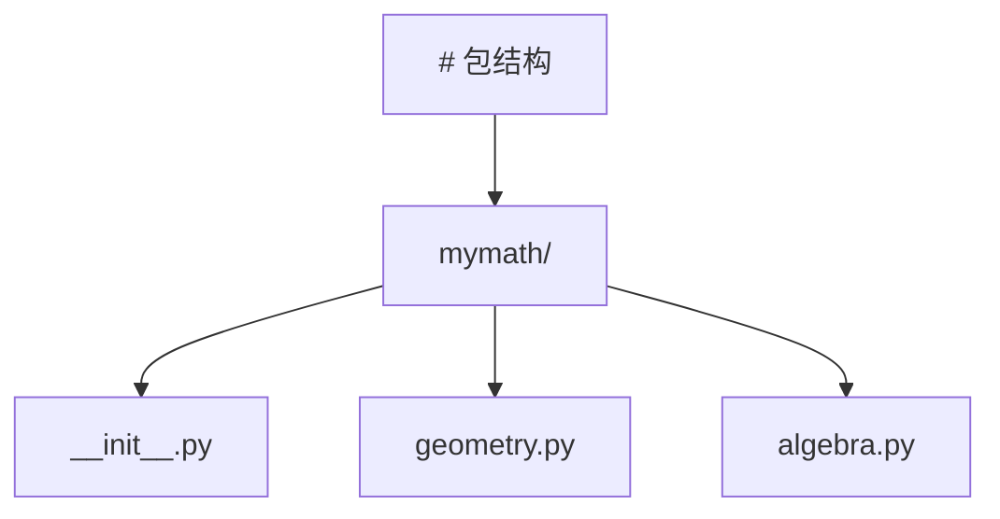
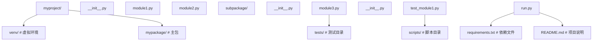
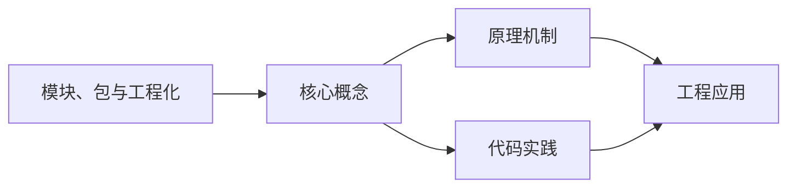
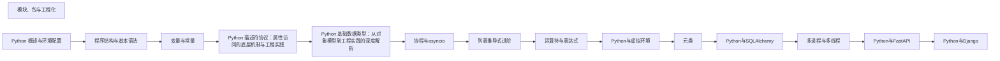

## 1. 学习目标（Bloom 分类）

本节按照布鲁姆教育目标分类学组织学习路径。本文主题为《模块、包与工程化》，属于 Python 模块，读者可以根据自身阶段选择阅读深度。

记忆层面：能够准确复述本文的核心概念、术语与基本语法或操作步骤，并能够在提问或检索时快速定位对应知识点。例如能够说出 Python 的动态类型、缩进语法与解释执行等基本特征。

理解层面：能够用自己的语言解释核心原理与工作机制，说明概念之间的因果关系，而不是机械记忆结论。例如能够解释解释器与编译器的差异，以及 GIL 对并发的影响。

应用层面：能够在真实项目或练习场景中运用本文知识解决具体问题，写出正确且可维护的实现。例如能够编写函数、类与标准库调用的完整脚本。

分析层面：能够拆解复杂问题，比较本文主题与相邻概念的异同，识别边界条件与例外情况。例如能够比较 Python 与 Java、Go 在类型系统与并发模型上的差异。

评价层面：能够根据约束条件（性能、可读性、安全、成本）评价不同方案的优劣，做出有依据的技术决策。例如能够评估不同实现方案（脚本、服务、库）的适用场景。

创造层面：能够把本文知识与其他模块知识组合，设计出新的解决方案或可复用的工程模式。例如能够组合标准库与第三方包设计完整的自动化工具。

通过本节学习，读者应当能够把《模块、包与工程化》纳入自己的知识网络，并与 Python 模块的其他主题（数据类型、函数、模块、异常、并发）建立关联。

## 2. 历史动机与发展脉络

《模块、包与工程化》是 Python 领域的重要主题。要真正理解它，需要先了解它解决的问题与演进过程。

Python 由 Guido van Rossum 于 1991 年首次发布，设计哲学强调代码可读性与开发效率，核心思想记录在《Python 之禅》（PEP 20）中：优美优于丑陋、明确优于隐晦、简单优于复杂。
Python 2 与 Python 3 的分裂期（2008-2020）是语言史上最重要的兼容性事件：Python 3 修复了字符串编码、整数除法等长期问题，但破坏性变更导致迁移缓慢；2020 年 1 月 Python 2 停止官方维护，社区全面转向 Python 3。
Python 3.9 至 3.13 的演进带来了类型提示增强（PEP 604 的 X | Y 语法、PEP 695 的泛型语法）、性能优化（3.11 的 faster-calls 与自适应解释器）以及异步生态的成熟（asyncio、FastAPI、httpx）。
Python 的应用版图从脚本自动化扩展到 Web 后端（Django、FastAPI）、数据科学（NumPy、Pandas、Matplotlib）、机器学习（PyTorch、scikit-learn）、运维自动化（Ansible）与科学计算，是当今最通用的编程语言之一。

回到本文主题：模块、包与工程化 的提出与成熟，正是上述技术背景下的必然产物。早期实现往往以简单可用为目标，随着工程规模扩大，社区逐渐沉淀出标准做法与最佳实践；理解这一脉络，可以帮助读者判断“为什么文档中的推荐写法是现在这个样子”，也能在遇到历史遗留代码时准确识别其设计年代与取舍。

对于初学者，理解 Python 的“电池内置”（标准库丰富）与“胶水语言”（易于调用 C/C++/Rust 扩展）两大特性，是判断其适用场景的基础。

## 3. 形式化定义与核心概念精讲

本节把《模块、包与工程化》涉及的核心概念以“定义 + 讲解”的形式展开。读者应把定义当作工具，把讲解当作理解路径；两者结合才能形成可迁移的知识。

变量与动态类型：Python 变量是对象的引用，类型属于对象而非变量；`isinstance()` 与 `type()` 用于运行时检查，类型注解（PEP 484）提供静态检查能力但不改变运行时行为。
缩进即语法：Python 用缩进表达代码块层次，避免了花括号噪声，也强制了代码排版一致性；同一代码块必须使用一致的空格数（官方推荐 4 空格）。
函数是一等公民：函数可以赋值、传参、返回，配合 lambda、装饰器与闭包，构成函数式编程能力的基础。
模块与包：每个 `.py` 文件是模块，目录加 `__init__.py` 是包；`import` 机制支持绝对导入、相对导入与命名空间包。
异常处理：`try/except/finally` 与 `raise` 构成错误传播体系；`with` 语句通过上下文管理器（`__enter__/__exit__`）管理资源生命周期。

### 3.1 原文章节逐一精讲

原文档把主题拆分为 29 个小节，下面按顺序给出每一节的导读讲解，随后保留原文细节供精读。

#### 原文精读（完整保留）

# Python 模块包导入

> **符号约定**：`< >` 必填参数 | `[ ]` 可选参数

---

#### 泛型

**基本写法：泛型函数**
`def <函数名>(<参数>: <类型>[T]) -> <类型>[T]`
```python
# 使用 TypeVar 声明泛型
from typing import TypeVar
T = TypeVar("T")
def first(items: list[T]) -> T:
    return items[0]
```

**基本写法：Python 3.12+ 泛型语法**
`def <函数名>[T](<参数>: list[T]) -> T`
```python
# Python 3.12+ 内联泛型参数声明
def first[T](items: list[T]) -> T:
    return items[0]
```

**换行写法：泛型类**
`class <类名>(Generic[T]):`
```python
# 继承 Generic 实现泛型类
from typing import Generic, TypeVar
T = TypeVar("T")
class Stack(Generic[T]):
    def __init__(self):
        self._items: list[T] = []
    def push(self, item: T) -> None:
        self._items.append(item)
```

**基本写法：Python 3.12+ 泛型类新语法**
`class <类名>[T]:`
```python
# Python 3.12+ 直接在类名后声明类型参数
class Stack[T]:
    def __init__(self):
        self._items: list[T] = []
    def push(self, item: T) -> None:
        self._items.append(item)
```

---

#### Optional 与 Union

**基本写法：Optional 可选类型**
`Optional[<类型>]`
```python
# 表示值可以为 None
from typing import Optional
def find(name: str) -> Optional[int]:
    if name in data:
        return data[name]
    return None
```

**基本写法：Union 联合类型**
`Union[<类型1>, <类型2>]`
```python
# 多种可能的类型
from typing import Union
def process(data: Union[str, bytes]) -> str:
    if isinstance(data, bytes):
        return data.decode()
    return data
```

**基本写法：Python 3.10+ 联合类型语法**
`<类型1> | <类型2>`
```python
# 使用管道符表示联合类型
def process(data: str | bytes) -> str:
    if isinstance(data, bytes):
        return data.decode()
    return data
```

**基本写法：Python 3.10+ 可空语法**
`<类型> | None`
```python
# 使用管道符表示可选
def find(name: str) -> int | None:
    return data.get(name)
```

---

#### Callable 可调用类型

**基本写法：Callable 类型**
`Callable[[<参数类型>], <返回类型>]`
```python
# 标注函数类型
from typing import Callable
def apply(func: Callable[[int, int], int], a: int, b: int) -> int:
    return func(a, b)
```

**基本写法：无参数 Callable**
`Callable[[], <返回类型>]`
```python
# 无参数可调用对象
def run(fn: Callable[[], str]) -> str:
    return fn()
```

**基本写法：任意签名 Callable**
`Callable[..., <返回类型>]`
```python
# 不指定参数签名的可调用对象
Handler = Callable[..., None]
```

---

#### 容器类型

**基本写法：List 类型**
`list[<元素类型>]`
```python
# 列表类型标注
names: list[str] = ["Alice", "Bob"]
```

**基本写法：Dict 类型**
`dict[<键类型>, <值类型>]`
```python
# 字典类型标注
scores: dict[str, int] = {"Alice": 90}
```

**基本写法：Tuple 类型**
`tuple[<类型1>, <类型2>]`
```python
# 固定长度元组
point: tuple[float, float] = (1.0, 2.0)
```

**基本写法：可变长元组**
`tuple[<类型>, ...]`
```python
# 任意长度的同类型元组
nums: tuple[int, ...] = (1, 2, 3)
```

**基本写法：Set 类型**
`set[<元素类型>]`
```python
# 集合类型标注
tags: set[str] = {"a", "b"}
```

---

#### TypedDict

**换行写法：定义 TypedDict**
`class <类名>(TypedDict):`
`    <字段>: <类型>`

```python
# 为字典提供固定键值类型
from typing import TypedDict
class UserDict(TypedDict):
    name: str
    age: int
user: UserDict = {"name": "Alice", "age": 30}
```

**基本写法：Python 3.12+ TypedDict 用于 kwargs**
`def <函数名>(**kwargs: <TypedDict类>)`
```python
# Python 3.12+ PEP 692 使用 TypedDict 标注 kwargs
class Options(TypedDict, total=False):
    timeout: int
    retry: bool
def fetch(url: str, **kwargs: Options) -> None:
    pass
```

---

#### Literal 字面量类型

**基本写法：Literal 字面量**
`Literal[<值1>, <值2>]`
```python
# 限定值为特定字面量
from typing import Literal
def set_mode(mode: Literal["read", "write", "append"]) -> None:
    pass
```

---

#### Protocol 结构化子类型

**换行写法：定义 Protocol**
`class <协议名>(Protocol):`
`    def <方法>(self, ...) -> ...: ...`

```python
# 鸭子类型协议
from typing import Protocol
class Comparable(Protocol):
    def __lt__(self, other: "Comparable") -> bool: ...
def sort(items: list[Comparable]) -> None:
    pass
```

**基本写法：runtime_checkable 运行时检查**
`@runtime_checkable`
```python
# 允许 isinstance 检查 Protocol
from typing import Protocol, runtime_checkable
@runtime_checkable
class Drawable(Protocol):
    def draw(self) -> None: ...
isinstance(obj, Drawable)
```

---

#### Any 与 TypeGuard

**基本写法：Any 类型**
`Any`
```python
# 任意类型，跳过类型检查
from typing import Any
data: Any = json.loads(raw)
```

**基本写法：TypeGuard 类型守卫**
`TypeGuard[<类型>]`
```python
# 缩小类型范围的谓词函数
from typing import TypeGuard
def is_str_list(val: list) -> TypeGuard[list[str]]:
    return all(isinstance(x, str) for x in val)
```

**基本写法：Python 3.13+ TypeIs**
`TypeIs[<类型>]`
```python
# Python 3.13+ 更严格的类型守卫
from typing import TypeIs
def is_positive(n: int) -> TypeIs[int]:
    return n > 0
```

---

#### TypeVar 高级用法

**基本写法：带约束的 TypeVar**
`TypeVar("<名称>", <类型1>, <类型2>)`
```python
# 限定类型只能是某几种
from typing import TypeVar
T = TypeVar("T", int, float)
def add(a: T, b: T) -> T:
    return a + b
```

**基本写法：带上界的 TypeVar**
`TypeVar("<名称>", bound=<类型>)`
```python
# 限定类型必须是指定类的子类
from typing import TypeVar
T = TypeVar("T", bound=str)
def process(value: T) -> T:
    return value
```

**基本写法：Python 3.13+ TypeVar 默认值**
`T = TypeVar("T", default=<类型>)`
```python
# Python 3.13+ PEP 696 类型参数默认值
from typing import TypeVar
T = TypeVar("T", default=int)
def get_value() -> T:
    return 42
```

---

#### ParamSpec 与 TypeVarTuple

**基本写法：ParamSpec 参数规格**
`P = ParamSpec("P")`
```python
# 捕获函数的参数签名
from typing import ParamSpec, Callable, TypeVar
P = ParamSpec("P")
R = TypeVar("R")
def log(fn: Callable[P, R]) -> Callable[P, R]:
    def wrapper(*args: P.args, **kwargs: P.kwargs) -> R:
        return fn(*args, **kwargs)
    return wrapper
```

**基本写法：TypeVarTuple 可变泛型**
`Ts = TypeVarTuple("Ts")`
```python
# 可变数量的类型参数
from typing import TypeVarTuple, Unpack
Ts = TypeVarTuple("Ts")
def merge(*args: Unpack[Ts]) -> tuple[Unpack[Ts]]:
    return args
```

---

#### 常用工具类型

**基本写法：Final 不可变**
`Final[<类型>]`
```python
# 标注不应被重新赋值
from typing import Final
MAX_SIZE: Final[int] = 100
```

**基本写法：ClassVar 类变量**
`ClassVar[<类型>]`
```python
# 标注类级别变量而非实例变量
from typing import ClassVar
class Config:
    default: ClassVar[str] = "production"
```

**基本写法：Python 3.13+ @deprecated**
`@deprecated("<消息>")`
```python
# Python 3.13+ PEP 702 标记弃用
from warnings import deprecated  # typing.deprecated
@deprecated("使用 new_func 替代")
def old_func():
    pass
```

**基本写法：@override 重写标记**
`@override`
```python
# Python 3.12+ PEP 698 标记方法重写
from typing import override
class Child(Parent):
    @override
    def method(self):
        pass
```
#### 1. 模块导入 (Importing)

模块是包含 Python 代码的 `.py` 文件，它可以包含函数、类和变量。

##### 1.1 基本导入方式

```python
 # 导入整个模块
 import math
 print(math.pi) # 输出: 3.141592653589793
 print(math.sqrt(16)) # 输出: 4.0
 # 导入模块并使用别名
 import math as m
 print(m.pi) # 输出: 3.141592653589793
 # 导入模块中的特定成员
 from math import pi, sqrt
 print(pi) # 输出: 3.141592653589793
 print(sqrt(16)) # 输出: 4.0
 # 导入模块中的所有成员
 from math import *
 print(pi) # 输出: 3.141592653589793
 print(sin(0)) # 输出: 0.0
```

##### 1.2 导入路径 (Search Path)

Python 解释器在导入模块时，会按照以下顺序查找：

1. 当前目录
2. `PYTHONPATH` 环境变量中指定的目录
3. 标准库目录
4. 第三方库目录 (`site-packages`)

```python
 import sys
 # 查看导入路径
 print(sys.path)
 # 添加自定义目录到导入路径
 sys.path.append("/path/to/custom/modules")
```

##### 1.3 相对导入

在包内部，可以使用相对导入来导入同一包中的其他模块。

```python
 # 假设目录结构如下:
 # mypackage/
 # ├── __init__.py
 # ├── module1.py
 # └── subpackage/
 # ├── __init__.py
 # └── module2.py
 # 在 module2.py 中导入 module1.py
 from .. import module1
 # 在 module1.py 中导入 subpackage.module2
 from .subpackage import module2
```

##### 1.4 动态导入

使用 `importlib` 模块可以动态导入模块。

```python
 import importlib
 # 动态导入模块
 math_module = importlib.import_module("math")
 print(math_module.pi) # 输出: 3.141592653589793
 # 动态导入包中的模块
 os_path = importlib.import_module("os.path")
 print(os_path.abspath(".")) # 输出当前目录的绝对路径
```

#### 2. 包 (Packages)

包是包含多个模块的目录，它必须包含一个 `__init__.py` 文件。

##### 2.1 包的结构



##### 2.2 `__init__.py` 文件

`__init__.py` 文件用于标识一个目录为包，它可以包含包的初始化代码。

```python
 # mypackage/__init__.py
 # 包的版本
 _
 # 从包中导出成员
 from .module1 import function1
 from .module2 import function2
 # 定义包级别的变量
 package_variable = "This is a package variable"
 # 包的初始化代码
 print("Initializing mypackage")
```

##### 2.3 导入包

```python
 # 导入整个包
 import mypackage
 print(mypackage.__version__) # 输出: 1.0.0
 print(mypackage.package_variable) # 输出: This is a package variable
 print(mypackage.function1()) # 调用从 module1 导出的函数
 # 导入包中的模块
 from mypackage import module1
 print(module1.function1()) # 调用 module1 中的函数
 # 导入子包
 from mypackage.subpackage import module3
 print(module3.function3()) # 调用 module3 中的函数
```

##### 2.4 命名空间包

Python 3.3+ 支持命名空间包，它允许将多个目录作为同一个包的一部分，而不需要 `__init__.py` 文件。

#### 3. 命名空间与 `__name__`

##### 3.1 命名空间

每个模块都有自己的命名空间，用于存储模块中的变量、函数和类。

```python
 # module1.py
 x = 10
 def function():
  pass
 class MyClass:
  pass
 # 在另一个模块中
 import module1
 print(module1.x) # 访问 module1 的命名空间中的变量
```

##### 3.2 `__name__` 属性

每个模块都有一个 `__name__` 属性，用于标识模块的名称。

- 当模块作为主程序运行时，`__name__` 的值为 `"__main__"`
- 当模块被导入时，`__name__` 的值为模块的名称

```python
 # module.py
 print(f"Module name: {__name__}")
 if __name__ == "__main__":
  print("Running as main program")
 else:
  print("Being imported as a module")
 # 运行 module.py 直接执行
 # 输出:
 # Module name: __main__
 # Running as main program
 # 在另一个模块中导入 module.py
 # 输出:
 # Module name: module
 # Being imported as a module
```

##### 3.3 示例：模块的测试代码

```python
 # utils.py
 def add(a, b):
  """加法函数"""
  return a + b
 def multiply(a, b):
  """乘法函数"""
  return a * b
 # 测试代码
 if __name__ == "__main__":
  print("Testing utils module")
  print(f"add(2, 3) = {add(2, 3)}")
  print(f"multiply(2, 3) = {multiply(2, 3)}")
```

#### 4. 第三方库管理 (pip)

##### 4.1 基本命令

```bash
 # 安装包
 pip install package_name
 # 安装指定版本的包
 pip install package_name==1.0.0
 # 升级包
 pip install --upgrade package_name
 # 卸载包
 pip uninstall package_name
 # 列出已安装的包
 pip list
 # 查看包的详细信息
 pip show package_name
 # 导出依赖
 pip freeze > requirements.txt
 # 安装依赖
 pip install -r requirements.txt
 # 检查包的更新
 pip list --outdated
```

##### 4.2 虚拟环境中的 pip

在虚拟环境中使用 pip 安装的包只对该虚拟环境有效，不会影响系统全局的包。

##### 4.3 国内镜像源

使用国内镜像源可以加快包的下载速度：

```bash
 # 临时使用
 pip install -i https://pypi.tuna.tsinghua.edu.cn/simple package_name
 # 永久设置
 pip config set global.index-url https://pypi.tuna.tsinghua.edu.cn/simple
```

常用的国内镜像源：

- 清华大学: <https://pypi.tuna.tsinghua.edu.cn/simple>
- 阿里云: <https://mirrors.aliyun.com/pypi/simple>
- 豆瓣: <https://pypi.douban.com/simple>

#### 5. 虚拟环境 (Virtual Environments)

##### 5.1 虚拟环境的作用

- **隔离依赖**: 不同项目可以使用不同版本的包
- **避免冲突**: 防止包版本冲突
- **便于管理**: 每个项目的依赖都独立管理
- **便于部署**: 可以轻松导出和安装依赖

##### 5.2 使用 `venv` 创建虚拟环境

```bash
 # 创建虚拟环境
 python -m venv venv
 # 激活虚拟环境（Windows）
 venv\Scripts\activate.bat
 # 激活虚拟环境（Linux/Mac）
 source venv/bin/activate
 # 退出虚拟环境
 deactivate
```

##### 5.3 使用 `conda` 创建虚拟环境

```bash
 # 创建虚拟环境
 conda create -n myenv python=3.8
 # 激活虚拟环境
 conda activate myenv
 # 退出虚拟环境
 conda deactivate
 # 删除虚拟环境
 conda remove -n myenv --all
```

##### 5.4 使用 `poetry` 管理依赖

```bash
 # 初始化项目
 poetry init
 # 添加依赖
 poetry add package_name
 # 安装依赖
 poetry install
 # 激活虚拟环境
 poetry shell
 # 运行命令
 poetry run python script.py
```

##### 5.5 虚拟环境的最佳实践

- **每个项目使用独立的虚拟环境**
- **使用 `requirements.txt` 或 `pyproject.toml` 管理依赖**
- **将虚拟环境目录添加到 `.gitignore`**
- **定期更新依赖**
- **在部署前测试依赖**

#### 6. 模块和包的最佳实践

##### 6.1 模块设计

- **单一职责**: 每个模块应该只负责一个功能
- **命名规范**: 模块名应该小写，使用下划线分隔单词
- **文档**: 为模块添加文档字符串
- **导入顺序**: 按标准库、第三方库、本地模块的顺序导入
- **避免循环导入**: 合理设计模块间的依赖关系

##### 6.2 包设计

- **层次清晰**: 包的结构应该层次清晰，易于理解
- **`__init__.py`**: 合理使用 `__init__.py` 文件，导出重要的成员
- **相对导入**: 在包内部使用相对导入
- **版本管理**: 在包中包含版本信息
- **测试**: 为包添加测试代码

##### 6.3 导入规范

- **避免使用 `from module import *`**: 可能导致命名冲突
- **使用别名**: 对于长模块名，使用简洁的别名
- **分组导入**: 按功能分组导入
- **显式导入**: 明确导入需要的成员

#### 7. 实际应用示例

##### 7.1 创建和使用自定义模块

```python
 # utils.py
 """工具模块"""
 def calculate_area(radius):
  """计算圆的面积"""
  import math
  return math.pi * radius ** 2
 def calculate_perimeter(radius):
  """计算圆的周长"""
  import math
  return 2 * math.pi * radius
 # 使用模块
 import utils
 radius = 5
 print(f"Radius: {radius}")
 print(f"Area: {utils.calculate_area(radius):.2f}")
 print(f"Perimeter: {utils.calculate_perimeter(radius):.2f}")
```

##### 7.2 创建和使用包



```python
 # mymath/__init__.py
 """数学包"""
 _
 from .geometry import calculate_area, calculate_perimeter
 from .algebra import add, subtract, multiply, divide
 # mymath/geometry.py
 """几何模块"""
 import math
 def calculate_area(radius):
  """计算圆的面积"""
  return math.pi * radius ** 2
 def calculate_perimeter(radius):
  """计算圆的周长"""
  return 2 * math.pi * radius
 # mymath/algebra.py
 """代数模块"""
 def add(a, b):
  """加法"""
  return a + b
 def subtract(a, b):
  """减法"""
  return a - b
 def multiply(a, b):
  """乘法"""
  return a * b
 def divide(a, b):
  """除法"""
  if b == 0:
  raise ZeroDivisionError("Cannot divide by zero")
  return a / b
 # 使用包
 import mymath
 print(f"Package version: {mymath.__version__}")
 # 使用几何模块
 radius = 5
 print(f"Circle with radius {radius}:")
 print(f"Area: {mymath.calculate_area(radius):.2f}")
 print(f"Perimeter: {mymath.calculate_perimeter(radius):.2f}")
 # 使用代数模块
 print("\nAlgebra operations:")
 print(f"2 + 3 = {mymath.add(2, 3)}")
 print(f"5 - 2 = {mymath.subtract(5, 2)}")
 print(f"3 * 4 = {mymath.multiply(3, 4)}")
 print(f"10 / 2 = {mymath.divide(10, 2)}")
```

##### 7.3 管理项目依赖

```bash
 # 创建虚拟环境
 python -m venv venv
 # 激活虚拟环境
 venv\Scripts\activate.bat
 # 安装依赖
 pip install requests
 pip install pandas
 pip install matplotlib
 # 导出依赖
 pip freeze > requirements.txt
 # 查看依赖
 cat requirements.txt
 # 安装依赖（在另一台机器上）
 pip install -r requirements.txt
```

##### 7.4 项目结构示例



#### 8. 高级话题

##### 8.1 模块的 reload

使用 `importlib` 模块可以重新加载已经导入的模块。

```python
 import importlib
 import mymodule
 # 修改 mymodule.py 后重新加载
 importlib.reload(mymodule)
```

##### 8.2 模块的缓存

Python 会缓存导入的模块，以提高性能。

```python
 import sys
 # 查看已导入的模块
 print(list(sys.modules.keys()))
 # 移除模块缓存
 del sys.modules["mymodule"]
 # 再次导入时会重新加载
 import mymodule
```

##### 8.3 包的分发

使用 `setuptools` 可以将包分发给其他人。

```python
 # setup.py
 from setuptools import setup, find_packages
 setup(
  name="mymath",
  version="1.0.0",
  description="A simple math package",
  packages=find_packages(),
  install_requires=[],
  entry_points={
  "console_scripts": [
  "mymath = mymath.cli:main"
  ]
  }
 )
```

##### 8.4 包的安装方式

- **开发模式安装**: `pip install -e .`
- **构建分发包**: `python setup.py sdist bdist_wheel`
- **上传到 PyPI**: `twine upload dist/*`

---

#### 基本导入

**基本写法：导入模块**
`import <模块名>`
```python
# 导入整个模块，通过模块名访问成员
import os
path = os.getcwd()
```

---

**基本写法：导入特定成员**
`from <模块> import <名称>`
```python
# 仅导入需要的函数或类
from pathlib import Path
p = Path(".")
```

---

**基本写法：导入并设置别名**
`import <模块> as <别名>`
```python
# 用别名简化长模块名
import numpy as np
arr = np.array([1, 2, 3])
```

---

**基本写法：导入多个成员**
`from <模块> import <名称1>, <名称2>`
```python
# 一次导入多个符号
from collections import deque, defaultdict
```

---

**基本写法：导入全部公开成员**
`from <模块> import *`
```python
# 导入 __all__ 列出的名称，无 __all__ 则导入所有非下划线开头名称
# 不推荐在生产代码使用，易造成命名冲突
```

---

#### 包与 __init__.py

**基本写法：定义包**
`<目录>/__init__.py`
```python
# 含 __init__.py 的目录即为包（Python 3.3+ 普通目录也支持命名空间包）
# mypackage/__init__.py
__all__ = ["core", "utils"]
```

---

**基本写法：包内模块导入**
`from <包> import <模块>`
```python
# mypackage/core.py 中定义函数
# 外部调用
from mypackage import core
core.run()
```

---

#### __all__ 公开接口

**基本写法：声明公开名称**
`__all__ = [<名称列表>]`
```python
# 模块顶部声明，控制 from module import * 的导出范围
# utils.py
__all__ = ["helper", "format_text"]

def helper():
    pass

def _internal():
    # 以 _ 开头默认为私有，不会被 import * 导入
    pass
```

---

#### 相对导入

**基本写法：当前包内导入**
`from . import <模块>`
```python
# 一个点表示当前包目录
# mypackage/core.py
from . import utils
```

---

**基本写法：上级包导入**
`from .. import <模块>`
```python
# 两个点表示上一级包
# mypackage/sub/child.py
from .. import core
```

---

**基本写法：指定相对层级**
`from .<模块> import <名称>`
```python
# 从当前包的指定模块导入
# mypackage/core.py
from .utils import format_text
```

---

#### sys.path 路径管理

**基本写法：查看搜索路径**
`sys.path`
```python
import sys
# 列出模块搜索路径，首项常为当前脚本目录
print(sys.path)
```

---

**基本写法：临时添加搜索路径**
`sys.path.append(<路径>)`
```python
import sys
# 运行时动态加入目录，重启后失效
sys.path.append("/home/user/libs")
import mylib
```

---

**基本写法：插入到路径最前**
`sys.path.insert(0, <路径>)`
```python
import sys
# 0 表示最高优先级
sys.path.insert(0, "/opt/custom")
```

---

#### importlib 动态导入

**基本写法：按字符串导入模块**
`importlib.import_module(<模块名>)`
```python
import importlib
# 运行时根据字符串动态加载模块
mod = importlib.import_module("json")
print(mod.dumps({"a": 1}))
```

---

**基本写法：导入子模块**
`importlib.import_module("<包>.<模块>")`
```python
import importlib
# 动态加载包内子模块
core = importlib.import_module("mypackage.core")
```

---

**基本写法：按名称获取函数**
`getattr(<模块>, <名称>)`
```python
import importlib
mod = importlib.import_module("collections")
# 再用 getattr 取出具体成员
Deque = getattr(mod, "deque")
```

---

#### 模块属性

**基本写法：模块名**
`__name__`
```python
# 模块自身为 "__main__"，被导入时为模块全名
if __name__ == "__main__":
    main()
```

---

**基本写法：模块文件路径**
`__file__`
```python
# 获取模块所在文件路径
print(__file__)
```

---

**基本写法：模块文档字符串**
`__doc__`
```python
"""模块顶部文档字符串。"""
# 通过 __doc__ 访问
print(__doc__)
```

---

**基本写法：包路径**
`__path__`
```python
# 仅包拥有 __path__，表示包目录列表
# 子模块导入时会基于 __path__ 查找
```

---

#### 模块缓存

**基本写法：查看已加载模块**
`sys.modules`
```python
import sys
# 字典缓存所有已导入模块，键为模块全名
print("json" in sys.modules)
```

---

**基本写法：重载模块**
`importlib.reload(<模块>)`
```python
import importlib, mymod
# 开发期修改源码后重新加载
importlib.reload(mymod)
```

---

#### 条件与延迟导入

**基本写法：函数内导入**
`def <函数>(): import <模块>`
```python
# 延迟到调用时导入，常用于避免循环依赖或加速启动
def parse(path):
    import json
    with open(path) as f:
        return json.load(f)
```

---

**基本写法：try 容错导入**
`try: import <模块>`
```python
# 优先使用 C 加速版本，失败回退纯 Python
try:
    import cjson as json
except ImportError:
    import json
```

---## 基本类型别名

**基本写法：类型别名**
`<别名> = <类型>`
```python
# 为类型定义别名
Vector = list[float]
Matrix = list[list[float]]
def scale(v: Vector, n: float) -> Vector:
    return [x * n for x in v]
```

**基本写法：Python 3.12+ type 语句**
`type <别名> = <类型>`
```python
# Python 3.12+ 使用 type 关键字定义类型别名
type Vector = list[float]
type Callback = Callable[[int], str]
```

---

#### 基本类型别名

**基本写法：类型别名**
`<别名> = <类型>`
```python
# 为类型定义别名
Vector = list[float]
Matrix = list[list[float]]
def scale(v: Vector, n: float) -> Vector:
    return [x * n for x in v]
```

**基本写法：Python 3.12+ type 语句**
`type <别名> = <类型>`
```python
# Python 3.12+ 使用 type 关键字定义类型别名
type Vector = list[float]
type Callback = Callable[[int], str]
```

---


### 3.2 概念关系图

下面用 Mermaid 图表达本文核心概念之间的关系，帮助读者建立整体图景：



图中展示的是本文知识的结构化关系：核心概念是入口，原理机制解释“为什么”，代码实践演示“怎么做”，工程应用回答“何时用”。读者学习时可以把每个小节的内容挂接到对应节点上。

## 4. 理论推导与原理解析

本节深入《模块、包与工程化》背后的原理。理论部分不求面面俱到，而是聚焦“能解释现象、能指导实践”的关键推导。

解释执行与字节码：CPython 先把源码编译为字节码（.pyc），再由虚拟机逐条执行。字节码是平台无关的中间表示，因此 Python 程序可以跨平台运行，但执行速度低于编译型语言；性能敏感路径可用 C 扩展或 Cython 加速。
GIL（全局解释器锁）：CPython 的 GIL 保证同一时刻只有一个线程执行字节码，简化了内存管理，但限制了 CPU 密集型多线程并行；I/O 密集型任务通过线程切换获得并发，CPU 密集型任务应使用多进程（multiprocessing）或异步。
引用计数与垃圾回收：Python 对象通过引用计数管理生命周期，循环引用由分代垃圾回收器（gc 模块）处理。理解这一模型可以解释“为什么局部变量及时释放内存”“为什么大对象需要 del 或作用域退出”。
鸭子类型与协议：Python 依赖行为协议而非继承体系，例如实现 `__iter__` 与 `__next__` 的对象即可用于 `for` 循环。这一设计带来灵活性的同时，也要求开发者编写清晰的接口文档与类型注解。

需要强调的是，理论推导与工程实践之间存在翻译层：理论给出的是理想化模型与边界条件，工程代码则必须处理真实环境中的例外。读者在学习时应先掌握理论的“标准情形”，再通过陷阱章节了解“非标准情形”。

## 5. 代码示例与逐行讲解

本节把原文中的代码示例系统整理，并为每个示例补充用途说明与讲解。读者不应只浏览代码，而应逐段对照讲解理解设计意图。

### 5.1 示例：泛型

该示例来自原文《泛型》小节，用于演示模块、包与工程化相关操作。阅读时请先看代码结构，再看其后的讲解。

```python
# 使用 TypeVar 声明泛型
from typing import TypeVar
T = TypeVar("T")
def first(items: list[T]) -> T:
    return items[0]
```

讲解：这段代码演示了本节核心知识点。代码中的关键操作可以归纳为三步：准备（定义或初始化）、执行（核心逻辑）、收尾（释放资源或返回结果）。实际项目中，这三步往往被封装为函数或类，以提升复用性与可测试性。

关键点分析：

该示例共 5 行有效代码，包含 4 类关键结构（def、import、from、return）。其中：

- 入口与初始化部分负责建立上下文，对应实际项目中的启动或装配逻辑；
- 核心逻辑部分体现本文主题的主要操作，是阅读时最需要对照讲解理解的部分；
- 输出或返回部分把结果交给调用方，注意其类型与边界条件。

进阶思考路径：先尝试修改参数观察行为变化，再把示例中的模式迁移到自己的项目中；每次修改都记录预期与实测差异，这是把示例转化为能力的最快方式。

### 5.2 示例：泛型

该示例来自原文《泛型》小节，用于演示模块、包与工程化相关操作。阅读时请先看代码结构，再看其后的讲解。

```python
# Python 3.12+ 内联泛型参数声明
def first[T](items: list[T]) -> T:
    return items[0]
```

讲解：这段代码演示了本节核心知识点。代码中的关键操作可以归纳为三步：准备（定义或初始化）、执行（核心逻辑）、收尾（释放资源或返回结果）。实际项目中，这三步往往被封装为函数或类，以提升复用性与可测试性。

关键点分析：

该示例共 3 行有效代码，包含 2 类关键结构（def、return）。其中：

- 入口与初始化部分负责建立上下文，对应实际项目中的启动或装配逻辑；
- 核心逻辑部分体现本文主题的主要操作，是阅读时最需要对照讲解理解的部分；
- 输出或返回部分把结果交给调用方，注意其类型与边界条件。

进阶思考路径：先尝试修改参数观察行为变化，再把示例中的模式迁移到自己的项目中；每次修改都记录预期与实测差异，这是把示例转化为能力的最快方式。

### 5.3 示例：泛型

该示例来自原文《泛型》小节，用于演示模块、包与工程化相关操作。阅读时请先看代码结构，再看其后的讲解。

```python
# 继承 Generic 实现泛型类
from typing import Generic, TypeVar
T = TypeVar("T")
class Stack(Generic[T]):
    def __init__(self):
        self._items: list[T] = []
    def push(self, item: T) -> None:
        self._items.append(item)
```

讲解：这段代码演示了本节核心知识点。代码中的关键操作可以归纳为三步：准备（定义或初始化）、执行（核心逻辑）、收尾（释放资源或返回结果）。实际项目中，这三步往往被封装为函数或类，以提升复用性与可测试性。

关键点分析：

该示例共 8 行有效代码，包含 4 类关键结构（class、def、import、from）。其中：

- 入口与初始化部分负责建立上下文，对应实际项目中的启动或装配逻辑；
- 核心逻辑部分体现本文主题的主要操作，是阅读时最需要对照讲解理解的部分；
- 输出或返回部分把结果交给调用方，注意其类型与边界条件。

进阶思考路径：先尝试修改参数观察行为变化，再把示例中的模式迁移到自己的项目中；每次修改都记录预期与实测差异，这是把示例转化为能力的最快方式。

### 5.4 示例：泛型

该示例来自原文《泛型》小节，用于演示模块、包与工程化相关操作。阅读时请先看代码结构，再看其后的讲解。

```python
# Python 3.12+ 直接在类名后声明类型参数
class Stack[T]:
    def __init__(self):
        self._items: list[T] = []
    def push(self, item: T) -> None:
        self._items.append(item)
```

讲解：这段代码演示了本节核心知识点。代码中的关键操作可以归纳为三步：准备（定义或初始化）、执行（核心逻辑）、收尾（释放资源或返回结果）。实际项目中，这三步往往被封装为函数或类，以提升复用性与可测试性。

关键点分析：

该示例共 6 行有效代码，包含 2 类关键结构（class、def）。其中：

- 入口与初始化部分负责建立上下文，对应实际项目中的启动或装配逻辑；
- 核心逻辑部分体现本文主题的主要操作，是阅读时最需要对照讲解理解的部分；
- 输出或返回部分把结果交给调用方，注意其类型与边界条件。

进阶思考路径：先尝试修改参数观察行为变化，再把示例中的模式迁移到自己的项目中；每次修改都记录预期与实测差异，这是把示例转化为能力的最快方式。

### 5.5 示例：Optional 与 Union

该示例来自原文《Optional 与 Union》小节，用于演示模块、包与工程化相关操作。阅读时请先看代码结构，再看其后的讲解。

```python
# 表示值可以为 None
from typing import Optional
def find(name: str) -> Optional[int]:
    if name in data:
        return data[name]
    return None
```

讲解：这段代码演示了本节核心知识点。代码中的关键操作可以归纳为三步：准备（定义或初始化）、执行（核心逻辑）、收尾（释放资源或返回结果）。实际项目中，这三步往往被封装为函数或类，以提升复用性与可测试性。

关键点分析：

该示例共 6 行有效代码，包含 5 类关键结构（def、import、from、if、return）。其中：

- 入口与初始化部分负责建立上下文，对应实际项目中的启动或装配逻辑；
- 核心逻辑部分体现本文主题的主要操作，是阅读时最需要对照讲解理解的部分；
- 输出或返回部分把结果交给调用方，注意其类型与边界条件。

进阶思考路径：先尝试修改参数观察行为变化，再把示例中的模式迁移到自己的项目中；每次修改都记录预期与实测差异，这是把示例转化为能力的最快方式。

### 5.6 示例：Optional 与 Union

该示例来自原文《Optional 与 Union》小节，用于演示模块、包与工程化相关操作。阅读时请先看代码结构，再看其后的讲解。

```python
# 多种可能的类型
from typing import Union
def process(data: Union[str, bytes]) -> str:
    if isinstance(data, bytes):
        return data.decode()
    return data
```

讲解：这段代码演示了本节核心知识点。代码中的关键操作可以归纳为三步：准备（定义或初始化）、执行（核心逻辑）、收尾（释放资源或返回结果）。实际项目中，这三步往往被封装为函数或类，以提升复用性与可测试性。

关键点分析：

该示例共 6 行有效代码，包含 5 类关键结构（def、import、from、if、return）。其中：

- 入口与初始化部分负责建立上下文，对应实际项目中的启动或装配逻辑；
- 核心逻辑部分体现本文主题的主要操作，是阅读时最需要对照讲解理解的部分；
- 输出或返回部分把结果交给调用方，注意其类型与边界条件。

进阶思考路径：先尝试修改参数观察行为变化，再把示例中的模式迁移到自己的项目中；每次修改都记录预期与实测差异，这是把示例转化为能力的最快方式。

### 5.7 示例：Optional 与 Union

该示例来自原文《Optional 与 Union》小节，用于演示模块、包与工程化相关操作。阅读时请先看代码结构，再看其后的讲解。

```python
# 使用管道符表示联合类型
def process(data: str | bytes) -> str:
    if isinstance(data, bytes):
        return data.decode()
    return data
```

讲解：这段代码演示了本节核心知识点。代码中的关键操作可以归纳为三步：准备（定义或初始化）、执行（核心逻辑）、收尾（释放资源或返回结果）。实际项目中，这三步往往被封装为函数或类，以提升复用性与可测试性。

关键点分析：

该示例共 5 行有效代码，包含 3 类关键结构（def、if、return）。其中：

- 入口与初始化部分负责建立上下文，对应实际项目中的启动或装配逻辑；
- 核心逻辑部分体现本文主题的主要操作，是阅读时最需要对照讲解理解的部分；
- 输出或返回部分把结果交给调用方，注意其类型与边界条件。

进阶思考路径：先尝试修改参数观察行为变化，再把示例中的模式迁移到自己的项目中；每次修改都记录预期与实测差异，这是把示例转化为能力的最快方式。

### 5.8 示例：Optional 与 Union

该示例来自原文《Optional 与 Union》小节，用于演示模块、包与工程化相关操作。阅读时请先看代码结构，再看其后的讲解。

```python
# 使用管道符表示可选
def find(name: str) -> int | None:
    return data.get(name)
```

讲解：这段代码演示了本节核心知识点。代码中的关键操作可以归纳为三步：准备（定义或初始化）、执行（核心逻辑）、收尾（释放资源或返回结果）。实际项目中，这三步往往被封装为函数或类，以提升复用性与可测试性。

关键点分析：

该示例共 3 行有效代码，包含 2 类关键结构（def、return）。其中：

- 入口与初始化部分负责建立上下文，对应实际项目中的启动或装配逻辑；
- 核心逻辑部分体现本文主题的主要操作，是阅读时最需要对照讲解理解的部分；
- 输出或返回部分把结果交给调用方，注意其类型与边界条件。

进阶思考路径：先尝试修改参数观察行为变化，再把示例中的模式迁移到自己的项目中；每次修改都记录预期与实测差异，这是把示例转化为能力的最快方式。

### 5.9 示例：Callable 可调用类型

该示例来自原文《Callable 可调用类型》小节，用于演示模块、包与工程化相关操作。阅读时请先看代码结构，再看其后的讲解。

```python
# 标注函数类型
from typing import Callable
def apply(func: Callable[[int, int], int], a: int, b: int) -> int:
    return func(a, b)
```

讲解：这段代码演示了本节核心知识点。代码中的关键操作可以归纳为三步：准备（定义或初始化）、执行（核心逻辑）、收尾（释放资源或返回结果）。实际项目中，这三步往往被封装为函数或类，以提升复用性与可测试性。

关键点分析：

该示例共 4 行有效代码，包含 4 类关键结构（def、import、from、return）。其中：

- 入口与初始化部分负责建立上下文，对应实际项目中的启动或装配逻辑；
- 核心逻辑部分体现本文主题的主要操作，是阅读时最需要对照讲解理解的部分；
- 输出或返回部分把结果交给调用方，注意其类型与边界条件。

进阶思考路径：先尝试修改参数观察行为变化，再把示例中的模式迁移到自己的项目中；每次修改都记录预期与实测差异，这是把示例转化为能力的最快方式。

### 5.10 示例：Callable 可调用类型

该示例来自原文《Callable 可调用类型》小节，用于演示模块、包与工程化相关操作。阅读时请先看代码结构，再看其后的讲解。

```python
# 无参数可调用对象
def run(fn: Callable[[], str]) -> str:
    return fn()
```

讲解：这段代码演示了本节核心知识点。代码中的关键操作可以归纳为三步：准备（定义或初始化）、执行（核心逻辑）、收尾（释放资源或返回结果）。实际项目中，这三步往往被封装为函数或类，以提升复用性与可测试性。

关键点分析：

该示例共 3 行有效代码，包含 2 类关键结构（def、return）。其中：

- 入口与初始化部分负责建立上下文，对应实际项目中的启动或装配逻辑；
- 核心逻辑部分体现本文主题的主要操作，是阅读时最需要对照讲解理解的部分；
- 输出或返回部分把结果交给调用方，注意其类型与边界条件。

进阶思考路径：先尝试修改参数观察行为变化，再把示例中的模式迁移到自己的项目中；每次修改都记录预期与实测差异，这是把示例转化为能力的最快方式。

### 5.11 示例：Callable 可调用类型

该示例来自原文《Callable 可调用类型》小节，用于演示模块、包与工程化相关操作。阅读时请先看代码结构，再看其后的讲解。

```python
# 不指定参数签名的可调用对象
Handler = Callable[..., None]
```

讲解：这段代码演示了本节核心知识点。代码中的关键操作可以归纳为三步：准备（定义或初始化）、执行（核心逻辑）、收尾（释放资源或返回结果）。实际项目中，这三步往往被封装为函数或类，以提升复用性与可测试性。

关键点分析：

该示例共 2 行有效代码，结构以数据或配置为主。阅读时应关注：数据字段的含义、配置项的作用，以及它们与运行行为的对应关系。

进阶思考路径：先尝试修改参数观察行为变化，再把示例中的模式迁移到自己的项目中；每次修改都记录预期与实测差异，这是把示例转化为能力的最快方式。

### 5.12 示例：容器类型

该示例来自原文《容器类型》小节，用于演示模块、包与工程化相关操作。阅读时请先看代码结构，再看其后的讲解。

```python
# 列表类型标注
names: list[str] = ["Alice", "Bob"]
```

讲解：这段代码演示了本节核心知识点。代码中的关键操作可以归纳为三步：准备（定义或初始化）、执行（核心逻辑）、收尾（释放资源或返回结果）。实际项目中，这三步往往被封装为函数或类，以提升复用性与可测试性。

关键点分析：

该示例共 2 行有效代码，结构以数据或配置为主。阅读时应关注：数据字段的含义、配置项的作用，以及它们与运行行为的对应关系。

进阶思考路径：先尝试修改参数观察行为变化，再把示例中的模式迁移到自己的项目中；每次修改都记录预期与实测差异，这是把示例转化为能力的最快方式。

### 5.13 示例：容器类型

该示例来自原文《容器类型》小节，用于演示模块、包与工程化相关操作。阅读时请先看代码结构，再看其后的讲解。

```python
# 字典类型标注
scores: dict[str, int] = {"Alice": 90}
```

讲解：这段代码演示了本节核心知识点。代码中的关键操作可以归纳为三步：准备（定义或初始化）、执行（核心逻辑）、收尾（释放资源或返回结果）。实际项目中，这三步往往被封装为函数或类，以提升复用性与可测试性。

关键点分析：

该示例共 2 行有效代码，结构以数据或配置为主。阅读时应关注：数据字段的含义、配置项的作用，以及它们与运行行为的对应关系。

进阶思考路径：先尝试修改参数观察行为变化，再把示例中的模式迁移到自己的项目中；每次修改都记录预期与实测差异，这是把示例转化为能力的最快方式。

### 5.14 示例：容器类型

该示例来自原文《容器类型》小节，用于演示模块、包与工程化相关操作。阅读时请先看代码结构，再看其后的讲解。

```python
# 固定长度元组
point: tuple[float, float] = (1.0, 2.0)
```

讲解：这段代码演示了本节核心知识点。代码中的关键操作可以归纳为三步：准备（定义或初始化）、执行（核心逻辑）、收尾（释放资源或返回结果）。实际项目中，这三步往往被封装为函数或类，以提升复用性与可测试性。

关键点分析：

该示例共 2 行有效代码，结构以数据或配置为主。阅读时应关注：数据字段的含义、配置项的作用，以及它们与运行行为的对应关系。

进阶思考路径：先尝试修改参数观察行为变化，再把示例中的模式迁移到自己的项目中；每次修改都记录预期与实测差异，这是把示例转化为能力的最快方式。

### 5.15 示例：容器类型

该示例来自原文《容器类型》小节，用于演示模块、包与工程化相关操作。阅读时请先看代码结构，再看其后的讲解。

```python
# 任意长度的同类型元组
nums: tuple[int, ...] = (1, 2, 3)
```

讲解：这段代码演示了本节核心知识点。代码中的关键操作可以归纳为三步：准备（定义或初始化）、执行（核心逻辑）、收尾（释放资源或返回结果）。实际项目中，这三步往往被封装为函数或类，以提升复用性与可测试性。

关键点分析：

该示例共 2 行有效代码，结构以数据或配置为主。阅读时应关注：数据字段的含义、配置项的作用，以及它们与运行行为的对应关系。

进阶思考路径：先尝试修改参数观察行为变化，再把示例中的模式迁移到自己的项目中；每次修改都记录预期与实测差异，这是把示例转化为能力的最快方式。

### 5.16 示例：容器类型

该示例来自原文《容器类型》小节，用于演示模块、包与工程化相关操作。阅读时请先看代码结构，再看其后的讲解。

```python
# 集合类型标注
tags: set[str] = {"a", "b"}
```

讲解：这段代码演示了本节核心知识点。代码中的关键操作可以归纳为三步：准备（定义或初始化）、执行（核心逻辑）、收尾（释放资源或返回结果）。实际项目中，这三步往往被封装为函数或类，以提升复用性与可测试性。

关键点分析：

该示例共 2 行有效代码，结构以数据或配置为主。阅读时应关注：数据字段的含义、配置项的作用，以及它们与运行行为的对应关系。

进阶思考路径：先尝试修改参数观察行为变化，再把示例中的模式迁移到自己的项目中；每次修改都记录预期与实测差异，这是把示例转化为能力的最快方式。

### 5.17 示例：TypedDict

该示例来自原文《TypedDict》小节，用于演示模块、包与工程化相关操作。阅读时请先看代码结构，再看其后的讲解。

```python
# 为字典提供固定键值类型
from typing import TypedDict
class UserDict(TypedDict):
    name: str
    age: int
user: UserDict = {"name": "Alice", "age": 30}
```

讲解：这段代码演示了本节核心知识点。代码中的关键操作可以归纳为三步：准备（定义或初始化）、执行（核心逻辑）、收尾（释放资源或返回结果）。实际项目中，这三步往往被封装为函数或类，以提升复用性与可测试性。

关键点分析：

该示例共 6 行有效代码，包含 3 类关键结构（class、import、from）。其中：

- 入口与初始化部分负责建立上下文，对应实际项目中的启动或装配逻辑；
- 核心逻辑部分体现本文主题的主要操作，是阅读时最需要对照讲解理解的部分；
- 输出或返回部分把结果交给调用方，注意其类型与边界条件。

进阶思考路径：先尝试修改参数观察行为变化，再把示例中的模式迁移到自己的项目中；每次修改都记录预期与实测差异，这是把示例转化为能力的最快方式。

### 5.18 示例：TypedDict

该示例来自原文《TypedDict》小节，用于演示模块、包与工程化相关操作。阅读时请先看代码结构，再看其后的讲解。

```python
# Python 3.12+ PEP 692 使用 TypedDict 标注 kwargs
class Options(TypedDict, total=False):
    timeout: int
    retry: bool
def fetch(url: str, **kwargs: Options) -> None:
    pass
```

讲解：这段代码演示了本节核心知识点。代码中的关键操作可以归纳为三步：准备（定义或初始化）、执行（核心逻辑）、收尾（释放资源或返回结果）。实际项目中，这三步往往被封装为函数或类，以提升复用性与可测试性。

关键点分析：

该示例共 6 行有效代码，包含 2 类关键结构（class、def）。其中：

- 入口与初始化部分负责建立上下文，对应实际项目中的启动或装配逻辑；
- 核心逻辑部分体现本文主题的主要操作，是阅读时最需要对照讲解理解的部分；
- 输出或返回部分把结果交给调用方，注意其类型与边界条件。

进阶思考路径：先尝试修改参数观察行为变化，再把示例中的模式迁移到自己的项目中；每次修改都记录预期与实测差异，这是把示例转化为能力的最快方式。

### 5.19 示例：Literal 字面量类型

该示例来自原文《Literal 字面量类型》小节，用于演示模块、包与工程化相关操作。阅读时请先看代码结构，再看其后的讲解。

```python
# 限定值为特定字面量
from typing import Literal
def set_mode(mode: Literal["read", "write", "append"]) -> None:
    pass
```

讲解：这段代码演示了本节核心知识点。代码中的关键操作可以归纳为三步：准备（定义或初始化）、执行（核心逻辑）、收尾（释放资源或返回结果）。实际项目中，这三步往往被封装为函数或类，以提升复用性与可测试性。

关键点分析：

该示例共 4 行有效代码，包含 3 类关键结构（def、import、from）。其中：

- 入口与初始化部分负责建立上下文，对应实际项目中的启动或装配逻辑；
- 核心逻辑部分体现本文主题的主要操作，是阅读时最需要对照讲解理解的部分；
- 输出或返回部分把结果交给调用方，注意其类型与边界条件。

进阶思考路径：先尝试修改参数观察行为变化，再把示例中的模式迁移到自己的项目中；每次修改都记录预期与实测差异，这是把示例转化为能力的最快方式。

### 5.20 示例：Protocol 结构化子类型

该示例来自原文《Protocol 结构化子类型》小节，用于演示模块、包与工程化相关操作。阅读时请先看代码结构，再看其后的讲解。

```python
# 鸭子类型协议
from typing import Protocol
class Comparable(Protocol):
    def __lt__(self, other: "Comparable") -> bool: ...
def sort(items: list[Comparable]) -> None:
    pass
```

讲解：这段代码演示了本节核心知识点。代码中的关键操作可以归纳为三步：准备（定义或初始化）、执行（核心逻辑）、收尾（释放资源或返回结果）。实际项目中，这三步往往被封装为函数或类，以提升复用性与可测试性。

关键点分析：

该示例共 6 行有效代码，包含 4 类关键结构（class、def、import、from）。其中：

- 入口与初始化部分负责建立上下文，对应实际项目中的启动或装配逻辑；
- 核心逻辑部分体现本文主题的主要操作，是阅读时最需要对照讲解理解的部分；
- 输出或返回部分把结果交给调用方，注意其类型与边界条件。

进阶思考路径：先尝试修改参数观察行为变化，再把示例中的模式迁移到自己的项目中；每次修改都记录预期与实测差异，这是把示例转化为能力的最快方式。

### 5.21 示例：Protocol 结构化子类型

该示例来自原文《Protocol 结构化子类型》小节，用于演示模块、包与工程化相关操作。阅读时请先看代码结构，再看其后的讲解。

```python
# 允许 isinstance 检查 Protocol
from typing import Protocol, runtime_checkable
@runtime_checkable
class Drawable(Protocol):
    def draw(self) -> None: ...
isinstance(obj, Drawable)
```

讲解：这段代码演示了本节核心知识点。代码中的关键操作可以归纳为三步：准备（定义或初始化）、执行（核心逻辑）、收尾（释放资源或返回结果）。实际项目中，这三步往往被封装为函数或类，以提升复用性与可测试性。

关键点分析：

该示例共 6 行有效代码，包含 4 类关键结构（class、def、import、from）。其中：

- 入口与初始化部分负责建立上下文，对应实际项目中的启动或装配逻辑；
- 核心逻辑部分体现本文主题的主要操作，是阅读时最需要对照讲解理解的部分；
- 输出或返回部分把结果交给调用方，注意其类型与边界条件。

进阶思考路径：先尝试修改参数观察行为变化，再把示例中的模式迁移到自己的项目中；每次修改都记录预期与实测差异，这是把示例转化为能力的最快方式。

### 5.22 示例：Any 与 TypeGuard

该示例来自原文《Any 与 TypeGuard》小节，用于演示模块、包与工程化相关操作。阅读时请先看代码结构，再看其后的讲解。

```python
# 任意类型，跳过类型检查
from typing import Any
data: Any = json.loads(raw)
```

讲解：这段代码演示了本节核心知识点。代码中的关键操作可以归纳为三步：准备（定义或初始化）、执行（核心逻辑）、收尾（释放资源或返回结果）。实际项目中，这三步往往被封装为函数或类，以提升复用性与可测试性。

关键点分析：

该示例共 3 行有效代码，包含 2 类关键结构（import、from）。其中：

- 入口与初始化部分负责建立上下文，对应实际项目中的启动或装配逻辑；
- 核心逻辑部分体现本文主题的主要操作，是阅读时最需要对照讲解理解的部分；
- 输出或返回部分把结果交给调用方，注意其类型与边界条件。

进阶思考路径：先尝试修改参数观察行为变化，再把示例中的模式迁移到自己的项目中；每次修改都记录预期与实测差异，这是把示例转化为能力的最快方式。

### 5.23 示例：Any 与 TypeGuard

该示例来自原文《Any 与 TypeGuard》小节，用于演示模块、包与工程化相关操作。阅读时请先看代码结构，再看其后的讲解。

```python
# 缩小类型范围的谓词函数
from typing import TypeGuard
def is_str_list(val: list) -> TypeGuard[list[str]]:
    return all(isinstance(x, str) for x in val)
```

讲解：这段代码演示了本节核心知识点。代码中的关键操作可以归纳为三步：准备（定义或初始化）、执行（核心逻辑）、收尾（释放资源或返回结果）。实际项目中，这三步往往被封装为函数或类，以提升复用性与可测试性。

关键点分析：

该示例共 4 行有效代码，包含 5 类关键结构（def、import、from、for、return）。其中：

- 入口与初始化部分负责建立上下文，对应实际项目中的启动或装配逻辑；
- 核心逻辑部分体现本文主题的主要操作，是阅读时最需要对照讲解理解的部分；
- 输出或返回部分把结果交给调用方，注意其类型与边界条件。

进阶思考路径：先尝试修改参数观察行为变化，再把示例中的模式迁移到自己的项目中；每次修改都记录预期与实测差异，这是把示例转化为能力的最快方式。

### 5.24 示例：Any 与 TypeGuard

该示例来自原文《Any 与 TypeGuard》小节，用于演示模块、包与工程化相关操作。阅读时请先看代码结构，再看其后的讲解。

```python
# Python 3.13+ 更严格的类型守卫
from typing import TypeIs
def is_positive(n: int) -> TypeIs[int]:
    return n > 0
```

讲解：这段代码演示了本节核心知识点。代码中的关键操作可以归纳为三步：准备（定义或初始化）、执行（核心逻辑）、收尾（释放资源或返回结果）。实际项目中，这三步往往被封装为函数或类，以提升复用性与可测试性。

关键点分析：

该示例共 4 行有效代码，包含 4 类关键结构（def、import、from、return）。其中：

- 入口与初始化部分负责建立上下文，对应实际项目中的启动或装配逻辑；
- 核心逻辑部分体现本文主题的主要操作，是阅读时最需要对照讲解理解的部分；
- 输出或返回部分把结果交给调用方，注意其类型与边界条件。

进阶思考路径：先尝试修改参数观察行为变化，再把示例中的模式迁移到自己的项目中；每次修改都记录预期与实测差异，这是把示例转化为能力的最快方式。

### 5.25 示例：TypeVar 高级用法

该示例来自原文《TypeVar 高级用法》小节，用于演示模块、包与工程化相关操作。阅读时请先看代码结构，再看其后的讲解。

```python
# 限定类型只能是某几种
from typing import TypeVar
T = TypeVar("T", int, float)
def add(a: T, b: T) -> T:
    return a + b
```

讲解：这段代码演示了本节核心知识点。代码中的关键操作可以归纳为三步：准备（定义或初始化）、执行（核心逻辑）、收尾（释放资源或返回结果）。实际项目中，这三步往往被封装为函数或类，以提升复用性与可测试性。

关键点分析：

该示例共 5 行有效代码，包含 4 类关键结构（def、import、from、return）。其中：

- 入口与初始化部分负责建立上下文，对应实际项目中的启动或装配逻辑；
- 核心逻辑部分体现本文主题的主要操作，是阅读时最需要对照讲解理解的部分；
- 输出或返回部分把结果交给调用方，注意其类型与边界条件。

进阶思考路径：先尝试修改参数观察行为变化，再把示例中的模式迁移到自己的项目中；每次修改都记录预期与实测差异，这是把示例转化为能力的最快方式。

### 5.26 示例：TypeVar 高级用法

该示例来自原文《TypeVar 高级用法》小节，用于演示模块、包与工程化相关操作。阅读时请先看代码结构，再看其后的讲解。

```python
# 限定类型必须是指定类的子类
from typing import TypeVar
T = TypeVar("T", bound=str)
def process(value: T) -> T:
    return value
```

讲解：这段代码演示了本节核心知识点。代码中的关键操作可以归纳为三步：准备（定义或初始化）、执行（核心逻辑）、收尾（释放资源或返回结果）。实际项目中，这三步往往被封装为函数或类，以提升复用性与可测试性。

关键点分析：

该示例共 5 行有效代码，包含 4 类关键结构（def、import、from、return）。其中：

- 入口与初始化部分负责建立上下文，对应实际项目中的启动或装配逻辑；
- 核心逻辑部分体现本文主题的主要操作，是阅读时最需要对照讲解理解的部分；
- 输出或返回部分把结果交给调用方，注意其类型与边界条件。

进阶思考路径：先尝试修改参数观察行为变化，再把示例中的模式迁移到自己的项目中；每次修改都记录预期与实测差异，这是把示例转化为能力的最快方式。

### 5.27 示例：TypeVar 高级用法

该示例来自原文《TypeVar 高级用法》小节，用于演示模块、包与工程化相关操作。阅读时请先看代码结构，再看其后的讲解。

```python
# Python 3.13+ PEP 696 类型参数默认值
from typing import TypeVar
T = TypeVar("T", default=int)
def get_value() -> T:
    return 42
```

讲解：这段代码演示了本节核心知识点。代码中的关键操作可以归纳为三步：准备（定义或初始化）、执行（核心逻辑）、收尾（释放资源或返回结果）。实际项目中，这三步往往被封装为函数或类，以提升复用性与可测试性。

关键点分析：

该示例共 5 行有效代码，包含 4 类关键结构（def、import、from、return）。其中：

- 入口与初始化部分负责建立上下文，对应实际项目中的启动或装配逻辑；
- 核心逻辑部分体现本文主题的主要操作，是阅读时最需要对照讲解理解的部分；
- 输出或返回部分把结果交给调用方，注意其类型与边界条件。

进阶思考路径：先尝试修改参数观察行为变化，再把示例中的模式迁移到自己的项目中；每次修改都记录预期与实测差异，这是把示例转化为能力的最快方式。

### 5.28 示例：ParamSpec 与 TypeVarTuple

该示例来自原文《ParamSpec 与 TypeVarTuple》小节，用于演示模块、包与工程化相关操作。阅读时请先看代码结构，再看其后的讲解。

```python
# 捕获函数的参数签名
from typing import ParamSpec, Callable, TypeVar
P = ParamSpec("P")
R = TypeVar("R")
def log(fn: Callable[P, R]) -> Callable[P, R]:
    def wrapper(*args: P.args, **kwargs: P.kwargs) -> R:
        return fn(*args, **kwargs)
    return wrapper
```

讲解：这段代码演示了本节核心知识点。代码中的关键操作可以归纳为三步：准备（定义或初始化）、执行（核心逻辑）、收尾（释放资源或返回结果）。实际项目中，这三步往往被封装为函数或类，以提升复用性与可测试性。

关键点分析：

该示例共 8 行有效代码，包含 4 类关键结构（def、import、from、return）。其中：

- 入口与初始化部分负责建立上下文，对应实际项目中的启动或装配逻辑；
- 核心逻辑部分体现本文主题的主要操作，是阅读时最需要对照讲解理解的部分；
- 输出或返回部分把结果交给调用方，注意其类型与边界条件。

进阶思考路径：先尝试修改参数观察行为变化，再把示例中的模式迁移到自己的项目中；每次修改都记录预期与实测差异，这是把示例转化为能力的最快方式。

### 5.29 示例：ParamSpec 与 TypeVarTuple

该示例来自原文《ParamSpec 与 TypeVarTuple》小节，用于演示模块、包与工程化相关操作。阅读时请先看代码结构，再看其后的讲解。

```python
# 可变数量的类型参数
from typing import TypeVarTuple, Unpack
Ts = TypeVarTuple("Ts")
def merge(*args: Unpack[Ts]) -> tuple[Unpack[Ts]]:
    return args
```

讲解：这段代码演示了本节核心知识点。代码中的关键操作可以归纳为三步：准备（定义或初始化）、执行（核心逻辑）、收尾（释放资源或返回结果）。实际项目中，这三步往往被封装为函数或类，以提升复用性与可测试性。

关键点分析：

该示例共 5 行有效代码，包含 4 类关键结构（def、import、from、return）。其中：

- 入口与初始化部分负责建立上下文，对应实际项目中的启动或装配逻辑；
- 核心逻辑部分体现本文主题的主要操作，是阅读时最需要对照讲解理解的部分；
- 输出或返回部分把结果交给调用方，注意其类型与边界条件。

进阶思考路径：先尝试修改参数观察行为变化，再把示例中的模式迁移到自己的项目中；每次修改都记录预期与实测差异，这是把示例转化为能力的最快方式。

### 5.30 示例：常用工具类型

该示例来自原文《常用工具类型》小节，用于演示模块、包与工程化相关操作。阅读时请先看代码结构，再看其后的讲解。

```python
# 标注不应被重新赋值
from typing import Final
MAX_SIZE: Final[int] = 100
```

讲解：这段代码演示了本节核心知识点。代码中的关键操作可以归纳为三步：准备（定义或初始化）、执行（核心逻辑）、收尾（释放资源或返回结果）。实际项目中，这三步往往被封装为函数或类，以提升复用性与可测试性。

关键点分析：

该示例共 3 行有效代码，包含 2 类关键结构（import、from）。其中：

- 入口与初始化部分负责建立上下文，对应实际项目中的启动或装配逻辑；
- 核心逻辑部分体现本文主题的主要操作，是阅读时最需要对照讲解理解的部分；
- 输出或返回部分把结果交给调用方，注意其类型与边界条件。

进阶思考路径：先尝试修改参数观察行为变化，再把示例中的模式迁移到自己的项目中；每次修改都记录预期与实测差异，这是把示例转化为能力的最快方式。

### 5.31 示例：常用工具类型

该示例来自原文《常用工具类型》小节，用于演示模块、包与工程化相关操作。阅读时请先看代码结构，再看其后的讲解。

```python
# 标注类级别变量而非实例变量
from typing import ClassVar
class Config:
    default: ClassVar[str] = "production"
```

讲解：这段代码演示了本节核心知识点。代码中的关键操作可以归纳为三步：准备（定义或初始化）、执行（核心逻辑）、收尾（释放资源或返回结果）。实际项目中，这三步往往被封装为函数或类，以提升复用性与可测试性。

关键点分析：

该示例共 4 行有效代码，包含 3 类关键结构（class、import、from）。其中：

- 入口与初始化部分负责建立上下文，对应实际项目中的启动或装配逻辑；
- 核心逻辑部分体现本文主题的主要操作，是阅读时最需要对照讲解理解的部分；
- 输出或返回部分把结果交给调用方，注意其类型与边界条件。

进阶思考路径：先尝试修改参数观察行为变化，再把示例中的模式迁移到自己的项目中；每次修改都记录预期与实测差异，这是把示例转化为能力的最快方式。

### 5.32 示例：常用工具类型

该示例来自原文《常用工具类型》小节，用于演示模块、包与工程化相关操作。阅读时请先看代码结构，再看其后的讲解。

```python
# Python 3.13+ PEP 702 标记弃用
from warnings import deprecated  # typing.deprecated
@deprecated("使用 new_func 替代")
def old_func():
    pass
```

讲解：这段代码演示了本节核心知识点。代码中的关键操作可以归纳为三步：准备（定义或初始化）、执行（核心逻辑）、收尾（释放资源或返回结果）。实际项目中，这三步往往被封装为函数或类，以提升复用性与可测试性。

关键点分析：

该示例共 5 行有效代码，包含 4 类关键结构（def、func、import、from）。其中：

- 入口与初始化部分负责建立上下文，对应实际项目中的启动或装配逻辑；
- 核心逻辑部分体现本文主题的主要操作，是阅读时最需要对照讲解理解的部分；
- 输出或返回部分把结果交给调用方，注意其类型与边界条件。

进阶思考路径：先尝试修改参数观察行为变化，再把示例中的模式迁移到自己的项目中；每次修改都记录预期与实测差异，这是把示例转化为能力的最快方式。

### 5.33 示例：常用工具类型

该示例来自原文《常用工具类型》小节，用于演示模块、包与工程化相关操作。阅读时请先看代码结构，再看其后的讲解。

```python
# Python 3.12+ PEP 698 标记方法重写
from typing import override
class Child(Parent):
    @override
    def method(self):
        pass
```

讲解：这段代码演示了本节核心知识点。代码中的关键操作可以归纳为三步：准备（定义或初始化）、执行（核心逻辑）、收尾（释放资源或返回结果）。实际项目中，这三步往往被封装为函数或类，以提升复用性与可测试性。

关键点分析：

该示例共 6 行有效代码，包含 4 类关键结构（class、def、import、from）。其中：

- 入口与初始化部分负责建立上下文，对应实际项目中的启动或装配逻辑；
- 核心逻辑部分体现本文主题的主要操作，是阅读时最需要对照讲解理解的部分；
- 输出或返回部分把结果交给调用方，注意其类型与边界条件。

进阶思考路径：先尝试修改参数观察行为变化，再把示例中的模式迁移到自己的项目中；每次修改都记录预期与实测差异，这是把示例转化为能力的最快方式。

### 5.34 示例：1.1 基本导入方式

该示例来自原文《1.1 基本导入方式》小节，用于演示模块、包与工程化相关操作。阅读时请先看代码结构，再看其后的讲解。

```python
 # 导入整个模块
 import math
 print(math.pi) # 输出: 3.141592653589793
 print(math.sqrt(16)) # 输出: 4.0
 # 导入模块并使用别名
 import math as m
 print(m.pi) # 输出: 3.141592653589793
 # 导入模块中的特定成员
 from math import pi, sqrt
 print(pi) # 输出: 3.141592653589793
 print(sqrt(16)) # 输出: 4.0
 # 导入模块中的所有成员
 from math import *
 print(pi) # 输出: 3.141592653589793
 print(sin(0)) # 输出: 0.0
```

讲解：这段代码演示了本节核心知识点。代码中的关键操作可以归纳为三步：准备（定义或初始化）、执行（核心逻辑）、收尾（释放资源或返回结果）。实际项目中，这三步往往被封装为函数或类，以提升复用性与可测试性。

关键点分析：

该示例共 15 行有效代码，包含 2 类关键结构（import、from）。其中：

- 入口与初始化部分负责建立上下文，对应实际项目中的启动或装配逻辑；
- 核心逻辑部分体现本文主题的主要操作，是阅读时最需要对照讲解理解的部分；
- 输出或返回部分把结果交给调用方，注意其类型与边界条件。

进阶思考路径：先尝试修改参数观察行为变化，再把示例中的模式迁移到自己的项目中；每次修改都记录预期与实测差异，这是把示例转化为能力的最快方式。

### 5.35 示例：1.2 导入路径 (Search Path)

该示例来自原文《1.2 导入路径 (Search Path)》小节，用于演示模块、包与工程化相关操作。阅读时请先看代码结构，再看其后的讲解。

```python
 import sys
 # 查看导入路径
 print(sys.path)
 # 添加自定义目录到导入路径
 sys.path.append("/path/to/custom/modules")
```

讲解：这段代码演示了本节核心知识点。代码中的关键操作可以归纳为三步：准备（定义或初始化）、执行（核心逻辑）、收尾（释放资源或返回结果）。实际项目中，这三步往往被封装为函数或类，以提升复用性与可测试性。

关键点分析：

该示例共 5 行有效代码，包含 1 类关键结构（import）。其中：

- 入口与初始化部分负责建立上下文，对应实际项目中的启动或装配逻辑；
- 核心逻辑部分体现本文主题的主要操作，是阅读时最需要对照讲解理解的部分；
- 输出或返回部分把结果交给调用方，注意其类型与边界条件。

进阶思考路径：先尝试修改参数观察行为变化，再把示例中的模式迁移到自己的项目中；每次修改都记录预期与实测差异，这是把示例转化为能力的最快方式。

### 5.36 示例：1.3 相对导入

该示例来自原文《1.3 相对导入》小节，用于演示模块、包与工程化相关操作。阅读时请先看代码结构，再看其后的讲解。

```python
 # 假设目录结构如下:
 # mypackage/
 # ├── __init__.py
 # ├── module1.py
 # └── subpackage/
 # ├── __init__.py
 # └── module2.py
 # 在 module2.py 中导入 module1.py
 from .. import module1
 # 在 module1.py 中导入 subpackage.module2
 from .subpackage import module2
```

讲解：这段代码演示了本节核心知识点。代码中的关键操作可以归纳为三步：准备（定义或初始化）、执行（核心逻辑）、收尾（释放资源或返回结果）。实际项目中，这三步往往被封装为函数或类，以提升复用性与可测试性。

关键点分析：

该示例共 11 行有效代码，包含 2 类关键结构（import、from）。其中：

- 入口与初始化部分负责建立上下文，对应实际项目中的启动或装配逻辑；
- 核心逻辑部分体现本文主题的主要操作，是阅读时最需要对照讲解理解的部分；
- 输出或返回部分把结果交给调用方，注意其类型与边界条件。

进阶思考路径：先尝试修改参数观察行为变化，再把示例中的模式迁移到自己的项目中；每次修改都记录预期与实测差异，这是把示例转化为能力的最快方式。

### 5.37 示例：1.4 动态导入

该示例来自原文《1.4 动态导入》小节，用于演示模块、包与工程化相关操作。阅读时请先看代码结构，再看其后的讲解。

```python
 import importlib
 # 动态导入模块
 math_module = importlib.import_module("math")
 print(math_module.pi) # 输出: 3.141592653589793
 # 动态导入包中的模块
 os_path = importlib.import_module("os.path")
 print(os_path.abspath(".")) # 输出当前目录的绝对路径
```

讲解：这段代码演示了本节核心知识点。代码中的关键操作可以归纳为三步：准备（定义或初始化）、执行（核心逻辑）、收尾（释放资源或返回结果）。实际项目中，这三步往往被封装为函数或类，以提升复用性与可测试性。

关键点分析：

该示例共 7 行有效代码，包含 1 类关键结构（import）。其中：

- 入口与初始化部分负责建立上下文，对应实际项目中的启动或装配逻辑；
- 核心逻辑部分体现本文主题的主要操作，是阅读时最需要对照讲解理解的部分；
- 输出或返回部分把结果交给调用方，注意其类型与边界条件。

进阶思考路径：先尝试修改参数观察行为变化，再把示例中的模式迁移到自己的项目中；每次修改都记录预期与实测差异，这是把示例转化为能力的最快方式。

### 5.38 示例：2.1 包的结构

该示例来自原文《2.1 包的结构》小节，用于演示模块、包与工程化相关操作。阅读时请先看代码结构，再看其后的讲解。


讲解：这段代码演示了本节核心知识点。代码中的关键操作可以归纳为三步：准备（定义或初始化）、执行（核心逻辑）、收尾（释放资源或返回结果）。实际项目中，这三步往往被封装为函数或类，以提升复用性与可测试性。

关键点分析：

该示例共 14 行有效代码，结构以数据或配置为主。阅读时应关注：数据字段的含义、配置项的作用，以及它们与运行行为的对应关系。

进阶思考路径：先尝试修改参数观察行为变化，再把示例中的模式迁移到自己的项目中；每次修改都记录预期与实测差异，这是把示例转化为能力的最快方式。

### 5.39 示例：2.2 `__init__.py` 文件

该示例来自原文《2.2 `__init__.py` 文件》小节，用于演示模块、包与工程化相关操作。阅读时请先看代码结构，再看其后的讲解。

```python
 # mypackage/__init__.py
 # 包的版本
 _
 # 从包中导出成员
 from .module1 import function1
 from .module2 import function2
 # 定义包级别的变量
 package_variable = "This is a package variable"
 # 包的初始化代码
 print("Initializing mypackage")
```

讲解：这段代码演示了本节核心知识点。代码中的关键操作可以归纳为三步：准备（定义或初始化）、执行（核心逻辑）、收尾（释放资源或返回结果）。实际项目中，这三步往往被封装为函数或类，以提升复用性与可测试性。

关键点分析：

该示例共 10 行有效代码，包含 3 类关键结构（function、import、from）。其中：

- 入口与初始化部分负责建立上下文，对应实际项目中的启动或装配逻辑；
- 核心逻辑部分体现本文主题的主要操作，是阅读时最需要对照讲解理解的部分；
- 输出或返回部分把结果交给调用方，注意其类型与边界条件。

进阶思考路径：先尝试修改参数观察行为变化，再把示例中的模式迁移到自己的项目中；每次修改都记录预期与实测差异，这是把示例转化为能力的最快方式。

### 5.40 示例：2.3 导入包

该示例来自原文《2.3 导入包》小节，用于演示模块、包与工程化相关操作。阅读时请先看代码结构，再看其后的讲解。

```python
 # 导入整个包
 import mypackage
 print(mypackage.__version__) # 输出: 1.0.0
 print(mypackage.package_variable) # 输出: This is a package variable
 print(mypackage.function1()) # 调用从 module1 导出的函数
 # 导入包中的模块
 from mypackage import module1
 print(module1.function1()) # 调用 module1 中的函数
 # 导入子包
 from mypackage.subpackage import module3
 print(module3.function3()) # 调用 module3 中的函数
```

讲解：这段代码演示了本节核心知识点。代码中的关键操作可以归纳为三步：准备（定义或初始化）、执行（核心逻辑）、收尾（释放资源或返回结果）。实际项目中，这三步往往被封装为函数或类，以提升复用性与可测试性。

关键点分析：

该示例共 11 行有效代码，包含 3 类关键结构（function、import、from）。其中：

- 入口与初始化部分负责建立上下文，对应实际项目中的启动或装配逻辑；
- 核心逻辑部分体现本文主题的主要操作，是阅读时最需要对照讲解理解的部分；
- 输出或返回部分把结果交给调用方，注意其类型与边界条件。

进阶思考路径：先尝试修改参数观察行为变化，再把示例中的模式迁移到自己的项目中；每次修改都记录预期与实测差异，这是把示例转化为能力的最快方式。

### 5.41 示例：3.1 命名空间

该示例来自原文《3.1 命名空间》小节，用于演示模块、包与工程化相关操作。阅读时请先看代码结构，再看其后的讲解。

```python
 # module1.py
 x = 10
 def function():
  pass
 class MyClass:
  pass
 # 在另一个模块中
 import module1
 print(module1.x) # 访问 module1 的命名空间中的变量
```

讲解：这段代码演示了本节核心知识点。代码中的关键操作可以归纳为三步：准备（定义或初始化）、执行（核心逻辑）、收尾（释放资源或返回结果）。实际项目中，这三步往往被封装为函数或类，以提升复用性与可测试性。

关键点分析：

该示例共 9 行有效代码，包含 4 类关键结构（class、def、function、import）。其中：

- 入口与初始化部分负责建立上下文，对应实际项目中的启动或装配逻辑；
- 核心逻辑部分体现本文主题的主要操作，是阅读时最需要对照讲解理解的部分；
- 输出或返回部分把结果交给调用方，注意其类型与边界条件。

进阶思考路径：先尝试修改参数观察行为变化，再把示例中的模式迁移到自己的项目中；每次修改都记录预期与实测差异，这是把示例转化为能力的最快方式。

### 5.42 示例：3.2 `__name__` 属性

该示例来自原文《3.2 `__name__` 属性》小节，用于演示模块、包与工程化相关操作。阅读时请先看代码结构，再看其后的讲解。

```python
 # module.py
 print(f"Module name: {__name__}")
 if __name__ == "__main__":
  print("Running as main program")
 else:
  print("Being imported as a module")
 # 运行 module.py 直接执行
 # 输出:
 # Module name: __main__
 # Running as main program
 # 在另一个模块中导入 module.py
 # 输出:
 # Module name: module
 # Being imported as a module
```

讲解：这段代码演示了本节核心知识点。代码中的关键操作可以归纳为三步：准备（定义或初始化）、执行（核心逻辑）、收尾（释放资源或返回结果）。实际项目中，这三步往往被封装为函数或类，以提升复用性与可测试性。

关键点分析：

该示例共 14 行有效代码，包含 2 类关键结构（import、if）。其中：

- 入口与初始化部分负责建立上下文，对应实际项目中的启动或装配逻辑；
- 核心逻辑部分体现本文主题的主要操作，是阅读时最需要对照讲解理解的部分；
- 输出或返回部分把结果交给调用方，注意其类型与边界条件。

进阶思考路径：先尝试修改参数观察行为变化，再把示例中的模式迁移到自己的项目中；每次修改都记录预期与实测差异，这是把示例转化为能力的最快方式。

### 5.43 示例：3.3 示例：模块的测试代码

该示例来自原文《3.3 示例：模块的测试代码》小节，用于演示模块、包与工程化相关操作。阅读时请先看代码结构，再看其后的讲解。

```python
 # utils.py
 def add(a, b):
  """加法函数"""
  return a + b
 def multiply(a, b):
  """乘法函数"""
  return a * b
 # 测试代码
 if __name__ == "__main__":
  print("Testing utils module")
  print(f"add(2, 3) = {add(2, 3)}")
  print(f"multiply(2, 3) = {multiply(2, 3)}")
```

讲解：这段代码演示了本节核心知识点。代码中的关键操作可以归纳为三步：准备（定义或初始化）、执行（核心逻辑）、收尾（释放资源或返回结果）。实际项目中，这三步往往被封装为函数或类，以提升复用性与可测试性。

关键点分析：

该示例共 12 行有效代码，包含 3 类关键结构（def、if、return）。其中：

- 入口与初始化部分负责建立上下文，对应实际项目中的启动或装配逻辑；
- 核心逻辑部分体现本文主题的主要操作，是阅读时最需要对照讲解理解的部分；
- 输出或返回部分把结果交给调用方，注意其类型与边界条件。

进阶思考路径：先尝试修改参数观察行为变化，再把示例中的模式迁移到自己的项目中；每次修改都记录预期与实测差异，这是把示例转化为能力的最快方式。

### 5.44 示例：4.1 基本命令

该示例来自原文《4.1 基本命令》小节，用于演示模块、包与工程化相关操作。阅读时请先看代码结构，再看其后的讲解。

```bash
 # 安装包
 pip install package_name
 # 安装指定版本的包
 pip install package_name==1.0.0
 # 升级包
 pip install --upgrade package_name
 # 卸载包
 pip uninstall package_name
 # 列出已安装的包
 pip list
 # 查看包的详细信息
 pip show package_name
 # 导出依赖
 pip freeze > requirements.txt
 # 安装依赖
 pip install -r requirements.txt
 # 检查包的更新
 pip list --outdated
```

讲解：这段代码演示了本节核心知识点。代码中的关键操作可以归纳为三步：准备（定义或初始化）、执行（核心逻辑）、收尾（释放资源或返回结果）。实际项目中，这三步往往被封装为函数或类，以提升复用性与可测试性。

关键点分析：

该示例共 18 行有效代码，结构以数据或配置为主。阅读时应关注：数据字段的含义、配置项的作用，以及它们与运行行为的对应关系。

进阶思考路径：先尝试修改参数观察行为变化，再把示例中的模式迁移到自己的项目中；每次修改都记录预期与实测差异，这是把示例转化为能力的最快方式。

### 5.45 示例：4.3 国内镜像源

该示例来自原文《4.3 国内镜像源》小节，用于演示模块、包与工程化相关操作。阅读时请先看代码结构，再看其后的讲解。

```bash
 # 临时使用
 pip install -i https://pypi.tuna.tsinghua.edu.cn/simple package_name
 # 永久设置
 pip config set global.index-url https://pypi.tuna.tsinghua.edu.cn/simple
```

讲解：这段代码演示了本节核心知识点。代码中的关键操作可以归纳为三步：准备（定义或初始化）、执行（核心逻辑）、收尾（释放资源或返回结果）。实际项目中，这三步往往被封装为函数或类，以提升复用性与可测试性。

关键点分析：

该示例共 4 行有效代码，结构以数据或配置为主。阅读时应关注：数据字段的含义、配置项的作用，以及它们与运行行为的对应关系。

进阶思考路径：先尝试修改参数观察行为变化，再把示例中的模式迁移到自己的项目中；每次修改都记录预期与实测差异，这是把示例转化为能力的最快方式。

### 5.46 示例：5.2 使用 `venv` 创建虚拟环境

该示例来自原文《5.2 使用 `venv` 创建虚拟环境》小节，用于演示模块、包与工程化相关操作。阅读时请先看代码结构，再看其后的讲解。

```bash
 # 创建虚拟环境
 python -m venv venv
 # 激活虚拟环境（Windows）
 venv\Scripts\activate.bat
 # 激活虚拟环境（Linux/Mac）
 source venv/bin/activate
 # 退出虚拟环境
 deactivate
```

讲解：这段代码演示了本节核心知识点。代码中的关键操作可以归纳为三步：准备（定义或初始化）、执行（核心逻辑）、收尾（释放资源或返回结果）。实际项目中，这三步往往被封装为函数或类，以提升复用性与可测试性。

关键点分析：

该示例共 8 行有效代码，结构以数据或配置为主。阅读时应关注：数据字段的含义、配置项的作用，以及它们与运行行为的对应关系。

进阶思考路径：先尝试修改参数观察行为变化，再把示例中的模式迁移到自己的项目中；每次修改都记录预期与实测差异，这是把示例转化为能力的最快方式。

### 5.47 示例：5.3 使用 `conda` 创建虚拟环境

该示例来自原文《5.3 使用 `conda` 创建虚拟环境》小节，用于演示模块、包与工程化相关操作。阅读时请先看代码结构，再看其后的讲解。

```bash
 # 创建虚拟环境
 conda create -n myenv python=3.8
 # 激活虚拟环境
 conda activate myenv
 # 退出虚拟环境
 conda deactivate
 # 删除虚拟环境
 conda remove -n myenv --all
```

讲解：这段代码演示了本节核心知识点。代码中的关键操作可以归纳为三步：准备（定义或初始化）、执行（核心逻辑）、收尾（释放资源或返回结果）。实际项目中，这三步往往被封装为函数或类，以提升复用性与可测试性。

关键点分析：

该示例共 8 行有效代码，结构以数据或配置为主。阅读时应关注：数据字段的含义、配置项的作用，以及它们与运行行为的对应关系。

进阶思考路径：先尝试修改参数观察行为变化，再把示例中的模式迁移到自己的项目中；每次修改都记录预期与实测差异，这是把示例转化为能力的最快方式。

### 5.48 示例：5.4 使用 `poetry` 管理依赖

该示例来自原文《5.4 使用 `poetry` 管理依赖》小节，用于演示模块、包与工程化相关操作。阅读时请先看代码结构，再看其后的讲解。

```bash
 # 初始化项目
 poetry init
 # 添加依赖
 poetry add package_name
 # 安装依赖
 poetry install
 # 激活虚拟环境
 poetry shell
 # 运行命令
 poetry run python script.py
```

讲解：这段代码演示了本节核心知识点。代码中的关键操作可以归纳为三步：准备（定义或初始化）、执行（核心逻辑）、收尾（释放资源或返回结果）。实际项目中，这三步往往被封装为函数或类，以提升复用性与可测试性。

关键点分析：

该示例共 10 行有效代码，结构以数据或配置为主。阅读时应关注：数据字段的含义、配置项的作用，以及它们与运行行为的对应关系。

进阶思考路径：先尝试修改参数观察行为变化，再把示例中的模式迁移到自己的项目中；每次修改都记录预期与实测差异，这是把示例转化为能力的最快方式。

### 5.49 示例：7.1 创建和使用自定义模块

该示例来自原文《7.1 创建和使用自定义模块》小节，用于演示模块、包与工程化相关操作。阅读时请先看代码结构，再看其后的讲解。

```python
 # utils.py
 """工具模块"""
 def calculate_area(radius):
  """计算圆的面积"""
  import math
  return math.pi * radius ** 2
 def calculate_perimeter(radius):
  """计算圆的周长"""
  import math
  return 2 * math.pi * radius
 # 使用模块
 import utils
 radius = 5
 print(f"Radius: {radius}")
 print(f"Area: {utils.calculate_area(radius):.2f}")
 print(f"Perimeter: {utils.calculate_perimeter(radius):.2f}")
```

讲解：这段代码演示了本节核心知识点。代码中的关键操作可以归纳为三步：准备（定义或初始化）、执行（核心逻辑）、收尾（释放资源或返回结果）。实际项目中，这三步往往被封装为函数或类，以提升复用性与可测试性。

关键点分析：

该示例共 16 行有效代码，包含 3 类关键结构（def、import、return）。其中：

- 入口与初始化部分负责建立上下文，对应实际项目中的启动或装配逻辑；
- 核心逻辑部分体现本文主题的主要操作，是阅读时最需要对照讲解理解的部分；
- 输出或返回部分把结果交给调用方，注意其类型与边界条件。

进阶思考路径：先尝试修改参数观察行为变化，再把示例中的模式迁移到自己的项目中；每次修改都记录预期与实测差异，这是把示例转化为能力的最快方式。

### 5.50 示例：7.2 创建和使用包

该示例来自原文《7.2 创建和使用包》小节，用于演示模块、包与工程化相关操作。阅读时请先看代码结构，再看其后的讲解。


讲解：这段代码演示了本节核心知识点。代码中的关键操作可以归纳为三步：准备（定义或初始化）、执行（核心逻辑）、收尾（释放资源或返回结果）。实际项目中，这三步往往被封装为函数或类，以提升复用性与可测试性。

关键点分析：

该示例共 10 行有效代码，结构以数据或配置为主。阅读时应关注：数据字段的含义、配置项的作用，以及它们与运行行为的对应关系。

进阶思考路径：先尝试修改参数观察行为变化，再把示例中的模式迁移到自己的项目中；每次修改都记录预期与实测差异，这是把示例转化为能力的最快方式。

### 5.51 示例：7.2 创建和使用包

该示例来自原文《7.2 创建和使用包》小节，用于演示模块、包与工程化相关操作。阅读时请先看代码结构，再看其后的讲解。

```python
 # mymath/__init__.py
 """数学包"""
 _
 from .geometry import calculate_area, calculate_perimeter
 from .algebra import add, subtract, multiply, divide
 # mymath/geometry.py
 """几何模块"""
 import math
 def calculate_area(radius):
  """计算圆的面积"""
  return math.pi * radius ** 2
 def calculate_perimeter(radius):
  """计算圆的周长"""
  return 2 * math.pi * radius
 # mymath/algebra.py
 """代数模块"""
 def add(a, b):
  """加法"""
  return a + b
 def subtract(a, b):
  """减法"""
  return a - b
 def multiply(a, b):
  """乘法"""
  return a * b
 def divide(a, b):
  """除法"""
  if b == 0:
  raise ZeroDivisionError("Cannot divide by zero")
  return a / b
 # 使用包
 import mymath
 print(f"Package version: {mymath.__version__}")
 # 使用几何模块
 radius = 5
 print(f"Circle with radius {radius}:")
 print(f"Area: {mymath.calculate_area(radius):.2f}")
 print(f"Perimeter: {mymath.calculate_perimeter(radius):.2f}")
 # 使用代数模块
 print("\nAlgebra operations:")
 print(f"2 + 3 = {mymath.add(2, 3)}")
 print(f"5 - 2 = {mymath.subtract(5, 2)}")
 print(f"3 * 4 = {mymath.multiply(3, 4)}")
 print(f"10 / 2 = {mymath.divide(10, 2)}")
```

讲解：这段代码演示了本节核心知识点。代码中的关键操作可以归纳为三步：准备（定义或初始化）、执行（核心逻辑）、收尾（释放资源或返回结果）。实际项目中，这三步往往被封装为函数或类，以提升复用性与可测试性。

关键点分析：

该示例共 44 行有效代码，包含 5 类关键结构（def、import、from、if、return）。其中：

- 入口与初始化部分负责建立上下文，对应实际项目中的启动或装配逻辑；
- 核心逻辑部分体现本文主题的主要操作，是阅读时最需要对照讲解理解的部分；
- 输出或返回部分把结果交给调用方，注意其类型与边界条件。

进阶思考路径：先尝试修改参数观察行为变化，再把示例中的模式迁移到自己的项目中；每次修改都记录预期与实测差异，这是把示例转化为能力的最快方式。

### 5.52 示例：7.3 管理项目依赖

该示例来自原文《7.3 管理项目依赖》小节，用于演示模块、包与工程化相关操作。阅读时请先看代码结构，再看其后的讲解。

```bash
 # 创建虚拟环境
 python -m venv venv
 # 激活虚拟环境
 venv\Scripts\activate.bat
 # 安装依赖
 pip install requests
 pip install pandas
 pip install matplotlib
 # 导出依赖
 pip freeze > requirements.txt
 # 查看依赖
 cat requirements.txt
 # 安装依赖（在另一台机器上）
 pip install -r requirements.txt
```

讲解：这段代码演示了本节核心知识点。代码中的关键操作可以归纳为三步：准备（定义或初始化）、执行（核心逻辑）、收尾（释放资源或返回结果）。实际项目中，这三步往往被封装为函数或类，以提升复用性与可测试性。

关键点分析：

该示例共 14 行有效代码，结构以数据或配置为主。阅读时应关注：数据字段的含义、配置项的作用，以及它们与运行行为的对应关系。

进阶思考路径：先尝试修改参数观察行为变化，再把示例中的模式迁移到自己的项目中；每次修改都记录预期与实测差异，这是把示例转化为能力的最快方式。

### 5.53 示例：7.4 项目结构示例

该示例来自原文《7.4 项目结构示例》小节，用于演示模块、包与工程化相关操作。阅读时请先看代码结构，再看其后的讲解。


讲解：这段代码演示了本节核心知识点。代码中的关键操作可以归纳为三步：准备（定义或初始化）、执行（核心逻辑）、收尾（释放资源或返回结果）。实际项目中，这三步往往被封装为函数或类，以提升复用性与可测试性。

关键点分析：

该示例共 23 行有效代码，结构以数据或配置为主。阅读时应关注：数据字段的含义、配置项的作用，以及它们与运行行为的对应关系。

进阶思考路径：先尝试修改参数观察行为变化，再把示例中的模式迁移到自己的项目中；每次修改都记录预期与实测差异，这是把示例转化为能力的最快方式。

### 5.54 示例：8.1 模块的 reload

该示例来自原文《8.1 模块的 reload》小节，用于演示模块、包与工程化相关操作。阅读时请先看代码结构，再看其后的讲解。

```python
 import importlib
 import mymodule
 # 修改 mymodule.py 后重新加载
 importlib.reload(mymodule)
```

讲解：这段代码演示了本节核心知识点。代码中的关键操作可以归纳为三步：准备（定义或初始化）、执行（核心逻辑）、收尾（释放资源或返回结果）。实际项目中，这三步往往被封装为函数或类，以提升复用性与可测试性。

关键点分析：

该示例共 4 行有效代码，包含 1 类关键结构（import）。其中：

- 入口与初始化部分负责建立上下文，对应实际项目中的启动或装配逻辑；
- 核心逻辑部分体现本文主题的主要操作，是阅读时最需要对照讲解理解的部分；
- 输出或返回部分把结果交给调用方，注意其类型与边界条件。

进阶思考路径：先尝试修改参数观察行为变化，再把示例中的模式迁移到自己的项目中；每次修改都记录预期与实测差异，这是把示例转化为能力的最快方式。

### 5.55 示例：8.2 模块的缓存

该示例来自原文《8.2 模块的缓存》小节，用于演示模块、包与工程化相关操作。阅读时请先看代码结构，再看其后的讲解。

```python
 import sys
 # 查看已导入的模块
 print(list(sys.modules.keys()))
 # 移除模块缓存
 del sys.modules["mymodule"]
 # 再次导入时会重新加载
 import mymodule
```

讲解：这段代码演示了本节核心知识点。代码中的关键操作可以归纳为三步：准备（定义或初始化）、执行（核心逻辑）、收尾（释放资源或返回结果）。实际项目中，这三步往往被封装为函数或类，以提升复用性与可测试性。

关键点分析：

该示例共 7 行有效代码，包含 1 类关键结构（import）。其中：

- 入口与初始化部分负责建立上下文，对应实际项目中的启动或装配逻辑；
- 核心逻辑部分体现本文主题的主要操作，是阅读时最需要对照讲解理解的部分；
- 输出或返回部分把结果交给调用方，注意其类型与边界条件。

进阶思考路径：先尝试修改参数观察行为变化，再把示例中的模式迁移到自己的项目中；每次修改都记录预期与实测差异，这是把示例转化为能力的最快方式。

### 5.56 示例：8.3 包的分发

该示例来自原文《8.3 包的分发》小节，用于演示模块、包与工程化相关操作。阅读时请先看代码结构，再看其后的讲解。

```python
 # setup.py
 from setuptools import setup, find_packages
 setup(
  name="mymath",
  version="1.0.0",
  description="A simple math package",
  packages=find_packages(),
  install_requires=[],
  entry_points={
  "console_scripts": [
  "mymath = mymath.cli:main"
  ]
  }
 )
```

讲解：这段代码演示了本节核心知识点。代码中的关键操作可以归纳为三步：准备（定义或初始化）、执行（核心逻辑）、收尾（释放资源或返回结果）。实际项目中，这三步往往被封装为函数或类，以提升复用性与可测试性。

关键点分析：

该示例共 14 行有效代码，包含 2 类关键结构（import、from）。其中：

- 入口与初始化部分负责建立上下文，对应实际项目中的启动或装配逻辑；
- 核心逻辑部分体现本文主题的主要操作，是阅读时最需要对照讲解理解的部分；
- 输出或返回部分把结果交给调用方，注意其类型与边界条件。

进阶思考路径：先尝试修改参数观察行为变化，再把示例中的模式迁移到自己的项目中；每次修改都记录预期与实测差异，这是把示例转化为能力的最快方式。

### 5.57 示例：基本导入

该示例来自原文《基本导入》小节，用于演示模块、包与工程化相关操作。阅读时请先看代码结构，再看其后的讲解。

```python
# 导入整个模块，通过模块名访问成员
import os
path = os.getcwd()
```

讲解：这段代码演示了本节核心知识点。代码中的关键操作可以归纳为三步：准备（定义或初始化）、执行（核心逻辑）、收尾（释放资源或返回结果）。实际项目中，这三步往往被封装为函数或类，以提升复用性与可测试性。

关键点分析：

该示例共 3 行有效代码，包含 1 类关键结构（import）。其中：

- 入口与初始化部分负责建立上下文，对应实际项目中的启动或装配逻辑；
- 核心逻辑部分体现本文主题的主要操作，是阅读时最需要对照讲解理解的部分；
- 输出或返回部分把结果交给调用方，注意其类型与边界条件。

进阶思考路径：先尝试修改参数观察行为变化，再把示例中的模式迁移到自己的项目中；每次修改都记录预期与实测差异，这是把示例转化为能力的最快方式。

### 5.58 示例：基本导入

该示例来自原文《基本导入》小节，用于演示模块、包与工程化相关操作。阅读时请先看代码结构，再看其后的讲解。

```python
# 仅导入需要的函数或类
from pathlib import Path
p = Path(".")
```

讲解：这段代码演示了本节核心知识点。代码中的关键操作可以归纳为三步：准备（定义或初始化）、执行（核心逻辑）、收尾（释放资源或返回结果）。实际项目中，这三步往往被封装为函数或类，以提升复用性与可测试性。

关键点分析：

该示例共 3 行有效代码，包含 2 类关键结构（import、from）。其中：

- 入口与初始化部分负责建立上下文，对应实际项目中的启动或装配逻辑；
- 核心逻辑部分体现本文主题的主要操作，是阅读时最需要对照讲解理解的部分；
- 输出或返回部分把结果交给调用方，注意其类型与边界条件。

进阶思考路径：先尝试修改参数观察行为变化，再把示例中的模式迁移到自己的项目中；每次修改都记录预期与实测差异，这是把示例转化为能力的最快方式。

### 5.59 示例：基本导入

该示例来自原文《基本导入》小节，用于演示模块、包与工程化相关操作。阅读时请先看代码结构，再看其后的讲解。

```python
# 用别名简化长模块名
import numpy as np
arr = np.array([1, 2, 3])
```

讲解：这段代码演示了本节核心知识点。代码中的关键操作可以归纳为三步：准备（定义或初始化）、执行（核心逻辑）、收尾（释放资源或返回结果）。实际项目中，这三步往往被封装为函数或类，以提升复用性与可测试性。

关键点分析：

该示例共 3 行有效代码，包含 1 类关键结构（import）。其中：

- 入口与初始化部分负责建立上下文，对应实际项目中的启动或装配逻辑；
- 核心逻辑部分体现本文主题的主要操作，是阅读时最需要对照讲解理解的部分；
- 输出或返回部分把结果交给调用方，注意其类型与边界条件。

进阶思考路径：先尝试修改参数观察行为变化，再把示例中的模式迁移到自己的项目中；每次修改都记录预期与实测差异，这是把示例转化为能力的最快方式。

### 5.60 示例：基本导入

该示例来自原文《基本导入》小节，用于演示模块、包与工程化相关操作。阅读时请先看代码结构，再看其后的讲解。

```python
# 一次导入多个符号
from collections import deque, defaultdict
```

讲解：这段代码演示了本节核心知识点。代码中的关键操作可以归纳为三步：准备（定义或初始化）、执行（核心逻辑）、收尾（释放资源或返回结果）。实际项目中，这三步往往被封装为函数或类，以提升复用性与可测试性。

关键点分析：

该示例共 2 行有效代码，包含 2 类关键结构（import、from）。其中：

- 入口与初始化部分负责建立上下文，对应实际项目中的启动或装配逻辑；
- 核心逻辑部分体现本文主题的主要操作，是阅读时最需要对照讲解理解的部分；
- 输出或返回部分把结果交给调用方，注意其类型与边界条件。

进阶思考路径：先尝试修改参数观察行为变化，再把示例中的模式迁移到自己的项目中；每次修改都记录预期与实测差异，这是把示例转化为能力的最快方式。

### 5.61 示例：基本导入

该示例来自原文《基本导入》小节，用于演示模块、包与工程化相关操作。阅读时请先看代码结构，再看其后的讲解。

```python
# 导入 __all__ 列出的名称，无 __all__ 则导入所有非下划线开头名称
# 不推荐在生产代码使用，易造成命名冲突
```

讲解：这段代码演示了本节核心知识点。代码中的关键操作可以归纳为三步：准备（定义或初始化）、执行（核心逻辑）、收尾（释放资源或返回结果）。实际项目中，这三步往往被封装为函数或类，以提升复用性与可测试性。

关键点分析：

该示例共 2 行有效代码，结构以数据或配置为主。阅读时应关注：数据字段的含义、配置项的作用，以及它们与运行行为的对应关系。

进阶思考路径：先尝试修改参数观察行为变化，再把示例中的模式迁移到自己的项目中；每次修改都记录预期与实测差异，这是把示例转化为能力的最快方式。

### 5.62 示例：包与 __init__.py

该示例来自原文《包与 __init__.py》小节，用于演示模块、包与工程化相关操作。阅读时请先看代码结构，再看其后的讲解。

```python
# 含 __init__.py 的目录即为包（Python 3.3+ 普通目录也支持命名空间包）
# mypackage/__init__.py
__all__ = ["core", "utils"]
```

讲解：这段代码演示了本节核心知识点。代码中的关键操作可以归纳为三步：准备（定义或初始化）、执行（核心逻辑）、收尾（释放资源或返回结果）。实际项目中，这三步往往被封装为函数或类，以提升复用性与可测试性。

关键点分析：

该示例共 3 行有效代码，结构以数据或配置为主。阅读时应关注：数据字段的含义、配置项的作用，以及它们与运行行为的对应关系。

进阶思考路径：先尝试修改参数观察行为变化，再把示例中的模式迁移到自己的项目中；每次修改都记录预期与实测差异，这是把示例转化为能力的最快方式。

### 5.63 示例：包与 __init__.py

该示例来自原文《包与 __init__.py》小节，用于演示模块、包与工程化相关操作。阅读时请先看代码结构，再看其后的讲解。

```python
# mypackage/core.py 中定义函数
# 外部调用
from mypackage import core
core.run()
```

讲解：这段代码演示了本节核心知识点。代码中的关键操作可以归纳为三步：准备（定义或初始化）、执行（核心逻辑）、收尾（释放资源或返回结果）。实际项目中，这三步往往被封装为函数或类，以提升复用性与可测试性。

关键点分析：

该示例共 4 行有效代码，包含 2 类关键结构（import、from）。其中：

- 入口与初始化部分负责建立上下文，对应实际项目中的启动或装配逻辑；
- 核心逻辑部分体现本文主题的主要操作，是阅读时最需要对照讲解理解的部分；
- 输出或返回部分把结果交给调用方，注意其类型与边界条件。

进阶思考路径：先尝试修改参数观察行为变化，再把示例中的模式迁移到自己的项目中；每次修改都记录预期与实测差异，这是把示例转化为能力的最快方式。

### 5.64 示例：__all__ 公开接口

该示例来自原文《__all__ 公开接口》小节，用于演示模块、包与工程化相关操作。阅读时请先看代码结构，再看其后的讲解。

```python
# 模块顶部声明，控制 from module import * 的导出范围
# utils.py
__all__ = ["helper", "format_text"]

def helper():
    pass

def _internal():
    # 以 _ 开头默认为私有，不会被 import * 导入
    pass
```

讲解：这段代码演示了本节核心知识点。代码中的关键操作可以归纳为三步：准备（定义或初始化）、执行（核心逻辑）、收尾（释放资源或返回结果）。实际项目中，这三步往往被封装为函数或类，以提升复用性与可测试性。

关键点分析：

该示例共 8 行有效代码，包含 3 类关键结构（def、import、from）。其中：

- 入口与初始化部分负责建立上下文，对应实际项目中的启动或装配逻辑；
- 核心逻辑部分体现本文主题的主要操作，是阅读时最需要对照讲解理解的部分；
- 输出或返回部分把结果交给调用方，注意其类型与边界条件。

进阶思考路径：先尝试修改参数观察行为变化，再把示例中的模式迁移到自己的项目中；每次修改都记录预期与实测差异，这是把示例转化为能力的最快方式。

### 5.65 示例：相对导入

该示例来自原文《相对导入》小节，用于演示模块、包与工程化相关操作。阅读时请先看代码结构，再看其后的讲解。

```python
# 一个点表示当前包目录
# mypackage/core.py
from . import utils
```

讲解：这段代码演示了本节核心知识点。代码中的关键操作可以归纳为三步：准备（定义或初始化）、执行（核心逻辑）、收尾（释放资源或返回结果）。实际项目中，这三步往往被封装为函数或类，以提升复用性与可测试性。

关键点分析：

该示例共 3 行有效代码，包含 2 类关键结构（import、from）。其中：

- 入口与初始化部分负责建立上下文，对应实际项目中的启动或装配逻辑；
- 核心逻辑部分体现本文主题的主要操作，是阅读时最需要对照讲解理解的部分；
- 输出或返回部分把结果交给调用方，注意其类型与边界条件。

进阶思考路径：先尝试修改参数观察行为变化，再把示例中的模式迁移到自己的项目中；每次修改都记录预期与实测差异，这是把示例转化为能力的最快方式。

### 5.66 示例：相对导入

该示例来自原文《相对导入》小节，用于演示模块、包与工程化相关操作。阅读时请先看代码结构，再看其后的讲解。

```python
# 两个点表示上一级包
# mypackage/sub/child.py
from .. import core
```

讲解：这段代码演示了本节核心知识点。代码中的关键操作可以归纳为三步：准备（定义或初始化）、执行（核心逻辑）、收尾（释放资源或返回结果）。实际项目中，这三步往往被封装为函数或类，以提升复用性与可测试性。

关键点分析：

该示例共 3 行有效代码，包含 2 类关键结构（import、from）。其中：

- 入口与初始化部分负责建立上下文，对应实际项目中的启动或装配逻辑；
- 核心逻辑部分体现本文主题的主要操作，是阅读时最需要对照讲解理解的部分；
- 输出或返回部分把结果交给调用方，注意其类型与边界条件。

进阶思考路径：先尝试修改参数观察行为变化，再把示例中的模式迁移到自己的项目中；每次修改都记录预期与实测差异，这是把示例转化为能力的最快方式。

### 5.67 示例：相对导入

该示例来自原文《相对导入》小节，用于演示模块、包与工程化相关操作。阅读时请先看代码结构，再看其后的讲解。

```python
# 从当前包的指定模块导入
# mypackage/core.py
from .utils import format_text
```

讲解：这段代码演示了本节核心知识点。代码中的关键操作可以归纳为三步：准备（定义或初始化）、执行（核心逻辑）、收尾（释放资源或返回结果）。实际项目中，这三步往往被封装为函数或类，以提升复用性与可测试性。

关键点分析：

该示例共 3 行有效代码，包含 2 类关键结构（import、from）。其中：

- 入口与初始化部分负责建立上下文，对应实际项目中的启动或装配逻辑；
- 核心逻辑部分体现本文主题的主要操作，是阅读时最需要对照讲解理解的部分；
- 输出或返回部分把结果交给调用方，注意其类型与边界条件。

进阶思考路径：先尝试修改参数观察行为变化，再把示例中的模式迁移到自己的项目中；每次修改都记录预期与实测差异，这是把示例转化为能力的最快方式。

### 5.68 示例：sys.path 路径管理

该示例来自原文《sys.path 路径管理》小节，用于演示模块、包与工程化相关操作。阅读时请先看代码结构，再看其后的讲解。

```python
import sys
# 列出模块搜索路径，首项常为当前脚本目录
print(sys.path)
```

讲解：这段代码演示了本节核心知识点。代码中的关键操作可以归纳为三步：准备（定义或初始化）、执行（核心逻辑）、收尾（释放资源或返回结果）。实际项目中，这三步往往被封装为函数或类，以提升复用性与可测试性。

关键点分析：

该示例共 3 行有效代码，包含 1 类关键结构（import）。其中：

- 入口与初始化部分负责建立上下文，对应实际项目中的启动或装配逻辑；
- 核心逻辑部分体现本文主题的主要操作，是阅读时最需要对照讲解理解的部分；
- 输出或返回部分把结果交给调用方，注意其类型与边界条件。

进阶思考路径：先尝试修改参数观察行为变化，再把示例中的模式迁移到自己的项目中；每次修改都记录预期与实测差异，这是把示例转化为能力的最快方式。

### 5.69 示例：sys.path 路径管理

该示例来自原文《sys.path 路径管理》小节，用于演示模块、包与工程化相关操作。阅读时请先看代码结构，再看其后的讲解。

```python
import sys
# 运行时动态加入目录，重启后失效
sys.path.append("/home/user/libs")
import mylib
```

讲解：这段代码演示了本节核心知识点。代码中的关键操作可以归纳为三步：准备（定义或初始化）、执行（核心逻辑）、收尾（释放资源或返回结果）。实际项目中，这三步往往被封装为函数或类，以提升复用性与可测试性。

关键点分析：

该示例共 4 行有效代码，包含 1 类关键结构（import）。其中：

- 入口与初始化部分负责建立上下文，对应实际项目中的启动或装配逻辑；
- 核心逻辑部分体现本文主题的主要操作，是阅读时最需要对照讲解理解的部分；
- 输出或返回部分把结果交给调用方，注意其类型与边界条件。

进阶思考路径：先尝试修改参数观察行为变化，再把示例中的模式迁移到自己的项目中；每次修改都记录预期与实测差异，这是把示例转化为能力的最快方式。

### 5.70 示例：sys.path 路径管理

该示例来自原文《sys.path 路径管理》小节，用于演示模块、包与工程化相关操作。阅读时请先看代码结构，再看其后的讲解。

```python
import sys
# 0 表示最高优先级
sys.path.insert(0, "/opt/custom")
```

讲解：这段代码演示了本节核心知识点。代码中的关键操作可以归纳为三步：准备（定义或初始化）、执行（核心逻辑）、收尾（释放资源或返回结果）。实际项目中，这三步往往被封装为函数或类，以提升复用性与可测试性。

关键点分析：

该示例共 3 行有效代码，包含 1 类关键结构（import）。其中：

- 入口与初始化部分负责建立上下文，对应实际项目中的启动或装配逻辑；
- 核心逻辑部分体现本文主题的主要操作，是阅读时最需要对照讲解理解的部分；
- 输出或返回部分把结果交给调用方，注意其类型与边界条件。

进阶思考路径：先尝试修改参数观察行为变化，再把示例中的模式迁移到自己的项目中；每次修改都记录预期与实测差异，这是把示例转化为能力的最快方式。

### 5.71 示例：importlib 动态导入

该示例来自原文《importlib 动态导入》小节，用于演示模块、包与工程化相关操作。阅读时请先看代码结构，再看其后的讲解。

```python
import importlib
# 运行时根据字符串动态加载模块
mod = importlib.import_module("json")
print(mod.dumps({"a": 1}))
```

讲解：这段代码演示了本节核心知识点。代码中的关键操作可以归纳为三步：准备（定义或初始化）、执行（核心逻辑）、收尾（释放资源或返回结果）。实际项目中，这三步往往被封装为函数或类，以提升复用性与可测试性。

关键点分析：

该示例共 4 行有效代码，包含 1 类关键结构（import）。其中：

- 入口与初始化部分负责建立上下文，对应实际项目中的启动或装配逻辑；
- 核心逻辑部分体现本文主题的主要操作，是阅读时最需要对照讲解理解的部分；
- 输出或返回部分把结果交给调用方，注意其类型与边界条件。

进阶思考路径：先尝试修改参数观察行为变化，再把示例中的模式迁移到自己的项目中；每次修改都记录预期与实测差异，这是把示例转化为能力的最快方式。

### 5.72 示例：importlib 动态导入

该示例来自原文《importlib 动态导入》小节，用于演示模块、包与工程化相关操作。阅读时请先看代码结构，再看其后的讲解。

```python
import importlib
# 动态加载包内子模块
core = importlib.import_module("mypackage.core")
```

讲解：这段代码演示了本节核心知识点。代码中的关键操作可以归纳为三步：准备（定义或初始化）、执行（核心逻辑）、收尾（释放资源或返回结果）。实际项目中，这三步往往被封装为函数或类，以提升复用性与可测试性。

关键点分析：

该示例共 3 行有效代码，包含 1 类关键结构（import）。其中：

- 入口与初始化部分负责建立上下文，对应实际项目中的启动或装配逻辑；
- 核心逻辑部分体现本文主题的主要操作，是阅读时最需要对照讲解理解的部分；
- 输出或返回部分把结果交给调用方，注意其类型与边界条件。

进阶思考路径：先尝试修改参数观察行为变化，再把示例中的模式迁移到自己的项目中；每次修改都记录预期与实测差异，这是把示例转化为能力的最快方式。

### 5.73 示例：importlib 动态导入

该示例来自原文《importlib 动态导入》小节，用于演示模块、包与工程化相关操作。阅读时请先看代码结构，再看其后的讲解。

```python
import importlib
mod = importlib.import_module("collections")
# 再用 getattr 取出具体成员
Deque = getattr(mod, "deque")
```

讲解：这段代码演示了本节核心知识点。代码中的关键操作可以归纳为三步：准备（定义或初始化）、执行（核心逻辑）、收尾（释放资源或返回结果）。实际项目中，这三步往往被封装为函数或类，以提升复用性与可测试性。

关键点分析：

该示例共 4 行有效代码，包含 1 类关键结构（import）。其中：

- 入口与初始化部分负责建立上下文，对应实际项目中的启动或装配逻辑；
- 核心逻辑部分体现本文主题的主要操作，是阅读时最需要对照讲解理解的部分；
- 输出或返回部分把结果交给调用方，注意其类型与边界条件。

进阶思考路径：先尝试修改参数观察行为变化，再把示例中的模式迁移到自己的项目中；每次修改都记录预期与实测差异，这是把示例转化为能力的最快方式。

### 5.74 示例：模块属性

该示例来自原文《模块属性》小节，用于演示模块、包与工程化相关操作。阅读时请先看代码结构，再看其后的讲解。

```python
# 模块自身为 "__main__"，被导入时为模块全名
if __name__ == "__main__":
    main()
```

讲解：这段代码演示了本节核心知识点。代码中的关键操作可以归纳为三步：准备（定义或初始化）、执行（核心逻辑）、收尾（释放资源或返回结果）。实际项目中，这三步往往被封装为函数或类，以提升复用性与可测试性。

关键点分析：

该示例共 3 行有效代码，包含 1 类关键结构（if）。其中：

- 入口与初始化部分负责建立上下文，对应实际项目中的启动或装配逻辑；
- 核心逻辑部分体现本文主题的主要操作，是阅读时最需要对照讲解理解的部分；
- 输出或返回部分把结果交给调用方，注意其类型与边界条件。

进阶思考路径：先尝试修改参数观察行为变化，再把示例中的模式迁移到自己的项目中；每次修改都记录预期与实测差异，这是把示例转化为能力的最快方式。

### 5.75 示例：模块属性

该示例来自原文《模块属性》小节，用于演示模块、包与工程化相关操作。阅读时请先看代码结构，再看其后的讲解。

```python
# 获取模块所在文件路径
print(__file__)
```

讲解：这段代码演示了本节核心知识点。代码中的关键操作可以归纳为三步：准备（定义或初始化）、执行（核心逻辑）、收尾（释放资源或返回结果）。实际项目中，这三步往往被封装为函数或类，以提升复用性与可测试性。

关键点分析：

该示例共 2 行有效代码，结构以数据或配置为主。阅读时应关注：数据字段的含义、配置项的作用，以及它们与运行行为的对应关系。

进阶思考路径：先尝试修改参数观察行为变化，再把示例中的模式迁移到自己的项目中；每次修改都记录预期与实测差异，这是把示例转化为能力的最快方式。

### 5.76 示例：模块属性

该示例来自原文《模块属性》小节，用于演示模块、包与工程化相关操作。阅读时请先看代码结构，再看其后的讲解。

```python
"""模块顶部文档字符串。"""
# 通过 __doc__ 访问
print(__doc__)
```

讲解：这段代码演示了本节核心知识点。代码中的关键操作可以归纳为三步：准备（定义或初始化）、执行（核心逻辑）、收尾（释放资源或返回结果）。实际项目中，这三步往往被封装为函数或类，以提升复用性与可测试性。

关键点分析：

该示例共 3 行有效代码，结构以数据或配置为主。阅读时应关注：数据字段的含义、配置项的作用，以及它们与运行行为的对应关系。

进阶思考路径：先尝试修改参数观察行为变化，再把示例中的模式迁移到自己的项目中；每次修改都记录预期与实测差异，这是把示例转化为能力的最快方式。

### 5.77 示例：模块属性

该示例来自原文《模块属性》小节，用于演示模块、包与工程化相关操作。阅读时请先看代码结构，再看其后的讲解。

```python
# 仅包拥有 __path__，表示包目录列表
# 子模块导入时会基于 __path__ 查找
```

讲解：这段代码演示了本节核心知识点。代码中的关键操作可以归纳为三步：准备（定义或初始化）、执行（核心逻辑）、收尾（释放资源或返回结果）。实际项目中，这三步往往被封装为函数或类，以提升复用性与可测试性。

关键点分析：

该示例共 2 行有效代码，结构以数据或配置为主。阅读时应关注：数据字段的含义、配置项的作用，以及它们与运行行为的对应关系。

进阶思考路径：先尝试修改参数观察行为变化，再把示例中的模式迁移到自己的项目中；每次修改都记录预期与实测差异，这是把示例转化为能力的最快方式。

### 5.78 示例：模块缓存

该示例来自原文《模块缓存》小节，用于演示模块、包与工程化相关操作。阅读时请先看代码结构，再看其后的讲解。

```python
import sys
# 字典缓存所有已导入模块，键为模块全名
print("json" in sys.modules)
```

讲解：这段代码演示了本节核心知识点。代码中的关键操作可以归纳为三步：准备（定义或初始化）、执行（核心逻辑）、收尾（释放资源或返回结果）。实际项目中，这三步往往被封装为函数或类，以提升复用性与可测试性。

关键点分析：

该示例共 3 行有效代码，包含 1 类关键结构（import）。其中：

- 入口与初始化部分负责建立上下文，对应实际项目中的启动或装配逻辑；
- 核心逻辑部分体现本文主题的主要操作，是阅读时最需要对照讲解理解的部分；
- 输出或返回部分把结果交给调用方，注意其类型与边界条件。

进阶思考路径：先尝试修改参数观察行为变化，再把示例中的模式迁移到自己的项目中；每次修改都记录预期与实测差异，这是把示例转化为能力的最快方式。

### 5.79 示例：模块缓存

该示例来自原文《模块缓存》小节，用于演示模块、包与工程化相关操作。阅读时请先看代码结构，再看其后的讲解。

```python
import importlib, mymod
# 开发期修改源码后重新加载
importlib.reload(mymod)
```

讲解：这段代码演示了本节核心知识点。代码中的关键操作可以归纳为三步：准备（定义或初始化）、执行（核心逻辑）、收尾（释放资源或返回结果）。实际项目中，这三步往往被封装为函数或类，以提升复用性与可测试性。

关键点分析：

该示例共 3 行有效代码，包含 1 类关键结构（import）。其中：

- 入口与初始化部分负责建立上下文，对应实际项目中的启动或装配逻辑；
- 核心逻辑部分体现本文主题的主要操作，是阅读时最需要对照讲解理解的部分；
- 输出或返回部分把结果交给调用方，注意其类型与边界条件。

进阶思考路径：先尝试修改参数观察行为变化，再把示例中的模式迁移到自己的项目中；每次修改都记录预期与实测差异，这是把示例转化为能力的最快方式。

### 5.80 示例：条件与延迟导入

该示例来自原文《条件与延迟导入》小节，用于演示模块、包与工程化相关操作。阅读时请先看代码结构，再看其后的讲解。

```python
# 延迟到调用时导入，常用于避免循环依赖或加速启动
def parse(path):
    import json
    with open(path) as f:
        return json.load(f)
```

讲解：这段代码演示了本节核心知识点。代码中的关键操作可以归纳为三步：准备（定义或初始化）、执行（核心逻辑）、收尾（释放资源或返回结果）。实际项目中，这三步往往被封装为函数或类，以提升复用性与可测试性。

关键点分析：

该示例共 5 行有效代码，包含 3 类关键结构（def、import、return）。其中：

- 入口与初始化部分负责建立上下文，对应实际项目中的启动或装配逻辑；
- 核心逻辑部分体现本文主题的主要操作，是阅读时最需要对照讲解理解的部分；
- 输出或返回部分把结果交给调用方，注意其类型与边界条件。

进阶思考路径：先尝试修改参数观察行为变化，再把示例中的模式迁移到自己的项目中；每次修改都记录预期与实测差异，这是把示例转化为能力的最快方式。

### 5.81 示例：条件与延迟导入

该示例来自原文《条件与延迟导入》小节，用于演示模块、包与工程化相关操作。阅读时请先看代码结构，再看其后的讲解。

```python
# 优先使用 C 加速版本，失败回退纯 Python
try:
    import cjson as json
except ImportError:
    import json
```

讲解：这段代码演示了本节核心知识点。代码中的关键操作可以归纳为三步：准备（定义或初始化）、执行（核心逻辑）、收尾（释放资源或返回结果）。实际项目中，这三步往往被封装为函数或类，以提升复用性与可测试性。

关键点分析：

该示例共 5 行有效代码，包含 1 类关键结构（import）。其中：

- 入口与初始化部分负责建立上下文，对应实际项目中的启动或装配逻辑；
- 核心逻辑部分体现本文主题的主要操作，是阅读时最需要对照讲解理解的部分；
- 输出或返回部分把结果交给调用方，注意其类型与边界条件。

进阶思考路径：先尝试修改参数观察行为变化，再把示例中的模式迁移到自己的项目中；每次修改都记录预期与实测差异，这是把示例转化为能力的最快方式。

### 5.82 示例：条件与延迟导入

该示例来自原文《条件与延迟导入》小节，用于演示模块、包与工程化相关操作。阅读时请先看代码结构，再看其后的讲解。

```python
# 为类型定义别名
Vector = list[float]
Matrix = list[list[float]]
def scale(v: Vector, n: float) -> Vector:
    return [x * n for x in v]
```

讲解：这段代码演示了本节核心知识点。代码中的关键操作可以归纳为三步：准备（定义或初始化）、执行（核心逻辑）、收尾（释放资源或返回结果）。实际项目中，这三步往往被封装为函数或类，以提升复用性与可测试性。

关键点分析：

该示例共 5 行有效代码，包含 3 类关键结构（def、for、return）。其中：

- 入口与初始化部分负责建立上下文，对应实际项目中的启动或装配逻辑；
- 核心逻辑部分体现本文主题的主要操作，是阅读时最需要对照讲解理解的部分；
- 输出或返回部分把结果交给调用方，注意其类型与边界条件。

进阶思考路径：先尝试修改参数观察行为变化，再把示例中的模式迁移到自己的项目中；每次修改都记录预期与实测差异，这是把示例转化为能力的最快方式。

### 5.83 示例：条件与延迟导入

该示例来自原文《条件与延迟导入》小节，用于演示模块、包与工程化相关操作。阅读时请先看代码结构，再看其后的讲解。

```python
# Python 3.12+ 使用 type 关键字定义类型别名
type Vector = list[float]
type Callback = Callable[[int], str]
```

讲解：这段代码演示了本节核心知识点。代码中的关键操作可以归纳为三步：准备（定义或初始化）、执行（核心逻辑）、收尾（释放资源或返回结果）。实际项目中，这三步往往被封装为函数或类，以提升复用性与可测试性。

关键点分析：

该示例共 3 行有效代码，结构以数据或配置为主。阅读时应关注：数据字段的含义、配置项的作用，以及它们与运行行为的对应关系。

进阶思考路径：先尝试修改参数观察行为变化，再把示例中的模式迁移到自己的项目中；每次修改都记录预期与实测差异，这是把示例转化为能力的最快方式。

### 5.84 示例：基本类型别名

该示例来自原文《基本类型别名》小节，用于演示模块、包与工程化相关操作。阅读时请先看代码结构，再看其后的讲解。

```python
# 为类型定义别名
Vector = list[float]
Matrix = list[list[float]]
def scale(v: Vector, n: float) -> Vector:
    return [x * n for x in v]
```

讲解：这段代码演示了本节核心知识点。代码中的关键操作可以归纳为三步：准备（定义或初始化）、执行（核心逻辑）、收尾（释放资源或返回结果）。实际项目中，这三步往往被封装为函数或类，以提升复用性与可测试性。

关键点分析：

该示例共 5 行有效代码，包含 3 类关键结构（def、for、return）。其中：

- 入口与初始化部分负责建立上下文，对应实际项目中的启动或装配逻辑；
- 核心逻辑部分体现本文主题的主要操作，是阅读时最需要对照讲解理解的部分；
- 输出或返回部分把结果交给调用方，注意其类型与边界条件。

进阶思考路径：先尝试修改参数观察行为变化，再把示例中的模式迁移到自己的项目中；每次修改都记录预期与实测差异，这是把示例转化为能力的最快方式。

### 5.85 示例：基本类型别名

该示例来自原文《基本类型别名》小节，用于演示模块、包与工程化相关操作。阅读时请先看代码结构，再看其后的讲解。

```python
# Python 3.12+ 使用 type 关键字定义类型别名
type Vector = list[float]
type Callback = Callable[[int], str]
```

讲解：这段代码演示了本节核心知识点。代码中的关键操作可以归纳为三步：准备（定义或初始化）、执行（核心逻辑）、收尾（释放资源或返回结果）。实际项目中，这三步往往被封装为函数或类，以提升复用性与可测试性。

关键点分析：

该示例共 3 行有效代码，结构以数据或配置为主。阅读时应关注：数据字段的含义、配置项的作用，以及它们与运行行为的对应关系。

进阶思考路径：先尝试修改参数观察行为变化，再把示例中的模式迁移到自己的项目中；每次修改都记录预期与实测差异，这是把示例转化为能力的最快方式。

```python
from pathlib import Path

def count_files(root: Path) -> dict[str, int]:
    """统计目录下各扩展名文件数量。"""
    counter: dict[str, int] = {}
    for p in root.rglob('*'):  # 递归遍历所有路径
        if p.is_file():
            ext = p.suffix.lower() or '(无扩展名)'
            counter[ext] = counter.get(ext, 0) + 1
    return counter
```
讲解：`rglob('*')` 返回生成器，逐个处理文件避免一次性加载全部路径；`suffix.lower()` 统一大小写；`dict.get(ext, 0)` 实现计数累加。这是 Python 文件处理的通用骨架。

综合以上示例，可以总结出本主题的代码实践要点：第一，先定义清晰的输入输出契约；第二，核心逻辑保持单一职责；第三，错误处理与边界条件不可省略；第四，命名与注释表达意图而非复述代码。

## 6. 对比分析

对比是理解《模块、包与工程化》定位的最快路径。下面从多个维度与相邻方案进行对比。

Python 与 Java 对比：Python 动态类型开发快、代码短；Java 静态类型编译期检查强、适合大型长期项目。Python 的 GIL 限制多线程并行，Java 的线程模型更成熟。
Python 与 Go 对比：Go 的 goroutine 与 channel 在并发编程上更直接，编译为单一二进制部署简单；Python 生态更丰富，AI 与数据领域占绝对优势。
Python 2 与 Python 3 对比：Python 3 的 `print()` 函数、`str/bytes` 分离、整除语义 `//`、f-string 与类型注解是主要差异；新代码一律使用 Python 3。

对比的目的不是分出绝对优劣，而是建立选择依据：不同约束条件下，最优解不同。读者应把每个对比维度转化为决策检查清单。

## 7. 常见陷阱与最佳实践

本节整理该主题的高频错误与推荐做法。每个陷阱先描述现象，再解释原因，最后给出最佳实践。

### 7.1 可变默认参数

`def f(x, lst=[])` 中默认列表在函数定义时创建一次，多次调用共享同一对象。最佳实践：默认值用 `None`，函数内创建新对象。

深入讲解：该问题之所以被归类为“常见陷阱”，是因为它在初学者的代码中反复出现，而且往往不在第一时间暴露——错误通常隐藏在特定数据或特定时序下。

从成因上看，可变默认参数 一般源于对 Python 某个机制的理解偏差：要么误用了默认行为，要么忽略了边界条件，要么把其他语言的思维惯性带了过来。

从影响上看，可变默认参数 轻则产生错误结果，重则导致资源泄漏、数据损坏或安全事故；这也是为什么工程评审中会把它列为检查项。

从修复策略上看，处理可变默认参数的正确顺序是：先复现（构造最小用例），再定位（确认机制层面的根因），最后修复并补充回归测试。跳过复现直接改代码，往往治标不治本。

### 7.2 浅拷贝陷阱

`list.copy()`、切片与 `dict.copy()` 都是浅拷贝，嵌套可变对象仍共享。需要深拷贝时使用 `copy.deepcopy()`，或明确设计不可变结构。

深入讲解：该问题之所以被归类为“常见陷阱”，是因为它在初学者的代码中反复出现，而且往往不在第一时间暴露——错误通常隐藏在特定数据或特定时序下。

从成因上看，浅拷贝陷阱 一般源于对 Python 某个机制的理解偏差：要么误用了默认行为，要么忽略了边界条件，要么把其他语言的思维惯性带了过来。

从影响上看，浅拷贝陷阱 轻则产生错误结果，重则导致资源泄漏、数据损坏或安全事故；这也是为什么工程评审中会把它列为检查项。

从修复策略上看，处理浅拷贝陷阱的正确顺序是：先复现（构造最小用例），再定位（确认机制层面的根因），最后修复并补充回归测试。跳过复现直接改代码，往往治标不治本。

### 7.3 字符串拼接性能

循环内使用 `+` 拼接字符串产生大量中间对象，复杂度为 O(n²)。最佳实践：使用列表收集后 `''.join()`。

深入讲解：该问题之所以被归类为“常见陷阱”，是因为它在初学者的代码中反复出现，而且往往不在第一时间暴露——错误通常隐藏在特定数据或特定时序下。

从成因上看，字符串拼接性能 一般源于对 Python 某个机制的理解偏差：要么误用了默认行为，要么忽略了边界条件，要么把其他语言的思维惯性带了过来。

从影响上看，字符串拼接性能 轻则产生错误结果，重则导致资源泄漏、数据损坏或安全事故；这也是为什么工程评审中会把它列为检查项。

从修复策略上看，处理字符串拼接性能的正确顺序是：先复现（构造最小用例），再定位（确认机制层面的根因），最后修复并补充回归测试。跳过复现直接改代码，往往治标不治本。

### 7.4 浮点精度

二进制浮点无法精确表示 0.1，金额计算应使用 `decimal.Decimal` 或整数分。

深入讲解：该问题之所以被归类为“常见陷阱”，是因为它在初学者的代码中反复出现，而且往往不在第一时间暴露——错误通常隐藏在特定数据或特定时序下。

从成因上看，浮点精度 一般源于对 Python 某个机制的理解偏差：要么误用了默认行为，要么忽略了边界条件，要么把其他语言的思维惯性带了过来。

从影响上看，浮点精度 轻则产生错误结果，重则导致资源泄漏、数据损坏或安全事故；这也是为什么工程评审中会把它列为检查项。

从修复策略上看，处理浮点精度的正确顺序是：先复现（构造最小用例），再定位（确认机制层面的根因），最后修复并补充回归测试。跳过复现直接改代码，往往治标不治本。

### 7.5 循环中修改列表

遍历列表时删除或插入元素会导致跳过或重复。最佳实践：构造新列表或倒序遍历。

深入讲解：该问题之所以被归类为“常见陷阱”，是因为它在初学者的代码中反复出现，而且往往不在第一时间暴露——错误通常隐藏在特定数据或特定时序下。

从成因上看，循环中修改列表 一般源于对 Python 某个机制的理解偏差：要么误用了默认行为，要么忽略了边界条件，要么把其他语言的思维惯性带了过来。

从影响上看，循环中修改列表 轻则产生错误结果，重则导致资源泄漏、数据损坏或安全事故；这也是为什么工程评审中会把它列为检查项。

从修复策略上看，处理循环中修改列表的正确顺序是：先复现（构造最小用例），再定位（确认机制层面的根因），最后修复并补充回归测试。跳过复现直接改代码，往往治标不治本。

### 7.6 全局变量滥用

`global` 声明使函数产生隐藏依赖，难以测试。最佳实践：通过参数传递与返回值交换数据。

深入讲解：该问题之所以被归类为“常见陷阱”，是因为它在初学者的代码中反复出现，而且往往不在第一时间暴露——错误通常隐藏在特定数据或特定时序下。

从成因上看，全局变量滥用 一般源于对 Python 某个机制的理解偏差：要么误用了默认行为，要么忽略了边界条件，要么把其他语言的思维惯性带了过来。

从影响上看，全局变量滥用 轻则产生错误结果，重则导致资源泄漏、数据损坏或安全事故；这也是为什么工程评审中会把它列为检查项。

从修复策略上看，处理全局变量滥用的正确顺序是：先复现（构造最小用例），再定位（确认机制层面的根因），最后修复并补充回归测试。跳过复现直接改代码，往往治标不治本。

### 7.7 异常吞掉

`except: pass` 隐藏错误导致调试困难。最佳实践：捕获具体异常类型，记录日志，必要时重新抛出。

深入讲解：该问题之所以被归类为“常见陷阱”，是因为它在初学者的代码中反复出现，而且往往不在第一时间暴露——错误通常隐藏在特定数据或特定时序下。

从成因上看，异常吞掉 一般源于对 Python 某个机制的理解偏差：要么误用了默认行为，要么忽略了边界条件，要么把其他语言的思维惯性带了过来。

从影响上看，异常吞掉 轻则产生错误结果，重则导致资源泄漏、数据损坏或安全事故；这也是为什么工程评审中会把它列为检查项。

从修复策略上看，处理异常吞掉的正确顺序是：先复现（构造最小用例），再定位（确认机制层面的根因），最后修复并补充回归测试。跳过复现直接改代码，往往治标不治本。

### 7.8 时间与时区

`datetime.now()` 返回本地时间，跨时区存储应使用 UTC。最佳实践：存储 UTC，展示时转本地。

深入讲解：该问题之所以被归类为“常见陷阱”，是因为它在初学者的代码中反复出现，而且往往不在第一时间暴露——错误通常隐藏在特定数据或特定时序下。

从成因上看，时间与时区 一般源于对 Python 某个机制的理解偏差：要么误用了默认行为，要么忽略了边界条件，要么把其他语言的思维惯性带了过来。

从影响上看，时间与时区 轻则产生错误结果，重则导致资源泄漏、数据损坏或安全事故；这也是为什么工程评审中会把它列为检查项。

从修复策略上看，处理时间与时区的正确顺序是：先复现（构造最小用例），再定位（确认机制层面的根因），最后修复并补充回归测试。跳过复现直接改代码，往往治标不治本。

### 7.9 版本与依赖

全局环境安装依赖导致版本冲突。最佳实践：使用 venv/uv/poetry 管理虚拟环境与锁定文件。

深入讲解：该问题之所以被归类为“常见陷阱”，是因为它在初学者的代码中反复出现，而且往往不在第一时间暴露——错误通常隐藏在特定数据或特定时序下。

从成因上看，版本与依赖 一般源于对 Python 某个机制的理解偏差：要么误用了默认行为，要么忽略了边界条件，要么把其他语言的思维惯性带了过来。

从影响上看，版本与依赖 轻则产生错误结果，重则导致资源泄漏、数据损坏或安全事故；这也是为什么工程评审中会把它列为检查项。

从修复策略上看，处理版本与依赖的正确顺序是：先复现（构造最小用例），再定位（确认机制层面的根因），最后修复并补充回归测试。跳过复现直接改代码，往往治标不治本。

### 7.10 性能过早优化

在没有基准测试的情况下优化反而降低可读性。最佳实践：先 profile（cProfile）定位热点，再针对性优化。

深入讲解：该问题之所以被归类为“常见陷阱”，是因为它在初学者的代码中反复出现，而且往往不在第一时间暴露——错误通常隐藏在特定数据或特定时序下。

从成因上看，性能过早优化 一般源于对 Python 某个机制的理解偏差：要么误用了默认行为，要么忽略了边界条件，要么把其他语言的思维惯性带了过来。

从影响上看，性能过早优化 轻则产生错误结果，重则导致资源泄漏、数据损坏或安全事故；这也是为什么工程评审中会把它列为检查项。

从修复策略上看，处理性能过早优化的正确顺序是：先复现（构造最小用例），再定位（确认机制层面的根因），最后修复并补充回归测试。跳过复现直接改代码，往往治标不治本。

### 7.0 最佳实践总览

1. 遵循 PEP 8 命名规范：模块与函数小写下划线，类用驼峰，常量全大写。
2. 使用类型注解（`def f(x: int) -> str`）配合 mypy/pyright 静态检查。
3. 函数保持单一职责并控制参数数量，超过 3 个参数考虑数据类。
4. 用 `if __name__ == "__main__":` 保护入口，保证模块可导入。
5. 资源使用 with 语句管理；日志使用 logging 模块而非 print。
6. 测试使用 pytest，覆盖正常、边界与异常路径。

把这些最佳实践固化为团队规范与代码评审检查项，是避免同类问题反复出现的关键。

## 8. 工程实践

本节把《模块、包与工程化》放入真实工程场景，给出可复用的模式与组织方法。

项目结构：src 布局（`src/` 下放包）与 flat 布局（包在根目录）各有优劣，配合 pyproject.toml 与 hatchling/setuptools 声明元数据。
依赖管理：pyproject.toml 是 PEP 621 标准入口，uv 提供极快的解析与安装；锁定文件保证可复现构建。
测试与 CI：pytest + coverage 度量，GitHub Actions 在矩阵（多版本 Python、多操作系统）上运行测试与 lint（ruff）。
打包发布：构建 wheel（`python -m build`），发布到 PyPI；私有包可用内部索引或直接引用 git 依赖。

### 8.1 工程实践的原则拆解

以上工程实践可以归纳为四条原则。第一，配置与代码分离：Python 项目中环境差异应通过配置注入，而不是散落在代码分支中；这保证同一份代码可以在开发、测试、生产环境一致运行。

第二，接口稳定优先：对外接口（函数签名、协议、数据格式）一旦被消费方依赖，变更成本极高；设计时应预留扩展点并保持向后兼容。

第三，可观测性内置：日志、指标与追踪应该在功能开发时同步设计，而不是故障发生后补救；没有观测手段的模块等于黑盒。

第四，变更可回滚：任何发布都应有对应的回滚方案；数据库迁移、配置变更与代码发布一样需要版本管理与逆向路径。

### 8.2 实践落地的检查清单

- [ ] 项目结构：对照本节描述，检查当前项目是否已经落实；未落实的项列入技术债并排期处理。
- [ ] 依赖管理：对照本节描述，检查当前项目是否已经落实；未落实的项列入技术债并排期处理。
- [ ] 测试与 CI：对照本节描述，检查当前项目是否已经落实；未落实的项列入技术债并排期处理。
- [ ] 打包发布：对照本节描述，检查当前项目是否已经落实；未落实的项列入技术债并排期处理。

工程实践的共性原则：配置与代码分离、接口稳定优先、可观测性内置、变更可回滚。这些原则适用于本主题的所有实现。

## 9. 案例研究

本节通过一个完整案例把《模块、包与工程化》的知识串起来。案例按“需求分析、方案设计、实现、验证”四步展开。

需求：实现一个命令行文件统计工具，统计目录下各扩展名文件数量与总大小，支持递归。
方案：使用 pathlib 遍历、collections.Counter 统计、argparse 解析参数，输出格式化报告。
实现要点：用 `rglob('*')` 递归遍历；`suffix.lower()` 统一扩展名；大目录用生成器避免内存膨胀；异常（权限拒绝）单独捕获并记录。
验证：对测试目录运行，核对数量与大小；对空目录与无权限目录验证边界行为；用 `time` 命令评估大目录性能。

### 9.1 案例的扩展讨论

把案例中的方案放大到真实规模，需要额外考虑三个问题：

第一，规模：当数据量或并发量上升一个数量级时，原方案中的数据结构、缓存策略与任务调度是否仍然成立？通常需要引入分层与异步。

第二，团队：多人协作时，模块边界、接口契约与代码所有权必须明确；案例中的实现应拆分为可独立测试的单元，并配合文档说明设计意图。

第三，演进：上线后的需求变化不可避免；方案设计时应预留扩展点（配置化、插件化、事件化），并定期用真实指标验证假设。


案例研究的学习方法：先独立阅读需求，尝试在脑中形成方案，再对照实现与讲解，最后思考“如果约束变化（数据量、并发、团队规模），方案应如何调整”。

## 10. 知识要点总结与深入讲解

本节以讲解形式汇总全文要点，替代传统的习题与自测，读者不需要答题，只需跟随解释建立完整的认知框架。

关于《模块、包与工程化》的核心结论：

Python 的核心竞争力是开发效率与生态广度，代价是运行性能与并发模型限制。
类型注解、虚拟环境、测试与静态检查是现代 Python 工程的四条基线，缺一不可。
理解解释执行、GIL 与内存模型，是解释 Python 行为异常（性能、并发、内存）的前提。

原文档各小节的要点回顾：

- 泛型：该小节围绕模块、包与工程化展开具体细节，阅读时应关注其与核心结论的对应关系；每个小节都是核心结论在某一个侧面的展开。
- Optional 与 Union：该小节围绕模块、包与工程化展开具体细节，阅读时应关注其与核心结论的对应关系；每个小节都是核心结论在某一个侧面的展开。
- Callable 可调用类型：该小节围绕模块、包与工程化展开具体细节，阅读时应关注其与核心结论的对应关系；每个小节都是核心结论在某一个侧面的展开。
- 容器类型：该小节围绕模块、包与工程化展开具体细节，阅读时应关注其与核心结论的对应关系；每个小节都是核心结论在某一个侧面的展开。
- TypedDict：该小节围绕模块、包与工程化展开具体细节，阅读时应关注其与核心结论的对应关系；每个小节都是核心结论在某一个侧面的展开。
- Literal 字面量类型：该小节围绕模块、包与工程化展开具体细节，阅读时应关注其与核心结论的对应关系；每个小节都是核心结论在某一个侧面的展开。
- Protocol 结构化子类型：该小节围绕模块、包与工程化展开具体细节，阅读时应关注其与核心结论的对应关系；每个小节都是核心结论在某一个侧面的展开。
- Any 与 TypeGuard：该小节围绕模块、包与工程化展开具体细节，阅读时应关注其与核心结论的对应关系；每个小节都是核心结论在某一个侧面的展开。
- TypeVar 高级用法：该小节围绕模块、包与工程化展开具体细节，阅读时应关注其与核心结论的对应关系；每个小节都是核心结论在某一个侧面的展开。
- ParamSpec 与 TypeVarTuple：该小节围绕模块、包与工程化展开具体细节，阅读时应关注其与核心结论的对应关系；每个小节都是核心结论在某一个侧面的展开。
- 常用工具类型：该小节围绕模块、包与工程化展开具体细节，阅读时应关注其与核心结论的对应关系；每个小节都是核心结论在某一个侧面的展开。
- 1. 模块导入 (Importing)：该小节围绕模块、包与工程化展开具体细节，阅读时应关注其与核心结论的对应关系；每个小节都是核心结论在某一个侧面的展开。
- 2. 包 (Packages)：该小节围绕模块、包与工程化展开具体细节，阅读时应关注其与核心结论的对应关系；每个小节都是核心结论在某一个侧面的展开。
- 3. 命名空间与 `__name__`：该小节围绕模块、包与工程化展开具体细节，阅读时应关注其与核心结论的对应关系；每个小节都是核心结论在某一个侧面的展开。
- 4. 第三方库管理 (pip)：该小节围绕模块、包与工程化展开具体细节，阅读时应关注其与核心结论的对应关系；每个小节都是核心结论在某一个侧面的展开。
- 5. 虚拟环境 (Virtual Environments)：该小节围绕模块、包与工程化展开具体细节，阅读时应关注其与核心结论的对应关系；每个小节都是核心结论在某一个侧面的展开。
- 6. 模块和包的最佳实践：该小节围绕模块、包与工程化展开具体细节，阅读时应关注其与核心结论的对应关系；每个小节都是核心结论在某一个侧面的展开。
- 7. 实际应用示例：该小节围绕模块、包与工程化展开具体细节，阅读时应关注其与核心结论的对应关系；每个小节都是核心结论在某一个侧面的展开。
- 8. 高级话题：该小节围绕模块、包与工程化展开具体细节，阅读时应关注其与核心结论的对应关系；每个小节都是核心结论在某一个侧面的展开。
- 基本导入：该小节围绕模块、包与工程化展开具体细节，阅读时应关注其与核心结论的对应关系；每个小节都是核心结论在某一个侧面的展开。
- 包与 __init__.py：该小节围绕模块、包与工程化展开具体细节，阅读时应关注其与核心结论的对应关系；每个小节都是核心结论在某一个侧面的展开。
- __all__ 公开接口：该小节围绕模块、包与工程化展开具体细节，阅读时应关注其与核心结论的对应关系；每个小节都是核心结论在某一个侧面的展开。
- 相对导入：该小节围绕模块、包与工程化展开具体细节，阅读时应关注其与核心结论的对应关系；每个小节都是核心结论在某一个侧面的展开。
- sys.path 路径管理：该小节围绕模块、包与工程化展开具体细节，阅读时应关注其与核心结论的对应关系；每个小节都是核心结论在某一个侧面的展开。
- importlib 动态导入：该小节围绕模块、包与工程化展开具体细节，阅读时应关注其与核心结论的对应关系；每个小节都是核心结论在某一个侧面的展开。
- 模块属性：该小节围绕模块、包与工程化展开具体细节，阅读时应关注其与核心结论的对应关系；每个小节都是核心结论在某一个侧面的展开。
- 模块缓存：该小节围绕模块、包与工程化展开具体细节，阅读时应关注其与核心结论的对应关系；每个小节都是核心结论在某一个侧面的展开。
- 条件与延迟导入：该小节围绕模块、包与工程化展开具体细节，阅读时应关注其与核心结论的对应关系；每个小节都是核心结论在某一个侧面的展开。
- 基本类型别名：该小节围绕模块、包与工程化展开具体细节，阅读时应关注其与核心结论的对应关系；每个小节都是核心结论在某一个侧面的展开。

把以上要点与第 3-9 节的内容对照复习，即可完成对本文主题的闭环学习。

## 11. 参考文献


Python 官方文档：https://docs.python.org/zh-cn/3/
PEP 8 样式指南：https://peps.python.org/pep-0008/
Python 之禅（PEP 20）：https://peps.python.org/pep-0020/
Python 类型注解指南（PEP 484）：https://peps.python.org/pep-0484/
Python 打包用户指南：https://packaging.python.org/
Real Python 教程站：https://realpython.com/

## 12. 延伸阅读


Python 数据类型与内置容器，见 040-python 模块的基础文档。
Python 异步编程（asyncio/FastAPI），见 040-python 模块的异步与 Web 文档。
Python 数据分析（NumPy/Pandas），见 051-data-analysis 模块。
Python 与数据库交互（SQLAlchemy），见 019-sql 模块相关文档。
黑马程序员 Bilibili 空间（https://space.bilibili.com/37974444 ）提供 Python 全栈课程；尚硅谷 Bilibili 空间（https://space.bilibili.com/302417610 ）提供 Python 后端课程。

## 14. 模块知识图谱与学习路径

本文属于 Python 模块。为了把《模块、包与工程化》放入完整的知识网络，下面列出本模块的全部主题并给出相互关联的导读。学习时建议按模块内顺序推进，并在每个文档中留意交叉引用。



上图为模块主题的推荐学习顺序示意图（仅展示前若干主题）。各主题之间存在三类关联：

第一，前置依赖关系：早期主题是后期主题的基础，例如环境与语法先行、进阶主题随后；

第二，横向并列关系：同一层级主题从不同角度覆盖模块能力，学习顺序可以按兴趣调整；

第三，工程组合关系：多个主题在真实项目中组合使用，例如配置、性能与安全主题往往出现在同一系统的不同层面。

### 14.1 模块主题速查表

| 文档 | 主题 | 与本文的关联 |
| --- | --- | --- |
| Python 概述与环境配置 | 001-PythonOverviewEnvSetup | 本文的前置基础 |
| 程序结构与基本语法 | 002-ProgramStructureBasicSyntax | 本文的并列主题 |
| 变量与常量 | 003-VariableConstant | 本文的并列主题 |
| Python 描述符协议：属性访问的底层机制与工程实践 | 004-PythonDescriptorProtocol | 本文的原理深化 |
| Python 基础数据类型：从对象模型到工程实践的深度解析 | 005-PythonBasicsDataTypeObjectModelPracticeDeepAnalysis | 本文的前置基础 |
| 协程与asyncio | 006-CoroutineAsyncio | 本文的并列主题 |
| 列表推导式进阶 | 007-ListComprehensionAdvanced | 本文的并列主题 |
| 运算符与表达式 | 008-OperatorExpression | 本文的并列主题 |
| Python与虚拟环境 | 009-PythonVirtualEnv | 本文的前置基础 |
| 元类 | 010-Metaclass | 本文的并列主题 |
| Python与SQLAlchemy | 011-PythonSQLAlchemy | 本文的并列主题 |
| 多进程与多线程 | 012-MultiprocessingMultithreading | 本文的并列主题 |
| Python与FastAPI | 013-PythonFastAPI | 本文的并列主题 |
| Python与Django | 014-PythonDjango | 本文的并列主题 |
| 数据类与Pydantic | 015-DataClassPydantic | 本文的并列主题 |
| Python与Redis | 016-PythonRedis | 本文的并列主题 |
| Python 与 Celery：分布式任务队列的设计、实现与工程实践 | 017-PythonCeleryDistributedTaskQueue | 本文的并列主题 |
| 控制流 | 018-ControlFlow | 本文的并列主题 |
| Python与Docker | 019-PythonDocker | 本文的并列主题 |
| Python与机器学习 | 020-PythonMachineLearning | 本文的并列主题 |
| Python与深度学习 | 021-PythonDeepLearning | 本文的并列主题 |
| Python与NLP | 022-PythonAndNLP | 本文的并列主题 |
| Python与计算机视觉 | 023-PythonComputerVision | 本文的并列主题 |
| Python与Web爬虫 | 024-WebScrapingWithPython | 本文的并列主题 |
| Python与自动化 | 025-PythonAutomationCookbook | 本文的并列主题 |
| 函数详解 | 026-FunctionDetailed | 本文的并列主题 |
| Python与日志 | 027-PythonLog | 本文的并列主题 |
| Python与加密 | 028-PythonAndCryptography | 本文的安全延伸 |
| Python与测试 | 029-PythonTest | 本文的并列主题 |
| Python 与配置管理：从环境变量到云原生动态配置的工程实践 | 030-Python | 本文的前置基础 |
| 装饰器 | 031-Decorator | 本文的并列主题 |
| Python与消息队列 | 032-PythonMessageQueue | 本文的并列主题 |
| Python与gRPC | 033-PythongRPC | 本文的并列主题 |
| Python与WebSocket | 034-PythonWebSocket | 本文的并列主题 |
| Python与CI-CD | 035-PythonCICD | 本文的并列主题 |
| Python与性能优化 | 036-PythonPerformance | 本文的性能延伸 |
| 内置数据结构 | 037-BuiltinDataStructure | 本文的并列主题 |
| 正则表达式 | 038-Regex | 本文的并列主题 |
| Python与CLI | 039-PythonCLI | 本文的并列主题 |
| Python与设计模式 | 040-PythonDesignPattern | 本文的并列主题 |
| Python与打包发布 | 041-ASurveyOfPythonPackagingPastPresentAndFuture | 本文的并列主题 |
| Python 与 Jupyter：交互式计算、数据分析与可复现研究 | 042-PythonJupyter | 本文的并列主题 |
| Python与GraphQL | 043-PythonGraphQL | 本文的并列主题 |
| Python与代码质量 | 044-PythonCodeQuality | 本文的并列主题 |
| 并发编程 | 045-ConcurrentProgramming | 本文的并列主题 |
| Python与数据库迁移 | 046-PythonDatabaseMigration | 本文的并列主题 |
| Python与OAuth2 | 047-PythonOAuth2 | 本文的并列主题 |
| Python与向量数据库 | 048-PythonVectorDatabase | 本文的并列主题 |
| Python 进阶与最新特性 | 049-PythonAdvancedLatestFeature | 本文的并列主题 |
| 推导式与生成器 | 050-ComprehensionGenerator | 本文的并列主题 |
| 模块、包与工程化 | 051-ModulePackageEngineering | 本文自身 |
| 上下文管理器 | 052-ContextManager | 本文的并列主题 |
| 元类与单例模式 | 053-MetaclassSingleton | 本文的并列主题 |
| 异步编程详解 | 054-AsyncProgrammingDetailed | 本文的并列主题 |
| 弱引用 | 055-WeakReference | 本文的并列主题 |
| 打包与发布 | 056-PackagePublish | 本文的并列主题 |
| 描述符 | 057-Descriptor | 本文的并列主题 |
| 数据类与字段默认值 | 058-DataClassFieldDefault | 本文的并列主题 |
| 生成器与协程 | 059-GeneratorCoroutine | 本文的并列主题 |
| 类型注解与mypy | 060-TypeAnnotationMypy | 本文的并列主题 |
| 面向对象编程 | 061-OOP | 本文的并列主题 |
| 装饰器进阶 | 062-DecoratorAdvanced | 本文的并列主题 |
| 异常处理 | 063-ExceptionHandling | 本文的并列主题 |
| 文件 I/O 与上下文管理器 | 064-FileIOContextManager | 本文的并列主题 |
| Python 项目示例：网页爬虫与数据分析 | 065-PythonProjectExampleWebCrawlerDataAnalysis | 本文的综合应用 |
| Python 理论知识点 | 066-PythonTheoryKnowledge | 本文的并列主题 |
| 基础数据类型 | 067-BasicDataType | 本文的前置基础 |
| Python 面向对象基础 | 068-COOPBasics | 本文的前置基础 |
| Python 面向对象进阶 | 069-COOPAdvanced | 本文的并列主题 |
| Python pathlib 路径操作 | 070-Pathlib | 本文的并列主题 |
| Python itertools 迭代工具 | 071-Itertools | 本文的并列主题 |
| Python functools 函数工具 | 072-Functools | 本文的并列主题 |
| Python datetime 与 time | 073-DatetimeTime | 本文的并列主题 |
| Python 序列化 JSON/CSV/Pickle | 074-SerializationJsonCsvPickle | 本文的并列主题 |
| Python 网络编程 socket/http | 075-NetworkSocketHttp | 本文的并列主题 |
| Python sys/os 平台接口 | 076-SysOsPlatform | 本文的并列主题 |
| Python math/random/statistics | 077-MathRandomStatistics | 本文的并列主题 |
| Python subprocess 子进程 | 078-Subprocess | 本文的并列主题 |
| Python logging 日志配置 | 079-Logging | 本文的并列主题 |
| Python 测试 unittest/pytest | 080-UnittestPytest | 本文的并列主题 |
| Python 字符串格式化与方法 | 081-StringFormattingMethods | 本文的并列主题 |
| Python argparse 命令行参数解析 | 082-ArgparseCli | 本文的并列主题 |
| Python typing 进阶 | 083-TypingAdvanced | 本文的并列主题 |
| Python enum 枚举 | 084-Enum | 本文的并列主题 |
| Python hashlib 与 hmac | 085-HashlibHmac | 本文的并列主题 |
| Python ssl 安全套接字 | 086-SslCrypto | 本文的安全延伸 |
| Python http.client HTTP 客户端 | 087-HttpClient | 本文的并列主题 |
| Python sqlite3 数据库 | 088-Sqlite3 | 本文的并列主题 |
| Python zipfile 与 tarfile | 089-ZipfileTarfile | 本文的并列主题 |
| Python array 与 bisect | 090-ArrayBisect | 本文的并列主题 |
| Python 字符串与文本处理 | 091-StringText | 本文的并列主题 |
| Python decimal 与 fractions | 092-DecimalFractions | 本文的并列主题 |
| Python shutil 与 tempfile | 093-ShutilTempfile | 本文的并列主题 |
| Python gc inspect dis | 094-GcInspect | 本文的并列主题 |
| Python traceback 与 warnings | 095-TracebackWarnings | 本文的并列主题 |
| Python httpx 与 requests | 096-HttpxRequests | 本文的并列主题 |
| Python 性能分析与优化 | 097-ProfilingOptimization | 本文的性能延伸 |

速查表的作用是让读者快速判断：哪些文档应在阅读本文前掌握（前置基础），哪些文档应在阅读本文后继续（延伸主题）。本模块的交叉引用体系即以此表为基础。

## 15. 术语表

下表整理《模块、包与工程化》及 Python 模块中出现的高频术语，给出简明释义。术语按字母序或逻辑序排列，供查阅。

| 术语 | 释义 |
| --- | --- |
| 变量与动态类型 | Python 变量是对象的引用，类型属于对象而非变量；`isinstance()` 与 `type()` 用于运行时检查，类型注解（PEP 484）提供静态检查 |
| 缩进即语法 | Python 用缩进表达代码块层次，避免了花括号噪声，也强制了代码排版一致性；同一代码块必须使用一致的空格数（官方推荐 4 空格）。 |
| 函数是一等公民 | 函数可以赋值、传参、返回，配合 lambda、装饰器与闭包，构成函数式编程能力的基础。 |
| 模块与包 | 每个 `.py` 文件是模块，目录加 `__init__.py` 是包；`import` 机制支持绝对导入、相对导入与命名空间包。 |
| 异常处理 | `try/except/finally` 与 `raise` 构成错误传播体系；`with` 语句通过上下文管理器（`__enter__/__exit__`）管 |
| 解释执行与字节码 | CPython 先把源码编译为字节码（.pyc），再由虚拟机逐条执行。字节码是平台无关的中间表示，因此 Python 程序可以跨平台运行，但执行速度低于编译型语 |
| GIL（全局解释器锁） | CPython 的 GIL 保证同一时刻只有一个线程执行字节码，简化了内存管理，但限制了 CPU 密集型多线程并行；I/O 密集型任务通过线程切换获得并发，CP |
| 引用计数与垃圾回收 | Python 对象通过引用计数管理生命周期，循环引用由分代垃圾回收器（gc 模块）处理。理解这一模型可以解释“为什么局部变量及时释放内存”“为什么大对象需要 d |
| 鸭子类型与协议 | Python 依赖行为协议而非继承体系，例如实现 `__iter__` 与 `__next__` 的对象即可用于 `for` 循环。这一设计带来灵活性的同时，也 |
| 可变默认参数（易错点） | 参见常见陷阱章节的详细讲解 |
| 浅拷贝（易错点） | 参见常见陷阱章节的详细讲解 |
| 字符串拼接性能（易错点） | 参见常见陷阱章节的详细讲解 |
| 浮点精度（易错点） | 参见常见陷阱章节的详细讲解 |
| 循环中修改列表（易错点） | 参见常见陷阱章节的详细讲解 |
| 全局变量滥用（易错点） | 参见常见陷阱章节的详细讲解 |

术语表与正文配合使用：先通读正文，遇到模糊术语回查本表；长期使用后术语会自然进入工作记忆。
