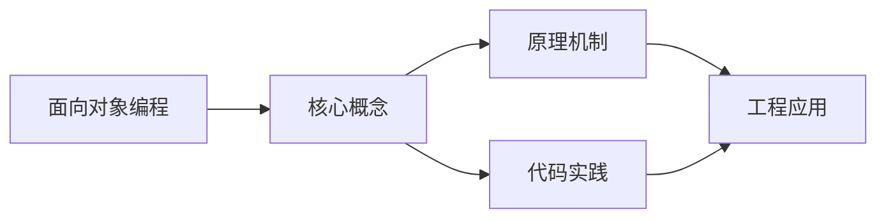
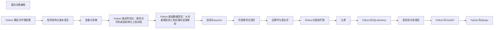

## 1. 学习目标（Bloom 分类）

本节按照布鲁姆教育目标分类学组织学习路径。本文主题为《面向对象编程》，属于 Python 模块，读者可以根据自身阶段选择阅读深度。

记忆层面：能够准确复述本文的核心概念、术语与基本语法或操作步骤，并能够在提问或检索时快速定位对应知识点。例如能够说出 Python 的动态类型、缩进语法与解释执行等基本特征。

理解层面：能够用自己的语言解释核心原理与工作机制，说明概念之间的因果关系，而不是机械记忆结论。例如能够解释解释器与编译器的差异，以及 GIL 对并发的影响。

应用层面：能够在真实项目或练习场景中运用本文知识解决具体问题，写出正确且可维护的实现。例如能够编写函数、类与标准库调用的完整脚本。

分析层面：能够拆解复杂问题，比较本文主题与相邻概念的异同，识别边界条件与例外情况。例如能够比较 Python 与 Java、Go 在类型系统与并发模型上的差异。

评价层面：能够根据约束条件（性能、可读性、安全、成本）评价不同方案的优劣，做出有依据的技术决策。例如能够评估不同实现方案（脚本、服务、库）的适用场景。

创造层面：能够把本文知识与其他模块知识组合，设计出新的解决方案或可复用的工程模式。例如能够组合标准库与第三方包设计完整的自动化工具。

通过本节学习，读者应当能够把《面向对象编程》纳入自己的知识网络，并与 Python 模块的其他主题（数据类型、函数、模块、异常、并发）建立关联。

## 2. 历史动机与发展脉络

《面向对象编程》是 Python 领域的重要主题。要真正理解它，需要先了解它解决的问题与演进过程。

Python 由 Guido van Rossum 于 1991 年首次发布，设计哲学强调代码可读性与开发效率，核心思想记录在《Python 之禅》（PEP 20）中：优美优于丑陋、明确优于隐晦、简单优于复杂。
Python 2 与 Python 3 的分裂期（2008-2020）是语言史上最重要的兼容性事件：Python 3 修复了字符串编码、整数除法等长期问题，但破坏性变更导致迁移缓慢；2020 年 1 月 Python 2 停止官方维护，社区全面转向 Python 3。
Python 3.9 至 3.13 的演进带来了类型提示增强（PEP 604 的 X | Y 语法、PEP 695 的泛型语法）、性能优化（3.11 的 faster-calls 与自适应解释器）以及异步生态的成熟（asyncio、FastAPI、httpx）。
Python 的应用版图从脚本自动化扩展到 Web 后端（Django、FastAPI）、数据科学（NumPy、Pandas、Matplotlib）、机器学习（PyTorch、scikit-learn）、运维自动化（Ansible）与科学计算，是当今最通用的编程语言之一。

回到本文主题：面向对象编程 的提出与成熟，正是上述技术背景下的必然产物。早期实现往往以简单可用为目标，随着工程规模扩大，社区逐渐沉淀出标准做法与最佳实践；理解这一脉络，可以帮助读者判断“为什么文档中的推荐写法是现在这个样子”，也能在遇到历史遗留代码时准确识别其设计年代与取舍。

对于初学者，理解 Python 的“电池内置”（标准库丰富）与“胶水语言”（易于调用 C/C++/Rust 扩展）两大特性，是判断其适用场景的基础。

## 3. 形式化定义与核心概念精讲

本节把《面向对象编程》涉及的核心概念以“定义 + 讲解”的形式展开。读者应把定义当作工具，把讲解当作理解路径；两者结合才能形成可迁移的知识。

变量与动态类型：Python 变量是对象的引用，类型属于对象而非变量；`isinstance()` 与 `type()` 用于运行时检查，类型注解（PEP 484）提供静态检查能力但不改变运行时行为。
缩进即语法：Python 用缩进表达代码块层次，避免了花括号噪声，也强制了代码排版一致性；同一代码块必须使用一致的空格数（官方推荐 4 空格）。
函数是一等公民：函数可以赋值、传参、返回，配合 lambda、装饰器与闭包，构成函数式编程能力的基础。
模块与包：每个 `.py` 文件是模块，目录加 `__init__.py` 是包；`import` 机制支持绝对导入、相对导入与命名空间包。
异常处理：`try/except/finally` 与 `raise` 构成错误传播体系；`with` 语句通过上下文管理器（`__enter__/__exit__`）管理资源生命周期。

### 3.1 原文章节逐一精讲

原文档把主题拆分为 7 个小节，下面按顺序给出每一节的导读讲解，随后保留原文细节供精读。

#### 原文精读（完整保留）


#### 1. 类与实例 (Class & Instance)

Python 是一门纯粹的面向对象语言，几乎所有的东西都是对象。

##### 1.1 类的定义

```python
 class Person:
  # 类属性 | Class attribute
  species = "Human"
  # 构造方法 | Constructor
  def __init__(self, name, age):
  self.name = name # 实例属性 | Instance attribute
  self.age = age
  # 实例方法 | Instance method
  def greet(self):
  return f"Hello, I am {self.name}"
 # 实例化
 p = Person("Alice", 30)
 print(p.name) # 输出: Alice
 print(p.age) # 输出: 30
 print(p.greet()) # 输出: Hello, I am Alice
 # 访问类属性
 print(Person.species) # 输出: Human
 print(p.species) # 输出: Human（实例也可以访问类属性）
 # 修改类属性
 Person.species = "Homo sapiens"
 print(Person.species) # 输出: Homo sapiens
 print(p.species) # 输出: Homo sapiens（实例的类属性也会改变）
 # 修改实例的类属性（只会影响该实例）
 p.species = "Human"
 print(Person.species) # 输出: Homo sapiens
 print(p.species) # 输出: Human
```

##### 1.2 类的文档字符串

```python
 class Person:
  """人类类"""
  def __init__(self, name, age):
  """初始化方法"""
  self.name = name
  self.age = age
  def greet(self):
  """打招呼方法"""
  return f"Hello, I am {self.name}"
 # 访问文档字符串
 print(Person.__doc__) # 输出: 人类类
 print(Person.__init__.__doc__) # 输出: 初始化方法
 print(Person.greet.__doc__) # 输出: 打招呼方法
```

#### 2. 属性与方法 (Properties & Methods)

##### 2.1 实例方法

实例方法是最常见的方法类型，它接收 `self` 作为第一个参数，指向当前实例。

```python
 class Circle:
  def __init__(self, radius):
  self.radius = radius
  def area(self):
  """计算圆的面积"""
  return 3.14159 * self.radius ** 2
  def circumference(self):
  """计算圆的周长"""
  return 2 * 3.14159 * self.radius
 # 使用实例方法
 c = Circle(5)
 print(c.area()) # 输出: 78.53975
 print(c.circumference()) # 输出: 31.4159
```

##### 2.2 类方法

类方法使用 `@classmethod` 装饰器，接收 `cls` 作为第一个参数，指向类本身。

```python
 class Person:
  species = "Human"
  def __init__(self, name, age):
  self.name = name
  self.age = age
  @classmethod
  def get_species(cls):
  """获取物种信息"""
  return cls.species
  @classmethod
  def create_adult(cls, name):
  """创建一个成年人实例"""
  return cls(name, 18)
 # 使用类方法
 print(Person.get_species()) # 输出: Human
 # 使用类方法创建实例
 adult = Person.create_adult("Bob")
 print(adult.name) # 输出: Bob
 print(adult.age) # 输出: 18
```

##### 2.3 静态方法

静态方法使用 `@staticmethod` 装饰器，不接收 `self` 或 `cls` 参数，是类的纯工具函数。

```python
 class Math:
  @staticmethod
  def add(a, b):
  """加法运算"""
  return a + b
  @staticmethod
  def multiply(a, b):
  """乘法运算"""
  return a * b
 # 使用静态方法
 print(Math.add(2, 3)) # 输出: 5
 print(Math.multiply(2, 3)) # 输出: 6
 # 也可以通过实例调用静态方法
 m = Math()
 print(m.add(4, 5)) # 输出: 9
```

##### 2.4 私有属性和方法

在 Python 中，使用双下划线 `__` 开头的属性和方法被视为私有的，外部无法直接访问。

```python
 class Person:
  def __init__(self, name, age):
  self.name = name # 公开属性
  self.__age = age # 私有属性
  def __private_method(self):
  """私有方法"""
  return f"This is a private method"
  def get_age(self):
  """获取年龄（通过公开方法访问私有属性）"""
  return self.__age
  def set_age(self, age):
  """设置年龄（通过公开方法修改私有属性）"""
  if age > 0:
  self.__age = age
 # 使用
 p = Person("Alice", 30)
 print(p.name) # 输出: Alice
 # print(p.__age) # 错误: 'Person' object has no attribute '__age'
 # print(p.__private_method()) # 错误: 'Person' object has no attribute '__private_method'
 # 通过公开方法访问私有属性
 print(p.get_age()) # 输出: 30
 p.set_age(31)
 print(p.get_age()) # 输出: 31
 # 注意: Python 实际上是通过名称修饰来实现私有性的
 # 可以通过 _ClassName__private 来访问私有属性（不推荐）
 print(p._Person__age) # 输出: 31
 print(p._Person__private_method()) # 输出: This is a private method
```

##### 2.5 装饰器属性 (`@property`)

`@property` 装饰器可以将方法伪装成属性，使得可以像访问属性一样访问方法。

```python
 class Person:
  def __init__(self, first_name, last_name):
  self.first_name = first_name
  self.last_name = last_name
  @property
  def full_name(self):
  """获取全名"""
  return f"{self.first_name} {self.last_name}"
  @full_name.setter
  def full_name(self, name):
  """设置全名"""
  first_name, last_name = name.split()
  self.first_name = first_name
  self.last_name = last_name
  @full_name.deleter
  def full_name(self):
  """删除全名"""
  self.first_name = None
  self.last_name = None
 # 使用属性装饰器
 p = Person("Alice", "Smith")
 print(p.full_name) # 输出: Alice Smith
 # 设置属性
 p.full_name = "Bob Johnson"
 print(p.first_name) # 输出: Bob
 print(p.last_name) # 输出: Johnson
 print(p.full_name) # 输出: Bob Johnson
 # 删除属性
 del p.full_name
 print(p.first_name) # 输出: None
 print(p.last_name) # 输出: None
 # print(p.full_name) # 输出: None None
```

#### 3. 继承与多态 (Inheritance & Polymorphism)

##### 3.1 单继承

```python
 class Animal:
  def __init__(self, name):
  self.name = name
  def speak(self):
  return "Some generic sound"
 class Dog(Animal):
  def speak(self):
  return "Woof!"
 class Cat(Animal):
  def speak(self):
  return "Meow!"
 # 使用
 animal = Animal("Generic Animal")
 dog = Dog("Rex")
 cat = Cat("Whiskers")
 print(animal.speak()) # 输出: Some generic sound
 print(dog.speak()) # 输出: Woof!
 print(cat.speak()) # 输出: Meow!
 # 检查继承关系
 print(isinstance(dog, Animal)) # 输出:
 print(issubclass(Dog, Animal)) # 输出:
```

##### 3.2 多继承

Python 支持多继承，一个子类可以继承多个父类。

```python
 class A:
  def method(self):
  return "A.method()"
 class B:
  def method(self):
  return "B.method()"
  def other_method(self):
  return "B.other_method()"
 class C(A, B):
  pass
 # 使用
 c = C()
 print(c.method()) # 输出: A.method()（按照 MRO 顺序，先 A 后 B）
 print(c.other_method()) # 输出: B.other_method()
 # 查看方法解析顺序 (MRO)
 print(C.__mro__) # 输出: (<class '__main__.C'>, <class '__main__.A'>, <class '__main__.B'>, <class 'object'>)
```

##### 3.3 `super()` 函数

`super()` 函数用于调用父类的方法，在继承中非常有用。

```python
 class Parent:
  def __init__(self, name):
  self.name = name
  def greet(self):
  return f"Hello from {self.name}"
 class Child(Parent):
  def __init__(self, name, age):
  super().__init__(name) # 调用父类的 __init__ 方法
  self.age = age
  def greet(self):
  parent_greeting = super().greet() # 调用父类的 greet 方法
  return f"{parent_greeting}, I'm {self.age} years old"
 # 使用
 child = Child("Bob", 10)
 print(child.greet()) # 输出: Hello from Bob, I'm 10 years old
```

##### 3.4 多态

多态是指不同类型的对象可以使用相同的接口。

```python
 def make_speak(animal):
  """让动物发声"""
  print(animal.speak())
 # 使用
 make_speak(Dog("Rex")) # 输出: Woof!
 make_speak(Cat("Whiskers")) # 输出: Meow!
 make_speak(Animal("Generic")) # 输出: Some generic sound
```

##### 3.5 鸭子类型

Python 采用鸭子类型，不关注对象的具体类型，只关注对象是否具有所需的方法或属性。

```python
 class Duck:
  def quack(self):
  return "Quack!"
 class Person:
  def quack(self):
  return "I'm quacking like a duck!"
 def make_quack(obj):
  """让对象发出鸭叫声"""
  if hasattr(obj, 'quack'):
  print(obj.quack())
  else:
  print("This object can't quack")
 # 使用
 make_quack(Duck()) # 输出: Quack!
 make_quack(Person()) # 输出: I'm quacking like a duck!
```

#### 4. 特殊方法 (Magic Methods)

特殊方法（也称为魔术方法或双下划线方法）是 Python 中具有特殊功能的方法，它们以双下划线开头和结尾。

##### 4.1 基本特殊方法

```python
 class Person:
  def __init__(self, name, age):
  """初始化方法"""
  self.name = name
  self.age = age
  def __str__(self):
  """字符串表示（对用户友好）"""
  return f"Person(name='{self.name}', age={self.age})"
  def __repr__(self):
  """字符串表示（对开发者友好）"""
  return f"Person('{self.name}', {self.age})"
  def __eq__(self, other):
  """相等性比较"""
  if not isinstance(other, Person):
  return NotImplemented
  return self.name == other.name and self.age == other.age
  def __lt__(self, other):
  """小于比较"""
  if not isinstance(other, Person):
  return NotImplemented
  return self.age < other.age
 # 使用
 p1 = Person("Alice", 30)
 p2 = Person("Bob", 25)
 p3 = Person("Alice", 30)
 print(str(p1)) # 输出: Person(name='Alice', age=30)
 print(repr(p1)) # 输出: Person('Alice', 30)
 print(p1 == p2) # 输出: False
 print(p1 == p3) # 输出:
 print(p1 < p2) # 输出: False
 print(p2 < p1) # 输出:
```

##### 4.2 容器相关的特殊方法

```python
 class MyList:
  def __init__(self, items):
  self.items = items
  def __len__(self):
  """获取长度"""
  return len(self.items)
  def __getitem__(self, index):
  """获取元素"""
  return self.items[index]
  def __setitem__(self, index, value):
  """设置元素"""
  self.items[index] = value
  def __contains__(self, item):
  """检查元素是否存在"""
  return item in self.items
 # 使用
 my_list = MyList([1, 2, 3, 4, 5])
 print(len(my_list)) # 输出: 5
 print(my_list[0]) # 输出: 1
 my_list[0] = 10
 print(my_list[0]) # 输出: 10
 print(3 in my_list) # 输出:
 print(100 in my_list) # 输出: False
 # 支持迭代
 for item in my_list:
  print(item, end=" ") # 输出: 10 2 3 4 5
```

##### 4.3 算术运算符特殊方法

```python
 class Vector:
  def __init__(self, x, y):
  self.x = x
  self.y = y
  def __add__(self, other):
  """加法运算"""
  if not isinstance(other, Vector):
  return NotImplemented
  return Vector(self.x + other.x, self.y + other.y)
  def __sub__(self, other):
  """减法运算"""
  if not isinstance(other, Vector):
  return NotImplemented
  return Vector(self.x - other.x, self.y - other.y)
  def __mul__(self, scalar):
  """乘法运算"""
  return Vector(self.x * scalar, self.y * scalar)
  def __str__(self):
  return f"Vector({self.x}, {self.y})"
 # 使用
 v1 = Vector(1, 2)
 v2 = Vector(3, 4)
 print(v1 + v2) # 输出: Vector(4, 6)
 print(v1 - v2) # 输出: Vector(-2, -2)
 print(v1 * 2) # 输出: Vector(2, 4)
```

#### 5. 高级面向对象特性

##### 5.1 抽象基类

抽象基类（Abstract Base Class, ABC）用于定义接口，强制子类实现特定的方法。

```python
 from abc import ABC, abstractmethod
 class Animal(ABC):
  @abstractmethod
  def speak(self):
  """动物发声"""
  pass
  @abstractmethod
  def move(self):
  """动物移动"""
  pass
 class Dog(Animal):
  def speak(self):
  return "Woof!"
  def move(self):
  return "Running"
 class Cat(Animal):
  def speak(self):
  return "Meow!"
  def move(self):
  return "Walking"
 # 使用
 dog = Dog()
 print(dog.speak()) # 输出: Woof!
 print(dog.move()) # 输出: Running
 cat = Cat()
 print(cat.speak()) # 输出: Meow!
 print(cat.move()) # 输出: Walking
 # 不能实例化抽象基类
 # animal = Animal() # 错误: Can't instantiate abstract class Animal with abstract methods move, speak
```

##### 5.2 混入类 (Mixins)

混入类是一种特殊的类，用于为其他类提供功能，而不是作为独立的类使用。

```python
 class SwimMixin:
  def swim(self):
  return "Swimming"
 class FlyMixin:
  def fly(self):
  return "Flying"
 class Duck(SwimMixin, FlyMixin):
  def quack(self):
  return "Quack!"
 class Penguin(SwimMixin):
  def walk(self):
  return "Walking"
 # 使用
 duck = Duck()
 print(duck.quack()) # 输出: Quack!
 print(duck.swim()) # 输出: Swimming
 print(duck.fly()) # 输出: Flying
 penguin = Penguin()
 print(penguin.swim()) # 输出: Swimming
 print(penguin.walk()) # 输出: Walking
 # print(penguin.fly()) # 错误: 'Penguin' object has no attribute 'fly'
```

##### 5.3 单例模式

单例模式确保一个类只有一个实例。

```python
 class Singleton:
  _instance = None
  def __new__(cls, *args, **kwargs):
  if not cls._instance:
  cls._instance = super().__new__(cls)
  return cls._instance
  def __init__(self, value=None):
  if value is not None:
  self.value = value
 # 使用
 s1 = Singleton("First")
 print(s1.value) # 输出: First
 # 第二次创建会返回同一个实例
 s2 = Singleton("Second")
 print(s2.value) # 输出: Second
 print(s1 is s2) # 输出:
 print(s1.value) # 输出: Second（因为 s1 和 s2 是同一个实例）
```

##### 5.4 类装饰器

类装饰器用于修改类的行为。

```python
 def debug(cls):
  """类装饰器：为类的所有方法添加调试信息"""
  for name, method in list(cls.__dict__.items()):
  if callable(method) and not name.startswith('__'):
  def wrapper(*args, **kwargs):
  print(f"Calling {name} with args: {args}, kwargs: {kwargs}")
  result = method(*args, **kwargs)
  print(f"{name} returned: {result}")
  return result
  setattr(cls, name, wrapper)
  return cls
 @debug
 class Calculator:
  def add(self, a, b):
  return a + b
  def multiply(self, a, b):
  return a * b
 # 使用
 calc = Calculator()
 calc.add(2, 3) # 输出: Calling add with args: (<__main__.Calculator object at 0x...>, 2, 3), kwargs: {}
  # add returned: 5
 calc.multiply(4, 5) # 输出: Calling multiply with args: (<__main__.Calculator object at 0x...>, 4, 5), kwargs: {}
  # multiply returned: 20
```

#### 6. 面向对象编程的最佳实践

##### 6.1 设计原则

- **单一职责原则**: 一个类应该只有一个引起它变化的原因
- **开放-封闭原则**: 对扩展开放，对修改封闭
- **里氏替换原则**: 子类应该能够替换父类
- **依赖倒置原则**: 依赖于抽象，而不是具体实现
- **接口隔离原则**: 客户端不应该依赖它不需要的接口

##### 6.2 代码风格

- **命名约定**: 类名使用驼峰命名法（如 `MyClass`），方法和属性使用蛇形命名法（如 `my_method`）
- **文档**: 为类、方法和属性添加文档字符串
- **缩进**: 使用 4 个空格进行缩进
- **行长**: 每行代码不超过 79 个字符
- **导入**: 按标准库、第三方库、本地模块的顺序导入

##### 6.3 常见陷阱

- **可变默认参数**: 避免使用可变对象作为默认参数
- **循环引用**: 注意避免循环引用导致的内存泄漏
- **过度继承**: 避免深层继承层次结构
- **过度使用继承**: 考虑使用组合而不是继承
- **魔法方法滥用**: 只在必要时使用魔法方法

#### 7. 实际应用示例

##### 7.1 学生管理系统

```python
 class Student:
  def __init__(self, id, name, age, grade):
  self.id = id
  self.name = name
  self.age = age
  self.grade = grade
  def __str__(self):
  return f"Student(id={self.id}, name='{self.name}', age={self.age}, grade={self.grade})"
 class StudentManager:
  def __init__(self):
  self.students = []
  def add_student(self, student):
  """添加学生"""
  self.students.append(student)
  def remove_student(self, student_id):
  """移除学生"""
  self.students = [s for s in self.students if s.id != student_id]
  def get_student(self, student_id):
  """获取学生"""
  for student in self.students:
  if student.id == student_id:
  return student
  return None
  def get_all_students(self):
  """获取所有学生"""
  return self.students
 # 使用
 manager = StudentManager()
 # 添加学生
 manager.add_student(Student(1, "Alice", 18, 90))
 manager.add_student(Student(2, "Bob", 17, 85))
 manager.add_student(Student(3, "Charlie", 19, 95))
 # 获取所有学生
 for student in manager.get_all_students():
  print(student)
 # 获取特定学生
 student = manager.get_student(2)
 print(f"Found student: {student}")
 # 移除学生
 manager.remove_student(2)
 print("After removing student 2:")
 for student in manager.get_all_students():
  print(student)
```

##### 7.2 形状计算

```python
 from abc import ABC, abstractmethod
 class Shape(ABC):
  @abstractmethod
  def area(self):
  """计算面积"""
  pass
  @abstractmethod
  def perimeter(self):
  """计算周长"""
  pass
 class Rectangle(Shape):
  def __init__(self, width, height):
  self.width = width
  self.height = height
  def area(self):
  return self.width * self.height
  def perimeter(self):
  return 2 * (self.width + self.height)
 class Circle(Shape):
  def __init__(self, radius):
  self.radius = radius
  def area(self):
  return 3.14159 * self.radius ** 2
  def perimeter(self):
  return 2 * 3.14159 * self.radius
 class Triangle(Shape):
  def __init__(self, a, b, c):
  self.a = a
  self.b = b
  self.c = c
  def area(self):
  # 使用海伦公式计算面积
  s = (self.a + self.b + self.c) / 2
  return (s * (s - self.a) * (s - self.b) * (s - self.c)) ** 0.5
  def perimeter(self):
  return self.a + self.b + self.c
 # 使用
 shapes = [
  Rectangle(5, 4),
  Circle(3),
  Triangle(3, 4, 5)
 ]
 for shape in shapes:
  print(f"{type(shape).__name__}: Area = {shape.area():.2f}, Perimeter = {shape.perimeter():.2f}")
```

---


### 3.2 概念关系图

下面用 Mermaid 图表达本文核心概念之间的关系，帮助读者建立整体图景：



图中展示的是本文知识的结构化关系：核心概念是入口，原理机制解释“为什么”，代码实践演示“怎么做”，工程应用回答“何时用”。读者学习时可以把每个小节的内容挂接到对应节点上。

## 4. 理论推导与原理解析

本节深入《面向对象编程》背后的原理。理论部分不求面面俱到，而是聚焦“能解释现象、能指导实践”的关键推导。

解释执行与字节码：CPython 先把源码编译为字节码（.pyc），再由虚拟机逐条执行。字节码是平台无关的中间表示，因此 Python 程序可以跨平台运行，但执行速度低于编译型语言；性能敏感路径可用 C 扩展或 Cython 加速。
GIL（全局解释器锁）：CPython 的 GIL 保证同一时刻只有一个线程执行字节码，简化了内存管理，但限制了 CPU 密集型多线程并行；I/O 密集型任务通过线程切换获得并发，CPU 密集型任务应使用多进程（multiprocessing）或异步。
引用计数与垃圾回收：Python 对象通过引用计数管理生命周期，循环引用由分代垃圾回收器（gc 模块）处理。理解这一模型可以解释“为什么局部变量及时释放内存”“为什么大对象需要 del 或作用域退出”。
鸭子类型与协议：Python 依赖行为协议而非继承体系，例如实现 `__iter__` 与 `__next__` 的对象即可用于 `for` 循环。这一设计带来灵活性的同时，也要求开发者编写清晰的接口文档与类型注解。

需要强调的是，理论推导与工程实践之间存在翻译层：理论给出的是理想化模型与边界条件，工程代码则必须处理真实环境中的例外。读者在学习时应先掌握理论的“标准情形”，再通过陷阱章节了解“非标准情形”。

## 5. 代码示例与逐行讲解

本节把原文中的代码示例系统整理，并为每个示例补充用途说明与讲解。读者不应只浏览代码，而应逐段对照讲解理解设计意图。

### 5.1 示例：1.1 类的定义

该示例来自原文《1.1 类的定义》小节，用于演示面向对象编程相关操作。阅读时请先看代码结构，再看其后的讲解。

```python
 class Person:
  # 类属性 | Class attribute
  species = "Human"
  # 构造方法 | Constructor
  def __init__(self, name, age):
  self.name = name # 实例属性 | Instance attribute
  self.age = age
  # 实例方法 | Instance method
  def greet(self):
  return f"Hello, I am {self.name}"
 # 实例化
 p = Person("Alice", 30)
 print(p.name) # 输出: Alice
 print(p.age) # 输出: 30
 print(p.greet()) # 输出: Hello, I am Alice
 # 访问类属性
 print(Person.species) # 输出: Human
 print(p.species) # 输出: Human（实例也可以访问类属性）
 # 修改类属性
 Person.species = "Homo sapiens"
 print(Person.species) # 输出: Homo sapiens
 print(p.species) # 输出: Homo sapiens（实例的类属性也会改变）
 # 修改实例的类属性（只会影响该实例）
 p.species = "Human"
 print(Person.species) # 输出: Homo sapiens
 print(p.species) # 输出: Human
```

讲解：这段代码演示了本节核心知识点。代码中的关键操作可以归纳为三步：准备（定义或初始化）、执行（核心逻辑）、收尾（释放资源或返回结果）。实际项目中，这三步往往被封装为函数或类，以提升复用性与可测试性。

关键点分析：

该示例共 26 行有效代码，包含 3 类关键结构（class、def、return）。其中：

- 入口与初始化部分负责建立上下文，对应实际项目中的启动或装配逻辑；
- 核心逻辑部分体现本文主题的主要操作，是阅读时最需要对照讲解理解的部分；
- 输出或返回部分把结果交给调用方，注意其类型与边界条件。

进阶思考路径：先尝试修改参数观察行为变化，再把示例中的模式迁移到自己的项目中；每次修改都记录预期与实测差异，这是把示例转化为能力的最快方式。

### 5.2 示例：1.2 类的文档字符串

该示例来自原文《1.2 类的文档字符串》小节，用于演示面向对象编程相关操作。阅读时请先看代码结构，再看其后的讲解。

```python
 class Person:
  """人类类"""
  def __init__(self, name, age):
  """初始化方法"""
  self.name = name
  self.age = age
  def greet(self):
  """打招呼方法"""
  return f"Hello, I am {self.name}"
 # 访问文档字符串
 print(Person.__doc__) # 输出: 人类类
 print(Person.__init__.__doc__) # 输出: 初始化方法
 print(Person.greet.__doc__) # 输出: 打招呼方法
```

讲解：这段代码演示了本节核心知识点。代码中的关键操作可以归纳为三步：准备（定义或初始化）、执行（核心逻辑）、收尾（释放资源或返回结果）。实际项目中，这三步往往被封装为函数或类，以提升复用性与可测试性。

关键点分析：

该示例共 13 行有效代码，包含 3 类关键结构（class、def、return）。其中：

- 入口与初始化部分负责建立上下文，对应实际项目中的启动或装配逻辑；
- 核心逻辑部分体现本文主题的主要操作，是阅读时最需要对照讲解理解的部分；
- 输出或返回部分把结果交给调用方，注意其类型与边界条件。

进阶思考路径：先尝试修改参数观察行为变化，再把示例中的模式迁移到自己的项目中；每次修改都记录预期与实测差异，这是把示例转化为能力的最快方式。

### 5.3 示例：2.1 实例方法

该示例来自原文《2.1 实例方法》小节，用于演示面向对象编程相关操作。阅读时请先看代码结构，再看其后的讲解。

```python
 class Circle:
  def __init__(self, radius):
  self.radius = radius
  def area(self):
  """计算圆的面积"""
  return 3.14159 * self.radius ** 2
  def circumference(self):
  """计算圆的周长"""
  return 2 * 3.14159 * self.radius
 # 使用实例方法
 c = Circle(5)
 print(c.area()) # 输出: 78.53975
 print(c.circumference()) # 输出: 31.4159
```

讲解：这段代码演示了本节核心知识点。代码中的关键操作可以归纳为三步：准备（定义或初始化）、执行（核心逻辑）、收尾（释放资源或返回结果）。实际项目中，这三步往往被封装为函数或类，以提升复用性与可测试性。

关键点分析：

该示例共 13 行有效代码，包含 3 类关键结构（class、def、return）。其中：

- 入口与初始化部分负责建立上下文，对应实际项目中的启动或装配逻辑；
- 核心逻辑部分体现本文主题的主要操作，是阅读时最需要对照讲解理解的部分；
- 输出或返回部分把结果交给调用方，注意其类型与边界条件。

进阶思考路径：先尝试修改参数观察行为变化，再把示例中的模式迁移到自己的项目中；每次修改都记录预期与实测差异，这是把示例转化为能力的最快方式。

### 5.4 示例：2.2 类方法

该示例来自原文《2.2 类方法》小节，用于演示面向对象编程相关操作。阅读时请先看代码结构，再看其后的讲解。

```python
 class Person:
  species = "Human"
  def __init__(self, name, age):
  self.name = name
  self.age = age
  @classmethod
  def get_species(cls):
  """获取物种信息"""
  return cls.species
  @classmethod
  def create_adult(cls, name):
  """创建一个成年人实例"""
  return cls(name, 18)
 # 使用类方法
 print(Person.get_species()) # 输出: Human
 # 使用类方法创建实例
 adult = Person.create_adult("Bob")
 print(adult.name) # 输出: Bob
 print(adult.age) # 输出: 18
```

讲解：这段代码演示了本节核心知识点。代码中的关键操作可以归纳为三步：准备（定义或初始化）、执行（核心逻辑）、收尾（释放资源或返回结果）。实际项目中，这三步往往被封装为函数或类，以提升复用性与可测试性。

关键点分析：

该示例共 19 行有效代码，包含 3 类关键结构（class、def、return）。其中：

- 入口与初始化部分负责建立上下文，对应实际项目中的启动或装配逻辑；
- 核心逻辑部分体现本文主题的主要操作，是阅读时最需要对照讲解理解的部分；
- 输出或返回部分把结果交给调用方，注意其类型与边界条件。

进阶思考路径：先尝试修改参数观察行为变化，再把示例中的模式迁移到自己的项目中；每次修改都记录预期与实测差异，这是把示例转化为能力的最快方式。

### 5.5 示例：2.3 静态方法

该示例来自原文《2.3 静态方法》小节，用于演示面向对象编程相关操作。阅读时请先看代码结构，再看其后的讲解。

```python
 class Math:
  @staticmethod
  def add(a, b):
  """加法运算"""
  return a + b
  @staticmethod
  def multiply(a, b):
  """乘法运算"""
  return a * b
 # 使用静态方法
 print(Math.add(2, 3)) # 输出: 5
 print(Math.multiply(2, 3)) # 输出: 6
 # 也可以通过实例调用静态方法
 m = Math()
 print(m.add(4, 5)) # 输出: 9
```

讲解：这段代码演示了本节核心知识点。代码中的关键操作可以归纳为三步：准备（定义或初始化）、执行（核心逻辑）、收尾（释放资源或返回结果）。实际项目中，这三步往往被封装为函数或类，以提升复用性与可测试性。

关键点分析：

该示例共 15 行有效代码，包含 3 类关键结构（class、def、return）。其中：

- 入口与初始化部分负责建立上下文，对应实际项目中的启动或装配逻辑；
- 核心逻辑部分体现本文主题的主要操作，是阅读时最需要对照讲解理解的部分；
- 输出或返回部分把结果交给调用方，注意其类型与边界条件。

进阶思考路径：先尝试修改参数观察行为变化，再把示例中的模式迁移到自己的项目中；每次修改都记录预期与实测差异，这是把示例转化为能力的最快方式。

### 5.6 示例：2.4 私有属性和方法

该示例来自原文《2.4 私有属性和方法》小节，用于演示面向对象编程相关操作。阅读时请先看代码结构，再看其后的讲解。

```python
 class Person:
  def __init__(self, name, age):
  self.name = name # 公开属性
  self.__age = age # 私有属性
  def __private_method(self):
  """私有方法"""
  return f"This is a private method"
  def get_age(self):
  """获取年龄（通过公开方法访问私有属性）"""
  return self.__age
  def set_age(self, age):
  """设置年龄（通过公开方法修改私有属性）"""
  if age > 0:
  self.__age = age
 # 使用
 p = Person("Alice", 30)
 print(p.name) # 输出: Alice
 # print(p.__age) # 错误: 'Person' object has no attribute '__age'
 # print(p.__private_method()) # 错误: 'Person' object has no attribute '__private_method'
 # 通过公开方法访问私有属性
 print(p.get_age()) # 输出: 30
 p.set_age(31)
 print(p.get_age()) # 输出: 31
 # 注意: Python 实际上是通过名称修饰来实现私有性的
 # 可以通过 _ClassName__private 来访问私有属性（不推荐）
 print(p._Person__age) # 输出: 31
 print(p._Person__private_method()) # 输出: This is a private method
```

讲解：这段代码演示了本节核心知识点。代码中的关键操作可以归纳为三步：准备（定义或初始化）、执行（核心逻辑）、收尾（释放资源或返回结果）。实际项目中，这三步往往被封装为函数或类，以提升复用性与可测试性。

关键点分析：

该示例共 27 行有效代码，包含 4 类关键结构（class、def、if、return）。其中：

- 入口与初始化部分负责建立上下文，对应实际项目中的启动或装配逻辑；
- 核心逻辑部分体现本文主题的主要操作，是阅读时最需要对照讲解理解的部分；
- 输出或返回部分把结果交给调用方，注意其类型与边界条件。

进阶思考路径：先尝试修改参数观察行为变化，再把示例中的模式迁移到自己的项目中；每次修改都记录预期与实测差异，这是把示例转化为能力的最快方式。

### 5.7 示例：2.5 装饰器属性 (`@property`)

该示例来自原文《2.5 装饰器属性 (`@property`)》小节，用于演示面向对象编程相关操作。阅读时请先看代码结构，再看其后的讲解。

```python
 class Person:
  def __init__(self, first_name, last_name):
  self.first_name = first_name
  self.last_name = last_name
  @property
  def full_name(self):
  """获取全名"""
  return f"{self.first_name} {self.last_name}"
  @full_name.setter
  def full_name(self, name):
  """设置全名"""
  first_name, last_name = name.split()
  self.first_name = first_name
  self.last_name = last_name
  @full_name.deleter
  def full_name(self):
  """删除全名"""
  self.first_name = None
  self.last_name = None
 # 使用属性装饰器
 p = Person("Alice", "Smith")
 print(p.full_name) # 输出: Alice Smith
 # 设置属性
 p.full_name = "Bob Johnson"
 print(p.first_name) # 输出: Bob
 print(p.last_name) # 输出: Johnson
 print(p.full_name) # 输出: Bob Johnson
 # 删除属性
 del p.full_name
 print(p.first_name) # 输出: None
 print(p.last_name) # 输出: None
 # print(p.full_name) # 输出: None None
```

讲解：这段代码演示了本节核心知识点。代码中的关键操作可以归纳为三步：准备（定义或初始化）、执行（核心逻辑）、收尾（释放资源或返回结果）。实际项目中，这三步往往被封装为函数或类，以提升复用性与可测试性。

关键点分析：

该示例共 32 行有效代码，包含 3 类关键结构（class、def、return）。其中：

- 入口与初始化部分负责建立上下文，对应实际项目中的启动或装配逻辑；
- 核心逻辑部分体现本文主题的主要操作，是阅读时最需要对照讲解理解的部分；
- 输出或返回部分把结果交给调用方，注意其类型与边界条件。

进阶思考路径：先尝试修改参数观察行为变化，再把示例中的模式迁移到自己的项目中；每次修改都记录预期与实测差异，这是把示例转化为能力的最快方式。

### 5.8 示例：3.1 单继承

该示例来自原文《3.1 单继承》小节，用于演示面向对象编程相关操作。阅读时请先看代码结构，再看其后的讲解。

```python
 class Animal:
  def __init__(self, name):
  self.name = name
  def speak(self):
  return "Some generic sound"
 class Dog(Animal):
  def speak(self):
  return "Woof!"
 class Cat(Animal):
  def speak(self):
  return "Meow!"
 # 使用
 animal = Animal("Generic Animal")
 dog = Dog("Rex")
 cat = Cat("Whiskers")
 print(animal.speak()) # 输出: Some generic sound
 print(dog.speak()) # 输出: Woof!
 print(cat.speak()) # 输出: Meow!
 # 检查继承关系
 print(isinstance(dog, Animal)) # 输出:
 print(issubclass(Dog, Animal)) # 输出:
```

讲解：这段代码演示了本节核心知识点。代码中的关键操作可以归纳为三步：准备（定义或初始化）、执行（核心逻辑）、收尾（释放资源或返回结果）。实际项目中，这三步往往被封装为函数或类，以提升复用性与可测试性。

关键点分析：

该示例共 21 行有效代码，包含 3 类关键结构（class、def、return）。其中：

- 入口与初始化部分负责建立上下文，对应实际项目中的启动或装配逻辑；
- 核心逻辑部分体现本文主题的主要操作，是阅读时最需要对照讲解理解的部分；
- 输出或返回部分把结果交给调用方，注意其类型与边界条件。

进阶思考路径：先尝试修改参数观察行为变化，再把示例中的模式迁移到自己的项目中；每次修改都记录预期与实测差异，这是把示例转化为能力的最快方式。

### 5.9 示例：3.2 多继承

该示例来自原文《3.2 多继承》小节，用于演示面向对象编程相关操作。阅读时请先看代码结构，再看其后的讲解。

```python
 class A:
  def method(self):
  return "A.method()"
 class B:
  def method(self):
  return "B.method()"
  def other_method(self):
  return "B.other_method()"
 class C(A, B):
  pass
 # 使用
 c = C()
 print(c.method()) # 输出: A.method()（按照 MRO 顺序，先 A 后 B）
 print(c.other_method()) # 输出: B.other_method()
 # 查看方法解析顺序 (MRO)
 print(C.__mro__) # 输出: (<class '__main__.C'>, <class '__main__.A'>, <class '__main__.B'>, <class 'object'>)
```

讲解：这段代码演示了本节核心知识点。代码中的关键操作可以归纳为三步：准备（定义或初始化）、执行（核心逻辑）、收尾（释放资源或返回结果）。实际项目中，这三步往往被封装为函数或类，以提升复用性与可测试性。

关键点分析：

该示例共 16 行有效代码，包含 3 类关键结构（class、def、return）。其中：

- 入口与初始化部分负责建立上下文，对应实际项目中的启动或装配逻辑；
- 核心逻辑部分体现本文主题的主要操作，是阅读时最需要对照讲解理解的部分；
- 输出或返回部分把结果交给调用方，注意其类型与边界条件。

进阶思考路径：先尝试修改参数观察行为变化，再把示例中的模式迁移到自己的项目中；每次修改都记录预期与实测差异，这是把示例转化为能力的最快方式。

### 5.10 示例：3.3 `super()` 函数

该示例来自原文《3.3 `super()` 函数》小节，用于演示面向对象编程相关操作。阅读时请先看代码结构，再看其后的讲解。

```python
 class Parent:
  def __init__(self, name):
  self.name = name
  def greet(self):
  return f"Hello from {self.name}"
 class Child(Parent):
  def __init__(self, name, age):
  super().__init__(name) # 调用父类的 __init__ 方法
  self.age = age
  def greet(self):
  parent_greeting = super().greet() # 调用父类的 greet 方法
  return f"{parent_greeting}, I'm {self.age} years old"
 # 使用
 child = Child("Bob", 10)
 print(child.greet()) # 输出: Hello from Bob, I'm 10 years old
```

讲解：这段代码演示了本节核心知识点。代码中的关键操作可以归纳为三步：准备（定义或初始化）、执行（核心逻辑）、收尾（释放资源或返回结果）。实际项目中，这三步往往被封装为函数或类，以提升复用性与可测试性。

关键点分析：

该示例共 15 行有效代码，包含 4 类关键结构（class、def、from、return）。其中：

- 入口与初始化部分负责建立上下文，对应实际项目中的启动或装配逻辑；
- 核心逻辑部分体现本文主题的主要操作，是阅读时最需要对照讲解理解的部分；
- 输出或返回部分把结果交给调用方，注意其类型与边界条件。

进阶思考路径：先尝试修改参数观察行为变化，再把示例中的模式迁移到自己的项目中；每次修改都记录预期与实测差异，这是把示例转化为能力的最快方式。

### 5.11 示例：3.4 多态

该示例来自原文《3.4 多态》小节，用于演示面向对象编程相关操作。阅读时请先看代码结构，再看其后的讲解。

```python
 def make_speak(animal):
  """让动物发声"""
  print(animal.speak())
 # 使用
 make_speak(Dog("Rex")) # 输出: Woof!
 make_speak(Cat("Whiskers")) # 输出: Meow!
 make_speak(Animal("Generic")) # 输出: Some generic sound
```

讲解：这段代码演示了本节核心知识点。代码中的关键操作可以归纳为三步：准备（定义或初始化）、执行（核心逻辑）、收尾（释放资源或返回结果）。实际项目中，这三步往往被封装为函数或类，以提升复用性与可测试性。

关键点分析：

该示例共 7 行有效代码，包含 1 类关键结构（def）。其中：

- 入口与初始化部分负责建立上下文，对应实际项目中的启动或装配逻辑；
- 核心逻辑部分体现本文主题的主要操作，是阅读时最需要对照讲解理解的部分；
- 输出或返回部分把结果交给调用方，注意其类型与边界条件。

进阶思考路径：先尝试修改参数观察行为变化，再把示例中的模式迁移到自己的项目中；每次修改都记录预期与实测差异，这是把示例转化为能力的最快方式。

### 5.12 示例：3.5 鸭子类型

该示例来自原文《3.5 鸭子类型》小节，用于演示面向对象编程相关操作。阅读时请先看代码结构，再看其后的讲解。

```python
 class Duck:
  def quack(self):
  return "Quack!"
 class Person:
  def quack(self):
  return "I'm quacking like a duck!"
 def make_quack(obj):
  """让对象发出鸭叫声"""
  if hasattr(obj, 'quack'):
  print(obj.quack())
  else:
  print("This object can't quack")
 # 使用
 make_quack(Duck()) # 输出: Quack!
 make_quack(Person()) # 输出: I'm quacking like a duck!
```

讲解：这段代码演示了本节核心知识点。代码中的关键操作可以归纳为三步：准备（定义或初始化）、执行（核心逻辑）、收尾（释放资源或返回结果）。实际项目中，这三步往往被封装为函数或类，以提升复用性与可测试性。

关键点分析：

该示例共 15 行有效代码，包含 4 类关键结构（class、def、if、return）。其中：

- 入口与初始化部分负责建立上下文，对应实际项目中的启动或装配逻辑；
- 核心逻辑部分体现本文主题的主要操作，是阅读时最需要对照讲解理解的部分；
- 输出或返回部分把结果交给调用方，注意其类型与边界条件。

进阶思考路径：先尝试修改参数观察行为变化，再把示例中的模式迁移到自己的项目中；每次修改都记录预期与实测差异，这是把示例转化为能力的最快方式。

### 5.13 示例：4.1 基本特殊方法

该示例来自原文《4.1 基本特殊方法》小节，用于演示面向对象编程相关操作。阅读时请先看代码结构，再看其后的讲解。

```python
 class Person:
  def __init__(self, name, age):
  """初始化方法"""
  self.name = name
  self.age = age
  def __str__(self):
  """字符串表示（对用户友好）"""
  return f"Person(name='{self.name}', age={self.age})"
  def __repr__(self):
  """字符串表示（对开发者友好）"""
  return f"Person('{self.name}', {self.age})"
  def __eq__(self, other):
  """相等性比较"""
  if not isinstance(other, Person):
  return NotImplemented
  return self.name == other.name and self.age == other.age
  def __lt__(self, other):
  """小于比较"""
  if not isinstance(other, Person):
  return NotImplemented
  return self.age < other.age
 # 使用
 p1 = Person("Alice", 30)
 p2 = Person("Bob", 25)
 p3 = Person("Alice", 30)
 print(str(p1)) # 输出: Person(name='Alice', age=30)
 print(repr(p1)) # 输出: Person('Alice', 30)
 print(p1 == p2) # 输出: False
 print(p1 == p3) # 输出:
 print(p1 < p2) # 输出: False
 print(p2 < p1) # 输出:
```

讲解：这段代码演示了本节核心知识点。代码中的关键操作可以归纳为三步：准备（定义或初始化）、执行（核心逻辑）、收尾（释放资源或返回结果）。实际项目中，这三步往往被封装为函数或类，以提升复用性与可测试性。

关键点分析：

该示例共 31 行有效代码，包含 4 类关键结构（class、def、if、return）。其中：

- 入口与初始化部分负责建立上下文，对应实际项目中的启动或装配逻辑；
- 核心逻辑部分体现本文主题的主要操作，是阅读时最需要对照讲解理解的部分；
- 输出或返回部分把结果交给调用方，注意其类型与边界条件。

进阶思考路径：先尝试修改参数观察行为变化，再把示例中的模式迁移到自己的项目中；每次修改都记录预期与实测差异，这是把示例转化为能力的最快方式。

### 5.14 示例：4.2 容器相关的特殊方法

该示例来自原文《4.2 容器相关的特殊方法》小节，用于演示面向对象编程相关操作。阅读时请先看代码结构，再看其后的讲解。

```python
 class MyList:
  def __init__(self, items):
  self.items = items
  def __len__(self):
  """获取长度"""
  return len(self.items)
  def __getitem__(self, index):
  """获取元素"""
  return self.items[index]
  def __setitem__(self, index, value):
  """设置元素"""
  self.items[index] = value
  def __contains__(self, item):
  """检查元素是否存在"""
  return item in self.items
 # 使用
 my_list = MyList([1, 2, 3, 4, 5])
 print(len(my_list)) # 输出: 5
 print(my_list[0]) # 输出: 1
 my_list[0] = 10
 print(my_list[0]) # 输出: 10
 print(3 in my_list) # 输出:
 print(100 in my_list) # 输出: False
 # 支持迭代
 for item in my_list:
  print(item, end=" ") # 输出: 10 2 3 4 5
```

讲解：这段代码演示了本节核心知识点。代码中的关键操作可以归纳为三步：准备（定义或初始化）、执行（核心逻辑）、收尾（释放资源或返回结果）。实际项目中，这三步往往被封装为函数或类，以提升复用性与可测试性。

关键点分析：

该示例共 26 行有效代码，包含 4 类关键结构（class、def、for、return）。其中：

- 入口与初始化部分负责建立上下文，对应实际项目中的启动或装配逻辑；
- 核心逻辑部分体现本文主题的主要操作，是阅读时最需要对照讲解理解的部分；
- 输出或返回部分把结果交给调用方，注意其类型与边界条件。

进阶思考路径：先尝试修改参数观察行为变化，再把示例中的模式迁移到自己的项目中；每次修改都记录预期与实测差异，这是把示例转化为能力的最快方式。

### 5.15 示例：4.3 算术运算符特殊方法

该示例来自原文《4.3 算术运算符特殊方法》小节，用于演示面向对象编程相关操作。阅读时请先看代码结构，再看其后的讲解。

```python
 class Vector:
  def __init__(self, x, y):
  self.x = x
  self.y = y
  def __add__(self, other):
  """加法运算"""
  if not isinstance(other, Vector):
  return NotImplemented
  return Vector(self.x + other.x, self.y + other.y)
  def __sub__(self, other):
  """减法运算"""
  if not isinstance(other, Vector):
  return NotImplemented
  return Vector(self.x - other.x, self.y - other.y)
  def __mul__(self, scalar):
  """乘法运算"""
  return Vector(self.x * scalar, self.y * scalar)
  def __str__(self):
  return f"Vector({self.x}, {self.y})"
 # 使用
 v1 = Vector(1, 2)
 v2 = Vector(3, 4)
 print(v1 + v2) # 输出: Vector(4, 6)
 print(v1 - v2) # 输出: Vector(-2, -2)
 print(v1 * 2) # 输出: Vector(2, 4)
```

讲解：这段代码演示了本节核心知识点。代码中的关键操作可以归纳为三步：准备（定义或初始化）、执行（核心逻辑）、收尾（释放资源或返回结果）。实际项目中，这三步往往被封装为函数或类，以提升复用性与可测试性。

关键点分析：

该示例共 25 行有效代码，包含 4 类关键结构（class、def、if、return）。其中：

- 入口与初始化部分负责建立上下文，对应实际项目中的启动或装配逻辑；
- 核心逻辑部分体现本文主题的主要操作，是阅读时最需要对照讲解理解的部分；
- 输出或返回部分把结果交给调用方，注意其类型与边界条件。

进阶思考路径：先尝试修改参数观察行为变化，再把示例中的模式迁移到自己的项目中；每次修改都记录预期与实测差异，这是把示例转化为能力的最快方式。

### 5.16 示例：5.1 抽象基类

该示例来自原文《5.1 抽象基类》小节，用于演示面向对象编程相关操作。阅读时请先看代码结构，再看其后的讲解。

```python
 from abc import ABC, abstractmethod
 class Animal(ABC):
  @abstractmethod
  def speak(self):
  """动物发声"""
  pass
  @abstractmethod
  def move(self):
  """动物移动"""
  pass
 class Dog(Animal):
  def speak(self):
  return "Woof!"
  def move(self):
  return "Running"
 class Cat(Animal):
  def speak(self):
  return "Meow!"
  def move(self):
  return "Walking"
 # 使用
 dog = Dog()
 print(dog.speak()) # 输出: Woof!
 print(dog.move()) # 输出: Running
 cat = Cat()
 print(cat.speak()) # 输出: Meow!
 print(cat.move()) # 输出: Walking
 # 不能实例化抽象基类
 # animal = Animal() # 错误: Can't instantiate abstract class Animal with abstract methods move, speak
```

讲解：这段代码演示了本节核心知识点。代码中的关键操作可以归纳为三步：准备（定义或初始化）、执行（核心逻辑）、收尾（释放资源或返回结果）。实际项目中，这三步往往被封装为函数或类，以提升复用性与可测试性。

关键点分析：

该示例共 29 行有效代码，包含 5 类关键结构（class、def、import、from、return）。其中：

- 入口与初始化部分负责建立上下文，对应实际项目中的启动或装配逻辑；
- 核心逻辑部分体现本文主题的主要操作，是阅读时最需要对照讲解理解的部分；
- 输出或返回部分把结果交给调用方，注意其类型与边界条件。

进阶思考路径：先尝试修改参数观察行为变化，再把示例中的模式迁移到自己的项目中；每次修改都记录预期与实测差异，这是把示例转化为能力的最快方式。

### 5.17 示例：5.2 混入类 (Mixins)

该示例来自原文《5.2 混入类 (Mixins)》小节，用于演示面向对象编程相关操作。阅读时请先看代码结构，再看其后的讲解。

```python
 class SwimMixin:
  def swim(self):
  return "Swimming"
 class FlyMixin:
  def fly(self):
  return "Flying"
 class Duck(SwimMixin, FlyMixin):
  def quack(self):
  return "Quack!"
 class Penguin(SwimMixin):
  def walk(self):
  return "Walking"
 # 使用
 duck = Duck()
 print(duck.quack()) # 输出: Quack!
 print(duck.swim()) # 输出: Swimming
 print(duck.fly()) # 输出: Flying
 penguin = Penguin()
 print(penguin.swim()) # 输出: Swimming
 print(penguin.walk()) # 输出: Walking
 # print(penguin.fly()) # 错误: 'Penguin' object has no attribute 'fly'
```

讲解：这段代码演示了本节核心知识点。代码中的关键操作可以归纳为三步：准备（定义或初始化）、执行（核心逻辑）、收尾（释放资源或返回结果）。实际项目中，这三步往往被封装为函数或类，以提升复用性与可测试性。

关键点分析：

该示例共 21 行有效代码，包含 3 类关键结构（class、def、return）。其中：

- 入口与初始化部分负责建立上下文，对应实际项目中的启动或装配逻辑；
- 核心逻辑部分体现本文主题的主要操作，是阅读时最需要对照讲解理解的部分；
- 输出或返回部分把结果交给调用方，注意其类型与边界条件。

进阶思考路径：先尝试修改参数观察行为变化，再把示例中的模式迁移到自己的项目中；每次修改都记录预期与实测差异，这是把示例转化为能力的最快方式。

### 5.18 示例：5.3 单例模式

该示例来自原文《5.3 单例模式》小节，用于演示面向对象编程相关操作。阅读时请先看代码结构，再看其后的讲解。

```python
 class Singleton:
  _instance = None
  def __new__(cls, *args, **kwargs):
  if not cls._instance:
  cls._instance = super().__new__(cls)
  return cls._instance
  def __init__(self, value=None):
  if value is not None:
  self.value = value
 # 使用
 s1 = Singleton("First")
 print(s1.value) # 输出: First
 # 第二次创建会返回同一个实例
 s2 = Singleton("Second")
 print(s2.value) # 输出: Second
 print(s1 is s2) # 输出:
 print(s1.value) # 输出: Second（因为 s1 和 s2 是同一个实例）
```

讲解：这段代码演示了本节核心知识点。代码中的关键操作可以归纳为三步：准备（定义或初始化）、执行（核心逻辑）、收尾（释放资源或返回结果）。实际项目中，这三步往往被封装为函数或类，以提升复用性与可测试性。

关键点分析：

该示例共 17 行有效代码，包含 4 类关键结构（class、def、if、return）。其中：

- 入口与初始化部分负责建立上下文，对应实际项目中的启动或装配逻辑；
- 核心逻辑部分体现本文主题的主要操作，是阅读时最需要对照讲解理解的部分；
- 输出或返回部分把结果交给调用方，注意其类型与边界条件。

进阶思考路径：先尝试修改参数观察行为变化，再把示例中的模式迁移到自己的项目中；每次修改都记录预期与实测差异，这是把示例转化为能力的最快方式。

### 5.19 示例：5.4 类装饰器

该示例来自原文《5.4 类装饰器》小节，用于演示面向对象编程相关操作。阅读时请先看代码结构，再看其后的讲解。

```python
 def debug(cls):
  """类装饰器：为类的所有方法添加调试信息"""
  for name, method in list(cls.__dict__.items()):
  if callable(method) and not name.startswith('__'):
  def wrapper(*args, **kwargs):
  print(f"Calling {name} with args: {args}, kwargs: {kwargs}")
  result = method(*args, **kwargs)
  print(f"{name} returned: {result}")
  return result
  setattr(cls, name, wrapper)
  return cls
 @debug
 class Calculator:
  def add(self, a, b):
  return a + b
  def multiply(self, a, b):
  return a * b
 # 使用
 calc = Calculator()
 calc.add(2, 3) # 输出: Calling add with args: (<__main__.Calculator object at 0x...>, 2, 3), kwargs: {}
  # add returned: 5
 calc.multiply(4, 5) # 输出: Calling multiply with args: (<__main__.Calculator object at 0x...>, 4, 5), kwargs: {}
  # multiply returned: 20
```

讲解：这段代码演示了本节核心知识点。代码中的关键操作可以归纳为三步：准备（定义或初始化）、执行（核心逻辑）、收尾（释放资源或返回结果）。实际项目中，这三步往往被封装为函数或类，以提升复用性与可测试性。

关键点分析：

该示例共 23 行有效代码，包含 5 类关键结构（class、def、if、for、return）。其中：

- 入口与初始化部分负责建立上下文，对应实际项目中的启动或装配逻辑；
- 核心逻辑部分体现本文主题的主要操作，是阅读时最需要对照讲解理解的部分；
- 输出或返回部分把结果交给调用方，注意其类型与边界条件。

进阶思考路径：先尝试修改参数观察行为变化，再把示例中的模式迁移到自己的项目中；每次修改都记录预期与实测差异，这是把示例转化为能力的最快方式。

### 5.20 示例：7.1 学生管理系统

该示例来自原文《7.1 学生管理系统》小节，用于演示面向对象编程相关操作。阅读时请先看代码结构，再看其后的讲解。

```python
 class Student:
  def __init__(self, id, name, age, grade):
  self.id = id
  self.name = name
  self.age = age
  self.grade = grade
  def __str__(self):
  return f"Student(id={self.id}, name='{self.name}', age={self.age}, grade={self.grade})"
 class StudentManager:
  def __init__(self):
  self.students = []
  def add_student(self, student):
  """添加学生"""
  self.students.append(student)
  def remove_student(self, student_id):
  """移除学生"""
  self.students = [s for s in self.students if s.id != student_id]
  def get_student(self, student_id):
  """获取学生"""
  for student in self.students:
  if student.id == student_id:
  return student
  return None
  def get_all_students(self):
  """获取所有学生"""
  return self.students
 # 使用
 manager = StudentManager()
 # 添加学生
 manager.add_student(Student(1, "Alice", 18, 90))
 manager.add_student(Student(2, "Bob", 17, 85))
 manager.add_student(Student(3, "Charlie", 19, 95))
 # 获取所有学生
 for student in manager.get_all_students():
  print(student)
 # 获取特定学生
 student = manager.get_student(2)
 print(f"Found student: {student}")
 # 移除学生
 manager.remove_student(2)
 print("After removing student 2:")
 for student in manager.get_all_students():
  print(student)
```

讲解：这段代码演示了本节核心知识点。代码中的关键操作可以归纳为三步：准备（定义或初始化）、执行（核心逻辑）、收尾（释放资源或返回结果）。实际项目中，这三步往往被封装为函数或类，以提升复用性与可测试性。

关键点分析：

该示例共 43 行有效代码，包含 5 类关键结构（class、def、if、for、return）。其中：

- 入口与初始化部分负责建立上下文，对应实际项目中的启动或装配逻辑；
- 核心逻辑部分体现本文主题的主要操作，是阅读时最需要对照讲解理解的部分；
- 输出或返回部分把结果交给调用方，注意其类型与边界条件。

进阶思考路径：先尝试修改参数观察行为变化，再把示例中的模式迁移到自己的项目中；每次修改都记录预期与实测差异，这是把示例转化为能力的最快方式。

### 5.21 示例：7.2 形状计算

该示例来自原文《7.2 形状计算》小节，用于演示面向对象编程相关操作。阅读时请先看代码结构，再看其后的讲解。

```python
 from abc import ABC, abstractmethod
 class Shape(ABC):
  @abstractmethod
  def area(self):
  """计算面积"""
  pass
  @abstractmethod
  def perimeter(self):
  """计算周长"""
  pass
 class Rectangle(Shape):
  def __init__(self, width, height):
  self.width = width
  self.height = height
  def area(self):
  return self.width * self.height
  def perimeter(self):
  return 2 * (self.width + self.height)
 class Circle(Shape):
  def __init__(self, radius):
  self.radius = radius
  def area(self):
  return 3.14159 * self.radius ** 2
  def perimeter(self):
  return 2 * 3.14159 * self.radius
 class Triangle(Shape):
  def __init__(self, a, b, c):
  self.a = a
  self.b = b
  self.c = c
  def area(self):
  # 使用海伦公式计算面积
  s = (self.a + self.b + self.c) / 2
  return (s * (s - self.a) * (s - self.b) * (s - self.c)) ** 0.5
  def perimeter(self):
  return self.a + self.b + self.c
 # 使用
 shapes = [
  Rectangle(5, 4),
  Circle(3),
  Triangle(3, 4, 5)
 ]
 for shape in shapes:
  print(f"{type(shape).__name__}: Area = {shape.area():.2f}, Perimeter = {shape.perimeter():.2f}")
```

讲解：这段代码演示了本节核心知识点。代码中的关键操作可以归纳为三步：准备（定义或初始化）、执行（核心逻辑）、收尾（释放资源或返回结果）。实际项目中，这三步往往被封装为函数或类，以提升复用性与可测试性。

关键点分析：

该示例共 44 行有效代码，包含 6 类关键结构（class、def、import、from、for、return）。其中：

- 入口与初始化部分负责建立上下文，对应实际项目中的启动或装配逻辑；
- 核心逻辑部分体现本文主题的主要操作，是阅读时最需要对照讲解理解的部分；
- 输出或返回部分把结果交给调用方，注意其类型与边界条件。

进阶思考路径：先尝试修改参数观察行为变化，再把示例中的模式迁移到自己的项目中；每次修改都记录预期与实测差异，这是把示例转化为能力的最快方式。

```python
from pathlib import Path

def count_files(root: Path) -> dict[str, int]:
    """统计目录下各扩展名文件数量。"""
    counter: dict[str, int] = {}
    for p in root.rglob('*'):  # 递归遍历所有路径
        if p.is_file():
            ext = p.suffix.lower() or '(无扩展名)'
            counter[ext] = counter.get(ext, 0) + 1
    return counter
```
讲解：`rglob('*')` 返回生成器，逐个处理文件避免一次性加载全部路径；`suffix.lower()` 统一大小写；`dict.get(ext, 0)` 实现计数累加。这是 Python 文件处理的通用骨架。

综合以上示例，可以总结出本主题的代码实践要点：第一，先定义清晰的输入输出契约；第二，核心逻辑保持单一职责；第三，错误处理与边界条件不可省略；第四，命名与注释表达意图而非复述代码。

## 6. 对比分析

对比是理解《面向对象编程》定位的最快路径。下面从多个维度与相邻方案进行对比。

Python 与 Java 对比：Python 动态类型开发快、代码短；Java 静态类型编译期检查强、适合大型长期项目。Python 的 GIL 限制多线程并行，Java 的线程模型更成熟。
Python 与 Go 对比：Go 的 goroutine 与 channel 在并发编程上更直接，编译为单一二进制部署简单；Python 生态更丰富，AI 与数据领域占绝对优势。
Python 2 与 Python 3 对比：Python 3 的 `print()` 函数、`str/bytes` 分离、整除语义 `//`、f-string 与类型注解是主要差异；新代码一律使用 Python 3。

对比的目的不是分出绝对优劣，而是建立选择依据：不同约束条件下，最优解不同。读者应把每个对比维度转化为决策检查清单。

## 7. 常见陷阱与最佳实践

本节整理该主题的高频错误与推荐做法。每个陷阱先描述现象，再解释原因，最后给出最佳实践。

### 7.1 可变默认参数

`def f(x, lst=[])` 中默认列表在函数定义时创建一次，多次调用共享同一对象。最佳实践：默认值用 `None`，函数内创建新对象。

深入讲解：该问题之所以被归类为“常见陷阱”，是因为它在初学者的代码中反复出现，而且往往不在第一时间暴露——错误通常隐藏在特定数据或特定时序下。

从成因上看，可变默认参数 一般源于对 Python 某个机制的理解偏差：要么误用了默认行为，要么忽略了边界条件，要么把其他语言的思维惯性带了过来。

从影响上看，可变默认参数 轻则产生错误结果，重则导致资源泄漏、数据损坏或安全事故；这也是为什么工程评审中会把它列为检查项。

从修复策略上看，处理可变默认参数的正确顺序是：先复现（构造最小用例），再定位（确认机制层面的根因），最后修复并补充回归测试。跳过复现直接改代码，往往治标不治本。

### 7.2 浅拷贝陷阱

`list.copy()`、切片与 `dict.copy()` 都是浅拷贝，嵌套可变对象仍共享。需要深拷贝时使用 `copy.deepcopy()`，或明确设计不可变结构。

深入讲解：该问题之所以被归类为“常见陷阱”，是因为它在初学者的代码中反复出现，而且往往不在第一时间暴露——错误通常隐藏在特定数据或特定时序下。

从成因上看，浅拷贝陷阱 一般源于对 Python 某个机制的理解偏差：要么误用了默认行为，要么忽略了边界条件，要么把其他语言的思维惯性带了过来。

从影响上看，浅拷贝陷阱 轻则产生错误结果，重则导致资源泄漏、数据损坏或安全事故；这也是为什么工程评审中会把它列为检查项。

从修复策略上看，处理浅拷贝陷阱的正确顺序是：先复现（构造最小用例），再定位（确认机制层面的根因），最后修复并补充回归测试。跳过复现直接改代码，往往治标不治本。

### 7.3 字符串拼接性能

循环内使用 `+` 拼接字符串产生大量中间对象，复杂度为 O(n²)。最佳实践：使用列表收集后 `''.join()`。

深入讲解：该问题之所以被归类为“常见陷阱”，是因为它在初学者的代码中反复出现，而且往往不在第一时间暴露——错误通常隐藏在特定数据或特定时序下。

从成因上看，字符串拼接性能 一般源于对 Python 某个机制的理解偏差：要么误用了默认行为，要么忽略了边界条件，要么把其他语言的思维惯性带了过来。

从影响上看，字符串拼接性能 轻则产生错误结果，重则导致资源泄漏、数据损坏或安全事故；这也是为什么工程评审中会把它列为检查项。

从修复策略上看，处理字符串拼接性能的正确顺序是：先复现（构造最小用例），再定位（确认机制层面的根因），最后修复并补充回归测试。跳过复现直接改代码，往往治标不治本。

### 7.4 浮点精度

二进制浮点无法精确表示 0.1，金额计算应使用 `decimal.Decimal` 或整数分。

深入讲解：该问题之所以被归类为“常见陷阱”，是因为它在初学者的代码中反复出现，而且往往不在第一时间暴露——错误通常隐藏在特定数据或特定时序下。

从成因上看，浮点精度 一般源于对 Python 某个机制的理解偏差：要么误用了默认行为，要么忽略了边界条件，要么把其他语言的思维惯性带了过来。

从影响上看，浮点精度 轻则产生错误结果，重则导致资源泄漏、数据损坏或安全事故；这也是为什么工程评审中会把它列为检查项。

从修复策略上看，处理浮点精度的正确顺序是：先复现（构造最小用例），再定位（确认机制层面的根因），最后修复并补充回归测试。跳过复现直接改代码，往往治标不治本。

### 7.5 循环中修改列表

遍历列表时删除或插入元素会导致跳过或重复。最佳实践：构造新列表或倒序遍历。

深入讲解：该问题之所以被归类为“常见陷阱”，是因为它在初学者的代码中反复出现，而且往往不在第一时间暴露——错误通常隐藏在特定数据或特定时序下。

从成因上看，循环中修改列表 一般源于对 Python 某个机制的理解偏差：要么误用了默认行为，要么忽略了边界条件，要么把其他语言的思维惯性带了过来。

从影响上看，循环中修改列表 轻则产生错误结果，重则导致资源泄漏、数据损坏或安全事故；这也是为什么工程评审中会把它列为检查项。

从修复策略上看，处理循环中修改列表的正确顺序是：先复现（构造最小用例），再定位（确认机制层面的根因），最后修复并补充回归测试。跳过复现直接改代码，往往治标不治本。

### 7.6 全局变量滥用

`global` 声明使函数产生隐藏依赖，难以测试。最佳实践：通过参数传递与返回值交换数据。

深入讲解：该问题之所以被归类为“常见陷阱”，是因为它在初学者的代码中反复出现，而且往往不在第一时间暴露——错误通常隐藏在特定数据或特定时序下。

从成因上看，全局变量滥用 一般源于对 Python 某个机制的理解偏差：要么误用了默认行为，要么忽略了边界条件，要么把其他语言的思维惯性带了过来。

从影响上看，全局变量滥用 轻则产生错误结果，重则导致资源泄漏、数据损坏或安全事故；这也是为什么工程评审中会把它列为检查项。

从修复策略上看，处理全局变量滥用的正确顺序是：先复现（构造最小用例），再定位（确认机制层面的根因），最后修复并补充回归测试。跳过复现直接改代码，往往治标不治本。

### 7.7 异常吞掉

`except: pass` 隐藏错误导致调试困难。最佳实践：捕获具体异常类型，记录日志，必要时重新抛出。

深入讲解：该问题之所以被归类为“常见陷阱”，是因为它在初学者的代码中反复出现，而且往往不在第一时间暴露——错误通常隐藏在特定数据或特定时序下。

从成因上看，异常吞掉 一般源于对 Python 某个机制的理解偏差：要么误用了默认行为，要么忽略了边界条件，要么把其他语言的思维惯性带了过来。

从影响上看，异常吞掉 轻则产生错误结果，重则导致资源泄漏、数据损坏或安全事故；这也是为什么工程评审中会把它列为检查项。

从修复策略上看，处理异常吞掉的正确顺序是：先复现（构造最小用例），再定位（确认机制层面的根因），最后修复并补充回归测试。跳过复现直接改代码，往往治标不治本。

### 7.8 时间与时区

`datetime.now()` 返回本地时间，跨时区存储应使用 UTC。最佳实践：存储 UTC，展示时转本地。

深入讲解：该问题之所以被归类为“常见陷阱”，是因为它在初学者的代码中反复出现，而且往往不在第一时间暴露——错误通常隐藏在特定数据或特定时序下。

从成因上看，时间与时区 一般源于对 Python 某个机制的理解偏差：要么误用了默认行为，要么忽略了边界条件，要么把其他语言的思维惯性带了过来。

从影响上看，时间与时区 轻则产生错误结果，重则导致资源泄漏、数据损坏或安全事故；这也是为什么工程评审中会把它列为检查项。

从修复策略上看，处理时间与时区的正确顺序是：先复现（构造最小用例），再定位（确认机制层面的根因），最后修复并补充回归测试。跳过复现直接改代码，往往治标不治本。

### 7.9 版本与依赖

全局环境安装依赖导致版本冲突。最佳实践：使用 venv/uv/poetry 管理虚拟环境与锁定文件。

深入讲解：该问题之所以被归类为“常见陷阱”，是因为它在初学者的代码中反复出现，而且往往不在第一时间暴露——错误通常隐藏在特定数据或特定时序下。

从成因上看，版本与依赖 一般源于对 Python 某个机制的理解偏差：要么误用了默认行为，要么忽略了边界条件，要么把其他语言的思维惯性带了过来。

从影响上看，版本与依赖 轻则产生错误结果，重则导致资源泄漏、数据损坏或安全事故；这也是为什么工程评审中会把它列为检查项。

从修复策略上看，处理版本与依赖的正确顺序是：先复现（构造最小用例），再定位（确认机制层面的根因），最后修复并补充回归测试。跳过复现直接改代码，往往治标不治本。

### 7.10 性能过早优化

在没有基准测试的情况下优化反而降低可读性。最佳实践：先 profile（cProfile）定位热点，再针对性优化。

深入讲解：该问题之所以被归类为“常见陷阱”，是因为它在初学者的代码中反复出现，而且往往不在第一时间暴露——错误通常隐藏在特定数据或特定时序下。

从成因上看，性能过早优化 一般源于对 Python 某个机制的理解偏差：要么误用了默认行为，要么忽略了边界条件，要么把其他语言的思维惯性带了过来。

从影响上看，性能过早优化 轻则产生错误结果，重则导致资源泄漏、数据损坏或安全事故；这也是为什么工程评审中会把它列为检查项。

从修复策略上看，处理性能过早优化的正确顺序是：先复现（构造最小用例），再定位（确认机制层面的根因），最后修复并补充回归测试。跳过复现直接改代码，往往治标不治本。

### 7.0 最佳实践总览

1. 遵循 PEP 8 命名规范：模块与函数小写下划线，类用驼峰，常量全大写。
2. 使用类型注解（`def f(x: int) -> str`）配合 mypy/pyright 静态检查。
3. 函数保持单一职责并控制参数数量，超过 3 个参数考虑数据类。
4. 用 `if __name__ == "__main__":` 保护入口，保证模块可导入。
5. 资源使用 with 语句管理；日志使用 logging 模块而非 print。
6. 测试使用 pytest，覆盖正常、边界与异常路径。

把这些最佳实践固化为团队规范与代码评审检查项，是避免同类问题反复出现的关键。

## 8. 工程实践

本节把《面向对象编程》放入真实工程场景，给出可复用的模式与组织方法。

项目结构：src 布局（`src/` 下放包）与 flat 布局（包在根目录）各有优劣，配合 pyproject.toml 与 hatchling/setuptools 声明元数据。
依赖管理：pyproject.toml 是 PEP 621 标准入口，uv 提供极快的解析与安装；锁定文件保证可复现构建。
测试与 CI：pytest + coverage 度量，GitHub Actions 在矩阵（多版本 Python、多操作系统）上运行测试与 lint（ruff）。
打包发布：构建 wheel（`python -m build`），发布到 PyPI；私有包可用内部索引或直接引用 git 依赖。

### 8.1 工程实践的原则拆解

以上工程实践可以归纳为四条原则。第一，配置与代码分离：Python 项目中环境差异应通过配置注入，而不是散落在代码分支中；这保证同一份代码可以在开发、测试、生产环境一致运行。

第二，接口稳定优先：对外接口（函数签名、协议、数据格式）一旦被消费方依赖，变更成本极高；设计时应预留扩展点并保持向后兼容。

第三，可观测性内置：日志、指标与追踪应该在功能开发时同步设计，而不是故障发生后补救；没有观测手段的模块等于黑盒。

第四，变更可回滚：任何发布都应有对应的回滚方案；数据库迁移、配置变更与代码发布一样需要版本管理与逆向路径。

### 8.2 实践落地的检查清单

- [ ] 项目结构：对照本节描述，检查当前项目是否已经落实；未落实的项列入技术债并排期处理。
- [ ] 依赖管理：对照本节描述，检查当前项目是否已经落实；未落实的项列入技术债并排期处理。
- [ ] 测试与 CI：对照本节描述，检查当前项目是否已经落实；未落实的项列入技术债并排期处理。
- [ ] 打包发布：对照本节描述，检查当前项目是否已经落实；未落实的项列入技术债并排期处理。

工程实践的共性原则：配置与代码分离、接口稳定优先、可观测性内置、变更可回滚。这些原则适用于本主题的所有实现。

## 9. 案例研究

本节通过一个完整案例把《面向对象编程》的知识串起来。案例按“需求分析、方案设计、实现、验证”四步展开。

需求：实现一个命令行文件统计工具，统计目录下各扩展名文件数量与总大小，支持递归。
方案：使用 pathlib 遍历、collections.Counter 统计、argparse 解析参数，输出格式化报告。
实现要点：用 `rglob('*')` 递归遍历；`suffix.lower()` 统一扩展名；大目录用生成器避免内存膨胀；异常（权限拒绝）单独捕获并记录。
验证：对测试目录运行，核对数量与大小；对空目录与无权限目录验证边界行为；用 `time` 命令评估大目录性能。

### 9.1 案例的扩展讨论

把案例中的方案放大到真实规模，需要额外考虑三个问题：

第一，规模：当数据量或并发量上升一个数量级时，原方案中的数据结构、缓存策略与任务调度是否仍然成立？通常需要引入分层与异步。

第二，团队：多人协作时，模块边界、接口契约与代码所有权必须明确；案例中的实现应拆分为可独立测试的单元，并配合文档说明设计意图。

第三，演进：上线后的需求变化不可避免；方案设计时应预留扩展点（配置化、插件化、事件化），并定期用真实指标验证假设。


案例研究的学习方法：先独立阅读需求，尝试在脑中形成方案，再对照实现与讲解，最后思考“如果约束变化（数据量、并发、团队规模），方案应如何调整”。

## 10. 知识要点总结与深入讲解

本节以讲解形式汇总全文要点，替代传统的习题与自测，读者不需要答题，只需跟随解释建立完整的认知框架。

关于《面向对象编程》的核心结论：

Python 的核心竞争力是开发效率与生态广度，代价是运行性能与并发模型限制。
类型注解、虚拟环境、测试与静态检查是现代 Python 工程的四条基线，缺一不可。
理解解释执行、GIL 与内存模型，是解释 Python 行为异常（性能、并发、内存）的前提。

原文档各小节的要点回顾：

- 1. 类与实例 (Class & Instance)：该小节围绕面向对象编程展开具体细节，阅读时应关注其与核心结论的对应关系；每个小节都是核心结论在某一个侧面的展开。
- 2. 属性与方法 (Properties & Methods)：该小节围绕面向对象编程展开具体细节，阅读时应关注其与核心结论的对应关系；每个小节都是核心结论在某一个侧面的展开。
- 3. 继承与多态 (Inheritance & Polymorphism)：该小节围绕面向对象编程展开具体细节，阅读时应关注其与核心结论的对应关系；每个小节都是核心结论在某一个侧面的展开。
- 4. 特殊方法 (Magic Methods)：该小节围绕面向对象编程展开具体细节，阅读时应关注其与核心结论的对应关系；每个小节都是核心结论在某一个侧面的展开。
- 5. 高级面向对象特性：该小节围绕面向对象编程展开具体细节，阅读时应关注其与核心结论的对应关系；每个小节都是核心结论在某一个侧面的展开。
- 6. 面向对象编程的最佳实践：该小节围绕面向对象编程展开具体细节，阅读时应关注其与核心结论的对应关系；每个小节都是核心结论在某一个侧面的展开。
- 7. 实际应用示例：该小节围绕面向对象编程展开具体细节，阅读时应关注其与核心结论的对应关系；每个小节都是核心结论在某一个侧面的展开。

把以上要点与第 3-9 节的内容对照复习，即可完成对本文主题的闭环学习。

## 11. 参考文献


Python 官方文档：https://docs.python.org/zh-cn/3/
PEP 8 样式指南：https://peps.python.org/pep-0008/
Python 之禅（PEP 20）：https://peps.python.org/pep-0020/
Python 类型注解指南（PEP 484）：https://peps.python.org/pep-0484/
Python 打包用户指南：https://packaging.python.org/
Real Python 教程站：https://realpython.com/

## 12. 延伸阅读


Python 数据类型与内置容器，见 040-python 模块的基础文档。
Python 异步编程（asyncio/FastAPI），见 040-python 模块的异步与 Web 文档。
Python 数据分析（NumPy/Pandas），见 051-data-analysis 模块。
Python 与数据库交互（SQLAlchemy），见 019-sql 模块相关文档。
黑马程序员 Bilibili 空间（https://space.bilibili.com/37974444 ）提供 Python 全栈课程；尚硅谷 Bilibili 空间（https://space.bilibili.com/302417610 ）提供 Python 后端课程。

## 14. 模块知识图谱与学习路径

本文属于 Python 模块。为了把《面向对象编程》放入完整的知识网络，下面列出本模块的全部主题并给出相互关联的导读。学习时建议按模块内顺序推进，并在每个文档中留意交叉引用。



上图为模块主题的推荐学习顺序示意图（仅展示前若干主题）。各主题之间存在三类关联：

第一，前置依赖关系：早期主题是后期主题的基础，例如环境与语法先行、进阶主题随后；

第二，横向并列关系：同一层级主题从不同角度覆盖模块能力，学习顺序可以按兴趣调整；

第三，工程组合关系：多个主题在真实项目中组合使用，例如配置、性能与安全主题往往出现在同一系统的不同层面。

### 14.1 模块主题速查表

| 文档 | 主题 | 与本文的关联 |
| --- | --- | --- |
| Python 概述与环境配置 | 001-PythonOverviewEnvSetup | 本文的前置基础 |
| 程序结构与基本语法 | 002-ProgramStructureBasicSyntax | 本文的并列主题 |
| 变量与常量 | 003-VariableConstant | 本文的并列主题 |
| Python 描述符协议：属性访问的底层机制与工程实践 | 004-PythonDescriptorProtocol | 本文的原理深化 |
| Python 基础数据类型：从对象模型到工程实践的深度解析 | 005-PythonBasicsDataTypeObjectModelPracticeDeepAnalysis | 本文的前置基础 |
| 协程与asyncio | 006-CoroutineAsyncio | 本文的并列主题 |
| 列表推导式进阶 | 007-ListComprehensionAdvanced | 本文的并列主题 |
| 运算符与表达式 | 008-OperatorExpression | 本文的并列主题 |
| Python与虚拟环境 | 009-PythonVirtualEnv | 本文的前置基础 |
| 元类 | 010-Metaclass | 本文的并列主题 |
| Python与SQLAlchemy | 011-PythonSQLAlchemy | 本文的并列主题 |
| 多进程与多线程 | 012-MultiprocessingMultithreading | 本文的并列主题 |
| Python与FastAPI | 013-PythonFastAPI | 本文的并列主题 |
| Python与Django | 014-PythonDjango | 本文的并列主题 |
| 数据类与Pydantic | 015-DataClassPydantic | 本文的并列主题 |
| Python与Redis | 016-PythonRedis | 本文的并列主题 |
| Python 与 Celery：分布式任务队列的设计、实现与工程实践 | 017-PythonCeleryDistributedTaskQueue | 本文的并列主题 |
| 控制流 | 018-ControlFlow | 本文的并列主题 |
| Python与Docker | 019-PythonDocker | 本文的并列主题 |
| Python与机器学习 | 020-PythonMachineLearning | 本文的并列主题 |
| Python与深度学习 | 021-PythonDeepLearning | 本文的并列主题 |
| Python与NLP | 022-PythonAndNLP | 本文的并列主题 |
| Python与计算机视觉 | 023-PythonComputerVision | 本文的并列主题 |
| Python与Web爬虫 | 024-WebScrapingWithPython | 本文的并列主题 |
| Python与自动化 | 025-PythonAutomationCookbook | 本文的并列主题 |
| 函数详解 | 026-FunctionDetailed | 本文的并列主题 |
| Python与日志 | 027-PythonLog | 本文的并列主题 |
| Python与加密 | 028-PythonAndCryptography | 本文的安全延伸 |
| Python与测试 | 029-PythonTest | 本文的并列主题 |
| Python 与配置管理：从环境变量到云原生动态配置的工程实践 | 030-Python | 本文的前置基础 |
| 装饰器 | 031-Decorator | 本文的并列主题 |
| Python与消息队列 | 032-PythonMessageQueue | 本文的并列主题 |
| Python与gRPC | 033-PythongRPC | 本文的并列主题 |
| Python与WebSocket | 034-PythonWebSocket | 本文的并列主题 |
| Python与CI-CD | 035-PythonCICD | 本文的并列主题 |
| Python与性能优化 | 036-PythonPerformance | 本文的性能延伸 |
| 内置数据结构 | 037-BuiltinDataStructure | 本文的并列主题 |
| 正则表达式 | 038-Regex | 本文的并列主题 |
| Python与CLI | 039-PythonCLI | 本文的并列主题 |
| Python与设计模式 | 040-PythonDesignPattern | 本文的并列主题 |
| Python与打包发布 | 041-ASurveyOfPythonPackagingPastPresentAndFuture | 本文的并列主题 |
| Python 与 Jupyter：交互式计算、数据分析与可复现研究 | 042-PythonJupyter | 本文的并列主题 |
| Python与GraphQL | 043-PythonGraphQL | 本文的并列主题 |
| Python与代码质量 | 044-PythonCodeQuality | 本文的并列主题 |
| 并发编程 | 045-ConcurrentProgramming | 本文的并列主题 |
| Python与数据库迁移 | 046-PythonDatabaseMigration | 本文的并列主题 |
| Python与OAuth2 | 047-PythonOAuth2 | 本文的并列主题 |
| Python与向量数据库 | 048-PythonVectorDatabase | 本文的并列主题 |
| Python 进阶与最新特性 | 049-PythonAdvancedLatestFeature | 本文的并列主题 |
| 推导式与生成器 | 050-ComprehensionGenerator | 本文的并列主题 |
| 模块、包与工程化 | 051-ModulePackageEngineering | 本文的并列主题 |
| 上下文管理器 | 052-ContextManager | 本文的并列主题 |
| 元类与单例模式 | 053-MetaclassSingleton | 本文的并列主题 |
| 异步编程详解 | 054-AsyncProgrammingDetailed | 本文的并列主题 |
| 弱引用 | 055-WeakReference | 本文的并列主题 |
| 打包与发布 | 056-PackagePublish | 本文的并列主题 |
| 描述符 | 057-Descriptor | 本文的并列主题 |
| 数据类与字段默认值 | 058-DataClassFieldDefault | 本文的并列主题 |
| 生成器与协程 | 059-GeneratorCoroutine | 本文的并列主题 |
| 类型注解与mypy | 060-TypeAnnotationMypy | 本文的并列主题 |
| 面向对象编程 | 061-OOP | 本文自身 |
| 装饰器进阶 | 062-DecoratorAdvanced | 本文的并列主题 |
| 异常处理 | 063-ExceptionHandling | 本文的并列主题 |
| 文件 I/O 与上下文管理器 | 064-FileIOContextManager | 本文的并列主题 |
| Python 项目示例：网页爬虫与数据分析 | 065-PythonProjectExampleWebCrawlerDataAnalysis | 本文的综合应用 |
| Python 理论知识点 | 066-PythonTheoryKnowledge | 本文的并列主题 |
| 基础数据类型 | 067-BasicDataType | 本文的前置基础 |
| Python 面向对象基础 | 068-COOPBasics | 本文的前置基础 |
| Python 面向对象进阶 | 069-COOPAdvanced | 本文的并列主题 |
| Python pathlib 路径操作 | 070-Pathlib | 本文的并列主题 |
| Python itertools 迭代工具 | 071-Itertools | 本文的并列主题 |
| Python functools 函数工具 | 072-Functools | 本文的并列主题 |
| Python datetime 与 time | 073-DatetimeTime | 本文的并列主题 |
| Python 序列化 JSON/CSV/Pickle | 074-SerializationJsonCsvPickle | 本文的并列主题 |
| Python 网络编程 socket/http | 075-NetworkSocketHttp | 本文的并列主题 |
| Python sys/os 平台接口 | 076-SysOsPlatform | 本文的并列主题 |
| Python math/random/statistics | 077-MathRandomStatistics | 本文的并列主题 |
| Python subprocess 子进程 | 078-Subprocess | 本文的并列主题 |
| Python logging 日志配置 | 079-Logging | 本文的并列主题 |
| Python 测试 unittest/pytest | 080-UnittestPytest | 本文的并列主题 |
| Python 字符串格式化与方法 | 081-StringFormattingMethods | 本文的并列主题 |
| Python argparse 命令行参数解析 | 082-ArgparseCli | 本文的并列主题 |
| Python typing 进阶 | 083-TypingAdvanced | 本文的并列主题 |
| Python enum 枚举 | 084-Enum | 本文的并列主题 |
| Python hashlib 与 hmac | 085-HashlibHmac | 本文的并列主题 |
| Python ssl 安全套接字 | 086-SslCrypto | 本文的安全延伸 |
| Python http.client HTTP 客户端 | 087-HttpClient | 本文的并列主题 |
| Python sqlite3 数据库 | 088-Sqlite3 | 本文的并列主题 |
| Python zipfile 与 tarfile | 089-ZipfileTarfile | 本文的并列主题 |
| Python array 与 bisect | 090-ArrayBisect | 本文的并列主题 |
| Python 字符串与文本处理 | 091-StringText | 本文的并列主题 |
| Python decimal 与 fractions | 092-DecimalFractions | 本文的并列主题 |
| Python shutil 与 tempfile | 093-ShutilTempfile | 本文的并列主题 |
| Python gc inspect dis | 094-GcInspect | 本文的并列主题 |
| Python traceback 与 warnings | 095-TracebackWarnings | 本文的并列主题 |
| Python httpx 与 requests | 096-HttpxRequests | 本文的并列主题 |
| Python 性能分析与优化 | 097-ProfilingOptimization | 本文的性能延伸 |

速查表的作用是让读者快速判断：哪些文档应在阅读本文前掌握（前置基础），哪些文档应在阅读本文后继续（延伸主题）。本模块的交叉引用体系即以此表为基础。

## 15. 术语表

下表整理《面向对象编程》及 Python 模块中出现的高频术语，给出简明释义。术语按字母序或逻辑序排列，供查阅。

| 术语 | 释义 |
| --- | --- |
| 变量与动态类型 | Python 变量是对象的引用，类型属于对象而非变量；`isinstance()` 与 `type()` 用于运行时检查，类型注解（PEP 484）提供静态检查 |
| 缩进即语法 | Python 用缩进表达代码块层次，避免了花括号噪声，也强制了代码排版一致性；同一代码块必须使用一致的空格数（官方推荐 4 空格）。 |
| 函数是一等公民 | 函数可以赋值、传参、返回，配合 lambda、装饰器与闭包，构成函数式编程能力的基础。 |
| 模块与包 | 每个 `.py` 文件是模块，目录加 `__init__.py` 是包；`import` 机制支持绝对导入、相对导入与命名空间包。 |
| 异常处理 | `try/except/finally` 与 `raise` 构成错误传播体系；`with` 语句通过上下文管理器（`__enter__/__exit__`）管 |
| 解释执行与字节码 | CPython 先把源码编译为字节码（.pyc），再由虚拟机逐条执行。字节码是平台无关的中间表示，因此 Python 程序可以跨平台运行，但执行速度低于编译型语 |
| GIL（全局解释器锁） | CPython 的 GIL 保证同一时刻只有一个线程执行字节码，简化了内存管理，但限制了 CPU 密集型多线程并行；I/O 密集型任务通过线程切换获得并发，CP |
| 引用计数与垃圾回收 | Python 对象通过引用计数管理生命周期，循环引用由分代垃圾回收器（gc 模块）处理。理解这一模型可以解释“为什么局部变量及时释放内存”“为什么大对象需要 d |
| 鸭子类型与协议 | Python 依赖行为协议而非继承体系，例如实现 `__iter__` 与 `__next__` 的对象即可用于 `for` 循环。这一设计带来灵活性的同时，也 |
| 可变默认参数（易错点） | 参见常见陷阱章节的详细讲解 |
| 浅拷贝（易错点） | 参见常见陷阱章节的详细讲解 |
| 字符串拼接性能（易错点） | 参见常见陷阱章节的详细讲解 |
| 浮点精度（易错点） | 参见常见陷阱章节的详细讲解 |
| 循环中修改列表（易错点） | 参见常见陷阱章节的详细讲解 |
| 全局变量滥用（易错点） | 参见常见陷阱章节的详细讲解 |

术语表与正文配合使用：先通读正文，遇到模糊术语回查本表；长期使用后术语会自然进入工作记忆。
