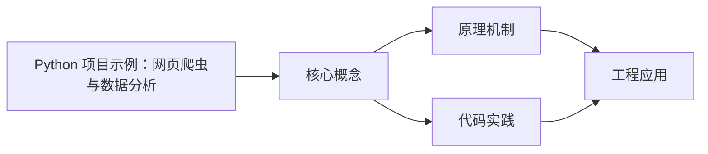
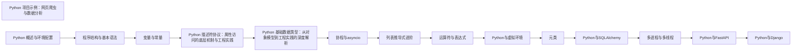

## 1. 学习目标（Bloom 分类）

本节按照布鲁姆教育目标分类学组织学习路径。本文主题为《Python 项目示例：网页爬虫与数据分析》，属于 Python 模块，读者可以根据自身阶段选择阅读深度。

记忆层面：能够准确复述本文的核心概念、术语与基本语法或操作步骤，并能够在提问或检索时快速定位对应知识点。例如能够说出 Python 的动态类型、缩进语法与解释执行等基本特征。

理解层面：能够用自己的语言解释核心原理与工作机制，说明概念之间的因果关系，而不是机械记忆结论。例如能够解释解释器与编译器的差异，以及 GIL 对并发的影响。

应用层面：能够在真实项目或练习场景中运用本文知识解决具体问题，写出正确且可维护的实现。例如能够编写函数、类与标准库调用的完整脚本。

分析层面：能够拆解复杂问题，比较本文主题与相邻概念的异同，识别边界条件与例外情况。例如能够比较 Python 与 Java、Go 在类型系统与并发模型上的差异。

评价层面：能够根据约束条件（性能、可读性、安全、成本）评价不同方案的优劣，做出有依据的技术决策。例如能够评估不同实现方案（脚本、服务、库）的适用场景。

创造层面：能够把本文知识与其他模块知识组合，设计出新的解决方案或可复用的工程模式。例如能够组合标准库与第三方包设计完整的自动化工具。

通过本节学习，读者应当能够把《Python 项目示例：网页爬虫与数据分析》纳入自己的知识网络，并与 Python 模块的其他主题（数据类型、函数、模块、异常、并发）建立关联。

## 2. 历史动机与发展脉络

《Python 项目示例：网页爬虫与数据分析》是 Python 领域的重要主题。要真正理解它，需要先了解它解决的问题与演进过程。

Python 由 Guido van Rossum 于 1991 年首次发布，设计哲学强调代码可读性与开发效率，核心思想记录在《Python 之禅》（PEP 20）中：优美优于丑陋、明确优于隐晦、简单优于复杂。
Python 2 与 Python 3 的分裂期（2008-2020）是语言史上最重要的兼容性事件：Python 3 修复了字符串编码、整数除法等长期问题，但破坏性变更导致迁移缓慢；2020 年 1 月 Python 2 停止官方维护，社区全面转向 Python 3。
Python 3.9 至 3.13 的演进带来了类型提示增强（PEP 604 的 X | Y 语法、PEP 695 的泛型语法）、性能优化（3.11 的 faster-calls 与自适应解释器）以及异步生态的成熟（asyncio、FastAPI、httpx）。
Python 的应用版图从脚本自动化扩展到 Web 后端（Django、FastAPI）、数据科学（NumPy、Pandas、Matplotlib）、机器学习（PyTorch、scikit-learn）、运维自动化（Ansible）与科学计算，是当今最通用的编程语言之一。

回到本文主题：Python 项目示例：网页爬虫与数据分析 的提出与成熟，正是上述技术背景下的必然产物。早期实现往往以简单可用为目标，随着工程规模扩大，社区逐渐沉淀出标准做法与最佳实践；理解这一脉络，可以帮助读者判断“为什么文档中的推荐写法是现在这个样子”，也能在遇到历史遗留代码时准确识别其设计年代与取舍。

对于初学者，理解 Python 的“电池内置”（标准库丰富）与“胶水语言”（易于调用 C/C++/Rust 扩展）两大特性，是判断其适用场景的基础。

## 3. 形式化定义与核心概念精讲

本节把《Python 项目示例：网页爬虫与数据分析》涉及的核心概念以“定义 + 讲解”的形式展开。读者应把定义当作工具，把讲解当作理解路径；两者结合才能形成可迁移的知识。

变量与动态类型：Python 变量是对象的引用，类型属于对象而非变量；`isinstance()` 与 `type()` 用于运行时检查，类型注解（PEP 484）提供静态检查能力但不改变运行时行为。
缩进即语法：Python 用缩进表达代码块层次，避免了花括号噪声，也强制了代码排版一致性；同一代码块必须使用一致的空格数（官方推荐 4 空格）。
函数是一等公民：函数可以赋值、传参、返回，配合 lambda、装饰器与闭包，构成函数式编程能力的基础。
模块与包：每个 `.py` 文件是模块，目录加 `__init__.py` 是包；`import` 机制支持绝对导入、相对导入与命名空间包。
异常处理：`try/except/finally` 与 `raise` 构成错误传播体系；`with` 语句通过上下文管理器（`__enter__/__exit__`）管理资源生命周期。

### 3.1 原文章节逐一精讲

原文档把主题拆分为 6 个小节，下面按顺序给出每一节的导读讲解，随后保留原文细节供精读。

#### 原文精读（完整保留）


| HTML 解析  | 使用 BeautifulSoup 提取结构化数据        |
| ---------- | ---------------------------------------- |
| 反爬处理   | 请求头伪装、延时策略、重试机制           |
| 数据清洗   | 使用 pandas 处理缺失值、异常值、重复数据 |
| 数据分析   | 统计描述、分组聚合、相关性分析           |
| 数据可视化 | 使用 matplotlib 生成图表                 |
| 数据导出   | 导出为 CSV/Excel/JSON 格式               |

#### 需求分析

##### 数据需求

- 目标：抓取图书信息（书名、作者、价格、评分、分类）
- 数据量：约 1000 条记录
- 数据格式：结构化表格数据

##### 功能需求

- 支持多页抓取，自动翻页
- 网络异常自动重试（最多 3 次）
- 增量抓取：已抓取的数据不重复抓取
- 数据清洗：处理缺失值、类型转换、去重
- 生成分析报告和可视化图表

##### 非功能需求

- 遵守 robots.txt 协议
- 请求间隔不低于 1 秒
- 内存占用可控，大数据集使用分块处理

#### 技术选型

| 技术点    | 选型          | 理由                               |
| --------- | ------------- | ---------------------------------- |
| HTTP 请求 | requests      | 最流行的 HTTP 库，API 简洁         |
| HTML 解析 | BeautifulSoup | 容错性强，支持多种解析器           |
| 数据处理  | pandas        | 高性能数据分析，DataFrame 操作直观 |
| 可视化    | matplotlib    | 基础绑图库，灵活度高               |
| 数据存储  | CSV/JSON      | 通用格式，便于交换                 |
| 异常处理  | tenacity      | 声明式重试库，支持指数退避         |

#### 完整代码

##### 项目配置与工具模块

```python
import requests
from bs4 import BeautifulSoup
import pandas as pd
import matplotlib.pyplot as plt
import json
import time
import random
import os
import logging
from datetime import datetime

logging.basicConfig(
    level=logging.INFO,
    format='%(asctime)s - %(levelname)s - %(message)s'
)
logger = logging.getLogger(__name__)

BASE_URL = "https://books.toscrape.com"
OUTPUT_DIR = "output"
REQUEST_DELAY = (1, 3)
MAX_RETRIES = 3
HEADERS = {
    "User-Agent": (
        "Mozilla/5.0 (Windows NT 10.0; Win64; x64) "
        "AppleWebKit/537.36 (KHTML, like Gecko) "
        "Chrome/120.0.0.0 Safari/537.36"
    ),
    "Accept": "text/html,application/xhtml+xml,application/xml;q=0.9,*/*;q=0.8",
    "Accept-Language": "en-US,en;q=0.5",
}

os.makedirs(OUTPUT_DIR, exist_ok=True)
```

##### HTTP 请求模块

```python
class HttpClient:
    def __init__(self, headers=None, max_retries=3, delay_range=(1, 3)):
        self.session = requests.Session()
        if headers:
            self.session.headers.update(headers)
        self.max_retries = max_retries
        self.delay_range = delay_range

    def get(self, url, **kwargs):
        for attempt in range(1, self.max_retries + 1):
            try:
                logger.info(f"GET {url} (attempt {attempt})")
                response = self.session.get(url, timeout=10, **kwargs)
                response.raise_for_status()
                return response
            except requests.RequestException as e:
                logger.warning(f"Request failed: {e}")
                if attempt == self.max_retries:
                    logger.error(f"Max retries reached for {url}")
                    raise
                wait = self.delay_range[0] + random.random() * (
                    self.delay_range[1] - self.delay_range[0]
                )
                logger.info(f"Waiting {wait:.1f}s before retry...")
                time.sleep(wait)

    def close(self):
        self.session.close()
```

##### 数据抓取模块

```python
class BookScraper:
    def __init__(self, http_client):
        self.client = http_client
        self.books = []

    def parse_book_article(self, article):
        title = article.h3.a["title"]
        price_str = article.select_one(".price_color").text
        price = float(price_str.replace("\u00a3", "").replace(",", ""))
        rating_class = article.select_one(".star-rating")["class"]
        rating_map = {
            "One": 1, "Two": 2, "Three": 3,
            "Four": 4, "Five": 5
        }
        rating = rating_map.get(rating_class[-1], 0)
        availability = article.select_one(".availability").text.strip()
        in_stock = "In stock" in availability

        return {
            "title": title,
            "price": price,
            "rating": rating,
            "in_stock": in_stock,
        }

    def scrape_page(self, url):
        response = self.client.get(url)
        soup = BeautifulSoup(response.text, "html.parser")
        articles = soup.select("article.product_pod")

        page_books = []
        for article in articles:
            try:
                book = self.parse_book_article(article)
                page_books.append(book)
            except Exception as e:
                logger.warning(f"Failed to parse article: {e}")

        return page_books

    def scrape_category(self, category_url, max_pages=None):
        all_books = []
        page_url = category_url
        page_count = 0

        while page_url:
            page_count += 1
            if max_pages and page_count > max_pages:
                break

            books = self.scrape_page(page_url)
            all_books.extend(books)
            logger.info(f"Page {page_count}: scraped {len(books)} books")

            response = self.client.get(page_url)
            soup = BeautifulSoup(response.text, "html.parser")
            next_btn = soup.select_one("li.next a")
            if next_btn:
                next_href = next_btn["href"]
                if next_href.startswith("http"):
                    page_url = next_href
                else:
                    base = page_url.rsplit("/", 1)[0]
                    page_url = base + "/" + next_href
            else:
                page_url = None

            delay = REQUEST_DELAY[0] + random.random() * (
                REQUEST_DELAY[1] - REQUEST_DELAY[0]
            )
            time.sleep(delay)

        self.books.extend(all_books)
        logger.info(f"Total books scraped: {len(all_books)}")
        return all_books

    def scrape_all_categories(self):
        response = self.client.get(BASE_URL)
        soup = BeautifulSoup(response.text, "html.parser")
        category_links = soup.select(".side_categories ul li ul li a")

        categories = {}
        for link in category_links:
            name = link.text.strip()
            url = BASE_URL + "/" + link["href"]
            categories[name] = url

        logger.info(f"Found {len(categories)} categories")

        all_books = []
        for name, url in categories.items():
            logger.info(f"Scraping category: {name}")
            books = self.scrape_category(url)
            for book in books:
                book["category"] = name
            all_books.extend(books)

        self.books = all_books
        return all_books
```

##### 数据清洗模块

```python
class DataCleaner:
    def __init__(self, df):
        self.df = df.copy()
        self.report = {}

    def check_data_quality(self):
        self.report["total_rows"] = len(self.df)
        self.report["missing_values"] = self.df.isnull().sum().to_dict()
        self.report["duplicates"] = self.df.duplicated().sum()
        self.report["dtypes"] = self.df.dtypes.astype(str).to_dict()
        logger.info(f"Data quality report: {json.dumps(self.report, indent=2)}")
        return self.report

    def remove_duplicates(self):
        before = len(self.df)
        self.df = self.df.drop_duplicates(subset=["title"], keep="first")
        after = len(self.df)
        logger.info(f"Removed {before - after} duplicate rows")
        return self

    def handle_missing_values(self):
        numeric_cols = self.df.select_dtypes(include=["number"]).columns
        for col in numeric_cols:
            missing = self.df[col].isnull().sum()
            if missing > 0:
                median = self.df[col].median()
                self.df[col].fillna(median, inplace=True)
                logger.info(f"Filled {missing} missing values in {col} with median {median}")

        text_cols = self.df.select_dtypes(include=["object"]).columns
        for col in text_cols:
            missing = self.df[col].isnull().sum()
            if missing > 0:
                self.df[col].fillna("Unknown", inplace=True)
                logger.info(f"Filled {missing} missing values in {col} with 'Unknown'")
        return self

    def remove_outliers(self, column, method="iqr", threshold=1.5):
        if method == "iqr":
            q1 = self.df[column].quantile(0.25)
            q3 = self.df[column].quantile(0.75)
            iqr = q3 - q1
            lower = q1 - threshold * iqr
            upper = q3 + threshold * iqr
            before = len(self.df)
            self.df = self.df[
                (self.df[column] >= lower) & (self.df[column] <= upper)
            ]
            after = len(self.df)
            logger.info(f"Removed {before - after} outliers from {column} using IQR")
        return self

    def convert_types(self):
        self.df["price"] = pd.to_numeric(self.df["price"], errors="coerce")
        self.df["rating"] = pd.to_numeric(self.df["rating"], errors="coerce").astype("Int64")
        self.df["in_stock"] = self.df["in_stock"].astype(bool)
        self.df["category"] = self.df["category"].astype("category")
        return self

    def get_cleaned_data(self):
        return self.df
```

##### 数据分析模块

```python
class DataAnalyzer:
    def __init__(self, df):
        self.df = df

    def basic_statistics(self):
        stats = self.df.describe()
        logger.info("Basic statistics:\n" + stats.to_string())
        return stats

    def price_by_category(self):
        result = self.df.groupby("category", observed=True)["price"].agg(
            ["mean", "median", "std", "min", "max", "count"]
        ).sort_values("mean", ascending=False)
        logger.info("Price by category:\n" + result.to_string())
        return result

    def rating_distribution(self):
        dist = self.df["rating"].value_counts().sort_index()
        logger.info("Rating distribution:\n" + dist.to_string())
        return dist

    def price_rating_correlation(self):
        corr = self.df["price", "rating"]("price", "rating").corr()
        logger.info(f"Price-Rating correlation: {corr.loc['price', 'rating']:.4f}")
        return corr

    def stock_availability(self):
        stock = self.df.groupby("category", observed=True)["in_stock"].agg(
            ["sum", "count"]
        )
        stock["percentage"] = (stock["sum"] / stock["count"] * 100).round(2)
        stock.columns = ["in_stock", "total", "percentage"]
        return stock.sort_values("percentage", ascending=False)

    def top_books(self, n=10, by="rating"):
        return self.df.nlargest(n, by)["title", "price", "rating", "category"]("title", "price", "rating", "category")

    def price_ranges(self):
        bins = [0, 10, 20, 30, 40, 50, 100]
        labels = ["0-10", "10-20", "20-30", "30-40", "40-50", "50+"]
        self.df["price_range"] = pd.cut(
            self.df["price"], bins=bins, labels=labels
        )
        return self.df["price_range"].value_counts().sort_index()
```

##### 数据可视化模块

```python
class DataVisualizer:
    def __init__(self, df, output_dir="output"):
        self.df = df
        self.output_dir = output_dir
        plt.style.use("seaborn-v0_8-whitegrid")

    def save_fig(self, name):
        path = os.path.join(self.output_dir, name)
        plt.savefig(path, dpi=150, bbox_inches="tight")
        plt.close()
        logger.info(f"Saved figure: {path}")

    def plot_price_distribution(self):
        fig, axes = plt.subplots(1, 2, figsize=(14, 5))

        axes[0].hist(self.df["price"], bins=30, edgecolor="black", alpha=0.7)
        axes[0].set_title("Price Distribution")
        axes[0].set_xlabel("Price")
        axes[0].set_ylabel("Frequency")

        axes[1].boxplot(self.df["price"].dropna(), vert=True)
        axes[1].set_title("Price Box Plot")
        axes[1].set_ylabel("Price")

        plt.tight_layout()
        self.save_fig("price_distribution.png")

    def plot_rating_distribution(self):
        fig, ax = plt.subplots(figsize=(8, 5))
        rating_counts = self.df["rating"].value_counts().sort_index()
        colors = ["#ff6b6b", "#ffa502", "#ffd93d", "#6bcb77", "#4d96ff"]
        bars = ax.bar(rating_counts.index, rating_counts.values, color=colors, edgecolor="black")

        for bar, count in zip(bars, rating_counts.values):
            ax.text(
                bar.get_x() + bar.get_width() / 2,
                bar.get_height() + 5,
                str(count),
                ha="center", va="bottom", fontweight="bold"
            )

        ax.set_title("Rating Distribution")
        ax.set_xlabel("Rating (1-5)")
        ax.set_ylabel("Count")
        self.save_fig("rating_distribution.png")

    def plot_category_avg_price(self):
        fig, ax = plt.subplots(figsize=(12, 6))
        avg_price = self.df.groupby("category", observed=True)["price"].mean().sort_values()

        ax.barh(range(len(avg_price)), avg_price.values, edgecolor="black")
        ax.set_yticks(range(len(avg_price)))
        ax.set_yticklabels(avg_price.index, fontsize=8)
        ax.set_title("Average Price by Category")
        ax.set_xlabel("Average Price")

        plt.tight_layout()
        self.save_fig("category_avg_price.png")

    def plot_price_vs_rating(self):
        fig, ax = plt.subplots(figsize=(8, 6))
        sample = self.df.sample(min(500, len(self.df)), random_state=42)
        scatter = ax.scatter(
            sample["price"], sample["rating"],
            alpha=0.5, c=sample["rating"], cmap="RdYlGn",
            edgecolors="gray", s=50
        )
        plt.colorbar(scatter, label="Rating")
        ax.set_title("Price vs Rating")
        ax.set_xlabel("Price")
        ax.set_ylabel("Rating")
        self.save_fig("price_vs_rating.png")

    def plot_price_range_pie(self):
        fig, ax = plt.subplots(figsize=(8, 8))
        bins = [0, 10, 20, 30, 40, 50, 100]
        labels = ["0-10", "10-20", "20-30", "30-40", "40-50", "50+"]
        ranges = pd.cut(self.df["price"], bins=bins, labels=labels)
        counts = ranges.value_counts()

        ax.pie(
            counts.values, labels=counts.index, autopct="%1.1f%%",
            startangle=90, pctdistance=0.85
        )
        ax.set_title("Price Range Distribution")
        self.save_fig("price_range_pie.png")

    def generate_all_plots(self):
        self.plot_price_distribution()
        self.plot_rating_distribution()
        self.plot_category_avg_price()
        self.plot_price_vs_rating()
        self.plot_price_range_pie()
        logger.info("All plots generated successfully")
```

##### 数据导出模块

```python
class DataExporter:
    def __init__(self, df, output_dir="output"):
        self.df = df
        self.output_dir = output_dir

    def to_csv(self, filename="books_data.csv"):
        path = os.path.join(self.output_dir, filename)
        self.df.to_csv(path, index=False, encoding="utf-8-sig")
        logger.info(f"Exported CSV: {path}")

    def to_json(self, filename="books_data.json"):
        path = os.path.join(self.output_dir, filename)
        self.df.to_json(path, orient="records", force_ascii=False, indent=2)
        logger.info(f"Exported JSON: {path}")

    def to_excel(self, filename="books_data.xlsx"):
        path = os.path.join(self.output_dir, filename)
        with pd.ExcelWriter(path, engine="openpyxl") as writer:
            self.df.to_excel(writer, sheet_name="Raw Data", index=False)

            summary = self.df.groupby("category", observed=True).agg(
                count=("price", "size"),
                avg_price=("price", "mean"),
                avg_rating=("rating", "mean"),
            ).round(2)
            summary.to_excel(writer, sheet_name="Summary")
        logger.info(f"Exported Excel: {path}")
```

##### 主程序入口

```python
def main():
    logger.info("=== Book Scraper & Data Analysis Pipeline ===")

    client = HttpClient(headers=HEADERS, max_retries=MAX_RETRIES, delay_range=REQUEST_DELAY)
    scraper = BookScraper(client)

    logger.info("Step 1: Scraping data...")
    books = scraper.scrape_all_categories()
    logger.info(f"Scraped {len(books)} books total")

    df = pd.DataFrame(books)
    logger.info(f"DataFrame shape: {df.shape}")

    logger.info("Step 2: Cleaning data...")
    cleaner = DataCleaner(df)
    cleaner.check_data_quality()
    cleaner.remove_duplicates().handle_missing_values().convert_types()
    df_clean = cleaner.get_cleaned_data()
    logger.info(f"Cleaned DataFrame shape: {df_clean.shape}")

    logger.info("Step 3: Analyzing data...")
    analyzer = DataAnalyzer(df_clean)
    analyzer.basic_statistics()
    analyzer.price_by_category()
    analyzer.rating_distribution()
    analyzer.price_rating_correlation()

    logger.info("Step 4: Generating visualizations...")
    visualizer = DataVisualizer(df_clean, output_dir=OUTPUT_DIR)
    visualizer.generate_all_plots()

    logger.info("Step 5: Exporting data...")
    exporter = DataExporter(df_clean, output_dir=OUTPUT_DIR)
    exporter.to_csv()
    exporter.to_json()
    exporter.to_excel()

    client.close()
    logger.info("=== Pipeline completed ===")


if __name__ == "__main__":
    main()
```

#### 运行说明

##### 安装依赖

```bash
pip install requests beautifulsoup4 pandas matplotlib openpyxl
```

##### 运行

```bash
python main.py
```

##### 输出文件

- `output/books_data.csv` -- 原始数据 CSV
- `output/books_data.json` -- 原始数据 JSON
- `output/books_data.xlsx` -- 含汇总表的 Excel
- `output/price_distribution.png` -- 价格分布图
- `output/rating_distribution.png` -- 评分分布图
- `output/category_avg_price.png` -- 分类均价图
- `output/price_vs_rating.png` -- 价格与评分散点图
- `output/price_range_pie.png` -- 价格区间饼图

#### 扩展方向

1. **异步抓取** -- 使用 aiohttp + asyncio 提升抓取速度
2. **数据库存储** -- 将数据存入 SQLite/MySQL，支持增量更新
3. **定时任务** -- 使用 APScheduler 定期抓取，跟踪价格变化
4. **机器学习** -- 基于特征预测图书评分或价格区间
5. **代理池** -- 集成代理池应对 IP 限制
6. **Dashboard** -- 使用 Streamlit 构建交互式数据看板
7. **日志监控** -- 接入 Sentry 或 ELK 进行异常监控

---

#### 关键代码速查

##### requests 基本用法

```python
import requests

response = requests.get(url, headers=headers, timeout=10)
response.raise_for_status()
html = response.text
```

##### BeautifulSoup 解析

```python
soup = BeautifulSoup(html, "html.parser")
elements = soup.select("div.classname")
text = soup.select_one("h1.title").text.strip()
attr = element["href"]
```

##### pandas 数据清洗

```python
df.drop_duplicates(subset=["col"], keep="first")
df["col"].fillna(df["col"].median(), inplace=True)
df["col"] = pd.to_numeric(df["col"], errors="coerce")
df["col"] = df["col"].astype("category")
```

##### pandas 分组聚合

```python
df.groupby("category")["price"].agg(["mean", "median", "std", "count"])
df.nlargest(10, "rating")
pd.cut(df["price"], bins=[0, 10, 20, 50], labels=["low", "mid", "high"])
```

##### matplotlib 绑图

```python
plt.hist(df["col"], bins=30)
plt.bar(x, y, color="steelblue")
plt.scatter(df["x"], df["y"], alpha=0.5)
plt.savefig("fig.png", dpi=150, bbox_inches="tight")
plt.close()
```

##### 重试机制

```python
for attempt in range(1, max_retries + 1):
    try:
        response = session.get(url, timeout=10)
        response.raise_for_status()
        return response
    except requests.RequestException:
        if attempt == max_retries:
            raise
        time.sleep(delay * attempt)
```


### 3.2 概念关系图

下面用 Mermaid 图表达本文核心概念之间的关系，帮助读者建立整体图景：



图中展示的是本文知识的结构化关系：核心概念是入口，原理机制解释“为什么”，代码实践演示“怎么做”，工程应用回答“何时用”。读者学习时可以把每个小节的内容挂接到对应节点上。

## 4. 理论推导与原理解析

本节深入《Python 项目示例：网页爬虫与数据分析》背后的原理。理论部分不求面面俱到，而是聚焦“能解释现象、能指导实践”的关键推导。

解释执行与字节码：CPython 先把源码编译为字节码（.pyc），再由虚拟机逐条执行。字节码是平台无关的中间表示，因此 Python 程序可以跨平台运行，但执行速度低于编译型语言；性能敏感路径可用 C 扩展或 Cython 加速。
GIL（全局解释器锁）：CPython 的 GIL 保证同一时刻只有一个线程执行字节码，简化了内存管理，但限制了 CPU 密集型多线程并行；I/O 密集型任务通过线程切换获得并发，CPU 密集型任务应使用多进程（multiprocessing）或异步。
引用计数与垃圾回收：Python 对象通过引用计数管理生命周期，循环引用由分代垃圾回收器（gc 模块）处理。理解这一模型可以解释“为什么局部变量及时释放内存”“为什么大对象需要 del 或作用域退出”。
鸭子类型与协议：Python 依赖行为协议而非继承体系，例如实现 `__iter__` 与 `__next__` 的对象即可用于 `for` 循环。这一设计带来灵活性的同时，也要求开发者编写清晰的接口文档与类型注解。

需要强调的是，理论推导与工程实践之间存在翻译层：理论给出的是理想化模型与边界条件，工程代码则必须处理真实环境中的例外。读者在学习时应先掌握理论的“标准情形”，再通过陷阱章节了解“非标准情形”。

## 5. 代码示例与逐行讲解

本节把原文中的代码示例系统整理，并为每个示例补充用途说明与讲解。读者不应只浏览代码，而应逐段对照讲解理解设计意图。

### 5.1 示例：项目配置与工具模块

该示例来自原文《项目配置与工具模块》小节，用于演示Python 项目示例：网页爬虫与数据分析相关操作。阅读时请先看代码结构，再看其后的讲解。

```python
import requests
from bs4 import BeautifulSoup
import pandas as pd
import matplotlib.pyplot as plt
import json
import time
import random
import os
import logging
from datetime import datetime

logging.basicConfig(
    level=logging.INFO,
    format='%(asctime)s - %(levelname)s - %(message)s'
)
logger = logging.getLogger(__name__)

BASE_URL = "https://books.toscrape.com"
OUTPUT_DIR = "output"
REQUEST_DELAY = (1, 3)
MAX_RETRIES = 3
HEADERS = {
    "User-Agent": (
        "Mozilla/5.0 (Windows NT 10.0; Win64; x64) "
        "AppleWebKit/537.36 (KHTML, like Gecko) "
        "Chrome/120.0.0.0 Safari/537.36"
    ),
    "Accept": "text/html,application/xhtml+xml,application/xml;q=0.9,*/*;q=0.8",
    "Accept-Language": "en-US,en;q=0.5",
}

os.makedirs(OUTPUT_DIR, exist_ok=True)
```

讲解：这段代码演示了本节核心知识点。代码中的关键操作可以归纳为三步：准备（定义或初始化）、执行（核心逻辑）、收尾（释放资源或返回结果）。实际项目中，这三步往往被封装为函数或类，以提升复用性与可测试性。

关键点分析：

该示例共 29 行有效代码，包含 2 类关键结构（import、from）。其中：

- 入口与初始化部分负责建立上下文，对应实际项目中的启动或装配逻辑；
- 核心逻辑部分体现本文主题的主要操作，是阅读时最需要对照讲解理解的部分；
- 输出或返回部分把结果交给调用方，注意其类型与边界条件。

进阶思考路径：先尝试修改参数观察行为变化，再把示例中的模式迁移到自己的项目中；每次修改都记录预期与实测差异，这是把示例转化为能力的最快方式。

### 5.2 示例：HTTP 请求模块

该示例来自原文《HTTP 请求模块》小节，用于演示Python 项目示例：网页爬虫与数据分析相关操作。阅读时请先看代码结构，再看其后的讲解。

```python
class HttpClient:
    def __init__(self, headers=None, max_retries=3, delay_range=(1, 3)):
        self.session = requests.Session()
        if headers:
            self.session.headers.update(headers)
        self.max_retries = max_retries
        self.delay_range = delay_range

    def get(self, url, **kwargs):
        for attempt in range(1, self.max_retries + 1):
            try:
                logger.info(f"GET {url} (attempt {attempt})")
                response = self.session.get(url, timeout=10, **kwargs)
                response.raise_for_status()
                return response
            except requests.RequestException as e:
                logger.warning(f"Request failed: {e}")
                if attempt == self.max_retries:
                    logger.error(f"Max retries reached for {url}")
                    raise
                wait = self.delay_range[0] + random.random() * (
                    self.delay_range[1] - self.delay_range[0]
                )
                logger.info(f"Waiting {wait:.1f}s before retry...")
                time.sleep(wait)

    def close(self):
        self.session.close()
```

讲解：这段代码演示了本节核心知识点。代码中的关键操作可以归纳为三步：准备（定义或初始化）、执行（核心逻辑）、收尾（释放资源或返回结果）。实际项目中，这三步往往被封装为函数或类，以提升复用性与可测试性。

关键点分析：

该示例共 26 行有效代码，包含 5 类关键结构（class、def、if、for、return）。其中：

- 入口与初始化部分负责建立上下文，对应实际项目中的启动或装配逻辑；
- 核心逻辑部分体现本文主题的主要操作，是阅读时最需要对照讲解理解的部分；
- 输出或返回部分把结果交给调用方，注意其类型与边界条件。

进阶思考路径：先尝试修改参数观察行为变化，再把示例中的模式迁移到自己的项目中；每次修改都记录预期与实测差异，这是把示例转化为能力的最快方式。

### 5.3 示例：数据抓取模块

该示例来自原文《数据抓取模块》小节，用于演示Python 项目示例：网页爬虫与数据分析相关操作。阅读时请先看代码结构，再看其后的讲解。

```python
class BookScraper:
    def __init__(self, http_client):
        self.client = http_client
        self.books = []

    def parse_book_article(self, article):
        title = article.h3.a["title"]
        price_str = article.select_one(".price_color").text
        price = float(price_str.replace("\u00a3", "").replace(",", ""))
        rating_class = article.select_one(".star-rating")["class"]
        rating_map = {
            "One": 1, "Two": 2, "Three": 3,
            "Four": 4, "Five": 5
        }
        rating = rating_map.get(rating_class[-1], 0)
        availability = article.select_one(".availability").text.strip()
        in_stock = "In stock" in availability

        return {
            "title": title,
            "price": price,
            "rating": rating,
            "in_stock": in_stock,
        }

    def scrape_page(self, url):
        response = self.client.get(url)
        soup = BeautifulSoup(response.text, "html.parser")
        articles = soup.select("article.product_pod")

        page_books = []
        for article in articles:
            try:
                book = self.parse_book_article(article)
                page_books.append(book)
            except Exception as e:
                logger.warning(f"Failed to parse article: {e}")

        return page_books

    def scrape_category(self, category_url, max_pages=None):
        all_books = []
        page_url = category_url
        page_count = 0

        while page_url:
            page_count += 1
            if max_pages and page_count > max_pages:
                break

            books = self.scrape_page(page_url)
            all_books.extend(books)
            logger.info(f"Page {page_count}: scraped {len(books)} books")

            response = self.client.get(page_url)
            soup = BeautifulSoup(response.text, "html.parser")
            next_btn = soup.select_one("li.next a")
            if next_btn:
                next_href = next_btn["href"]
                if next_href.startswith("http"):
                    page_url = next_href
                else:
                    base = page_url.rsplit("/", 1)[0]
                    page_url = base + "/" + next_href
            else:
                page_url = None

            delay = REQUEST_DELAY[0] + random.random() * (
                REQUEST_DELAY[1] - REQUEST_DELAY[0]
            )
            time.sleep(delay)

        self.books.extend(all_books)
        logger.info(f"Total books scraped: {len(all_books)}")
        return all_books

    def scrape_all_categories(self):
        response = self.client.get(BASE_URL)
        soup = BeautifulSoup(response.text, "html.parser")
        category_links = soup.select(".side_categories ul li ul li a")

        categories = {}
        for link in category_links:
            name = link.text.strip()
            url = BASE_URL + "/" + link["href"]
            categories[name] = url

        logger.info(f"Found {len(categories)} categories")

        all_books = []
        for name, url in categories.items():
            logger.info(f"Scraping category: {name}")
            books = self.scrape_category(url)
            for book in books:
                book["category"] = name
            all_books.extend(books)

        self.books = all_books
        return all_books
```

讲解：这段代码演示了本节核心知识点。代码中的关键操作可以归纳为三步：准备（定义或初始化）、执行（核心逻辑）、收尾（释放资源或返回结果）。实际项目中，这三步往往被封装为函数或类，以提升复用性与可测试性。

关键点分析：

该示例共 83 行有效代码，包含 6 类关键结构（class、def、if、for、while、return）。其中：

- 入口与初始化部分负责建立上下文，对应实际项目中的启动或装配逻辑；
- 核心逻辑部分体现本文主题的主要操作，是阅读时最需要对照讲解理解的部分；
- 输出或返回部分把结果交给调用方，注意其类型与边界条件。

进阶思考路径：先尝试修改参数观察行为变化，再把示例中的模式迁移到自己的项目中；每次修改都记录预期与实测差异，这是把示例转化为能力的最快方式。

### 5.4 示例：数据清洗模块

该示例来自原文《数据清洗模块》小节，用于演示Python 项目示例：网页爬虫与数据分析相关操作。阅读时请先看代码结构，再看其后的讲解。

```python
class DataCleaner:
    def __init__(self, df):
        self.df = df.copy()
        self.report = {}

    def check_data_quality(self):
        self.report["total_rows"] = len(self.df)
        self.report["missing_values"] = self.df.isnull().sum().to_dict()
        self.report["duplicates"] = self.df.duplicated().sum()
        self.report["dtypes"] = self.df.dtypes.astype(str).to_dict()
        logger.info(f"Data quality report: {json.dumps(self.report, indent=2)}")
        return self.report

    def remove_duplicates(self):
        before = len(self.df)
        self.df = self.df.drop_duplicates(subset=["title"], keep="first")
        after = len(self.df)
        logger.info(f"Removed {before - after} duplicate rows")
        return self

    def handle_missing_values(self):
        numeric_cols = self.df.select_dtypes(include=["number"]).columns
        for col in numeric_cols:
            missing = self.df[col].isnull().sum()
            if missing > 0:
                median = self.df[col].median()
                self.df[col].fillna(median, inplace=True)
                logger.info(f"Filled {missing} missing values in {col} with median {median}")

        text_cols = self.df.select_dtypes(include=["object"]).columns
        for col in text_cols:
            missing = self.df[col].isnull().sum()
            if missing > 0:
                self.df[col].fillna("Unknown", inplace=True)
                logger.info(f"Filled {missing} missing values in {col} with 'Unknown'")
        return self

    def remove_outliers(self, column, method="iqr", threshold=1.5):
        if method == "iqr":
            q1 = self.df[column].quantile(0.25)
            q3 = self.df[column].quantile(0.75)
            iqr = q3 - q1
            lower = q1 - threshold * iqr
            upper = q3 + threshold * iqr
            before = len(self.df)
            self.df = self.df[
                (self.df[column] >= lower) & (self.df[column] <= upper)
            ]
            after = len(self.df)
            logger.info(f"Removed {before - after} outliers from {column} using IQR")
        return self

    def convert_types(self):
        self.df["price"] = pd.to_numeric(self.df["price"], errors="coerce")
        self.df["rating"] = pd.to_numeric(self.df["rating"], errors="coerce").astype("Int64")
        self.df["in_stock"] = self.df["in_stock"].astype(bool)
        self.df["category"] = self.df["category"].astype("category")
        return self

    def get_cleaned_data(self):
        return self.df
```

讲解：这段代码演示了本节核心知识点。代码中的关键操作可以归纳为三步：准备（定义或初始化）、执行（核心逻辑）、收尾（释放资源或返回结果）。实际项目中，这三步往往被封装为函数或类，以提升复用性与可测试性。

关键点分析：

该示例共 54 行有效代码，包含 6 类关键结构（class、def、from、if、for、return）。其中：

- 入口与初始化部分负责建立上下文，对应实际项目中的启动或装配逻辑；
- 核心逻辑部分体现本文主题的主要操作，是阅读时最需要对照讲解理解的部分；
- 输出或返回部分把结果交给调用方，注意其类型与边界条件。

进阶思考路径：先尝试修改参数观察行为变化，再把示例中的模式迁移到自己的项目中；每次修改都记录预期与实测差异，这是把示例转化为能力的最快方式。

### 5.5 示例：数据分析模块

该示例来自原文《数据分析模块》小节，用于演示Python 项目示例：网页爬虫与数据分析相关操作。阅读时请先看代码结构，再看其后的讲解。

```python
class DataAnalyzer:
    def __init__(self, df):
        self.df = df

    def basic_statistics(self):
        stats = self.df.describe()
        logger.info("Basic statistics:\n" + stats.to_string())
        return stats

    def price_by_category(self):
        result = self.df.groupby("category", observed=True)["price"].agg(
            ["mean", "median", "std", "min", "max", "count"]
        ).sort_values("mean", ascending=False)
        logger.info("Price by category:\n" + result.to_string())
        return result

    def rating_distribution(self):
        dist = self.df["rating"].value_counts().sort_index()
        logger.info("Rating distribution:\n" + dist.to_string())
        return dist

    def price_rating_correlation(self):
        corr = self.df["price", "rating"]("price", "rating").corr()
        logger.info(f"Price-Rating correlation: {corr.loc['price', 'rating']:.4f}")
        return corr

    def stock_availability(self):
        stock = self.df.groupby("category", observed=True)["in_stock"].agg(
            ["sum", "count"]
        )
        stock["percentage"] = (stock["sum"] / stock["count"] * 100).round(2)
        stock.columns = ["in_stock", "total", "percentage"]
        return stock.sort_values("percentage", ascending=False)

    def top_books(self, n=10, by="rating"):
        return self.df.nlargest(n, by)["title", "price", "rating", "category"]("title", "price", "rating", "category")

    def price_ranges(self):
        bins = [0, 10, 20, 30, 40, 50, 100]
        labels = ["0-10", "10-20", "20-30", "30-40", "40-50", "50+"]
        self.df["price_range"] = pd.cut(
            self.df["price"], bins=bins, labels=labels
        )
        return self.df["price_range"].value_counts().sort_index()
```

讲解：这段代码演示了本节核心知识点。代码中的关键操作可以归纳为三步：准备（定义或初始化）、执行（核心逻辑）、收尾（释放资源或返回结果）。实际项目中，这三步往往被封装为函数或类，以提升复用性与可测试性。

关键点分析：

该示例共 37 行有效代码，包含 3 类关键结构（class、def、return）。其中：

- 入口与初始化部分负责建立上下文，对应实际项目中的启动或装配逻辑；
- 核心逻辑部分体现本文主题的主要操作，是阅读时最需要对照讲解理解的部分；
- 输出或返回部分把结果交给调用方，注意其类型与边界条件。

进阶思考路径：先尝试修改参数观察行为变化，再把示例中的模式迁移到自己的项目中；每次修改都记录预期与实测差异，这是把示例转化为能力的最快方式。

### 5.6 示例：数据可视化模块

该示例来自原文《数据可视化模块》小节，用于演示Python 项目示例：网页爬虫与数据分析相关操作。阅读时请先看代码结构，再看其后的讲解。

```python
class DataVisualizer:
    def __init__(self, df, output_dir="output"):
        self.df = df
        self.output_dir = output_dir
        plt.style.use("seaborn-v0_8-whitegrid")

    def save_fig(self, name):
        path = os.path.join(self.output_dir, name)
        plt.savefig(path, dpi=150, bbox_inches="tight")
        plt.close()
        logger.info(f"Saved figure: {path}")

    def plot_price_distribution(self):
        fig, axes = plt.subplots(1, 2, figsize=(14, 5))

        axes[0].hist(self.df["price"], bins=30, edgecolor="black", alpha=0.7)
        axes[0].set_title("Price Distribution")
        axes[0].set_xlabel("Price")
        axes[0].set_ylabel("Frequency")

        axes[1].boxplot(self.df["price"].dropna(), vert=True)
        axes[1].set_title("Price Box Plot")
        axes[1].set_ylabel("Price")

        plt.tight_layout()
        self.save_fig("price_distribution.png")

    def plot_rating_distribution(self):
        fig, ax = plt.subplots(figsize=(8, 5))
        rating_counts = self.df["rating"].value_counts().sort_index()
        colors = ["#ff6b6b", "#ffa502", "#ffd93d", "#6bcb77", "#4d96ff"]
        bars = ax.bar(rating_counts.index, rating_counts.values, color=colors, edgecolor="black")

        for bar, count in zip(bars, rating_counts.values):
            ax.text(
                bar.get_x() + bar.get_width() / 2,
                bar.get_height() + 5,
                str(count),
                ha="center", va="bottom", fontweight="bold"
            )

        ax.set_title("Rating Distribution")
        ax.set_xlabel("Rating (1-5)")
        ax.set_ylabel("Count")
        self.save_fig("rating_distribution.png")

    def plot_category_avg_price(self):
        fig, ax = plt.subplots(figsize=(12, 6))
        avg_price = self.df.groupby("category", observed=True)["price"].mean().sort_values()

        ax.barh(range(len(avg_price)), avg_price.values, edgecolor="black")
        ax.set_yticks(range(len(avg_price)))
        ax.set_yticklabels(avg_price.index, fontsize=8)
        ax.set_title("Average Price by Category")
        ax.set_xlabel("Average Price")

        plt.tight_layout()
        self.save_fig("category_avg_price.png")

    def plot_price_vs_rating(self):
        fig, ax = plt.subplots(figsize=(8, 6))
        sample = self.df.sample(min(500, len(self.df)), random_state=42)
        scatter = ax.scatter(
            sample["price"], sample["rating"],
            alpha=0.5, c=sample["rating"], cmap="RdYlGn",
            edgecolors="gray", s=50
        )
        plt.colorbar(scatter, label="Rating")
        ax.set_title("Price vs Rating")
        ax.set_xlabel("Price")
        ax.set_ylabel("Rating")
        self.save_fig("price_vs_rating.png")

    def plot_price_range_pie(self):
        fig, ax = plt.subplots(figsize=(8, 8))
        bins = [0, 10, 20, 30, 40, 50, 100]
        labels = ["0-10", "10-20", "20-30", "30-40", "40-50", "50+"]
        ranges = pd.cut(self.df["price"], bins=bins, labels=labels)
        counts = ranges.value_counts()

        ax.pie(
            counts.values, labels=counts.index, autopct="%1.1f%%",
            startangle=90, pctdistance=0.85
        )
        ax.set_title("Price Range Distribution")
        self.save_fig("price_range_pie.png")

    def generate_all_plots(self):
        self.plot_price_distribution()
        self.plot_rating_distribution()
        self.plot_category_avg_price()
        self.plot_price_vs_rating()
        self.plot_price_range_pie()
        logger.info("All plots generated successfully")
```

讲解：这段代码演示了本节核心知识点。代码中的关键操作可以归纳为三步：准备（定义或初始化）、执行（核心逻辑）、收尾（释放资源或返回结果）。实际项目中，这三步往往被封装为函数或类，以提升复用性与可测试性。

关键点分析：

该示例共 79 行有效代码，包含 3 类关键结构（class、def、for）。其中：

- 入口与初始化部分负责建立上下文，对应实际项目中的启动或装配逻辑；
- 核心逻辑部分体现本文主题的主要操作，是阅读时最需要对照讲解理解的部分；
- 输出或返回部分把结果交给调用方，注意其类型与边界条件。

进阶思考路径：先尝试修改参数观察行为变化，再把示例中的模式迁移到自己的项目中；每次修改都记录预期与实测差异，这是把示例转化为能力的最快方式。

### 5.7 示例：数据导出模块

该示例来自原文《数据导出模块》小节，用于演示Python 项目示例：网页爬虫与数据分析相关操作。阅读时请先看代码结构，再看其后的讲解。

```python
class DataExporter:
    def __init__(self, df, output_dir="output"):
        self.df = df
        self.output_dir = output_dir

    def to_csv(self, filename="books_data.csv"):
        path = os.path.join(self.output_dir, filename)
        self.df.to_csv(path, index=False, encoding="utf-8-sig")
        logger.info(f"Exported CSV: {path}")

    def to_json(self, filename="books_data.json"):
        path = os.path.join(self.output_dir, filename)
        self.df.to_json(path, orient="records", force_ascii=False, indent=2)
        logger.info(f"Exported JSON: {path}")

    def to_excel(self, filename="books_data.xlsx"):
        path = os.path.join(self.output_dir, filename)
        with pd.ExcelWriter(path, engine="openpyxl") as writer:
            self.df.to_excel(writer, sheet_name="Raw Data", index=False)

            summary = self.df.groupby("category", observed=True).agg(
                count=("price", "size"),
                avg_price=("price", "mean"),
                avg_rating=("rating", "mean"),
            ).round(2)
            summary.to_excel(writer, sheet_name="Summary")
        logger.info(f"Exported Excel: {path}")
```

讲解：这段代码演示了本节核心知识点。代码中的关键操作可以归纳为三步：准备（定义或初始化）、执行（核心逻辑）、收尾（释放资源或返回结果）。实际项目中，这三步往往被封装为函数或类，以提升复用性与可测试性。

关键点分析：

该示例共 23 行有效代码，包含 2 类关键结构（class、def）。其中：

- 入口与初始化部分负责建立上下文，对应实际项目中的启动或装配逻辑；
- 核心逻辑部分体现本文主题的主要操作，是阅读时最需要对照讲解理解的部分；
- 输出或返回部分把结果交给调用方，注意其类型与边界条件。

进阶思考路径：先尝试修改参数观察行为变化，再把示例中的模式迁移到自己的项目中；每次修改都记录预期与实测差异，这是把示例转化为能力的最快方式。

### 5.8 示例：主程序入口

该示例来自原文《主程序入口》小节，用于演示Python 项目示例：网页爬虫与数据分析相关操作。阅读时请先看代码结构，再看其后的讲解。

```python
def main():
    logger.info("=== Book Scraper & Data Analysis Pipeline ===")

    client = HttpClient(headers=HEADERS, max_retries=MAX_RETRIES, delay_range=REQUEST_DELAY)
    scraper = BookScraper(client)

    logger.info("Step 1: Scraping data...")
    books = scraper.scrape_all_categories()
    logger.info(f"Scraped {len(books)} books total")

    df = pd.DataFrame(books)
    logger.info(f"DataFrame shape: {df.shape}")

    logger.info("Step 2: Cleaning data...")
    cleaner = DataCleaner(df)
    cleaner.check_data_quality()
    cleaner.remove_duplicates().handle_missing_values().convert_types()
    df_clean = cleaner.get_cleaned_data()
    logger.info(f"Cleaned DataFrame shape: {df_clean.shape}")

    logger.info("Step 3: Analyzing data...")
    analyzer = DataAnalyzer(df_clean)
    analyzer.basic_statistics()
    analyzer.price_by_category()
    analyzer.rating_distribution()
    analyzer.price_rating_correlation()

    logger.info("Step 4: Generating visualizations...")
    visualizer = DataVisualizer(df_clean, output_dir=OUTPUT_DIR)
    visualizer.generate_all_plots()

    logger.info("Step 5: Exporting data...")
    exporter = DataExporter(df_clean, output_dir=OUTPUT_DIR)
    exporter.to_csv()
    exporter.to_json()
    exporter.to_excel()

    client.close()
    logger.info("=== Pipeline completed ===")


if __name__ == "__main__":
    main()
```

讲解：这段代码演示了本节核心知识点。代码中的关键操作可以归纳为三步：准备（定义或初始化）、执行（核心逻辑）、收尾（释放资源或返回结果）。实际项目中，这三步往往被封装为函数或类，以提升复用性与可测试性。

关键点分析：

该示例共 33 行有效代码，包含 2 类关键结构（def、if）。其中：

- 入口与初始化部分负责建立上下文，对应实际项目中的启动或装配逻辑；
- 核心逻辑部分体现本文主题的主要操作，是阅读时最需要对照讲解理解的部分；
- 输出或返回部分把结果交给调用方，注意其类型与边界条件。

进阶思考路径：先尝试修改参数观察行为变化，再把示例中的模式迁移到自己的项目中；每次修改都记录预期与实测差异，这是把示例转化为能力的最快方式。

### 5.9 示例：安装依赖

该示例来自原文《安装依赖》小节，用于演示Python 项目示例：网页爬虫与数据分析相关操作。阅读时请先看代码结构，再看其后的讲解。

```bash
pip install requests beautifulsoup4 pandas matplotlib openpyxl
```

讲解：这段代码演示了本节核心知识点。代码中的关键操作可以归纳为三步：准备（定义或初始化）、执行（核心逻辑）、收尾（释放资源或返回结果）。实际项目中，这三步往往被封装为函数或类，以提升复用性与可测试性。

关键点分析：

该示例共 1 行有效代码，结构以数据或配置为主。阅读时应关注：数据字段的含义、配置项的作用，以及它们与运行行为的对应关系。

进阶思考路径：先尝试修改参数观察行为变化，再把示例中的模式迁移到自己的项目中；每次修改都记录预期与实测差异，这是把示例转化为能力的最快方式。

### 5.10 示例：运行

该示例来自原文《运行》小节，用于演示Python 项目示例：网页爬虫与数据分析相关操作。阅读时请先看代码结构，再看其后的讲解。

```bash
python main.py
```

讲解：这段代码演示了本节核心知识点。代码中的关键操作可以归纳为三步：准备（定义或初始化）、执行（核心逻辑）、收尾（释放资源或返回结果）。实际项目中，这三步往往被封装为函数或类，以提升复用性与可测试性。

关键点分析：

该示例共 1 行有效代码，结构以数据或配置为主。阅读时应关注：数据字段的含义、配置项的作用，以及它们与运行行为的对应关系。

进阶思考路径：先尝试修改参数观察行为变化，再把示例中的模式迁移到自己的项目中；每次修改都记录预期与实测差异，这是把示例转化为能力的最快方式。

### 5.11 示例：requests 基本用法

该示例来自原文《requests 基本用法》小节，用于演示Python 项目示例：网页爬虫与数据分析相关操作。阅读时请先看代码结构，再看其后的讲解。

```python
import requests

response = requests.get(url, headers=headers, timeout=10)
response.raise_for_status()
html = response.text
```

讲解：这段代码演示了本节核心知识点。代码中的关键操作可以归纳为三步：准备（定义或初始化）、执行（核心逻辑）、收尾（释放资源或返回结果）。实际项目中，这三步往往被封装为函数或类，以提升复用性与可测试性。

关键点分析：

该示例共 4 行有效代码，包含 1 类关键结构（import）。其中：

- 入口与初始化部分负责建立上下文，对应实际项目中的启动或装配逻辑；
- 核心逻辑部分体现本文主题的主要操作，是阅读时最需要对照讲解理解的部分；
- 输出或返回部分把结果交给调用方，注意其类型与边界条件。

进阶思考路径：先尝试修改参数观察行为变化，再把示例中的模式迁移到自己的项目中；每次修改都记录预期与实测差异，这是把示例转化为能力的最快方式。

### 5.12 示例：BeautifulSoup 解析

该示例来自原文《BeautifulSoup 解析》小节，用于演示Python 项目示例：网页爬虫与数据分析相关操作。阅读时请先看代码结构，再看其后的讲解。

```python
soup = BeautifulSoup(html, "html.parser")
elements = soup.select("div.classname")
text = soup.select_one("h1.title").text.strip()
attr = element["href"]
```

讲解：这段代码演示了本节核心知识点。代码中的关键操作可以归纳为三步：准备（定义或初始化）、执行（核心逻辑）、收尾（释放资源或返回结果）。实际项目中，这三步往往被封装为函数或类，以提升复用性与可测试性。

关键点分析：

该示例共 4 行有效代码，包含 1 类关键结构（class）。其中：

- 入口与初始化部分负责建立上下文，对应实际项目中的启动或装配逻辑；
- 核心逻辑部分体现本文主题的主要操作，是阅读时最需要对照讲解理解的部分；
- 输出或返回部分把结果交给调用方，注意其类型与边界条件。

进阶思考路径：先尝试修改参数观察行为变化，再把示例中的模式迁移到自己的项目中；每次修改都记录预期与实测差异，这是把示例转化为能力的最快方式。

### 5.13 示例：pandas 数据清洗

该示例来自原文《pandas 数据清洗》小节，用于演示Python 项目示例：网页爬虫与数据分析相关操作。阅读时请先看代码结构，再看其后的讲解。

```python
df.drop_duplicates(subset=["col"], keep="first")
df["col"].fillna(df["col"].median(), inplace=True)
df["col"] = pd.to_numeric(df["col"], errors="coerce")
df["col"] = df["col"].astype("category")
```

讲解：这段代码演示了本节核心知识点。代码中的关键操作可以归纳为三步：准备（定义或初始化）、执行（核心逻辑）、收尾（释放资源或返回结果）。实际项目中，这三步往往被封装为函数或类，以提升复用性与可测试性。

关键点分析：

该示例共 4 行有效代码，结构以数据或配置为主。阅读时应关注：数据字段的含义、配置项的作用，以及它们与运行行为的对应关系。

进阶思考路径：先尝试修改参数观察行为变化，再把示例中的模式迁移到自己的项目中；每次修改都记录预期与实测差异，这是把示例转化为能力的最快方式。

### 5.14 示例：pandas 分组聚合

该示例来自原文《pandas 分组聚合》小节，用于演示Python 项目示例：网页爬虫与数据分析相关操作。阅读时请先看代码结构，再看其后的讲解。

```python
df.groupby("category")["price"].agg(["mean", "median", "std", "count"])
df.nlargest(10, "rating")
pd.cut(df["price"], bins=[0, 10, 20, 50], labels=["low", "mid", "high"])
```

讲解：这段代码演示了本节核心知识点。代码中的关键操作可以归纳为三步：准备（定义或初始化）、执行（核心逻辑）、收尾（释放资源或返回结果）。实际项目中，这三步往往被封装为函数或类，以提升复用性与可测试性。

关键点分析：

该示例共 3 行有效代码，结构以数据或配置为主。阅读时应关注：数据字段的含义、配置项的作用，以及它们与运行行为的对应关系。

进阶思考路径：先尝试修改参数观察行为变化，再把示例中的模式迁移到自己的项目中；每次修改都记录预期与实测差异，这是把示例转化为能力的最快方式。

### 5.15 示例：matplotlib 绑图

该示例来自原文《matplotlib 绑图》小节，用于演示Python 项目示例：网页爬虫与数据分析相关操作。阅读时请先看代码结构，再看其后的讲解。

```python
plt.hist(df["col"], bins=30)
plt.bar(x, y, color="steelblue")
plt.scatter(df["x"], df["y"], alpha=0.5)
plt.savefig("fig.png", dpi=150, bbox_inches="tight")
plt.close()
```

讲解：这段代码演示了本节核心知识点。代码中的关键操作可以归纳为三步：准备（定义或初始化）、执行（核心逻辑）、收尾（释放资源或返回结果）。实际项目中，这三步往往被封装为函数或类，以提升复用性与可测试性。

关键点分析：

该示例共 5 行有效代码，结构以数据或配置为主。阅读时应关注：数据字段的含义、配置项的作用，以及它们与运行行为的对应关系。

进阶思考路径：先尝试修改参数观察行为变化，再把示例中的模式迁移到自己的项目中；每次修改都记录预期与实测差异，这是把示例转化为能力的最快方式。

### 5.16 示例：重试机制

该示例来自原文《重试机制》小节，用于演示Python 项目示例：网页爬虫与数据分析相关操作。阅读时请先看代码结构，再看其后的讲解。

```python
for attempt in range(1, max_retries + 1):
    try:
        response = session.get(url, timeout=10)
        response.raise_for_status()
        return response
    except requests.RequestException:
        if attempt == max_retries:
            raise
        time.sleep(delay * attempt)
```

讲解：这段代码演示了本节核心知识点。代码中的关键操作可以归纳为三步：准备（定义或初始化）、执行（核心逻辑）、收尾（释放资源或返回结果）。实际项目中，这三步往往被封装为函数或类，以提升复用性与可测试性。

关键点分析：

该示例共 9 行有效代码，包含 3 类关键结构（if、for、return）。其中：

- 入口与初始化部分负责建立上下文，对应实际项目中的启动或装配逻辑；
- 核心逻辑部分体现本文主题的主要操作，是阅读时最需要对照讲解理解的部分；
- 输出或返回部分把结果交给调用方，注意其类型与边界条件。

进阶思考路径：先尝试修改参数观察行为变化，再把示例中的模式迁移到自己的项目中；每次修改都记录预期与实测差异，这是把示例转化为能力的最快方式。

```python
from pathlib import Path

def count_files(root: Path) -> dict[str, int]:
    """统计目录下各扩展名文件数量。"""
    counter: dict[str, int] = {}
    for p in root.rglob('*'):  # 递归遍历所有路径
        if p.is_file():
            ext = p.suffix.lower() or '(无扩展名)'
            counter[ext] = counter.get(ext, 0) + 1
    return counter
```
讲解：`rglob('*')` 返回生成器，逐个处理文件避免一次性加载全部路径；`suffix.lower()` 统一大小写；`dict.get(ext, 0)` 实现计数累加。这是 Python 文件处理的通用骨架。

综合以上示例，可以总结出本主题的代码实践要点：第一，先定义清晰的输入输出契约；第二，核心逻辑保持单一职责；第三，错误处理与边界条件不可省略；第四，命名与注释表达意图而非复述代码。

## 6. 对比分析

对比是理解《Python 项目示例：网页爬虫与数据分析》定位的最快路径。下面从多个维度与相邻方案进行对比。

Python 与 Java 对比：Python 动态类型开发快、代码短；Java 静态类型编译期检查强、适合大型长期项目。Python 的 GIL 限制多线程并行，Java 的线程模型更成熟。
Python 与 Go 对比：Go 的 goroutine 与 channel 在并发编程上更直接，编译为单一二进制部署简单；Python 生态更丰富，AI 与数据领域占绝对优势。
Python 2 与 Python 3 对比：Python 3 的 `print()` 函数、`str/bytes` 分离、整除语义 `//`、f-string 与类型注解是主要差异；新代码一律使用 Python 3。

对比的目的不是分出绝对优劣，而是建立选择依据：不同约束条件下，最优解不同。读者应把每个对比维度转化为决策检查清单。

## 7. 常见陷阱与最佳实践

本节整理该主题的高频错误与推荐做法。每个陷阱先描述现象，再解释原因，最后给出最佳实践。

### 7.1 可变默认参数

`def f(x, lst=[])` 中默认列表在函数定义时创建一次，多次调用共享同一对象。最佳实践：默认值用 `None`，函数内创建新对象。

深入讲解：该问题之所以被归类为“常见陷阱”，是因为它在初学者的代码中反复出现，而且往往不在第一时间暴露——错误通常隐藏在特定数据或特定时序下。

从成因上看，可变默认参数 一般源于对 Python 某个机制的理解偏差：要么误用了默认行为，要么忽略了边界条件，要么把其他语言的思维惯性带了过来。

从影响上看，可变默认参数 轻则产生错误结果，重则导致资源泄漏、数据损坏或安全事故；这也是为什么工程评审中会把它列为检查项。

从修复策略上看，处理可变默认参数的正确顺序是：先复现（构造最小用例），再定位（确认机制层面的根因），最后修复并补充回归测试。跳过复现直接改代码，往往治标不治本。

### 7.2 浅拷贝陷阱

`list.copy()`、切片与 `dict.copy()` 都是浅拷贝，嵌套可变对象仍共享。需要深拷贝时使用 `copy.deepcopy()`，或明确设计不可变结构。

深入讲解：该问题之所以被归类为“常见陷阱”，是因为它在初学者的代码中反复出现，而且往往不在第一时间暴露——错误通常隐藏在特定数据或特定时序下。

从成因上看，浅拷贝陷阱 一般源于对 Python 某个机制的理解偏差：要么误用了默认行为，要么忽略了边界条件，要么把其他语言的思维惯性带了过来。

从影响上看，浅拷贝陷阱 轻则产生错误结果，重则导致资源泄漏、数据损坏或安全事故；这也是为什么工程评审中会把它列为检查项。

从修复策略上看，处理浅拷贝陷阱的正确顺序是：先复现（构造最小用例），再定位（确认机制层面的根因），最后修复并补充回归测试。跳过复现直接改代码，往往治标不治本。

### 7.3 字符串拼接性能

循环内使用 `+` 拼接字符串产生大量中间对象，复杂度为 O(n²)。最佳实践：使用列表收集后 `''.join()`。

深入讲解：该问题之所以被归类为“常见陷阱”，是因为它在初学者的代码中反复出现，而且往往不在第一时间暴露——错误通常隐藏在特定数据或特定时序下。

从成因上看，字符串拼接性能 一般源于对 Python 某个机制的理解偏差：要么误用了默认行为，要么忽略了边界条件，要么把其他语言的思维惯性带了过来。

从影响上看，字符串拼接性能 轻则产生错误结果，重则导致资源泄漏、数据损坏或安全事故；这也是为什么工程评审中会把它列为检查项。

从修复策略上看，处理字符串拼接性能的正确顺序是：先复现（构造最小用例），再定位（确认机制层面的根因），最后修复并补充回归测试。跳过复现直接改代码，往往治标不治本。

### 7.4 浮点精度

二进制浮点无法精确表示 0.1，金额计算应使用 `decimal.Decimal` 或整数分。

深入讲解：该问题之所以被归类为“常见陷阱”，是因为它在初学者的代码中反复出现，而且往往不在第一时间暴露——错误通常隐藏在特定数据或特定时序下。

从成因上看，浮点精度 一般源于对 Python 某个机制的理解偏差：要么误用了默认行为，要么忽略了边界条件，要么把其他语言的思维惯性带了过来。

从影响上看，浮点精度 轻则产生错误结果，重则导致资源泄漏、数据损坏或安全事故；这也是为什么工程评审中会把它列为检查项。

从修复策略上看，处理浮点精度的正确顺序是：先复现（构造最小用例），再定位（确认机制层面的根因），最后修复并补充回归测试。跳过复现直接改代码，往往治标不治本。

### 7.5 循环中修改列表

遍历列表时删除或插入元素会导致跳过或重复。最佳实践：构造新列表或倒序遍历。

深入讲解：该问题之所以被归类为“常见陷阱”，是因为它在初学者的代码中反复出现，而且往往不在第一时间暴露——错误通常隐藏在特定数据或特定时序下。

从成因上看，循环中修改列表 一般源于对 Python 某个机制的理解偏差：要么误用了默认行为，要么忽略了边界条件，要么把其他语言的思维惯性带了过来。

从影响上看，循环中修改列表 轻则产生错误结果，重则导致资源泄漏、数据损坏或安全事故；这也是为什么工程评审中会把它列为检查项。

从修复策略上看，处理循环中修改列表的正确顺序是：先复现（构造最小用例），再定位（确认机制层面的根因），最后修复并补充回归测试。跳过复现直接改代码，往往治标不治本。

### 7.6 全局变量滥用

`global` 声明使函数产生隐藏依赖，难以测试。最佳实践：通过参数传递与返回值交换数据。

深入讲解：该问题之所以被归类为“常见陷阱”，是因为它在初学者的代码中反复出现，而且往往不在第一时间暴露——错误通常隐藏在特定数据或特定时序下。

从成因上看，全局变量滥用 一般源于对 Python 某个机制的理解偏差：要么误用了默认行为，要么忽略了边界条件，要么把其他语言的思维惯性带了过来。

从影响上看，全局变量滥用 轻则产生错误结果，重则导致资源泄漏、数据损坏或安全事故；这也是为什么工程评审中会把它列为检查项。

从修复策略上看，处理全局变量滥用的正确顺序是：先复现（构造最小用例），再定位（确认机制层面的根因），最后修复并补充回归测试。跳过复现直接改代码，往往治标不治本。

### 7.7 异常吞掉

`except: pass` 隐藏错误导致调试困难。最佳实践：捕获具体异常类型，记录日志，必要时重新抛出。

深入讲解：该问题之所以被归类为“常见陷阱”，是因为它在初学者的代码中反复出现，而且往往不在第一时间暴露——错误通常隐藏在特定数据或特定时序下。

从成因上看，异常吞掉 一般源于对 Python 某个机制的理解偏差：要么误用了默认行为，要么忽略了边界条件，要么把其他语言的思维惯性带了过来。

从影响上看，异常吞掉 轻则产生错误结果，重则导致资源泄漏、数据损坏或安全事故；这也是为什么工程评审中会把它列为检查项。

从修复策略上看，处理异常吞掉的正确顺序是：先复现（构造最小用例），再定位（确认机制层面的根因），最后修复并补充回归测试。跳过复现直接改代码，往往治标不治本。

### 7.8 时间与时区

`datetime.now()` 返回本地时间，跨时区存储应使用 UTC。最佳实践：存储 UTC，展示时转本地。

深入讲解：该问题之所以被归类为“常见陷阱”，是因为它在初学者的代码中反复出现，而且往往不在第一时间暴露——错误通常隐藏在特定数据或特定时序下。

从成因上看，时间与时区 一般源于对 Python 某个机制的理解偏差：要么误用了默认行为，要么忽略了边界条件，要么把其他语言的思维惯性带了过来。

从影响上看，时间与时区 轻则产生错误结果，重则导致资源泄漏、数据损坏或安全事故；这也是为什么工程评审中会把它列为检查项。

从修复策略上看，处理时间与时区的正确顺序是：先复现（构造最小用例），再定位（确认机制层面的根因），最后修复并补充回归测试。跳过复现直接改代码，往往治标不治本。

### 7.9 版本与依赖

全局环境安装依赖导致版本冲突。最佳实践：使用 venv/uv/poetry 管理虚拟环境与锁定文件。

深入讲解：该问题之所以被归类为“常见陷阱”，是因为它在初学者的代码中反复出现，而且往往不在第一时间暴露——错误通常隐藏在特定数据或特定时序下。

从成因上看，版本与依赖 一般源于对 Python 某个机制的理解偏差：要么误用了默认行为，要么忽略了边界条件，要么把其他语言的思维惯性带了过来。

从影响上看，版本与依赖 轻则产生错误结果，重则导致资源泄漏、数据损坏或安全事故；这也是为什么工程评审中会把它列为检查项。

从修复策略上看，处理版本与依赖的正确顺序是：先复现（构造最小用例），再定位（确认机制层面的根因），最后修复并补充回归测试。跳过复现直接改代码，往往治标不治本。

### 7.10 性能过早优化

在没有基准测试的情况下优化反而降低可读性。最佳实践：先 profile（cProfile）定位热点，再针对性优化。

深入讲解：该问题之所以被归类为“常见陷阱”，是因为它在初学者的代码中反复出现，而且往往不在第一时间暴露——错误通常隐藏在特定数据或特定时序下。

从成因上看，性能过早优化 一般源于对 Python 某个机制的理解偏差：要么误用了默认行为，要么忽略了边界条件，要么把其他语言的思维惯性带了过来。

从影响上看，性能过早优化 轻则产生错误结果，重则导致资源泄漏、数据损坏或安全事故；这也是为什么工程评审中会把它列为检查项。

从修复策略上看，处理性能过早优化的正确顺序是：先复现（构造最小用例），再定位（确认机制层面的根因），最后修复并补充回归测试。跳过复现直接改代码，往往治标不治本。

### 7.0 最佳实践总览

1. 遵循 PEP 8 命名规范：模块与函数小写下划线，类用驼峰，常量全大写。
2. 使用类型注解（`def f(x: int) -> str`）配合 mypy/pyright 静态检查。
3. 函数保持单一职责并控制参数数量，超过 3 个参数考虑数据类。
4. 用 `if __name__ == "__main__":` 保护入口，保证模块可导入。
5. 资源使用 with 语句管理；日志使用 logging 模块而非 print。
6. 测试使用 pytest，覆盖正常、边界与异常路径。

把这些最佳实践固化为团队规范与代码评审检查项，是避免同类问题反复出现的关键。

## 8. 工程实践

本节把《Python 项目示例：网页爬虫与数据分析》放入真实工程场景，给出可复用的模式与组织方法。

项目结构：src 布局（`src/` 下放包）与 flat 布局（包在根目录）各有优劣，配合 pyproject.toml 与 hatchling/setuptools 声明元数据。
依赖管理：pyproject.toml 是 PEP 621 标准入口，uv 提供极快的解析与安装；锁定文件保证可复现构建。
测试与 CI：pytest + coverage 度量，GitHub Actions 在矩阵（多版本 Python、多操作系统）上运行测试与 lint（ruff）。
打包发布：构建 wheel（`python -m build`），发布到 PyPI；私有包可用内部索引或直接引用 git 依赖。

### 8.1 工程实践的原则拆解

以上工程实践可以归纳为四条原则。第一，配置与代码分离：Python 项目中环境差异应通过配置注入，而不是散落在代码分支中；这保证同一份代码可以在开发、测试、生产环境一致运行。

第二，接口稳定优先：对外接口（函数签名、协议、数据格式）一旦被消费方依赖，变更成本极高；设计时应预留扩展点并保持向后兼容。

第三，可观测性内置：日志、指标与追踪应该在功能开发时同步设计，而不是故障发生后补救；没有观测手段的模块等于黑盒。

第四，变更可回滚：任何发布都应有对应的回滚方案；数据库迁移、配置变更与代码发布一样需要版本管理与逆向路径。

### 8.2 实践落地的检查清单

- [ ] 项目结构：对照本节描述，检查当前项目是否已经落实；未落实的项列入技术债并排期处理。
- [ ] 依赖管理：对照本节描述，检查当前项目是否已经落实；未落实的项列入技术债并排期处理。
- [ ] 测试与 CI：对照本节描述，检查当前项目是否已经落实；未落实的项列入技术债并排期处理。
- [ ] 打包发布：对照本节描述，检查当前项目是否已经落实；未落实的项列入技术债并排期处理。

工程实践的共性原则：配置与代码分离、接口稳定优先、可观测性内置、变更可回滚。这些原则适用于本主题的所有实现。

## 9. 案例研究

本节通过一个完整案例把《Python 项目示例：网页爬虫与数据分析》的知识串起来。案例按“需求分析、方案设计、实现、验证”四步展开。

需求：实现一个命令行文件统计工具，统计目录下各扩展名文件数量与总大小，支持递归。
方案：使用 pathlib 遍历、collections.Counter 统计、argparse 解析参数，输出格式化报告。
实现要点：用 `rglob('*')` 递归遍历；`suffix.lower()` 统一扩展名；大目录用生成器避免内存膨胀；异常（权限拒绝）单独捕获并记录。
验证：对测试目录运行，核对数量与大小；对空目录与无权限目录验证边界行为；用 `time` 命令评估大目录性能。

### 9.1 案例的扩展讨论

把案例中的方案放大到真实规模，需要额外考虑三个问题：

第一，规模：当数据量或并发量上升一个数量级时，原方案中的数据结构、缓存策略与任务调度是否仍然成立？通常需要引入分层与异步。

第二，团队：多人协作时，模块边界、接口契约与代码所有权必须明确；案例中的实现应拆分为可独立测试的单元，并配合文档说明设计意图。

第三，演进：上线后的需求变化不可避免；方案设计时应预留扩展点（配置化、插件化、事件化），并定期用真实指标验证假设。


案例研究的学习方法：先独立阅读需求，尝试在脑中形成方案，再对照实现与讲解，最后思考“如果约束变化（数据量、并发、团队规模），方案应如何调整”。

## 10. 知识要点总结与深入讲解

本节以讲解形式汇总全文要点，替代传统的习题与自测，读者不需要答题，只需跟随解释建立完整的认知框架。

关于《Python 项目示例：网页爬虫与数据分析》的核心结论：

Python 的核心竞争力是开发效率与生态广度，代价是运行性能与并发模型限制。
类型注解、虚拟环境、测试与静态检查是现代 Python 工程的四条基线，缺一不可。
理解解释执行、GIL 与内存模型，是解释 Python 行为异常（性能、并发、内存）的前提。

原文档各小节的要点回顾：

- 需求分析：该小节围绕Python 项目示例：网页爬虫与数据分析展开具体细节，阅读时应关注其与核心结论的对应关系；每个小节都是核心结论在某一个侧面的展开。
- 技术选型：该小节围绕Python 项目示例：网页爬虫与数据分析展开具体细节，阅读时应关注其与核心结论的对应关系；每个小节都是核心结论在某一个侧面的展开。
- 完整代码：该小节围绕Python 项目示例：网页爬虫与数据分析展开具体细节，阅读时应关注其与核心结论的对应关系；每个小节都是核心结论在某一个侧面的展开。
- 运行说明：该小节围绕Python 项目示例：网页爬虫与数据分析展开具体细节，阅读时应关注其与核心结论的对应关系；每个小节都是核心结论在某一个侧面的展开。
- 扩展方向：该小节围绕Python 项目示例：网页爬虫与数据分析展开具体细节，阅读时应关注其与核心结论的对应关系；每个小节都是核心结论在某一个侧面的展开。
- 关键代码速查：该小节围绕Python 项目示例：网页爬虫与数据分析展开具体细节，阅读时应关注其与核心结论的对应关系；每个小节都是核心结论在某一个侧面的展开。

把以上要点与第 3-9 节的内容对照复习，即可完成对本文主题的闭环学习。

## 11. 参考文献


Python 官方文档：https://docs.python.org/zh-cn/3/
PEP 8 样式指南：https://peps.python.org/pep-0008/
Python 之禅（PEP 20）：https://peps.python.org/pep-0020/
Python 类型注解指南（PEP 484）：https://peps.python.org/pep-0484/
Python 打包用户指南：https://packaging.python.org/
Real Python 教程站：https://realpython.com/

## 12. 延伸阅读


Python 数据类型与内置容器，见 040-python 模块的基础文档。
Python 异步编程（asyncio/FastAPI），见 040-python 模块的异步与 Web 文档。
Python 数据分析（NumPy/Pandas），见 051-data-analysis 模块。
Python 与数据库交互（SQLAlchemy），见 019-sql 模块相关文档。
黑马程序员 Bilibili 空间（https://space.bilibili.com/37974444 ）提供 Python 全栈课程；尚硅谷 Bilibili 空间（https://space.bilibili.com/302417610 ）提供 Python 后端课程。

## 14. 模块知识图谱与学习路径

本文属于 Python 模块。为了把《Python 项目示例：网页爬虫与数据分析》放入完整的知识网络，下面列出本模块的全部主题并给出相互关联的导读。学习时建议按模块内顺序推进，并在每个文档中留意交叉引用。



上图为模块主题的推荐学习顺序示意图（仅展示前若干主题）。各主题之间存在三类关联：

第一，前置依赖关系：早期主题是后期主题的基础，例如环境与语法先行、进阶主题随后；

第二，横向并列关系：同一层级主题从不同角度覆盖模块能力，学习顺序可以按兴趣调整；

第三，工程组合关系：多个主题在真实项目中组合使用，例如配置、性能与安全主题往往出现在同一系统的不同层面。

### 14.1 模块主题速查表

| 文档 | 主题 | 与本文的关联 |
| --- | --- | --- |
| Python 概述与环境配置 | 001-PythonOverviewEnvSetup | 本文的前置基础 |
| 程序结构与基本语法 | 002-ProgramStructureBasicSyntax | 本文的并列主题 |
| 变量与常量 | 003-VariableConstant | 本文的并列主题 |
| Python 描述符协议：属性访问的底层机制与工程实践 | 004-PythonDescriptorProtocol | 本文的原理深化 |
| Python 基础数据类型：从对象模型到工程实践的深度解析 | 005-PythonBasicsDataTypeObjectModelPracticeDeepAnalysis | 本文的前置基础 |
| 协程与asyncio | 006-CoroutineAsyncio | 本文的并列主题 |
| 列表推导式进阶 | 007-ListComprehensionAdvanced | 本文的并列主题 |
| 运算符与表达式 | 008-OperatorExpression | 本文的并列主题 |
| Python与虚拟环境 | 009-PythonVirtualEnv | 本文的前置基础 |
| 元类 | 010-Metaclass | 本文的并列主题 |
| Python与SQLAlchemy | 011-PythonSQLAlchemy | 本文的并列主题 |
| 多进程与多线程 | 012-MultiprocessingMultithreading | 本文的并列主题 |
| Python与FastAPI | 013-PythonFastAPI | 本文的并列主题 |
| Python与Django | 014-PythonDjango | 本文的并列主题 |
| 数据类与Pydantic | 015-DataClassPydantic | 本文的并列主题 |
| Python与Redis | 016-PythonRedis | 本文的并列主题 |
| Python 与 Celery：分布式任务队列的设计、实现与工程实践 | 017-PythonCeleryDistributedTaskQueue | 本文的并列主题 |
| 控制流 | 018-ControlFlow | 本文的并列主题 |
| Python与Docker | 019-PythonDocker | 本文的并列主题 |
| Python与机器学习 | 020-PythonMachineLearning | 本文的并列主题 |
| Python与深度学习 | 021-PythonDeepLearning | 本文的并列主题 |
| Python与NLP | 022-PythonAndNLP | 本文的并列主题 |
| Python与计算机视觉 | 023-PythonComputerVision | 本文的并列主题 |
| Python与Web爬虫 | 024-WebScrapingWithPython | 本文的并列主题 |
| Python与自动化 | 025-PythonAutomationCookbook | 本文的并列主题 |
| 函数详解 | 026-FunctionDetailed | 本文的并列主题 |
| Python与日志 | 027-PythonLog | 本文的并列主题 |
| Python与加密 | 028-PythonAndCryptography | 本文的安全延伸 |
| Python与测试 | 029-PythonTest | 本文的并列主题 |
| Python 与配置管理：从环境变量到云原生动态配置的工程实践 | 030-Python | 本文的前置基础 |
| 装饰器 | 031-Decorator | 本文的并列主题 |
| Python与消息队列 | 032-PythonMessageQueue | 本文的并列主题 |
| Python与gRPC | 033-PythongRPC | 本文的并列主题 |
| Python与WebSocket | 034-PythonWebSocket | 本文的并列主题 |
| Python与CI-CD | 035-PythonCICD | 本文的并列主题 |
| Python与性能优化 | 036-PythonPerformance | 本文的性能延伸 |
| 内置数据结构 | 037-BuiltinDataStructure | 本文的并列主题 |
| 正则表达式 | 038-Regex | 本文的并列主题 |
| Python与CLI | 039-PythonCLI | 本文的并列主题 |
| Python与设计模式 | 040-PythonDesignPattern | 本文的并列主题 |
| Python与打包发布 | 041-ASurveyOfPythonPackagingPastPresentAndFuture | 本文的并列主题 |
| Python 与 Jupyter：交互式计算、数据分析与可复现研究 | 042-PythonJupyter | 本文的并列主题 |
| Python与GraphQL | 043-PythonGraphQL | 本文的并列主题 |
| Python与代码质量 | 044-PythonCodeQuality | 本文的并列主题 |
| 并发编程 | 045-ConcurrentProgramming | 本文的并列主题 |
| Python与数据库迁移 | 046-PythonDatabaseMigration | 本文的并列主题 |
| Python与OAuth2 | 047-PythonOAuth2 | 本文的并列主题 |
| Python与向量数据库 | 048-PythonVectorDatabase | 本文的并列主题 |
| Python 进阶与最新特性 | 049-PythonAdvancedLatestFeature | 本文的并列主题 |
| 推导式与生成器 | 050-ComprehensionGenerator | 本文的并列主题 |
| 模块、包与工程化 | 051-ModulePackageEngineering | 本文的并列主题 |
| 上下文管理器 | 052-ContextManager | 本文的并列主题 |
| 元类与单例模式 | 053-MetaclassSingleton | 本文的并列主题 |
| 异步编程详解 | 054-AsyncProgrammingDetailed | 本文的并列主题 |
| 弱引用 | 055-WeakReference | 本文的并列主题 |
| 打包与发布 | 056-PackagePublish | 本文的并列主题 |
| 描述符 | 057-Descriptor | 本文的并列主题 |
| 数据类与字段默认值 | 058-DataClassFieldDefault | 本文的并列主题 |
| 生成器与协程 | 059-GeneratorCoroutine | 本文的并列主题 |
| 类型注解与mypy | 060-TypeAnnotationMypy | 本文的并列主题 |
| 面向对象编程 | 061-OOP | 本文的并列主题 |
| 装饰器进阶 | 062-DecoratorAdvanced | 本文的并列主题 |
| 异常处理 | 063-ExceptionHandling | 本文的并列主题 |
| 文件 I/O 与上下文管理器 | 064-FileIOContextManager | 本文的并列主题 |
| Python 项目示例：网页爬虫与数据分析 | 065-PythonProjectExampleWebCrawlerDataAnalysis | 本文自身 |
| Python 理论知识点 | 066-PythonTheoryKnowledge | 本文的并列主题 |
| 基础数据类型 | 067-BasicDataType | 本文的前置基础 |
| Python 面向对象基础 | 068-COOPBasics | 本文的前置基础 |
| Python 面向对象进阶 | 069-COOPAdvanced | 本文的并列主题 |
| Python pathlib 路径操作 | 070-Pathlib | 本文的并列主题 |
| Python itertools 迭代工具 | 071-Itertools | 本文的并列主题 |
| Python functools 函数工具 | 072-Functools | 本文的并列主题 |
| Python datetime 与 time | 073-DatetimeTime | 本文的并列主题 |
| Python 序列化 JSON/CSV/Pickle | 074-SerializationJsonCsvPickle | 本文的并列主题 |
| Python 网络编程 socket/http | 075-NetworkSocketHttp | 本文的并列主题 |
| Python sys/os 平台接口 | 076-SysOsPlatform | 本文的并列主题 |
| Python math/random/statistics | 077-MathRandomStatistics | 本文的并列主题 |
| Python subprocess 子进程 | 078-Subprocess | 本文的并列主题 |
| Python logging 日志配置 | 079-Logging | 本文的并列主题 |
| Python 测试 unittest/pytest | 080-UnittestPytest | 本文的并列主题 |
| Python 字符串格式化与方法 | 081-StringFormattingMethods | 本文的并列主题 |
| Python argparse 命令行参数解析 | 082-ArgparseCli | 本文的并列主题 |
| Python typing 进阶 | 083-TypingAdvanced | 本文的并列主题 |
| Python enum 枚举 | 084-Enum | 本文的并列主题 |
| Python hashlib 与 hmac | 085-HashlibHmac | 本文的并列主题 |
| Python ssl 安全套接字 | 086-SslCrypto | 本文的安全延伸 |
| Python http.client HTTP 客户端 | 087-HttpClient | 本文的并列主题 |
| Python sqlite3 数据库 | 088-Sqlite3 | 本文的并列主题 |
| Python zipfile 与 tarfile | 089-ZipfileTarfile | 本文的并列主题 |
| Python array 与 bisect | 090-ArrayBisect | 本文的并列主题 |
| Python 字符串与文本处理 | 091-StringText | 本文的并列主题 |
| Python decimal 与 fractions | 092-DecimalFractions | 本文的并列主题 |
| Python shutil 与 tempfile | 093-ShutilTempfile | 本文的并列主题 |
| Python gc inspect dis | 094-GcInspect | 本文的并列主题 |
| Python traceback 与 warnings | 095-TracebackWarnings | 本文的并列主题 |
| Python httpx 与 requests | 096-HttpxRequests | 本文的并列主题 |
| Python 性能分析与优化 | 097-ProfilingOptimization | 本文的性能延伸 |

速查表的作用是让读者快速判断：哪些文档应在阅读本文前掌握（前置基础），哪些文档应在阅读本文后继续（延伸主题）。本模块的交叉引用体系即以此表为基础。

## 15. 术语表

下表整理《Python 项目示例：网页爬虫与数据分析》及 Python 模块中出现的高频术语，给出简明释义。术语按字母序或逻辑序排列，供查阅。

| 术语 | 释义 |
| --- | --- |
| 变量与动态类型 | Python 变量是对象的引用，类型属于对象而非变量；`isinstance()` 与 `type()` 用于运行时检查，类型注解（PEP 484）提供静态检查 |
| 缩进即语法 | Python 用缩进表达代码块层次，避免了花括号噪声，也强制了代码排版一致性；同一代码块必须使用一致的空格数（官方推荐 4 空格）。 |
| 函数是一等公民 | 函数可以赋值、传参、返回，配合 lambda、装饰器与闭包，构成函数式编程能力的基础。 |
| 模块与包 | 每个 `.py` 文件是模块，目录加 `__init__.py` 是包；`import` 机制支持绝对导入、相对导入与命名空间包。 |
| 异常处理 | `try/except/finally` 与 `raise` 构成错误传播体系；`with` 语句通过上下文管理器（`__enter__/__exit__`）管 |
| 解释执行与字节码 | CPython 先把源码编译为字节码（.pyc），再由虚拟机逐条执行。字节码是平台无关的中间表示，因此 Python 程序可以跨平台运行，但执行速度低于编译型语 |
| GIL（全局解释器锁） | CPython 的 GIL 保证同一时刻只有一个线程执行字节码，简化了内存管理，但限制了 CPU 密集型多线程并行；I/O 密集型任务通过线程切换获得并发，CP |
| 引用计数与垃圾回收 | Python 对象通过引用计数管理生命周期，循环引用由分代垃圾回收器（gc 模块）处理。理解这一模型可以解释“为什么局部变量及时释放内存”“为什么大对象需要 d |
| 鸭子类型与协议 | Python 依赖行为协议而非继承体系，例如实现 `__iter__` 与 `__next__` 的对象即可用于 `for` 循环。这一设计带来灵活性的同时，也 |
| 可变默认参数（易错点） | 参见常见陷阱章节的详细讲解 |
| 浅拷贝（易错点） | 参见常见陷阱章节的详细讲解 |
| 字符串拼接性能（易错点） | 参见常见陷阱章节的详细讲解 |
| 浮点精度（易错点） | 参见常见陷阱章节的详细讲解 |
| 循环中修改列表（易错点） | 参见常见陷阱章节的详细讲解 |
| 全局变量滥用（易错点） | 参见常见陷阱章节的详细讲解 |

术语表与正文配合使用：先通读正文，遇到模糊术语回查本表；长期使用后术语会自然进入工作记忆。
