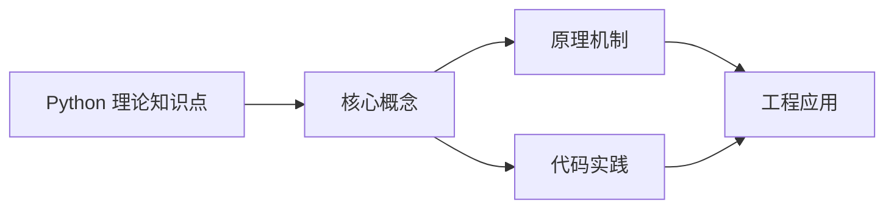
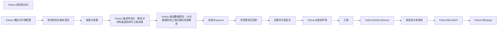

## 1. 学习目标（Bloom 分类）

本节按照布鲁姆教育目标分类学组织学习路径。本文主题为《Python 理论知识点》，属于 Python 模块，读者可以根据自身阶段选择阅读深度。

记忆层面：能够准确复述本文的核心概念、术语与基本语法或操作步骤，并能够在提问或检索时快速定位对应知识点。例如能够说出 Python 的动态类型、缩进语法与解释执行等基本特征。

理解层面：能够用自己的语言解释核心原理与工作机制，说明概念之间的因果关系，而不是机械记忆结论。例如能够解释解释器与编译器的差异，以及 GIL 对并发的影响。

应用层面：能够在真实项目或练习场景中运用本文知识解决具体问题，写出正确且可维护的实现。例如能够编写函数、类与标准库调用的完整脚本。

分析层面：能够拆解复杂问题，比较本文主题与相邻概念的异同，识别边界条件与例外情况。例如能够比较 Python 与 Java、Go 在类型系统与并发模型上的差异。

评价层面：能够根据约束条件（性能、可读性、安全、成本）评价不同方案的优劣，做出有依据的技术决策。例如能够评估不同实现方案（脚本、服务、库）的适用场景。

创造层面：能够把本文知识与其他模块知识组合，设计出新的解决方案或可复用的工程模式。例如能够组合标准库与第三方包设计完整的自动化工具。

通过本节学习，读者应当能够把《Python 理论知识点》纳入自己的知识网络，并与 Python 模块的其他主题（数据类型、函数、模块、异常、并发）建立关联。

## 2. 历史动机与发展脉络

《Python 理论知识点》是 Python 领域的重要主题。要真正理解它，需要先了解它解决的问题与演进过程。

Python 由 Guido van Rossum 于 1991 年首次发布，设计哲学强调代码可读性与开发效率，核心思想记录在《Python 之禅》（PEP 20）中：优美优于丑陋、明确优于隐晦、简单优于复杂。
Python 2 与 Python 3 的分裂期（2008-2020）是语言史上最重要的兼容性事件：Python 3 修复了字符串编码、整数除法等长期问题，但破坏性变更导致迁移缓慢；2020 年 1 月 Python 2 停止官方维护，社区全面转向 Python 3。
Python 3.9 至 3.13 的演进带来了类型提示增强（PEP 604 的 X | Y 语法、PEP 695 的泛型语法）、性能优化（3.11 的 faster-calls 与自适应解释器）以及异步生态的成熟（asyncio、FastAPI、httpx）。
Python 的应用版图从脚本自动化扩展到 Web 后端（Django、FastAPI）、数据科学（NumPy、Pandas、Matplotlib）、机器学习（PyTorch、scikit-learn）、运维自动化（Ansible）与科学计算，是当今最通用的编程语言之一。

回到本文主题：Python 理论知识点 的提出与成熟，正是上述技术背景下的必然产物。早期实现往往以简单可用为目标，随着工程规模扩大，社区逐渐沉淀出标准做法与最佳实践；理解这一脉络，可以帮助读者判断“为什么文档中的推荐写法是现在这个样子”，也能在遇到历史遗留代码时准确识别其设计年代与取舍。

对于初学者，理解 Python 的“电池内置”（标准库丰富）与“胶水语言”（易于调用 C/C++/Rust 扩展）两大特性，是判断其适用场景的基础。

## 3. 形式化定义与核心概念精讲

本节把《Python 理论知识点》涉及的核心概念以“定义 + 讲解”的形式展开。读者应把定义当作工具，把讲解当作理解路径；两者结合才能形成可迁移的知识。

变量与动态类型：Python 变量是对象的引用，类型属于对象而非变量；`isinstance()` 与 `type()` 用于运行时检查，类型注解（PEP 484）提供静态检查能力但不改变运行时行为。
缩进即语法：Python 用缩进表达代码块层次，避免了花括号噪声，也强制了代码排版一致性；同一代码块必须使用一致的空格数（官方推荐 4 空格）。
函数是一等公民：函数可以赋值、传参、返回，配合 lambda、装饰器与闭包，构成函数式编程能力的基础。
模块与包：每个 `.py` 文件是模块，目录加 `__init__.py` 是包；`import` 机制支持绝对导入、相对导入与命名空间包。
异常处理：`try/except/finally` 与 `raise` 构成错误传播体系；`with` 语句通过上下文管理器（`__enter__/__exit__`）管理资源生命周期。

### 3.1 原文章节逐一精讲

原文档把主题拆分为 5 个小节，下面按顺序给出每一节的导读讲解，随后保留原文细节供精读。

#### 原文精读（完整保留）


1. 线程获取 GIL
2. 执行一定数量的字节码（check interval，默认 100 条）或达到时间片（5ms）
3. 线程释放 GIL
4. 其他线程竞争获取 GIL
5. 原线程可能重新获取 GIL（非公平竞争）

```python
import sys
sys.getcheckinterval()  # 默认 100（字节码指令数）
sys.setcheckinterval(200)  # 设置检查间隔
```

##### GIL 对多线程的影响

| 场景       | GIL 影响                          | 推荐方案                      |
| ---------- | --------------------------------- | ----------------------------- |
| CPU 密集型 | 多线程无法并行，甚至比单线程慢    | 多进程（multiprocessing）     |
| I/O 密集型 | GIL 在 I/O 等待时释放，多线程有效 | 多线程（threading）或 asyncio |
| C 扩展     | 可手动释放 GIL                    | ctypes/Cython 中释放 GIL      |
| 混合型     | 部分并行                          | 线程池 + 进程池组合           |

CPU 密集型多线程反而更慢的原因：线程切换本身有开销，加上 GIL 的获取/释放竞争，增加了额外的时间消耗。

##### 绕过 GIL 的策略

1. **multiprocessing** -- 每个进程有独立的 GIL

   ```python
   from multiprocessing import Pool
   with Pool(4) as p:
       results = p.map(cpu_bound_func, data)
   ```

2. **C 扩展释放 GIL** -- 在 C 代码中手动释放

   ```c
   Py_BEGIN_ALLOW_THREADS
   // C 代码，不操作 Python 对象
   Py_END_ALLOW_THREADS
   ```

3. **concurrent.futures** -- 高层抽象

   ```python
   from concurrent.futures import ProcessPoolExecutor, ThreadPoolExecutor
   # CPU 密集用 ProcessPoolExecutor
   # I/O 密集用 ThreadPoolExecutor
   ```

4. **numpy/numba** -- 内部释放 GIL 的数值计算库

##### GIL 的未来

PEP 703 提议在 CPython 3.13+ 中提供可选的 free-threaded 模式（nogil），通过以下方式实现：

- 将引用计数改为偏向引用计数（biased reference counting）
- 对共享对象使用原子引用计数
- 引入内存安全机制替代 GIL 的保护作用

---

#### Python 字节码

##### 字节码执行模型

Python 代码的执行过程：

```
源代码(.py) --> 编译器 --> 字节码(.pyc) --> 虚拟机 --> 执行结果
```

CPython 虚拟机是一个基于栈的虚拟机，通过操作数栈（evaluation stack）执行计算。

##### 查看字节码

```python
import dis

def add(a, b):
    return a + b

dis.dis(add)
```

输出：

```
  2           0 LOAD_FAST                0 (a)
              2 LOAD_FAST                1 (b)
              4 BINARY_ADD
              6 RETURN_VALUE
```

##### 常见字节码指令

| 指令              | 说明               | 栈效果                     |
| ----------------- | ------------------ | -------------------------- |
| LOAD_CONST        | 加载常量到栈顶     | push                       |
| LOAD_FAST         | 加载局部变量到栈顶 | push                       |
| STORE_FAST        | 将栈顶存入局部变量 | pop                        |
| LOAD_GLOBAL       | 加载全局变量到栈顶 | push                       |
| LOAD_ATTR         | 加载对象属性到栈顶 | pop, push                  |
| BINARY_ADD        | 栈顶两元素相加     | pop x2, push               |
| BINARY_SUBSCR     | 下标访问 a[b]      | pop x2, push               |
| CALL_FUNCTION     | 调用函数           | pop args+func, push result |
| RETURN_VALUE      | 返回栈顶元素       | pop                        |
| COMPARE_OP        | 比较操作           | pop x2, push               |
| POP_JUMP_IF_FALSE | 条件跳转           | pop                        |
| FOR_ITER          | for 循环迭代       | push                       |

##### 字节码与性能

Python 每条字节码的执行涉及：

1. 解码指令
2. 分发到对应的处理函数
3. 操作数栈的 push/pop
4. GIL 检查

这些开销使得 Python 比 C 慢约 50-100 倍。JIT 编译器（如 PyPy）通过将热点字节码编译为机器码来消除这些开销。

##### .pyc 文件

Python 自动将编译后的字节码缓存到 `__pycache__` 目录下的 `.pyc` 文件中。缓存失效条件：

- 源文件的修改时间戳变化
- 源文件的大小变化
- Python 版本或魔法号（magic number）不匹配

---

#### 描述符协议（Descriptor Protocol）

##### 什么是描述符

描述符是实现了 `__get__`、`__set__` 或 `__delete__` 中任意一个方法的类。描述符允许自定义属性的访问、赋值和删除行为，是 Python 中最强大的特性之一。

##### 描述符的分类

| 类型         | 实现方法              | 典型用途                        |
| ------------ | --------------------- | ------------------------------- |
| 数据描述符   | `__get__` + `__set__` | property、类属性验证            |
| 非数据描述符 | 仅 `__get__`          | 方法、classmethod、staticmethod |

##### 描述符协议方法

```python
class Descriptor:
    def __get__(self, obj, objtype=None):
        # obj 为 None 时表示通过类访问
        # obj 不为 None 时表示通过实例访问
        if obj is None:
            return self
        return obj.__dict__.get(self.name)

    def __set__(self, obj, value):
        # 仅数据描述符需要实现
        obj.__dict__[self.name] = value

    def __delete__(self, obj):
        # 可选实现
        del obj.__dict__[self.name]

    def __set_name__(self, owner, name):
        # Python 3.6+，自动获取属性名
        self.name = name
```

##### 属性查找优先级

Python 属性查找的优先级顺序：

1. **数据描述符** -- 类中定义了 `__get__` 和 `__set__` 的描述符
2. **实例属性** -- `obj.__dict__` 中的属性
3. **非数据描述符** -- 类中仅定义了 `__get__` 的描述符
4. **`__getattr__`** -- 以上都未找到时调用

```python
class DataDescriptor:
    def __get__(self, obj, objtype=None):
        return "from data descriptor"
    def __set__(self, obj, value):
        pass

class NonDataDescriptor:
    def __get__(self, obj, objtype=None):
        return "from non-data descriptor"

class Example:
    data_desc = DataDescriptor()
    non_data_desc = NonDataDescriptor()

    def __init__(self):
        self.data_desc = "instance value"   # 被数据描述符拦截
        self.non_data_desc = "instance value" # 实例属性优先

e = Example()
print(e.data_desc)      # "from data descriptor"（数据描述符优先）
print(e.non_data_desc)  # "instance value"（实例属性优先于非数据描述符）
```

##### property 的本质

property 是数据描述符的语法糖：

```python
# 使用 property
class Circle:
    def __init__(self, radius):
        self._radius = radius

    @property
    def radius(self):
        return self._radius

    @radius.setter
    def radius(self, value):
        if value < 0:
            raise ValueError("Radius cannot be negative")
        self._radius = value

# 等价的手动描述符
class RadiusDescriptor:
    def __get__(self, obj, objtype=None):
        if obj is None:
            return self
        return obj._radius

    def __set__(self, obj, value):
        if value < 0:
            raise ValueError("Radius cannot be negative")
        obj._radius = value
```

##### 描述符的实际应用

1. **类型验证** -- 在 `__set__` 中检查赋值类型
2. **延迟计算** -- 在 `__get__` 中按需计算并缓存
3. **ORM 字段** -- SQLAlchemy/ Django Model 的字段定义
4. **信号/事件** -- 属性变化时触发回调
5. **访问控制** -- 实现只读属性、受保护属性

---

#### MRO（Method Resolution Order）

##### 什么是 MRO

MRO 是 Python 在多重继承中确定方法查找顺序的算法。Python 使用 C3 线性化算法计算 MRO，保证：

- 子类优先于父类
- 多个父类按定义顺序查找
- 单调性：子类的 MRO 不违反父类的 MRO

##### C3 线性化算法

C3 算法的递归定义：

```
L[C] = C + merge(L[B1], L[B2], ..., [B1, B2, ...])
```

merge 的规则：

1. 取第一个列表的头部（第一个元素）
2. 如果该头部不出现在任何其他列表的尾部，则将其加入结果，并从所有列表中移除
3. 否则，跳到下一个列表的头部，重复步骤 2
4. 如果所有列表都为空，则完成；如果无法选择任何头部，则报错（不一致的继承关系）

##### 示例

```python
class A: pass
class B(A): pass
class C(A): pass
class D(B, C): pass

# MRO:
# L[A] = [A, object]
# L[B] = [B] + merge(L[A], [A]) = [B, A, object]
# L[C] = [C] + merge(L[A], [A]) = [C, A, object]
# L[D] = [D] + merge(L[B], L[C], [B, C])
#       = [D] + merge([B, A, object], [C, A, object], [B, C])
#       = [D, B] + merge([A, object], [C, A, object], [C])
#       = [D, B, C] + merge([A, object], [A, object])
#       = [D, B, C, A, object]

print(D.__mro__)
# (<class 'D'>, <class 'B'>, <class 'C'>, <class 'A'>, <class 'object'>)
```

##### 钻石继承问题

```
    object
      |
      A
     / \
    B   C
     \ /
      D
```

Python 的 C3 线性化保证 D 的 MRO 为 D -> B -> C -> A -> object，避免了经典 MRO 中 A 被优先于 C 访问的问题。

##### 不合法的继承

```python
class X: pass
class Y(X): pass

class A(X, Y): pass  # TypeError: Cannot create a consistent MRO
# 因为 X 必须在 Y 之前（X 是 Y 的父类），但 A 的定义中 X 在 Y 之前
# 这违反了 Y 的 MRO 中 X 在 Y 之后的约束
```

---

#### 元类（Metaclass）

##### 什么是元类

元类是创建类的类。正如实例由类创建，类由元类创建。默认元类是 `type`。

```python
class MyClass:
    pass

# 等价于
MyClass = type("MyClass", (), {})
```

##### type 的三参数形式

```python
type(name, bases, dict)
# name: 类名
# bases: 基类元组
# dict: 类属性字典

MyClass = type(
    "MyClass",
    (BaseClass,),
    {"x": 10, "method": lambda self: self.x}
)
```

##### 自定义元类

```python
class Meta(type):
    def __new__(mcs, name, bases, namespace):
        # 在类创建之前修改类定义
        print(f"Creating class {name}")
        namespace["class_id"] = id(mcs)
        cls = super().__new__(mcs, name, bases, namespace)
        return cls

    def __init__(cls, name, bases, namespace):
        # 在类创建之后初始化
        super().__init__(name, bases, namespace)

    def __call__(cls, *args, **kwargs):
        # 控制实例创建过程（类似单例模式）
        print(f"Creating instance of {cls.__name__}")
        return super().__call__(*args, **kwargs)

class MyClass(metaclass=Meta):
    def __init__(self):
        self.value = 42
```

##### 元类的执行顺序

当 Python 遇到 `class MyClass(metaclass=Meta):` 时：

1. 收集基类和类属性到 namespace
2. 调用 `Meta.__prepare__()` 创建 namespace（可选，返回自定义映射）
3. 调用 `Meta.__new__(mcs, name, bases, namespace)` 创建类对象
4. 调用 `Meta.__init__(cls, name, bases, namespace)` 初始化类对象
5. 类创建完成

##### 元类的实际应用

1. **单例模式**

   ```python
   class SingletonMeta(type):
       _instances = {}
       def __call__(cls, *args, **kwargs):
           if cls not in cls._instances:
               cls._instances[cls] = super().__call__(*args, **kwargs)
           return cls._instances[cls]

   class Database(metaclass=SingletonMeta):
       pass
   ```

2. **注册模式** -- 自动注册子类

   ```python
   class PluginMeta(type):
       registry = {}
       def __init__(cls, name, bases, namespace):
           super().__init__(name, bases, namespace)
           if name != "Plugin":
               PluginMeta.registry[name] = cls

   class Plugin(metaclass=PluginMeta):
       pass
   ```

3. **接口验证** -- 检查子类是否实现了所有抽象方法
4. **ORM 映射** -- Django Model 的元类将字段定义转换为数据库映射
5. **API 框架** -- 自动收集路由和视图函数

##### 元类 vs 类装饰器

| 特性     | 元类             | 类装饰器         |
| -------- | ---------------- | ---------------- |
| 作用时机 | 类创建时         | 类创建后         |
| 继承性   | 子类自动继承元类 | 子类不继承装饰器 |
| 复杂度   | 高               | 低               |
| 适用场景 | 框架级抽象       | 简单的类修改     |

优先使用类装饰器，仅在需要继承行为时使用元类。

---

#### 理论速查表

| 概念     | 核心要点                                     | 关键细节                              |
| -------- | -------------------------------------------- | ------------------------------------- |
| GIL      | 全局解释器锁，同一时刻只有一个线程执行字节码 | CPU 密集用多进程，I/O 密集用多线程    |
| 字节码   | CPython 基于栈的虚拟机指令                   | `dis.dis()` 查看，`.pyc` 缓存         |
| 描述符   | `__get__`/`__set__`/`__delete__` 协议        | 数据描述符优先于实例属性              |
| MRO      | C3 线性化算法确定方法查找顺序                | `ClassName.__mro__` 查看              |
| 元类     | 创建类的类，默认为 `type`                    | `__new__` -> `__init__` -> `__call__` |
| 引用计数 | CPython 的主要 GC 机制                       | 循环引用由分代 GC 处理                |
| 名称修饰 | `__attr` 变为 `_ClassName__attr`             | 仅双下划线前缀触发，防止子类覆盖      |
| 协程     | async/await 基于生成器实现                   | 事件循环调度，非抢占式                |


### 3.2 概念关系图

下面用 Mermaid 图表达本文核心概念之间的关系，帮助读者建立整体图景：



图中展示的是本文知识的结构化关系：核心概念是入口，原理机制解释“为什么”，代码实践演示“怎么做”，工程应用回答“何时用”。读者学习时可以把每个小节的内容挂接到对应节点上。

## 4. 理论推导与原理解析

本节深入《Python 理论知识点》背后的原理。理论部分不求面面俱到，而是聚焦“能解释现象、能指导实践”的关键推导。

解释执行与字节码：CPython 先把源码编译为字节码（.pyc），再由虚拟机逐条执行。字节码是平台无关的中间表示，因此 Python 程序可以跨平台运行，但执行速度低于编译型语言；性能敏感路径可用 C 扩展或 Cython 加速。
GIL（全局解释器锁）：CPython 的 GIL 保证同一时刻只有一个线程执行字节码，简化了内存管理，但限制了 CPU 密集型多线程并行；I/O 密集型任务通过线程切换获得并发，CPU 密集型任务应使用多进程（multiprocessing）或异步。
引用计数与垃圾回收：Python 对象通过引用计数管理生命周期，循环引用由分代垃圾回收器（gc 模块）处理。理解这一模型可以解释“为什么局部变量及时释放内存”“为什么大对象需要 del 或作用域退出”。
鸭子类型与协议：Python 依赖行为协议而非继承体系，例如实现 `__iter__` 与 `__next__` 的对象即可用于 `for` 循环。这一设计带来灵活性的同时，也要求开发者编写清晰的接口文档与类型注解。

需要强调的是，理论推导与工程实践之间存在翻译层：理论给出的是理想化模型与边界条件，工程代码则必须处理真实环境中的例外。读者在学习时应先掌握理论的“标准情形”，再通过陷阱章节了解“非标准情形”。

## 5. 代码示例与逐行讲解

本节把原文中的代码示例系统整理，并为每个示例补充用途说明与讲解。读者不应只浏览代码，而应逐段对照讲解理解设计意图。

### 5.1 示例：概述

该示例来自原文《概述》小节，用于演示Python 理论知识点相关操作。阅读时请先看代码结构，再看其后的讲解。

```python
import sys
sys.getcheckinterval()  # 默认 100（字节码指令数）
sys.setcheckinterval(200)  # 设置检查间隔
```

讲解：这段代码演示了本节核心知识点。代码中的关键操作可以归纳为三步：准备（定义或初始化）、执行（核心逻辑）、收尾（释放资源或返回结果）。实际项目中，这三步往往被封装为函数或类，以提升复用性与可测试性。

关键点分析：

该示例共 3 行有效代码，包含 1 类关键结构（import）。其中：

- 入口与初始化部分负责建立上下文，对应实际项目中的启动或装配逻辑；
- 核心逻辑部分体现本文主题的主要操作，是阅读时最需要对照讲解理解的部分；
- 输出或返回部分把结果交给调用方，注意其类型与边界条件。

进阶思考路径：先尝试修改参数观察行为变化，再把示例中的模式迁移到自己的项目中；每次修改都记录预期与实测差异，这是把示例转化为能力的最快方式。

### 5.2 示例：字节码执行模型

该示例来自原文《字节码执行模型》小节，用于演示Python 理论知识点相关操作。阅读时请先看代码结构，再看其后的讲解。

```text
源代码(.py) --> 编译器 --> 字节码(.pyc) --> 虚拟机 --> 执行结果
```

讲解：这段代码演示了本节核心知识点。代码中的关键操作可以归纳为三步：准备（定义或初始化）、执行（核心逻辑）、收尾（释放资源或返回结果）。实际项目中，这三步往往被封装为函数或类，以提升复用性与可测试性。

关键点分析：

该示例共 1 行有效代码，结构以数据或配置为主。阅读时应关注：数据字段的含义、配置项的作用，以及它们与运行行为的对应关系。

进阶思考路径：先尝试修改参数观察行为变化，再把示例中的模式迁移到自己的项目中；每次修改都记录预期与实测差异，这是把示例转化为能力的最快方式。

### 5.3 示例：查看字节码

该示例来自原文《查看字节码》小节，用于演示Python 理论知识点相关操作。阅读时请先看代码结构，再看其后的讲解。

```python
import dis

def add(a, b):
    return a + b

dis.dis(add)
```

讲解：这段代码演示了本节核心知识点。代码中的关键操作可以归纳为三步：准备（定义或初始化）、执行（核心逻辑）、收尾（释放资源或返回结果）。实际项目中，这三步往往被封装为函数或类，以提升复用性与可测试性。

关键点分析：

该示例共 4 行有效代码，包含 3 类关键结构（def、import、return）。其中：

- 入口与初始化部分负责建立上下文，对应实际项目中的启动或装配逻辑；
- 核心逻辑部分体现本文主题的主要操作，是阅读时最需要对照讲解理解的部分；
- 输出或返回部分把结果交给调用方，注意其类型与边界条件。

进阶思考路径：先尝试修改参数观察行为变化，再把示例中的模式迁移到自己的项目中；每次修改都记录预期与实测差异，这是把示例转化为能力的最快方式。

### 5.4 示例：查看字节码

该示例来自原文《查看字节码》小节，用于演示Python 理论知识点相关操作。阅读时请先看代码结构，再看其后的讲解。

```text
  2           0 LOAD_FAST                0 (a)
              2 LOAD_FAST                1 (b)
              4 BINARY_ADD
              6 RETURN_VALUE
```

讲解：这段代码演示了本节核心知识点。代码中的关键操作可以归纳为三步：准备（定义或初始化）、执行（核心逻辑）、收尾（释放资源或返回结果）。实际项目中，这三步往往被封装为函数或类，以提升复用性与可测试性。

关键点分析：

该示例共 4 行有效代码，结构以数据或配置为主。阅读时应关注：数据字段的含义、配置项的作用，以及它们与运行行为的对应关系。

进阶思考路径：先尝试修改参数观察行为变化，再把示例中的模式迁移到自己的项目中；每次修改都记录预期与实测差异，这是把示例转化为能力的最快方式。

### 5.5 示例：描述符协议方法

该示例来自原文《描述符协议方法》小节，用于演示Python 理论知识点相关操作。阅读时请先看代码结构，再看其后的讲解。

```python
class Descriptor:
    def __get__(self, obj, objtype=None):
        # obj 为 None 时表示通过类访问
        # obj 不为 None 时表示通过实例访问
        if obj is None:
            return self
        return obj.__dict__.get(self.name)

    def __set__(self, obj, value):
        # 仅数据描述符需要实现
        obj.__dict__[self.name] = value

    def __delete__(self, obj):
        # 可选实现
        del obj.__dict__[self.name]

    def __set_name__(self, owner, name):
        # Python 3.6+，自动获取属性名
        self.name = name
```

讲解：这段代码演示了本节核心知识点。代码中的关键操作可以归纳为三步：准备（定义或初始化）、执行（核心逻辑）、收尾（释放资源或返回结果）。实际项目中，这三步往往被封装为函数或类，以提升复用性与可测试性。

关键点分析：

该示例共 16 行有效代码，包含 4 类关键结构（class、def、if、return）。其中：

- 入口与初始化部分负责建立上下文，对应实际项目中的启动或装配逻辑；
- 核心逻辑部分体现本文主题的主要操作，是阅读时最需要对照讲解理解的部分；
- 输出或返回部分把结果交给调用方，注意其类型与边界条件。

进阶思考路径：先尝试修改参数观察行为变化，再把示例中的模式迁移到自己的项目中；每次修改都记录预期与实测差异，这是把示例转化为能力的最快方式。

### 5.6 示例：属性查找优先级

该示例来自原文《属性查找优先级》小节，用于演示Python 理论知识点相关操作。阅读时请先看代码结构，再看其后的讲解。

```python
class DataDescriptor:
    def __get__(self, obj, objtype=None):
        return "from data descriptor"
    def __set__(self, obj, value):
        pass

class NonDataDescriptor:
    def __get__(self, obj, objtype=None):
        return "from non-data descriptor"

class Example:
    data_desc = DataDescriptor()
    non_data_desc = NonDataDescriptor()

    def __init__(self):
        self.data_desc = "instance value"   # 被数据描述符拦截
        self.non_data_desc = "instance value" # 实例属性优先

e = Example()
print(e.data_desc)      # "from data descriptor"（数据描述符优先）
print(e.non_data_desc)  # "instance value"（实例属性优先于非数据描述符）
```

讲解：这段代码演示了本节核心知识点。代码中的关键操作可以归纳为三步：准备（定义或初始化）、执行（核心逻辑）、收尾（释放资源或返回结果）。实际项目中，这三步往往被封装为函数或类，以提升复用性与可测试性。

关键点分析：

该示例共 17 行有效代码，包含 4 类关键结构（class、def、from、return）。其中：

- 入口与初始化部分负责建立上下文，对应实际项目中的启动或装配逻辑；
- 核心逻辑部分体现本文主题的主要操作，是阅读时最需要对照讲解理解的部分；
- 输出或返回部分把结果交给调用方，注意其类型与边界条件。

进阶思考路径：先尝试修改参数观察行为变化，再把示例中的模式迁移到自己的项目中；每次修改都记录预期与实测差异，这是把示例转化为能力的最快方式。

### 5.7 示例：property 的本质

该示例来自原文《property 的本质》小节，用于演示Python 理论知识点相关操作。阅读时请先看代码结构，再看其后的讲解。

```python
# 使用 property
class Circle:
    def __init__(self, radius):
        self._radius = radius

    @property
    def radius(self):
        return self._radius

    @radius.setter
    def radius(self, value):
        if value < 0:
            raise ValueError("Radius cannot be negative")
        self._radius = value

# 等价的手动描述符
class RadiusDescriptor:
    def __get__(self, obj, objtype=None):
        if obj is None:
            return self
        return obj._radius

    def __set__(self, obj, value):
        if value < 0:
            raise ValueError("Radius cannot be negative")
        obj._radius = value
```

讲解：这段代码演示了本节核心知识点。代码中的关键操作可以归纳为三步：准备（定义或初始化）、执行（核心逻辑）、收尾（释放资源或返回结果）。实际项目中，这三步往往被封装为函数或类，以提升复用性与可测试性。

关键点分析：

该示例共 22 行有效代码，包含 4 类关键结构（class、def、if、return）。其中：

- 入口与初始化部分负责建立上下文，对应实际项目中的启动或装配逻辑；
- 核心逻辑部分体现本文主题的主要操作，是阅读时最需要对照讲解理解的部分；
- 输出或返回部分把结果交给调用方，注意其类型与边界条件。

进阶思考路径：先尝试修改参数观察行为变化，再把示例中的模式迁移到自己的项目中；每次修改都记录预期与实测差异，这是把示例转化为能力的最快方式。

### 5.8 示例：C3 线性化算法

该示例来自原文《C3 线性化算法》小节，用于演示Python 理论知识点相关操作。阅读时请先看代码结构，再看其后的讲解。

```text
L[C] = C + merge(L[B1], L[B2], ..., [B1, B2, ...])
```

讲解：这段代码演示了本节核心知识点。代码中的关键操作可以归纳为三步：准备（定义或初始化）、执行（核心逻辑）、收尾（释放资源或返回结果）。实际项目中，这三步往往被封装为函数或类，以提升复用性与可测试性。

关键点分析：

该示例共 1 行有效代码，结构以数据或配置为主。阅读时应关注：数据字段的含义、配置项的作用，以及它们与运行行为的对应关系。

进阶思考路径：先尝试修改参数观察行为变化，再把示例中的模式迁移到自己的项目中；每次修改都记录预期与实测差异，这是把示例转化为能力的最快方式。

### 5.9 示例：示例

该示例来自原文《示例》小节，用于演示Python 理论知识点相关操作。阅读时请先看代码结构，再看其后的讲解。

```python
class A: pass
class B(A): pass
class C(A): pass
class D(B, C): pass

# MRO:
# L[A] = [A, object]
# L[B] = [B] + merge(L[A], [A]) = [B, A, object]
# L[C] = [C] + merge(L[A], [A]) = [C, A, object]
# L[D] = [D] + merge(L[B], L[C], [B, C])
#       = [D] + merge([B, A, object], [C, A, object], [B, C])
#       = [D, B] + merge([A, object], [C, A, object], [C])
#       = [D, B, C] + merge([A, object], [A, object])
#       = [D, B, C, A, object]

print(D.__mro__)
# (<class 'D'>, <class 'B'>, <class 'C'>, <class 'A'>, <class 'object'>)
```

讲解：这段代码演示了本节核心知识点。代码中的关键操作可以归纳为三步：准备（定义或初始化）、执行（核心逻辑）、收尾（释放资源或返回结果）。实际项目中，这三步往往被封装为函数或类，以提升复用性与可测试性。

关键点分析：

该示例共 15 行有效代码，包含 1 类关键结构（class）。其中：

- 入口与初始化部分负责建立上下文，对应实际项目中的启动或装配逻辑；
- 核心逻辑部分体现本文主题的主要操作，是阅读时最需要对照讲解理解的部分；
- 输出或返回部分把结果交给调用方，注意其类型与边界条件。

进阶思考路径：先尝试修改参数观察行为变化，再把示例中的模式迁移到自己的项目中；每次修改都记录预期与实测差异，这是把示例转化为能力的最快方式。

### 5.10 示例：钻石继承问题

该示例来自原文《钻石继承问题》小节，用于演示Python 理论知识点相关操作。阅读时请先看代码结构，再看其后的讲解。

```text
    object
      |
      A
     / \
    B   C
     \ /
      D
```

讲解：这段代码演示了本节核心知识点。代码中的关键操作可以归纳为三步：准备（定义或初始化）、执行（核心逻辑）、收尾（释放资源或返回结果）。实际项目中，这三步往往被封装为函数或类，以提升复用性与可测试性。

关键点分析：

该示例共 7 行有效代码，结构以数据或配置为主。阅读时应关注：数据字段的含义、配置项的作用，以及它们与运行行为的对应关系。

进阶思考路径：先尝试修改参数观察行为变化，再把示例中的模式迁移到自己的项目中；每次修改都记录预期与实测差异，这是把示例转化为能力的最快方式。

### 5.11 示例：不合法的继承

该示例来自原文《不合法的继承》小节，用于演示Python 理论知识点相关操作。阅读时请先看代码结构，再看其后的讲解。

```python
class X: pass
class Y(X): pass

class A(X, Y): pass  # TypeError: Cannot create a consistent MRO
# 因为 X 必须在 Y 之前（X 是 Y 的父类），但 A 的定义中 X 在 Y 之前
# 这违反了 Y 的 MRO 中 X 在 Y 之后的约束
```

讲解：这段代码演示了本节核心知识点。代码中的关键操作可以归纳为三步：准备（定义或初始化）、执行（核心逻辑）、收尾（释放资源或返回结果）。实际项目中，这三步往往被封装为函数或类，以提升复用性与可测试性。

关键点分析：

该示例共 5 行有效代码，包含 1 类关键结构（class）。其中：

- 入口与初始化部分负责建立上下文，对应实际项目中的启动或装配逻辑；
- 核心逻辑部分体现本文主题的主要操作，是阅读时最需要对照讲解理解的部分；
- 输出或返回部分把结果交给调用方，注意其类型与边界条件。

进阶思考路径：先尝试修改参数观察行为变化，再把示例中的模式迁移到自己的项目中；每次修改都记录预期与实测差异，这是把示例转化为能力的最快方式。

### 5.12 示例：什么是元类

该示例来自原文《什么是元类》小节，用于演示Python 理论知识点相关操作。阅读时请先看代码结构，再看其后的讲解。

```python
class MyClass:
    pass

# 等价于
MyClass = type("MyClass", (), {})
```

讲解：这段代码演示了本节核心知识点。代码中的关键操作可以归纳为三步：准备（定义或初始化）、执行（核心逻辑）、收尾（释放资源或返回结果）。实际项目中，这三步往往被封装为函数或类，以提升复用性与可测试性。

关键点分析：

该示例共 4 行有效代码，包含 1 类关键结构（class）。其中：

- 入口与初始化部分负责建立上下文，对应实际项目中的启动或装配逻辑；
- 核心逻辑部分体现本文主题的主要操作，是阅读时最需要对照讲解理解的部分；
- 输出或返回部分把结果交给调用方，注意其类型与边界条件。

进阶思考路径：先尝试修改参数观察行为变化，再把示例中的模式迁移到自己的项目中；每次修改都记录预期与实测差异，这是把示例转化为能力的最快方式。

### 5.13 示例：type 的三参数形式

该示例来自原文《type 的三参数形式》小节，用于演示Python 理论知识点相关操作。阅读时请先看代码结构，再看其后的讲解。

```python
type(name, bases, dict)
# name: 类名
# bases: 基类元组
# dict: 类属性字典

MyClass = type(
    "MyClass",
    (BaseClass,),
    {"x": 10, "method": lambda self: self.x}
)
```

讲解：这段代码演示了本节核心知识点。代码中的关键操作可以归纳为三步：准备（定义或初始化）、执行（核心逻辑）、收尾（释放资源或返回结果）。实际项目中，这三步往往被封装为函数或类，以提升复用性与可测试性。

关键点分析：

该示例共 9 行有效代码，结构以数据或配置为主。阅读时应关注：数据字段的含义、配置项的作用，以及它们与运行行为的对应关系。

进阶思考路径：先尝试修改参数观察行为变化，再把示例中的模式迁移到自己的项目中；每次修改都记录预期与实测差异，这是把示例转化为能力的最快方式。

### 5.14 示例：自定义元类

该示例来自原文《自定义元类》小节，用于演示Python 理论知识点相关操作。阅读时请先看代码结构，再看其后的讲解。

```python
class Meta(type):
    def __new__(mcs, name, bases, namespace):
        # 在类创建之前修改类定义
        print(f"Creating class {name}")
        namespace["class_id"] = id(mcs)
        cls = super().__new__(mcs, name, bases, namespace)
        return cls

    def __init__(cls, name, bases, namespace):
        # 在类创建之后初始化
        super().__init__(name, bases, namespace)

    def __call__(cls, *args, **kwargs):
        # 控制实例创建过程（类似单例模式）
        print(f"Creating instance of {cls.__name__}")
        return super().__call__(*args, **kwargs)

class MyClass(metaclass=Meta):
    def __init__(self):
        self.value = 42
```

讲解：这段代码演示了本节核心知识点。代码中的关键操作可以归纳为三步：准备（定义或初始化）、执行（核心逻辑）、收尾（释放资源或返回结果）。实际项目中，这三步往往被封装为函数或类，以提升复用性与可测试性。

关键点分析：

该示例共 17 行有效代码，包含 3 类关键结构（class、def、return）。其中：

- 入口与初始化部分负责建立上下文，对应实际项目中的启动或装配逻辑；
- 核心逻辑部分体现本文主题的主要操作，是阅读时最需要对照讲解理解的部分；
- 输出或返回部分把结果交给调用方，注意其类型与边界条件。

进阶思考路径：先尝试修改参数观察行为变化，再把示例中的模式迁移到自己的项目中；每次修改都记录预期与实测差异，这是把示例转化为能力的最快方式。

```python
from pathlib import Path

def count_files(root: Path) -> dict[str, int]:
    """统计目录下各扩展名文件数量。"""
    counter: dict[str, int] = {}
    for p in root.rglob('*'):  # 递归遍历所有路径
        if p.is_file():
            ext = p.suffix.lower() or '(无扩展名)'
            counter[ext] = counter.get(ext, 0) + 1
    return counter
```
讲解：`rglob('*')` 返回生成器，逐个处理文件避免一次性加载全部路径；`suffix.lower()` 统一大小写；`dict.get(ext, 0)` 实现计数累加。这是 Python 文件处理的通用骨架。

综合以上示例，可以总结出本主题的代码实践要点：第一，先定义清晰的输入输出契约；第二，核心逻辑保持单一职责；第三，错误处理与边界条件不可省略；第四，命名与注释表达意图而非复述代码。

## 6. 对比分析

对比是理解《Python 理论知识点》定位的最快路径。下面从多个维度与相邻方案进行对比。

Python 与 Java 对比：Python 动态类型开发快、代码短；Java 静态类型编译期检查强、适合大型长期项目。Python 的 GIL 限制多线程并行，Java 的线程模型更成熟。
Python 与 Go 对比：Go 的 goroutine 与 channel 在并发编程上更直接，编译为单一二进制部署简单；Python 生态更丰富，AI 与数据领域占绝对优势。
Python 2 与 Python 3 对比：Python 3 的 `print()` 函数、`str/bytes` 分离、整除语义 `//`、f-string 与类型注解是主要差异；新代码一律使用 Python 3。

对比的目的不是分出绝对优劣，而是建立选择依据：不同约束条件下，最优解不同。读者应把每个对比维度转化为决策检查清单。

## 7. 常见陷阱与最佳实践

本节整理该主题的高频错误与推荐做法。每个陷阱先描述现象，再解释原因，最后给出最佳实践。

### 7.1 可变默认参数

`def f(x, lst=[])` 中默认列表在函数定义时创建一次，多次调用共享同一对象。最佳实践：默认值用 `None`，函数内创建新对象。

深入讲解：该问题之所以被归类为“常见陷阱”，是因为它在初学者的代码中反复出现，而且往往不在第一时间暴露——错误通常隐藏在特定数据或特定时序下。

从成因上看，可变默认参数 一般源于对 Python 某个机制的理解偏差：要么误用了默认行为，要么忽略了边界条件，要么把其他语言的思维惯性带了过来。

从影响上看，可变默认参数 轻则产生错误结果，重则导致资源泄漏、数据损坏或安全事故；这也是为什么工程评审中会把它列为检查项。

从修复策略上看，处理可变默认参数的正确顺序是：先复现（构造最小用例），再定位（确认机制层面的根因），最后修复并补充回归测试。跳过复现直接改代码，往往治标不治本。

### 7.2 浅拷贝陷阱

`list.copy()`、切片与 `dict.copy()` 都是浅拷贝，嵌套可变对象仍共享。需要深拷贝时使用 `copy.deepcopy()`，或明确设计不可变结构。

深入讲解：该问题之所以被归类为“常见陷阱”，是因为它在初学者的代码中反复出现，而且往往不在第一时间暴露——错误通常隐藏在特定数据或特定时序下。

从成因上看，浅拷贝陷阱 一般源于对 Python 某个机制的理解偏差：要么误用了默认行为，要么忽略了边界条件，要么把其他语言的思维惯性带了过来。

从影响上看，浅拷贝陷阱 轻则产生错误结果，重则导致资源泄漏、数据损坏或安全事故；这也是为什么工程评审中会把它列为检查项。

从修复策略上看，处理浅拷贝陷阱的正确顺序是：先复现（构造最小用例），再定位（确认机制层面的根因），最后修复并补充回归测试。跳过复现直接改代码，往往治标不治本。

### 7.3 字符串拼接性能

循环内使用 `+` 拼接字符串产生大量中间对象，复杂度为 O(n²)。最佳实践：使用列表收集后 `''.join()`。

深入讲解：该问题之所以被归类为“常见陷阱”，是因为它在初学者的代码中反复出现，而且往往不在第一时间暴露——错误通常隐藏在特定数据或特定时序下。

从成因上看，字符串拼接性能 一般源于对 Python 某个机制的理解偏差：要么误用了默认行为，要么忽略了边界条件，要么把其他语言的思维惯性带了过来。

从影响上看，字符串拼接性能 轻则产生错误结果，重则导致资源泄漏、数据损坏或安全事故；这也是为什么工程评审中会把它列为检查项。

从修复策略上看，处理字符串拼接性能的正确顺序是：先复现（构造最小用例），再定位（确认机制层面的根因），最后修复并补充回归测试。跳过复现直接改代码，往往治标不治本。

### 7.4 浮点精度

二进制浮点无法精确表示 0.1，金额计算应使用 `decimal.Decimal` 或整数分。

深入讲解：该问题之所以被归类为“常见陷阱”，是因为它在初学者的代码中反复出现，而且往往不在第一时间暴露——错误通常隐藏在特定数据或特定时序下。

从成因上看，浮点精度 一般源于对 Python 某个机制的理解偏差：要么误用了默认行为，要么忽略了边界条件，要么把其他语言的思维惯性带了过来。

从影响上看，浮点精度 轻则产生错误结果，重则导致资源泄漏、数据损坏或安全事故；这也是为什么工程评审中会把它列为检查项。

从修复策略上看，处理浮点精度的正确顺序是：先复现（构造最小用例），再定位（确认机制层面的根因），最后修复并补充回归测试。跳过复现直接改代码，往往治标不治本。

### 7.5 循环中修改列表

遍历列表时删除或插入元素会导致跳过或重复。最佳实践：构造新列表或倒序遍历。

深入讲解：该问题之所以被归类为“常见陷阱”，是因为它在初学者的代码中反复出现，而且往往不在第一时间暴露——错误通常隐藏在特定数据或特定时序下。

从成因上看，循环中修改列表 一般源于对 Python 某个机制的理解偏差：要么误用了默认行为，要么忽略了边界条件，要么把其他语言的思维惯性带了过来。

从影响上看，循环中修改列表 轻则产生错误结果，重则导致资源泄漏、数据损坏或安全事故；这也是为什么工程评审中会把它列为检查项。

从修复策略上看，处理循环中修改列表的正确顺序是：先复现（构造最小用例），再定位（确认机制层面的根因），最后修复并补充回归测试。跳过复现直接改代码，往往治标不治本。

### 7.6 全局变量滥用

`global` 声明使函数产生隐藏依赖，难以测试。最佳实践：通过参数传递与返回值交换数据。

深入讲解：该问题之所以被归类为“常见陷阱”，是因为它在初学者的代码中反复出现，而且往往不在第一时间暴露——错误通常隐藏在特定数据或特定时序下。

从成因上看，全局变量滥用 一般源于对 Python 某个机制的理解偏差：要么误用了默认行为，要么忽略了边界条件，要么把其他语言的思维惯性带了过来。

从影响上看，全局变量滥用 轻则产生错误结果，重则导致资源泄漏、数据损坏或安全事故；这也是为什么工程评审中会把它列为检查项。

从修复策略上看，处理全局变量滥用的正确顺序是：先复现（构造最小用例），再定位（确认机制层面的根因），最后修复并补充回归测试。跳过复现直接改代码，往往治标不治本。

### 7.7 异常吞掉

`except: pass` 隐藏错误导致调试困难。最佳实践：捕获具体异常类型，记录日志，必要时重新抛出。

深入讲解：该问题之所以被归类为“常见陷阱”，是因为它在初学者的代码中反复出现，而且往往不在第一时间暴露——错误通常隐藏在特定数据或特定时序下。

从成因上看，异常吞掉 一般源于对 Python 某个机制的理解偏差：要么误用了默认行为，要么忽略了边界条件，要么把其他语言的思维惯性带了过来。

从影响上看，异常吞掉 轻则产生错误结果，重则导致资源泄漏、数据损坏或安全事故；这也是为什么工程评审中会把它列为检查项。

从修复策略上看，处理异常吞掉的正确顺序是：先复现（构造最小用例），再定位（确认机制层面的根因），最后修复并补充回归测试。跳过复现直接改代码，往往治标不治本。

### 7.8 时间与时区

`datetime.now()` 返回本地时间，跨时区存储应使用 UTC。最佳实践：存储 UTC，展示时转本地。

深入讲解：该问题之所以被归类为“常见陷阱”，是因为它在初学者的代码中反复出现，而且往往不在第一时间暴露——错误通常隐藏在特定数据或特定时序下。

从成因上看，时间与时区 一般源于对 Python 某个机制的理解偏差：要么误用了默认行为，要么忽略了边界条件，要么把其他语言的思维惯性带了过来。

从影响上看，时间与时区 轻则产生错误结果，重则导致资源泄漏、数据损坏或安全事故；这也是为什么工程评审中会把它列为检查项。

从修复策略上看，处理时间与时区的正确顺序是：先复现（构造最小用例），再定位（确认机制层面的根因），最后修复并补充回归测试。跳过复现直接改代码，往往治标不治本。

### 7.9 版本与依赖

全局环境安装依赖导致版本冲突。最佳实践：使用 venv/uv/poetry 管理虚拟环境与锁定文件。

深入讲解：该问题之所以被归类为“常见陷阱”，是因为它在初学者的代码中反复出现，而且往往不在第一时间暴露——错误通常隐藏在特定数据或特定时序下。

从成因上看，版本与依赖 一般源于对 Python 某个机制的理解偏差：要么误用了默认行为，要么忽略了边界条件，要么把其他语言的思维惯性带了过来。

从影响上看，版本与依赖 轻则产生错误结果，重则导致资源泄漏、数据损坏或安全事故；这也是为什么工程评审中会把它列为检查项。

从修复策略上看，处理版本与依赖的正确顺序是：先复现（构造最小用例），再定位（确认机制层面的根因），最后修复并补充回归测试。跳过复现直接改代码，往往治标不治本。

### 7.10 性能过早优化

在没有基准测试的情况下优化反而降低可读性。最佳实践：先 profile（cProfile）定位热点，再针对性优化。

深入讲解：该问题之所以被归类为“常见陷阱”，是因为它在初学者的代码中反复出现，而且往往不在第一时间暴露——错误通常隐藏在特定数据或特定时序下。

从成因上看，性能过早优化 一般源于对 Python 某个机制的理解偏差：要么误用了默认行为，要么忽略了边界条件，要么把其他语言的思维惯性带了过来。

从影响上看，性能过早优化 轻则产生错误结果，重则导致资源泄漏、数据损坏或安全事故；这也是为什么工程评审中会把它列为检查项。

从修复策略上看，处理性能过早优化的正确顺序是：先复现（构造最小用例），再定位（确认机制层面的根因），最后修复并补充回归测试。跳过复现直接改代码，往往治标不治本。

### 7.0 最佳实践总览

1. 遵循 PEP 8 命名规范：模块与函数小写下划线，类用驼峰，常量全大写。
2. 使用类型注解（`def f(x: int) -> str`）配合 mypy/pyright 静态检查。
3. 函数保持单一职责并控制参数数量，超过 3 个参数考虑数据类。
4. 用 `if __name__ == "__main__":` 保护入口，保证模块可导入。
5. 资源使用 with 语句管理；日志使用 logging 模块而非 print。
6. 测试使用 pytest，覆盖正常、边界与异常路径。

把这些最佳实践固化为团队规范与代码评审检查项，是避免同类问题反复出现的关键。

## 8. 工程实践

本节把《Python 理论知识点》放入真实工程场景，给出可复用的模式与组织方法。

项目结构：src 布局（`src/` 下放包）与 flat 布局（包在根目录）各有优劣，配合 pyproject.toml 与 hatchling/setuptools 声明元数据。
依赖管理：pyproject.toml 是 PEP 621 标准入口，uv 提供极快的解析与安装；锁定文件保证可复现构建。
测试与 CI：pytest + coverage 度量，GitHub Actions 在矩阵（多版本 Python、多操作系统）上运行测试与 lint（ruff）。
打包发布：构建 wheel（`python -m build`），发布到 PyPI；私有包可用内部索引或直接引用 git 依赖。

### 8.1 工程实践的原则拆解

以上工程实践可以归纳为四条原则。第一，配置与代码分离：Python 项目中环境差异应通过配置注入，而不是散落在代码分支中；这保证同一份代码可以在开发、测试、生产环境一致运行。

第二，接口稳定优先：对外接口（函数签名、协议、数据格式）一旦被消费方依赖，变更成本极高；设计时应预留扩展点并保持向后兼容。

第三，可观测性内置：日志、指标与追踪应该在功能开发时同步设计，而不是故障发生后补救；没有观测手段的模块等于黑盒。

第四，变更可回滚：任何发布都应有对应的回滚方案；数据库迁移、配置变更与代码发布一样需要版本管理与逆向路径。

### 8.2 实践落地的检查清单

- [ ] 项目结构：对照本节描述，检查当前项目是否已经落实；未落实的项列入技术债并排期处理。
- [ ] 依赖管理：对照本节描述，检查当前项目是否已经落实；未落实的项列入技术债并排期处理。
- [ ] 测试与 CI：对照本节描述，检查当前项目是否已经落实；未落实的项列入技术债并排期处理。
- [ ] 打包发布：对照本节描述，检查当前项目是否已经落实；未落实的项列入技术债并排期处理。

工程实践的共性原则：配置与代码分离、接口稳定优先、可观测性内置、变更可回滚。这些原则适用于本主题的所有实现。

## 9. 案例研究

本节通过一个完整案例把《Python 理论知识点》的知识串起来。案例按“需求分析、方案设计、实现、验证”四步展开。

需求：实现一个命令行文件统计工具，统计目录下各扩展名文件数量与总大小，支持递归。
方案：使用 pathlib 遍历、collections.Counter 统计、argparse 解析参数，输出格式化报告。
实现要点：用 `rglob('*')` 递归遍历；`suffix.lower()` 统一扩展名；大目录用生成器避免内存膨胀；异常（权限拒绝）单独捕获并记录。
验证：对测试目录运行，核对数量与大小；对空目录与无权限目录验证边界行为；用 `time` 命令评估大目录性能。

### 9.1 案例的扩展讨论

把案例中的方案放大到真实规模，需要额外考虑三个问题：

第一，规模：当数据量或并发量上升一个数量级时，原方案中的数据结构、缓存策略与任务调度是否仍然成立？通常需要引入分层与异步。

第二，团队：多人协作时，模块边界、接口契约与代码所有权必须明确；案例中的实现应拆分为可独立测试的单元，并配合文档说明设计意图。

第三，演进：上线后的需求变化不可避免；方案设计时应预留扩展点（配置化、插件化、事件化），并定期用真实指标验证假设。


案例研究的学习方法：先独立阅读需求，尝试在脑中形成方案，再对照实现与讲解，最后思考“如果约束变化（数据量、并发、团队规模），方案应如何调整”。

## 10. 知识要点总结与深入讲解

本节以讲解形式汇总全文要点，替代传统的习题与自测，读者不需要答题，只需跟随解释建立完整的认知框架。

关于《Python 理论知识点》的核心结论：

Python 的核心竞争力是开发效率与生态广度，代价是运行性能与并发模型限制。
类型注解、虚拟环境、测试与静态检查是现代 Python 工程的四条基线，缺一不可。
理解解释执行、GIL 与内存模型，是解释 Python 行为异常（性能、并发、内存）的前提。

原文档各小节的要点回顾：

- Python 字节码：该小节围绕Python 理论知识点展开具体细节，阅读时应关注其与核心结论的对应关系；每个小节都是核心结论在某一个侧面的展开。
- 描述符协议（Descriptor Protocol）：该小节围绕Python 理论知识点展开具体细节，阅读时应关注其与核心结论的对应关系；每个小节都是核心结论在某一个侧面的展开。
- MRO（Method Resolution Order）：该小节围绕Python 理论知识点展开具体细节，阅读时应关注其与核心结论的对应关系；每个小节都是核心结论在某一个侧面的展开。
- 元类（Metaclass）：该小节围绕Python 理论知识点展开具体细节，阅读时应关注其与核心结论的对应关系；每个小节都是核心结论在某一个侧面的展开。
- 理论速查表：该小节围绕Python 理论知识点展开具体细节，阅读时应关注其与核心结论的对应关系；每个小节都是核心结论在某一个侧面的展开。

把以上要点与第 3-9 节的内容对照复习，即可完成对本文主题的闭环学习。

## 11. 参考文献


Python 官方文档：https://docs.python.org/zh-cn/3/
PEP 8 样式指南：https://peps.python.org/pep-0008/
Python 之禅（PEP 20）：https://peps.python.org/pep-0020/
Python 类型注解指南（PEP 484）：https://peps.python.org/pep-0484/
Python 打包用户指南：https://packaging.python.org/
Real Python 教程站：https://realpython.com/

## 12. 延伸阅读


Python 数据类型与内置容器，见 040-python 模块的基础文档。
Python 异步编程（asyncio/FastAPI），见 040-python 模块的异步与 Web 文档。
Python 数据分析（NumPy/Pandas），见 051-data-analysis 模块。
Python 与数据库交互（SQLAlchemy），见 019-sql 模块相关文档。
黑马程序员 Bilibili 空间（https://space.bilibili.com/37974444 ）提供 Python 全栈课程；尚硅谷 Bilibili 空间（https://space.bilibili.com/302417610 ）提供 Python 后端课程。

## 14. 模块知识图谱与学习路径

本文属于 Python 模块。为了把《Python 理论知识点》放入完整的知识网络，下面列出本模块的全部主题并给出相互关联的导读。学习时建议按模块内顺序推进，并在每个文档中留意交叉引用。



上图为模块主题的推荐学习顺序示意图（仅展示前若干主题）。各主题之间存在三类关联：

第一，前置依赖关系：早期主题是后期主题的基础，例如环境与语法先行、进阶主题随后；

第二，横向并列关系：同一层级主题从不同角度覆盖模块能力，学习顺序可以按兴趣调整；

第三，工程组合关系：多个主题在真实项目中组合使用，例如配置、性能与安全主题往往出现在同一系统的不同层面。

### 14.1 模块主题速查表

| 文档 | 主题 | 与本文的关联 |
| --- | --- | --- |
| Python 概述与环境配置 | 001-PythonOverviewEnvSetup | 本文的前置基础 |
| 程序结构与基本语法 | 002-ProgramStructureBasicSyntax | 本文的并列主题 |
| 变量与常量 | 003-VariableConstant | 本文的并列主题 |
| Python 描述符协议：属性访问的底层机制与工程实践 | 004-PythonDescriptorProtocol | 本文的原理深化 |
| Python 基础数据类型：从对象模型到工程实践的深度解析 | 005-PythonBasicsDataTypeObjectModelPracticeDeepAnalysis | 本文的前置基础 |
| 协程与asyncio | 006-CoroutineAsyncio | 本文的并列主题 |
| 列表推导式进阶 | 007-ListComprehensionAdvanced | 本文的并列主题 |
| 运算符与表达式 | 008-OperatorExpression | 本文的并列主题 |
| Python与虚拟环境 | 009-PythonVirtualEnv | 本文的前置基础 |
| 元类 | 010-Metaclass | 本文的并列主题 |
| Python与SQLAlchemy | 011-PythonSQLAlchemy | 本文的并列主题 |
| 多进程与多线程 | 012-MultiprocessingMultithreading | 本文的并列主题 |
| Python与FastAPI | 013-PythonFastAPI | 本文的并列主题 |
| Python与Django | 014-PythonDjango | 本文的并列主题 |
| 数据类与Pydantic | 015-DataClassPydantic | 本文的并列主题 |
| Python与Redis | 016-PythonRedis | 本文的并列主题 |
| Python 与 Celery：分布式任务队列的设计、实现与工程实践 | 017-PythonCeleryDistributedTaskQueue | 本文的并列主题 |
| 控制流 | 018-ControlFlow | 本文的并列主题 |
| Python与Docker | 019-PythonDocker | 本文的并列主题 |
| Python与机器学习 | 020-PythonMachineLearning | 本文的并列主题 |
| Python与深度学习 | 021-PythonDeepLearning | 本文的并列主题 |
| Python与NLP | 022-PythonAndNLP | 本文的并列主题 |
| Python与计算机视觉 | 023-PythonComputerVision | 本文的并列主题 |
| Python与Web爬虫 | 024-WebScrapingWithPython | 本文的并列主题 |
| Python与自动化 | 025-PythonAutomationCookbook | 本文的并列主题 |
| 函数详解 | 026-FunctionDetailed | 本文的并列主题 |
| Python与日志 | 027-PythonLog | 本文的并列主题 |
| Python与加密 | 028-PythonAndCryptography | 本文的安全延伸 |
| Python与测试 | 029-PythonTest | 本文的并列主题 |
| Python 与配置管理：从环境变量到云原生动态配置的工程实践 | 030-Python | 本文的前置基础 |
| 装饰器 | 031-Decorator | 本文的并列主题 |
| Python与消息队列 | 032-PythonMessageQueue | 本文的并列主题 |
| Python与gRPC | 033-PythongRPC | 本文的并列主题 |
| Python与WebSocket | 034-PythonWebSocket | 本文的并列主题 |
| Python与CI-CD | 035-PythonCICD | 本文的并列主题 |
| Python与性能优化 | 036-PythonPerformance | 本文的性能延伸 |
| 内置数据结构 | 037-BuiltinDataStructure | 本文的并列主题 |
| 正则表达式 | 038-Regex | 本文的并列主题 |
| Python与CLI | 039-PythonCLI | 本文的并列主题 |
| Python与设计模式 | 040-PythonDesignPattern | 本文的并列主题 |
| Python与打包发布 | 041-ASurveyOfPythonPackagingPastPresentAndFuture | 本文的并列主题 |
| Python 与 Jupyter：交互式计算、数据分析与可复现研究 | 042-PythonJupyter | 本文的并列主题 |
| Python与GraphQL | 043-PythonGraphQL | 本文的并列主题 |
| Python与代码质量 | 044-PythonCodeQuality | 本文的并列主题 |
| 并发编程 | 045-ConcurrentProgramming | 本文的并列主题 |
| Python与数据库迁移 | 046-PythonDatabaseMigration | 本文的并列主题 |
| Python与OAuth2 | 047-PythonOAuth2 | 本文的并列主题 |
| Python与向量数据库 | 048-PythonVectorDatabase | 本文的并列主题 |
| Python 进阶与最新特性 | 049-PythonAdvancedLatestFeature | 本文的并列主题 |
| 推导式与生成器 | 050-ComprehensionGenerator | 本文的并列主题 |
| 模块、包与工程化 | 051-ModulePackageEngineering | 本文的并列主题 |
| 上下文管理器 | 052-ContextManager | 本文的并列主题 |
| 元类与单例模式 | 053-MetaclassSingleton | 本文的并列主题 |
| 异步编程详解 | 054-AsyncProgrammingDetailed | 本文的并列主题 |
| 弱引用 | 055-WeakReference | 本文的并列主题 |
| 打包与发布 | 056-PackagePublish | 本文的并列主题 |
| 描述符 | 057-Descriptor | 本文的并列主题 |
| 数据类与字段默认值 | 058-DataClassFieldDefault | 本文的并列主题 |
| 生成器与协程 | 059-GeneratorCoroutine | 本文的并列主题 |
| 类型注解与mypy | 060-TypeAnnotationMypy | 本文的并列主题 |
| 面向对象编程 | 061-OOP | 本文的并列主题 |
| 装饰器进阶 | 062-DecoratorAdvanced | 本文的并列主题 |
| 异常处理 | 063-ExceptionHandling | 本文的并列主题 |
| 文件 I/O 与上下文管理器 | 064-FileIOContextManager | 本文的并列主题 |
| Python 项目示例：网页爬虫与数据分析 | 065-PythonProjectExampleWebCrawlerDataAnalysis | 本文的综合应用 |
| Python 理论知识点 | 066-PythonTheoryKnowledge | 本文自身 |
| 基础数据类型 | 067-BasicDataType | 本文的前置基础 |
| Python 面向对象基础 | 068-COOPBasics | 本文的前置基础 |
| Python 面向对象进阶 | 069-COOPAdvanced | 本文的并列主题 |
| Python pathlib 路径操作 | 070-Pathlib | 本文的并列主题 |
| Python itertools 迭代工具 | 071-Itertools | 本文的并列主题 |
| Python functools 函数工具 | 072-Functools | 本文的并列主题 |
| Python datetime 与 time | 073-DatetimeTime | 本文的并列主题 |
| Python 序列化 JSON/CSV/Pickle | 074-SerializationJsonCsvPickle | 本文的并列主题 |
| Python 网络编程 socket/http | 075-NetworkSocketHttp | 本文的并列主题 |
| Python sys/os 平台接口 | 076-SysOsPlatform | 本文的并列主题 |
| Python math/random/statistics | 077-MathRandomStatistics | 本文的并列主题 |
| Python subprocess 子进程 | 078-Subprocess | 本文的并列主题 |
| Python logging 日志配置 | 079-Logging | 本文的并列主题 |
| Python 测试 unittest/pytest | 080-UnittestPytest | 本文的并列主题 |
| Python 字符串格式化与方法 | 081-StringFormattingMethods | 本文的并列主题 |
| Python argparse 命令行参数解析 | 082-ArgparseCli | 本文的并列主题 |
| Python typing 进阶 | 083-TypingAdvanced | 本文的并列主题 |
| Python enum 枚举 | 084-Enum | 本文的并列主题 |
| Python hashlib 与 hmac | 085-HashlibHmac | 本文的并列主题 |
| Python ssl 安全套接字 | 086-SslCrypto | 本文的安全延伸 |
| Python http.client HTTP 客户端 | 087-HttpClient | 本文的并列主题 |
| Python sqlite3 数据库 | 088-Sqlite3 | 本文的并列主题 |
| Python zipfile 与 tarfile | 089-ZipfileTarfile | 本文的并列主题 |
| Python array 与 bisect | 090-ArrayBisect | 本文的并列主题 |
| Python 字符串与文本处理 | 091-StringText | 本文的并列主题 |
| Python decimal 与 fractions | 092-DecimalFractions | 本文的并列主题 |
| Python shutil 与 tempfile | 093-ShutilTempfile | 本文的并列主题 |
| Python gc inspect dis | 094-GcInspect | 本文的并列主题 |
| Python traceback 与 warnings | 095-TracebackWarnings | 本文的并列主题 |
| Python httpx 与 requests | 096-HttpxRequests | 本文的并列主题 |
| Python 性能分析与优化 | 097-ProfilingOptimization | 本文的性能延伸 |

速查表的作用是让读者快速判断：哪些文档应在阅读本文前掌握（前置基础），哪些文档应在阅读本文后继续（延伸主题）。本模块的交叉引用体系即以此表为基础。

## 15. 术语表

下表整理《Python 理论知识点》及 Python 模块中出现的高频术语，给出简明释义。术语按字母序或逻辑序排列，供查阅。

| 术语 | 释义 |
| --- | --- |
| 变量与动态类型 | Python 变量是对象的引用，类型属于对象而非变量；`isinstance()` 与 `type()` 用于运行时检查，类型注解（PEP 484）提供静态检查 |
| 缩进即语法 | Python 用缩进表达代码块层次，避免了花括号噪声，也强制了代码排版一致性；同一代码块必须使用一致的空格数（官方推荐 4 空格）。 |
| 函数是一等公民 | 函数可以赋值、传参、返回，配合 lambda、装饰器与闭包，构成函数式编程能力的基础。 |
| 模块与包 | 每个 `.py` 文件是模块，目录加 `__init__.py` 是包；`import` 机制支持绝对导入、相对导入与命名空间包。 |
| 异常处理 | `try/except/finally` 与 `raise` 构成错误传播体系；`with` 语句通过上下文管理器（`__enter__/__exit__`）管 |
| 解释执行与字节码 | CPython 先把源码编译为字节码（.pyc），再由虚拟机逐条执行。字节码是平台无关的中间表示，因此 Python 程序可以跨平台运行，但执行速度低于编译型语 |
| GIL（全局解释器锁） | CPython 的 GIL 保证同一时刻只有一个线程执行字节码，简化了内存管理，但限制了 CPU 密集型多线程并行；I/O 密集型任务通过线程切换获得并发，CP |
| 引用计数与垃圾回收 | Python 对象通过引用计数管理生命周期，循环引用由分代垃圾回收器（gc 模块）处理。理解这一模型可以解释“为什么局部变量及时释放内存”“为什么大对象需要 d |
| 鸭子类型与协议 | Python 依赖行为协议而非继承体系，例如实现 `__iter__` 与 `__next__` 的对象即可用于 `for` 循环。这一设计带来灵活性的同时，也 |
| 可变默认参数（易错点） | 参见常见陷阱章节的详细讲解 |
| 浅拷贝（易错点） | 参见常见陷阱章节的详细讲解 |
| 字符串拼接性能（易错点） | 参见常见陷阱章节的详细讲解 |
| 浮点精度（易错点） | 参见常见陷阱章节的详细讲解 |
| 循环中修改列表（易错点） | 参见常见陷阱章节的详细讲解 |
| 全局变量滥用（易错点） | 参见常见陷阱章节的详细讲解 |

术语表与正文配合使用：先通读正文，遇到模糊术语回查本表；长期使用后术语会自然进入工作记忆。

## 13. 深度专题扩展

以下专题从不同角度深入本文主题，供有进阶需求的读者研读。每个专题独立成节，内容相互补充。

### 13.1 Python 对象模型与魔术方法

Python 的对象模型以“特殊方法”（dunder methods）为协议载体。`__init__` 负责初始化，`__new__` 负责创建；`__repr__` 与 `__str__` 控制展示；`__eq__` 与 `__hash__` 控制相等性与哈希。
运算符重载同样基于协议：`__add__` 对应 +，`__lt__` 对应 <，`__getitem__` 对应下标访问。实现这些方法时，应保持与内置类型行为一致，例如 `__eq__` 返回布尔值、`__hash__` 与 `__eq__` 同步定义。
上下文管理器协议（`__enter__/__exit__`）让自定义资源支持 with 语句；迭代器协议（`__iter__/__next__`）让自定义容器支持 for。掌握协议思维，就能写出与标准库无缝协作的类。
属性协议（`__getattr__/__setattr__/__getattribute__`）与 `property` 装饰器提供属性访问控制；`__slots__` 声明固定属性，减少实例内存并提升属性访问速度。
工程建议：优先使用 `dataclasses` 声明数据类，仅在需要深度定制时才手写特殊方法；每个特殊方法都应有明确的文档与测试。

### 13.2 装饰器与闭包的原理

闭包是携带自由变量的函数：内层函数引用外层函数的变量，外层返回内层函数时，变量随函数一起保存。Python 用 `nonlocal` 声明需要修改的外层变量。
装饰器是“接收函数并返回函数”的高阶函数，`@decorator` 语法等价于 `func = decorator(func)`。装饰器常用于日志、计时、鉴权、缓存。
带参数的装饰器需要三层嵌套：最外层接收参数，中间层接收函数，内层包裹原函数。`functools.wraps` 复制原函数元信息，避免调试信息丢失。
常见陷阱：装饰器只在导入时执行一次，若缓存结果会导致状态过期；装饰器堆叠顺序从下往上应用，从下往上执行。
工程建议：装饰器保持薄层，复杂逻辑拆分为独立函数；使用 `functools.singledispatch` 实现单分派泛型，避免大量 isinstance 分支。

### 13.3 生成器与内存优化

生成器函数使用 `yield` 逐次产出值，保存执行状态，下次调用从断点继续。与列表相比，生成器不一次性占用内存，适合大文件、无限序列与流式处理。
生成器表达式 `(x * x for x in range(10))` 是惰性求值的列表推导变体；`yield from` 委托子生成器，简化递归生成。
协程与生成器同源：`send()` 向生成器传入值，`throw()` 注入异常，`close()` 终止。asyncio 的事件循环正是基于这一机制实现异步任务调度。
流水线模式：多个生成器串联（如读取行、过滤、转换、输出），每个环节独立可测，内存占用恒定。
工程建议：不确定数据量时默认用生成器；需要随机访问或多遍遍历时改用列表；用 `itertools` 组合生成器避免重复造轮子。

## 16. 核心概念串讲（复习视角）

本节以“把知识讲给他人听”的方式，把《Python 理论知识点》的核心概念重新串讲一遍。与前文按章节展开不同，这里的叙述更接近课堂总结：先说整体，再逐个展开，最后收束。

《Python 理论知识点》属于 Python 模块。要理解它，先要理解它在模块中的位置：它解决的是该领域的一个具体问题，并依赖模块内若干前置概念；反过来，它又为后续进阶主题提供基础。

第一个概念是变量与动态类型。Python 变量是对象的引用，类型属于对象而非变量；`isinstance()` 与 `type()` 用于运行时检查，类型注解（PEP 484）提供静态检查能力但不改变运行时行为。

在实际使用中，变量与动态类型需要与相邻概念区分：它们的区别不在于名称，而在于适用条件与行为边界；这正是前文对比分析章节的意义。

第一个概念是缩进即语法。Python 用缩进表达代码块层次，避免了花括号噪声，也强制了代码排版一致性；同一代码块必须使用一致的空格数（官方推荐 4 空格）。

在实际使用中，缩进即语法需要与相邻概念区分：它们的区别不在于名称，而在于适用条件与行为边界；这正是前文对比分析章节的意义。

第一个概念是函数是一等公民。函数可以赋值、传参、返回，配合 lambda、装饰器与闭包，构成函数式编程能力的基础。

在实际使用中，函数是一等公民需要与相邻概念区分：它们的区别不在于名称，而在于适用条件与行为边界；这正是前文对比分析章节的意义。

第一个概念是模块与包。每个 `.py` 文件是模块，目录加 `__init__.py` 是包；`import` 机制支持绝对导入、相对导入与命名空间包。

在实际使用中，模块与包需要与相邻概念区分：它们的区别不在于名称，而在于适用条件与行为边界；这正是前文对比分析章节的意义。

第一个概念是异常处理。`try/except/finally` 与 `raise` 构成错误传播体系；`with` 语句通过上下文管理器（`__enter__/__exit__`）管理资源生命周期。

在实际使用中，异常处理需要与相邻概念区分：它们的区别不在于名称，而在于适用条件与行为边界；这正是前文对比分析章节的意义。

接下来是解释执行与字节码。CPython 先把源码编译为字节码（.pyc），再由虚拟机逐条执行。字节码是平台无关的中间表示，因此 Python 程序可以跨平台运行，但执行速度低于编译型语言；性能敏感路径可用 C 扩展或 Cython 加速。

理解该原理的关键不是记住结论，而是记住“它从什么假设出发、推出了什么、假设不成立时会怎样”。带着这个框架复习，原理之间就会连成网络。

接下来是GIL（全局解释器锁）。CPython 的 GIL 保证同一时刻只有一个线程执行字节码，简化了内存管理，但限制了 CPU 密集型多线程并行；I/O 密集型任务通过线程切换获得并发，CPU 密集型任务应使用多进程（multiprocessing）或异步。

理解该原理的关键不是记住结论，而是记住“它从什么假设出发、推出了什么、假设不成立时会怎样”。带着这个框架复习，原理之间就会连成网络。

接下来是引用计数与垃圾回收。Python 对象通过引用计数管理生命周期，循环引用由分代垃圾回收器（gc 模块）处理。理解这一模型可以解释“为什么局部变量及时释放内存”“为什么大对象需要 del 或作用域退出”。

理解该原理的关键不是记住结论，而是记住“它从什么假设出发、推出了什么、假设不成立时会怎样”。带着这个框架复习，原理之间就会连成网络。

接下来是鸭子类型与协议。Python 依赖行为协议而非继承体系，例如实现 `__iter__` 与 `__next__` 的对象即可用于 `for` 循环。这一设计带来灵活性的同时，也要求开发者编写清晰的接口文档与类型注解。

理解该原理的关键不是记住结论，而是记住“它从什么假设出发、推出了什么、假设不成立时会怎样”。带着这个框架复习，原理之间就会连成网络。

串讲收束：把概念与原理放回本文主题，可以得出一个总纲——定义描述是什么，原理解释为什么，实践回答怎么做。三者构成完整的学习闭环；后续遇到相关问题，都可以按这个总纲检索知识。
