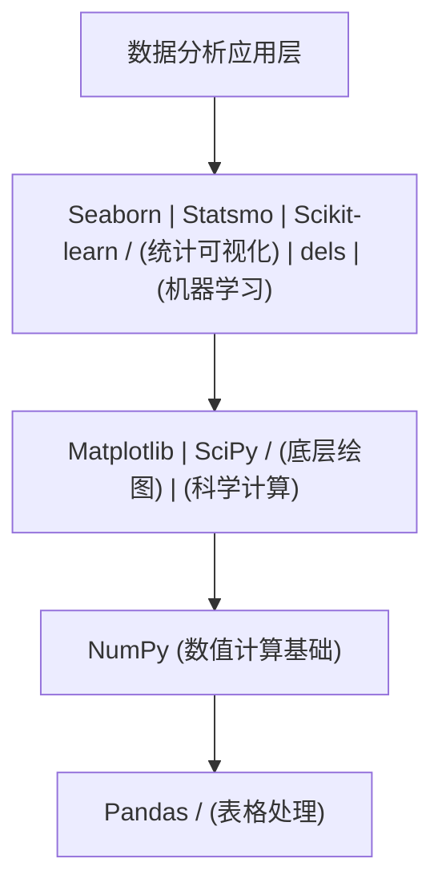
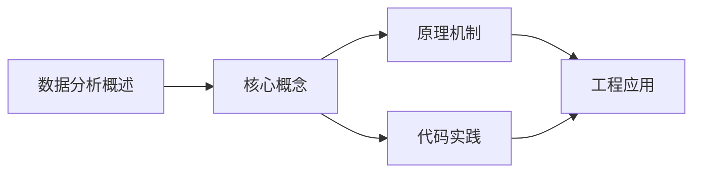

## 1. 学习目标（Bloom 分类）

本节按照布鲁姆教育目标分类学组织学习路径。本文主题为《数据分析概述》，属于 数据分析 模块，读者可以根据自身阶段选择阅读深度。

记忆层面：能够准确复述本文的核心概念、术语与基本语法或操作步骤，并能够在提问或检索时快速定位对应知识点。能够说出 数据分析 的核心概念、常用命令与流程。

理解层面：能够用自己的语言解释核心原理与工作机制，说明概念之间的因果关系，而不是机械记忆结论。能够解释 数据分析 的工作原理与设计动机。

应用层面：能够在真实项目或练习场景中运用本文知识解决具体问题，写出正确且可维护的实现。能够独立完成 数据分析 的标准操作。

分析层面：能够拆解复杂问题，比较本文主题与相邻概念的异同，识别边界条件与例外情况。能够分析 数据分析 使用中的异常与边界。

评价层面：能够根据约束条件（性能、可读性、安全、成本）评价不同方案的优劣，做出有依据的技术决策。能够评价 数据分析 相关工具与方案。

创造层面：能够把本文知识与其他模块知识组合，设计出新的解决方案或可复用的工程模式。能够把 数据分析 融入团队工作流。

通过本节学习，读者应当能够把《数据分析概述》纳入自己的知识网络，并与 数据分析 模块的其他主题（数据清洗、可视化、统计、报告）建立关联。

## 2. 历史动机与发展脉络

《数据分析概述》是 数据分析 领域的重要主题。要真正理解它，需要先了解它解决的问题与演进过程。

数据分析是从数据中提取决策信息的工程过程：定义问题 -> 采集 -> 清洗 -> 探索 -> 建模 -> 可视化 -> 报告。
工具链：Python（Pandas/NumPy）、SQL、Jupyter、BI（Tableau/PowerBI）；Excel 仍是轻量入口。
方法：描述性分析（发生了什么）、诊断（为什么）、预测（会怎样）、规范（该怎么办）。

回到本文主题：数据分析概述 的提出与成熟，正是上述技术背景下的必然产物。早期实现往往以简单可用为目标，随着工程规模扩大，社区逐渐沉淀出标准做法与最佳实践；理解这一脉络，可以帮助读者判断“为什么文档中的推荐写法是现在这个样子”，也能在遇到历史遗留代码时准确识别其设计年代与取舍。


## 3. 形式化定义与核心概念精讲

本节把《数据分析概述》涉及的核心概念以“定义 + 讲解”的形式展开。读者应把定义当作工具，把讲解当作理解路径；两者结合才能形成可迁移的知识。

数据形态：表格（结构化）、序列（时间）、文本、图像；分析前确定数据类型（数值/类别/顺序）。
清洗：缺失值（删除/填充）、异常值（IQR/z-score）、重复、类型转换；清洗决定结果可信度。
探索性分析（EDA）：分布（直方图）、集中趋势（均值/中位数）、离散（方差/IQR）、相关性。

### 3.1 原文章节逐一精讲

原文档把主题拆分为 24 个小节，下面按顺序给出每一节的导读讲解，随后保留原文细节供精读。

#### 原文精读（完整保留）

# 数据分析 分析工作流

> **符号约定**：`< >` 必填参数 | `[ ]` 可选参数

---

#### 1. 什么是数据分析

##### 1.1 定义与核心目标

数据分析是指用适当的统计方法对收集来的大量数据进行分析，提取有用信息和形成结论，从而对数据加以详细研究和概括总结的过程。其核心目标可以归纳为三个层次：

| 层次       | 目标                 | 典型问题               | 核心方法           |
| ---------- | -------------------- | ---------------------- | ------------------ |
| 描述性分析 | 描述过去发生了什么   | 上月销售额是多少？     | 聚合统计、可视化   |
| 诊断性分析 | 解释为什么会发生     | 为什么用户流失率上升？ | 相关分析、假设检验 |
| 预测性分析 | 预测未来可能发生什么 | 下季度销量预测？       | 回归模型、时间序列 |

> **为什么需要分层思考？** 因为不同层次的分析对数据质量、方法复杂度和业务理解的要求截然不同。描述性分析只需数据准确即可，诊断性分析需要建立因果逻辑，预测性分析则需要考虑模型的泛化能力。混淆层次会导致"用描述方法回答预测问题"的常见错误。

##### 1.2 数据分析在不同行业的应用

- **电商/零售**：用户行为分析、商品推荐、库存优化、价格弹性分析
- **金融**：风控评分卡、信用评估、量化交易策略、反欺诈检测
- **医疗健康**：临床试验分析、流行病趋势、药物效果评估
- **互联网**：A/B 测试、用户增长分析、内容推荐算法评估
- **制造业**：质量管控（SPC）、设备预测性维护、供应链优化

##### 1.3 数据分析 vs 数据科学 vs 机器学习

三者常被混淆，但侧重点不同：

```
 数据分析：以业务问题驱动，侧重描述与诊断，输出洞察与建议
 数据科学：在分析基础上加入工程化能力，构建数据产品
 机器学习：侧重算法建模与预测，是数据科学的子集工具
```

数据分析是数据科学的基础。没有扎实的分析能力，机器学习模型很可能在错误的数据和错误的假设上运行——所谓 "Garbage In, Garbage Out"。

> 跨模块参考：[Python 基础](python/overview) 是数据分析的编程基础，[MySQL](mysql/overview) 是数据获取的重要来源。

---

#### 2. 数据分析流程

##### 2.1 完整流程图

数据分析不是从打开 Jupyter 开始的，而是从理解业务问题开始的。完整的分析流程如下：

```
 业务问题定义
  |
  v
 数据采集 (CSV/数据库/API/爬虫)
  |
  v
 数据清洗 (缺失值/异常值/类型转换)
  |
  v
 探索性数据分析 (EDA)
  |
  v
 建模分析 (统计检验/回归/分类)
  |
  v
 可视化呈现 (图表/仪表盘/报告)
  |
  v
 结论与建议 (可执行的行动方案)
```

##### 2.2 各环节详解

**业务问题定义**：这是最容易被忽视但最重要的环节。一个清晰的问题定义决定了后续所有工作的方向。好的问题定义应该满足 SMART 原则——具体的（Specific）、可度量的（Measurable）、可实现的（Achievable）、相关的（Relevant）、有时限的（Time-bound）。
**数据采集**：数据来源决定了数据质量的上限。常见数据源包括：

- 内部数据库（需要 [MySQL](mysql/overview) 等 SQL 技能）
- CSV/Excel 文件（Pandas `read_csv`/`read_excel`）
- Web API（`requests` + JSON 解析）
- 公开数据集（Kaggle、UCI、政府开放数据）
  **数据清洗**：通常占整个分析项目 60%-80% 的时间。详见 [data-cleaning.md](data-cleaning.md)。
  **探索性数据分析（EDA）**：在建模之前，必须先"看"数据。EDA 的目标是：
- 了解数据的分布特征
- 发现异常模式或数据质量问题
- 生成初步假设供后续验证
  **建模分析**：基于 EDA 的发现，选择合适的统计方法或机器学习模型。详见 [statistics.md](statistics.md)。
  **可视化呈现**：好的可视化能让复杂的数据关系一目了然。详见 [matplotlib.md](matplotlib.md) 和 [seaborn.md](seaborn.md)。
  **结论与建议**：分析的最终价值在于驱动决策。结论需要回答业务问题，建议需要可执行。

##### 2.3 流程中的常见陷阱

| 陷阱         | 描述                           | 规避方法                  |
| ------------ | ------------------------------ | ------------------------- |
| 跳过问题定义 | 直接拿数据开始分析             | 先写问题陈述，再碰数据    |
| 忽视数据质量 | 假设数据是干净的               | 先做数据质量评估          |
| 过早建模     | EDA 不充分就建模型             | 至少花 30% 时间在 EDA     |
| 幸存者偏差   | 只分析可见数据                 | 思考数据缺失的原因        |
| 相关当因果   | 相关性不等于因果性             | 用 A/B 测试或因果推断验证 |
| 过度拟合     | 模型在训练集上表现好但不可泛化 | 交叉验证、留出测试集      |

---

#### 3. Python 数据分析工具链

##### 3.1 核心库概览

Python 数据分析生态由以下核心库构成，它们各司其职又紧密协作：



> **为什么 NumPy 是基础？** NumPy 提供了高效的多维数组对象 `ndarray`，Pandas 的 `Series` 和 `DataFrame` 底层就是基于 NumPy 数组构建的。Matplotlib 的数值计算也依赖 NumPy。理解 NumPy 的数组操作和广播机制，是高效使用上层库的前提。

##### 3.2 各库定位与关系

| 库           | 定位         | 核心数据结构      | 典型用途             | 详细文档                       |
| ------------ | ------------ | ----------------- | -------------------- | ------------------------------ |
| NumPy        | 数值计算基础 | ndarray           | 数组运算、线性代数   | [numpy.md](numpy.md)           |
| Pandas       | 表格数据处理 | Series, DataFrame | 数据清洗、聚合、合并 | [pandas.md](pandas.md)         |
| Matplotlib   | 底层绘图     | Figure, Axes      | 基础图表、精细控制   | [matplotlib.md](matplotlib.md) |
| Seaborn      | 统计可视化   | 基于 Matplotlib   | 统计图表、快速探索   | [seaborn.md](seaborn.md)       |
| SciPy        | 科学计算     | 基于 NumPy        | 统计检验、优化       | [statistics.md](statistics.md) |
| Statsmodels  | 统计建模     | DataFrame         | 回归分析、时间序列   | [statistics.md](statistics.md) |
| Scikit-learn | 机器学习     | NumPy/Pandas      | 分类、回归、聚类     | 超出本系列范围                 |

##### 3.3 库之间的协作模式

```python
 import numpy as np
 import pandas as pd
 import matplotlib.pyplot as plt
 import seaborn as sns
 from scipy import stats
 np.random.seed(42)
 data = np.random.randn(1000)
 s = pd.Series(data)
 print(s.describe())
 fig, ax = plt.subplots(figsize=(8, 5))
 sns.histplot(s, kde=True, ax=ax)
 ax.set_title('Standard Normal Distribution')
 plt.show()
```

#### **输出说明**：上述代码演示了典型的库协作流程——NumPy 生成随机数据，Pandas 将其转换为 Series 并计算描述统计量，Seaborn 基于 Matplotlib 的 Axes 绘制直方图和核密度估计曲线。这种 "NumPy 生成 -> Pandas 处理 -> Seaborn/Matplotlib 可视化" 的模式是数据分析中最常见的工作流。

#### 4. 环境搭建与配置

##### 4.1 Anaconda vs Miniconda

| 特性       | Anaconda     | Miniconda         |
| ---------- | ------------ | ----------------- |
| 安装包大小 | ~3 GB        | ~80 MB            |
| 预装包数量 | 250+         | 仅 conda + Python |
| 适合人群   | 初学者、教学 | 有经验的开发者    |
| 磁盘占用   | 大           | 小                |

> **为什么推荐 Miniconda？** Anaconda 预装了大量你可能永远用不到的包，不仅浪费磁盘空间，还可能导致版本冲突。Miniconda 只安装最小依赖，按需安装更可控。

##### 4.2 环境创建与依赖安装

```bash
 conda create -n data-analysis python=3.11 -y
 conda activate data-analysis
 conda install numpy pandas matplotlib seaborn scipy statsmodels jupyterlab -y
```

也可以使用 pip 安装：

```bash
 pip install numpy pandas matplotlib seaborn scipy statsmodels jupyterlab
```

##### 4.3 验证安装

```python
 import numpy as np
 import pandas as pd
 import matplotlib
 import seaborn as sns
 from scipy import stats
 import statsmodels.api as sm
 packages = {
  'NumPy': np.__version__,
  'Pandas': pd.__version__,
  'Matplotlib': matplotlib.__version__,
  'Seaborn': sns.__version__,
  'SciPy': stats.__version__,
  'Statsmodels': sm.__version__,
 }
 for name, version in packages.items():
  print(f'{name}: {version}')
```

**输出说明**：运行上述代码将打印各库的版本号，确认所有核心依赖已正确安装。如果某个库导入失败，说明安装不完整，需要重新安装。

##### 4.4 JupyterLab 扩展推荐

```bash
 conda install -c conda-forge jupyterlab-git jupyterlab-lsp python-lsp-server -y
```

| 扩展                      | 功能                          |
| ------------------------- | ----------------------------- |
| jupyterlab-git            | Git 版本控制集成              |
| jupyterlab-lsp            | 代码补全与跳转定义            |
| jupyterlab-code-formatter | 代码自动格式化（black/isort） |

---

#### 5. Jupyter Notebook 工作流

##### 5.1 核心概念

Jupyter Notebook 是数据分析的标准交互环境。其核心概念：

- **Notebook**：由一系列单元格（Cell）组成的文档，后缀 `.ipynb`
- **单元格类型**：Code（代码）、Markdown（文本）
- **内核（Kernel）**：执行代码的 Python 进程
- **状态**：内核维护所有变量的运行时状态
  > **为什么用 Jupyter 而不是 IDE？** 数据分析的核心工作模式是"探索"——写几行代码、看结果、调整、再看。Jupyter 的单元格执行模式天然适合这种交互式探索。IDE 更适合开发软件系统，而 Notebook 更适合做分析实验。

##### 5.2 常用快捷键

| 快捷键        | 功能                       | 模式     |
| ------------- | -------------------------- | -------- |
| Enter         | 进入编辑模式               | 命令模式 |
| Esc           | 进入命令模式               | 编辑模式 |
| Shift + Enter | 运行当前单元格并跳到下一个 | 通用     |
| Ctrl + Enter  | 运行当前单元格             | 通用     |
| A             | 在上方插入单元格           | 命令模式 |
| B             | 在下方插入单元格           | 命令模式 |
| DD            | 删除当前单元格             | 命令模式 |
| M             | 切换为 Markdown 单元格     | 命令模式 |
| Y             | 切换为 Code 单元格         | 命令模式 |

##### 5.3 Magic 命令

Magic 命令是 IPython/Jupyter 提供的特殊指令，以 `%`（行级）或 `%%`（单元格级）开头：

```python
 %
 %
 %
 total = 0
 for i in range(10000000):
  total += i
 print(total)
 %
 %
```

**输出说明**：

- `%matplotlib inline`：将图表直接嵌入 Notebook 输出区域，而非弹出窗口
- `%timeit`：自动多次运行并报告平均执行时间
- `%%time`：报告整个单元格的执行时间
- `%who`：列出当前命名空间中的所有变量
- `%history`：查看历史执行记录

##### 5.4 组织可复现的分析笔记本

一个好的分析笔记本应该像一篇结构清晰的报告：

```markdown
# 项目标题

#### 1. 业务背景与问题定义

#### 2. 数据加载

#### 3. 数据清洗

#### 4. 探索性分析

#### 5. 建模与检验

#### 6. 结论与建议
```

关键原则：

- 每个 Markdown 单元格解释"为什么"，每个 Code 单元格展示"怎么做"
- 在笔记本顶部集中导入所有依赖
- 设置随机种子确保可复现
- 清洗步骤保留原始数据的备份

```python
 import numpy as np
 import pandas as pd
 import matplotlib.pyplot as plt
 import seaborn as sns
 from scipy import stats
 np.random.seed(42)
 pd.set_option('display.max_columns', None)
 pd.set_option('display.float_format', '{:.4f}'.format)
 plt.rcParams['figure.figsize'] = (10, 6)
 plt.rcParams['font.size'] = 12
 sns.set_theme(style='whitegrid')
 df_raw = pd.read_csv('data.csv')
 df = df_raw.copy()
```

---

#### 6. 学习路线图

##### 6.1 分阶段学习路径

```
 阶段一：基础工具（2-3 周）
  |
  +---> [numpy.md] 数组操作、广播、线性代数
  +---> [pandas.md] DataFrame 操作、索引、聚合
  |
  v
 阶段二：可视化（1-2 周）
  |
  +---> [matplotlib.md] 图表基础、样式定制、子图布局
  +---> [seaborn.md] 统计图表、热力图、多图网格
  |
  v
 阶段三：统计基础（2-3 周）
  |
  +---> [statistics.md] 描述统计、假设检验、回归分析
  |
  v
 阶段四：实战技能（2-3 周）
  |
  +---> [data-cleaning.md] 缺失值、异常值、类型转换
  +---> [project.md] 完整项目实战
```

##### 6.2 各阶段学习目标

**阶段一：基础工具**
学完此阶段，你应该能够：

- 使用 NumPy 进行高效的数值计算
- 使用 Pandas 完成常见的数据筛选、聚合、合并操作
- 理解向量化操作与循环的性能差异
  前置知识：[Python 基础](python/overview)，特别是列表、字典、函数、模块导入
  **阶段二：可视化**
  学完此阶段，你应该能够：
- 使用 Matplotlib 绘制常见图表类型
- 使用 Seaborn 快速绘制统计图表
- 根据数据类型选择合适的图表类型
  图表选择速查：
  | 数据关系                 | 推荐图表        | 工具                                         |
  | ------------------------ | --------------- | -------------------------------------------- |
  | 趋势变化                 | 折线图          | Matplotlib `ax.plot`                         |
  | 类别比较                 | 柱状图          | Matplotlib `ax.bar` / Seaborn `sns.barplot`  |
  | 分布形态                 | 直方图/箱线图   | Seaborn `sns.histplot` / `sns.boxplot`       |
  | 相关关系                 | 散点图/热力图   | Seaborn `sns.scatterplot` / `sns.heatmap`    |
  | 占比构成                 | 饼图/堆叠柱状图 | Matplotlib `ax.pie` / `ax.bar(stacked=True)` |
  | **阶段三：统计基础**     |
  | 学完此阶段，你应该能够： |
- 计算并解释描述统计量
- 选择并执行合适的假设检验
- 理解 p 值、置信区间的含义与局限
  **阶段四：实战技能**
  学完此阶段，你应该能够：
- 独立完成一个完整的数据分析项目
- 处理真实数据中的各种质量问题
- 将分析结果转化为业务建议

##### 6.3 学习资源推荐

| 资源                           | 类型     | 适合阶段   | 说明                                 |
| ------------------------------ | -------- | ---------- | ------------------------------------ |
| Python for Data Analysis       | 书籍     | 阶段一、二 | Wes McKinney 著，Pandas 作者本人编写 |
| Kaggle Learn                   | 在线课程 | 全阶段     | 免费交互式教程，边学边练             |
| Statistical Thinking in Python | 课程     | 阶段三     | DataCamp 上的统计思维课程            |
| Storytelling with Data         | 书籍     | 阶段四     | 数据可视化叙事技巧                   |

---

#### 7. 速查表

##### 7.1 数据分析流程速查

```
 1. 定义问题 -> 明确分析目标与成功标准
 2. 获取数据 -> read_csv / read_sql / API
 3. 评估质量 -> info() / describe() / isna().sum()
 4. 清洗数据 -> fillna / dropna / astype / drop_duplicates
 5. 探索分析 -> histplot / boxplot / scatterplot / heatmap
 6. 统计检验 -> ttest_ind / f_oneway / pearsonr
 7. 建模分析 -> OLS / Logit / 机器学习模型
 8. 可视化报告 -> subplots + suptitle + savefig
 9. 结论建议 -> 洞察 -> 行动 -> 预期影响
```

##### 7.2 常用导入语句

```python
 import numpy as np
 import pandas as pd
 import matplotlib.pyplot as plt
 import seaborn as sns
 from scipy import stats
 import statsmodels.api as sm
 np.random.seed(42)
 pd.set_option('display.max_columns', None)
 pd.set_option('display.float_format', '{:.4f}'.format)
 sns.set_theme(style='whitegrid')
 %
```

##### 7.3 数据类型与图表映射

| 数据类型     | 变量数量 | 推荐图表                 |
| ------------ | -------- | ------------------------ |
| 单个连续变量 | 1        | 直方图、箱线图、KDE      |
| 单个分类变量 | 1        | 柱状图、饼图             |
| 连续 vs 连续 | 2        | 散点图、回归图           |
| 连续 vs 分类 | 2        | 分组箱线图、小提琴图     |
| 分类 vs 分类 | 2        | 堆叠柱状图、热力图       |
| 多变量       | 3+       | 分面图、气泡图、PairGrid |

##### 7.4 常见问题排查

| 问题       | 可能原因     | 解决方法                                                    |
| ---------- | ------------ | ----------------------------------------------------------- |
| 中文乱码   | 字体未配置   | `plt.rcParams['font.sans-serif'] = ['SimHei']`              |
| 图表不显示 | 未开启内联   | `%matplotlib inline`                                        |
| 内存不足   | 数据量过大   | 使用 `chunksize` 分块读取                                   |
| 编码错误   | 文件非 UTF-8 | 尝试 `encoding='gbk'` 或 `'latin-1'`                        |
| 列名有空格 | 读取时未处理 | `df.columns = df.columns.str.strip().str.replace(' ', '_')` |

---

#### 8. 延伸阅读

- Python for Data Analysis (Wes McKinney) -- Pandas 作者的经典著作
- Practical Statistics for Data Scientists (Peter Bruce) -- 面向实践的统计入门
- Storytelling with Data (Cole Nussbaumer Knaflic) -- 数据可视化叙事
- Jupyter Notebook 官方文档：https://jupyter.org/documentation
- Kaggle Learn：https://www.kaggle.com/learn
- Python Data Science Handbook (Jake VanderPlas)：https://jakevdp.github.io/PythonDataScienceHandbook/

##### 跨模块关联

- [Python](python/overview)
- [MySQL](mysql/mysql-overview)
#### 数据加载

**基本写法：从 CSV 加载**
`pd.read_csv(<文件路径>)`

```python
# 加载 CSV 文件
df = pd.read_csv("data.csv")
```

---

**基本写法：指定编码加载**
`pd.read_csv(<文件路径>, encoding=<编码>)`

```python
# 指定编码加载 CSV
df = pd.read_csv("data.csv", encoding="utf-8")
```

---

**基本写法：加载时指定列类型**
`pd.read_csv(<文件路径>, dtype={ <列名>: <类型> })`

```python
# 指定列类型加载
df = pd.read_csv("data.csv", dtype={"id": str, "age": int})
```

---

**基本写法：加载时解析日期**
`pd.read_csv(<文件路径>, parse_dates=[<日期列>])`

```python
# 加载时解析日期列
df = pd.read_csv("data.csv", parse_dates=["date"])
```

---

**基本写法：从多个文件加载**
`pd.concat([pd.read_csv(f) for f in <文件列表>])`

```python
# 合并多个 CSV 文件
import glob
files = glob.glob("data_*.csv")
df = pd.concat([pd.read_csv(f) for f in files], ignore_index=True)
```

---

#### 数据概览

**基本写法：查看前几行**
`<DataFrame>.head(<行数>)`

```python
# 查看前 5 行
df.head()
# 查看前 10 行
df.head(10)
```

---

**基本写法：查看数据信息**
`<DataFrame>.info()`

```python
# 查看 DataFrame 基本信息（列名、类型、非空值数）
df.info()
```

---

**基本写法：查看描述性统计**
`<DataFrame>.describe()`

```python
# 查看数值列的描述性统计
df.describe()
```

---

**基本写法：包含所有列的统计**
`<DataFrame>.describe(include="all")`

```python
# 查看所有列的统计信息
df.describe(include="all")
```

---

**基本写法：查看数据形状**
`<DataFrame>.shape`

```python
# 查看数据形状（行数，列数）
print(df.shape)
```

---

**基本写法：查看列名**
`<DataFrame>.columns`

```python
# 查看所有列名
print(df.columns.tolist())
```

---

#### 数据清洗

**基本写法：查看缺失值**
`<DataFrame>.isna().sum()`

```python
# 查看每列缺失值数量
print(df.isna().sum())
```

---

**基本写法：删除缺失值**
`<DataFrame>.dropna(subset=[<列名>])`

```python
# 删除指定列的缺失值
df_clean = df.dropna(subset=["age", "salary"])
```

---

**基本写法：填充缺失值**
`<DataFrame>.fillna(<填充值>)`

```python
# 填充缺失值
df["age"] = df["age"].fillna(df["age"].mean())
df["city"] = df["city"].fillna("未知")
```

---

**基本写法：删除重复行**
`<DataFrame>.drop_duplicates()`

```python
# 删除重复行
df = df.drop_duplicates()
```

---

**基本写法：按列删除重复**
`<DataFrame>.drop_duplicates(subset=[<列名>])`

```python
# 按指定列删除重复
df = df.drop_duplicates(subset=["id"])
```

---

**基本写法：重命名列**
`<DataFrame>.rename(columns={ <旧名>: <新名> })`

```python
# 重命名列
df = df.rename(columns={"old_name": "new_name"})
```

---

**基本写法：修改列类型**
`<DataFrame>[<列名>].astype(<类型>)`

```python
# 修改列的数据类型
df["price"] = df["price"].astype(float)
df["id"] = df["id"].astype(str)
```

---

#### 数据筛选

**基本写法：条件筛选**
`<DataFrame>[<条件>]`

```python
# 条件筛选
adults = df[df["age"] >= 18]
```

---

**基本写法：多条件筛选**
`<DataFrame>[(<条件1>) & (<条件2>)]`

```python
# 多条件筛选
result = df[(df["age"] >= 18) & (df["city"] == "北京")]
```

---

**基本写法：使用 query 方法**
`<DataFrame>.query(<查询表达式>)`

```python
# 使用 query 方法筛选
result = df.query("age >= 18 and city == '北京'")
```

---

**基本写法：使用 isin 筛选**
`<DataFrame>[<列名>].isin([<值列表>])`

```python
# 多值筛选
result = df[df["city"].isin(["北京", "上海", "广州"])]
```

---

**基本写法：选择列**
`<DataFrame>[[<列1>, <列2>]]`

```python
# 选择指定列
subset = df[["name", "age", "salary"]]
```

---

#### 数据转换

**基本写法：应用函数**
`<DataFrame>[<列名>].apply(<函数>)`

```python
# 对列应用函数
df["age_group"] = df["age"].apply(lambda x: "成年" if x >= 18 else "未成年")
```

---

**基本写法：对整个 DataFrame 应用**
`<DataFrame>.applymap(<函数>)`

```python
# 对所有元素应用函数（Pandas 2.x 推荐使用 map）
df = df.map(lambda x: x.strip() if isinstance(x, str) else x)
```

---

**基本写法：使用 map 映射**
`<DataFrame>[<列名>].map(<映射字典>)`

```python
# 使用字典映射值
gender_map = {"M": "男", "F": "女"}
df["gender"] = df["gender"].map(gender_map)
```

---

**基本写法：使用 assign 创建新列**
`<DataFrame>.assign(<新列名>=<表达式>)`

```python
# 使用 assign 创建新列
df = df.assign(bmi=df["weight"] / (df["height"] / 100) ** 2)
```

---

#### 分组聚合

**基本写法：分组聚合**
`<DataFrame>.groupby(<分组列>)[<值列>].<聚合函数>()`

```python
# 按城市分组计算平均薪资
result = df.groupby("city")["salary"].mean()
```

---

**基本写法：多列聚合**
`<DataFrame>.groupby(<分组列>).agg({ <列1>: <函数1>, <列2>: <函数2> })`

```python
# 多列不同聚合
result = df.groupby("city").agg({
    "salary": "mean",
    "age": "median",
    "id": "count"
})
```

---

**基本写法：多级聚合**
`<DataFrame>.groupby(<分组列>)[<值列>].agg([<函数1>, <函数2>])`

```python
# 多级聚合
result = df.groupby("city")["salary"].agg(["mean", "max", "min"])
```

---

**基本写法：重置索引**
`<DataFrame>.reset_index()`

```python
# 聚合后重置索引
result = df.groupby("city")["salary"].mean().reset_index()
```

---

#### 数据合并

**基本写法：合并数据**
`pd.merge(<左表>, <右表>, on=<连接列>)`

```python
# 合并两个 DataFrame
result = pd.merge(df_employees, df_departments, on="dept_id")
```

---

**基本写法：拼接数据**
`pd.concat([<DataFrame1>, <DataFrame2>])`

```python
# 纵向拼接
result = pd.concat([df_jan, df_feb], ignore_index=True)
```

---

**基本写法：横向拼接**
`pd.concat([<DataFrame1>, <DataFrame2>], axis=1)`

```python
# 横向拼接
result = pd.concat([df_info, df_scores], axis=1)
```

---

#### 数据导出

**基本写法：导出为 CSV**
`<DataFrame>.to_csv(<文件路径>, index=<是否写入索引>)`

```python
# 导出为 CSV（不写入索引）
df.to_csv("output.csv", index=False)
```

---

**基本写法：导出为 Excel**
`<DataFrame>.to_excel(<文件路径>, sheet_name=<工作表名>)`

```python
# 导出为 Excel
df.to_excel("output.xlsx", sheet_name="data", index=False)
```

---

**基本写法：导出为 JSON**
`<DataFrame>.to_json(<文件路径>, orient=<格式>)`

```python
# 导出为 JSON
df.to_json("output.json", orient="records", force_ascii=False)
```

---

**基本写法：导出为 Markdown**
`<DataFrame>.to_markdown()`

```python
# 导出为 Markdown 表格
print(df.to_markdown())
```

---

#### 完整分析流程

**换行写法：完整数据分析流程**
`df = pd.read_csv(<文件>)`
`df = df.dropna().drop_duplicates()`
`result = df.groupby(<分组列>).agg({ <列>: <函数> })`
`result.to_csv(<输出文件>)`

```python
# 完整数据分析流程
df = pd.read_csv("sales.csv")
df = df.dropna(subset=["city", "sales"])
df = df.drop_duplicates()
df["month"] = pd.to_datetime(df["date"]).dt.month
result = df.groupby(["city", "month"])["sales"].sum().reset_index()
result.to_csv("monthly_sales.csv", index=False)
```

---

**换行写法：分组后排序取 Top N**
`result = df.groupby(<分组列>)[<值列>].sum().nlargest(<n>)`

```python
# 按城市分组计算总销售额并取前 5 名
top_cities = df.groupby("city")["sales"].sum().nlargest(5)
```

---

**换行写法：计算占比**
`df["percent"] = df["value"] / df["value"].sum() * 100`

```python
# 计算每个城市销售额占总销售额的百分比
df["sales_percent"] = df["sales"] / df["sales"].sum() * 100
```

---

**换行写法：累计计算**
`df["cumsum"] = df.groupby(<分组列>)[<值列>].cumsum()`

```python
# 计算每个城市的累计销售额
df["cumulative_sales"] = df.groupby("city")["sales"].cumsum()
```

---

**换行写法：同环比计算**
`df["pct_change"] = df.groupby(<分组列>)[<值列>].pct_change()`

```python
# 计算销售额的环比增长率
df["growth_rate"] = df.groupby("city")["sales"].pct_change()
```


### 3.2 概念关系图

下面用 Mermaid 图表达本文核心概念之间的关系，帮助读者建立整体图景：



图中展示的是本文知识的结构化关系：核心概念是入口，原理机制解释“为什么”，代码实践演示“怎么做”，工程应用回答“何时用”。读者学习时可以把每个小节的内容挂接到对应节点上。

## 4. 理论推导与原理解析

本节深入《数据分析概述》背后的原理。理论部分不求面面俱到，而是聚焦“能解释现象、能指导实践”的关键推导。

数据形态：表格（结构化）、序列（时间）、文本、图像；分析前确定数据类型（数值/类别/顺序）。
清洗：缺失值（删除/填充）、异常值（IQR/z-score）、重复、类型转换；清洗决定结果可信度。
探索性分析（EDA）：分布（直方图）、集中趋势（均值/中位数）、离散（方差/IQR）、相关性。
可视化原则：图型匹配数据（趋势折线、比较柱状、构成饼/堆叠、关系散点），标注与叙事。

需要强调的是，理论推导与工程实践之间存在翻译层：理论给出的是理想化模型与边界条件，工程代码则必须处理真实环境中的例外。读者在学习时应先掌握理论的“标准情形”，再通过陷阱章节了解“非标准情形”。

## 5. 代码示例与逐行讲解

本节把原文中的代码示例系统整理，并为每个示例补充用途说明与讲解。读者不应只浏览代码，而应逐段对照讲解理解设计意图。

### 5.1 示例：1.3 数据分析 vs 数据科学 vs 机器学习

该示例来自原文《1.3 数据分析 vs 数据科学 vs 机器学习》小节，用于演示数据分析概述相关操作。阅读时请先看代码结构，再看其后的讲解。

```text
 数据分析：以业务问题驱动，侧重描述与诊断，输出洞察与建议
 数据科学：在分析基础上加入工程化能力，构建数据产品
 机器学习：侧重算法建模与预测，是数据科学的子集工具
```

讲解：这段代码演示了本节核心知识点。代码中的关键操作可以归纳为三步：准备（定义或初始化）、执行（核心逻辑）、收尾（释放资源或返回结果）。实际项目中，这三步往往被封装为函数或类，以提升复用性与可测试性。

关键点分析：

该示例共 3 行有效代码，结构以数据或配置为主。阅读时应关注：数据字段的含义、配置项的作用，以及它们与运行行为的对应关系。

进阶思考路径：先尝试修改参数观察行为变化，再把示例中的模式迁移到自己的项目中；每次修改都记录预期与实测差异，这是把示例转化为能力的最快方式。

### 5.2 示例：2.1 完整流程图

该示例来自原文《2.1 完整流程图》小节，用于演示数据分析概述相关操作。阅读时请先看代码结构，再看其后的讲解。

```text
 业务问题定义
  |
  v
 数据采集 (CSV/数据库/API/爬虫)
  |
  v
 数据清洗 (缺失值/异常值/类型转换)
  |
  v
 探索性数据分析 (EDA)
  |
  v
 建模分析 (统计检验/回归/分类)
  |
  v
 可视化呈现 (图表/仪表盘/报告)
  |
  v
 结论与建议 (可执行的行动方案)
```

讲解：这段代码演示了本节核心知识点。代码中的关键操作可以归纳为三步：准备（定义或初始化）、执行（核心逻辑）、收尾（释放资源或返回结果）。实际项目中，这三步往往被封装为函数或类，以提升复用性与可测试性。

关键点分析：

该示例共 19 行有效代码，结构以数据或配置为主。阅读时应关注：数据字段的含义、配置项的作用，以及它们与运行行为的对应关系。

进阶思考路径：先尝试修改参数观察行为变化，再把示例中的模式迁移到自己的项目中；每次修改都记录预期与实测差异，这是把示例转化为能力的最快方式。

### 5.3 示例：3.1 核心库概览

该示例来自原文《3.1 核心库概览》小节，用于演示数据分析概述相关操作。阅读时请先看代码结构，再看其后的讲解。


讲解：这段代码演示了本节核心知识点。代码中的关键操作可以归纳为三步：准备（定义或初始化）、执行（核心逻辑）、收尾（释放资源或返回结果）。实际项目中，这三步往往被封装为函数或类，以提升复用性与可测试性。

关键点分析：

该示例共 10 行有效代码，结构以数据或配置为主。阅读时应关注：数据字段的含义、配置项的作用，以及它们与运行行为的对应关系。

进阶思考路径：先尝试修改参数观察行为变化，再把示例中的模式迁移到自己的项目中；每次修改都记录预期与实测差异，这是把示例转化为能力的最快方式。

### 5.4 示例：3.3 库之间的协作模式

该示例来自原文《3.3 库之间的协作模式》小节，用于演示数据分析概述相关操作。阅读时请先看代码结构，再看其后的讲解。

```python
 import numpy as np
 import pandas as pd
 import matplotlib.pyplot as plt
 import seaborn as sns
 from scipy import stats
 np.random.seed(42)
 data = np.random.randn(1000)
 s = pd.Series(data)
 print(s.describe())
 fig, ax = plt.subplots(figsize=(8, 5))
 sns.histplot(s, kde=True, ax=ax)
 ax.set_title('Standard Normal Distribution')
 plt.show()
```

讲解：这段代码演示了本节核心知识点。代码中的关键操作可以归纳为三步：准备（定义或初始化）、执行（核心逻辑）、收尾（释放资源或返回结果）。实际项目中，这三步往往被封装为函数或类，以提升复用性与可测试性。

关键点分析：

该示例共 13 行有效代码，包含 2 类关键结构（import、from）。其中：

- 入口与初始化部分负责建立上下文，对应实际项目中的启动或装配逻辑；
- 核心逻辑部分体现本文主题的主要操作，是阅读时最需要对照讲解理解的部分；
- 输出或返回部分把结果交给调用方，注意其类型与边界条件。

进阶思考路径：先尝试修改参数观察行为变化，再把示例中的模式迁移到自己的项目中；每次修改都记录预期与实测差异，这是把示例转化为能力的最快方式。

### 5.5 示例：4.2 环境创建与依赖安装

该示例来自原文《4.2 环境创建与依赖安装》小节，用于演示数据分析概述相关操作。阅读时请先看代码结构，再看其后的讲解。

```bash
 conda create -n data-analysis python=3.11 -y
 conda activate data-analysis
 conda install numpy pandas matplotlib seaborn scipy statsmodels jupyterlab -y
```

讲解：这段代码演示了本节核心知识点。代码中的关键操作可以归纳为三步：准备（定义或初始化）、执行（核心逻辑）、收尾（释放资源或返回结果）。实际项目中，这三步往往被封装为函数或类，以提升复用性与可测试性。

关键点分析：

该示例共 3 行有效代码，结构以数据或配置为主。阅读时应关注：数据字段的含义、配置项的作用，以及它们与运行行为的对应关系。

进阶思考路径：先尝试修改参数观察行为变化，再把示例中的模式迁移到自己的项目中；每次修改都记录预期与实测差异，这是把示例转化为能力的最快方式。

### 5.6 示例：4.2 环境创建与依赖安装

该示例来自原文《4.2 环境创建与依赖安装》小节，用于演示数据分析概述相关操作。阅读时请先看代码结构，再看其后的讲解。

```bash
 pip install numpy pandas matplotlib seaborn scipy statsmodels jupyterlab
```

讲解：这段代码演示了本节核心知识点。代码中的关键操作可以归纳为三步：准备（定义或初始化）、执行（核心逻辑）、收尾（释放资源或返回结果）。实际项目中，这三步往往被封装为函数或类，以提升复用性与可测试性。

关键点分析：

该示例共 1 行有效代码，结构以数据或配置为主。阅读时应关注：数据字段的含义、配置项的作用，以及它们与运行行为的对应关系。

进阶思考路径：先尝试修改参数观察行为变化，再把示例中的模式迁移到自己的项目中；每次修改都记录预期与实测差异，这是把示例转化为能力的最快方式。

### 5.7 示例：4.3 验证安装

该示例来自原文《4.3 验证安装》小节，用于演示数据分析概述相关操作。阅读时请先看代码结构，再看其后的讲解。

```python
 import numpy as np
 import pandas as pd
 import matplotlib
 import seaborn as sns
 from scipy import stats
 import statsmodels.api as sm
 packages = {
  'NumPy': np.__version__,
  'Pandas': pd.__version__,
  'Matplotlib': matplotlib.__version__,
  'Seaborn': sns.__version__,
  'SciPy': stats.__version__,
  'Statsmodels': sm.__version__,
 }
 for name, version in packages.items():
  print(f'{name}: {version}')
```

讲解：这段代码演示了本节核心知识点。代码中的关键操作可以归纳为三步：准备（定义或初始化）、执行（核心逻辑）、收尾（释放资源或返回结果）。实际项目中，这三步往往被封装为函数或类，以提升复用性与可测试性。

关键点分析：

该示例共 16 行有效代码，包含 3 类关键结构（import、from、for）。其中：

- 入口与初始化部分负责建立上下文，对应实际项目中的启动或装配逻辑；
- 核心逻辑部分体现本文主题的主要操作，是阅读时最需要对照讲解理解的部分；
- 输出或返回部分把结果交给调用方，注意其类型与边界条件。

进阶思考路径：先尝试修改参数观察行为变化，再把示例中的模式迁移到自己的项目中；每次修改都记录预期与实测差异，这是把示例转化为能力的最快方式。

### 5.8 示例：4.4 JupyterLab 扩展推荐

该示例来自原文《4.4 JupyterLab 扩展推荐》小节，用于演示数据分析概述相关操作。阅读时请先看代码结构，再看其后的讲解。

```bash
 conda install -c conda-forge jupyterlab-git jupyterlab-lsp python-lsp-server -y
```

讲解：这段代码演示了本节核心知识点。代码中的关键操作可以归纳为三步：准备（定义或初始化）、执行（核心逻辑）、收尾（释放资源或返回结果）。实际项目中，这三步往往被封装为函数或类，以提升复用性与可测试性。

关键点分析：

该示例共 1 行有效代码，结构以数据或配置为主。阅读时应关注：数据字段的含义、配置项的作用，以及它们与运行行为的对应关系。

进阶思考路径：先尝试修改参数观察行为变化，再把示例中的模式迁移到自己的项目中；每次修改都记录预期与实测差异，这是把示例转化为能力的最快方式。

### 5.9 示例：5.3 Magic 命令

该示例来自原文《5.3 Magic 命令》小节，用于演示数据分析概述相关操作。阅读时请先看代码结构，再看其后的讲解。

```python
 %
 %
 %
 total = 0
 for i in range(10000000):
  total += i
 print(total)
 %
 %
```

讲解：这段代码演示了本节核心知识点。代码中的关键操作可以归纳为三步：准备（定义或初始化）、执行（核心逻辑）、收尾（释放资源或返回结果）。实际项目中，这三步往往被封装为函数或类，以提升复用性与可测试性。

关键点分析：

该示例共 9 行有效代码，包含 1 类关键结构（for）。其中：

- 入口与初始化部分负责建立上下文，对应实际项目中的启动或装配逻辑；
- 核心逻辑部分体现本文主题的主要操作，是阅读时最需要对照讲解理解的部分；
- 输出或返回部分把结果交给调用方，注意其类型与边界条件。

进阶思考路径：先尝试修改参数观察行为变化，再把示例中的模式迁移到自己的项目中；每次修改都记录预期与实测差异，这是把示例转化为能力的最快方式。

### 5.10 示例：5.4 组织可复现的分析笔记本

该示例来自原文《5.4 组织可复现的分析笔记本》小节，用于演示数据分析概述相关操作。阅读时请先看代码结构，再看其后的讲解。

```markdown
# 项目标题

## 1. 业务背景与问题定义

## 2. 数据加载

## 3. 数据清洗

## 4. 探索性分析

## 5. 建模与检验

## 6. 结论与建议
```

讲解：这段代码演示了本节核心知识点。代码中的关键操作可以归纳为三步：准备（定义或初始化）、执行（核心逻辑）、收尾（释放资源或返回结果）。实际项目中，这三步往往被封装为函数或类，以提升复用性与可测试性。

关键点分析：

该示例共 7 行有效代码，结构以数据或配置为主。阅读时应关注：数据字段的含义、配置项的作用，以及它们与运行行为的对应关系。

进阶思考路径：先尝试修改参数观察行为变化，再把示例中的模式迁移到自己的项目中；每次修改都记录预期与实测差异，这是把示例转化为能力的最快方式。

### 5.11 示例：5.4 组织可复现的分析笔记本

该示例来自原文《5.4 组织可复现的分析笔记本》小节，用于演示数据分析概述相关操作。阅读时请先看代码结构，再看其后的讲解。

```python
 import numpy as np
 import pandas as pd
 import matplotlib.pyplot as plt
 import seaborn as sns
 from scipy import stats
 np.random.seed(42)
 pd.set_option('display.max_columns', None)
 pd.set_option('display.float_format', '{:.4f}'.format)
 plt.rcParams['figure.figsize'] = (10, 6)
 plt.rcParams['font.size'] = 12
 sns.set_theme(style='whitegrid')
 df_raw = pd.read_csv('data.csv')
 df = df_raw.copy()
```

讲解：这段代码演示了本节核心知识点。代码中的关键操作可以归纳为三步：准备（定义或初始化）、执行（核心逻辑）、收尾（释放资源或返回结果）。实际项目中，这三步往往被封装为函数或类，以提升复用性与可测试性。

关键点分析：

该示例共 13 行有效代码，包含 2 类关键结构（import、from）。其中：

- 入口与初始化部分负责建立上下文，对应实际项目中的启动或装配逻辑；
- 核心逻辑部分体现本文主题的主要操作，是阅读时最需要对照讲解理解的部分；
- 输出或返回部分把结果交给调用方，注意其类型与边界条件。

进阶思考路径：先尝试修改参数观察行为变化，再把示例中的模式迁移到自己的项目中；每次修改都记录预期与实测差异，这是把示例转化为能力的最快方式。

### 5.12 示例：6.1 分阶段学习路径

该示例来自原文《6.1 分阶段学习路径》小节，用于演示数据分析概述相关操作。阅读时请先看代码结构，再看其后的讲解。

```text
 阶段一：基础工具（2-3 周）
  |
  +---> [numpy.md] 数组操作、广播、线性代数
  +---> [pandas.md] DataFrame 操作、索引、聚合
  |
  v
 阶段二：可视化（1-2 周）
  |
  +---> [matplotlib.md] 图表基础、样式定制、子图布局
  +---> [seaborn.md] 统计图表、热力图、多图网格
  |
  v
 阶段三：统计基础（2-3 周）
  |
  +---> [statistics.md] 描述统计、假设检验、回归分析
  |
  v
 阶段四：实战技能（2-3 周）
  |
  +---> [data-cleaning.md] 缺失值、异常值、类型转换
  +---> [project.md] 完整项目实战
```

讲解：这段代码演示了本节核心知识点。代码中的关键操作可以归纳为三步：准备（定义或初始化）、执行（核心逻辑）、收尾（释放资源或返回结果）。实际项目中，这三步往往被封装为函数或类，以提升复用性与可测试性。

关键点分析：

该示例共 21 行有效代码，结构以数据或配置为主。阅读时应关注：数据字段的含义、配置项的作用，以及它们与运行行为的对应关系。

进阶思考路径：先尝试修改参数观察行为变化，再把示例中的模式迁移到自己的项目中；每次修改都记录预期与实测差异，这是把示例转化为能力的最快方式。

### 5.13 示例：7.1 数据分析流程速查

该示例来自原文《7.1 数据分析流程速查》小节，用于演示数据分析概述相关操作。阅读时请先看代码结构，再看其后的讲解。

```text
 1. 定义问题 -> 明确分析目标与成功标准
 2. 获取数据 -> read_csv / read_sql / API
 3. 评估质量 -> info() / describe() / isna().sum()
 4. 清洗数据 -> fillna / dropna / astype / drop_duplicates
 5. 探索分析 -> histplot / boxplot / scatterplot / heatmap
 6. 统计检验 -> ttest_ind / f_oneway / pearsonr
 7. 建模分析 -> OLS / Logit / 机器学习模型
 8. 可视化报告 -> subplots + suptitle + savefig
 9. 结论建议 -> 洞察 -> 行动 -> 预期影响
```

讲解：这段代码演示了本节核心知识点。代码中的关键操作可以归纳为三步：准备（定义或初始化）、执行（核心逻辑）、收尾（释放资源或返回结果）。实际项目中，这三步往往被封装为函数或类，以提升复用性与可测试性。

关键点分析：

该示例共 9 行有效代码，结构以数据或配置为主。阅读时应关注：数据字段的含义、配置项的作用，以及它们与运行行为的对应关系。

进阶思考路径：先尝试修改参数观察行为变化，再把示例中的模式迁移到自己的项目中；每次修改都记录预期与实测差异，这是把示例转化为能力的最快方式。

### 5.14 示例：7.2 常用导入语句

该示例来自原文《7.2 常用导入语句》小节，用于演示数据分析概述相关操作。阅读时请先看代码结构，再看其后的讲解。

```python
 import numpy as np
 import pandas as pd
 import matplotlib.pyplot as plt
 import seaborn as sns
 from scipy import stats
 import statsmodels.api as sm
 np.random.seed(42)
 pd.set_option('display.max_columns', None)
 pd.set_option('display.float_format', '{:.4f}'.format)
 sns.set_theme(style='whitegrid')
 %
```

讲解：这段代码演示了本节核心知识点。代码中的关键操作可以归纳为三步：准备（定义或初始化）、执行（核心逻辑）、收尾（释放资源或返回结果）。实际项目中，这三步往往被封装为函数或类，以提升复用性与可测试性。

关键点分析：

该示例共 11 行有效代码，包含 2 类关键结构（import、from）。其中：

- 入口与初始化部分负责建立上下文，对应实际项目中的启动或装配逻辑；
- 核心逻辑部分体现本文主题的主要操作，是阅读时最需要对照讲解理解的部分；
- 输出或返回部分把结果交给调用方，注意其类型与边界条件。

进阶思考路径：先尝试修改参数观察行为变化，再把示例中的模式迁移到自己的项目中；每次修改都记录预期与实测差异，这是把示例转化为能力的最快方式。

### 5.15 示例：数据加载

该示例来自原文《数据加载》小节，用于演示数据分析概述相关操作。阅读时请先看代码结构，再看其后的讲解。

```python
# 加载 CSV 文件
df = pd.read_csv("data.csv")
```

讲解：这段代码演示了本节核心知识点。代码中的关键操作可以归纳为三步：准备（定义或初始化）、执行（核心逻辑）、收尾（释放资源或返回结果）。实际项目中，这三步往往被封装为函数或类，以提升复用性与可测试性。

关键点分析：

该示例共 2 行有效代码，结构以数据或配置为主。阅读时应关注：数据字段的含义、配置项的作用，以及它们与运行行为的对应关系。

进阶思考路径：先尝试修改参数观察行为变化，再把示例中的模式迁移到自己的项目中；每次修改都记录预期与实测差异，这是把示例转化为能力的最快方式。

### 5.16 示例：数据加载

该示例来自原文《数据加载》小节，用于演示数据分析概述相关操作。阅读时请先看代码结构，再看其后的讲解。

```python
# 指定编码加载 CSV
df = pd.read_csv("data.csv", encoding="utf-8")
```

讲解：这段代码演示了本节核心知识点。代码中的关键操作可以归纳为三步：准备（定义或初始化）、执行（核心逻辑）、收尾（释放资源或返回结果）。实际项目中，这三步往往被封装为函数或类，以提升复用性与可测试性。

关键点分析：

该示例共 2 行有效代码，结构以数据或配置为主。阅读时应关注：数据字段的含义、配置项的作用，以及它们与运行行为的对应关系。

进阶思考路径：先尝试修改参数观察行为变化，再把示例中的模式迁移到自己的项目中；每次修改都记录预期与实测差异，这是把示例转化为能力的最快方式。

### 5.17 示例：数据加载

该示例来自原文《数据加载》小节，用于演示数据分析概述相关操作。阅读时请先看代码结构，再看其后的讲解。

```python
# 指定列类型加载
df = pd.read_csv("data.csv", dtype={"id": str, "age": int})
```

讲解：这段代码演示了本节核心知识点。代码中的关键操作可以归纳为三步：准备（定义或初始化）、执行（核心逻辑）、收尾（释放资源或返回结果）。实际项目中，这三步往往被封装为函数或类，以提升复用性与可测试性。

关键点分析：

该示例共 2 行有效代码，结构以数据或配置为主。阅读时应关注：数据字段的含义、配置项的作用，以及它们与运行行为的对应关系。

进阶思考路径：先尝试修改参数观察行为变化，再把示例中的模式迁移到自己的项目中；每次修改都记录预期与实测差异，这是把示例转化为能力的最快方式。

### 5.18 示例：数据加载

该示例来自原文《数据加载》小节，用于演示数据分析概述相关操作。阅读时请先看代码结构，再看其后的讲解。

```python
# 加载时解析日期列
df = pd.read_csv("data.csv", parse_dates=["date"])
```

讲解：这段代码演示了本节核心知识点。代码中的关键操作可以归纳为三步：准备（定义或初始化）、执行（核心逻辑）、收尾（释放资源或返回结果）。实际项目中，这三步往往被封装为函数或类，以提升复用性与可测试性。

关键点分析：

该示例共 2 行有效代码，结构以数据或配置为主。阅读时应关注：数据字段的含义、配置项的作用，以及它们与运行行为的对应关系。

进阶思考路径：先尝试修改参数观察行为变化，再把示例中的模式迁移到自己的项目中；每次修改都记录预期与实测差异，这是把示例转化为能力的最快方式。

### 5.19 示例：数据加载

该示例来自原文《数据加载》小节，用于演示数据分析概述相关操作。阅读时请先看代码结构，再看其后的讲解。

```python
# 合并多个 CSV 文件
import glob
files = glob.glob("data_*.csv")
df = pd.concat([pd.read_csv(f) for f in files], ignore_index=True)
```

讲解：这段代码演示了本节核心知识点。代码中的关键操作可以归纳为三步：准备（定义或初始化）、执行（核心逻辑）、收尾（释放资源或返回结果）。实际项目中，这三步往往被封装为函数或类，以提升复用性与可测试性。

关键点分析：

该示例共 4 行有效代码，包含 2 类关键结构（import、for）。其中：

- 入口与初始化部分负责建立上下文，对应实际项目中的启动或装配逻辑；
- 核心逻辑部分体现本文主题的主要操作，是阅读时最需要对照讲解理解的部分；
- 输出或返回部分把结果交给调用方，注意其类型与边界条件。

进阶思考路径：先尝试修改参数观察行为变化，再把示例中的模式迁移到自己的项目中；每次修改都记录预期与实测差异，这是把示例转化为能力的最快方式。

### 5.20 示例：数据概览

该示例来自原文《数据概览》小节，用于演示数据分析概述相关操作。阅读时请先看代码结构，再看其后的讲解。

```python
# 查看前 5 行
df.head()
# 查看前 10 行
df.head(10)
```

讲解：这段代码演示了本节核心知识点。代码中的关键操作可以归纳为三步：准备（定义或初始化）、执行（核心逻辑）、收尾（释放资源或返回结果）。实际项目中，这三步往往被封装为函数或类，以提升复用性与可测试性。

关键点分析：

该示例共 4 行有效代码，结构以数据或配置为主。阅读时应关注：数据字段的含义、配置项的作用，以及它们与运行行为的对应关系。

进阶思考路径：先尝试修改参数观察行为变化，再把示例中的模式迁移到自己的项目中；每次修改都记录预期与实测差异，这是把示例转化为能力的最快方式。

### 5.21 示例：数据概览

该示例来自原文《数据概览》小节，用于演示数据分析概述相关操作。阅读时请先看代码结构，再看其后的讲解。

```python
# 查看 DataFrame 基本信息（列名、类型、非空值数）
df.info()
```

讲解：这段代码演示了本节核心知识点。代码中的关键操作可以归纳为三步：准备（定义或初始化）、执行（核心逻辑）、收尾（释放资源或返回结果）。实际项目中，这三步往往被封装为函数或类，以提升复用性与可测试性。

关键点分析：

该示例共 2 行有效代码，结构以数据或配置为主。阅读时应关注：数据字段的含义、配置项的作用，以及它们与运行行为的对应关系。

进阶思考路径：先尝试修改参数观察行为变化，再把示例中的模式迁移到自己的项目中；每次修改都记录预期与实测差异，这是把示例转化为能力的最快方式。

### 5.22 示例：数据概览

该示例来自原文《数据概览》小节，用于演示数据分析概述相关操作。阅读时请先看代码结构，再看其后的讲解。

```python
# 查看数值列的描述性统计
df.describe()
```

讲解：这段代码演示了本节核心知识点。代码中的关键操作可以归纳为三步：准备（定义或初始化）、执行（核心逻辑）、收尾（释放资源或返回结果）。实际项目中，这三步往往被封装为函数或类，以提升复用性与可测试性。

关键点分析：

该示例共 2 行有效代码，结构以数据或配置为主。阅读时应关注：数据字段的含义、配置项的作用，以及它们与运行行为的对应关系。

进阶思考路径：先尝试修改参数观察行为变化，再把示例中的模式迁移到自己的项目中；每次修改都记录预期与实测差异，这是把示例转化为能力的最快方式。

### 5.23 示例：数据概览

该示例来自原文《数据概览》小节，用于演示数据分析概述相关操作。阅读时请先看代码结构，再看其后的讲解。

```python
# 查看所有列的统计信息
df.describe(include="all")
```

讲解：这段代码演示了本节核心知识点。代码中的关键操作可以归纳为三步：准备（定义或初始化）、执行（核心逻辑）、收尾（释放资源或返回结果）。实际项目中，这三步往往被封装为函数或类，以提升复用性与可测试性。

关键点分析：

该示例共 2 行有效代码，结构以数据或配置为主。阅读时应关注：数据字段的含义、配置项的作用，以及它们与运行行为的对应关系。

进阶思考路径：先尝试修改参数观察行为变化，再把示例中的模式迁移到自己的项目中；每次修改都记录预期与实测差异，这是把示例转化为能力的最快方式。

### 5.24 示例：数据概览

该示例来自原文《数据概览》小节，用于演示数据分析概述相关操作。阅读时请先看代码结构，再看其后的讲解。

```python
# 查看数据形状（行数，列数）
print(df.shape)
```

讲解：这段代码演示了本节核心知识点。代码中的关键操作可以归纳为三步：准备（定义或初始化）、执行（核心逻辑）、收尾（释放资源或返回结果）。实际项目中，这三步往往被封装为函数或类，以提升复用性与可测试性。

关键点分析：

该示例共 2 行有效代码，结构以数据或配置为主。阅读时应关注：数据字段的含义、配置项的作用，以及它们与运行行为的对应关系。

进阶思考路径：先尝试修改参数观察行为变化，再把示例中的模式迁移到自己的项目中；每次修改都记录预期与实测差异，这是把示例转化为能力的最快方式。

### 5.25 示例：数据概览

该示例来自原文《数据概览》小节，用于演示数据分析概述相关操作。阅读时请先看代码结构，再看其后的讲解。

```python
# 查看所有列名
print(df.columns.tolist())
```

讲解：这段代码演示了本节核心知识点。代码中的关键操作可以归纳为三步：准备（定义或初始化）、执行（核心逻辑）、收尾（释放资源或返回结果）。实际项目中，这三步往往被封装为函数或类，以提升复用性与可测试性。

关键点分析：

该示例共 2 行有效代码，结构以数据或配置为主。阅读时应关注：数据字段的含义、配置项的作用，以及它们与运行行为的对应关系。

进阶思考路径：先尝试修改参数观察行为变化，再把示例中的模式迁移到自己的项目中；每次修改都记录预期与实测差异，这是把示例转化为能力的最快方式。

### 5.26 示例：数据清洗

该示例来自原文《数据清洗》小节，用于演示数据分析概述相关操作。阅读时请先看代码结构，再看其后的讲解。

```python
# 查看每列缺失值数量
print(df.isna().sum())
```

讲解：这段代码演示了本节核心知识点。代码中的关键操作可以归纳为三步：准备（定义或初始化）、执行（核心逻辑）、收尾（释放资源或返回结果）。实际项目中，这三步往往被封装为函数或类，以提升复用性与可测试性。

关键点分析：

该示例共 2 行有效代码，结构以数据或配置为主。阅读时应关注：数据字段的含义、配置项的作用，以及它们与运行行为的对应关系。

进阶思考路径：先尝试修改参数观察行为变化，再把示例中的模式迁移到自己的项目中；每次修改都记录预期与实测差异，这是把示例转化为能力的最快方式。

### 5.27 示例：数据清洗

该示例来自原文《数据清洗》小节，用于演示数据分析概述相关操作。阅读时请先看代码结构，再看其后的讲解。

```python
# 删除指定列的缺失值
df_clean = df.dropna(subset=["age", "salary"])
```

讲解：这段代码演示了本节核心知识点。代码中的关键操作可以归纳为三步：准备（定义或初始化）、执行（核心逻辑）、收尾（释放资源或返回结果）。实际项目中，这三步往往被封装为函数或类，以提升复用性与可测试性。

关键点分析：

该示例共 2 行有效代码，结构以数据或配置为主。阅读时应关注：数据字段的含义、配置项的作用，以及它们与运行行为的对应关系。

进阶思考路径：先尝试修改参数观察行为变化，再把示例中的模式迁移到自己的项目中；每次修改都记录预期与实测差异，这是把示例转化为能力的最快方式。

### 5.28 示例：数据清洗

该示例来自原文《数据清洗》小节，用于演示数据分析概述相关操作。阅读时请先看代码结构，再看其后的讲解。

```python
# 填充缺失值
df["age"] = df["age"].fillna(df["age"].mean())
df["city"] = df["city"].fillna("未知")
```

讲解：这段代码演示了本节核心知识点。代码中的关键操作可以归纳为三步：准备（定义或初始化）、执行（核心逻辑）、收尾（释放资源或返回结果）。实际项目中，这三步往往被封装为函数或类，以提升复用性与可测试性。

关键点分析：

该示例共 3 行有效代码，结构以数据或配置为主。阅读时应关注：数据字段的含义、配置项的作用，以及它们与运行行为的对应关系。

进阶思考路径：先尝试修改参数观察行为变化，再把示例中的模式迁移到自己的项目中；每次修改都记录预期与实测差异，这是把示例转化为能力的最快方式。

### 5.29 示例：数据清洗

该示例来自原文《数据清洗》小节，用于演示数据分析概述相关操作。阅读时请先看代码结构，再看其后的讲解。

```python
# 删除重复行
df = df.drop_duplicates()
```

讲解：这段代码演示了本节核心知识点。代码中的关键操作可以归纳为三步：准备（定义或初始化）、执行（核心逻辑）、收尾（释放资源或返回结果）。实际项目中，这三步往往被封装为函数或类，以提升复用性与可测试性。

关键点分析：

该示例共 2 行有效代码，结构以数据或配置为主。阅读时应关注：数据字段的含义、配置项的作用，以及它们与运行行为的对应关系。

进阶思考路径：先尝试修改参数观察行为变化，再把示例中的模式迁移到自己的项目中；每次修改都记录预期与实测差异，这是把示例转化为能力的最快方式。

### 5.30 示例：数据清洗

该示例来自原文《数据清洗》小节，用于演示数据分析概述相关操作。阅读时请先看代码结构，再看其后的讲解。

```python
# 按指定列删除重复
df = df.drop_duplicates(subset=["id"])
```

讲解：这段代码演示了本节核心知识点。代码中的关键操作可以归纳为三步：准备（定义或初始化）、执行（核心逻辑）、收尾（释放资源或返回结果）。实际项目中，这三步往往被封装为函数或类，以提升复用性与可测试性。

关键点分析：

该示例共 2 行有效代码，结构以数据或配置为主。阅读时应关注：数据字段的含义、配置项的作用，以及它们与运行行为的对应关系。

进阶思考路径：先尝试修改参数观察行为变化，再把示例中的模式迁移到自己的项目中；每次修改都记录预期与实测差异，这是把示例转化为能力的最快方式。

### 5.31 示例：数据清洗

该示例来自原文《数据清洗》小节，用于演示数据分析概述相关操作。阅读时请先看代码结构，再看其后的讲解。

```python
# 重命名列
df = df.rename(columns={"old_name": "new_name"})
```

讲解：这段代码演示了本节核心知识点。代码中的关键操作可以归纳为三步：准备（定义或初始化）、执行（核心逻辑）、收尾（释放资源或返回结果）。实际项目中，这三步往往被封装为函数或类，以提升复用性与可测试性。

关键点分析：

该示例共 2 行有效代码，结构以数据或配置为主。阅读时应关注：数据字段的含义、配置项的作用，以及它们与运行行为的对应关系。

进阶思考路径：先尝试修改参数观察行为变化，再把示例中的模式迁移到自己的项目中；每次修改都记录预期与实测差异，这是把示例转化为能力的最快方式。

### 5.32 示例：数据清洗

该示例来自原文《数据清洗》小节，用于演示数据分析概述相关操作。阅读时请先看代码结构，再看其后的讲解。

```python
# 修改列的数据类型
df["price"] = df["price"].astype(float)
df["id"] = df["id"].astype(str)
```

讲解：这段代码演示了本节核心知识点。代码中的关键操作可以归纳为三步：准备（定义或初始化）、执行（核心逻辑）、收尾（释放资源或返回结果）。实际项目中，这三步往往被封装为函数或类，以提升复用性与可测试性。

关键点分析：

该示例共 3 行有效代码，结构以数据或配置为主。阅读时应关注：数据字段的含义、配置项的作用，以及它们与运行行为的对应关系。

进阶思考路径：先尝试修改参数观察行为变化，再把示例中的模式迁移到自己的项目中；每次修改都记录预期与实测差异，这是把示例转化为能力的最快方式。

### 5.33 示例：数据筛选

该示例来自原文《数据筛选》小节，用于演示数据分析概述相关操作。阅读时请先看代码结构，再看其后的讲解。

```python
# 条件筛选
adults = df[df["age"] >= 18]
```

讲解：这段代码演示了本节核心知识点。代码中的关键操作可以归纳为三步：准备（定义或初始化）、执行（核心逻辑）、收尾（释放资源或返回结果）。实际项目中，这三步往往被封装为函数或类，以提升复用性与可测试性。

关键点分析：

该示例共 2 行有效代码，结构以数据或配置为主。阅读时应关注：数据字段的含义、配置项的作用，以及它们与运行行为的对应关系。

进阶思考路径：先尝试修改参数观察行为变化，再把示例中的模式迁移到自己的项目中；每次修改都记录预期与实测差异，这是把示例转化为能力的最快方式。

### 5.34 示例：数据筛选

该示例来自原文《数据筛选》小节，用于演示数据分析概述相关操作。阅读时请先看代码结构，再看其后的讲解。

```python
# 多条件筛选
result = df[(df["age"] >= 18) & (df["city"] == "北京")]
```

讲解：这段代码演示了本节核心知识点。代码中的关键操作可以归纳为三步：准备（定义或初始化）、执行（核心逻辑）、收尾（释放资源或返回结果）。实际项目中，这三步往往被封装为函数或类，以提升复用性与可测试性。

关键点分析：

该示例共 2 行有效代码，结构以数据或配置为主。阅读时应关注：数据字段的含义、配置项的作用，以及它们与运行行为的对应关系。

进阶思考路径：先尝试修改参数观察行为变化，再把示例中的模式迁移到自己的项目中；每次修改都记录预期与实测差异，这是把示例转化为能力的最快方式。

### 5.35 示例：数据筛选

该示例来自原文《数据筛选》小节，用于演示数据分析概述相关操作。阅读时请先看代码结构，再看其后的讲解。

```python
# 使用 query 方法筛选
result = df.query("age >= 18 and city == '北京'")
```

讲解：这段代码演示了本节核心知识点。代码中的关键操作可以归纳为三步：准备（定义或初始化）、执行（核心逻辑）、收尾（释放资源或返回结果）。实际项目中，这三步往往被封装为函数或类，以提升复用性与可测试性。

关键点分析：

该示例共 2 行有效代码，结构以数据或配置为主。阅读时应关注：数据字段的含义、配置项的作用，以及它们与运行行为的对应关系。

进阶思考路径：先尝试修改参数观察行为变化，再把示例中的模式迁移到自己的项目中；每次修改都记录预期与实测差异，这是把示例转化为能力的最快方式。

### 5.36 示例：数据筛选

该示例来自原文《数据筛选》小节，用于演示数据分析概述相关操作。阅读时请先看代码结构，再看其后的讲解。

```python
# 多值筛选
result = df[df["city"].isin(["北京", "上海", "广州"])]
```

讲解：这段代码演示了本节核心知识点。代码中的关键操作可以归纳为三步：准备（定义或初始化）、执行（核心逻辑）、收尾（释放资源或返回结果）。实际项目中，这三步往往被封装为函数或类，以提升复用性与可测试性。

关键点分析：

该示例共 2 行有效代码，结构以数据或配置为主。阅读时应关注：数据字段的含义、配置项的作用，以及它们与运行行为的对应关系。

进阶思考路径：先尝试修改参数观察行为变化，再把示例中的模式迁移到自己的项目中；每次修改都记录预期与实测差异，这是把示例转化为能力的最快方式。

### 5.37 示例：数据筛选

该示例来自原文《数据筛选》小节，用于演示数据分析概述相关操作。阅读时请先看代码结构，再看其后的讲解。

```python
# 选择指定列
subset = df[["name", "age", "salary"]]
```

讲解：这段代码演示了本节核心知识点。代码中的关键操作可以归纳为三步：准备（定义或初始化）、执行（核心逻辑）、收尾（释放资源或返回结果）。实际项目中，这三步往往被封装为函数或类，以提升复用性与可测试性。

关键点分析：

该示例共 2 行有效代码，结构以数据或配置为主。阅读时应关注：数据字段的含义、配置项的作用，以及它们与运行行为的对应关系。

进阶思考路径：先尝试修改参数观察行为变化，再把示例中的模式迁移到自己的项目中；每次修改都记录预期与实测差异，这是把示例转化为能力的最快方式。

### 5.38 示例：数据转换

该示例来自原文《数据转换》小节，用于演示数据分析概述相关操作。阅读时请先看代码结构，再看其后的讲解。

```python
# 对列应用函数
df["age_group"] = df["age"].apply(lambda x: "成年" if x >= 18 else "未成年")
```

讲解：这段代码演示了本节核心知识点。代码中的关键操作可以归纳为三步：准备（定义或初始化）、执行（核心逻辑）、收尾（释放资源或返回结果）。实际项目中，这三步往往被封装为函数或类，以提升复用性与可测试性。

关键点分析：

该示例共 2 行有效代码，包含 1 类关键结构（if）。其中：

- 入口与初始化部分负责建立上下文，对应实际项目中的启动或装配逻辑；
- 核心逻辑部分体现本文主题的主要操作，是阅读时最需要对照讲解理解的部分；
- 输出或返回部分把结果交给调用方，注意其类型与边界条件。

进阶思考路径：先尝试修改参数观察行为变化，再把示例中的模式迁移到自己的项目中；每次修改都记录预期与实测差异，这是把示例转化为能力的最快方式。

### 5.39 示例：数据转换

该示例来自原文《数据转换》小节，用于演示数据分析概述相关操作。阅读时请先看代码结构，再看其后的讲解。

```python
# 对所有元素应用函数（Pandas 2.x 推荐使用 map）
df = df.map(lambda x: x.strip() if isinstance(x, str) else x)
```

讲解：这段代码演示了本节核心知识点。代码中的关键操作可以归纳为三步：准备（定义或初始化）、执行（核心逻辑）、收尾（释放资源或返回结果）。实际项目中，这三步往往被封装为函数或类，以提升复用性与可测试性。

关键点分析：

该示例共 2 行有效代码，包含 1 类关键结构（if）。其中：

- 入口与初始化部分负责建立上下文，对应实际项目中的启动或装配逻辑；
- 核心逻辑部分体现本文主题的主要操作，是阅读时最需要对照讲解理解的部分；
- 输出或返回部分把结果交给调用方，注意其类型与边界条件。

进阶思考路径：先尝试修改参数观察行为变化，再把示例中的模式迁移到自己的项目中；每次修改都记录预期与实测差异，这是把示例转化为能力的最快方式。

### 5.40 示例：数据转换

该示例来自原文《数据转换》小节，用于演示数据分析概述相关操作。阅读时请先看代码结构，再看其后的讲解。

```python
# 使用字典映射值
gender_map = {"M": "男", "F": "女"}
df["gender"] = df["gender"].map(gender_map)
```

讲解：这段代码演示了本节核心知识点。代码中的关键操作可以归纳为三步：准备（定义或初始化）、执行（核心逻辑）、收尾（释放资源或返回结果）。实际项目中，这三步往往被封装为函数或类，以提升复用性与可测试性。

关键点分析：

该示例共 3 行有效代码，结构以数据或配置为主。阅读时应关注：数据字段的含义、配置项的作用，以及它们与运行行为的对应关系。

进阶思考路径：先尝试修改参数观察行为变化，再把示例中的模式迁移到自己的项目中；每次修改都记录预期与实测差异，这是把示例转化为能力的最快方式。

### 5.41 示例：数据转换

该示例来自原文《数据转换》小节，用于演示数据分析概述相关操作。阅读时请先看代码结构，再看其后的讲解。

```python
# 使用 assign 创建新列
df = df.assign(bmi=df["weight"] / (df["height"] / 100) ** 2)
```

讲解：这段代码演示了本节核心知识点。代码中的关键操作可以归纳为三步：准备（定义或初始化）、执行（核心逻辑）、收尾（释放资源或返回结果）。实际项目中，这三步往往被封装为函数或类，以提升复用性与可测试性。

关键点分析：

该示例共 2 行有效代码，结构以数据或配置为主。阅读时应关注：数据字段的含义、配置项的作用，以及它们与运行行为的对应关系。

进阶思考路径：先尝试修改参数观察行为变化，再把示例中的模式迁移到自己的项目中；每次修改都记录预期与实测差异，这是把示例转化为能力的最快方式。

### 5.42 示例：分组聚合

该示例来自原文《分组聚合》小节，用于演示数据分析概述相关操作。阅读时请先看代码结构，再看其后的讲解。

```python
# 按城市分组计算平均薪资
result = df.groupby("city")["salary"].mean()
```

讲解：这段代码演示了本节核心知识点。代码中的关键操作可以归纳为三步：准备（定义或初始化）、执行（核心逻辑）、收尾（释放资源或返回结果）。实际项目中，这三步往往被封装为函数或类，以提升复用性与可测试性。

关键点分析：

该示例共 2 行有效代码，结构以数据或配置为主。阅读时应关注：数据字段的含义、配置项的作用，以及它们与运行行为的对应关系。

进阶思考路径：先尝试修改参数观察行为变化，再把示例中的模式迁移到自己的项目中；每次修改都记录预期与实测差异，这是把示例转化为能力的最快方式。

### 5.43 示例：分组聚合

该示例来自原文《分组聚合》小节，用于演示数据分析概述相关操作。阅读时请先看代码结构，再看其后的讲解。

```python
# 多列不同聚合
result = df.groupby("city").agg({
    "salary": "mean",
    "age": "median",
    "id": "count"
})
```

讲解：这段代码演示了本节核心知识点。代码中的关键操作可以归纳为三步：准备（定义或初始化）、执行（核心逻辑）、收尾（释放资源或返回结果）。实际项目中，这三步往往被封装为函数或类，以提升复用性与可测试性。

关键点分析：

该示例共 6 行有效代码，结构以数据或配置为主。阅读时应关注：数据字段的含义、配置项的作用，以及它们与运行行为的对应关系。

进阶思考路径：先尝试修改参数观察行为变化，再把示例中的模式迁移到自己的项目中；每次修改都记录预期与实测差异，这是把示例转化为能力的最快方式。

### 5.44 示例：分组聚合

该示例来自原文《分组聚合》小节，用于演示数据分析概述相关操作。阅读时请先看代码结构，再看其后的讲解。

```python
# 多级聚合
result = df.groupby("city")["salary"].agg(["mean", "max", "min"])
```

讲解：这段代码演示了本节核心知识点。代码中的关键操作可以归纳为三步：准备（定义或初始化）、执行（核心逻辑）、收尾（释放资源或返回结果）。实际项目中，这三步往往被封装为函数或类，以提升复用性与可测试性。

关键点分析：

该示例共 2 行有效代码，结构以数据或配置为主。阅读时应关注：数据字段的含义、配置项的作用，以及它们与运行行为的对应关系。

进阶思考路径：先尝试修改参数观察行为变化，再把示例中的模式迁移到自己的项目中；每次修改都记录预期与实测差异，这是把示例转化为能力的最快方式。

### 5.45 示例：分组聚合

该示例来自原文《分组聚合》小节，用于演示数据分析概述相关操作。阅读时请先看代码结构，再看其后的讲解。

```python
# 聚合后重置索引
result = df.groupby("city")["salary"].mean().reset_index()
```

讲解：这段代码演示了本节核心知识点。代码中的关键操作可以归纳为三步：准备（定义或初始化）、执行（核心逻辑）、收尾（释放资源或返回结果）。实际项目中，这三步往往被封装为函数或类，以提升复用性与可测试性。

关键点分析：

该示例共 2 行有效代码，结构以数据或配置为主。阅读时应关注：数据字段的含义、配置项的作用，以及它们与运行行为的对应关系。

进阶思考路径：先尝试修改参数观察行为变化，再把示例中的模式迁移到自己的项目中；每次修改都记录预期与实测差异，这是把示例转化为能力的最快方式。

### 5.46 示例：数据合并

该示例来自原文《数据合并》小节，用于演示数据分析概述相关操作。阅读时请先看代码结构，再看其后的讲解。

```python
# 合并两个 DataFrame
result = pd.merge(df_employees, df_departments, on="dept_id")
```

讲解：这段代码演示了本节核心知识点。代码中的关键操作可以归纳为三步：准备（定义或初始化）、执行（核心逻辑）、收尾（释放资源或返回结果）。实际项目中，这三步往往被封装为函数或类，以提升复用性与可测试性。

关键点分析：

该示例共 2 行有效代码，结构以数据或配置为主。阅读时应关注：数据字段的含义、配置项的作用，以及它们与运行行为的对应关系。

进阶思考路径：先尝试修改参数观察行为变化，再把示例中的模式迁移到自己的项目中；每次修改都记录预期与实测差异，这是把示例转化为能力的最快方式。

### 5.47 示例：数据合并

该示例来自原文《数据合并》小节，用于演示数据分析概述相关操作。阅读时请先看代码结构，再看其后的讲解。

```python
# 纵向拼接
result = pd.concat([df_jan, df_feb], ignore_index=True)
```

讲解：这段代码演示了本节核心知识点。代码中的关键操作可以归纳为三步：准备（定义或初始化）、执行（核心逻辑）、收尾（释放资源或返回结果）。实际项目中，这三步往往被封装为函数或类，以提升复用性与可测试性。

关键点分析：

该示例共 2 行有效代码，结构以数据或配置为主。阅读时应关注：数据字段的含义、配置项的作用，以及它们与运行行为的对应关系。

进阶思考路径：先尝试修改参数观察行为变化，再把示例中的模式迁移到自己的项目中；每次修改都记录预期与实测差异，这是把示例转化为能力的最快方式。

### 5.48 示例：数据合并

该示例来自原文《数据合并》小节，用于演示数据分析概述相关操作。阅读时请先看代码结构，再看其后的讲解。

```python
# 横向拼接
result = pd.concat([df_info, df_scores], axis=1)
```

讲解：这段代码演示了本节核心知识点。代码中的关键操作可以归纳为三步：准备（定义或初始化）、执行（核心逻辑）、收尾（释放资源或返回结果）。实际项目中，这三步往往被封装为函数或类，以提升复用性与可测试性。

关键点分析：

该示例共 2 行有效代码，结构以数据或配置为主。阅读时应关注：数据字段的含义、配置项的作用，以及它们与运行行为的对应关系。

进阶思考路径：先尝试修改参数观察行为变化，再把示例中的模式迁移到自己的项目中；每次修改都记录预期与实测差异，这是把示例转化为能力的最快方式。

### 5.49 示例：数据导出

该示例来自原文《数据导出》小节，用于演示数据分析概述相关操作。阅读时请先看代码结构，再看其后的讲解。

```python
# 导出为 CSV（不写入索引）
df.to_csv("output.csv", index=False)
```

讲解：这段代码演示了本节核心知识点。代码中的关键操作可以归纳为三步：准备（定义或初始化）、执行（核心逻辑）、收尾（释放资源或返回结果）。实际项目中，这三步往往被封装为函数或类，以提升复用性与可测试性。

关键点分析：

该示例共 2 行有效代码，结构以数据或配置为主。阅读时应关注：数据字段的含义、配置项的作用，以及它们与运行行为的对应关系。

进阶思考路径：先尝试修改参数观察行为变化，再把示例中的模式迁移到自己的项目中；每次修改都记录预期与实测差异，这是把示例转化为能力的最快方式。

### 5.50 示例：数据导出

该示例来自原文《数据导出》小节，用于演示数据分析概述相关操作。阅读时请先看代码结构，再看其后的讲解。

```python
# 导出为 Excel
df.to_excel("output.xlsx", sheet_name="data", index=False)
```

讲解：这段代码演示了本节核心知识点。代码中的关键操作可以归纳为三步：准备（定义或初始化）、执行（核心逻辑）、收尾（释放资源或返回结果）。实际项目中，这三步往往被封装为函数或类，以提升复用性与可测试性。

关键点分析：

该示例共 2 行有效代码，结构以数据或配置为主。阅读时应关注：数据字段的含义、配置项的作用，以及它们与运行行为的对应关系。

进阶思考路径：先尝试修改参数观察行为变化，再把示例中的模式迁移到自己的项目中；每次修改都记录预期与实测差异，这是把示例转化为能力的最快方式。

### 5.51 示例：数据导出

该示例来自原文《数据导出》小节，用于演示数据分析概述相关操作。阅读时请先看代码结构，再看其后的讲解。

```python
# 导出为 JSON
df.to_json("output.json", orient="records", force_ascii=False)
```

讲解：这段代码演示了本节核心知识点。代码中的关键操作可以归纳为三步：准备（定义或初始化）、执行（核心逻辑）、收尾（释放资源或返回结果）。实际项目中，这三步往往被封装为函数或类，以提升复用性与可测试性。

关键点分析：

该示例共 2 行有效代码，结构以数据或配置为主。阅读时应关注：数据字段的含义、配置项的作用，以及它们与运行行为的对应关系。

进阶思考路径：先尝试修改参数观察行为变化，再把示例中的模式迁移到自己的项目中；每次修改都记录预期与实测差异，这是把示例转化为能力的最快方式。

### 5.52 示例：数据导出

该示例来自原文《数据导出》小节，用于演示数据分析概述相关操作。阅读时请先看代码结构，再看其后的讲解。

```python
# 导出为 Markdown 表格
print(df.to_markdown())
```

讲解：这段代码演示了本节核心知识点。代码中的关键操作可以归纳为三步：准备（定义或初始化）、执行（核心逻辑）、收尾（释放资源或返回结果）。实际项目中，这三步往往被封装为函数或类，以提升复用性与可测试性。

关键点分析：

该示例共 2 行有效代码，结构以数据或配置为主。阅读时应关注：数据字段的含义、配置项的作用，以及它们与运行行为的对应关系。

进阶思考路径：先尝试修改参数观察行为变化，再把示例中的模式迁移到自己的项目中；每次修改都记录预期与实测差异，这是把示例转化为能力的最快方式。

### 5.53 示例：完整分析流程

该示例来自原文《完整分析流程》小节，用于演示数据分析概述相关操作。阅读时请先看代码结构，再看其后的讲解。

```python
# 完整数据分析流程
df = pd.read_csv("sales.csv")
df = df.dropna(subset=["city", "sales"])
df = df.drop_duplicates()
df["month"] = pd.to_datetime(df["date"]).dt.month
result = df.groupby(["city", "month"])["sales"].sum().reset_index()
result.to_csv("monthly_sales.csv", index=False)
```

讲解：这段代码演示了本节核心知识点。代码中的关键操作可以归纳为三步：准备（定义或初始化）、执行（核心逻辑）、收尾（释放资源或返回结果）。实际项目中，这三步往往被封装为函数或类，以提升复用性与可测试性。

关键点分析：

该示例共 7 行有效代码，结构以数据或配置为主。阅读时应关注：数据字段的含义、配置项的作用，以及它们与运行行为的对应关系。

进阶思考路径：先尝试修改参数观察行为变化，再把示例中的模式迁移到自己的项目中；每次修改都记录预期与实测差异，这是把示例转化为能力的最快方式。

### 5.54 示例：完整分析流程

该示例来自原文《完整分析流程》小节，用于演示数据分析概述相关操作。阅读时请先看代码结构，再看其后的讲解。

```python
# 按城市分组计算总销售额并取前 5 名
top_cities = df.groupby("city")["sales"].sum().nlargest(5)
```

讲解：这段代码演示了本节核心知识点。代码中的关键操作可以归纳为三步：准备（定义或初始化）、执行（核心逻辑）、收尾（释放资源或返回结果）。实际项目中，这三步往往被封装为函数或类，以提升复用性与可测试性。

关键点分析：

该示例共 2 行有效代码，结构以数据或配置为主。阅读时应关注：数据字段的含义、配置项的作用，以及它们与运行行为的对应关系。

进阶思考路径：先尝试修改参数观察行为变化，再把示例中的模式迁移到自己的项目中；每次修改都记录预期与实测差异，这是把示例转化为能力的最快方式。

### 5.55 示例：完整分析流程

该示例来自原文《完整分析流程》小节，用于演示数据分析概述相关操作。阅读时请先看代码结构，再看其后的讲解。

```python
# 计算每个城市销售额占总销售额的百分比
df["sales_percent"] = df["sales"] / df["sales"].sum() * 100
```

讲解：这段代码演示了本节核心知识点。代码中的关键操作可以归纳为三步：准备（定义或初始化）、执行（核心逻辑）、收尾（释放资源或返回结果）。实际项目中，这三步往往被封装为函数或类，以提升复用性与可测试性。

关键点分析：

该示例共 2 行有效代码，结构以数据或配置为主。阅读时应关注：数据字段的含义、配置项的作用，以及它们与运行行为的对应关系。

进阶思考路径：先尝试修改参数观察行为变化，再把示例中的模式迁移到自己的项目中；每次修改都记录预期与实测差异，这是把示例转化为能力的最快方式。

### 5.56 示例：完整分析流程

该示例来自原文《完整分析流程》小节，用于演示数据分析概述相关操作。阅读时请先看代码结构，再看其后的讲解。

```python
# 计算每个城市的累计销售额
df["cumulative_sales"] = df.groupby("city")["sales"].cumsum()
```

讲解：这段代码演示了本节核心知识点。代码中的关键操作可以归纳为三步：准备（定义或初始化）、执行（核心逻辑）、收尾（释放资源或返回结果）。实际项目中，这三步往往被封装为函数或类，以提升复用性与可测试性。

关键点分析：

该示例共 2 行有效代码，结构以数据或配置为主。阅读时应关注：数据字段的含义、配置项的作用，以及它们与运行行为的对应关系。

进阶思考路径：先尝试修改参数观察行为变化，再把示例中的模式迁移到自己的项目中；每次修改都记录预期与实测差异，这是把示例转化为能力的最快方式。

### 5.57 示例：完整分析流程

该示例来自原文《完整分析流程》小节，用于演示数据分析概述相关操作。阅读时请先看代码结构，再看其后的讲解。

```python
# 计算销售额的环比增长率
df["growth_rate"] = df.groupby("city")["sales"].pct_change()
```

讲解：这段代码演示了本节核心知识点。代码中的关键操作可以归纳为三步：准备（定义或初始化）、执行（核心逻辑）、收尾（释放资源或返回结果）。实际项目中，这三步往往被封装为函数或类，以提升复用性与可测试性。

关键点分析：

该示例共 2 行有效代码，结构以数据或配置为主。阅读时应关注：数据字段的含义、配置项的作用，以及它们与运行行为的对应关系。

进阶思考路径：先尝试修改参数观察行为变化，再把示例中的模式迁移到自己的项目中；每次修改都记录预期与实测差异，这是把示例转化为能力的最快方式。


综合以上示例，可以总结出本主题的代码实践要点：第一，先定义清晰的输入输出契约；第二，核心逻辑保持单一职责；第三，错误处理与边界条件不可省略；第四，命名与注释表达意图而非复述代码。

## 6. 对比分析

对比是理解《数据分析概述》定位的最快路径。下面从多个维度与相邻方案进行对比。

Pandas 与 SQL：SQL 取数聚合，Pandas 灵活变换；按场景组合。
描述与推断统计：描述总结样本，推断推广总体。
静态报告与交互看板：报告沉淀结论，看板持续监控。

对比的目的不是分出绝对优劣，而是建立选择依据：不同约束条件下，最优解不同。读者应把每个对比维度转化为决策检查清单。

## 7. 常见陷阱与最佳实践

本节整理该主题的高频错误与推荐做法。每个陷阱先描述现象，再解释原因，最后给出最佳实践。

### 7.1 脏数据直接分析

结论失真。先清洗并记录清洗规则。

深入讲解：该问题之所以被归类为“常见陷阱”，是因为它在初学者的代码中反复出现，而且往往不在第一时间暴露——错误通常隐藏在特定数据或特定时序下。

从成因上看，脏数据直接分析 一般源于对 数据分析 某个机制的理解偏差：要么误用了默认行为，要么忽略了边界条件，要么把其他语言的思维惯性带了过来。

从影响上看，脏数据直接分析 轻则产生错误结果，重则导致资源泄漏、数据损坏或安全事故；这也是为什么工程评审中会把它列为检查项。

从修复策略上看，处理脏数据直接分析的正确顺序是：先复现（构造最小用例），再定位（确认机制层面的根因），最后修复并补充回归测试。跳过复现直接改代码，往往治标不治本。

### 7.2 幸存者偏差

样本无代表性。明确采样方式。

深入讲解：该问题之所以被归类为“常见陷阱”，是因为它在初学者的代码中反复出现，而且往往不在第一时间暴露——错误通常隐藏在特定数据或特定时序下。

从成因上看，幸存者偏差 一般源于对 数据分析 某个机制的理解偏差：要么误用了默认行为，要么忽略了边界条件，要么把其他语言的思维惯性带了过来。

从影响上看，幸存者偏差 轻则产生错误结果，重则导致资源泄漏、数据损坏或安全事故；这也是为什么工程评审中会把它列为检查项。

从修复策略上看，处理幸存者偏差的正确顺序是：先复现（构造最小用例），再定位（确认机制层面的根因），最后修复并补充回归测试。跳过复现直接改代码，往往治标不治本。

### 7.3 相关当因果

误导决策。用实验或领域知识验证。

深入讲解：该问题之所以被归类为“常见陷阱”，是因为它在初学者的代码中反复出现，而且往往不在第一时间暴露——错误通常隐藏在特定数据或特定时序下。

从成因上看，相关当因果 一般源于对 数据分析 某个机制的理解偏差：要么误用了默认行为，要么忽略了边界条件，要么把其他语言的思维惯性带了过来。

从影响上看，相关当因果 轻则产生错误结果，重则导致资源泄漏、数据损坏或安全事故；这也是为什么工程评审中会把它列为检查项。

从修复策略上看，处理相关当因果的正确顺序是：先复现（构造最小用例），再定位（确认机制层面的根因），最后修复并补充回归测试。跳过复现直接改代码，往往治标不治本。

### 7.4 平均值误导

异常值拉高均值。结合中位数与分布。

深入讲解：该问题之所以被归类为“常见陷阱”，是因为它在初学者的代码中反复出现，而且往往不在第一时间暴露——错误通常隐藏在特定数据或特定时序下。

从成因上看，平均值误导 一般源于对 数据分析 某个机制的理解偏差：要么误用了默认行为，要么忽略了边界条件，要么把其他语言的思维惯性带了过来。

从影响上看，平均值误导 轻则产生错误结果，重则导致资源泄漏、数据损坏或安全事故；这也是为什么工程评审中会把它列为检查项。

从修复策略上看，处理平均值误导的正确顺序是：先复现（构造最小用例），再定位（确认机制层面的根因），最后修复并补充回归测试。跳过复现直接改代码，往往治标不治本。

### 7.5 可视化误导

截断坐标、3D 饼图。诚实呈现。

深入讲解：该问题之所以被归类为“常见陷阱”，是因为它在初学者的代码中反复出现，而且往往不在第一时间暴露——错误通常隐藏在特定数据或特定时序下。

从成因上看，可视化误导 一般源于对 数据分析 某个机制的理解偏差：要么误用了默认行为，要么忽略了边界条件，要么把其他语言的思维惯性带了过来。

从影响上看，可视化误导 轻则产生错误结果，重则导致资源泄漏、数据损坏或安全事故；这也是为什么工程评审中会把它列为检查项。

从修复策略上看，处理可视化误导的正确顺序是：先复现（构造最小用例），再定位（确认机制层面的根因），最后修复并补充回归测试。跳过复现直接改代码，往往治标不治本。

### 7.6 过拟合解释

模型只在样本好。留出验证集。

深入讲解：该问题之所以被归类为“常见陷阱”，是因为它在初学者的代码中反复出现，而且往往不在第一时间暴露——错误通常隐藏在特定数据或特定时序下。

从成因上看，过拟合解释 一般源于对 数据分析 某个机制的理解偏差：要么误用了默认行为，要么忽略了边界条件，要么把其他语言的思维惯性带了过来。

从影响上看，过拟合解释 轻则产生错误结果，重则导致资源泄漏、数据损坏或安全事故；这也是为什么工程评审中会把它列为检查项。

从修复策略上看，处理过拟合解释的正确顺序是：先复现（构造最小用例），再定位（确认机制层面的根因），最后修复并补充回归测试。跳过复现直接改代码，往往治标不治本。

### 7.7 忽略数据来源

口径不明。记录来源与定义。

深入讲解：该问题之所以被归类为“常见陷阱”，是因为它在初学者的代码中反复出现，而且往往不在第一时间暴露——错误通常隐藏在特定数据或特定时序下。

从成因上看，忽略数据来源 一般源于对 数据分析 某个机制的理解偏差：要么误用了默认行为，要么忽略了边界条件，要么把其他语言的思维惯性带了过来。

从影响上看，忽略数据来源 轻则产生错误结果，重则导致资源泄漏、数据损坏或安全事故；这也是为什么工程评审中会把它列为检查项。

从修复策略上看，处理忽略数据来源的正确顺序是：先复现（构造最小用例），再定位（确认机制层面的根因），最后修复并补充回归测试。跳过复现直接改代码，往往治标不治本。

### 7.8 一次性脚本

不可复现。代码 + 参数 + 数据版本化。

深入讲解：该问题之所以被归类为“常见陷阱”，是因为它在初学者的代码中反复出现，而且往往不在第一时间暴露——错误通常隐藏在特定数据或特定时序下。

从成因上看，一次性脚本 一般源于对 数据分析 某个机制的理解偏差：要么误用了默认行为，要么忽略了边界条件，要么把其他语言的思维惯性带了过来。

从影响上看，一次性脚本 轻则产生错误结果，重则导致资源泄漏、数据损坏或安全事故；这也是为什么工程评审中会把它列为检查项。

从修复策略上看，处理一次性脚本的正确顺序是：先复现（构造最小用例），再定位（确认机制层面的根因），最后修复并补充回归测试。跳过复现直接改代码，往往治标不治本。

### 7.0 最佳实践总览

1. 分析前写清问题与假设。
2. 数据字典记录字段口径。
3. 结果包含置信区间与局限性。
4. 报告面向决策：结论先行，证据随后。

把这些最佳实践固化为团队规范与代码评审检查项，是避免同类问题反复出现的关键。

## 8. 工程实践

本节把《数据分析概述》放入真实工程场景，给出可复用的模式与组织方法。

项目结构：data/（原始/处理）、notebooks/（探索）、src/（复用函数）、reports/。
自动化：定时抽取 -> 清洗 -> 入库 -> 看板刷新。
质量：数据校验（schema/范围）、血缘追踪、变更日志。

### 8.1 工程实践的原则拆解

以上工程实践可以归纳为四条原则。第一，配置与代码分离：数据分析 项目中环境差异应通过配置注入，而不是散落在代码分支中；这保证同一份代码可以在开发、测试、生产环境一致运行。

第二，接口稳定优先：对外接口（函数签名、协议、数据格式）一旦被消费方依赖，变更成本极高；设计时应预留扩展点并保持向后兼容。

第三，可观测性内置：日志、指标与追踪应该在功能开发时同步设计，而不是故障发生后补救；没有观测手段的模块等于黑盒。

第四，变更可回滚：任何发布都应有对应的回滚方案；数据库迁移、配置变更与代码发布一样需要版本管理与逆向路径。

### 8.2 实践落地的检查清单

- [ ] 项目结构：对照本节描述，检查当前项目是否已经落实；未落实的项列入技术债并排期处理。
- [ ] 自动化：对照本节描述，检查当前项目是否已经落实；未落实的项列入技术债并排期处理。
- [ ] 质量：对照本节描述，检查当前项目是否已经落实；未落实的项列入技术债并排期处理。

工程实践的共性原则：配置与代码分离、接口稳定优先、可观测性内置、变更可回滚。这些原则适用于本主题的所有实现。

## 9. 案例研究

本节通过一个完整案例把《数据分析概述》的知识串起来。案例按“需求分析、方案设计、实现、验证”四步展开。

需求：分析用户留存并输出改进建议。
方案：SQL 取数 + Pandas 清洗 + 留存表（日/周）+ 可视化。
要点：同期群（cohort）口径一致、流失阈值定义。
验证：结论可复现、敏感数据脱敏、报告评审。

### 9.1 案例的扩展讨论

把案例中的方案放大到真实规模，需要额外考虑三个问题：

第一，规模：当数据量或并发量上升一个数量级时，原方案中的数据结构、缓存策略与任务调度是否仍然成立？通常需要引入分层与异步。

第二，团队：多人协作时，模块边界、接口契约与代码所有权必须明确；案例中的实现应拆分为可独立测试的单元，并配合文档说明设计意图。

第三，演进：上线后的需求变化不可避免；方案设计时应预留扩展点（配置化、插件化、事件化），并定期用真实指标验证假设。


案例研究的学习方法：先独立阅读需求，尝试在脑中形成方案，再对照实现与讲解，最后思考“如果约束变化（数据量、并发、团队规模），方案应如何调整”。

## 10. 知识要点总结与深入讲解

本节以讲解形式汇总全文要点，替代传统的习题与自测，读者不需要答题，只需跟随解释建立完整的认知框架。

关于《数据分析概述》的核心结论：

数据分析的起点是问题，终点是决策。
清洗与口径是可信度的根基。
可视化是沟通，诚实是底线。

原文档各小节的要点回顾：

- 1. 什么是数据分析：该小节围绕数据分析概述展开具体细节，阅读时应关注其与核心结论的对应关系；每个小节都是核心结论在某一个侧面的展开。
- 2. 数据分析流程：该小节围绕数据分析概述展开具体细节，阅读时应关注其与核心结论的对应关系；每个小节都是核心结论在某一个侧面的展开。
- 3. Python 数据分析工具链：该小节围绕数据分析概述展开具体细节，阅读时应关注其与核心结论的对应关系；每个小节都是核心结论在某一个侧面的展开。
- **输出说明**：上述代码演示了典型的库协作流程——NumPy 生成随机数据，Pandas 将其转换为 Series 并计算描述统计量，Seaborn 基于 Matplotlib 的 Axes 绘制直方图和核密度估计曲线。这种 "NumPy 生成 -> Pandas 处理 -> Seaborn/Matplotlib 可视化" 的模式是数据分析中最常见的工作流。：该小节围绕数据分析概述展开具体细节，阅读时应关注其与核心结论的对应关系；每个小节都是核心结论在某一个侧面的展开。
- 4. 环境搭建与配置：该小节围绕数据分析概述展开具体细节，阅读时应关注其与核心结论的对应关系；每个小节都是核心结论在某一个侧面的展开。
- 5. Jupyter Notebook 工作流：该小节围绕数据分析概述展开具体细节，阅读时应关注其与核心结论的对应关系；每个小节都是核心结论在某一个侧面的展开。
- 1. 业务背景与问题定义：该小节围绕数据分析概述展开具体细节，阅读时应关注其与核心结论的对应关系；每个小节都是核心结论在某一个侧面的展开。
- 2. 数据加载：该小节围绕数据分析概述展开具体细节，阅读时应关注其与核心结论的对应关系；每个小节都是核心结论在某一个侧面的展开。
- 3. 数据清洗：该小节围绕数据分析概述展开具体细节，阅读时应关注其与核心结论的对应关系；每个小节都是核心结论在某一个侧面的展开。
- 4. 探索性分析：该小节围绕数据分析概述展开具体细节，阅读时应关注其与核心结论的对应关系；每个小节都是核心结论在某一个侧面的展开。
- 5. 建模与检验：该小节围绕数据分析概述展开具体细节，阅读时应关注其与核心结论的对应关系；每个小节都是核心结论在某一个侧面的展开。
- 6. 结论与建议：该小节围绕数据分析概述展开具体细节，阅读时应关注其与核心结论的对应关系；每个小节都是核心结论在某一个侧面的展开。
- 6. 学习路线图：该小节围绕数据分析概述展开具体细节，阅读时应关注其与核心结论的对应关系；每个小节都是核心结论在某一个侧面的展开。
- 7. 速查表：该小节围绕数据分析概述展开具体细节，阅读时应关注其与核心结论的对应关系；每个小节都是核心结论在某一个侧面的展开。
- 8. 延伸阅读：该小节围绕数据分析概述展开具体细节，阅读时应关注其与核心结论的对应关系；每个小节都是核心结论在某一个侧面的展开。
- 数据加载：该小节围绕数据分析概述展开具体细节，阅读时应关注其与核心结论的对应关系；每个小节都是核心结论在某一个侧面的展开。
- 数据概览：该小节围绕数据分析概述展开具体细节，阅读时应关注其与核心结论的对应关系；每个小节都是核心结论在某一个侧面的展开。
- 数据清洗：该小节围绕数据分析概述展开具体细节，阅读时应关注其与核心结论的对应关系；每个小节都是核心结论在某一个侧面的展开。
- 数据筛选：该小节围绕数据分析概述展开具体细节，阅读时应关注其与核心结论的对应关系；每个小节都是核心结论在某一个侧面的展开。
- 数据转换：该小节围绕数据分析概述展开具体细节，阅读时应关注其与核心结论的对应关系；每个小节都是核心结论在某一个侧面的展开。
- 分组聚合：该小节围绕数据分析概述展开具体细节，阅读时应关注其与核心结论的对应关系；每个小节都是核心结论在某一个侧面的展开。
- 数据合并：该小节围绕数据分析概述展开具体细节，阅读时应关注其与核心结论的对应关系；每个小节都是核心结论在某一个侧面的展开。
- 数据导出：该小节围绕数据分析概述展开具体细节，阅读时应关注其与核心结论的对应关系；每个小节都是核心结论在某一个侧面的展开。
- 完整分析流程：该小节围绕数据分析概述展开具体细节，阅读时应关注其与核心结论的对应关系；每个小节都是核心结论在某一个侧面的展开。

把以上要点与第 3-9 节的内容对照复习，即可完成对本文主题的闭环学习。

## 11. 参考文献


Pandas 文档：https://pandas.pydata.org/docs/
NumPy 文档：https://numpy.org/doc/stable/
Matplotlib：https://matplotlib.org/
Kaggle Learn：https://www.kaggle.com/learn

## 12. 延伸阅读


数据分析工具，见 051-data-analysis 模块文档。
概率统计基础，见 030-probability-statistics 模块。
SQL 取数，见 019-sql 模块。
尚硅谷 Bilibili 空间（https://space.bilibili.com/302417610 ）提供数据分析课程。

## 14. 模块知识图谱与学习路径

本文属于 数据分析 模块。为了把《数据分析概述》放入完整的知识网络，下面列出本模块的全部主题并给出相互关联的导读。学习时建议按模块内顺序推进，并在每个文档中留意交叉引用。

```mermaid
flowchart LR
    A["数据分析概述"]
    N0["数据分析概述"]
    N1["NumPy 数组操作、线性代数与随机数"]
    N0 --> N1
    N2["Pandas -- DataFrame/Series、数据清洗、合并重塑"]
    N1 --> N2
    N3["Matplotlib -- 折线图、柱状图、散点图与子图"]
    N2 --> N3
    N4["Seaborn -- 统计可视化、热力图与分布图"]
    N3 --> N4
    N5["统计学 -- 描述统计、推断统计与假设检验"]
    N4 --> N5
    N6["数据清洗 -- 缺失值、异常值与数据类型转换"]
    N5 --> N6
    N7["实战案例 -- 电商用户行为分析"]
    N6 --> N7
    N8["数据分析进阶与实战"]
    N7 --> N8
    N9["数据分析全流程"]
    N8 --> N9
    N10["数据清洗详解"]
    N9 --> N10
    N11["特征工程"]
    N10 --> N11
    N12["Pandas分组聚合"]
    N11 --> N12
    N13["Pandas时间序列"]
    N12 --> N13
```



上图为模块主题的推荐学习顺序示意图（仅展示前若干主题）。各主题之间存在三类关联：

第一，前置依赖关系：早期主题是后期主题的基础，例如环境与语法先行、进阶主题随后；

第二，横向并列关系：同一层级主题从不同角度覆盖模块能力，学习顺序可以按兴趣调整；

第三，工程组合关系：多个主题在真实项目中组合使用，例如配置、性能与安全主题往往出现在同一系统的不同层面。

### 14.1 模块主题速查表

| 文档 | 主题 | 与本文的关联 |
| --- | --- | --- |
| 数据分析概述 | 001-DataAnalysisOverview | 本文自身 |
| NumPy 数组操作、线性代数与随机数 | 002-NumPy | 本文的并列主题 |
| Pandas -- DataFrame/Series、数据清洗、合并重塑 | 003-PandasDataFrameSeriesDataCleaningMerge | 本文的并列主题 |
| Matplotlib -- 折线图、柱状图、散点图与子图 | 004-Matplotlib | 本文的并列主题 |
| Seaborn -- 统计可视化、热力图与分布图 | 005-Seaborn | 本文的并列主题 |
| 统计学 -- 描述统计、推断统计与假设检验 | 006-StatisticsDescriptiveInferentialHypothesisTesting | 本文的并列主题 |
| 数据清洗 -- 缺失值、异常值与数据类型转换 | 007-DataCleaningMissingOutlierTypeConversion | 本文的并列主题 |
| 实战案例 -- 电商用户行为分析 | 008-EcommerceUserBehaviorAnalysis | 本文的综合应用 |
| 数据分析进阶与实战 | 009-DataAnalysisAdvancedPractice | 本文的综合应用 |
| 数据分析全流程 | 010-DataAnalysisWorkflow | 本文的并列主题 |
| 数据清洗详解 | 011-DataCleaningDetailed | 本文的并列主题 |
| 特征工程 | 012-FeatureEngineering | 本文的并列主题 |
| Pandas分组聚合 | 013-PandasGroupAggregate | 本文的并列主题 |
| Pandas时间序列 | 014-PandasTimeSequence | 本文的并列主题 |
| NumPy广播机制 | 015-NumPyMechanism | 本文的原理深化 |
| Matplotlib子图布局 | 016-MatplotlibSubGraph | 本文的并列主题 |
| Seaborn统计图表 | 017-SeabornStatsGraphTable | 本文的并列主题 |
| 假设检验详解 | 018-HypothesisTestingDetailed | 本文的并列主题 |
| 相关性分析 | 019-CorrelationAnalysis | 本文的并列主题 |
| 回归分析 | 020-RegressionAnalysis | 本文的并列主题 |
| 商业智能 | 021-BusinessIntelligence | 本文的并列主题 |
| 自动化报表 | 022-AutomationTable | 本文的并列主题 |

速查表的作用是让读者快速判断：哪些文档应在阅读本文前掌握（前置基础），哪些文档应在阅读本文后继续（延伸主题）。本模块的交叉引用体系即以此表为基础。

## 15. 术语表

下表整理《数据分析概述》及 数据分析 模块中出现的高频术语，给出简明释义。术语按字母序或逻辑序排列，供查阅。

| 术语 | 释义 |
| --- | --- |
| 数据形态 | 表格（结构化）、序列（时间）、文本、图像；分析前确定数据类型（数值/类别/顺序）。 |
| 清洗 | 缺失值（删除/填充）、异常值（IQR/z-score）、重复、类型转换；清洗决定结果可信度。 |
| 探索性分析（EDA） | 分布（直方图）、集中趋势（均值/中位数）、离散（方差/IQR）、相关性。 |
| 可视化原则 | 图型匹配数据（趋势折线、比较柱状、构成饼/堆叠、关系散点），标注与叙事。 |
| 脏数据直接分析（易错点） | 参见常见陷阱章节的详细讲解 |
| 幸存者偏差（易错点） | 参见常见陷阱章节的详细讲解 |
| 相关当因果（易错点） | 参见常见陷阱章节的详细讲解 |
| 平均值误导（易错点） | 参见常见陷阱章节的详细讲解 |
| 可视化误导（易错点） | 参见常见陷阱章节的详细讲解 |
| 过拟合解释（易错点） | 参见常见陷阱章节的详细讲解 |

术语表与正文配合使用：先通读正文，遇到模糊术语回查本表；长期使用后术语会自然进入工作记忆。
