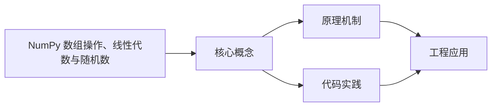

## 1. 学习目标（Bloom 分类）

本节按照布鲁姆教育目标分类学组织学习路径。本文主题为《NumPy 数组操作、线性代数与随机数》，属于 数据分析 模块，读者可以根据自身阶段选择阅读深度。

记忆层面：能够准确复述本文的核心概念、术语与基本语法或操作步骤，并能够在提问或检索时快速定位对应知识点。能够说出 数据分析 的核心概念、常用命令与流程。

理解层面：能够用自己的语言解释核心原理与工作机制，说明概念之间的因果关系，而不是机械记忆结论。能够解释 数据分析 的工作原理与设计动机。

应用层面：能够在真实项目或练习场景中运用本文知识解决具体问题，写出正确且可维护的实现。能够独立完成 数据分析 的标准操作。

分析层面：能够拆解复杂问题，比较本文主题与相邻概念的异同，识别边界条件与例外情况。能够分析 数据分析 使用中的异常与边界。

评价层面：能够根据约束条件（性能、可读性、安全、成本）评价不同方案的优劣，做出有依据的技术决策。能够评价 数据分析 相关工具与方案。

创造层面：能够把本文知识与其他模块知识组合，设计出新的解决方案或可复用的工程模式。能够把 数据分析 融入团队工作流。

通过本节学习，读者应当能够把《NumPy 数组操作、线性代数与随机数》纳入自己的知识网络，并与 数据分析 模块的其他主题（数据清洗、可视化、统计、报告）建立关联。

## 2. 历史动机与发展脉络

《NumPy 数组操作、线性代数与随机数》是 数据分析 领域的重要主题。要真正理解它，需要先了解它解决的问题与演进过程。

数据分析是从数据中提取决策信息的工程过程：定义问题 -> 采集 -> 清洗 -> 探索 -> 建模 -> 可视化 -> 报告。
工具链：Python（Pandas/NumPy）、SQL、Jupyter、BI（Tableau/PowerBI）；Excel 仍是轻量入口。
方法：描述性分析（发生了什么）、诊断（为什么）、预测（会怎样）、规范（该怎么办）。

回到本文主题：NumPy 数组操作、线性代数与随机数 的提出与成熟，正是上述技术背景下的必然产物。早期实现往往以简单可用为目标，随着工程规模扩大，社区逐渐沉淀出标准做法与最佳实践；理解这一脉络，可以帮助读者判断“为什么文档中的推荐写法是现在这个样子”，也能在遇到历史遗留代码时准确识别其设计年代与取舍。


## 3. 形式化定义与核心概念精讲

本节把《NumPy 数组操作、线性代数与随机数》涉及的核心概念以“定义 + 讲解”的形式展开。读者应把定义当作工具，把讲解当作理解路径；两者结合才能形成可迁移的知识。

数据形态：表格（结构化）、序列（时间）、文本、图像；分析前确定数据类型（数值/类别/顺序）。
清洗：缺失值（删除/填充）、异常值（IQR/z-score）、重复、类型转换；清洗决定结果可信度。
探索性分析（EDA）：分布（直方图）、集中趋势（均值/中位数）、离散（方差/IQR）、相关性。

### 3.1 原文章节逐一精讲

原文档把主题拆分为 31 个小节，下面按顺序给出每一节的导读讲解，随后保留原文细节供精读。

#### 原文精读（完整保留）

# NumPy 数组创建

> **符号约定**：`< >` 必填参数 | `[ ]` 可选参数

---

#### 1. NumPy 简介

##### 1.1 为什么需要 NumPy

Python 原生列表虽然灵活，但在数值计算场景下存在三个根本性缺陷：

1. **性能低下**：列表存储的是对象引用，每个元素需要额外的类型信息和引用开销
2. **缺乏向量化**：对列表元素做运算需要显式循环，无法利用 CPU 的 SIMD 指令
3. **无广播机制**：不同形状的数据无法直接运算
   NumPy 的 `ndarray` 通过以下设计解决了这些问题：

- 连续内存布局，无引用开销
- 固定数据类型（dtype），支持 CPU 向量化指令
- 广播机制，自动处理不同形状的数组运算
  > **为什么理解这些底层差异很重要？** 因为它决定了你何时应该用 NumPy、何时用 Python 列表。对于数值密集型运算，NumPy 可以比原生 Python 快 10-100 倍；但对于少量元素的异构数据操作，Python 列表反而更灵活。

##### 1.2 NumPy 在生态中的位置

NumPy 是 Python 科学计算生态的基石。Pandas 的 Series/DataFrame 底层基于 NumPy 数组，Matplotlib 的数值处理依赖 NumPy，SciPy 的算法以 NumPy 数组为输入输出。理解 NumPy 是使用这些上层库的前提。

> 跨模块参考：[Python 基础](python/overview) 中的列表、元组概念是理解 NumPy 数组的基础。

```python
 import numpy as np
 print(np.__version__)
```

#### **输出说明**：打印当前安装的 NumPy 版本号，确认环境可用。

#### 2. ndarray 创建与属性

##### 2.1 核心属性

`ndarray` 是 NumPy 的核心数据结构，每个数组有以下关键属性：

| 属性       | 含义               | 示例                         |
| ---------- | ------------------ | ---------------------------- |
| `ndim`     | 维度数（轴数）     | 2D 数组的 ndim 为 2          |
| `shape`    | 各维度大小（元组） | (3, 4) 表示 3 行 4 列        |
| `size`     | 元素总数           | shape 为 (3,4) 时 size 为 12 |
| `dtype`    | 元素数据类型       | float64, int32, bool 等      |
| `itemsize` | 每个元素的字节数   | float64 为 8 字节            |
| `nbytes`   | 数组总字节数       | size \* itemsize             |

##### 2.2 从已有数据创建

```python
 import numpy as np
 arr1 = np.array([1, 2, 3, 4])
 print(f"1D: shape={arr1.shape}, dtype={arr1.dtype}")
 arr2 = np.array([[1, 2, 3], [4, 5, 6]])
 print(f"2D: shape={arr2.shape}, dtype={arr2.dtype}")
 arr3 = np.array([1, 2, 3], dtype=np.float64)
 print(f"指定dtype: {arr3.dtype}")
 arr4 = np.array([1.1, 2.9, 3.5], dtype=np.int32)
 print(f"浮点转整数(截断): {arr4}")
```

**输出说明**：

- `arr1` 是一维数组，shape 为 (4,)，dtype 自动推断为 int64
- `arr2` 是二维数组，shape 为 (2, 3)
- `arr3` 显式指定 float64 类型
- `arr4` 从浮点数创建整数数组时，小数部分被截断（不是四舍五入）

##### 2.3 内置创建函数

```python
 import numpy as np
 zeros = np.zeros((3, 4))
 print(f"zeros: shape={zeros.shape}, dtype={zeros.dtype}")
 ones = np.ones((2, 3), dtype=np.int32)
 print(f"ones: {ones}")
 empty = np.empty((2, 2))
 print(f"empty: 未初始化的随机值，shape={empty.shape}")
 full = np.full((2, 3), fill_value=7.0)
 print(f"full: \n{full}")
 eye = np.eye(3)
 print(f"eye(3): 单位矩阵\n{eye}")
 arange = np.arange(0, 10, 2)
 print(f"arange(0,10,2): {arange}")
 linspace = np.linspace(0, 1, 5)
 print(f"linspace(0,1,5): {linspace}")
 logspace = np.logspace(1, 3, 3)
 print(f"logspace(1,3,3): {logspace}")
```

**输出说明**：

- `np.zeros` 创建全零数组，默认 dtype 为 float64
- `np.ones` 创建全一数组，可指定 dtype
- `np.empty` 创建未初始化数组，值取决于内存中的残留数据，速度比 zeros 快
- `np.full` 用指定值填充数组
- `np.eye` 创建单位矩阵（对角线为 1）
- `np.arange` 类似 Python 的 range，但返回数组，步长可以是浮点数
- `np.linspace` 在指定区间内均匀生成 N 个点，包含端点
- `np.logspace` 在对数尺度上均匀生成点
  > **为什么 `np.linspace` 比 `np.arange` 更适合绘图？** `arange` 的步长可能因浮点精度导致端点不精确，而 `linspace` 直接指定点数，保证包含两个端点，在生成绘图坐标轴时更可靠。

##### 2.4 随机数创建

```python
 import numpy as np
 rng = np.random.default_rng(seed=42)
 uniform = rng.uniform(0, 1, size=(2, 3))
 print(f"均匀分布:\n{uniform}")
 normal = rng.normal(loc=0, scale=1, size=(2, 3))
 print(f"正态分布:\n{normal}")
 integers = rng.integers(0, 10, size=5)
 print(f"随机整数: {integers}")
 choice = rng.choice(['a', 'b', 'c'], size=5)
 print(f"随机选择: {choice}")
```

#### **输出说明**：使用 `default_rng` 新 API 创建随机数生成器，设置 seed 确保可复现。`uniform` 生成 [0,1) 均匀分布，`normal` 生成指定均值和标准差的正态分布，`integers` 生成指定范围的随机整数，`choice` 从给定列表中随机选择。

#### 3. 索引与切片

##### 3.1 基本索引

```python
 import numpy as np
 arr = np.arange(12).reshape(3, 4)
 print(f"原数组:\n{arr}")
 print(f"arr[0]: {arr[0]}")
 print(f"arr[1, 2]: {arr[1, 2]}")
 print(f"arr[-1, -1]: {arr[-1, -1]}")
```

**输出说明**：二维数组的索引方式为 `arr[row, col]`，支持负数索引。`arr[0]` 返回第一行（一维数组），`arr[1, 2]` 返回第 2 行第 3 列的元素。

##### 3.2 切片

```python
 import numpy as np
 arr = np.arange(12).reshape(3, 4)
 print(f"前两行:\n{arr[:2]}")
 print(f"所有行，第2-3列:\n{arr[:, 1:3]}")
 print(f"每隔一行:\n{arr[::2]}")
 print(f"逆序行:\n{arr[::-1]}")
```

**输出说明**：切片语法 `start:stop:step` 适用于每个维度。`arr[:2]` 取前 2 行，`arr[:, 1:3]` 取所有行的第 2、3 列，`arr[::2]` 每隔一行取一行，`arr[::-1]` 行逆序。

> **关键概念：切片返回视图（View）而非拷贝（Copy）**。这意味着修改切片会影响原数组。这是 NumPy 为了避免大数据复制而做的设计选择。如果需要独立副本，必须显式调用 `.copy()`。

```python
 import numpy as np
 arr = np.arange(6)
 slice_arr = arr[2:5]
 slice_arr[0] = 999
 print(f"原数组被修改: {arr}")
 arr2 = np.arange(6)
 copy_arr = arr2[2:5].copy()
 copy_arr[0] = 999
 print(f"原数组未被修改: {arr2}")
```

**输出说明**：第一个示例中，修改 `slice_arr` 后原数组 `arr` 也被修改，因为切片是视图。第二个示例使用 `.copy()` 创建独立副本，修改不影响原数组。

##### 3.3 布尔索引

```python
 import numpy as np
 arr = np.array([12, 5, 18, 3, 25, 8, 15])
 mask = arr > 10
 print(f"布尔掩码: {mask}")
 print(f"大于10的元素: {arr[mask]}")
 arr[arr > 10] = 0
 print(f"将大于10的元素置零: {arr}")
```

**输出说明**：布尔索引通过条件表达式生成布尔数组作为掩码，`arr[mask]` 返回满足条件的元素。布尔索引返回的是拷贝，不是视图。

##### 3.4 花式索引（Fancy Indexing）

```python
 import numpy as np
 arr = np.arange(10, 20)
 indices = [0, 3, 5, 7]
 print(f"指定位置: {arr[indices]}")
 arr2d = np.arange(12).reshape(3, 4)
 rows = [0, 1, 2]
 cols = [1, 3, 0]
 print(f"对角选取: {arr2d[rows, cols]}")
 print(f"选取特定行:\n{arr2d[0, 2](0, 2)}")
```

**输出说明**：花式索引使用整数数组作为索引。`arr2d[rows, cols]` 同时指定行和列的索引，选取 (0,1)、(1,3)、(2,0) 三个位置的元素。花式索引返回拷贝，不是视图。

> **视图 vs 拷贝速查**：
>
> - 基本切片 -> 视图
> - 布尔索引 -> 拷贝
> - 花式索引 -> 拷贝
> - `.copy()` -> 显式拷贝

---

#### 4. 数组形状操作

##### 4.1 reshape 与 flatten

```python
 import numpy as np
 arr = np.arange(12)
 reshaped = arr.reshape(3, 4)
 print(f"reshape(3,4):\n{reshaped}")
 auto_reshaped = arr.reshape(3, -1)
 print(f"reshape(3,-1) 自动推断:\n{auto_reshaped}")
 flattened = reshaped.flatten()
 print(f"flatten: {flattened}")
 raveled = reshaped.ravel()
 print(f"ravel: {raveled}")
```

**输出说明**：

- `reshape` 改变数组形状，返回视图（如果可能），元素总数不变
- `-1` 表示自动推断该维度大小
- `flatten` 返回一维拷贝，修改不影响原数组
- `ravel` 返回一维视图（如果可能），修改可能影响原数组
  > **为什么 reshape 返回视图而 flatten 返回拷贝？** reshape 只改变数组的"视图"（步长和形状元数据），不移动数据，因此效率高。flatten 保证返回拷贝，更安全但更耗内存。在内存敏感场景下优先使用 ravel。

##### 4.2 转置与轴交换

```python
 import numpy as np
 arr = np.arange(12).reshape(3, 4)
 print(f"原数组 shape: {arr.shape}")
 print(f"转置 shape: {arr.T.shape}")
 arr3d = np.arange(24).reshape(2, 3, 4)
 print(f"3D原数组 shape: {arr3d.shape}")
 print(f"swapaxes(0,2) shape: {arr3d.swapaxes(0, 2).shape}")
 print(f"transpose(2,0,1) shape: {arr3d.transpose(2, 0, 1).shape}")
```

**输出说明**：

- `.T` 是转置的简写，等价于 `transpose()`
- `swapaxes(i, j)` 交换两个轴
- `transpose(*axes)` 按指定顺序重排所有轴
- 转置操作返回视图，不复制数据

##### 4.3 数组拼接与分裂

```python
 import numpy as np
 a = np.array([[1, 2], [3, 4]])
 b = np.array([5, 6](5, 6))
 vstack = np.vstack([a, b])
 print(f"vstack 垂直拼接:\n{vstack}")
 hstack = np.hstack([a, b.T])
 print(f"hstack 水平拼接:\n{hstack}")
 c = np.array([7, 8])
 concat_axis0 = np.concatenate([a, c.reshape(1, 2)], axis=0)
 print(f"concatenate axis=0:\n{concat_axis0}")
 stack = np.stack([a, a], axis=0)
 print(f"stack axis=0 shape: {stack.shape}")
 arr = np.arange(12).reshape(3, 4)
 split = np.hsplit(arr, 2)
 print(f"hsplit 分成2部分: [shape={s.shape} for s in split]")
```

**输出说明**：

- `vstack` 垂直拼接（沿 axis=0），要求列数相同
- `hstack` 水平拼接（沿 axis=1），要求行数相同
- `concatenate` 是最通用的拼接函数，通过 axis 指定拼接方向
- `stack` 创建新维度进行拼接，与 concatenate 不同
- `hsplit`/`vsplit` 按指定方式分裂数组

---

#### 5. 广播机制

##### 5.1 广播规则

广播是 NumPy 处理不同形状数组运算的机制。规则如下：

1. 如果两个数组的维度数不同，较小维度数组的形状在左侧补 1
2. 如果两个数组在某个维度上的大小不同，大小为 1 的维度会被扩展
3. 如果两个数组在某个维度上大小不同且都不为 1，则报错
   > **为什么需要广播？** 广播避免了显式复制数据，既节省内存又简化代码。没有广播，你需要手动将标量扩展为与数组相同大小的数组，或使用循环逐元素运算。

##### 5.2 广播示例

```python
 import numpy as np
 a = np.array([[1], [2], [3]])
 b = np.array([10, 20, 30])
 print(f"a shape: {a.shape}, b shape: {b.shape}")
 result = a + b
 print(f"a + b:\n{result}")
 print(f"result shape: {result.shape}")
```

**输出说明**：a 的 shape 为 (3, 1)，b 的 shape 为 (3,)。广播过程：

1. b 补齐维度 -> (1, 3)
2. a 沿 axis=1 扩展 -> (3, 3)
3. b 沿 axis=0 扩展 -> (3, 3)
4. 两个 (3, 3) 数组逐元素相加

##### 5.3 常见广播场景

```python
 import numpy as np
 arr = np.arange(12).reshape(3, 4)
 print(f"原数组:\n{arr}")
 row_mean = arr.mean(axis=0)
 print(f"每列均值: {row_mean}")
 centered = arr - row_mean
 print(f"去均值后:\n{centered}")
 print(f"去均值后列均值: {centered.mean(axis=0)}")
 col_max = arr.max(axis=1, keepdims=True)
 print(f"每行最大值(keepdims): {col_max.T}")
 normalized = arr / col_max
 print(f"按行归一化:\n{normalized}")
```

**输出说明**：

- `arr.mean(axis=0)` 返回 shape 为 (4,) 的列均值，与 (3,4) 数组运算时自动广播
- `keepdims=` 保持维度，使结果 shape 为 (3,1) 而非 (3,)，便于后续广播运算
- 数据去均值是统计分析和机器学习中最常见的预处理步骤

##### 5.4 广播失败的情况

```python
 import numpy as np
 a = np.ones((3, 4))
 b = np.ones((2, 4))
 try:
  result = a + b
 except ValueError as e:
  print(f"广播失败: {e}")
 a = np.ones((3, 1))
 b = np.ones((1, 4))
 result = a + b
 print(f"可广播: (3,1) + (1,4) -> {result.shape}")
```

#### **输出说明**：shape (3,4) 和 (2,4) 在 axis=0 上大小不同且都不为 1，无法广播。而 (3,1) 和 (1,4) 可以广播为 (3,4)。

#### 6. 通用函数（ufunc）

##### 6.1 数学运算

```python
 import numpy as np
 x = np.array([0, np.pi/6, np.pi/4, np.pi/3, np.pi/2])
 print(f"sin: {np.sin(x)}")
 print(f"cos: {np.cos(x)}")
 print(f"tan: {np.tan(x)}")
 arr = np.array([1, 2, 3, 4, 5])
 print(f"exp: {np.exp(arr)}")
 print(f"log: {np.log(arr)}")
 print(f"log2: {np.log2(arr)}")
 print(f"log10: {np.log10(arr)}")
 print(f"sqrt: {np.sqrt(arr)}")
```

**输出说明**：NumPy 的三角函数、指数、对数等数学函数都是 ufunc，对数组逐元素运算并返回新数组。`np.log` 是自然对数，`np.log2` 和 `np.log10` 分别是以 2 和 10 为底的对数。

##### 6.2 比较运算

```python
 import numpy as np
 a = np.array([1, 5, 3, 8, 2])
 b = np.array([2, 4, 3, 6, 5])
 print(f"a > b: {np.greater(a, b)}")
 print(f"a == b: {np.equal(a, b)}")
 print(f"a >= b: {np.greater_equal(a, b)}")
 print(f"any(a > b): {np.any(a > b)}")
 print(f"all(a > b): {np.all(a > b)}")
```

**输出说明**：比较 ufunc 返回布尔数组。`np.any` 检查是否有任一元素为 True，`np.all` 检查是否所有元素为 True。

##### 6.3 out 参数与 where 条件

```python
 import numpy as np
 x = np.array([1, 2, 3, 4, 5])
 result = np.empty_like(x)
 np.multiply(x, 10, out=result)
 print(f"out参数: {result}")
 arr = np.array([-3, -1, 0, 2, 5])
 result = np.where(arr > 0, arr, 0)
 print(f"where条件(正数保留，其余置零): {result}")
 result2 = np.where(arr > 0, 'positive', 'non-positive')
 print(f"where条件(字符串): {result2}")
```

**输出说明**：

- `out` 参数指定输出数组，避免创建临时数组，节省内存
- `np.where(condition, x, y)` 是三元表达式的向量化版本，满足条件取 x，否则取 y

---

#### 7. 聚合与统计运算

##### 7.1 基本聚合函数

```python
 import numpy as np
 arr = np.random.default_rng(42).normal(loc=50, scale=10, size=(4, 5))
 print(f"数组:\n{arr}")
 print(f"总和: {arr.sum()}")
 print(f"均值: {arr.mean()}")
 print(f"标准差: {arr.std()}")
 print(f"方差: {arr.var()}")
 print(f"最小值: {arr.min()}")
 print(f"最大值: {arr.max()}")
 print(f"中位数: {np.median(arr)}")
```

**输出说明**：聚合函数对整个数组的所有元素进行计算，返回标量值。

##### 7.2 沿指定轴聚合

```python
 import numpy as np
 arr = np.random.default_rng(42).normal(loc=50, scale=10, size=(4, 5))
 print(f"每列均值 (axis=0): {arr.mean(axis=0)}")
 print(f"每行均值 (axis=1): {arr.mean(axis=1)}")
 print(f"每列最小值: {arr.min(axis=0)}")
 print(f"每行最大值: {arr.max(axis=1)}")
 print(f"累计和 (axis=1):\n{arr.cumsum(axis=1)}")
```

**输出说明**：

- `axis=0` 沿行方向聚合（对每列操作），结果维度减少一个
- `axis=1` 沿列方向聚合（对每行操作）
- `cumsum` 返回与原数组相同形状的累计和数组
  > **为什么 axis 参数容易混淆？** 关键理解：axis 指定的是"被消除的维度"。axis=0 消除行维度，即对每列做聚合；axis=1 消除列维度，即对每行做聚合。

##### 7.3 argmin/argmax 与百分位数

```python
 import numpy as np
 arr = np.array([23, 45, 12, 67, 34, 89, 56])
 print(f"最小值索引: {arr.argmin()}")
 print(f"最大值索引: {arr.argmax()}")
 print(f"25%分位数: {np.percentile(arr, 25)}")
 print(f"75%分位数: {np.percentile(arr, 75)}")
 print(f"IQR: {np.percentile(arr, 75) - np.percentile(arr, 25)}")
```

#### **输出说明**：`argmin`/`argmax` 返回最值的索引位置（而非值），在需要定位极值时非常有用。`percentile` 计算指定百分位的值，IQR（四分位距）是异常值检测的基础。

#### 8. 线性代数

##### 8.1 矩阵乘法

```python
 import numpy as np
 A = np.array([[1, 2], [3, 4]])
 B = np.array([[5, 6], [7, 8]])
 dot_product = np.dot(A, B)
 print(f"np.dot:\n{dot_product}")
 matmul = A @ B
 print(f"@ 运算符:\n{matmul}")
 element_wise = A * B
 print(f"逐元素乘法:\n{element_wise}")
```

**输出说明**：

- `np.dot` 和 `@` 运算符执行矩阵乘法（线性代数中的点积）
- `*` 是逐元素乘法（Hadamard 积），不是矩阵乘法
- 混淆这两种运算是初学者最常见的错误

##### 8.2 矩阵分解与求解

```python
 import numpy as np
 A = np.array([[3, 1], [1, 2]])
 b = np.array([9, 8])
 x = np.linalg.solve(A, b)
 print(f"线性方程组解: {x}")
 print(f"验证 Ax=b: {A @ x}")
 det = np.linalg.det(A)
 print(f"行列式: {det:.4f}")
 inv_A = np.linalg.inv(A)
 print(f"逆矩阵:\n{inv_A}")
 print(f"验证 A*A^-1=I:\n{A @ inv_A}")
 eigenvalues, eigenvectors = np.linalg.eig(A)
 print(f"特征值: {eigenvalues}")
 print(f"特征向量:\n{eigenvectors}")
```

**输出说明**：

- `np.linalg.solve(A, b)` 求解 Ax=b，比先求逆再乘更稳定高效
- `np.linalg.det` 计算行列式，行列式为 0 的矩阵不可逆
- `np.linalg.inv` 求逆矩阵，数值上不如 solve 稳定
- `np.linalg.eig` 返回特征值和特征向量，特征向量按列排列

##### 8.3 SVD 分解

```python
 import numpy as np
 A = np.array([[1, 2, 3], [4, 5, 6]])
 U, s, Vt = np.linalg.svd(A, full_matrices=False)
 print(f"U shape: {U.shape}")
 print(f"s (奇异值): {s}")
 print(f"Vt shape: {Vt.shape}")
 reconstructed = U @ np.diag(s) @ Vt
 print(f"重构误差: {np.allclose(A, reconstructed)}")
```

**输出说明**：SVD（奇异值分解）将矩阵分解为 U _ diag(s) _ Vt。`full_matrices=False` 返回精简分解。SVD 在降维（PCA）、推荐系统、图像压缩等领域有广泛应用。

> **为什么 SVD 比特征值分解更通用？** 特征值分解只适用于方阵，而 SVD 适用于任意形状的矩阵。且 SVD 总是数值稳定的，而特征值分解在某些情况下可能不稳定。

---

#### 9. 随机数生成

##### 9.1 新旧 API 对比

NumPy 1.17+ 推荐使用 `default_rng` 新 API，取代旧的 `np.random` 全局函数：

| 旧 API                      | 新 API                            | 说明                  |
| --------------------------- | --------------------------------- | --------------------- |
| `np.random.seed(42)`        | `rng = np.random.default_rng(42)` | 新 API 创建独立生成器 |
| `np.random.rand(3,4)`       | `rng.random((3,4))`               | [0,1) 均匀分布        |
| `np.random.randn(3,4)`      | `rng.standard_normal((3,4))`      | 标准正态分布          |
| `np.random.randint(0,10,5)` | `rng.integers(0,10,5)`            | 随机整数              |

> **为什么推荐新 API？** 旧 API 使用全局状态，在多线程或并行计算中可能导致随机数序列不可预测。新 API 的生成器是独立对象，状态隔离，更适合科学计算的可复现性要求。

##### 9.2 常见分布

```python
 import numpy as np
 rng = np.random.default_rng(seed=42)
 uniform = rng.uniform(low=0, high=10, size=5)
 print(f"均匀分布 U(0,10): {uniform}")
 normal = rng.normal(loc=0, scale=1, size=5)
 print(f"正态分布 N(0,1): {normal}")
 poisson = rng.poisson(lam=3, size=5)
 print(f"泊松分布 Pois(3): {poisson}")
 binomial = rng.binomial(n=10, p=0.5, size=5)
 print(f"二项分布 B(10,0.5): {binomial}")
 exponential = rng.exponential(scale=2, size=5)
 print(f"指数分布 Exp(2): {exponential}")
 chi2 = rng.chisquare(df=5, size=5)
 print(f"卡方分布 chi2(5): {chi2}")
```

**输出说明**：各分布的参数含义：

- `uniform(low, high)`：[low, high) 区间均匀分布
- `normal(loc, scale)`：均值 loc，标准差 scale 的正态分布
- `poisson(lam)`：期望 lam 的泊松分布
- `binomial(n, p)`：n 次试验，每次成功概率 p 的二项分布
- `exponential(scale)`：scale 为均值的指数分布
- `chisquare(df)`：自由度 df 的卡方分布

##### 9.3 随机抽样与洗牌

```python
 import numpy as np
 rng = np.random.default_rng(seed=42)
 arr = np.arange(10)
 rng.shuffle(arr)
 print(f"洗牌后: {arr}")
 sample = rng.choice(arr, size=5, replace=False)
 print(f"无放回抽样: {sample}")
 sample_replace = rng.choice(arr, size=8, replace=True)
 print(f"有放回抽样: {sample_replace}")
 weighted = rng.choice(['A', 'B', 'C'], size=10, p=[0.5, 0.3, 0.2])
 print(f"加权抽样: {weighted}")
```

**输出说明**：

- `shuffle` 原地打乱数组顺序
- `choice` 从数组中抽样，`replace=False` 为无放回，`replace=` 为有放回
- `p` 参数指定各元素的抽样概率，概率之和必须为 1

---

#### 10. 性能优化技巧

##### 10.1 向量化替代循环

```python
 import numpy as np
 rng = np.random.default_rng(42)
 data = rng.random(1_000_000)
 def loop_sum(arr):
  total = 0.0
  for x in arr:
  total += x
  return total
 loop_result = loop_sum(data)
 vectorized_result = data.sum()
 print(f"循环结果: {loop_result:.6f}")
 print(f"向量化结果: {vectorized_result:.6f}")
```

**输出说明**：两种方法结果相同，但向量化版本 `data.sum()` 比循环版本快数十倍。原因是 NumPy 的聚合函数底层使用 C 实现的向量化代码，避免了 Python 循环的解释器开销。

##### 10.2 预分配数组

```python
 import numpy as np
 n = 10000
 result_append = []
 for i in range(n):
  result_append.append(i ** 2)
 result_append = np.array(result_append)
 result_prealloc = np.empty(n)
 for i in range(n):
  result_prealloc[i] = i ** 2
 result_vectorized = np.arange(n) ** 2
 print(f"三种方法结果一致: {np.allclose(result_append, result_vectorized)}")
```

**输出说明**：预分配数组比动态 append 更高效，因为避免了反复的内存分配。但最佳方案始终是向量化操作。

##### 10.3 np.where 替代条件判断

```python
 import numpy as np
 arr = np.random.default_rng(42).standard_normal(100000)
 result_loop = np.empty_like(arr)
 for i in range(len(arr)):
  if arr[i] > 0:
  result_loop[i] = arr[i]
  else:
  result_loop[i] = 0
 result_where = np.where(arr > 0, arr, 0)
 print(f"结果一致: {np.allclose(result_loop, result_where)}")
```

**输出说明**：`np.where` 是条件判断的向量化替代，避免了逐元素的 Python 循环，性能提升显著。

##### 10.4 内存布局

```python
 import numpy as np
 arr_c = np.zeros((1000, 1000), order='C')
 arr_f = np.zeros((1000, 1000), order='F')
 print(f"C order (行优先): 连续访问一行的元素更快")
 print(f"F order (列优先): 连续访问一列的元素更快")
 print(f"arr_c flags:\n{arr_c.flags}")
```

**输出说明**：

- C order（行优先）：同一行的元素在内存中连续存储，按行遍历更快
- Fortran order（列优先）：同一列的元素在内存中连续存储，按列遍历更快
- 选择与访问模式匹配的内存布局可以显著提升缓存命中率

---

#### 11. 速查表

##### 11.1 数组创建

| 函数            | 说明            | 示例                 |
| --------------- | --------------- | -------------------- |
| `np.array()`    | 从列表/元组创建 | `np.array([1,2,3])`  |
| `np.zeros()`    | 全零数组        | `np.zeros((3,4))`    |
| `np.ones()`     | 全一数组        | `np.ones((2,3))`     |
| `np.empty()`    | 未初始化数组    | `np.empty((2,2))`    |
| `np.full()`     | 指定值填充      | `np.full((2,3), 7)`  |
| `np.eye()`      | 单位矩阵        | `np.eye(3)`          |
| `np.arange()`   | 等差序列        | `np.arange(0,10,2)`  |
| `np.linspace()` | 等间距点        | `np.linspace(0,1,5)` |
| `np.logspace()` | 对数间距点      | `np.logspace(1,3,3)` |

##### 11.2 索引与切片

| 操作     | 语法                   | 返回   |
| -------- | ---------------------- | ------ |
| 基本索引 | `arr[0, 1]`            | 标量   |
| 切片     | `arr[:2, 1:3]`         | 视图   |
| 布尔索引 | `arr[arr > 0]`         | 拷贝   |
| 花式索引 | `arr[[0,2], [1,3]]`    | 拷贝   |
| 条件替换 | `np.where(cond, x, y)` | 新数组 |

##### 11.3 形状操作

| 函数                            | 说明          | 返回       |
| ------------------------------- | ------------- | ---------- |
| `reshape()`                     | 改变形状      | 视图       |
| `ravel()`                       | 展平为一维    | 视图(可能) |
| `flatten()`                     | 展平为一维    | 拷贝       |
| `.T`                            | 转置          | 视图       |
| `concatenate()`                 | 拼接          | 新数组     |
| `vstack()`/`hstack()`           | 垂直/水平拼接 | 新数组     |
| `split()`/`hsplit()`/`vsplit()` | 分裂          | 列表       |

##### 11.4 线性代数

| 函数                     | 说明          |
| ------------------------ | ------------- |
| `np.dot(A, B)` / `A @ B` | 矩阵乘法      |
| `np.linalg.det(A)`       | 行列式        |
| `np.linalg.inv(A)`       | 逆矩阵        |
| `np.linalg.solve(A, b)`  | 解线性方程组  |
| `np.linalg.eig(A)`       | 特征值分解    |
| `np.linalg.svd(A)`       | 奇异值分解    |
| `np.linalg.norm(A)`      | 矩阵/向量范数 |

---

#### 12. 延伸阅读

- NumPy 官方文档：https://numpy.org/doc/stable/
- From Python to NumPy (Nicolas Rougier)：https://www.labri.fr/perso/nrougier/from-python-to-numpy/
- Linear Algebra and Its Applications (Gilbert Strang)
- 100 NumPy Exercises：https://github.com/rougier/numpy-100
#### np.array 创建数组

**基本写法：从列表创建数组**
`np.array(<列表>[, dtype=<类型>])`

```python
# 从列表创建 NumPy 数组
import numpy as np

arr = np.array([1, 2, 3])
arr = np.array([1, 2, 3], dtype=np.float64)
matrix = np.array([[1, 2], [3, 4]])
```

---

#### np.zeros 创建零数组

**基本写法：创建全零数组**
`np.zeros(<形状>[, dtype=<类型>])`

```python
# 创建全零数组
zeros_1d = np.zeros(5)
zeros_2d = np.zeros((3, 4))
zeros_int = np.zeros((2, 2), dtype=np.int32)
```

---

#### np.ones 创建全一数组

**基本写法：创建全一数组**
`np.ones(<形状>[, dtype=<类型>])`

```python
# 创建全一数组
ones_1d = np.ones(5)
ones_2d = np.ones((3, 4))
ones_float = np.ones((2, 2), dtype=np.float32)
```

---

#### np.full 创建指定值数组

**基本写法：创建填充指定值的数组**
`np.full(<形状>, <值>[, dtype=<类型>])`

```python
# 创建填充指定值的数组
arr = np.full((3, 3), 7)
arr = np.full((2, 2), np.nan)
```

---

#### np.eye 单位矩阵

**基本写法：创建单位矩阵**
`np.eye(<n>[, M=<列数>][, k=<对角偏移>][, dtype=<类型>])`

```python
# 创建单位矩阵
identity = np.eye(3)
rectangular = np.eye(3, 4)
offset = np.eye(3, k=1)
```

---

#### np.arange 范围数组

**基本写法：创建等差数列数组**
`np.arange([<start>,] <stop>[, <step>][, dtype=<类型>])`

```python
# 创建等差数列数组
arr = np.arange(10)
arr = np.arange(1, 10)
arr = np.arange(0, 10, 2)
arr = np.arange(0, 1, 0.1)
```

---

#### np.linspace 等间隔数组

**基本写法：创建线性等分数组**
`np.linspace(<start>, <stop>[, num=<个数>][, endpoint=<布尔>])`

```python
# 创建线性等间隔数组
arr = np.linspace(0, 10, num=5)
arr = np.linspace(0, 1, num=11, endpoint=True)
arr = np.linspace(0, 10, num=5, endpoint=False)
```

---

#### np.logspace 对数等分

**基本写法：创建对数等间隔数组**
`np.logspace(<start>, <stop>[, num=<个数>][, base=<底数>])`

```python
# 创建对数等间隔数组
arr = np.logspace(0, 2, num=3)  # 10^0, 10^1, 10^2
arr = np.logspace(0, 3, num=4, base=2)
```

---

#### np.random 随机数组

**基本写法：创建随机数组**
`np.random.rand(<形状>)`
`np.random.randn(<形状>)`
`np.random.randint(<low>, <high>, <形状>)`

```python
# 创建随机数组
uniform = np.random.rand(3, 3)              # [0,1) 均匀分布
normal = np.random.randn(3, 3)              # 标准正态分布
integers = np.random.randint(0, 10, size=5)  # [0,10) 随机整数
```

---

#### Generator 新式随机

**基本写法：使用新式随机生成器**
`rng = np.random.default_rng(<seed>)`
`rng.<方法>(<参数>)`

```python
# NumPy 2.x 推荐使用新式随机生成器
rng = np.random.default_rng(42)
arr = rng.random((3, 3))
arr = rng.standard_normal((3, 3))
arr = rng.integers(0, 10, size=5)
```

---

#### np.empty 未初始化数组

**基本写法：创建未初始化数组**
`np.empty(<形状>[, dtype=<类型>])`

```python
# 创建未初始化数组（值随机，性能最佳）
arr = np.empty((3, 3))
arr = np.empty_like(existing_array)
```

---

#### 数组属性

**基本写法：访问数组属性**
`<arr>.shape` | `<arr>.ndim` | `<arr>.size` | `<arr>.dtype`

```python
# 访问数组基本属性
arr = np.array([[1, 2, 3], [4, 5, 6]])
print(arr.shape)   # (2, 3)
print(arr.ndim)    # 2
print(arr.size)    # 6
print(arr.dtype)   # int64
```

---

#### np.reshape 形状变换

**基本写法：改变数组形状**
`<arr>.reshape(<形状>)`
`np.reshape(<arr>, <形状>)`

```python
# 改变数组形状
arr = np.arange(12)
matrix = arr.reshape(3, 4)
row_vector = arr.reshape(1, -1)
col_vector = arr.reshape(-1, 1)
```

---

#### np.copy 复制数组

**基本写法：复制数组**
`<arr>.copy()`
`np.copy(<arr>)`

```python
# 深拷贝数组
arr = np.array([1, 2, 3])
copy_arr = arr.copy()
copy_arr[0] = 99
print(arr[0])  # 1，原数组不变
```

---

#### astype 类型转换

**基本写法：转换数组数据类型**
`<arr>.astype(<新类型>)`

```python
# 转换数组数据类型
arr = np.array([1.5, 2.7, 3.2])
int_arr = arr.astype(np.int32)  # 截断小数部分
str_arr = arr.astype(str)
```


### 3.2 概念关系图

下面用 Mermaid 图表达本文核心概念之间的关系，帮助读者建立整体图景：



图中展示的是本文知识的结构化关系：核心概念是入口，原理机制解释“为什么”，代码实践演示“怎么做”，工程应用回答“何时用”。读者学习时可以把每个小节的内容挂接到对应节点上。

## 4. 理论推导与原理解析

本节深入《NumPy 数组操作、线性代数与随机数》背后的原理。理论部分不求面面俱到，而是聚焦“能解释现象、能指导实践”的关键推导。

数据形态：表格（结构化）、序列（时间）、文本、图像；分析前确定数据类型（数值/类别/顺序）。
清洗：缺失值（删除/填充）、异常值（IQR/z-score）、重复、类型转换；清洗决定结果可信度。
探索性分析（EDA）：分布（直方图）、集中趋势（均值/中位数）、离散（方差/IQR）、相关性。
可视化原则：图型匹配数据（趋势折线、比较柱状、构成饼/堆叠、关系散点），标注与叙事。

需要强调的是，理论推导与工程实践之间存在翻译层：理论给出的是理想化模型与边界条件，工程代码则必须处理真实环境中的例外。读者在学习时应先掌握理论的“标准情形”，再通过陷阱章节了解“非标准情形”。

## 5. 代码示例与逐行讲解

本节把原文中的代码示例系统整理，并为每个示例补充用途说明与讲解。读者不应只浏览代码，而应逐段对照讲解理解设计意图。

### 5.1 示例：1.2 NumPy 在生态中的位置

该示例来自原文《1.2 NumPy 在生态中的位置》小节，用于演示NumPy 数组操作、线性代数与随机数相关操作。阅读时请先看代码结构，再看其后的讲解。

```python
 import numpy as np
 print(np.__version__)
```

讲解：这段代码演示了本节核心知识点。代码中的关键操作可以归纳为三步：准备（定义或初始化）、执行（核心逻辑）、收尾（释放资源或返回结果）。实际项目中，这三步往往被封装为函数或类，以提升复用性与可测试性。

关键点分析：

该示例共 2 行有效代码，包含 1 类关键结构（import）。其中：

- 入口与初始化部分负责建立上下文，对应实际项目中的启动或装配逻辑；
- 核心逻辑部分体现本文主题的主要操作，是阅读时最需要对照讲解理解的部分；
- 输出或返回部分把结果交给调用方，注意其类型与边界条件。

进阶思考路径：先尝试修改参数观察行为变化，再把示例中的模式迁移到自己的项目中；每次修改都记录预期与实测差异，这是把示例转化为能力的最快方式。

### 5.2 示例：2.2 从已有数据创建

该示例来自原文《2.2 从已有数据创建》小节，用于演示NumPy 数组操作、线性代数与随机数相关操作。阅读时请先看代码结构，再看其后的讲解。

```python
 import numpy as np
 arr1 = np.array([1, 2, 3, 4])
 print(f"1D: shape={arr1.shape}, dtype={arr1.dtype}")
 arr2 = np.array([[1, 2, 3], [4, 5, 6]])
 print(f"2D: shape={arr2.shape}, dtype={arr2.dtype}")
 arr3 = np.array([1, 2, 3], dtype=np.float64)
 print(f"指定dtype: {arr3.dtype}")
 arr4 = np.array([1.1, 2.9, 3.5], dtype=np.int32)
 print(f"浮点转整数(截断): {arr4}")
```

讲解：这段代码演示了本节核心知识点。代码中的关键操作可以归纳为三步：准备（定义或初始化）、执行（核心逻辑）、收尾（释放资源或返回结果）。实际项目中，这三步往往被封装为函数或类，以提升复用性与可测试性。

关键点分析：

该示例共 9 行有效代码，包含 1 类关键结构（import）。其中：

- 入口与初始化部分负责建立上下文，对应实际项目中的启动或装配逻辑；
- 核心逻辑部分体现本文主题的主要操作，是阅读时最需要对照讲解理解的部分；
- 输出或返回部分把结果交给调用方，注意其类型与边界条件。

进阶思考路径：先尝试修改参数观察行为变化，再把示例中的模式迁移到自己的项目中；每次修改都记录预期与实测差异，这是把示例转化为能力的最快方式。

### 5.3 示例：2.3 内置创建函数

该示例来自原文《2.3 内置创建函数》小节，用于演示NumPy 数组操作、线性代数与随机数相关操作。阅读时请先看代码结构，再看其后的讲解。

```python
 import numpy as np
 zeros = np.zeros((3, 4))
 print(f"zeros: shape={zeros.shape}, dtype={zeros.dtype}")
 ones = np.ones((2, 3), dtype=np.int32)
 print(f"ones: {ones}")
 empty = np.empty((2, 2))
 print(f"empty: 未初始化的随机值，shape={empty.shape}")
 full = np.full((2, 3), fill_value=7.0)
 print(f"full: \n{full}")
 eye = np.eye(3)
 print(f"eye(3): 单位矩阵\n{eye}")
 arange = np.arange(0, 10, 2)
 print(f"arange(0,10,2): {arange}")
 linspace = np.linspace(0, 1, 5)
 print(f"linspace(0,1,5): {linspace}")
 logspace = np.logspace(1, 3, 3)
 print(f"logspace(1,3,3): {logspace}")
```

讲解：这段代码演示了本节核心知识点。代码中的关键操作可以归纳为三步：准备（定义或初始化）、执行（核心逻辑）、收尾（释放资源或返回结果）。实际项目中，这三步往往被封装为函数或类，以提升复用性与可测试性。

关键点分析：

该示例共 17 行有效代码，包含 1 类关键结构（import）。其中：

- 入口与初始化部分负责建立上下文，对应实际项目中的启动或装配逻辑；
- 核心逻辑部分体现本文主题的主要操作，是阅读时最需要对照讲解理解的部分；
- 输出或返回部分把结果交给调用方，注意其类型与边界条件。

进阶思考路径：先尝试修改参数观察行为变化，再把示例中的模式迁移到自己的项目中；每次修改都记录预期与实测差异，这是把示例转化为能力的最快方式。

### 5.4 示例：2.4 随机数创建

该示例来自原文《2.4 随机数创建》小节，用于演示NumPy 数组操作、线性代数与随机数相关操作。阅读时请先看代码结构，再看其后的讲解。

```python
 import numpy as np
 rng = np.random.default_rng(seed=42)
 uniform = rng.uniform(0, 1, size=(2, 3))
 print(f"均匀分布:\n{uniform}")
 normal = rng.normal(loc=0, scale=1, size=(2, 3))
 print(f"正态分布:\n{normal}")
 integers = rng.integers(0, 10, size=5)
 print(f"随机整数: {integers}")
 choice = rng.choice(['a', 'b', 'c'], size=5)
 print(f"随机选择: {choice}")
```

讲解：这段代码演示了本节核心知识点。代码中的关键操作可以归纳为三步：准备（定义或初始化）、执行（核心逻辑）、收尾（释放资源或返回结果）。实际项目中，这三步往往被封装为函数或类，以提升复用性与可测试性。

关键点分析：

该示例共 10 行有效代码，包含 1 类关键结构（import）。其中：

- 入口与初始化部分负责建立上下文，对应实际项目中的启动或装配逻辑；
- 核心逻辑部分体现本文主题的主要操作，是阅读时最需要对照讲解理解的部分；
- 输出或返回部分把结果交给调用方，注意其类型与边界条件。

进阶思考路径：先尝试修改参数观察行为变化，再把示例中的模式迁移到自己的项目中；每次修改都记录预期与实测差异，这是把示例转化为能力的最快方式。

### 5.5 示例：3.1 基本索引

该示例来自原文《3.1 基本索引》小节，用于演示NumPy 数组操作、线性代数与随机数相关操作。阅读时请先看代码结构，再看其后的讲解。

```python
 import numpy as np
 arr = np.arange(12).reshape(3, 4)
 print(f"原数组:\n{arr}")
 print(f"arr[0]: {arr[0]}")
 print(f"arr[1, 2]: {arr[1, 2]}")
 print(f"arr[-1, -1]: {arr[-1, -1]}")
```

讲解：这段代码演示了本节核心知识点。代码中的关键操作可以归纳为三步：准备（定义或初始化）、执行（核心逻辑）、收尾（释放资源或返回结果）。实际项目中，这三步往往被封装为函数或类，以提升复用性与可测试性。

关键点分析：

该示例共 6 行有效代码，包含 1 类关键结构（import）。其中：

- 入口与初始化部分负责建立上下文，对应实际项目中的启动或装配逻辑；
- 核心逻辑部分体现本文主题的主要操作，是阅读时最需要对照讲解理解的部分；
- 输出或返回部分把结果交给调用方，注意其类型与边界条件。

进阶思考路径：先尝试修改参数观察行为变化，再把示例中的模式迁移到自己的项目中；每次修改都记录预期与实测差异，这是把示例转化为能力的最快方式。

### 5.6 示例：3.2 切片

该示例来自原文《3.2 切片》小节，用于演示NumPy 数组操作、线性代数与随机数相关操作。阅读时请先看代码结构，再看其后的讲解。

```python
 import numpy as np
 arr = np.arange(12).reshape(3, 4)
 print(f"前两行:\n{arr[:2]}")
 print(f"所有行，第2-3列:\n{arr[:, 1:3]}")
 print(f"每隔一行:\n{arr[::2]}")
 print(f"逆序行:\n{arr[::-1]}")
```

讲解：这段代码演示了本节核心知识点。代码中的关键操作可以归纳为三步：准备（定义或初始化）、执行（核心逻辑）、收尾（释放资源或返回结果）。实际项目中，这三步往往被封装为函数或类，以提升复用性与可测试性。

关键点分析：

该示例共 6 行有效代码，包含 1 类关键结构（import）。其中：

- 入口与初始化部分负责建立上下文，对应实际项目中的启动或装配逻辑；
- 核心逻辑部分体现本文主题的主要操作，是阅读时最需要对照讲解理解的部分；
- 输出或返回部分把结果交给调用方，注意其类型与边界条件。

进阶思考路径：先尝试修改参数观察行为变化，再把示例中的模式迁移到自己的项目中；每次修改都记录预期与实测差异，这是把示例转化为能力的最快方式。

### 5.7 示例：3.2 切片

该示例来自原文《3.2 切片》小节，用于演示NumPy 数组操作、线性代数与随机数相关操作。阅读时请先看代码结构，再看其后的讲解。

```python
 import numpy as np
 arr = np.arange(6)
 slice_arr = arr[2:5]
 slice_arr[0] = 999
 print(f"原数组被修改: {arr}")
 arr2 = np.arange(6)
 copy_arr = arr2[2:5].copy()
 copy_arr[0] = 999
 print(f"原数组未被修改: {arr2}")
```

讲解：这段代码演示了本节核心知识点。代码中的关键操作可以归纳为三步：准备（定义或初始化）、执行（核心逻辑）、收尾（释放资源或返回结果）。实际项目中，这三步往往被封装为函数或类，以提升复用性与可测试性。

关键点分析：

该示例共 9 行有效代码，包含 1 类关键结构（import）。其中：

- 入口与初始化部分负责建立上下文，对应实际项目中的启动或装配逻辑；
- 核心逻辑部分体现本文主题的主要操作，是阅读时最需要对照讲解理解的部分；
- 输出或返回部分把结果交给调用方，注意其类型与边界条件。

进阶思考路径：先尝试修改参数观察行为变化，再把示例中的模式迁移到自己的项目中；每次修改都记录预期与实测差异，这是把示例转化为能力的最快方式。

### 5.8 示例：3.3 布尔索引

该示例来自原文《3.3 布尔索引》小节，用于演示NumPy 数组操作、线性代数与随机数相关操作。阅读时请先看代码结构，再看其后的讲解。

```python
 import numpy as np
 arr = np.array([12, 5, 18, 3, 25, 8, 15])
 mask = arr > 10
 print(f"布尔掩码: {mask}")
 print(f"大于10的元素: {arr[mask]}")
 arr[arr > 10] = 0
 print(f"将大于10的元素置零: {arr}")
```

讲解：这段代码演示了本节核心知识点。代码中的关键操作可以归纳为三步：准备（定义或初始化）、执行（核心逻辑）、收尾（释放资源或返回结果）。实际项目中，这三步往往被封装为函数或类，以提升复用性与可测试性。

关键点分析：

该示例共 7 行有效代码，包含 1 类关键结构（import）。其中：

- 入口与初始化部分负责建立上下文，对应实际项目中的启动或装配逻辑；
- 核心逻辑部分体现本文主题的主要操作，是阅读时最需要对照讲解理解的部分；
- 输出或返回部分把结果交给调用方，注意其类型与边界条件。

进阶思考路径：先尝试修改参数观察行为变化，再把示例中的模式迁移到自己的项目中；每次修改都记录预期与实测差异，这是把示例转化为能力的最快方式。

### 5.9 示例：3.4 花式索引（Fancy Indexing）

该示例来自原文《3.4 花式索引（Fancy Indexing）》小节，用于演示NumPy 数组操作、线性代数与随机数相关操作。阅读时请先看代码结构，再看其后的讲解。

```python
 import numpy as np
 arr = np.arange(10, 20)
 indices = [0, 3, 5, 7]
 print(f"指定位置: {arr[indices]}")
 arr2d = np.arange(12).reshape(3, 4)
 rows = [0, 1, 2]
 cols = [1, 3, 0]
 print(f"对角选取: {arr2d[rows, cols]}")
 print(f"选取特定行:\n{arr2d[0, 2](0, 2)}")
```

讲解：这段代码演示了本节核心知识点。代码中的关键操作可以归纳为三步：准备（定义或初始化）、执行（核心逻辑）、收尾（释放资源或返回结果）。实际项目中，这三步往往被封装为函数或类，以提升复用性与可测试性。

关键点分析：

该示例共 9 行有效代码，包含 1 类关键结构（import）。其中：

- 入口与初始化部分负责建立上下文，对应实际项目中的启动或装配逻辑；
- 核心逻辑部分体现本文主题的主要操作，是阅读时最需要对照讲解理解的部分；
- 输出或返回部分把结果交给调用方，注意其类型与边界条件。

进阶思考路径：先尝试修改参数观察行为变化，再把示例中的模式迁移到自己的项目中；每次修改都记录预期与实测差异，这是把示例转化为能力的最快方式。

### 5.10 示例：4.1 reshape 与 flatten

该示例来自原文《4.1 reshape 与 flatten》小节，用于演示NumPy 数组操作、线性代数与随机数相关操作。阅读时请先看代码结构，再看其后的讲解。

```python
 import numpy as np
 arr = np.arange(12)
 reshaped = arr.reshape(3, 4)
 print(f"reshape(3,4):\n{reshaped}")
 auto_reshaped = arr.reshape(3, -1)
 print(f"reshape(3,-1) 自动推断:\n{auto_reshaped}")
 flattened = reshaped.flatten()
 print(f"flatten: {flattened}")
 raveled = reshaped.ravel()
 print(f"ravel: {raveled}")
```

讲解：这段代码演示了本节核心知识点。代码中的关键操作可以归纳为三步：准备（定义或初始化）、执行（核心逻辑）、收尾（释放资源或返回结果）。实际项目中，这三步往往被封装为函数或类，以提升复用性与可测试性。

关键点分析：

该示例共 10 行有效代码，包含 1 类关键结构（import）。其中：

- 入口与初始化部分负责建立上下文，对应实际项目中的启动或装配逻辑；
- 核心逻辑部分体现本文主题的主要操作，是阅读时最需要对照讲解理解的部分；
- 输出或返回部分把结果交给调用方，注意其类型与边界条件。

进阶思考路径：先尝试修改参数观察行为变化，再把示例中的模式迁移到自己的项目中；每次修改都记录预期与实测差异，这是把示例转化为能力的最快方式。

### 5.11 示例：4.2 转置与轴交换

该示例来自原文《4.2 转置与轴交换》小节，用于演示NumPy 数组操作、线性代数与随机数相关操作。阅读时请先看代码结构，再看其后的讲解。

```python
 import numpy as np
 arr = np.arange(12).reshape(3, 4)
 print(f"原数组 shape: {arr.shape}")
 print(f"转置 shape: {arr.T.shape}")
 arr3d = np.arange(24).reshape(2, 3, 4)
 print(f"3D原数组 shape: {arr3d.shape}")
 print(f"swapaxes(0,2) shape: {arr3d.swapaxes(0, 2).shape}")
 print(f"transpose(2,0,1) shape: {arr3d.transpose(2, 0, 1).shape}")
```

讲解：这段代码演示了本节核心知识点。代码中的关键操作可以归纳为三步：准备（定义或初始化）、执行（核心逻辑）、收尾（释放资源或返回结果）。实际项目中，这三步往往被封装为函数或类，以提升复用性与可测试性。

关键点分析：

该示例共 8 行有效代码，包含 1 类关键结构（import）。其中：

- 入口与初始化部分负责建立上下文，对应实际项目中的启动或装配逻辑；
- 核心逻辑部分体现本文主题的主要操作，是阅读时最需要对照讲解理解的部分；
- 输出或返回部分把结果交给调用方，注意其类型与边界条件。

进阶思考路径：先尝试修改参数观察行为变化，再把示例中的模式迁移到自己的项目中；每次修改都记录预期与实测差异，这是把示例转化为能力的最快方式。

### 5.12 示例：4.3 数组拼接与分裂

该示例来自原文《4.3 数组拼接与分裂》小节，用于演示NumPy 数组操作、线性代数与随机数相关操作。阅读时请先看代码结构，再看其后的讲解。

```python
 import numpy as np
 a = np.array([[1, 2], [3, 4]])
 b = np.array([5, 6](5, 6))
 vstack = np.vstack([a, b])
 print(f"vstack 垂直拼接:\n{vstack}")
 hstack = np.hstack([a, b.T])
 print(f"hstack 水平拼接:\n{hstack}")
 c = np.array([7, 8])
 concat_axis0 = np.concatenate([a, c.reshape(1, 2)], axis=0)
 print(f"concatenate axis=0:\n{concat_axis0}")
 stack = np.stack([a, a], axis=0)
 print(f"stack axis=0 shape: {stack.shape}")
 arr = np.arange(12).reshape(3, 4)
 split = np.hsplit(arr, 2)
 print(f"hsplit 分成2部分: [shape={s.shape} for s in split]")
```

讲解：这段代码演示了本节核心知识点。代码中的关键操作可以归纳为三步：准备（定义或初始化）、执行（核心逻辑）、收尾（释放资源或返回结果）。实际项目中，这三步往往被封装为函数或类，以提升复用性与可测试性。

关键点分析：

该示例共 15 行有效代码，包含 2 类关键结构（import、for）。其中：

- 入口与初始化部分负责建立上下文，对应实际项目中的启动或装配逻辑；
- 核心逻辑部分体现本文主题的主要操作，是阅读时最需要对照讲解理解的部分；
- 输出或返回部分把结果交给调用方，注意其类型与边界条件。

进阶思考路径：先尝试修改参数观察行为变化，再把示例中的模式迁移到自己的项目中；每次修改都记录预期与实测差异，这是把示例转化为能力的最快方式。

### 5.13 示例：5.2 广播示例

该示例来自原文《5.2 广播示例》小节，用于演示NumPy 数组操作、线性代数与随机数相关操作。阅读时请先看代码结构，再看其后的讲解。

```python
 import numpy as np
 a = np.array([[1], [2], [3]])
 b = np.array([10, 20, 30])
 print(f"a shape: {a.shape}, b shape: {b.shape}")
 result = a + b
 print(f"a + b:\n{result}")
 print(f"result shape: {result.shape}")
```

讲解：这段代码演示了本节核心知识点。代码中的关键操作可以归纳为三步：准备（定义或初始化）、执行（核心逻辑）、收尾（释放资源或返回结果）。实际项目中，这三步往往被封装为函数或类，以提升复用性与可测试性。

关键点分析：

该示例共 7 行有效代码，包含 1 类关键结构（import）。其中：

- 入口与初始化部分负责建立上下文，对应实际项目中的启动或装配逻辑；
- 核心逻辑部分体现本文主题的主要操作，是阅读时最需要对照讲解理解的部分；
- 输出或返回部分把结果交给调用方，注意其类型与边界条件。

进阶思考路径：先尝试修改参数观察行为变化，再把示例中的模式迁移到自己的项目中；每次修改都记录预期与实测差异，这是把示例转化为能力的最快方式。

### 5.14 示例：5.3 常见广播场景

该示例来自原文《5.3 常见广播场景》小节，用于演示NumPy 数组操作、线性代数与随机数相关操作。阅读时请先看代码结构，再看其后的讲解。

```python
 import numpy as np
 arr = np.arange(12).reshape(3, 4)
 print(f"原数组:\n{arr}")
 row_mean = arr.mean(axis=0)
 print(f"每列均值: {row_mean}")
 centered = arr - row_mean
 print(f"去均值后:\n{centered}")
 print(f"去均值后列均值: {centered.mean(axis=0)}")
 col_max = arr.max(axis=1, keepdims=True)
 print(f"每行最大值(keepdims): {col_max.T}")
 normalized = arr / col_max
 print(f"按行归一化:\n{normalized}")
```

讲解：这段代码演示了本节核心知识点。代码中的关键操作可以归纳为三步：准备（定义或初始化）、执行（核心逻辑）、收尾（释放资源或返回结果）。实际项目中，这三步往往被封装为函数或类，以提升复用性与可测试性。

关键点分析：

该示例共 12 行有效代码，包含 1 类关键结构（import）。其中：

- 入口与初始化部分负责建立上下文，对应实际项目中的启动或装配逻辑；
- 核心逻辑部分体现本文主题的主要操作，是阅读时最需要对照讲解理解的部分；
- 输出或返回部分把结果交给调用方，注意其类型与边界条件。

进阶思考路径：先尝试修改参数观察行为变化，再把示例中的模式迁移到自己的项目中；每次修改都记录预期与实测差异，这是把示例转化为能力的最快方式。

### 5.15 示例：5.4 广播失败的情况

该示例来自原文《5.4 广播失败的情况》小节，用于演示NumPy 数组操作、线性代数与随机数相关操作。阅读时请先看代码结构，再看其后的讲解。

```python
 import numpy as np
 a = np.ones((3, 4))
 b = np.ones((2, 4))
 try:
  result = a + b
 except ValueError as e:
  print(f"广播失败: {e}")
 a = np.ones((3, 1))
 b = np.ones((1, 4))
 result = a + b
 print(f"可广播: (3,1) + (1,4) -> {result.shape}")
```

讲解：这段代码演示了本节核心知识点。代码中的关键操作可以归纳为三步：准备（定义或初始化）、执行（核心逻辑）、收尾（释放资源或返回结果）。实际项目中，这三步往往被封装为函数或类，以提升复用性与可测试性。

关键点分析：

该示例共 11 行有效代码，包含 1 类关键结构（import）。其中：

- 入口与初始化部分负责建立上下文，对应实际项目中的启动或装配逻辑；
- 核心逻辑部分体现本文主题的主要操作，是阅读时最需要对照讲解理解的部分；
- 输出或返回部分把结果交给调用方，注意其类型与边界条件。

进阶思考路径：先尝试修改参数观察行为变化，再把示例中的模式迁移到自己的项目中；每次修改都记录预期与实测差异，这是把示例转化为能力的最快方式。

### 5.16 示例：6.1 数学运算

该示例来自原文《6.1 数学运算》小节，用于演示NumPy 数组操作、线性代数与随机数相关操作。阅读时请先看代码结构，再看其后的讲解。

```python
 import numpy as np
 x = np.array([0, np.pi/6, np.pi/4, np.pi/3, np.pi/2])
 print(f"sin: {np.sin(x)}")
 print(f"cos: {np.cos(x)}")
 print(f"tan: {np.tan(x)}")
 arr = np.array([1, 2, 3, 4, 5])
 print(f"exp: {np.exp(arr)}")
 print(f"log: {np.log(arr)}")
 print(f"log2: {np.log2(arr)}")
 print(f"log10: {np.log10(arr)}")
 print(f"sqrt: {np.sqrt(arr)}")
```

讲解：这段代码演示了本节核心知识点。代码中的关键操作可以归纳为三步：准备（定义或初始化）、执行（核心逻辑）、收尾（释放资源或返回结果）。实际项目中，这三步往往被封装为函数或类，以提升复用性与可测试性。

关键点分析：

该示例共 11 行有效代码，包含 1 类关键结构（import）。其中：

- 入口与初始化部分负责建立上下文，对应实际项目中的启动或装配逻辑；
- 核心逻辑部分体现本文主题的主要操作，是阅读时最需要对照讲解理解的部分；
- 输出或返回部分把结果交给调用方，注意其类型与边界条件。

进阶思考路径：先尝试修改参数观察行为变化，再把示例中的模式迁移到自己的项目中；每次修改都记录预期与实测差异，这是把示例转化为能力的最快方式。

### 5.17 示例：6.2 比较运算

该示例来自原文《6.2 比较运算》小节，用于演示NumPy 数组操作、线性代数与随机数相关操作。阅读时请先看代码结构，再看其后的讲解。

```python
 import numpy as np
 a = np.array([1, 5, 3, 8, 2])
 b = np.array([2, 4, 3, 6, 5])
 print(f"a > b: {np.greater(a, b)}")
 print(f"a == b: {np.equal(a, b)}")
 print(f"a >= b: {np.greater_equal(a, b)}")
 print(f"any(a > b): {np.any(a > b)}")
 print(f"all(a > b): {np.all(a > b)}")
```

讲解：这段代码演示了本节核心知识点。代码中的关键操作可以归纳为三步：准备（定义或初始化）、执行（核心逻辑）、收尾（释放资源或返回结果）。实际项目中，这三步往往被封装为函数或类，以提升复用性与可测试性。

关键点分析：

该示例共 8 行有效代码，包含 1 类关键结构（import）。其中：

- 入口与初始化部分负责建立上下文，对应实际项目中的启动或装配逻辑；
- 核心逻辑部分体现本文主题的主要操作，是阅读时最需要对照讲解理解的部分；
- 输出或返回部分把结果交给调用方，注意其类型与边界条件。

进阶思考路径：先尝试修改参数观察行为变化，再把示例中的模式迁移到自己的项目中；每次修改都记录预期与实测差异，这是把示例转化为能力的最快方式。

### 5.18 示例：6.3 out 参数与 where 条件

该示例来自原文《6.3 out 参数与 where 条件》小节，用于演示NumPy 数组操作、线性代数与随机数相关操作。阅读时请先看代码结构，再看其后的讲解。

```python
 import numpy as np
 x = np.array([1, 2, 3, 4, 5])
 result = np.empty_like(x)
 np.multiply(x, 10, out=result)
 print(f"out参数: {result}")
 arr = np.array([-3, -1, 0, 2, 5])
 result = np.where(arr > 0, arr, 0)
 print(f"where条件(正数保留，其余置零): {result}")
 result2 = np.where(arr > 0, 'positive', 'non-positive')
 print(f"where条件(字符串): {result2}")
```

讲解：这段代码演示了本节核心知识点。代码中的关键操作可以归纳为三步：准备（定义或初始化）、执行（核心逻辑）、收尾（释放资源或返回结果）。实际项目中，这三步往往被封装为函数或类，以提升复用性与可测试性。

关键点分析：

该示例共 10 行有效代码，包含 1 类关键结构（import）。其中：

- 入口与初始化部分负责建立上下文，对应实际项目中的启动或装配逻辑；
- 核心逻辑部分体现本文主题的主要操作，是阅读时最需要对照讲解理解的部分；
- 输出或返回部分把结果交给调用方，注意其类型与边界条件。

进阶思考路径：先尝试修改参数观察行为变化，再把示例中的模式迁移到自己的项目中；每次修改都记录预期与实测差异，这是把示例转化为能力的最快方式。

### 5.19 示例：7.1 基本聚合函数

该示例来自原文《7.1 基本聚合函数》小节，用于演示NumPy 数组操作、线性代数与随机数相关操作。阅读时请先看代码结构，再看其后的讲解。

```python
 import numpy as np
 arr = np.random.default_rng(42).normal(loc=50, scale=10, size=(4, 5))
 print(f"数组:\n{arr}")
 print(f"总和: {arr.sum()}")
 print(f"均值: {arr.mean()}")
 print(f"标准差: {arr.std()}")
 print(f"方差: {arr.var()}")
 print(f"最小值: {arr.min()}")
 print(f"最大值: {arr.max()}")
 print(f"中位数: {np.median(arr)}")
```

讲解：这段代码演示了本节核心知识点。代码中的关键操作可以归纳为三步：准备（定义或初始化）、执行（核心逻辑）、收尾（释放资源或返回结果）。实际项目中，这三步往往被封装为函数或类，以提升复用性与可测试性。

关键点分析：

该示例共 10 行有效代码，包含 1 类关键结构（import）。其中：

- 入口与初始化部分负责建立上下文，对应实际项目中的启动或装配逻辑；
- 核心逻辑部分体现本文主题的主要操作，是阅读时最需要对照讲解理解的部分；
- 输出或返回部分把结果交给调用方，注意其类型与边界条件。

进阶思考路径：先尝试修改参数观察行为变化，再把示例中的模式迁移到自己的项目中；每次修改都记录预期与实测差异，这是把示例转化为能力的最快方式。

### 5.20 示例：7.2 沿指定轴聚合

该示例来自原文《7.2 沿指定轴聚合》小节，用于演示NumPy 数组操作、线性代数与随机数相关操作。阅读时请先看代码结构，再看其后的讲解。

```python
 import numpy as np
 arr = np.random.default_rng(42).normal(loc=50, scale=10, size=(4, 5))
 print(f"每列均值 (axis=0): {arr.mean(axis=0)}")
 print(f"每行均值 (axis=1): {arr.mean(axis=1)}")
 print(f"每列最小值: {arr.min(axis=0)}")
 print(f"每行最大值: {arr.max(axis=1)}")
 print(f"累计和 (axis=1):\n{arr.cumsum(axis=1)}")
```

讲解：这段代码演示了本节核心知识点。代码中的关键操作可以归纳为三步：准备（定义或初始化）、执行（核心逻辑）、收尾（释放资源或返回结果）。实际项目中，这三步往往被封装为函数或类，以提升复用性与可测试性。

关键点分析：

该示例共 7 行有效代码，包含 1 类关键结构（import）。其中：

- 入口与初始化部分负责建立上下文，对应实际项目中的启动或装配逻辑；
- 核心逻辑部分体现本文主题的主要操作，是阅读时最需要对照讲解理解的部分；
- 输出或返回部分把结果交给调用方，注意其类型与边界条件。

进阶思考路径：先尝试修改参数观察行为变化，再把示例中的模式迁移到自己的项目中；每次修改都记录预期与实测差异，这是把示例转化为能力的最快方式。

### 5.21 示例：7.3 argmin/argmax 与百分位数

该示例来自原文《7.3 argmin/argmax 与百分位数》小节，用于演示NumPy 数组操作、线性代数与随机数相关操作。阅读时请先看代码结构，再看其后的讲解。

```python
 import numpy as np
 arr = np.array([23, 45, 12, 67, 34, 89, 56])
 print(f"最小值索引: {arr.argmin()}")
 print(f"最大值索引: {arr.argmax()}")
 print(f"25%分位数: {np.percentile(arr, 25)}")
 print(f"75%分位数: {np.percentile(arr, 75)}")
 print(f"IQR: {np.percentile(arr, 75) - np.percentile(arr, 25)}")
```

讲解：这段代码演示了本节核心知识点。代码中的关键操作可以归纳为三步：准备（定义或初始化）、执行（核心逻辑）、收尾（释放资源或返回结果）。实际项目中，这三步往往被封装为函数或类，以提升复用性与可测试性。

关键点分析：

该示例共 7 行有效代码，包含 1 类关键结构（import）。其中：

- 入口与初始化部分负责建立上下文，对应实际项目中的启动或装配逻辑；
- 核心逻辑部分体现本文主题的主要操作，是阅读时最需要对照讲解理解的部分；
- 输出或返回部分把结果交给调用方，注意其类型与边界条件。

进阶思考路径：先尝试修改参数观察行为变化，再把示例中的模式迁移到自己的项目中；每次修改都记录预期与实测差异，这是把示例转化为能力的最快方式。

### 5.22 示例：8.1 矩阵乘法

该示例来自原文《8.1 矩阵乘法》小节，用于演示NumPy 数组操作、线性代数与随机数相关操作。阅读时请先看代码结构，再看其后的讲解。

```python
 import numpy as np
 A = np.array([[1, 2], [3, 4]])
 B = np.array([[5, 6], [7, 8]])
 dot_product = np.dot(A, B)
 print(f"np.dot:\n{dot_product}")
 matmul = A @ B
 print(f"@ 运算符:\n{matmul}")
 element_wise = A * B
 print(f"逐元素乘法:\n{element_wise}")
```

讲解：这段代码演示了本节核心知识点。代码中的关键操作可以归纳为三步：准备（定义或初始化）、执行（核心逻辑）、收尾（释放资源或返回结果）。实际项目中，这三步往往被封装为函数或类，以提升复用性与可测试性。

关键点分析：

该示例共 9 行有效代码，包含 1 类关键结构（import）。其中：

- 入口与初始化部分负责建立上下文，对应实际项目中的启动或装配逻辑；
- 核心逻辑部分体现本文主题的主要操作，是阅读时最需要对照讲解理解的部分；
- 输出或返回部分把结果交给调用方，注意其类型与边界条件。

进阶思考路径：先尝试修改参数观察行为变化，再把示例中的模式迁移到自己的项目中；每次修改都记录预期与实测差异，这是把示例转化为能力的最快方式。

### 5.23 示例：8.2 矩阵分解与求解

该示例来自原文《8.2 矩阵分解与求解》小节，用于演示NumPy 数组操作、线性代数与随机数相关操作。阅读时请先看代码结构，再看其后的讲解。

```python
 import numpy as np
 A = np.array([[3, 1], [1, 2]])
 b = np.array([9, 8])
 x = np.linalg.solve(A, b)
 print(f"线性方程组解: {x}")
 print(f"验证 Ax=b: {A @ x}")
 det = np.linalg.det(A)
 print(f"行列式: {det:.4f}")
 inv_A = np.linalg.inv(A)
 print(f"逆矩阵:\n{inv_A}")
 print(f"验证 A*A^-1=I:\n{A @ inv_A}")
 eigenvalues, eigenvectors = np.linalg.eig(A)
 print(f"特征值: {eigenvalues}")
 print(f"特征向量:\n{eigenvectors}")
```

讲解：这段代码演示了本节核心知识点。代码中的关键操作可以归纳为三步：准备（定义或初始化）、执行（核心逻辑）、收尾（释放资源或返回结果）。实际项目中，这三步往往被封装为函数或类，以提升复用性与可测试性。

关键点分析：

该示例共 14 行有效代码，包含 1 类关键结构（import）。其中：

- 入口与初始化部分负责建立上下文，对应实际项目中的启动或装配逻辑；
- 核心逻辑部分体现本文主题的主要操作，是阅读时最需要对照讲解理解的部分；
- 输出或返回部分把结果交给调用方，注意其类型与边界条件。

进阶思考路径：先尝试修改参数观察行为变化，再把示例中的模式迁移到自己的项目中；每次修改都记录预期与实测差异，这是把示例转化为能力的最快方式。

### 5.24 示例：8.3 SVD 分解

该示例来自原文《8.3 SVD 分解》小节，用于演示NumPy 数组操作、线性代数与随机数相关操作。阅读时请先看代码结构，再看其后的讲解。

```python
 import numpy as np
 A = np.array([[1, 2, 3], [4, 5, 6]])
 U, s, Vt = np.linalg.svd(A, full_matrices=False)
 print(f"U shape: {U.shape}")
 print(f"s (奇异值): {s}")
 print(f"Vt shape: {Vt.shape}")
 reconstructed = U @ np.diag(s) @ Vt
 print(f"重构误差: {np.allclose(A, reconstructed)}")
```

讲解：这段代码演示了本节核心知识点。代码中的关键操作可以归纳为三步：准备（定义或初始化）、执行（核心逻辑）、收尾（释放资源或返回结果）。实际项目中，这三步往往被封装为函数或类，以提升复用性与可测试性。

关键点分析：

该示例共 8 行有效代码，包含 1 类关键结构（import）。其中：

- 入口与初始化部分负责建立上下文，对应实际项目中的启动或装配逻辑；
- 核心逻辑部分体现本文主题的主要操作，是阅读时最需要对照讲解理解的部分；
- 输出或返回部分把结果交给调用方，注意其类型与边界条件。

进阶思考路径：先尝试修改参数观察行为变化，再把示例中的模式迁移到自己的项目中；每次修改都记录预期与实测差异，这是把示例转化为能力的最快方式。

### 5.25 示例：9.2 常见分布

该示例来自原文《9.2 常见分布》小节，用于演示NumPy 数组操作、线性代数与随机数相关操作。阅读时请先看代码结构，再看其后的讲解。

```python
 import numpy as np
 rng = np.random.default_rng(seed=42)
 uniform = rng.uniform(low=0, high=10, size=5)
 print(f"均匀分布 U(0,10): {uniform}")
 normal = rng.normal(loc=0, scale=1, size=5)
 print(f"正态分布 N(0,1): {normal}")
 poisson = rng.poisson(lam=3, size=5)
 print(f"泊松分布 Pois(3): {poisson}")
 binomial = rng.binomial(n=10, p=0.5, size=5)
 print(f"二项分布 B(10,0.5): {binomial}")
 exponential = rng.exponential(scale=2, size=5)
 print(f"指数分布 Exp(2): {exponential}")
 chi2 = rng.chisquare(df=5, size=5)
 print(f"卡方分布 chi2(5): {chi2}")
```

讲解：这段代码演示了本节核心知识点。代码中的关键操作可以归纳为三步：准备（定义或初始化）、执行（核心逻辑）、收尾（释放资源或返回结果）。实际项目中，这三步往往被封装为函数或类，以提升复用性与可测试性。

关键点分析：

该示例共 14 行有效代码，包含 1 类关键结构（import）。其中：

- 入口与初始化部分负责建立上下文，对应实际项目中的启动或装配逻辑；
- 核心逻辑部分体现本文主题的主要操作，是阅读时最需要对照讲解理解的部分；
- 输出或返回部分把结果交给调用方，注意其类型与边界条件。

进阶思考路径：先尝试修改参数观察行为变化，再把示例中的模式迁移到自己的项目中；每次修改都记录预期与实测差异，这是把示例转化为能力的最快方式。

### 5.26 示例：9.3 随机抽样与洗牌

该示例来自原文《9.3 随机抽样与洗牌》小节，用于演示NumPy 数组操作、线性代数与随机数相关操作。阅读时请先看代码结构，再看其后的讲解。

```python
 import numpy as np
 rng = np.random.default_rng(seed=42)
 arr = np.arange(10)
 rng.shuffle(arr)
 print(f"洗牌后: {arr}")
 sample = rng.choice(arr, size=5, replace=False)
 print(f"无放回抽样: {sample}")
 sample_replace = rng.choice(arr, size=8, replace=True)
 print(f"有放回抽样: {sample_replace}")
 weighted = rng.choice(['A', 'B', 'C'], size=10, p=[0.5, 0.3, 0.2])
 print(f"加权抽样: {weighted}")
```

讲解：这段代码演示了本节核心知识点。代码中的关键操作可以归纳为三步：准备（定义或初始化）、执行（核心逻辑）、收尾（释放资源或返回结果）。实际项目中，这三步往往被封装为函数或类，以提升复用性与可测试性。

关键点分析：

该示例共 11 行有效代码，包含 1 类关键结构（import）。其中：

- 入口与初始化部分负责建立上下文，对应实际项目中的启动或装配逻辑；
- 核心逻辑部分体现本文主题的主要操作，是阅读时最需要对照讲解理解的部分；
- 输出或返回部分把结果交给调用方，注意其类型与边界条件。

进阶思考路径：先尝试修改参数观察行为变化，再把示例中的模式迁移到自己的项目中；每次修改都记录预期与实测差异，这是把示例转化为能力的最快方式。

### 5.27 示例：10.1 向量化替代循环

该示例来自原文《10.1 向量化替代循环》小节，用于演示NumPy 数组操作、线性代数与随机数相关操作。阅读时请先看代码结构，再看其后的讲解。

```python
 import numpy as np
 rng = np.random.default_rng(42)
 data = rng.random(1_000_000)
 def loop_sum(arr):
  total = 0.0
  for x in arr:
  total += x
  return total
 loop_result = loop_sum(data)
 vectorized_result = data.sum()
 print(f"循环结果: {loop_result:.6f}")
 print(f"向量化结果: {vectorized_result:.6f}")
```

讲解：这段代码演示了本节核心知识点。代码中的关键操作可以归纳为三步：准备（定义或初始化）、执行（核心逻辑）、收尾（释放资源或返回结果）。实际项目中，这三步往往被封装为函数或类，以提升复用性与可测试性。

关键点分析：

该示例共 12 行有效代码，包含 4 类关键结构（def、import、for、return）。其中：

- 入口与初始化部分负责建立上下文，对应实际项目中的启动或装配逻辑；
- 核心逻辑部分体现本文主题的主要操作，是阅读时最需要对照讲解理解的部分；
- 输出或返回部分把结果交给调用方，注意其类型与边界条件。

进阶思考路径：先尝试修改参数观察行为变化，再把示例中的模式迁移到自己的项目中；每次修改都记录预期与实测差异，这是把示例转化为能力的最快方式。

### 5.28 示例：10.2 预分配数组

该示例来自原文《10.2 预分配数组》小节，用于演示NumPy 数组操作、线性代数与随机数相关操作。阅读时请先看代码结构，再看其后的讲解。

```python
 import numpy as np
 n = 10000
 result_append = []
 for i in range(n):
  result_append.append(i ** 2)
 result_append = np.array(result_append)
 result_prealloc = np.empty(n)
 for i in range(n):
  result_prealloc[i] = i ** 2
 result_vectorized = np.arange(n) ** 2
 print(f"三种方法结果一致: {np.allclose(result_append, result_vectorized)}")
```

讲解：这段代码演示了本节核心知识点。代码中的关键操作可以归纳为三步：准备（定义或初始化）、执行（核心逻辑）、收尾（释放资源或返回结果）。实际项目中，这三步往往被封装为函数或类，以提升复用性与可测试性。

关键点分析：

该示例共 11 行有效代码，包含 2 类关键结构（import、for）。其中：

- 入口与初始化部分负责建立上下文，对应实际项目中的启动或装配逻辑；
- 核心逻辑部分体现本文主题的主要操作，是阅读时最需要对照讲解理解的部分；
- 输出或返回部分把结果交给调用方，注意其类型与边界条件。

进阶思考路径：先尝试修改参数观察行为变化，再把示例中的模式迁移到自己的项目中；每次修改都记录预期与实测差异，这是把示例转化为能力的最快方式。

### 5.29 示例：10.3 np.where 替代条件判断

该示例来自原文《10.3 np.where 替代条件判断》小节，用于演示NumPy 数组操作、线性代数与随机数相关操作。阅读时请先看代码结构，再看其后的讲解。

```python
 import numpy as np
 arr = np.random.default_rng(42).standard_normal(100000)
 result_loop = np.empty_like(arr)
 for i in range(len(arr)):
  if arr[i] > 0:
  result_loop[i] = arr[i]
  else:
  result_loop[i] = 0
 result_where = np.where(arr > 0, arr, 0)
 print(f"结果一致: {np.allclose(result_loop, result_where)}")
```

讲解：这段代码演示了本节核心知识点。代码中的关键操作可以归纳为三步：准备（定义或初始化）、执行（核心逻辑）、收尾（释放资源或返回结果）。实际项目中，这三步往往被封装为函数或类，以提升复用性与可测试性。

关键点分析：

该示例共 10 行有效代码，包含 3 类关键结构（import、if、for）。其中：

- 入口与初始化部分负责建立上下文，对应实际项目中的启动或装配逻辑；
- 核心逻辑部分体现本文主题的主要操作，是阅读时最需要对照讲解理解的部分；
- 输出或返回部分把结果交给调用方，注意其类型与边界条件。

进阶思考路径：先尝试修改参数观察行为变化，再把示例中的模式迁移到自己的项目中；每次修改都记录预期与实测差异，这是把示例转化为能力的最快方式。

### 5.30 示例：10.4 内存布局

该示例来自原文《10.4 内存布局》小节，用于演示NumPy 数组操作、线性代数与随机数相关操作。阅读时请先看代码结构，再看其后的讲解。

```python
 import numpy as np
 arr_c = np.zeros((1000, 1000), order='C')
 arr_f = np.zeros((1000, 1000), order='F')
 print(f"C order (行优先): 连续访问一行的元素更快")
 print(f"F order (列优先): 连续访问一列的元素更快")
 print(f"arr_c flags:\n{arr_c.flags}")
```

讲解：这段代码演示了本节核心知识点。代码中的关键操作可以归纳为三步：准备（定义或初始化）、执行（核心逻辑）、收尾（释放资源或返回结果）。实际项目中，这三步往往被封装为函数或类，以提升复用性与可测试性。

关键点分析：

该示例共 6 行有效代码，包含 1 类关键结构（import）。其中：

- 入口与初始化部分负责建立上下文，对应实际项目中的启动或装配逻辑；
- 核心逻辑部分体现本文主题的主要操作，是阅读时最需要对照讲解理解的部分；
- 输出或返回部分把结果交给调用方，注意其类型与边界条件。

进阶思考路径：先尝试修改参数观察行为变化，再把示例中的模式迁移到自己的项目中；每次修改都记录预期与实测差异，这是把示例转化为能力的最快方式。

### 5.31 示例：np.array 创建数组

该示例来自原文《np.array 创建数组》小节，用于演示NumPy 数组操作、线性代数与随机数相关操作。阅读时请先看代码结构，再看其后的讲解。

```python
# 从列表创建 NumPy 数组
import numpy as np

arr = np.array([1, 2, 3])
arr = np.array([1, 2, 3], dtype=np.float64)
matrix = np.array([[1, 2], [3, 4]])
```

讲解：这段代码演示了本节核心知识点。代码中的关键操作可以归纳为三步：准备（定义或初始化）、执行（核心逻辑）、收尾（释放资源或返回结果）。实际项目中，这三步往往被封装为函数或类，以提升复用性与可测试性。

关键点分析：

该示例共 5 行有效代码，包含 1 类关键结构（import）。其中：

- 入口与初始化部分负责建立上下文，对应实际项目中的启动或装配逻辑；
- 核心逻辑部分体现本文主题的主要操作，是阅读时最需要对照讲解理解的部分；
- 输出或返回部分把结果交给调用方，注意其类型与边界条件。

进阶思考路径：先尝试修改参数观察行为变化，再把示例中的模式迁移到自己的项目中；每次修改都记录预期与实测差异，这是把示例转化为能力的最快方式。

### 5.32 示例：np.zeros 创建零数组

该示例来自原文《np.zeros 创建零数组》小节，用于演示NumPy 数组操作、线性代数与随机数相关操作。阅读时请先看代码结构，再看其后的讲解。

```python
# 创建全零数组
zeros_1d = np.zeros(5)
zeros_2d = np.zeros((3, 4))
zeros_int = np.zeros((2, 2), dtype=np.int32)
```

讲解：这段代码演示了本节核心知识点。代码中的关键操作可以归纳为三步：准备（定义或初始化）、执行（核心逻辑）、收尾（释放资源或返回结果）。实际项目中，这三步往往被封装为函数或类，以提升复用性与可测试性。

关键点分析：

该示例共 4 行有效代码，结构以数据或配置为主。阅读时应关注：数据字段的含义、配置项的作用，以及它们与运行行为的对应关系。

进阶思考路径：先尝试修改参数观察行为变化，再把示例中的模式迁移到自己的项目中；每次修改都记录预期与实测差异，这是把示例转化为能力的最快方式。

### 5.33 示例：np.ones 创建全一数组

该示例来自原文《np.ones 创建全一数组》小节，用于演示NumPy 数组操作、线性代数与随机数相关操作。阅读时请先看代码结构，再看其后的讲解。

```python
# 创建全一数组
ones_1d = np.ones(5)
ones_2d = np.ones((3, 4))
ones_float = np.ones((2, 2), dtype=np.float32)
```

讲解：这段代码演示了本节核心知识点。代码中的关键操作可以归纳为三步：准备（定义或初始化）、执行（核心逻辑）、收尾（释放资源或返回结果）。实际项目中，这三步往往被封装为函数或类，以提升复用性与可测试性。

关键点分析：

该示例共 4 行有效代码，结构以数据或配置为主。阅读时应关注：数据字段的含义、配置项的作用，以及它们与运行行为的对应关系。

进阶思考路径：先尝试修改参数观察行为变化，再把示例中的模式迁移到自己的项目中；每次修改都记录预期与实测差异，这是把示例转化为能力的最快方式。

### 5.34 示例：np.full 创建指定值数组

该示例来自原文《np.full 创建指定值数组》小节，用于演示NumPy 数组操作、线性代数与随机数相关操作。阅读时请先看代码结构，再看其后的讲解。

```python
# 创建填充指定值的数组
arr = np.full((3, 3), 7)
arr = np.full((2, 2), np.nan)
```

讲解：这段代码演示了本节核心知识点。代码中的关键操作可以归纳为三步：准备（定义或初始化）、执行（核心逻辑）、收尾（释放资源或返回结果）。实际项目中，这三步往往被封装为函数或类，以提升复用性与可测试性。

关键点分析：

该示例共 3 行有效代码，结构以数据或配置为主。阅读时应关注：数据字段的含义、配置项的作用，以及它们与运行行为的对应关系。

进阶思考路径：先尝试修改参数观察行为变化，再把示例中的模式迁移到自己的项目中；每次修改都记录预期与实测差异，这是把示例转化为能力的最快方式。

### 5.35 示例：np.eye 单位矩阵

该示例来自原文《np.eye 单位矩阵》小节，用于演示NumPy 数组操作、线性代数与随机数相关操作。阅读时请先看代码结构，再看其后的讲解。

```python
# 创建单位矩阵
identity = np.eye(3)
rectangular = np.eye(3, 4)
offset = np.eye(3, k=1)
```

讲解：这段代码演示了本节核心知识点。代码中的关键操作可以归纳为三步：准备（定义或初始化）、执行（核心逻辑）、收尾（释放资源或返回结果）。实际项目中，这三步往往被封装为函数或类，以提升复用性与可测试性。

关键点分析：

该示例共 4 行有效代码，结构以数据或配置为主。阅读时应关注：数据字段的含义、配置项的作用，以及它们与运行行为的对应关系。

进阶思考路径：先尝试修改参数观察行为变化，再把示例中的模式迁移到自己的项目中；每次修改都记录预期与实测差异，这是把示例转化为能力的最快方式。

### 5.36 示例：np.arange 范围数组

该示例来自原文《np.arange 范围数组》小节，用于演示NumPy 数组操作、线性代数与随机数相关操作。阅读时请先看代码结构，再看其后的讲解。

```python
# 创建等差数列数组
arr = np.arange(10)
arr = np.arange(1, 10)
arr = np.arange(0, 10, 2)
arr = np.arange(0, 1, 0.1)
```

讲解：这段代码演示了本节核心知识点。代码中的关键操作可以归纳为三步：准备（定义或初始化）、执行（核心逻辑）、收尾（释放资源或返回结果）。实际项目中，这三步往往被封装为函数或类，以提升复用性与可测试性。

关键点分析：

该示例共 5 行有效代码，结构以数据或配置为主。阅读时应关注：数据字段的含义、配置项的作用，以及它们与运行行为的对应关系。

进阶思考路径：先尝试修改参数观察行为变化，再把示例中的模式迁移到自己的项目中；每次修改都记录预期与实测差异，这是把示例转化为能力的最快方式。

### 5.37 示例：np.linspace 等间隔数组

该示例来自原文《np.linspace 等间隔数组》小节，用于演示NumPy 数组操作、线性代数与随机数相关操作。阅读时请先看代码结构，再看其后的讲解。

```python
# 创建线性等间隔数组
arr = np.linspace(0, 10, num=5)
arr = np.linspace(0, 1, num=11, endpoint=True)
arr = np.linspace(0, 10, num=5, endpoint=False)
```

讲解：这段代码演示了本节核心知识点。代码中的关键操作可以归纳为三步：准备（定义或初始化）、执行（核心逻辑）、收尾（释放资源或返回结果）。实际项目中，这三步往往被封装为函数或类，以提升复用性与可测试性。

关键点分析：

该示例共 4 行有效代码，结构以数据或配置为主。阅读时应关注：数据字段的含义、配置项的作用，以及它们与运行行为的对应关系。

进阶思考路径：先尝试修改参数观察行为变化，再把示例中的模式迁移到自己的项目中；每次修改都记录预期与实测差异，这是把示例转化为能力的最快方式。

### 5.38 示例：np.logspace 对数等分

该示例来自原文《np.logspace 对数等分》小节，用于演示NumPy 数组操作、线性代数与随机数相关操作。阅读时请先看代码结构，再看其后的讲解。

```python
# 创建对数等间隔数组
arr = np.logspace(0, 2, num=3)  # 10^0, 10^1, 10^2
arr = np.logspace(0, 3, num=4, base=2)
```

讲解：这段代码演示了本节核心知识点。代码中的关键操作可以归纳为三步：准备（定义或初始化）、执行（核心逻辑）、收尾（释放资源或返回结果）。实际项目中，这三步往往被封装为函数或类，以提升复用性与可测试性。

关键点分析：

该示例共 3 行有效代码，结构以数据或配置为主。阅读时应关注：数据字段的含义、配置项的作用，以及它们与运行行为的对应关系。

进阶思考路径：先尝试修改参数观察行为变化，再把示例中的模式迁移到自己的项目中；每次修改都记录预期与实测差异，这是把示例转化为能力的最快方式。

### 5.39 示例：np.random 随机数组

该示例来自原文《np.random 随机数组》小节，用于演示NumPy 数组操作、线性代数与随机数相关操作。阅读时请先看代码结构，再看其后的讲解。

```python
# 创建随机数组
uniform = np.random.rand(3, 3)              # [0,1) 均匀分布
normal = np.random.randn(3, 3)              # 标准正态分布
integers = np.random.randint(0, 10, size=5)  # [0,10) 随机整数
```

讲解：这段代码演示了本节核心知识点。代码中的关键操作可以归纳为三步：准备（定义或初始化）、执行（核心逻辑）、收尾（释放资源或返回结果）。实际项目中，这三步往往被封装为函数或类，以提升复用性与可测试性。

关键点分析：

该示例共 4 行有效代码，结构以数据或配置为主。阅读时应关注：数据字段的含义、配置项的作用，以及它们与运行行为的对应关系。

进阶思考路径：先尝试修改参数观察行为变化，再把示例中的模式迁移到自己的项目中；每次修改都记录预期与实测差异，这是把示例转化为能力的最快方式。

### 5.40 示例：Generator 新式随机

该示例来自原文《Generator 新式随机》小节，用于演示NumPy 数组操作、线性代数与随机数相关操作。阅读时请先看代码结构，再看其后的讲解。

```python
# NumPy 2.x 推荐使用新式随机生成器
rng = np.random.default_rng(42)
arr = rng.random((3, 3))
arr = rng.standard_normal((3, 3))
arr = rng.integers(0, 10, size=5)
```

讲解：这段代码演示了本节核心知识点。代码中的关键操作可以归纳为三步：准备（定义或初始化）、执行（核心逻辑）、收尾（释放资源或返回结果）。实际项目中，这三步往往被封装为函数或类，以提升复用性与可测试性。

关键点分析：

该示例共 5 行有效代码，结构以数据或配置为主。阅读时应关注：数据字段的含义、配置项的作用，以及它们与运行行为的对应关系。

进阶思考路径：先尝试修改参数观察行为变化，再把示例中的模式迁移到自己的项目中；每次修改都记录预期与实测差异，这是把示例转化为能力的最快方式。

### 5.41 示例：np.empty 未初始化数组

该示例来自原文《np.empty 未初始化数组》小节，用于演示NumPy 数组操作、线性代数与随机数相关操作。阅读时请先看代码结构，再看其后的讲解。

```python
# 创建未初始化数组（值随机，性能最佳）
arr = np.empty((3, 3))
arr = np.empty_like(existing_array)
```

讲解：这段代码演示了本节核心知识点。代码中的关键操作可以归纳为三步：准备（定义或初始化）、执行（核心逻辑）、收尾（释放资源或返回结果）。实际项目中，这三步往往被封装为函数或类，以提升复用性与可测试性。

关键点分析：

该示例共 3 行有效代码，结构以数据或配置为主。阅读时应关注：数据字段的含义、配置项的作用，以及它们与运行行为的对应关系。

进阶思考路径：先尝试修改参数观察行为变化，再把示例中的模式迁移到自己的项目中；每次修改都记录预期与实测差异，这是把示例转化为能力的最快方式。

### 5.42 示例：数组属性

该示例来自原文《数组属性》小节，用于演示NumPy 数组操作、线性代数与随机数相关操作。阅读时请先看代码结构，再看其后的讲解。

```python
# 访问数组基本属性
arr = np.array([[1, 2, 3], [4, 5, 6]])
print(arr.shape)   # (2, 3)
print(arr.ndim)    # 2
print(arr.size)    # 6
print(arr.dtype)   # int64
```

讲解：这段代码演示了本节核心知识点。代码中的关键操作可以归纳为三步：准备（定义或初始化）、执行（核心逻辑）、收尾（释放资源或返回结果）。实际项目中，这三步往往被封装为函数或类，以提升复用性与可测试性。

关键点分析：

该示例共 6 行有效代码，结构以数据或配置为主。阅读时应关注：数据字段的含义、配置项的作用，以及它们与运行行为的对应关系。

进阶思考路径：先尝试修改参数观察行为变化，再把示例中的模式迁移到自己的项目中；每次修改都记录预期与实测差异，这是把示例转化为能力的最快方式。

### 5.43 示例：np.reshape 形状变换

该示例来自原文《np.reshape 形状变换》小节，用于演示NumPy 数组操作、线性代数与随机数相关操作。阅读时请先看代码结构，再看其后的讲解。

```python
# 改变数组形状
arr = np.arange(12)
matrix = arr.reshape(3, 4)
row_vector = arr.reshape(1, -1)
col_vector = arr.reshape(-1, 1)
```

讲解：这段代码演示了本节核心知识点。代码中的关键操作可以归纳为三步：准备（定义或初始化）、执行（核心逻辑）、收尾（释放资源或返回结果）。实际项目中，这三步往往被封装为函数或类，以提升复用性与可测试性。

关键点分析：

该示例共 5 行有效代码，结构以数据或配置为主。阅读时应关注：数据字段的含义、配置项的作用，以及它们与运行行为的对应关系。

进阶思考路径：先尝试修改参数观察行为变化，再把示例中的模式迁移到自己的项目中；每次修改都记录预期与实测差异，这是把示例转化为能力的最快方式。

### 5.44 示例：np.copy 复制数组

该示例来自原文《np.copy 复制数组》小节，用于演示NumPy 数组操作、线性代数与随机数相关操作。阅读时请先看代码结构，再看其后的讲解。

```python
# 深拷贝数组
arr = np.array([1, 2, 3])
copy_arr = arr.copy()
copy_arr[0] = 99
print(arr[0])  # 1，原数组不变
```

讲解：这段代码演示了本节核心知识点。代码中的关键操作可以归纳为三步：准备（定义或初始化）、执行（核心逻辑）、收尾（释放资源或返回结果）。实际项目中，这三步往往被封装为函数或类，以提升复用性与可测试性。

关键点分析：

该示例共 5 行有效代码，结构以数据或配置为主。阅读时应关注：数据字段的含义、配置项的作用，以及它们与运行行为的对应关系。

进阶思考路径：先尝试修改参数观察行为变化，再把示例中的模式迁移到自己的项目中；每次修改都记录预期与实测差异，这是把示例转化为能力的最快方式。

### 5.45 示例：astype 类型转换

该示例来自原文《astype 类型转换》小节，用于演示NumPy 数组操作、线性代数与随机数相关操作。阅读时请先看代码结构，再看其后的讲解。

```python
# 转换数组数据类型
arr = np.array([1.5, 2.7, 3.2])
int_arr = arr.astype(np.int32)  # 截断小数部分
str_arr = arr.astype(str)
```

讲解：这段代码演示了本节核心知识点。代码中的关键操作可以归纳为三步：准备（定义或初始化）、执行（核心逻辑）、收尾（释放资源或返回结果）。实际项目中，这三步往往被封装为函数或类，以提升复用性与可测试性。

关键点分析：

该示例共 4 行有效代码，结构以数据或配置为主。阅读时应关注：数据字段的含义、配置项的作用，以及它们与运行行为的对应关系。

进阶思考路径：先尝试修改参数观察行为变化，再把示例中的模式迁移到自己的项目中；每次修改都记录预期与实测差异，这是把示例转化为能力的最快方式。


综合以上示例，可以总结出本主题的代码实践要点：第一，先定义清晰的输入输出契约；第二，核心逻辑保持单一职责；第三，错误处理与边界条件不可省略；第四，命名与注释表达意图而非复述代码。

## 6. 对比分析

对比是理解《NumPy 数组操作、线性代数与随机数》定位的最快路径。下面从多个维度与相邻方案进行对比。

Pandas 与 SQL：SQL 取数聚合，Pandas 灵活变换；按场景组合。
描述与推断统计：描述总结样本，推断推广总体。
静态报告与交互看板：报告沉淀结论，看板持续监控。

对比的目的不是分出绝对优劣，而是建立选择依据：不同约束条件下，最优解不同。读者应把每个对比维度转化为决策检查清单。

## 7. 常见陷阱与最佳实践

本节整理该主题的高频错误与推荐做法。每个陷阱先描述现象，再解释原因，最后给出最佳实践。

### 7.1 脏数据直接分析

结论失真。先清洗并记录清洗规则。

深入讲解：该问题之所以被归类为“常见陷阱”，是因为它在初学者的代码中反复出现，而且往往不在第一时间暴露——错误通常隐藏在特定数据或特定时序下。

从成因上看，脏数据直接分析 一般源于对 数据分析 某个机制的理解偏差：要么误用了默认行为，要么忽略了边界条件，要么把其他语言的思维惯性带了过来。

从影响上看，脏数据直接分析 轻则产生错误结果，重则导致资源泄漏、数据损坏或安全事故；这也是为什么工程评审中会把它列为检查项。

从修复策略上看，处理脏数据直接分析的正确顺序是：先复现（构造最小用例），再定位（确认机制层面的根因），最后修复并补充回归测试。跳过复现直接改代码，往往治标不治本。

### 7.2 幸存者偏差

样本无代表性。明确采样方式。

深入讲解：该问题之所以被归类为“常见陷阱”，是因为它在初学者的代码中反复出现，而且往往不在第一时间暴露——错误通常隐藏在特定数据或特定时序下。

从成因上看，幸存者偏差 一般源于对 数据分析 某个机制的理解偏差：要么误用了默认行为，要么忽略了边界条件，要么把其他语言的思维惯性带了过来。

从影响上看，幸存者偏差 轻则产生错误结果，重则导致资源泄漏、数据损坏或安全事故；这也是为什么工程评审中会把它列为检查项。

从修复策略上看，处理幸存者偏差的正确顺序是：先复现（构造最小用例），再定位（确认机制层面的根因），最后修复并补充回归测试。跳过复现直接改代码，往往治标不治本。

### 7.3 相关当因果

误导决策。用实验或领域知识验证。

深入讲解：该问题之所以被归类为“常见陷阱”，是因为它在初学者的代码中反复出现，而且往往不在第一时间暴露——错误通常隐藏在特定数据或特定时序下。

从成因上看，相关当因果 一般源于对 数据分析 某个机制的理解偏差：要么误用了默认行为，要么忽略了边界条件，要么把其他语言的思维惯性带了过来。

从影响上看，相关当因果 轻则产生错误结果，重则导致资源泄漏、数据损坏或安全事故；这也是为什么工程评审中会把它列为检查项。

从修复策略上看，处理相关当因果的正确顺序是：先复现（构造最小用例），再定位（确认机制层面的根因），最后修复并补充回归测试。跳过复现直接改代码，往往治标不治本。

### 7.4 平均值误导

异常值拉高均值。结合中位数与分布。

深入讲解：该问题之所以被归类为“常见陷阱”，是因为它在初学者的代码中反复出现，而且往往不在第一时间暴露——错误通常隐藏在特定数据或特定时序下。

从成因上看，平均值误导 一般源于对 数据分析 某个机制的理解偏差：要么误用了默认行为，要么忽略了边界条件，要么把其他语言的思维惯性带了过来。

从影响上看，平均值误导 轻则产生错误结果，重则导致资源泄漏、数据损坏或安全事故；这也是为什么工程评审中会把它列为检查项。

从修复策略上看，处理平均值误导的正确顺序是：先复现（构造最小用例），再定位（确认机制层面的根因），最后修复并补充回归测试。跳过复现直接改代码，往往治标不治本。

### 7.5 可视化误导

截断坐标、3D 饼图。诚实呈现。

深入讲解：该问题之所以被归类为“常见陷阱”，是因为它在初学者的代码中反复出现，而且往往不在第一时间暴露——错误通常隐藏在特定数据或特定时序下。

从成因上看，可视化误导 一般源于对 数据分析 某个机制的理解偏差：要么误用了默认行为，要么忽略了边界条件，要么把其他语言的思维惯性带了过来。

从影响上看，可视化误导 轻则产生错误结果，重则导致资源泄漏、数据损坏或安全事故；这也是为什么工程评审中会把它列为检查项。

从修复策略上看，处理可视化误导的正确顺序是：先复现（构造最小用例），再定位（确认机制层面的根因），最后修复并补充回归测试。跳过复现直接改代码，往往治标不治本。

### 7.6 过拟合解释

模型只在样本好。留出验证集。

深入讲解：该问题之所以被归类为“常见陷阱”，是因为它在初学者的代码中反复出现，而且往往不在第一时间暴露——错误通常隐藏在特定数据或特定时序下。

从成因上看，过拟合解释 一般源于对 数据分析 某个机制的理解偏差：要么误用了默认行为，要么忽略了边界条件，要么把其他语言的思维惯性带了过来。

从影响上看，过拟合解释 轻则产生错误结果，重则导致资源泄漏、数据损坏或安全事故；这也是为什么工程评审中会把它列为检查项。

从修复策略上看，处理过拟合解释的正确顺序是：先复现（构造最小用例），再定位（确认机制层面的根因），最后修复并补充回归测试。跳过复现直接改代码，往往治标不治本。

### 7.7 忽略数据来源

口径不明。记录来源与定义。

深入讲解：该问题之所以被归类为“常见陷阱”，是因为它在初学者的代码中反复出现，而且往往不在第一时间暴露——错误通常隐藏在特定数据或特定时序下。

从成因上看，忽略数据来源 一般源于对 数据分析 某个机制的理解偏差：要么误用了默认行为，要么忽略了边界条件，要么把其他语言的思维惯性带了过来。

从影响上看，忽略数据来源 轻则产生错误结果，重则导致资源泄漏、数据损坏或安全事故；这也是为什么工程评审中会把它列为检查项。

从修复策略上看，处理忽略数据来源的正确顺序是：先复现（构造最小用例），再定位（确认机制层面的根因），最后修复并补充回归测试。跳过复现直接改代码，往往治标不治本。

### 7.8 一次性脚本

不可复现。代码 + 参数 + 数据版本化。

深入讲解：该问题之所以被归类为“常见陷阱”，是因为它在初学者的代码中反复出现，而且往往不在第一时间暴露——错误通常隐藏在特定数据或特定时序下。

从成因上看，一次性脚本 一般源于对 数据分析 某个机制的理解偏差：要么误用了默认行为，要么忽略了边界条件，要么把其他语言的思维惯性带了过来。

从影响上看，一次性脚本 轻则产生错误结果，重则导致资源泄漏、数据损坏或安全事故；这也是为什么工程评审中会把它列为检查项。

从修复策略上看，处理一次性脚本的正确顺序是：先复现（构造最小用例），再定位（确认机制层面的根因），最后修复并补充回归测试。跳过复现直接改代码，往往治标不治本。

### 7.0 最佳实践总览

1. 分析前写清问题与假设。
2. 数据字典记录字段口径。
3. 结果包含置信区间与局限性。
4. 报告面向决策：结论先行，证据随后。

把这些最佳实践固化为团队规范与代码评审检查项，是避免同类问题反复出现的关键。

## 8. 工程实践

本节把《NumPy 数组操作、线性代数与随机数》放入真实工程场景，给出可复用的模式与组织方法。

项目结构：data/（原始/处理）、notebooks/（探索）、src/（复用函数）、reports/。
自动化：定时抽取 -> 清洗 -> 入库 -> 看板刷新。
质量：数据校验（schema/范围）、血缘追踪、变更日志。

### 8.1 工程实践的原则拆解

以上工程实践可以归纳为四条原则。第一，配置与代码分离：数据分析 项目中环境差异应通过配置注入，而不是散落在代码分支中；这保证同一份代码可以在开发、测试、生产环境一致运行。

第二，接口稳定优先：对外接口（函数签名、协议、数据格式）一旦被消费方依赖，变更成本极高；设计时应预留扩展点并保持向后兼容。

第三，可观测性内置：日志、指标与追踪应该在功能开发时同步设计，而不是故障发生后补救；没有观测手段的模块等于黑盒。

第四，变更可回滚：任何发布都应有对应的回滚方案；数据库迁移、配置变更与代码发布一样需要版本管理与逆向路径。

### 8.2 实践落地的检查清单

- [ ] 项目结构：对照本节描述，检查当前项目是否已经落实；未落实的项列入技术债并排期处理。
- [ ] 自动化：对照本节描述，检查当前项目是否已经落实；未落实的项列入技术债并排期处理。
- [ ] 质量：对照本节描述，检查当前项目是否已经落实；未落实的项列入技术债并排期处理。

工程实践的共性原则：配置与代码分离、接口稳定优先、可观测性内置、变更可回滚。这些原则适用于本主题的所有实现。

## 9. 案例研究

本节通过一个完整案例把《NumPy 数组操作、线性代数与随机数》的知识串起来。案例按“需求分析、方案设计、实现、验证”四步展开。

需求：分析用户留存并输出改进建议。
方案：SQL 取数 + Pandas 清洗 + 留存表（日/周）+ 可视化。
要点：同期群（cohort）口径一致、流失阈值定义。
验证：结论可复现、敏感数据脱敏、报告评审。

### 9.1 案例的扩展讨论

把案例中的方案放大到真实规模，需要额外考虑三个问题：

第一，规模：当数据量或并发量上升一个数量级时，原方案中的数据结构、缓存策略与任务调度是否仍然成立？通常需要引入分层与异步。

第二，团队：多人协作时，模块边界、接口契约与代码所有权必须明确；案例中的实现应拆分为可独立测试的单元，并配合文档说明设计意图。

第三，演进：上线后的需求变化不可避免；方案设计时应预留扩展点（配置化、插件化、事件化），并定期用真实指标验证假设。


案例研究的学习方法：先独立阅读需求，尝试在脑中形成方案，再对照实现与讲解，最后思考“如果约束变化（数据量、并发、团队规模），方案应如何调整”。

## 10. 知识要点总结与深入讲解

本节以讲解形式汇总全文要点，替代传统的习题与自测，读者不需要答题，只需跟随解释建立完整的认知框架。

关于《NumPy 数组操作、线性代数与随机数》的核心结论：

数据分析的起点是问题，终点是决策。
清洗与口径是可信度的根基。
可视化是沟通，诚实是底线。

原文档各小节的要点回顾：

- 1. NumPy 简介：该小节围绕NumPy 数组操作、线性代数与随机数展开具体细节，阅读时应关注其与核心结论的对应关系；每个小节都是核心结论在某一个侧面的展开。
- **输出说明**：打印当前安装的 NumPy 版本号，确认环境可用。：该小节围绕NumPy 数组操作、线性代数与随机数展开具体细节，阅读时应关注其与核心结论的对应关系；每个小节都是核心结论在某一个侧面的展开。
- 2. ndarray 创建与属性：该小节围绕NumPy 数组操作、线性代数与随机数展开具体细节，阅读时应关注其与核心结论的对应关系；每个小节都是核心结论在某一个侧面的展开。
- **输出说明**：使用 `default_rng` 新 API 创建随机数生成器，设置 seed 确保可复现。`uniform` 生成 [0,1) 均匀分布，`normal` 生成指定均值和标准差的正态分布，`integers` 生成指定范围的随机整数，`choice` 从给定列表中随机选择。：该小节围绕NumPy 数组操作、线性代数与随机数展开具体细节，阅读时应关注其与核心结论的对应关系；每个小节都是核心结论在某一个侧面的展开。
- 3. 索引与切片：该小节围绕NumPy 数组操作、线性代数与随机数展开具体细节，阅读时应关注其与核心结论的对应关系；每个小节都是核心结论在某一个侧面的展开。
- 4. 数组形状操作：该小节围绕NumPy 数组操作、线性代数与随机数展开具体细节，阅读时应关注其与核心结论的对应关系；每个小节都是核心结论在某一个侧面的展开。
- 5. 广播机制：该小节围绕NumPy 数组操作、线性代数与随机数展开具体细节，阅读时应关注其与核心结论的对应关系；每个小节都是核心结论在某一个侧面的展开。
- **输出说明**：shape (3,4) 和 (2,4) 在 axis=0 上大小不同且都不为 1，无法广播。而 (3,1) 和 (1,4) 可以广播为 (3,4)。：该小节围绕NumPy 数组操作、线性代数与随机数展开具体细节，阅读时应关注其与核心结论的对应关系；每个小节都是核心结论在某一个侧面的展开。
- 6. 通用函数（ufunc）：该小节围绕NumPy 数组操作、线性代数与随机数展开具体细节，阅读时应关注其与核心结论的对应关系；每个小节都是核心结论在某一个侧面的展开。
- 7. 聚合与统计运算：该小节围绕NumPy 数组操作、线性代数与随机数展开具体细节，阅读时应关注其与核心结论的对应关系；每个小节都是核心结论在某一个侧面的展开。
- **输出说明**：`argmin`/`argmax` 返回最值的索引位置（而非值），在需要定位极值时非常有用。`percentile` 计算指定百分位的值，IQR（四分位距）是异常值检测的基础。：该小节围绕NumPy 数组操作、线性代数与随机数展开具体细节，阅读时应关注其与核心结论的对应关系；每个小节都是核心结论在某一个侧面的展开。
- 8. 线性代数：该小节围绕NumPy 数组操作、线性代数与随机数展开具体细节，阅读时应关注其与核心结论的对应关系；每个小节都是核心结论在某一个侧面的展开。
- 9. 随机数生成：该小节围绕NumPy 数组操作、线性代数与随机数展开具体细节，阅读时应关注其与核心结论的对应关系；每个小节都是核心结论在某一个侧面的展开。
- 10. 性能优化技巧：该小节围绕NumPy 数组操作、线性代数与随机数展开具体细节，阅读时应关注其与核心结论的对应关系；每个小节都是核心结论在某一个侧面的展开。
- 11. 速查表：该小节围绕NumPy 数组操作、线性代数与随机数展开具体细节，阅读时应关注其与核心结论的对应关系；每个小节都是核心结论在某一个侧面的展开。
- 12. 延伸阅读：该小节围绕NumPy 数组操作、线性代数与随机数展开具体细节，阅读时应关注其与核心结论的对应关系；每个小节都是核心结论在某一个侧面的展开。
- np.array 创建数组：该小节围绕NumPy 数组操作、线性代数与随机数展开具体细节，阅读时应关注其与核心结论的对应关系；每个小节都是核心结论在某一个侧面的展开。
- np.zeros 创建零数组：该小节围绕NumPy 数组操作、线性代数与随机数展开具体细节，阅读时应关注其与核心结论的对应关系；每个小节都是核心结论在某一个侧面的展开。
- np.ones 创建全一数组：该小节围绕NumPy 数组操作、线性代数与随机数展开具体细节，阅读时应关注其与核心结论的对应关系；每个小节都是核心结论在某一个侧面的展开。
- np.full 创建指定值数组：该小节围绕NumPy 数组操作、线性代数与随机数展开具体细节，阅读时应关注其与核心结论的对应关系；每个小节都是核心结论在某一个侧面的展开。
- np.eye 单位矩阵：该小节围绕NumPy 数组操作、线性代数与随机数展开具体细节，阅读时应关注其与核心结论的对应关系；每个小节都是核心结论在某一个侧面的展开。
- np.arange 范围数组：该小节围绕NumPy 数组操作、线性代数与随机数展开具体细节，阅读时应关注其与核心结论的对应关系；每个小节都是核心结论在某一个侧面的展开。
- np.linspace 等间隔数组：该小节围绕NumPy 数组操作、线性代数与随机数展开具体细节，阅读时应关注其与核心结论的对应关系；每个小节都是核心结论在某一个侧面的展开。
- np.logspace 对数等分：该小节围绕NumPy 数组操作、线性代数与随机数展开具体细节，阅读时应关注其与核心结论的对应关系；每个小节都是核心结论在某一个侧面的展开。
- np.random 随机数组：该小节围绕NumPy 数组操作、线性代数与随机数展开具体细节，阅读时应关注其与核心结论的对应关系；每个小节都是核心结论在某一个侧面的展开。
- Generator 新式随机：该小节围绕NumPy 数组操作、线性代数与随机数展开具体细节，阅读时应关注其与核心结论的对应关系；每个小节都是核心结论在某一个侧面的展开。
- np.empty 未初始化数组：该小节围绕NumPy 数组操作、线性代数与随机数展开具体细节，阅读时应关注其与核心结论的对应关系；每个小节都是核心结论在某一个侧面的展开。
- 数组属性：该小节围绕NumPy 数组操作、线性代数与随机数展开具体细节，阅读时应关注其与核心结论的对应关系；每个小节都是核心结论在某一个侧面的展开。
- np.reshape 形状变换：该小节围绕NumPy 数组操作、线性代数与随机数展开具体细节，阅读时应关注其与核心结论的对应关系；每个小节都是核心结论在某一个侧面的展开。
- np.copy 复制数组：该小节围绕NumPy 数组操作、线性代数与随机数展开具体细节，阅读时应关注其与核心结论的对应关系；每个小节都是核心结论在某一个侧面的展开。
- astype 类型转换：该小节围绕NumPy 数组操作、线性代数与随机数展开具体细节，阅读时应关注其与核心结论的对应关系；每个小节都是核心结论在某一个侧面的展开。

把以上要点与第 3-9 节的内容对照复习，即可完成对本文主题的闭环学习。

## 11. 参考文献


Pandas 文档：https://pandas.pydata.org/docs/
NumPy 文档：https://numpy.org/doc/stable/
Matplotlib：https://matplotlib.org/
Kaggle Learn：https://www.kaggle.com/learn

## 12. 延伸阅读


数据分析工具，见 051-data-analysis 模块文档。
概率统计基础，见 030-probability-statistics 模块。
SQL 取数，见 019-sql 模块。
尚硅谷 Bilibili 空间（https://space.bilibili.com/302417610 ）提供数据分析课程。

## 14. 模块知识图谱与学习路径

本文属于 数据分析 模块。为了把《NumPy 数组操作、线性代数与随机数》放入完整的知识网络，下面列出本模块的全部主题并给出相互关联的导读。学习时建议按模块内顺序推进，并在每个文档中留意交叉引用。

```mermaid
flowchart LR
    A["NumPy 数组操作、线性代数与随机数"]
    N0["数据分析概述"]
    N1["NumPy 数组操作、线性代数与随机数"]
    N0 --> N1
    N2["Pandas -- DataFrame/Series、数据清洗、合并重塑"]
    N1 --> N2
    N3["Matplotlib -- 折线图、柱状图、散点图与子图"]
    N2 --> N3
    N4["Seaborn -- 统计可视化、热力图与分布图"]
    N3 --> N4
    N5["统计学 -- 描述统计、推断统计与假设检验"]
    N4 --> N5
    N6["数据清洗 -- 缺失值、异常值与数据类型转换"]
    N5 --> N6
    N7["实战案例 -- 电商用户行为分析"]
    N6 --> N7
    N8["数据分析进阶与实战"]
    N7 --> N8
    N9["数据分析全流程"]
    N8 --> N9
    N10["数据清洗详解"]
    N9 --> N10
    N11["特征工程"]
    N10 --> N11
    N12["Pandas分组聚合"]
    N11 --> N12
    N13["Pandas时间序列"]
    N12 --> N13
```



上图为模块主题的推荐学习顺序示意图（仅展示前若干主题）。各主题之间存在三类关联：

第一，前置依赖关系：早期主题是后期主题的基础，例如环境与语法先行、进阶主题随后；

第二，横向并列关系：同一层级主题从不同角度覆盖模块能力，学习顺序可以按兴趣调整；

第三，工程组合关系：多个主题在真实项目中组合使用，例如配置、性能与安全主题往往出现在同一系统的不同层面。

### 14.1 模块主题速查表

| 文档 | 主题 | 与本文的关联 |
| --- | --- | --- |
| 数据分析概述 | 001-DataAnalysisOverview | 本文的前置基础 |
| NumPy 数组操作、线性代数与随机数 | 002-NumPy | 本文自身 |
| Pandas -- DataFrame/Series、数据清洗、合并重塑 | 003-PandasDataFrameSeriesDataCleaningMerge | 本文的并列主题 |
| Matplotlib -- 折线图、柱状图、散点图与子图 | 004-Matplotlib | 本文的并列主题 |
| Seaborn -- 统计可视化、热力图与分布图 | 005-Seaborn | 本文的并列主题 |
| 统计学 -- 描述统计、推断统计与假设检验 | 006-StatisticsDescriptiveInferentialHypothesisTesting | 本文的并列主题 |
| 数据清洗 -- 缺失值、异常值与数据类型转换 | 007-DataCleaningMissingOutlierTypeConversion | 本文的并列主题 |
| 实战案例 -- 电商用户行为分析 | 008-EcommerceUserBehaviorAnalysis | 本文的综合应用 |
| 数据分析进阶与实战 | 009-DataAnalysisAdvancedPractice | 本文的综合应用 |
| 数据分析全流程 | 010-DataAnalysisWorkflow | 本文的并列主题 |
| 数据清洗详解 | 011-DataCleaningDetailed | 本文的并列主题 |
| 特征工程 | 012-FeatureEngineering | 本文的并列主题 |
| Pandas分组聚合 | 013-PandasGroupAggregate | 本文的并列主题 |
| Pandas时间序列 | 014-PandasTimeSequence | 本文的并列主题 |
| NumPy广播机制 | 015-NumPyMechanism | 本文的原理深化 |
| Matplotlib子图布局 | 016-MatplotlibSubGraph | 本文的并列主题 |
| Seaborn统计图表 | 017-SeabornStatsGraphTable | 本文的并列主题 |
| 假设检验详解 | 018-HypothesisTestingDetailed | 本文的并列主题 |
| 相关性分析 | 019-CorrelationAnalysis | 本文的并列主题 |
| 回归分析 | 020-RegressionAnalysis | 本文的并列主题 |
| 商业智能 | 021-BusinessIntelligence | 本文的并列主题 |
| 自动化报表 | 022-AutomationTable | 本文的并列主题 |

速查表的作用是让读者快速判断：哪些文档应在阅读本文前掌握（前置基础），哪些文档应在阅读本文后继续（延伸主题）。本模块的交叉引用体系即以此表为基础。

## 15. 术语表

下表整理《NumPy 数组操作、线性代数与随机数》及 数据分析 模块中出现的高频术语，给出简明释义。术语按字母序或逻辑序排列，供查阅。

| 术语 | 释义 |
| --- | --- |
| 数据形态 | 表格（结构化）、序列（时间）、文本、图像；分析前确定数据类型（数值/类别/顺序）。 |
| 清洗 | 缺失值（删除/填充）、异常值（IQR/z-score）、重复、类型转换；清洗决定结果可信度。 |
| 探索性分析（EDA） | 分布（直方图）、集中趋势（均值/中位数）、离散（方差/IQR）、相关性。 |
| 可视化原则 | 图型匹配数据（趋势折线、比较柱状、构成饼/堆叠、关系散点），标注与叙事。 |
| 脏数据直接分析（易错点） | 参见常见陷阱章节的详细讲解 |
| 幸存者偏差（易错点） | 参见常见陷阱章节的详细讲解 |
| 相关当因果（易错点） | 参见常见陷阱章节的详细讲解 |
| 平均值误导（易错点） | 参见常见陷阱章节的详细讲解 |
| 可视化误导（易错点） | 参见常见陷阱章节的详细讲解 |
| 过拟合解释（易错点） | 参见常见陷阱章节的详细讲解 |

术语表与正文配合使用：先通读正文，遇到模糊术语回查本表；长期使用后术语会自然进入工作记忆。
