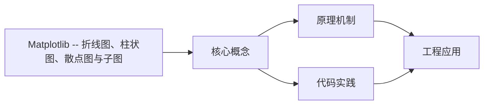

## 1. 学习目标（Bloom 分类）

本节按照布鲁姆教育目标分类学组织学习路径。本文主题为《Matplotlib -- 折线图、柱状图、散点图与子图》，属于 数据分析 模块，读者可以根据自身阶段选择阅读深度。

记忆层面：能够准确复述本文的核心概念、术语与基本语法或操作步骤，并能够在提问或检索时快速定位对应知识点。能够说出 数据分析 的核心概念、常用命令与流程。

理解层面：能够用自己的语言解释核心原理与工作机制，说明概念之间的因果关系，而不是机械记忆结论。能够解释 数据分析 的工作原理与设计动机。

应用层面：能够在真实项目或练习场景中运用本文知识解决具体问题，写出正确且可维护的实现。能够独立完成 数据分析 的标准操作。

分析层面：能够拆解复杂问题，比较本文主题与相邻概念的异同，识别边界条件与例外情况。能够分析 数据分析 使用中的异常与边界。

评价层面：能够根据约束条件（性能、可读性、安全、成本）评价不同方案的优劣，做出有依据的技术决策。能够评价 数据分析 相关工具与方案。

创造层面：能够把本文知识与其他模块知识组合，设计出新的解决方案或可复用的工程模式。能够把 数据分析 融入团队工作流。

通过本节学习，读者应当能够把《Matplotlib -- 折线图、柱状图、散点图与子图》纳入自己的知识网络，并与 数据分析 模块的其他主题（数据清洗、可视化、统计、报告）建立关联。

## 2. 历史动机与发展脉络

《Matplotlib -- 折线图、柱状图、散点图与子图》是 数据分析 领域的重要主题。要真正理解它，需要先了解它解决的问题与演进过程。

数据分析是从数据中提取决策信息的工程过程：定义问题 -> 采集 -> 清洗 -> 探索 -> 建模 -> 可视化 -> 报告。
工具链：Python（Pandas/NumPy）、SQL、Jupyter、BI（Tableau/PowerBI）；Excel 仍是轻量入口。
方法：描述性分析（发生了什么）、诊断（为什么）、预测（会怎样）、规范（该怎么办）。

回到本文主题：Matplotlib -- 折线图、柱状图、散点图与子图 的提出与成熟，正是上述技术背景下的必然产物。早期实现往往以简单可用为目标，随着工程规模扩大，社区逐渐沉淀出标准做法与最佳实践；理解这一脉络，可以帮助读者判断“为什么文档中的推荐写法是现在这个样子”，也能在遇到历史遗留代码时准确识别其设计年代与取舍。


## 3. 形式化定义与核心概念精讲

本节把《Matplotlib -- 折线图、柱状图、散点图与子图》涉及的核心概念以“定义 + 讲解”的形式展开。读者应把定义当作工具，把讲解当作理解路径；两者结合才能形成可迁移的知识。

数据形态：表格（结构化）、序列（时间）、文本、图像；分析前确定数据类型（数值/类别/顺序）。
清洗：缺失值（删除/填充）、异常值（IQR/z-score）、重复、类型转换；清洗决定结果可信度。
探索性分析（EDA）：分布（直方图）、集中趋势（均值/中位数）、离散（方差/IQR）、相关性。

### 3.1 原文章节逐一精讲

原文档把主题拆分为 28 个小节，下面按顺序给出每一节的导读讲解，随后保留原文细节供精读。

#### 原文精读（完整保留）

# Matplotlib 可视化

> **符号约定**：`< >` 必填参数 | `[ ]` 可选参数

---

#### 1. Matplotlib 简介

##### 1.1 两种绘图风格

Matplotlib 提供两种绘图接口：

- **Pyplot 风格（MATLAB-like）**：`plt.plot()`、`plt.xlabel()` 等函数式调用，适合快速绘图
- **面向对象风格**：`fig, ax = plt.subplots()` 后操作 `ax` 对象，适合复杂图表

> **为什么推荐面向对象风格？** Pyplot 风格内部维护全局状态，在多子图、多图表场景下容易出错。面向对象风格显式操作 Figure 和 Axes 对象，代码更清晰、更可维护。本笔记统一使用面向对象风格。

##### 1.2 Jupyter 中的配置

```python
import matplotlib.pyplot as plt
import numpy as np
import pandas as pd

%matplotlib inline

plt.rcParams['figure.figsize'] = (10, 6)
plt.rcParams['font.size'] = 12
plt.rcParams['axes.unicode_minus'] = False

print(f"Matplotlib version: {plt.matplotlib.__version__}")
```

**输出说明**：`%matplotlib inline` 将图表嵌入 Notebook 输出。`rcParams` 设置全局默认参数，`axes.unicode_minus` 解决负号显示问题。

> 跨模块参考：绘图数据通常来自 [numpy.md](numpy.md) 的数组操作或 [pandas.md](pandas.md) 的 DataFrame 处理。

---

#### 2. Figure 与 Axes 体系

##### 2.1 核心对象层级

```
Figure (画布)
  |
  +-- Axes (绘图区域，即一张图)
  |     |
  |     +-- Axis (坐标轴：XAxis, YAxis)
  |     +-- Line2D (线条)
  |     +-- Text (文本)
  |     +-- Legend (图例)
  |     +-- ...
  |
  +-- Axes (可以有多个)
```

- **Figure**：整个画布，可以包含多个 Axes
- **Axes**：一个独立的绘图区域，包含坐标轴、数据、标签等
- **Axis**：坐标轴，控制刻度、标签和样式

> **为什么区分 Figure 和 Axes？** 这使得一个画布上可以放置多个子图，每个子图有独立的坐标轴和样式。理解这个层级是掌握 Matplotlib 的关键。

##### 2.2 创建 Figure 和 Axes

```python
import matplotlib.pyplot as plt
import numpy as np

fig, ax = plt.subplots(figsize=(10, 6))
print(f"Figure size: {fig.get_size_inches()}")
print(f"Axes position: {ax.get_position()}")

fig2 = plt.figure(figsize=(8, 4))
ax1 = fig2.add_subplot(1, 2, 1)
ax2 = fig2.add_subplot(1, 2, 2)
ax1.set_title('Subplot 1')
ax2.set_title('Subplot 2')
plt.show()
```

**输出说明**：

- `plt.subplots()` 同时创建 Figure 和 Axes，是最常用的方式
- `figsize` 参数控制画布大小，单位为英寸
- `plt.figure()` 只创建画布，需要手动添加子图

---

#### 3. 折线图（Line Plot）

##### 3.1 基础折线图

```python
import matplotlib.pyplot as plt
import numpy as np

x = np.linspace(0, 2 * np.pi, 100)
y_sin = np.sin(x)
y_cos = np.cos(x)

fig, ax = plt.subplots(figsize=(10, 5))
ax.plot(x, y_sin, label='sin(x)')
ax.plot(x, y_cos, label='cos(x)', linestyle='--')
ax.set_xlabel('x')
ax.set_ylabel('y')
ax.set_title('Trigonometric Functions')
ax.legend()
ax.grid(True, alpha=0.3)
plt.show()
```

**输出说明**：图表显示两条曲线——sin(x) 为实线，cos(x) 为虚线。`label` 参数指定图例文字，`grid` 添加网格线。

##### 3.2 样式参数

```python
import matplotlib.pyplot as plt
import numpy as np

x = np.arange(10)
y1 = x ** 1.5
y2 = x ** 2

fig, ax = plt.subplots(figsize=(10, 5))
ax.plot(x, y1, color='#2196F3', marker='o', markersize=6, linewidth=2,
        linestyle='-', label='x^1.5')
ax.plot(x, y2, color='#FF5722', marker='s', markersize=6, linewidth=2,
        linestyle='--', label='x^2')
ax.set_xlabel('x')
ax.set_ylabel('y')
ax.set_title('Power Functions with Custom Styles')
ax.legend(loc='upper left')
plt.show()
```

**输出说明**：

- `color`：支持十六进制、颜色名、RGB 元组
- `marker`：'o' 圆形，'s' 方形，'^' 三角，'D' 菱形
- `linestyle`：'-' 实线，'--' 虚线，':' 点线，'-.' 点划线
- `linewidth`：线宽，`markersize`：标记大小

##### 3.3 时间序列折线图

```python
import matplotlib.pyplot as plt
import pandas as pd
import numpy as np

dates = pd.date_range('2024-01-01', periods=30, freq='D')
values = np.random.default_rng(42).normal(100, 10, 30).cumsum()

fig, ax = plt.subplots(figsize=(12, 5))
ax.plot(dates, values, color='steelblue', linewidth=1.5)
ax.fill_between(dates, values, alpha=0.15, color='steelblue')
ax.set_xlabel('Date')
ax.set_ylabel('Cumulative Value')
ax.set_title('Time Series with Area Fill')

fig.autofmt_xdate()
plt.show()
```

**输出说明**：`fill_between` 在曲线下方填充半透明区域，增强视觉效果。`autofmt_xdate` 自动旋转日期标签，避免重叠。

> **为什么折线图适合时间序列？** 折线图通过线段连接相邻数据点，天然表达了时间的连续性和趋势的走向。这是时间序列数据最自然的可视化方式。

---

#### 4. 柱状图（Bar Chart）

##### 4.1 基础柱状图

```python
import matplotlib.pyplot as plt
import numpy as np

categories = ['Product A', 'Product B', 'Product C', 'Product D']
values = [350, 480, 290, 620]
colors = ['#4C72B0', '#55A868', '#C44E52', '#8172B2']

fig, ax = plt.subplots(figsize=(8, 5))
bars = ax.bar(categories, values, color=colors, width=0.6, edgecolor='white')

for bar, val in zip(bars, values):
    ax.text(bar.get_x() + bar.get_width() / 2, bar.get_height() + 10,
            f'{val}', ha='center', va='bottom', fontsize=11)

ax.set_ylabel('Sales (units)')
ax.set_title('Product Sales Comparison')
ax.set_ylim(0, 700)
ax.spines['top'].set_visible(False)
ax.spines['right'].set_visible(False)
plt.show()
```

**输出说明**：柱状图显示四个产品的销量对比。`ax.text` 在每根柱子上方添加数值标签。`spines['top'].set_visible(False)` 隐藏顶部和右侧边框，使图表更简洁。

##### 4.2 分组柱状图

```python
import matplotlib.pyplot as plt
import numpy as np

categories = ['Q1', 'Q2', 'Q3', 'Q4']
sales_2023 = [250, 320, 280, 380]
sales_2024 = [280, 350, 310, 420]

x = np.arange(len(categories))
width = 0.35

fig, ax = plt.subplots(figsize=(10, 5))
bars1 = ax.bar(x - width/2, sales_2023, width, label='2023', color='#4C72B0')
bars2 = ax.bar(x + width/2, sales_2024, width, label='2024', color='#DD8452')

ax.set_xlabel('Quarter')
ax.set_ylabel('Sales')
ax.set_title('Quarterly Sales: 2023 vs 2024')
ax.set_xticks(x)
ax.set_xticklabels(categories)
ax.legend()
plt.show()
```

**输出说明**：分组柱状图通过偏移 x 坐标实现并列显示。`x - width/2` 和 `x + width/2` 使两组柱子对称分布在刻度两侧。

##### 4.3 水平柱状图与堆叠柱状图

```python
import matplotlib.pyplot as plt
import numpy as np

categories = ['Feature A', 'Feature B', 'Feature C', 'Feature D']
satisfied = [85, 72, 90, 65]
neutral = [10, 18, 5, 20]
unsatisfied = [5, 10, 5, 15]

fig, (ax1, ax2) = plt.subplots(1, 2, figsize=(14, 5))

ax1.barh(categories, satisfied, color='#55A868')
ax1.set_xlabel('Satisfaction Score')
ax1.set_title('Horizontal Bar Chart')

ax2.bar(categories, satisfied, label='Satisfied', color='#55A868')
ax2.bar(categories, neutral, bottom=satisfied, label='Neutral', color='#C44E52')
ax2.bar(categories, unsatisfied, bottom=np.array(satisfied)+np.array(neutral),
        label='Unsatisfied', color='#4C72B0')
ax2.set_ylabel('Count')
ax2.set_title('Stacked Bar Chart')
ax2.legend()

plt.tight_layout()
plt.show()
```

**输出说明**：

- `barh` 绘制水平柱状图，适合类别名称较长时
- 堆叠柱状图通过 `bottom` 参数指定每层的起始高度
- `tight_layout` 自动调整子图间距

---

#### 5. 散点图（Scatter Plot）

##### 5.1 基础散点图

```python
import matplotlib.pyplot as plt
import numpy as np

rng = np.random.default_rng(42)
x = rng.normal(50, 15, 100)
y = 0.8 * x + rng.normal(0, 10, 100)

fig, ax = plt.subplots(figsize=(8, 6))
ax.scatter(x, y, color='#2196F3', alpha=0.6, edgecolors='white', s=50)
ax.set_xlabel('Advertising Spend')
ax.set_ylabel('Revenue')
ax.set_title('Advertising vs Revenue')
plt.show()
```

**输出说明**：散点图展示广告支出与收入的正相关关系。`alpha` 控制透明度，`edgecolors` 设置标记边框颜色，`s` 控制标记大小。

##### 5.2 颜色映射散点图

```python
import matplotlib.pyplot as plt
import numpy as np

rng = np.random.default_rng(42)
x = rng.uniform(0, 10, 200)
y = rng.uniform(0, 10, 200)
z = np.sin(x) * np.cos(y)

fig, ax = plt.subplots(figsize=(9, 7))
scatter = ax.scatter(x, y, c=z, cmap='viridis', s=60, alpha=0.8, edgecolors='gray')
cbar = fig.colorbar(scatter, ax=ax, label='Intensity (sin(x)*cos(y))')
ax.set_xlabel('X')
ax.set_ylabel('Y')
ax.set_title('Scatter Plot with Color Mapping')
plt.show()
```

**输出说明**：`c` 参数指定颜色映射的数据，`cmap` 选择配色方案。`colorbar` 添加颜色条，显示数值与颜色的对应关系。

> **为什么散点图适合展示相关关系？** 散点图将两个变量的值分别映射到 x 和 y 坐标，点的分布模式直接反映变量间的相关方向和强度。加上颜色映射（`c` 参数），可以同时展示第三个变量的信息。

##### 5.3 气泡图

```python
import matplotlib.pyplot as plt
import numpy as np

rng = np.random.default_rng(42)
n = 30
x = rng.uniform(0, 100, n)
y = rng.uniform(0, 100, n)
size = rng.uniform(50, 500, n)
category = rng.choice(['A', 'B', 'C'], n)

color_map = {'A': '#4C72B0', 'B': '#55A868', 'C': '#C44E52'}
colors = [color_map[c] for c in category]

fig, ax = plt.subplots(figsize=(10, 7))
for cat in ['A', 'B', 'C']:
    mask = np.array(category) == cat
    ax.scatter(x[mask], y[mask], s=size[mask], c=color_map[cat],
               alpha=0.6, edgecolors='gray', label=f'Category {cat}')

ax.set_xlabel('Market Share')
ax.set_ylabel('Growth Rate')
ax.set_title('Bubble Chart: Market Analysis')
ax.legend()
plt.show()
```

**输出说明**：气泡图通过点的大小编码第三个变量，配合颜色区分类别，一张图可以同时展示四个维度的信息。

---

#### 6. 直方图（Histogram）

##### 6.1 基础直方图

```python
import matplotlib.pyplot as plt
import numpy as np

rng = np.random.default_rng(42)
data_normal = rng.normal(loc=50, scale=10, size=1000)
data_skewed = rng.exponential(scale=20, size=1000)

fig, (ax1, ax2) = plt.subplots(1, 2, figsize=(14, 5))

ax1.hist(data_normal, bins=30, color='steelblue', edgecolor='white', alpha=0.8)
ax1.set_xlabel('Value')
ax1.set_ylabel('Frequency')
ax1.set_title('Normal Distribution')
ax1.axvline(data_normal.mean(), color='red', linestyle='--', label=f'Mean={data_normal.mean():.1f}')
ax1.legend()

ax2.hist(data_skewed, bins=30, color='darkorange', edgecolor='white', alpha=0.8)
ax2.set_xlabel('Value')
ax2.set_ylabel('Frequency')
ax2.set_title('Exponential Distribution (Right Skewed)')
ax2.axvline(data_skewed.mean(), color='red', linestyle='--', label=f'Mean={data_skewed.mean():.1f}')
ax2.axvline(np.median(data_skewed), color='green', linestyle='--', label=f'Median={np.median(data_skewed):.1f}')
ax2.legend()

plt.tight_layout()
plt.show()
```

**输出说明**：

- 正态分布的均值和中位数接近，直方图左右对称
- 指数分布右偏，均值大于中位数，直方图向右拖尾
- `axvline` 添加垂直参考线，`density=` 可将 y 轴切换为概率密度

##### 6.2 密度直方图与叠加

```python
import matplotlib.pyplot as plt
import numpy as np

rng = np.random.default_rng(42)
group_a = rng.normal(65, 8, 200)
group_b = rng.normal(72, 10, 200)

fig, ax = plt.subplots(figsize=(10, 5))
ax.hist(group_a, bins=25, density=True, alpha=0.5, color='steelblue', label='Group A')
ax.hist(group_b, bins=25, density=True, alpha=0.5, color='darkorange', label='Group B')
ax.set_xlabel('Score')
ax.set_ylabel('Density')
ax.set_title('Overlapping Histograms (Density)')
ax.legend()
plt.show()
```

**输出说明**：`density=` 将 y 轴从频数切换为概率密度，使不同样本量的分布可以直观对比。`alpha=0.5` 使重叠区域可见。

> **为什么直方图的 bins 数量很重要？** bins 太少会掩盖分布细节，太多会引入噪声。经验法则：Sturges 公式 `bins = 1 + log2(n)`，或 Freedman-Diaconis 公式 `bin_width = 2 * IQR * n^(-1/3)`。在实践中，建议尝试 20-50 的范围。

---

#### 7. 饼图与环形图

##### 7.1 基础饼图

```python
import matplotlib.pyplot as plt

labels = ['Direct', 'Organic Search', 'Social Media', 'Referral', 'Email']
sizes = [35, 28, 18, 12, 7]
colors = ['#4C72B0', '#55A868', '#C44E52', '#8172B2', '#CCB974']
explode = (0.05, 0, 0, 0, 0)

fig, ax = plt.subplots(figsize=(8, 8))
ax.pie(sizes, explode=explode, labels=labels, colors=colors,
       autopct='%1.1f%%', startangle=90, pctdistance=0.85)
ax.set_title('Traffic Sources Distribution')
ax.axis('equal')
plt.show()
```

**输出说明**：

- `autopct` 格式化百分比显示
- `explode` 使某扇区突出
- `startangle` 控制起始角度
- `axis('equal')` 确保饼图为正圆

##### 7.2 环形图

```python
import matplotlib.pyplot as plt

labels = ['Completed', 'In Progress', 'Not Started']
sizes = [60, 25, 15]
colors = ['#55A868', '#DD8452', '#C44E52']

fig, ax = plt.subplots(figsize=(8, 8))
wedges, texts, autotexts = ax.pie(
    sizes, labels=labels, colors=colors,
    autopct='%1.1f%%', startangle=90,
    wedgeprops=dict(width=0.4, edgecolor='white')
)
ax.set_title('Project Status (Donut Chart)')
plt.show()
```

**输出说明**：`wedgeprops=dict(width=0.4)` 将饼图变为环形图，`width` 控制环的宽度。环形图中心可以放置汇总信息。

> **什么时候用饼图？** 饼图适合展示少量类别（3-7个）的占比关系。类别过多时，饼图难以阅读，应改用柱状图。永远不要用 3D 饼图——透视变形会扭曲数据的视觉感知。

---

#### 8. 子图与布局

##### 8.1 规则网格 subplots

```python
import matplotlib.pyplot as plt
import numpy as np

fig, axes = plt.subplots(2, 3, figsize=(15, 8), sharex=True, sharey=True)
fig.suptitle('2x3 Subplot Grid', fontsize=14)

for i, ax in enumerate(axes.flat):
    data = np.random.default_rng(i).normal(0, 1, 500)
    ax.hist(data, bins=30, color=f'C{i}', alpha=0.7)
    ax.set_title(f'Seed={i}')

plt.tight_layout()
plt.show()
```

**输出说明**：

- `sharex=`/`sharey=` 使子图共享坐标轴，减少重复标签
- `axes.flat` 将二维数组展平为一维迭代器
- `tight_layout` 自动调整间距

##### 8.2 不规则布局 GridSpec

```python
import matplotlib.pyplot as plt
import matplotlib.gridspec as gridspec
import numpy as np

fig = plt.figure(figsize=(12, 8))
gs = gridspec.GridSpec(3, 3, figure=fig, hspace=0.3, wspace=0.3)

ax_main = fig.add_subplot(gs[0:2, 0:2])
ax_right = fig.add_subplot(gs[0:2, 2])
ax_bottom = fig.add_subplot(gs[2, :])

x = np.random.default_rng(42).normal(50, 10, 200)
y = 0.7 * x + np.random.default_rng(43).normal(0, 8, 200)

ax_main.scatter(x, y, alpha=0.5, color='steelblue')
ax_main.set_title('Main Scatter Plot')

ax_right.hist(y, bins=20, orientation='horizontal', color='darkorange', alpha=0.7)
ax_right.set_title('Y Distribution')

ax_bottom.hist(x, bins=20, color='green', alpha=0.7)
ax_bottom.set_title('X Distribution')

fig.suptitle('Custom Layout with GridSpec', fontsize=14)
plt.show()
```

**输出说明**：GridSpec 允许子图跨越多行多列。`gs[0:2, 0:2]` 占据左上 2x2 区域，`gs[0:2, 2]` 占据右侧 2 行，`gs[2, :]` 占据底部整行。这种布局常用于联合分布图。

##### 8.3 inset_axes 嵌入图

```python
import matplotlib.pyplot as plt
import numpy as np

from mpl_toolkits.axes_grid1.inset_locator import inset_axes

x = np.linspace(0, 10, 100)
y = np.sin(x) * np.exp(-0.1 * x)

fig, ax = plt.subplots(figsize=(10, 5))
ax.plot(x, y, color='steelblue', linewidth=2)
ax.set_title('Damped Sine Wave with Inset')

ax_inset = inset_axes(ax, width="35%", height="35%", loc='upper right')
x_zoom = np.linspace(0, 2, 100)
y_zoom = np.sin(x_zoom) * np.exp(-0.1 * x_zoom)
ax_inset.plot(x_zoom, y_zoom, color='red', linewidth=2)
ax_inset.set_title('Zoomed: 0-2', fontsize=9)
ax_inset.tick_params(labelsize=7)

plt.show()
```

**输出说明**：`inset_axes` 在主图中嵌入一个缩放视图，适合展示局部细节。

---

#### 9. 样式与美化

##### 9.1 预设样式

```python
import matplotlib.pyplot as plt
import numpy as np

available_styles = plt.style.available
print(f"可用样式: {available_styles[:10]}...")

plt.style.use('seaborn-v0_8-whitegrid')

x = np.linspace(0, 2 * np.pi, 100)
fig, ax = plt.subplots(figsize=(8, 4))
ax.plot(x, np.sin(x), label='sin(x)')
ax.plot(x, np.cos(x), label='cos(x)')
ax.set_title('With seaborn-v0_8-whitegrid Style')
ax.legend()
plt.show()
```

**输出说明**：`plt.style.available` 列出所有可用样式。常用样式：`seaborn-v0_8-whitegrid`（带网格）、`ggplot`（R风格）、`bmh`（Bayesian风格）、`dark_background`（暗色主题）。

##### 9.2 自定义 rcParams

```python
import matplotlib.pyplot as plt
import numpy as np

plt.rcParams.update({
    'figure.figsize': (10, 6),
    'font.size': 12,
    'axes.titlesize': 14,
    'axes.labelsize': 12,
    'xtick.labelsize': 10,
    'ytick.labelsize': 10,
    'legend.fontsize': 11,
    'axes.spines.top': False,
    'axes.spines.right': False,
    'axes.grid': True,
    'grid.alpha': 0.3,
})

fig, ax = plt.subplots()
ax.plot(np.arange(10), np.random.default_rng(42).standard_normal(10).cumsum())
ax.set_title('Custom rcParams Style')
ax.set_xlabel('Index')
ax.set_ylabel('Value')
plt.show()
```

**输出说明**：`rcParams` 是 Matplotlib 的全局配置字典，可以精细控制所有视觉元素。`axes.spines.top: False` 隐藏顶部边框是数据可视化的常见做法。

##### 9.3 中文字体配置

```python
import matplotlib.pyplot as plt
import numpy as np

plt.rcParams['font.sans-serif'] = ['SimHei', 'Microsoft YaHei', 'Arial Unicode MS']
plt.rcParams['axes.unicode_minus'] = False

fig, ax = plt.subplots(figsize=(8, 4))
months = ['1月', '2月', '3月', '4月', '5月', '6月']
sales = [120, 150, 180, 160, 200, 220]
ax.plot(months, sales, marker='o', color='steelblue')
ax.set_title('月度销售趋势')
ax.set_ylabel('销售额（万元）')
plt.show()
```

**输出说明**：中文字体配置是中文环境下最常见的 Matplotlib 问题。`SimHei`（黑体）在 Windows 上可用，macOS 使用 `Arial Unicode MS`。

##### 9.4 色盲友好配色

```python
import matplotlib.pyplot as plt
import numpy as np

cb_colors = ['#0072B2', '#E69F00', '#009E73', '#D55E00', '#CC79A7', '#56B4E9']

fig, ax = plt.subplots(figsize=(8, 5))
for i, color in enumerate(cb_colors):
    ax.barh(i, 1, color=color, height=0.6)
    ax.text(0.5, i, f'Color {i+1}', ha='center', va='center', fontsize=11, color='white')
ax.set_yticks(range(len(cb_colors)))
ax.set_yticklabels([f'C{i}' for i in range(len(cb_colors))])
ax.set_title('Colorblind-Friendly Palette')
plt.show()
```

**输出说明**：使用 Wong 色盲友好配色方案，确保图表对色觉障碍人群也可读。避免红绿对比，使用蓝橙对比替代。

---

#### 10. 注释与文本

##### 10.1 标题与轴标签

```python
import matplotlib.pyplot as plt
import numpy as np

fig, ax = plt.subplots(figsize=(8, 5))
x = np.linspace(0, 10, 100)
ax.plot(x, np.sin(x))

ax.set_title('Sine Function', fontsize=16, fontweight='bold', pad=15)
ax.set_xlabel('x (radians)', fontsize=12, labelpad=10)
ax.set_ylabel('sin(x)', fontsize=12, labelpad=10)

plt.show()
```

**输出说明**：`pad` 控制标题与图表的间距，`labelpad` 控制轴标签与刻度的间距。

##### 10.2 箭头注释

```python
import matplotlib.pyplot as plt
import numpy as np

x = np.linspace(0, 4 * np.pi, 200)
y = np.sin(x) * np.exp(-0.2 * x)

fig, ax = plt.subplots(figsize=(10, 5))
ax.plot(x, y, color='steelblue', linewidth=2)

max_idx = np.argmax(y)
ax.annotate('Maximum',
            xy=(x[max_idx], y[max_idx]),
            xytext=(x[max_idx] + 2, y[max_idx] + 0.15),
            fontsize=12,
            arrowprops=dict(arrowstyle='->', color='red', lw=2),
            color='red')

ax.annotate('Decay region',
            xy=(8, 0.05),
            xytext=(9, 0.3),
            fontsize=11,
            arrowprops=dict(arrowstyle='->', color='gray', lw=1.5),
            color='gray')

ax.set_title('Annotated Damped Sine Wave')
plt.show()
```

**输出说明**：`annotate` 的 `xy` 指向注释目标点，`xytext` 指定文字位置，`arrowprops` 控制箭头样式。

##### 10.3 文本与数学公式

```python
import matplotlib.pyplot as plt
import numpy as np

fig, ax = plt.subplots(figsize=(8, 5))
x = np.linspace(-3, 3, 100)
y = np.exp(-x**2 / 2) / np.sqrt(2 * np.pi)
ax.plot(x, y, color='steelblue', linewidth=2)
ax.fill_between(x, y, alpha=0.2, color='steelblue')

ax.text(0, 0.35, r'$\mu=0, \sigma=1$', fontsize=14, ha='center')
ax.text(2, 0.1, r'$f(x) = \frac{1}{\sqrt{2\pi}} e^{-\frac{x^2}{2}}$',
        fontsize=12, ha='center')

ax.set_title('Standard Normal Distribution')
ax.set_xlabel('x')
ax.set_ylabel('f(x)')
plt.show()
```

**输出说明**：Matplotlib 支持 LaTeX 数学公式，用 `r'$...$'` 包裹。常用符号：`\mu`、`\sigma`、`\frac{}{}`、`\sqrt{}`、`\sum`、`\int`。

---

#### 11. 保存与导出

##### 11.1 保存参数

```python
import matplotlib.pyplot as plt
import numpy as np

fig, ax = plt.subplots(figsize=(8, 5))
ax.plot(np.arange(10), np.random.default_rng(42).standard_normal(10).cumsum())
ax.set_title('Chart to Export')

fig.savefig('chart.png', dpi=300, bbox_inches='tight', facecolor='white')
fig.savefig('chart.pdf', bbox_inches='tight')
fig.savefig('chart.svg', bbox_inches='tight')
```

**输出说明**：

- `dpi`：分辨率，屏幕显示 72-150，印刷 300+
- `bbox_inches='tight'`：裁剪空白边距
- `facecolor`：背景色，默认透明（PNG）
- 格式选择：PNG（网页/演示）、PDF/SVG（印刷/矢量编辑）

##### 11.2 格式选择指南

| 格式 | 类型 | 适用场景                   | 文件大小 |
| ---- | ---- | -------------------------- | -------- |
| PNG  | 位图 | 网页、PPT、屏幕展示        | 中       |
| JPG  | 位图 | 照片类图表（有损压缩）     | 小       |
| PDF  | 矢量 | 印刷、论文                 | 中       |
| SVG  | 矢量 | 网页嵌入、Illustrator 编辑 | 大       |
| EPS  | 矢量 | LaTeX 文档                 | 中       |

> **为什么论文推荐矢量格式？** 矢量图（PDF/SVG/EPS）在任意缩放下都保持清晰，而位图（PNG/JPG）放大后会出现锯齿。论文通常需要高分辨率图表，矢量格式是最佳选择。

---

#### 12. 速查表

##### 12.1 图表类型选择

| 数据关系 | 图表类型 | 函数                     |
| -------- | -------- | ------------------------ |
| 趋势变化 | 折线图   | `ax.plot()`              |
| 类别比较 | 柱状图   | `ax.bar()` / `ax.barh()` |
| 分布形态 | 直方图   | `ax.hist()`              |
| 相关关系 | 散点图   | `ax.scatter()`           |
| 占比构成 | 饼图     | `ax.pie()`               |

##### 12.2 常用参数

| 参数        | 说明     | 常用值               |
| ----------- | -------- | -------------------- |
| `color`     | 颜色     | 十六进制、颜色名     |
| `marker`    | 标记样式 | 'o', 's', '^', 'D'   |
| `linestyle` | 线型     | '-', '--', ':', '-.' |
| `linewidth` | 线宽     | 1-3                  |
| `alpha`     | 透明度   | 0-1                  |
| `figsize`   | 画布大小 | (10, 6)              |
| `dpi`       | 分辨率   | 72/150/300           |

##### 12.3 常用方法

| 方法                             | 说明       |
| -------------------------------- | ---------- |
| `ax.set_title()`                 | 设置标题   |
| `ax.set_xlabel()`/`set_ylabel()` | 设置轴标签 |
| `ax.set_xlim()`/`set_ylim()`     | 设置轴范围 |
| `ax.legend()`                    | 显示图例   |
| `ax.grid()`                      | 显示网格   |
| `ax.annotate()`                  | 添加注释   |
| `ax.text()`                      | 添加文本   |
| `fig.savefig()`                  | 保存图表   |

---

#### 13. 延伸阅读

- Matplotlib 官方文档：https://matplotlib.org/stable/
- Matplotlib Gallery：https://matplotlib.org/stable/gallery/
- Scientific Visualization (Nicolas Rougier)
- Matplotlib Cheat Sheet：https://matplotlib.org/cheatsheets/
#### 基础绘图

**基本写法：绘制折线图**
`plt.plot(<x>, <y>[, <格式>])`

```python
# 折线图基础
import matplotlib.pyplot as plt

x = [1, 2, 3, 4, 5]
y = [2, 4, 6, 8, 10]
plt.plot(x, y)
plt.show()
```

---

#### 图表标题与标签

**基本写法：设置标题与轴标签**
`plt.title(<标题>)`
`plt.xlabel(<标签>)`
`plt.ylabel(<标签>)`

```python
# 设置标题与轴标签
plt.plot(x, y)
plt.title("销售趋势")
plt.xlabel("月份")
plt.ylabel("销售额")
plt.show()
```

---

#### 散点图

**基本写法：绘制散点图**
`plt.scatter(<x>, <y>[, c=<颜色>][, s=<大小>])`

```python
# 散点图
plt.scatter(x, y, c="red", s=50, alpha=0.5)
plt.xlabel("X")
plt.ylabel("Y")
plt.title("散点图")
plt.show()
```

---

#### 柱状图

**基本写法：绘制柱状图**
`plt.bar(<x>, <height>[, width=<宽>])`
`plt.barh(<y>, <width>)`

```python
# 柱状图与水平柱状图
plt.bar(["A", "B", "C"], [10, 20, 15])
plt.barh(["A", "B", "C"], [10, 20, 15])
```

---

#### 直方图

**基本写法：绘制直方图**
`plt.hist(<数据>[, bins=<箱数>])`

```python
# 直方图查看分布
import numpy as np
data = np.random.randn(1000)
plt.hist(data, bins=30, color="steelblue", edgecolor="black")
plt.xlabel("值")
plt.ylabel("频数")
plt.show()
```

---

#### 饼图

**基本写法：绘制饼图**
`plt.pie(<数据>[, labels=<标签>][, autopct=<格式>])`

```python
# 饼图
sizes = [30, 40, 20, 10]
labels = ["A", "B", "C", "D"]
plt.pie(sizes, labels=labels, autopct="%1.1f%%", startangle=90)
plt.axis("equal")
plt.show()
```

---

#### 子图

**换行写法：创建子图**
`fig, axes = plt.subplots(<行数>, <列数>)`
`axes[<i>].plot(<x>, <y>)`

```python
# 多子图布局
fig, axes = plt.subplots(2, 2, figsize=(10, 8))
axes[0, 0].plot(x, y)
axes[0, 1].scatter(x, y)
axes[1, 0].bar(["A", "B"], [1, 2])
axes[1, 1].hist(data)
plt.tight_layout()
plt.show()
```

---

#### add_axes 自定义位置

**基本写法：自定义坐标轴位置**
`fig.add_axes([<left>, <bottom>, <width>, <height>])`

```python
# 自定义子图位置
fig = plt.figure()
ax1 = fig.add_axes([0.1, 0.1, 0.8, 0.8])
ax2 = fig.add_axes([0.2, 0.5, 0.3, 0.3])
ax1.plot(x, y)
ax2.plot(y, x)
```

---

#### 图例

**基本写法：添加图例**
`plt.legend([<标签列表>])`
`plt.plot(<x>, <y>, label="<标签>")`

```python
# 图例
plt.plot(x, y1, label="系列1")
plt.plot(x, y2, label="系列2")
plt.legend(loc="upper left")
plt.legend(loc="best")
```

---

#### 样式设置

**基本写法：线条样式**
`plt.plot(<x>, <y>, color=<颜色>, linestyle=<线型>, marker=<标记>)`

```python
# 线条样式
plt.plot(x, y, color="red", linestyle="--", marker="o", linewidth=2, markersize=8)
plt.plot(x, y, "r--o")  # 简写: 颜色+线型+标记
```

---

#### 坐标轴范围

**基本写法：设置坐标轴范围**
`plt.xlim(<下>, <上>)`
`plt.ylim(<下>, <上>)`

```python
# 坐标轴范围
plt.plot(x, y)
plt.xlim(0, 10)
plt.ylim(0, 20)
plt.axis([0, 10, 0, 20])  # 同时设置
```

---

#### 网格与刻度

**基本写法：网格与刻度**
`plt.grid(<布尔>)`
`plt.xticks(<位置>[, <标签>])`

```python
# 网格与刻度
plt.plot(x, y)
plt.grid(True, linestyle="--", alpha=0.5)
plt.xticks([1, 2, 3], ["一", "二", "三"])
plt.yticks([0, 5, 10], ["低", "中", "高"])
```

---

#### 保存图片

**基本写法：保存图表到文件**
`plt.savefig(<路径>[, dpi=<分辨率>][, format=<格式>])`

```python
# 保存图表
plt.plot(x, y)
plt.savefig("chart.png", dpi=300, bbox_inches="tight")
plt.savefig("chart.pdf", format="pdf")
plt.savefig("chart.svg", format="svg")
```

---

#### Pandas 集成绘图

**基本写法：DataFrame 直接绘图**
`<df>.plot([kind=<类型>])`

```python
# Pandas 内置 Matplotlib 绑定
df = pd.DataFrame({"A": [1, 2, 3], "B": [4, 5, 6]})
df.plot()                      # 折线图
df.plot(kind="bar")            # 柱状图
df.plot(kind="hist")           # 直方图
df.plot(kind="scatter", x="A", y="B")  # 散点图
df.plot(kind="box")            # 箱线图
```

---

#### 中文字体

**换行写法：配置中文字体**
`plt.rcParams["font.sans-serif"] = ["<字体名>"]`
`plt.rcParams["axes.unicode_minus"] = False`

```python
# 解决中文显示问题
import matplotlib.pyplot as plt
plt.rcParams["font.sans-serif"] = ["SimHei", "Microsoft YaHei", "Arial Unicode MS"]
plt.rcParams["axes.unicode_minus"] = False  # 正常显示负号

plt.title("中文标题")
plt.show()
```


### 3.2 概念关系图

下面用 Mermaid 图表达本文核心概念之间的关系，帮助读者建立整体图景：



图中展示的是本文知识的结构化关系：核心概念是入口，原理机制解释“为什么”，代码实践演示“怎么做”，工程应用回答“何时用”。读者学习时可以把每个小节的内容挂接到对应节点上。

## 4. 理论推导与原理解析

本节深入《Matplotlib -- 折线图、柱状图、散点图与子图》背后的原理。理论部分不求面面俱到，而是聚焦“能解释现象、能指导实践”的关键推导。

数据形态：表格（结构化）、序列（时间）、文本、图像；分析前确定数据类型（数值/类别/顺序）。
清洗：缺失值（删除/填充）、异常值（IQR/z-score）、重复、类型转换；清洗决定结果可信度。
探索性分析（EDA）：分布（直方图）、集中趋势（均值/中位数）、离散（方差/IQR）、相关性。
可视化原则：图型匹配数据（趋势折线、比较柱状、构成饼/堆叠、关系散点），标注与叙事。

需要强调的是，理论推导与工程实践之间存在翻译层：理论给出的是理想化模型与边界条件，工程代码则必须处理真实环境中的例外。读者在学习时应先掌握理论的“标准情形”，再通过陷阱章节了解“非标准情形”。

## 5. 代码示例与逐行讲解

本节把原文中的代码示例系统整理，并为每个示例补充用途说明与讲解。读者不应只浏览代码，而应逐段对照讲解理解设计意图。

### 5.1 示例：1.2 Jupyter 中的配置

该示例来自原文《1.2 Jupyter 中的配置》小节，用于演示Matplotlib -- 折线图、柱状图、散点图与子图相关操作。阅读时请先看代码结构，再看其后的讲解。

```python
import matplotlib.pyplot as plt
import numpy as np
import pandas as pd

%matplotlib inline

plt.rcParams['figure.figsize'] = (10, 6)
plt.rcParams['font.size'] = 12
plt.rcParams['axes.unicode_minus'] = False

print(f"Matplotlib version: {plt.matplotlib.__version__}")
```

讲解：这段代码演示了本节核心知识点。代码中的关键操作可以归纳为三步：准备（定义或初始化）、执行（核心逻辑）、收尾（释放资源或返回结果）。实际项目中，这三步往往被封装为函数或类，以提升复用性与可测试性。

关键点分析：

该示例共 8 行有效代码，包含 1 类关键结构（import）。其中：

- 入口与初始化部分负责建立上下文，对应实际项目中的启动或装配逻辑；
- 核心逻辑部分体现本文主题的主要操作，是阅读时最需要对照讲解理解的部分；
- 输出或返回部分把结果交给调用方，注意其类型与边界条件。

进阶思考路径：先尝试修改参数观察行为变化，再把示例中的模式迁移到自己的项目中；每次修改都记录预期与实测差异，这是把示例转化为能力的最快方式。

### 5.2 示例：2.1 核心对象层级

该示例来自原文《2.1 核心对象层级》小节，用于演示Matplotlib -- 折线图、柱状图、散点图与子图相关操作。阅读时请先看代码结构，再看其后的讲解。

```text
Figure (画布)
  |
  +-- Axes (绘图区域，即一张图)
  |     |
  |     +-- Axis (坐标轴：XAxis, YAxis)
  |     +-- Line2D (线条)
  |     +-- Text (文本)
  |     +-- Legend (图例)
  |     +-- ...
  |
  +-- Axes (可以有多个)
```

讲解：这段代码演示了本节核心知识点。代码中的关键操作可以归纳为三步：准备（定义或初始化）、执行（核心逻辑）、收尾（释放资源或返回结果）。实际项目中，这三步往往被封装为函数或类，以提升复用性与可测试性。

关键点分析：

该示例共 11 行有效代码，结构以数据或配置为主。阅读时应关注：数据字段的含义、配置项的作用，以及它们与运行行为的对应关系。

进阶思考路径：先尝试修改参数观察行为变化，再把示例中的模式迁移到自己的项目中；每次修改都记录预期与实测差异，这是把示例转化为能力的最快方式。

### 5.3 示例：2.2 创建 Figure 和 Axes

该示例来自原文《2.2 创建 Figure 和 Axes》小节，用于演示Matplotlib -- 折线图、柱状图、散点图与子图相关操作。阅读时请先看代码结构，再看其后的讲解。

```python
import matplotlib.pyplot as plt
import numpy as np

fig, ax = plt.subplots(figsize=(10, 6))
print(f"Figure size: {fig.get_size_inches()}")
print(f"Axes position: {ax.get_position()}")

fig2 = plt.figure(figsize=(8, 4))
ax1 = fig2.add_subplot(1, 2, 1)
ax2 = fig2.add_subplot(1, 2, 2)
ax1.set_title('Subplot 1')
ax2.set_title('Subplot 2')
plt.show()
```

讲解：这段代码演示了本节核心知识点。代码中的关键操作可以归纳为三步：准备（定义或初始化）、执行（核心逻辑）、收尾（释放资源或返回结果）。实际项目中，这三步往往被封装为函数或类，以提升复用性与可测试性。

关键点分析：

该示例共 11 行有效代码，包含 1 类关键结构（import）。其中：

- 入口与初始化部分负责建立上下文，对应实际项目中的启动或装配逻辑；
- 核心逻辑部分体现本文主题的主要操作，是阅读时最需要对照讲解理解的部分；
- 输出或返回部分把结果交给调用方，注意其类型与边界条件。

进阶思考路径：先尝试修改参数观察行为变化，再把示例中的模式迁移到自己的项目中；每次修改都记录预期与实测差异，这是把示例转化为能力的最快方式。

### 5.4 示例：3.1 基础折线图

该示例来自原文《3.1 基础折线图》小节，用于演示Matplotlib -- 折线图、柱状图、散点图与子图相关操作。阅读时请先看代码结构，再看其后的讲解。

```python
import matplotlib.pyplot as plt
import numpy as np

x = np.linspace(0, 2 * np.pi, 100)
y_sin = np.sin(x)
y_cos = np.cos(x)

fig, ax = plt.subplots(figsize=(10, 5))
ax.plot(x, y_sin, label='sin(x)')
ax.plot(x, y_cos, label='cos(x)', linestyle='--')
ax.set_xlabel('x')
ax.set_ylabel('y')
ax.set_title('Trigonometric Functions')
ax.legend()
ax.grid(True, alpha=0.3)
plt.show()
```

讲解：这段代码演示了本节核心知识点。代码中的关键操作可以归纳为三步：准备（定义或初始化）、执行（核心逻辑）、收尾（释放资源或返回结果）。实际项目中，这三步往往被封装为函数或类，以提升复用性与可测试性。

关键点分析：

该示例共 14 行有效代码，包含 1 类关键结构（import）。其中：

- 入口与初始化部分负责建立上下文，对应实际项目中的启动或装配逻辑；
- 核心逻辑部分体现本文主题的主要操作，是阅读时最需要对照讲解理解的部分；
- 输出或返回部分把结果交给调用方，注意其类型与边界条件。

进阶思考路径：先尝试修改参数观察行为变化，再把示例中的模式迁移到自己的项目中；每次修改都记录预期与实测差异，这是把示例转化为能力的最快方式。

### 5.5 示例：3.2 样式参数

该示例来自原文《3.2 样式参数》小节，用于演示Matplotlib -- 折线图、柱状图、散点图与子图相关操作。阅读时请先看代码结构，再看其后的讲解。

```python
import matplotlib.pyplot as plt
import numpy as np

x = np.arange(10)
y1 = x ** 1.5
y2 = x ** 2

fig, ax = plt.subplots(figsize=(10, 5))
ax.plot(x, y1, color='#2196F3', marker='o', markersize=6, linewidth=2,
        linestyle='-', label='x^1.5')
ax.plot(x, y2, color='#FF5722', marker='s', markersize=6, linewidth=2,
        linestyle='--', label='x^2')
ax.set_xlabel('x')
ax.set_ylabel('y')
ax.set_title('Power Functions with Custom Styles')
ax.legend(loc='upper left')
plt.show()
```

讲解：这段代码演示了本节核心知识点。代码中的关键操作可以归纳为三步：准备（定义或初始化）、执行（核心逻辑）、收尾（释放资源或返回结果）。实际项目中，这三步往往被封装为函数或类，以提升复用性与可测试性。

关键点分析：

该示例共 15 行有效代码，包含 1 类关键结构（import）。其中：

- 入口与初始化部分负责建立上下文，对应实际项目中的启动或装配逻辑；
- 核心逻辑部分体现本文主题的主要操作，是阅读时最需要对照讲解理解的部分；
- 输出或返回部分把结果交给调用方，注意其类型与边界条件。

进阶思考路径：先尝试修改参数观察行为变化，再把示例中的模式迁移到自己的项目中；每次修改都记录预期与实测差异，这是把示例转化为能力的最快方式。

### 5.6 示例：3.3 时间序列折线图

该示例来自原文《3.3 时间序列折线图》小节，用于演示Matplotlib -- 折线图、柱状图、散点图与子图相关操作。阅读时请先看代码结构，再看其后的讲解。

```python
import matplotlib.pyplot as plt
import pandas as pd
import numpy as np

dates = pd.date_range('2024-01-01', periods=30, freq='D')
values = np.random.default_rng(42).normal(100, 10, 30).cumsum()

fig, ax = plt.subplots(figsize=(12, 5))
ax.plot(dates, values, color='steelblue', linewidth=1.5)
ax.fill_between(dates, values, alpha=0.15, color='steelblue')
ax.set_xlabel('Date')
ax.set_ylabel('Cumulative Value')
ax.set_title('Time Series with Area Fill')

fig.autofmt_xdate()
plt.show()
```

讲解：这段代码演示了本节核心知识点。代码中的关键操作可以归纳为三步：准备（定义或初始化）、执行（核心逻辑）、收尾（释放资源或返回结果）。实际项目中，这三步往往被封装为函数或类，以提升复用性与可测试性。

关键点分析：

该示例共 13 行有效代码，包含 1 类关键结构（import）。其中：

- 入口与初始化部分负责建立上下文，对应实际项目中的启动或装配逻辑；
- 核心逻辑部分体现本文主题的主要操作，是阅读时最需要对照讲解理解的部分；
- 输出或返回部分把结果交给调用方，注意其类型与边界条件。

进阶思考路径：先尝试修改参数观察行为变化，再把示例中的模式迁移到自己的项目中；每次修改都记录预期与实测差异，这是把示例转化为能力的最快方式。

### 5.7 示例：4.1 基础柱状图

该示例来自原文《4.1 基础柱状图》小节，用于演示Matplotlib -- 折线图、柱状图、散点图与子图相关操作。阅读时请先看代码结构，再看其后的讲解。

```python
import matplotlib.pyplot as plt
import numpy as np

categories = ['Product A', 'Product B', 'Product C', 'Product D']
values = [350, 480, 290, 620]
colors = ['#4C72B0', '#55A868', '#C44E52', '#8172B2']

fig, ax = plt.subplots(figsize=(8, 5))
bars = ax.bar(categories, values, color=colors, width=0.6, edgecolor='white')

for bar, val in zip(bars, values):
    ax.text(bar.get_x() + bar.get_width() / 2, bar.get_height() + 10,
            f'{val}', ha='center', va='bottom', fontsize=11)

ax.set_ylabel('Sales (units)')
ax.set_title('Product Sales Comparison')
ax.set_ylim(0, 700)
ax.spines['top'].set_visible(False)
ax.spines['right'].set_visible(False)
plt.show()
```

讲解：这段代码演示了本节核心知识点。代码中的关键操作可以归纳为三步：准备（定义或初始化）、执行（核心逻辑）、收尾（释放资源或返回结果）。实际项目中，这三步往往被封装为函数或类，以提升复用性与可测试性。

关键点分析：

该示例共 16 行有效代码，包含 2 类关键结构（import、for）。其中：

- 入口与初始化部分负责建立上下文，对应实际项目中的启动或装配逻辑；
- 核心逻辑部分体现本文主题的主要操作，是阅读时最需要对照讲解理解的部分；
- 输出或返回部分把结果交给调用方，注意其类型与边界条件。

进阶思考路径：先尝试修改参数观察行为变化，再把示例中的模式迁移到自己的项目中；每次修改都记录预期与实测差异，这是把示例转化为能力的最快方式。

### 5.8 示例：4.2 分组柱状图

该示例来自原文《4.2 分组柱状图》小节，用于演示Matplotlib -- 折线图、柱状图、散点图与子图相关操作。阅读时请先看代码结构，再看其后的讲解。

```python
import matplotlib.pyplot as plt
import numpy as np

categories = ['Q1', 'Q2', 'Q3', 'Q4']
sales_2023 = [250, 320, 280, 380]
sales_2024 = [280, 350, 310, 420]

x = np.arange(len(categories))
width = 0.35

fig, ax = plt.subplots(figsize=(10, 5))
bars1 = ax.bar(x - width/2, sales_2023, width, label='2023', color='#4C72B0')
bars2 = ax.bar(x + width/2, sales_2024, width, label='2024', color='#DD8452')

ax.set_xlabel('Quarter')
ax.set_ylabel('Sales')
ax.set_title('Quarterly Sales: 2023 vs 2024')
ax.set_xticks(x)
ax.set_xticklabels(categories)
ax.legend()
plt.show()
```

讲解：这段代码演示了本节核心知识点。代码中的关键操作可以归纳为三步：准备（定义或初始化）、执行（核心逻辑）、收尾（释放资源或返回结果）。实际项目中，这三步往往被封装为函数或类，以提升复用性与可测试性。

关键点分析：

该示例共 17 行有效代码，包含 1 类关键结构（import）。其中：

- 入口与初始化部分负责建立上下文，对应实际项目中的启动或装配逻辑；
- 核心逻辑部分体现本文主题的主要操作，是阅读时最需要对照讲解理解的部分；
- 输出或返回部分把结果交给调用方，注意其类型与边界条件。

进阶思考路径：先尝试修改参数观察行为变化，再把示例中的模式迁移到自己的项目中；每次修改都记录预期与实测差异，这是把示例转化为能力的最快方式。

### 5.9 示例：4.3 水平柱状图与堆叠柱状图

该示例来自原文《4.3 水平柱状图与堆叠柱状图》小节，用于演示Matplotlib -- 折线图、柱状图、散点图与子图相关操作。阅读时请先看代码结构，再看其后的讲解。

```python
import matplotlib.pyplot as plt
import numpy as np

categories = ['Feature A', 'Feature B', 'Feature C', 'Feature D']
satisfied = [85, 72, 90, 65]
neutral = [10, 18, 5, 20]
unsatisfied = [5, 10, 5, 15]

fig, (ax1, ax2) = plt.subplots(1, 2, figsize=(14, 5))

ax1.barh(categories, satisfied, color='#55A868')
ax1.set_xlabel('Satisfaction Score')
ax1.set_title('Horizontal Bar Chart')

ax2.bar(categories, satisfied, label='Satisfied', color='#55A868')
ax2.bar(categories, neutral, bottom=satisfied, label='Neutral', color='#C44E52')
ax2.bar(categories, unsatisfied, bottom=np.array(satisfied)+np.array(neutral),
        label='Unsatisfied', color='#4C72B0')
ax2.set_ylabel('Count')
ax2.set_title('Stacked Bar Chart')
ax2.legend()

plt.tight_layout()
plt.show()
```

讲解：这段代码演示了本节核心知识点。代码中的关键操作可以归纳为三步：准备（定义或初始化）、执行（核心逻辑）、收尾（释放资源或返回结果）。实际项目中，这三步往往被封装为函数或类，以提升复用性与可测试性。

关键点分析：

该示例共 19 行有效代码，包含 1 类关键结构（import）。其中：

- 入口与初始化部分负责建立上下文，对应实际项目中的启动或装配逻辑；
- 核心逻辑部分体现本文主题的主要操作，是阅读时最需要对照讲解理解的部分；
- 输出或返回部分把结果交给调用方，注意其类型与边界条件。

进阶思考路径：先尝试修改参数观察行为变化，再把示例中的模式迁移到自己的项目中；每次修改都记录预期与实测差异，这是把示例转化为能力的最快方式。

### 5.10 示例：5.1 基础散点图

该示例来自原文《5.1 基础散点图》小节，用于演示Matplotlib -- 折线图、柱状图、散点图与子图相关操作。阅读时请先看代码结构，再看其后的讲解。

```python
import matplotlib.pyplot as plt
import numpy as np

rng = np.random.default_rng(42)
x = rng.normal(50, 15, 100)
y = 0.8 * x + rng.normal(0, 10, 100)

fig, ax = plt.subplots(figsize=(8, 6))
ax.scatter(x, y, color='#2196F3', alpha=0.6, edgecolors='white', s=50)
ax.set_xlabel('Advertising Spend')
ax.set_ylabel('Revenue')
ax.set_title('Advertising vs Revenue')
plt.show()
```

讲解：这段代码演示了本节核心知识点。代码中的关键操作可以归纳为三步：准备（定义或初始化）、执行（核心逻辑）、收尾（释放资源或返回结果）。实际项目中，这三步往往被封装为函数或类，以提升复用性与可测试性。

关键点分析：

该示例共 11 行有效代码，包含 1 类关键结构（import）。其中：

- 入口与初始化部分负责建立上下文，对应实际项目中的启动或装配逻辑；
- 核心逻辑部分体现本文主题的主要操作，是阅读时最需要对照讲解理解的部分；
- 输出或返回部分把结果交给调用方，注意其类型与边界条件。

进阶思考路径：先尝试修改参数观察行为变化，再把示例中的模式迁移到自己的项目中；每次修改都记录预期与实测差异，这是把示例转化为能力的最快方式。

### 5.11 示例：5.2 颜色映射散点图

该示例来自原文《5.2 颜色映射散点图》小节，用于演示Matplotlib -- 折线图、柱状图、散点图与子图相关操作。阅读时请先看代码结构，再看其后的讲解。

```python
import matplotlib.pyplot as plt
import numpy as np

rng = np.random.default_rng(42)
x = rng.uniform(0, 10, 200)
y = rng.uniform(0, 10, 200)
z = np.sin(x) * np.cos(y)

fig, ax = plt.subplots(figsize=(9, 7))
scatter = ax.scatter(x, y, c=z, cmap='viridis', s=60, alpha=0.8, edgecolors='gray')
cbar = fig.colorbar(scatter, ax=ax, label='Intensity (sin(x)*cos(y))')
ax.set_xlabel('X')
ax.set_ylabel('Y')
ax.set_title('Scatter Plot with Color Mapping')
plt.show()
```

讲解：这段代码演示了本节核心知识点。代码中的关键操作可以归纳为三步：准备（定义或初始化）、执行（核心逻辑）、收尾（释放资源或返回结果）。实际项目中，这三步往往被封装为函数或类，以提升复用性与可测试性。

关键点分析：

该示例共 13 行有效代码，包含 1 类关键结构（import）。其中：

- 入口与初始化部分负责建立上下文，对应实际项目中的启动或装配逻辑；
- 核心逻辑部分体现本文主题的主要操作，是阅读时最需要对照讲解理解的部分；
- 输出或返回部分把结果交给调用方，注意其类型与边界条件。

进阶思考路径：先尝试修改参数观察行为变化，再把示例中的模式迁移到自己的项目中；每次修改都记录预期与实测差异，这是把示例转化为能力的最快方式。

### 5.12 示例：5.3 气泡图

该示例来自原文《5.3 气泡图》小节，用于演示Matplotlib -- 折线图、柱状图、散点图与子图相关操作。阅读时请先看代码结构，再看其后的讲解。

```python
import matplotlib.pyplot as plt
import numpy as np

rng = np.random.default_rng(42)
n = 30
x = rng.uniform(0, 100, n)
y = rng.uniform(0, 100, n)
size = rng.uniform(50, 500, n)
category = rng.choice(['A', 'B', 'C'], n)

color_map = {'A': '#4C72B0', 'B': '#55A868', 'C': '#C44E52'}
colors = [color_map[c] for c in category]

fig, ax = plt.subplots(figsize=(10, 7))
for cat in ['A', 'B', 'C']:
    mask = np.array(category) == cat
    ax.scatter(x[mask], y[mask], s=size[mask], c=color_map[cat],
               alpha=0.6, edgecolors='gray', label=f'Category {cat}')

ax.set_xlabel('Market Share')
ax.set_ylabel('Growth Rate')
ax.set_title('Bubble Chart: Market Analysis')
ax.legend()
plt.show()
```

讲解：这段代码演示了本节核心知识点。代码中的关键操作可以归纳为三步：准备（定义或初始化）、执行（核心逻辑）、收尾（释放资源或返回结果）。实际项目中，这三步往往被封装为函数或类，以提升复用性与可测试性。

关键点分析：

该示例共 20 行有效代码，包含 2 类关键结构（import、for）。其中：

- 入口与初始化部分负责建立上下文，对应实际项目中的启动或装配逻辑；
- 核心逻辑部分体现本文主题的主要操作，是阅读时最需要对照讲解理解的部分；
- 输出或返回部分把结果交给调用方，注意其类型与边界条件。

进阶思考路径：先尝试修改参数观察行为变化，再把示例中的模式迁移到自己的项目中；每次修改都记录预期与实测差异，这是把示例转化为能力的最快方式。

### 5.13 示例：6.1 基础直方图

该示例来自原文《6.1 基础直方图》小节，用于演示Matplotlib -- 折线图、柱状图、散点图与子图相关操作。阅读时请先看代码结构，再看其后的讲解。

```python
import matplotlib.pyplot as plt
import numpy as np

rng = np.random.default_rng(42)
data_normal = rng.normal(loc=50, scale=10, size=1000)
data_skewed = rng.exponential(scale=20, size=1000)

fig, (ax1, ax2) = plt.subplots(1, 2, figsize=(14, 5))

ax1.hist(data_normal, bins=30, color='steelblue', edgecolor='white', alpha=0.8)
ax1.set_xlabel('Value')
ax1.set_ylabel('Frequency')
ax1.set_title('Normal Distribution')
ax1.axvline(data_normal.mean(), color='red', linestyle='--', label=f'Mean={data_normal.mean():.1f}')
ax1.legend()

ax2.hist(data_skewed, bins=30, color='darkorange', edgecolor='white', alpha=0.8)
ax2.set_xlabel('Value')
ax2.set_ylabel('Frequency')
ax2.set_title('Exponential Distribution (Right Skewed)')
ax2.axvline(data_skewed.mean(), color='red', linestyle='--', label=f'Mean={data_skewed.mean():.1f}')
ax2.axvline(np.median(data_skewed), color='green', linestyle='--', label=f'Median={np.median(data_skewed):.1f}')
ax2.legend()

plt.tight_layout()
plt.show()
```

讲解：这段代码演示了本节核心知识点。代码中的关键操作可以归纳为三步：准备（定义或初始化）、执行（核心逻辑）、收尾（释放资源或返回结果）。实际项目中，这三步往往被封装为函数或类，以提升复用性与可测试性。

关键点分析：

该示例共 21 行有效代码，包含 1 类关键结构（import）。其中：

- 入口与初始化部分负责建立上下文，对应实际项目中的启动或装配逻辑；
- 核心逻辑部分体现本文主题的主要操作，是阅读时最需要对照讲解理解的部分；
- 输出或返回部分把结果交给调用方，注意其类型与边界条件。

进阶思考路径：先尝试修改参数观察行为变化，再把示例中的模式迁移到自己的项目中；每次修改都记录预期与实测差异，这是把示例转化为能力的最快方式。

### 5.14 示例：6.2 密度直方图与叠加

该示例来自原文《6.2 密度直方图与叠加》小节，用于演示Matplotlib -- 折线图、柱状图、散点图与子图相关操作。阅读时请先看代码结构，再看其后的讲解。

```python
import matplotlib.pyplot as plt
import numpy as np

rng = np.random.default_rng(42)
group_a = rng.normal(65, 8, 200)
group_b = rng.normal(72, 10, 200)

fig, ax = plt.subplots(figsize=(10, 5))
ax.hist(group_a, bins=25, density=True, alpha=0.5, color='steelblue', label='Group A')
ax.hist(group_b, bins=25, density=True, alpha=0.5, color='darkorange', label='Group B')
ax.set_xlabel('Score')
ax.set_ylabel('Density')
ax.set_title('Overlapping Histograms (Density)')
ax.legend()
plt.show()
```

讲解：这段代码演示了本节核心知识点。代码中的关键操作可以归纳为三步：准备（定义或初始化）、执行（核心逻辑）、收尾（释放资源或返回结果）。实际项目中，这三步往往被封装为函数或类，以提升复用性与可测试性。

关键点分析：

该示例共 13 行有效代码，包含 1 类关键结构（import）。其中：

- 入口与初始化部分负责建立上下文，对应实际项目中的启动或装配逻辑；
- 核心逻辑部分体现本文主题的主要操作，是阅读时最需要对照讲解理解的部分；
- 输出或返回部分把结果交给调用方，注意其类型与边界条件。

进阶思考路径：先尝试修改参数观察行为变化，再把示例中的模式迁移到自己的项目中；每次修改都记录预期与实测差异，这是把示例转化为能力的最快方式。

### 5.15 示例：7.1 基础饼图

该示例来自原文《7.1 基础饼图》小节，用于演示Matplotlib -- 折线图、柱状图、散点图与子图相关操作。阅读时请先看代码结构，再看其后的讲解。

```python
import matplotlib.pyplot as plt

labels = ['Direct', 'Organic Search', 'Social Media', 'Referral', 'Email']
sizes = [35, 28, 18, 12, 7]
colors = ['#4C72B0', '#55A868', '#C44E52', '#8172B2', '#CCB974']
explode = (0.05, 0, 0, 0, 0)

fig, ax = plt.subplots(figsize=(8, 8))
ax.pie(sizes, explode=explode, labels=labels, colors=colors,
       autopct='%1.1f%%', startangle=90, pctdistance=0.85)
ax.set_title('Traffic Sources Distribution')
ax.axis('equal')
plt.show()
```

讲解：这段代码演示了本节核心知识点。代码中的关键操作可以归纳为三步：准备（定义或初始化）、执行（核心逻辑）、收尾（释放资源或返回结果）。实际项目中，这三步往往被封装为函数或类，以提升复用性与可测试性。

关键点分析：

该示例共 11 行有效代码，包含 1 类关键结构（import）。其中：

- 入口与初始化部分负责建立上下文，对应实际项目中的启动或装配逻辑；
- 核心逻辑部分体现本文主题的主要操作，是阅读时最需要对照讲解理解的部分；
- 输出或返回部分把结果交给调用方，注意其类型与边界条件。

进阶思考路径：先尝试修改参数观察行为变化，再把示例中的模式迁移到自己的项目中；每次修改都记录预期与实测差异，这是把示例转化为能力的最快方式。

### 5.16 示例：7.2 环形图

该示例来自原文《7.2 环形图》小节，用于演示Matplotlib -- 折线图、柱状图、散点图与子图相关操作。阅读时请先看代码结构，再看其后的讲解。

```python
import matplotlib.pyplot as plt

labels = ['Completed', 'In Progress', 'Not Started']
sizes = [60, 25, 15]
colors = ['#55A868', '#DD8452', '#C44E52']

fig, ax = plt.subplots(figsize=(8, 8))
wedges, texts, autotexts = ax.pie(
    sizes, labels=labels, colors=colors,
    autopct='%1.1f%%', startangle=90,
    wedgeprops=dict(width=0.4, edgecolor='white')
)
ax.set_title('Project Status (Donut Chart)')
plt.show()
```

讲解：这段代码演示了本节核心知识点。代码中的关键操作可以归纳为三步：准备（定义或初始化）、执行（核心逻辑）、收尾（释放资源或返回结果）。实际项目中，这三步往往被封装为函数或类，以提升复用性与可测试性。

关键点分析：

该示例共 12 行有效代码，包含 1 类关键结构（import）。其中：

- 入口与初始化部分负责建立上下文，对应实际项目中的启动或装配逻辑；
- 核心逻辑部分体现本文主题的主要操作，是阅读时最需要对照讲解理解的部分；
- 输出或返回部分把结果交给调用方，注意其类型与边界条件。

进阶思考路径：先尝试修改参数观察行为变化，再把示例中的模式迁移到自己的项目中；每次修改都记录预期与实测差异，这是把示例转化为能力的最快方式。

### 5.17 示例：8.1 规则网格 subplots

该示例来自原文《8.1 规则网格 subplots》小节，用于演示Matplotlib -- 折线图、柱状图、散点图与子图相关操作。阅读时请先看代码结构，再看其后的讲解。

```python
import matplotlib.pyplot as plt
import numpy as np

fig, axes = plt.subplots(2, 3, figsize=(15, 8), sharex=True, sharey=True)
fig.suptitle('2x3 Subplot Grid', fontsize=14)

for i, ax in enumerate(axes.flat):
    data = np.random.default_rng(i).normal(0, 1, 500)
    ax.hist(data, bins=30, color=f'C{i}', alpha=0.7)
    ax.set_title(f'Seed={i}')

plt.tight_layout()
plt.show()
```

讲解：这段代码演示了本节核心知识点。代码中的关键操作可以归纳为三步：准备（定义或初始化）、执行（核心逻辑）、收尾（释放资源或返回结果）。实际项目中，这三步往往被封装为函数或类，以提升复用性与可测试性。

关键点分析：

该示例共 10 行有效代码，包含 2 类关键结构（import、for）。其中：

- 入口与初始化部分负责建立上下文，对应实际项目中的启动或装配逻辑；
- 核心逻辑部分体现本文主题的主要操作，是阅读时最需要对照讲解理解的部分；
- 输出或返回部分把结果交给调用方，注意其类型与边界条件。

进阶思考路径：先尝试修改参数观察行为变化，再把示例中的模式迁移到自己的项目中；每次修改都记录预期与实测差异，这是把示例转化为能力的最快方式。

### 5.18 示例：8.2 不规则布局 GridSpec

该示例来自原文《8.2 不规则布局 GridSpec》小节，用于演示Matplotlib -- 折线图、柱状图、散点图与子图相关操作。阅读时请先看代码结构，再看其后的讲解。

```python
import matplotlib.pyplot as plt
import matplotlib.gridspec as gridspec
import numpy as np

fig = plt.figure(figsize=(12, 8))
gs = gridspec.GridSpec(3, 3, figure=fig, hspace=0.3, wspace=0.3)

ax_main = fig.add_subplot(gs[0:2, 0:2])
ax_right = fig.add_subplot(gs[0:2, 2])
ax_bottom = fig.add_subplot(gs[2, :])

x = np.random.default_rng(42).normal(50, 10, 200)
y = 0.7 * x + np.random.default_rng(43).normal(0, 8, 200)

ax_main.scatter(x, y, alpha=0.5, color='steelblue')
ax_main.set_title('Main Scatter Plot')

ax_right.hist(y, bins=20, orientation='horizontal', color='darkorange', alpha=0.7)
ax_right.set_title('Y Distribution')

ax_bottom.hist(x, bins=20, color='green', alpha=0.7)
ax_bottom.set_title('X Distribution')

fig.suptitle('Custom Layout with GridSpec', fontsize=14)
plt.show()
```

讲解：这段代码演示了本节核心知识点。代码中的关键操作可以归纳为三步：准备（定义或初始化）、执行（核心逻辑）、收尾（释放资源或返回结果）。实际项目中，这三步往往被封装为函数或类，以提升复用性与可测试性。

关键点分析：

该示例共 18 行有效代码，包含 1 类关键结构（import）。其中：

- 入口与初始化部分负责建立上下文，对应实际项目中的启动或装配逻辑；
- 核心逻辑部分体现本文主题的主要操作，是阅读时最需要对照讲解理解的部分；
- 输出或返回部分把结果交给调用方，注意其类型与边界条件。

进阶思考路径：先尝试修改参数观察行为变化，再把示例中的模式迁移到自己的项目中；每次修改都记录预期与实测差异，这是把示例转化为能力的最快方式。

### 5.19 示例：8.3 inset_axes 嵌入图

该示例来自原文《8.3 inset_axes 嵌入图》小节，用于演示Matplotlib -- 折线图、柱状图、散点图与子图相关操作。阅读时请先看代码结构，再看其后的讲解。

```python
import matplotlib.pyplot as plt
import numpy as np

from mpl_toolkits.axes_grid1.inset_locator import inset_axes

x = np.linspace(0, 10, 100)
y = np.sin(x) * np.exp(-0.1 * x)

fig, ax = plt.subplots(figsize=(10, 5))
ax.plot(x, y, color='steelblue', linewidth=2)
ax.set_title('Damped Sine Wave with Inset')

ax_inset = inset_axes(ax, width="35%", height="35%", loc='upper right')
x_zoom = np.linspace(0, 2, 100)
y_zoom = np.sin(x_zoom) * np.exp(-0.1 * x_zoom)
ax_inset.plot(x_zoom, y_zoom, color='red', linewidth=2)
ax_inset.set_title('Zoomed: 0-2', fontsize=9)
ax_inset.tick_params(labelsize=7)

plt.show()
```

讲解：这段代码演示了本节核心知识点。代码中的关键操作可以归纳为三步：准备（定义或初始化）、执行（核心逻辑）、收尾（释放资源或返回结果）。实际项目中，这三步往往被封装为函数或类，以提升复用性与可测试性。

关键点分析：

该示例共 15 行有效代码，包含 2 类关键结构（import、from）。其中：

- 入口与初始化部分负责建立上下文，对应实际项目中的启动或装配逻辑；
- 核心逻辑部分体现本文主题的主要操作，是阅读时最需要对照讲解理解的部分；
- 输出或返回部分把结果交给调用方，注意其类型与边界条件。

进阶思考路径：先尝试修改参数观察行为变化，再把示例中的模式迁移到自己的项目中；每次修改都记录预期与实测差异，这是把示例转化为能力的最快方式。

### 5.20 示例：9.1 预设样式

该示例来自原文《9.1 预设样式》小节，用于演示Matplotlib -- 折线图、柱状图、散点图与子图相关操作。阅读时请先看代码结构，再看其后的讲解。

```python
import matplotlib.pyplot as plt
import numpy as np

available_styles = plt.style.available
print(f"可用样式: {available_styles[:10]}...")

plt.style.use('seaborn-v0_8-whitegrid')

x = np.linspace(0, 2 * np.pi, 100)
fig, ax = plt.subplots(figsize=(8, 4))
ax.plot(x, np.sin(x), label='sin(x)')
ax.plot(x, np.cos(x), label='cos(x)')
ax.set_title('With seaborn-v0_8-whitegrid Style')
ax.legend()
plt.show()
```

讲解：这段代码演示了本节核心知识点。代码中的关键操作可以归纳为三步：准备（定义或初始化）、执行（核心逻辑）、收尾（释放资源或返回结果）。实际项目中，这三步往往被封装为函数或类，以提升复用性与可测试性。

关键点分析：

该示例共 12 行有效代码，包含 1 类关键结构（import）。其中：

- 入口与初始化部分负责建立上下文，对应实际项目中的启动或装配逻辑；
- 核心逻辑部分体现本文主题的主要操作，是阅读时最需要对照讲解理解的部分；
- 输出或返回部分把结果交给调用方，注意其类型与边界条件。

进阶思考路径：先尝试修改参数观察行为变化，再把示例中的模式迁移到自己的项目中；每次修改都记录预期与实测差异，这是把示例转化为能力的最快方式。

### 5.21 示例：9.2 自定义 rcParams

该示例来自原文《9.2 自定义 rcParams》小节，用于演示Matplotlib -- 折线图、柱状图、散点图与子图相关操作。阅读时请先看代码结构，再看其后的讲解。

```python
import matplotlib.pyplot as plt
import numpy as np

plt.rcParams.update({
    'figure.figsize': (10, 6),
    'font.size': 12,
    'axes.titlesize': 14,
    'axes.labelsize': 12,
    'xtick.labelsize': 10,
    'ytick.labelsize': 10,
    'legend.fontsize': 11,
    'axes.spines.top': False,
    'axes.spines.right': False,
    'axes.grid': True,
    'grid.alpha': 0.3,
})

fig, ax = plt.subplots()
ax.plot(np.arange(10), np.random.default_rng(42).standard_normal(10).cumsum())
ax.set_title('Custom rcParams Style')
ax.set_xlabel('Index')
ax.set_ylabel('Value')
plt.show()
```

讲解：这段代码演示了本节核心知识点。代码中的关键操作可以归纳为三步：准备（定义或初始化）、执行（核心逻辑）、收尾（释放资源或返回结果）。实际项目中，这三步往往被封装为函数或类，以提升复用性与可测试性。

关键点分析：

该示例共 21 行有效代码，包含 1 类关键结构（import）。其中：

- 入口与初始化部分负责建立上下文，对应实际项目中的启动或装配逻辑；
- 核心逻辑部分体现本文主题的主要操作，是阅读时最需要对照讲解理解的部分；
- 输出或返回部分把结果交给调用方，注意其类型与边界条件。

进阶思考路径：先尝试修改参数观察行为变化，再把示例中的模式迁移到自己的项目中；每次修改都记录预期与实测差异，这是把示例转化为能力的最快方式。

### 5.22 示例：9.3 中文字体配置

该示例来自原文《9.3 中文字体配置》小节，用于演示Matplotlib -- 折线图、柱状图、散点图与子图相关操作。阅读时请先看代码结构，再看其后的讲解。

```python
import matplotlib.pyplot as plt
import numpy as np

plt.rcParams['font.sans-serif'] = ['SimHei', 'Microsoft YaHei', 'Arial Unicode MS']
plt.rcParams['axes.unicode_minus'] = False

fig, ax = plt.subplots(figsize=(8, 4))
months = ['1月', '2月', '3月', '4月', '5月', '6月']
sales = [120, 150, 180, 160, 200, 220]
ax.plot(months, sales, marker='o', color='steelblue')
ax.set_title('月度销售趋势')
ax.set_ylabel('销售额（万元）')
plt.show()
```

讲解：这段代码演示了本节核心知识点。代码中的关键操作可以归纳为三步：准备（定义或初始化）、执行（核心逻辑）、收尾（释放资源或返回结果）。实际项目中，这三步往往被封装为函数或类，以提升复用性与可测试性。

关键点分析：

该示例共 11 行有效代码，包含 1 类关键结构（import）。其中：

- 入口与初始化部分负责建立上下文，对应实际项目中的启动或装配逻辑；
- 核心逻辑部分体现本文主题的主要操作，是阅读时最需要对照讲解理解的部分；
- 输出或返回部分把结果交给调用方，注意其类型与边界条件。

进阶思考路径：先尝试修改参数观察行为变化，再把示例中的模式迁移到自己的项目中；每次修改都记录预期与实测差异，这是把示例转化为能力的最快方式。

### 5.23 示例：9.4 色盲友好配色

该示例来自原文《9.4 色盲友好配色》小节，用于演示Matplotlib -- 折线图、柱状图、散点图与子图相关操作。阅读时请先看代码结构，再看其后的讲解。

```python
import matplotlib.pyplot as plt
import numpy as np

cb_colors = ['#0072B2', '#E69F00', '#009E73', '#D55E00', '#CC79A7', '#56B4E9']

fig, ax = plt.subplots(figsize=(8, 5))
for i, color in enumerate(cb_colors):
    ax.barh(i, 1, color=color, height=0.6)
    ax.text(0.5, i, f'Color {i+1}', ha='center', va='center', fontsize=11, color='white')
ax.set_yticks(range(len(cb_colors)))
ax.set_yticklabels([f'C{i}' for i in range(len(cb_colors))])
ax.set_title('Colorblind-Friendly Palette')
plt.show()
```

讲解：这段代码演示了本节核心知识点。代码中的关键操作可以归纳为三步：准备（定义或初始化）、执行（核心逻辑）、收尾（释放资源或返回结果）。实际项目中，这三步往往被封装为函数或类，以提升复用性与可测试性。

关键点分析：

该示例共 11 行有效代码，包含 2 类关键结构（import、for）。其中：

- 入口与初始化部分负责建立上下文，对应实际项目中的启动或装配逻辑；
- 核心逻辑部分体现本文主题的主要操作，是阅读时最需要对照讲解理解的部分；
- 输出或返回部分把结果交给调用方，注意其类型与边界条件。

进阶思考路径：先尝试修改参数观察行为变化，再把示例中的模式迁移到自己的项目中；每次修改都记录预期与实测差异，这是把示例转化为能力的最快方式。

### 5.24 示例：10.1 标题与轴标签

该示例来自原文《10.1 标题与轴标签》小节，用于演示Matplotlib -- 折线图、柱状图、散点图与子图相关操作。阅读时请先看代码结构，再看其后的讲解。

```python
import matplotlib.pyplot as plt
import numpy as np

fig, ax = plt.subplots(figsize=(8, 5))
x = np.linspace(0, 10, 100)
ax.plot(x, np.sin(x))

ax.set_title('Sine Function', fontsize=16, fontweight='bold', pad=15)
ax.set_xlabel('x (radians)', fontsize=12, labelpad=10)
ax.set_ylabel('sin(x)', fontsize=12, labelpad=10)

plt.show()
```

讲解：这段代码演示了本节核心知识点。代码中的关键操作可以归纳为三步：准备（定义或初始化）、执行（核心逻辑）、收尾（释放资源或返回结果）。实际项目中，这三步往往被封装为函数或类，以提升复用性与可测试性。

关键点分析：

该示例共 9 行有效代码，包含 1 类关键结构（import）。其中：

- 入口与初始化部分负责建立上下文，对应实际项目中的启动或装配逻辑；
- 核心逻辑部分体现本文主题的主要操作，是阅读时最需要对照讲解理解的部分；
- 输出或返回部分把结果交给调用方，注意其类型与边界条件。

进阶思考路径：先尝试修改参数观察行为变化，再把示例中的模式迁移到自己的项目中；每次修改都记录预期与实测差异，这是把示例转化为能力的最快方式。

### 5.25 示例：10.2 箭头注释

该示例来自原文《10.2 箭头注释》小节，用于演示Matplotlib -- 折线图、柱状图、散点图与子图相关操作。阅读时请先看代码结构，再看其后的讲解。

```python
import matplotlib.pyplot as plt
import numpy as np

x = np.linspace(0, 4 * np.pi, 200)
y = np.sin(x) * np.exp(-0.2 * x)

fig, ax = plt.subplots(figsize=(10, 5))
ax.plot(x, y, color='steelblue', linewidth=2)

max_idx = np.argmax(y)
ax.annotate('Maximum',
            xy=(x[max_idx], y[max_idx]),
            xytext=(x[max_idx] + 2, y[max_idx] + 0.15),
            fontsize=12,
            arrowprops=dict(arrowstyle='->', color='red', lw=2),
            color='red')

ax.annotate('Decay region',
            xy=(8, 0.05),
            xytext=(9, 0.3),
            fontsize=11,
            arrowprops=dict(arrowstyle='->', color='gray', lw=1.5),
            color='gray')

ax.set_title('Annotated Damped Sine Wave')
plt.show()
```

讲解：这段代码演示了本节核心知识点。代码中的关键操作可以归纳为三步：准备（定义或初始化）、执行（核心逻辑）、收尾（释放资源或返回结果）。实际项目中，这三步往往被封装为函数或类，以提升复用性与可测试性。

关键点分析：

该示例共 21 行有效代码，包含 1 类关键结构（import）。其中：

- 入口与初始化部分负责建立上下文，对应实际项目中的启动或装配逻辑；
- 核心逻辑部分体现本文主题的主要操作，是阅读时最需要对照讲解理解的部分；
- 输出或返回部分把结果交给调用方，注意其类型与边界条件。

进阶思考路径：先尝试修改参数观察行为变化，再把示例中的模式迁移到自己的项目中；每次修改都记录预期与实测差异，这是把示例转化为能力的最快方式。

### 5.26 示例：10.3 文本与数学公式

该示例来自原文《10.3 文本与数学公式》小节，用于演示Matplotlib -- 折线图、柱状图、散点图与子图相关操作。阅读时请先看代码结构，再看其后的讲解。

```python
import matplotlib.pyplot as plt
import numpy as np

fig, ax = plt.subplots(figsize=(8, 5))
x = np.linspace(-3, 3, 100)
y = np.exp(-x**2 / 2) / np.sqrt(2 * np.pi)
ax.plot(x, y, color='steelblue', linewidth=2)
ax.fill_between(x, y, alpha=0.2, color='steelblue')

ax.text(0, 0.35, r'$\mu=0, \sigma=1$', fontsize=14, ha='center')
ax.text(2, 0.1, r'$f(x) = \frac{1}{\sqrt{2\pi}} e^{-\frac{x^2}{2}}$',
        fontsize=12, ha='center')

ax.set_title('Standard Normal Distribution')
ax.set_xlabel('x')
ax.set_ylabel('f(x)')
plt.show()
```

讲解：这段代码演示了本节核心知识点。代码中的关键操作可以归纳为三步：准备（定义或初始化）、执行（核心逻辑）、收尾（释放资源或返回结果）。实际项目中，这三步往往被封装为函数或类，以提升复用性与可测试性。

关键点分析：

该示例共 14 行有效代码，包含 1 类关键结构（import）。其中：

- 入口与初始化部分负责建立上下文，对应实际项目中的启动或装配逻辑；
- 核心逻辑部分体现本文主题的主要操作，是阅读时最需要对照讲解理解的部分；
- 输出或返回部分把结果交给调用方，注意其类型与边界条件。

进阶思考路径：先尝试修改参数观察行为变化，再把示例中的模式迁移到自己的项目中；每次修改都记录预期与实测差异，这是把示例转化为能力的最快方式。

### 5.27 示例：11.1 保存参数

该示例来自原文《11.1 保存参数》小节，用于演示Matplotlib -- 折线图、柱状图、散点图与子图相关操作。阅读时请先看代码结构，再看其后的讲解。

```python
import matplotlib.pyplot as plt
import numpy as np

fig, ax = plt.subplots(figsize=(8, 5))
ax.plot(np.arange(10), np.random.default_rng(42).standard_normal(10).cumsum())
ax.set_title('Chart to Export')

fig.savefig('chart.png', dpi=300, bbox_inches='tight', facecolor='white')
fig.savefig('chart.pdf', bbox_inches='tight')
fig.savefig('chart.svg', bbox_inches='tight')
```

讲解：这段代码演示了本节核心知识点。代码中的关键操作可以归纳为三步：准备（定义或初始化）、执行（核心逻辑）、收尾（释放资源或返回结果）。实际项目中，这三步往往被封装为函数或类，以提升复用性与可测试性。

关键点分析：

该示例共 8 行有效代码，包含 1 类关键结构（import）。其中：

- 入口与初始化部分负责建立上下文，对应实际项目中的启动或装配逻辑；
- 核心逻辑部分体现本文主题的主要操作，是阅读时最需要对照讲解理解的部分；
- 输出或返回部分把结果交给调用方，注意其类型与边界条件。

进阶思考路径：先尝试修改参数观察行为变化，再把示例中的模式迁移到自己的项目中；每次修改都记录预期与实测差异，这是把示例转化为能力的最快方式。

### 5.28 示例：基础绘图

该示例来自原文《基础绘图》小节，用于演示Matplotlib -- 折线图、柱状图、散点图与子图相关操作。阅读时请先看代码结构，再看其后的讲解。

```python
# 折线图基础
import matplotlib.pyplot as plt

x = [1, 2, 3, 4, 5]
y = [2, 4, 6, 8, 10]
plt.plot(x, y)
plt.show()
```

讲解：这段代码演示了本节核心知识点。代码中的关键操作可以归纳为三步：准备（定义或初始化）、执行（核心逻辑）、收尾（释放资源或返回结果）。实际项目中，这三步往往被封装为函数或类，以提升复用性与可测试性。

关键点分析：

该示例共 6 行有效代码，包含 1 类关键结构（import）。其中：

- 入口与初始化部分负责建立上下文，对应实际项目中的启动或装配逻辑；
- 核心逻辑部分体现本文主题的主要操作，是阅读时最需要对照讲解理解的部分；
- 输出或返回部分把结果交给调用方，注意其类型与边界条件。

进阶思考路径：先尝试修改参数观察行为变化，再把示例中的模式迁移到自己的项目中；每次修改都记录预期与实测差异，这是把示例转化为能力的最快方式。

### 5.29 示例：图表标题与标签

该示例来自原文《图表标题与标签》小节，用于演示Matplotlib -- 折线图、柱状图、散点图与子图相关操作。阅读时请先看代码结构，再看其后的讲解。

```python
# 设置标题与轴标签
plt.plot(x, y)
plt.title("销售趋势")
plt.xlabel("月份")
plt.ylabel("销售额")
plt.show()
```

讲解：这段代码演示了本节核心知识点。代码中的关键操作可以归纳为三步：准备（定义或初始化）、执行（核心逻辑）、收尾（释放资源或返回结果）。实际项目中，这三步往往被封装为函数或类，以提升复用性与可测试性。

关键点分析：

该示例共 6 行有效代码，结构以数据或配置为主。阅读时应关注：数据字段的含义、配置项的作用，以及它们与运行行为的对应关系。

进阶思考路径：先尝试修改参数观察行为变化，再把示例中的模式迁移到自己的项目中；每次修改都记录预期与实测差异，这是把示例转化为能力的最快方式。

### 5.30 示例：散点图

该示例来自原文《散点图》小节，用于演示Matplotlib -- 折线图、柱状图、散点图与子图相关操作。阅读时请先看代码结构，再看其后的讲解。

```python
# 散点图
plt.scatter(x, y, c="red", s=50, alpha=0.5)
plt.xlabel("X")
plt.ylabel("Y")
plt.title("散点图")
plt.show()
```

讲解：这段代码演示了本节核心知识点。代码中的关键操作可以归纳为三步：准备（定义或初始化）、执行（核心逻辑）、收尾（释放资源或返回结果）。实际项目中，这三步往往被封装为函数或类，以提升复用性与可测试性。

关键点分析：

该示例共 6 行有效代码，结构以数据或配置为主。阅读时应关注：数据字段的含义、配置项的作用，以及它们与运行行为的对应关系。

进阶思考路径：先尝试修改参数观察行为变化，再把示例中的模式迁移到自己的项目中；每次修改都记录预期与实测差异，这是把示例转化为能力的最快方式。

### 5.31 示例：柱状图

该示例来自原文《柱状图》小节，用于演示Matplotlib -- 折线图、柱状图、散点图与子图相关操作。阅读时请先看代码结构，再看其后的讲解。

```python
# 柱状图与水平柱状图
plt.bar(["A", "B", "C"], [10, 20, 15])
plt.barh(["A", "B", "C"], [10, 20, 15])
```

讲解：这段代码演示了本节核心知识点。代码中的关键操作可以归纳为三步：准备（定义或初始化）、执行（核心逻辑）、收尾（释放资源或返回结果）。实际项目中，这三步往往被封装为函数或类，以提升复用性与可测试性。

关键点分析：

该示例共 3 行有效代码，结构以数据或配置为主。阅读时应关注：数据字段的含义、配置项的作用，以及它们与运行行为的对应关系。

进阶思考路径：先尝试修改参数观察行为变化，再把示例中的模式迁移到自己的项目中；每次修改都记录预期与实测差异，这是把示例转化为能力的最快方式。

### 5.32 示例：直方图

该示例来自原文《直方图》小节，用于演示Matplotlib -- 折线图、柱状图、散点图与子图相关操作。阅读时请先看代码结构，再看其后的讲解。

```python
# 直方图查看分布
import numpy as np
data = np.random.randn(1000)
plt.hist(data, bins=30, color="steelblue", edgecolor="black")
plt.xlabel("值")
plt.ylabel("频数")
plt.show()
```

讲解：这段代码演示了本节核心知识点。代码中的关键操作可以归纳为三步：准备（定义或初始化）、执行（核心逻辑）、收尾（释放资源或返回结果）。实际项目中，这三步往往被封装为函数或类，以提升复用性与可测试性。

关键点分析：

该示例共 7 行有效代码，包含 1 类关键结构（import）。其中：

- 入口与初始化部分负责建立上下文，对应实际项目中的启动或装配逻辑；
- 核心逻辑部分体现本文主题的主要操作，是阅读时最需要对照讲解理解的部分；
- 输出或返回部分把结果交给调用方，注意其类型与边界条件。

进阶思考路径：先尝试修改参数观察行为变化，再把示例中的模式迁移到自己的项目中；每次修改都记录预期与实测差异，这是把示例转化为能力的最快方式。

### 5.33 示例：饼图

该示例来自原文《饼图》小节，用于演示Matplotlib -- 折线图、柱状图、散点图与子图相关操作。阅读时请先看代码结构，再看其后的讲解。

```python
# 饼图
sizes = [30, 40, 20, 10]
labels = ["A", "B", "C", "D"]
plt.pie(sizes, labels=labels, autopct="%1.1f%%", startangle=90)
plt.axis("equal")
plt.show()
```

讲解：这段代码演示了本节核心知识点。代码中的关键操作可以归纳为三步：准备（定义或初始化）、执行（核心逻辑）、收尾（释放资源或返回结果）。实际项目中，这三步往往被封装为函数或类，以提升复用性与可测试性。

关键点分析：

该示例共 6 行有效代码，结构以数据或配置为主。阅读时应关注：数据字段的含义、配置项的作用，以及它们与运行行为的对应关系。

进阶思考路径：先尝试修改参数观察行为变化，再把示例中的模式迁移到自己的项目中；每次修改都记录预期与实测差异，这是把示例转化为能力的最快方式。

### 5.34 示例：子图

该示例来自原文《子图》小节，用于演示Matplotlib -- 折线图、柱状图、散点图与子图相关操作。阅读时请先看代码结构，再看其后的讲解。

```python
# 多子图布局
fig, axes = plt.subplots(2, 2, figsize=(10, 8))
axes[0, 0].plot(x, y)
axes[0, 1].scatter(x, y)
axes[1, 0].bar(["A", "B"], [1, 2])
axes[1, 1].hist(data)
plt.tight_layout()
plt.show()
```

讲解：这段代码演示了本节核心知识点。代码中的关键操作可以归纳为三步：准备（定义或初始化）、执行（核心逻辑）、收尾（释放资源或返回结果）。实际项目中，这三步往往被封装为函数或类，以提升复用性与可测试性。

关键点分析：

该示例共 8 行有效代码，结构以数据或配置为主。阅读时应关注：数据字段的含义、配置项的作用，以及它们与运行行为的对应关系。

进阶思考路径：先尝试修改参数观察行为变化，再把示例中的模式迁移到自己的项目中；每次修改都记录预期与实测差异，这是把示例转化为能力的最快方式。

### 5.35 示例：add_axes 自定义位置

该示例来自原文《add_axes 自定义位置》小节，用于演示Matplotlib -- 折线图、柱状图、散点图与子图相关操作。阅读时请先看代码结构，再看其后的讲解。

```python
# 自定义子图位置
fig = plt.figure()
ax1 = fig.add_axes([0.1, 0.1, 0.8, 0.8])
ax2 = fig.add_axes([0.2, 0.5, 0.3, 0.3])
ax1.plot(x, y)
ax2.plot(y, x)
```

讲解：这段代码演示了本节核心知识点。代码中的关键操作可以归纳为三步：准备（定义或初始化）、执行（核心逻辑）、收尾（释放资源或返回结果）。实际项目中，这三步往往被封装为函数或类，以提升复用性与可测试性。

关键点分析：

该示例共 6 行有效代码，结构以数据或配置为主。阅读时应关注：数据字段的含义、配置项的作用，以及它们与运行行为的对应关系。

进阶思考路径：先尝试修改参数观察行为变化，再把示例中的模式迁移到自己的项目中；每次修改都记录预期与实测差异，这是把示例转化为能力的最快方式。

### 5.36 示例：图例

该示例来自原文《图例》小节，用于演示Matplotlib -- 折线图、柱状图、散点图与子图相关操作。阅读时请先看代码结构，再看其后的讲解。

```python
# 图例
plt.plot(x, y1, label="系列1")
plt.plot(x, y2, label="系列2")
plt.legend(loc="upper left")
plt.legend(loc="best")
```

讲解：这段代码演示了本节核心知识点。代码中的关键操作可以归纳为三步：准备（定义或初始化）、执行（核心逻辑）、收尾（释放资源或返回结果）。实际项目中，这三步往往被封装为函数或类，以提升复用性与可测试性。

关键点分析：

该示例共 5 行有效代码，结构以数据或配置为主。阅读时应关注：数据字段的含义、配置项的作用，以及它们与运行行为的对应关系。

进阶思考路径：先尝试修改参数观察行为变化，再把示例中的模式迁移到自己的项目中；每次修改都记录预期与实测差异，这是把示例转化为能力的最快方式。

### 5.37 示例：样式设置

该示例来自原文《样式设置》小节，用于演示Matplotlib -- 折线图、柱状图、散点图与子图相关操作。阅读时请先看代码结构，再看其后的讲解。

```python
# 线条样式
plt.plot(x, y, color="red", linestyle="--", marker="o", linewidth=2, markersize=8)
plt.plot(x, y, "r--o")  # 简写: 颜色+线型+标记
```

讲解：这段代码演示了本节核心知识点。代码中的关键操作可以归纳为三步：准备（定义或初始化）、执行（核心逻辑）、收尾（释放资源或返回结果）。实际项目中，这三步往往被封装为函数或类，以提升复用性与可测试性。

关键点分析：

该示例共 3 行有效代码，结构以数据或配置为主。阅读时应关注：数据字段的含义、配置项的作用，以及它们与运行行为的对应关系。

进阶思考路径：先尝试修改参数观察行为变化，再把示例中的模式迁移到自己的项目中；每次修改都记录预期与实测差异，这是把示例转化为能力的最快方式。

### 5.38 示例：坐标轴范围

该示例来自原文《坐标轴范围》小节，用于演示Matplotlib -- 折线图、柱状图、散点图与子图相关操作。阅读时请先看代码结构，再看其后的讲解。

```python
# 坐标轴范围
plt.plot(x, y)
plt.xlim(0, 10)
plt.ylim(0, 20)
plt.axis([0, 10, 0, 20])  # 同时设置
```

讲解：这段代码演示了本节核心知识点。代码中的关键操作可以归纳为三步：准备（定义或初始化）、执行（核心逻辑）、收尾（释放资源或返回结果）。实际项目中，这三步往往被封装为函数或类，以提升复用性与可测试性。

关键点分析：

该示例共 5 行有效代码，结构以数据或配置为主。阅读时应关注：数据字段的含义、配置项的作用，以及它们与运行行为的对应关系。

进阶思考路径：先尝试修改参数观察行为变化，再把示例中的模式迁移到自己的项目中；每次修改都记录预期与实测差异，这是把示例转化为能力的最快方式。

### 5.39 示例：网格与刻度

该示例来自原文《网格与刻度》小节，用于演示Matplotlib -- 折线图、柱状图、散点图与子图相关操作。阅读时请先看代码结构，再看其后的讲解。

```python
# 网格与刻度
plt.plot(x, y)
plt.grid(True, linestyle="--", alpha=0.5)
plt.xticks([1, 2, 3], ["一", "二", "三"])
plt.yticks([0, 5, 10], ["低", "中", "高"])
```

讲解：这段代码演示了本节核心知识点。代码中的关键操作可以归纳为三步：准备（定义或初始化）、执行（核心逻辑）、收尾（释放资源或返回结果）。实际项目中，这三步往往被封装为函数或类，以提升复用性与可测试性。

关键点分析：

该示例共 5 行有效代码，结构以数据或配置为主。阅读时应关注：数据字段的含义、配置项的作用，以及它们与运行行为的对应关系。

进阶思考路径：先尝试修改参数观察行为变化，再把示例中的模式迁移到自己的项目中；每次修改都记录预期与实测差异，这是把示例转化为能力的最快方式。

### 5.40 示例：保存图片

该示例来自原文《保存图片》小节，用于演示Matplotlib -- 折线图、柱状图、散点图与子图相关操作。阅读时请先看代码结构，再看其后的讲解。

```python
# 保存图表
plt.plot(x, y)
plt.savefig("chart.png", dpi=300, bbox_inches="tight")
plt.savefig("chart.pdf", format="pdf")
plt.savefig("chart.svg", format="svg")
```

讲解：这段代码演示了本节核心知识点。代码中的关键操作可以归纳为三步：准备（定义或初始化）、执行（核心逻辑）、收尾（释放资源或返回结果）。实际项目中，这三步往往被封装为函数或类，以提升复用性与可测试性。

关键点分析：

该示例共 5 行有效代码，结构以数据或配置为主。阅读时应关注：数据字段的含义、配置项的作用，以及它们与运行行为的对应关系。

进阶思考路径：先尝试修改参数观察行为变化，再把示例中的模式迁移到自己的项目中；每次修改都记录预期与实测差异，这是把示例转化为能力的最快方式。

### 5.41 示例：Pandas 集成绘图

该示例来自原文《Pandas 集成绘图》小节，用于演示Matplotlib -- 折线图、柱状图、散点图与子图相关操作。阅读时请先看代码结构，再看其后的讲解。

```python
# Pandas 内置 Matplotlib 绑定
df = pd.DataFrame({"A": [1, 2, 3], "B": [4, 5, 6]})
df.plot()                      # 折线图
df.plot(kind="bar")            # 柱状图
df.plot(kind="hist")           # 直方图
df.plot(kind="scatter", x="A", y="B")  # 散点图
df.plot(kind="box")            # 箱线图
```

讲解：这段代码演示了本节核心知识点。代码中的关键操作可以归纳为三步：准备（定义或初始化）、执行（核心逻辑）、收尾（释放资源或返回结果）。实际项目中，这三步往往被封装为函数或类，以提升复用性与可测试性。

关键点分析：

该示例共 7 行有效代码，结构以数据或配置为主。阅读时应关注：数据字段的含义、配置项的作用，以及它们与运行行为的对应关系。

进阶思考路径：先尝试修改参数观察行为变化，再把示例中的模式迁移到自己的项目中；每次修改都记录预期与实测差异，这是把示例转化为能力的最快方式。

### 5.42 示例：中文字体

该示例来自原文《中文字体》小节，用于演示Matplotlib -- 折线图、柱状图、散点图与子图相关操作。阅读时请先看代码结构，再看其后的讲解。

```python
# 解决中文显示问题
import matplotlib.pyplot as plt
plt.rcParams["font.sans-serif"] = ["SimHei", "Microsoft YaHei", "Arial Unicode MS"]
plt.rcParams["axes.unicode_minus"] = False  # 正常显示负号

plt.title("中文标题")
plt.show()
```

讲解：这段代码演示了本节核心知识点。代码中的关键操作可以归纳为三步：准备（定义或初始化）、执行（核心逻辑）、收尾（释放资源或返回结果）。实际项目中，这三步往往被封装为函数或类，以提升复用性与可测试性。

关键点分析：

该示例共 6 行有效代码，包含 1 类关键结构（import）。其中：

- 入口与初始化部分负责建立上下文，对应实际项目中的启动或装配逻辑；
- 核心逻辑部分体现本文主题的主要操作，是阅读时最需要对照讲解理解的部分；
- 输出或返回部分把结果交给调用方，注意其类型与边界条件。

进阶思考路径：先尝试修改参数观察行为变化，再把示例中的模式迁移到自己的项目中；每次修改都记录预期与实测差异，这是把示例转化为能力的最快方式。


综合以上示例，可以总结出本主题的代码实践要点：第一，先定义清晰的输入输出契约；第二，核心逻辑保持单一职责；第三，错误处理与边界条件不可省略；第四，命名与注释表达意图而非复述代码。

## 6. 对比分析

对比是理解《Matplotlib -- 折线图、柱状图、散点图与子图》定位的最快路径。下面从多个维度与相邻方案进行对比。

Pandas 与 SQL：SQL 取数聚合，Pandas 灵活变换；按场景组合。
描述与推断统计：描述总结样本，推断推广总体。
静态报告与交互看板：报告沉淀结论，看板持续监控。

对比的目的不是分出绝对优劣，而是建立选择依据：不同约束条件下，最优解不同。读者应把每个对比维度转化为决策检查清单。

## 7. 常见陷阱与最佳实践

本节整理该主题的高频错误与推荐做法。每个陷阱先描述现象，再解释原因，最后给出最佳实践。

### 7.1 脏数据直接分析

结论失真。先清洗并记录清洗规则。

深入讲解：该问题之所以被归类为“常见陷阱”，是因为它在初学者的代码中反复出现，而且往往不在第一时间暴露——错误通常隐藏在特定数据或特定时序下。

从成因上看，脏数据直接分析 一般源于对 数据分析 某个机制的理解偏差：要么误用了默认行为，要么忽略了边界条件，要么把其他语言的思维惯性带了过来。

从影响上看，脏数据直接分析 轻则产生错误结果，重则导致资源泄漏、数据损坏或安全事故；这也是为什么工程评审中会把它列为检查项。

从修复策略上看，处理脏数据直接分析的正确顺序是：先复现（构造最小用例），再定位（确认机制层面的根因），最后修复并补充回归测试。跳过复现直接改代码，往往治标不治本。

### 7.2 幸存者偏差

样本无代表性。明确采样方式。

深入讲解：该问题之所以被归类为“常见陷阱”，是因为它在初学者的代码中反复出现，而且往往不在第一时间暴露——错误通常隐藏在特定数据或特定时序下。

从成因上看，幸存者偏差 一般源于对 数据分析 某个机制的理解偏差：要么误用了默认行为，要么忽略了边界条件，要么把其他语言的思维惯性带了过来。

从影响上看，幸存者偏差 轻则产生错误结果，重则导致资源泄漏、数据损坏或安全事故；这也是为什么工程评审中会把它列为检查项。

从修复策略上看，处理幸存者偏差的正确顺序是：先复现（构造最小用例），再定位（确认机制层面的根因），最后修复并补充回归测试。跳过复现直接改代码，往往治标不治本。

### 7.3 相关当因果

误导决策。用实验或领域知识验证。

深入讲解：该问题之所以被归类为“常见陷阱”，是因为它在初学者的代码中反复出现，而且往往不在第一时间暴露——错误通常隐藏在特定数据或特定时序下。

从成因上看，相关当因果 一般源于对 数据分析 某个机制的理解偏差：要么误用了默认行为，要么忽略了边界条件，要么把其他语言的思维惯性带了过来。

从影响上看，相关当因果 轻则产生错误结果，重则导致资源泄漏、数据损坏或安全事故；这也是为什么工程评审中会把它列为检查项。

从修复策略上看，处理相关当因果的正确顺序是：先复现（构造最小用例），再定位（确认机制层面的根因），最后修复并补充回归测试。跳过复现直接改代码，往往治标不治本。

### 7.4 平均值误导

异常值拉高均值。结合中位数与分布。

深入讲解：该问题之所以被归类为“常见陷阱”，是因为它在初学者的代码中反复出现，而且往往不在第一时间暴露——错误通常隐藏在特定数据或特定时序下。

从成因上看，平均值误导 一般源于对 数据分析 某个机制的理解偏差：要么误用了默认行为，要么忽略了边界条件，要么把其他语言的思维惯性带了过来。

从影响上看，平均值误导 轻则产生错误结果，重则导致资源泄漏、数据损坏或安全事故；这也是为什么工程评审中会把它列为检查项。

从修复策略上看，处理平均值误导的正确顺序是：先复现（构造最小用例），再定位（确认机制层面的根因），最后修复并补充回归测试。跳过复现直接改代码，往往治标不治本。

### 7.5 可视化误导

截断坐标、3D 饼图。诚实呈现。

深入讲解：该问题之所以被归类为“常见陷阱”，是因为它在初学者的代码中反复出现，而且往往不在第一时间暴露——错误通常隐藏在特定数据或特定时序下。

从成因上看，可视化误导 一般源于对 数据分析 某个机制的理解偏差：要么误用了默认行为，要么忽略了边界条件，要么把其他语言的思维惯性带了过来。

从影响上看，可视化误导 轻则产生错误结果，重则导致资源泄漏、数据损坏或安全事故；这也是为什么工程评审中会把它列为检查项。

从修复策略上看，处理可视化误导的正确顺序是：先复现（构造最小用例），再定位（确认机制层面的根因），最后修复并补充回归测试。跳过复现直接改代码，往往治标不治本。

### 7.6 过拟合解释

模型只在样本好。留出验证集。

深入讲解：该问题之所以被归类为“常见陷阱”，是因为它在初学者的代码中反复出现，而且往往不在第一时间暴露——错误通常隐藏在特定数据或特定时序下。

从成因上看，过拟合解释 一般源于对 数据分析 某个机制的理解偏差：要么误用了默认行为，要么忽略了边界条件，要么把其他语言的思维惯性带了过来。

从影响上看，过拟合解释 轻则产生错误结果，重则导致资源泄漏、数据损坏或安全事故；这也是为什么工程评审中会把它列为检查项。

从修复策略上看，处理过拟合解释的正确顺序是：先复现（构造最小用例），再定位（确认机制层面的根因），最后修复并补充回归测试。跳过复现直接改代码，往往治标不治本。

### 7.7 忽略数据来源

口径不明。记录来源与定义。

深入讲解：该问题之所以被归类为“常见陷阱”，是因为它在初学者的代码中反复出现，而且往往不在第一时间暴露——错误通常隐藏在特定数据或特定时序下。

从成因上看，忽略数据来源 一般源于对 数据分析 某个机制的理解偏差：要么误用了默认行为，要么忽略了边界条件，要么把其他语言的思维惯性带了过来。

从影响上看，忽略数据来源 轻则产生错误结果，重则导致资源泄漏、数据损坏或安全事故；这也是为什么工程评审中会把它列为检查项。

从修复策略上看，处理忽略数据来源的正确顺序是：先复现（构造最小用例），再定位（确认机制层面的根因），最后修复并补充回归测试。跳过复现直接改代码，往往治标不治本。

### 7.8 一次性脚本

不可复现。代码 + 参数 + 数据版本化。

深入讲解：该问题之所以被归类为“常见陷阱”，是因为它在初学者的代码中反复出现，而且往往不在第一时间暴露——错误通常隐藏在特定数据或特定时序下。

从成因上看，一次性脚本 一般源于对 数据分析 某个机制的理解偏差：要么误用了默认行为，要么忽略了边界条件，要么把其他语言的思维惯性带了过来。

从影响上看，一次性脚本 轻则产生错误结果，重则导致资源泄漏、数据损坏或安全事故；这也是为什么工程评审中会把它列为检查项。

从修复策略上看，处理一次性脚本的正确顺序是：先复现（构造最小用例），再定位（确认机制层面的根因），最后修复并补充回归测试。跳过复现直接改代码，往往治标不治本。

### 7.0 最佳实践总览

1. 分析前写清问题与假设。
2. 数据字典记录字段口径。
3. 结果包含置信区间与局限性。
4. 报告面向决策：结论先行，证据随后。

把这些最佳实践固化为团队规范与代码评审检查项，是避免同类问题反复出现的关键。

## 8. 工程实践

本节把《Matplotlib -- 折线图、柱状图、散点图与子图》放入真实工程场景，给出可复用的模式与组织方法。

项目结构：data/（原始/处理）、notebooks/（探索）、src/（复用函数）、reports/。
自动化：定时抽取 -> 清洗 -> 入库 -> 看板刷新。
质量：数据校验（schema/范围）、血缘追踪、变更日志。

### 8.1 工程实践的原则拆解

以上工程实践可以归纳为四条原则。第一，配置与代码分离：数据分析 项目中环境差异应通过配置注入，而不是散落在代码分支中；这保证同一份代码可以在开发、测试、生产环境一致运行。

第二，接口稳定优先：对外接口（函数签名、协议、数据格式）一旦被消费方依赖，变更成本极高；设计时应预留扩展点并保持向后兼容。

第三，可观测性内置：日志、指标与追踪应该在功能开发时同步设计，而不是故障发生后补救；没有观测手段的模块等于黑盒。

第四，变更可回滚：任何发布都应有对应的回滚方案；数据库迁移、配置变更与代码发布一样需要版本管理与逆向路径。

### 8.2 实践落地的检查清单

- [ ] 项目结构：对照本节描述，检查当前项目是否已经落实；未落实的项列入技术债并排期处理。
- [ ] 自动化：对照本节描述，检查当前项目是否已经落实；未落实的项列入技术债并排期处理。
- [ ] 质量：对照本节描述，检查当前项目是否已经落实；未落实的项列入技术债并排期处理。

工程实践的共性原则：配置与代码分离、接口稳定优先、可观测性内置、变更可回滚。这些原则适用于本主题的所有实现。

## 9. 案例研究

本节通过一个完整案例把《Matplotlib -- 折线图、柱状图、散点图与子图》的知识串起来。案例按“需求分析、方案设计、实现、验证”四步展开。

需求：分析用户留存并输出改进建议。
方案：SQL 取数 + Pandas 清洗 + 留存表（日/周）+ 可视化。
要点：同期群（cohort）口径一致、流失阈值定义。
验证：结论可复现、敏感数据脱敏、报告评审。

### 9.1 案例的扩展讨论

把案例中的方案放大到真实规模，需要额外考虑三个问题：

第一，规模：当数据量或并发量上升一个数量级时，原方案中的数据结构、缓存策略与任务调度是否仍然成立？通常需要引入分层与异步。

第二，团队：多人协作时，模块边界、接口契约与代码所有权必须明确；案例中的实现应拆分为可独立测试的单元，并配合文档说明设计意图。

第三，演进：上线后的需求变化不可避免；方案设计时应预留扩展点（配置化、插件化、事件化），并定期用真实指标验证假设。


案例研究的学习方法：先独立阅读需求，尝试在脑中形成方案，再对照实现与讲解，最后思考“如果约束变化（数据量、并发、团队规模），方案应如何调整”。

## 10. 知识要点总结与深入讲解

本节以讲解形式汇总全文要点，替代传统的习题与自测，读者不需要答题，只需跟随解释建立完整的认知框架。

关于《Matplotlib -- 折线图、柱状图、散点图与子图》的核心结论：

数据分析的起点是问题，终点是决策。
清洗与口径是可信度的根基。
可视化是沟通，诚实是底线。

原文档各小节的要点回顾：

- 1. Matplotlib 简介：该小节围绕Matplotlib -- 折线图、柱状图、散点图与子图展开具体细节，阅读时应关注其与核心结论的对应关系；每个小节都是核心结论在某一个侧面的展开。
- 2. Figure 与 Axes 体系：该小节围绕Matplotlib -- 折线图、柱状图、散点图与子图展开具体细节，阅读时应关注其与核心结论的对应关系；每个小节都是核心结论在某一个侧面的展开。
- 3. 折线图（Line Plot）：该小节围绕Matplotlib -- 折线图、柱状图、散点图与子图展开具体细节，阅读时应关注其与核心结论的对应关系；每个小节都是核心结论在某一个侧面的展开。
- 4. 柱状图（Bar Chart）：该小节围绕Matplotlib -- 折线图、柱状图、散点图与子图展开具体细节，阅读时应关注其与核心结论的对应关系；每个小节都是核心结论在某一个侧面的展开。
- 5. 散点图（Scatter Plot）：该小节围绕Matplotlib -- 折线图、柱状图、散点图与子图展开具体细节，阅读时应关注其与核心结论的对应关系；每个小节都是核心结论在某一个侧面的展开。
- 6. 直方图（Histogram）：该小节围绕Matplotlib -- 折线图、柱状图、散点图与子图展开具体细节，阅读时应关注其与核心结论的对应关系；每个小节都是核心结论在某一个侧面的展开。
- 7. 饼图与环形图：该小节围绕Matplotlib -- 折线图、柱状图、散点图与子图展开具体细节，阅读时应关注其与核心结论的对应关系；每个小节都是核心结论在某一个侧面的展开。
- 8. 子图与布局：该小节围绕Matplotlib -- 折线图、柱状图、散点图与子图展开具体细节，阅读时应关注其与核心结论的对应关系；每个小节都是核心结论在某一个侧面的展开。
- 9. 样式与美化：该小节围绕Matplotlib -- 折线图、柱状图、散点图与子图展开具体细节，阅读时应关注其与核心结论的对应关系；每个小节都是核心结论在某一个侧面的展开。
- 10. 注释与文本：该小节围绕Matplotlib -- 折线图、柱状图、散点图与子图展开具体细节，阅读时应关注其与核心结论的对应关系；每个小节都是核心结论在某一个侧面的展开。
- 11. 保存与导出：该小节围绕Matplotlib -- 折线图、柱状图、散点图与子图展开具体细节，阅读时应关注其与核心结论的对应关系；每个小节都是核心结论在某一个侧面的展开。
- 12. 速查表：该小节围绕Matplotlib -- 折线图、柱状图、散点图与子图展开具体细节，阅读时应关注其与核心结论的对应关系；每个小节都是核心结论在某一个侧面的展开。
- 13. 延伸阅读：该小节围绕Matplotlib -- 折线图、柱状图、散点图与子图展开具体细节，阅读时应关注其与核心结论的对应关系；每个小节都是核心结论在某一个侧面的展开。
- 基础绘图：该小节围绕Matplotlib -- 折线图、柱状图、散点图与子图展开具体细节，阅读时应关注其与核心结论的对应关系；每个小节都是核心结论在某一个侧面的展开。
- 图表标题与标签：该小节围绕Matplotlib -- 折线图、柱状图、散点图与子图展开具体细节，阅读时应关注其与核心结论的对应关系；每个小节都是核心结论在某一个侧面的展开。
- 散点图：该小节围绕Matplotlib -- 折线图、柱状图、散点图与子图展开具体细节，阅读时应关注其与核心结论的对应关系；每个小节都是核心结论在某一个侧面的展开。
- 柱状图：该小节围绕Matplotlib -- 折线图、柱状图、散点图与子图展开具体细节，阅读时应关注其与核心结论的对应关系；每个小节都是核心结论在某一个侧面的展开。
- 直方图：该小节围绕Matplotlib -- 折线图、柱状图、散点图与子图展开具体细节，阅读时应关注其与核心结论的对应关系；每个小节都是核心结论在某一个侧面的展开。
- 饼图：该小节围绕Matplotlib -- 折线图、柱状图、散点图与子图展开具体细节，阅读时应关注其与核心结论的对应关系；每个小节都是核心结论在某一个侧面的展开。
- 子图：该小节围绕Matplotlib -- 折线图、柱状图、散点图与子图展开具体细节，阅读时应关注其与核心结论的对应关系；每个小节都是核心结论在某一个侧面的展开。
- add_axes 自定义位置：该小节围绕Matplotlib -- 折线图、柱状图、散点图与子图展开具体细节，阅读时应关注其与核心结论的对应关系；每个小节都是核心结论在某一个侧面的展开。
- 图例：该小节围绕Matplotlib -- 折线图、柱状图、散点图与子图展开具体细节，阅读时应关注其与核心结论的对应关系；每个小节都是核心结论在某一个侧面的展开。
- 样式设置：该小节围绕Matplotlib -- 折线图、柱状图、散点图与子图展开具体细节，阅读时应关注其与核心结论的对应关系；每个小节都是核心结论在某一个侧面的展开。
- 坐标轴范围：该小节围绕Matplotlib -- 折线图、柱状图、散点图与子图展开具体细节，阅读时应关注其与核心结论的对应关系；每个小节都是核心结论在某一个侧面的展开。
- 网格与刻度：该小节围绕Matplotlib -- 折线图、柱状图、散点图与子图展开具体细节，阅读时应关注其与核心结论的对应关系；每个小节都是核心结论在某一个侧面的展开。
- 保存图片：该小节围绕Matplotlib -- 折线图、柱状图、散点图与子图展开具体细节，阅读时应关注其与核心结论的对应关系；每个小节都是核心结论在某一个侧面的展开。
- Pandas 集成绘图：该小节围绕Matplotlib -- 折线图、柱状图、散点图与子图展开具体细节，阅读时应关注其与核心结论的对应关系；每个小节都是核心结论在某一个侧面的展开。
- 中文字体：该小节围绕Matplotlib -- 折线图、柱状图、散点图与子图展开具体细节，阅读时应关注其与核心结论的对应关系；每个小节都是核心结论在某一个侧面的展开。

把以上要点与第 3-9 节的内容对照复习，即可完成对本文主题的闭环学习。

## 11. 参考文献


Pandas 文档：https://pandas.pydata.org/docs/
NumPy 文档：https://numpy.org/doc/stable/
Matplotlib：https://matplotlib.org/
Kaggle Learn：https://www.kaggle.com/learn

## 12. 延伸阅读


数据分析工具，见 051-data-analysis 模块文档。
概率统计基础，见 030-probability-statistics 模块。
SQL 取数，见 019-sql 模块。
尚硅谷 Bilibili 空间（https://space.bilibili.com/302417610 ）提供数据分析课程。

## 14. 模块知识图谱与学习路径

本文属于 数据分析 模块。为了把《Matplotlib -- 折线图、柱状图、散点图与子图》放入完整的知识网络，下面列出本模块的全部主题并给出相互关联的导读。学习时建议按模块内顺序推进，并在每个文档中留意交叉引用。

```mermaid
flowchart LR
    A["Matplotlib -- 折线图、柱状图、散点图与子图"]
    N0["数据分析概述"]
    N1["NumPy 数组操作、线性代数与随机数"]
    N0 --> N1
    N2["Pandas -- DataFrame/Series、数据清洗、合并重塑"]
    N1 --> N2
    N3["Matplotlib -- 折线图、柱状图、散点图与子图"]
    N2 --> N3
    N4["Seaborn -- 统计可视化、热力图与分布图"]
    N3 --> N4
    N5["统计学 -- 描述统计、推断统计与假设检验"]
    N4 --> N5
    N6["数据清洗 -- 缺失值、异常值与数据类型转换"]
    N5 --> N6
    N7["实战案例 -- 电商用户行为分析"]
    N6 --> N7
    N8["数据分析进阶与实战"]
    N7 --> N8
    N9["数据分析全流程"]
    N8 --> N9
    N10["数据清洗详解"]
    N9 --> N10
    N11["特征工程"]
    N10 --> N11
    N12["Pandas分组聚合"]
    N11 --> N12
    N13["Pandas时间序列"]
    N12 --> N13
```



上图为模块主题的推荐学习顺序示意图（仅展示前若干主题）。各主题之间存在三类关联：

第一，前置依赖关系：早期主题是后期主题的基础，例如环境与语法先行、进阶主题随后；

第二，横向并列关系：同一层级主题从不同角度覆盖模块能力，学习顺序可以按兴趣调整；

第三，工程组合关系：多个主题在真实项目中组合使用，例如配置、性能与安全主题往往出现在同一系统的不同层面。

### 14.1 模块主题速查表

| 文档 | 主题 | 与本文的关联 |
| --- | --- | --- |
| 数据分析概述 | 001-DataAnalysisOverview | 本文的前置基础 |
| NumPy 数组操作、线性代数与随机数 | 002-NumPy | 本文的并列主题 |
| Pandas -- DataFrame/Series、数据清洗、合并重塑 | 003-PandasDataFrameSeriesDataCleaningMerge | 本文的并列主题 |
| Matplotlib -- 折线图、柱状图、散点图与子图 | 004-Matplotlib | 本文自身 |
| Seaborn -- 统计可视化、热力图与分布图 | 005-Seaborn | 本文的并列主题 |
| 统计学 -- 描述统计、推断统计与假设检验 | 006-StatisticsDescriptiveInferentialHypothesisTesting | 本文的并列主题 |
| 数据清洗 -- 缺失值、异常值与数据类型转换 | 007-DataCleaningMissingOutlierTypeConversion | 本文的并列主题 |
| 实战案例 -- 电商用户行为分析 | 008-EcommerceUserBehaviorAnalysis | 本文的综合应用 |
| 数据分析进阶与实战 | 009-DataAnalysisAdvancedPractice | 本文的综合应用 |
| 数据分析全流程 | 010-DataAnalysisWorkflow | 本文的并列主题 |
| 数据清洗详解 | 011-DataCleaningDetailed | 本文的并列主题 |
| 特征工程 | 012-FeatureEngineering | 本文的并列主题 |
| Pandas分组聚合 | 013-PandasGroupAggregate | 本文的并列主题 |
| Pandas时间序列 | 014-PandasTimeSequence | 本文的并列主题 |
| NumPy广播机制 | 015-NumPyMechanism | 本文的原理深化 |
| Matplotlib子图布局 | 016-MatplotlibSubGraph | 本文的并列主题 |
| Seaborn统计图表 | 017-SeabornStatsGraphTable | 本文的并列主题 |
| 假设检验详解 | 018-HypothesisTestingDetailed | 本文的并列主题 |
| 相关性分析 | 019-CorrelationAnalysis | 本文的并列主题 |
| 回归分析 | 020-RegressionAnalysis | 本文的并列主题 |
| 商业智能 | 021-BusinessIntelligence | 本文的并列主题 |
| 自动化报表 | 022-AutomationTable | 本文的并列主题 |

速查表的作用是让读者快速判断：哪些文档应在阅读本文前掌握（前置基础），哪些文档应在阅读本文后继续（延伸主题）。本模块的交叉引用体系即以此表为基础。

## 15. 术语表

下表整理《Matplotlib -- 折线图、柱状图、散点图与子图》及 数据分析 模块中出现的高频术语，给出简明释义。术语按字母序或逻辑序排列，供查阅。

| 术语 | 释义 |
| --- | --- |
| 数据形态 | 表格（结构化）、序列（时间）、文本、图像；分析前确定数据类型（数值/类别/顺序）。 |
| 清洗 | 缺失值（删除/填充）、异常值（IQR/z-score）、重复、类型转换；清洗决定结果可信度。 |
| 探索性分析（EDA） | 分布（直方图）、集中趋势（均值/中位数）、离散（方差/IQR）、相关性。 |
| 可视化原则 | 图型匹配数据（趋势折线、比较柱状、构成饼/堆叠、关系散点），标注与叙事。 |
| 脏数据直接分析（易错点） | 参见常见陷阱章节的详细讲解 |
| 幸存者偏差（易错点） | 参见常见陷阱章节的详细讲解 |
| 相关当因果（易错点） | 参见常见陷阱章节的详细讲解 |
| 平均值误导（易错点） | 参见常见陷阱章节的详细讲解 |
| 可视化误导（易错点） | 参见常见陷阱章节的详细讲解 |
| 过拟合解释（易错点） | 参见常见陷阱章节的详细讲解 |

术语表与正文配合使用：先通读正文，遇到模糊术语回查本表；长期使用后术语会自然进入工作记忆。
