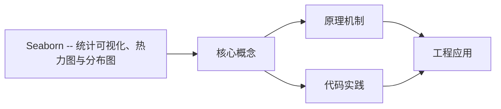

## 1. 学习目标（Bloom 分类）

本节按照布鲁姆教育目标分类学组织学习路径。本文主题为《Seaborn -- 统计可视化、热力图与分布图》，属于 数据分析 模块，读者可以根据自身阶段选择阅读深度。

记忆层面：能够准确复述本文的核心概念、术语与基本语法或操作步骤，并能够在提问或检索时快速定位对应知识点。能够说出 数据分析 的核心概念、常用命令与流程。

理解层面：能够用自己的语言解释核心原理与工作机制，说明概念之间的因果关系，而不是机械记忆结论。能够解释 数据分析 的工作原理与设计动机。

应用层面：能够在真实项目或练习场景中运用本文知识解决具体问题，写出正确且可维护的实现。能够独立完成 数据分析 的标准操作。

分析层面：能够拆解复杂问题，比较本文主题与相邻概念的异同，识别边界条件与例外情况。能够分析 数据分析 使用中的异常与边界。

评价层面：能够根据约束条件（性能、可读性、安全、成本）评价不同方案的优劣，做出有依据的技术决策。能够评价 数据分析 相关工具与方案。

创造层面：能够把本文知识与其他模块知识组合，设计出新的解决方案或可复用的工程模式。能够把 数据分析 融入团队工作流。

通过本节学习，读者应当能够把《Seaborn -- 统计可视化、热力图与分布图》纳入自己的知识网络，并与 数据分析 模块的其他主题（数据清洗、可视化、统计、报告）建立关联。

## 2. 历史动机与发展脉络

《Seaborn -- 统计可视化、热力图与分布图》是 数据分析 领域的重要主题。要真正理解它，需要先了解它解决的问题与演进过程。

数据分析是从数据中提取决策信息的工程过程：定义问题 -> 采集 -> 清洗 -> 探索 -> 建模 -> 可视化 -> 报告。
工具链：Python（Pandas/NumPy）、SQL、Jupyter、BI（Tableau/PowerBI）；Excel 仍是轻量入口。
方法：描述性分析（发生了什么）、诊断（为什么）、预测（会怎样）、规范（该怎么办）。

回到本文主题：Seaborn -- 统计可视化、热力图与分布图 的提出与成熟，正是上述技术背景下的必然产物。早期实现往往以简单可用为目标，随着工程规模扩大，社区逐渐沉淀出标准做法与最佳实践；理解这一脉络，可以帮助读者判断“为什么文档中的推荐写法是现在这个样子”，也能在遇到历史遗留代码时准确识别其设计年代与取舍。


## 3. 形式化定义与核心概念精讲

本节把《Seaborn -- 统计可视化、热力图与分布图》涉及的核心概念以“定义 + 讲解”的形式展开。读者应把定义当作工具，把讲解当作理解路径；两者结合才能形成可迁移的知识。

数据形态：表格（结构化）、序列（时间）、文本、图像；分析前确定数据类型（数值/类别/顺序）。
清洗：缺失值（删除/填充）、异常值（IQR/z-score）、重复、类型转换；清洗决定结果可信度。
探索性分析（EDA）：分布（直方图）、集中趋势（均值/中位数）、离散（方差/IQR）、相关性。

### 3.1 原文章节逐一精讲

原文档把主题拆分为 21 个小节，下面按顺序给出每一节的导读讲解，随后保留原文细节供精读。

#### 原文精读（完整保留）

# 数据分析 Seaborn 可视化

> **符号约定**：`< >` 必填参数 | `[ ]` 可选参数

---

#### 1. Seaborn 简介

##### 1.1 为什么需要 Seaborn

Matplotlib 是底层绘图库，功能强大但 API 繁琐。Seaborn 在 Matplotlib 之上提供了：

- **面向 DataFrame 的 API**：直接传入 DataFrame 和列名，无需手动提取数组
- **语义映射**：`hue`、`style`、`size` 参数自动将数据映射为颜色、样式、大小
- **统计图表**：内置均值估计、置信区间、核密度估计等统计功能
- **美观默认样式**：开箱即用的专业外观

> **Seaborn 与 Matplotlib 的关系**：Seaborn 不是 Matplotlib 的替代品，而是补充。Seaborn 负责统计图表的快速绘制，Matplotlib 负责精细定制。两者可以无缝混用。

##### 1.2 内置数据集

```python
import seaborn as sns
import pandas as pd
import matplotlib.pyplot as plt

tips = sns.load_dataset('tips')
print(f"Shape: {tips.shape}")
print(f"Columns: {tips.columns.tolist()}")
print(f"\nFirst 5 rows:\n{tips.head()}")
print(f"\nData types:\n{tips.dtypes}")
```

**输出说明**：Seaborn 内置多个示例数据集，`tips` 是最常用的餐厅小费数据集，包含总账单、小费、性别、是否吸烟、日期、时间、人数等字段。这些数据集适合练习各种图表类型。

> 跨模块参考：Seaborn 的 DataFrame 接口依赖 [pandas.md](pandas.md) 的数据结构，底层绘图依赖 [matplotlib.md](matplotlib.md)。

---

#### 2. 样式与主题

##### 2.1 五种内置主题

```python
import seaborn as sns
import matplotlib.pyplot as plt
import numpy as np

themes = ['darkgrid', 'whitegrid', 'dark', 'white', 'ticks']

fig, axes = plt.subplots(1, 5, figsize=(20, 4))
x = np.linspace(0, 10, 50)

for ax, theme in zip(axes, themes):
    plt.sca(ax)
    sns.set_theme(style=theme)
    plt.plot(x, np.sin(x))
    plt.title(f'style="{theme}"')

sns.set_theme(style='whitegrid')
plt.tight_layout()
plt.show()
```

**输出说明**：

- `darkgrid`：深色背景 + 网格，适合数据密集型图表
- `whitegrid`：白色背景 + 网格，最常用的分析风格
- `dark`：深色背景无网格
- `white`：白色背景无网格
- `ticks`：白色背景 + 刻度线

##### 2.2 全局配置

```python
import seaborn as sns
import matplotlib.pyplot as plt

sns.set_theme(
    style='whitegrid',
    palette='deep',
    font_scale=1.2,
    rc={'figure.figsize': (10, 6)}
)

sns.despine()
```

**输出说明**：`set_theme` 一次性设置样式、调色板、字体缩放和 rcParams。`despine()` 去除顶部和右侧边框，使图表更简洁。

---

#### 3. 分布图

##### 3.1 直方图 histplot

```python
import seaborn as sns
import matplotlib.pyplot as plt

tips = sns.load_dataset('tips')

fig, ax = plt.subplots(figsize=(10, 5))
sns.histplot(data=tips, x='total_bill', bins=30, kde=True, color='steelblue', ax=ax)
ax.set_title('Distribution of Total Bill')
ax.set_xlabel('Total Bill ($)')
plt.show()
```

**输出说明**：`kde=` 在直方图上叠加核密度估计曲线，同时展示离散频数和连续密度。直方图显示总账单呈右偏分布，多数集中在 10-25 美元。

##### 3.2 分组直方图

```python
import seaborn as sns
import matplotlib.pyplot as plt

tips = sns.load_dataset('tips')

fig, ax = plt.subplots(figsize=(10, 5))
sns.histplot(data=tips, x='total_bill', hue='time', multiple='dodge', bins=20, ax=ax)
ax.set_title('Total Bill by Time of Day')
plt.show()
```

**输出说明**：`hue='time'` 按用餐时间分组着色，`multiple='dodge'` 使两组柱子并排显示（而非叠加）。其他选项：`'layer'`（叠加，默认）、`'stack'`（堆叠）、`'fill'`（填充百分比）。

##### 3.3 核密度估计 kdeplot

```python
import seaborn as sns
import matplotlib.pyplot as plt

tips = sns.load_dataset('tips')

fig, ax = plt.subplots(figsize=(10, 5))
sns.kdeplot(data=tips, x='total_bill', hue='time', fill=True, alpha=0.5, ax=ax)
ax.set_title('KDE of Total Bill by Time')
plt.show()
```

**输出说明**：KDE（核密度估计）是直方图的平滑版本，不受 bins 选择的影响。`fill=` 填充曲线下方区域。KDE 更适合比较不同组的分布形态。

> **为什么 KDE 比直方图更适合比较分布？** 直方图的形状受 bins 数量和起始位置影响，不同参数可能呈现不同形态。KDE 通过核函数平滑，结果更稳定，且曲线更容易视觉比较。

##### 3.4 经验累积分布 ecdfplot

```python
import seaborn as sns
import matplotlib.pyplot as plt

tips = sns.load_dataset('tips')

fig, ax = plt.subplots(figsize=(10, 5))
sns.ecdfplot(data=tips, x='total_bill', hue='time', ax=ax)
ax.set_title('ECDF of Total Bill by Time')
ax.axhline(y=0.5, color='gray', linestyle='--', alpha=0.5)
plt.show()
```

**输出说明**：ECDF（经验累积分布函数）显示小于等于某个值的观测比例。在 y=0.5 处的水平线与曲线的交点即为中位数。ECDF 不做任何平滑假设，是最忠实的分布表示。

##### 3.5 统一接口 displot

```python
import seaborn as sns
import matplotlib.pyplot as plt

tips = sns.load_dataset('tips')

g = sns.displot(data=tips, x='total_bill', col='time', row='smoker',
                kind='kde', fill=True, height=4, aspect=1.2)
g.fig.suptitle('Distribution by Time and Smoker', y=1.02)
plt.show()
```

**输出说明**：`displot` 是分布图的统一接口，通过 `kind` 参数选择 `'hist'`、`'kde'`、`'ecdf'`。`col` 和 `row` 参数创建分面网格。注意 `displot` 返回 FacetGrid 对象，不能传入 `ax` 参数。

---

#### 4. 关系图

##### 4.1 散点图 scatterplot

```python
import seaborn as sns
import matplotlib.pyplot as plt

tips = sns.load_dataset('tips')

fig, ax = plt.subplots(figsize=(10, 6))
sns.scatterplot(data=tips, x='total_bill', y='tip', hue='time',
                style='smoker', size='size', sizes=(30, 200), ax=ax)
ax.set_title('Tips vs Total Bill')
plt.show()
```

**输出说明**：一个散点图同时编码了四个变量：

- x 轴：总账单
- y 轴：小费
- 颜色（hue）：用餐时间
- 标记样式（style）：是否吸烟
- 标记大小（size）：用餐人数

> **为什么语义映射比手动编码好？** 手动编码需要为每个类别创建子集并分别绘制，代码冗长且容易出错。Seaborn 的语义映射自动处理图例、配色和标记，代码简洁且一致。

##### 4.2 线图 lineplot

```python
import seaborn as sns
import matplotlib.pyplot as plt

fmri = sns.load_dataset('fmri')

fig, ax = plt.subplots(figsize=(10, 5))
sns.lineplot(data=fmri, x='timepoint', y='signal', hue='event',
             style='region', markers=True, ax=ax)
ax.set_title('FMRI Signal Over Time')
plt.show()
```

**输出说明**：`lineplot` 自动计算每个 x 值对应的均值和置信区间。阴影区域表示 95% 置信区间，线条表示均值。这是 Seaborn 与 Matplotlib `ax.plot` 的关键区别——Seaborn 自动添加统计摘要。

##### 4.3 统一接口 relplot

```python
import seaborn as sns
import matplotlib.pyplot as plt

tips = sns.load_dataset('tips')

g = sns.relplot(data=tips, x='total_bill', y='tip', col='time',
                hue='smoker', style='smoker', kind='scatter', height=5)
g.fig.suptitle('Tips by Time and Smoker Status', y=1.02)
plt.show()
```

**输出说明**：`relplot` 是关系图的统一接口，`kind='scatter'` 或 `kind='line'`。`col` 参数创建分面，每个用餐时间一个子图。

---

#### 5. 分类图

##### 5.1 箱线图 boxplot

```python
import seaborn as sns
import matplotlib.pyplot as plt

tips = sns.load_dataset('tips')

fig, ax = plt.subplots(figsize=(10, 5))
sns.boxplot(data=tips, x='day', y='total_bill', hue='smoker', ax=ax)
ax.set_title('Total Bill by Day and Smoker Status')
plt.show()
```

**输出说明**：箱线图展示五个统计量：最小值、Q1、中位数、Q3、最大值。箱体外的点是异常值（超过 1.5 IQR 的点）。`hue` 参数按吸烟状态分组，每个日期显示两个箱体。

> **箱线图各部分解读**：
>
> - 箱体下边：Q1（25%分位数）
> - 箱体中线：Q2（中位数）
> - 箱体上边：Q3（75%分位数）
> - 须线：1.5 IQR 范围内的最远点
> - 独立点：异常值

##### 5.2 小提琴图 violinplot

```python
import seaborn as sns
import matplotlib.pyplot as plt

tips = sns.load_dataset('tips')

fig, ax = plt.subplots(figsize=(10, 5))
sns.violinplot(data=tips, x='day', y='total_bill', hue='time',
               split=True, inner='quartile', ax=ax)
ax.set_title('Violin Plot of Total Bill by Day and Time')
plt.show()
```

**输出说明**：小提琴图是箱线图与核密度估计的结合。`split=` 将两个组分别显示在小提琴的两侧，便于对比。`inner='quartile'` 在内部显示四分位数线。小提琴的宽度表示该位置的密度。

> **箱线图 vs 小提琴图**：箱线图精确展示分位数，适合少量数据；小提琴图展示完整分布形态，适合数据量较大时。小提琴图的信息量更大，但对小样本的 KDE 估计可能不可靠。

##### 5.3 条形图 barplot 与点图 pointplot

```python
import seaborn as sns
import matplotlib.pyplot as plt

tips = sns.load_dataset('tips')

fig, (ax1, ax2) = plt.subplots(1, 2, figsize=(14, 5))

sns.barplot(data=tips, x='day', y='total_bill', hue='smoker', ax=ax1)
ax1.set_title('Bar Plot (Mean + CI)')

sns.pointplot(data=tips, x='day', y='total_bill', hue='smoker', ax=ax2)
ax2.set_title('Point Plot (Mean + CI)')

plt.tight_layout()
plt.show()
```

**输出说明**：

- `barplot`：柱高表示均值，误差棒表示 95% 置信区间
- `pointplot`：点表示均值，连线便于比较不同类别间的趋势变化
- 两者都计算均值和置信区间，但 pointplot 更适合展示交互效应

##### 5.4 散点分类图 stripplot 与 swarmplot

```python
import seaborn as sns
import matplotlib.pyplot as plt

tips = sns.load_dataset('tips')

fig, (ax1, ax2) = plt.subplots(1, 2, figsize=(14, 5))

sns.stripplot(data=tips, x='day', y='total_bill', hue='smoker',
              dodge=True, alpha=0.5, ax=ax1)
ax1.set_title('Strip Plot')

sns.swarmplot(data=tips, x='day', y='total_bill', hue='smoker',
              dodge=True, ax=ax2)
ax2.set_title('Swarm Plot')

plt.tight_layout()
plt.show()
```

**输出说明**：

- `stripplot`：在类别轴上添加随机抖动，避免点重叠
- `swarmplot`：智能排列点避免重叠，展示每个数据点的精确位置
- `dodge=` 将 hue 组分开显示

##### 5.5 统一接口 catplot

```python
import seaborn as sns
import matplotlib.pyplot as plt

tips = sns.load_dataset('tips')

g = sns.catplot(data=tips, x='day', y='total_bill', col='time',
                kind='box', height=5, aspect=0.8)
g.fig.suptitle('Total Bill by Day and Time', y=1.02)
plt.show()
```

**输出说明**：`catplot` 是分类图的统一接口，`kind` 可选 `'box'`、`'violin'`、`'bar'`、`'point'`、`'strip'`、`'swarm'`。

---

#### 6. 热力图

##### 6.1 相关性矩阵热力图

```python
import seaborn as sns
import matplotlib.pyplot as plt
import pandas as pd
import numpy as np

tips = sns.load_dataset('tips')

corr = tips.select_dtypes(include='number').corr()

fig, ax = plt.subplots(figsize=(8, 6))
mask = np.triu(np.ones_like(corr, dtype=bool))
sns.heatmap(corr, mask=mask, annot=True, fmt='.2f', cmap='coolwarm',
            center=0, square=True, linewidths=0.5, ax=ax)
ax.set_title('Correlation Matrix (Lower Triangle)')
plt.show()
```

**输出说明**：

- `mask` 参数隐藏上三角（因为相关矩阵是对称的）
- `annot=` 显示相关系数数值
- `cmap='coolwarm'` 使用发散配色，`center=0` 以 0 为中心
- `square=` 使每个单元格为正方形

> **为什么相关矩阵热力图用发散配色？** 相关系数范围为 [-1, 1]，0 表示无相关。发散配色以 0 为中性色，正值偏暖色，负值偏冷色，使正负相关一目了然。

##### 6.2 数据矩阵热力图

```python
import seaborn as sns
import matplotlib.pyplot as plt
import pandas as pd
import numpy as np

flights = sns.load_dataset('flights')
flights_pivot = flights.pivot(index='month', columns='year', values='passengers')

fig, ax = plt.subplots(figsize=(12, 8))
sns.heatmap(flights_pivot, annot=True, fmt='d', cmap='YlOrRd',
            linewidths=0.5, ax=ax)
ax.set_title('Airline Passengers (1949-1960)')
plt.show()
```

**输出说明**：`flights` 数据集展示航空公司月度乘客数。热力图的颜色深浅直观展示数值大小，可以清晰看到乘客数逐年增长和夏季高峰的季节性模式。`fmt='d'` 格式化整数显示。

##### 6.3 聚类热力图 clustermap

```python
import seaborn as sns
import matplotlib.pyplot as plt

iris = sns.load_dataset('iris')
iris_numeric = iris.select_dtypes(include='number')

g = sns.clustermap(iris_numeric.corr(), annot=True, cmap='coolwarm',
                   center=0, figsize=(8, 8))
g.fig.suptitle('Clustered Correlation Matrix', y=1.02)
plt.show()
```

**输出说明**：`clustermap` 在热力图基础上添加层次聚类，对行和列重新排序使相似项相邻。树状图（dendrogram）显示聚类关系。

---

#### 7. 回归图

##### 7.1 regplot 与 lmplot

```python
import seaborn as sns
import matplotlib.pyplot as plt

tips = sns.load_dataset('tips')

fig, ax = plt.subplots(figsize=(10, 6))
sns.regplot(data=tips, x='total_bill', y='tip', scatter_kws={'alpha': 0.5},
            line_kws={'color': 'red'}, ax=ax)
ax.set_title('Regression: Tip vs Total Bill')
plt.show()
```

**输出说明**：`regplot` 绘制散点图并叠加线性回归拟合线和 95% 置信区间带。阴影区域越窄，回归估计越精确。

```python
import seaborn as sns
import matplotlib.pyplot as plt

tips = sns.load_dataset('tips')

g = sns.lmplot(data=tips, x='total_bill', y='tip', hue='smoker',
               col='time', height=5, aspect=1)
g.fig.suptitle('Regression by Smoker and Time', y=1.02)
plt.show()
```

**输出说明**：`lmplot` 是 `regplot` 的分面版本，支持 `hue`、`col`、`row` 参数。每个子图独立拟合回归线，可以比较不同组的回归关系。

##### 7.2 多项式拟合与残差

```python
import seaborn as sns
import matplotlib.pyplot as plt

tips = sns.load_dataset('tips')

fig, (ax1, ax2) = plt.subplots(1, 2, figsize=(14, 5))

sns.regplot(data=tips, x='total_bill', y='tip', order=2,
            scatter_kws={'alpha': 0.5}, ax=ax1)
ax1.set_title('Polynomial Regression (order=2)')

sns.residplot(data=tips, x='total_bill', y='tip', scatter_kws={'alpha': 0.5}, ax=ax2)
ax2.set_title('Residual Plot')
ax2.axhline(y=0, color='red', linestyle='--')

plt.tight_layout()
plt.show()
```

**输出说明**：

- `order=2` 使用二次多项式拟合而非线性
- `residplot` 绘制残差（观测值 - 拟合值），如果残差随机分布在 0 附近，说明线性模型合适；如果有明显模式，说明需要更高阶模型

---

#### 8. 多图网格（FacetGrid）

##### 8.1 FacetGrid 分面绘图

```python
import seaborn as sns
import matplotlib.pyplot as plt

tips = sns.load_dataset('tips')

g = sns.FacetGrid(tips, col='time', row='smoker', height=4, aspect=1.2)
g.map(sns.histplot, 'total_bill', kde=True)
g.add_legend()
g.fig.suptitle('Total Bill Distribution by Time and Smoker', y=1.02)
plt.show()
```

**输出说明**：`FacetGrid` 按分类变量的组合创建子图网格。`map` 方法将绘图函数应用到每个子图。这是 Seaborn 最强大的功能之一——用少量代码创建复杂的多维可视化。

##### 8.2 PairGrid 变量两两关系

```python
import seaborn as sns
import matplotlib.pyplot as plt

iris = sns.load_dataset('iris')

g = sns.PairGrid(iris, hue='species', height=2.5)
g.map_diag(sns.histplot, kde=True)
g.map_offdiag(sns.scatterplot, alpha=0.6)
g.add_legend()
g.fig.suptitle('Iris PairGrid', y=1.01)
plt.show()
```

**输出说明**：`PairGrid` 创建所有数值变量两两组合的矩阵图。对角线显示单变量分布，非对角线显示双变量散点图。这是 EDA 中最常用的多变量探索工具。

##### 8.3 JointGrid 联合分布

```python
import seaborn as sns
import matplotlib.pyplot as plt

tips = sns.load_dataset('tips')

g = sns.JointGrid(data=tips, x='total_bill', y='tip', height=8)
g.plot_joint(sns.scatterplot, alpha=0.5, hue=tips['time'])
g.plot_marginals(sns.histplot, kde=True)
g.fig.suptitle('Joint Distribution: Total Bill vs Tip', y=1.01)
plt.show()
```

**输出说明**：`JointGrid` 在中心绘制双变量散点图，在边缘绘制单变量分布。这等价于 [matplotlib.md](matplotlib.md) 中用 GridSpec 手动实现的联合分布图，但代码更简洁。

---

#### 9. 调色板与配色

##### 9.1 三类调色板

```python
import seaborn as sns
import matplotlib.pyplot as plt

fig, axes = plt.subplots(3, 1, figsize=(12, 8))

sns.palplot(sns.color_palette('deep', 8), ax=axes[0])
axes[0].set_title('Categorical: deep')

sns.palplot(sns.color_palette('viridis', 8), ax=axes[1])
axes[1].set_title('Sequential: viridis')

sns.palplot(sns.color_palette('coolwarm', 8), ax=axes[2])
axes[2].set_title('Diverging: coolwarm')

plt.tight_layout()
plt.show()
```

**输出说明**：

- **分类调色板**（Categorical）：区分离散类别，如 `deep`、`Set2`、`tab10`
- **连续调色板**（Sequential）：编码有序数值，如 `viridis`、`rocket`、`Blues`
- **发散调色板**（Diverging）：编码以中性值为中心的正负偏差，如 `coolwarm`、`vlag`、`RdBu`

##### 9.2 调色板选择指南

| 数据类型         | 推荐调色板                  | 说明           |
| ---------------- | --------------------------- | -------------- |
| 分类变量         | `deep`、`Set2`、`tab10`     | 颜色区分度高   |
| 连续变量（正）   | `viridis`、`rocket`、`mako` | 感知均匀       |
| 连续变量（正负） | `coolwarm`、`vlag`、`RdBu`  | 以中性色为中心 |
| 色盲友好         | `colorblind`                | Seaborn 内置   |

```python
import seaborn as sns

sns.set_palette('colorblind')
```

---

#### 10. 与 Matplotlib 协作

##### 10.1 在 Seaborn 图表上叠加 Matplotlib 元素

```python
import seaborn as sns
import matplotlib.pyplot as plt
import numpy as np

tips = sns.load_dataset('tips')

fig, ax = plt.subplots(figsize=(10, 6))
sns.scatterplot(data=tips, x='total_bill', y='tip', hue='time', ax=ax)

z = np.polyfit(tips['total_bill'], tips['tip'], 1)
p = np.poly1d(z)
x_line = np.linspace(tips['total_bill'].min(), tips['total_bill'].max(), 100)
ax.plot(x_line, p(x_line), color='red', linestyle='--', linewidth=2, label='Trend')

ax.axhline(y=tips['tip'].mean(), color='gray', linestyle=':', alpha=0.5, label='Mean Tip')
ax.set_title('Tips vs Total Bill with Trend Line')
ax.legend()
plt.show()
```

**输出说明**：Seaborn 函数返回 Matplotlib 的 Axes 对象，可以在上面叠加任何 Matplotlib 绘图元素。这种混用模式结合了 Seaborn 的便捷性和 Matplotlib 的灵活性。

##### 10.2 使用 ax 参数嵌入子图

```python
import seaborn as sns
import matplotlib.pyplot as plt

tips = sns.load_dataset('tips')

fig, axes = plt.subplots(2, 2, figsize=(14, 10))
fig.suptitle('Multi-View Analysis of Tips Data', fontsize=14)

sns.histplot(data=tips, x='total_bill', kde=True, ax=axes[0, 0])
axes[0, 0].set_title('Distribution')

sns.scatterplot(data=tips, x='total_bill', y='tip', hue='time', ax=axes[0, 1])
axes[0, 1].set_title('Scatter')

sns.boxplot(data=tips, x='day', y='total_bill', ax=axes[1, 0])
axes[1, 0].set_title('Box Plot')

corr = tips.select_dtypes(include='number').corr()
sns.heatmap(corr, annot=True, cmap='coolwarm', center=0, ax=axes[1, 1])
axes[1, 1].set_title('Correlation')

plt.tight_layout()
plt.show()
```

**输出说明**：通过 `ax` 参数将 Seaborn 图表嵌入 Matplotlib 的子图布局中，实现复杂的多图组合。这是制作数据分析报告最常用的模式。

---

#### 11. 速查表

##### 11.1 图表类型速查

| 分析目标             | 图表类型 | Seaborn 函数                     |
| -------------------- | -------- | -------------------------------- |
| 单变量分布           | 直方图   | `sns.histplot()`                 |
| 单变量分布（平滑）   | KDE      | `sns.kdeplot()`                  |
| 累积分布             | ECDF     | `sns.ecdfplot()`                 |
| 双变量关系           | 散点图   | `sns.scatterplot()`              |
| 双变量趋势           | 线图     | `sns.lineplot()`                 |
| 分类 vs 连续         | 箱线图   | `sns.boxplot()`                  |
| 分类 vs 连续（分布） | 小提琴图 | `sns.violinplot()`               |
| 分类均值             | 条形图   | `sns.barplot()`                  |
| 相关矩阵             | 热力图   | `sns.heatmap()`                  |
| 回归关系             | 回归图   | `sns.regplot()` / `sns.lmplot()` |

##### 11.2 语义映射参数

| 参数    | 作用         | 数据类型  |
| ------- | ------------ | --------- |
| `hue`   | 颜色区分     | 分类/连续 |
| `style` | 标记样式区分 | 分类      |
| `size`  | 标记大小区分 | 连续      |
| `col`   | 列方向分面   | 分类      |
| `row`   | 行方向分面   | 分类      |

##### 11.3 统一接口

| 接口            | kind 选项                             | 分面支持      |
| --------------- | ------------------------------------- | ------------- |
| `sns.displot()` | hist, kde, ecdf                       | col, row      |
| `sns.relplot()` | scatter, line                         | col, row      |
| `sns.catplot()` | box, violin, bar, point, strip, swarm | col, row      |
| `sns.lmplot()`  | reg                                   | col, row, hue |

---

#### 12. 延伸阅读

- Seaborn 官方文档：https://seaborn.pydata.org/
- Seaborn Gallery：https://seaborn.pydata.org/examples/
- Python Data Visualization Cookbook (Igor Milovanovic)
- Seaborn Tutorial：https://seaborn.pydata.org/tutorial.html
#### 基础设置

**基本写法：导入 Seaborn**
`import seaborn as sns`

```python
# 导入 seaborn 并设置主题
import seaborn as sns
import matplotlib.pyplot as plt
sns.set_theme(style="whitegrid")
```

---

**基本写法：设置主题**
`sns.set_theme(style=<主题>)`

```python
# 设置主题（darkgrid, whitegrid, dark, white, ticks）
sns.set_theme(style="darkgrid")
```

---

**基本写法：设置调色板**
`sns.set_palette(<调色板名>)`

```python
# 设置调色板
sns.set_palette("husl")
```

---

**基本写法：查看调色板**
`sns.color_palette(<调色板名>)`

```python
# 查看调色板
palette = sns.color_palette("deep")
sns.palplot(palette)
```

---

#### 关系图

**基本写法：绘制散点图**
`sns.scatterplot(data=<数据>, x=<x列>, y=<y列>)`

```python
# 绘制散点图
sns.scatterplot(data=df, x="height", y="weight")
plt.show()
```

---

**基本写法：按类别着色**
`sns.scatterplot(data=<数据>, x=<x列>, y=<y列>, hue=<分类列>)`

```python
# 按类别着色
sns.scatterplot(data=df, x="height", y="weight", hue="gender")
```

---

**基本写法：绘制折线图**
`sns.lineplot(data=<数据>, x=<x列>, y=<y列>)`

```python
# 绘制折线图
sns.lineplot(data=df, x="month", y="sales")
```

---

**基本写法：多变量关系图**
`sns.relplot(data=<数据>, x=<x列>, y=<y列>, kind=<图表类型>)`

```python
# 绘制多变量关系图
sns.relplot(data=df, x="height", y="weight", kind="scatter", col="gender")
```

---

#### 分布图

**基本写法：绘制直方图**
`sns.histplot(data=<数据>, x=<列>, bins=<分箱数>)`

```python
# 绘制直方图
sns.histplot(data=df, x="age", bins=20)
```

---

**基本写法：绘制核密度估计图**
`sns.kdeplot(data=<数据>, x=<列>)`

```python
# 绘制核密度估计图
sns.kdeplot(data=df, x="salary")
```

---

**基本写法：绘制经验累积分布函数**
`sns.ecdfplot(data=<数据>, x=<列>)`

```python
# 绘制 ECDF 图
sns.ecdfplot(data=df, x="score")
```

---

**基本写法：绘制分布-散点组合图**
`sns.rugplot(data=<数据>, x=<列>)`

```python
# 绘制 rugplot（在轴上显示数据点）
sns.rugplot(data=df, x="age")
```

---

**基本写法：组合分布图**
`sns.displot(data=<数据>, x=<列>, kind=<图表类型>)`

```python
# 组合直方图和 KDE
sns.displot(data=df, x="salary", kind="kde", rug=True)
```

---

#### 分类图

**基本写法：绘制箱线图**
`sns.boxplot(data=<数据>, x=<分类列>, y=<数值列>)`

```python
# 绘制箱线图
sns.boxplot(data=df, x="city", y="salary")
```

---

**基本写法：绘制小提琴图**
`sns.violinplot(data=<数据>, x=<分类列>, y=<数值列>)`

```python
# 绘制小提琴图
sns.violinplot(data=df, x="gender", y="height")
```

---

**基本写法：绘制条形图**
`sns.barplot(data=<数据>, x=<分类列>, y=<数值列>)`

```python
# 绘制条形图（默认显示均值和置信区间）
sns.barplot(data=df, x="city", y="sales")
```

---

**基本写法：绘制计数图**
`sns.countplot(data=<数据>, x=<分类列>)`

```python
# 绘制计数图（统计每个类别的数量）
sns.countplot(data=df, x="gender")
```

---

**基本写法：绘制点图**
`sns.pointplot(data=<数据>, x=<分类列>, y=<数值列>)`

```python
# 绘制点图（显示均值和置信区间）
sns.pointplot(data=df, x="month", y="sales")
```

---

**基本写法：绘制蜂群图**
`sns.swarmplot(data=<数据>, x=<分类列>, y=<数值列>)`

```python
# 绘制蜂群图（不重叠的散点图）
sns.swarmplot(data=df, x="city", y="salary")
```

---

#### 回归图

**基本写法：绘制线性回归图**
`sns.regplot(data=<数据>, x=<x列>, y=<y列>)`

```python
# 绘制线性回归图（含拟合线和置信区间）
sns.regplot(data=df, x="experience", y="salary")
```

---

**基本写法：绘制多变量回归图**
`sns.lmplot(data=<数据>, x=<x列>, y=<y列>, hue=<分类列>)`

```python
# 按类别绘制回归图
sns.lmplot(data=df, x="experience", y="salary", hue="education")
```

---

**基本写法：绘制残差图**
`sns.residplot(data=<数据>, x=<x列>, y=<y列>)`

```python
# 绘制残差图（检查回归模型的残差）
sns.residplot(data=df, x="experience", y="salary")
```

---

#### 矩阵图

**基本写法：绘制热力图**
`sns.heatmap(<矩阵数据>, annot=<是否标注>)`

```python
# 绘制热力图
corr = df.corr()
sns.heatmap(corr, annot=True, cmap="coolwarm")
```

---

**基本写法：绘制聚类图**
`sns.clustermap(<矩阵数据>)`

```python
# 绘制带聚类的热力图
sns.clustermap(corr, annot=True)
```

---

#### 多变量图

**基本写法：绘制成对关系图**
`sns.pairplot(data=<数据>, hue=<分类列>)`

```python
# 绘制成对关系图（散点图矩阵）
sns.pairplot(data=df, hue="species")
```

---

**基本写法：绘制联合分布图**
`sns.jointplot(data=<数据>, x=<x列>, y=<y列>, kind=<类型>)`

```python
# 绘制联合分布图
sns.jointplot(data=df, x="height", y="weight", kind="hex")
```

---

**基本写法：绘制多面板分类图**
`sns.catplot(data=<数据>, x=<分类列>, y=<数值列>, kind=<图表类型>)`

```python
# 绘制多面板分类图
sns.catplot(data=df, x="city", y="salary", kind="box", col="year")
```

---

#### 样式定制

**基本写法：设置图表大小**
`sns.set_theme(rc={"figure.figsize": (<宽>, <高>)})`

```python
# 设置图表大小
sns.set_theme(rc={"figure.figsize": (10, 6)})
```

---

**基本写法：设置字体大小**
`sns.set_theme(font_scale=<缩放比例>)`

```python
# 设置字体大小
sns.set_theme(font_scale=1.2)
```

---

**基本写法：移除顶部和右侧轴线**
`sns.despine()`

```python
# 移除图表的顶部和右侧轴线
sns.boxplot(data=df, x="city", y="salary")
sns.despine()
```

---

**基本写法：保存图表**
`plt.savefig(<文件路径>, dpi=<分辨率>, bbox_inches="tight")`

```python
# 保存图表到文件
sns.scatterplot(data=df, x="height", y="weight")
plt.savefig("scatter.png", dpi=300, bbox_inches="tight")
```

---

#### 数据加载

**基本写法：加载内置数据集**
`sns.load_dataset(<数据集名>)`

```python
# 加载 seaborn 内置数据集
tips = sns.load_dataset("tips")
iris = sns.load_dataset("iris")
```


### 3.2 概念关系图

下面用 Mermaid 图表达本文核心概念之间的关系，帮助读者建立整体图景：



图中展示的是本文知识的结构化关系：核心概念是入口，原理机制解释“为什么”，代码实践演示“怎么做”，工程应用回答“何时用”。读者学习时可以把每个小节的内容挂接到对应节点上。

## 4. 理论推导与原理解析

本节深入《Seaborn -- 统计可视化、热力图与分布图》背后的原理。理论部分不求面面俱到，而是聚焦“能解释现象、能指导实践”的关键推导。

数据形态：表格（结构化）、序列（时间）、文本、图像；分析前确定数据类型（数值/类别/顺序）。
清洗：缺失值（删除/填充）、异常值（IQR/z-score）、重复、类型转换；清洗决定结果可信度。
探索性分析（EDA）：分布（直方图）、集中趋势（均值/中位数）、离散（方差/IQR）、相关性。
可视化原则：图型匹配数据（趋势折线、比较柱状、构成饼/堆叠、关系散点），标注与叙事。

需要强调的是，理论推导与工程实践之间存在翻译层：理论给出的是理想化模型与边界条件，工程代码则必须处理真实环境中的例外。读者在学习时应先掌握理论的“标准情形”，再通过陷阱章节了解“非标准情形”。

## 5. 代码示例与逐行讲解

本节把原文中的代码示例系统整理，并为每个示例补充用途说明与讲解。读者不应只浏览代码，而应逐段对照讲解理解设计意图。

### 5.1 示例：1.2 内置数据集

该示例来自原文《1.2 内置数据集》小节，用于演示Seaborn -- 统计可视化、热力图与分布图相关操作。阅读时请先看代码结构，再看其后的讲解。

```python
import seaborn as sns
import pandas as pd
import matplotlib.pyplot as plt

tips = sns.load_dataset('tips')
print(f"Shape: {tips.shape}")
print(f"Columns: {tips.columns.tolist()}")
print(f"\nFirst 5 rows:\n{tips.head()}")
print(f"\nData types:\n{tips.dtypes}")
```

讲解：这段代码演示了本节核心知识点。代码中的关键操作可以归纳为三步：准备（定义或初始化）、执行（核心逻辑）、收尾（释放资源或返回结果）。实际项目中，这三步往往被封装为函数或类，以提升复用性与可测试性。

关键点分析：

该示例共 8 行有效代码，包含 1 类关键结构（import）。其中：

- 入口与初始化部分负责建立上下文，对应实际项目中的启动或装配逻辑；
- 核心逻辑部分体现本文主题的主要操作，是阅读时最需要对照讲解理解的部分；
- 输出或返回部分把结果交给调用方，注意其类型与边界条件。

进阶思考路径：先尝试修改参数观察行为变化，再把示例中的模式迁移到自己的项目中；每次修改都记录预期与实测差异，这是把示例转化为能力的最快方式。

### 5.2 示例：2.1 五种内置主题

该示例来自原文《2.1 五种内置主题》小节，用于演示Seaborn -- 统计可视化、热力图与分布图相关操作。阅读时请先看代码结构，再看其后的讲解。

```python
import seaborn as sns
import matplotlib.pyplot as plt
import numpy as np

themes = ['darkgrid', 'whitegrid', 'dark', 'white', 'ticks']

fig, axes = plt.subplots(1, 5, figsize=(20, 4))
x = np.linspace(0, 10, 50)

for ax, theme in zip(axes, themes):
    plt.sca(ax)
    sns.set_theme(style=theme)
    plt.plot(x, np.sin(x))
    plt.title(f'style="{theme}"')

sns.set_theme(style='whitegrid')
plt.tight_layout()
plt.show()
```

讲解：这段代码演示了本节核心知识点。代码中的关键操作可以归纳为三步：准备（定义或初始化）、执行（核心逻辑）、收尾（释放资源或返回结果）。实际项目中，这三步往往被封装为函数或类，以提升复用性与可测试性。

关键点分析：

该示例共 14 行有效代码，包含 2 类关键结构（import、for）。其中：

- 入口与初始化部分负责建立上下文，对应实际项目中的启动或装配逻辑；
- 核心逻辑部分体现本文主题的主要操作，是阅读时最需要对照讲解理解的部分；
- 输出或返回部分把结果交给调用方，注意其类型与边界条件。

进阶思考路径：先尝试修改参数观察行为变化，再把示例中的模式迁移到自己的项目中；每次修改都记录预期与实测差异，这是把示例转化为能力的最快方式。

### 5.3 示例：2.2 全局配置

该示例来自原文《2.2 全局配置》小节，用于演示Seaborn -- 统计可视化、热力图与分布图相关操作。阅读时请先看代码结构，再看其后的讲解。

```python
import seaborn as sns
import matplotlib.pyplot as plt

sns.set_theme(
    style='whitegrid',
    palette='deep',
    font_scale=1.2,
    rc={'figure.figsize': (10, 6)}
)

sns.despine()
```

讲解：这段代码演示了本节核心知识点。代码中的关键操作可以归纳为三步：准备（定义或初始化）、执行（核心逻辑）、收尾（释放资源或返回结果）。实际项目中，这三步往往被封装为函数或类，以提升复用性与可测试性。

关键点分析：

该示例共 9 行有效代码，包含 1 类关键结构（import）。其中：

- 入口与初始化部分负责建立上下文，对应实际项目中的启动或装配逻辑；
- 核心逻辑部分体现本文主题的主要操作，是阅读时最需要对照讲解理解的部分；
- 输出或返回部分把结果交给调用方，注意其类型与边界条件。

进阶思考路径：先尝试修改参数观察行为变化，再把示例中的模式迁移到自己的项目中；每次修改都记录预期与实测差异，这是把示例转化为能力的最快方式。

### 5.4 示例：3.1 直方图 histplot

该示例来自原文《3.1 直方图 histplot》小节，用于演示Seaborn -- 统计可视化、热力图与分布图相关操作。阅读时请先看代码结构，再看其后的讲解。

```python
import seaborn as sns
import matplotlib.pyplot as plt

tips = sns.load_dataset('tips')

fig, ax = plt.subplots(figsize=(10, 5))
sns.histplot(data=tips, x='total_bill', bins=30, kde=True, color='steelblue', ax=ax)
ax.set_title('Distribution of Total Bill')
ax.set_xlabel('Total Bill ($)')
plt.show()
```

讲解：这段代码演示了本节核心知识点。代码中的关键操作可以归纳为三步：准备（定义或初始化）、执行（核心逻辑）、收尾（释放资源或返回结果）。实际项目中，这三步往往被封装为函数或类，以提升复用性与可测试性。

关键点分析：

该示例共 8 行有效代码，包含 1 类关键结构（import）。其中：

- 入口与初始化部分负责建立上下文，对应实际项目中的启动或装配逻辑；
- 核心逻辑部分体现本文主题的主要操作，是阅读时最需要对照讲解理解的部分；
- 输出或返回部分把结果交给调用方，注意其类型与边界条件。

进阶思考路径：先尝试修改参数观察行为变化，再把示例中的模式迁移到自己的项目中；每次修改都记录预期与实测差异，这是把示例转化为能力的最快方式。

### 5.5 示例：3.2 分组直方图

该示例来自原文《3.2 分组直方图》小节，用于演示Seaborn -- 统计可视化、热力图与分布图相关操作。阅读时请先看代码结构，再看其后的讲解。

```python
import seaborn as sns
import matplotlib.pyplot as plt

tips = sns.load_dataset('tips')

fig, ax = plt.subplots(figsize=(10, 5))
sns.histplot(data=tips, x='total_bill', hue='time', multiple='dodge', bins=20, ax=ax)
ax.set_title('Total Bill by Time of Day')
plt.show()
```

讲解：这段代码演示了本节核心知识点。代码中的关键操作可以归纳为三步：准备（定义或初始化）、执行（核心逻辑）、收尾（释放资源或返回结果）。实际项目中，这三步往往被封装为函数或类，以提升复用性与可测试性。

关键点分析：

该示例共 7 行有效代码，包含 1 类关键结构（import）。其中：

- 入口与初始化部分负责建立上下文，对应实际项目中的启动或装配逻辑；
- 核心逻辑部分体现本文主题的主要操作，是阅读时最需要对照讲解理解的部分；
- 输出或返回部分把结果交给调用方，注意其类型与边界条件。

进阶思考路径：先尝试修改参数观察行为变化，再把示例中的模式迁移到自己的项目中；每次修改都记录预期与实测差异，这是把示例转化为能力的最快方式。

### 5.6 示例：3.3 核密度估计 kdeplot

该示例来自原文《3.3 核密度估计 kdeplot》小节，用于演示Seaborn -- 统计可视化、热力图与分布图相关操作。阅读时请先看代码结构，再看其后的讲解。

```python
import seaborn as sns
import matplotlib.pyplot as plt

tips = sns.load_dataset('tips')

fig, ax = plt.subplots(figsize=(10, 5))
sns.kdeplot(data=tips, x='total_bill', hue='time', fill=True, alpha=0.5, ax=ax)
ax.set_title('KDE of Total Bill by Time')
plt.show()
```

讲解：这段代码演示了本节核心知识点。代码中的关键操作可以归纳为三步：准备（定义或初始化）、执行（核心逻辑）、收尾（释放资源或返回结果）。实际项目中，这三步往往被封装为函数或类，以提升复用性与可测试性。

关键点分析：

该示例共 7 行有效代码，包含 1 类关键结构（import）。其中：

- 入口与初始化部分负责建立上下文，对应实际项目中的启动或装配逻辑；
- 核心逻辑部分体现本文主题的主要操作，是阅读时最需要对照讲解理解的部分；
- 输出或返回部分把结果交给调用方，注意其类型与边界条件。

进阶思考路径：先尝试修改参数观察行为变化，再把示例中的模式迁移到自己的项目中；每次修改都记录预期与实测差异，这是把示例转化为能力的最快方式。

### 5.7 示例：3.4 经验累积分布 ecdfplot

该示例来自原文《3.4 经验累积分布 ecdfplot》小节，用于演示Seaborn -- 统计可视化、热力图与分布图相关操作。阅读时请先看代码结构，再看其后的讲解。

```python
import seaborn as sns
import matplotlib.pyplot as plt

tips = sns.load_dataset('tips')

fig, ax = plt.subplots(figsize=(10, 5))
sns.ecdfplot(data=tips, x='total_bill', hue='time', ax=ax)
ax.set_title('ECDF of Total Bill by Time')
ax.axhline(y=0.5, color='gray', linestyle='--', alpha=0.5)
plt.show()
```

讲解：这段代码演示了本节核心知识点。代码中的关键操作可以归纳为三步：准备（定义或初始化）、执行（核心逻辑）、收尾（释放资源或返回结果）。实际项目中，这三步往往被封装为函数或类，以提升复用性与可测试性。

关键点分析：

该示例共 8 行有效代码，包含 1 类关键结构（import）。其中：

- 入口与初始化部分负责建立上下文，对应实际项目中的启动或装配逻辑；
- 核心逻辑部分体现本文主题的主要操作，是阅读时最需要对照讲解理解的部分；
- 输出或返回部分把结果交给调用方，注意其类型与边界条件。

进阶思考路径：先尝试修改参数观察行为变化，再把示例中的模式迁移到自己的项目中；每次修改都记录预期与实测差异，这是把示例转化为能力的最快方式。

### 5.8 示例：3.5 统一接口 displot

该示例来自原文《3.5 统一接口 displot》小节，用于演示Seaborn -- 统计可视化、热力图与分布图相关操作。阅读时请先看代码结构，再看其后的讲解。

```python
import seaborn as sns
import matplotlib.pyplot as plt

tips = sns.load_dataset('tips')

g = sns.displot(data=tips, x='total_bill', col='time', row='smoker',
                kind='kde', fill=True, height=4, aspect=1.2)
g.fig.suptitle('Distribution by Time and Smoker', y=1.02)
plt.show()
```

讲解：这段代码演示了本节核心知识点。代码中的关键操作可以归纳为三步：准备（定义或初始化）、执行（核心逻辑）、收尾（释放资源或返回结果）。实际项目中，这三步往往被封装为函数或类，以提升复用性与可测试性。

关键点分析：

该示例共 7 行有效代码，包含 1 类关键结构（import）。其中：

- 入口与初始化部分负责建立上下文，对应实际项目中的启动或装配逻辑；
- 核心逻辑部分体现本文主题的主要操作，是阅读时最需要对照讲解理解的部分；
- 输出或返回部分把结果交给调用方，注意其类型与边界条件。

进阶思考路径：先尝试修改参数观察行为变化，再把示例中的模式迁移到自己的项目中；每次修改都记录预期与实测差异，这是把示例转化为能力的最快方式。

### 5.9 示例：4.1 散点图 scatterplot

该示例来自原文《4.1 散点图 scatterplot》小节，用于演示Seaborn -- 统计可视化、热力图与分布图相关操作。阅读时请先看代码结构，再看其后的讲解。

```python
import seaborn as sns
import matplotlib.pyplot as plt

tips = sns.load_dataset('tips')

fig, ax = plt.subplots(figsize=(10, 6))
sns.scatterplot(data=tips, x='total_bill', y='tip', hue='time',
                style='smoker', size='size', sizes=(30, 200), ax=ax)
ax.set_title('Tips vs Total Bill')
plt.show()
```

讲解：这段代码演示了本节核心知识点。代码中的关键操作可以归纳为三步：准备（定义或初始化）、执行（核心逻辑）、收尾（释放资源或返回结果）。实际项目中，这三步往往被封装为函数或类，以提升复用性与可测试性。

关键点分析：

该示例共 8 行有效代码，包含 1 类关键结构（import）。其中：

- 入口与初始化部分负责建立上下文，对应实际项目中的启动或装配逻辑；
- 核心逻辑部分体现本文主题的主要操作，是阅读时最需要对照讲解理解的部分；
- 输出或返回部分把结果交给调用方，注意其类型与边界条件。

进阶思考路径：先尝试修改参数观察行为变化，再把示例中的模式迁移到自己的项目中；每次修改都记录预期与实测差异，这是把示例转化为能力的最快方式。

### 5.10 示例：4.2 线图 lineplot

该示例来自原文《4.2 线图 lineplot》小节，用于演示Seaborn -- 统计可视化、热力图与分布图相关操作。阅读时请先看代码结构，再看其后的讲解。

```python
import seaborn as sns
import matplotlib.pyplot as plt

fmri = sns.load_dataset('fmri')

fig, ax = plt.subplots(figsize=(10, 5))
sns.lineplot(data=fmri, x='timepoint', y='signal', hue='event',
             style='region', markers=True, ax=ax)
ax.set_title('FMRI Signal Over Time')
plt.show()
```

讲解：这段代码演示了本节核心知识点。代码中的关键操作可以归纳为三步：准备（定义或初始化）、执行（核心逻辑）、收尾（释放资源或返回结果）。实际项目中，这三步往往被封装为函数或类，以提升复用性与可测试性。

关键点分析：

该示例共 8 行有效代码，包含 1 类关键结构（import）。其中：

- 入口与初始化部分负责建立上下文，对应实际项目中的启动或装配逻辑；
- 核心逻辑部分体现本文主题的主要操作，是阅读时最需要对照讲解理解的部分；
- 输出或返回部分把结果交给调用方，注意其类型与边界条件。

进阶思考路径：先尝试修改参数观察行为变化，再把示例中的模式迁移到自己的项目中；每次修改都记录预期与实测差异，这是把示例转化为能力的最快方式。

### 5.11 示例：4.3 统一接口 relplot

该示例来自原文《4.3 统一接口 relplot》小节，用于演示Seaborn -- 统计可视化、热力图与分布图相关操作。阅读时请先看代码结构，再看其后的讲解。

```python
import seaborn as sns
import matplotlib.pyplot as plt

tips = sns.load_dataset('tips')

g = sns.relplot(data=tips, x='total_bill', y='tip', col='time',
                hue='smoker', style='smoker', kind='scatter', height=5)
g.fig.suptitle('Tips by Time and Smoker Status', y=1.02)
plt.show()
```

讲解：这段代码演示了本节核心知识点。代码中的关键操作可以归纳为三步：准备（定义或初始化）、执行（核心逻辑）、收尾（释放资源或返回结果）。实际项目中，这三步往往被封装为函数或类，以提升复用性与可测试性。

关键点分析：

该示例共 7 行有效代码，包含 1 类关键结构（import）。其中：

- 入口与初始化部分负责建立上下文，对应实际项目中的启动或装配逻辑；
- 核心逻辑部分体现本文主题的主要操作，是阅读时最需要对照讲解理解的部分；
- 输出或返回部分把结果交给调用方，注意其类型与边界条件。

进阶思考路径：先尝试修改参数观察行为变化，再把示例中的模式迁移到自己的项目中；每次修改都记录预期与实测差异，这是把示例转化为能力的最快方式。

### 5.12 示例：5.1 箱线图 boxplot

该示例来自原文《5.1 箱线图 boxplot》小节，用于演示Seaborn -- 统计可视化、热力图与分布图相关操作。阅读时请先看代码结构，再看其后的讲解。

```python
import seaborn as sns
import matplotlib.pyplot as plt

tips = sns.load_dataset('tips')

fig, ax = plt.subplots(figsize=(10, 5))
sns.boxplot(data=tips, x='day', y='total_bill', hue='smoker', ax=ax)
ax.set_title('Total Bill by Day and Smoker Status')
plt.show()
```

讲解：这段代码演示了本节核心知识点。代码中的关键操作可以归纳为三步：准备（定义或初始化）、执行（核心逻辑）、收尾（释放资源或返回结果）。实际项目中，这三步往往被封装为函数或类，以提升复用性与可测试性。

关键点分析：

该示例共 7 行有效代码，包含 1 类关键结构（import）。其中：

- 入口与初始化部分负责建立上下文，对应实际项目中的启动或装配逻辑；
- 核心逻辑部分体现本文主题的主要操作，是阅读时最需要对照讲解理解的部分；
- 输出或返回部分把结果交给调用方，注意其类型与边界条件。

进阶思考路径：先尝试修改参数观察行为变化，再把示例中的模式迁移到自己的项目中；每次修改都记录预期与实测差异，这是把示例转化为能力的最快方式。

### 5.13 示例：5.2 小提琴图 violinplot

该示例来自原文《5.2 小提琴图 violinplot》小节，用于演示Seaborn -- 统计可视化、热力图与分布图相关操作。阅读时请先看代码结构，再看其后的讲解。

```python
import seaborn as sns
import matplotlib.pyplot as plt

tips = sns.load_dataset('tips')

fig, ax = plt.subplots(figsize=(10, 5))
sns.violinplot(data=tips, x='day', y='total_bill', hue='time',
               split=True, inner='quartile', ax=ax)
ax.set_title('Violin Plot of Total Bill by Day and Time')
plt.show()
```

讲解：这段代码演示了本节核心知识点。代码中的关键操作可以归纳为三步：准备（定义或初始化）、执行（核心逻辑）、收尾（释放资源或返回结果）。实际项目中，这三步往往被封装为函数或类，以提升复用性与可测试性。

关键点分析：

该示例共 8 行有效代码，包含 1 类关键结构（import）。其中：

- 入口与初始化部分负责建立上下文，对应实际项目中的启动或装配逻辑；
- 核心逻辑部分体现本文主题的主要操作，是阅读时最需要对照讲解理解的部分；
- 输出或返回部分把结果交给调用方，注意其类型与边界条件。

进阶思考路径：先尝试修改参数观察行为变化，再把示例中的模式迁移到自己的项目中；每次修改都记录预期与实测差异，这是把示例转化为能力的最快方式。

### 5.14 示例：5.3 条形图 barplot 与点图 pointplot

该示例来自原文《5.3 条形图 barplot 与点图 pointplot》小节，用于演示Seaborn -- 统计可视化、热力图与分布图相关操作。阅读时请先看代码结构，再看其后的讲解。

```python
import seaborn as sns
import matplotlib.pyplot as plt

tips = sns.load_dataset('tips')

fig, (ax1, ax2) = plt.subplots(1, 2, figsize=(14, 5))

sns.barplot(data=tips, x='day', y='total_bill', hue='smoker', ax=ax1)
ax1.set_title('Bar Plot (Mean + CI)')

sns.pointplot(data=tips, x='day', y='total_bill', hue='smoker', ax=ax2)
ax2.set_title('Point Plot (Mean + CI)')

plt.tight_layout()
plt.show()
```

讲解：这段代码演示了本节核心知识点。代码中的关键操作可以归纳为三步：准备（定义或初始化）、执行（核心逻辑）、收尾（释放资源或返回结果）。实际项目中，这三步往往被封装为函数或类，以提升复用性与可测试性。

关键点分析：

该示例共 10 行有效代码，包含 1 类关键结构（import）。其中：

- 入口与初始化部分负责建立上下文，对应实际项目中的启动或装配逻辑；
- 核心逻辑部分体现本文主题的主要操作，是阅读时最需要对照讲解理解的部分；
- 输出或返回部分把结果交给调用方，注意其类型与边界条件。

进阶思考路径：先尝试修改参数观察行为变化，再把示例中的模式迁移到自己的项目中；每次修改都记录预期与实测差异，这是把示例转化为能力的最快方式。

### 5.15 示例：5.4 散点分类图 stripplot 与 swarmplot

该示例来自原文《5.4 散点分类图 stripplot 与 swarmplot》小节，用于演示Seaborn -- 统计可视化、热力图与分布图相关操作。阅读时请先看代码结构，再看其后的讲解。

```python
import seaborn as sns
import matplotlib.pyplot as plt

tips = sns.load_dataset('tips')

fig, (ax1, ax2) = plt.subplots(1, 2, figsize=(14, 5))

sns.stripplot(data=tips, x='day', y='total_bill', hue='smoker',
              dodge=True, alpha=0.5, ax=ax1)
ax1.set_title('Strip Plot')

sns.swarmplot(data=tips, x='day', y='total_bill', hue='smoker',
              dodge=True, ax=ax2)
ax2.set_title('Swarm Plot')

plt.tight_layout()
plt.show()
```

讲解：这段代码演示了本节核心知识点。代码中的关键操作可以归纳为三步：准备（定义或初始化）、执行（核心逻辑）、收尾（释放资源或返回结果）。实际项目中，这三步往往被封装为函数或类，以提升复用性与可测试性。

关键点分析：

该示例共 12 行有效代码，包含 1 类关键结构（import）。其中：

- 入口与初始化部分负责建立上下文，对应实际项目中的启动或装配逻辑；
- 核心逻辑部分体现本文主题的主要操作，是阅读时最需要对照讲解理解的部分；
- 输出或返回部分把结果交给调用方，注意其类型与边界条件。

进阶思考路径：先尝试修改参数观察行为变化，再把示例中的模式迁移到自己的项目中；每次修改都记录预期与实测差异，这是把示例转化为能力的最快方式。

### 5.16 示例：5.5 统一接口 catplot

该示例来自原文《5.5 统一接口 catplot》小节，用于演示Seaborn -- 统计可视化、热力图与分布图相关操作。阅读时请先看代码结构，再看其后的讲解。

```python
import seaborn as sns
import matplotlib.pyplot as plt

tips = sns.load_dataset('tips')

g = sns.catplot(data=tips, x='day', y='total_bill', col='time',
                kind='box', height=5, aspect=0.8)
g.fig.suptitle('Total Bill by Day and Time', y=1.02)
plt.show()
```

讲解：这段代码演示了本节核心知识点。代码中的关键操作可以归纳为三步：准备（定义或初始化）、执行（核心逻辑）、收尾（释放资源或返回结果）。实际项目中，这三步往往被封装为函数或类，以提升复用性与可测试性。

关键点分析：

该示例共 7 行有效代码，包含 1 类关键结构（import）。其中：

- 入口与初始化部分负责建立上下文，对应实际项目中的启动或装配逻辑；
- 核心逻辑部分体现本文主题的主要操作，是阅读时最需要对照讲解理解的部分；
- 输出或返回部分把结果交给调用方，注意其类型与边界条件。

进阶思考路径：先尝试修改参数观察行为变化，再把示例中的模式迁移到自己的项目中；每次修改都记录预期与实测差异，这是把示例转化为能力的最快方式。

### 5.17 示例：6.1 相关性矩阵热力图

该示例来自原文《6.1 相关性矩阵热力图》小节，用于演示Seaborn -- 统计可视化、热力图与分布图相关操作。阅读时请先看代码结构，再看其后的讲解。

```python
import seaborn as sns
import matplotlib.pyplot as plt
import pandas as pd
import numpy as np

tips = sns.load_dataset('tips')

corr = tips.select_dtypes(include='number').corr()

fig, ax = plt.subplots(figsize=(8, 6))
mask = np.triu(np.ones_like(corr, dtype=bool))
sns.heatmap(corr, mask=mask, annot=True, fmt='.2f', cmap='coolwarm',
            center=0, square=True, linewidths=0.5, ax=ax)
ax.set_title('Correlation Matrix (Lower Triangle)')
plt.show()
```

讲解：这段代码演示了本节核心知识点。代码中的关键操作可以归纳为三步：准备（定义或初始化）、执行（核心逻辑）、收尾（释放资源或返回结果）。实际项目中，这三步往往被封装为函数或类，以提升复用性与可测试性。

关键点分析：

该示例共 12 行有效代码，包含 1 类关键结构（import）。其中：

- 入口与初始化部分负责建立上下文，对应实际项目中的启动或装配逻辑；
- 核心逻辑部分体现本文主题的主要操作，是阅读时最需要对照讲解理解的部分；
- 输出或返回部分把结果交给调用方，注意其类型与边界条件。

进阶思考路径：先尝试修改参数观察行为变化，再把示例中的模式迁移到自己的项目中；每次修改都记录预期与实测差异，这是把示例转化为能力的最快方式。

### 5.18 示例：6.2 数据矩阵热力图

该示例来自原文《6.2 数据矩阵热力图》小节，用于演示Seaborn -- 统计可视化、热力图与分布图相关操作。阅读时请先看代码结构，再看其后的讲解。

```python
import seaborn as sns
import matplotlib.pyplot as plt
import pandas as pd
import numpy as np

flights = sns.load_dataset('flights')
flights_pivot = flights.pivot(index='month', columns='year', values='passengers')

fig, ax = plt.subplots(figsize=(12, 8))
sns.heatmap(flights_pivot, annot=True, fmt='d', cmap='YlOrRd',
            linewidths=0.5, ax=ax)
ax.set_title('Airline Passengers (1949-1960)')
plt.show()
```

讲解：这段代码演示了本节核心知识点。代码中的关键操作可以归纳为三步：准备（定义或初始化）、执行（核心逻辑）、收尾（释放资源或返回结果）。实际项目中，这三步往往被封装为函数或类，以提升复用性与可测试性。

关键点分析：

该示例共 11 行有效代码，包含 1 类关键结构（import）。其中：

- 入口与初始化部分负责建立上下文，对应实际项目中的启动或装配逻辑；
- 核心逻辑部分体现本文主题的主要操作，是阅读时最需要对照讲解理解的部分；
- 输出或返回部分把结果交给调用方，注意其类型与边界条件。

进阶思考路径：先尝试修改参数观察行为变化，再把示例中的模式迁移到自己的项目中；每次修改都记录预期与实测差异，这是把示例转化为能力的最快方式。

### 5.19 示例：6.3 聚类热力图 clustermap

该示例来自原文《6.3 聚类热力图 clustermap》小节，用于演示Seaborn -- 统计可视化、热力图与分布图相关操作。阅读时请先看代码结构，再看其后的讲解。

```python
import seaborn as sns
import matplotlib.pyplot as plt

iris = sns.load_dataset('iris')
iris_numeric = iris.select_dtypes(include='number')

g = sns.clustermap(iris_numeric.corr(), annot=True, cmap='coolwarm',
                   center=0, figsize=(8, 8))
g.fig.suptitle('Clustered Correlation Matrix', y=1.02)
plt.show()
```

讲解：这段代码演示了本节核心知识点。代码中的关键操作可以归纳为三步：准备（定义或初始化）、执行（核心逻辑）、收尾（释放资源或返回结果）。实际项目中，这三步往往被封装为函数或类，以提升复用性与可测试性。

关键点分析：

该示例共 8 行有效代码，包含 1 类关键结构（import）。其中：

- 入口与初始化部分负责建立上下文，对应实际项目中的启动或装配逻辑；
- 核心逻辑部分体现本文主题的主要操作，是阅读时最需要对照讲解理解的部分；
- 输出或返回部分把结果交给调用方，注意其类型与边界条件。

进阶思考路径：先尝试修改参数观察行为变化，再把示例中的模式迁移到自己的项目中；每次修改都记录预期与实测差异，这是把示例转化为能力的最快方式。

### 5.20 示例：7.1 regplot 与 lmplot

该示例来自原文《7.1 regplot 与 lmplot》小节，用于演示Seaborn -- 统计可视化、热力图与分布图相关操作。阅读时请先看代码结构，再看其后的讲解。

```python
import seaborn as sns
import matplotlib.pyplot as plt

tips = sns.load_dataset('tips')

fig, ax = plt.subplots(figsize=(10, 6))
sns.regplot(data=tips, x='total_bill', y='tip', scatter_kws={'alpha': 0.5},
            line_kws={'color': 'red'}, ax=ax)
ax.set_title('Regression: Tip vs Total Bill')
plt.show()
```

讲解：这段代码演示了本节核心知识点。代码中的关键操作可以归纳为三步：准备（定义或初始化）、执行（核心逻辑）、收尾（释放资源或返回结果）。实际项目中，这三步往往被封装为函数或类，以提升复用性与可测试性。

关键点分析：

该示例共 8 行有效代码，包含 1 类关键结构（import）。其中：

- 入口与初始化部分负责建立上下文，对应实际项目中的启动或装配逻辑；
- 核心逻辑部分体现本文主题的主要操作，是阅读时最需要对照讲解理解的部分；
- 输出或返回部分把结果交给调用方，注意其类型与边界条件。

进阶思考路径：先尝试修改参数观察行为变化，再把示例中的模式迁移到自己的项目中；每次修改都记录预期与实测差异，这是把示例转化为能力的最快方式。

### 5.21 示例：7.1 regplot 与 lmplot

该示例来自原文《7.1 regplot 与 lmplot》小节，用于演示Seaborn -- 统计可视化、热力图与分布图相关操作。阅读时请先看代码结构，再看其后的讲解。

```python
import seaborn as sns
import matplotlib.pyplot as plt

tips = sns.load_dataset('tips')

g = sns.lmplot(data=tips, x='total_bill', y='tip', hue='smoker',
               col='time', height=5, aspect=1)
g.fig.suptitle('Regression by Smoker and Time', y=1.02)
plt.show()
```

讲解：这段代码演示了本节核心知识点。代码中的关键操作可以归纳为三步：准备（定义或初始化）、执行（核心逻辑）、收尾（释放资源或返回结果）。实际项目中，这三步往往被封装为函数或类，以提升复用性与可测试性。

关键点分析：

该示例共 7 行有效代码，包含 1 类关键结构（import）。其中：

- 入口与初始化部分负责建立上下文，对应实际项目中的启动或装配逻辑；
- 核心逻辑部分体现本文主题的主要操作，是阅读时最需要对照讲解理解的部分；
- 输出或返回部分把结果交给调用方，注意其类型与边界条件。

进阶思考路径：先尝试修改参数观察行为变化，再把示例中的模式迁移到自己的项目中；每次修改都记录预期与实测差异，这是把示例转化为能力的最快方式。

### 5.22 示例：7.2 多项式拟合与残差

该示例来自原文《7.2 多项式拟合与残差》小节，用于演示Seaborn -- 统计可视化、热力图与分布图相关操作。阅读时请先看代码结构，再看其后的讲解。

```python
import seaborn as sns
import matplotlib.pyplot as plt

tips = sns.load_dataset('tips')

fig, (ax1, ax2) = plt.subplots(1, 2, figsize=(14, 5))

sns.regplot(data=tips, x='total_bill', y='tip', order=2,
            scatter_kws={'alpha': 0.5}, ax=ax1)
ax1.set_title('Polynomial Regression (order=2)')

sns.residplot(data=tips, x='total_bill', y='tip', scatter_kws={'alpha': 0.5}, ax=ax2)
ax2.set_title('Residual Plot')
ax2.axhline(y=0, color='red', linestyle='--')

plt.tight_layout()
plt.show()
```

讲解：这段代码演示了本节核心知识点。代码中的关键操作可以归纳为三步：准备（定义或初始化）、执行（核心逻辑）、收尾（释放资源或返回结果）。实际项目中，这三步往往被封装为函数或类，以提升复用性与可测试性。

关键点分析：

该示例共 12 行有效代码，包含 1 类关键结构（import）。其中：

- 入口与初始化部分负责建立上下文，对应实际项目中的启动或装配逻辑；
- 核心逻辑部分体现本文主题的主要操作，是阅读时最需要对照讲解理解的部分；
- 输出或返回部分把结果交给调用方，注意其类型与边界条件。

进阶思考路径：先尝试修改参数观察行为变化，再把示例中的模式迁移到自己的项目中；每次修改都记录预期与实测差异，这是把示例转化为能力的最快方式。

### 5.23 示例：8.1 FacetGrid 分面绘图

该示例来自原文《8.1 FacetGrid 分面绘图》小节，用于演示Seaborn -- 统计可视化、热力图与分布图相关操作。阅读时请先看代码结构，再看其后的讲解。

```python
import seaborn as sns
import matplotlib.pyplot as plt

tips = sns.load_dataset('tips')

g = sns.FacetGrid(tips, col='time', row='smoker', height=4, aspect=1.2)
g.map(sns.histplot, 'total_bill', kde=True)
g.add_legend()
g.fig.suptitle('Total Bill Distribution by Time and Smoker', y=1.02)
plt.show()
```

讲解：这段代码演示了本节核心知识点。代码中的关键操作可以归纳为三步：准备（定义或初始化）、执行（核心逻辑）、收尾（释放资源或返回结果）。实际项目中，这三步往往被封装为函数或类，以提升复用性与可测试性。

关键点分析：

该示例共 8 行有效代码，包含 1 类关键结构（import）。其中：

- 入口与初始化部分负责建立上下文，对应实际项目中的启动或装配逻辑；
- 核心逻辑部分体现本文主题的主要操作，是阅读时最需要对照讲解理解的部分；
- 输出或返回部分把结果交给调用方，注意其类型与边界条件。

进阶思考路径：先尝试修改参数观察行为变化，再把示例中的模式迁移到自己的项目中；每次修改都记录预期与实测差异，这是把示例转化为能力的最快方式。

### 5.24 示例：8.2 PairGrid 变量两两关系

该示例来自原文《8.2 PairGrid 变量两两关系》小节，用于演示Seaborn -- 统计可视化、热力图与分布图相关操作。阅读时请先看代码结构，再看其后的讲解。

```python
import seaborn as sns
import matplotlib.pyplot as plt

iris = sns.load_dataset('iris')

g = sns.PairGrid(iris, hue='species', height=2.5)
g.map_diag(sns.histplot, kde=True)
g.map_offdiag(sns.scatterplot, alpha=0.6)
g.add_legend()
g.fig.suptitle('Iris PairGrid', y=1.01)
plt.show()
```

讲解：这段代码演示了本节核心知识点。代码中的关键操作可以归纳为三步：准备（定义或初始化）、执行（核心逻辑）、收尾（释放资源或返回结果）。实际项目中，这三步往往被封装为函数或类，以提升复用性与可测试性。

关键点分析：

该示例共 9 行有效代码，包含 1 类关键结构（import）。其中：

- 入口与初始化部分负责建立上下文，对应实际项目中的启动或装配逻辑；
- 核心逻辑部分体现本文主题的主要操作，是阅读时最需要对照讲解理解的部分；
- 输出或返回部分把结果交给调用方，注意其类型与边界条件。

进阶思考路径：先尝试修改参数观察行为变化，再把示例中的模式迁移到自己的项目中；每次修改都记录预期与实测差异，这是把示例转化为能力的最快方式。

### 5.25 示例：8.3 JointGrid 联合分布

该示例来自原文《8.3 JointGrid 联合分布》小节，用于演示Seaborn -- 统计可视化、热力图与分布图相关操作。阅读时请先看代码结构，再看其后的讲解。

```python
import seaborn as sns
import matplotlib.pyplot as plt

tips = sns.load_dataset('tips')

g = sns.JointGrid(data=tips, x='total_bill', y='tip', height=8)
g.plot_joint(sns.scatterplot, alpha=0.5, hue=tips['time'])
g.plot_marginals(sns.histplot, kde=True)
g.fig.suptitle('Joint Distribution: Total Bill vs Tip', y=1.01)
plt.show()
```

讲解：这段代码演示了本节核心知识点。代码中的关键操作可以归纳为三步：准备（定义或初始化）、执行（核心逻辑）、收尾（释放资源或返回结果）。实际项目中，这三步往往被封装为函数或类，以提升复用性与可测试性。

关键点分析：

该示例共 8 行有效代码，包含 1 类关键结构（import）。其中：

- 入口与初始化部分负责建立上下文，对应实际项目中的启动或装配逻辑；
- 核心逻辑部分体现本文主题的主要操作，是阅读时最需要对照讲解理解的部分；
- 输出或返回部分把结果交给调用方，注意其类型与边界条件。

进阶思考路径：先尝试修改参数观察行为变化，再把示例中的模式迁移到自己的项目中；每次修改都记录预期与实测差异，这是把示例转化为能力的最快方式。

### 5.26 示例：9.1 三类调色板

该示例来自原文《9.1 三类调色板》小节，用于演示Seaborn -- 统计可视化、热力图与分布图相关操作。阅读时请先看代码结构，再看其后的讲解。

```python
import seaborn as sns
import matplotlib.pyplot as plt

fig, axes = plt.subplots(3, 1, figsize=(12, 8))

sns.palplot(sns.color_palette('deep', 8), ax=axes[0])
axes[0].set_title('Categorical: deep')

sns.palplot(sns.color_palette('viridis', 8), ax=axes[1])
axes[1].set_title('Sequential: viridis')

sns.palplot(sns.color_palette('coolwarm', 8), ax=axes[2])
axes[2].set_title('Diverging: coolwarm')

plt.tight_layout()
plt.show()
```

讲解：这段代码演示了本节核心知识点。代码中的关键操作可以归纳为三步：准备（定义或初始化）、执行（核心逻辑）、收尾（释放资源或返回结果）。实际项目中，这三步往往被封装为函数或类，以提升复用性与可测试性。

关键点分析：

该示例共 11 行有效代码，包含 1 类关键结构（import）。其中：

- 入口与初始化部分负责建立上下文，对应实际项目中的启动或装配逻辑；
- 核心逻辑部分体现本文主题的主要操作，是阅读时最需要对照讲解理解的部分；
- 输出或返回部分把结果交给调用方，注意其类型与边界条件。

进阶思考路径：先尝试修改参数观察行为变化，再把示例中的模式迁移到自己的项目中；每次修改都记录预期与实测差异，这是把示例转化为能力的最快方式。

### 5.27 示例：9.2 调色板选择指南

该示例来自原文《9.2 调色板选择指南》小节，用于演示Seaborn -- 统计可视化、热力图与分布图相关操作。阅读时请先看代码结构，再看其后的讲解。

```python
import seaborn as sns

sns.set_palette('colorblind')
```

讲解：这段代码演示了本节核心知识点。代码中的关键操作可以归纳为三步：准备（定义或初始化）、执行（核心逻辑）、收尾（释放资源或返回结果）。实际项目中，这三步往往被封装为函数或类，以提升复用性与可测试性。

关键点分析：

该示例共 2 行有效代码，包含 1 类关键结构（import）。其中：

- 入口与初始化部分负责建立上下文，对应实际项目中的启动或装配逻辑；
- 核心逻辑部分体现本文主题的主要操作，是阅读时最需要对照讲解理解的部分；
- 输出或返回部分把结果交给调用方，注意其类型与边界条件。

进阶思考路径：先尝试修改参数观察行为变化，再把示例中的模式迁移到自己的项目中；每次修改都记录预期与实测差异，这是把示例转化为能力的最快方式。

### 5.28 示例：10.1 在 Seaborn 图表上叠加 Matplotlib 元素

该示例来自原文《10.1 在 Seaborn 图表上叠加 Matplotlib 元素》小节，用于演示Seaborn -- 统计可视化、热力图与分布图相关操作。阅读时请先看代码结构，再看其后的讲解。

```python
import seaborn as sns
import matplotlib.pyplot as plt
import numpy as np

tips = sns.load_dataset('tips')

fig, ax = plt.subplots(figsize=(10, 6))
sns.scatterplot(data=tips, x='total_bill', y='tip', hue='time', ax=ax)

z = np.polyfit(tips['total_bill'], tips['tip'], 1)
p = np.poly1d(z)
x_line = np.linspace(tips['total_bill'].min(), tips['total_bill'].max(), 100)
ax.plot(x_line, p(x_line), color='red', linestyle='--', linewidth=2, label='Trend')

ax.axhline(y=tips['tip'].mean(), color='gray', linestyle=':', alpha=0.5, label='Mean Tip')
ax.set_title('Tips vs Total Bill with Trend Line')
ax.legend()
plt.show()
```

讲解：这段代码演示了本节核心知识点。代码中的关键操作可以归纳为三步：准备（定义或初始化）、执行（核心逻辑）、收尾（释放资源或返回结果）。实际项目中，这三步往往被封装为函数或类，以提升复用性与可测试性。

关键点分析：

该示例共 14 行有效代码，包含 1 类关键结构（import）。其中：

- 入口与初始化部分负责建立上下文，对应实际项目中的启动或装配逻辑；
- 核心逻辑部分体现本文主题的主要操作，是阅读时最需要对照讲解理解的部分；
- 输出或返回部分把结果交给调用方，注意其类型与边界条件。

进阶思考路径：先尝试修改参数观察行为变化，再把示例中的模式迁移到自己的项目中；每次修改都记录预期与实测差异，这是把示例转化为能力的最快方式。

### 5.29 示例：10.2 使用 ax 参数嵌入子图

该示例来自原文《10.2 使用 ax 参数嵌入子图》小节，用于演示Seaborn -- 统计可视化、热力图与分布图相关操作。阅读时请先看代码结构，再看其后的讲解。

```python
import seaborn as sns
import matplotlib.pyplot as plt

tips = sns.load_dataset('tips')

fig, axes = plt.subplots(2, 2, figsize=(14, 10))
fig.suptitle('Multi-View Analysis of Tips Data', fontsize=14)

sns.histplot(data=tips, x='total_bill', kde=True, ax=axes[0, 0])
axes[0, 0].set_title('Distribution')

sns.scatterplot(data=tips, x='total_bill', y='tip', hue='time', ax=axes[0, 1])
axes[0, 1].set_title('Scatter')

sns.boxplot(data=tips, x='day', y='total_bill', ax=axes[1, 0])
axes[1, 0].set_title('Box Plot')

corr = tips.select_dtypes(include='number').corr()
sns.heatmap(corr, annot=True, cmap='coolwarm', center=0, ax=axes[1, 1])
axes[1, 1].set_title('Correlation')

plt.tight_layout()
plt.show()
```

讲解：这段代码演示了本节核心知识点。代码中的关键操作可以归纳为三步：准备（定义或初始化）、执行（核心逻辑）、收尾（释放资源或返回结果）。实际项目中，这三步往往被封装为函数或类，以提升复用性与可测试性。

关键点分析：

该示例共 16 行有效代码，包含 1 类关键结构（import）。其中：

- 入口与初始化部分负责建立上下文，对应实际项目中的启动或装配逻辑；
- 核心逻辑部分体现本文主题的主要操作，是阅读时最需要对照讲解理解的部分；
- 输出或返回部分把结果交给调用方，注意其类型与边界条件。

进阶思考路径：先尝试修改参数观察行为变化，再把示例中的模式迁移到自己的项目中；每次修改都记录预期与实测差异，这是把示例转化为能力的最快方式。

### 5.30 示例：基础设置

该示例来自原文《基础设置》小节，用于演示Seaborn -- 统计可视化、热力图与分布图相关操作。阅读时请先看代码结构，再看其后的讲解。

```python
# 导入 seaborn 并设置主题
import seaborn as sns
import matplotlib.pyplot as plt
sns.set_theme(style="whitegrid")
```

讲解：这段代码演示了本节核心知识点。代码中的关键操作可以归纳为三步：准备（定义或初始化）、执行（核心逻辑）、收尾（释放资源或返回结果）。实际项目中，这三步往往被封装为函数或类，以提升复用性与可测试性。

关键点分析：

该示例共 4 行有效代码，包含 1 类关键结构（import）。其中：

- 入口与初始化部分负责建立上下文，对应实际项目中的启动或装配逻辑；
- 核心逻辑部分体现本文主题的主要操作，是阅读时最需要对照讲解理解的部分；
- 输出或返回部分把结果交给调用方，注意其类型与边界条件。

进阶思考路径：先尝试修改参数观察行为变化，再把示例中的模式迁移到自己的项目中；每次修改都记录预期与实测差异，这是把示例转化为能力的最快方式。

### 5.31 示例：基础设置

该示例来自原文《基础设置》小节，用于演示Seaborn -- 统计可视化、热力图与分布图相关操作。阅读时请先看代码结构，再看其后的讲解。

```python
# 设置主题（darkgrid, whitegrid, dark, white, ticks）
sns.set_theme(style="darkgrid")
```

讲解：这段代码演示了本节核心知识点。代码中的关键操作可以归纳为三步：准备（定义或初始化）、执行（核心逻辑）、收尾（释放资源或返回结果）。实际项目中，这三步往往被封装为函数或类，以提升复用性与可测试性。

关键点分析：

该示例共 2 行有效代码，结构以数据或配置为主。阅读时应关注：数据字段的含义、配置项的作用，以及它们与运行行为的对应关系。

进阶思考路径：先尝试修改参数观察行为变化，再把示例中的模式迁移到自己的项目中；每次修改都记录预期与实测差异，这是把示例转化为能力的最快方式。

### 5.32 示例：基础设置

该示例来自原文《基础设置》小节，用于演示Seaborn -- 统计可视化、热力图与分布图相关操作。阅读时请先看代码结构，再看其后的讲解。

```python
# 设置调色板
sns.set_palette("husl")
```

讲解：这段代码演示了本节核心知识点。代码中的关键操作可以归纳为三步：准备（定义或初始化）、执行（核心逻辑）、收尾（释放资源或返回结果）。实际项目中，这三步往往被封装为函数或类，以提升复用性与可测试性。

关键点分析：

该示例共 2 行有效代码，结构以数据或配置为主。阅读时应关注：数据字段的含义、配置项的作用，以及它们与运行行为的对应关系。

进阶思考路径：先尝试修改参数观察行为变化，再把示例中的模式迁移到自己的项目中；每次修改都记录预期与实测差异，这是把示例转化为能力的最快方式。

### 5.33 示例：基础设置

该示例来自原文《基础设置》小节，用于演示Seaborn -- 统计可视化、热力图与分布图相关操作。阅读时请先看代码结构，再看其后的讲解。

```python
# 查看调色板
palette = sns.color_palette("deep")
sns.palplot(palette)
```

讲解：这段代码演示了本节核心知识点。代码中的关键操作可以归纳为三步：准备（定义或初始化）、执行（核心逻辑）、收尾（释放资源或返回结果）。实际项目中，这三步往往被封装为函数或类，以提升复用性与可测试性。

关键点分析：

该示例共 3 行有效代码，结构以数据或配置为主。阅读时应关注：数据字段的含义、配置项的作用，以及它们与运行行为的对应关系。

进阶思考路径：先尝试修改参数观察行为变化，再把示例中的模式迁移到自己的项目中；每次修改都记录预期与实测差异，这是把示例转化为能力的最快方式。

### 5.34 示例：关系图

该示例来自原文《关系图》小节，用于演示Seaborn -- 统计可视化、热力图与分布图相关操作。阅读时请先看代码结构，再看其后的讲解。

```python
# 绘制散点图
sns.scatterplot(data=df, x="height", y="weight")
plt.show()
```

讲解：这段代码演示了本节核心知识点。代码中的关键操作可以归纳为三步：准备（定义或初始化）、执行（核心逻辑）、收尾（释放资源或返回结果）。实际项目中，这三步往往被封装为函数或类，以提升复用性与可测试性。

关键点分析：

该示例共 3 行有效代码，结构以数据或配置为主。阅读时应关注：数据字段的含义、配置项的作用，以及它们与运行行为的对应关系。

进阶思考路径：先尝试修改参数观察行为变化，再把示例中的模式迁移到自己的项目中；每次修改都记录预期与实测差异，这是把示例转化为能力的最快方式。

### 5.35 示例：关系图

该示例来自原文《关系图》小节，用于演示Seaborn -- 统计可视化、热力图与分布图相关操作。阅读时请先看代码结构，再看其后的讲解。

```python
# 按类别着色
sns.scatterplot(data=df, x="height", y="weight", hue="gender")
```

讲解：这段代码演示了本节核心知识点。代码中的关键操作可以归纳为三步：准备（定义或初始化）、执行（核心逻辑）、收尾（释放资源或返回结果）。实际项目中，这三步往往被封装为函数或类，以提升复用性与可测试性。

关键点分析：

该示例共 2 行有效代码，结构以数据或配置为主。阅读时应关注：数据字段的含义、配置项的作用，以及它们与运行行为的对应关系。

进阶思考路径：先尝试修改参数观察行为变化，再把示例中的模式迁移到自己的项目中；每次修改都记录预期与实测差异，这是把示例转化为能力的最快方式。

### 5.36 示例：关系图

该示例来自原文《关系图》小节，用于演示Seaborn -- 统计可视化、热力图与分布图相关操作。阅读时请先看代码结构，再看其后的讲解。

```python
# 绘制折线图
sns.lineplot(data=df, x="month", y="sales")
```

讲解：这段代码演示了本节核心知识点。代码中的关键操作可以归纳为三步：准备（定义或初始化）、执行（核心逻辑）、收尾（释放资源或返回结果）。实际项目中，这三步往往被封装为函数或类，以提升复用性与可测试性。

关键点分析：

该示例共 2 行有效代码，结构以数据或配置为主。阅读时应关注：数据字段的含义、配置项的作用，以及它们与运行行为的对应关系。

进阶思考路径：先尝试修改参数观察行为变化，再把示例中的模式迁移到自己的项目中；每次修改都记录预期与实测差异，这是把示例转化为能力的最快方式。

### 5.37 示例：关系图

该示例来自原文《关系图》小节，用于演示Seaborn -- 统计可视化、热力图与分布图相关操作。阅读时请先看代码结构，再看其后的讲解。

```python
# 绘制多变量关系图
sns.relplot(data=df, x="height", y="weight", kind="scatter", col="gender")
```

讲解：这段代码演示了本节核心知识点。代码中的关键操作可以归纳为三步：准备（定义或初始化）、执行（核心逻辑）、收尾（释放资源或返回结果）。实际项目中，这三步往往被封装为函数或类，以提升复用性与可测试性。

关键点分析：

该示例共 2 行有效代码，结构以数据或配置为主。阅读时应关注：数据字段的含义、配置项的作用，以及它们与运行行为的对应关系。

进阶思考路径：先尝试修改参数观察行为变化，再把示例中的模式迁移到自己的项目中；每次修改都记录预期与实测差异，这是把示例转化为能力的最快方式。

### 5.38 示例：分布图

该示例来自原文《分布图》小节，用于演示Seaborn -- 统计可视化、热力图与分布图相关操作。阅读时请先看代码结构，再看其后的讲解。

```python
# 绘制直方图
sns.histplot(data=df, x="age", bins=20)
```

讲解：这段代码演示了本节核心知识点。代码中的关键操作可以归纳为三步：准备（定义或初始化）、执行（核心逻辑）、收尾（释放资源或返回结果）。实际项目中，这三步往往被封装为函数或类，以提升复用性与可测试性。

关键点分析：

该示例共 2 行有效代码，结构以数据或配置为主。阅读时应关注：数据字段的含义、配置项的作用，以及它们与运行行为的对应关系。

进阶思考路径：先尝试修改参数观察行为变化，再把示例中的模式迁移到自己的项目中；每次修改都记录预期与实测差异，这是把示例转化为能力的最快方式。

### 5.39 示例：分布图

该示例来自原文《分布图》小节，用于演示Seaborn -- 统计可视化、热力图与分布图相关操作。阅读时请先看代码结构，再看其后的讲解。

```python
# 绘制核密度估计图
sns.kdeplot(data=df, x="salary")
```

讲解：这段代码演示了本节核心知识点。代码中的关键操作可以归纳为三步：准备（定义或初始化）、执行（核心逻辑）、收尾（释放资源或返回结果）。实际项目中，这三步往往被封装为函数或类，以提升复用性与可测试性。

关键点分析：

该示例共 2 行有效代码，结构以数据或配置为主。阅读时应关注：数据字段的含义、配置项的作用，以及它们与运行行为的对应关系。

进阶思考路径：先尝试修改参数观察行为变化，再把示例中的模式迁移到自己的项目中；每次修改都记录预期与实测差异，这是把示例转化为能力的最快方式。

### 5.40 示例：分布图

该示例来自原文《分布图》小节，用于演示Seaborn -- 统计可视化、热力图与分布图相关操作。阅读时请先看代码结构，再看其后的讲解。

```python
# 绘制 ECDF 图
sns.ecdfplot(data=df, x="score")
```

讲解：这段代码演示了本节核心知识点。代码中的关键操作可以归纳为三步：准备（定义或初始化）、执行（核心逻辑）、收尾（释放资源或返回结果）。实际项目中，这三步往往被封装为函数或类，以提升复用性与可测试性。

关键点分析：

该示例共 2 行有效代码，结构以数据或配置为主。阅读时应关注：数据字段的含义、配置项的作用，以及它们与运行行为的对应关系。

进阶思考路径：先尝试修改参数观察行为变化，再把示例中的模式迁移到自己的项目中；每次修改都记录预期与实测差异，这是把示例转化为能力的最快方式。

### 5.41 示例：分布图

该示例来自原文《分布图》小节，用于演示Seaborn -- 统计可视化、热力图与分布图相关操作。阅读时请先看代码结构，再看其后的讲解。

```python
# 绘制 rugplot（在轴上显示数据点）
sns.rugplot(data=df, x="age")
```

讲解：这段代码演示了本节核心知识点。代码中的关键操作可以归纳为三步：准备（定义或初始化）、执行（核心逻辑）、收尾（释放资源或返回结果）。实际项目中，这三步往往被封装为函数或类，以提升复用性与可测试性。

关键点分析：

该示例共 2 行有效代码，结构以数据或配置为主。阅读时应关注：数据字段的含义、配置项的作用，以及它们与运行行为的对应关系。

进阶思考路径：先尝试修改参数观察行为变化，再把示例中的模式迁移到自己的项目中；每次修改都记录预期与实测差异，这是把示例转化为能力的最快方式。

### 5.42 示例：分布图

该示例来自原文《分布图》小节，用于演示Seaborn -- 统计可视化、热力图与分布图相关操作。阅读时请先看代码结构，再看其后的讲解。

```python
# 组合直方图和 KDE
sns.displot(data=df, x="salary", kind="kde", rug=True)
```

讲解：这段代码演示了本节核心知识点。代码中的关键操作可以归纳为三步：准备（定义或初始化）、执行（核心逻辑）、收尾（释放资源或返回结果）。实际项目中，这三步往往被封装为函数或类，以提升复用性与可测试性。

关键点分析：

该示例共 2 行有效代码，结构以数据或配置为主。阅读时应关注：数据字段的含义、配置项的作用，以及它们与运行行为的对应关系。

进阶思考路径：先尝试修改参数观察行为变化，再把示例中的模式迁移到自己的项目中；每次修改都记录预期与实测差异，这是把示例转化为能力的最快方式。

### 5.43 示例：分类图

该示例来自原文《分类图》小节，用于演示Seaborn -- 统计可视化、热力图与分布图相关操作。阅读时请先看代码结构，再看其后的讲解。

```python
# 绘制箱线图
sns.boxplot(data=df, x="city", y="salary")
```

讲解：这段代码演示了本节核心知识点。代码中的关键操作可以归纳为三步：准备（定义或初始化）、执行（核心逻辑）、收尾（释放资源或返回结果）。实际项目中，这三步往往被封装为函数或类，以提升复用性与可测试性。

关键点分析：

该示例共 2 行有效代码，结构以数据或配置为主。阅读时应关注：数据字段的含义、配置项的作用，以及它们与运行行为的对应关系。

进阶思考路径：先尝试修改参数观察行为变化，再把示例中的模式迁移到自己的项目中；每次修改都记录预期与实测差异，这是把示例转化为能力的最快方式。

### 5.44 示例：分类图

该示例来自原文《分类图》小节，用于演示Seaborn -- 统计可视化、热力图与分布图相关操作。阅读时请先看代码结构，再看其后的讲解。

```python
# 绘制小提琴图
sns.violinplot(data=df, x="gender", y="height")
```

讲解：这段代码演示了本节核心知识点。代码中的关键操作可以归纳为三步：准备（定义或初始化）、执行（核心逻辑）、收尾（释放资源或返回结果）。实际项目中，这三步往往被封装为函数或类，以提升复用性与可测试性。

关键点分析：

该示例共 2 行有效代码，结构以数据或配置为主。阅读时应关注：数据字段的含义、配置项的作用，以及它们与运行行为的对应关系。

进阶思考路径：先尝试修改参数观察行为变化，再把示例中的模式迁移到自己的项目中；每次修改都记录预期与实测差异，这是把示例转化为能力的最快方式。

### 5.45 示例：分类图

该示例来自原文《分类图》小节，用于演示Seaborn -- 统计可视化、热力图与分布图相关操作。阅读时请先看代码结构，再看其后的讲解。

```python
# 绘制条形图（默认显示均值和置信区间）
sns.barplot(data=df, x="city", y="sales")
```

讲解：这段代码演示了本节核心知识点。代码中的关键操作可以归纳为三步：准备（定义或初始化）、执行（核心逻辑）、收尾（释放资源或返回结果）。实际项目中，这三步往往被封装为函数或类，以提升复用性与可测试性。

关键点分析：

该示例共 2 行有效代码，结构以数据或配置为主。阅读时应关注：数据字段的含义、配置项的作用，以及它们与运行行为的对应关系。

进阶思考路径：先尝试修改参数观察行为变化，再把示例中的模式迁移到自己的项目中；每次修改都记录预期与实测差异，这是把示例转化为能力的最快方式。

### 5.46 示例：分类图

该示例来自原文《分类图》小节，用于演示Seaborn -- 统计可视化、热力图与分布图相关操作。阅读时请先看代码结构，再看其后的讲解。

```python
# 绘制计数图（统计每个类别的数量）
sns.countplot(data=df, x="gender")
```

讲解：这段代码演示了本节核心知识点。代码中的关键操作可以归纳为三步：准备（定义或初始化）、执行（核心逻辑）、收尾（释放资源或返回结果）。实际项目中，这三步往往被封装为函数或类，以提升复用性与可测试性。

关键点分析：

该示例共 2 行有效代码，结构以数据或配置为主。阅读时应关注：数据字段的含义、配置项的作用，以及它们与运行行为的对应关系。

进阶思考路径：先尝试修改参数观察行为变化，再把示例中的模式迁移到自己的项目中；每次修改都记录预期与实测差异，这是把示例转化为能力的最快方式。

### 5.47 示例：分类图

该示例来自原文《分类图》小节，用于演示Seaborn -- 统计可视化、热力图与分布图相关操作。阅读时请先看代码结构，再看其后的讲解。

```python
# 绘制点图（显示均值和置信区间）
sns.pointplot(data=df, x="month", y="sales")
```

讲解：这段代码演示了本节核心知识点。代码中的关键操作可以归纳为三步：准备（定义或初始化）、执行（核心逻辑）、收尾（释放资源或返回结果）。实际项目中，这三步往往被封装为函数或类，以提升复用性与可测试性。

关键点分析：

该示例共 2 行有效代码，结构以数据或配置为主。阅读时应关注：数据字段的含义、配置项的作用，以及它们与运行行为的对应关系。

进阶思考路径：先尝试修改参数观察行为变化，再把示例中的模式迁移到自己的项目中；每次修改都记录预期与实测差异，这是把示例转化为能力的最快方式。

### 5.48 示例：分类图

该示例来自原文《分类图》小节，用于演示Seaborn -- 统计可视化、热力图与分布图相关操作。阅读时请先看代码结构，再看其后的讲解。

```python
# 绘制蜂群图（不重叠的散点图）
sns.swarmplot(data=df, x="city", y="salary")
```

讲解：这段代码演示了本节核心知识点。代码中的关键操作可以归纳为三步：准备（定义或初始化）、执行（核心逻辑）、收尾（释放资源或返回结果）。实际项目中，这三步往往被封装为函数或类，以提升复用性与可测试性。

关键点分析：

该示例共 2 行有效代码，结构以数据或配置为主。阅读时应关注：数据字段的含义、配置项的作用，以及它们与运行行为的对应关系。

进阶思考路径：先尝试修改参数观察行为变化，再把示例中的模式迁移到自己的项目中；每次修改都记录预期与实测差异，这是把示例转化为能力的最快方式。

### 5.49 示例：回归图

该示例来自原文《回归图》小节，用于演示Seaborn -- 统计可视化、热力图与分布图相关操作。阅读时请先看代码结构，再看其后的讲解。

```python
# 绘制线性回归图（含拟合线和置信区间）
sns.regplot(data=df, x="experience", y="salary")
```

讲解：这段代码演示了本节核心知识点。代码中的关键操作可以归纳为三步：准备（定义或初始化）、执行（核心逻辑）、收尾（释放资源或返回结果）。实际项目中，这三步往往被封装为函数或类，以提升复用性与可测试性。

关键点分析：

该示例共 2 行有效代码，结构以数据或配置为主。阅读时应关注：数据字段的含义、配置项的作用，以及它们与运行行为的对应关系。

进阶思考路径：先尝试修改参数观察行为变化，再把示例中的模式迁移到自己的项目中；每次修改都记录预期与实测差异，这是把示例转化为能力的最快方式。

### 5.50 示例：回归图

该示例来自原文《回归图》小节，用于演示Seaborn -- 统计可视化、热力图与分布图相关操作。阅读时请先看代码结构，再看其后的讲解。

```python
# 按类别绘制回归图
sns.lmplot(data=df, x="experience", y="salary", hue="education")
```

讲解：这段代码演示了本节核心知识点。代码中的关键操作可以归纳为三步：准备（定义或初始化）、执行（核心逻辑）、收尾（释放资源或返回结果）。实际项目中，这三步往往被封装为函数或类，以提升复用性与可测试性。

关键点分析：

该示例共 2 行有效代码，结构以数据或配置为主。阅读时应关注：数据字段的含义、配置项的作用，以及它们与运行行为的对应关系。

进阶思考路径：先尝试修改参数观察行为变化，再把示例中的模式迁移到自己的项目中；每次修改都记录预期与实测差异，这是把示例转化为能力的最快方式。

### 5.51 示例：回归图

该示例来自原文《回归图》小节，用于演示Seaborn -- 统计可视化、热力图与分布图相关操作。阅读时请先看代码结构，再看其后的讲解。

```python
# 绘制残差图（检查回归模型的残差）
sns.residplot(data=df, x="experience", y="salary")
```

讲解：这段代码演示了本节核心知识点。代码中的关键操作可以归纳为三步：准备（定义或初始化）、执行（核心逻辑）、收尾（释放资源或返回结果）。实际项目中，这三步往往被封装为函数或类，以提升复用性与可测试性。

关键点分析：

该示例共 2 行有效代码，结构以数据或配置为主。阅读时应关注：数据字段的含义、配置项的作用，以及它们与运行行为的对应关系。

进阶思考路径：先尝试修改参数观察行为变化，再把示例中的模式迁移到自己的项目中；每次修改都记录预期与实测差异，这是把示例转化为能力的最快方式。

### 5.52 示例：矩阵图

该示例来自原文《矩阵图》小节，用于演示Seaborn -- 统计可视化、热力图与分布图相关操作。阅读时请先看代码结构，再看其后的讲解。

```python
# 绘制热力图
corr = df.corr()
sns.heatmap(corr, annot=True, cmap="coolwarm")
```

讲解：这段代码演示了本节核心知识点。代码中的关键操作可以归纳为三步：准备（定义或初始化）、执行（核心逻辑）、收尾（释放资源或返回结果）。实际项目中，这三步往往被封装为函数或类，以提升复用性与可测试性。

关键点分析：

该示例共 3 行有效代码，结构以数据或配置为主。阅读时应关注：数据字段的含义、配置项的作用，以及它们与运行行为的对应关系。

进阶思考路径：先尝试修改参数观察行为变化，再把示例中的模式迁移到自己的项目中；每次修改都记录预期与实测差异，这是把示例转化为能力的最快方式。

### 5.53 示例：矩阵图

该示例来自原文《矩阵图》小节，用于演示Seaborn -- 统计可视化、热力图与分布图相关操作。阅读时请先看代码结构，再看其后的讲解。

```python
# 绘制带聚类的热力图
sns.clustermap(corr, annot=True)
```

讲解：这段代码演示了本节核心知识点。代码中的关键操作可以归纳为三步：准备（定义或初始化）、执行（核心逻辑）、收尾（释放资源或返回结果）。实际项目中，这三步往往被封装为函数或类，以提升复用性与可测试性。

关键点分析：

该示例共 2 行有效代码，结构以数据或配置为主。阅读时应关注：数据字段的含义、配置项的作用，以及它们与运行行为的对应关系。

进阶思考路径：先尝试修改参数观察行为变化，再把示例中的模式迁移到自己的项目中；每次修改都记录预期与实测差异，这是把示例转化为能力的最快方式。

### 5.54 示例：多变量图

该示例来自原文《多变量图》小节，用于演示Seaborn -- 统计可视化、热力图与分布图相关操作。阅读时请先看代码结构，再看其后的讲解。

```python
# 绘制成对关系图（散点图矩阵）
sns.pairplot(data=df, hue="species")
```

讲解：这段代码演示了本节核心知识点。代码中的关键操作可以归纳为三步：准备（定义或初始化）、执行（核心逻辑）、收尾（释放资源或返回结果）。实际项目中，这三步往往被封装为函数或类，以提升复用性与可测试性。

关键点分析：

该示例共 2 行有效代码，结构以数据或配置为主。阅读时应关注：数据字段的含义、配置项的作用，以及它们与运行行为的对应关系。

进阶思考路径：先尝试修改参数观察行为变化，再把示例中的模式迁移到自己的项目中；每次修改都记录预期与实测差异，这是把示例转化为能力的最快方式。

### 5.55 示例：多变量图

该示例来自原文《多变量图》小节，用于演示Seaborn -- 统计可视化、热力图与分布图相关操作。阅读时请先看代码结构，再看其后的讲解。

```python
# 绘制联合分布图
sns.jointplot(data=df, x="height", y="weight", kind="hex")
```

讲解：这段代码演示了本节核心知识点。代码中的关键操作可以归纳为三步：准备（定义或初始化）、执行（核心逻辑）、收尾（释放资源或返回结果）。实际项目中，这三步往往被封装为函数或类，以提升复用性与可测试性。

关键点分析：

该示例共 2 行有效代码，结构以数据或配置为主。阅读时应关注：数据字段的含义、配置项的作用，以及它们与运行行为的对应关系。

进阶思考路径：先尝试修改参数观察行为变化，再把示例中的模式迁移到自己的项目中；每次修改都记录预期与实测差异，这是把示例转化为能力的最快方式。

### 5.56 示例：多变量图

该示例来自原文《多变量图》小节，用于演示Seaborn -- 统计可视化、热力图与分布图相关操作。阅读时请先看代码结构，再看其后的讲解。

```python
# 绘制多面板分类图
sns.catplot(data=df, x="city", y="salary", kind="box", col="year")
```

讲解：这段代码演示了本节核心知识点。代码中的关键操作可以归纳为三步：准备（定义或初始化）、执行（核心逻辑）、收尾（释放资源或返回结果）。实际项目中，这三步往往被封装为函数或类，以提升复用性与可测试性。

关键点分析：

该示例共 2 行有效代码，结构以数据或配置为主。阅读时应关注：数据字段的含义、配置项的作用，以及它们与运行行为的对应关系。

进阶思考路径：先尝试修改参数观察行为变化，再把示例中的模式迁移到自己的项目中；每次修改都记录预期与实测差异，这是把示例转化为能力的最快方式。

### 5.57 示例：样式定制

该示例来自原文《样式定制》小节，用于演示Seaborn -- 统计可视化、热力图与分布图相关操作。阅读时请先看代码结构，再看其后的讲解。

```python
# 设置图表大小
sns.set_theme(rc={"figure.figsize": (10, 6)})
```

讲解：这段代码演示了本节核心知识点。代码中的关键操作可以归纳为三步：准备（定义或初始化）、执行（核心逻辑）、收尾（释放资源或返回结果）。实际项目中，这三步往往被封装为函数或类，以提升复用性与可测试性。

关键点分析：

该示例共 2 行有效代码，结构以数据或配置为主。阅读时应关注：数据字段的含义、配置项的作用，以及它们与运行行为的对应关系。

进阶思考路径：先尝试修改参数观察行为变化，再把示例中的模式迁移到自己的项目中；每次修改都记录预期与实测差异，这是把示例转化为能力的最快方式。

### 5.58 示例：样式定制

该示例来自原文《样式定制》小节，用于演示Seaborn -- 统计可视化、热力图与分布图相关操作。阅读时请先看代码结构，再看其后的讲解。

```python
# 设置字体大小
sns.set_theme(font_scale=1.2)
```

讲解：这段代码演示了本节核心知识点。代码中的关键操作可以归纳为三步：准备（定义或初始化）、执行（核心逻辑）、收尾（释放资源或返回结果）。实际项目中，这三步往往被封装为函数或类，以提升复用性与可测试性。

关键点分析：

该示例共 2 行有效代码，结构以数据或配置为主。阅读时应关注：数据字段的含义、配置项的作用，以及它们与运行行为的对应关系。

进阶思考路径：先尝试修改参数观察行为变化，再把示例中的模式迁移到自己的项目中；每次修改都记录预期与实测差异，这是把示例转化为能力的最快方式。

### 5.59 示例：样式定制

该示例来自原文《样式定制》小节，用于演示Seaborn -- 统计可视化、热力图与分布图相关操作。阅读时请先看代码结构，再看其后的讲解。

```python
# 移除图表的顶部和右侧轴线
sns.boxplot(data=df, x="city", y="salary")
sns.despine()
```

讲解：这段代码演示了本节核心知识点。代码中的关键操作可以归纳为三步：准备（定义或初始化）、执行（核心逻辑）、收尾（释放资源或返回结果）。实际项目中，这三步往往被封装为函数或类，以提升复用性与可测试性。

关键点分析：

该示例共 3 行有效代码，结构以数据或配置为主。阅读时应关注：数据字段的含义、配置项的作用，以及它们与运行行为的对应关系。

进阶思考路径：先尝试修改参数观察行为变化，再把示例中的模式迁移到自己的项目中；每次修改都记录预期与实测差异，这是把示例转化为能力的最快方式。

### 5.60 示例：样式定制

该示例来自原文《样式定制》小节，用于演示Seaborn -- 统计可视化、热力图与分布图相关操作。阅读时请先看代码结构，再看其后的讲解。

```python
# 保存图表到文件
sns.scatterplot(data=df, x="height", y="weight")
plt.savefig("scatter.png", dpi=300, bbox_inches="tight")
```

讲解：这段代码演示了本节核心知识点。代码中的关键操作可以归纳为三步：准备（定义或初始化）、执行（核心逻辑）、收尾（释放资源或返回结果）。实际项目中，这三步往往被封装为函数或类，以提升复用性与可测试性。

关键点分析：

该示例共 3 行有效代码，结构以数据或配置为主。阅读时应关注：数据字段的含义、配置项的作用，以及它们与运行行为的对应关系。

进阶思考路径：先尝试修改参数观察行为变化，再把示例中的模式迁移到自己的项目中；每次修改都记录预期与实测差异，这是把示例转化为能力的最快方式。

### 5.61 示例：数据加载

该示例来自原文《数据加载》小节，用于演示Seaborn -- 统计可视化、热力图与分布图相关操作。阅读时请先看代码结构，再看其后的讲解。

```python
# 加载 seaborn 内置数据集
tips = sns.load_dataset("tips")
iris = sns.load_dataset("iris")
```

讲解：这段代码演示了本节核心知识点。代码中的关键操作可以归纳为三步：准备（定义或初始化）、执行（核心逻辑）、收尾（释放资源或返回结果）。实际项目中，这三步往往被封装为函数或类，以提升复用性与可测试性。

关键点分析：

该示例共 3 行有效代码，结构以数据或配置为主。阅读时应关注：数据字段的含义、配置项的作用，以及它们与运行行为的对应关系。

进阶思考路径：先尝试修改参数观察行为变化，再把示例中的模式迁移到自己的项目中；每次修改都记录预期与实测差异，这是把示例转化为能力的最快方式。


综合以上示例，可以总结出本主题的代码实践要点：第一，先定义清晰的输入输出契约；第二，核心逻辑保持单一职责；第三，错误处理与边界条件不可省略；第四，命名与注释表达意图而非复述代码。

## 6. 对比分析

对比是理解《Seaborn -- 统计可视化、热力图与分布图》定位的最快路径。下面从多个维度与相邻方案进行对比。

Pandas 与 SQL：SQL 取数聚合，Pandas 灵活变换；按场景组合。
描述与推断统计：描述总结样本，推断推广总体。
静态报告与交互看板：报告沉淀结论，看板持续监控。

对比的目的不是分出绝对优劣，而是建立选择依据：不同约束条件下，最优解不同。读者应把每个对比维度转化为决策检查清单。

## 7. 常见陷阱与最佳实践

本节整理该主题的高频错误与推荐做法。每个陷阱先描述现象，再解释原因，最后给出最佳实践。

### 7.1 脏数据直接分析

结论失真。先清洗并记录清洗规则。

深入讲解：该问题之所以被归类为“常见陷阱”，是因为它在初学者的代码中反复出现，而且往往不在第一时间暴露——错误通常隐藏在特定数据或特定时序下。

从成因上看，脏数据直接分析 一般源于对 数据分析 某个机制的理解偏差：要么误用了默认行为，要么忽略了边界条件，要么把其他语言的思维惯性带了过来。

从影响上看，脏数据直接分析 轻则产生错误结果，重则导致资源泄漏、数据损坏或安全事故；这也是为什么工程评审中会把它列为检查项。

从修复策略上看，处理脏数据直接分析的正确顺序是：先复现（构造最小用例），再定位（确认机制层面的根因），最后修复并补充回归测试。跳过复现直接改代码，往往治标不治本。

### 7.2 幸存者偏差

样本无代表性。明确采样方式。

深入讲解：该问题之所以被归类为“常见陷阱”，是因为它在初学者的代码中反复出现，而且往往不在第一时间暴露——错误通常隐藏在特定数据或特定时序下。

从成因上看，幸存者偏差 一般源于对 数据分析 某个机制的理解偏差：要么误用了默认行为，要么忽略了边界条件，要么把其他语言的思维惯性带了过来。

从影响上看，幸存者偏差 轻则产生错误结果，重则导致资源泄漏、数据损坏或安全事故；这也是为什么工程评审中会把它列为检查项。

从修复策略上看，处理幸存者偏差的正确顺序是：先复现（构造最小用例），再定位（确认机制层面的根因），最后修复并补充回归测试。跳过复现直接改代码，往往治标不治本。

### 7.3 相关当因果

误导决策。用实验或领域知识验证。

深入讲解：该问题之所以被归类为“常见陷阱”，是因为它在初学者的代码中反复出现，而且往往不在第一时间暴露——错误通常隐藏在特定数据或特定时序下。

从成因上看，相关当因果 一般源于对 数据分析 某个机制的理解偏差：要么误用了默认行为，要么忽略了边界条件，要么把其他语言的思维惯性带了过来。

从影响上看，相关当因果 轻则产生错误结果，重则导致资源泄漏、数据损坏或安全事故；这也是为什么工程评审中会把它列为检查项。

从修复策略上看，处理相关当因果的正确顺序是：先复现（构造最小用例），再定位（确认机制层面的根因），最后修复并补充回归测试。跳过复现直接改代码，往往治标不治本。

### 7.4 平均值误导

异常值拉高均值。结合中位数与分布。

深入讲解：该问题之所以被归类为“常见陷阱”，是因为它在初学者的代码中反复出现，而且往往不在第一时间暴露——错误通常隐藏在特定数据或特定时序下。

从成因上看，平均值误导 一般源于对 数据分析 某个机制的理解偏差：要么误用了默认行为，要么忽略了边界条件，要么把其他语言的思维惯性带了过来。

从影响上看，平均值误导 轻则产生错误结果，重则导致资源泄漏、数据损坏或安全事故；这也是为什么工程评审中会把它列为检查项。

从修复策略上看，处理平均值误导的正确顺序是：先复现（构造最小用例），再定位（确认机制层面的根因），最后修复并补充回归测试。跳过复现直接改代码，往往治标不治本。

### 7.5 可视化误导

截断坐标、3D 饼图。诚实呈现。

深入讲解：该问题之所以被归类为“常见陷阱”，是因为它在初学者的代码中反复出现，而且往往不在第一时间暴露——错误通常隐藏在特定数据或特定时序下。

从成因上看，可视化误导 一般源于对 数据分析 某个机制的理解偏差：要么误用了默认行为，要么忽略了边界条件，要么把其他语言的思维惯性带了过来。

从影响上看，可视化误导 轻则产生错误结果，重则导致资源泄漏、数据损坏或安全事故；这也是为什么工程评审中会把它列为检查项。

从修复策略上看，处理可视化误导的正确顺序是：先复现（构造最小用例），再定位（确认机制层面的根因），最后修复并补充回归测试。跳过复现直接改代码，往往治标不治本。

### 7.6 过拟合解释

模型只在样本好。留出验证集。

深入讲解：该问题之所以被归类为“常见陷阱”，是因为它在初学者的代码中反复出现，而且往往不在第一时间暴露——错误通常隐藏在特定数据或特定时序下。

从成因上看，过拟合解释 一般源于对 数据分析 某个机制的理解偏差：要么误用了默认行为，要么忽略了边界条件，要么把其他语言的思维惯性带了过来。

从影响上看，过拟合解释 轻则产生错误结果，重则导致资源泄漏、数据损坏或安全事故；这也是为什么工程评审中会把它列为检查项。

从修复策略上看，处理过拟合解释的正确顺序是：先复现（构造最小用例），再定位（确认机制层面的根因），最后修复并补充回归测试。跳过复现直接改代码，往往治标不治本。

### 7.7 忽略数据来源

口径不明。记录来源与定义。

深入讲解：该问题之所以被归类为“常见陷阱”，是因为它在初学者的代码中反复出现，而且往往不在第一时间暴露——错误通常隐藏在特定数据或特定时序下。

从成因上看，忽略数据来源 一般源于对 数据分析 某个机制的理解偏差：要么误用了默认行为，要么忽略了边界条件，要么把其他语言的思维惯性带了过来。

从影响上看，忽略数据来源 轻则产生错误结果，重则导致资源泄漏、数据损坏或安全事故；这也是为什么工程评审中会把它列为检查项。

从修复策略上看，处理忽略数据来源的正确顺序是：先复现（构造最小用例），再定位（确认机制层面的根因），最后修复并补充回归测试。跳过复现直接改代码，往往治标不治本。

### 7.8 一次性脚本

不可复现。代码 + 参数 + 数据版本化。

深入讲解：该问题之所以被归类为“常见陷阱”，是因为它在初学者的代码中反复出现，而且往往不在第一时间暴露——错误通常隐藏在特定数据或特定时序下。

从成因上看，一次性脚本 一般源于对 数据分析 某个机制的理解偏差：要么误用了默认行为，要么忽略了边界条件，要么把其他语言的思维惯性带了过来。

从影响上看，一次性脚本 轻则产生错误结果，重则导致资源泄漏、数据损坏或安全事故；这也是为什么工程评审中会把它列为检查项。

从修复策略上看，处理一次性脚本的正确顺序是：先复现（构造最小用例），再定位（确认机制层面的根因），最后修复并补充回归测试。跳过复现直接改代码，往往治标不治本。

### 7.0 最佳实践总览

1. 分析前写清问题与假设。
2. 数据字典记录字段口径。
3. 结果包含置信区间与局限性。
4. 报告面向决策：结论先行，证据随后。

把这些最佳实践固化为团队规范与代码评审检查项，是避免同类问题反复出现的关键。

## 8. 工程实践

本节把《Seaborn -- 统计可视化、热力图与分布图》放入真实工程场景，给出可复用的模式与组织方法。

项目结构：data/（原始/处理）、notebooks/（探索）、src/（复用函数）、reports/。
自动化：定时抽取 -> 清洗 -> 入库 -> 看板刷新。
质量：数据校验（schema/范围）、血缘追踪、变更日志。

### 8.1 工程实践的原则拆解

以上工程实践可以归纳为四条原则。第一，配置与代码分离：数据分析 项目中环境差异应通过配置注入，而不是散落在代码分支中；这保证同一份代码可以在开发、测试、生产环境一致运行。

第二，接口稳定优先：对外接口（函数签名、协议、数据格式）一旦被消费方依赖，变更成本极高；设计时应预留扩展点并保持向后兼容。

第三，可观测性内置：日志、指标与追踪应该在功能开发时同步设计，而不是故障发生后补救；没有观测手段的模块等于黑盒。

第四，变更可回滚：任何发布都应有对应的回滚方案；数据库迁移、配置变更与代码发布一样需要版本管理与逆向路径。

### 8.2 实践落地的检查清单

- [ ] 项目结构：对照本节描述，检查当前项目是否已经落实；未落实的项列入技术债并排期处理。
- [ ] 自动化：对照本节描述，检查当前项目是否已经落实；未落实的项列入技术债并排期处理。
- [ ] 质量：对照本节描述，检查当前项目是否已经落实；未落实的项列入技术债并排期处理。

工程实践的共性原则：配置与代码分离、接口稳定优先、可观测性内置、变更可回滚。这些原则适用于本主题的所有实现。

## 9. 案例研究

本节通过一个完整案例把《Seaborn -- 统计可视化、热力图与分布图》的知识串起来。案例按“需求分析、方案设计、实现、验证”四步展开。

需求：分析用户留存并输出改进建议。
方案：SQL 取数 + Pandas 清洗 + 留存表（日/周）+ 可视化。
要点：同期群（cohort）口径一致、流失阈值定义。
验证：结论可复现、敏感数据脱敏、报告评审。

### 9.1 案例的扩展讨论

把案例中的方案放大到真实规模，需要额外考虑三个问题：

第一，规模：当数据量或并发量上升一个数量级时，原方案中的数据结构、缓存策略与任务调度是否仍然成立？通常需要引入分层与异步。

第二，团队：多人协作时，模块边界、接口契约与代码所有权必须明确；案例中的实现应拆分为可独立测试的单元，并配合文档说明设计意图。

第三，演进：上线后的需求变化不可避免；方案设计时应预留扩展点（配置化、插件化、事件化），并定期用真实指标验证假设。


案例研究的学习方法：先独立阅读需求，尝试在脑中形成方案，再对照实现与讲解，最后思考“如果约束变化（数据量、并发、团队规模），方案应如何调整”。

## 10. 知识要点总结与深入讲解

本节以讲解形式汇总全文要点，替代传统的习题与自测，读者不需要答题，只需跟随解释建立完整的认知框架。

关于《Seaborn -- 统计可视化、热力图与分布图》的核心结论：

数据分析的起点是问题，终点是决策。
清洗与口径是可信度的根基。
可视化是沟通，诚实是底线。

原文档各小节的要点回顾：

- 1. Seaborn 简介：该小节围绕Seaborn -- 统计可视化、热力图与分布图展开具体细节，阅读时应关注其与核心结论的对应关系；每个小节都是核心结论在某一个侧面的展开。
- 2. 样式与主题：该小节围绕Seaborn -- 统计可视化、热力图与分布图展开具体细节，阅读时应关注其与核心结论的对应关系；每个小节都是核心结论在某一个侧面的展开。
- 3. 分布图：该小节围绕Seaborn -- 统计可视化、热力图与分布图展开具体细节，阅读时应关注其与核心结论的对应关系；每个小节都是核心结论在某一个侧面的展开。
- 4. 关系图：该小节围绕Seaborn -- 统计可视化、热力图与分布图展开具体细节，阅读时应关注其与核心结论的对应关系；每个小节都是核心结论在某一个侧面的展开。
- 5. 分类图：该小节围绕Seaborn -- 统计可视化、热力图与分布图展开具体细节，阅读时应关注其与核心结论的对应关系；每个小节都是核心结论在某一个侧面的展开。
- 6. 热力图：该小节围绕Seaborn -- 统计可视化、热力图与分布图展开具体细节，阅读时应关注其与核心结论的对应关系；每个小节都是核心结论在某一个侧面的展开。
- 7. 回归图：该小节围绕Seaborn -- 统计可视化、热力图与分布图展开具体细节，阅读时应关注其与核心结论的对应关系；每个小节都是核心结论在某一个侧面的展开。
- 8. 多图网格（FacetGrid）：该小节围绕Seaborn -- 统计可视化、热力图与分布图展开具体细节，阅读时应关注其与核心结论的对应关系；每个小节都是核心结论在某一个侧面的展开。
- 9. 调色板与配色：该小节围绕Seaborn -- 统计可视化、热力图与分布图展开具体细节，阅读时应关注其与核心结论的对应关系；每个小节都是核心结论在某一个侧面的展开。
- 10. 与 Matplotlib 协作：该小节围绕Seaborn -- 统计可视化、热力图与分布图展开具体细节，阅读时应关注其与核心结论的对应关系；每个小节都是核心结论在某一个侧面的展开。
- 11. 速查表：该小节围绕Seaborn -- 统计可视化、热力图与分布图展开具体细节，阅读时应关注其与核心结论的对应关系；每个小节都是核心结论在某一个侧面的展开。
- 12. 延伸阅读：该小节围绕Seaborn -- 统计可视化、热力图与分布图展开具体细节，阅读时应关注其与核心结论的对应关系；每个小节都是核心结论在某一个侧面的展开。
- 基础设置：该小节围绕Seaborn -- 统计可视化、热力图与分布图展开具体细节，阅读时应关注其与核心结论的对应关系；每个小节都是核心结论在某一个侧面的展开。
- 关系图：该小节围绕Seaborn -- 统计可视化、热力图与分布图展开具体细节，阅读时应关注其与核心结论的对应关系；每个小节都是核心结论在某一个侧面的展开。
- 分布图：该小节围绕Seaborn -- 统计可视化、热力图与分布图展开具体细节，阅读时应关注其与核心结论的对应关系；每个小节都是核心结论在某一个侧面的展开。
- 分类图：该小节围绕Seaborn -- 统计可视化、热力图与分布图展开具体细节，阅读时应关注其与核心结论的对应关系；每个小节都是核心结论在某一个侧面的展开。
- 回归图：该小节围绕Seaborn -- 统计可视化、热力图与分布图展开具体细节，阅读时应关注其与核心结论的对应关系；每个小节都是核心结论在某一个侧面的展开。
- 矩阵图：该小节围绕Seaborn -- 统计可视化、热力图与分布图展开具体细节，阅读时应关注其与核心结论的对应关系；每个小节都是核心结论在某一个侧面的展开。
- 多变量图：该小节围绕Seaborn -- 统计可视化、热力图与分布图展开具体细节，阅读时应关注其与核心结论的对应关系；每个小节都是核心结论在某一个侧面的展开。
- 样式定制：该小节围绕Seaborn -- 统计可视化、热力图与分布图展开具体细节，阅读时应关注其与核心结论的对应关系；每个小节都是核心结论在某一个侧面的展开。
- 数据加载：该小节围绕Seaborn -- 统计可视化、热力图与分布图展开具体细节，阅读时应关注其与核心结论的对应关系；每个小节都是核心结论在某一个侧面的展开。

把以上要点与第 3-9 节的内容对照复习，即可完成对本文主题的闭环学习。

## 11. 参考文献


Pandas 文档：https://pandas.pydata.org/docs/
NumPy 文档：https://numpy.org/doc/stable/
Matplotlib：https://matplotlib.org/
Kaggle Learn：https://www.kaggle.com/learn

## 12. 延伸阅读


数据分析工具，见 051-data-analysis 模块文档。
概率统计基础，见 030-probability-statistics 模块。
SQL 取数，见 019-sql 模块。
尚硅谷 Bilibili 空间（https://space.bilibili.com/302417610 ）提供数据分析课程。

## 14. 模块知识图谱与学习路径

本文属于 数据分析 模块。为了把《Seaborn -- 统计可视化、热力图与分布图》放入完整的知识网络，下面列出本模块的全部主题并给出相互关联的导读。学习时建议按模块内顺序推进，并在每个文档中留意交叉引用。

```mermaid
flowchart LR
    A["Seaborn -- 统计可视化、热力图与分布图"]
    N0["数据分析概述"]
    N1["NumPy 数组操作、线性代数与随机数"]
    N0 --> N1
    N2["Pandas -- DataFrame/Series、数据清洗、合并重塑"]
    N1 --> N2
    N3["Matplotlib -- 折线图、柱状图、散点图与子图"]
    N2 --> N3
    N4["Seaborn -- 统计可视化、热力图与分布图"]
    N3 --> N4
    N5["统计学 -- 描述统计、推断统计与假设检验"]
    N4 --> N5
    N6["数据清洗 -- 缺失值、异常值与数据类型转换"]
    N5 --> N6
    N7["实战案例 -- 电商用户行为分析"]
    N6 --> N7
    N8["数据分析进阶与实战"]
    N7 --> N8
    N9["数据分析全流程"]
    N8 --> N9
    N10["数据清洗详解"]
    N9 --> N10
    N11["特征工程"]
    N10 --> N11
    N12["Pandas分组聚合"]
    N11 --> N12
    N13["Pandas时间序列"]
    N12 --> N13
```



上图为模块主题的推荐学习顺序示意图（仅展示前若干主题）。各主题之间存在三类关联：

第一，前置依赖关系：早期主题是后期主题的基础，例如环境与语法先行、进阶主题随后；

第二，横向并列关系：同一层级主题从不同角度覆盖模块能力，学习顺序可以按兴趣调整；

第三，工程组合关系：多个主题在真实项目中组合使用，例如配置、性能与安全主题往往出现在同一系统的不同层面。

### 14.1 模块主题速查表

| 文档 | 主题 | 与本文的关联 |
| --- | --- | --- |
| 数据分析概述 | 001-DataAnalysisOverview | 本文的前置基础 |
| NumPy 数组操作、线性代数与随机数 | 002-NumPy | 本文的并列主题 |
| Pandas -- DataFrame/Series、数据清洗、合并重塑 | 003-PandasDataFrameSeriesDataCleaningMerge | 本文的并列主题 |
| Matplotlib -- 折线图、柱状图、散点图与子图 | 004-Matplotlib | 本文的并列主题 |
| Seaborn -- 统计可视化、热力图与分布图 | 005-Seaborn | 本文自身 |
| 统计学 -- 描述统计、推断统计与假设检验 | 006-StatisticsDescriptiveInferentialHypothesisTesting | 本文的并列主题 |
| 数据清洗 -- 缺失值、异常值与数据类型转换 | 007-DataCleaningMissingOutlierTypeConversion | 本文的并列主题 |
| 实战案例 -- 电商用户行为分析 | 008-EcommerceUserBehaviorAnalysis | 本文的综合应用 |
| 数据分析进阶与实战 | 009-DataAnalysisAdvancedPractice | 本文的综合应用 |
| 数据分析全流程 | 010-DataAnalysisWorkflow | 本文的并列主题 |
| 数据清洗详解 | 011-DataCleaningDetailed | 本文的并列主题 |
| 特征工程 | 012-FeatureEngineering | 本文的并列主题 |
| Pandas分组聚合 | 013-PandasGroupAggregate | 本文的并列主题 |
| Pandas时间序列 | 014-PandasTimeSequence | 本文的并列主题 |
| NumPy广播机制 | 015-NumPyMechanism | 本文的原理深化 |
| Matplotlib子图布局 | 016-MatplotlibSubGraph | 本文的并列主题 |
| Seaborn统计图表 | 017-SeabornStatsGraphTable | 本文的并列主题 |
| 假设检验详解 | 018-HypothesisTestingDetailed | 本文的并列主题 |
| 相关性分析 | 019-CorrelationAnalysis | 本文的并列主题 |
| 回归分析 | 020-RegressionAnalysis | 本文的并列主题 |
| 商业智能 | 021-BusinessIntelligence | 本文的并列主题 |
| 自动化报表 | 022-AutomationTable | 本文的并列主题 |

速查表的作用是让读者快速判断：哪些文档应在阅读本文前掌握（前置基础），哪些文档应在阅读本文后继续（延伸主题）。本模块的交叉引用体系即以此表为基础。

## 15. 术语表

下表整理《Seaborn -- 统计可视化、热力图与分布图》及 数据分析 模块中出现的高频术语，给出简明释义。术语按字母序或逻辑序排列，供查阅。

| 术语 | 释义 |
| --- | --- |
| 数据形态 | 表格（结构化）、序列（时间）、文本、图像；分析前确定数据类型（数值/类别/顺序）。 |
| 清洗 | 缺失值（删除/填充）、异常值（IQR/z-score）、重复、类型转换；清洗决定结果可信度。 |
| 探索性分析（EDA） | 分布（直方图）、集中趋势（均值/中位数）、离散（方差/IQR）、相关性。 |
| 可视化原则 | 图型匹配数据（趋势折线、比较柱状、构成饼/堆叠、关系散点），标注与叙事。 |
| 脏数据直接分析（易错点） | 参见常见陷阱章节的详细讲解 |
| 幸存者偏差（易错点） | 参见常见陷阱章节的详细讲解 |
| 相关当因果（易错点） | 参见常见陷阱章节的详细讲解 |
| 平均值误导（易错点） | 参见常见陷阱章节的详细讲解 |
| 可视化误导（易错点） | 参见常见陷阱章节的详细讲解 |
| 过拟合解释（易错点） | 参见常见陷阱章节的详细讲解 |

术语表与正文配合使用：先通读正文，遇到模糊术语回查本表；长期使用后术语会自然进入工作记忆。
