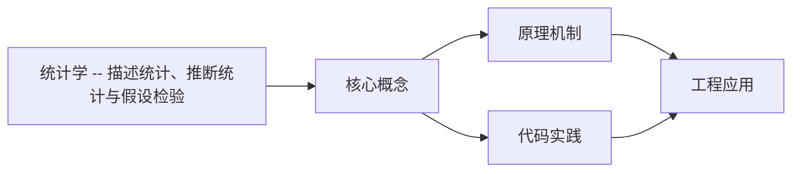

## 1. 学习目标（Bloom 分类）

本节按照布鲁姆教育目标分类学组织学习路径。本文主题为《统计学 -- 描述统计、推断统计与假设检验》，属于 数据分析 模块，读者可以根据自身阶段选择阅读深度。

记忆层面：能够准确复述本文的核心概念、术语与基本语法或操作步骤，并能够在提问或检索时快速定位对应知识点。能够说出 数据分析 的核心概念、常用命令与流程。

理解层面：能够用自己的语言解释核心原理与工作机制，说明概念之间的因果关系，而不是机械记忆结论。能够解释 数据分析 的工作原理与设计动机。

应用层面：能够在真实项目或练习场景中运用本文知识解决具体问题，写出正确且可维护的实现。能够独立完成 数据分析 的标准操作。

分析层面：能够拆解复杂问题，比较本文主题与相邻概念的异同，识别边界条件与例外情况。能够分析 数据分析 使用中的异常与边界。

评价层面：能够根据约束条件（性能、可读性、安全、成本）评价不同方案的优劣，做出有依据的技术决策。能够评价 数据分析 相关工具与方案。

创造层面：能够把本文知识与其他模块知识组合，设计出新的解决方案或可复用的工程模式。能够把 数据分析 融入团队工作流。

通过本节学习，读者应当能够把《统计学 -- 描述统计、推断统计与假设检验》纳入自己的知识网络，并与 数据分析 模块的其他主题（数据清洗、可视化、统计、报告）建立关联。

## 2. 历史动机与发展脉络

《统计学 -- 描述统计、推断统计与假设检验》是 数据分析 领域的重要主题。要真正理解它，需要先了解它解决的问题与演进过程。

数据分析是从数据中提取决策信息的工程过程：定义问题 -> 采集 -> 清洗 -> 探索 -> 建模 -> 可视化 -> 报告。
工具链：Python（Pandas/NumPy）、SQL、Jupyter、BI（Tableau/PowerBI）；Excel 仍是轻量入口。
方法：描述性分析（发生了什么）、诊断（为什么）、预测（会怎样）、规范（该怎么办）。

回到本文主题：统计学 -- 描述统计、推断统计与假设检验 的提出与成熟，正是上述技术背景下的必然产物。早期实现往往以简单可用为目标，随着工程规模扩大，社区逐渐沉淀出标准做法与最佳实践；理解这一脉络，可以帮助读者判断“为什么文档中的推荐写法是现在这个样子”，也能在遇到历史遗留代码时准确识别其设计年代与取舍。


## 3. 形式化定义与核心概念精讲

本节把《统计学 -- 描述统计、推断统计与假设检验》涉及的核心概念以“定义 + 讲解”的形式展开。读者应把定义当作工具，把讲解当作理解路径；两者结合才能形成可迁移的知识。

数据形态：表格（结构化）、序列（时间）、文本、图像；分析前确定数据类型（数值/类别/顺序）。
清洗：缺失值（删除/填充）、异常值（IQR/z-score）、重复、类型转换；清洗决定结果可信度。
探索性分析（EDA）：分布（直方图）、集中趋势（均值/中位数）、离散（方差/IQR）、相关性。

### 3.1 原文章节逐一精讲

原文档把主题拆分为 13 个小节，下面按顺序给出每一节的导读讲解，随后保留原文细节供精读。

#### 原文精读（完整保留）


#### 1. 统计学概述

##### 1.1 描述统计 vs 推断统计

统计学分为两大分支：

| 分支     | 目标               | 方法               | 示例                 |
| -------- | ------------------ | ------------------ | -------------------- |
| 描述统计 | 总结和描述已有数据 | 均值、标准差、图表 | 计算班级平均分       |
| 推断统计 | 从样本推断总体     | 假设检验、置信区间 | 从样本推断全校平均分 |

> **为什么推断统计比描述统计更难？** 描述统计只涉及已有数据，结论确定。推断统计涉及从部分推断整体，结论具有不确定性，需要量化这种不确定性（p 值、置信区间）。

##### 1.2 核心术语

| 术语                | 含义               | 示例                 |
| ------------------- | ------------------ | -------------------- |
| 总体（Population）  | 研究对象的全体     | 全校学生             |
| 样本（Sample）      | 从总体中抽取的子集 | 抽取的 100 名学生    |
| 参数（Parameter）   | 总体的数量特征     | 全校平均身高         |
| 统计量（Statistic） | 样本的数量特征     | 100 名学生的平均身高 |
| 自由度（df）        | 独立信息的数量     | n-1（样本方差）      |

> 跨模块参考：统计计算依赖 [numpy.md](numpy.md) 的数组运算，数据整理依赖 [pandas.md](pandas.md)，可视化依赖 [seaborn.md](seaborn.md)。

---

#### 2. 描述统计

##### 2.1 集中趋势度量

```python
import numpy as np
import pandas as pd
from scipy import stats

data = np.array([23, 25, 22, 30, 28, 35, 22, 27, 29, 24, 26, 31, 22, 28, 100])

print(f"均值 (mean): {np.mean(data):.2f}")
print(f"中位数 (median): {np.median(data):.2f}")
print(f"众数 (mode): {stats.mode(data, keepdims=True).mode[0]}")
print(f"截尾均值 (trimmed mean, 10%): {stats.trim_mean(data, 0.1):.2f}")
```

**输出说明**：

- 均值受极端值影响大（100 拉高了均值）
- 中位数不受极端值影响，更适合偏态分布
- 众数适用于分类数据
- 截尾均值去掉两端极值后计算，兼顾均值和中位数的优点

> **为什么均值不一定代表"典型值"？** 当数据有极端值或严重偏态时，均值会被拉偏。例如上述数据中，100 是异常值，使均值（30.8）远高于中位数（27）。此时中位数更能代表"典型"水平。

##### 2.2 离散程度度量

```python
import numpy as np
import pandas as pd

data = np.array([23, 25, 22, 30, 28, 35, 22, 27, 29, 24, 26, 31, 22, 28, 100])

print(f"极差 (range): {np.ptp(data)}")
print(f"方差 (variance): {np.var(data, ddof=1):.2f}")
print(f"标准差 (std): {np.std(data, ddof=1):.2f}")
print(f"变异系数 (CV): {np.std(data, ddof=1) / np.mean(data) * 100:.1f}%")

Q1 = np.percentile(data, 25)
Q3 = np.percentile(data, 75)
IQR = Q3 - Q1
print(f"Q1: {Q1}, Q3: {Q3}, IQR: {IQR}")
print(f"异常值边界: [{Q1 - 1.5*IQR:.1f}, {Q3 + 1.5*IQR:.1f}]")
```

**输出说明**：

- `ddof=1` 使用样本方差（除以 n-1），而非总体方差（除以 n）
- 标准差与原始数据同量纲，比方差更易解释
- 变异系数（CV）消除量纲影响，适合比较不同量级的数据
- IQR 不受极端值影响，是箱线图中异常值检测的基础

> **为什么样本方差除以 n-1？** 这是贝塞尔校正。用样本均值代替总体均值会引入偏差，除以 n-1 可以修正这个偏差，使样本方差成为总体方差的无偏估计。

##### 2.3 分布形态

```python
import numpy as np
from scipy import stats

data = np.array([23, 25, 22, 30, 28, 35, 22, 27, 29, 24, 26, 31, 22, 28, 100])

print(f"偏度 (skewness): {stats.skew(data):.3f}")
print(f"峰度 (kurtosis): {stats.kurtosis(data):.3f}")
```

**输出说明**：

- 偏度 > 0：右偏（正偏），右侧尾部更长
- 偏度 < 0：左偏（负偏），左侧尾部更长
- 峰度 > 0：比正态分布更尖（重尾）
- 峰度 < 0：比正态分布更平（轻尾）
- `stats.kurtosis` 返回超额峰度（减去 3 后的值）

##### 2.4 Pandas 快速描述统计

```python
import pandas as pd
import numpy as np

df = pd.DataFrame({
    'score_A': np.random.default_rng(42).normal(75, 10, 100),
    'score_B': np.random.default_rng(43).normal(70, 15, 100),
    'score_C': np.random.default_rng(44).normal(80, 8, 100)
})

print(df.describe())

print(f"\n偏度:\n{df.skew()}")
print(f"\n峰度:\n{df.kurtosis()}")
print(f"\n分位数:\n{df.quantile([0.1, 0.25, 0.5, 0.75, 0.9])}")
```

**输出说明**：`describe()` 一次性输出计数、均值、标准差、最小值、四分位数和最大值。结合 `skew()` 和 `kurtosis()` 可以全面了解数据分布。

---

#### 3. 概率基础

##### 3.1 基本概念

| 概念     | 定义                 | 示例                 |
| -------- | -------------------- | -------------------- |
| 样本空间 | 所有可能结果的集合   | 掷骰子 {1,2,3,4,5,6} |
| 事件     | 样本空间的子集       | 掷出偶数 {2,4,6}     |
| 概率     | 事件发生的可能性度量 | P(偶数) = 3/6 = 0.5  |
| 互斥事件 | 不能同时发生         | 掷出 1 和掷出 2      |
| 独立事件 | 一个事件不影响另一个 | 两次掷骰子的结果     |

##### 3.2 条件概率与贝叶斯定理

```python
p_disease = 0.001
p_positive_given_disease = 0.99
p_positive_given_healthy = 0.05

p_positive = p_positive_given_disease * p_disease + p_positive_given_healthy * (1 - p_disease)
p_disease_given_positive = (p_positive_given_disease * p_disease) / p_positive

print(f"P(阳性) = {p_positive:.4f}")
print(f"P(患病|阳性) = {p_disease_given_positive:.4f}")
print(f"即阳性结果中只有 {p_disease_given_positive*100:.1f}% 真正患病")
```

**输出说明**：贝叶斯定理的核心——即使检测准确率高达 99%，由于患病率极低（0.1%），阳性结果中真正患病的概率只有约 1.9%。这就是"基础率忽视"谬误的数学基础。

> **为什么贝叶斯定理在数据分析中如此重要？** 它提供了从观测数据更新先验信念的数学框架。在 A/B 测试、垃圾邮件过滤、医疗诊断等场景中，贝叶斯思维是正确解读结果的关键。

---

#### 4. 常见概率分布

##### 4.1 离散分布

```python
import numpy as np
from scipy import stats
import matplotlib.pyplot as plt

fig, axes = plt.subplots(1, 3, figsize=(15, 4))

x_bern = [0, 1]
p_bern = [1 - 0.3, 0.3]
axes[0].bar(x_bern, p_bern, color='steelblue')
axes[0].set_title('Bernoulli(p=0.3)')
axes[0].set_xlabel('x')

x_binom = np.arange(0, 11)
p_binom = stats.binom.pmf(x_binom, n=10, p=0.3)
axes[1].bar(x_binom, p_binom, color='darkorange')
axes[1].set_title('Binomial(n=10, p=0.3)')
axes[1].set_xlabel('x')

x_pois = np.arange(0, 15)
p_pois = stats.poisson.pmf(x_pois, mu=3)
axes[2].bar(x_pois, p_pois, color='green')
axes[2].set_title('Poisson(lambda=3)')
axes[2].set_xlabel('x')

plt.tight_layout()
plt.show()
```

**输出说明**：

- **伯努利分布**：单次试验，结果为 0 或 1（如抛硬币）
- **二项分布**：n 次独立伯努利试验的成功次数（如 10 次投篮命中次数）
- **泊松分布**：单位时间/空间内稀有事件的发生次数（如每小时客服来电数）

##### 4.2 连续分布

```python
import numpy as np
from scipy import stats
import matplotlib.pyplot as plt

fig, axes = plt.subplots(1, 3, figsize=(15, 4))

x = np.linspace(-4, 4, 200)
axes[0].plot(x, stats.norm.pdf(x, loc=0, scale=1), label='N(0,1)')
axes[0].plot(x, stats.norm.pdf(x, loc=0, scale=1.5), label='N(0,1.5)')
axes[0].plot(x, stats.norm.pdf(x, loc=1, scale=0.8), label='N(1,0.8)')
axes[0].set_title('Normal Distribution')
axes[0].legend()

x_exp = np.linspace(0, 5, 200)
axes[1].plot(x_exp, stats.expon.pdf(x_exp, scale=0.5), label='Exp(0.5)')
axes[1].plot(x_exp, stats.expon.pdf(x_exp, scale=1), label='Exp(1)')
axes[1].plot(x_exp, stats.expon.pdf(x_exp, scale=2), label='Exp(2)')
axes[1].set_title('Exponential Distribution')
axes[1].legend()

x_chi2 = np.linspace(0, 20, 200)
axes[2].plot(x_chi2, stats.chi2.pdf(x_chi2, df=2), label='df=2')
axes[2].plot(x_chi2, stats.chi2.pdf(x_chi2, df=5), label='df=5')
axes[2].plot(x_chi2, stats.chi2.pdf(x_chi2, df=10), label='df=10')
axes[2].set_title('Chi-Square Distribution')
axes[2].legend()

plt.tight_layout()
plt.show()
```

**输出说明**：

- **正态分布**：对称钟形，由均值和标准差决定。中心极限定理使得正态分布在统计学中地位特殊
- **指数分布**：右偏，常用于等待时间建模
- **卡方分布**：右偏，用于拟合优度检验和方差检验

##### 4.3 正态分布的性质

```python
from scipy import stats

print(f"P(-1sd < X < 1sd) = {stats.norm.cdf(1) - stats.norm.cdf(-1):.4f}")
print(f"P(-2sd < X < 2sd) = {stats.norm.cdf(2) - stats.norm.cdf(-2):.4f}")
print(f"P(-3sd < X < 3sd) = {stats.norm.cdf(3) - stats.norm.cdf(-3):.4f}")
```

**输出说明**：68-95-99.7 法则：

- 约 68% 的数据在均值 +/- 1 个标准差内
- 约 95% 在 +/- 2 个标准差内
- 约 99.7% 在 +/- 3 个标准差内

> **为什么正态分布如此重要？** 中心极限定理保证了：无论总体分布如何，样本均值的分布在大样本下趋近正态分布。这使得正态分布成为推断统计的理论基础。

---

#### 5. 抽样与抽样分布

##### 5.1 中心极限定理验证

```python
import numpy as np
import matplotlib.pyplot as plt

rng = np.random.default_rng(42)
population = rng.exponential(scale=2, size=100000)

sample_means_5 = [rng.choice(population, 5).mean() for _ in range(10000)]
sample_means_30 = [rng.choice(population, 30).mean() for _ in range(10000)]
sample_means_100 = [rng.choice(population, 100).mean() for _ in range(10000)]

fig, axes = plt.subplots(1, 4, figsize=(18, 4))

axes[0].hist(population, bins=50, density=True, color='gray', alpha=0.7)
axes[0].set_title('Population (Exponential)')

axes[1].hist(sample_means_5, bins=50, density=True, color='steelblue', alpha=0.7)
axes[1].set_title('Sample Means (n=5)')

axes[2].hist(sample_means_30, bins=50, density=True, color='darkorange', alpha=0.7)
axes[2].set_title('Sample Means (n=30)')

axes[3].hist(sample_means_100, bins=50, density=True, color='green', alpha=0.7)
axes[3].set_title('Sample Means (n=100)')

plt.tight_layout()
plt.show()
```

**输出说明**：即使总体是指数分布（严重右偏），随着样本量增大，样本均值的分布逐渐趋近正态分布。n=30 时已接近正态，这就是"n>=30"经验法则的来源。

> **中心极限定理的意义**：它使得我们不需要知道总体分布，就可以对样本均值进行统计推断。这是假设检验和置信区间的理论基础。

##### 5.2 标准误

```python
import numpy as np

population_std = 15
sample_sizes = [10, 30, 100, 500, 1000]

for n in sample_sizes:
    se = population_std / np.sqrt(n)
    print(f"n={n:4d}: SE = {se:.2f}")
```

**输出说明**：标准误（SE）= 总体标准差 / sqrt(n)。样本量越大，标准误越小，估计越精确。n 增加 4 倍，标准误减半（而非减为 1/4）。

---

#### 6. 参数估计

##### 6.1 点估计

```python
import numpy as np
from scipy import stats

rng = np.random.default_rng(42)
sample = rng.normal(loc=50, scale=10, size=100)

mu_hat = sample.mean()
sigma_hat = sample.std(ddof=1)

print(f"样本均值 (总体均值估计): {mu_hat:.2f}")
print(f"样本标准差 (总体标准差估计): {sigma_hat:.2f}")
```

**输出说明**：点估计用单一数值估计总体参数。样本均值是总体均值的无偏估计，样本方差（ddof=1）是总体方差的无偏估计。

##### 6.2 置信区间

```python
import numpy as np
from scipy import stats

rng = np.random.default_rng(42)
sample = rng.normal(loc=50, scale=10, size=100)

ci_95 = stats.t.interval(0.95, df=len(sample)-1, loc=sample.mean(), scale=stats.sem(sample))
ci_99 = stats.t.interval(0.99, df=len(sample)-1, loc=sample.mean(), scale=stats.sem(sample))

print(f"95% 置信区间: [{ci_95[0]:.2f}, {ci_95[1]:.2f}]")
print(f"99% 置信区间: [{ci_99[0]:.2f}, {ci_99[1]:.2f}]")
print(f"区间宽度: 95%={ci_95[1]-ci_95[0]:.2f}, 99%={ci_99[1]-ci_99[0]:.2f}")
```

**输出说明**：

- 95% 置信区间意味着：如果重复抽样 100 次，约 95 次的区间会包含真实参数
- 99% 置信区间更宽，覆盖概率更高但精度更低
- 使用 t 分布而非正态分布，因为总体标准差未知

> **置信区间的常见误解**：95% 置信区间不表示"真实值有 95% 的概率落在此区间内"。真实值是固定的，区间是随机的。正确理解是"此方法生成的区间有 95% 的概率覆盖真实值"。

---

#### 7. 假设检验

##### 7.1 假设检验流程

```
1. 建立假设
   H0 (原假设): 无差异/无效果
   H1 (备择假设): 有差异/有效果

2. 选择检验方法与显著性水平 alpha (通常 0.05)

3. 计算检验统计量

4. 计算 p 值

5. 做出决策
   p < alpha: 拒绝 H0 (结果统计显著)
   p >= alpha: 不能拒绝 H0 (结果不显著)
```

> **为什么用"不能拒绝 H0"而非"接受 H0"？** 假设检验只能提供"证据不足"的结论，不能证明 H0 为真。就像法庭判决"证据不足，无罪释放"不等于"证明无辜"。

##### 7.2 独立样本 t 检验

```python
import numpy as np
from scipy import stats

rng = np.random.default_rng(42)
group_a = rng.normal(loc=72, scale=10, size=50)
group_b = rng.normal(loc=78, scale=12, size=50)

t_stat, p_value = stats.ttest_ind(group_a, group_b)
print(f"t统计量: {t_stat:.4f}")
print(f"p值: {p_value:.6f}")
print(f"结论: {'拒绝H0 (两组均值有显著差异)' if p_value < 0.05 else '不能拒绝H0'}")

cohen_d = (group_b.mean() - group_a.mean()) / np.sqrt((group_a.std(ddof=1)**2 + group_b.std(ddof=1)**2) / 2)
print(f"Cohen's d (效应量): {cohen_d:.3f}")
```

**输出说明**：

- t 检验比较两组均值是否有显著差异
- p 值 < 0.05 表示差异统计显著
- Cohen's d 衡量效应大小：<0.2（小）、0.2-0.8（中）、>0.8（大）
- 统计显著不等于业务显著，必须看效应量

> **为什么需要效应量？** 大样本下，即使微小的差异也会统计显著。效应量衡量差异的实际大小，避免"统计显著但实际无意义"的结论。

##### 7.3 配对样本 t 检验

```python
import numpy as np
from scipy import stats

rng = np.random.default_rng(42)
before = rng.normal(loc=70, scale=8, size=30)
after = before + rng.normal(loc=3, scale=5, size=30)

t_stat, p_value = stats.ttest_rel(before, after)
print(f"配对t检验: t={t_stat:.4f}, p={p_value:.6f}")
print(f"均值变化: {after.mean() - before.mean():.2f}")
```

**输出说明**：配对 t 检验用于同一组对象的前后对比（如培训前后成绩）。它考虑了个体间的配对关系，比独立样本 t 检验更灵敏。

##### 7.4 第一类与第二类错误

|           | H0 为真            | H0 为假            |
| --------- | ------------------ | ------------------ |
| 拒绝 H0   | 第一类错误 (alpha) | 正确 (功效 1-beta) |
| 不拒绝 H0 | 正确 (1-alpha)     | 第二类错误 (beta)  |

```python
from scipy import stats
import numpy as np

def power_analysis(effect_size, n, alpha=0.05):
    se = 1 / np.sqrt(n)
    z_alpha = stats.norm.ppf(1 - alpha/2)
    z_beta = effect_size / se - z_alpha
    power = stats.norm.cdf(z_beta)
    return power

for n in [20, 50, 100, 200]:
    power = power_analysis(effect_size=0.5, n=n)
    print(f"n={n:3d}: power={power:.3f}")
```

**输出说明**：功效（Power）是正确拒绝错误 H0 的概率。样本量越大，功效越高。通常要求功效 >= 0.8。

---

#### 8. 方差分析（ANOVA）

##### 8.1 单因素方差分析

```python
import numpy as np
from scipy import stats

rng = np.random.default_rng(42)
group1 = rng.normal(loc=70, scale=10, size=30)
group2 = rng.normal(loc=75, scale=10, size=30)
group3 = rng.normal(loc=80, scale=10, size=30)

f_stat, p_value = stats.f_oneway(group1, group2, group3)
print(f"F统计量: {f_stat:.4f}")
print(f"p值: {p_value:.6f}")
print(f"结论: {'至少两组均值有显著差异' if p_value < 0.05 else '不能拒绝H0'}")
```

**输出说明**：ANOVA 检验多组均值是否有显著差异。F 统计量 = 组间方差 / 组内方差。F 值越大，组间差异相对于组内差异越显著。

> **为什么不用多次 t 检验？** 每次 t 检验有 5% 的第一类错误率。3 组两两比较需要 3 次检验，总错误率膨胀为 1-(0.95)^3 = 14.3%。ANOVA 一次检验控制总错误率。

##### 8.2 事后多重比较

```python
from scipy import stats
import numpy as np

rng = np.random.default_rng(42)
group1 = rng.normal(loc=70, scale=10, size=30)
group2 = rng.normal(loc=75, scale=10, size=30)
group3 = rng.normal(loc=80, scale=10, size=30)

pairs = [(group1, group2, '1vs2'), (group1, group3, '1vs3'), (group2, group3, '2vs3')]
for g1, g2, name in pairs:
    t, p = stats.ttest_ind(g1, g2)
    p_bonferroni = min(p * len(pairs), 1.0)
    print(f"{name}: p={p:.4f}, p_bonferroni={p_bonferroni:.4f}")
```

**输出说明**：Bonferroni 校正将 p 值乘以比较次数，控制族错误率。更精确的方法是 Tukey HSD，需要 `statsmodels` 或 `pingouin` 库。

---

#### 9. 相关与回归

##### 9.1 相关系数

```python
import numpy as np
from scipy import stats
import pandas as pd

rng = np.random.default_rng(42)
x = rng.normal(50, 10, 100)
y_linear = 0.8 * x + rng.normal(0, 5, 100)
y_nonlinear = x**2 + rng.normal(0, 100, 100)

r_linear, p_linear = stats.pearsonr(x, y_linear)
r_nonlinear, p_nonlinear = stats.pearsonr(x, y_nonlinear)
rho_nonlinear, p_rho = stats.spearmanr(x, y_nonlinear)

print(f"线性关系: Pearson r={r_linear:.3f}, p={p_linear:.6f}")
print(f"非线性关系: Pearson r={r_nonlinear:.3f}, Spearman rho={rho_nonlinear:.3f}")
```

**输出说明**：

- Pearson r 衡量线性相关，范围 [-1, 1]
- Spearman rho 衡量单调相关（秩相关），对非线性关系更敏感
- 非线性关系中，Pearson r 可能很低但 Spearman rho 很高

> **相关不等于因果**：相关性只说明两个变量同时变化，不说明因果关系。冰激凌销量和溺水人数正相关，但不是因为吃冰激凌导致溺水，而是因为夏天同时影响了两者。

##### 9.2 简单线性回归

```python
import numpy as np
import statsmodels.api as sm
import matplotlib.pyplot as plt

rng = np.random.default_rng(42)
x = rng.uniform(10, 50, 100)
y = 2.5 * x + 10 + rng.normal(0, 8, 100)

X = sm.add_constant(x)
model = sm.OLS(y, X).fit()
print(model.summary())

print(f"\n回归方程: y = {model.params[1]:.2f}*x + {model.params[0]:.2f}")
print(f"R-squared: {model.rsquared:.4f}")
print(f"斜率 p值: {model.pvalues[1]:.6f}")
```

**输出说明**：

- `add_constant` 添加截距项
- R-squared 表示模型解释的方差比例（0-1）
- 斜率的 p 值检验斜率是否显著不为零
- `summary()` 输出完整的回归诊断信息

---

#### 10. 非参数检验

##### 10.1 何时使用非参数检验

| 场景         | 参数方法    | 非参数替代      |
| ------------ | ----------- | --------------- |
| 两组独立样本 | t 检验      | Mann-Whitney U  |
| 两组配对样本 | 配对 t 检验 | Wilcoxon 符号秩 |
| 多组比较     | ANOVA       | Kruskal-Wallis  |
| 分类变量关联 | -           | 卡方检验        |

> **为什么需要非参数检验？** 参数检验要求数据满足正态分布等假设。当数据严重偏态、有极端值、样本量太小或为有序分类数据时，参数检验结果不可靠，需要非参数替代。

##### 10.2 Mann-Whitney U 检验

```python
import numpy as np
from scipy import stats

rng = np.random.default_rng(42)
group_a = rng.exponential(scale=10, size=30)
group_b = rng.exponential(scale=15, size=30)

u_stat, p_value = stats.mannwhitneyu(group_a, group_b, alternative='two-sided')
print(f"Mann-Whitney U: U={u_stat:.1f}, p={p_value:.4f}")
```

**输出说明**：Mann-Whitney U 检验比较两组的秩（排序位置）而非均值，不要求数据正态分布。

##### 10.3 卡方独立性检验

```python
import numpy as np
from scipy import stats

observed = np.array([[50, 30], [20, 40]])
chi2, p_value, dof, expected = stats.chi2_contingency(observed)

print(f"观测频数:\n{observed}")
print(f"期望频数:\n{expected}")
print(f"卡方统计量: {chi2:.4f}")
print(f"p值: {p_value:.4f}")
print(f"自由度: {dof}")
```

**输出说明**：卡方检验判断两个分类变量是否独立。如果 p < 0.05，拒绝独立性假设，认为两个变量有关联。

---

#### 11. Python 实现工具

##### 11.1 三大统计库对比

| 库          | 定位     | 优势                     | 典型用法               |
| ----------- | -------- | ------------------------ | ---------------------- |
| scipy.stats | 统计计算 | 函数全面、接口简洁       | 假设检验、分布计算     |
| statsmodels | 统计建模 | 回归诊断详细、R 风格输出 | 回归分析、时间序列     |
| pingouin    | 现代统计 | API 友好、效应量内置     | 效应量、重复测量 ANOVA |

```python
from scipy import stats
import statsmodels.api as sm

data = [23, 25, 22, 30, 28, 35, 22, 27, 29, 24]

ci = stats.t.interval(0.95, df=len(data)-1, loc=np.mean(data), scale=stats.sem(data))
print(f"scipy 置信区间: [{ci[0]:.2f}, {ci[1]:.2f}]")

result = stats.descstats(data)
```

---

#### 12. 速查表

##### 12.1 假设检验选择

| 数据类型 | 比较对象       | 样本量 | 正态性 | 检验方法        |
| -------- | -------------- | ------ | ------ | --------------- |
| 连续     | 单组 vs 已知值 | 任意   | 满足   | 单样本 t 检验   |
| 连续     | 两组独立       | 任意   | 满足   | 独立样本 t 检验 |
| 连续     | 两组配对       | 任意   | 满足   | 配对 t 检验     |
| 连续     | 三组及以上     | 任意   | 满足   | ANOVA           |
| 连续     | 两组独立       | 小     | 不满足 | Mann-Whitney U  |
| 连续     | 三组及以上     | 小     | 不满足 | Kruskal-Wallis  |
| 分类     | 两组关联       | -      | -      | 卡方检验        |

##### 12.2 效应量速查

| 指标        | 适用场景     | 小   | 中   | 大   |
| ----------- | ------------ | ---- | ---- | ---- |
| Cohen's d   | 两组均值差异 | 0.2  | 0.5  | 0.8  |
| Pearson r   | 相关强度     | 0.1  | 0.3  | 0.5  |
| eta-squared | ANOVA        | 0.01 | 0.06 | 0.14 |
| Cramer's V  | 卡方检验     | 0.1  | 0.3  | 0.5  |

##### 12.3 scipy.stats 常用函数

| 函数                       | 用途            |
| -------------------------- | --------------- |
| `stats.ttest_1samp()`      | 单样本 t 检验   |
| `stats.ttest_ind()`        | 独立样本 t 检验 |
| `stats.ttest_rel()`        | 配对 t 检验     |
| `stats.f_oneway()`         | 单因素 ANOVA    |
| `stats.pearsonr()`         | Pearson 相关    |
| `stats.spearmanr()`        | Spearman 相关   |
| `stats.mannwhitneyu()`     | Mann-Whitney U  |
| `stats.wilcoxon()`         | Wilcoxon 符号秩 |
| `stats.kruskal()`          | Kruskal-Wallis  |
| `stats.chi2_contingency()` | 卡方独立性检验  |
| `stats.t.interval()`       | 置信区间        |

---

#### 13. 延伸阅读

- OpenIntro Statistics (David Diez)
- Practical Statistics for Data Scientists (Peter Bruce)
- scipy.stats 官方文档：https://docs.scipy.org/doc/scipy/reference/stats.html
- Statistical Inference (George Casella)

##### 跨模块关联

- [算法](algorithm/overview)


### 3.2 概念关系图

下面用 Mermaid 图表达本文核心概念之间的关系，帮助读者建立整体图景：



图中展示的是本文知识的结构化关系：核心概念是入口，原理机制解释“为什么”，代码实践演示“怎么做”，工程应用回答“何时用”。读者学习时可以把每个小节的内容挂接到对应节点上。

## 4. 理论推导与原理解析

本节深入《统计学 -- 描述统计、推断统计与假设检验》背后的原理。理论部分不求面面俱到，而是聚焦“能解释现象、能指导实践”的关键推导。

数据形态：表格（结构化）、序列（时间）、文本、图像；分析前确定数据类型（数值/类别/顺序）。
清洗：缺失值（删除/填充）、异常值（IQR/z-score）、重复、类型转换；清洗决定结果可信度。
探索性分析（EDA）：分布（直方图）、集中趋势（均值/中位数）、离散（方差/IQR）、相关性。
可视化原则：图型匹配数据（趋势折线、比较柱状、构成饼/堆叠、关系散点），标注与叙事。

需要强调的是，理论推导与工程实践之间存在翻译层：理论给出的是理想化模型与边界条件，工程代码则必须处理真实环境中的例外。读者在学习时应先掌握理论的“标准情形”，再通过陷阱章节了解“非标准情形”。

## 5. 代码示例与逐行讲解

本节把原文中的代码示例系统整理，并为每个示例补充用途说明与讲解。读者不应只浏览代码，而应逐段对照讲解理解设计意图。

### 5.1 示例：2.1 集中趋势度量

该示例来自原文《2.1 集中趋势度量》小节，用于演示统计学 -- 描述统计、推断统计与假设检验相关操作。阅读时请先看代码结构，再看其后的讲解。

```python
import numpy as np
import pandas as pd
from scipy import stats

data = np.array([23, 25, 22, 30, 28, 35, 22, 27, 29, 24, 26, 31, 22, 28, 100])

print(f"均值 (mean): {np.mean(data):.2f}")
print(f"中位数 (median): {np.median(data):.2f}")
print(f"众数 (mode): {stats.mode(data, keepdims=True).mode[0]}")
print(f"截尾均值 (trimmed mean, 10%): {stats.trim_mean(data, 0.1):.2f}")
```

讲解：这段代码演示了本节核心知识点。代码中的关键操作可以归纳为三步：准备（定义或初始化）、执行（核心逻辑）、收尾（释放资源或返回结果）。实际项目中，这三步往往被封装为函数或类，以提升复用性与可测试性。

关键点分析：

该示例共 8 行有效代码，包含 2 类关键结构（import、from）。其中：

- 入口与初始化部分负责建立上下文，对应实际项目中的启动或装配逻辑；
- 核心逻辑部分体现本文主题的主要操作，是阅读时最需要对照讲解理解的部分；
- 输出或返回部分把结果交给调用方，注意其类型与边界条件。

进阶思考路径：先尝试修改参数观察行为变化，再把示例中的模式迁移到自己的项目中；每次修改都记录预期与实测差异，这是把示例转化为能力的最快方式。

### 5.2 示例：2.2 离散程度度量

该示例来自原文《2.2 离散程度度量》小节，用于演示统计学 -- 描述统计、推断统计与假设检验相关操作。阅读时请先看代码结构，再看其后的讲解。

```python
import numpy as np
import pandas as pd

data = np.array([23, 25, 22, 30, 28, 35, 22, 27, 29, 24, 26, 31, 22, 28, 100])

print(f"极差 (range): {np.ptp(data)}")
print(f"方差 (variance): {np.var(data, ddof=1):.2f}")
print(f"标准差 (std): {np.std(data, ddof=1):.2f}")
print(f"变异系数 (CV): {np.std(data, ddof=1) / np.mean(data) * 100:.1f}%")

Q1 = np.percentile(data, 25)
Q3 = np.percentile(data, 75)
IQR = Q3 - Q1
print(f"Q1: {Q1}, Q3: {Q3}, IQR: {IQR}")
print(f"异常值边界: [{Q1 - 1.5*IQR:.1f}, {Q3 + 1.5*IQR:.1f}]")
```

讲解：这段代码演示了本节核心知识点。代码中的关键操作可以归纳为三步：准备（定义或初始化）、执行（核心逻辑）、收尾（释放资源或返回结果）。实际项目中，这三步往往被封装为函数或类，以提升复用性与可测试性。

关键点分析：

该示例共 12 行有效代码，包含 1 类关键结构（import）。其中：

- 入口与初始化部分负责建立上下文，对应实际项目中的启动或装配逻辑；
- 核心逻辑部分体现本文主题的主要操作，是阅读时最需要对照讲解理解的部分；
- 输出或返回部分把结果交给调用方，注意其类型与边界条件。

进阶思考路径：先尝试修改参数观察行为变化，再把示例中的模式迁移到自己的项目中；每次修改都记录预期与实测差异，这是把示例转化为能力的最快方式。

### 5.3 示例：2.3 分布形态

该示例来自原文《2.3 分布形态》小节，用于演示统计学 -- 描述统计、推断统计与假设检验相关操作。阅读时请先看代码结构，再看其后的讲解。

```python
import numpy as np
from scipy import stats

data = np.array([23, 25, 22, 30, 28, 35, 22, 27, 29, 24, 26, 31, 22, 28, 100])

print(f"偏度 (skewness): {stats.skew(data):.3f}")
print(f"峰度 (kurtosis): {stats.kurtosis(data):.3f}")
```

讲解：这段代码演示了本节核心知识点。代码中的关键操作可以归纳为三步：准备（定义或初始化）、执行（核心逻辑）、收尾（释放资源或返回结果）。实际项目中，这三步往往被封装为函数或类，以提升复用性与可测试性。

关键点分析：

该示例共 5 行有效代码，包含 2 类关键结构（import、from）。其中：

- 入口与初始化部分负责建立上下文，对应实际项目中的启动或装配逻辑；
- 核心逻辑部分体现本文主题的主要操作，是阅读时最需要对照讲解理解的部分；
- 输出或返回部分把结果交给调用方，注意其类型与边界条件。

进阶思考路径：先尝试修改参数观察行为变化，再把示例中的模式迁移到自己的项目中；每次修改都记录预期与实测差异，这是把示例转化为能力的最快方式。

### 5.4 示例：2.4 Pandas 快速描述统计

该示例来自原文《2.4 Pandas 快速描述统计》小节，用于演示统计学 -- 描述统计、推断统计与假设检验相关操作。阅读时请先看代码结构，再看其后的讲解。

```python
import pandas as pd
import numpy as np

df = pd.DataFrame({
    'score_A': np.random.default_rng(42).normal(75, 10, 100),
    'score_B': np.random.default_rng(43).normal(70, 15, 100),
    'score_C': np.random.default_rng(44).normal(80, 8, 100)
})

print(df.describe())

print(f"\n偏度:\n{df.skew()}")
print(f"\n峰度:\n{df.kurtosis()}")
print(f"\n分位数:\n{df.quantile([0.1, 0.25, 0.5, 0.75, 0.9])}")
```

讲解：这段代码演示了本节核心知识点。代码中的关键操作可以归纳为三步：准备（定义或初始化）、执行（核心逻辑）、收尾（释放资源或返回结果）。实际项目中，这三步往往被封装为函数或类，以提升复用性与可测试性。

关键点分析：

该示例共 11 行有效代码，包含 1 类关键结构（import）。其中：

- 入口与初始化部分负责建立上下文，对应实际项目中的启动或装配逻辑；
- 核心逻辑部分体现本文主题的主要操作，是阅读时最需要对照讲解理解的部分；
- 输出或返回部分把结果交给调用方，注意其类型与边界条件。

进阶思考路径：先尝试修改参数观察行为变化，再把示例中的模式迁移到自己的项目中；每次修改都记录预期与实测差异，这是把示例转化为能力的最快方式。

### 5.5 示例：3.2 条件概率与贝叶斯定理

该示例来自原文《3.2 条件概率与贝叶斯定理》小节，用于演示统计学 -- 描述统计、推断统计与假设检验相关操作。阅读时请先看代码结构，再看其后的讲解。

```python
p_disease = 0.001
p_positive_given_disease = 0.99
p_positive_given_healthy = 0.05

p_positive = p_positive_given_disease * p_disease + p_positive_given_healthy * (1 - p_disease)
p_disease_given_positive = (p_positive_given_disease * p_disease) / p_positive

print(f"P(阳性) = {p_positive:.4f}")
print(f"P(患病|阳性) = {p_disease_given_positive:.4f}")
print(f"即阳性结果中只有 {p_disease_given_positive*100:.1f}% 真正患病")
```

讲解：这段代码演示了本节核心知识点。代码中的关键操作可以归纳为三步：准备（定义或初始化）、执行（核心逻辑）、收尾（释放资源或返回结果）。实际项目中，这三步往往被封装为函数或类，以提升复用性与可测试性。

关键点分析：

该示例共 8 行有效代码，结构以数据或配置为主。阅读时应关注：数据字段的含义、配置项的作用，以及它们与运行行为的对应关系。

进阶思考路径：先尝试修改参数观察行为变化，再把示例中的模式迁移到自己的项目中；每次修改都记录预期与实测差异，这是把示例转化为能力的最快方式。

### 5.6 示例：4.1 离散分布

该示例来自原文《4.1 离散分布》小节，用于演示统计学 -- 描述统计、推断统计与假设检验相关操作。阅读时请先看代码结构，再看其后的讲解。

```python
import numpy as np
from scipy import stats
import matplotlib.pyplot as plt

fig, axes = plt.subplots(1, 3, figsize=(15, 4))

x_bern = [0, 1]
p_bern = [1 - 0.3, 0.3]
axes[0].bar(x_bern, p_bern, color='steelblue')
axes[0].set_title('Bernoulli(p=0.3)')
axes[0].set_xlabel('x')

x_binom = np.arange(0, 11)
p_binom = stats.binom.pmf(x_binom, n=10, p=0.3)
axes[1].bar(x_binom, p_binom, color='darkorange')
axes[1].set_title('Binomial(n=10, p=0.3)')
axes[1].set_xlabel('x')

x_pois = np.arange(0, 15)
p_pois = stats.poisson.pmf(x_pois, mu=3)
axes[2].bar(x_pois, p_pois, color='green')
axes[2].set_title('Poisson(lambda=3)')
axes[2].set_xlabel('x')

plt.tight_layout()
plt.show()
```

讲解：这段代码演示了本节核心知识点。代码中的关键操作可以归纳为三步：准备（定义或初始化）、执行（核心逻辑）、收尾（释放资源或返回结果）。实际项目中，这三步往往被封装为函数或类，以提升复用性与可测试性。

关键点分析：

该示例共 21 行有效代码，包含 2 类关键结构（import、from）。其中：

- 入口与初始化部分负责建立上下文，对应实际项目中的启动或装配逻辑；
- 核心逻辑部分体现本文主题的主要操作，是阅读时最需要对照讲解理解的部分；
- 输出或返回部分把结果交给调用方，注意其类型与边界条件。

进阶思考路径：先尝试修改参数观察行为变化，再把示例中的模式迁移到自己的项目中；每次修改都记录预期与实测差异，这是把示例转化为能力的最快方式。

### 5.7 示例：4.2 连续分布

该示例来自原文《4.2 连续分布》小节，用于演示统计学 -- 描述统计、推断统计与假设检验相关操作。阅读时请先看代码结构，再看其后的讲解。

```python
import numpy as np
from scipy import stats
import matplotlib.pyplot as plt

fig, axes = plt.subplots(1, 3, figsize=(15, 4))

x = np.linspace(-4, 4, 200)
axes[0].plot(x, stats.norm.pdf(x, loc=0, scale=1), label='N(0,1)')
axes[0].plot(x, stats.norm.pdf(x, loc=0, scale=1.5), label='N(0,1.5)')
axes[0].plot(x, stats.norm.pdf(x, loc=1, scale=0.8), label='N(1,0.8)')
axes[0].set_title('Normal Distribution')
axes[0].legend()

x_exp = np.linspace(0, 5, 200)
axes[1].plot(x_exp, stats.expon.pdf(x_exp, scale=0.5), label='Exp(0.5)')
axes[1].plot(x_exp, stats.expon.pdf(x_exp, scale=1), label='Exp(1)')
axes[1].plot(x_exp, stats.expon.pdf(x_exp, scale=2), label='Exp(2)')
axes[1].set_title('Exponential Distribution')
axes[1].legend()

x_chi2 = np.linspace(0, 20, 200)
axes[2].plot(x_chi2, stats.chi2.pdf(x_chi2, df=2), label='df=2')
axes[2].plot(x_chi2, stats.chi2.pdf(x_chi2, df=5), label='df=5')
axes[2].plot(x_chi2, stats.chi2.pdf(x_chi2, df=10), label='df=10')
axes[2].set_title('Chi-Square Distribution')
axes[2].legend()

plt.tight_layout()
plt.show()
```

讲解：这段代码演示了本节核心知识点。代码中的关键操作可以归纳为三步：准备（定义或初始化）、执行（核心逻辑）、收尾（释放资源或返回结果）。实际项目中，这三步往往被封装为函数或类，以提升复用性与可测试性。

关键点分析：

该示例共 24 行有效代码，包含 2 类关键结构（import、from）。其中：

- 入口与初始化部分负责建立上下文，对应实际项目中的启动或装配逻辑；
- 核心逻辑部分体现本文主题的主要操作，是阅读时最需要对照讲解理解的部分；
- 输出或返回部分把结果交给调用方，注意其类型与边界条件。

进阶思考路径：先尝试修改参数观察行为变化，再把示例中的模式迁移到自己的项目中；每次修改都记录预期与实测差异，这是把示例转化为能力的最快方式。

### 5.8 示例：4.3 正态分布的性质

该示例来自原文《4.3 正态分布的性质》小节，用于演示统计学 -- 描述统计、推断统计与假设检验相关操作。阅读时请先看代码结构，再看其后的讲解。

```python
from scipy import stats

print(f"P(-1sd < X < 1sd) = {stats.norm.cdf(1) - stats.norm.cdf(-1):.4f}")
print(f"P(-2sd < X < 2sd) = {stats.norm.cdf(2) - stats.norm.cdf(-2):.4f}")
print(f"P(-3sd < X < 3sd) = {stats.norm.cdf(3) - stats.norm.cdf(-3):.4f}")
```

讲解：这段代码演示了本节核心知识点。代码中的关键操作可以归纳为三步：准备（定义或初始化）、执行（核心逻辑）、收尾（释放资源或返回结果）。实际项目中，这三步往往被封装为函数或类，以提升复用性与可测试性。

关键点分析：

该示例共 4 行有效代码，包含 2 类关键结构（import、from）。其中：

- 入口与初始化部分负责建立上下文，对应实际项目中的启动或装配逻辑；
- 核心逻辑部分体现本文主题的主要操作，是阅读时最需要对照讲解理解的部分；
- 输出或返回部分把结果交给调用方，注意其类型与边界条件。

进阶思考路径：先尝试修改参数观察行为变化，再把示例中的模式迁移到自己的项目中；每次修改都记录预期与实测差异，这是把示例转化为能力的最快方式。

### 5.9 示例：5.1 中心极限定理验证

该示例来自原文《5.1 中心极限定理验证》小节，用于演示统计学 -- 描述统计、推断统计与假设检验相关操作。阅读时请先看代码结构，再看其后的讲解。

```python
import numpy as np
import matplotlib.pyplot as plt

rng = np.random.default_rng(42)
population = rng.exponential(scale=2, size=100000)

sample_means_5 = [rng.choice(population, 5).mean() for _ in range(10000)]
sample_means_30 = [rng.choice(population, 30).mean() for _ in range(10000)]
sample_means_100 = [rng.choice(population, 100).mean() for _ in range(10000)]

fig, axes = plt.subplots(1, 4, figsize=(18, 4))

axes[0].hist(population, bins=50, density=True, color='gray', alpha=0.7)
axes[0].set_title('Population (Exponential)')

axes[1].hist(sample_means_5, bins=50, density=True, color='steelblue', alpha=0.7)
axes[1].set_title('Sample Means (n=5)')

axes[2].hist(sample_means_30, bins=50, density=True, color='darkorange', alpha=0.7)
axes[2].set_title('Sample Means (n=30)')

axes[3].hist(sample_means_100, bins=50, density=True, color='green', alpha=0.7)
axes[3].set_title('Sample Means (n=100)')

plt.tight_layout()
plt.show()
```

讲解：这段代码演示了本节核心知识点。代码中的关键操作可以归纳为三步：准备（定义或初始化）、执行（核心逻辑）、收尾（释放资源或返回结果）。实际项目中，这三步往往被封装为函数或类，以提升复用性与可测试性。

关键点分析：

该示例共 18 行有效代码，包含 2 类关键结构（import、for）。其中：

- 入口与初始化部分负责建立上下文，对应实际项目中的启动或装配逻辑；
- 核心逻辑部分体现本文主题的主要操作，是阅读时最需要对照讲解理解的部分；
- 输出或返回部分把结果交给调用方，注意其类型与边界条件。

进阶思考路径：先尝试修改参数观察行为变化，再把示例中的模式迁移到自己的项目中；每次修改都记录预期与实测差异，这是把示例转化为能力的最快方式。

### 5.10 示例：5.2 标准误

该示例来自原文《5.2 标准误》小节，用于演示统计学 -- 描述统计、推断统计与假设检验相关操作。阅读时请先看代码结构，再看其后的讲解。

```python
import numpy as np

population_std = 15
sample_sizes = [10, 30, 100, 500, 1000]

for n in sample_sizes:
    se = population_std / np.sqrt(n)
    print(f"n={n:4d}: SE = {se:.2f}")
```

讲解：这段代码演示了本节核心知识点。代码中的关键操作可以归纳为三步：准备（定义或初始化）、执行（核心逻辑）、收尾（释放资源或返回结果）。实际项目中，这三步往往被封装为函数或类，以提升复用性与可测试性。

关键点分析：

该示例共 6 行有效代码，包含 2 类关键结构（import、for）。其中：

- 入口与初始化部分负责建立上下文，对应实际项目中的启动或装配逻辑；
- 核心逻辑部分体现本文主题的主要操作，是阅读时最需要对照讲解理解的部分；
- 输出或返回部分把结果交给调用方，注意其类型与边界条件。

进阶思考路径：先尝试修改参数观察行为变化，再把示例中的模式迁移到自己的项目中；每次修改都记录预期与实测差异，这是把示例转化为能力的最快方式。

### 5.11 示例：6.1 点估计

该示例来自原文《6.1 点估计》小节，用于演示统计学 -- 描述统计、推断统计与假设检验相关操作。阅读时请先看代码结构，再看其后的讲解。

```python
import numpy as np
from scipy import stats

rng = np.random.default_rng(42)
sample = rng.normal(loc=50, scale=10, size=100)

mu_hat = sample.mean()
sigma_hat = sample.std(ddof=1)

print(f"样本均值 (总体均值估计): {mu_hat:.2f}")
print(f"样本标准差 (总体标准差估计): {sigma_hat:.2f}")
```

讲解：这段代码演示了本节核心知识点。代码中的关键操作可以归纳为三步：准备（定义或初始化）、执行（核心逻辑）、收尾（释放资源或返回结果）。实际项目中，这三步往往被封装为函数或类，以提升复用性与可测试性。

关键点分析：

该示例共 8 行有效代码，包含 2 类关键结构（import、from）。其中：

- 入口与初始化部分负责建立上下文，对应实际项目中的启动或装配逻辑；
- 核心逻辑部分体现本文主题的主要操作，是阅读时最需要对照讲解理解的部分；
- 输出或返回部分把结果交给调用方，注意其类型与边界条件。

进阶思考路径：先尝试修改参数观察行为变化，再把示例中的模式迁移到自己的项目中；每次修改都记录预期与实测差异，这是把示例转化为能力的最快方式。

### 5.12 示例：6.2 置信区间

该示例来自原文《6.2 置信区间》小节，用于演示统计学 -- 描述统计、推断统计与假设检验相关操作。阅读时请先看代码结构，再看其后的讲解。

```python
import numpy as np
from scipy import stats

rng = np.random.default_rng(42)
sample = rng.normal(loc=50, scale=10, size=100)

ci_95 = stats.t.interval(0.95, df=len(sample)-1, loc=sample.mean(), scale=stats.sem(sample))
ci_99 = stats.t.interval(0.99, df=len(sample)-1, loc=sample.mean(), scale=stats.sem(sample))

print(f"95% 置信区间: [{ci_95[0]:.2f}, {ci_95[1]:.2f}]")
print(f"99% 置信区间: [{ci_99[0]:.2f}, {ci_99[1]:.2f}]")
print(f"区间宽度: 95%={ci_95[1]-ci_95[0]:.2f}, 99%={ci_99[1]-ci_99[0]:.2f}")
```

讲解：这段代码演示了本节核心知识点。代码中的关键操作可以归纳为三步：准备（定义或初始化）、执行（核心逻辑）、收尾（释放资源或返回结果）。实际项目中，这三步往往被封装为函数或类，以提升复用性与可测试性。

关键点分析：

该示例共 9 行有效代码，包含 2 类关键结构（import、from）。其中：

- 入口与初始化部分负责建立上下文，对应实际项目中的启动或装配逻辑；
- 核心逻辑部分体现本文主题的主要操作，是阅读时最需要对照讲解理解的部分；
- 输出或返回部分把结果交给调用方，注意其类型与边界条件。

进阶思考路径：先尝试修改参数观察行为变化，再把示例中的模式迁移到自己的项目中；每次修改都记录预期与实测差异，这是把示例转化为能力的最快方式。

### 5.13 示例：7.1 假设检验流程

该示例来自原文《7.1 假设检验流程》小节，用于演示统计学 -- 描述统计、推断统计与假设检验相关操作。阅读时请先看代码结构，再看其后的讲解。

```text
1. 建立假设
   H0 (原假设): 无差异/无效果
   H1 (备择假设): 有差异/有效果

2. 选择检验方法与显著性水平 alpha (通常 0.05)

3. 计算检验统计量

4. 计算 p 值

5. 做出决策
   p < alpha: 拒绝 H0 (结果统计显著)
   p >= alpha: 不能拒绝 H0 (结果不显著)
```

讲解：这段代码演示了本节核心知识点。代码中的关键操作可以归纳为三步：准备（定义或初始化）、执行（核心逻辑）、收尾（释放资源或返回结果）。实际项目中，这三步往往被封装为函数或类，以提升复用性与可测试性。

关键点分析：

该示例共 9 行有效代码，结构以数据或配置为主。阅读时应关注：数据字段的含义、配置项的作用，以及它们与运行行为的对应关系。

进阶思考路径：先尝试修改参数观察行为变化，再把示例中的模式迁移到自己的项目中；每次修改都记录预期与实测差异，这是把示例转化为能力的最快方式。

### 5.14 示例：7.2 独立样本 t 检验

该示例来自原文《7.2 独立样本 t 检验》小节，用于演示统计学 -- 描述统计、推断统计与假设检验相关操作。阅读时请先看代码结构，再看其后的讲解。

```python
import numpy as np
from scipy import stats

rng = np.random.default_rng(42)
group_a = rng.normal(loc=72, scale=10, size=50)
group_b = rng.normal(loc=78, scale=12, size=50)

t_stat, p_value = stats.ttest_ind(group_a, group_b)
print(f"t统计量: {t_stat:.4f}")
print(f"p值: {p_value:.6f}")
print(f"结论: {'拒绝H0 (两组均值有显著差异)' if p_value < 0.05 else '不能拒绝H0'}")

cohen_d = (group_b.mean() - group_a.mean()) / np.sqrt((group_a.std(ddof=1)**2 + group_b.std(ddof=1)**2) / 2)
print(f"Cohen's d (效应量): {cohen_d:.3f}")
```

讲解：这段代码演示了本节核心知识点。代码中的关键操作可以归纳为三步：准备（定义或初始化）、执行（核心逻辑）、收尾（释放资源或返回结果）。实际项目中，这三步往往被封装为函数或类，以提升复用性与可测试性。

关键点分析：

该示例共 11 行有效代码，包含 3 类关键结构（import、from、if）。其中：

- 入口与初始化部分负责建立上下文，对应实际项目中的启动或装配逻辑；
- 核心逻辑部分体现本文主题的主要操作，是阅读时最需要对照讲解理解的部分；
- 输出或返回部分把结果交给调用方，注意其类型与边界条件。

进阶思考路径：先尝试修改参数观察行为变化，再把示例中的模式迁移到自己的项目中；每次修改都记录预期与实测差异，这是把示例转化为能力的最快方式。

### 5.15 示例：7.3 配对样本 t 检验

该示例来自原文《7.3 配对样本 t 检验》小节，用于演示统计学 -- 描述统计、推断统计与假设检验相关操作。阅读时请先看代码结构，再看其后的讲解。

```python
import numpy as np
from scipy import stats

rng = np.random.default_rng(42)
before = rng.normal(loc=70, scale=8, size=30)
after = before + rng.normal(loc=3, scale=5, size=30)

t_stat, p_value = stats.ttest_rel(before, after)
print(f"配对t检验: t={t_stat:.4f}, p={p_value:.6f}")
print(f"均值变化: {after.mean() - before.mean():.2f}")
```

讲解：这段代码演示了本节核心知识点。代码中的关键操作可以归纳为三步：准备（定义或初始化）、执行（核心逻辑）、收尾（释放资源或返回结果）。实际项目中，这三步往往被封装为函数或类，以提升复用性与可测试性。

关键点分析：

该示例共 8 行有效代码，包含 2 类关键结构（import、from）。其中：

- 入口与初始化部分负责建立上下文，对应实际项目中的启动或装配逻辑；
- 核心逻辑部分体现本文主题的主要操作，是阅读时最需要对照讲解理解的部分；
- 输出或返回部分把结果交给调用方，注意其类型与边界条件。

进阶思考路径：先尝试修改参数观察行为变化，再把示例中的模式迁移到自己的项目中；每次修改都记录预期与实测差异，这是把示例转化为能力的最快方式。

### 5.16 示例：7.4 第一类与第二类错误

该示例来自原文《7.4 第一类与第二类错误》小节，用于演示统计学 -- 描述统计、推断统计与假设检验相关操作。阅读时请先看代码结构，再看其后的讲解。

```python
from scipy import stats
import numpy as np

def power_analysis(effect_size, n, alpha=0.05):
    se = 1 / np.sqrt(n)
    z_alpha = stats.norm.ppf(1 - alpha/2)
    z_beta = effect_size / se - z_alpha
    power = stats.norm.cdf(z_beta)
    return power

for n in [20, 50, 100, 200]:
    power = power_analysis(effect_size=0.5, n=n)
    print(f"n={n:3d}: power={power:.3f}")
```

讲解：这段代码演示了本节核心知识点。代码中的关键操作可以归纳为三步：准备（定义或初始化）、执行（核心逻辑）、收尾（释放资源或返回结果）。实际项目中，这三步往往被封装为函数或类，以提升复用性与可测试性。

关键点分析：

该示例共 11 行有效代码，包含 5 类关键结构（def、import、from、for、return）。其中：

- 入口与初始化部分负责建立上下文，对应实际项目中的启动或装配逻辑；
- 核心逻辑部分体现本文主题的主要操作，是阅读时最需要对照讲解理解的部分；
- 输出或返回部分把结果交给调用方，注意其类型与边界条件。

进阶思考路径：先尝试修改参数观察行为变化，再把示例中的模式迁移到自己的项目中；每次修改都记录预期与实测差异，这是把示例转化为能力的最快方式。

### 5.17 示例：8.1 单因素方差分析

该示例来自原文《8.1 单因素方差分析》小节，用于演示统计学 -- 描述统计、推断统计与假设检验相关操作。阅读时请先看代码结构，再看其后的讲解。

```python
import numpy as np
from scipy import stats

rng = np.random.default_rng(42)
group1 = rng.normal(loc=70, scale=10, size=30)
group2 = rng.normal(loc=75, scale=10, size=30)
group3 = rng.normal(loc=80, scale=10, size=30)

f_stat, p_value = stats.f_oneway(group1, group2, group3)
print(f"F统计量: {f_stat:.4f}")
print(f"p值: {p_value:.6f}")
print(f"结论: {'至少两组均值有显著差异' if p_value < 0.05 else '不能拒绝H0'}")
```

讲解：这段代码演示了本节核心知识点。代码中的关键操作可以归纳为三步：准备（定义或初始化）、执行（核心逻辑）、收尾（释放资源或返回结果）。实际项目中，这三步往往被封装为函数或类，以提升复用性与可测试性。

关键点分析：

该示例共 10 行有效代码，包含 3 类关键结构（import、from、if）。其中：

- 入口与初始化部分负责建立上下文，对应实际项目中的启动或装配逻辑；
- 核心逻辑部分体现本文主题的主要操作，是阅读时最需要对照讲解理解的部分；
- 输出或返回部分把结果交给调用方，注意其类型与边界条件。

进阶思考路径：先尝试修改参数观察行为变化，再把示例中的模式迁移到自己的项目中；每次修改都记录预期与实测差异，这是把示例转化为能力的最快方式。

### 5.18 示例：8.2 事后多重比较

该示例来自原文《8.2 事后多重比较》小节，用于演示统计学 -- 描述统计、推断统计与假设检验相关操作。阅读时请先看代码结构，再看其后的讲解。

```python
from scipy import stats
import numpy as np

rng = np.random.default_rng(42)
group1 = rng.normal(loc=70, scale=10, size=30)
group2 = rng.normal(loc=75, scale=10, size=30)
group3 = rng.normal(loc=80, scale=10, size=30)

pairs = [(group1, group2, '1vs2'), (group1, group3, '1vs3'), (group2, group3, '2vs3')]
for g1, g2, name in pairs:
    t, p = stats.ttest_ind(g1, g2)
    p_bonferroni = min(p * len(pairs), 1.0)
    print(f"{name}: p={p:.4f}, p_bonferroni={p_bonferroni:.4f}")
```

讲解：这段代码演示了本节核心知识点。代码中的关键操作可以归纳为三步：准备（定义或初始化）、执行（核心逻辑）、收尾（释放资源或返回结果）。实际项目中，这三步往往被封装为函数或类，以提升复用性与可测试性。

关键点分析：

该示例共 11 行有效代码，包含 3 类关键结构（import、from、for）。其中：

- 入口与初始化部分负责建立上下文，对应实际项目中的启动或装配逻辑；
- 核心逻辑部分体现本文主题的主要操作，是阅读时最需要对照讲解理解的部分；
- 输出或返回部分把结果交给调用方，注意其类型与边界条件。

进阶思考路径：先尝试修改参数观察行为变化，再把示例中的模式迁移到自己的项目中；每次修改都记录预期与实测差异，这是把示例转化为能力的最快方式。

### 5.19 示例：9.1 相关系数

该示例来自原文《9.1 相关系数》小节，用于演示统计学 -- 描述统计、推断统计与假设检验相关操作。阅读时请先看代码结构，再看其后的讲解。

```python
import numpy as np
from scipy import stats
import pandas as pd

rng = np.random.default_rng(42)
x = rng.normal(50, 10, 100)
y_linear = 0.8 * x + rng.normal(0, 5, 100)
y_nonlinear = x**2 + rng.normal(0, 100, 100)

r_linear, p_linear = stats.pearsonr(x, y_linear)
r_nonlinear, p_nonlinear = stats.pearsonr(x, y_nonlinear)
rho_nonlinear, p_rho = stats.spearmanr(x, y_nonlinear)

print(f"线性关系: Pearson r={r_linear:.3f}, p={p_linear:.6f}")
print(f"非线性关系: Pearson r={r_nonlinear:.3f}, Spearman rho={rho_nonlinear:.3f}")
```

讲解：这段代码演示了本节核心知识点。代码中的关键操作可以归纳为三步：准备（定义或初始化）、执行（核心逻辑）、收尾（释放资源或返回结果）。实际项目中，这三步往往被封装为函数或类，以提升复用性与可测试性。

关键点分析：

该示例共 12 行有效代码，包含 2 类关键结构（import、from）。其中：

- 入口与初始化部分负责建立上下文，对应实际项目中的启动或装配逻辑；
- 核心逻辑部分体现本文主题的主要操作，是阅读时最需要对照讲解理解的部分；
- 输出或返回部分把结果交给调用方，注意其类型与边界条件。

进阶思考路径：先尝试修改参数观察行为变化，再把示例中的模式迁移到自己的项目中；每次修改都记录预期与实测差异，这是把示例转化为能力的最快方式。

### 5.20 示例：9.2 简单线性回归

该示例来自原文《9.2 简单线性回归》小节，用于演示统计学 -- 描述统计、推断统计与假设检验相关操作。阅读时请先看代码结构，再看其后的讲解。

```python
import numpy as np
import statsmodels.api as sm
import matplotlib.pyplot as plt

rng = np.random.default_rng(42)
x = rng.uniform(10, 50, 100)
y = 2.5 * x + 10 + rng.normal(0, 8, 100)

X = sm.add_constant(x)
model = sm.OLS(y, X).fit()
print(model.summary())

print(f"\n回归方程: y = {model.params[1]:.2f}*x + {model.params[0]:.2f}")
print(f"R-squared: {model.rsquared:.4f}")
print(f"斜率 p值: {model.pvalues[1]:.6f}")
```

讲解：这段代码演示了本节核心知识点。代码中的关键操作可以归纳为三步：准备（定义或初始化）、执行（核心逻辑）、收尾（释放资源或返回结果）。实际项目中，这三步往往被封装为函数或类，以提升复用性与可测试性。

关键点分析：

该示例共 12 行有效代码，包含 1 类关键结构（import）。其中：

- 入口与初始化部分负责建立上下文，对应实际项目中的启动或装配逻辑；
- 核心逻辑部分体现本文主题的主要操作，是阅读时最需要对照讲解理解的部分；
- 输出或返回部分把结果交给调用方，注意其类型与边界条件。

进阶思考路径：先尝试修改参数观察行为变化，再把示例中的模式迁移到自己的项目中；每次修改都记录预期与实测差异，这是把示例转化为能力的最快方式。

### 5.21 示例：10.2 Mann-Whitney U 检验

该示例来自原文《10.2 Mann-Whitney U 检验》小节，用于演示统计学 -- 描述统计、推断统计与假设检验相关操作。阅读时请先看代码结构，再看其后的讲解。

```python
import numpy as np
from scipy import stats

rng = np.random.default_rng(42)
group_a = rng.exponential(scale=10, size=30)
group_b = rng.exponential(scale=15, size=30)

u_stat, p_value = stats.mannwhitneyu(group_a, group_b, alternative='two-sided')
print(f"Mann-Whitney U: U={u_stat:.1f}, p={p_value:.4f}")
```

讲解：这段代码演示了本节核心知识点。代码中的关键操作可以归纳为三步：准备（定义或初始化）、执行（核心逻辑）、收尾（释放资源或返回结果）。实际项目中，这三步往往被封装为函数或类，以提升复用性与可测试性。

关键点分析：

该示例共 7 行有效代码，包含 2 类关键结构（import、from）。其中：

- 入口与初始化部分负责建立上下文，对应实际项目中的启动或装配逻辑；
- 核心逻辑部分体现本文主题的主要操作，是阅读时最需要对照讲解理解的部分；
- 输出或返回部分把结果交给调用方，注意其类型与边界条件。

进阶思考路径：先尝试修改参数观察行为变化，再把示例中的模式迁移到自己的项目中；每次修改都记录预期与实测差异，这是把示例转化为能力的最快方式。

### 5.22 示例：10.3 卡方独立性检验

该示例来自原文《10.3 卡方独立性检验》小节，用于演示统计学 -- 描述统计、推断统计与假设检验相关操作。阅读时请先看代码结构，再看其后的讲解。

```python
import numpy as np
from scipy import stats

observed = np.array([[50, 30], [20, 40]])
chi2, p_value, dof, expected = stats.chi2_contingency(observed)

print(f"观测频数:\n{observed}")
print(f"期望频数:\n{expected}")
print(f"卡方统计量: {chi2:.4f}")
print(f"p值: {p_value:.4f}")
print(f"自由度: {dof}")
```

讲解：这段代码演示了本节核心知识点。代码中的关键操作可以归纳为三步：准备（定义或初始化）、执行（核心逻辑）、收尾（释放资源或返回结果）。实际项目中，这三步往往被封装为函数或类，以提升复用性与可测试性。

关键点分析：

该示例共 9 行有效代码，包含 2 类关键结构（import、from）。其中：

- 入口与初始化部分负责建立上下文，对应实际项目中的启动或装配逻辑；
- 核心逻辑部分体现本文主题的主要操作，是阅读时最需要对照讲解理解的部分；
- 输出或返回部分把结果交给调用方，注意其类型与边界条件。

进阶思考路径：先尝试修改参数观察行为变化，再把示例中的模式迁移到自己的项目中；每次修改都记录预期与实测差异，这是把示例转化为能力的最快方式。

### 5.23 示例：11.1 三大统计库对比

该示例来自原文《11.1 三大统计库对比》小节，用于演示统计学 -- 描述统计、推断统计与假设检验相关操作。阅读时请先看代码结构，再看其后的讲解。

```python
from scipy import stats
import statsmodels.api as sm

data = [23, 25, 22, 30, 28, 35, 22, 27, 29, 24]

ci = stats.t.interval(0.95, df=len(data)-1, loc=np.mean(data), scale=stats.sem(data))
print(f"scipy 置信区间: [{ci[0]:.2f}, {ci[1]:.2f}]")

result = stats.descstats(data)
```

讲解：这段代码演示了本节核心知识点。代码中的关键操作可以归纳为三步：准备（定义或初始化）、执行（核心逻辑）、收尾（释放资源或返回结果）。实际项目中，这三步往往被封装为函数或类，以提升复用性与可测试性。

关键点分析：

该示例共 6 行有效代码，包含 2 类关键结构（import、from）。其中：

- 入口与初始化部分负责建立上下文，对应实际项目中的启动或装配逻辑；
- 核心逻辑部分体现本文主题的主要操作，是阅读时最需要对照讲解理解的部分；
- 输出或返回部分把结果交给调用方，注意其类型与边界条件。

进阶思考路径：先尝试修改参数观察行为变化，再把示例中的模式迁移到自己的项目中；每次修改都记录预期与实测差异，这是把示例转化为能力的最快方式。


综合以上示例，可以总结出本主题的代码实践要点：第一，先定义清晰的输入输出契约；第二，核心逻辑保持单一职责；第三，错误处理与边界条件不可省略；第四，命名与注释表达意图而非复述代码。

## 6. 对比分析

对比是理解《统计学 -- 描述统计、推断统计与假设检验》定位的最快路径。下面从多个维度与相邻方案进行对比。

Pandas 与 SQL：SQL 取数聚合，Pandas 灵活变换；按场景组合。
描述与推断统计：描述总结样本，推断推广总体。
静态报告与交互看板：报告沉淀结论，看板持续监控。

对比的目的不是分出绝对优劣，而是建立选择依据：不同约束条件下，最优解不同。读者应把每个对比维度转化为决策检查清单。

## 7. 常见陷阱与最佳实践

本节整理该主题的高频错误与推荐做法。每个陷阱先描述现象，再解释原因，最后给出最佳实践。

### 7.1 脏数据直接分析

结论失真。先清洗并记录清洗规则。

深入讲解：该问题之所以被归类为“常见陷阱”，是因为它在初学者的代码中反复出现，而且往往不在第一时间暴露——错误通常隐藏在特定数据或特定时序下。

从成因上看，脏数据直接分析 一般源于对 数据分析 某个机制的理解偏差：要么误用了默认行为，要么忽略了边界条件，要么把其他语言的思维惯性带了过来。

从影响上看，脏数据直接分析 轻则产生错误结果，重则导致资源泄漏、数据损坏或安全事故；这也是为什么工程评审中会把它列为检查项。

从修复策略上看，处理脏数据直接分析的正确顺序是：先复现（构造最小用例），再定位（确认机制层面的根因），最后修复并补充回归测试。跳过复现直接改代码，往往治标不治本。

### 7.2 幸存者偏差

样本无代表性。明确采样方式。

深入讲解：该问题之所以被归类为“常见陷阱”，是因为它在初学者的代码中反复出现，而且往往不在第一时间暴露——错误通常隐藏在特定数据或特定时序下。

从成因上看，幸存者偏差 一般源于对 数据分析 某个机制的理解偏差：要么误用了默认行为，要么忽略了边界条件，要么把其他语言的思维惯性带了过来。

从影响上看，幸存者偏差 轻则产生错误结果，重则导致资源泄漏、数据损坏或安全事故；这也是为什么工程评审中会把它列为检查项。

从修复策略上看，处理幸存者偏差的正确顺序是：先复现（构造最小用例），再定位（确认机制层面的根因），最后修复并补充回归测试。跳过复现直接改代码，往往治标不治本。

### 7.3 相关当因果

误导决策。用实验或领域知识验证。

深入讲解：该问题之所以被归类为“常见陷阱”，是因为它在初学者的代码中反复出现，而且往往不在第一时间暴露——错误通常隐藏在特定数据或特定时序下。

从成因上看，相关当因果 一般源于对 数据分析 某个机制的理解偏差：要么误用了默认行为，要么忽略了边界条件，要么把其他语言的思维惯性带了过来。

从影响上看，相关当因果 轻则产生错误结果，重则导致资源泄漏、数据损坏或安全事故；这也是为什么工程评审中会把它列为检查项。

从修复策略上看，处理相关当因果的正确顺序是：先复现（构造最小用例），再定位（确认机制层面的根因），最后修复并补充回归测试。跳过复现直接改代码，往往治标不治本。

### 7.4 平均值误导

异常值拉高均值。结合中位数与分布。

深入讲解：该问题之所以被归类为“常见陷阱”，是因为它在初学者的代码中反复出现，而且往往不在第一时间暴露——错误通常隐藏在特定数据或特定时序下。

从成因上看，平均值误导 一般源于对 数据分析 某个机制的理解偏差：要么误用了默认行为，要么忽略了边界条件，要么把其他语言的思维惯性带了过来。

从影响上看，平均值误导 轻则产生错误结果，重则导致资源泄漏、数据损坏或安全事故；这也是为什么工程评审中会把它列为检查项。

从修复策略上看，处理平均值误导的正确顺序是：先复现（构造最小用例），再定位（确认机制层面的根因），最后修复并补充回归测试。跳过复现直接改代码，往往治标不治本。

### 7.5 可视化误导

截断坐标、3D 饼图。诚实呈现。

深入讲解：该问题之所以被归类为“常见陷阱”，是因为它在初学者的代码中反复出现，而且往往不在第一时间暴露——错误通常隐藏在特定数据或特定时序下。

从成因上看，可视化误导 一般源于对 数据分析 某个机制的理解偏差：要么误用了默认行为，要么忽略了边界条件，要么把其他语言的思维惯性带了过来。

从影响上看，可视化误导 轻则产生错误结果，重则导致资源泄漏、数据损坏或安全事故；这也是为什么工程评审中会把它列为检查项。

从修复策略上看，处理可视化误导的正确顺序是：先复现（构造最小用例），再定位（确认机制层面的根因），最后修复并补充回归测试。跳过复现直接改代码，往往治标不治本。

### 7.6 过拟合解释

模型只在样本好。留出验证集。

深入讲解：该问题之所以被归类为“常见陷阱”，是因为它在初学者的代码中反复出现，而且往往不在第一时间暴露——错误通常隐藏在特定数据或特定时序下。

从成因上看，过拟合解释 一般源于对 数据分析 某个机制的理解偏差：要么误用了默认行为，要么忽略了边界条件，要么把其他语言的思维惯性带了过来。

从影响上看，过拟合解释 轻则产生错误结果，重则导致资源泄漏、数据损坏或安全事故；这也是为什么工程评审中会把它列为检查项。

从修复策略上看，处理过拟合解释的正确顺序是：先复现（构造最小用例），再定位（确认机制层面的根因），最后修复并补充回归测试。跳过复现直接改代码，往往治标不治本。

### 7.7 忽略数据来源

口径不明。记录来源与定义。

深入讲解：该问题之所以被归类为“常见陷阱”，是因为它在初学者的代码中反复出现，而且往往不在第一时间暴露——错误通常隐藏在特定数据或特定时序下。

从成因上看，忽略数据来源 一般源于对 数据分析 某个机制的理解偏差：要么误用了默认行为，要么忽略了边界条件，要么把其他语言的思维惯性带了过来。

从影响上看，忽略数据来源 轻则产生错误结果，重则导致资源泄漏、数据损坏或安全事故；这也是为什么工程评审中会把它列为检查项。

从修复策略上看，处理忽略数据来源的正确顺序是：先复现（构造最小用例），再定位（确认机制层面的根因），最后修复并补充回归测试。跳过复现直接改代码，往往治标不治本。

### 7.8 一次性脚本

不可复现。代码 + 参数 + 数据版本化。

深入讲解：该问题之所以被归类为“常见陷阱”，是因为它在初学者的代码中反复出现，而且往往不在第一时间暴露——错误通常隐藏在特定数据或特定时序下。

从成因上看，一次性脚本 一般源于对 数据分析 某个机制的理解偏差：要么误用了默认行为，要么忽略了边界条件，要么把其他语言的思维惯性带了过来。

从影响上看，一次性脚本 轻则产生错误结果，重则导致资源泄漏、数据损坏或安全事故；这也是为什么工程评审中会把它列为检查项。

从修复策略上看，处理一次性脚本的正确顺序是：先复现（构造最小用例），再定位（确认机制层面的根因），最后修复并补充回归测试。跳过复现直接改代码，往往治标不治本。

### 7.0 最佳实践总览

1. 分析前写清问题与假设。
2. 数据字典记录字段口径。
3. 结果包含置信区间与局限性。
4. 报告面向决策：结论先行，证据随后。

把这些最佳实践固化为团队规范与代码评审检查项，是避免同类问题反复出现的关键。

## 8. 工程实践

本节把《统计学 -- 描述统计、推断统计与假设检验》放入真实工程场景，给出可复用的模式与组织方法。

项目结构：data/（原始/处理）、notebooks/（探索）、src/（复用函数）、reports/。
自动化：定时抽取 -> 清洗 -> 入库 -> 看板刷新。
质量：数据校验（schema/范围）、血缘追踪、变更日志。

### 8.1 工程实践的原则拆解

以上工程实践可以归纳为四条原则。第一，配置与代码分离：数据分析 项目中环境差异应通过配置注入，而不是散落在代码分支中；这保证同一份代码可以在开发、测试、生产环境一致运行。

第二，接口稳定优先：对外接口（函数签名、协议、数据格式）一旦被消费方依赖，变更成本极高；设计时应预留扩展点并保持向后兼容。

第三，可观测性内置：日志、指标与追踪应该在功能开发时同步设计，而不是故障发生后补救；没有观测手段的模块等于黑盒。

第四，变更可回滚：任何发布都应有对应的回滚方案；数据库迁移、配置变更与代码发布一样需要版本管理与逆向路径。

### 8.2 实践落地的检查清单

- [ ] 项目结构：对照本节描述，检查当前项目是否已经落实；未落实的项列入技术债并排期处理。
- [ ] 自动化：对照本节描述，检查当前项目是否已经落实；未落实的项列入技术债并排期处理。
- [ ] 质量：对照本节描述，检查当前项目是否已经落实；未落实的项列入技术债并排期处理。

工程实践的共性原则：配置与代码分离、接口稳定优先、可观测性内置、变更可回滚。这些原则适用于本主题的所有实现。

## 9. 案例研究

本节通过一个完整案例把《统计学 -- 描述统计、推断统计与假设检验》的知识串起来。案例按“需求分析、方案设计、实现、验证”四步展开。

需求：分析用户留存并输出改进建议。
方案：SQL 取数 + Pandas 清洗 + 留存表（日/周）+ 可视化。
要点：同期群（cohort）口径一致、流失阈值定义。
验证：结论可复现、敏感数据脱敏、报告评审。

### 9.1 案例的扩展讨论

把案例中的方案放大到真实规模，需要额外考虑三个问题：

第一，规模：当数据量或并发量上升一个数量级时，原方案中的数据结构、缓存策略与任务调度是否仍然成立？通常需要引入分层与异步。

第二，团队：多人协作时，模块边界、接口契约与代码所有权必须明确；案例中的实现应拆分为可独立测试的单元，并配合文档说明设计意图。

第三，演进：上线后的需求变化不可避免；方案设计时应预留扩展点（配置化、插件化、事件化），并定期用真实指标验证假设。


案例研究的学习方法：先独立阅读需求，尝试在脑中形成方案，再对照实现与讲解，最后思考“如果约束变化（数据量、并发、团队规模），方案应如何调整”。

## 10. 知识要点总结与深入讲解

本节以讲解形式汇总全文要点，替代传统的习题与自测，读者不需要答题，只需跟随解释建立完整的认知框架。

关于《统计学 -- 描述统计、推断统计与假设检验》的核心结论：

数据分析的起点是问题，终点是决策。
清洗与口径是可信度的根基。
可视化是沟通，诚实是底线。

原文档各小节的要点回顾：

- 1. 统计学概述：该小节围绕统计学 -- 描述统计、推断统计与假设检验展开具体细节，阅读时应关注其与核心结论的对应关系；每个小节都是核心结论在某一个侧面的展开。
- 2. 描述统计：该小节围绕统计学 -- 描述统计、推断统计与假设检验展开具体细节，阅读时应关注其与核心结论的对应关系；每个小节都是核心结论在某一个侧面的展开。
- 3. 概率基础：该小节围绕统计学 -- 描述统计、推断统计与假设检验展开具体细节，阅读时应关注其与核心结论的对应关系；每个小节都是核心结论在某一个侧面的展开。
- 4. 常见概率分布：该小节围绕统计学 -- 描述统计、推断统计与假设检验展开具体细节，阅读时应关注其与核心结论的对应关系；每个小节都是核心结论在某一个侧面的展开。
- 5. 抽样与抽样分布：该小节围绕统计学 -- 描述统计、推断统计与假设检验展开具体细节，阅读时应关注其与核心结论的对应关系；每个小节都是核心结论在某一个侧面的展开。
- 6. 参数估计：该小节围绕统计学 -- 描述统计、推断统计与假设检验展开具体细节，阅读时应关注其与核心结论的对应关系；每个小节都是核心结论在某一个侧面的展开。
- 7. 假设检验：该小节围绕统计学 -- 描述统计、推断统计与假设检验展开具体细节，阅读时应关注其与核心结论的对应关系；每个小节都是核心结论在某一个侧面的展开。
- 8. 方差分析（ANOVA）：该小节围绕统计学 -- 描述统计、推断统计与假设检验展开具体细节，阅读时应关注其与核心结论的对应关系；每个小节都是核心结论在某一个侧面的展开。
- 9. 相关与回归：该小节围绕统计学 -- 描述统计、推断统计与假设检验展开具体细节，阅读时应关注其与核心结论的对应关系；每个小节都是核心结论在某一个侧面的展开。
- 10. 非参数检验：该小节围绕统计学 -- 描述统计、推断统计与假设检验展开具体细节，阅读时应关注其与核心结论的对应关系；每个小节都是核心结论在某一个侧面的展开。
- 11. Python 实现工具：该小节围绕统计学 -- 描述统计、推断统计与假设检验展开具体细节，阅读时应关注其与核心结论的对应关系；每个小节都是核心结论在某一个侧面的展开。
- 12. 速查表：该小节围绕统计学 -- 描述统计、推断统计与假设检验展开具体细节，阅读时应关注其与核心结论的对应关系；每个小节都是核心结论在某一个侧面的展开。
- 13. 延伸阅读：该小节围绕统计学 -- 描述统计、推断统计与假设检验展开具体细节，阅读时应关注其与核心结论的对应关系；每个小节都是核心结论在某一个侧面的展开。

把以上要点与第 3-9 节的内容对照复习，即可完成对本文主题的闭环学习。

## 11. 参考文献


Pandas 文档：https://pandas.pydata.org/docs/
NumPy 文档：https://numpy.org/doc/stable/
Matplotlib：https://matplotlib.org/
Kaggle Learn：https://www.kaggle.com/learn

## 12. 延伸阅读


数据分析工具，见 051-data-analysis 模块文档。
概率统计基础，见 030-probability-statistics 模块。
SQL 取数，见 019-sql 模块。
尚硅谷 Bilibili 空间（https://space.bilibili.com/302417610 ）提供数据分析课程。

## 14. 模块知识图谱与学习路径

本文属于 数据分析 模块。为了把《统计学 -- 描述统计、推断统计与假设检验》放入完整的知识网络，下面列出本模块的全部主题并给出相互关联的导读。学习时建议按模块内顺序推进，并在每个文档中留意交叉引用。

```mermaid
flowchart LR
    A["统计学 -- 描述统计、推断统计与假设检验"]
    N0["数据分析概述"]
    N1["NumPy 数组操作、线性代数与随机数"]
    N0 --> N1
    N2["Pandas -- DataFrame/Series、数据清洗、合并重塑"]
    N1 --> N2
    N3["Matplotlib -- 折线图、柱状图、散点图与子图"]
    N2 --> N3
    N4["Seaborn -- 统计可视化、热力图与分布图"]
    N3 --> N4
    N5["统计学 -- 描述统计、推断统计与假设检验"]
    N4 --> N5
    N6["数据清洗 -- 缺失值、异常值与数据类型转换"]
    N5 --> N6
    N7["实战案例 -- 电商用户行为分析"]
    N6 --> N7
    N8["数据分析进阶与实战"]
    N7 --> N8
    N9["数据分析全流程"]
    N8 --> N9
    N10["数据清洗详解"]
    N9 --> N10
    N11["特征工程"]
    N10 --> N11
    N12["Pandas分组聚合"]
    N11 --> N12
    N13["Pandas时间序列"]
    N12 --> N13
```



上图为模块主题的推荐学习顺序示意图（仅展示前若干主题）。各主题之间存在三类关联：

第一，前置依赖关系：早期主题是后期主题的基础，例如环境与语法先行、进阶主题随后；

第二，横向并列关系：同一层级主题从不同角度覆盖模块能力，学习顺序可以按兴趣调整；

第三，工程组合关系：多个主题在真实项目中组合使用，例如配置、性能与安全主题往往出现在同一系统的不同层面。

### 14.1 模块主题速查表

| 文档 | 主题 | 与本文的关联 |
| --- | --- | --- |
| 数据分析概述 | 001-DataAnalysisOverview | 本文的前置基础 |
| NumPy 数组操作、线性代数与随机数 | 002-NumPy | 本文的并列主题 |
| Pandas -- DataFrame/Series、数据清洗、合并重塑 | 003-PandasDataFrameSeriesDataCleaningMerge | 本文的并列主题 |
| Matplotlib -- 折线图、柱状图、散点图与子图 | 004-Matplotlib | 本文的并列主题 |
| Seaborn -- 统计可视化、热力图与分布图 | 005-Seaborn | 本文的并列主题 |
| 统计学 -- 描述统计、推断统计与假设检验 | 006-StatisticsDescriptiveInferentialHypothesisTesting | 本文自身 |
| 数据清洗 -- 缺失值、异常值与数据类型转换 | 007-DataCleaningMissingOutlierTypeConversion | 本文的并列主题 |
| 实战案例 -- 电商用户行为分析 | 008-EcommerceUserBehaviorAnalysis | 本文的综合应用 |
| 数据分析进阶与实战 | 009-DataAnalysisAdvancedPractice | 本文的综合应用 |
| 数据分析全流程 | 010-DataAnalysisWorkflow | 本文的并列主题 |
| 数据清洗详解 | 011-DataCleaningDetailed | 本文的并列主题 |
| 特征工程 | 012-FeatureEngineering | 本文的并列主题 |
| Pandas分组聚合 | 013-PandasGroupAggregate | 本文的并列主题 |
| Pandas时间序列 | 014-PandasTimeSequence | 本文的并列主题 |
| NumPy广播机制 | 015-NumPyMechanism | 本文的原理深化 |
| Matplotlib子图布局 | 016-MatplotlibSubGraph | 本文的并列主题 |
| Seaborn统计图表 | 017-SeabornStatsGraphTable | 本文的并列主题 |
| 假设检验详解 | 018-HypothesisTestingDetailed | 本文的并列主题 |
| 相关性分析 | 019-CorrelationAnalysis | 本文的并列主题 |
| 回归分析 | 020-RegressionAnalysis | 本文的并列主题 |
| 商业智能 | 021-BusinessIntelligence | 本文的并列主题 |
| 自动化报表 | 022-AutomationTable | 本文的并列主题 |

速查表的作用是让读者快速判断：哪些文档应在阅读本文前掌握（前置基础），哪些文档应在阅读本文后继续（延伸主题）。本模块的交叉引用体系即以此表为基础。

## 15. 术语表

下表整理《统计学 -- 描述统计、推断统计与假设检验》及 数据分析 模块中出现的高频术语，给出简明释义。术语按字母序或逻辑序排列，供查阅。

| 术语 | 释义 |
| --- | --- |
| 数据形态 | 表格（结构化）、序列（时间）、文本、图像；分析前确定数据类型（数值/类别/顺序）。 |
| 清洗 | 缺失值（删除/填充）、异常值（IQR/z-score）、重复、类型转换；清洗决定结果可信度。 |
| 探索性分析（EDA） | 分布（直方图）、集中趋势（均值/中位数）、离散（方差/IQR）、相关性。 |
| 可视化原则 | 图型匹配数据（趋势折线、比较柱状、构成饼/堆叠、关系散点），标注与叙事。 |
| 脏数据直接分析（易错点） | 参见常见陷阱章节的详细讲解 |
| 幸存者偏差（易错点） | 参见常见陷阱章节的详细讲解 |
| 相关当因果（易错点） | 参见常见陷阱章节的详细讲解 |
| 平均值误导（易错点） | 参见常见陷阱章节的详细讲解 |
| 可视化误导（易错点） | 参见常见陷阱章节的详细讲解 |
| 过拟合解释（易错点） | 参见常见陷阱章节的详细讲解 |

术语表与正文配合使用：先通读正文，遇到模糊术语回查本表；长期使用后术语会自然进入工作记忆。
