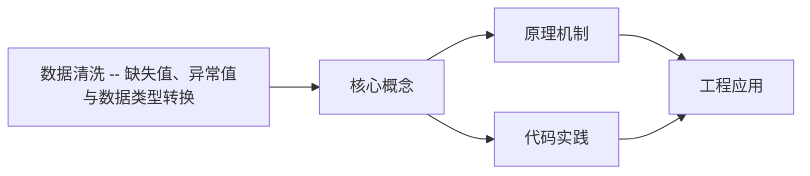

## 1. 学习目标（Bloom 分类）

本节按照布鲁姆教育目标分类学组织学习路径。本文主题为《数据清洗 -- 缺失值、异常值与数据类型转换》，属于 数据分析 模块，读者可以根据自身阶段选择阅读深度。

记忆层面：能够准确复述本文的核心概念、术语与基本语法或操作步骤，并能够在提问或检索时快速定位对应知识点。能够说出 数据分析 的核心概念、常用命令与流程。

理解层面：能够用自己的语言解释核心原理与工作机制，说明概念之间的因果关系，而不是机械记忆结论。能够解释 数据分析 的工作原理与设计动机。

应用层面：能够在真实项目或练习场景中运用本文知识解决具体问题，写出正确且可维护的实现。能够独立完成 数据分析 的标准操作。

分析层面：能够拆解复杂问题，比较本文主题与相邻概念的异同，识别边界条件与例外情况。能够分析 数据分析 使用中的异常与边界。

评价层面：能够根据约束条件（性能、可读性、安全、成本）评价不同方案的优劣，做出有依据的技术决策。能够评价 数据分析 相关工具与方案。

创造层面：能够把本文知识与其他模块知识组合，设计出新的解决方案或可复用的工程模式。能够把 数据分析 融入团队工作流。

通过本节学习，读者应当能够把《数据清洗 -- 缺失值、异常值与数据类型转换》纳入自己的知识网络，并与 数据分析 模块的其他主题（数据清洗、可视化、统计、报告）建立关联。

## 2. 历史动机与发展脉络

《数据清洗 -- 缺失值、异常值与数据类型转换》是 数据分析 领域的重要主题。要真正理解它，需要先了解它解决的问题与演进过程。

数据分析是从数据中提取决策信息的工程过程：定义问题 -> 采集 -> 清洗 -> 探索 -> 建模 -> 可视化 -> 报告。
工具链：Python（Pandas/NumPy）、SQL、Jupyter、BI（Tableau/PowerBI）；Excel 仍是轻量入口。
方法：描述性分析（发生了什么）、诊断（为什么）、预测（会怎样）、规范（该怎么办）。

回到本文主题：数据清洗 -- 缺失值、异常值与数据类型转换 的提出与成熟，正是上述技术背景下的必然产物。早期实现往往以简单可用为目标，随着工程规模扩大，社区逐渐沉淀出标准做法与最佳实践；理解这一脉络，可以帮助读者判断“为什么文档中的推荐写法是现在这个样子”，也能在遇到历史遗留代码时准确识别其设计年代与取舍。


## 3. 形式化定义与核心概念精讲

本节把《数据清洗 -- 缺失值、异常值与数据类型转换》涉及的核心概念以“定义 + 讲解”的形式展开。读者应把定义当作工具，把讲解当作理解路径；两者结合才能形成可迁移的知识。

数据形态：表格（结构化）、序列（时间）、文本、图像；分析前确定数据类型（数值/类别/顺序）。
清洗：缺失值（删除/填充）、异常值（IQR/z-score）、重复、类型转换；清洗决定结果可信度。
探索性分析（EDA）：分布（直方图）、集中趋势（均值/中位数）、离散（方差/IQR）、相关性。

### 3.1 原文章节逐一精讲

原文档把主题拆分为 12 个小节，下面按顺序给出每一节的导读讲解，随后保留原文细节供精读。

#### 原文精读（完整保留）


#### 1. 数据清洗概述

##### 1.1 为什么数据清洗是第一步

"Garbage In, Garbage Out" -- 如果输入数据有问题，再先进的分析方法也产出不了有价值的结论。数据清洗通常占整个分析项目 60%-80% 的时间，但这一步不可跳过。

数据质量问题的常见来源：

- 人工录入错误（拼写、格式不一致）
- 系统迁移导致的数据丢失或格式变化
- 传感器故障导致的异常值
- 多源数据合并时的格式冲突
- 用户主动不填导致的缺失值

> 跨模块参考：数据清洗依赖 [pandas.md](pandas.md) 的 DataFrame 操作，统计分析方法参考 [statistics.md](statistics.md)。

##### 1.2 数据清洗的核心任务

| 任务         | 典型问题               | 工具                                  |
| ------------ | ---------------------- | ------------------------------------- |
| 缺失值处理   | NaN、空字符串、占位符  | `fillna`、`dropna`、`interpolate`     |
| 异常值处理   | 极端值、不合理值       | IQR、Z-Score、Winsorize               |
| 类型转换     | 字符串数字、日期格式   | `to_numeric`、`to_datetime`、`astype` |
| 字符串清洗   | 空格、大小写、特殊字符 | `str.strip`、`str.replace`、正则      |
| 重复数据处理 | 完全重复、部分重复     | `duplicated`、`drop_duplicates`       |
| 格式统一     | 编码不一致、单位不统一 | 自定义映射函数                        |

---

#### 2. 数据质量评估

##### 2.1 全面体检

```python
import pandas as pd
import numpy as np

df = pd.DataFrame({
    'user_id': [1, 2, 3, np.nan, 5, 6, 7, 8, 9, 10],
    'name': ['Alice', 'Bob', 'Charlie', 'Diana', 'Eve', 'alice', 'Frank', None, 'Grace', 'Bob'],
    'age': [25, 30, -5, 28, 150, 22, 35, 29, 31, 30],
    'email': ['a@test.com', 'b@test.com', 'invalid', 'd@test.com', 'e@test.com',
              'a@test.com', 'g@test.com', 'h@test', 'i@test.com', 'b@test.com'],
    'signup_date': ['2024-01-15', '2024/02/20', '2024-03-10', '2024-04-05',
                    '2024-05-01', '2024-06-15', 'not-a-date', '2024-08-20', '2024-09-10', '2024-10-25'],
    'purchase_amount': [120.5, 89.9, 0, 250.0, np.nan, 75.5, 99999.0, 180.0, 95.0, 89.9]
})

print(f"Shape: {df.shape}")
print(f"\nData types:\n{df.dtypes}")
print(f"\nMissing values:\n{df.isna().sum()}")
print(f"\nMissing rate:\n{df.isna().mean().round(4) * 100}%")
print(f"\nDuplicate rows: {df.duplicated().sum()}")
print(f"\nBasic stats:\n{df.describe()}")
```

**输出说明**：

- `shape` 了解数据规模
- `dtypes` 检查类型是否正确（如 age 应为整数而非浮点数）
- `isna().sum()` 统计每列缺失数
- `describe()` 快速发现异常值（如 age=-5, age=150, purchase_amount=99999）

##### 2.2 数据质量报告

```python
import pandas as pd
import numpy as np

def quality_report(df):
    report = pd.DataFrame({
        'dtype': df.dtypes,
        'non_null': df.notna().sum(),
        'null_count': df.isna().sum(),
        'null_pct': (df.isna().mean() * 100).round(2),
        'unique': df.nunique(),
        'sample': df.apply(lambda x: x.dropna().unique()[:3].tolist())
    })
    return report

print(quality_report(df))
```

**输出说明**：自定义质量报告函数汇总每列的类型、缺失情况、唯一值数量和样本值，帮助快速定位问题列。

---

#### 3. 缺失值处理

##### 3.1 缺失机制分类

| 机制         | 缩写 | 含义                   | 处理策略           |
| ------------ | ---- | ---------------------- | ------------------ |
| 完全随机缺失 | MCAR | 缺失与任何变量无关     | 删除或简单填充     |
| 随机缺失     | MAR  | 缺失与已观测变量有关   | 多重插补、模型填充 |
| 非随机缺失   | MNAR | 缺失与未观测值本身有关 | 需要领域知识处理   |

> **为什么区分缺失机制很重要？** MCAR 下删除缺失行不会引入偏差。MAR 下删除可能引入偏差，应使用填充。MNAR 下任何统计方法都无法完全修正偏差，需要领域知识辅助。

##### 3.2 删除法

```python
import pandas as pd
import numpy as np

df = pd.DataFrame({
    'A': [1, np.nan, 3, np.nan, 5],
    'B': [10, 20, np.nan, 40, 50],
    'C': ['x', 'y', np.nan, 'z', 'w']
})

df_drop_any = df.dropna()
print(f"删除任意缺失行:\n{df_drop_any}")

df_drop_subset = df.dropna(subset=['A'])
print(f"\n只看A列缺失:\n{df_drop_subset}")

df_drop_all = df.dropna(how='all')
print(f"\n删除全缺失行:\n{df_drop_all}")

threshold = df.dropna(thresh=2)
print(f"\n保留至少2个非缺失值的行:\n{threshold}")
```

**输出说明**：

- `dropna()` 删除任何含缺失值的行
- `subset` 指定只根据某列判断
- `how='all'` 只删除全部缺失的行
- `thresh=2` 保留至少有 2 个非缺失值的行

> **什么时候应该删除而非填充？** 当缺失率很低（<5%）且数据量充足时，删除最简单安全。当缺失率很高（>50%）时，填充可能引入过多噪声，也建议删除该列。

##### 3.3 填充法

```python
import pandas as pd
import numpy as np

df = pd.DataFrame({
    'age': [25, np.nan, 35, 28, np.nan, 42],
    'category': ['A', 'B', np.nan, 'A', 'B', np.nan],
    'value': [100, 120, np.nan, 80, 110, np.nan]
})

df['age'] = df['age'].fillna(df['age'].median())
print(f"中位数填充age:\n{df['age']}")

df['category'] = df['category'].fillna('Unknown')
print(f"\n众数/指定值填充category:\n{df['category']}")

df['value_forward'] = df['value'].fillna(method='ffill')
df['value_backward'] = df['value'].fillna(method='bfill')
print(f"\n前向填充:\n{df['value_forward']}")
print(f"\n后向填充:\n{df['value_backward']}")
```

**输出说明**：

- 数值列常用中位数填充（比均值更抗异常值）
- 分类列用众数或 "Unknown" 填充
- 时间序列用前向/后向填充（`ffill`/`bfill`）
- 选择填充策略时需要考虑业务含义

##### 3.4 插值法

```python
import pandas as pd
import numpy as np

df = pd.DataFrame({
    'date': pd.date_range('2024-01-01', periods=10),
    'value': [10, 12, np.nan, np.nan, 18, 20, np.nan, 25, 27, 30]
})

df['linear'] = df['value'].interpolate(method='linear')
df['quadratic'] = df['value'].interpolate(method='quadratic')
df['time'] = df['value'].interpolate(method='time')

print(df['value', 'linear', 'quadratic', 'time']('value', 'linear', 'quadratic', 'time'))
```

**输出说明**：

- `linear`：线性插值，适合变化均匀的数据
- `quadratic`：二次插值，适合有曲率的数据
- `time`：时间感知插值，考虑时间间隔

> **为什么插值比简单填充好？** 插值利用了相邻数据点的趋势信息，填充值更合理。特别是时间序列数据，插值能保持趋势的连续性。

---

#### 4. 异常值检测

##### 4.1 IQR 法则

```python
import pandas as pd
import numpy as np

rng = np.random.default_rng(42)
data = np.concatenate([rng.normal(50, 10, 95), [150, 160, -20, -30, 200]])
df = pd.DataFrame({'value': data})

Q1 = df['value'].quantile(0.25)
Q3 = df['value'].quantile(0.75)
IQR = Q3 - Q1
lower = Q1 - 1.5 * IQR
upper = Q3 + 1.5 * IQR

outliers = df[(df['value'] < lower) | (df['value'] > upper)]
print(f"Q1={Q1:.2f}, Q3={Q3:.2f}, IQR={IQR:.2f}")
print(f"正常范围: [{lower:.2f}, {upper:.2f}]")
print(f"异常值数量: {len(outliers)}")
print(f"异常值:\n{outliers}")
```

**输出说明**：IQR 法则将超出 [Q1-1.5*IQR, Q3+1.5*IQR] 范围的值标记为异常。这是箱线图中异常值检测的标准方法。

> **为什么用 1.5 倍 IQR？** 对于正态分布，1.5\*IQR 大约对应 +/- 2.7 个标准差，覆盖约 99.3% 的数据。这个倍数是经验值，可以根据业务需求调整（如 3 倍 IQR 只标记极端异常值）。

##### 4.2 Z-Score 法

```python
import numpy as np
from scipy import stats

rng = np.random.default_rng(42)
data = np.concatenate([rng.normal(50, 10, 95), [150, 160, -20, -30, 200]])

z_scores = np.abs(stats.zscore(data))
threshold = 3
outlier_mask = z_scores > threshold

print(f"Z-Score > {threshold} 的异常值数量: {outlier_mask.sum()}")
print(f"异常值索引: {np.where(outlier_mask)[0]}")
print(f"异常值: {data[outlier_mask]}")
```

**输出说明**：Z-Score = (x - mean) / std。|Z| > 3 的值被视为异常（正态分布下概率 < 0.3%）。Z-Score 法对正态分布数据效果好，但对偏态分布不适用。

##### 4.3 可视化检测

```python
import pandas as pd
import numpy as np
import seaborn as sns
import matplotlib.pyplot as plt

rng = np.random.default_rng(42)
data = np.concatenate([rng.normal(50, 10, 95), [150, 160, -20, -30, 200]])
df = pd.DataFrame({'value': data})

fig, axes = plt.subplots(1, 2, figsize=(12, 5))

sns.boxplot(y=df['value'], ax=axes[0])
axes[0].set_title('Box Plot for Outlier Detection')

sns.histplot(df['value'], bins=30, kde=True, ax=axes[1])
axes[1].axvline(df['value'].mean(), color='red', linestyle='--', label='Mean')
axes[1].set_title('Histogram with Distribution')
axes[1].legend()

plt.tight_layout()
plt.show()
```

**输出说明**：箱线图直观展示异常值（独立点），直方图展示整体分布形态。两种图表结合使用，可以更全面地判断异常值。

---

#### 5. 异常值处理

##### 5.1 处理策略选择

| 策略              | 适用场景           | 优点         | 缺点         |
| ----------------- | ------------------ | ------------ | ------------ |
| 删除              | 确认数据错误       | 简单直接     | 损失信息     |
| 截断（Winsorize） | 保留数据但限制影响 | 保留样本量   | 改变分布形态 |
| 替换              | 有合理替代值       | 保留样本量   | 引入主观判断 |
| 分箱              | 将极端值归入边界组 | 保留排序信息 | 损失精度     |
| 保留              | 异常值本身有意义   | 不丢失信息   | 影响统计量   |

##### 5.2 Winsorize 截断

```python
import numpy as np
from scipy.stats import mstats

data = np.array([10, 12, 15, 18, 20, 22, 25, 28, 30, 150, 200])

winsorized = mstats.winsorize(data, limits=[0.05, 0.05])
print(f"原始数据: {data}")
print(f"截断后:   {winsorized}")
print(f"最大值从 {data.max()} 变为 {winsorized.max()}")
```

**输出说明**：Winsorize 将两端各 5% 的极端值替换为对应百分位的值。与删除不同，截断保留了样本量，只是将极端值"拉回"到合理范围。

##### 5.3 Clipping 裁剪

```python
import pandas as pd
import numpy as np

df = pd.DataFrame({'age': [25, 30, -5, 28, 150, 22, 35, 29]})

df['age_clipped'] = df['age'].clip(lower=0, upper=120)
print(f"裁剪后:\n{df}")
```

**输出说明**：`clip` 将超出范围的值替换为边界值。比 Winsorize 更直观，适合有明确合理范围的字段（如年龄 0-120）。

---

#### 6. 数据类型转换

##### 6.1 常见转换场景

```python
import pandas as pd
import numpy as np

df = pd.DataFrame({
    'price_str': ['10.5', '20.0', 'N/A', '30.5', 'unknown'],
    'date_str': ['2024-01-15', '2024/02/20', '2024-03-10', 'not-a-date', '2024-05-01'],
    'status': ['active', 'inactive', 'active', 'active', 'pending'],
    'quantity': [1.0, 2.0, 3.0, 4.0, 5.0]
})

df['price'] = pd.to_numeric(df['price_str'], errors='coerce')
print(f"字符串转数值:\n{df['price_str', 'price']('price_str', 'price')}")

df['date'] = pd.to_datetime(df['date_str'], errors='coerce', format='mixed')
print(f"\n字符串转日期:\n{df['date_str', 'date']('date_str', 'date')}")

df['status_cat'] = df['status'].astype('category')
print(f"\n对象转分类:\n{df['status_cat'].cat.categories.tolist()}")

df['quantity_int'] = df['quantity'].astype('int32')
print(f"\n浮点转整数:\n{df['quantity', 'quantity_int']('quantity', 'quantity_int').dtypes}")
```

**输出说明**：

- `errors='coerce'` 将无法转换的值设为 NaN（而非报错）
- `format='mixed'` 自动识别多种日期格式
- `astype('category')` 将低基数字符串转为分类类型
- 浮点数转整数前确保没有小数部分

##### 6.2 布尔转换

```python
import pandas as pd

df = pd.DataFrame({
    'flag': ['yes', 'no', 'YES', 'No', 'y', 'n', '1', '0', True, False]
})

bool_map = {'yes': True, 'y': True, '1': True, True: True,
            'no': False, 'n': False, '0': False, False: False}

df['flag_bool'] = df['flag'].astype(str).str.lower().map(
    {'yes': True, 'y': True, '1': True, '': True,
     'no': False, 'n': False, '0': False, 'false': False}
)
print(f"布尔转换:\n{df['flag', 'flag_bool']('flag', 'flag_bool')}")
```

**输出说明**：实际数据中布尔值的表示千奇百怪（yes/no, Y/N, 1/0, True/False），统一转换是清洗的常见步骤。

---

#### 7. 字符串清洗

##### 7.1 基础清洗

```python
import pandas as pd

df = pd.DataFrame({
    'name': ['  Alice ', 'BOB', 'charlie  ', '  Diana', 'EVE  '],
    'city': ['New York', 'los angeles', 'CHICAGO', 'san francisco', 'BOSTON'],
    'phone': ['(123) 456-7890', '123-456-7890', '123.456.7890', '+1 123 456 7890', '1234567890']
})

df['name_clean'] = df['name'].str.strip().str.title()
print(f"去除空格+首字母大写:\n{df['name', 'name_clean']('name', 'name_clean')}")

df['city_clean'] = df['city'].str.strip().str.title()
print(f"\n城市名标准化:\n{df['city', 'city_clean']('city', 'city_clean')}")

df['phone_clean'] = df['phone'].str.replace(r'\D', '', regex=True)
print(f"\n电话号码只保留数字:\n{df['phone', 'phone_clean']('phone', 'phone_clean')}")
```

**输出说明**：

- `strip()` 去除首尾空白
- `title()` 首字母大写
- `replace(r'\D', '', regex=True)` 移除所有非数字字符

##### 7.2 正则提取

```python
import pandas as pd

df = pd.DataFrame({
    'product': ['iPhone 15 Pro Max', 'Samsung Galaxy S24', 'Google Pixel 8 Pro'],
    'price_with_unit': ['$1,199.00', 'EUR 899,50', 'GBP 799.99'],
    'email': ['Contact: user@example.com', 'admin@test.org', 'no-email-here']
})

df['brand'] = df['product'].str.extract(r'^(\w+)')
print(f"提取品牌:\n{df['product', 'brand']('product', 'brand')}")

df['email_extracted'] = df['email'].str.extract(r'([\w.]+@[\w.]+)')
print(f"\n提取邮箱:\n{df['email', 'email_extracted']('email', 'email_extracted')}")

df['has_email'] = df['email'].str.contains(r'@', regex=True)
print(f"\n是否包含邮箱:\n{df['email', 'has_email']('email', 'has_email')}")
```

**输出说明**：

- `str.extract(r'pattern')` 提取第一个匹配组
- `str.contains(r'pattern')` 检查是否包含匹配
- `str.match(r'pattern')` 检查是否从开头匹配

---

#### 8. 重复数据处理

##### 8.1 完全重复与部分重复

```python
import pandas as pd

df = pd.DataFrame({
    'email': ['a@test.com', 'b@test.com', 'a@test.com', 'a@test.com', 'c@test.com'],
    'name': ['Alice', 'Bob', 'Alice', 'Alice2', 'Charlie'],
    'score': [85, 92, 85, 90, 78]
})

print(f"完全重复:\n{df.duplicated()}")
print(f"\n完全重复数量: {df.duplicated().sum()}")

print(f"\n基于email的重复:\n{df.duplicated(subset=['email'])}")

df_dedup = df.drop_duplicates(subset=['email'], keep='last')
print(f"\n去重(保留最后出现):\n{df_dedup}")
```

**输出说明**：

- `duplicated()` 标记完全重复行（所有列都相同）
- `subset` 指定判断重复的关键列
- `keep='first'`（默认）保留第一条，`keep='last'` 保留最后一条，`keep=False` 删除所有重复

##### 8.2 重复记录合并

```python
import pandas as pd

df = pd.DataFrame({
    'user_id': [1, 1, 2, 3, 3],
    'action': ['view', 'purchase', 'view', 'view', 'purchase'],
    'timestamp': ['2024-01-01', '2024-01-02', '2024-01-01', '2024-01-01', '2024-01-03']
})

agg_result = df.groupby('user_id').agg(
    action_count=('action', 'count'),
    latest_action=('action', 'last'),
    latest_timestamp=('timestamp', 'max')
).reset_index()
print(f"重复记录聚合:\n{agg_result}")
```

**输出说明**：当重复记录包含不同信息时，不能简单删除，需要聚合。`groupby` + `agg` 是合并重复记录的标准方法。

---

#### 9. 数据验证与断言

##### 9.1 使用 assert 语句

```python
import pandas as pd
import numpy as np

df = pd.DataFrame({
    'age': [25, 30, 35, 28, 22],
    'score': [85, 92, 78, 95, 88],
    'email': ['a@test.com', 'b@test.com', 'c@test.com', 'd@test.com', 'e@test.com']
})

assert df['age'].notna().all(), 'Age contains NaN'
assert (df['age'] >= 0).all() and (df['age'] <= 150).all(), 'Age out of range'
assert df['email'].str.contains('@').all(), 'Invalid email format'
assert df['score'].between(0, 100).all(), 'Score out of range'
assert not df.duplicated(subset=['email']).any(), 'Duplicate emails'

print('All validations passed!')
```

**输出说明**：`assert` 语句在条件为 False 时抛出 AssertionError。将验证逻辑放在清洗之后，确保数据质量可控。

##### 9.2 使用 pandera 库

```python
import pandas as pd
import pandera as pa

schema = pa.DataFrameSchema({
    'age': pa.Column(int, checks=[
        pa.Check.ge(0),
        pa.Check.le(150)
    ], nullable=False),
    'score': pa.Column(float, checks=[
        pa.Check.ge(0),
        pa.Check.le(100)
    ]),
    'email': pa.Column(str, checks=[
        pa.Check.str_matches(r'^[\w.]+@[\w.]+\.\w+$')
    ], nullable=False),
})

df = pd.DataFrame({
    'age': [25, 30, 35],
    'score': [85.5, 92.0, 78.5],
    'email': ['a@test.com', 'b@test.com', 'c@test.com']
})

validated = schema.validate(df)
print('Pandera validation passed!')
```

**输出说明**：`pandera` 提供声明式的数据验证框架，支持类型检查、范围检查、正则匹配、唯一性检查等。比 `assert` 更结构化，适合生产环境。

---

#### 10. 清洗流程自动化

##### 10.1 Pipeline 模式

```python
import pandas as pd
import numpy as np

def remove_duplicates(df, subset=None, keep='last'):
    before = len(df)
    df = df.drop_duplicates(subset=subset, keep=keep).reset_index(drop=True)
    after = len(df)
    print(f'  remove_duplicates: {before} -> {after} rows')
    return df

def handle_missing(df, strategy='median_fill'):
    missing_before = df.isna().sum().sum()
    for col in df.select_dtypes(include='number').columns:
        if strategy == 'median_fill':
            df[col] = df[col].fillna(df[col].median())
    for col in df.select_dtypes(include='object').columns:
        df[col] = df[col].fillna('Unknown')
    missing_after = df.isna().sum().sum()
    print(f'  handle_missing: {missing_before} -> {missing_after} missing values')
    return df

def fix_types(df):
    for col in df.select_dtypes(include='object').columns:
        try:
            df[col] = pd.to_numeric(df[col], errors='ignore')
        except:
            pass
    print(f'  fix_types: {df.dtypes.value_counts().to_dict()}')
    return df

def remove_outliers_iqr(df, columns, factor=1.5):
    before = len(df)
    for col in columns:
        Q1, Q3 = df[col].quantile([0.25, 0.75])
        IQR = Q3 - Q1
        mask = (df[col] >= Q1 - factor * IQR) & (df[col] <= Q3 + factor * IQR)
        df = df[mask]
    after = len(df)
    print(f'  remove_outliers_iqr: {before} -> {after} rows')
    return df

def clean_pipeline(df):
    print('Starting cleaning pipeline...')
    df = remove_duplicates(df, subset=['email'])
    df = handle_missing(df)
    df = fix_types(df)
    df = remove_outliers_iqr(df, ['age', 'score'])
    print('Cleaning pipeline complete!')
    return df

df_raw = pd.DataFrame({
    'email': ['a@test.com', 'b@test.com', 'a@test.com'],
    'age': [25, np.nan, 200],
    'score': [85, 92, 78]
})

df_clean = clean_pipeline(df_raw)
print(f'\nCleaned data:\n{df_clean}')
```

**输出说明**：Pipeline 模式将清洗步骤封装为独立函数，按顺序执行。每个步骤打印处理前后的变化，便于追踪。这种模式的好处是：

- 每个步骤职责单一，易于测试
- 可以灵活增删步骤
- 处理日志便于审计

---

#### 11. 速查表

##### 11.1 缺失值处理速查

| 场景       | 方法        | 代码                                   |
| ---------- | ----------- | -------------------------------------- |
| 缺失率 <5% | 删除        | `df.dropna(subset=[col])`              |
| 数值列     | 中位数填充  | `df[col].fillna(df[col].median())`     |
| 分类列     | 众数/指定值 | `df[col].fillna(df[col].mode()[0])`    |
| 时间序列   | 前向填充    | `df[col].fillna(method='ffill')`       |
| 趋势数据   | 插值        | `df[col].interpolate(method='linear')` |

##### 11.2 异常值检测速查

| 方法     | 适用场景   | 代码                         |
| -------- | ---------- | ---------------------------- |
| IQR      | 通用       | `Q1-1.5*IQR ~ Q3+1.5*IQR`    |
| Z-Score  | 正态分布   | `abs(zscore) > 3`            |
| 箱线图   | 可视化     | `sns.boxplot()`              |
| 领域规则 | 有明确范围 | `df[col].clip(lower, upper)` |

##### 11.3 类型转换速查

| 转换         | 代码                                 |
| ------------ | ------------------------------------ |
| 字符串转数值 | `pd.to_numeric(s, errors='coerce')`  |
| 字符串转日期 | `pd.to_datetime(s, errors='coerce')` |
| 对象转分类   | `s.astype('category')`               |
| 浮点转整数   | `s.astype('int32')`                  |
| 布尔统一     | `s.map({'yes':True, 'no':False})`    |

---

#### 12. 延伸阅读

- Pandas 官方文档 -- Missing Data：https://pandas.pydata.org/docs/user_guide/missing_data.html
- Python for Data Analysis 第 3 版 (Wes McKinney)
- pandera 数据验证库：https://pandera.readthedocs.io/
- Great Expectations 数据质量框架：https://greatexpectations.io/


### 3.2 概念关系图

下面用 Mermaid 图表达本文核心概念之间的关系，帮助读者建立整体图景：



图中展示的是本文知识的结构化关系：核心概念是入口，原理机制解释“为什么”，代码实践演示“怎么做”，工程应用回答“何时用”。读者学习时可以把每个小节的内容挂接到对应节点上。

## 4. 理论推导与原理解析

本节深入《数据清洗 -- 缺失值、异常值与数据类型转换》背后的原理。理论部分不求面面俱到，而是聚焦“能解释现象、能指导实践”的关键推导。

数据形态：表格（结构化）、序列（时间）、文本、图像；分析前确定数据类型（数值/类别/顺序）。
清洗：缺失值（删除/填充）、异常值（IQR/z-score）、重复、类型转换；清洗决定结果可信度。
探索性分析（EDA）：分布（直方图）、集中趋势（均值/中位数）、离散（方差/IQR）、相关性。
可视化原则：图型匹配数据（趋势折线、比较柱状、构成饼/堆叠、关系散点），标注与叙事。

需要强调的是，理论推导与工程实践之间存在翻译层：理论给出的是理想化模型与边界条件，工程代码则必须处理真实环境中的例外。读者在学习时应先掌握理论的“标准情形”，再通过陷阱章节了解“非标准情形”。

## 5. 代码示例与逐行讲解

本节把原文中的代码示例系统整理，并为每个示例补充用途说明与讲解。读者不应只浏览代码，而应逐段对照讲解理解设计意图。

### 5.1 示例：2.1 全面体检

该示例来自原文《2.1 全面体检》小节，用于演示数据清洗 -- 缺失值、异常值与数据类型转换相关操作。阅读时请先看代码结构，再看其后的讲解。

```python
import pandas as pd
import numpy as np

df = pd.DataFrame({
    'user_id': [1, 2, 3, np.nan, 5, 6, 7, 8, 9, 10],
    'name': ['Alice', 'Bob', 'Charlie', 'Diana', 'Eve', 'alice', 'Frank', None, 'Grace', 'Bob'],
    'age': [25, 30, -5, 28, 150, 22, 35, 29, 31, 30],
    'email': ['a@test.com', 'b@test.com', 'invalid', 'd@test.com', 'e@test.com',
              'a@test.com', 'g@test.com', 'h@test', 'i@test.com', 'b@test.com'],
    'signup_date': ['2024-01-15', '2024/02/20', '2024-03-10', '2024-04-05',
                    '2024-05-01', '2024-06-15', 'not-a-date', '2024-08-20', '2024-09-10', '2024-10-25'],
    'purchase_amount': [120.5, 89.9, 0, 250.0, np.nan, 75.5, 99999.0, 180.0, 95.0, 89.9]
})

print(f"Shape: {df.shape}")
print(f"\nData types:\n{df.dtypes}")
print(f"\nMissing values:\n{df.isna().sum()}")
print(f"\nMissing rate:\n{df.isna().mean().round(4) * 100}%")
print(f"\nDuplicate rows: {df.duplicated().sum()}")
print(f"\nBasic stats:\n{df.describe()}")
```

讲解：这段代码演示了本节核心知识点。代码中的关键操作可以归纳为三步：准备（定义或初始化）、执行（核心逻辑）、收尾（释放资源或返回结果）。实际项目中，这三步往往被封装为函数或类，以提升复用性与可测试性。

关键点分析：

该示例共 18 行有效代码，包含 1 类关键结构（import）。其中：

- 入口与初始化部分负责建立上下文，对应实际项目中的启动或装配逻辑；
- 核心逻辑部分体现本文主题的主要操作，是阅读时最需要对照讲解理解的部分；
- 输出或返回部分把结果交给调用方，注意其类型与边界条件。

进阶思考路径：先尝试修改参数观察行为变化，再把示例中的模式迁移到自己的项目中；每次修改都记录预期与实测差异，这是把示例转化为能力的最快方式。

### 5.2 示例：2.2 数据质量报告

该示例来自原文《2.2 数据质量报告》小节，用于演示数据清洗 -- 缺失值、异常值与数据类型转换相关操作。阅读时请先看代码结构，再看其后的讲解。

```python
import pandas as pd
import numpy as np

def quality_report(df):
    report = pd.DataFrame({
        'dtype': df.dtypes,
        'non_null': df.notna().sum(),
        'null_count': df.isna().sum(),
        'null_pct': (df.isna().mean() * 100).round(2),
        'unique': df.nunique(),
        'sample': df.apply(lambda x: x.dropna().unique()[:3].tolist())
    })
    return report

print(quality_report(df))
```

讲解：这段代码演示了本节核心知识点。代码中的关键操作可以归纳为三步：准备（定义或初始化）、执行（核心逻辑）、收尾（释放资源或返回结果）。实际项目中，这三步往往被封装为函数或类，以提升复用性与可测试性。

关键点分析：

该示例共 13 行有效代码，包含 3 类关键结构（def、import、return）。其中：

- 入口与初始化部分负责建立上下文，对应实际项目中的启动或装配逻辑；
- 核心逻辑部分体现本文主题的主要操作，是阅读时最需要对照讲解理解的部分；
- 输出或返回部分把结果交给调用方，注意其类型与边界条件。

进阶思考路径：先尝试修改参数观察行为变化，再把示例中的模式迁移到自己的项目中；每次修改都记录预期与实测差异，这是把示例转化为能力的最快方式。

### 5.3 示例：3.2 删除法

该示例来自原文《3.2 删除法》小节，用于演示数据清洗 -- 缺失值、异常值与数据类型转换相关操作。阅读时请先看代码结构，再看其后的讲解。

```python
import pandas as pd
import numpy as np

df = pd.DataFrame({
    'A': [1, np.nan, 3, np.nan, 5],
    'B': [10, 20, np.nan, 40, 50],
    'C': ['x', 'y', np.nan, 'z', 'w']
})

df_drop_any = df.dropna()
print(f"删除任意缺失行:\n{df_drop_any}")

df_drop_subset = df.dropna(subset=['A'])
print(f"\n只看A列缺失:\n{df_drop_subset}")

df_drop_all = df.dropna(how='all')
print(f"\n删除全缺失行:\n{df_drop_all}")

threshold = df.dropna(thresh=2)
print(f"\n保留至少2个非缺失值的行:\n{threshold}")
```

讲解：这段代码演示了本节核心知识点。代码中的关键操作可以归纳为三步：准备（定义或初始化）、执行（核心逻辑）、收尾（释放资源或返回结果）。实际项目中，这三步往往被封装为函数或类，以提升复用性与可测试性。

关键点分析：

该示例共 15 行有效代码，包含 1 类关键结构（import）。其中：

- 入口与初始化部分负责建立上下文，对应实际项目中的启动或装配逻辑；
- 核心逻辑部分体现本文主题的主要操作，是阅读时最需要对照讲解理解的部分；
- 输出或返回部分把结果交给调用方，注意其类型与边界条件。

进阶思考路径：先尝试修改参数观察行为变化，再把示例中的模式迁移到自己的项目中；每次修改都记录预期与实测差异，这是把示例转化为能力的最快方式。

### 5.4 示例：3.3 填充法

该示例来自原文《3.3 填充法》小节，用于演示数据清洗 -- 缺失值、异常值与数据类型转换相关操作。阅读时请先看代码结构，再看其后的讲解。

```python
import pandas as pd
import numpy as np

df = pd.DataFrame({
    'age': [25, np.nan, 35, 28, np.nan, 42],
    'category': ['A', 'B', np.nan, 'A', 'B', np.nan],
    'value': [100, 120, np.nan, 80, 110, np.nan]
})

df['age'] = df['age'].fillna(df['age'].median())
print(f"中位数填充age:\n{df['age']}")

df['category'] = df['category'].fillna('Unknown')
print(f"\n众数/指定值填充category:\n{df['category']}")

df['value_forward'] = df['value'].fillna(method='ffill')
df['value_backward'] = df['value'].fillna(method='bfill')
print(f"\n前向填充:\n{df['value_forward']}")
print(f"\n后向填充:\n{df['value_backward']}")
```

讲解：这段代码演示了本节核心知识点。代码中的关键操作可以归纳为三步：准备（定义或初始化）、执行（核心逻辑）、收尾（释放资源或返回结果）。实际项目中，这三步往往被封装为函数或类，以提升复用性与可测试性。

关键点分析：

该示例共 15 行有效代码，包含 1 类关键结构（import）。其中：

- 入口与初始化部分负责建立上下文，对应实际项目中的启动或装配逻辑；
- 核心逻辑部分体现本文主题的主要操作，是阅读时最需要对照讲解理解的部分；
- 输出或返回部分把结果交给调用方，注意其类型与边界条件。

进阶思考路径：先尝试修改参数观察行为变化，再把示例中的模式迁移到自己的项目中；每次修改都记录预期与实测差异，这是把示例转化为能力的最快方式。

### 5.5 示例：3.4 插值法

该示例来自原文《3.4 插值法》小节，用于演示数据清洗 -- 缺失值、异常值与数据类型转换相关操作。阅读时请先看代码结构，再看其后的讲解。

```python
import pandas as pd
import numpy as np

df = pd.DataFrame({
    'date': pd.date_range('2024-01-01', periods=10),
    'value': [10, 12, np.nan, np.nan, 18, 20, np.nan, 25, 27, 30]
})

df['linear'] = df['value'].interpolate(method='linear')
df['quadratic'] = df['value'].interpolate(method='quadratic')
df['time'] = df['value'].interpolate(method='time')

print(df['value', 'linear', 'quadratic', 'time']('value', 'linear', 'quadratic', 'time'))
```

讲解：这段代码演示了本节核心知识点。代码中的关键操作可以归纳为三步：准备（定义或初始化）、执行（核心逻辑）、收尾（释放资源或返回结果）。实际项目中，这三步往往被封装为函数或类，以提升复用性与可测试性。

关键点分析：

该示例共 10 行有效代码，包含 1 类关键结构（import）。其中：

- 入口与初始化部分负责建立上下文，对应实际项目中的启动或装配逻辑；
- 核心逻辑部分体现本文主题的主要操作，是阅读时最需要对照讲解理解的部分；
- 输出或返回部分把结果交给调用方，注意其类型与边界条件。

进阶思考路径：先尝试修改参数观察行为变化，再把示例中的模式迁移到自己的项目中；每次修改都记录预期与实测差异，这是把示例转化为能力的最快方式。

### 5.6 示例：4.1 IQR 法则

该示例来自原文《4.1 IQR 法则》小节，用于演示数据清洗 -- 缺失值、异常值与数据类型转换相关操作。阅读时请先看代码结构，再看其后的讲解。

```python
import pandas as pd
import numpy as np

rng = np.random.default_rng(42)
data = np.concatenate([rng.normal(50, 10, 95), [150, 160, -20, -30, 200]])
df = pd.DataFrame({'value': data})

Q1 = df['value'].quantile(0.25)
Q3 = df['value'].quantile(0.75)
IQR = Q3 - Q1
lower = Q1 - 1.5 * IQR
upper = Q3 + 1.5 * IQR

outliers = df[(df['value'] < lower) | (df['value'] > upper)]
print(f"Q1={Q1:.2f}, Q3={Q3:.2f}, IQR={IQR:.2f}")
print(f"正常范围: [{lower:.2f}, {upper:.2f}]")
print(f"异常值数量: {len(outliers)}")
print(f"异常值:\n{outliers}")
```

讲解：这段代码演示了本节核心知识点。代码中的关键操作可以归纳为三步：准备（定义或初始化）、执行（核心逻辑）、收尾（释放资源或返回结果）。实际项目中，这三步往往被封装为函数或类，以提升复用性与可测试性。

关键点分析：

该示例共 15 行有效代码，包含 1 类关键结构（import）。其中：

- 入口与初始化部分负责建立上下文，对应实际项目中的启动或装配逻辑；
- 核心逻辑部分体现本文主题的主要操作，是阅读时最需要对照讲解理解的部分；
- 输出或返回部分把结果交给调用方，注意其类型与边界条件。

进阶思考路径：先尝试修改参数观察行为变化，再把示例中的模式迁移到自己的项目中；每次修改都记录预期与实测差异，这是把示例转化为能力的最快方式。

### 5.7 示例：4.2 Z-Score 法

该示例来自原文《4.2 Z-Score 法》小节，用于演示数据清洗 -- 缺失值、异常值与数据类型转换相关操作。阅读时请先看代码结构，再看其后的讲解。

```python
import numpy as np
from scipy import stats

rng = np.random.default_rng(42)
data = np.concatenate([rng.normal(50, 10, 95), [150, 160, -20, -30, 200]])

z_scores = np.abs(stats.zscore(data))
threshold = 3
outlier_mask = z_scores > threshold

print(f"Z-Score > {threshold} 的异常值数量: {outlier_mask.sum()}")
print(f"异常值索引: {np.where(outlier_mask)[0]}")
print(f"异常值: {data[outlier_mask]}")
```

讲解：这段代码演示了本节核心知识点。代码中的关键操作可以归纳为三步：准备（定义或初始化）、执行（核心逻辑）、收尾（释放资源或返回结果）。实际项目中，这三步往往被封装为函数或类，以提升复用性与可测试性。

关键点分析：

该示例共 10 行有效代码，包含 2 类关键结构（import、from）。其中：

- 入口与初始化部分负责建立上下文，对应实际项目中的启动或装配逻辑；
- 核心逻辑部分体现本文主题的主要操作，是阅读时最需要对照讲解理解的部分；
- 输出或返回部分把结果交给调用方，注意其类型与边界条件。

进阶思考路径：先尝试修改参数观察行为变化，再把示例中的模式迁移到自己的项目中；每次修改都记录预期与实测差异，这是把示例转化为能力的最快方式。

### 5.8 示例：4.3 可视化检测

该示例来自原文《4.3 可视化检测》小节，用于演示数据清洗 -- 缺失值、异常值与数据类型转换相关操作。阅读时请先看代码结构，再看其后的讲解。

```python
import pandas as pd
import numpy as np
import seaborn as sns
import matplotlib.pyplot as plt

rng = np.random.default_rng(42)
data = np.concatenate([rng.normal(50, 10, 95), [150, 160, -20, -30, 200]])
df = pd.DataFrame({'value': data})

fig, axes = plt.subplots(1, 2, figsize=(12, 5))

sns.boxplot(y=df['value'], ax=axes[0])
axes[0].set_title('Box Plot for Outlier Detection')

sns.histplot(df['value'], bins=30, kde=True, ax=axes[1])
axes[1].axvline(df['value'].mean(), color='red', linestyle='--', label='Mean')
axes[1].set_title('Histogram with Distribution')
axes[1].legend()

plt.tight_layout()
plt.show()
```

讲解：这段代码演示了本节核心知识点。代码中的关键操作可以归纳为三步：准备（定义或初始化）、执行（核心逻辑）、收尾（释放资源或返回结果）。实际项目中，这三步往往被封装为函数或类，以提升复用性与可测试性。

关键点分析：

该示例共 16 行有效代码，包含 2 类关键结构（import、for）。其中：

- 入口与初始化部分负责建立上下文，对应实际项目中的启动或装配逻辑；
- 核心逻辑部分体现本文主题的主要操作，是阅读时最需要对照讲解理解的部分；
- 输出或返回部分把结果交给调用方，注意其类型与边界条件。

进阶思考路径：先尝试修改参数观察行为变化，再把示例中的模式迁移到自己的项目中；每次修改都记录预期与实测差异，这是把示例转化为能力的最快方式。

### 5.9 示例：5.2 Winsorize 截断

该示例来自原文《5.2 Winsorize 截断》小节，用于演示数据清洗 -- 缺失值、异常值与数据类型转换相关操作。阅读时请先看代码结构，再看其后的讲解。

```python
import numpy as np
from scipy.stats import mstats

data = np.array([10, 12, 15, 18, 20, 22, 25, 28, 30, 150, 200])

winsorized = mstats.winsorize(data, limits=[0.05, 0.05])
print(f"原始数据: {data}")
print(f"截断后:   {winsorized}")
print(f"最大值从 {data.max()} 变为 {winsorized.max()}")
```

讲解：这段代码演示了本节核心知识点。代码中的关键操作可以归纳为三步：准备（定义或初始化）、执行（核心逻辑）、收尾（释放资源或返回结果）。实际项目中，这三步往往被封装为函数或类，以提升复用性与可测试性。

关键点分析：

该示例共 7 行有效代码，包含 2 类关键结构（import、from）。其中：

- 入口与初始化部分负责建立上下文，对应实际项目中的启动或装配逻辑；
- 核心逻辑部分体现本文主题的主要操作，是阅读时最需要对照讲解理解的部分；
- 输出或返回部分把结果交给调用方，注意其类型与边界条件。

进阶思考路径：先尝试修改参数观察行为变化，再把示例中的模式迁移到自己的项目中；每次修改都记录预期与实测差异，这是把示例转化为能力的最快方式。

### 5.10 示例：5.3 Clipping 裁剪

该示例来自原文《5.3 Clipping 裁剪》小节，用于演示数据清洗 -- 缺失值、异常值与数据类型转换相关操作。阅读时请先看代码结构，再看其后的讲解。

```python
import pandas as pd
import numpy as np

df = pd.DataFrame({'age': [25, 30, -5, 28, 150, 22, 35, 29]})

df['age_clipped'] = df['age'].clip(lower=0, upper=120)
print(f"裁剪后:\n{df}")
```

讲解：这段代码演示了本节核心知识点。代码中的关键操作可以归纳为三步：准备（定义或初始化）、执行（核心逻辑）、收尾（释放资源或返回结果）。实际项目中，这三步往往被封装为函数或类，以提升复用性与可测试性。

关键点分析：

该示例共 5 行有效代码，包含 1 类关键结构（import）。其中：

- 入口与初始化部分负责建立上下文，对应实际项目中的启动或装配逻辑；
- 核心逻辑部分体现本文主题的主要操作，是阅读时最需要对照讲解理解的部分；
- 输出或返回部分把结果交给调用方，注意其类型与边界条件。

进阶思考路径：先尝试修改参数观察行为变化，再把示例中的模式迁移到自己的项目中；每次修改都记录预期与实测差异，这是把示例转化为能力的最快方式。

### 5.11 示例：6.1 常见转换场景

该示例来自原文《6.1 常见转换场景》小节，用于演示数据清洗 -- 缺失值、异常值与数据类型转换相关操作。阅读时请先看代码结构，再看其后的讲解。

```python
import pandas as pd
import numpy as np

df = pd.DataFrame({
    'price_str': ['10.5', '20.0', 'N/A', '30.5', 'unknown'],
    'date_str': ['2024-01-15', '2024/02/20', '2024-03-10', 'not-a-date', '2024-05-01'],
    'status': ['active', 'inactive', 'active', 'active', 'pending'],
    'quantity': [1.0, 2.0, 3.0, 4.0, 5.0]
})

df['price'] = pd.to_numeric(df['price_str'], errors='coerce')
print(f"字符串转数值:\n{df['price_str', 'price']('price_str', 'price')}")

df['date'] = pd.to_datetime(df['date_str'], errors='coerce', format='mixed')
print(f"\n字符串转日期:\n{df['date_str', 'date']('date_str', 'date')}")

df['status_cat'] = df['status'].astype('category')
print(f"\n对象转分类:\n{df['status_cat'].cat.categories.tolist()}")

df['quantity_int'] = df['quantity'].astype('int32')
print(f"\n浮点转整数:\n{df['quantity', 'quantity_int']('quantity', 'quantity_int').dtypes}")
```

讲解：这段代码演示了本节核心知识点。代码中的关键操作可以归纳为三步：准备（定义或初始化）、执行（核心逻辑）、收尾（释放资源或返回结果）。实际项目中，这三步往往被封装为函数或类，以提升复用性与可测试性。

关键点分析：

该示例共 16 行有效代码，包含 1 类关键结构（import）。其中：

- 入口与初始化部分负责建立上下文，对应实际项目中的启动或装配逻辑；
- 核心逻辑部分体现本文主题的主要操作，是阅读时最需要对照讲解理解的部分；
- 输出或返回部分把结果交给调用方，注意其类型与边界条件。

进阶思考路径：先尝试修改参数观察行为变化，再把示例中的模式迁移到自己的项目中；每次修改都记录预期与实测差异，这是把示例转化为能力的最快方式。

### 5.12 示例：6.2 布尔转换

该示例来自原文《6.2 布尔转换》小节，用于演示数据清洗 -- 缺失值、异常值与数据类型转换相关操作。阅读时请先看代码结构，再看其后的讲解。

```python
import pandas as pd

df = pd.DataFrame({
    'flag': ['yes', 'no', 'YES', 'No', 'y', 'n', '1', '0', True, False]
})

bool_map = {'yes': True, 'y': True, '1': True, True: True,
            'no': False, 'n': False, '0': False, False: False}

df['flag_bool'] = df['flag'].astype(str).str.lower().map(
    {'yes': True, 'y': True, '1': True, '': True,
     'no': False, 'n': False, '0': False, 'false': False}
)
print(f"布尔转换:\n{df['flag', 'flag_bool']('flag', 'flag_bool')}")
```

讲解：这段代码演示了本节核心知识点。代码中的关键操作可以归纳为三步：准备（定义或初始化）、执行（核心逻辑）、收尾（释放资源或返回结果）。实际项目中，这三步往往被封装为函数或类，以提升复用性与可测试性。

关键点分析：

该示例共 11 行有效代码，包含 1 类关键结构（import）。其中：

- 入口与初始化部分负责建立上下文，对应实际项目中的启动或装配逻辑；
- 核心逻辑部分体现本文主题的主要操作，是阅读时最需要对照讲解理解的部分；
- 输出或返回部分把结果交给调用方，注意其类型与边界条件。

进阶思考路径：先尝试修改参数观察行为变化，再把示例中的模式迁移到自己的项目中；每次修改都记录预期与实测差异，这是把示例转化为能力的最快方式。

### 5.13 示例：7.1 基础清洗

该示例来自原文《7.1 基础清洗》小节，用于演示数据清洗 -- 缺失值、异常值与数据类型转换相关操作。阅读时请先看代码结构，再看其后的讲解。

```python
import pandas as pd

df = pd.DataFrame({
    'name': ['  Alice ', 'BOB', 'charlie  ', '  Diana', 'EVE  '],
    'city': ['New York', 'los angeles', 'CHICAGO', 'san francisco', 'BOSTON'],
    'phone': ['(123) 456-7890', '123-456-7890', '123.456.7890', '+1 123 456 7890', '1234567890']
})

df['name_clean'] = df['name'].str.strip().str.title()
print(f"去除空格+首字母大写:\n{df['name', 'name_clean']('name', 'name_clean')}")

df['city_clean'] = df['city'].str.strip().str.title()
print(f"\n城市名标准化:\n{df['city', 'city_clean']('city', 'city_clean')}")

df['phone_clean'] = df['phone'].str.replace(r'\D', '', regex=True)
print(f"\n电话号码只保留数字:\n{df['phone', 'phone_clean']('phone', 'phone_clean')}")
```

讲解：这段代码演示了本节核心知识点。代码中的关键操作可以归纳为三步：准备（定义或初始化）、执行（核心逻辑）、收尾（释放资源或返回结果）。实际项目中，这三步往往被封装为函数或类，以提升复用性与可测试性。

关键点分析：

该示例共 12 行有效代码，包含 1 类关键结构（import）。其中：

- 入口与初始化部分负责建立上下文，对应实际项目中的启动或装配逻辑；
- 核心逻辑部分体现本文主题的主要操作，是阅读时最需要对照讲解理解的部分；
- 输出或返回部分把结果交给调用方，注意其类型与边界条件。

进阶思考路径：先尝试修改参数观察行为变化，再把示例中的模式迁移到自己的项目中；每次修改都记录预期与实测差异，这是把示例转化为能力的最快方式。

### 5.14 示例：7.2 正则提取

该示例来自原文《7.2 正则提取》小节，用于演示数据清洗 -- 缺失值、异常值与数据类型转换相关操作。阅读时请先看代码结构，再看其后的讲解。

```python
import pandas as pd

df = pd.DataFrame({
    'product': ['iPhone 15 Pro Max', 'Samsung Galaxy S24', 'Google Pixel 8 Pro'],
    'price_with_unit': ['$1,199.00', 'EUR 899,50', 'GBP 799.99'],
    'email': ['Contact: user@example.com', 'admin@test.org', 'no-email-here']
})

df['brand'] = df['product'].str.extract(r'^(\w+)')
print(f"提取品牌:\n{df['product', 'brand']('product', 'brand')}")

df['email_extracted'] = df['email'].str.extract(r'([\w.]+@[\w.]+)')
print(f"\n提取邮箱:\n{df['email', 'email_extracted']('email', 'email_extracted')}")

df['has_email'] = df['email'].str.contains(r'@', regex=True)
print(f"\n是否包含邮箱:\n{df['email', 'has_email']('email', 'has_email')}")
```

讲解：这段代码演示了本节核心知识点。代码中的关键操作可以归纳为三步：准备（定义或初始化）、执行（核心逻辑）、收尾（释放资源或返回结果）。实际项目中，这三步往往被封装为函数或类，以提升复用性与可测试性。

关键点分析：

该示例共 12 行有效代码，包含 1 类关键结构（import）。其中：

- 入口与初始化部分负责建立上下文，对应实际项目中的启动或装配逻辑；
- 核心逻辑部分体现本文主题的主要操作，是阅读时最需要对照讲解理解的部分；
- 输出或返回部分把结果交给调用方，注意其类型与边界条件。

进阶思考路径：先尝试修改参数观察行为变化，再把示例中的模式迁移到自己的项目中；每次修改都记录预期与实测差异，这是把示例转化为能力的最快方式。

### 5.15 示例：8.1 完全重复与部分重复

该示例来自原文《8.1 完全重复与部分重复》小节，用于演示数据清洗 -- 缺失值、异常值与数据类型转换相关操作。阅读时请先看代码结构，再看其后的讲解。

```python
import pandas as pd

df = pd.DataFrame({
    'email': ['a@test.com', 'b@test.com', 'a@test.com', 'a@test.com', 'c@test.com'],
    'name': ['Alice', 'Bob', 'Alice', 'Alice2', 'Charlie'],
    'score': [85, 92, 85, 90, 78]
})

print(f"完全重复:\n{df.duplicated()}")
print(f"\n完全重复数量: {df.duplicated().sum()}")

print(f"\n基于email的重复:\n{df.duplicated(subset=['email'])}")

df_dedup = df.drop_duplicates(subset=['email'], keep='last')
print(f"\n去重(保留最后出现):\n{df_dedup}")
```

讲解：这段代码演示了本节核心知识点。代码中的关键操作可以归纳为三步：准备（定义或初始化）、执行（核心逻辑）、收尾（释放资源或返回结果）。实际项目中，这三步往往被封装为函数或类，以提升复用性与可测试性。

关键点分析：

该示例共 11 行有效代码，包含 1 类关键结构（import）。其中：

- 入口与初始化部分负责建立上下文，对应实际项目中的启动或装配逻辑；
- 核心逻辑部分体现本文主题的主要操作，是阅读时最需要对照讲解理解的部分；
- 输出或返回部分把结果交给调用方，注意其类型与边界条件。

进阶思考路径：先尝试修改参数观察行为变化，再把示例中的模式迁移到自己的项目中；每次修改都记录预期与实测差异，这是把示例转化为能力的最快方式。

### 5.16 示例：8.2 重复记录合并

该示例来自原文《8.2 重复记录合并》小节，用于演示数据清洗 -- 缺失值、异常值与数据类型转换相关操作。阅读时请先看代码结构，再看其后的讲解。

```python
import pandas as pd

df = pd.DataFrame({
    'user_id': [1, 1, 2, 3, 3],
    'action': ['view', 'purchase', 'view', 'view', 'purchase'],
    'timestamp': ['2024-01-01', '2024-01-02', '2024-01-01', '2024-01-01', '2024-01-03']
})

agg_result = df.groupby('user_id').agg(
    action_count=('action', 'count'),
    latest_action=('action', 'last'),
    latest_timestamp=('timestamp', 'max')
).reset_index()
print(f"重复记录聚合:\n{agg_result}")
```

讲解：这段代码演示了本节核心知识点。代码中的关键操作可以归纳为三步：准备（定义或初始化）、执行（核心逻辑）、收尾（释放资源或返回结果）。实际项目中，这三步往往被封装为函数或类，以提升复用性与可测试性。

关键点分析：

该示例共 12 行有效代码，包含 1 类关键结构（import）。其中：

- 入口与初始化部分负责建立上下文，对应实际项目中的启动或装配逻辑；
- 核心逻辑部分体现本文主题的主要操作，是阅读时最需要对照讲解理解的部分；
- 输出或返回部分把结果交给调用方，注意其类型与边界条件。

进阶思考路径：先尝试修改参数观察行为变化，再把示例中的模式迁移到自己的项目中；每次修改都记录预期与实测差异，这是把示例转化为能力的最快方式。

### 5.17 示例：9.1 使用 assert 语句

该示例来自原文《9.1 使用 assert 语句》小节，用于演示数据清洗 -- 缺失值、异常值与数据类型转换相关操作。阅读时请先看代码结构，再看其后的讲解。

```python
import pandas as pd
import numpy as np

df = pd.DataFrame({
    'age': [25, 30, 35, 28, 22],
    'score': [85, 92, 78, 95, 88],
    'email': ['a@test.com', 'b@test.com', 'c@test.com', 'd@test.com', 'e@test.com']
})

assert df['age'].notna().all(), 'Age contains NaN'
assert (df['age'] >= 0).all() and (df['age'] <= 150).all(), 'Age out of range'
assert df['email'].str.contains('@').all(), 'Invalid email format'
assert df['score'].between(0, 100).all(), 'Score out of range'
assert not df.duplicated(subset=['email']).any(), 'Duplicate emails'

print('All validations passed!')
```

讲解：这段代码演示了本节核心知识点。代码中的关键操作可以归纳为三步：准备（定义或初始化）、执行（核心逻辑）、收尾（释放资源或返回结果）。实际项目中，这三步往往被封装为函数或类，以提升复用性与可测试性。

关键点分析：

该示例共 13 行有效代码，包含 1 类关键结构（import）。其中：

- 入口与初始化部分负责建立上下文，对应实际项目中的启动或装配逻辑；
- 核心逻辑部分体现本文主题的主要操作，是阅读时最需要对照讲解理解的部分；
- 输出或返回部分把结果交给调用方，注意其类型与边界条件。

进阶思考路径：先尝试修改参数观察行为变化，再把示例中的模式迁移到自己的项目中；每次修改都记录预期与实测差异，这是把示例转化为能力的最快方式。

### 5.18 示例：9.2 使用 pandera 库

该示例来自原文《9.2 使用 pandera 库》小节，用于演示数据清洗 -- 缺失值、异常值与数据类型转换相关操作。阅读时请先看代码结构，再看其后的讲解。

```python
import pandas as pd
import pandera as pa

schema = pa.DataFrameSchema({
    'age': pa.Column(int, checks=[
        pa.Check.ge(0),
        pa.Check.le(150)
    ], nullable=False),
    'score': pa.Column(float, checks=[
        pa.Check.ge(0),
        pa.Check.le(100)
    ]),
    'email': pa.Column(str, checks=[
        pa.Check.str_matches(r'^[\w.]+@[\w.]+\.\w+$')
    ], nullable=False),
})

df = pd.DataFrame({
    'age': [25, 30, 35],
    'score': [85.5, 92.0, 78.5],
    'email': ['a@test.com', 'b@test.com', 'c@test.com']
})

validated = schema.validate(df)
print('Pandera validation passed!')
```

讲解：这段代码演示了本节核心知识点。代码中的关键操作可以归纳为三步：准备（定义或初始化）、执行（核心逻辑）、收尾（释放资源或返回结果）。实际项目中，这三步往往被封装为函数或类，以提升复用性与可测试性。

关键点分析：

该示例共 22 行有效代码，包含 1 类关键结构（import）。其中：

- 入口与初始化部分负责建立上下文，对应实际项目中的启动或装配逻辑；
- 核心逻辑部分体现本文主题的主要操作，是阅读时最需要对照讲解理解的部分；
- 输出或返回部分把结果交给调用方，注意其类型与边界条件。

进阶思考路径：先尝试修改参数观察行为变化，再把示例中的模式迁移到自己的项目中；每次修改都记录预期与实测差异，这是把示例转化为能力的最快方式。

### 5.19 示例：10.1 Pipeline 模式

该示例来自原文《10.1 Pipeline 模式》小节，用于演示数据清洗 -- 缺失值、异常值与数据类型转换相关操作。阅读时请先看代码结构，再看其后的讲解。

```python
import pandas as pd
import numpy as np

def remove_duplicates(df, subset=None, keep='last'):
    before = len(df)
    df = df.drop_duplicates(subset=subset, keep=keep).reset_index(drop=True)
    after = len(df)
    print(f'  remove_duplicates: {before} -> {after} rows')
    return df

def handle_missing(df, strategy='median_fill'):
    missing_before = df.isna().sum().sum()
    for col in df.select_dtypes(include='number').columns:
        if strategy == 'median_fill':
            df[col] = df[col].fillna(df[col].median())
    for col in df.select_dtypes(include='object').columns:
        df[col] = df[col].fillna('Unknown')
    missing_after = df.isna().sum().sum()
    print(f'  handle_missing: {missing_before} -> {missing_after} missing values')
    return df

def fix_types(df):
    for col in df.select_dtypes(include='object').columns:
        try:
            df[col] = pd.to_numeric(df[col], errors='ignore')
        except:
            pass
    print(f'  fix_types: {df.dtypes.value_counts().to_dict()}')
    return df

def remove_outliers_iqr(df, columns, factor=1.5):
    before = len(df)
    for col in columns:
        Q1, Q3 = df[col].quantile([0.25, 0.75])
        IQR = Q3 - Q1
        mask = (df[col] >= Q1 - factor * IQR) & (df[col] <= Q3 + factor * IQR)
        df = df[mask]
    after = len(df)
    print(f'  remove_outliers_iqr: {before} -> {after} rows')
    return df

def clean_pipeline(df):
    print('Starting cleaning pipeline...')
    df = remove_duplicates(df, subset=['email'])
    df = handle_missing(df)
    df = fix_types(df)
    df = remove_outliers_iqr(df, ['age', 'score'])
    print('Cleaning pipeline complete!')
    return df

df_raw = pd.DataFrame({
    'email': ['a@test.com', 'b@test.com', 'a@test.com'],
    'age': [25, np.nan, 200],
    'score': [85, 92, 78]
})

df_clean = clean_pipeline(df_raw)
print(f'\nCleaned data:\n{df_clean}')
```

讲解：这段代码演示了本节核心知识点。代码中的关键操作可以归纳为三步：准备（定义或初始化）、执行（核心逻辑）、收尾（释放资源或返回结果）。实际项目中，这三步往往被封装为函数或类，以提升复用性与可测试性。

关键点分析：

该示例共 51 行有效代码，包含 5 类关键结构（def、import、if、for、return）。其中：

- 入口与初始化部分负责建立上下文，对应实际项目中的启动或装配逻辑；
- 核心逻辑部分体现本文主题的主要操作，是阅读时最需要对照讲解理解的部分；
- 输出或返回部分把结果交给调用方，注意其类型与边界条件。

进阶思考路径：先尝试修改参数观察行为变化，再把示例中的模式迁移到自己的项目中；每次修改都记录预期与实测差异，这是把示例转化为能力的最快方式。


综合以上示例，可以总结出本主题的代码实践要点：第一，先定义清晰的输入输出契约；第二，核心逻辑保持单一职责；第三，错误处理与边界条件不可省略；第四，命名与注释表达意图而非复述代码。

## 6. 对比分析

对比是理解《数据清洗 -- 缺失值、异常值与数据类型转换》定位的最快路径。下面从多个维度与相邻方案进行对比。

Pandas 与 SQL：SQL 取数聚合，Pandas 灵活变换；按场景组合。
描述与推断统计：描述总结样本，推断推广总体。
静态报告与交互看板：报告沉淀结论，看板持续监控。

对比的目的不是分出绝对优劣，而是建立选择依据：不同约束条件下，最优解不同。读者应把每个对比维度转化为决策检查清单。

## 7. 常见陷阱与最佳实践

本节整理该主题的高频错误与推荐做法。每个陷阱先描述现象，再解释原因，最后给出最佳实践。

### 7.1 脏数据直接分析

结论失真。先清洗并记录清洗规则。

深入讲解：该问题之所以被归类为“常见陷阱”，是因为它在初学者的代码中反复出现，而且往往不在第一时间暴露——错误通常隐藏在特定数据或特定时序下。

从成因上看，脏数据直接分析 一般源于对 数据分析 某个机制的理解偏差：要么误用了默认行为，要么忽略了边界条件，要么把其他语言的思维惯性带了过来。

从影响上看，脏数据直接分析 轻则产生错误结果，重则导致资源泄漏、数据损坏或安全事故；这也是为什么工程评审中会把它列为检查项。

从修复策略上看，处理脏数据直接分析的正确顺序是：先复现（构造最小用例），再定位（确认机制层面的根因），最后修复并补充回归测试。跳过复现直接改代码，往往治标不治本。

### 7.2 幸存者偏差

样本无代表性。明确采样方式。

深入讲解：该问题之所以被归类为“常见陷阱”，是因为它在初学者的代码中反复出现，而且往往不在第一时间暴露——错误通常隐藏在特定数据或特定时序下。

从成因上看，幸存者偏差 一般源于对 数据分析 某个机制的理解偏差：要么误用了默认行为，要么忽略了边界条件，要么把其他语言的思维惯性带了过来。

从影响上看，幸存者偏差 轻则产生错误结果，重则导致资源泄漏、数据损坏或安全事故；这也是为什么工程评审中会把它列为检查项。

从修复策略上看，处理幸存者偏差的正确顺序是：先复现（构造最小用例），再定位（确认机制层面的根因），最后修复并补充回归测试。跳过复现直接改代码，往往治标不治本。

### 7.3 相关当因果

误导决策。用实验或领域知识验证。

深入讲解：该问题之所以被归类为“常见陷阱”，是因为它在初学者的代码中反复出现，而且往往不在第一时间暴露——错误通常隐藏在特定数据或特定时序下。

从成因上看，相关当因果 一般源于对 数据分析 某个机制的理解偏差：要么误用了默认行为，要么忽略了边界条件，要么把其他语言的思维惯性带了过来。

从影响上看，相关当因果 轻则产生错误结果，重则导致资源泄漏、数据损坏或安全事故；这也是为什么工程评审中会把它列为检查项。

从修复策略上看，处理相关当因果的正确顺序是：先复现（构造最小用例），再定位（确认机制层面的根因），最后修复并补充回归测试。跳过复现直接改代码，往往治标不治本。

### 7.4 平均值误导

异常值拉高均值。结合中位数与分布。

深入讲解：该问题之所以被归类为“常见陷阱”，是因为它在初学者的代码中反复出现，而且往往不在第一时间暴露——错误通常隐藏在特定数据或特定时序下。

从成因上看，平均值误导 一般源于对 数据分析 某个机制的理解偏差：要么误用了默认行为，要么忽略了边界条件，要么把其他语言的思维惯性带了过来。

从影响上看，平均值误导 轻则产生错误结果，重则导致资源泄漏、数据损坏或安全事故；这也是为什么工程评审中会把它列为检查项。

从修复策略上看，处理平均值误导的正确顺序是：先复现（构造最小用例），再定位（确认机制层面的根因），最后修复并补充回归测试。跳过复现直接改代码，往往治标不治本。

### 7.5 可视化误导

截断坐标、3D 饼图。诚实呈现。

深入讲解：该问题之所以被归类为“常见陷阱”，是因为它在初学者的代码中反复出现，而且往往不在第一时间暴露——错误通常隐藏在特定数据或特定时序下。

从成因上看，可视化误导 一般源于对 数据分析 某个机制的理解偏差：要么误用了默认行为，要么忽略了边界条件，要么把其他语言的思维惯性带了过来。

从影响上看，可视化误导 轻则产生错误结果，重则导致资源泄漏、数据损坏或安全事故；这也是为什么工程评审中会把它列为检查项。

从修复策略上看，处理可视化误导的正确顺序是：先复现（构造最小用例），再定位（确认机制层面的根因），最后修复并补充回归测试。跳过复现直接改代码，往往治标不治本。

### 7.6 过拟合解释

模型只在样本好。留出验证集。

深入讲解：该问题之所以被归类为“常见陷阱”，是因为它在初学者的代码中反复出现，而且往往不在第一时间暴露——错误通常隐藏在特定数据或特定时序下。

从成因上看，过拟合解释 一般源于对 数据分析 某个机制的理解偏差：要么误用了默认行为，要么忽略了边界条件，要么把其他语言的思维惯性带了过来。

从影响上看，过拟合解释 轻则产生错误结果，重则导致资源泄漏、数据损坏或安全事故；这也是为什么工程评审中会把它列为检查项。

从修复策略上看，处理过拟合解释的正确顺序是：先复现（构造最小用例），再定位（确认机制层面的根因），最后修复并补充回归测试。跳过复现直接改代码，往往治标不治本。

### 7.7 忽略数据来源

口径不明。记录来源与定义。

深入讲解：该问题之所以被归类为“常见陷阱”，是因为它在初学者的代码中反复出现，而且往往不在第一时间暴露——错误通常隐藏在特定数据或特定时序下。

从成因上看，忽略数据来源 一般源于对 数据分析 某个机制的理解偏差：要么误用了默认行为，要么忽略了边界条件，要么把其他语言的思维惯性带了过来。

从影响上看，忽略数据来源 轻则产生错误结果，重则导致资源泄漏、数据损坏或安全事故；这也是为什么工程评审中会把它列为检查项。

从修复策略上看，处理忽略数据来源的正确顺序是：先复现（构造最小用例），再定位（确认机制层面的根因），最后修复并补充回归测试。跳过复现直接改代码，往往治标不治本。

### 7.8 一次性脚本

不可复现。代码 + 参数 + 数据版本化。

深入讲解：该问题之所以被归类为“常见陷阱”，是因为它在初学者的代码中反复出现，而且往往不在第一时间暴露——错误通常隐藏在特定数据或特定时序下。

从成因上看，一次性脚本 一般源于对 数据分析 某个机制的理解偏差：要么误用了默认行为，要么忽略了边界条件，要么把其他语言的思维惯性带了过来。

从影响上看，一次性脚本 轻则产生错误结果，重则导致资源泄漏、数据损坏或安全事故；这也是为什么工程评审中会把它列为检查项。

从修复策略上看，处理一次性脚本的正确顺序是：先复现（构造最小用例），再定位（确认机制层面的根因），最后修复并补充回归测试。跳过复现直接改代码，往往治标不治本。

### 7.0 最佳实践总览

1. 分析前写清问题与假设。
2. 数据字典记录字段口径。
3. 结果包含置信区间与局限性。
4. 报告面向决策：结论先行，证据随后。

把这些最佳实践固化为团队规范与代码评审检查项，是避免同类问题反复出现的关键。

## 8. 工程实践

本节把《数据清洗 -- 缺失值、异常值与数据类型转换》放入真实工程场景，给出可复用的模式与组织方法。

项目结构：data/（原始/处理）、notebooks/（探索）、src/（复用函数）、reports/。
自动化：定时抽取 -> 清洗 -> 入库 -> 看板刷新。
质量：数据校验（schema/范围）、血缘追踪、变更日志。

### 8.1 工程实践的原则拆解

以上工程实践可以归纳为四条原则。第一，配置与代码分离：数据分析 项目中环境差异应通过配置注入，而不是散落在代码分支中；这保证同一份代码可以在开发、测试、生产环境一致运行。

第二，接口稳定优先：对外接口（函数签名、协议、数据格式）一旦被消费方依赖，变更成本极高；设计时应预留扩展点并保持向后兼容。

第三，可观测性内置：日志、指标与追踪应该在功能开发时同步设计，而不是故障发生后补救；没有观测手段的模块等于黑盒。

第四，变更可回滚：任何发布都应有对应的回滚方案；数据库迁移、配置变更与代码发布一样需要版本管理与逆向路径。

### 8.2 实践落地的检查清单

- [ ] 项目结构：对照本节描述，检查当前项目是否已经落实；未落实的项列入技术债并排期处理。
- [ ] 自动化：对照本节描述，检查当前项目是否已经落实；未落实的项列入技术债并排期处理。
- [ ] 质量：对照本节描述，检查当前项目是否已经落实；未落实的项列入技术债并排期处理。

工程实践的共性原则：配置与代码分离、接口稳定优先、可观测性内置、变更可回滚。这些原则适用于本主题的所有实现。

## 9. 案例研究

本节通过一个完整案例把《数据清洗 -- 缺失值、异常值与数据类型转换》的知识串起来。案例按“需求分析、方案设计、实现、验证”四步展开。

需求：分析用户留存并输出改进建议。
方案：SQL 取数 + Pandas 清洗 + 留存表（日/周）+ 可视化。
要点：同期群（cohort）口径一致、流失阈值定义。
验证：结论可复现、敏感数据脱敏、报告评审。

### 9.1 案例的扩展讨论

把案例中的方案放大到真实规模，需要额外考虑三个问题：

第一，规模：当数据量或并发量上升一个数量级时，原方案中的数据结构、缓存策略与任务调度是否仍然成立？通常需要引入分层与异步。

第二，团队：多人协作时，模块边界、接口契约与代码所有权必须明确；案例中的实现应拆分为可独立测试的单元，并配合文档说明设计意图。

第三，演进：上线后的需求变化不可避免；方案设计时应预留扩展点（配置化、插件化、事件化），并定期用真实指标验证假设。


案例研究的学习方法：先独立阅读需求，尝试在脑中形成方案，再对照实现与讲解，最后思考“如果约束变化（数据量、并发、团队规模），方案应如何调整”。

## 10. 知识要点总结与深入讲解

本节以讲解形式汇总全文要点，替代传统的习题与自测，读者不需要答题，只需跟随解释建立完整的认知框架。

关于《数据清洗 -- 缺失值、异常值与数据类型转换》的核心结论：

数据分析的起点是问题，终点是决策。
清洗与口径是可信度的根基。
可视化是沟通，诚实是底线。

原文档各小节的要点回顾：

- 1. 数据清洗概述：该小节围绕数据清洗 -- 缺失值、异常值与数据类型转换展开具体细节，阅读时应关注其与核心结论的对应关系；每个小节都是核心结论在某一个侧面的展开。
- 2. 数据质量评估：该小节围绕数据清洗 -- 缺失值、异常值与数据类型转换展开具体细节，阅读时应关注其与核心结论的对应关系；每个小节都是核心结论在某一个侧面的展开。
- 3. 缺失值处理：该小节围绕数据清洗 -- 缺失值、异常值与数据类型转换展开具体细节，阅读时应关注其与核心结论的对应关系；每个小节都是核心结论在某一个侧面的展开。
- 4. 异常值检测：该小节围绕数据清洗 -- 缺失值、异常值与数据类型转换展开具体细节，阅读时应关注其与核心结论的对应关系；每个小节都是核心结论在某一个侧面的展开。
- 5. 异常值处理：该小节围绕数据清洗 -- 缺失值、异常值与数据类型转换展开具体细节，阅读时应关注其与核心结论的对应关系；每个小节都是核心结论在某一个侧面的展开。
- 6. 数据类型转换：该小节围绕数据清洗 -- 缺失值、异常值与数据类型转换展开具体细节，阅读时应关注其与核心结论的对应关系；每个小节都是核心结论在某一个侧面的展开。
- 7. 字符串清洗：该小节围绕数据清洗 -- 缺失值、异常值与数据类型转换展开具体细节，阅读时应关注其与核心结论的对应关系；每个小节都是核心结论在某一个侧面的展开。
- 8. 重复数据处理：该小节围绕数据清洗 -- 缺失值、异常值与数据类型转换展开具体细节，阅读时应关注其与核心结论的对应关系；每个小节都是核心结论在某一个侧面的展开。
- 9. 数据验证与断言：该小节围绕数据清洗 -- 缺失值、异常值与数据类型转换展开具体细节，阅读时应关注其与核心结论的对应关系；每个小节都是核心结论在某一个侧面的展开。
- 10. 清洗流程自动化：该小节围绕数据清洗 -- 缺失值、异常值与数据类型转换展开具体细节，阅读时应关注其与核心结论的对应关系；每个小节都是核心结论在某一个侧面的展开。
- 11. 速查表：该小节围绕数据清洗 -- 缺失值、异常值与数据类型转换展开具体细节，阅读时应关注其与核心结论的对应关系；每个小节都是核心结论在某一个侧面的展开。
- 12. 延伸阅读：该小节围绕数据清洗 -- 缺失值、异常值与数据类型转换展开具体细节，阅读时应关注其与核心结论的对应关系；每个小节都是核心结论在某一个侧面的展开。

把以上要点与第 3-9 节的内容对照复习，即可完成对本文主题的闭环学习。

## 11. 参考文献


Pandas 文档：https://pandas.pydata.org/docs/
NumPy 文档：https://numpy.org/doc/stable/
Matplotlib：https://matplotlib.org/
Kaggle Learn：https://www.kaggle.com/learn

## 12. 延伸阅读


数据分析工具，见 051-data-analysis 模块文档。
概率统计基础，见 030-probability-statistics 模块。
SQL 取数，见 019-sql 模块。
尚硅谷 Bilibili 空间（https://space.bilibili.com/302417610 ）提供数据分析课程。

## 14. 模块知识图谱与学习路径

本文属于 数据分析 模块。为了把《数据清洗 -- 缺失值、异常值与数据类型转换》放入完整的知识网络，下面列出本模块的全部主题并给出相互关联的导读。学习时建议按模块内顺序推进，并在每个文档中留意交叉引用。

```mermaid
flowchart LR
    A["数据清洗 -- 缺失值、异常值与数据类型转换"]
    N0["数据分析概述"]
    N1["NumPy 数组操作、线性代数与随机数"]
    N0 --> N1
    N2["Pandas -- DataFrame/Series、数据清洗、合并重塑"]
    N1 --> N2
    N3["Matplotlib -- 折线图、柱状图、散点图与子图"]
    N2 --> N3
    N4["Seaborn -- 统计可视化、热力图与分布图"]
    N3 --> N4
    N5["统计学 -- 描述统计、推断统计与假设检验"]
    N4 --> N5
    N6["数据清洗 -- 缺失值、异常值与数据类型转换"]
    N5 --> N6
    N7["实战案例 -- 电商用户行为分析"]
    N6 --> N7
    N8["数据分析进阶与实战"]
    N7 --> N8
    N9["数据分析全流程"]
    N8 --> N9
    N10["数据清洗详解"]
    N9 --> N10
    N11["特征工程"]
    N10 --> N11
    N12["Pandas分组聚合"]
    N11 --> N12
    N13["Pandas时间序列"]
    N12 --> N13
```



上图为模块主题的推荐学习顺序示意图（仅展示前若干主题）。各主题之间存在三类关联：

第一，前置依赖关系：早期主题是后期主题的基础，例如环境与语法先行、进阶主题随后；

第二，横向并列关系：同一层级主题从不同角度覆盖模块能力，学习顺序可以按兴趣调整；

第三，工程组合关系：多个主题在真实项目中组合使用，例如配置、性能与安全主题往往出现在同一系统的不同层面。

### 14.1 模块主题速查表

| 文档 | 主题 | 与本文的关联 |
| --- | --- | --- |
| 数据分析概述 | 001-DataAnalysisOverview | 本文的前置基础 |
| NumPy 数组操作、线性代数与随机数 | 002-NumPy | 本文的并列主题 |
| Pandas -- DataFrame/Series、数据清洗、合并重塑 | 003-PandasDataFrameSeriesDataCleaningMerge | 本文的并列主题 |
| Matplotlib -- 折线图、柱状图、散点图与子图 | 004-Matplotlib | 本文的并列主题 |
| Seaborn -- 统计可视化、热力图与分布图 | 005-Seaborn | 本文的并列主题 |
| 统计学 -- 描述统计、推断统计与假设检验 | 006-StatisticsDescriptiveInferentialHypothesisTesting | 本文的并列主题 |
| 数据清洗 -- 缺失值、异常值与数据类型转换 | 007-DataCleaningMissingOutlierTypeConversion | 本文自身 |
| 实战案例 -- 电商用户行为分析 | 008-EcommerceUserBehaviorAnalysis | 本文的综合应用 |
| 数据分析进阶与实战 | 009-DataAnalysisAdvancedPractice | 本文的综合应用 |
| 数据分析全流程 | 010-DataAnalysisWorkflow | 本文的并列主题 |
| 数据清洗详解 | 011-DataCleaningDetailed | 本文的并列主题 |
| 特征工程 | 012-FeatureEngineering | 本文的并列主题 |
| Pandas分组聚合 | 013-PandasGroupAggregate | 本文的并列主题 |
| Pandas时间序列 | 014-PandasTimeSequence | 本文的并列主题 |
| NumPy广播机制 | 015-NumPyMechanism | 本文的原理深化 |
| Matplotlib子图布局 | 016-MatplotlibSubGraph | 本文的并列主题 |
| Seaborn统计图表 | 017-SeabornStatsGraphTable | 本文的并列主题 |
| 假设检验详解 | 018-HypothesisTestingDetailed | 本文的并列主题 |
| 相关性分析 | 019-CorrelationAnalysis | 本文的并列主题 |
| 回归分析 | 020-RegressionAnalysis | 本文的并列主题 |
| 商业智能 | 021-BusinessIntelligence | 本文的并列主题 |
| 自动化报表 | 022-AutomationTable | 本文的并列主题 |

速查表的作用是让读者快速判断：哪些文档应在阅读本文前掌握（前置基础），哪些文档应在阅读本文后继续（延伸主题）。本模块的交叉引用体系即以此表为基础。

## 15. 术语表

下表整理《数据清洗 -- 缺失值、异常值与数据类型转换》及 数据分析 模块中出现的高频术语，给出简明释义。术语按字母序或逻辑序排列，供查阅。

| 术语 | 释义 |
| --- | --- |
| 数据形态 | 表格（结构化）、序列（时间）、文本、图像；分析前确定数据类型（数值/类别/顺序）。 |
| 清洗 | 缺失值（删除/填充）、异常值（IQR/z-score）、重复、类型转换；清洗决定结果可信度。 |
| 探索性分析（EDA） | 分布（直方图）、集中趋势（均值/中位数）、离散（方差/IQR）、相关性。 |
| 可视化原则 | 图型匹配数据（趋势折线、比较柱状、构成饼/堆叠、关系散点），标注与叙事。 |
| 脏数据直接分析（易错点） | 参见常见陷阱章节的详细讲解 |
| 幸存者偏差（易错点） | 参见常见陷阱章节的详细讲解 |
| 相关当因果（易错点） | 参见常见陷阱章节的详细讲解 |
| 平均值误导（易错点） | 参见常见陷阱章节的详细讲解 |
| 可视化误导（易错点） | 参见常见陷阱章节的详细讲解 |
| 过拟合解释（易错点） | 参见常见陷阱章节的详细讲解 |

术语表与正文配合使用：先通读正文，遇到模糊术语回查本表；长期使用后术语会自然进入工作记忆。
