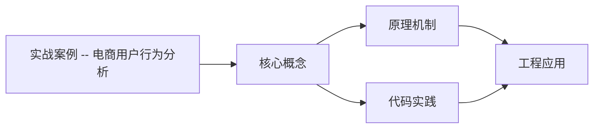

## 1. 学习目标（Bloom 分类）

本节按照布鲁姆教育目标分类学组织学习路径。本文主题为《实战案例 -- 电商用户行为分析》，属于 数据分析 模块，读者可以根据自身阶段选择阅读深度。

记忆层面：能够准确复述本文的核心概念、术语与基本语法或操作步骤，并能够在提问或检索时快速定位对应知识点。能够说出 数据分析 的核心概念、常用命令与流程。

理解层面：能够用自己的语言解释核心原理与工作机制，说明概念之间的因果关系，而不是机械记忆结论。能够解释 数据分析 的工作原理与设计动机。

应用层面：能够在真实项目或练习场景中运用本文知识解决具体问题，写出正确且可维护的实现。能够独立完成 数据分析 的标准操作。

分析层面：能够拆解复杂问题，比较本文主题与相邻概念的异同，识别边界条件与例外情况。能够分析 数据分析 使用中的异常与边界。

评价层面：能够根据约束条件（性能、可读性、安全、成本）评价不同方案的优劣，做出有依据的技术决策。能够评价 数据分析 相关工具与方案。

创造层面：能够把本文知识与其他模块知识组合，设计出新的解决方案或可复用的工程模式。能够把 数据分析 融入团队工作流。

通过本节学习，读者应当能够把《实战案例 -- 电商用户行为分析》纳入自己的知识网络，并与 数据分析 模块的其他主题（数据清洗、可视化、统计、报告）建立关联。

## 2. 历史动机与发展脉络

《实战案例 -- 电商用户行为分析》是 数据分析 领域的重要主题。要真正理解它，需要先了解它解决的问题与演进过程。

数据分析是从数据中提取决策信息的工程过程：定义问题 -> 采集 -> 清洗 -> 探索 -> 建模 -> 可视化 -> 报告。
工具链：Python（Pandas/NumPy）、SQL、Jupyter、BI（Tableau/PowerBI）；Excel 仍是轻量入口。
方法：描述性分析（发生了什么）、诊断（为什么）、预测（会怎样）、规范（该怎么办）。

回到本文主题：实战案例 -- 电商用户行为分析 的提出与成熟，正是上述技术背景下的必然产物。早期实现往往以简单可用为目标，随着工程规模扩大，社区逐渐沉淀出标准做法与最佳实践；理解这一脉络，可以帮助读者判断“为什么文档中的推荐写法是现在这个样子”，也能在遇到历史遗留代码时准确识别其设计年代与取舍。


## 3. 形式化定义与核心概念精讲

本节把《实战案例 -- 电商用户行为分析》涉及的核心概念以“定义 + 讲解”的形式展开。读者应把定义当作工具，把讲解当作理解路径；两者结合才能形成可迁移的知识。

数据形态：表格（结构化）、序列（时间）、文本、图像；分析前确定数据类型（数值/类别/顺序）。
清洗：缺失值（删除/填充）、异常值（IQR/z-score）、重复、类型转换；清洗决定结果可信度。
探索性分析（EDA）：分布（直方图）、集中趋势（均值/中位数）、离散（方差/IQR）、相关性。

### 3.1 原文章节逐一精讲

原文档把主题拆分为 12 个小节，下面按顺序给出每一节的导读讲解，随后保留原文细节供精读。

#### 原文精读（完整保留）


#### 1. 项目背景与问题定义

##### 1.1 业务背景

某电商平台希望了解用户行为模式，优化运营策略。具体业务问题：

1. 用户消费金额的分布特征是什么？
2. 不同时段的用户行为是否有显著差异？
3. 哪些因素与用户留存相关？
4. 如何基于用户行为进行分群？

##### 1.2 问题定义（SMART 原则）

| 问题     | Specific             | Measurable         | Achievable     | Relevant       | Time-bound  |
| -------- | -------------------- | ------------------ | -------------- | -------------- | ----------- |
| 消费分布 | 描述消费金额分布     | 均值/中位数/分位数 | 有交易数据     | 理解用户消费力 | 近6个月数据 |
| 时段差异 | 工作日vs周末消费差异 | t检验p值           | 有时间标签     | 优化促销时段   | 近6个月数据 |
| 留存因素 | 首次消费额与留存关系 | 相关系数           | 有首次消费记录 | 提升留存率     | 近6个月数据 |
| 用户分群 | 基于RFM分群          | 分群数量和特征     | 有消费记录     | 精准营销       | 近6个月数据 |

> 跨模块参考：本案例综合运用 [pandas.md](pandas.md) 数据处理、[statistics.md](statistics.md) 统计检验、[seaborn.md](seaborn.md) 可视化、[data-cleaning.md](data-cleaning.md) 数据清洗。

---

#### 2. 数据加载与初探

##### 2.1 模拟数据生成

由于本案例为教学示例，我们生成模拟数据：

```python
import numpy as np
import pandas as pd
from datetime import datetime, timedelta

rng = np.random.default_rng(42)

n_users = 500
n_orders = 3000

user_ids = rng.integers(1000, 9999, size=n_users)
user_table = pd.DataFrame({
    'user_id': user_ids,
    'gender': rng.choice(['M', 'F'], size=n_users, p=[0.45, 0.55]),
    'age': rng.integers(18, 65, size=n_users),
    'city_tier': rng.choice([1, 2, 3], size=n_users, p=[0.3, 0.4, 0.3]),
    'register_date': pd.to_datetime('2023-01-01') + pd.to_timedelta(
        rng.integers(0, 365, size=n_users), unit='D'
    )
})

base_date = pd.to_datetime('2023-07-01')
order_table = pd.DataFrame({
    'order_id': range(10001, 10001 + n_orders),
    'user_id': rng.choice(user_ids, size=n_orders),
    'order_date': base_date + pd.to_timedelta(rng.integers(0, 180, size=n_orders), unit='D'),
    'amount': np.round(np.maximum(rng.exponential(scale=200, size=n_orders), 10), 2),
    'category': rng.choice(['Electronics', 'Clothing', 'Food', 'Home', 'Beauty'],
                           size=n_orders, p=[0.2, 0.25, 0.2, 0.15, 0.2]),
    'payment_method': rng.choice(['Credit Card', 'Debit Card', 'E-Wallet', 'Cash on Delivery'],
                                 size=n_orders, p=[0.35, 0.2, 0.3, 0.15]),
    'is_returned': rng.choice([0, 1], size=n_orders, p=[0.9, 0.1])
})

print(f"用户表: {user_table.shape}")
print(f"订单表: {order_table.shape}")
print(f"\n用户表前5行:\n{user_table.head()}")
print(f"\n订单表前5行:\n{order_table.head()}")
```

**输出说明**：生成了 500 个用户和 3000 条订单的模拟数据。用户表包含人口统计信息，订单表包含消费行为信息。数据结构与真实电商场景一致。

##### 2.2 数据初探

```python
print("=== 用户表概览 ===")
print(user_table.info())
print(f"\n描述统计:\n{user_table.describe()}")

print("\n=== 订单表概览 ===")
print(order_table.info())
print(f"\n描述统计:\n{order_table.describe()}")
print(f"\n缺失值:\n{order_table.isna().sum()}")
```

**输出说明**：`info()` 查看数据类型和非空值数量，`describe()` 查看数值列的统计摘要，`isna().sum()` 检查缺失值。这是每次拿到新数据后的标准操作。

---

#### 3. 数据清洗

##### 3.1 数据合并

```python
df = pd.merge(order_table, user_table, on='user_id', how='left')
print(f"合并后: {df.shape}")
print(f"缺失值:\n{df.isna().sum()}")
```

**输出说明**：将订单表与用户表通过 `user_id` 进行左连接，使每条订单附带用户信息。检查是否有订单的 user_id 在用户表中不存在。

##### 3.2 特征工程

```python
df['order_month'] = df['order_date'].dt.to_period('M')
df['order_weekday'] = df['order_date'].dt.day_name()
df['is_weekend'] = df['order_date'].dt.dayofweek >= 5
df['hour_period'] = pd.cut(
    df['order_date'].dt.hour,
    bins=[0, 6, 12, 18, 24],
    labels=['Night', 'Morning', 'Afternoon', 'Evening'],
    right=False
)

df['age_group'] = pd.cut(
    df['age'],
    bins=[17, 25, 35, 45, 65],
    labels=['18-25', '26-35', '36-45', '46-65']
)

print(f"新增特征后: {df.shape}")
print(f"\n时段分布:\n{df['hour_period'].value_counts()}")
print(f"\n年龄组分布:\n{df['age_group'].value_counts()}")
```

**输出说明**：从原始字段派生出更有分析价值的特征：

- `order_month`：月份，用于趋势分析
- `is_weekend`：是否周末，用于时段对比
- `hour_period`：时段分类，用于行为模式分析
- `age_group`：年龄段，用于人群对比

> **为什么特征工程在清洗阶段做？** 原始数据往往不直接包含分析所需的维度。特征工程将原始字段转化为可分析的维度，是连接"数据"和"分析"的桥梁。

##### 3.3 异常值检查

```python
Q1 = df['amount'].quantile(0.25)
Q3 = df['amount'].quantile(0.75)
IQR = Q3 - Q1
lower = Q1 - 1.5 * IQR
upper = Q3 + 1.5 * IQR

outliers = df[df['amount'] > upper]
print(f"消费金额异常值: {len(outliers)} 条 ({len(outliers)/len(df)*100:.1f}%)")
print(f"异常值金额范围: [{outliers['amount'].min():.2f}, {outliers['amount'].max():.2f}]")

import seaborn as sns
import matplotlib.pyplot as plt

fig, ax = plt.subplots(figsize=(10, 4))
sns.boxplot(x=df['amount'], ax=ax)
ax.set_title('Order Amount Distribution (Box Plot)')
plt.show()
```

**输出说明**：指数分布生成的消费金额天然右偏，IQR 方法会标记较多"异常值"。在电商场景中，高消费用户（VIP）不应被视为异常值删除，而是单独分析。因此这里保留所有数据。

---

#### 4. 探索性数据分析

##### 4.1 消费金额分布

```python
import seaborn as sns
import matplotlib.pyplot as plt

fig, axes = plt.subplots(1, 2, figsize=(14, 5))

sns.histplot(df['amount'], bins=50, kde=True, ax=axes[0])
axes[0].axvline(df['amount'].mean(), color='red', linestyle='--', label=f"Mean: {df['amount'].mean():.0f}")
axes[0].axvline(df['amount'].median(), color='green', linestyle='--', label=f"Median: {df['amount'].median():.0f}")
axes[0].set_title('Order Amount Distribution')
axes[0].legend()

sns.histplot(np.log1p(df['amount']), bins=50, kde=True, ax=axes[1], color='darkorange')
axes[1].set_title('Log-Transformed Amount Distribution')

plt.tight_layout()
plt.show()

print(f"均值: {df['amount'].mean():.2f}")
print(f"中位数: {df['amount'].median():.2f}")
print(f"偏度: {df['amount'].skew():.2f}")
print(f"峰度: {df['amount'].kurtosis():.2f}")
```

**输出说明**：

- 消费金额呈右偏分布（偏度 > 0），均值 > 中位数
- 对数变换后分布更接近正态，便于后续统计检验
- 右偏分布是消费数据的典型特征——少数用户贡献大部分收入

> **为什么消费数据总是右偏？** 消费金额有下界（最低消费）但无上界，少数高消费用户拉长了右侧尾部。这种分布符合帕累托法则（80/20 法则），在电商分析中极为常见。

##### 4.2 月度趋势

```python
import seaborn as sns
import matplotlib.pyplot as plt

monthly = df.groupby('order_month').agg(
    order_count=('order_id', 'count'),
    total_amount=('amount', 'sum'),
    avg_amount=('amount', 'mean')
).reset_index()
monthly['order_month'] = monthly['order_month'].astype(str)

fig, ax1 = plt.subplots(figsize=(12, 5))

color1 = 'steelblue'
ax1.bar(monthly['order_month'], monthly['order_count'], color=color1, alpha=0.6, label='Order Count')
ax1.set_ylabel('Order Count', color=color1)
ax1.tick_params(axis='y', labelcolor=color1)

ax2 = ax1.twinx()
color2 = 'darkorange'
ax2.plot(monthly['order_month'], monthly['total_amount'], color=color2, marker='o', linewidth=2, label='Total Amount')
ax2.set_ylabel('Total Amount', color=color2)
ax2.tick_params(axis='y', labelcolor=color2)

ax1.set_title('Monthly Order Trends')
ax1.set_xlabel('Month')

lines1, labels1 = ax1.get_legend_handles_labels()
lines2, labels2 = ax2.get_legend_handles_labels()
ax1.legend(lines1 + lines2, labels1 + labels2, loc='upper left')

plt.tight_layout()
plt.show()
```

**输出说明**：双轴图同时展示订单量（柱状图）和总消费额（折线图）的月度趋势。如果两个指标走势不一致，说明客单价在变化。

##### 4.3 品类与支付方式

```python
import seaborn as sns
import matplotlib.pyplot as plt

fig, axes = plt.subplots(1, 2, figsize=(14, 5))

cat_stats = df.groupby('category')['amount'].agg(['mean', 'sum', 'count']).sort_values('sum', ascending=False)
sns.barplot(data=cat_stats.reset_index(), x='category', y='sum', ax=axes[0], palette='Set2')
axes[0].set_title('Total Revenue by Category')
axes[0].set_ylabel('Total Amount')

payment_counts = df['payment_method'].value_counts()
axes[1].pie(payment_counts, labels=payment_counts.index, autopct='%1.1f%%',
            colors=sns.color_palette('Set2', len(payment_counts)))
axes[1].set_title('Payment Method Distribution')

plt.tight_layout()
plt.show()
```

**输出说明**：左图展示各品类总销售额，右图展示支付方式占比。这些信息直接影响品类运营策略和支付渠道优化。

##### 4.4 用户维度分析

```python
import seaborn as sns
import matplotlib.pyplot as plt

fig, axes = plt.subplots(1, 3, figsize=(18, 5))

sns.boxplot(data=df, x='gender', y='amount', ax=axes[0])
axes[0].set_title('Amount by Gender')

sns.boxplot(data=df, x='age_group', y='amount', ax=axes[1])
axes[1].set_title('Amount by Age Group')

sns.boxplot(data=df, x='city_tier', y='amount', ax=axes[2])
axes[2].set_title('Amount by City Tier')
axes[2].set_xticklabels(['Tier 1', 'Tier 2', 'Tier 3'])

plt.tight_layout()
plt.show()
```

**输出说明**：箱线图对比不同用户群体的消费金额分布。如果某群体的中位数明显高于其他群体，说明该群体是高价值用户。

---

#### 5. 统计检验

##### 5.1 工作日 vs 周末消费差异

```python
from scipy import stats
import numpy as np

weekday = df[df['is_weekend'] == False]['amount']
weekend = df[df['is_weekend'] == True]['amount']

print(f"工作日: n={len(weekday)}, mean={weekday.mean():.2f}, median={weekday.median():.2f}")
print(f"周末:   n={len(weekend)}, mean={weekend.mean():.2f}, median={weekend.median():.2f}")

t_stat, p_value = stats.ttest_ind(weekday, weekend)
print(f"\nt检验: t={t_stat:.4f}, p={p_value:.4f}")

u_stat, p_mann = stats.mannwhitneyu(weekday, weekend)
print(f"Mann-Whitney U: U={u_stat:.1f}, p={p_mann:.4f}")

cohen_d = (weekday.mean() - weekend.mean()) / np.sqrt(
    (weekday.std(ddof=1)**2 + weekend.std(ddof=1)**2) / 2
)
print(f"Cohen's d: {abs(cohen_d):.3f}")
```

**输出说明**：

- t 检验假设正态分布，消费金额右偏时可能不可靠
- Mann-Whitney U 检验不要求数据正态，更适合此场景
- Cohen's d 衡量效应量，判断差异是否有实际意义
- 如果 p < 0.05 但 Cohen's d < 0.2，差异统计显著但实际意义不大

##### 5.2 性别消费差异

```python
from scipy import stats

male = df[df['gender'] == 'M']['amount']
female = df[df['gender'] == 'F']['amount']

t_stat, p_value = stats.ttest_ind(male, female)
print(f"性别消费差异: t={t_stat:.4f}, p={p_value:.4f}")

if p_value < 0.05:
    print("结论: 男女消费金额有显著差异")
else:
    print("结论: 不能拒绝H0，男女消费金额无显著差异")
```

**输出说明**：t 检验判断两组均值差异是否统计显著。在 A/B 测试中，这是判断实验效果是否真实的标准方法。

##### 5.3 品类消费差异（ANOVA）

```python
from scipy import stats

groups = [group['amount'].values for _, group in df.groupby('category')]
f_stat, p_value = stats.f_oneway(*groups)
print(f"ANOVA: F={f_stat:.4f}, p={p_value:.4f}")

if p_value < 0.05:
    print("结论: 至少两个品类的平均消费金额有显著差异")
else:
    print("结论: 品类间消费金额无显著差异")
```

**输出说明**：ANOVA 检验多组均值是否有显著差异。如果结果显著，需要事后比较（如 Tukey HSD）确定具体哪两组不同。

---

#### 6. 用户分群分析

##### 6.1 基于消费行为的分群

```python
import pandas as pd
import numpy as np

user_stats = df.groupby('user_id').agg(
    order_count=('order_id', 'count'),
    total_amount=('amount', 'sum'),
    avg_amount=('amount', 'mean'),
    category_variety=('category', 'nunique'),
    return_rate=('is_returned', 'mean')
).reset_index()

user_stats['frequency_segment'] = pd.cut(
    user_stats['order_count'],
    bins=[0, 3, 7, 15, 100],
    labels=['Low', 'Medium', 'High', 'Very High']
)

user_stats['value_segment'] = pd.qcut(
    user_stats['total_amount'],
    q=4,
    labels=['Bronze', 'Silver', 'Gold', 'Platinum']
)

print(f"频次分群:\n{user_stats['frequency_segment'].value_counts()}")
print(f"\n价值分群:\n{user_stats['value_segment'].value_counts()}")
```

**输出说明**：

- 频次分群基于订单数量，使用固定阈值
- 价值分群基于总消费额，使用四分位数确保每组人数相近
- 两种分群可以交叉，形成更精细的用户画像

##### 6.2 分群可视化

```python
import seaborn as sns
import matplotlib.pyplot as plt

fig, axes = plt.subplots(1, 2, figsize=(14, 5))

cross_tab = pd.crosstab(user_stats['frequency_segment'], user_stats['value_segment'])
sns.heatmap(cross_tab, annot=True, fmt='d', cmap='YlOrRd', ax=axes[0])
axes[0].set_title('Frequency vs Value Segment')

sns.scatterplot(data=user_stats, x='order_count', y='total_amount',
                hue='value_segment', alpha=0.6, ax=axes[1])
axes[1].set_title('Order Count vs Total Amount')
axes[1].set_xlabel('Order Count')
axes[1].set_ylabel('Total Amount')

plt.tight_layout()
plt.show()
```

**输出说明**：热力图展示频次和价值分群的交叉分布，散点图展示订单数与总消费额的关系。高价值用户通常也是高频用户，但并非总是如此。

---

#### 7. 漏斗分析

##### 7.1 转化漏斗

```python
import pandas as pd
import matplotlib.pyplot as plt
import numpy as np

total_users = len(user_table)
purchased_users = df['user_id'].nunique()
repeat_users = df.groupby('user_id').filter(lambda x: len(x) > 1)['user_id'].nunique()
high_value_users = user_stats[user_stats['value_segment'] == 'Platinum']['user_id'].nunique()

funnel = pd.DataFrame({
    'stage': ['Registered', 'Purchased', 'Repeat Purchase', 'High Value'],
    'count': [total_users, purchased_users, repeat_users, high_value_users]
})
funnel['rate'] = funnel['count'] / funnel['count'].iloc[0] * 100
funnel['drop_rate'] = funnel['rate'].diff().fillna(0)

print(funnel)

fig, ax = plt.subplots(figsize=(10, 6))
bars = ax.barh(funnel['stage'][::-1], funnel['count'][::-1], color=['#4C72B0', '#55A868', '#DD8452', '#C44E52'])

for bar, count, rate in zip(bars, funnel['count'][::-1], funnel['rate'][::-1]):
    ax.text(bar.get_width() + 5, bar.get_y() + bar.get_height()/2,
            f'{count} ({rate:.1f}%)', va='center')

ax.set_title('User Conversion Funnel')
ax.set_xlabel('Number of Users')
plt.tight_layout()
plt.show()
```

**输出说明**：漏斗分析展示用户从注册到高价值用户的转化路径。每一步的流失率指示了优化方向——流失最大的环节是优先改进的目标。

> **漏斗分析的关键指标**：
>
> - 整体转化率：最终环节 / 最初环节
> - 环节转化率：下一环节 / 当前环节
> - 最大流失环节：转化率最低的相邻环节

---

#### 8. RFM 模型

##### 8.1 RFM 指标计算

RFM 是用户价值分析的经典模型：

| 指标      | 含义                 | 计算方式                    |
| --------- | -------------------- | --------------------------- |
| Recency   | 最近一次消费距今多久 | 当前日期 - 最后一次消费日期 |
| Frequency | 消费频次             | 订单数量                    |
| Monetary  | 消费金额             | 总消费额                    |

```python
import pandas as pd
import numpy as np

analysis_date = df['order_date'].max() + pd.Timedelta(days=1)

rfm = df.groupby('user_id').agg(
    recency=('order_date', lambda x: (analysis_date - x.max()).days),
    frequency=('order_id', 'count'),
    monetary=('amount', 'sum')
).reset_index()

rfm['R_score'] = pd.qcut(rfm['recency'], q=5, labels=[5, 4, 3, 2, 1]).astype(int)
rfm['F_score'] = pd.qcut(rfm['frequency'].rank(method='first'), q=5, labels=[1, 2, 3, 4, 5]).astype(int)
rfm['M_score'] = pd.qcut(rfm['monetary'], q=5, labels=[1, 2, 3, 4, 5]).astype(int)

rfm['RFM_score'] = rfm['R_score'] * 100 + rfm['F_score'] * 10 + rfm['M_score']

print(f"RFM 统计:\n{rfm['recency', 'frequency', 'monetary']('recency', 'frequency', 'monetary').describe()}")
print(f"\nRFM 评分分布:\n{rfm['R_score', 'F_score', 'M_score']('R_score', 'F_score', 'M_score').describe()}")
```

**输出说明**：

- Recency 越小越好，所以 R_score 用反向标签（天数越少分数越高）
- Frequency 和 Monetary 越大越好，正向标签
- RFM_score 是三位数组合，如 555 表示最高价值用户

##### 8.2 RFM 分群

```python
import pandas as pd
import numpy as np

def rfm_segment(row):
    if row['R_score'] >= 4 and row['F_score'] >= 4 and row['M_score'] >= 4:
        return 'Champions'
    elif row['R_score'] >= 3 and row['F_score'] >= 3:
        return 'Loyal Customers'
    elif row['R_score'] >= 4 and row['F_score'] <= 2:
        return 'New Customers'
    elif row['R_score'] <= 2 and row['F_score'] >= 3:
        return 'At Risk'
    elif row['R_score'] <= 2 and row['F_score'] <= 2:
        return 'Lost'
    else:
        return 'Need Attention'

rfm['segment'] = rfm.apply(rfm_segment, axis=1)

segment_stats = rfm.groupby('segment').agg(
    count=('user_id', 'count'),
    avg_monetary=('monetary', 'mean'),
    avg_frequency=('frequency', 'mean')
).round(2)
print(segment_stats.sort_values('count', ascending=False))
```

**输出说明**：RFM 分群将用户分为 6 个群体：

- **Champions**：最近消费、高频、高消费——最优质用户
- **Loyal Customers**：稳定消费——维护对象
- **New Customers**：刚消费但频次低——培育对象
- **At Risk**：曾经高频但最近未消费——挽回对象
- **Lost**：长期未消费且频次低——流失用户
- **Need Attention**：其他——需进一步分析

##### 8.3 RFM 可视化

```python
import seaborn as sns
import matplotlib.pyplot as plt

fig, axes = plt.subplots(1, 2, figsize=(14, 6))

segment_counts = rfm['segment'].value_counts()
colors = {'Champions': '#55A868', 'Loyal Customers': '#4C72B0', 'New Customers': '#64B5F6',
          'At Risk': '#DD8452', 'Lost': '#C44E52', 'Need Attention': '#8172B2'}

axes[0].barh(segment_counts.index, segment_counts.values,
             color=[colors.get(s, 'gray') for s in segment_counts.index])
axes[0].set_title('User Count by RFM Segment')
axes[0].set_xlabel('Number of Users')

sns.scatterplot(data=rfm, x='recency', y='monetary',
                hue='segment', alpha=0.6, ax=axes[1],
                palette=colors)
axes[1].set_title('Recency vs Monetary by Segment')
axes[1].set_xlabel('Recency (days)')
axes[1].set_ylabel('Monetary ($)')

plt.tight_layout()
plt.show()
```

**输出说明**：左图展示各分群的用户数量，右图展示 Recency 与 Monetary 的关系。Champions 集中在左上角（低 Recency、高 Monetary），Lost 集中在右下角。

---

#### 9. 结论与建议

##### 9.1 核心发现

| 发现            | 证据                       | 业务含义                           |
| --------------- | -------------------------- | ---------------------------------- |
| 消费金额右偏    | 偏度 > 0，均值远大于中位数 | 少数高消费用户贡献大部分收入       |
| 品类消费差异    | ANOVA p < 0.05             | 不同品类客单价差异大，需差异化运营 |
| 工作日/周末差异 | t 检验/Mann-Whitney U      | 可针对高消费时段加大促销力度       |
| 用户分层明显    | RFM 分群 6 类              | 不同群体需不同运营策略             |

##### 9.2 行动建议

| 目标群体        | 策略                       | 预期效果               |
| --------------- | -------------------------- | ---------------------- |
| Champions       | VIP 专属权益、新品优先体验 | 维持高价值、提升满意度 |
| Loyal Customers | 会员积分、定期优惠券       | 提升消费频次           |
| New Customers   | 首单优惠、品类推荐         | 提升复购率             |
| At Risk         | 召回活动、个性化推荐       | 降低流失率             |
| Lost            | 低成本触达（邮件/短信）    | 尝试挽回               |

##### 9.3 后续分析方向

- **A/B 测试**：对 At Risk 用户测试不同召回策略的效果
- **时间序列预测**：预测未来月度 GMV 趋势
- **推荐系统**：基于用户品类偏好做个性化推荐
- **归因分析**：分析不同渠道的转化贡献

---

#### 10. 项目复盘

##### 10.1 常见错误与规避

| 错误         | 描述                   | 规避方法           |
| ------------ | ---------------------- | ------------------ |
| 跳过问题定义 | 直接分析数据           | 先写 SMART 问题    |
| 忽视数据偏态 | 对右偏数据用均值       | 优先看中位数       |
| 相关当因果   | 发现关联就下因果结论   | 用 A/B 测试验证    |
| 忽视效应量   | 只看 p 值              | 同时报告 Cohen's d |
| 过度拟合     | 在同一数据上检验和建模 | 留出测试集         |

##### 10.2 分析报告结构

一份完整的数据分析报告应包含：

```
1. 执行摘要（1页）
   - 核心发现（3-5条）
   - 关键建议（2-3条）

2. 背景与方法
   - 业务问题
   - 数据来源与范围
   - 分析方法

3. 分析过程
   - 数据质量评估
   - EDA 发现
   - 统计检验结果

4. 结论与建议
   - 数据驱动的结论
   - 可执行的建议
   - 预期影响

5. 附录
   - 技术细节
   - 完整图表
   - 数据字典
```

---

#### 11. 速查表

##### 11.1 项目流程速查

```
1. 定义问题 -> SMART 原则
2. 加载数据 -> read_csv / read_sql / 模拟生成
3. 数据初探 -> info / describe / head
4. 数据清洗 -> 缺失值 / 异常值 / 类型转换 / 特征工程
5. EDA -> 分布 / 趋势 / 对比 / 相关
6. 统计检验 -> t检验 / ANOVA / 卡方
7. 深度分析 -> 分群 / 漏斗 / RFM
8. 结论建议 -> 发现 -> 策略 -> 预期效果
```

##### 11.2 常用聚合模式

```python
df.groupby('dim').agg(
    metric1=('col1', 'mean'),
    metric2=('col2', 'sum'),
    metric3=('col3', 'count'),
    metric4=('col4', 'nunique')
)
```

##### 11.3 可视化选择

| 分析目标   | 图表            | 代码                           |
| ---------- | --------------- | ------------------------------ |
| 单变量分布 | 直方图+KDE      | `sns.histplot(kde=True)`       |
| 组间对比   | 箱线图          | `sns.boxplot(x, y)`            |
| 趋势变化   | 折线图          | `ax.plot()`                    |
| 占比构成   | 饼图/堆叠柱状图 | `ax.pie()` / `ax.bar(stacked)` |
| 多变量关系 | 散点图          | `sns.scatterplot(x, y, hue)`   |
| 相关矩阵   | 热力图          | `sns.heatmap(corr)`            |
| 转化路径   | 漏斗图          | 水平柱状图                     |

---

#### 12. 延伸阅读

- Python for Data Analysis 第 3 版 (Wes McKinney) -- 真实数据案例
- Storytelling with Data (Cole Nussbaumer Knaflic) -- 数据叙事
- Lean Analytics (Alistair Croll) -- 创业数据分析框架
- Kaggle 竞赛案例：https://www.kaggle.com/competitions


### 3.2 概念关系图

下面用 Mermaid 图表达本文核心概念之间的关系，帮助读者建立整体图景：



图中展示的是本文知识的结构化关系：核心概念是入口，原理机制解释“为什么”，代码实践演示“怎么做”，工程应用回答“何时用”。读者学习时可以把每个小节的内容挂接到对应节点上。

## 4. 理论推导与原理解析

本节深入《实战案例 -- 电商用户行为分析》背后的原理。理论部分不求面面俱到，而是聚焦“能解释现象、能指导实践”的关键推导。

数据形态：表格（结构化）、序列（时间）、文本、图像；分析前确定数据类型（数值/类别/顺序）。
清洗：缺失值（删除/填充）、异常值（IQR/z-score）、重复、类型转换；清洗决定结果可信度。
探索性分析（EDA）：分布（直方图）、集中趋势（均值/中位数）、离散（方差/IQR）、相关性。
可视化原则：图型匹配数据（趋势折线、比较柱状、构成饼/堆叠、关系散点），标注与叙事。

需要强调的是，理论推导与工程实践之间存在翻译层：理论给出的是理想化模型与边界条件，工程代码则必须处理真实环境中的例外。读者在学习时应先掌握理论的“标准情形”，再通过陷阱章节了解“非标准情形”。

## 5. 代码示例与逐行讲解

本节把原文中的代码示例系统整理，并为每个示例补充用途说明与讲解。读者不应只浏览代码，而应逐段对照讲解理解设计意图。

### 5.1 示例：2.1 模拟数据生成

该示例来自原文《2.1 模拟数据生成》小节，用于演示实战案例 -- 电商用户行为分析相关操作。阅读时请先看代码结构，再看其后的讲解。

```python
import numpy as np
import pandas as pd
from datetime import datetime, timedelta

rng = np.random.default_rng(42)

n_users = 500
n_orders = 3000

user_ids = rng.integers(1000, 9999, size=n_users)
user_table = pd.DataFrame({
    'user_id': user_ids,
    'gender': rng.choice(['M', 'F'], size=n_users, p=[0.45, 0.55]),
    'age': rng.integers(18, 65, size=n_users),
    'city_tier': rng.choice([1, 2, 3], size=n_users, p=[0.3, 0.4, 0.3]),
    'register_date': pd.to_datetime('2023-01-01') + pd.to_timedelta(
        rng.integers(0, 365, size=n_users), unit='D'
    )
})

base_date = pd.to_datetime('2023-07-01')
order_table = pd.DataFrame({
    'order_id': range(10001, 10001 + n_orders),
    'user_id': rng.choice(user_ids, size=n_orders),
    'order_date': base_date + pd.to_timedelta(rng.integers(0, 180, size=n_orders), unit='D'),
    'amount': np.round(np.maximum(rng.exponential(scale=200, size=n_orders), 10), 2),
    'category': rng.choice(['Electronics', 'Clothing', 'Food', 'Home', 'Beauty'],
                           size=n_orders, p=[0.2, 0.25, 0.2, 0.15, 0.2]),
    'payment_method': rng.choice(['Credit Card', 'Debit Card', 'E-Wallet', 'Cash on Delivery'],
                                 size=n_orders, p=[0.35, 0.2, 0.3, 0.15]),
    'is_returned': rng.choice([0, 1], size=n_orders, p=[0.9, 0.1])
})

print(f"用户表: {user_table.shape}")
print(f"订单表: {order_table.shape}")
print(f"\n用户表前5行:\n{user_table.head()}")
print(f"\n订单表前5行:\n{order_table.head()}")
```

讲解：这段代码演示了本节核心知识点。代码中的关键操作可以归纳为三步：准备（定义或初始化）、执行（核心逻辑）、收尾（释放资源或返回结果）。实际项目中，这三步往往被封装为函数或类，以提升复用性与可测试性。

关键点分析：

该示例共 32 行有效代码，包含 3 类关键结构（import、from、return）。其中：

- 入口与初始化部分负责建立上下文，对应实际项目中的启动或装配逻辑；
- 核心逻辑部分体现本文主题的主要操作，是阅读时最需要对照讲解理解的部分；
- 输出或返回部分把结果交给调用方，注意其类型与边界条件。

进阶思考路径：先尝试修改参数观察行为变化，再把示例中的模式迁移到自己的项目中；每次修改都记录预期与实测差异，这是把示例转化为能力的最快方式。

### 5.2 示例：2.2 数据初探

该示例来自原文《2.2 数据初探》小节，用于演示实战案例 -- 电商用户行为分析相关操作。阅读时请先看代码结构，再看其后的讲解。

```python
print("=== 用户表概览 ===")
print(user_table.info())
print(f"\n描述统计:\n{user_table.describe()}")

print("\n=== 订单表概览 ===")
print(order_table.info())
print(f"\n描述统计:\n{order_table.describe()}")
print(f"\n缺失值:\n{order_table.isna().sum()}")
```

讲解：这段代码演示了本节核心知识点。代码中的关键操作可以归纳为三步：准备（定义或初始化）、执行（核心逻辑）、收尾（释放资源或返回结果）。实际项目中，这三步往往被封装为函数或类，以提升复用性与可测试性。

关键点分析：

该示例共 7 行有效代码，结构以数据或配置为主。阅读时应关注：数据字段的含义、配置项的作用，以及它们与运行行为的对应关系。

进阶思考路径：先尝试修改参数观察行为变化，再把示例中的模式迁移到自己的项目中；每次修改都记录预期与实测差异，这是把示例转化为能力的最快方式。

### 5.3 示例：3.1 数据合并

该示例来自原文《3.1 数据合并》小节，用于演示实战案例 -- 电商用户行为分析相关操作。阅读时请先看代码结构，再看其后的讲解。

```python
df = pd.merge(order_table, user_table, on='user_id', how='left')
print(f"合并后: {df.shape}")
print(f"缺失值:\n{df.isna().sum()}")
```

讲解：这段代码演示了本节核心知识点。代码中的关键操作可以归纳为三步：准备（定义或初始化）、执行（核心逻辑）、收尾（释放资源或返回结果）。实际项目中，这三步往往被封装为函数或类，以提升复用性与可测试性。

关键点分析：

该示例共 3 行有效代码，结构以数据或配置为主。阅读时应关注：数据字段的含义、配置项的作用，以及它们与运行行为的对应关系。

进阶思考路径：先尝试修改参数观察行为变化，再把示例中的模式迁移到自己的项目中；每次修改都记录预期与实测差异，这是把示例转化为能力的最快方式。

### 5.4 示例：3.2 特征工程

该示例来自原文《3.2 特征工程》小节，用于演示实战案例 -- 电商用户行为分析相关操作。阅读时请先看代码结构，再看其后的讲解。

```python
df['order_month'] = df['order_date'].dt.to_period('M')
df['order_weekday'] = df['order_date'].dt.day_name()
df['is_weekend'] = df['order_date'].dt.dayofweek >= 5
df['hour_period'] = pd.cut(
    df['order_date'].dt.hour,
    bins=[0, 6, 12, 18, 24],
    labels=['Night', 'Morning', 'Afternoon', 'Evening'],
    right=False
)

df['age_group'] = pd.cut(
    df['age'],
    bins=[17, 25, 35, 45, 65],
    labels=['18-25', '26-35', '36-45', '46-65']
)

print(f"新增特征后: {df.shape}")
print(f"\n时段分布:\n{df['hour_period'].value_counts()}")
print(f"\n年龄组分布:\n{df['age_group'].value_counts()}")
```

讲解：这段代码演示了本节核心知识点。代码中的关键操作可以归纳为三步：准备（定义或初始化）、执行（核心逻辑）、收尾（释放资源或返回结果）。实际项目中，这三步往往被封装为函数或类，以提升复用性与可测试性。

关键点分析：

该示例共 17 行有效代码，结构以数据或配置为主。阅读时应关注：数据字段的含义、配置项的作用，以及它们与运行行为的对应关系。

进阶思考路径：先尝试修改参数观察行为变化，再把示例中的模式迁移到自己的项目中；每次修改都记录预期与实测差异，这是把示例转化为能力的最快方式。

### 5.5 示例：3.3 异常值检查

该示例来自原文《3.3 异常值检查》小节，用于演示实战案例 -- 电商用户行为分析相关操作。阅读时请先看代码结构，再看其后的讲解。

```python
Q1 = df['amount'].quantile(0.25)
Q3 = df['amount'].quantile(0.75)
IQR = Q3 - Q1
lower = Q1 - 1.5 * IQR
upper = Q3 + 1.5 * IQR

outliers = df[df['amount'] > upper]
print(f"消费金额异常值: {len(outliers)} 条 ({len(outliers)/len(df)*100:.1f}%)")
print(f"异常值金额范围: [{outliers['amount'].min():.2f}, {outliers['amount'].max():.2f}]")

import seaborn as sns
import matplotlib.pyplot as plt

fig, ax = plt.subplots(figsize=(10, 4))
sns.boxplot(x=df['amount'], ax=ax)
ax.set_title('Order Amount Distribution (Box Plot)')
plt.show()
```

讲解：这段代码演示了本节核心知识点。代码中的关键操作可以归纳为三步：准备（定义或初始化）、执行（核心逻辑）、收尾（释放资源或返回结果）。实际项目中，这三步往往被封装为函数或类，以提升复用性与可测试性。

关键点分析：

该示例共 14 行有效代码，包含 1 类关键结构（import）。其中：

- 入口与初始化部分负责建立上下文，对应实际项目中的启动或装配逻辑；
- 核心逻辑部分体现本文主题的主要操作，是阅读时最需要对照讲解理解的部分；
- 输出或返回部分把结果交给调用方，注意其类型与边界条件。

进阶思考路径：先尝试修改参数观察行为变化，再把示例中的模式迁移到自己的项目中；每次修改都记录预期与实测差异，这是把示例转化为能力的最快方式。

### 5.6 示例：4.1 消费金额分布

该示例来自原文《4.1 消费金额分布》小节，用于演示实战案例 -- 电商用户行为分析相关操作。阅读时请先看代码结构，再看其后的讲解。

```python
import seaborn as sns
import matplotlib.pyplot as plt

fig, axes = plt.subplots(1, 2, figsize=(14, 5))

sns.histplot(df['amount'], bins=50, kde=True, ax=axes[0])
axes[0].axvline(df['amount'].mean(), color='red', linestyle='--', label=f"Mean: {df['amount'].mean():.0f}")
axes[0].axvline(df['amount'].median(), color='green', linestyle='--', label=f"Median: {df['amount'].median():.0f}")
axes[0].set_title('Order Amount Distribution')
axes[0].legend()

sns.histplot(np.log1p(df['amount']), bins=50, kde=True, ax=axes[1], color='darkorange')
axes[1].set_title('Log-Transformed Amount Distribution')

plt.tight_layout()
plt.show()

print(f"均值: {df['amount'].mean():.2f}")
print(f"中位数: {df['amount'].median():.2f}")
print(f"偏度: {df['amount'].skew():.2f}")
print(f"峰度: {df['amount'].kurtosis():.2f}")
```

讲解：这段代码演示了本节核心知识点。代码中的关键操作可以归纳为三步：准备（定义或初始化）、执行（核心逻辑）、收尾（释放资源或返回结果）。实际项目中，这三步往往被封装为函数或类，以提升复用性与可测试性。

关键点分析：

该示例共 16 行有效代码，包含 1 类关键结构（import）。其中：

- 入口与初始化部分负责建立上下文，对应实际项目中的启动或装配逻辑；
- 核心逻辑部分体现本文主题的主要操作，是阅读时最需要对照讲解理解的部分；
- 输出或返回部分把结果交给调用方，注意其类型与边界条件。

进阶思考路径：先尝试修改参数观察行为变化，再把示例中的模式迁移到自己的项目中；每次修改都记录预期与实测差异，这是把示例转化为能力的最快方式。

### 5.7 示例：4.2 月度趋势

该示例来自原文《4.2 月度趋势》小节，用于演示实战案例 -- 电商用户行为分析相关操作。阅读时请先看代码结构，再看其后的讲解。

```python
import seaborn as sns
import matplotlib.pyplot as plt

monthly = df.groupby('order_month').agg(
    order_count=('order_id', 'count'),
    total_amount=('amount', 'sum'),
    avg_amount=('amount', 'mean')
).reset_index()
monthly['order_month'] = monthly['order_month'].astype(str)

fig, ax1 = plt.subplots(figsize=(12, 5))

color1 = 'steelblue'
ax1.bar(monthly['order_month'], monthly['order_count'], color=color1, alpha=0.6, label='Order Count')
ax1.set_ylabel('Order Count', color=color1)
ax1.tick_params(axis='y', labelcolor=color1)

ax2 = ax1.twinx()
color2 = 'darkorange'
ax2.plot(monthly['order_month'], monthly['total_amount'], color=color2, marker='o', linewidth=2, label='Total Amount')
ax2.set_ylabel('Total Amount', color=color2)
ax2.tick_params(axis='y', labelcolor=color2)

ax1.set_title('Monthly Order Trends')
ax1.set_xlabel('Month')

lines1, labels1 = ax1.get_legend_handles_labels()
lines2, labels2 = ax2.get_legend_handles_labels()
ax1.legend(lines1 + lines2, labels1 + labels2, loc='upper left')

plt.tight_layout()
plt.show()
```

讲解：这段代码演示了本节核心知识点。代码中的关键操作可以归纳为三步：准备（定义或初始化）、执行（核心逻辑）、收尾（释放资源或返回结果）。实际项目中，这三步往往被封装为函数或类，以提升复用性与可测试性。

关键点分析：

该示例共 25 行有效代码，包含 1 类关键结构（import）。其中：

- 入口与初始化部分负责建立上下文，对应实际项目中的启动或装配逻辑；
- 核心逻辑部分体现本文主题的主要操作，是阅读时最需要对照讲解理解的部分；
- 输出或返回部分把结果交给调用方，注意其类型与边界条件。

进阶思考路径：先尝试修改参数观察行为变化，再把示例中的模式迁移到自己的项目中；每次修改都记录预期与实测差异，这是把示例转化为能力的最快方式。

### 5.8 示例：4.3 品类与支付方式

该示例来自原文《4.3 品类与支付方式》小节，用于演示实战案例 -- 电商用户行为分析相关操作。阅读时请先看代码结构，再看其后的讲解。

```python
import seaborn as sns
import matplotlib.pyplot as plt

fig, axes = plt.subplots(1, 2, figsize=(14, 5))

cat_stats = df.groupby('category')['amount'].agg(['mean', 'sum', 'count']).sort_values('sum', ascending=False)
sns.barplot(data=cat_stats.reset_index(), x='category', y='sum', ax=axes[0], palette='Set2')
axes[0].set_title('Total Revenue by Category')
axes[0].set_ylabel('Total Amount')

payment_counts = df['payment_method'].value_counts()
axes[1].pie(payment_counts, labels=payment_counts.index, autopct='%1.1f%%',
            colors=sns.color_palette('Set2', len(payment_counts)))
axes[1].set_title('Payment Method Distribution')

plt.tight_layout()
plt.show()
```

讲解：这段代码演示了本节核心知识点。代码中的关键操作可以归纳为三步：准备（定义或初始化）、执行（核心逻辑）、收尾（释放资源或返回结果）。实际项目中，这三步往往被封装为函数或类，以提升复用性与可测试性。

关键点分析：

该示例共 13 行有效代码，包含 1 类关键结构（import）。其中：

- 入口与初始化部分负责建立上下文，对应实际项目中的启动或装配逻辑；
- 核心逻辑部分体现本文主题的主要操作，是阅读时最需要对照讲解理解的部分；
- 输出或返回部分把结果交给调用方，注意其类型与边界条件。

进阶思考路径：先尝试修改参数观察行为变化，再把示例中的模式迁移到自己的项目中；每次修改都记录预期与实测差异，这是把示例转化为能力的最快方式。

### 5.9 示例：4.4 用户维度分析

该示例来自原文《4.4 用户维度分析》小节，用于演示实战案例 -- 电商用户行为分析相关操作。阅读时请先看代码结构，再看其后的讲解。

```python
import seaborn as sns
import matplotlib.pyplot as plt

fig, axes = plt.subplots(1, 3, figsize=(18, 5))

sns.boxplot(data=df, x='gender', y='amount', ax=axes[0])
axes[0].set_title('Amount by Gender')

sns.boxplot(data=df, x='age_group', y='amount', ax=axes[1])
axes[1].set_title('Amount by Age Group')

sns.boxplot(data=df, x='city_tier', y='amount', ax=axes[2])
axes[2].set_title('Amount by City Tier')
axes[2].set_xticklabels(['Tier 1', 'Tier 2', 'Tier 3'])

plt.tight_layout()
plt.show()
```

讲解：这段代码演示了本节核心知识点。代码中的关键操作可以归纳为三步：准备（定义或初始化）、执行（核心逻辑）、收尾（释放资源或返回结果）。实际项目中，这三步往往被封装为函数或类，以提升复用性与可测试性。

关键点分析：

该示例共 12 行有效代码，包含 1 类关键结构（import）。其中：

- 入口与初始化部分负责建立上下文，对应实际项目中的启动或装配逻辑；
- 核心逻辑部分体现本文主题的主要操作，是阅读时最需要对照讲解理解的部分；
- 输出或返回部分把结果交给调用方，注意其类型与边界条件。

进阶思考路径：先尝试修改参数观察行为变化，再把示例中的模式迁移到自己的项目中；每次修改都记录预期与实测差异，这是把示例转化为能力的最快方式。

### 5.10 示例：5.1 工作日 vs 周末消费差异

该示例来自原文《5.1 工作日 vs 周末消费差异》小节，用于演示实战案例 -- 电商用户行为分析相关操作。阅读时请先看代码结构，再看其后的讲解。

```python
from scipy import stats
import numpy as np

weekday = df[df['is_weekend'] == False]['amount']
weekend = df[df['is_weekend'] == True]['amount']

print(f"工作日: n={len(weekday)}, mean={weekday.mean():.2f}, median={weekday.median():.2f}")
print(f"周末:   n={len(weekend)}, mean={weekend.mean():.2f}, median={weekend.median():.2f}")

t_stat, p_value = stats.ttest_ind(weekday, weekend)
print(f"\nt检验: t={t_stat:.4f}, p={p_value:.4f}")

u_stat, p_mann = stats.mannwhitneyu(weekday, weekend)
print(f"Mann-Whitney U: U={u_stat:.1f}, p={p_mann:.4f}")

cohen_d = (weekday.mean() - weekend.mean()) / np.sqrt(
    (weekday.std(ddof=1)**2 + weekend.std(ddof=1)**2) / 2
)
print(f"Cohen's d: {abs(cohen_d):.3f}")
```

讲解：这段代码演示了本节核心知识点。代码中的关键操作可以归纳为三步：准备（定义或初始化）、执行（核心逻辑）、收尾（释放资源或返回结果）。实际项目中，这三步往往被封装为函数或类，以提升复用性与可测试性。

关键点分析：

该示例共 14 行有效代码，包含 2 类关键结构（import、from）。其中：

- 入口与初始化部分负责建立上下文，对应实际项目中的启动或装配逻辑；
- 核心逻辑部分体现本文主题的主要操作，是阅读时最需要对照讲解理解的部分；
- 输出或返回部分把结果交给调用方，注意其类型与边界条件。

进阶思考路径：先尝试修改参数观察行为变化，再把示例中的模式迁移到自己的项目中；每次修改都记录预期与实测差异，这是把示例转化为能力的最快方式。

### 5.11 示例：5.2 性别消费差异

该示例来自原文《5.2 性别消费差异》小节，用于演示实战案例 -- 电商用户行为分析相关操作。阅读时请先看代码结构，再看其后的讲解。

```python
from scipy import stats

male = df[df['gender'] == 'M']['amount']
female = df[df['gender'] == 'F']['amount']

t_stat, p_value = stats.ttest_ind(male, female)
print(f"性别消费差异: t={t_stat:.4f}, p={p_value:.4f}")

if p_value < 0.05:
    print("结论: 男女消费金额有显著差异")
else:
    print("结论: 不能拒绝H0，男女消费金额无显著差异")
```

讲解：这段代码演示了本节核心知识点。代码中的关键操作可以归纳为三步：准备（定义或初始化）、执行（核心逻辑）、收尾（释放资源或返回结果）。实际项目中，这三步往往被封装为函数或类，以提升复用性与可测试性。

关键点分析：

该示例共 9 行有效代码，包含 3 类关键结构（import、from、if）。其中：

- 入口与初始化部分负责建立上下文，对应实际项目中的启动或装配逻辑；
- 核心逻辑部分体现本文主题的主要操作，是阅读时最需要对照讲解理解的部分；
- 输出或返回部分把结果交给调用方，注意其类型与边界条件。

进阶思考路径：先尝试修改参数观察行为变化，再把示例中的模式迁移到自己的项目中；每次修改都记录预期与实测差异，这是把示例转化为能力的最快方式。

### 5.12 示例：5.3 品类消费差异（ANOVA）

该示例来自原文《5.3 品类消费差异（ANOVA）》小节，用于演示实战案例 -- 电商用户行为分析相关操作。阅读时请先看代码结构，再看其后的讲解。

```python
from scipy import stats

groups = [group['amount'].values for _, group in df.groupby('category')]
f_stat, p_value = stats.f_oneway(*groups)
print(f"ANOVA: F={f_stat:.4f}, p={p_value:.4f}")

if p_value < 0.05:
    print("结论: 至少两个品类的平均消费金额有显著差异")
else:
    print("结论: 品类间消费金额无显著差异")
```

讲解：这段代码演示了本节核心知识点。代码中的关键操作可以归纳为三步：准备（定义或初始化）、执行（核心逻辑）、收尾（释放资源或返回结果）。实际项目中，这三步往往被封装为函数或类，以提升复用性与可测试性。

关键点分析：

该示例共 8 行有效代码，包含 4 类关键结构（import、from、if、for）。其中：

- 入口与初始化部分负责建立上下文，对应实际项目中的启动或装配逻辑；
- 核心逻辑部分体现本文主题的主要操作，是阅读时最需要对照讲解理解的部分；
- 输出或返回部分把结果交给调用方，注意其类型与边界条件。

进阶思考路径：先尝试修改参数观察行为变化，再把示例中的模式迁移到自己的项目中；每次修改都记录预期与实测差异，这是把示例转化为能力的最快方式。

### 5.13 示例：6.1 基于消费行为的分群

该示例来自原文《6.1 基于消费行为的分群》小节，用于演示实战案例 -- 电商用户行为分析相关操作。阅读时请先看代码结构，再看其后的讲解。

```python
import pandas as pd
import numpy as np

user_stats = df.groupby('user_id').agg(
    order_count=('order_id', 'count'),
    total_amount=('amount', 'sum'),
    avg_amount=('amount', 'mean'),
    category_variety=('category', 'nunique'),
    return_rate=('is_returned', 'mean')
).reset_index()

user_stats['frequency_segment'] = pd.cut(
    user_stats['order_count'],
    bins=[0, 3, 7, 15, 100],
    labels=['Low', 'Medium', 'High', 'Very High']
)

user_stats['value_segment'] = pd.qcut(
    user_stats['total_amount'],
    q=4,
    labels=['Bronze', 'Silver', 'Gold', 'Platinum']
)

print(f"频次分群:\n{user_stats['frequency_segment'].value_counts()}")
print(f"\n价值分群:\n{user_stats['value_segment'].value_counts()}")
```

讲解：这段代码演示了本节核心知识点。代码中的关键操作可以归纳为三步：准备（定义或初始化）、执行（核心逻辑）、收尾（释放资源或返回结果）。实际项目中，这三步往往被封装为函数或类，以提升复用性与可测试性。

关键点分析：

该示例共 21 行有效代码，包含 2 类关键结构（import、return）。其中：

- 入口与初始化部分负责建立上下文，对应实际项目中的启动或装配逻辑；
- 核心逻辑部分体现本文主题的主要操作，是阅读时最需要对照讲解理解的部分；
- 输出或返回部分把结果交给调用方，注意其类型与边界条件。

进阶思考路径：先尝试修改参数观察行为变化，再把示例中的模式迁移到自己的项目中；每次修改都记录预期与实测差异，这是把示例转化为能力的最快方式。

### 5.14 示例：6.2 分群可视化

该示例来自原文《6.2 分群可视化》小节，用于演示实战案例 -- 电商用户行为分析相关操作。阅读时请先看代码结构，再看其后的讲解。

```python
import seaborn as sns
import matplotlib.pyplot as plt

fig, axes = plt.subplots(1, 2, figsize=(14, 5))

cross_tab = pd.crosstab(user_stats['frequency_segment'], user_stats['value_segment'])
sns.heatmap(cross_tab, annot=True, fmt='d', cmap='YlOrRd', ax=axes[0])
axes[0].set_title('Frequency vs Value Segment')

sns.scatterplot(data=user_stats, x='order_count', y='total_amount',
                hue='value_segment', alpha=0.6, ax=axes[1])
axes[1].set_title('Order Count vs Total Amount')
axes[1].set_xlabel('Order Count')
axes[1].set_ylabel('Total Amount')

plt.tight_layout()
plt.show()
```

讲解：这段代码演示了本节核心知识点。代码中的关键操作可以归纳为三步：准备（定义或初始化）、执行（核心逻辑）、收尾（释放资源或返回结果）。实际项目中，这三步往往被封装为函数或类，以提升复用性与可测试性。

关键点分析：

该示例共 13 行有效代码，包含 1 类关键结构（import）。其中：

- 入口与初始化部分负责建立上下文，对应实际项目中的启动或装配逻辑；
- 核心逻辑部分体现本文主题的主要操作，是阅读时最需要对照讲解理解的部分；
- 输出或返回部分把结果交给调用方，注意其类型与边界条件。

进阶思考路径：先尝试修改参数观察行为变化，再把示例中的模式迁移到自己的项目中；每次修改都记录预期与实测差异，这是把示例转化为能力的最快方式。

### 5.15 示例：7.1 转化漏斗

该示例来自原文《7.1 转化漏斗》小节，用于演示实战案例 -- 电商用户行为分析相关操作。阅读时请先看代码结构，再看其后的讲解。

```python
import pandas as pd
import matplotlib.pyplot as plt
import numpy as np

total_users = len(user_table)
purchased_users = df['user_id'].nunique()
repeat_users = df.groupby('user_id').filter(lambda x: len(x) > 1)['user_id'].nunique()
high_value_users = user_stats[user_stats['value_segment'] == 'Platinum']['user_id'].nunique()

funnel = pd.DataFrame({
    'stage': ['Registered', 'Purchased', 'Repeat Purchase', 'High Value'],
    'count': [total_users, purchased_users, repeat_users, high_value_users]
})
funnel['rate'] = funnel['count'] / funnel['count'].iloc[0] * 100
funnel['drop_rate'] = funnel['rate'].diff().fillna(0)

print(funnel)

fig, ax = plt.subplots(figsize=(10, 6))
bars = ax.barh(funnel['stage'][::-1], funnel['count'][::-1], color=['#4C72B0', '#55A868', '#DD8452', '#C44E52'])

for bar, count, rate in zip(bars, funnel['count'][::-1], funnel['rate'][::-1]):
    ax.text(bar.get_width() + 5, bar.get_y() + bar.get_height()/2,
            f'{count} ({rate:.1f}%)', va='center')

ax.set_title('User Conversion Funnel')
ax.set_xlabel('Number of Users')
plt.tight_layout()
plt.show()
```

讲解：这段代码演示了本节核心知识点。代码中的关键操作可以归纳为三步：准备（定义或初始化）、执行（核心逻辑）、收尾（释放资源或返回结果）。实际项目中，这三步往往被封装为函数或类，以提升复用性与可测试性。

关键点分析：

该示例共 23 行有效代码，包含 2 类关键结构（import、for）。其中：

- 入口与初始化部分负责建立上下文，对应实际项目中的启动或装配逻辑；
- 核心逻辑部分体现本文主题的主要操作，是阅读时最需要对照讲解理解的部分；
- 输出或返回部分把结果交给调用方，注意其类型与边界条件。

进阶思考路径：先尝试修改参数观察行为变化，再把示例中的模式迁移到自己的项目中；每次修改都记录预期与实测差异，这是把示例转化为能力的最快方式。

### 5.16 示例：8.1 RFM 指标计算

该示例来自原文《8.1 RFM 指标计算》小节，用于演示实战案例 -- 电商用户行为分析相关操作。阅读时请先看代码结构，再看其后的讲解。

```python
import pandas as pd
import numpy as np

analysis_date = df['order_date'].max() + pd.Timedelta(days=1)

rfm = df.groupby('user_id').agg(
    recency=('order_date', lambda x: (analysis_date - x.max()).days),
    frequency=('order_id', 'count'),
    monetary=('amount', 'sum')
).reset_index()

rfm['R_score'] = pd.qcut(rfm['recency'], q=5, labels=[5, 4, 3, 2, 1]).astype(int)
rfm['F_score'] = pd.qcut(rfm['frequency'].rank(method='first'), q=5, labels=[1, 2, 3, 4, 5]).astype(int)
rfm['M_score'] = pd.qcut(rfm['monetary'], q=5, labels=[1, 2, 3, 4, 5]).astype(int)

rfm['RFM_score'] = rfm['R_score'] * 100 + rfm['F_score'] * 10 + rfm['M_score']

print(f"RFM 统计:\n{rfm['recency', 'frequency', 'monetary']('recency', 'frequency', 'monetary').describe()}")
print(f"\nRFM 评分分布:\n{rfm['R_score', 'F_score', 'M_score']('R_score', 'F_score', 'M_score').describe()}")
```

讲解：这段代码演示了本节核心知识点。代码中的关键操作可以归纳为三步：准备（定义或初始化）、执行（核心逻辑）、收尾（释放资源或返回结果）。实际项目中，这三步往往被封装为函数或类，以提升复用性与可测试性。

关键点分析：

该示例共 14 行有效代码，包含 1 类关键结构（import）。其中：

- 入口与初始化部分负责建立上下文，对应实际项目中的启动或装配逻辑；
- 核心逻辑部分体现本文主题的主要操作，是阅读时最需要对照讲解理解的部分；
- 输出或返回部分把结果交给调用方，注意其类型与边界条件。

进阶思考路径：先尝试修改参数观察行为变化，再把示例中的模式迁移到自己的项目中；每次修改都记录预期与实测差异，这是把示例转化为能力的最快方式。

### 5.17 示例：8.2 RFM 分群

该示例来自原文《8.2 RFM 分群》小节，用于演示实战案例 -- 电商用户行为分析相关操作。阅读时请先看代码结构，再看其后的讲解。

```python
import pandas as pd
import numpy as np

def rfm_segment(row):
    if row['R_score'] >= 4 and row['F_score'] >= 4 and row['M_score'] >= 4:
        return 'Champions'
    elif row['R_score'] >= 3 and row['F_score'] >= 3:
        return 'Loyal Customers'
    elif row['R_score'] >= 4 and row['F_score'] <= 2:
        return 'New Customers'
    elif row['R_score'] <= 2 and row['F_score'] >= 3:
        return 'At Risk'
    elif row['R_score'] <= 2 and row['F_score'] <= 2:
        return 'Lost'
    else:
        return 'Need Attention'

rfm['segment'] = rfm.apply(rfm_segment, axis=1)

segment_stats = rfm.groupby('segment').agg(
    count=('user_id', 'count'),
    avg_monetary=('monetary', 'mean'),
    avg_frequency=('frequency', 'mean')
).round(2)
print(segment_stats.sort_values('count', ascending=False))
```

讲解：这段代码演示了本节核心知识点。代码中的关键操作可以归纳为三步：准备（定义或初始化）、执行（核心逻辑）、收尾（释放资源或返回结果）。实际项目中，这三步往往被封装为函数或类，以提升复用性与可测试性。

关键点分析：

该示例共 22 行有效代码，包含 4 类关键结构（def、import、if、return）。其中：

- 入口与初始化部分负责建立上下文，对应实际项目中的启动或装配逻辑；
- 核心逻辑部分体现本文主题的主要操作，是阅读时最需要对照讲解理解的部分；
- 输出或返回部分把结果交给调用方，注意其类型与边界条件。

进阶思考路径：先尝试修改参数观察行为变化，再把示例中的模式迁移到自己的项目中；每次修改都记录预期与实测差异，这是把示例转化为能力的最快方式。

### 5.18 示例：8.3 RFM 可视化

该示例来自原文《8.3 RFM 可视化》小节，用于演示实战案例 -- 电商用户行为分析相关操作。阅读时请先看代码结构，再看其后的讲解。

```python
import seaborn as sns
import matplotlib.pyplot as plt

fig, axes = plt.subplots(1, 2, figsize=(14, 6))

segment_counts = rfm['segment'].value_counts()
colors = {'Champions': '#55A868', 'Loyal Customers': '#4C72B0', 'New Customers': '#64B5F6',
          'At Risk': '#DD8452', 'Lost': '#C44E52', 'Need Attention': '#8172B2'}

axes[0].barh(segment_counts.index, segment_counts.values,
             color=[colors.get(s, 'gray') for s in segment_counts.index])
axes[0].set_title('User Count by RFM Segment')
axes[0].set_xlabel('Number of Users')

sns.scatterplot(data=rfm, x='recency', y='monetary',
                hue='segment', alpha=0.6, ax=axes[1],
                palette=colors)
axes[1].set_title('Recency vs Monetary by Segment')
axes[1].set_xlabel('Recency (days)')
axes[1].set_ylabel('Monetary ($)')

plt.tight_layout()
plt.show()
```

讲解：这段代码演示了本节核心知识点。代码中的关键操作可以归纳为三步：准备（定义或初始化）、执行（核心逻辑）、收尾（释放资源或返回结果）。实际项目中，这三步往往被封装为函数或类，以提升复用性与可测试性。

关键点分析：

该示例共 18 行有效代码，包含 2 类关键结构（import、for）。其中：

- 入口与初始化部分负责建立上下文，对应实际项目中的启动或装配逻辑；
- 核心逻辑部分体现本文主题的主要操作，是阅读时最需要对照讲解理解的部分；
- 输出或返回部分把结果交给调用方，注意其类型与边界条件。

进阶思考路径：先尝试修改参数观察行为变化，再把示例中的模式迁移到自己的项目中；每次修改都记录预期与实测差异，这是把示例转化为能力的最快方式。

### 5.19 示例：10.2 分析报告结构

该示例来自原文《10.2 分析报告结构》小节，用于演示实战案例 -- 电商用户行为分析相关操作。阅读时请先看代码结构，再看其后的讲解。

```text
1. 执行摘要（1页）
   - 核心发现（3-5条）
   - 关键建议（2-3条）

2. 背景与方法
   - 业务问题
   - 数据来源与范围
   - 分析方法

3. 分析过程
   - 数据质量评估
   - EDA 发现
   - 统计检验结果

4. 结论与建议
   - 数据驱动的结论
   - 可执行的建议
   - 预期影响

5. 附录
   - 技术细节
   - 完整图表
   - 数据字典
```

讲解：这段代码演示了本节核心知识点。代码中的关键操作可以归纳为三步：准备（定义或初始化）、执行（核心逻辑）、收尾（释放资源或返回结果）。实际项目中，这三步往往被封装为函数或类，以提升复用性与可测试性。

关键点分析：

该示例共 19 行有效代码，结构以数据或配置为主。阅读时应关注：数据字段的含义、配置项的作用，以及它们与运行行为的对应关系。

进阶思考路径：先尝试修改参数观察行为变化，再把示例中的模式迁移到自己的项目中；每次修改都记录预期与实测差异，这是把示例转化为能力的最快方式。

### 5.20 示例：11.1 项目流程速查

该示例来自原文《11.1 项目流程速查》小节，用于演示实战案例 -- 电商用户行为分析相关操作。阅读时请先看代码结构，再看其后的讲解。

```text
1. 定义问题 -> SMART 原则
2. 加载数据 -> read_csv / read_sql / 模拟生成
3. 数据初探 -> info / describe / head
4. 数据清洗 -> 缺失值 / 异常值 / 类型转换 / 特征工程
5. EDA -> 分布 / 趋势 / 对比 / 相关
6. 统计检验 -> t检验 / ANOVA / 卡方
7. 深度分析 -> 分群 / 漏斗 / RFM
8. 结论建议 -> 发现 -> 策略 -> 预期效果
```

讲解：这段代码演示了本节核心知识点。代码中的关键操作可以归纳为三步：准备（定义或初始化）、执行（核心逻辑）、收尾（释放资源或返回结果）。实际项目中，这三步往往被封装为函数或类，以提升复用性与可测试性。

关键点分析：

该示例共 8 行有效代码，结构以数据或配置为主。阅读时应关注：数据字段的含义、配置项的作用，以及它们与运行行为的对应关系。

进阶思考路径：先尝试修改参数观察行为变化，再把示例中的模式迁移到自己的项目中；每次修改都记录预期与实测差异，这是把示例转化为能力的最快方式。

### 5.21 示例：11.2 常用聚合模式

该示例来自原文《11.2 常用聚合模式》小节，用于演示实战案例 -- 电商用户行为分析相关操作。阅读时请先看代码结构，再看其后的讲解。

```python
df.groupby('dim').agg(
    metric1=('col1', 'mean'),
    metric2=('col2', 'sum'),
    metric3=('col3', 'count'),
    metric4=('col4', 'nunique')
)
```

讲解：这段代码演示了本节核心知识点。代码中的关键操作可以归纳为三步：准备（定义或初始化）、执行（核心逻辑）、收尾（释放资源或返回结果）。实际项目中，这三步往往被封装为函数或类，以提升复用性与可测试性。

关键点分析：

该示例共 6 行有效代码，结构以数据或配置为主。阅读时应关注：数据字段的含义、配置项的作用，以及它们与运行行为的对应关系。

进阶思考路径：先尝试修改参数观察行为变化，再把示例中的模式迁移到自己的项目中；每次修改都记录预期与实测差异，这是把示例转化为能力的最快方式。


综合以上示例，可以总结出本主题的代码实践要点：第一，先定义清晰的输入输出契约；第二，核心逻辑保持单一职责；第三，错误处理与边界条件不可省略；第四，命名与注释表达意图而非复述代码。

## 6. 对比分析

对比是理解《实战案例 -- 电商用户行为分析》定位的最快路径。下面从多个维度与相邻方案进行对比。

Pandas 与 SQL：SQL 取数聚合，Pandas 灵活变换；按场景组合。
描述与推断统计：描述总结样本，推断推广总体。
静态报告与交互看板：报告沉淀结论，看板持续监控。

对比的目的不是分出绝对优劣，而是建立选择依据：不同约束条件下，最优解不同。读者应把每个对比维度转化为决策检查清单。

## 7. 常见陷阱与最佳实践

本节整理该主题的高频错误与推荐做法。每个陷阱先描述现象，再解释原因，最后给出最佳实践。

### 7.1 脏数据直接分析

结论失真。先清洗并记录清洗规则。

深入讲解：该问题之所以被归类为“常见陷阱”，是因为它在初学者的代码中反复出现，而且往往不在第一时间暴露——错误通常隐藏在特定数据或特定时序下。

从成因上看，脏数据直接分析 一般源于对 数据分析 某个机制的理解偏差：要么误用了默认行为，要么忽略了边界条件，要么把其他语言的思维惯性带了过来。

从影响上看，脏数据直接分析 轻则产生错误结果，重则导致资源泄漏、数据损坏或安全事故；这也是为什么工程评审中会把它列为检查项。

从修复策略上看，处理脏数据直接分析的正确顺序是：先复现（构造最小用例），再定位（确认机制层面的根因），最后修复并补充回归测试。跳过复现直接改代码，往往治标不治本。

### 7.2 幸存者偏差

样本无代表性。明确采样方式。

深入讲解：该问题之所以被归类为“常见陷阱”，是因为它在初学者的代码中反复出现，而且往往不在第一时间暴露——错误通常隐藏在特定数据或特定时序下。

从成因上看，幸存者偏差 一般源于对 数据分析 某个机制的理解偏差：要么误用了默认行为，要么忽略了边界条件，要么把其他语言的思维惯性带了过来。

从影响上看，幸存者偏差 轻则产生错误结果，重则导致资源泄漏、数据损坏或安全事故；这也是为什么工程评审中会把它列为检查项。

从修复策略上看，处理幸存者偏差的正确顺序是：先复现（构造最小用例），再定位（确认机制层面的根因），最后修复并补充回归测试。跳过复现直接改代码，往往治标不治本。

### 7.3 相关当因果

误导决策。用实验或领域知识验证。

深入讲解：该问题之所以被归类为“常见陷阱”，是因为它在初学者的代码中反复出现，而且往往不在第一时间暴露——错误通常隐藏在特定数据或特定时序下。

从成因上看，相关当因果 一般源于对 数据分析 某个机制的理解偏差：要么误用了默认行为，要么忽略了边界条件，要么把其他语言的思维惯性带了过来。

从影响上看，相关当因果 轻则产生错误结果，重则导致资源泄漏、数据损坏或安全事故；这也是为什么工程评审中会把它列为检查项。

从修复策略上看，处理相关当因果的正确顺序是：先复现（构造最小用例），再定位（确认机制层面的根因），最后修复并补充回归测试。跳过复现直接改代码，往往治标不治本。

### 7.4 平均值误导

异常值拉高均值。结合中位数与分布。

深入讲解：该问题之所以被归类为“常见陷阱”，是因为它在初学者的代码中反复出现，而且往往不在第一时间暴露——错误通常隐藏在特定数据或特定时序下。

从成因上看，平均值误导 一般源于对 数据分析 某个机制的理解偏差：要么误用了默认行为，要么忽略了边界条件，要么把其他语言的思维惯性带了过来。

从影响上看，平均值误导 轻则产生错误结果，重则导致资源泄漏、数据损坏或安全事故；这也是为什么工程评审中会把它列为检查项。

从修复策略上看，处理平均值误导的正确顺序是：先复现（构造最小用例），再定位（确认机制层面的根因），最后修复并补充回归测试。跳过复现直接改代码，往往治标不治本。

### 7.5 可视化误导

截断坐标、3D 饼图。诚实呈现。

深入讲解：该问题之所以被归类为“常见陷阱”，是因为它在初学者的代码中反复出现，而且往往不在第一时间暴露——错误通常隐藏在特定数据或特定时序下。

从成因上看，可视化误导 一般源于对 数据分析 某个机制的理解偏差：要么误用了默认行为，要么忽略了边界条件，要么把其他语言的思维惯性带了过来。

从影响上看，可视化误导 轻则产生错误结果，重则导致资源泄漏、数据损坏或安全事故；这也是为什么工程评审中会把它列为检查项。

从修复策略上看，处理可视化误导的正确顺序是：先复现（构造最小用例），再定位（确认机制层面的根因），最后修复并补充回归测试。跳过复现直接改代码，往往治标不治本。

### 7.6 过拟合解释

模型只在样本好。留出验证集。

深入讲解：该问题之所以被归类为“常见陷阱”，是因为它在初学者的代码中反复出现，而且往往不在第一时间暴露——错误通常隐藏在特定数据或特定时序下。

从成因上看，过拟合解释 一般源于对 数据分析 某个机制的理解偏差：要么误用了默认行为，要么忽略了边界条件，要么把其他语言的思维惯性带了过来。

从影响上看，过拟合解释 轻则产生错误结果，重则导致资源泄漏、数据损坏或安全事故；这也是为什么工程评审中会把它列为检查项。

从修复策略上看，处理过拟合解释的正确顺序是：先复现（构造最小用例），再定位（确认机制层面的根因），最后修复并补充回归测试。跳过复现直接改代码，往往治标不治本。

### 7.7 忽略数据来源

口径不明。记录来源与定义。

深入讲解：该问题之所以被归类为“常见陷阱”，是因为它在初学者的代码中反复出现，而且往往不在第一时间暴露——错误通常隐藏在特定数据或特定时序下。

从成因上看，忽略数据来源 一般源于对 数据分析 某个机制的理解偏差：要么误用了默认行为，要么忽略了边界条件，要么把其他语言的思维惯性带了过来。

从影响上看，忽略数据来源 轻则产生错误结果，重则导致资源泄漏、数据损坏或安全事故；这也是为什么工程评审中会把它列为检查项。

从修复策略上看，处理忽略数据来源的正确顺序是：先复现（构造最小用例），再定位（确认机制层面的根因），最后修复并补充回归测试。跳过复现直接改代码，往往治标不治本。

### 7.8 一次性脚本

不可复现。代码 + 参数 + 数据版本化。

深入讲解：该问题之所以被归类为“常见陷阱”，是因为它在初学者的代码中反复出现，而且往往不在第一时间暴露——错误通常隐藏在特定数据或特定时序下。

从成因上看，一次性脚本 一般源于对 数据分析 某个机制的理解偏差：要么误用了默认行为，要么忽略了边界条件，要么把其他语言的思维惯性带了过来。

从影响上看，一次性脚本 轻则产生错误结果，重则导致资源泄漏、数据损坏或安全事故；这也是为什么工程评审中会把它列为检查项。

从修复策略上看，处理一次性脚本的正确顺序是：先复现（构造最小用例），再定位（确认机制层面的根因），最后修复并补充回归测试。跳过复现直接改代码，往往治标不治本。

### 7.0 最佳实践总览

1. 分析前写清问题与假设。
2. 数据字典记录字段口径。
3. 结果包含置信区间与局限性。
4. 报告面向决策：结论先行，证据随后。

把这些最佳实践固化为团队规范与代码评审检查项，是避免同类问题反复出现的关键。

## 8. 工程实践

本节把《实战案例 -- 电商用户行为分析》放入真实工程场景，给出可复用的模式与组织方法。

项目结构：data/（原始/处理）、notebooks/（探索）、src/（复用函数）、reports/。
自动化：定时抽取 -> 清洗 -> 入库 -> 看板刷新。
质量：数据校验（schema/范围）、血缘追踪、变更日志。

### 8.1 工程实践的原则拆解

以上工程实践可以归纳为四条原则。第一，配置与代码分离：数据分析 项目中环境差异应通过配置注入，而不是散落在代码分支中；这保证同一份代码可以在开发、测试、生产环境一致运行。

第二，接口稳定优先：对外接口（函数签名、协议、数据格式）一旦被消费方依赖，变更成本极高；设计时应预留扩展点并保持向后兼容。

第三，可观测性内置：日志、指标与追踪应该在功能开发时同步设计，而不是故障发生后补救；没有观测手段的模块等于黑盒。

第四，变更可回滚：任何发布都应有对应的回滚方案；数据库迁移、配置变更与代码发布一样需要版本管理与逆向路径。

### 8.2 实践落地的检查清单

- [ ] 项目结构：对照本节描述，检查当前项目是否已经落实；未落实的项列入技术债并排期处理。
- [ ] 自动化：对照本节描述，检查当前项目是否已经落实；未落实的项列入技术债并排期处理。
- [ ] 质量：对照本节描述，检查当前项目是否已经落实；未落实的项列入技术债并排期处理。

工程实践的共性原则：配置与代码分离、接口稳定优先、可观测性内置、变更可回滚。这些原则适用于本主题的所有实现。

## 9. 案例研究

本节通过一个完整案例把《实战案例 -- 电商用户行为分析》的知识串起来。案例按“需求分析、方案设计、实现、验证”四步展开。

需求：分析用户留存并输出改进建议。
方案：SQL 取数 + Pandas 清洗 + 留存表（日/周）+ 可视化。
要点：同期群（cohort）口径一致、流失阈值定义。
验证：结论可复现、敏感数据脱敏、报告评审。

### 9.1 案例的扩展讨论

把案例中的方案放大到真实规模，需要额外考虑三个问题：

第一，规模：当数据量或并发量上升一个数量级时，原方案中的数据结构、缓存策略与任务调度是否仍然成立？通常需要引入分层与异步。

第二，团队：多人协作时，模块边界、接口契约与代码所有权必须明确；案例中的实现应拆分为可独立测试的单元，并配合文档说明设计意图。

第三，演进：上线后的需求变化不可避免；方案设计时应预留扩展点（配置化、插件化、事件化），并定期用真实指标验证假设。


案例研究的学习方法：先独立阅读需求，尝试在脑中形成方案，再对照实现与讲解，最后思考“如果约束变化（数据量、并发、团队规模），方案应如何调整”。

## 10. 知识要点总结与深入讲解

本节以讲解形式汇总全文要点，替代传统的习题与自测，读者不需要答题，只需跟随解释建立完整的认知框架。

关于《实战案例 -- 电商用户行为分析》的核心结论：

数据分析的起点是问题，终点是决策。
清洗与口径是可信度的根基。
可视化是沟通，诚实是底线。

原文档各小节的要点回顾：

- 1. 项目背景与问题定义：该小节围绕实战案例 -- 电商用户行为分析展开具体细节，阅读时应关注其与核心结论的对应关系；每个小节都是核心结论在某一个侧面的展开。
- 2. 数据加载与初探：该小节围绕实战案例 -- 电商用户行为分析展开具体细节，阅读时应关注其与核心结论的对应关系；每个小节都是核心结论在某一个侧面的展开。
- 3. 数据清洗：该小节围绕实战案例 -- 电商用户行为分析展开具体细节，阅读时应关注其与核心结论的对应关系；每个小节都是核心结论在某一个侧面的展开。
- 4. 探索性数据分析：该小节围绕实战案例 -- 电商用户行为分析展开具体细节，阅读时应关注其与核心结论的对应关系；每个小节都是核心结论在某一个侧面的展开。
- 5. 统计检验：该小节围绕实战案例 -- 电商用户行为分析展开具体细节，阅读时应关注其与核心结论的对应关系；每个小节都是核心结论在某一个侧面的展开。
- 6. 用户分群分析：该小节围绕实战案例 -- 电商用户行为分析展开具体细节，阅读时应关注其与核心结论的对应关系；每个小节都是核心结论在某一个侧面的展开。
- 7. 漏斗分析：该小节围绕实战案例 -- 电商用户行为分析展开具体细节，阅读时应关注其与核心结论的对应关系；每个小节都是核心结论在某一个侧面的展开。
- 8. RFM 模型：该小节围绕实战案例 -- 电商用户行为分析展开具体细节，阅读时应关注其与核心结论的对应关系；每个小节都是核心结论在某一个侧面的展开。
- 9. 结论与建议：该小节围绕实战案例 -- 电商用户行为分析展开具体细节，阅读时应关注其与核心结论的对应关系；每个小节都是核心结论在某一个侧面的展开。
- 10. 项目复盘：该小节围绕实战案例 -- 电商用户行为分析展开具体细节，阅读时应关注其与核心结论的对应关系；每个小节都是核心结论在某一个侧面的展开。
- 11. 速查表：该小节围绕实战案例 -- 电商用户行为分析展开具体细节，阅读时应关注其与核心结论的对应关系；每个小节都是核心结论在某一个侧面的展开。
- 12. 延伸阅读：该小节围绕实战案例 -- 电商用户行为分析展开具体细节，阅读时应关注其与核心结论的对应关系；每个小节都是核心结论在某一个侧面的展开。

把以上要点与第 3-9 节的内容对照复习，即可完成对本文主题的闭环学习。

## 11. 参考文献


Pandas 文档：https://pandas.pydata.org/docs/
NumPy 文档：https://numpy.org/doc/stable/
Matplotlib：https://matplotlib.org/
Kaggle Learn：https://www.kaggle.com/learn

## 12. 延伸阅读


数据分析工具，见 051-data-analysis 模块文档。
概率统计基础，见 030-probability-statistics 模块。
SQL 取数，见 019-sql 模块。
尚硅谷 Bilibili 空间（https://space.bilibili.com/302417610 ）提供数据分析课程。

## 14. 模块知识图谱与学习路径

本文属于 数据分析 模块。为了把《实战案例 -- 电商用户行为分析》放入完整的知识网络，下面列出本模块的全部主题并给出相互关联的导读。学习时建议按模块内顺序推进，并在每个文档中留意交叉引用。

```mermaid
flowchart LR
    A["实战案例 -- 电商用户行为分析"]
    N0["数据分析概述"]
    N1["NumPy 数组操作、线性代数与随机数"]
    N0 --> N1
    N2["Pandas -- DataFrame/Series、数据清洗、合并重塑"]
    N1 --> N2
    N3["Matplotlib -- 折线图、柱状图、散点图与子图"]
    N2 --> N3
    N4["Seaborn -- 统计可视化、热力图与分布图"]
    N3 --> N4
    N5["统计学 -- 描述统计、推断统计与假设检验"]
    N4 --> N5
    N6["数据清洗 -- 缺失值、异常值与数据类型转换"]
    N5 --> N6
    N7["实战案例 -- 电商用户行为分析"]
    N6 --> N7
    N8["数据分析进阶与实战"]
    N7 --> N8
    N9["数据分析全流程"]
    N8 --> N9
    N10["数据清洗详解"]
    N9 --> N10
    N11["特征工程"]
    N10 --> N11
    N12["Pandas分组聚合"]
    N11 --> N12
    N13["Pandas时间序列"]
    N12 --> N13
```



上图为模块主题的推荐学习顺序示意图（仅展示前若干主题）。各主题之间存在三类关联：

第一，前置依赖关系：早期主题是后期主题的基础，例如环境与语法先行、进阶主题随后；

第二，横向并列关系：同一层级主题从不同角度覆盖模块能力，学习顺序可以按兴趣调整；

第三，工程组合关系：多个主题在真实项目中组合使用，例如配置、性能与安全主题往往出现在同一系统的不同层面。

### 14.1 模块主题速查表

| 文档 | 主题 | 与本文的关联 |
| --- | --- | --- |
| 数据分析概述 | 001-DataAnalysisOverview | 本文的前置基础 |
| NumPy 数组操作、线性代数与随机数 | 002-NumPy | 本文的并列主题 |
| Pandas -- DataFrame/Series、数据清洗、合并重塑 | 003-PandasDataFrameSeriesDataCleaningMerge | 本文的并列主题 |
| Matplotlib -- 折线图、柱状图、散点图与子图 | 004-Matplotlib | 本文的并列主题 |
| Seaborn -- 统计可视化、热力图与分布图 | 005-Seaborn | 本文的并列主题 |
| 统计学 -- 描述统计、推断统计与假设检验 | 006-StatisticsDescriptiveInferentialHypothesisTesting | 本文的并列主题 |
| 数据清洗 -- 缺失值、异常值与数据类型转换 | 007-DataCleaningMissingOutlierTypeConversion | 本文的并列主题 |
| 实战案例 -- 电商用户行为分析 | 008-EcommerceUserBehaviorAnalysis | 本文自身 |
| 数据分析进阶与实战 | 009-DataAnalysisAdvancedPractice | 本文的综合应用 |
| 数据分析全流程 | 010-DataAnalysisWorkflow | 本文的并列主题 |
| 数据清洗详解 | 011-DataCleaningDetailed | 本文的并列主题 |
| 特征工程 | 012-FeatureEngineering | 本文的并列主题 |
| Pandas分组聚合 | 013-PandasGroupAggregate | 本文的并列主题 |
| Pandas时间序列 | 014-PandasTimeSequence | 本文的并列主题 |
| NumPy广播机制 | 015-NumPyMechanism | 本文的原理深化 |
| Matplotlib子图布局 | 016-MatplotlibSubGraph | 本文的并列主题 |
| Seaborn统计图表 | 017-SeabornStatsGraphTable | 本文的并列主题 |
| 假设检验详解 | 018-HypothesisTestingDetailed | 本文的并列主题 |
| 相关性分析 | 019-CorrelationAnalysis | 本文的并列主题 |
| 回归分析 | 020-RegressionAnalysis | 本文的并列主题 |
| 商业智能 | 021-BusinessIntelligence | 本文的并列主题 |
| 自动化报表 | 022-AutomationTable | 本文的并列主题 |

速查表的作用是让读者快速判断：哪些文档应在阅读本文前掌握（前置基础），哪些文档应在阅读本文后继续（延伸主题）。本模块的交叉引用体系即以此表为基础。

## 15. 术语表

下表整理《实战案例 -- 电商用户行为分析》及 数据分析 模块中出现的高频术语，给出简明释义。术语按字母序或逻辑序排列，供查阅。

| 术语 | 释义 |
| --- | --- |
| 数据形态 | 表格（结构化）、序列（时间）、文本、图像；分析前确定数据类型（数值/类别/顺序）。 |
| 清洗 | 缺失值（删除/填充）、异常值（IQR/z-score）、重复、类型转换；清洗决定结果可信度。 |
| 探索性分析（EDA） | 分布（直方图）、集中趋势（均值/中位数）、离散（方差/IQR）、相关性。 |
| 可视化原则 | 图型匹配数据（趋势折线、比较柱状、构成饼/堆叠、关系散点），标注与叙事。 |
| 脏数据直接分析（易错点） | 参见常见陷阱章节的详细讲解 |
| 幸存者偏差（易错点） | 参见常见陷阱章节的详细讲解 |
| 相关当因果（易错点） | 参见常见陷阱章节的详细讲解 |
| 平均值误导（易错点） | 参见常见陷阱章节的详细讲解 |
| 可视化误导（易错点） | 参见常见陷阱章节的详细讲解 |
| 过拟合解释（易错点） | 参见常见陷阱章节的详细讲解 |

术语表与正文配合使用：先通读正文，遇到模糊术语回查本表；长期使用后术语会自然进入工作记忆。
