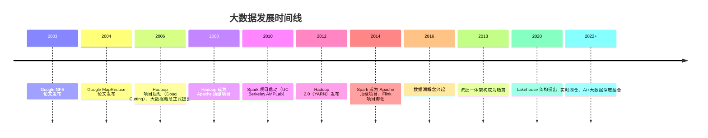
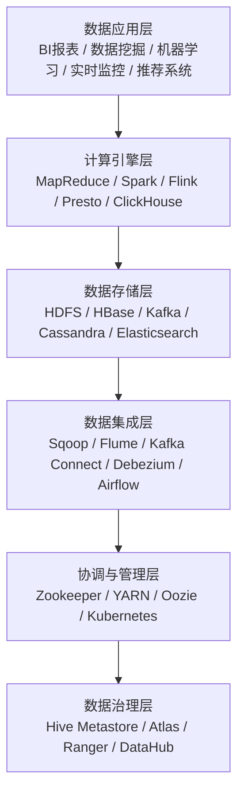
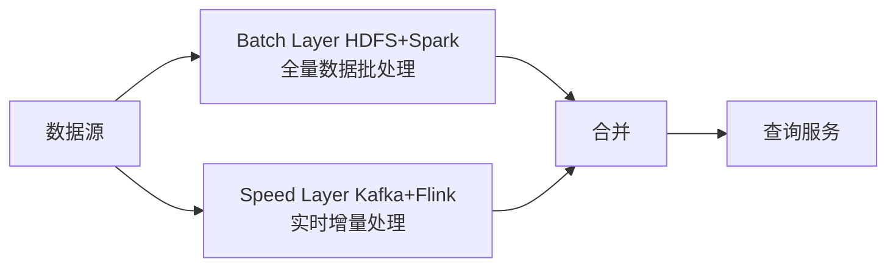

## 0. 零基础入门（从零开始）

### 0.1 零基础起点

本模块介绍大数据技术栈。零基础可学，但建议先掌握 019-sql 模块（SQL 查询）和 040-python 模块的基础，因为大数据工具大多围绕 SQL 和分布式计算展开。
先建立直觉：当数据多到单台电脑放不下、算不动时，就把数据分到很多台电脑上并行处理——“分而治之”是大数据最核心的思想。

### 0.2 第一个大数据操作：理解 MapReduce 的分而治之

```text
任务：统计 1 亿条日志中出现次数最多的 100 个单词。

单机做法：一台电脑逐条读取，内存会爆。

MapReduce 做法：
1. 把 1 亿条日志分成 100 份，交给 100 台电脑
2. Map 阶段：每台电脑统计自己那份，得到局部计数
3. Reduce 阶段：汇总 100 份局部结果，得到全局计数
```

MapReduce 是 Google 2004 年提出的大数据处理模型，分为两个阶段。
Map（映射）：把大任务拆成小份并行处理，每台机器只处理自己那份数据，产出中间结果（如单词-次数）。
Reduce（归约）：把所有机器的中间结果合并，得到最终答案。
这个模型的关键是“移动计算而非移动数据”：数据存在哪台机器，就在哪台机器上算，避免海量数据传输。
现代框架 Spark、Flink 都是这个思想的演进：Spark 把中间结果留在内存中，比反复读写磁盘的 MapReduce 快很多。

### 0.3 学习路径

完成上面的第一步后，按以下顺序继续学习：

- 002-分布式存储：HDFS 如何把文件切成块分散存储。
- 003-批处理计算：Spark RDD/DataFrame 基础。
- 004-数据仓库：Hive 如何用 SQL 查询海量数据。

## 1. 大数据概念与定义

大数据（Big Data）是指**无法用传统数据处理工具在合理时间内捕获、管理和处理的数据集合**。其核心在于从海量、复杂的数据中提取有价值的信息，以支撑业务决策和科学发现。

### 1.1 大数据的5V特征

| 特征         | 英文       | 描述                               | 示例                     |
| :----------- | :--------- | :--------------------------------- | :----------------------- |
| **Volume**   | 数据量大   | TB、PB乃至EB级别的数据规模         | 每天产生2.5EB数据        |
| **Velocity** | 处理速度快 | 数据产生和流动的速度极快           | 实时交易流、传感器数据   |
| **Variety**  | 数据类型多 | 结构化、半结构化、非结构化数据并存 | 日志、图片、视频、文本   |
| **Value**    | 价值密度低 | 海量数据中有效信息占比低           | 视频中关键帧仅占1%       |
| **Veracity** | 真实性     | 数据质量与可信度的不确定性         | 噪声数据、缺失值、异常值 |

### 1.2 大数据与传统数据的对比

| 维度     | 传统数据     | 大数据                       |
| :------- | :----------- | :--------------------------- |
| 数据量   | GB ~ TB      | TB ~ EB                      |
| 数据来源 | 单一系统     | 多源异构                     |
| 数据格式 | 结构化为主   | 结构化 + 半结构化 + 非结构化 |
| 处理模式 | 批处理       | 批处理 + 流处理 + 交互式     |
| 存储方式 | 关系型数据库 | 分布式文件系统 + NoSQL       |
| 分析方法 | 统计报表     | 机器学习 + 深度学习          |

## 2. 大数据发展历程

### 2.1 关键里程碑



### 2.2 技术演进路线

大数据技术经历了三个主要阶段：

1. **批处理时代（2006-2012）**：以 Hadoop MapReduce 为核心，强调离线批处理
2. **内存计算时代（2012-2018）**：以 Spark 为代表，内存计算大幅提升性能
3. **流批一体时代（2018-至今）**：Flink 引领流批融合，实时性成为核心诉求

## 3. 大数据技术生态系统

### 3.1 生态全景图



### 3.2 核心组件分类

| 类别        | 组件                                  | 功能               |
| :---------- | :------------------------------------ | :----------------- |
| 分布式存储  | HDFS、S3、OSS                         | 海量数据的可靠存储 |
| 批处理引擎  | MapReduce、Spark                      | 大规模离线数据处理 |
| 流处理引擎  | Flink、Spark Streaming、Kafka Streams | 实时数据处理       |
| 交互式查询  | Presto、Impala、ClickHouse            | 低延迟即席查询     |
| 消息队列    | Kafka、Pulsar                         | 数据缓冲与流式传输 |
| NoSQL数据库 | HBase、Cassandra、MongoDB             | 高吞吐随机读写     |
| 数据仓库    | Hive、Spark SQL                       | SQL化数据分析      |
| 数据湖      | Iceberg、Delta Lake、Hudi             | 流批一体存储       |
| 资源管理    | YARN、Kubernetes                      | 集群资源调度       |
| 协调服务    | Zookeeper、etcd                       | 分布式协调与一致性 |

## 4. 大数据应用场景

### 4.1 行业应用

| 行业   | 应用场景               | 技术方案                   |
| :----- | :--------------------- | :------------------------- |
| 互联网 | 推荐系统、用户画像     | Spark ML + Kafka + HBase   |
| 金融   | 风控、反欺诈、量化交易 | Flink + Kafka + Redis      |
| 电商   | 实时推荐、库存预测     | Flink + ClickHouse + HDFS  |
| 物联网 | 设备监控、预测性维护   | Kafka + Flink + 时序数据库 |
| 医疗   | 基因分析、辅助诊断     | Spark + HDFS + 深度学习    |
| 交通   | 路径规划、流量预测     | Flink + Kafka + 图计算     |

### 4.2 典型数据架构

**Lambda 架构**：



**Kappa 架构**：

```
数据源 ──→ Kafka ──→ Flink（流批一体）──→ 服务层
```

## 5. 大数据挑战与趋势

### 5.1 核心挑战

- **数据质量**：脏数据、缺失值、数据不一致
- **数据安全与隐私**：GDPR、数据脱敏、访问控制
- **实时性要求**：从分钟级到秒级乃至毫秒级
- **成本控制**：存储与计算资源的弹性伸缩
- **人才缺口**：复合型数据人才稀缺

### 5.2 发展趋势

1. **湖仓一体（Lakehouse）**：融合数据湖的灵活性与数据仓库的ACID特性
2. **流批一体**：统一批处理和流处理编程模型
3. **云原生大数据**：Kubernetes 化部署，存算分离
4. **AI + 大数据**：特征平台、MLOps 与数据平台深度融合
5. **实时数据湖**：Iceberg/Flink 实时入湖与查询
6. **数据网格（Data Mesh）**：去中心化的数据架构范式

## 参考文献

Apache Spark：https://spark.apache.org/docs/latest/
Apache Flink：https://flink.apache.org/
Apache Kafka：https://kafka.apache.org/documentation/
ClickHouse：https://clickhouse.com/docs
Airflow：https://airflow.apache.org/docs/

## 延伸阅读

大数据生态概览，见 052-big-data 模块文档。
数据分析与统计，见 051-data-analysis/030-probability-statistics 模块。
分布式系统基础，见 034-cloud-computing 模块。
尚硅谷 Bilibili 空间（https://space.bilibili.com/302417610 ）提供大数据课程。

## 深度专题扩展

以下专题从不同角度深入本文主题，供有进阶需求的读者研读。每个专题独立成节，内容相互补充。

### 13.1 流处理语义深入

At-most-once：可能丢；At-least-once：可能重；Exactly-once：端到端精确一次需事务/幂等。
状态后端：RocksDB 本地状态 + checkpoint 快照；重启恢复。
窗口：滚动（固定）、滑动（重叠）、会话（空闲间隔）；触发条件（水位线 + 允许迟到）。
实践：幂等写入 + 去重键（事件 ID）兜底。

### 13.2 数据仓库建模

维度建模：事实表（度量、外键）+ 维度表（描述）；星型模型查询友好。
分层：ODS 原样、DWD 明细清洗、DWS 汇总、ADS 应用。
缓慢变化维度（SCD）：覆盖（1）、新增行（2）、新增列（3）。
建模工具：dbt 实现 ELT 与测试；血缘可视化。

## 模块文档速查表

| 文档 | 主题 | 与本文的关联 |
| --- | --- | --- |
| 大数据概述 | 001-DataOverview | 本文自身 |
| HDFS分布式文件系统 | 002-HDFSDistributedFileSystem | 本文的并列主题 |
| MapReduce | 003-MapReduce | 本文的并列主题 |
| Spark核心 | 004-SparkCore | 本文的并列主题 |
| Spark-Streaming | 005-SparkStreaming | 本文的并列主题 |
| Hive数据仓库 | 006-HiveDataWarehouse | 本文的并列主题 |
| HBase列族数据库 | 007-HBaseDatabase | 本文的并列主题 |
| Kafka消息队列 | 008-KafkaMessageQueue | 本文的并列主题 |
| Flink流处理 | 009-FlinkStreamHandling | 本文的并列主题 |
| 数据湖 | 010-DataLake | 本文的并列主题 |
| Zookeeper协调服务 | 011-Zookeeper | 本文的并列主题 |
| YARN资源管理 | 012-YARNManagement | 本文的并列主题 |
| 大数据 HDFS 命令 | 013-HDFSCommands | 本文的并列主题 |
| 大数据 YARN 命令 | 014-YARNCommands | 本文的并列主题 |
| 大数据 Spark RDD | 015-SparkRDD | 本文的并列主题 |
| 大数据 Spark DataFrame | 016-SparkDataFrame | 本文的并列主题 |
| 大数据 Hive DDL | 017-HiveDDL | 本文的并列主题 |
| 大数据 Hive DML | 018-HiveDML | 本文的并列主题 |
| 大数据 Hive 函数 | 019-HiveFunctions | 本文的并列主题 |
| 大数据 Kafka 命令 | 020-KafkaCommands | 本文的并列主题 |
| 大数据 HBase 命令 | 021-HBaseCommands | 本文的并列主题 |
| 大数据 Flink 流处理 | 022-FlinkBasics | 本文的并列主题 |
| 大数据 Spark 优化 | 023-SparkOptimization | 本文的性能延伸 |
