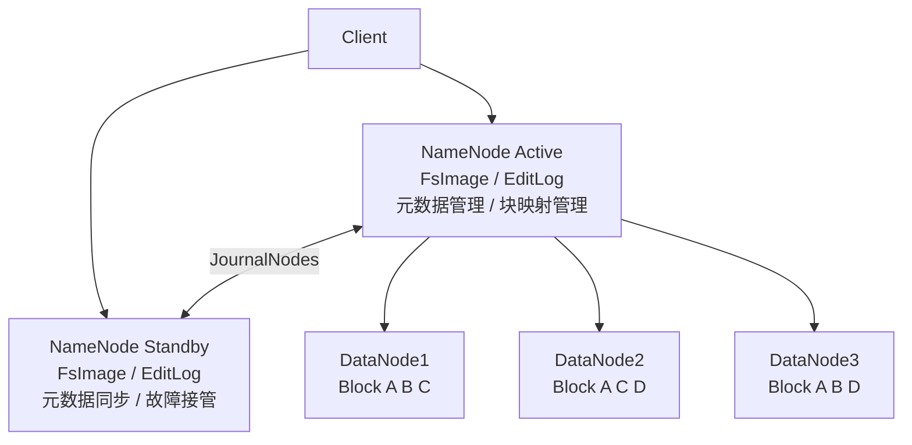
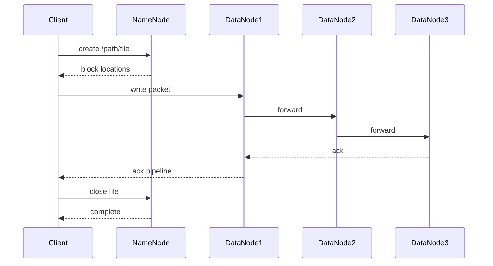
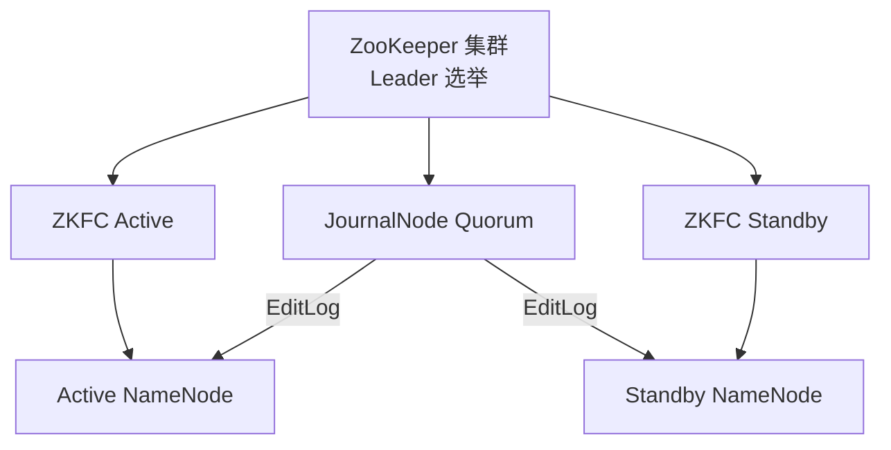

## 1. HDFS架构设计

HDFS（Hadoop Distributed File System）是 Hadoop 生态的核心存储组件，设计目标是在**廉价硬件**上提供**高吞吐量**的分布式文件存储。

### 1.1 设计目标

| 目标                 | 说明                     |
| :------------------- | :----------------------- |
| 硬件故障是常态       | 通过冗余副本实现容错     |
| 流式数据访问         | 优化顺序读写，非随机访问 |
| 大文件存储           | 支持TB/PB级文件          |
| 简单一致性模型       | 一次写入多次读取         |
| 移动计算而非移动数据 | 计算任务靠近数据执行     |

### 1.2 核心架构

### 1.3 核心组件

**NameNode**：

- 管理文件系统的**命名空间**（目录树、文件-块映射）
- 维护**块位置映射**（Block → DataNode列表）
- 处理客户端请求（创建、删除、打开、关闭）
- 全部元数据存储在**内存**中，实现快速查找

**DataNode**：

- 存储**实际数据块**（Block，默认128MB）
- 执行块的**创建、删除、复制**操作
- 定期向 NameNode 发送**心跳**和**块报告**
- 心跳间隔：3秒，超时判定：10分钟

**Secondary NameNode / Checkpoint Node**：

- 定期合并 FsImage 和 EditLog
- **不是** NameNode 的热备
- 减少 NameNode 重启时的恢复时间

## 2. 文件读写流程

### 2.1 文件写入流程

**详细步骤**：

1. 客户端调用 `create()` 向 NameNode 请求创建文件
2. NameNode 检查权限和路径，创建文件记录，返回 DataNode 列表
3. 客户端将数据切分为 **Packet**（64KB），写入 **Pipeline**
4. 数据以**流水线**方式复制：DN1 → DN2 → DN3
5. DN3 发送 ACK 给 DN2，DN2 给 DN1，DN1 给客户端
6. 所有 Block 写入完成后，客户端调用 `close()`
7. NameNode 确认提交

### 2.2 文件读取流程

1. 客户端调用 `open()` 打开文件
2. NameNode 返回文件对应 Block 的 DataNode 列表（按距离排序）
3. 客户端选择**最近的** DataNode 建立连接读取数据
4. 读取失败时，尝试下一个 DataNode（故障转移）
5. 所有 Block 读取完毕，关闭连接

**距离计算**：

$$d = \sum_{i} \text{level}_i$$

其中距离基于网络拓扑层级：

| 场景                 | 距离 |
| :------------------- | :--- |
| 同一节点             | 0    |
| 同一机架不同节点     | 2    |
| 同一数据中心不同机架 | 4    |
| 不同数据中心         | 6    |

## 3. 容错与高可用

### 3.1 数据容错

**副本机制**：

- 默认副本数：3
- 副本放置策略（Rack Awareness）：
  - 第1个副本：客户端所在节点（若不在集群内则随机选择）
  - 第2个副本：不同机架的节点
  - 第3个副本：第2个副本同机架的不同节点

$$\text{数据可靠性} = 1 - p^n$$

其中 $p$ 为单节点故障率，$n$ 为副本数。

**数据校验**：

- **CRC32** 校验和：每个 Block 对应一个 `.crc` 校验文件
- 写入时计算校验和，读取时验证
- 校验失败则从其他副本读取

### 3.2 NameNode 高可用（HA）

**HA 关键机制**：

1. **JournalNode 集群**：共享 EditLog 存储（奇数节点，多数派写入）
2. **ZKFC（ZK Failover Controller）**：监控 NameNode 状态，触发故障转移
3. **ZooKeeper 选举**：确保只有一个 Active NameNode
4. **Fencing**：隔离旧 Active 节点，防止脑裂（SSH fence / Shell fence）

### 3.3 DataNode 容错

- 心跳超时（10分钟）后，NameNode 将该节点标记为 **Dead**
- Dead 节点上的 Block 被标记为**副本不足**
- NameNode 触发**副本复制**，从存活副本创建新副本到其他节点

## 4. HDFS关键配置与优化

### 4.1 核心配置参数

| 参数                                      | 默认值 | 说明             |
| :---------------------------------------- | :----- | :--------------- |
| `dfs.blocksize`                           | 128MB  | 数据块大小       |
| `dfs.replication`                         | 3      | 默认副本数       |
| `dfs.namenode.heartbeat.recheck-interval` | 5min   | 心跳检查间隔     |
| `dfs.heartbeat.interval`                  | 3s     | DataNode心跳间隔 |
| `dfs.replication.max`                     | 512    | 最大副本数       |
| `dfs.datanode.du.reserved`                | 10GB   | DataNode保留空间 |

### 4.2 性能优化

- **Short-Circuit Local Read**：绕过 DataNode 直接读取本地 Block
- **Block Size 调优**：大文件使用更大 Block（256MB/512MB）
- **副本数调整**：冷数据降低副本数，热数据增加副本数
- **Balancer**：均衡集群各节点数据分布
- **HDFS Cache**：集中式缓存管理，缓存热点数据

## 参考文献

Apache Spark：https://spark.apache.org/docs/latest/
Apache Flink：https://flink.apache.org/
Apache Kafka：https://kafka.apache.org/documentation/
ClickHouse：https://clickhouse.com/docs
Airflow：https://airflow.apache.org/docs/

## 延伸阅读

大数据生态概览，见 052-big-data 模块文档。
数据分析与统计，见 051-data-analysis/030-probability-statistics 模块。
分布式系统基础，见 034-cloud-computing 模块。
尚硅谷 Bilibili 空间（https://space.bilibili.com/302417610 ）提供大数据课程。

## 深度专题扩展

以下专题从不同角度深入本文主题，供有进阶需求的读者研读。每个专题独立成节，内容相互补充。

### 13.1 流处理语义深入

At-most-once：可能丢；At-least-once：可能重；Exactly-once：端到端精确一次需事务/幂等。
状态后端：RocksDB 本地状态 + checkpoint 快照；重启恢复。
窗口：滚动（固定）、滑动（重叠）、会话（空闲间隔）；触发条件（水位线 + 允许迟到）。
实践：幂等写入 + 去重键（事件 ID）兜底。

### 13.2 数据仓库建模

维度建模：事实表（度量、外键）+ 维度表（描述）；星型模型查询友好。
分层：ODS 原样、DWD 明细清洗、DWS 汇总、ADS 应用。
缓慢变化维度（SCD）：覆盖（1）、新增行（2）、新增列（3）。
建模工具：dbt 实现 ELT 与测试；血缘可视化。

## 模块文档速查表

| 文档 | 主题 | 与本文的关联 |
| --- | --- | --- |
| 大数据概述 | 001-DataOverview | 本文的前置基础 |
| HDFS分布式文件系统 | 002-HDFSDistributedFileSystem | 本文自身 |
| MapReduce | 003-MapReduce | 本文的并列主题 |
| Spark核心 | 004-SparkCore | 本文的并列主题 |
| Spark-Streaming | 005-SparkStreaming | 本文的并列主题 |
| Hive数据仓库 | 006-HiveDataWarehouse | 本文的并列主题 |
| HBase列族数据库 | 007-HBaseDatabase | 本文的并列主题 |
| Kafka消息队列 | 008-KafkaMessageQueue | 本文的并列主题 |
| Flink流处理 | 009-FlinkStreamHandling | 本文的并列主题 |
| 数据湖 | 010-DataLake | 本文的并列主题 |
| Zookeeper协调服务 | 011-Zookeeper | 本文的并列主题 |
| YARN资源管理 | 012-YARNManagement | 本文的并列主题 |
| 大数据 HDFS 命令 | 013-HDFSCommands | 本文的并列主题 |
| 大数据 YARN 命令 | 014-YARNCommands | 本文的并列主题 |
| 大数据 Spark RDD | 015-SparkRDD | 本文的并列主题 |
| 大数据 Spark DataFrame | 016-SparkDataFrame | 本文的并列主题 |
| 大数据 Hive DDL | 017-HiveDDL | 本文的并列主题 |
| 大数据 Hive DML | 018-HiveDML | 本文的并列主题 |
| 大数据 Hive 函数 | 019-HiveFunctions | 本文的并列主题 |
| 大数据 Kafka 命令 | 020-KafkaCommands | 本文的并列主题 |
| 大数据 HBase 命令 | 021-HBaseCommands | 本文的并列主题 |
| 大数据 Flink 流处理 | 022-FlinkBasics | 本文的并列主题 |
| 大数据 Spark 优化 | 023-SparkOptimization | 本文的性能延伸 |
