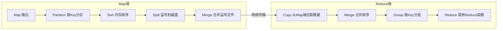
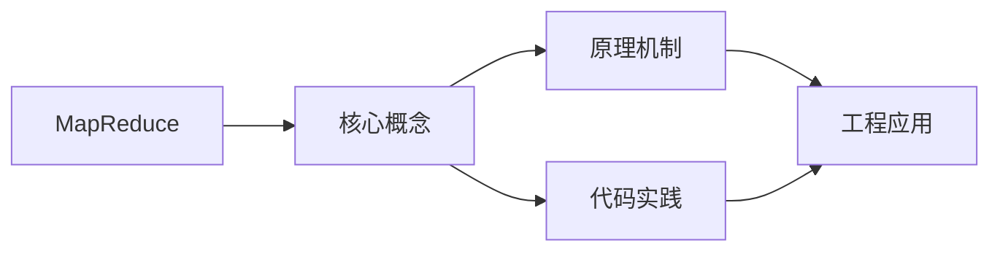
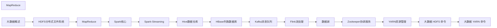

## 1. 学习目标（Bloom 分类）

本节按照布鲁姆教育目标分类学组织学习路径。本文主题为《MapReduce》，属于 大数据 模块，读者可以根据自身阶段选择阅读深度。

记忆层面：能够准确复述本文的核心概念、术语与基本语法或操作步骤，并能够在提问或检索时快速定位对应知识点。能够说出 大数据 的核心概念、常用命令与流程。

理解层面：能够用自己的语言解释核心原理与工作机制，说明概念之间的因果关系，而不是机械记忆结论。能够解释 大数据 的工作原理与设计动机。

应用层面：能够在真实项目或练习场景中运用本文知识解决具体问题，写出正确且可维护的实现。能够独立完成 大数据 的标准操作。

分析层面：能够拆解复杂问题，比较本文主题与相邻概念的异同，识别边界条件与例外情况。能够分析 大数据 使用中的异常与边界。

评价层面：能够根据约束条件（性能、可读性、安全、成本）评价不同方案的优劣，做出有依据的技术决策。能够评价 大数据 相关工具与方案。

创造层面：能够把本文知识与其他模块知识组合，设计出新的解决方案或可复用的工程模式。能够把 大数据 融入团队工作流。

通过本节学习，读者应当能够把《MapReduce》纳入自己的知识网络，并与 大数据 模块的其他主题（分布式存储、批处理、流处理、数据仓库）建立关联。

## 2. 历史动机与发展脉络

《MapReduce》是 大数据 领域的重要主题。要真正理解它，需要先了解它解决的问题与演进过程。

大数据指规模超出单机处理能力的数据工程问题：2004 年 Google MapReduce 论文开启分布式计算时代，Hadoop 生态（2006）开源落地。
现代技术版图：存储（HDFS/对象存储/数据湖）、批处理（Spark）、流处理（Flink/Kafka）、数仓（Hive/Doris/ClickHouse）、调度（Airflow）。
湖仓一体（Lakehouse）融合数据湖灵活与数仓治理；云原生数据栈（Snowflake/Databricks）成为主流形态。

回到本文主题：MapReduce 的提出与成熟，正是上述技术背景下的必然产物。早期实现往往以简单可用为目标，随着工程规模扩大，社区逐渐沉淀出标准做法与最佳实践；理解这一脉络，可以帮助读者判断“为什么文档中的推荐写法是现在这个样子”，也能在遇到历史遗留代码时准确识别其设计年代与取舍。


## 3. 形式化定义与核心概念精讲

本节把《MapReduce》涉及的核心概念以“定义 + 讲解”的形式展开。读者应把定义当作工具，把讲解当作理解路径；两者结合才能形成可迁移的知识。

分布式存储：数据分片（shard）与副本（replica），一致性（CAP 权衡）；HDFS 块存储与对象存储。
批处理模型：MapReduce 分而治之；Spark 基于内存 DAG 优化；数据本地性减少传输。
流处理：事件时间与水位线（watermark）、窗口（滚动/滑动/会话）、精确一次语义（exactly-once）。

### 3.1 原文章节逐一精讲

原文档把主题拆分为 13 个小节，下面按顺序给出每一节的导读讲解，随后保留原文细节供精读。

#### 原文精读（完整保留）

# 大数据 MapReduce

> **符号约定**：`< >` 必填参数 | `[ ]` 可选参数

---

#### 1. MapReduce编程模型

MapReduce 是一种**分而治之**的分布式计算模型，将复杂计算分解为 Map（映射）和 Reduce（归约）两个阶段。

##### 1.1 核心思想

```
输入数据 ──→ [Split] ──→ [Map] ──→ [Shuffle] ──→ [Reduce] ──→ 输出
              分片       映射       洗牌         归约
```

**函数签名**：

$$\text{Map}: (k_1, v_1) \rightarrow \text{list}(k_2, v_2)$$

$$\text{Reduce}: (k_2, \text{list}(v_2)) \rightarrow \text{list}(k_3, v_3)$$

##### 1.2 WordCount 示例

```java
public class WordCount {
    public static class TokenizerMapper
        extends Mapper<Object, Text, Text, IntWritable> {

        private final static IntWritable one = new IntWritable(1);
        private Text word = new Text();

        public void map(Object key, Text value, Context context)
            throws IOException, InterruptedException {
            StringTokenizer itr = new StringTokenizer(value.toString());
            while (itr.hasMoreTokens()) {
                word.set(itr.nextToken());
                context.write(word, one);
            }
        }
    }

    public static class IntSumReducer
        extends Reducer<Text, IntWritable, Text, IntWritable> {

        private IntWritable result = new IntWritable();

        public void reduce(Text key, Iterable<IntWritable> values,
                           Context context)
            throws IOException, InterruptedException {
            int sum = 0;
            for (IntWritable val : values) {
                sum += val.get();
            }
            result.set(sum);
            context.write(key, result);
        }
    }
}
```

**数据流**：

```
输入: "hello world hello hadoop"

Map阶段:
  "hello" → (hello, 1)
  "world" → (world, 1)
  "hello" → (hello, 1)
  "hadoop" → (hadoop, 1)

Shuffle阶段:
  (hello, [1, 1])
  (world, [1])
  (hadoop, [1])

Reduce阶段:
  (hello, 2)
  (world, 1)
  (hadoop, 1)
```

#### 2. Shuffle机制详解

Shuffle 是 MapReduce 的**核心**，连接 Map 和 Reduce 阶段，包括分区、排序、分组和数据传输。

##### 2.1 Shuffle全流程



##### 2.2 Map端Shuffle

1. **环形缓冲区**：Map 输出写入内存环形缓冲区（默认100MB）
2. **分区（Partition）**：根据 `hash(key) % numReduceTasks` 决定数据归属
3. **排序（Sort）**：缓冲区达到阈值（0.8）时，对分区内的数据按 Key 排序
4. **溢写（Spill）**：排序后的数据写入磁盘临时文件
5. **合并（Merge）**：所有溢写文件合并为一个已排序的输出文件

##### 2.3 Reduce端Shuffle

1. **拉取（Copy）**：Reduce 任务从所有 Map 输出中拉取属于自己的分区数据
2. **合并排序（Merge Sort）**：对拉取的数据进行归并排序
3. **分组（Group）**：相同 Key 的 Value 组成迭代器传给 Reduce 函数

##### 2.4 分区策略

默认分区函数：

$$\text{partition} = \text{hash}(k_2) \bmod R$$

其中 $R$ 为 Reduce 任务数。自定义分区器需实现 `Partitioner` 接口：

```java
public class CustomPartitioner extends Partitioner<Text, IntWritable> {
    @Override
    public int getPartition(Text key, IntWritable value, int numReduceTasks) {
        if (key.toString().startsWith("A-M")) return 0;
        else return 1 % numReduceTasks;
    }
}
```

#### 3. Combiner优化

##### 3.1 Combiner原理

Combiner 是 Map 端的**局部 Reduce**，在数据发送到 Reduce 端之前进行预聚合，减少网络传输量。

```mermaid
flowchart LR
    M1[Map: hello,1 ×3] -->|网络| R1[Reduce: hello,[1,1,1] → hello,3]
    M2[Map: hello,1 ×3] --> C2[Combiner: hello,3] -->|网络| R2[Reduce: hello,[3] → hello,3]
```

##### 3.2 Combiner使用约束

- **幂等性**：Combiner 的输入输出类型必须一致
- **可交换可结合**：操作必须满足交换律和结合律（如求和、最大值）
- **不保证执行**：框架可能不调用 Combiner，或调用多次
- **不适合求平均数**：$\text{avg}(\text{avg}(a,b), c) \neq \text{avg}(a,b,c)$

#### 4. MapReduce执行流程

##### 4.1 完整执行阶段

```
1. 作业提交
   Client → JobTracker/ResourceManager

2. 作业初始化
   创建Job对象，获取InputSplit列表

3. 任务分配
   TaskTracker/NodeManager领取Map/Reduce任务

4. 任务执行
   Map Task: InputSplit → Map → Shuffle
   Reduce Task: Shuffle → Sort → Reduce → Output

5. 作业完成
   所有任务完成，作业状态更新为SUCCEEDED
```

##### 4.2 InputFormat与Split

| InputFormat             | 说明                  |
| :---------------------- | :-------------------- |
| TextInputFormat         | 按行读取，Key为偏移量 |
| KeyValueTextInputFormat | 按分隔符分割Key/Value |
| NLineInputFormat        | 每N行一个Split        |
| CombineFileInputFormat  | 合并小文件            |

Split 大小计算：

$$\text{splitSize} = \max(\text{minSize}, \min(\text{maxSize}, \text{blockSize}))$$

#### 5. 性能调优

##### 5.1 关键调优参数

| 参数                                      | 说明             | 建议值 |
| :---------------------------------------- | :--------------- | :----- |
| `mapreduce.task.io.sort.mb`               | Map端排序缓冲区  | 256MB  |
| `mapreduce.map.sort.spill.percent`        | 溢写阈值         | 0.8    |
| `mapreduce.reduce.shuffle.parallelcopies` | Reduce并行拉取数 | 5~10   |
| `mapreduce.reduce.input.buffer.percent`   | Reduce内存缓冲   | 0.7    |
| `mapreduce.map.memory.mb`                 | Map任务内存      | 2048MB |
| `mapreduce.reduce.memory.mb`              | Reduce任务内存   | 4096MB |

##### 5.2 常见优化策略

1. **小文件合并**：使用 CombineFileInputFormat 或预处理合并
2. **数据压缩**：Map 输出使用 Snappy，Reduce 输出使用 Gzip
3. **Combiner 使用**：Map 端预聚合减少网络 IO
4. **推测执行**：慢任务启动备份任务（`mapreduce.map.speculative`）
5. **JVM 重用**：复用 JVM 减少启动开销
#### MapReduce 命令

**基本写法：运行 MapReduce 作业**
`hadoop jar <jar包> <主类> <输入路径> <输出路径>`

```bash
# 运行 WordCount 示例
hadoop jar hadoop-mapreduce-examples.jar wordcount /input /output
```

---

**基本写法：查看作业列表**
`mapred job -list`

```bash
# 查看正在运行的作业
mapred job -list
```

---

**基本写法：杀死作业**
`mapred job -kill <作业ID>`

```bash
# 终止指定作业
mapred job -kill job_1234567890_0001
```

---

**基本写法：查看作业状态**
`mapred job -status <作业ID>`

```bash
# 查看作业详细状态
mapred job -status job_1234567890_0001
```

---

#### Mapper 实现

**换行写法：Python Mapper 实现**
`#!/usr/bin/env python3`
`import sys`
`for line in sys.stdin:`
`    <处理逻辑>`
`    print(f"{<key>}\t{<value>}")`

```python
#!/usr/bin/env python3
# WordCount Mapper
import sys

for line in sys.stdin:
    words = line.strip().split()
    for word in words:
        print(f"{word}\t1")
```

---

**换行写法：Java Mapper 实现**
`public class <Mapper类> extends Mapper<KEYIN, VALUEIN, KEYOUT, VALUEOUT> {`
`    protected void map(KEYIN key, VALUEIN value, Context context) {`
`        <处理逻辑>`
`    }`
`}`

```java
// Java WordCount Mapper
public class WordCountMapper extends Mapper<LongWritable, Text, Text, IntWritable> {
    private final static IntWritable one = new IntWritable(1);
    private Text word = new Text();

    @Override
    protected void map(LongWritable key, Text value, Context context) throws IOException, InterruptedException {
        String[] words = value.toString().split("\\s+");
        for (String w : words) {
            word.set(w);
            context.write(word, one);
        }
    }
}
```

---

#### Reducer 实现

**换行写法：Python Reducer 实现**
`#!/usr/bin/env python3`
`import sys`
`from collections import defaultdict`
`counts = defaultdict(int)`
`for line in sys.stdin:`
`    key, value = line.strip().split("\t")`
`    counts[key] += int(value)`
`for key, count in counts.items():`
`    print(f"{key}\t{count}")`

```python
#!/usr/bin/env python3
# WordCount Reducer
import sys
from collections import defaultdict

counts = defaultdict(int)
for line in sys.stdin:
    key, value = line.strip().split("\t")
    counts[key] += int(value)

for key, count in counts.items():
    print(f"{key}\t{count}")
```

---

**换行写法：Java Reducer 实现**
`public class <Reducer类> extends Reducer<KEYIN, VALUEIN, KEYOUT, VALUEOUT> {`
`    protected void reduce(KEYIN key, Iterable<VALUEIN> values, Context context) {`
`        <聚合逻辑>`
`    }`
`}`

```java
// Java WordCount Reducer
public class WordCountReducer extends Reducer<Text, IntWritable, Text, IntWritable> {
    private IntWritable result = new IntWritable();

    @Override
    protected void reduce(Text key, Iterable<IntWritable> values, Context context) throws IOException, InterruptedException {
        int sum = 0;
        for (IntWritable val : values) {
            sum += val.get();
        }
        result.set(sum);
        context.write(key, result);
    }
}
```

---

#### 使用 Hadoop Streaming

**基本写法：运行 Streaming 作业**
`hadoop jar streaming.jar -input <输入> -output <输出> -mapper <mapper脚本> -reducer <reducer脚本>`

```bash
# 使用 Python 运行 MapReduce
hadoop jar hadoop-streaming.jar \
    -input /input \
    -output /output \
    -mapper mapper.py \
    -reducer reducer.py \
    -file mapper.py \
    -file reducer.py
```

---

**基本写法：指定 Java 类**
`hadoop jar streaming.jar -mapper <Java类> -reducer <Java类>`

```bash
# 指定 Java 类作为 Mapper/Reducer
hadoop jar hadoop-streaming.jar \
    -input /input \
    -output /output \
    -mapper "com.example.Mapper" \
    -reducer "com.example.Reducer"
```

---

**基本写法：设置环境变量**
`hadoop jar streaming.jar -cmdenv <变量名>=<值>`

```bash
# 设置环境变量
hadoop jar hadoop-streaming.jar \
    -input /input -output /output \
    -mapper mapper.py -reducer reducer.py \
    -cmdenv PYTHONPATH=/usr/lib/python3
```

---

#### Combiner 优化

**基本写法：设置 Combiner**
`hadoop jar streaming.jar -combiner <combiner脚本>`

```bash
# 使用 Combiner 减少数据传输
hadoop jar hadoop-streaming.jar \
    -input /input -output /output \
    -mapper mapper.py \
    -combiner reducer.py \
    -reducer reducer.py \
    -file mapper.py -file reducer.py
```

---

#### Partitioner 分区

**基本写法：设置 Partitioner**
`hadoop jar streaming.jar -partitioner <分区类>`

```bash
# 自定义分区器
hadoop jar hadoop-streaming.jar \
    -input /input -output /output \
    -mapper mapper.py -reducer reducer.py \
    -partitioner org.apache.hadoop.mapreduce.lib.partition.HashPartitioner \
    -numReduceTasks 3
```

---

#### 知识讲解与要点分析（原作业配置）

**基本写法：设置 Reduce 任务数**
`-D mapreduce.job.reduces=<数量>`

```bash
# 设置 Reduce 任务数为 5
hadoop jar hadoop-streaming.jar \
    -D mapreduce.job.reduces=5 \
    -input /input -output /output \
    -mapper mapper.py -reducer reducer.py
```

---

**基本写法：设置输入格式**
`-D mapreduce.job.inputformat.class=<输入格式类>`

```bash
# 指定输入格式
hadoop jar hadoop-streaming.jar \
    -inputformat org.apache.hadoop.mapreduce.lib.input.TextInputFormat \
    -input /input -output /output \
    -mapper mapper.py -reducer reducer.py
```

---

**基本写法：设置输出格式**
`-D mapreduce.job.outputformat.class=<输出格式类>`

```bash
# 指定输出格式
hadoop jar hadoop-streaming.jar \
    -outputformat org.apache.hadoop.mapreduce.lib.output.TextOutputFormat \
    -input /input -output /output \
    -mapper mapper.py -reducer reducer.py
```

---

#### 实战示例

**换行写法：词频统计完整流程**
`hadoop jar streaming.jar \`
`    -input /input \`
`    -output /output \`
`    -mapper "python3 mapper.py" \`
`    -reducer "python3 reducer.py" \`
`    -file mapper.py \`
`    -file reducer.py`

```bash
# 完整的词频统计命令
hadoop jar /opt/hadoop/share/hadoop/tools/lib/hadoop-streaming-3.3.6.jar \
    -input /user/hadoop/input \
    -output /user/hadoop/output \
    -mapper "python3 mapper.py" \
    -reducer "python3 reducer.py" \
    -file mapper.py \
    -file reducer.py \
    -D mapreduce.job.reduces=2
```

---

**换行写法：去重 MapReduce**
`mapper: print(line.strip())`
`reducer: print(key)`

```python
# 去重 Mapper
import sys
for line in sys.stdin:
    print(line.strip())

# 去重 Reducer  
import sys
last_key = None
for line in sys.stdin:
    key = line.strip()
    if key != last_key:
        print(key)
        last_key = key
```

---

**换行写法：排序 MapReduce**
`mapper: print(f"{int(line.strip())}\t")`
`reducer: 依次输出`

```python
# 排序 Mapper（利用 Shuffle 自动排序）
import sys
for line in sys.stdin:
    num = int(line.strip())
    print(f"{num}\t")

# 排序 Reducer
import sys
for line in sys.stdin:
    num = line.strip().split("\t")[0]
    print(num)
```

---

**换行写法：自定义计数器**
`context.getCounter(<组名>, <计数器名>).increment(1)`

```java
// 在 Java Mapper/Reducer 中使用计数器
context.getCounter("Custom", "TotalRecords").increment(1);
context.getCounter("Custom", "ValidRecords").increment(1);
```


### 3.2 概念关系图

下面用 Mermaid 图表达本文核心概念之间的关系，帮助读者建立整体图景：



图中展示的是本文知识的结构化关系：核心概念是入口，原理机制解释“为什么”，代码实践演示“怎么做”，工程应用回答“何时用”。读者学习时可以把每个小节的内容挂接到对应节点上。

## 4. 理论推导与原理解析

本节深入《MapReduce》背后的原理。理论部分不求面面俱到，而是聚焦“能解释现象、能指导实践”的关键推导。

分布式存储：数据分片（shard）与副本（replica），一致性（CAP 权衡）；HDFS 块存储与对象存储。
批处理模型：MapReduce 分而治之；Spark 基于内存 DAG 优化；数据本地性减少传输。
流处理：事件时间与水位线（watermark）、窗口（滚动/滑动/会话）、精确一次语义（exactly-once）。
数据仓库：维度建模（星型/雪花）、ETL/ELT、分层（ODS/DWD/DWS/ADS）。

需要强调的是，理论推导与工程实践之间存在翻译层：理论给出的是理想化模型与边界条件，工程代码则必须处理真实环境中的例外。读者在学习时应先掌握理论的“标准情形”，再通过陷阱章节了解“非标准情形”。

## 5. 代码示例与逐行讲解

本节把原文中的代码示例系统整理，并为每个示例补充用途说明与讲解。读者不应只浏览代码，而应逐段对照讲解理解设计意图。

### 5.1 示例：1.1 核心思想

该示例来自原文《1.1 核心思想》小节，用于演示MapReduce相关操作。阅读时请先看代码结构，再看其后的讲解。

```text
输入数据 ──→ [Split] ──→ [Map] ──→ [Shuffle] ──→ [Reduce] ──→ 输出
              分片       映射       洗牌         归约
```

讲解：这段代码演示了本节核心知识点。代码中的关键操作可以归纳为三步：准备（定义或初始化）、执行（核心逻辑）、收尾（释放资源或返回结果）。实际项目中，这三步往往被封装为函数或类，以提升复用性与可测试性。

关键点分析：

该示例共 2 行有效代码，结构以数据或配置为主。阅读时应关注：数据字段的含义、配置项的作用，以及它们与运行行为的对应关系。

进阶思考路径：先尝试修改参数观察行为变化，再把示例中的模式迁移到自己的项目中；每次修改都记录预期与实测差异，这是把示例转化为能力的最快方式。

### 5.2 示例：1.2 WordCount 示例

该示例来自原文《1.2 WordCount 示例》小节，用于演示MapReduce相关操作。阅读时请先看代码结构，再看其后的讲解。

```java
public class WordCount {
    public static class TokenizerMapper
        extends Mapper<Object, Text, Text, IntWritable> {

        private final static IntWritable one = new IntWritable(1);
        private Text word = new Text();

        public void map(Object key, Text value, Context context)
            throws IOException, InterruptedException {
            StringTokenizer itr = new StringTokenizer(value.toString());
            while (itr.hasMoreTokens()) {
                word.set(itr.nextToken());
                context.write(word, one);
            }
        }
    }

    public static class IntSumReducer
        extends Reducer<Text, IntWritable, Text, IntWritable> {

        private IntWritable result = new IntWritable();

        public void reduce(Text key, Iterable<IntWritable> values,
                           Context context)
            throws IOException, InterruptedException {
            int sum = 0;
            for (IntWritable val : values) {
                sum += val.get();
            }
            result.set(sum);
            context.write(key, result);
        }
    }
}
```

讲解：这段代码演示了本节核心知识点。代码中的关键操作可以归纳为三步：准备（定义或初始化）、执行（核心逻辑）、收尾（释放资源或返回结果）。实际项目中，这三步往往被封装为函数或类，以提升复用性与可测试性。

关键点分析：

该示例共 29 行有效代码，包含 3 类关键结构（class、for、while）。其中：

- 入口与初始化部分负责建立上下文，对应实际项目中的启动或装配逻辑；
- 核心逻辑部分体现本文主题的主要操作，是阅读时最需要对照讲解理解的部分；
- 输出或返回部分把结果交给调用方，注意其类型与边界条件。

进阶思考路径：先尝试修改参数观察行为变化，再把示例中的模式迁移到自己的项目中；每次修改都记录预期与实测差异，这是把示例转化为能力的最快方式。

### 5.3 示例：1.2 WordCount 示例

该示例来自原文《1.2 WordCount 示例》小节，用于演示MapReduce相关操作。阅读时请先看代码结构，再看其后的讲解。

```text
输入: "hello world hello hadoop"

Map阶段:
  "hello" → (hello, 1)
  "world" → (world, 1)
  "hello" → (hello, 1)
  "hadoop" → (hadoop, 1)

Shuffle阶段:
  (hello, [1, 1])
  (world, [1])
  (hadoop, [1])

Reduce阶段:
  (hello, 2)
  (world, 1)
  (hadoop, 1)
```

讲解：这段代码演示了本节核心知识点。代码中的关键操作可以归纳为三步：准备（定义或初始化）、执行（核心逻辑）、收尾（释放资源或返回结果）。实际项目中，这三步往往被封装为函数或类，以提升复用性与可测试性。

关键点分析：

该示例共 14 行有效代码，结构以数据或配置为主。阅读时应关注：数据字段的含义、配置项的作用，以及它们与运行行为的对应关系。

进阶思考路径：先尝试修改参数观察行为变化，再把示例中的模式迁移到自己的项目中；每次修改都记录预期与实测差异，这是把示例转化为能力的最快方式。

### 5.4 示例：2.1 Shuffle全流程

该示例来自原文《2.1 Shuffle全流程》小节，用于演示MapReduce相关操作。阅读时请先看代码结构，再看其后的讲解。


讲解：这段代码演示了本节核心知识点。代码中的关键操作可以归纳为三步：准备（定义或初始化）、执行（核心逻辑）、收尾（释放资源或返回结果）。实际项目中，这三步往往被封装为函数或类，以提升复用性与可测试性。

关键点分析：

该示例共 13 行有效代码，结构以数据或配置为主。阅读时应关注：数据字段的含义、配置项的作用，以及它们与运行行为的对应关系。

进阶思考路径：先尝试修改参数观察行为变化，再把示例中的模式迁移到自己的项目中；每次修改都记录预期与实测差异，这是把示例转化为能力的最快方式。

### 5.5 示例：2.4 分区策略

该示例来自原文《2.4 分区策略》小节，用于演示MapReduce相关操作。阅读时请先看代码结构，再看其后的讲解。

```java
public class CustomPartitioner extends Partitioner<Text, IntWritable> {
    @Override
    public int getPartition(Text key, IntWritable value, int numReduceTasks) {
        if (key.toString().startsWith("A-M")) return 0;
        else return 1 % numReduceTasks;
    }
}
```

讲解：这段代码演示了本节核心知识点。代码中的关键操作可以归纳为三步：准备（定义或初始化）、执行（核心逻辑）、收尾（释放资源或返回结果）。实际项目中，这三步往往被封装为函数或类，以提升复用性与可测试性。

关键点分析：

该示例共 7 行有效代码，包含 3 类关键结构（class、if、return）。其中：

- 入口与初始化部分负责建立上下文，对应实际项目中的启动或装配逻辑；
- 核心逻辑部分体现本文主题的主要操作，是阅读时最需要对照讲解理解的部分；
- 输出或返回部分把结果交给调用方，注意其类型与边界条件。

进阶思考路径：先尝试修改参数观察行为变化，再把示例中的模式迁移到自己的项目中；每次修改都记录预期与实测差异，这是把示例转化为能力的最快方式。

### 5.6 示例：3.1 Combiner原理

该示例来自原文《3.1 Combiner原理》小节，用于演示MapReduce相关操作。阅读时请先看代码结构，再看其后的讲解。

```mermaid
flowchart LR
    M1[Map: hello,1 ×3] -->|网络| R1[Reduce: hello,[1,1,1] → hello,3]
    M2[Map: hello,1 ×3] --> C2[Combiner: hello,3] -->|网络| R2[Reduce: hello,[3] → hello,3]
```

讲解：这段代码演示了本节核心知识点。代码中的关键操作可以归纳为三步：准备（定义或初始化）、执行（核心逻辑）、收尾（释放资源或返回结果）。实际项目中，这三步往往被封装为函数或类，以提升复用性与可测试性。

关键点分析：

该示例共 3 行有效代码，结构以数据或配置为主。阅读时应关注：数据字段的含义、配置项的作用，以及它们与运行行为的对应关系。

进阶思考路径：先尝试修改参数观察行为变化，再把示例中的模式迁移到自己的项目中；每次修改都记录预期与实测差异，这是把示例转化为能力的最快方式。

### 5.7 示例：4.1 完整执行阶段

该示例来自原文《4.1 完整执行阶段》小节，用于演示MapReduce相关操作。阅读时请先看代码结构，再看其后的讲解。

```text
1. 作业提交
   Client → JobTracker/ResourceManager

2. 作业初始化
   创建Job对象，获取InputSplit列表

3. 任务分配
   TaskTracker/NodeManager领取Map/Reduce任务

4. 任务执行
   Map Task: InputSplit → Map → Shuffle
   Reduce Task: Shuffle → Sort → Reduce → Output

5. 作业完成
   所有任务完成，作业状态更新为SUCCEEDED
```

讲解：这段代码演示了本节核心知识点。代码中的关键操作可以归纳为三步：准备（定义或初始化）、执行（核心逻辑）、收尾（释放资源或返回结果）。实际项目中，这三步往往被封装为函数或类，以提升复用性与可测试性。

关键点分析：

该示例共 11 行有效代码，结构以数据或配置为主。阅读时应关注：数据字段的含义、配置项的作用，以及它们与运行行为的对应关系。

进阶思考路径：先尝试修改参数观察行为变化，再把示例中的模式迁移到自己的项目中；每次修改都记录预期与实测差异，这是把示例转化为能力的最快方式。

### 5.8 示例：MapReduce 命令

该示例来自原文《MapReduce 命令》小节，用于演示MapReduce相关操作。阅读时请先看代码结构，再看其后的讲解。

```bash
# 运行 WordCount 示例
hadoop jar hadoop-mapreduce-examples.jar wordcount /input /output
```

讲解：这段代码演示了本节核心知识点。代码中的关键操作可以归纳为三步：准备（定义或初始化）、执行（核心逻辑）、收尾（释放资源或返回结果）。实际项目中，这三步往往被封装为函数或类，以提升复用性与可测试性。

关键点分析：

该示例共 2 行有效代码，结构以数据或配置为主。阅读时应关注：数据字段的含义、配置项的作用，以及它们与运行行为的对应关系。

进阶思考路径：先尝试修改参数观察行为变化，再把示例中的模式迁移到自己的项目中；每次修改都记录预期与实测差异，这是把示例转化为能力的最快方式。

### 5.9 示例：MapReduce 命令

该示例来自原文《MapReduce 命令》小节，用于演示MapReduce相关操作。阅读时请先看代码结构，再看其后的讲解。

```bash
# 查看正在运行的作业
mapred job -list
```

讲解：这段代码演示了本节核心知识点。代码中的关键操作可以归纳为三步：准备（定义或初始化）、执行（核心逻辑）、收尾（释放资源或返回结果）。实际项目中，这三步往往被封装为函数或类，以提升复用性与可测试性。

关键点分析：

该示例共 2 行有效代码，结构以数据或配置为主。阅读时应关注：数据字段的含义、配置项的作用，以及它们与运行行为的对应关系。

进阶思考路径：先尝试修改参数观察行为变化，再把示例中的模式迁移到自己的项目中；每次修改都记录预期与实测差异，这是把示例转化为能力的最快方式。

### 5.10 示例：MapReduce 命令

该示例来自原文《MapReduce 命令》小节，用于演示MapReduce相关操作。阅读时请先看代码结构，再看其后的讲解。

```bash
# 终止指定作业
mapred job -kill job_1234567890_0001
```

讲解：这段代码演示了本节核心知识点。代码中的关键操作可以归纳为三步：准备（定义或初始化）、执行（核心逻辑）、收尾（释放资源或返回结果）。实际项目中，这三步往往被封装为函数或类，以提升复用性与可测试性。

关键点分析：

该示例共 2 行有效代码，结构以数据或配置为主。阅读时应关注：数据字段的含义、配置项的作用，以及它们与运行行为的对应关系。

进阶思考路径：先尝试修改参数观察行为变化，再把示例中的模式迁移到自己的项目中；每次修改都记录预期与实测差异，这是把示例转化为能力的最快方式。

### 5.11 示例：MapReduce 命令

该示例来自原文《MapReduce 命令》小节，用于演示MapReduce相关操作。阅读时请先看代码结构，再看其后的讲解。

```bash
# 查看作业详细状态
mapred job -status job_1234567890_0001
```

讲解：这段代码演示了本节核心知识点。代码中的关键操作可以归纳为三步：准备（定义或初始化）、执行（核心逻辑）、收尾（释放资源或返回结果）。实际项目中，这三步往往被封装为函数或类，以提升复用性与可测试性。

关键点分析：

该示例共 2 行有效代码，结构以数据或配置为主。阅读时应关注：数据字段的含义、配置项的作用，以及它们与运行行为的对应关系。

进阶思考路径：先尝试修改参数观察行为变化，再把示例中的模式迁移到自己的项目中；每次修改都记录预期与实测差异，这是把示例转化为能力的最快方式。

### 5.12 示例：Mapper 实现

该示例来自原文《Mapper 实现》小节，用于演示MapReduce相关操作。阅读时请先看代码结构，再看其后的讲解。

```python
#!/usr/bin/env python3
# WordCount Mapper
import sys

for line in sys.stdin:
    words = line.strip().split()
    for word in words:
        print(f"{word}\t1")
```

讲解：这段代码演示了本节核心知识点。代码中的关键操作可以归纳为三步：准备（定义或初始化）、执行（核心逻辑）、收尾（释放资源或返回结果）。实际项目中，这三步往往被封装为函数或类，以提升复用性与可测试性。

关键点分析：

该示例共 7 行有效代码，包含 2 类关键结构（import、for）。其中：

- 入口与初始化部分负责建立上下文，对应实际项目中的启动或装配逻辑；
- 核心逻辑部分体现本文主题的主要操作，是阅读时最需要对照讲解理解的部分；
- 输出或返回部分把结果交给调用方，注意其类型与边界条件。

进阶思考路径：先尝试修改参数观察行为变化，再把示例中的模式迁移到自己的项目中；每次修改都记录预期与实测差异，这是把示例转化为能力的最快方式。

### 5.13 示例：Mapper 实现

该示例来自原文《Mapper 实现》小节，用于演示MapReduce相关操作。阅读时请先看代码结构，再看其后的讲解。

```java
// Java WordCount Mapper
public class WordCountMapper extends Mapper<LongWritable, Text, Text, IntWritable> {
    private final static IntWritable one = new IntWritable(1);
    private Text word = new Text();

    @Override
    protected void map(LongWritable key, Text value, Context context) throws IOException, InterruptedException {
        String[] words = value.toString().split("\\s+");
        for (String w : words) {
            word.set(w);
            context.write(word, one);
        }
    }
}
```

讲解：这段代码演示了本节核心知识点。代码中的关键操作可以归纳为三步：准备（定义或初始化）、执行（核心逻辑）、收尾（释放资源或返回结果）。实际项目中，这三步往往被封装为函数或类，以提升复用性与可测试性。

关键点分析：

该示例共 13 行有效代码，包含 2 类关键结构（class、for）。其中：

- 入口与初始化部分负责建立上下文，对应实际项目中的启动或装配逻辑；
- 核心逻辑部分体现本文主题的主要操作，是阅读时最需要对照讲解理解的部分；
- 输出或返回部分把结果交给调用方，注意其类型与边界条件。

进阶思考路径：先尝试修改参数观察行为变化，再把示例中的模式迁移到自己的项目中；每次修改都记录预期与实测差异，这是把示例转化为能力的最快方式。

### 5.14 示例：Reducer 实现

该示例来自原文《Reducer 实现》小节，用于演示MapReduce相关操作。阅读时请先看代码结构，再看其后的讲解。

```python
#!/usr/bin/env python3
# WordCount Reducer
import sys
from collections import defaultdict

counts = defaultdict(int)
for line in sys.stdin:
    key, value = line.strip().split("\t")
    counts[key] += int(value)

for key, count in counts.items():
    print(f"{key}\t{count}")
```

讲解：这段代码演示了本节核心知识点。代码中的关键操作可以归纳为三步：准备（定义或初始化）、执行（核心逻辑）、收尾（释放资源或返回结果）。实际项目中，这三步往往被封装为函数或类，以提升复用性与可测试性。

关键点分析：

该示例共 10 行有效代码，包含 3 类关键结构（import、from、for）。其中：

- 入口与初始化部分负责建立上下文，对应实际项目中的启动或装配逻辑；
- 核心逻辑部分体现本文主题的主要操作，是阅读时最需要对照讲解理解的部分；
- 输出或返回部分把结果交给调用方，注意其类型与边界条件。

进阶思考路径：先尝试修改参数观察行为变化，再把示例中的模式迁移到自己的项目中；每次修改都记录预期与实测差异，这是把示例转化为能力的最快方式。

### 5.15 示例：Reducer 实现

该示例来自原文《Reducer 实现》小节，用于演示MapReduce相关操作。阅读时请先看代码结构，再看其后的讲解。

```java
// Java WordCount Reducer
public class WordCountReducer extends Reducer<Text, IntWritable, Text, IntWritable> {
    private IntWritable result = new IntWritable();

    @Override
    protected void reduce(Text key, Iterable<IntWritable> values, Context context) throws IOException, InterruptedException {
        int sum = 0;
        for (IntWritable val : values) {
            sum += val.get();
        }
        result.set(sum);
        context.write(key, result);
    }
}
```

讲解：这段代码演示了本节核心知识点。代码中的关键操作可以归纳为三步：准备（定义或初始化）、执行（核心逻辑）、收尾（释放资源或返回结果）。实际项目中，这三步往往被封装为函数或类，以提升复用性与可测试性。

关键点分析：

该示例共 13 行有效代码，包含 2 类关键结构（class、for）。其中：

- 入口与初始化部分负责建立上下文，对应实际项目中的启动或装配逻辑；
- 核心逻辑部分体现本文主题的主要操作，是阅读时最需要对照讲解理解的部分；
- 输出或返回部分把结果交给调用方，注意其类型与边界条件。

进阶思考路径：先尝试修改参数观察行为变化，再把示例中的模式迁移到自己的项目中；每次修改都记录预期与实测差异，这是把示例转化为能力的最快方式。

### 5.16 示例：使用 Hadoop Streaming

该示例来自原文《使用 Hadoop Streaming》小节，用于演示MapReduce相关操作。阅读时请先看代码结构，再看其后的讲解。

```bash
# 使用 Python 运行 MapReduce
hadoop jar hadoop-streaming.jar \
    -input /input \
    -output /output \
    -mapper mapper.py \
    -reducer reducer.py \
    -file mapper.py \
    -file reducer.py
```

讲解：这段代码演示了本节核心知识点。代码中的关键操作可以归纳为三步：准备（定义或初始化）、执行（核心逻辑）、收尾（释放资源或返回结果）。实际项目中，这三步往往被封装为函数或类，以提升复用性与可测试性。

关键点分析：

该示例共 8 行有效代码，结构以数据或配置为主。阅读时应关注：数据字段的含义、配置项的作用，以及它们与运行行为的对应关系。

进阶思考路径：先尝试修改参数观察行为变化，再把示例中的模式迁移到自己的项目中；每次修改都记录预期与实测差异，这是把示例转化为能力的最快方式。

### 5.17 示例：使用 Hadoop Streaming

该示例来自原文《使用 Hadoop Streaming》小节，用于演示MapReduce相关操作。阅读时请先看代码结构，再看其后的讲解。

```bash
# 指定 Java 类作为 Mapper/Reducer
hadoop jar hadoop-streaming.jar \
    -input /input \
    -output /output \
    -mapper "com.example.Mapper" \
    -reducer "com.example.Reducer"
```

讲解：这段代码演示了本节核心知识点。代码中的关键操作可以归纳为三步：准备（定义或初始化）、执行（核心逻辑）、收尾（释放资源或返回结果）。实际项目中，这三步往往被封装为函数或类，以提升复用性与可测试性。

关键点分析：

该示例共 6 行有效代码，结构以数据或配置为主。阅读时应关注：数据字段的含义、配置项的作用，以及它们与运行行为的对应关系。

进阶思考路径：先尝试修改参数观察行为变化，再把示例中的模式迁移到自己的项目中；每次修改都记录预期与实测差异，这是把示例转化为能力的最快方式。

### 5.18 示例：使用 Hadoop Streaming

该示例来自原文《使用 Hadoop Streaming》小节，用于演示MapReduce相关操作。阅读时请先看代码结构，再看其后的讲解。

```bash
# 设置环境变量
hadoop jar hadoop-streaming.jar \
    -input /input -output /output \
    -mapper mapper.py -reducer reducer.py \
    -cmdenv PYTHONPATH=/usr/lib/python3
```

讲解：这段代码演示了本节核心知识点。代码中的关键操作可以归纳为三步：准备（定义或初始化）、执行（核心逻辑）、收尾（释放资源或返回结果）。实际项目中，这三步往往被封装为函数或类，以提升复用性与可测试性。

关键点分析：

该示例共 5 行有效代码，结构以数据或配置为主。阅读时应关注：数据字段的含义、配置项的作用，以及它们与运行行为的对应关系。

进阶思考路径：先尝试修改参数观察行为变化，再把示例中的模式迁移到自己的项目中；每次修改都记录预期与实测差异，这是把示例转化为能力的最快方式。

### 5.19 示例：Combiner 优化

该示例来自原文《Combiner 优化》小节，用于演示MapReduce相关操作。阅读时请先看代码结构，再看其后的讲解。

```bash
# 使用 Combiner 减少数据传输
hadoop jar hadoop-streaming.jar \
    -input /input -output /output \
    -mapper mapper.py \
    -combiner reducer.py \
    -reducer reducer.py \
    -file mapper.py -file reducer.py
```

讲解：这段代码演示了本节核心知识点。代码中的关键操作可以归纳为三步：准备（定义或初始化）、执行（核心逻辑）、收尾（释放资源或返回结果）。实际项目中，这三步往往被封装为函数或类，以提升复用性与可测试性。

关键点分析：

该示例共 7 行有效代码，结构以数据或配置为主。阅读时应关注：数据字段的含义、配置项的作用，以及它们与运行行为的对应关系。

进阶思考路径：先尝试修改参数观察行为变化，再把示例中的模式迁移到自己的项目中；每次修改都记录预期与实测差异，这是把示例转化为能力的最快方式。

### 5.20 示例：Partitioner 分区

该示例来自原文《Partitioner 分区》小节，用于演示MapReduce相关操作。阅读时请先看代码结构，再看其后的讲解。

```bash
# 自定义分区器
hadoop jar hadoop-streaming.jar \
    -input /input -output /output \
    -mapper mapper.py -reducer reducer.py \
    -partitioner org.apache.hadoop.mapreduce.lib.partition.HashPartitioner \
    -numReduceTasks 3
```

讲解：这段代码演示了本节核心知识点。代码中的关键操作可以归纳为三步：准备（定义或初始化）、执行（核心逻辑）、收尾（释放资源或返回结果）。实际项目中，这三步往往被封装为函数或类，以提升复用性与可测试性。

关键点分析：

该示例共 6 行有效代码，结构以数据或配置为主。阅读时应关注：数据字段的含义、配置项的作用，以及它们与运行行为的对应关系。

进阶思考路径：先尝试修改参数观察行为变化，再把示例中的模式迁移到自己的项目中；每次修改都记录预期与实测差异，这是把示例转化为能力的最快方式。

### 5.21 示例：知识讲解与要点分析（原作业配置）

该示例来自原文《知识讲解与要点分析（原作业配置）》小节，用于演示MapReduce相关操作。阅读时请先看代码结构，再看其后的讲解。

```bash
# 设置 Reduce 任务数为 5
hadoop jar hadoop-streaming.jar \
    -D mapreduce.job.reduces=5 \
    -input /input -output /output \
    -mapper mapper.py -reducer reducer.py
```

讲解：这段代码演示了本节核心知识点。代码中的关键操作可以归纳为三步：准备（定义或初始化）、执行（核心逻辑）、收尾（释放资源或返回结果）。实际项目中，这三步往往被封装为函数或类，以提升复用性与可测试性。

关键点分析：

该示例共 5 行有效代码，结构以数据或配置为主。阅读时应关注：数据字段的含义、配置项的作用，以及它们与运行行为的对应关系。

进阶思考路径：先尝试修改参数观察行为变化，再把示例中的模式迁移到自己的项目中；每次修改都记录预期与实测差异，这是把示例转化为能力的最快方式。

### 5.22 示例：知识讲解与要点分析（原作业配置）

该示例来自原文《知识讲解与要点分析（原作业配置）》小节，用于演示MapReduce相关操作。阅读时请先看代码结构，再看其后的讲解。

```bash
# 指定输入格式
hadoop jar hadoop-streaming.jar \
    -inputformat org.apache.hadoop.mapreduce.lib.input.TextInputFormat \
    -input /input -output /output \
    -mapper mapper.py -reducer reducer.py
```

讲解：这段代码演示了本节核心知识点。代码中的关键操作可以归纳为三步：准备（定义或初始化）、执行（核心逻辑）、收尾（释放资源或返回结果）。实际项目中，这三步往往被封装为函数或类，以提升复用性与可测试性。

关键点分析：

该示例共 5 行有效代码，结构以数据或配置为主。阅读时应关注：数据字段的含义、配置项的作用，以及它们与运行行为的对应关系。

进阶思考路径：先尝试修改参数观察行为变化，再把示例中的模式迁移到自己的项目中；每次修改都记录预期与实测差异，这是把示例转化为能力的最快方式。

### 5.23 示例：知识讲解与要点分析（原作业配置）

该示例来自原文《知识讲解与要点分析（原作业配置）》小节，用于演示MapReduce相关操作。阅读时请先看代码结构，再看其后的讲解。

```bash
# 指定输出格式
hadoop jar hadoop-streaming.jar \
    -outputformat org.apache.hadoop.mapreduce.lib.output.TextOutputFormat \
    -input /input -output /output \
    -mapper mapper.py -reducer reducer.py
```

讲解：这段代码演示了本节核心知识点。代码中的关键操作可以归纳为三步：准备（定义或初始化）、执行（核心逻辑）、收尾（释放资源或返回结果）。实际项目中，这三步往往被封装为函数或类，以提升复用性与可测试性。

关键点分析：

该示例共 5 行有效代码，结构以数据或配置为主。阅读时应关注：数据字段的含义、配置项的作用，以及它们与运行行为的对应关系。

进阶思考路径：先尝试修改参数观察行为变化，再把示例中的模式迁移到自己的项目中；每次修改都记录预期与实测差异，这是把示例转化为能力的最快方式。

### 5.24 示例：实战示例

该示例来自原文《实战示例》小节，用于演示MapReduce相关操作。阅读时请先看代码结构，再看其后的讲解。

```bash
# 完整的词频统计命令
hadoop jar /opt/hadoop/share/hadoop/tools/lib/hadoop-streaming-3.3.6.jar \
    -input /user/hadoop/input \
    -output /user/hadoop/output \
    -mapper "python3 mapper.py" \
    -reducer "python3 reducer.py" \
    -file mapper.py \
    -file reducer.py \
    -D mapreduce.job.reduces=2
```

讲解：这段代码演示了本节核心知识点。代码中的关键操作可以归纳为三步：准备（定义或初始化）、执行（核心逻辑）、收尾（释放资源或返回结果）。实际项目中，这三步往往被封装为函数或类，以提升复用性与可测试性。

关键点分析：

该示例共 9 行有效代码，结构以数据或配置为主。阅读时应关注：数据字段的含义、配置项的作用，以及它们与运行行为的对应关系。

进阶思考路径：先尝试修改参数观察行为变化，再把示例中的模式迁移到自己的项目中；每次修改都记录预期与实测差异，这是把示例转化为能力的最快方式。

### 5.25 示例：实战示例

该示例来自原文《实战示例》小节，用于演示MapReduce相关操作。阅读时请先看代码结构，再看其后的讲解。

```python
# 去重 Mapper
import sys
for line in sys.stdin:
    print(line.strip())

# 去重 Reducer  
import sys
last_key = None
for line in sys.stdin:
    key = line.strip()
    if key != last_key:
        print(key)
        last_key = key
```

讲解：这段代码演示了本节核心知识点。代码中的关键操作可以归纳为三步：准备（定义或初始化）、执行（核心逻辑）、收尾（释放资源或返回结果）。实际项目中，这三步往往被封装为函数或类，以提升复用性与可测试性。

关键点分析：

该示例共 12 行有效代码，包含 3 类关键结构（import、if、for）。其中：

- 入口与初始化部分负责建立上下文，对应实际项目中的启动或装配逻辑；
- 核心逻辑部分体现本文主题的主要操作，是阅读时最需要对照讲解理解的部分；
- 输出或返回部分把结果交给调用方，注意其类型与边界条件。

进阶思考路径：先尝试修改参数观察行为变化，再把示例中的模式迁移到自己的项目中；每次修改都记录预期与实测差异，这是把示例转化为能力的最快方式。

### 5.26 示例：实战示例

该示例来自原文《实战示例》小节，用于演示MapReduce相关操作。阅读时请先看代码结构，再看其后的讲解。

```python
# 排序 Mapper（利用 Shuffle 自动排序）
import sys
for line in sys.stdin:
    num = int(line.strip())
    print(f"{num}\t")

# 排序 Reducer
import sys
for line in sys.stdin:
    num = line.strip().split("\t")[0]
    print(num)
```

讲解：这段代码演示了本节核心知识点。代码中的关键操作可以归纳为三步：准备（定义或初始化）、执行（核心逻辑）、收尾（释放资源或返回结果）。实际项目中，这三步往往被封装为函数或类，以提升复用性与可测试性。

关键点分析：

该示例共 10 行有效代码，包含 2 类关键结构（import、for）。其中：

- 入口与初始化部分负责建立上下文，对应实际项目中的启动或装配逻辑；
- 核心逻辑部分体现本文主题的主要操作，是阅读时最需要对照讲解理解的部分；
- 输出或返回部分把结果交给调用方，注意其类型与边界条件。

进阶思考路径：先尝试修改参数观察行为变化，再把示例中的模式迁移到自己的项目中；每次修改都记录预期与实测差异，这是把示例转化为能力的最快方式。

### 5.27 示例：实战示例

该示例来自原文《实战示例》小节，用于演示MapReduce相关操作。阅读时请先看代码结构，再看其后的讲解。

```java
// 在 Java Mapper/Reducer 中使用计数器
context.getCounter("Custom", "TotalRecords").increment(1);
context.getCounter("Custom", "ValidRecords").increment(1);
```

讲解：这段代码演示了本节核心知识点。代码中的关键操作可以归纳为三步：准备（定义或初始化）、执行（核心逻辑）、收尾（释放资源或返回结果）。实际项目中，这三步往往被封装为函数或类，以提升复用性与可测试性。

关键点分析：

该示例共 3 行有效代码，结构以数据或配置为主。阅读时应关注：数据字段的含义、配置项的作用，以及它们与运行行为的对应关系。

进阶思考路径：先尝试修改参数观察行为变化，再把示例中的模式迁移到自己的项目中；每次修改都记录预期与实测差异，这是把示例转化为能力的最快方式。


综合以上示例，可以总结出本主题的代码实践要点：第一，先定义清晰的输入输出契约；第二，核心逻辑保持单一职责；第三，错误处理与边界条件不可省略；第四，命名与注释表达意图而非复述代码。

## 6. 对比分析

对比是理解《MapReduce》定位的最快路径。下面从多个维度与相邻方案进行对比。

批处理与流处理：批处理吞吐高延迟大；流处理低延迟持续；Lambda/Kappa 架构取舍。
数据湖与数仓：湖存原始数据灵活，仓治理查询快；湖仓一体融合。
Spark 与 Flink：Spark 批处理生态成熟；Flink 流处理原生。

对比的目的不是分出绝对优劣，而是建立选择依据：不同约束条件下，最优解不同。读者应把每个对比维度转化为决策检查清单。

## 7. 常见陷阱与最佳实践

本节整理该主题的高频错误与推荐做法。每个陷阱先描述现象，再解释原因，最后给出最佳实践。

### 7.1 小文件问题

大量小文件拖垮 NameNode/查询。合并与分区裁剪。

深入讲解：该问题之所以被归类为“常见陷阱”，是因为它在初学者的代码中反复出现，而且往往不在第一时间暴露——错误通常隐藏在特定数据或特定时序下。

从成因上看，小文件问题 一般源于对 大数据 某个机制的理解偏差：要么误用了默认行为，要么忽略了边界条件，要么把其他语言的思维惯性带了过来。

从影响上看，小文件问题 轻则产生错误结果，重则导致资源泄漏、数据损坏或安全事故；这也是为什么工程评审中会把它列为检查项。

从修复策略上看，处理小文件问题的正确顺序是：先复现（构造最小用例），再定位（确认机制层面的根因），最后修复并补充回归测试。跳过复现直接改代码，往往治标不治本。

### 7.2 数据倾斜

热点 key 使单任务拖后腿。加盐/分桶/广播。

深入讲解：该问题之所以被归类为“常见陷阱”，是因为它在初学者的代码中反复出现，而且往往不在第一时间暴露——错误通常隐藏在特定数据或特定时序下。

从成因上看，数据倾斜 一般源于对 大数据 某个机制的理解偏差：要么误用了默认行为，要么忽略了边界条件，要么把其他语言的思维惯性带了过来。

从影响上看，数据倾斜 轻则产生错误结果，重则导致资源泄漏、数据损坏或安全事故；这也是为什么工程评审中会把它列为检查项。

从修复策略上看，处理数据倾斜的正确顺序是：先复现（构造最小用例），再定位（确认机制层面的根因），最后修复并补充回归测试。跳过复现直接改代码，往往治标不治本。

### 7.3 迟到数据

乱序处理错误。水位线 + 侧输出。

深入讲解：该问题之所以被归类为“常见陷阱”，是因为它在初学者的代码中反复出现，而且往往不在第一时间暴露——错误通常隐藏在特定数据或特定时序下。

从成因上看，迟到数据 一般源于对 大数据 某个机制的理解偏差：要么误用了默认行为，要么忽略了边界条件，要么把其他语言的思维惯性带了过来。

从影响上看，迟到数据 轻则产生错误结果，重则导致资源泄漏、数据损坏或安全事故；这也是为什么工程评审中会把它列为检查项。

从修复策略上看，处理迟到数据的正确顺序是：先复现（构造最小用例），再定位（确认机制层面的根因），最后修复并补充回归测试。跳过复现直接改代码，往往治标不治本。

### 7.4 ETL 重复

任务重复执行数据翻倍。幂等写入。

深入讲解：该问题之所以被归类为“常见陷阱”，是因为它在初学者的代码中反复出现，而且往往不在第一时间暴露——错误通常隐藏在特定数据或特定时序下。

从成因上看，ETL 重复 一般源于对 大数据 某个机制的理解偏差：要么误用了默认行为，要么忽略了边界条件，要么把其他语言的思维惯性带了过来。

从影响上看，ETL 重复 轻则产生错误结果，重则导致资源泄漏、数据损坏或安全事故；这也是为什么工程评审中会把它列为检查项。

从修复策略上看，处理ETL 重复的正确顺序是：先复现（构造最小用例），再定位（确认机制层面的根因），最后修复并补充回归测试。跳过复现直接改代码，往往治标不治本。

### 7.5 口径不统一

指标对不上。指标字典与血缘。

深入讲解：该问题之所以被归类为“常见陷阱”，是因为它在初学者的代码中反复出现，而且往往不在第一时间暴露——错误通常隐藏在特定数据或特定时序下。

从成因上看，口径不统一 一般源于对 大数据 某个机制的理解偏差：要么误用了默认行为，要么忽略了边界条件，要么把其他语言的思维惯性带了过来。

从影响上看，口径不统一 轻则产生错误结果，重则导致资源泄漏、数据损坏或安全事故；这也是为什么工程评审中会把它列为检查项。

从修复策略上看，处理口径不统一的正确顺序是：先复现（构造最小用例），再定位（确认机制层面的根因），最后修复并补充回归测试。跳过复现直接改代码，往往治标不治本。

### 7.6 资源抢占

任务互相影响。队列与配额。

深入讲解：该问题之所以被归类为“常见陷阱”，是因为它在初学者的代码中反复出现，而且往往不在第一时间暴露——错误通常隐藏在特定数据或特定时序下。

从成因上看，资源抢占 一般源于对 大数据 某个机制的理解偏差：要么误用了默认行为，要么忽略了边界条件，要么把其他语言的思维惯性带了过来。

从影响上看，资源抢占 轻则产生错误结果，重则导致资源泄漏、数据损坏或安全事故；这也是为什么工程评审中会把它列为检查项。

从修复策略上看，处理资源抢占的正确顺序是：先复现（构造最小用例），再定位（确认机制层面的根因），最后修复并补充回归测试。跳过复现直接改代码，往往治标不治本。

### 7.7 误删数据

数据灾难。分层存储 + 生命周期策略。

深入讲解：该问题之所以被归类为“常见陷阱”，是因为它在初学者的代码中反复出现，而且往往不在第一时间暴露——错误通常隐藏在特定数据或特定时序下。

从成因上看，误删数据 一般源于对 大数据 某个机制的理解偏差：要么误用了默认行为，要么忽略了边界条件，要么把其他语言的思维惯性带了过来。

从影响上看，误删数据 轻则产生错误结果，重则导致资源泄漏、数据损坏或安全事故；这也是为什么工程评审中会把它列为检查项。

从修复策略上看，处理误删数据的正确顺序是：先复现（构造最小用例），再定位（确认机制层面的根因），最后修复并补充回归测试。跳过复现直接改代码，往往治标不治本。

### 7.8 只建不管

表爆炸。元数据治理与清理策略。

深入讲解：该问题之所以被归类为“常见陷阱”，是因为它在初学者的代码中反复出现，而且往往不在第一时间暴露——错误通常隐藏在特定数据或特定时序下。

从成因上看，只建不管 一般源于对 大数据 某个机制的理解偏差：要么误用了默认行为，要么忽略了边界条件，要么把其他语言的思维惯性带了过来。

从影响上看，只建不管 轻则产生错误结果，重则导致资源泄漏、数据损坏或安全事故；这也是为什么工程评审中会把它列为检查项。

从修复策略上看，处理只建不管的正确顺序是：先复现（构造最小用例），再定位（确认机制层面的根因），最后修复并补充回归测试。跳过复现直接改代码，往往治标不治本。

### 7.0 最佳实践总览

1. 数据分层与命名规范统一。
2. 任务幂等、可重放、可监控。
3. 批量与实时链路共用口径与血缘。
4. 成本治理：存储分级、计算配额、资源复用。

把这些最佳实践固化为团队规范与代码评审检查项，是避免同类问题反复出现的关键。

## 8. 工程实践

本节把《MapReduce》放入真实工程场景，给出可复用的模式与组织方法。

数据平台：采集（Kafka）-> 存储（HDFS/对象）-> 计算（Spark/Flink）-> 服务（数仓/OLAP）-> 应用。
调度与血缘：Airflow/DolphinScheduler + DataHub。
质量：校验规则、告警、补偿任务。

### 8.1 工程实践的原则拆解

以上工程实践可以归纳为四条原则。第一，配置与代码分离：大数据 项目中环境差异应通过配置注入，而不是散落在代码分支中；这保证同一份代码可以在开发、测试、生产环境一致运行。

第二，接口稳定优先：对外接口（函数签名、协议、数据格式）一旦被消费方依赖，变更成本极高；设计时应预留扩展点并保持向后兼容。

第三，可观测性内置：日志、指标与追踪应该在功能开发时同步设计，而不是故障发生后补救；没有观测手段的模块等于黑盒。

第四，变更可回滚：任何发布都应有对应的回滚方案；数据库迁移、配置变更与代码发布一样需要版本管理与逆向路径。

### 8.2 实践落地的检查清单

- [ ] 数据平台：对照本节描述，检查当前项目是否已经落实；未落实的项列入技术债并排期处理。
- [ ] 调度与血缘：对照本节描述，检查当前项目是否已经落实；未落实的项列入技术债并排期处理。
- [ ] 质量：对照本节描述，检查当前项目是否已经落实；未落实的项列入技术债并排期处理。

工程实践的共性原则：配置与代码分离、接口稳定优先、可观测性内置、变更可回滚。这些原则适用于本主题的所有实现。

## 9. 案例研究

本节通过一个完整案例把《MapReduce》的知识串起来。案例按“需求分析、方案设计、实现、验证”四步展开。

需求：搭建用户行为分析管道。
方案：Kafka 采集 -> Flink 实时聚合 -> ClickHouse 服务查询。
要点：水位线处理迟到、幂等写入、指标口径统一。
验证：端到端延迟、数据一致性核对、压测吞吐。

### 9.1 案例的扩展讨论

把案例中的方案放大到真实规模，需要额外考虑三个问题：

第一，规模：当数据量或并发量上升一个数量级时，原方案中的数据结构、缓存策略与任务调度是否仍然成立？通常需要引入分层与异步。

第二，团队：多人协作时，模块边界、接口契约与代码所有权必须明确；案例中的实现应拆分为可独立测试的单元，并配合文档说明设计意图。

第三，演进：上线后的需求变化不可避免；方案设计时应预留扩展点（配置化、插件化、事件化），并定期用真实指标验证假设。


案例研究的学习方法：先独立阅读需求，尝试在脑中形成方案，再对照实现与讲解，最后思考“如果约束变化（数据量、并发、团队规模），方案应如何调整”。

## 10. 知识要点总结与深入讲解

本节以讲解形式汇总全文要点，替代传统的习题与自测，读者不需要答题，只需跟随解释建立完整的认知框架。

关于《MapReduce》的核心结论：

大数据的核心是“规模下的工程”：存储、计算、调度、治理。
口径与质量决定数据价值。
按业务规模选型，避免为大数据而大数据。

原文档各小节的要点回顾：

- 1. MapReduce编程模型：该小节围绕MapReduce展开具体细节，阅读时应关注其与核心结论的对应关系；每个小节都是核心结论在某一个侧面的展开。
- 2. Shuffle机制详解：该小节围绕MapReduce展开具体细节，阅读时应关注其与核心结论的对应关系；每个小节都是核心结论在某一个侧面的展开。
- 3. Combiner优化：该小节围绕MapReduce展开具体细节，阅读时应关注其与核心结论的对应关系；每个小节都是核心结论在某一个侧面的展开。
- 4. MapReduce执行流程：该小节围绕MapReduce展开具体细节，阅读时应关注其与核心结论的对应关系；每个小节都是核心结论在某一个侧面的展开。
- 5. 性能调优：该小节围绕MapReduce展开具体细节，阅读时应关注其与核心结论的对应关系；每个小节都是核心结论在某一个侧面的展开。
- MapReduce 命令：该小节围绕MapReduce展开具体细节，阅读时应关注其与核心结论的对应关系；每个小节都是核心结论在某一个侧面的展开。
- Mapper 实现：该小节围绕MapReduce展开具体细节，阅读时应关注其与核心结论的对应关系；每个小节都是核心结论在某一个侧面的展开。
- Reducer 实现：该小节围绕MapReduce展开具体细节，阅读时应关注其与核心结论的对应关系；每个小节都是核心结论在某一个侧面的展开。
- 使用 Hadoop Streaming：该小节围绕MapReduce展开具体细节，阅读时应关注其与核心结论的对应关系；每个小节都是核心结论在某一个侧面的展开。
- Combiner 优化：该小节围绕MapReduce展开具体细节，阅读时应关注其与核心结论的对应关系；每个小节都是核心结论在某一个侧面的展开。
- Partitioner 分区：该小节围绕MapReduce展开具体细节，阅读时应关注其与核心结论的对应关系；每个小节都是核心结论在某一个侧面的展开。
- 知识讲解与要点分析（原作业配置）：该小节围绕MapReduce展开具体细节，阅读时应关注其与核心结论的对应关系；每个小节都是核心结论在某一个侧面的展开。
- 实战示例：该小节围绕MapReduce展开具体细节，阅读时应关注其与核心结论的对应关系；每个小节都是核心结论在某一个侧面的展开。

把以上要点与第 3-9 节的内容对照复习，即可完成对本文主题的闭环学习。

## 11. 参考文献


Apache Spark：https://spark.apache.org/docs/latest/
Apache Flink：https://flink.apache.org/
Apache Kafka：https://kafka.apache.org/documentation/
ClickHouse：https://clickhouse.com/docs
Airflow：https://airflow.apache.org/docs/

## 12. 延伸阅读


大数据生态概览，见 052-big-data 模块文档。
数据分析与统计，见 051-data-analysis/030-probability-statistics 模块。
分布式系统基础，见 034-cloud-computing 模块。
尚硅谷 Bilibili 空间（https://space.bilibili.com/302417610 ）提供大数据课程。

## 14. 模块知识图谱与学习路径

本文属于 大数据 模块。为了把《MapReduce》放入完整的知识网络，下面列出本模块的全部主题并给出相互关联的导读。学习时建议按模块内顺序推进，并在每个文档中留意交叉引用。



上图为模块主题的推荐学习顺序示意图（仅展示前若干主题）。各主题之间存在三类关联：

第一，前置依赖关系：早期主题是后期主题的基础，例如环境与语法先行、进阶主题随后；

第二，横向并列关系：同一层级主题从不同角度覆盖模块能力，学习顺序可以按兴趣调整；

第三，工程组合关系：多个主题在真实项目中组合使用，例如配置、性能与安全主题往往出现在同一系统的不同层面。

### 14.1 模块主题速查表

| 文档 | 主题 | 与本文的关联 |
| --- | --- | --- |
| 大数据概述 | 001-DataOverview | 本文的前置基础 |
| HDFS分布式文件系统 | 002-HDFSDistributedFileSystem | 本文的并列主题 |
| MapReduce | 003-MapReduce | 本文自身 |
| Spark核心 | 004-SparkCore | 本文的并列主题 |
| Spark-Streaming | 005-SparkStreaming | 本文的并列主题 |
| Hive数据仓库 | 006-HiveDataWarehouse | 本文的并列主题 |
| HBase列族数据库 | 007-HBaseDatabase | 本文的并列主题 |
| Kafka消息队列 | 008-KafkaMessageQueue | 本文的并列主题 |
| Flink流处理 | 009-FlinkStreamHandling | 本文的并列主题 |
| 数据湖 | 010-DataLake | 本文的并列主题 |
| Zookeeper协调服务 | 011-Zookeeper | 本文的并列主题 |
| YARN资源管理 | 012-YARNManagement | 本文的并列主题 |
| 大数据 HDFS 命令 | 013-HDFSCommands | 本文的并列主题 |
| 大数据 YARN 命令 | 014-YARNCommands | 本文的并列主题 |
| 大数据 Spark RDD | 015-SparkRDD | 本文的并列主题 |
| 大数据 Spark DataFrame | 016-SparkDataFrame | 本文的并列主题 |
| 大数据 Hive DDL | 017-HiveDDL | 本文的并列主题 |
| 大数据 Hive DML | 018-HiveDML | 本文的并列主题 |
| 大数据 Hive 函数 | 019-HiveFunctions | 本文的并列主题 |
| 大数据 Kafka 命令 | 020-KafkaCommands | 本文的并列主题 |
| 大数据 HBase 命令 | 021-HBaseCommands | 本文的并列主题 |
| 大数据 Flink 流处理 | 022-FlinkBasics | 本文的并列主题 |
| 大数据 Spark 优化 | 023-SparkOptimization | 本文的性能延伸 |

速查表的作用是让读者快速判断：哪些文档应在阅读本文前掌握（前置基础），哪些文档应在阅读本文后继续（延伸主题）。本模块的交叉引用体系即以此表为基础。

## 15. 术语表

下表整理《MapReduce》及 大数据 模块中出现的高频术语，给出简明释义。术语按字母序或逻辑序排列，供查阅。

| 术语 | 释义 |
| --- | --- |
| 分布式存储 | 数据分片（shard）与副本（replica），一致性（CAP 权衡）；HDFS 块存储与对象存储。 |
| 批处理模型 | MapReduce 分而治之；Spark 基于内存 DAG 优化；数据本地性减少传输。 |
| 流处理 | 事件时间与水位线（watermark）、窗口（滚动/滑动/会话）、精确一次语义（exactly-once）。 |
| 数据仓库 | 维度建模（星型/雪花）、ETL/ELT、分层（ODS/DWD/DWS/ADS）。 |
| 小文件问题（易错点） | 参见常见陷阱章节的详细讲解 |
| 数据倾斜（易错点） | 参见常见陷阱章节的详细讲解 |
| 迟到数据（易错点） | 参见常见陷阱章节的详细讲解 |
| ETL 重复（易错点） | 参见常见陷阱章节的详细讲解 |
| 口径不统一（易错点） | 参见常见陷阱章节的详细讲解 |
| 资源抢占（易错点） | 参见常见陷阱章节的详细讲解 |

术语表与正文配合使用：先通读正文，遇到模糊术语回查本表；长期使用后术语会自然进入工作记忆。
