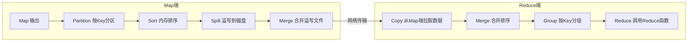

## 1. MapReduce编程模型

MapReduce 是一种**分而治之**的分布式计算模型，将复杂计算分解为 Map（映射）和 Reduce（归约）两个阶段。

### 1.1 核心思想

```
输入数据 ──→ [Split] ──→ [Map] ──→ [Shuffle] ──→ [Reduce] ──→ 输出
              分片       映射       洗牌         归约
```

**函数签名**：

$$\text{Map}: (k_1, v_1) \rightarrow \text{list}(k_2, v_2)$$

$$\text{Reduce}: (k_2, \text{list}(v_2)) \rightarrow \text{list}(k_3, v_3)$$

### 1.2 WordCount 示例

```java
public class WordCount {
    public static class TokenizerMapper
        extends Mapper<Object, Text, Text, IntWritable> {

        private final static IntWritable one = new IntWritable(1);
        private Text word = new Text();

        public void map(Object key, Text value, Context context)
            throws IOException, InterruptedException {
            StringTokenizer itr = new StringTokenizer(value.toString());
            while (itr.hasMoreTokens()) {
                word.set(itr.nextToken());
                context.write(word, one);
            }
        }
    }

    public static class IntSumReducer
        extends Reducer<Text, IntWritable, Text, IntWritable> {

        private IntWritable result = new IntWritable();

        public void reduce(Text key, Iterable<IntWritable> values,
                           Context context)
            throws IOException, InterruptedException {
            int sum = 0;
            for (IntWritable val : values) {
                sum += val.get();
            }
            result.set(sum);
            context.write(key, result);
        }
    }
}
```

**数据流**：

```
输入: "hello world hello hadoop"

Map阶段:
  "hello" → (hello, 1)
  "world" → (world, 1)
  "hello" → (hello, 1)
  "hadoop" → (hadoop, 1)

Shuffle阶段:
  (hello, [1, 1])
  (world, [1])
  (hadoop, [1])

Reduce阶段:
  (hello, 2)
  (world, 1)
  (hadoop, 1)
```

## 2. Shuffle机制详解

Shuffle 是 MapReduce 的**核心**，连接 Map 和 Reduce 阶段，包括分区、排序、分组和数据传输。

### 2.1 Shuffle全流程



### 2.2 Map端Shuffle

1. **环形缓冲区**：Map 输出写入内存环形缓冲区（默认100MB）
2. **分区（Partition）**：根据 `hash(key) % numReduceTasks` 决定数据归属
3. **排序（Sort）**：缓冲区达到阈值（0.8）时，对分区内的数据按 Key 排序
4. **溢写（Spill）**：排序后的数据写入磁盘临时文件
5. **合并（Merge）**：所有溢写文件合并为一个已排序的输出文件

### 2.3 Reduce端Shuffle

1. **拉取（Copy）**：Reduce 任务从所有 Map 输出中拉取属于自己的分区数据
2. **合并排序（Merge Sort）**：对拉取的数据进行归并排序
3. **分组（Group）**：相同 Key 的 Value 组成迭代器传给 Reduce 函数

### 2.4 分区策略

默认分区函数：

$$\text{partition} = \text{hash}(k_2) \bmod R$$

其中 $R$ 为 Reduce 任务数。自定义分区器需实现 `Partitioner` 接口：

```java
public class CustomPartitioner extends Partitioner<Text, IntWritable> {
    @Override
    public int getPartition(Text key, IntWritable value, int numReduceTasks) {
        if (key.toString().startsWith("A-M")) return 0;
        else return 1 % numReduceTasks;
    }
}
```

## 3. Combiner优化

### 3.1 Combiner原理

Combiner 是 Map 端的**局部 Reduce**，在数据发送到 Reduce 端之前进行预聚合，减少网络传输量。

```mermaid
flowchart LR
    M1[Map: hello,1 ×3] -->|网络| R1[Reduce: hello,[1,1,1] → hello,3]
    M2[Map: hello,1 ×3] --> C2[Combiner: hello,3] -->|网络| R2[Reduce: hello,[3] → hello,3]
```

### 3.2 Combiner使用约束

- **幂等性**：Combiner 的输入输出类型必须一致
- **可交换可结合**：操作必须满足交换律和结合律（如求和、最大值）
- **不保证执行**：框架可能不调用 Combiner，或调用多次
- **不适合求平均数**：$\text{avg}(\text{avg}(a,b), c) \neq \text{avg}(a,b,c)$

## 4. MapReduce执行流程

### 4.1 完整执行阶段

```
1. 作业提交
   Client → JobTracker/ResourceManager

2. 作业初始化
   创建Job对象，获取InputSplit列表

3. 任务分配
   TaskTracker/NodeManager领取Map/Reduce任务

4. 任务执行
   Map Task: InputSplit → Map → Shuffle
   Reduce Task: Shuffle → Sort → Reduce → Output

5. 作业完成
   所有任务完成，作业状态更新为SUCCEEDED
```

### 4.2 InputFormat与Split

| InputFormat             | 说明                  |
| :---------------------- | :-------------------- |
| TextInputFormat         | 按行读取，Key为偏移量 |
| KeyValueTextInputFormat | 按分隔符分割Key/Value |
| NLineInputFormat        | 每N行一个Split        |
| CombineFileInputFormat  | 合并小文件            |

Split 大小计算：

$$\text{splitSize} = \max(\text{minSize}, \min(\text{maxSize}, \text{blockSize}))$$

## 5. 性能调优

### 5.1 关键调优参数

| 参数                                      | 说明             | 建议值 |
| :---------------------------------------- | :--------------- | :----- |
| `mapreduce.task.io.sort.mb`               | Map端排序缓冲区  | 256MB  |
| `mapreduce.map.sort.spill.percent`        | 溢写阈值         | 0.8    |
| `mapreduce.reduce.shuffle.parallelcopies` | Reduce并行拉取数 | 5~10   |
| `mapreduce.reduce.input.buffer.percent`   | Reduce内存缓冲   | 0.7    |
| `mapreduce.map.memory.mb`                 | Map任务内存      | 2048MB |
| `mapreduce.reduce.memory.mb`              | Reduce任务内存   | 4096MB |

### 5.2 常见优化策略

1. **小文件合并**：使用 CombineFileInputFormat 或预处理合并
2. **数据压缩**：Map 输出使用 Snappy，Reduce 输出使用 Gzip
3. **Combiner 使用**：Map 端预聚合减少网络 IO
4. **推测执行**：慢任务启动备份任务（`mapreduce.map.speculative`）
5. **JVM 重用**：复用 JVM 减少启动开销
## MapReduce 命令

**基本写法：运行 MapReduce 作业**
`hadoop jar <jar包> <主类> <输入路径> <输出路径>`

```bash
# 运行 WordCount 示例
hadoop jar hadoop-mapreduce-examples.jar wordcount /input /output
```

---

**基本写法：查看作业列表**
`mapred job -list`

```bash
# 查看正在运行的作业
mapred job -list
```

---

**基本写法：杀死作业**
`mapred job -kill <作业ID>`

```bash
# 终止指定作业
mapred job -kill job_1234567890_0001
```

---

**基本写法：查看作业状态**
`mapred job -status <作业ID>`

```bash
# 查看作业详细状态
mapred job -status job_1234567890_0001
```

---

## Mapper 实现

**换行写法：Python Mapper 实现**
`#!/usr/bin/env python3`
`import sys`
`for line in sys.stdin:`
`    <处理逻辑>`
`    print(f"{<key>}\t{<value>}")`

```python
#!/usr/bin/env python3
# WordCount Mapper
import sys

for line in sys.stdin:
    words = line.strip().split()
    for word in words:
        print(f"{word}\t1")
```

---

**换行写法：Java Mapper 实现**
`public class <Mapper类> extends Mapper<KEYIN, VALUEIN, KEYOUT, VALUEOUT> {`
`    protected void map(KEYIN key, VALUEIN value, Context context) {`
`        <处理逻辑>`
`    }`
`}`

```java
// Java WordCount Mapper
public class WordCountMapper extends Mapper<LongWritable, Text, Text, IntWritable> {
    private final static IntWritable one = new IntWritable(1);
    private Text word = new Text();

    @Override
    protected void map(LongWritable key, Text value, Context context) throws IOException, InterruptedException {
        String[] words = value.toString().split("\\s+");
        for (String w : words) {
            word.set(w);
            context.write(word, one);
        }
    }
}
```

---

## Reducer 实现

**换行写法：Python Reducer 实现**
`#!/usr/bin/env python3`
`import sys`
`from collections import defaultdict`
`counts = defaultdict(int)`
`for line in sys.stdin:`
`    key, value = line.strip().split("\t")`
`    counts[key] += int(value)`
`for key, count in counts.items():`
`    print(f"{key}\t{count}")`

```python
#!/usr/bin/env python3
# WordCount Reducer
import sys
from collections import defaultdict

counts = defaultdict(int)
for line in sys.stdin:
    key, value = line.strip().split("\t")
    counts[key] += int(value)

for key, count in counts.items():
    print(f"{key}\t{count}")
```

---

**换行写法：Java Reducer 实现**
`public class <Reducer类> extends Reducer<KEYIN, VALUEIN, KEYOUT, VALUEOUT> {`
`    protected void reduce(KEYIN key, Iterable<VALUEIN> values, Context context) {`
`        <聚合逻辑>`
`    }`
`}`

```java
// Java WordCount Reducer
public class WordCountReducer extends Reducer<Text, IntWritable, Text, IntWritable> {
    private IntWritable result = new IntWritable();

    @Override
    protected void reduce(Text key, Iterable<IntWritable> values, Context context) throws IOException, InterruptedException {
        int sum = 0;
        for (IntWritable val : values) {
            sum += val.get();
        }
        result.set(sum);
        context.write(key, result);
    }
}
```

---

## 使用 Hadoop Streaming

**基本写法：运行 Streaming 作业**
`hadoop jar streaming.jar -input <输入> -output <输出> -mapper <mapper脚本> -reducer <reducer脚本>`

```bash
# 使用 Python 运行 MapReduce
hadoop jar hadoop-streaming.jar \
    -input /input \
    -output /output \
    -mapper mapper.py \
    -reducer reducer.py \
    -file mapper.py \
    -file reducer.py
```

---

**基本写法：指定 Java 类**
`hadoop jar streaming.jar -mapper <Java类> -reducer <Java类>`

```bash
# 指定 Java 类作为 Mapper/Reducer
hadoop jar hadoop-streaming.jar \
    -input /input \
    -output /output \
    -mapper "com.example.Mapper" \
    -reducer "com.example.Reducer"
```

---

**基本写法：设置环境变量**
`hadoop jar streaming.jar -cmdenv <变量名>=<值>`

```bash
# 设置环境变量
hadoop jar hadoop-streaming.jar \
    -input /input -output /output \
    -mapper mapper.py -reducer reducer.py \
    -cmdenv PYTHONPATH=/usr/lib/python3
```

---

## Combiner 优化

**基本写法：设置 Combiner**
`hadoop jar streaming.jar -combiner <combiner脚本>`

```bash
# 使用 Combiner 减少数据传输
hadoop jar hadoop-streaming.jar \
    -input /input -output /output \
    -mapper mapper.py \
    -combiner reducer.py \
    -reducer reducer.py \
    -file mapper.py -file reducer.py
```

---

## Partitioner 分区

**基本写法：设置 Partitioner**
`hadoop jar streaming.jar -partitioner <分区类>`

```bash
# 自定义分区器
hadoop jar hadoop-streaming.jar \
    -input /input -output /output \
    -mapper mapper.py -reducer reducer.py \
    -partitioner org.apache.hadoop.mapreduce.lib.partition.HashPartitioner \
    -numReduceTasks 3
```

---

## 知识讲解与要点分析（原作业配置）

**基本写法：设置 Reduce 任务数**
`-D mapreduce.job.reduces=<数量>`

```bash
# 设置 Reduce 任务数为 5
hadoop jar hadoop-streaming.jar \
    -D mapreduce.job.reduces=5 \
    -input /input -output /output \
    -mapper mapper.py -reducer reducer.py
```

---

**基本写法：设置输入格式**
`-D mapreduce.job.inputformat.class=<输入格式类>`

```bash
# 指定输入格式
hadoop jar hadoop-streaming.jar \
    -inputformat org.apache.hadoop.mapreduce.lib.input.TextInputFormat \
    -input /input -output /output \
    -mapper mapper.py -reducer reducer.py
```

---

**基本写法：设置输出格式**
`-D mapreduce.job.outputformat.class=<输出格式类>`

```bash
# 指定输出格式
hadoop jar hadoop-streaming.jar \
    -outputformat org.apache.hadoop.mapreduce.lib.output.TextOutputFormat \
    -input /input -output /output \
    -mapper mapper.py -reducer reducer.py
```

---

## 实战示例

**换行写法：词频统计完整流程**
`hadoop jar streaming.jar \`
`    -input /input \`
`    -output /output \`
`    -mapper "python3 mapper.py" \`
`    -reducer "python3 reducer.py" \`
`    -file mapper.py \`
`    -file reducer.py`

```bash
# 完整的词频统计命令
hadoop jar /opt/hadoop/share/hadoop/tools/lib/hadoop-streaming-3.3.6.jar \
    -input /user/hadoop/input \
    -output /user/hadoop/output \
    -mapper "python3 mapper.py" \
    -reducer "python3 reducer.py" \
    -file mapper.py \
    -file reducer.py \
    -D mapreduce.job.reduces=2
```

---

**换行写法：去重 MapReduce**
`mapper: print(line.strip())`
`reducer: print(key)`

```python
# 去重 Mapper
import sys
for line in sys.stdin:
    print(line.strip())

# 去重 Reducer  
import sys
last_key = None
for line in sys.stdin:
    key = line.strip()
    if key != last_key:
        print(key)
        last_key = key
```

---

**换行写法：排序 MapReduce**
`mapper: print(f"{int(line.strip())}\t")`
`reducer: 依次输出`

```python
# 排序 Mapper（利用 Shuffle 自动排序）
import sys
for line in sys.stdin:
    num = int(line.strip())
    print(f"{num}\t")

# 排序 Reducer
import sys
for line in sys.stdin:
    num = line.strip().split("\t")[0]
    print(num)
```

---

**换行写法：自定义计数器**
`context.getCounter(<组名>, <计数器名>).increment(1)`

```java
// 在 Java Mapper/Reducer 中使用计数器
context.getCounter("Custom", "TotalRecords").increment(1);
context.getCounter("Custom", "ValidRecords").increment(1);
```

## 参考文献

Apache Spark：https://spark.apache.org/docs/latest/
Apache Flink：https://flink.apache.org/
Apache Kafka：https://kafka.apache.org/documentation/
ClickHouse：https://clickhouse.com/docs
Airflow：https://airflow.apache.org/docs/

## 延伸阅读

大数据生态概览，见 052-big-data 模块文档。
数据分析与统计，见 051-data-analysis/030-probability-statistics 模块。
分布式系统基础，见 034-cloud-computing 模块。
尚硅谷 Bilibili 空间（https://space.bilibili.com/302417610 ）提供大数据课程。

## 模块文档速查表

| 文档 | 主题 | 与本文的关联 |
| --- | --- | --- |
| 大数据概述 | 001-DataOverview | 本文的前置基础 |
| HDFS分布式文件系统 | 002-HDFSDistributedFileSystem | 本文的并列主题 |
| MapReduce | 003-MapReduce | 本文自身 |
| Spark核心 | 004-SparkCore | 本文的并列主题 |
| Spark-Streaming | 005-SparkStreaming | 本文的并列主题 |
| Hive数据仓库 | 006-HiveDataWarehouse | 本文的并列主题 |
| HBase列族数据库 | 007-HBaseDatabase | 本文的并列主题 |
| Kafka消息队列 | 008-KafkaMessageQueue | 本文的并列主题 |
| Flink流处理 | 009-FlinkStreamHandling | 本文的并列主题 |
| 数据湖 | 010-DataLake | 本文的并列主题 |
| Zookeeper协调服务 | 011-Zookeeper | 本文的并列主题 |
| YARN资源管理 | 012-YARNManagement | 本文的并列主题 |
| 大数据 HDFS 命令 | 013-HDFSCommands | 本文的并列主题 |
| 大数据 YARN 命令 | 014-YARNCommands | 本文的并列主题 |
| 大数据 Spark RDD | 015-SparkRDD | 本文的并列主题 |
| 大数据 Spark DataFrame | 016-SparkDataFrame | 本文的并列主题 |
| 大数据 Hive DDL | 017-HiveDDL | 本文的并列主题 |
| 大数据 Hive DML | 018-HiveDML | 本文的并列主题 |
| 大数据 Hive 函数 | 019-HiveFunctions | 本文的并列主题 |
| 大数据 Kafka 命令 | 020-KafkaCommands | 本文的并列主题 |
| 大数据 HBase 命令 | 021-HBaseCommands | 本文的并列主题 |
| 大数据 Flink 流处理 | 022-FlinkBasics | 本文的并列主题 |
| 大数据 Spark 优化 | 023-SparkOptimization | 本文的性能延伸 |
