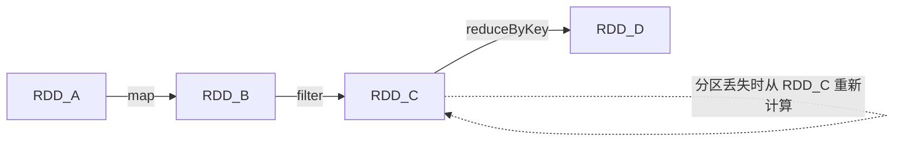
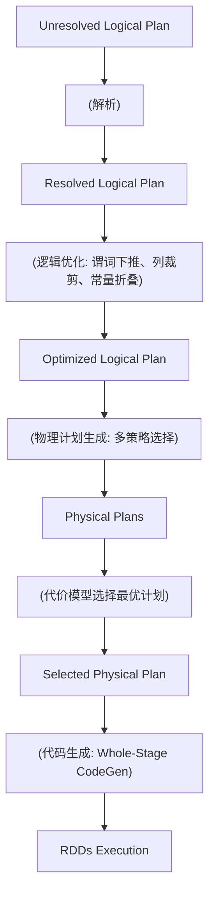
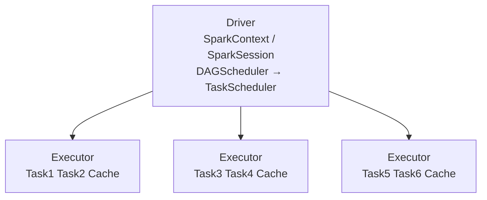

## 1. Spark概述

Apache Spark 是一个**统一的分布式计算引擎**，基于内存计算提供比 MapReduce 快 10~100 倍的性能。

### 1.1 Spark核心特性

| 特性        | 说明                                |
| :---------- | :---------------------------------- |
| 内存计算    | 中间结果缓存在内存，减少磁盘IO      |
| DAG执行引擎 | 优化执行计划，减少Shuffle           |
| 统一API     | 批处理、流处理、ML、图计算统一接口  |
| 多语言支持  | Scala、Java、Python、R              |
| 生态丰富    | Spark SQL、Streaming、MLlib、GraphX |

### 1.2 Spark vs MapReduce

| 维度     | MapReduce            | Spark         |
| :------- | :------------------- | :------------ |
| 计算模式 | 磁盘中间结果         | 内存中间结果  |
| 执行模型 | 两阶段（Map/Reduce） | DAG多阶段     |
| 迭代计算 | 每次迭代写磁盘       | 内存缓存复用  |
| 延迟     | 分钟级               | 秒级          |
| 编程模型 | Map/Reduce函数       | 丰富的算子API |

## 2. RDD弹性分布式数据集

RDD（Resilient Distributed Dataset）是 Spark 最基本的**抽象**，代表一个不可变、分区的、容错的分布式对象集合。

### 2.1 RDD核心属性

1. **分区列表（Partitions）**：数据集的分片，每个分片对应一个计算任务
2. **计算函数（Compute）**：每个分区的计算逻辑
3. **依赖列表（Dependencies）**：RDD 之间的血缘关系
4. **分区器（Partitioner）**：Key-Value 类型 RDD 的分区策略
5. **首选位置（Preferred Locations）**：分区计算的优先位置（数据本地性）

### 2.2 RDD创建方式

```python
# 1. 从集合创建
rdd = sc.parallelize([1, 2, 3, 4, 5], numSlices=3)

# 2. 从外部存储创建
rdd = sc.textFile("hdfs://path/to/file")

# 3. 从其他RDD转换
rdd2 = rdd.map(lambda x: x * 2)
```

### 2.3 RDD操作类型

**转换（Transformation）**——懒执行，构建DAG：

| 算子          | 说明       | Shuffle |
| :------------ | :--------- | :------ |
| `map`         | 逐元素转换 | 否      |
| `filter`      | 过滤元素   | 否      |
| `flatMap`     | 展平转换   | 否      |
| `union`       | 合并RDD    | 否      |
| `groupByKey`  | 按Key分组  | **是**  |
| `reduceByKey` | 按Key聚合  | **是**  |
| `join`        | 关联操作   | **是**  |
| `distinct`    | 去重       | **是**  |
| `repartition` | 重新分区   | **是**  |

**行动（Action）**——触发执行：

| 算子             | 说明                 |
| :--------------- | :------------------- |
| `collect`        | 收集所有元素到Driver |
| `count`          | 计数                 |
| `reduce`         | 聚合                 |
| `saveAsTextFile` | 保存到文件           |
| `take(n)`        | 取前n个元素          |
| `foreach`        | 遍历每个元素         |

### 2.4 RDD血缘与容错

RDD 通过**血缘（Lineage）**实现容错，而非数据复制：



窄依赖（Narrow Dependency） vs 宽依赖（Wide Dependency）：

| 类型   | 定义                       | 容错成本               | 示例             |
| :----- | :------------------------- | :--------------------- | :--------------- |
| 窄依赖 | 父分区最多被一个子分区使用 | 低（重新计算单个分区） | map、filter      |
| 宽依赖 | 父分区被多个子分区使用     | 高（需重新Shuffle）    | groupByKey、join |

## 3. DataFrame与Dataset

### 3.1 DataFrame

DataFrame 是以**命名列**组织的分布式数据集，类似于关系数据库中的表：

```python
# 从JSON创建
df = spark.read.json("people.json")

# DataFrame操作
df.select("name", "age").filter(df.age > 20).groupBy("name").count()

# SQL查询
df.createOrReplaceTempView("people")
spark.sql("SELECT name, COUNT(*) FROM people WHERE age > 20 GROUP BY name")
```

### 3.2 Dataset

Dataset 是 DataFrame 的**类型安全**版本（Scala/Java）：

```scala
case class Person(name: String, age: Long)
val ds: Dataset[Person] = spark.read.json("people.json").as[Person]
ds.filter(p => p.age > 20).map(p => p.name)
```

### 3.3 RDD vs DataFrame vs Dataset

| 维度     | RDD       | DataFrame           | Dataset             |
| :------- | :-------- | :------------------ | :------------------ |
| 类型安全 | 编译期    | 运行期              | 编译期              |
| 优化     | 无        | Catalyst + Tungsten | Catalyst + Tungsten |
| 序列化   | Java/Kryo | Tungsten二进制      | Tungsten二进制      |
| GC开销   | 高        | 低                  | 低                  |
| API      | 函数式    | SQL/DSL             | SQL/DSL/函数式      |

## 4. Spark SQL与Catalyst优化器

### 4.1 Catalyst优化器

Catalyst 是 Spark SQL 的核心优化引擎，基于**规则优化**和**代价优化**：



### 4.2 常见优化规则

| 优化规则                       | 说明               | 效果              |
| :----------------------------- | :----------------- | :---------------- |
| 谓词下推（Predicate Pushdown） | 将过滤条件尽早执行 | 减少数据处理量    |
| 列裁剪（Column Pruning）       | 只读取需要的列     | 减少IO            |
| 常量折叠（Constant Folding）   | 预计算常量表达式   | 减少运行时计算    |
| Join重排序                     | 小表驱动大表       | 减少Shuffle数据量 |
| Broadcast Join                 | 小表广播到所有节点 | 避免Shuffle       |

### 4.3 Whole-Stage CodeGen

将多个物理算子融合为**单个Java函数**，消除虚函数调用：

```java
// 无CodeGen: 虚函数调用
while (rows.hasNext()) {
    Row row = filter.next(rows.next());  // 虚函数调用
    if (row != null) {
        project.next(row);               // 虚函数调用
    }
}

// 有CodeGen: 融合为单函数
while (rows.hasNext()) {
    InternalRow row = rows.next();
    if (row.getInt(0) > 10) {            // 内联过滤
        result.setInt(0, row.getString(1)); // 内联投影
    }
}
```

## 5. Spark运行架构

### 5.1 核心组件



### 5.2 作业执行层次

$$\text{Application} \supset \text{Job} \supset \text{Stage} \supset \text{Task}$$

| 概念        | 触发         | 说明                      |
| :---------- | :----------- | :------------------------ |
| Application | spark-submit | 一个Spark应用程序         |
| Job         | action算子   | 一个行动操作触发一个Job   |
| Stage       | Shuffle边界  | 被Shuffle依赖划分的阶段   |
| Task        | 分区         | Stage中单个分区的计算任务 |

### 5.3 内存管理

Spark Executor 内存划分：

$$\text{Executor Memory} = \text{Reserved} + \text{Unified}(\text{Storage} + \text{Execution})$$

| 区域             | 默认比例       | 用途                |
| :--------------- | :------------- | :------------------ |
| Reserved Memory  | 300MB          | Spark内部使用       |
| Storage Memory   | 50% of Unified | 缓存RDD/DataFrame   |
| Execution Memory | 50% of Unified | Shuffle、排序、Join |
| User Memory      | 未分配区域     | 用户数据结构        |

## 参考文献


Apache Spark：https://spark.apache.org/docs/latest/
Apache Flink：https://flink.apache.org/
Apache Kafka：https://kafka.apache.org/documentation/
ClickHouse：https://clickhouse.com/docs
Airflow：https://airflow.apache.org/docs/

## 延伸阅读


大数据生态概览，见 052-big-data 模块文档。
数据分析与统计，见 051-data-analysis/030-probability-statistics 模块。
分布式系统基础，见 034-cloud-computing 模块。
尚硅谷 Bilibili 空间（https://space.bilibili.com/302417610 ）提供大数据课程。

## 深度专题扩展


以下专题从不同角度深入本文主题，供有进阶需求的读者研读。每个专题独立成节，内容相互补充。

### 13.1 流处理语义深入

At-most-once：可能丢；At-least-once：可能重；Exactly-once：端到端精确一次需事务/幂等。
状态后端：RocksDB 本地状态 + checkpoint 快照；重启恢复。
窗口：滚动（固定）、滑动（重叠）、会话（空闲间隔）；触发条件（水位线 + 允许迟到）。
实践：幂等写入 + 去重键（事件 ID）兜底。

### 13.2 数据仓库建模

维度建模：事实表（度量、外键）+ 维度表（描述）；星型模型查询友好。
分层：ODS 原样、DWD 明细清洗、DWS 汇总、ADS 应用。
缓慢变化维度（SCD）：覆盖（1）、新增行（2）、新增列（3）。
建模工具：dbt 实现 ELT 与测试；血缘可视化。

## 模块文档速查表

| 文档 | 主题 | 与本文的关联 |
| --- | --- | --- |
| 大数据概述 | 001-DataOverview | 本文的前置基础 |
| HDFS分布式文件系统 | 002-HDFSDistributedFileSystem | 本文的并列主题 |
| MapReduce | 003-MapReduce | 本文的并列主题 |
| Spark核心 | 004-SparkCore | 本文自身 |
| Spark-Streaming | 005-SparkStreaming | 本文的并列主题 |
| Hive数据仓库 | 006-HiveDataWarehouse | 本文的并列主题 |
| HBase列族数据库 | 007-HBaseDatabase | 本文的并列主题 |
| Kafka消息队列 | 008-KafkaMessageQueue | 本文的并列主题 |
| Flink流处理 | 009-FlinkStreamHandling | 本文的并列主题 |
| 数据湖 | 010-DataLake | 本文的并列主题 |
| Zookeeper协调服务 | 011-Zookeeper | 本文的并列主题 |
| YARN资源管理 | 012-YARNManagement | 本文的并列主题 |
| 大数据 HDFS 命令 | 013-HDFSCommands | 本文的并列主题 |
| 大数据 YARN 命令 | 014-YARNCommands | 本文的并列主题 |
| 大数据 Spark RDD | 015-SparkRDD | 本文的并列主题 |
| 大数据 Spark DataFrame | 016-SparkDataFrame | 本文的并列主题 |
| 大数据 Hive DDL | 017-HiveDDL | 本文的并列主题 |
| 大数据 Hive DML | 018-HiveDML | 本文的并列主题 |
| 大数据 Hive 函数 | 019-HiveFunctions | 本文的并列主题 |
| 大数据 Kafka 命令 | 020-KafkaCommands | 本文的并列主题 |
| 大数据 HBase 命令 | 021-HBaseCommands | 本文的并列主题 |
| 大数据 Flink 流处理 | 022-FlinkBasics | 本文的并列主题 |
| 大数据 Spark 优化 | 023-SparkOptimization | 本文的性能延伸 |
